# ① Docker 概述

## 1.1 Docker产生的起因

> Docker产生之前所存在的问题

-  一款产品： 开发–上线 两套环境！应用环境，应用配置！及其麻烦
-  开发 — 运维。 问题：不同的人的电脑环境不同，所以就会出现**我的电脑能运行**问题，**版本更新，导致服务不可用**！对于运维来说考验十分大？  

-  环境配置是十分的麻烦，每一个集群都要部署环境(集群Redis、ES、Hadoop…) !费事费力。 

-  之前在服务器配置一个应用的环境 Redis MySQL JDK ES Hadoop 配置超麻烦了，不能够跨平台。 
-  开发环境Windows，最后发布到Linux！ 

> 提问： 发布一个项目( jar + (Redis MySQL JDK ES) ),项目能不能带上环境安装打包？

传统：开发jar，运维来做！

现在：开发打包部署上线，一套流程做完！

安卓流程：java — apk —发布（应用商店）一 用户使用apk一安装即可用！

docker流程： java-jar（环境） — 打包项目帯上环境（镜像） — ( Docker仓库：商店）

**Docker的思想就来自于集装箱**

- JRE – 多个应用(端口冲突) – 原来都是交叉的！
- **隔离**：Docker核心思想！打包装箱！每个箱子是互相隔离的。

- Docker通过隔离机制，可以将服务器利用到极致！

本质：所有的技术都是因为出现了一些问题，我们需要去解决，才去学习！

## 1.2 Docker的历史

2010年，几个的年轻人，就在美国成立了一家公司 `dotcloud`，做一些pass的云计算服务！LXC（Linux Container容器）有关的容器技术！ **Linux Container容器是一种内核虚拟化技术，可以提供轻量级的虚拟化，以便隔离进程和资源。**  他们将自己的技术（容器化技术）命名就是 Docker。Docker刚刚延生的时候，没有引起行业的注意！dotCloud，就活不下去！ 

> 开源

2013年，Docker开源！

越来越多的人发现docker的优点！火了。Docker每个月都会更新一个版本！

2014年4月9日，Docker1.0发布！

docker为什么这么火？十分的轻巧！

在容器技术出来之前，我们都是使用虚拟机技术！

虚拟机：在window中装一个VMware，通过这个软件我们可以虚拟出来一台或者多台电脑！笨重！

虚拟机也属于虚拟化技术，Docker容器技术，也是一种虚拟化技术！

```java
VMware : linux centos 原生镜像（一个电脑！） 隔离、需要开启多个虚拟机！ 内存几个G 启动几分钟
docker: 隔离，镜像（最核心的环境 4m + jdk + mysql）十分的小巧，运行镜像就可以了！小巧！ 内存几个M 秒级启动！
```

> Docker的一些网址

Docker基于Go语言开发的！开源项目！

docker官网：https://www.docker.com/

文档：https://docs.docker.com/ Docker的文档是超级详细的！

仓库：https://hub.docker.com/

## 1.3 Docker的用处

>  比较Docker和虚拟机技术 

**之前的虚拟机技术**


1、 资源占用十分多

2、 冗余步骤多

3、 启动很慢！

**容器化技术**

 容器化技术不是模拟一个完整的操作系统 


比较Docker和虚拟机技术的不同：

- 传统虚拟机，虚拟出一条硬件，运行一个完整的操作系统，然后在这个系统上安装和运行软件
- 容器内的应用直接运行在宿主机的内容，容器是没有自己的内核的，也没有虚拟我们的硬件，所以就轻便了
- 每个容器间是互相隔离，每个容器内都有一个属于自己的文件系统，互不影响

>  DevOps（开发、运维） 

**应用更快速的交付和部署**

传统：一对帮助文档，安装程序。

Docker：打包镜像发布测试一键运行。

**更便捷的升级和扩缩容**

使用了 Docker之后，我们部署应用就和搭积木一样
项目打包为一个镜像，扩展服务器A！服务器B

**更简单的系统运维**
在容器化之后，我们的开发，测试环境都是高度一致的

**更高效的计算资源利用**

Docker是内核级别的虚拟化，可以在一个物理机上可以运行很多的容器实例！服务器的性能可以被压榨到极致。

# ② Docker 安装

## 2.1 Docker的基本组成


-----

> **镜像（image)**：

docker镜像就好比是一个模板，可以通过这个模板来创建容器服务，

tomcat镜像==>run==>容器（提供服务器），

通过这个镜像可以创建多个容器（最终服务运行或者项目运行就是在容器中的）。

> **容器(container)**：

Docker利用容器技术，独立运行一个或者一组应用，通过镜像来创建的.

启动，停止，删除，基本命令

目前就可以把这个容器理解为就是一个简易的 Linux系统。

> **仓库(repository)**：

仓库就是存放镜像的地方！

仓库分为公有仓库和私有仓库。(很类似git)

Docker Hub是国外的。

阿里云…都有容器服务器(配置镜像加速!)

## 2.2 Docker安装

> **环境查看**

```bash
# 内核版本需要3.0以上
[root@cVzhanshi /]# uname -r
3.10.0-1160.el7.x86_64

# Centos版本要7以上
[root@cVzhanshi /]# cat /etc/os-release 
NAME="CentOS Linux"
VERSION="7 (Core)"
ID="centos"
ID_LIKE="rhel fedora"
VERSION_ID="7"
PRETTY_NAME="CentOS Linux 7 (Core)"
ANSI_COLOR="0;31"
CPE_NAME="cpe:/o:centos:centos:7"
HOME_URL="https://www.centos.org/"
BUG_REPORT_URL="https://bugs.centos.org/"

CENTOS_MANTISBT_PROJECT="CentOS-7"
CENTOS_MANTISBT_PROJECT_VERSION="7"
REDHAT_SUPPORT_PRODUCT="centos"
REDHAT_SUPPORT_PRODUCT_VERSION="7"
```

> **安装**

```bash
# 前提环境安装gcc/g++
yum -y install gcc
yum -y install gcc-c++

#1.卸载旧版本
yum remove docker \
                  docker-client \
                  docker-client-latest \
                  docker-common \
                  docker-latest \
                  docker-latest-logrotate \
                  docker-logrotate \
                  docker-engine
#2.需要的安装包
yum install -y yum-utils

#3.设置镜像的仓库
yum-config-manager \
    --add-repo \
    https://download.docker.com/linux/centos/docker-ce.repo
#上述方法默认是从国外的，不推荐

#推荐使用国内的
yum-config-manager \
    --add-repo \
    https://mirrors.aliyun.com/docker-ce/linux/centos/docker-ce.repo
    
#更新yum软件包索引
yum makecache fast

#4.安装docker相关的 docker-ce 社区版 而ee是企业版
yum install -y docker-ce docker-ce-cli containerd.io # 这里我们使用社区版即可

#5.启动docker
systemctl start docker
```

```bash
#6. 使用docker version查看是否按照成功
docker version
```


```bash
#7. 测试
docker run hello-world
```


```bash
#8.查看已经下载的镜像(从这里可以查看已有镜像的id)
docker images
```


> **卸载docker**

```bash
# 1、依赖卸载
yum remove docker-ce docker-ce-cli containerd.io

# 2、删除资源
rm -rf /var/lib/docker

# /var/lib/docker docker的默认工作路径
```

## 2.3 阿里云镜像加速

- 登录阿里云，打开 **容器镜像服务** 


```bash
sudo mkdir -p /etc/docker
sudo tee /etc/docker/daemon.json <<-'EOF'
{
  "registry-mirrors": ["https://qglmraxo.mirror.aliyuncs.com"]
}
EOF
sudo systemctl daemon-reload
sudo systemctl restart docker
```

## 2.4 回顾Hello World流程


run的流程图：


## 2.5 底层原理

> **Docker是怎么工作的？**

- Docker是一个Client-Server结构的系统，Docker的守护进程运行在主机上，通过Socket从客户端访问！

  DockerServer接收到Docker-Client的指令，就会执行这个命令！


>  **为什么Docker比Vm快？**

- docker有着比虚拟机更少的抽象层。由于docker不需要Hypervisor实现硬件资源虚拟化,运行在docker容器上的程序直接使用的都是实际物理机的硬件资源。因此在CPU、内存利用率上docker将会在效率上有明显优势。
- docker利用的是宿主机的内核,而不需要Guest OS。


其中 GuestOS： VM（虚拟机）里的的系统（OS） 

​		 HostOS：物理机里的系统（OS） 

- 因此,当新建一个 容器时,docker不需要和虚拟机一样重新加载一个操作系统内核。仍而避免引导、加载操作系统内核返个比较费时费资源的过程,当新建一个虚拟机时,**虚拟机软件需要加载GuestOS,返个新建过程是分钟级别的**。而docker由于直接利用宿主机的操作系统,则省略了这个复杂的过程,因此新建一个docker容器**只需要几秒钟**。

# ③ Docker的常用命令

## 3.1 帮助命令

```bash
docker version    #显示docker的版本信息。
docker info       #显示docker的系统信息，包括镜像和容器的数量
docker 命令 --help #帮助命令
```

>  帮助文档的地址： https://docs.docker.com/engine/reference/commandline/docker/

## 3.2 镜像命令

>  **docker images**  *#查看所有本地主机上的镜像 可以使用docker image ls代替* 

```bash
[root@cVzhanshi /]# docker images
REPOSITORY    TAG       IMAGE ID       CREATED        SIZE
hello-world   latest    d1165f221234   5 months ago   13.3kB

# 解释
REPOSITORY  # 镜像的仓库源
TAG         # 镜像的标签  ---lastest 表示最新版本
IMAGE ID    # 镜像的id
CREATED     # 镜像的创建时间

# 可选项
-a, --all      # 列出所有的镜像
-q, --quiet    # 只显示镜像的id

[root@cVzhanshi /]# docker images -a   #列出所有镜像详细信息
REPOSITORY    TAG       IMAGE ID       CREATED        SIZE
hello-world   latest    d1165f221234   5 months ago   13.3kB
[root@cVzhanshi /]# docker images -aq  #列出所有镜像的id
d1165f221234

```

>  **docker search** 搜索镜像 


```bash
docker  search mysql 

# 可选项
--filter , -f		过滤
--filter=STARS=3000 #过滤，搜索出来的镜像收藏STARS数量大于3000的

[root@cVzhanshi /]# docker search mysql --filter=STARS=3000
NAME      DESCRIPTION                                     STARS     OFFICIAL   AUTOMATED
mysql     MySQL is a widely used, open-source relation…   11296     [OK]       
mariadb   MariaDB Server is a high performing open sou…   4291      [OK] 
```

>  **docker pull** 下载镜像 

```bash
# 下载镜像 docker pull 镜像名[:tag]
[root@cVzhanshi /]# docker pull mysql
Using default tag: latest # 如果不写tag,默认就是latest
latest: Pulling from library/mysql
e1acddbe380c: Pull complete   # 分层下载，docker image的核心 联合文件系统
bed879327370: Pull complete 
03285f80bafd: Pull complete 
ccc17412a00a: Pull complete 
1f556ecc09d1: Pull complete 
adc5528e468d: Pull complete 
1afc286d5d53: Pull complete 
6c724a59adff: Pull complete 
0f2345f8b0a3: Pull complete 
c8461a25b23b: Pull complete 
3adb49279bed: Pull complete 
77f22cd6c363: Pull complete 
Digest: sha256:d45561a65aba6edac77be36e0a53f0c1fba67b951cb728348522b671ad63f926 # 签名
Status: Downloaded newer image for mysql:latest
docker.io/library/mysql:latest   # 真实地址

# 两条命令等价
docker pull mysql
docker pull docker.io/library/mysql:latest

# 指定版本下载
docker pull mysql:5.7

[root@cVzhanshi /]# docker pull mysql:5.7
5.7: Pulling from library/mysql
e1acddbe380c: Already exists  # 因为是分层下载，这些层之前下载了，就不用下载
bed879327370: Already exists 
03285f80bafd: Already exists 
ccc17412a00a: Already exists 
1f556ecc09d1: Already exists 
adc5528e468d: Already exists 
1afc286d5d53: Already exists 
4d2d9261e3ad: Pull complete 
ac609d7b31f8: Pull complete 
53ee1339bc3a: Pull complete 
b0c0a831a707: Pull complete 
Digest: sha256:7cf2e7d7ff876f93c8601406a5aa17484e6623875e64e7acc71432ad8e0a3d7e
Status: Downloaded newer image for mysql:5.7
docker.io/library/mysql:5.7
```


>  **docker rmi** 删除镜像 

```bash
[root@cVzhanshi /]# docker rmi -f 镜像id                # 删除指定的容器
[root@cVzhanshi /]# docker rmi -f  镜像id 镜像id 镜像id  # 删除多个容器
[root@cVzhanshi /]# docker rmi -f $(docker images -aq) # 删除全部容器
```


删除的时候并不会删除其他镜像要用的层

## 3.3 容器命令

 **说明：我们有了镜像才可以创建容器，linux，下载一个centos镜像来测试学习**

```bash
docker pull centos
```

> **新建容器并启动**

```bash
docker run [可选参数] image

# 参数说明
--name = "Name"    容器名字  tomcat01，tomcat02,用来区分容器
-d                 后台方式运行
-it                使用交互方式运行，进入容器查看区分
-p                 指定容器的端口 -p 8080：8080
    -p ip:主机端口：容器端口
    -p 主机端口：容器端口(常用)
    -p 容器端口
    容器端口
-P                 随机指定端口

# 测试，启动并进入容器
[root@cVzhanshi /]# docker run -it centos /bin/bash
[root@1d8d464332fb /]# ls   # 查看容器内的centos，基础版本，很多命令都是不完善的！
bin  dev  etc  home  lib  lib64  lost+found  media 
mnt  opt  proc  root  run  sbin  srv  sys  tmp  usr  var

# 从容器中退回主机
[root@1d8d464332fb /]# exit
```

>  **列出所有的运行的容器** 

```bash
# docker ps 命令
			 # 列出当前正在运行的容器
  -a   # 列出当前正在运行的容器+带出历史运行过的容器
  -n=? # 显示最近创建的容器
  -q   # 只显示容器的编号
```


> **退出容器**

```bash
exit            # 直接容器停止并退出
Ctrl + P + Q    # 容器不停止退出
```

>  **删除容器** 

```bash
docker rm 容器id                  # 删除指定容器，不能删除正在运行的容器，如果要强制删除 rm -f
docker rm -f $(docker ps -aq)    # 删除所有的容器
docker ps -aq|xargs docker rm    # 删除所有的容器
```


>  **启动和停止容器的操作** 

```bash
docker start 容器id        # 启动容器
docker restart 容器id      # 重启容器
docker stop 容器id         # 停止当前正在运行的容器
docker kill 容器id         # 强制停止当前容器
```

## 3.4 常用的其他命令

> **后台启动容器**

```shell
# 命令 docker run -d 镜像名/镜像id
[root@cVzhanshi /]#  docker run -d centos
c42bbb1deda3b9e2dea0c9edcba6f2788b70e2fe52fb2358d035044b80dc606d
[root@cVzhanshi /]# docker ps  # 问题docker ps, 发现 centos 停止了
CONTAINER ID   IMAGE     COMMAND   CREATED   STATUS    PORTS     NAMES

# 常见的坑, docker容器使用后台运行，就必须要有一个前台进程，docker发现没有应用，就会自动停止
# 容器启动后，发现自己没有提供服务，就会立刻停止，就是没有程序了
```

> **查看日志**

```shell
docker logs --help
Options:
     
*  -f, --follow         Follow log output
*  -t, --timestamps     Show timestamps


 #需要显示日志条数
docker logs -t --tail n 容器id #查看n行日志
docker logs -ft 容器id #跟着日志
```

> **查看容器中进程信息**

```bash
docker top 容器id
```


> ##### 查看镜像的元数据

```shell
# 命令
docker inspect 容器id


[root@cVzhanshi /]# docker inspect 03eaacfa4b33
[
    {
        "Id": "03eaacfa4b338b50c0cbdb45d659d279767ef24d642a2a430be5e7d3f7c49317",
        "Created": "2021-08-20T01:33:49.335520614Z",
        "Path": "/bin/bash",
        "Args": [],
        "State": {
            "Status": "running",
            "Running": true,
            "Paused": false,
            "Restarting": false,
            "OOMKilled": false,
            "Dead": false,
            "Pid": 20468,
            "ExitCode": 0,
            "Error": "",
            "StartedAt": "2021-08-20T01:33:49.671945772Z",
            "FinishedAt": "0001-01-01T00:00:00Z"
        },
        "Image": "sha256:300e315adb2f96afe5f0b2780b87f28ae95231fe3bdd1e16b9ba606307728f55",
        "ResolvConfPath": "/var/lib/docker/containers/03eaacfa4b338b50c0cbdb45d659d279767ef24d642a2a430be5e7d3f7c49317/resolv.conf",
        "HostnamePath": "/var/lib/docker/containers/03eaacfa4b338b50c0cbdb45d659d279767ef24d642a2a430be5e7d3f7c49317/hostname",
        "HostsPath": "/var/lib/docker/containers/03eaacfa4b338b50c0cbdb45d659d279767ef24d642a2a430be5e7d3f7c49317/hosts",
        "LogPath": "/var/lib/docker/containers/03eaacfa4b338b50c0cbdb45d659d279767ef24d642a2a430be5e7d3f7c49317/03eaacfa4b338b50c0cbdb45d659d279767ef24d642a2a430be5e7d3f7c49317-json.log",
        "Name": "/unruffled_taussig",
        "RestartCount": 0,
        "Driver": "overlay2",
        "Platform": "linux",
        "MountLabel": "",
        "ProcessLabel": "",
        "AppArmorProfile": "",
        "ExecIDs": null,
        "HostConfig": {
            "Binds": null,
            "ContainerIDFile": "",
            "LogConfig": {
                "Type": "json-file",
                "Config": {}
            },
            "NetworkMode": "default",
            "PortBindings": {},
            "RestartPolicy": {
                "Name": "no",
                "MaximumRetryCount": 0
            },
            "AutoRemove": false,
            "VolumeDriver": "",
            "VolumesFrom": null,
            "CapAdd": null,
            "CapDrop": null,
            "CgroupnsMode": "host",
            "Dns": [],
            "DnsOptions": [],
            "DnsSearch": [],
            "ExtraHosts": null,
            "GroupAdd": null,
            "IpcMode": "private",
            "Cgroup": "",
            "Links": null,
            "OomScoreAdj": 0,
            "PidMode": "",
            "Privileged": false,
            "PublishAllPorts": false,
            "ReadonlyRootfs": false,
            "SecurityOpt": null,
            "UTSMode": "",
            "UsernsMode": "",
            "ShmSize": 67108864,
            "Runtime": "runc",
            "ConsoleSize": [
                0,
                0
            ],
            "Isolation": "",
            "CpuShares": 0,
            "Memory": 0,
            "NanoCpus": 0,
            "CgroupParent": "",
            "BlkioWeight": 0,
            "BlkioWeightDevice": [],
            "BlkioDeviceReadBps": null,
            "BlkioDeviceWriteBps": null,
            "BlkioDeviceReadIOps": null,
            "BlkioDeviceWriteIOps": null,
            "CpuPeriod": 0,
            "CpuQuota": 0,
            "CpuRealtimePeriod": 0,
            "CpuRealtimeRuntime": 0,
            "CpusetCpus": "",
            "CpusetMems": "",
            "Devices": [],
            "DeviceCgroupRules": null,
            "DeviceRequests": null,
            "KernelMemory": 0,
            "KernelMemoryTCP": 0,
            "MemoryReservation": 0,
            "MemorySwap": 0,
            "MemorySwappiness": null,
            "OomKillDisable": false,
            "PidsLimit": null,
            "Ulimits": null,
            "CpuCount": 0,
            "CpuPercent": 0,
            "IOMaximumIOps": 0,
            "IOMaximumBandwidth": 0,
            "MaskedPaths": [
                "/proc/asound",
                "/proc/acpi",
                "/proc/kcore",
                "/proc/keys",
                "/proc/latency_stats",
                "/proc/timer_list",
                "/proc/timer_stats",
                "/proc/sched_debug",
                "/proc/scsi",
                "/sys/firmware"
            ],
            "ReadonlyPaths": [
                "/proc/bus",
                "/proc/fs",
                "/proc/irq",
                "/proc/sys",
                "/proc/sysrq-trigger"
            ]
        },
        "GraphDriver": {
            "Data": {
                "LowerDir": "/var/lib/docker/overlay2/d2765242b6486199aeddf11e7d0f9786cdfaf67750df961bdae2e712c516fa4d-init/diff:/var/lib/docker/overlay2/8552963ae7207d11159d70d584eb466773b08ecd2547bb0390e9b0e2c375fd78/diff",
                "MergedDir": "/var/lib/docker/overlay2/d2765242b6486199aeddf11e7d0f9786cdfaf67750df961bdae2e712c516fa4d/merged",
                "UpperDir": "/var/lib/docker/overlay2/d2765242b6486199aeddf11e7d0f9786cdfaf67750df961bdae2e712c516fa4d/diff",
                "WorkDir": "/var/lib/docker/overlay2/d2765242b6486199aeddf11e7d0f9786cdfaf67750df961bdae2e712c516fa4d/work"
            },
            "Name": "overlay2"
        },
        "Mounts": [],
        "Config": {
            "Hostname": "03eaacfa4b33",
            "Domainname": "",
            "User": "",
            "AttachStdin": true,
            "AttachStdout": true,
            "AttachStderr": true,
            "Tty": true,
            "OpenStdin": true,
            "StdinOnce": true,
            "Env": [
                "PATH=/usr/local/sbin:/usr/local/bin:/usr/sbin:/usr/bin:/sbin:/bin"
            ],
            "Cmd": [
                "/bin/bash"
            ],
            "Image": "centos",
            "Volumes": null,
            "WorkingDir": "",
            "Entrypoint": null,
            "OnBuild": null,
            "Labels": {
                "org.label-schema.build-date": "20201204",
                "org.label-schema.license": "GPLv2",
                "org.label-schema.name": "CentOS Base Image",
                "org.label-schema.schema-version": "1.0",
                "org.label-schema.vendor": "CentOS"
            }
        },
        "NetworkSettings": {
            "Bridge": "",
            "SandboxID": "d77213dbbb91d5ae1a3e10610b1a11bd4128f10a48c10b102c32a2000bf26c2f",
            "HairpinMode": false,
            "LinkLocalIPv6Address": "",
            "LinkLocalIPv6PrefixLen": 0,
            "Ports": {},
            "SandboxKey": "/var/run/docker/netns/d77213dbbb91",
            "SecondaryIPAddresses": null,
            "SecondaryIPv6Addresses": null,
            "EndpointID": "206ff2ff63daea831d1f605b6634f934ff0f4aad34a39237e077eed58c90bd61",
            "Gateway": "172.17.0.1",
            "GlobalIPv6Address": "",
            "GlobalIPv6PrefixLen": 0,
            "IPAddress": "172.17.0.2",
            "IPPrefixLen": 16,
            "IPv6Gateway": "",
            "MacAddress": "02:42:ac:11:00:02",
            "Networks": {
                "bridge": {
                    "IPAMConfig": null,
                    "Links": null,
                    "Aliases": null,
                    "NetworkID": "d7f95afc0d22f0838482b77a6e661211df940453f1ca549dd96eff372e4b5735",
                    "EndpointID": "206ff2ff63daea831d1f605b6634f934ff0f4aad34a39237e077eed58c90bd61",
                    "Gateway": "172.17.0.1",
                    "IPAddress": "172.17.0.2",
                    "IPPrefixLen": 16,
                    "IPv6Gateway": "",
                    "GlobalIPv6Address": "",
                    "GlobalIPv6PrefixLen": 0,
                    "MacAddress": "02:42:ac:11:00:02",
                    "DriverOpts": null
                }
            }
        }
    }
]

```

>  **进入当前正在运行的容器** 

```bash
# 我们通常都是使用后台方式运行的，需要进入容器，修改一些配置

# 方式一 命令
docker exec -it 容器id baseShell

# 方式二
docker attach 容器id

# 测试
[root@cVzhanshi /]# docker attach f1178d5b0bd8
正在执行当前的代码...

# docker exec        # 进入容器后开启一个新的终端，可以在里面操作(常用)
# docker attach      # 进入容器正在执行的终端，不会启动新的进程
```


>  **从容器内拷贝到主机上** 

```bash
docker cp 容器id:容器内路径  主机目的路径
```

测试：

- 先在容器中创建文件

```bash
[root@03eaacfa4b33 home]# touch test.java
```

- 到主机上运行命令拷贝

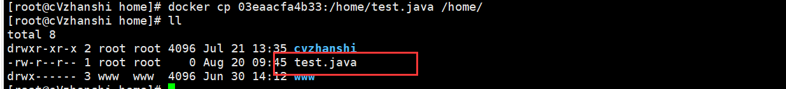

## 3.5 小结


```bash
  attach      # 当前shell下 attach连接指定运行的镜像
  build       # 通过Dockerfile定制镜像
  commit      # 提交当前容器为新的镜像
  cp          # 从容器中拷贝文件或目录到宿主机中
  create      # 创建一个新的容器 同run 但是不启动容器
  diff        # 查看docker容器的变化
  events      # 从服务获取容器实时事件
  exec        # 在已存在的容器上运行命令
  export      # 导出容器内容流作为一个tar归档文件[对应import]
  history     # 展示一个镜像形成历史
  images      # 列出系统当前的镜像
  import      # 从tar包中导入内容创建一个文件系统镜像
  info        # 显示系统相关信息
  inspect     # 查看容器详细信息
  kill        # kill指定docker容器
  load        # 从一个tar包或标准输入中加载一个镜像[对应save]
  login       # 注册或者登陆一个docker源服务器
  logout      # 从当前Docker registry退出
  logs        # 查看当前容器输出的日志
  pause       # 暂停容器	
  port        # 查看映射端口对应的容器内部源端口
  ps          # 列出容器列表
  pull        # 从docker镜像源服务器拉取指定镜像或者库镜像
  push        # 推送指定镜像或者库镜像至docker源服务器
  rename      # 重命名容器
  restart     # 重启一个或多个容器
  rm          # 删除一个或多个容器
  rmi         # 删除一个或多个镜像
  run         # 创建一个新的容器，并运行命令
  save        # 保存一个或多个镜像为一个tab包[对应load]
  search      # 在docker hub中搜索镜像
  start       # 启动容器
  stats       Display a live stream of container(s) resource usage statistics
  stop        # 停止容器
  tag         # 给源中镜像搭上标签
  top         # 查看运行中的容器的进程信息
  unpause     # 取消暂停容器
  update      # 更新容器的配置
  version     # 查看docker版本号
  wait        # 截取容器停止时的退出状态值
```

## 3.6 作业练习

>  **Docker 安装Nginx** 

```bash
#1. 搜索镜像 search 建议大家去docker搜索，可以看到帮助文档
[root@cVzhanshi /]# docker search nginx

#2. 拉取下载镜像 pull
[root@cVzhanshi /]# docker pull nginx

#3. 查看是否下载成功镜像
[root@cVzhanshi /]# docker images

#3. 运行测试
# -d 后台运行
# --name 给容器命名
# -p 宿主机端口：容器内部端口
[root@cVzhanshi /]# docker run -d --name nginx02 -p 3344:80 nginx
7d1999c270f71aefdf4ecefb93b8a2889c648ea8040ce39209ecdd59168396cf

#4. 查看正在启动的镜像
[root@cVzhanshi /]# docker ps
CONTAINER ID   IMAGE     COMMAND                  CREATED         STATUS         PORTS                                   NAMES
7d1999c270f7   nginx     "/docker-entrypoint.…"   7 seconds ago   Up 6 seconds   0.0.0.0:3344->80/tcp, :::3344->80/tcp   nginx02

#5. 进入容器
[root@cVzhanshi /]#  docker exec -it nginx02 /bin/bash  #进入容器
root@7d1999c270f7:/# whereis nginx 
nginx: /usr/sbin/nginx /usr/lib/nginx /etc/nginx /usr/share/nginx
root@7d1999c270f7:/# cd /etc/nginx/
root@7d1999c270f7:/etc/nginx# ls
conf.d	fastcgi_params	mime.types  modules  nginx.conf  scgi_params  uwsgi_params

#6. 退出容器
root@aa664b0c8ed9:/etc/nginx# exit
exit

#7. 停止容器
CONTAINER ID   IMAGE     COMMAND                  CREATED         STATUS         PORTS                                   NAMES
7d1999c270f7   nginx     "/docker-entrypoint.…"   8 minutes ago   Up 8 minutes   0.0.0.0:3344->80/tcp, :::3344->80/tcp   nginx02
[root@cVzhanshi /]# docker stop 7d1999c270f7
```

启动了nginx容器进行测试


-----


 **宿主机端口** 和 **容器内部端口** 以及端口暴露的原理：


 **问题**：我们每次改动nginx配置文件，都需要进入容器内部？十分麻烦，我要是可以在容器外部提供一个映射路径，达到在容器外部修改文件名，容器内部就可以自动修改？-v 数据卷 技术！  

>  **Docker 安装Tomcat** 

```bash
# 官方的使用
docker run -it --rm tomcat:9.0

# 我们之前的启动都是后台，停止了容器之后，容器还是可以查到 docker run -it --rm, 一般用来测试，用完就删除

# 下载再启动
docker pull tomcat

# 启动运行
docker run -d -p 3355:8080 --name tomcat01 tomcat

# 测试访问没有问题,但是发现没有页面

# 进入容器
docker exec -it tomcat01 /bin/bash

# 发现问题：1、linux命令少了，2、没有webapps; 阿里云镜像的原因，默认是最小的镜像，所以没必要都剔除掉
# 保证最小可运行的环境
```

测试


-----


进入容器发现webapps中没有内容，所以才导致404，进入webapps.dist目录，发现里面有ROOT页面，把他复制进入webapps中，然后继续访问，发现有页面了


**问题**： 我们以后要部署项目，如果每次都要进入容器是不是十分麻烦？要是可以在容器外部提供一个映射路径，比如webapps，我们在外部放置项目，就自动同步内部就好了！ 

>  **部署ES + Kibana** 

```bash
# es 暴露的端口很多
# es 十分的耗内存
# es 的数据一般需要放置到安全目录！ 挂载
# --net somework ? 网络配置

# 启动 elasticsearch
docker run -d --name elasticsearch -p 9200:9300 -e "discovery.type=single-node" elasticsearch:7.6.2

# 启动了 linux就卡住了

# 赶紧关闭，增加内存的限制，修改配置文件 -e 环境配置修改
docker run -d --name elasticsearch02 -p 9200:9300 -e "discovery.type=single-node" -e ES_JAVA_OPTS="-Xms64m -Xmx512m" elasticsearch:7.6.2

# 查看 docker stats 容器id
```


测试


**使用kibana连接es?** 

两个容器相互个理网络如何才能连接


## 3.7 可视化

**Portainer 可视化面板安装** Docker图形化界面管理工具！提供一个后台面板供我们操作！ 

```bash
docker run -d -p 8088:9000 \
--restart=always -v /var/run/docker.sock:/var/run/docker.sock --privileged=true portainer/portainer
```

 测试访问： 外网：8080 ：http://ip:8080/ 

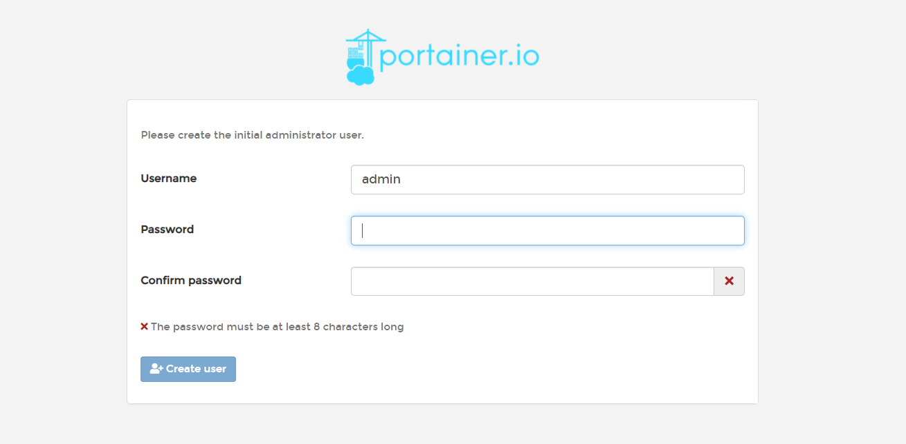

进入之后的面板


# ④ Docker镜像讲解

## 4.1 什么是镜像

> 镜像是一种轻量级、可执行的独立软件包，用来打包软件运行环境和基于运行环境开发的软件，他包含运行某个软件所需的所有内容，包括代码、运行时库、环境变量和配置文件。

所有的应用，直接打包docker镜像，就可以直接跑起来！

如何得到镜像：

- 从远程仓库下载
- 拷贝
- 自己制作一个镜像 DockerFile

## 4.2 Docker镜像加载原理

>  UnionFs （联合文件系统) 

UnionFs（联合文件系统）：Union文件系统（UnionFs）是一种分层、轻量级并且高性能的文件系统，他支持对文件系统的修改作为一次提交来一层层的叠加，同时可以将不同目录挂载到同一个虚拟文件系统下（ unite several directories into a single virtual filesystem)。Union文件系统是 Docker镜像的基础。镜像可以通过分层来进行继承，基于基础镜像（没有父镜像），可以制作各种具体的应用镜像

-----

**特性**：一次同时加载多个文件系统，但从外面看起来，只能看到一个文件系统，联合加载会把各层文件系统叠加起来，这样最终的文件系统会包含所有底层的文件和目录

>  Docker镜像加载原理 

Docker的镜像实际上由一层一层的文件系统组成，这种层级的文件系统UnionFS。
**boots(boot file system）**主要包含 bootloader和 Kernel, bootloader主要是引导加 kernel, Linux刚启动时会加载bootfs文件系统，在 Docker镜像的最底层是 bootfs。这一层与我们典型的Linux/Unix系统是一样的，包含boot加载器和内核。当boot加载完成之后整个内核就都在内存中了，此时内存的使用权已由 bootfs转交给内核，此时系统也会卸载bootfs。
**rootfs（root file system)**,在 bootfs之上。包含的就是典型 Linux系统中的/dev,/proc,/bin,/etc等标准目录和文件。 rootfs就是各种不同的操作系统发行版，比如 Ubuntu, Centos等等。

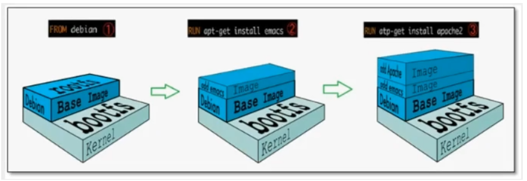

 平时我们安装进虚拟机的CentOS都是好几个G，为什么Docker这里才200M?


对于一个精简的OS,rootfs可以很小，只需要包合最基本的命令，工具和程序库就可以了，因为底层直接用Host的kernel，自己只需要提供rootfs就可以了。

**由此可见对于不同的Linux发行版， boots基本是一致的， rootfs会有差別，因此不同的发行版可以公用bootfs.**

**虚拟机是分钟级别，容器是秒级！**

## 4.3 分层理解

> 分层的镜像

 我们可以去下载一个镜像，注意观察下载的日志输出，可以看到是一层层的在下载 


**思考：**

**为什么Docker镜像要采用这种分层的结构呢？**

最大的好处，我觉得莫过于**资源共享**了！比如有多个镜像都从相同的Base镜像构建而来，那么宿主机只需在磁盘上保留一份base镜像，同时内存中也只需要加载一份base镜像，这样就可以为所有的容器服务了，而且镜像的每一层都可以被共享。 

 查看镜像分层的方式可以通过**docker image inspect 镜像名字/镜像id**命令 


 **理解：** 

所有的 Docker镜像都起始于一个基础镜像层，当进行修改或增加新的内容时，就会在当前镜像层之上，创建新的镜像层。 

举一个简单的例子，假如基于 Ubuntu Linux16.04创建一个新的镜像，这就是新镜像的第一层；如果在该镜像中添加 Python包，就会在基础镜像层之上创建第二个镜像层；如果继续添加一个安全补丁，就会创健第三个镜像层该像当前已经包含3个镜像层，如下图所示：

 **在添加额外的镜像层的同时，镜像始终保持是当前所有镜像的组合**

=> 就是这个镜像包含了第三层、第二层、第一层的全部环境


 下图中举了一个简单的例子，每个镜像层包含3个文件，而镜像包含了来自两个镜像层的6个文件。 


上图中的镜像层跟之前图中的略有区別，主要目的是便于展示文件
下图中展示了一个稍微复杂的三层镜像，在外部看来整个镜像只有6个文件，这是因为最上层中的文件7是文件5的一个更新版。 


这种情況下，上层镜像层中的文件覆盖了底层镜像层中的文件。这样就使得文件的更新版本作为一个新镜像层添加到镜像当中

Docker通过存储引擎（新版本采用快照机制）的方式来实现镜像层堆栈，并保证多镜像层对外展示为统一的文件系统

Linux上可用的存储引撃有AUFS、 Overlay2、 Device Mapper、Btrfs以及ZFS。顾名思义，每种存储引擎都基于 Linux中对应的件系统或者块设备技术，井且每种存储引擎都有其独有的性能特点。

Docker在 Windows上仅支持 windowsfilter 一种存储引擎，该引擎基于NTFS文件系统之上实现了分层和CoW [1]。

下图展示了与系统显示相同的三层镜像。所有镜像层堆并合井，对外提供统一的视图


>  特点 

**Docker 镜像都是只读的**，当容器启动时，一个新的可写层加载到镜像的顶部！

这一层就是我们通常说的容器层，容器之下的都叫镜像层！


## 4.4 commit镜像

```bash
docker commit 提交容器成为一个新的副本

# 命令和git原理类似
docker commit -m="描述信息" -a="作者" 容器id 目标镜像名:[TAG]
```

 **实战测试:** 

```bash
# 1、启动一个默认的tomcat
docker run -d -p 8081:8080 tomcat
# 2、发现这个默认的tomcat 是没有webapps应用，官方的镜像默认webapps下面是没有文件的！
docker exec -it 53ef6939ae2e
# 3、拷贝文件进去

# 4、将操作过的容器通过commit调教为一个镜像！我们以后就使用我们修改过的镜像即可，这就是我们自己的一个修改的镜像。
docker commit -m="描述信息" -a="作者" 容器id 目标镜像名:[TAG]
docker commit -m="add webapps app" -a="cvzhanshi" 53ef6939ae2e tomcat01:1.0
```

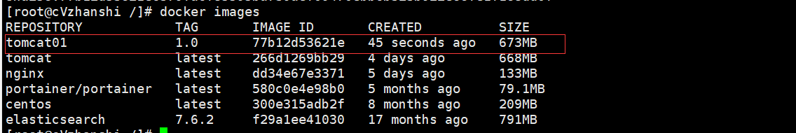

如果你想要保存当前容器的状态，就可以通过commit来提交，获得一个镜像，就好比我们我们使用虚拟机的快照、Git的提交到本地库。

- 运行commit的镜像

```bash
[root@cVzhanshi /]# docker images
REPOSITORY            TAG       IMAGE ID       CREATED          SIZE
tomcat01              1.0       77b12d53621e   45 seconds ago   673MB
tomcat                latest    266d1269bb29   4 days ago       668MB
nginx                 latest    dd34e67e3371   5 days ago       133MB
portainer/portainer   latest    580c0e4e98b0   5 months ago     79.1MB
centos                latest    300e315adb2f   8 months ago     209MB
elasticsearch         7.6.2     f29a1ee41030   17 months ago    791MB
[root@cVzhanshi /]# docker run -d -p 8081:8080 77b12d53621e
0573e7bdd9faec2585313d2aaa9821e17ebce922b08e54fd9e15181a5a3fc7f9
```

- 访问页面


> 说明：这个镜像webapps里面就是有Root文件的

- 查看webapps文件，是有内容的


# ⑤ 容器数据卷

## 5.1 什么是容器数据卷

- **docker的理念回顾**： **将应用和环境打包成一个镜像** 
-  数据？如果数据都在容器中，那么我们容器删除，数据就会丢失！需求：**数据可以持久化** 
-  MySQL，容器删除了，删库跑路！**需求：MySQL数据可以存储在本地！** 

-  容器之间可以有一个数据共享的技术！Docker容器中产生的数据，同步到本地！ 
-  这就是卷技术！**目录的挂载，将我们容器内的目录，挂载到Linux上面**！ 


**总结**： **容器的持久化和同步操作！容器间也是可以数据共享的！** 

## 5.2 使用容器卷

> 方式一： 直接使用命令挂载 -v （指定路径挂载）

```bash
-v, --volume list                    Bind mount a volume
docker run -it -v 主机目录:容器内目录  -p 主机端口:容器内端口
# /home/ceshi：主机home目录下的ceshi文件夹  映射：centos容器中的/home

# 启动容器
[root@cVzhanshi home]# docker run -it -v /home/ceshi:/home centos /bin/bash
#这时候主机的/home/ceshi文件夹就和容器的/home文件夹关联了,二者可以实现文件或数据同步了
#通过 docker inspect 容器id 查看
[root@cVzhanshi /]# docker inspect be641a8f2511
```


**测试文件同步**

- 在容器创建一个文件，在主机的对应路径下查看


- 再测试停止容器，在主机上往文件添加内容，然后启动容器查看文件的内容

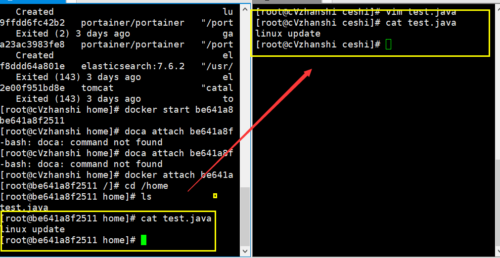

好处： 我们以后修改只需要在本地修改即可，容器内会自动同步 ！比如前面的问题Nginx的配置文件就可以用这种方式解决。

## 5.3 实战: 安装MySQL

思考：MySQL持久化问题

```bash
# 获取镜像
[root@cVzhanshi home]# docker pull mysql:5.7

# 运行容器,需要做数据挂载 #安装启动mysql，需要配置密码的，这是要注意点！
# 参考官网hub 
docker run --name some-mysql -e MYSQL_ROOT_PASSWORD=my-secret-pw -d mysql:tag

#启动我们得
-d 后台运行
-p 端口映射
-v 卷挂载
-e 环境配置
-- name 容器名字
docker run -d -p 3310:3306 -v /home/mysql/conf:/etc/mysql/conf.d -v /home/mysql/data:/var/lib/mysql -e MYSQL_ROOT_PASSWORD=123456 --name mysql01 mysql:5.7

# 启动成功之后，我们在本地使用sqlyog来测试一下
# sqlyog-连接到服务器的3310--映射--容器内的3306
# 在本地测试创建一个数据库，查看一下我们映射的路径是否ok！
```

- 查看主机挂载的目录是否同步了容器中的文件


- 用navicat测试连接容器中的数据库


- 在navicat上新建一个数据库，观察主机挂载文件中查看是否同步


- 测试把mysql容器删除，主机上的数据是否还保存着


**我们挂载到本地的数据卷依旧没有丢失，这就实现了容器数据持久化功能**。 

## 5.4 具名和匿名挂载

```bash
# 匿名挂载
-v 容器内路径!
docker run -d -P --name nginx01 -v /etc/nginx nginx
# 查看所有的volume(卷)的情况
docker volume ls

[root@cVzhanshi /]# docker volume ls  
DRIVER    VOLUME NAME
local     4f9c21decde01dfb72d0375f88563e73ed3c77840f7c10ec665a476abc97c95c
local     bc80fce1f6e1d74c37904bbc5ccd90d4daa11ab3ab4ab455239d6ffb595ae3f7
# 这里发现，这种就是匿名挂载，我们在 -v只写了容器内的路径，没有写容器外的路径！

# 具名挂载 -P:表示随机映射端口
[root@cVzhanshi /]# docker run -d -P --name nginx02 -v juming-nginx:/etc/nginx nginx
fd44aa364497b2ee8f95ece340206087fcc52caed408080166ce1b7a5aa590ac

# 查看所有的volume(卷)的情况
```


```
# 通过 -v 卷名：查看容器内路径
# 查看一下这个卷
docker volume inspect juming-nginx
```

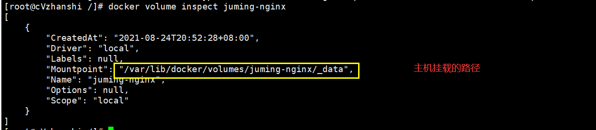

所有的docker容器内的卷，没有指定目录的情况下都是在`/var/lib/docker/volumes/xxxx/_data`下；

我们可以通过具名挂载方便的找到一个卷，大多情况下在使用`具名挂载`

 **如果指定了目录，docker volume ls 是查看不到的**。 


**区分三种挂载方式**

```bash
# 三种挂载： 匿名挂载、具名挂载、指定路径挂载
-v 容器内路径            #匿名挂载
-v 卷名：容器内路径          #具名挂载
-v /宿主机路径：容器内路径 #指定路径挂载 docker volume ls 是查看不到的
```

 **拓展**：

```bash
# 通过 -v 容器内路径： ro rw 改变读写权限
ro #readonly 只读
rw #readwrite 可读可写
docker run -d -P --name nginx05 -v juming:/etc/nginx:ro nginx
docker run -d -P --name nginx05 -v juming:/etc/nginx:rw nginx
# ro 只要看到ro就说明这个路径只能通过宿主机来操作，容器内部是无法操作！
```

 ## 5.5 初识Dockerfile

**Dockerfile 就是用来构建docker镜像的构建文件**！命令脚本！

通过这个**脚本可以生成镜像**，镜像是一层一层的，脚本是一个个的命令，每个命令都是一层！

> 构建镜像

```bash
# 创建一个dockerfile文件，名字可以随便 建议Dockerfile
# 文件中的内容： 指令(大写) + 参数
[root@cVzhanshi docker-test-volume]# vim dockerfile1
[root@cVzhanshi docker-test-volume]# cat dockerfile1 
FROM centos      		 		 # 当前这个镜像是以centos为基础的
VOLUME ["volume01","volume02"]   # 挂载卷的卷目录列表(多个目录)
CMD echo "----end----"      	 # 输出一下用于测试
CMD /bin/bash    				 # 默认走bash控制台

# 这里的每个命令，就是镜像的一层！

# 构建出这个镜像 
-f dockerfile1             # f代表file，指这个当前文件的地址(这里是当前目录下的dockerfile1)
-t caoshipeng/centos     # t就代表target，指目标目录(注意caoshipeng镜像名前不能加斜杠‘/’)
.                         # 表示生成在当前目录下
[root@cVzhanshi docker-test-volume]# docker build -f dockerfile1 -t caoshipeng/centos .
Sending build context to Docker daemon  2.048kB
Step 1/4 : FROM centos
 ---> 300e315adb2f
Step 2/4 : VOLUME ["volume01","volume02"]   # 卷名列表
 ---> Running in 2be83ae12d6a
Removing intermediate container 2be83ae12d6a
 ---> e21238665b19
Step 3/4 : CMD echo "----end----"             # 输出 脚本命令
 ---> Running in 2a63fdbb8493
Removing intermediate container 2a63fdbb8493
 ---> 97f19f9cff77
Step 4/4 : CMD /bin/bash
 ---> Running in 2498faab4235
Removing intermediate container 2498faab4235
 ---> bc74cb322a53
Successfully built bc74cb322a53
Successfully tagged cvzhanshi/centos:latest

# 查看自己构建的镜像
[root@cVzhanshi docker-test-volume]# docker images
REPOSITORY            TAG       IMAGE ID       CREATED              SIZE
cvzhanshi/centos      latest    bc74cb322a53   About a minute ago   209MB
```


>  启动自己写的容器镜像 

```bash
[root@cVzhanshi docker-test-volume]# docker run -it bc74cb322a53 /bin/bash
# 查看目录
```


 这个卷和外部一定有一个同步的目录 


> 查看容器的详情，查看卷挂载的路径

```bash
# docker inspect 容器id
[root@cVzhanshi docker-test-volume]# docker inspect 196d151e1f18
```


> 测试文件是否能够同步


这种方式使用的十分多，因为我们通常会构建自己的镜像！

假设构建镜像时候没有挂载卷，要手动镜像挂载 -v 卷名：容器内路径！

## 5.6 数据卷容器

**多个MySQL同步数据**！


```bash
# 测试 启动3个容器，通过刚才自己写的镜像启动
# 创建docker01：因为我本机是最新版，故这里用latest

[root@cVzhanshi docker-test-volume]# docker run -it --name docker01 cvzhanshi/centos:latest
[root@b8a255fb7f55 /]# ls
bin  dev  etc  home  lib  lib64  lost+found  media  mnt  opt  proc  root  run  sbin  srv  sys  tmp  usr  var  volume01	volume02

# 不关闭该容器退出
CTRL + Q + P  

# 创建docker02: 并且让docker02 继承 docker01
[root@cVzhanshi docker-test-volume]# docker run -it --name docker02 --volumes-from docker01 cvzhanshi/centos:latest
[root@c162563f9029 /]# ls
bin  dev  etc  home  lib  lib64  lost+found  media  mnt  opt  proc  root  run  sbin  srv  sys  tmp  usr  var  volume01	volume02
```

> 测试能否同步


```bash
# 再新建一个docker03同样继承docker01
[root@cVzhanshi docker-test-volume]# docker run -it --name docker03 --volumes-from docker01 cvzhanshi/centos:latest

[root@c162563f9029 volume01] ls 
docker01.txt
# 测试：可以删除docker01，查看一下docker02和docker03是否可以访问这个文件
# 测试发现：数据依旧保留在docker02和docker03中没有被删除
```


**多个mysql实现数据共享**

```bash
docker run -d -p 3306:3306 -v /home/mysql/conf:/etc/mysql/conf.d -v /home/mysql/data:/var/lib/mysql -e MYSQL_ROOT_PASSWORD=123456 --name mysql01 mysql:5.7
docker run -d -p 3310:3306 -e MYSQL_ROOT_PASSWORD=123456 --name mysql02 --volumes-from mysql01  mysql:5.7
# 这个时候，可以实现两个容器数据同步！
```

结论：

**容器之间的配置信息的传递，数据卷容器的生命周期一直持续到没有容器使用为止**。

**但是一旦你持久化到了本地，这个时候，本地的数据是不会删除的**！

> 探究原理

- 再新建一个docker04不继承docker01，正常启动
- 查询其中的挂载文件主机的路径

```bash
# 启动docker04
[root@cVzhanshi docker-test-volume]# docker run -it --name docker04 cvzhanshi/centos:latest
# 查看其挂载文件的主机路径
[root@cVzhanshi docker-test-volume]# docker inspect b8a255fb7f55
```


- 同理查看docker01和docker02的挂载文件的主机路径

docker01


docker02


**结论**：**--volumes-from 实现数据同步的原理是将子容器的主机挂载路径设置成和父容器（数据卷容器）一样，实现数据同步**

# ⑥ DockerFile

## 6.1 DockerFile介绍

 `dockerfile`是用来构建docker镜像的文件！命令参数脚本！ 

**构建步骤**：

1、 编写一个dockerfile文件

2、 docker build 构建称为一个镜像

3、 docker run运行镜像

4、 docker push发布镜像（DockerHub 、阿里云仓库)

-----

在DockerHub中找一个镜像（centos为例）


 点击后跳到一个Dockerfile 


很多官方镜像都是基础包，很多功能没有，我们通常会自己搭建自己的镜像！

官方既然可以制作镜像，那我们也可以！

## 6.2 DockerFile构建过程

**基础知识**：

1、每个保留关键字（指令）都是必须是**大写字母**

2、执行从上到下顺序

3、#表示注释

4、每一个指令都会创建提交一个新的镜像，并提交！


其中可写容器层为run启动后新增的一个镜像层

## 6.3 DockerFile的指令

```bash
FROM              # from:基础镜像，一切从这里开始构建
MAINTAINER        # maintainer:镜像是谁写的， 姓名+邮箱
RUN               # run:镜像构建的时候需要运行的命令
ADD               # add:步骤，tomcat镜像，这个tomcat压缩包！添加内容 添加同目录
WORKDIR           # workdir:镜像的工作目录
VOLUME            # volume:挂载的目录
EXPOSE            # expose:保留端口配置
CMD               # cmd:指定这个容器启动的时候要运行的命令，只有最后一个会生效，可被替代
ENTRYPOINT        # entrypoint:指定这个容器启动的时候要运行的命令，可以追加命令
ONBUILD           # onbuild:当构建一个被继承DockerFile这个时候就会运行onbuild的指令，触发指令
COPY              # copy:类似ADD，将我们文件拷贝到镜像中
ENV               # env:构建的时候设置环境变量！
```


## 6.4 实战测试

由DockerHub中查看到centos的dockerfile

```bash
FROM scratch
ADD centos-7-x86_64-docker.tar.xz /
LABEL \
    org.label-schema.schema-version="1.0" \
    org.label-schema.name="CentOS Base Image" \
    org.label-schema.vendor="CentOS" \
    org.label-schema.license="GPLv2" \
    org.label-schema.build-date="20200504" \
    org.opencontainers.image.title="CentOS Base Image" \
    org.opencontainers.image.vendor="CentOS" \
    org.opencontainers.image.licenses="GPL-2.0-only" \
    org.opencontainers.image.created="2020-05-04 00:00:00+01:00"
CMD ["/bin/bash"]
```


**Docker Hub 中 99%的镜像都是从这个基础镜像过来的 FROM scratch**，然后配置需要的软件和配置来进行构建。 

>  创建一个自己的centos 

**原生的centos镜像好多命令都不能用，自定义一个可以用vim，ifconfig的centos**

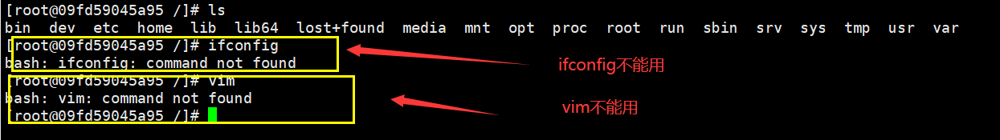

```bash
# 1./home下新建dockerfile目录
[root@cVzhanshi home]# mkdir dockerfile

# 2. dockerfile目录下新建mydockerfile-centos文件
[root@cVzhanshi dockerfile]# vim mydockerfile-centos

# vim的内容
FROM centos                            		# 基础镜像是官方原生的centos
MAINTAINER cvzhanshi<cvzhanshi@qq.com>      # 作者
ENV MYPATH /usr/local                		# 配置环境变量的目录 
WORKDIR $MYPATH                       	    # 将工作目录设置为 MYPATH
RUN yum -y install vim                		# 给官方原生的centos 增加 vim指令
RUN yum -y install net-tools        		# 给官方原生的centos 增加 ifconfig命令
EXPOSE 80                            		# 暴露端口号为80
CMD echo $MYPATH                    		# 输出下 MYPATH 路径
CMD echo "-----end----"                
CMD /bin/bash                        		# 启动后进入 /bin/bash

# 4.通过这个文件构建镜像
# 命令： docker build -f 文件路径 -t 镜像名:[tag] .

# 5.出现如下语句说明构建成功
Successfully built 111bd8424a21
Successfully tagged mycentos:1.0
```


```bash
# 运行测试
```

```bash
[root@cVzhanshi dockerfile]# docker run -it mycentos:1.0
```


 我们可以列出本地进行的变更历史 

```bash
[root@cVzhanshi dockerfile]# docker history 111bd8424a21
```


 我们平时拿到一个镜像，可以用 “docker history 镜像id” 研究一下是什么做的 

>  CMD 和 ENTRYPOINT区别 

```bash
CMD                   # 指定这个容器启动的时候要运行的命令，只有最后一个会生效，可被替代。
ENTRYPOINT            # 指定这个容器启动的时候要运行的命令，可以追加命令
```

**测试CMD**

```bash
# 编写dockerfile文件
[root@cVzhanshi dockerfile]# vim dockerfile-test-cmd
[root@cVzhanshi dockerfile]# cat dockerfile-test-cmd 
FROM centos
CMD ["ls","-a"]

# 构建镜像
[root@cVzhanshi dockerfile]# docker build -f dockerfile-test-cmd -t cmd-test:1.0 .

# 启动镜像   由结果可得，运行后就执行了 ls -a 命令
[root@cVzhanshi dockerfile]# docker run cmd-test:1.0 
```


```bash
# 想追加一个命令  -l 成为ls -al：展示列表详细数据 
# 重新启动镜像
[root@cVzhanshi dockerfile]# docker run cmd-test:1.0 -l
docker: Error response from daemon: OCI runtime create failed: container_linux.go:380: starting container process caused: exec: "-l": executable file not found in $PATH: unknown.

# cmd的情况下 -l 替换了CMD["ls","-l"] 而 -l  不是命令所以报错
```

**测试ENTRYPOINT** 

```bash
# 编写dockerfile文件
[root@cVzhanshi dockerfile]# vim dockerfile-test-entrypoint
[root@cVzhanshi dockerfile]# cat dockerfile-test-entrypoint 
FROM centos
ENTRYPOINT ["ls","-a"]
[root@cVzhanshi dockerfile]# 

# 构建镜像
[root@cVzhanshi dockerfile]# docker build -f dockerfile-test-entrypoint -t entrypoint-test:1.0 .

# 启动镜像
[root@cVzhanshi dockerfile]# docker run 7bfbded97091

# 追加命令启动镜像
[root@cVzhanshi dockerfile]# docker run 7bfbded97091 -l
```


-----

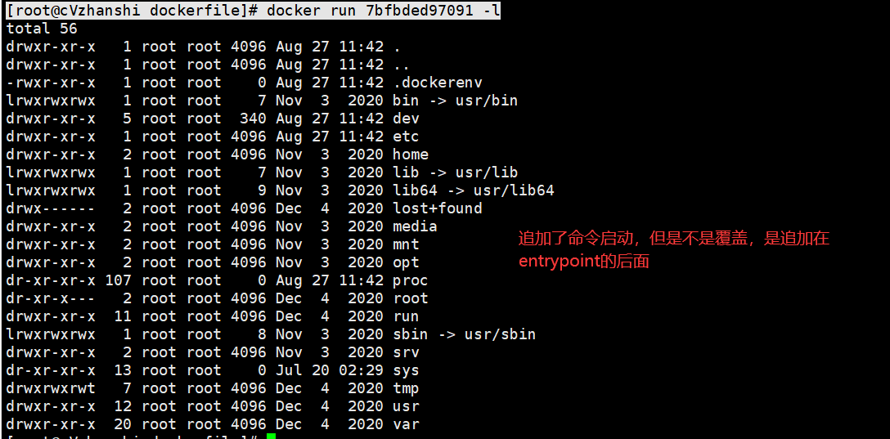

## 6.5 实战：Tomcat镜像

> **准备环境** 

```
准备tomcat 和 jdk 到当前目录，编写好README
```


> **编写dockerfile文件**

```bash
FROM centos																# 基础镜像centos
MAINTAINER cvzhanshi<cvzhanshi@qq.com>									# 作者
COPY README.txt /usr/local/README.txt									# 复制README文件

ADD jdk-8u301-linux-x64.tar.gz /usr/local/								# 添加jdk，ADD 命令会自动解压
ADD apache-tomcat-9.0.50.tar.gz /usr/local/								# 添加tomcat，ADD 命令会自动解压
RUN yum -y install vim													# 安装 vim 命令
ENV MYPATH /usr/local													# 环境变量设置 工作目录
WORKDIR $MYPATH															# 色设置工作目录

ENV JAVA_HOME /usr/local/jdk1.8.0_301									# 环境变量： JAVA_HOME环境变量
ENV CLASSPATH $JAVA_HOME/lib/dt.jar:$JAVA_HOME/lib/tools.jar

ENV CATALINA_HOME /usr/local/apache-tomcat-9.0.50						 # 环境变量： tomcat环境变量
ENV CATALINA_BASH /usr/local/apache-tomcat-9.0.50

ENV PATH $PATH:$JAVA_HOME/bin:$CATALINA_HOME/lib:$CATALINA_HOME/bin      # 设置环境变量 分隔符是：

EXPOSE 8080																 # 设置暴露的端口

CMD /usr/local/apache-tomcat-9.0.50/bin/startup.sh && tail -F /usr/local/apache-tomcat-9.0.50/logs/catalina.out													# 设置默认命令

```

>  **构建镜像**

```bash
# 因为dockerfile命名使用默认命名 因此不用使用-f 指定文件
[root@cVzhanshi tomcat-diy]#  docker build -t mytomcat:1.0 .

Successfully built 4636ac252f82
Successfully tagged mytomcat:1.0
```

> **启动镜像**

```bash
[root@cVzhanshi tomcat-diy]# docker run -d -p 9090:8080 --name cvzhanshitomact -v /home/cvzhanshi/build/tomcat-diy/test:/usr/local/apache-tomcat-9.0.50/webapps/test -v /home/cvzhanshi/build/tomcat-diy/tomcatlogs:/usr/local/apache-tomcat-9.0.50/logs mytomcat:1.0

# 命令解释 
-d            # 后台运行
-p 9090:8080  # 把8080对外暴露成9090
--name        # cvzhanshitomcat 设置名字
-v /home/cvzhanshi/build/tomcat-diy/test:/usr/local/apache-tomcat-9.0.50/webapps/test  # 挂载目录
-v /home/cvzhanshi/build/tomcat-diy/tomcatlogs:/usr/local/apache-tomcat-9.0.50/logs    # 挂载目录
```


- 在主机上查看挂在目录


- 测试tomcat

```bash
[root@cVzhanshi tomcat-diy]# curl localhost:9090
```


- 在外面访问

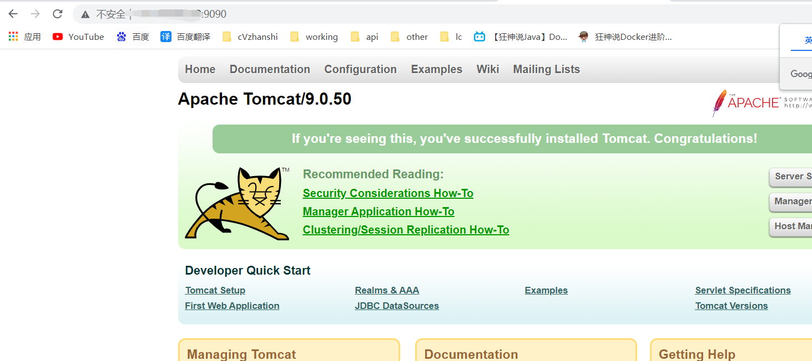

> 在tomcat发布Hello world项目

由于做了卷挂载，我们直接在本地编写项目就可以发布

- 直接在挂载的test文件夹下面创建index.html

内容如下

```html
<html>
<head>
    <meta charset="UTF-8">
    <title>Document</title>
</head>
    <body>
        Hello World！
    </body>
</html>
```


我们以后开发的步骤：需要掌握Dockerfile的编写！我们之后的一切都是使用docker镜像来发布运行！

## 6.6 发布自己的镜像

> 发布到Docker Hub

- 地址 https://hub.docker.com/  ，进入创建账号
- 确定这个账号可以登录
- 登录 -> 发布

```bash
[root@cVzhanshi tomcat-diy]# docker login --help
Usage:  docker login [OPTIONS] [SERVER]
Log in to a Docker registry.
If no server is specified, the default is defined by the daemon.
Options:
  -p, --password string   Password
      --password-stdin    Take the password from stdin
  -u, --username string   Username

# 登录
[root@cVzhanshi tomcat-diy]# docker login -u cvzhanshi
Password: 
WARNING! Your password will be stored unencrypted in /root/.docker/config.json.
Configure a credential helper to remove this warning. See
https://docs.docker.com/engine/reference/commandline/login/#credentials-store

Login Succeeded
```

- 发布


```bash
# 会发现push不上去，因为如果没有前缀的话默认是push到 官方的library
# 解决方法：
# 第一种 build的时候添加你的dockerhub用户名，然后在push就可以放到自己的仓库了
[root@cVzhanshi tomcat-diy]# docker build -t cvzhanshi/mytomcat:0.1 .
# 第二种 使用docker tag #然后再次push
[root@cVzhanshi tomcat-diy]# docker tag 容器id cvzhanshi/mytomcat:1.0 #然后再次push
[root@cVzhanshi tomcat-diy]# docker push cvzhanshi/diytomcat:1.0
```


> 发布到阿里云镜像上

- 登录aliyun
- 找到容器镜像服务
- 创建命名空间


- 创建容器镜像


- 点进镜像中会有详细的教程


- 进行推送

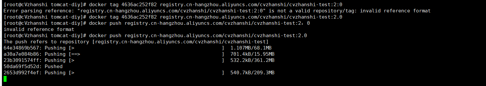

- 上传成功后查看阿里云的镜像层，发现，每一个镜像层就是我们的一条命令


## 6.7 小结

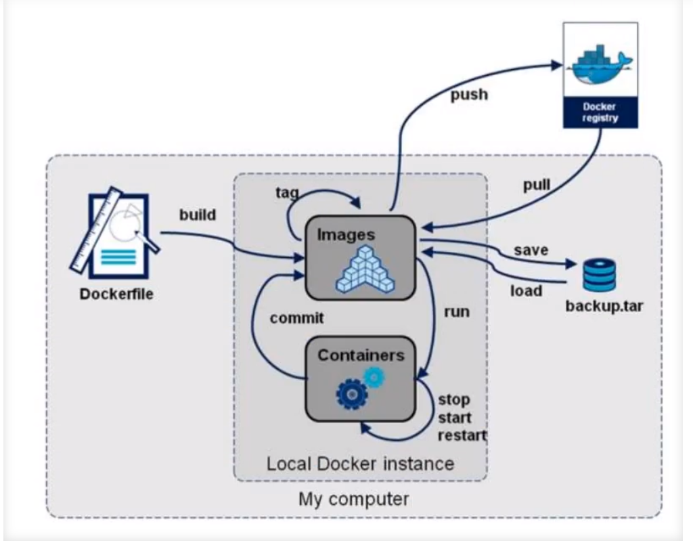

> 其中save和load是备份的命令，把镜像打包成tar

```bash
[root@cVzhanshi test]# docker save --help
Usage:  docker save [OPTIONS] IMAGE [IMAGE...]
Save one or more images to a tar archive (streamed to STDOUT by default)
Options:
  -o, --output string   Write to a file, instead of STDOUT # 打包存储的路径
```

# ⑦ Docker 网络

## 7.1 理解Docker0

**清空下前面的docker 镜像、容器**

```bash
# 删除全部容器
[root@cVzhanshi tomcat-diy]# docker rm -f $(docker ps -aq)
# 删除全部镜像
[root@cVzhanshi tomcat-diy]# docker rmi -f $(docker images -aq)
```

- 用ip addr查看Linux系统中的网卡


**三个网络**

> 问题： docker 是如果处理容器网络访问的？


```bash
# 测试，运行一个tomcat
[root@cVzhanshi tomcat-diy]# docker run -d -P --name tomcat01 tomcat

# 查看容器内部网络地址，发现容器启动的时候会得到一个 eth0@if83 ip地址，docker分配
[root@cVzhanshi tomcat-diy]# docker exec -it 3e898fccd455 ip addr
```


```bash
# 思考？ linux能不能ping通容器内部！ 可以 容器内部可以ping通外界吗？ 都可以！
# Linux ping容器内部
[root@cVzhanshi tomcat-diy]# ping 172.17.0.2
PING 172.17.0.2 (172.17.0.2) 56(84) bytes of data.
64 bytes from 172.17.0.2: icmp_seq=1 ttl=64 time=0.110 ms
64 bytes from 172.17.0.2: icmp_seq=2 ttl=64 time=0.084 ms

# 容器内部 ping Linux系统外界
[root@3e898fccd455 local]# ping 172.17.0.1
PING 172.17.0.1 (172.17.0.1) 56(84) bytes of data.
64 bytes from 172.17.0.1: icmp_seq=1 ttl=64 time=0.103 ms
64 bytes from 172.17.0.1: icmp_seq=2 ttl=64 time=0.061 ms
```

> 原理：

- 我们每启动一个docker容器，docker就会给docker容器分配一个ip，我们只要按照了docker，就会有一个docker0桥接模式，使用的技术是veth-pair技术！

  veth-pair技术：https://www.cnblogs.com/bakari/p/10613710.html


- 再启动一个容器测试，发现又多了一对网络


```bash
# 我们发现这个容器带来网卡，都是一对对的
# veth-pair 就是一对的虚拟设备接口，他们都是成对出现的，一端连着协议，一端彼此相连
# 正因为有这个特性 veth-pair 充当一个桥梁，连接各种虚拟网络设备的
# OpenStac,Docker容器之间的连接，OVS的连接，都是使用evth-pair技术
```

- 我们来测试下tomcat01和tomcat02是否可以ping通

```bash
# 查看网络docker exec -it 容器id ip addr
[root@cVzhanshi tomcat-diy]# docker exec -it tomcat01 ip addr
1: lo: <LOOPBACK,UP,LOWER_UP> mtu 65536 qdisc noqueue state UNKNOWN group default qlen 1000
    link/loopback 00:00:00:00:00:00 brd 00:00:00:00:00:00
    inet 127.0.0.1/8 scope host lo
       valid_lft forever preferred_lft forever
82: eth0@if83: <BROADCAST,MULTICAST,UP,LOWER_UP> mtu 1500 qdisc noqueue state UP group default 
    link/ether 02:42:ac:11:00:02 brd ff:ff:ff:ff:ff:ff link-netnsid 0
    inet 172.17.0.2/16 brd 172.17.255.255 scope global eth0
       valid_lft forever preferred_lft forever
[root@cVzhanshi tomcat-diy]# docker exec -it tomcat02 ip addr
1: lo: <LOOPBACK,UP,LOWER_UP> mtu 65536 qdisc noqueue state UNKNOWN group default qlen 1000
    link/loopback 00:00:00:00:00:00 brd 00:00:00:00:00:00
    inet 127.0.0.1/8 scope host lo
       valid_lft forever preferred_lft forever
84: eth0@if85: <BROADCAST,MULTICAST,UP,LOWER_UP> mtu 1500 qdisc noqueue state UP group default 
    link/ether 02:42:ac:11:00:03 brd ff:ff:ff:ff:ff:ff link-netnsid 0
    inet 172.17.0.3/16 brd 172.17.255.255 scope global eth0
       valid_lft forever preferred_lft forever

# 让tomcat02 ping tomcat01
[root@cVzhanshi tomcat-diy]# docker exec -it tomcat02 ping 172.17.0.2
PING 172.17.0.1 (172.17.0.1) 56(84) bytes of data.
64 bytes from 172.17.0.1: icmp_seq=1 ttl=64 time=0.108 ms
64 bytes from 172.17.0.1: icmp_seq=2 ttl=64 time=0.071 ms

# 让tomcat01ping tomcat02
[root@cVzhanshi tomcat-diy]# docker exec -it tomcat01 ping 172.17.0.3
PING 172.17.0.3 (172.17.0.3) 56(84) bytes of data.
64 bytes from 172.17.0.3: icmp_seq=1 ttl=64 time=0.115 ms
64 bytes from 172.17.0.3: icmp_seq=2 ttl=64 time=0.133 ms

# 结论：容器和容器之间是可以互相ping通
```

为什么能容器之间能ping通呢，如图所示：

**网络模型图**


*由图可知，容器之间的网络连接并不是直接连接的，而是通过docker0路由器转发或广播而连接的*

结论：tomcat01和tomcat02公用一个路由器，docker0。

所有的容器不指定网络的情况下，都是docker0路由的，docker会给我们的容器分配一个默认的可用ip。

> 小结

Docker使用的是Linux的桥接，宿主机是一个Docker容器的网桥 docker0


Docker中所有网络接口都是虚拟的，虚拟的转发效率高（内网传递文件）

**只要容器删除，对应的网桥一对就没了**！

## 7.2 --link

> **思考一个场景：我们编写了一个微服务，database url=ip: 项目不重启，数据ip换了，我们希望可以处理这个问题，可以通过名字来进行访问容器**？类似于feign

```bash
[root@cVzhanshi tomcat-diy]# docker exec -it tomcat02 ping tomca01   # ping不通
ping: tomca01: Name or service not known

# 运行一个tomcat03 --link tomcat02 
[root@cVzhanshi tomcat-diy]# docker run -d -P --name tomcat03 --link tomcat02 diytomcat:1.0

# 3连接2
# 用tomcat03 ping tomcat02 可以ping通
[root@cVzhanshi tomcat-diy]# docker exec -it tomcat03 ping tomcat02
PING tomcat02 (172.17.0.3) 56(84) bytes of data.
64 bytes from tomcat02 (172.17.0.3): icmp_seq=1 ttl=64 time=0.127 ms
64 bytes from tomcat02 (172.17.0.3): icmp_seq=2 ttl=64 time=0.077 ms

# 2连接3
# 用tomcat02 ping tomcat03 ping不通
```

> 探究

- docker inspect tomcat03


- 查看tomcat03里面的/etc/hosts发现有tomcat02的配置


**–-link 本质就是在hosts配置中添加映射**

现在使用Docker已经不建议使用–link了！建议自定义网络，但是自定义网络不适用docker0

docker0问题：不支持容器名连接访问！

## 7.3 自定义网络

> 查看所有网络

```bash
[root@cVzhanshi tomcat-diy]# docker network ls
NETWORK ID     NAME      DRIVER    SCOPE
d7f95afc0d22   bridge    bridge    local
993e148ff2de   host      host      local
3b8e97a2184a   none      null      local
```

**网络模式**

bridge ：桥接 docker（默认，自己创建也是用bridge模式）

none ：不配置网络，一般不用

host ：和所主机共享网络

container ：容器网络连通（用得少！局限很大）

**测试**

```bash
# 我们直接启动的命令 --net bridge,而这个就是我们得docker0
# bridge就是docker0
[root@cVzhanshi tomcat-diy]# docker run -d -P --name tomcat01 tomcat
等价于 => docker run -d -P --name tomcat01 --net bridge tomcat

# docker0，特点：默认，域名不能访问。 --link可以打通连接，但是很麻烦！
# 我们可以 自定义一个网络
[root@cVzhanshi tomcat-diy]# docker network create --driver bridge --subnet 192.168.0.0/16 --gateway 192.168.0.1 mynet
```


-----

```bash
[root@cVzhanshi tomcat-diy]# docker network inspect mynet
```


> 启动两个tomcat，使用自定义的网络，查看网络情况

```bash
# 启动tomcat
[root@cVzhanshi tomcat-diy]# docker run -d -P --name tomcat-net-01 --net mynet diytomcat:1.0
189bf7ca938eefab20c08ec4872bfd44b70f38a3b9224c07fce1a98d7304bafc
[root@cVzhanshi tomcat-diy]# docker run -d -P --name tomcat-net-02 --net mynet diytomcat:1.0
1c5697ad8f7bfcd322ff03d1f6d7fb73d4097691df1c26945a9dbf930f8aa4e3

# 查看网络情况
[root@cVzhanshi tomcat-diy]# docker network inspect mynet
```


> 在自定义的网络下，服务可以通过服务名互相ping通，不用使用–-link

```bash
# tomcat01 ping tomcat02
[root@cVzhanshi tomcat-diy]# docker exec tomcat-net-02 ping tomcat-net-01
PING tomcat-net-01 (192.168.0.2) 56(84) bytes of data.
64 bytes from tomcat-net-01.mynet (192.168.0.2): icmp_seq=1 ttl=64 time=0.103 ms
64 bytes from tomcat-net-01.mynet (192.168.0.2): icmp_seq=2 ttl=64 time=0.116 ms

# tomcat02 ping tomcat01
[root@cVzhanshi tomcat-diy]# docker exec tomcat-net-01 ping tomcat-net-02
PING tomcat-net-02 (192.168.0.3) 56(84) bytes of data.
64 bytes from tomcat-net-02.mynet (192.168.0.3): icmp_seq=1 ttl=64 time=0.072 ms
64 bytes from tomcat-net-02.mynet (192.168.0.3): icmp_seq=2 ttl=64 time=0.076 ms
```

我们自定义的网络docker帮我们维护好了对应的关系，推荐我们平时这样使用网络！

好处：

redis -不同的集群使用不同的网络，保证集群是安全和健康的

mysql-不同的集群使用不同的网络，保证集群是安全和健康的


## 7.4 网络连通

> 如果一个网络上的容器要ping通另一个网络上的容器，就需要网络连通，但是不是打通两个网络之间，而是连通容器和网络之间的网络


-----


-----


```bash
# 测试两个不同的网络连通  再启动两个tomcat 使用默认网络，即docker0
[root@cVzhanshi tomcat-diy]# docker run -d -P --name tomcat01 diytomcat:1.0
757cdade627fe71328b40d2aab8a41b22e70f16021d3ee28dbc2ea239e09b2b2
[root@cVzhanshi tomcat-diy]# docker run -d -P --name tomcat02 diytomcat:1.0
b0252a99a7f08eedd4f6b2117e77669d522a77479de3a6c6b6b404ea23ea6d7b

# 此时ping不通
[root@cVzhanshi tomcat-diy]# docker exec tomcat-net-01 ping tomcat01
ping: tomcat01: Name or service not known
```

```bash
# 要将tomcat01 连通 tomcat—net-01 ，连通就是将 tomcat01加到 mynet网络
# 一个容器两个ip（tomcat01） 类似于阿里云服务器的公网ip和内网ip	
[root@cVzhanshi tomcat-diy]# docker network connect mynet tomcat01
# 查看网络情况
```


```bash
# 再次尝试去ping 发现能ping通了
[root@cVzhanshi tomcat-diy]# docker exec tomcat-net-01 ping tomcat01
PING tomcat01 (192.168.0.4) 56(84) bytes of data.
64 bytes from tomcat01.mynet (192.168.0.4): icmp_seq=1 ttl=64 time=0.101 ms
64 bytes from tomcat01.mynet (192.168.0.4): icmp_seq=2 ttl=64 time=0.065 ms
```

**结论：假设要跨网络操作别人，就需要使用docker network connect 连通**

## 7.5 实战：部署Redis集群


- 先创建一个redis的网卡

```bash
# 创建网卡
docker network create redis --subnet 172.38.0.0/16
```

- 通过脚本创建redis的配置文件

```sh
# 通过脚本创建六个redis配置
for port in $(seq 1 6);\
do \
mkdir -p /mydata/redis/node-${port}/conf
touch /mydata/redis/node-${port}/conf/redis.conf
cat << EOF >> /mydata/redis/node-${port}/conf/redis.conf
port 6379
bind 0.0.0.0
cluster-enabled yes
cluster-config-file nodes.conf
cluster-node-timeout 5000
cluster-announce-ip 172.38.0.1${port}
cluster-announce-port 6379
cluster-announce-bus-port 16379
appendonly yes
EOF
done
```

- 启动6个redis

```sh
# 启动一个  修改参数同理启动六个
docker run -p 6371:6379 -p 16671:16379 --name redis-1 \
-v /mydata/redis/node-1/data:/data \
-v /mydata/redis/node-1/conf/redis.conf:/etc/redis/redis.conf \
-d --net redis --ip 172.38.0.11 redis:5.0.9-alpine3.11 redis-server /etc/redis/redis.conf

docker run -p 6376:6379 -p 16676:16379 --name redis-6 \
-v /mydata/redis/node-6/data:/data \
-v /mydata/redis/node-6/conf/redis.conf:/etc/redis/redis.conf \
-d --net redis --ip 172.38.0.16 redis:5.0.9-alpine3.11 redis-server /etc/redis/redis.conf
```

- 创建集群

```bash
# 随便进入一个redis
docker exec -it redis-1 /bin/sh #redis默认没有bash
# 创建集群
redis-cli --cluster create 172.38.0.11:6379 172.38.0.12:6379 172.38.0.13:6379 172.38.0.14:6379 172.38.0.15:6379 172.38.0.16:6379  --cluster-replicas 1
```

```sh
# 创建集群 及其输出过程
/data # redis-cli --cluster create 172.38.0.11:6379 172.38.0.12:6379 172.38.0.13:6379 172.38.0.14:6379 172.38.0.15:6379 172.38.0.16:6379  --cluster-replicas 1
>>> Performing hash slots allocation on 6 nodes...
Master[0] -> Slots 0 - 5460
Master[1] -> Slots 5461 - 10922
Master[2] -> Slots 10923 - 16383
Adding replica 172.38.0.15:6379 to 172.38.0.11:6379
Adding replica 172.38.0.16:6379 to 172.38.0.12:6379
Adding replica 172.38.0.14:6379 to 172.38.0.13:6379
M: 9dfb0daeca49628851f35a9a7527857dd452fa2c 172.38.0.11:6379
   slots:[0-5460] (5461 slots) master
M: 3152978e1eee048ceec89915fbb7bee5130ca1e0 172.38.0.12:6379
   slots:[5461-10922] (5462 slots) master
M: f6ff004c7db9ad8e5e70798ba5c1fada7b6ace7b 172.38.0.13:6379
   slots:[10923-16383] (5461 slots) master
S: feaaee5850ddbcf915d98b5307d5b0e977210839 172.38.0.14:6379
   replicates f6ff004c7db9ad8e5e70798ba5c1fada7b6ace7b
S: ebfbde07030fc1a04abc384440092b9f0153ef82 172.38.0.15:6379
   replicates 9dfb0daeca49628851f35a9a7527857dd452fa2c
S: fc54f559506207694fd4551cb425714a65c5ddf2 172.38.0.16:6379
   replicates 3152978e1eee048ceec89915fbb7bee5130ca1e0
Can I set the above configuration? (type 'yes' to accept): yes
>>> Nodes configuration updated
>>> Assign a different config epoch to each node
>>> Sending CLUSTER MEET messages to join the cluster
Waiting for the cluster to join
...
>>> Performing Cluster Check (using node 172.38.0.11:6379)
M: 9dfb0daeca49628851f35a9a7527857dd452fa2c 172.38.0.11:6379
   slots:[0-5460] (5461 slots) master
   1 additional replica(s)
S: ebfbde07030fc1a04abc384440092b9f0153ef82 172.38.0.15:6379
   slots: (0 slots) slave
   replicates 9dfb0daeca49628851f35a9a7527857dd452fa2c
M: f6ff004c7db9ad8e5e70798ba5c1fada7b6ace7b 172.38.0.13:6379
   slots:[10923-16383] (5461 slots) master
   1 additional replica(s)
S: feaaee5850ddbcf915d98b5307d5b0e977210839 172.38.0.14:6379
   slots: (0 slots) slave
   replicates f6ff004c7db9ad8e5e70798ba5c1fada7b6ace7b
M: 3152978e1eee048ceec89915fbb7bee5130ca1e0 172.38.0.12:6379
   slots:[5461-10922] (5462 slots) master
   1 additional replica(s)
S: fc54f559506207694fd4551cb425714a65c5ddf2 172.38.0.16:6379
   slots: (0 slots) slave
   replicates 3152978e1eee048ceec89915fbb7bee5130ca1e0
[OK] All nodes agree about slots configuration.
>>> Check for open slots...
>>> Check slots coverage...
[OK] All 16384 slots covered.

```

```sh
/data # redis-cli -c
```


> 测试高可用：set一个值，处理的主机down掉，在查询值，看看是否存在。按理说从机会选举成主机

```sh
127.0.0.1:6379> set a c
-> Redirected to slot [15495] located at 172.38.0.13:6379
OK
# 由此可见redis-3处理了这个命令 down掉redis-3
[root@cVzhanshi ~]# docker stop 1ce5a25cc688

# 继续查询key为a的值
172.38.0.13:6379> get a 
Error: Operation timed out  # 发现redis-3 down了
/data # redis-cli -c
127.0.0.1:6379> get a
-> Redirected to slot [15495] located at 172.38.0.14:6379  # redis-4选举成为主机，处理命令
"c"

# 查看集群详情
```


**集群搭建完毕**

# ⑧ Spring Boot微服务打包Docker镜像

1、构建SpringBoot项目

2、打包运行

3、编写dockerfile

```sh
FROM java:8
COPY *.jar /app.jar
CMD ["--server.port=8080"]
EXPOSE 8080
ENTRYPOINT ["java","-jar","app.jar"]
```

4、构建镜像

```sh
# 1.复制jar和DockerFIle到服务器
# 2.构建镜像
[root@cVzhanshi idea]# docker build -t cvzhanhsi-springboot-web:1.9 .
```

5、发布运行

```sh
# 运行
[root@cVzhanshi idea]# docker run -d -P --name cvzhanshi-springboot-web cvzhanhsi-springboot-web:1.9
39cb47d71dc532d29c02e107e35560d0bada036e95e6cc9a5781357d1db51dae
# 访问
[root@cVzhanshi idea]# curl localhost:49163
{"timestamp":"2021-09-07T06:57:10.455+00:00","status":404,"error":"Not Found","path":"/"}
[root@cVzhanshi idea]# curl localhost:49163/hello
hello cvzhanshi
```

外网访问


> **Docker进阶**

# Docker Compose

## 简介

**能够解决的问题**：DockerFile build run 一次只能手动操作一个容器，如果到微服务层次，有100个微服务都有依赖关系的，那么前面的方法就显得很笨重，**Docker Compose能够轻松高效的管理容器。定义运行多个容器。**

>  **官方文档介绍**

Compose is a tool for defining and running multi-container Docker applications. With Compose, you use a YAML file to configure your application’s services. Then, with a single command, you create and start all the services from your configuration. To learn more about all the features of Compose, see [the list of features](https://docs.docker.com/compose/#features).

**解读第一段**：

- **定义、运行多个容器**
- **YAML file配置文件配置服务**
- **single command 命令有哪些**

Compose works in all environments: production, staging, development, testing, as well as CI workflows. You can learn more about each case in [Common Use Cases](https://docs.docker.com/compose/#common-use-cases).

**解读第二段**：**所有的环境都可以使用Compose**

Using Compose is basically a three-step process:

1. Define your app’s environment with a `Dockerfile` so it can be reproduced anywhere.
2. Define the services that make up your app in `docker-compose.yml` so they can be run together in an isolated environment.
3. Run `docker compose up` and the [Docker compose command](https://docs.docker.com/compose/cli-command/) starts and runs your entire app. You can alternatively run `docker-compose up` using the docker-compose binary.

**解读第三段**：

**三个步骤**：

- **Dockerfile 保证我们在项目的任何地方都能运行**
- **定义services ，需要编写`docker-compose.yml`** 
- **启动运行项目**

-----

**总结作用**：**批量容器编排**

> 自我理解

- Compose 是Docker官方的开源项目，需要安装

- `Dockerfile`让程序在任何地方运行

- Compose 的YAML FILE示例

```yaml
version: "3.9"  # optional since v1.27.0
services:
  web:
    build: .
    ports:
      - "5000:5000"
    volumes:
      - .:/code
      - logvolume01:/var/log
    links:
      - redis
  redis:
    image: redis
volumes:
  logvolume01: {}
```

`docker-compose up`启动100个服务也是一键启动部署

- Compose：重要的概念
  - 服务：容器、应用。（web，redis，mysql...)
  - 项目project：一组关联的容器。（博客，其中有redis、mysql等服务）

## 安装

- 通过官网可知，运行命令下载

```sh
# 国外的网站 下载比较慢
curl -L "https://github.com/docker/compose/releases/download/1.29.2/docker-compose-$(uname -s)-$(uname -m)" -o /usr/local/bin/docker-compose

# 国内的 下载较快
curl -L https://get.daocloud.io/docker/compose/releases/download/1.25.5/docker-compose-`uname -s`-`uname -m` > /usr/local/bin/docker-compose
```


- 授权

```sh
chmod +x /usr/local/bin/docker-compose
```

- 查看版本号，有即为安装成功


## 快速开始

官网Get started网址：https://docs.docker.com/compose/gettingstarted/

> 快速开始详细步骤

通过Docker Compose 上构建一个简单的python web应用程序，该应用程序使用Flask框架并在Redis中维护一个计
数器,用来记录该Web应用被访问的次数。

- 准备工作

```sh
yum install python-pip       # pip是python包管理工具
yum -y install epel-release  # 报错就执行
```

- 为项目创建目录

```
[root@cVzhanshi home]# mkdir composetest
[root@cVzhanshi home]# cd composetest
```

- 在项目目录中创建一个名为app.py的文件，内容如下：(应用app)

```python
import time

import redis
from flask import Flask

app = Flask(__name__)
cache = redis.Redis(host='redis', port=6379)

def get_hit_count():
    retries = 5
    while True:
        try:
            return cache.incr('hits')
        except redis.exceptions.ConnectionError as exc:
            if retries == 0:
                raise exc
            retries -= 1
            time.sleep(0.5)

@app.route('/')
def hello():
    count = get_hit_count()
    return 'Hello World! I have been seen {} times.\n'.format(count)
if __name__ == "__main__":
    app.run(host="0.0.0.0",debug=True)
```

在本例中，redis是应用程序网络上redis容器的主机名。我们使用Redis的默认端口6379。

- 在项目目录中创建另一个名为requirements.txt的文件, 内容如下：

```sh
flask
redis
```

- 在项目目录中，创建名为Dockerfile的文件：（应用打包为镜像）

```sh
FROM python:3.6-alpine
ADD . /code
WORKDIR /code
RUN pip install -r requirements.txt
CMD ["python","app.py"]

# 这告诉Docker:
# 从Python 3. 6映像开始构建映像。
# 将当前目录添加.到/code映像中的路径中
# 将工作目录设置为/code。
# 安装Python依赖项。
# 将容器的默认命令设置为python app. py。

# 官网的内容
# syntax=docker/dockerfile:1
FROM python:3.7-alpine
WORKDIR /code
ENV FLASK_APP=app.py
ENV FLASK_RUN_HOST=0.0.0.0
RUN apk add --no-cache gcc musl-dev linux-headers
COPY requirements.txt requirements.txt
RUN pip install -r requirements.txt
EXPOSE 5000
COPY . .
CMD ["flask", "run"]
```

- 在项目目录中创建一个名为docker-compose.yml的文件：（定义整个服务，需要的环境。web、redis。完整的上线服务）

```yaml
version: "3.8"
services:
  web:
    build: .
    ports:
      - "5000:5000"
    volumes:
      - .:/code
  redis:
    image: "redis:alpine"
```

- 在项目目录下运行命令`docker-compose up`

**流程**：

1、创建网络

2、执行docker-compose.yml

3、启动服务


-----


> 自动的默认规则

**1、文件名composetest**

**2、服务**

```
version: "3.8"
services:
  web:
    build: .
    ports:
      - "5000:5000"
    volumes:
      - .:/code
  redis:
    image: "redis:alpine"
```


docker images


-----

```shell
[root@cVzhanshi ~]# docker service ls
Error response from daemon: This node is not a swarm manager. Use "docker swarm init" or "docker swarm join" to connect this node to swarm and try again.
```

默认的服务名：文件名_服务名`_`num

以后服务可能是集群，部署在多个服务器上，**所以_num是副本数量**

**3、网络规则**


10个服务由Compose => 项目 （Compose会自动将项目中的服务放在同一个网络下，可以通过域名、服务名访问）

- 查看compose的网络详情，发现不同的服务再同一个网络下，所以可以通过域名、服务名访问

```sh
[root@cVzhanshi composetest]# docker network inspect composetest_default
```


> 停止compose服务

- ctrl + c
- docker-compose down


-----

docker-compose

以前都是单个docker run 启动容器

docker-compose。通过docker-compose编写yaml配置文件，可以通过compose一键启动、停止


**Docker小结**

1、Docker 镜像。run =>  容器

2、DockerFile 构建镜像（服务打包）

3、docker-compose 启动项目（编排、多个微服务/环境）

4、Docker 网络！

## Yaml规则

> 官方文档：https://docs.docker.com/compose/compose-file/compose-file-v3/

```yaml
# 3层

# 第一层
version: '' # 版本  
# 第二次
services:   # 服务 
  服务1: web
  	# 服务配置
  	images
  	build
  	network
  	......
  服务2: redis
  	......
# 第三层 其他配置 网络/卷、全局规则
volumes:
networks:
configs:
```

简单介绍几个：

- **depends_on**   依赖关系

```yaml
version: "3.9"
services:
  web:
    build: .
    depends_on:     # web 依赖db和redis，所以启动顺序是先db和redis，然后再启动web
      - db
      - redis
  redis:
    image: redis
  db:
    image: postgres
```

## 实战：使用Compose一键部署WP博客

- 创建文件夹

```sh
[root@cVzhanshi home]# mkdir my_wordpress
[root@cVzhanshi home]# cd my_wordpress/
```

- 编写docker-compose.yml配置文件，内容如下：

```yaml
version: "3.8"
    
services:
  db:
    image: mysql:5.7
    volumes:
      - db_data:/var/lib/mysql
    restart: always
    environment:
      MYSQL_ROOT_PASSWORD: somewordpress
      MYSQL_DATABASE: wordpress
      MYSQL_USER: wordpress
      MYSQL_PASSWORD: wordpress
    
  wordpress:
    depends_on:
      - db
    image: wordpress:latest
    volumes:
      - wordpress_data:/var/www/html
    ports:
      - "8000:80"
    restart: always
    environment:
      WORDPRESS_DB_HOST: db:3306
      WORDPRESS_DB_USER: wordpress
      WORDPRESS_DB_PASSWORD: wordpress
      WORDPRESS_DB_NAME: wordpress
volumes:
  db_data: {}
  wordpress_data: {}
```

- 一键启动

```sh
# 一键启动 前台启动
docker-compose up
# 后台启懂
docker-compose up -d
```


-----


## 实战：自己编写计时器打包

- 创建springboot项目，勾线web和redis依赖
- 编写配置文件

```yaml
server:
  port: 8080
spring:
  redis:
    host: redis
```

- 编写业务controller

```java
@RestController
public class TestController {
    @Autowired
    StringRedisTemplate redisTemplate;

    @GetMapping("/hello")
    public String hello(){
        Long views = redisTemplate.opsForValue().increment("views");
        return "hello cvzhanshi,thank you views:" + views;
    }
}
```

- 编写Dockerfile

```sh
FROM java:8

COPY *.jar /app.jar

CMD ["--server.port=8080"]

EXPOSE 8080

ENTRYPOINT ["java","-jar","/app.jar"]
```

- 编写docker-compose.yml

```yaml
version: '3.8'
services:
  cvzhanshiapp:
    build: .
    image: cvzhanshiapp
    depends_on:
      - redis
    ports:
      - "8089:8089"
  redis:
    image: "redis:alpine"
```

- 上传到服务器


- docker-compose up命令编排启动

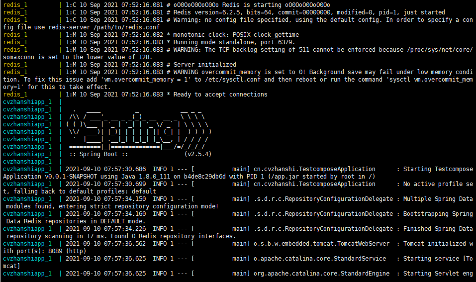

- 测试


# Docker Swarm

> 环境准备，四台1G2核的服务器，且都装上docker

## 工作模式


## 搭建集群

- **注意网络信息，初始是新的系统**：

```sh
[root@iZwz91en47c67mqrimqh1qZ ~]# docker network ls
NETWORK ID     NAME      DRIVER    SCOPE
70d23031710e   bridge    bridge    local
27f603fcaa53   host      host      local
8361a65334cd   none      null      local
```

- **查看swarm有关的命令**：

```sh
[root@iZwz91en47c67mqrimqh1qZ ~]# docker swarm --help

Usage:  docker swarm COMMAND

Manage Swarm

Commands:
  ca          Display and rotate the root CA
  init        Initialize a swarm                             # 初始化一个集群
  join        Join a swarm as a node and/or manager          # 加入一个集群
  join-token  Manage join tokens
  leave       Leave the swarm								 # 离开这个集群
  unlock      Unlock swarm
  unlock-key  Manage the unlock key
  update      Update the swarm								 # 更新这个集群  

[root@iZwz91en47c67mqrimqh1qZ ~]# docker swarm init --help

Options:
      --advertise-addr string                  # 添加一个地址
```

- **初始化节点**

```sh
[root@iZwz91en47c67mqrimqh1qZ ~]# docker swarm init --advertise-addr 172.30.216.232
Swarm initialized: current node (76ube2gppx2ttjvd9xoxrqguv) is now a manager.

To add a worker to this swarm, run the following command: 

    docker swarm join --token SWMTKN-1-41qnb2nyperf3q4taep4vm5wvkfvkzvl9lizrxftomub4lcvyj-7gap2k22qbgpbpo18f7gb4yis 172.30.216.232:2377

To add a manager to this swarm, run 'docker swarm join-token manager' and follow the instructions.
```

- **加入一个节点**

```sh
# 获取令牌
docker swarm join-token manager
docker swarm join-token worker

# 加入节点  加入节点后面的token可以使用初始化节点所提示的命令，可以用获取令牌命令获取令牌
[root@iZwz91en47c67mqrimqh1nZ ~]# docker swarm join --token SWMTKN-1-41qnb2nyperf3q4taep4vm5wvkfvkzvl9lizrxftomub4lcvyj-7gap2k22qbgpbpo18f7gb4yis 172.30.216.232:2377
This node joined a swarm as a worker.
```

**在主节点上查看集群信息** 

```sh
[root@iZwz91en47c67mqrimqh1qZ ~]# docker node ls
ID                            HOSTNAME                  STATUS    AVAILABILITY   MANAGER STATUS   ENGINE VERSION
xom46yqr1p11cywqdc6jgd7kr     iZwz91en47c67mqrimqh1nZ   Ready     Active                          20.10.8
76ube2gppx2ttjvd9xoxrqguv *   iZwz91en47c67mqrimqh1qZ   Ready     Active         Leader           20.10.8
# 其中MANAGER STATUS为空的是worker节点，其他的为管理节点
```

**使用获取令牌命令获取token加入节点（加入的身份为worker）**

```sh
# 在主节点上获取令牌
[root@iZwz91en47c67mqrimqh1qZ ~]# docker swarm join-token worker
To add a worker to this swarm, run the following command:

    docker swarm join --token SWMTKN-1-41qnb2nyperf3q4taep4vm5wvkfvkzvl9lizrxftomub4lcvyj-7gap2k22qbgpbpo18f7gb4yis 172.30.216.232:2377

# 在待加入的机子上运行生成的命令
[root@iZwz91en47c67mqrimqh1pZ ~]# docker swarm join --token SWMTKN-1-41qnb2nyperf3q4taep4vm5wvkfvkzvl9lizrxftomub4lcvyj-7gap2k22qbgpbpo18f7gb4yis 172.30.216.232:2377
This node joined a swarm as a worker.

# 查看信息 发现加入成功
[root@iZwz91en47c67mqrimqh1qZ ~]# docker node ls
ID                            HOSTNAME                  STATUS    AVAILABILITY   MANAGER STATUS   ENGINE VERSION
xom46yqr1p11cywqdc6jgd7kr     iZwz91en47c67mqrimqh1nZ   Ready     Active                          20.10.8
mcxy5wk631jeztqe3sqnlngnk     iZwz91en47c67mqrimqh1pZ   Ready     Active                          20.10.8
76ube2gppx2ttjvd9xoxrqguv *   iZwz91en47c67mqrimqh1qZ   Ready     Active         Leader           20.10.8
```

**加入一个身份为管理者（主节点）的节点**

```sh
# 在主节点获取令牌
[root@iZwz91en47c67mqrimqh1qZ ~]# docker swarm join-token manager
To add a manager to this swarm, run the following command:

    docker swarm join --token SWMTKN-1-41qnb2nyperf3q4taep4vm5wvkfvkzvl9lizrxftomub4lcvyj-8ek87h86njuv3m4o63qhme01p 172.30.216.232:2377
    
# 在待加入的机子上运行生成的命令
[root@iZwz91en47c67mqrimqh1oZ ~]# docker swarm join --token SWMTKN-1-41qnb2nyperf3q4taep4vm5wvkfvkzvl9lizrxftomub4lcvyj-8ek87h86njuv3m4o63qhme01p 172.30.216.232:2377
This node joined a swarm as a manager.

# 查看信息
[root@iZwz91en47c67mqrimqh1qZ ~]# docker node ls
ID                            HOSTNAME                  STATUS    AVAILABILITY   MANAGER STATUS   ENGINE VERSION
xom46yqr1p11cywqdc6jgd7kr     iZwz91en47c67mqrimqh1nZ   Ready     Active                          20.10.8
sntnx89tte1jb7r0t5xq4baor     iZwz91en47c67mqrimqh1oZ   Ready     Active         Reachable        20.10.8
mcxy5wk631jeztqe3sqnlngnk     iZwz91en47c67mqrimqh1pZ   Ready     Active                          20.10.8
76ube2gppx2ttjvd9xoxrqguv *   iZwz91en47c67mqrimqh1qZ   Ready     Active         Leader           20.10.8
# 加入成功 身份为manager
```

初始化一个节点后，把剩余的3个服务器分别加入节点，进行集群的搭建

**集群搭建完毕**：二主二从

## Raft协议

二主二从：假设一个节点挂了！其他节点是否可用

Raft协议：保证大多数节点存活才可以用。管理节点>1台，集群至少大于3台

实验：

1、将docker 1（主节点 leader）机器停止。双主的情况下，另外一个主节点也不能使用


当docker 1重启后发现在swarm集群中还是主节点，但不是leader了


2、让其他管理节点离开（非leader），发现其他主节点还是能用的


3、让其他节点离开集群

```sh
[root@iZwz91en47c67mqrimqh1pZ ~]# docker swarm leave
Node left the swarm.
```

在主节点上查看集群信息


4、让离开的节点以管理者的身份继续加入节点


5、work就是工作的，管理节点操作！经过了上述步骤，已经3台机器设置为了主节点

现在测试将3个主节点一次停止：

- 停止一个，其他的主节点还能正常使用
- 停止两个，其他的主节点已经不能使用了


**Raft协议：保证大多数节点存活，才可以使用，即高可用**

自我理解：如果有一个集群有3个管理节点，若干个工作节点，一个管理节点挂掉了，还剩两个管理节点还能连通，但是再挂一个，只剩一个管理节点的话，那么这个节点挂了代表着整个集群就挂了，就不能用了。**所以给要使集群可用，3个主节点，至少大于1的管理节点存活**

## 体会

集群：swarm  `docker service`

容器 => 服务 => 副本

redis 服务 => 10个副本（即同时开启10个redis容器）

体验：创建服务、动态扩缩容服务、动态更新服务。


- 创建服务并启动

```sh
[root@iZwz91en47c67mqrimqh1pZ ~]# docker service create -p 8888:80 --name my-nginx nginx
```


```
docker run 容器启动！ 不具有扩缩容器
docker service 服务！ 具有扩缩容器，滚动更新
```

- 查看服务 REPLICAS代表副本数


- 动态扩缩容


**集群中启动的服务，集群中任意节点都可以访问。服务可以有多个副本动态扩缩容，实现高可用**！

- 另一个扩缩容的命令

```sh
[root@iZwz91en47c67mqrimqh1pZ ~]# docker service scale my-nginx=5
```


- 移除服务

```sh
docker service rm my-nginx
```


## 概念总结

> swarm

集群的管理和编号。docker可以初始化一个swarm集群，其他节点可以加入。（管理、工作者）

> **Node**

就是一个docker节点，多个节点就组成了一个网络集群（管理、工作者）

> **Service**

任务，可以再管理节点或者工作节点来运行。用来给客户访问

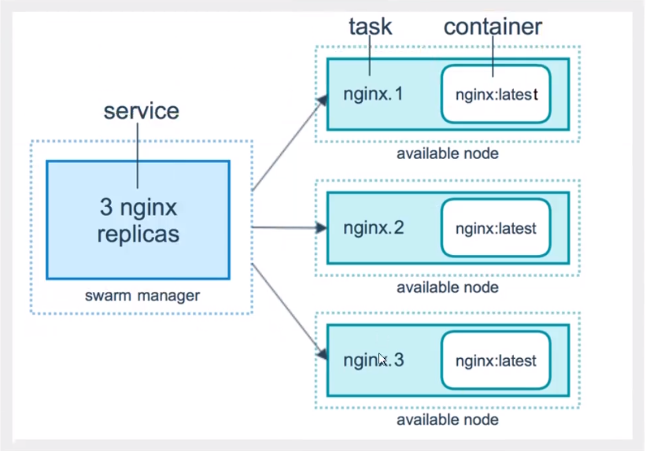

> **Task**

容器内的命令，细节任务！


> 任务与调度


命令 => 管理 => 调度（会进行平均分配） => 工作节点(创建Task容器)

> 服务副本与全局副本


```sh
--mode string
Service mode (replicated or g1oba1) (default "replicated")
docker service create --mode replicated --name mytom tomcat:7 默认的

docker service create --mode g1oba1 --name haha alpine ping baidu. com
#场景?日志收集
每一个节点有自己的日志收集器，过滤。把所有日志最终再传给日志中心
服务监控，状态性能。
```

> 拓展：网络模式 “PublishMode”:"ingress"

Swarm：

Overlay：不同的服务器搭建集群是ping不通的，但是把服务器加入Overlay网络后就能ping通了，相当于一个整体了

insgress：特殊的Overlay网络！负载均衡的功能


虽然docker在4台机器上，实际网络是同一个！ingress网络是一个特殊的Overlay网络


> **自我理解**

那不同的服务器运行docker搭建成集群，在**集群里的节点相当于一个整体**，在一个节点上启动的服务，集群中的所有的节点都能访问。不管在集群中启动的服务有几个副本，对于外界来说都是一样的，都是访问的一个整体。如果访问量太大，**集群内部可以动态的扩缩容**，把访问量分发给不同副本服务上（类似于负载均衡）。

# Docker Stack

docker-compose 单机部署项目

Docker Stack 集群部署

```sh
# 单机
docker-compose up -d wordpess.yaml
# 集群
docker stack deploy wordpess.yaml
```

# Docker Secret

安全、配置密码、证书

```sh
[root@iZwz91en47c67mqrimqh1pZ ~]# docker secret --help

Usage:  docker secret COMMAND

Manage Docker secrets

Commands:
  create      Create a secret from a file or STDIN as content
  inspect     Display detailed information on one or more secrets
  ls          List secrets
  rm          Remove one or more secrets

Run 'docker secret COMMAND --help' for more information on a command.
```

# Docker Config

配置

```sh
[root@iZwz91en47c67mqrimqh1pZ ~]# docker config --help

Usage:  docker config COMMAND

Manage Docker configs

Commands:
  create      Create a config from a file or STDIN
  inspect     Display detailed information on one or more configs
  ls          List configs
  rm          Remove one or more configs

Run 'docker config COMMAND --help' for more information on a command.
```

