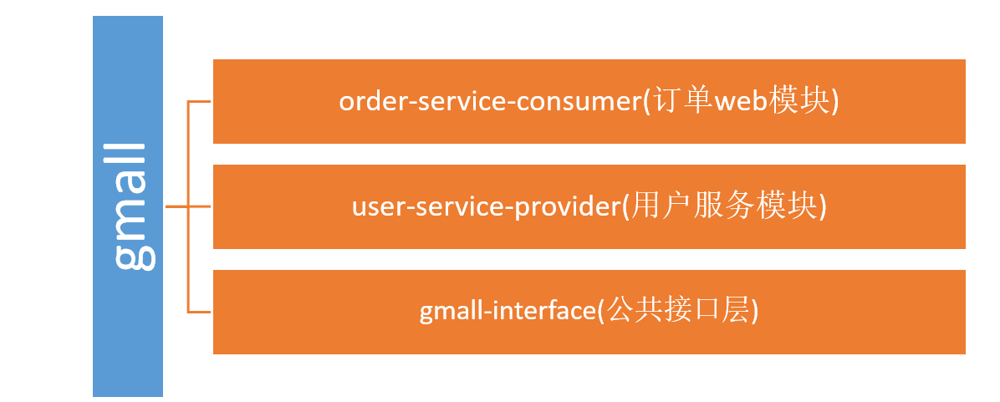
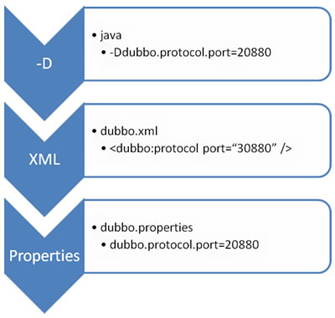
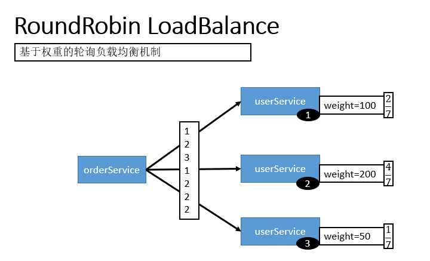
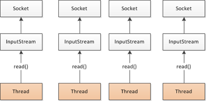
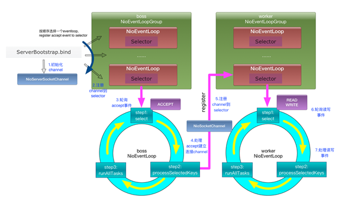
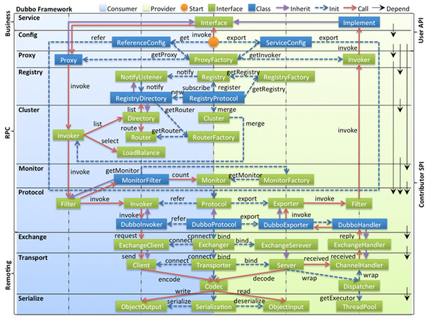

  # 一、概述

## 1.1 分布式基础理论

- 分布式系统是若干独立计算机的集合，这些计算机对于用户来说就像单个相关系统

- 分布式系统（distributed system）是建立在网络之上的软件系统

> RPC

**RPC概述**

RPC【Remote Procedure Call】是指远程过程调用，是一种进程间通信方式，他是一种技术的思想，而不是规范。它允许程序调用另一个地址空间（通常是共享网络的另一台机器上）的过程或函数，而不用程序员显式编码这个远程调用的细节。即程序员无论是调用本地的还是远程的函数，本质上编写的调用代码基本相同

**RPC基本原理**


示例：


==RPC两个核心模块：通讯，序列化==，

## 1.2 Dubbo核心概念

> 简介

- Apache Dubbo (incubating) |ˈdʌbəʊ| 是一款高性能、轻量级的开源Java RPC框架，它提供了六大核心能力：面**向接口代理的高性能RPC调用，智能容错和负载均衡，服务自动注册和发现，高度可扩展能力，运行期流量调度，可视化的服务治理与运维**。

- 官网：http://dubbo.apache.org/

> 基本概念


- **服务提供者（Provider）**：暴露服务的服务提供方，服务提供者在启动时，向注册中心注册自己提供的服务。

- **服务消费者（Consumer）**: 调用远程服务的服务消费方，服务消费者在启动时，向注册中心订阅自己所需的服务，服务消费者，从提供者地址列表中，基于软负载均衡算法，选一台提供者进行调用，如果调用失败，再选另一台调用。

- **注册中心（Registry）**：注册中心返回服务提供者地址列表给消费者，如果有变更，注册中心将基于长连接推送变更数据给消费者

- **监控中心（Monitor）**：服务消费者和提供者，在内存中累计调用次数和调用时间，定时每分钟发送一次统计数据到监控中心

**调用关系说明**

- 服务容器负责启动，加载，运行服务提供者。

- 服务提供者在启动时，向注册中心注册自己提供的服务。

- 服务消费者在启动时，向注册中心订阅自己所需的服务。

- 注册中心返回服务提供者地址列表给消费者，如果有变更，注册中心将基于长连接推送变更数据给消费者。

- 服务消费者，从提供者地址列表中，基于软负载均衡算法，选一台提供者进行调用，如果调用失败，再选另一台调用。

- 服务消费者和提供者，在内存中累计调用次数和调用时间，定时每分钟发送一次统计数据到监控中心。

## 1.3 Dubbo环境搭建

> 下载安装zookeeper

- 下载地址：https://archive.apache.org/dist/zookeeper/zookeeper-3.4.13/
- 解压zookeeper，运行bin目录下的zkServer.cmd，初次运行会报错，没有zoo.zfg配置文件
- 将conf下的zoo_sample.cfg复制一份改名为zoo.cfg即可
- 修改完成后再次启动zookeeper即可

> 安装dubbo-admin管理控制台

- 下载dubbo-admin：https://github.com/apache/incubator-dubbo-ops

- 进入目录，修改dubbo-admin配置

  - 修改 src\main\resources\application.properties 指定zookeeper地址

    ```properties
    dubbo.registry.address=zookeeper://127.0.0.1:2181
    ```

- 打包dubbo-admin

  ```bash
  mvn clean package -Dmaven.test.skip=true
  ```

- 运行dubbo-admin

  java -jar dubbo-admin-0.0.1-SNAPSHOT.jar

  **注意：【有可能控制台看着启动了，但是网页打不开，需要在控制台按下ctrl+c即可】**

  默认使用root/root 登陆

  

## 1.4 Dubbo-helloworld

> 提出需求

某个电商系统，订单服务需要调用用户服务获取某个用户的所有地址；

我们现在 需要创建两个服务模块进行测试


测试预期结果：

​     订单服务web模块在A服务器，用户服务模块在B服务器，A可以远程调用B的功能。

> 创建模块



**gmall-interface：公共接口层（model，service，exception…）**

作用：定义公共接口，也可以导入公共依赖

- bean模型UserAddress

  ```java
  /**
   * 用户地址
   * @author cVzhanshi
   *
   */
  public class UserAddress implements Serializable {
  	
  	private Integer id;
      private String userAddress; //用户地址
      private String userId; //用户id
      private String consignee; //收货人
      private String phoneNum; //电话号码
      private String isDefault; //是否为默认地址    Y-是     N-否
  	...
      有参无参构造器，setting&getting方法
  }
  ```

- Service接口

  OrderService

  ```java
  /**
   * @author cVzhanshi
   * @create 2021-10-25 10:53
   */
  public interface OrderService {
  
      /**
       * 初始化订单
       * @param userId
       */
      public List<UserAddress> initOrder(String userId);
  }
  ```

  UserService

  ```java
  /**
   * 用户服务
   * @author cVzhanshi
   * @create 2021-10-25 10:53
   */
  public interface UserService {
  	
  	/**
  	 * 按照用户id返回所有的收货地址
  	 * @param userId
  	 * @return
  	 */
  	public List<UserAddress> getUserAddressList(String userId);
  
  }
  ```

**user-service-provider：用户模块（对用户接口的实现）**

- pom.xml

  ```xml
  <dependencies>
      <dependency>
          <groupId>cn.cvzhanshi.gmall</groupId>
          <artifactId>gmall-interface</artifactId>
          <version>1.0-SNAPSHOT</version>
      </dependency>
      <!-- https://mvnrepository.com/artifact/com.alibaba/dubbo -->
      <dependency>
          <groupId>com.alibaba</groupId>
          <artifactId>dubbo</artifactId>
          <version>2.6.2</version>
      </dependency>
      <dependency>
          <groupId>org.apache.curator</groupId>
          <artifactId>curator-framework</artifactId>
          <version>2.12.0</version>
      </dependency>
  </dependencies>
  ```

- UserServiceImpl

  ```java
  public class UserServiceImpl implements UserService {
  
  	@Override
  	public List<UserAddress> getUserAddressList(String userId) {
  		System.out.println("UserServiceImpl.....old...");
  		// TODO Auto-generated method stub
  		UserAddress address1 = new UserAddress(1, "北京市昌平区宏福科技园综合楼3层", "1", "李老师", "010-56253825", "Y");
  		UserAddress address2 = new UserAddress(2, "深圳市宝安区西部层（深圳分校）", "1", "王老师", "010-56253825", "N");
  		/*try {
  			Thread.sleep(4000);
  		} catch (InterruptedException e) {
  			// TODO Auto-generated catch block
  			e.printStackTrace();
  		}*/
  		return Arrays.asList(address1,address2);
  	}
  
  }
  ```

- Spring的配置文件provider.xml

  ```xml
  <beans xmlns:xsi="http://www.w3.org/2001/XMLSchema-instance"
         xmlns:dubbo="http://dubbo.apache.org/schema/dubbo"
         xmlns="http://www.springframework.org/schema/beans"
         xsi:schemaLocation="http://www.springframework.org/schema/beans 
                             http://www.springframework.org/schema/beans/spring-beans.xsd
         http://dubbo.apache.org/schema/dubbo http://dubbo.apache.org/schema/dubbo/dubbo.xsd">
  
      <!--当前应用的名字  -->
      <dubbo:application name="user-service-provider"></dubbo:application>
      <!--指定注册中心的地址  -->
      <dubbo:registry protocol="zookeeper" address="127.0.0.1:2181"></dubbo:registry>
      <!--使用dubbo协议，将服务暴露在20880端口  -->
      <dubbo:protocol name="dubbo" port="20880"></dubbo:protocol>
      <!--暴露服务-->
      <dubbo:service interface="cn.cvzhanshi.gmall.service.UserService" ref="userServiceImpl"></dubbo:service>
  
      <!--服务的实现类，交给spring管理-->
      <bean id="userServiceImpl" class="cn.cvzhanshi.gmall.service.impl.UserServiceImpl"/>
      <!--连接监控中心-->
      <dubbo:monitor protocol="registry"></dubbo:monitor>
  </beans>
  ```

- main函数启动

  ```java
  /**
   * @author cVzhanshi
   * @create 2021-10-25 11:19
   */
  public class MainApplication {
      public static void main(String[] args) {
          ClassPathXmlApplicationContext ioc = new ClassPathXmlApplicationContext("provider.xml");
          ioc.start();
  
          try {
              System.in.read();
          } catch (Exception e) {
              e.printStackTrace();
          }
      }
  }
  ```

**order-service-consumer：订单模块（调用用户模块）**

- pom.xml

  ```xml
  <dependencies>
      <dependency>
          <groupId>cn.cvzhanshi.gmall</groupId>
          <artifactId>gmall-interface</artifactId>
          <version>1.0-SNAPSHOT</version>
      </dependency>
      <dependency>
          <groupId>com.alibaba</groupId>
          <artifactId>dubbo</artifactId>
          <version>2.6.2</version>
      </dependency>
      <!-- 由于我们使用zookeeper作为注册中心，所以需要操作zookeeper
              dubbo 2.6以前的版本引入zkclient操作zookeeper
              dubbo 2.6及以后的版本引入curator操作zookeeper
              下面两个zk客户端根据dubbo版本2选1即可
          -->
      <dependency>
          <groupId>org.apache.curator</groupId>
          <artifactId>curator-framework</artifactId>
          <version>2.12.0</version>
      </dependency>
  </dependencies>
  ```

- Sping配置文件

  ```xml
  <beans xmlns:xsi="http://www.w3.org/2001/XMLSchema-instance"
         xmlns:dubbo="http://dubbo.apache.org/schema/dubbo"
         xmlns="http://www.springframework.org/schema/beans"
         xmlns:context="http://www.springframework.org/schema/context"
         xsi:schemaLocation="http://www.springframework.org/schema/beans 
         http://www.springframework.org/schema/beans/spring-beans.xsd
         http://dubbo.apache.org/schema/dubbo http://dubbo.apache.org/schema/dubbo/dubbo.xsd
         http://www.springframework.org/schema/context http://www.springframework.org/schema/context/spring-context.xsd">
  
      <context:component-scan base-package="cn.cvzhanshi.gmall.service.Impl"></context:component-scan>
      <!--当前应用的名字  -->
      <dubbo:application name="order-service-consumer"></dubbo:application>
      <!--指定注册中心的地址  -->
      <dubbo:registry protocol="zookeeper" address="127.0.0.1:2181"></dubbo:registry>
      <!--声明需要调用的远程服务的接口，生成远程服务代理-->
      <dubbo:reference interface="cn.cvzhanshi.gmall.service.UserService" id="userService"></dubbo:reference>
      <!--连接监控中心-->
      <dubbo:monitor protocol="registry"></dubbo:monitor>
  
  </beans>
  ```

- OrderServiceImpl

  ```java
  @Service
  public class OrderServiceImpl implements OrderService {
  
      @Autowired
      UserService userService;
  
      @Override
      public List<UserAddress> initOrder(String userId) {
          //1、查询用户的收货地址
          System.out.println("用户id：" + userId);
          List<UserAddress> addressList = userService.getUserAddressList(userId);
          addressList.forEach(address -> {
              System.out.println(address.getUserAddress());
          });
          return addressList;
      }
  }
  ```

- 启动

  ```java
  /**
   * @author cVzhanshi
   * @create 2021-10-25 11:36
   */
  public class MainApplication {
      public static void main(String[] args) {
          ClassPathXmlApplicationContext context = new ClassPathXmlApplicationContext("consumer.xml");
          OrderService orderService = context.getBean(OrderService.class);
          orderService.initOrder("1");
          System.out.println("调用完成");
          try {
              System.in.read();
          } catch (IOException e) {
              e.printStackTrace();
          }
      }
  }
  ```

## 1.5 监控中心

- 在环境搭建中下载的dubbo-admin中有一个dubbo-monitor-simple项目，对此项目进行打包会得到一个压缩包，解压压缩包

- 所有服务配置连接监控中心，进行监控统计

  ```xml
  <!-- 监控中心协议，如果为protocol="registry"，表示从注册中心发现监控中心地址，否则直连监控中心 -->
  <dubbo:monitor protocol="registry"></dubbo:monitor>
  ```

## 1.6 整合SpringBoot

- 创建SpringBoot项目

- 导入依赖

  ```xml
  <!-- https://mvnrepository.com/artifact/com.alibaba.boot/dubbo-spring-boot-starter -->
  <dependency>
      <groupId>com.alibaba.boot</groupId>
      <artifactId>dubbo-spring-boot-starter</artifactId>
      <version>0.2.0</version>
  </dependency>
  ```

  

- 编写配置文件

  ```yaml
  dubbo:
    application:
      name: boot-user-service-provider
    registry:
      protocol: zookeeper
      address: 127.0.0.1:2181
    protocol:
      name: dubbo
      port: 20880
    monitor:
      protocol: registry
      
  # application.name就是服务名，不能跟别的dubbo提供端重复
  # registry.protocol 是指定注册中心协议
  # registry.address 是注册中心的地址加端口号
  # protocol.name 是分布式固定是dubbo,不要改。
  # base-package  注解方式要扫描的包
  
  ```

- dubbo注解

  @Service、@Reference代替了服务暴露，和使用服务

  **如果没有在配置中写dubbo.scan.base-package,还需要使用@EnableDubbo注解**

- UsererviceImpl

  ```java
  @Service  // 服务暴露
  @Component
  public class UserServiceImpl implements UserService {
  
  	@Override
  	public List<UserAddress> getUserAddressList(String userId) {
  		System.out.println("UserServiceImpl.....old...");
  		// TODO Auto-generated method stub
  		UserAddress address1 = new UserAddress(1, "北京市昌平区宏福科技园综合楼3层", "1", "李老师", "010-56253825", "Y");
  		UserAddress address2 = new UserAddress(2, "深圳市宝安区西部层（深圳分校）", "1", "王老师", "010-56253825", "N");
  		/*try {
  			Thread.sleep(4000);
  		} catch (InterruptedException e) {
  			// TODO Auto-generated catch block
  			e.printStackTrace();
  		}*/
  		return Arrays.asList(address1,address2);
  	}
  
  }
  ```

- OrderServiceImpl

  ```java
  @Service
  public class OrderServiceImpl implements OrderService {
  
      @Reference  // 调用远程服务
      UserService userService;
  
      @Override
      public List<UserAddress> initOrder(String userId) {
          //1、查询用户的收货地址
          System.out.println("用户id：" + userId);
          List<UserAddress> addressList = userService.getUserAddressList(userId);
          return addressList;
      }
  }
  ```

# 二、Dubbo配置

## 2.1 Dubbo的配置的加载顺序

**配置原则**



- JVM 启动 -D 参数优先，这样可以使用户在部署和启动时进行参数重写，比如在启动时需改变协议的端口。
- XML（application.yaml） 次之，如果在 XML 中有配置，则 dubbo.properties 中的相应配置项无效。
- Properties 最后，相当于缺省值，只有 XML 没有配置时，dubbo.properties 的相应配置项才会生效，通常用于共享公共配置，比如应用名。

## 2.2 启动检测

Dubbo缺省会在启动时检查依赖的服务是否可用，不可用时会抛出异常，阻止Spring初始化完成，以便上线时，能及早发现问题，默认check="true" 。可以通过check="false" 关闭检查,比如，测试时，有些服务不关心,或者出现了循环依赖，必须有一方先启动。另外，如果你的Spring容器是懒加载的，或者通过API编程延迟引用服务,请关闭check,否则服务临时不可用时，会抛出异常，拿到null引用，如果check="false", 总是会返回引用，当服务恢复时，能自动连上。

**配置如下**

```xml
<!-- 配置一个 -->
<dubbo:reference interface="cn.cvzhanshi.gmall.service.UserService" id="userService" check="false"></dubbo:reference>
<!-- 配置全局 -->
<dubbo:consumer check="false"></dubbo:consumer>
```

## 2.3 超时&配置覆盖关系

由于网络或服务端不可靠，会导致调用出现一种不确定的中间状态（超时）。为了避免超时导致客户端资源（线程）挂起耗尽，必须设置超时时间。

**Dubbo消费端**

```xml
全局超时配置
<dubbo:consumer timeout="5000" />

指定接口以及特定方法超时配置
<dubbo:reference interface="com.foo.BarService" timeout="2000">
    <dubbo:method name="sayHello" timeout="3000" />
</dubbo:reference>
```

**Dubbo服务端**

```xml
全局超时配置	
<dubbo:provider timeout="5000" />

指定接口以及特定方法超时配置
<dubbo:provider interface="com.foo.BarService" timeout="2000">
    <dubbo:method name="sayHello" timeout="3000" />
</dubbo:provider>
```

> 配置原则

以 timeout 为例，下图显示了配置的查找顺序，其它 retries, loadbalance, actives 等类似：

- **方法级优先，接口级次之，全局配置再次之。**
- **如果级别一样，则消费方优先，提供方次之。**

其中，服务提供方配置，通过 URL 经由注册中心传递给消费方。


（建议由服务提供方设置超时，因为一个方法需要执行多长时间，服务提供方更清楚，如果一个消费方同时引用多个服务，就不需要关心每个服务的超时设置）。

## 2.4 重试次数

失败自动切换，当出现失败，重试其它服务器，但重试会带来更长延迟。可通过 retries="2" 来设置重试次数(不含第一次)。

```xml
重试次数配置如下：
<dubbo:service retries="2" />
或
<dubbo:reference retries="2" />
或
<dubbo:reference>
    <dubbo:method name="findFoo" retries="2" />
</dubbo:reference>
```

幂等（设置重试次数）【查询、删除、修改】，非幂等（不能设置重试次数）【新增】

## 2.5 多版本

当一个接口实现，出现不兼容升级时，可以用版本号过渡，版本号不同的服务相互间不引用。

可以按照以下的步骤进行版本迁移：

- 在低压力时间段，先升级一半提供者为新版本
- 再将所有消费者升级为新版本
- 然后将剩下的一半提供者升级为新版本

```xml
老版本服务提供者配置：
<dubbo:service interface="com.foo.BarService" version="1.0.0" />

新版本服务提供者配置：
<dubbo:service interface="com.foo.BarService" version="2.0.0" />

老版本服务消费者配置：
<dubbo:reference id="barService" interface="com.foo.BarService" version="1.0.0" />

新版本服务消费者配置：
<dubbo:reference id="barService" interface="com.foo.BarService" version="2.0.0" />

如果不需要区分版本，可以按照以下的方式配置：
<dubbo:reference id="barService" interface="com.foo.BarService" version="*" />
```

## 2.6 本地存根

远程服务后，客户端通常只剩下接口，而实现全在服务器端，但提供方有些时候想在客户端也执行部分逻辑，比如:**做ThreadLocal缓存，提前验证参数,调用失败后伪造容错数据**等等，此时就需要在API中带上Stub,客户端生成Proxy实例，会把Proxy通过构造函数传给Stub [1],然后把Stub暴露给用户，Stub 可以决定要不要去调Proxy。


使用方法：

```xml
在 spring 配置文件中按以下方式配置：
<dubbo:service interface="com.foo.BarService" stub="true" />
或
<dubbo:service interface="com.foo.BarService" stub="com.foo.BarServiceStub" />
```

提供 Stub 的实现

```java
package com.foo;
public class BarServiceStub implements BarService {
    private final BarService barService;
    
    // 构造函数传入真正的远程代理对象
    public BarServiceStub(BarService barService){
        this.barService = barService;
    }
 
    public String sayHello(String name) {
        // 此代码在客户端执行, 你可以在客户端做ThreadLocal本地缓存，或预先验证参数是否合法，等等
        try {
            return barService.sayHello(name);
        } catch (Exception e) {
            // 你可以容错，可以做任何AOP拦截事项
            return "容错数据";
        }
    }
}
```

1. Stub 必须有可传入 Proxy 的构造函数。
2. 在 interface 旁边放一个 Stub 实现，它实现 BarService 接口，并有一个传入远程 BarService 实例的构造函数

## 2.7 SpringBoot与Dubbo整合的三种方式

- 导入dubbo-start，在application.yaml配置属性，使用@Service【暴露服务】使用@Reference【应用服务】
- 保留Dubbo.xml配置文件
  - 导入dubbo-starter，使用@ImportResource导入dubbo的配置文件
- 使用注释API的方式：
  - 将每一个组件收哦的那个创建到容器中，让Dubbo来扫描其他的组件

# 三、高可用

## 3.1 zookeeper宕机和Dubbo直连

> zookeeper宕机

现象：zookeeper注册中心宕机，还可以消费dubbo暴露的服务。

**原因：健壮性**

- 监控中心宕掉不影响使用，只是丢失部分采样数据  
- 数据库宕掉后，注册中心仍能通过缓存提供服务列表查询，但不能注册新服务  
- 注册中心对等集群，任意一台宕掉后，将自动切换到另一台 
- **注册中心全部宕掉后，服务提供者和服务消费者仍能通过本地缓存通讯** 
- 服务提供者无状态，任意一台宕掉后，不影响使用  
- 服务提供者全部宕掉后，服务消费者应用将无法使用，并无限次重连等待服务提供者恢复     

高可用：通过设计，减少系统不能提供服务的时间；

> Dubbo直连

直接指定url，跳过注册中心

```java
@Reference(url = "127.0.0.1:20880")
UserService userService;
```

## 3.2 集群下dubbo负载均衡配置

在集群负载均衡时，Dubbo 提供了多种均衡策略，缺省为 random 随机调用。

> 负载均衡策略

| 算法                        | 特性                    | 备注                                            |
| :-------------------------- | :---------------------- | :---------------------------------------------- |
| RandomLoadBalance           | 加权随机                | 默认算法，默认权重相同                          |
| RoundRobinLoadBalance       | 加权轮询                | 借鉴于 Nginx 的平滑加权轮询算法，默认权重相同， |
| LeastActiveLoadBalance      | 最少活跃优先 + 加权随机 | 背后是能者多劳的思想                            |
| ShortestResponseLoadBalance | 最短响应优先 + 加权随机 | 更加关注响应速度                                |
| ConsistentHashLoadBalance   | 一致性 Hash             | 确定的入参，确定的提供者，适用于有状态请求      |

**Random LoadBalance**

- 随机，按权重设置随机概率。

- 在一个截面上碰撞的概率高，但调用量越大分布越均匀，而且按概率使用权重后也比较均匀，有利于动态调整提供者权重。

  

**RoundRobin LoadBalance**

- 轮循，按公约后的权重设置轮循比率。

- 存在慢的提供者累积请求的问题，比如：第二台机器很慢，但没挂，当请求调到第二台时就卡在那，久而久之，所有请求都卡在调到第二台上

  

**LeastActive LoadBalance**

- 最少活跃调用数，相同活跃数的随机，活跃数指调用前后计数差。

- 使慢的提供者收到更少请求，因为越慢的提供者的调用前后计数差会越大。

  

**ConsistentHash LoadBalance**

- 一致性 Hash，相同参数的请求总是发到同一提供者。

- 当某一台提供者挂时，原本发往该提供者的请求，基于虚拟节点，平摊到其它提供者，不会引起剧烈变动。

- 算法参见：[Consistent Hashing | WIKIPEDIA](http://en.wikipedia.org/wiki/Consistent_hashing)

- 缺省只对第一个参数 Hash，如果要修改，请配置 `<dubbo:parameter key="hash.arguments" value="0,1" />`

- 缺省用 160 份虚拟节点，如果要修改，请配置 `<dubbo:parameter key="hash.nodes" value="320" />`

  

>  配置

**服务端服务级别**

```xml
<dubbo:service interface="..." loadbalance="roundrobin" />
```

**客户端服务级别**

```xml
<dubbo:reference interface="..." loadbalance="roundrobin" />
```

**服务端方法级别**

```xml
<dubbo:service interface="...">
    <dubbo:method name="..." loadbalance="roundrobin"/>
</dubbo:service>
```

**客户端方法级别**

```xml
<dubbo:reference interface="...">
    <dubbo:method name="..." loadbalance="roundrobin"/>
</dubbo:reference>
```

## 3.3 服务降级

**当服务器压力剧增的情况下，根据实际业务情况及流量，对一些服务和页面有策略的不处理或换种简单的方式处理，从而释放服务器资源以保证核心交易正常运作或高效运作。**

可以通过服务降级功能临时屏蔽某个出错的非关键服务，并定义降级后的返回策略。

向注册中心写入动态配置覆盖规则：

```
RegistryFactory registryFactory = ExtensionLoader.getExtensionLoader(RegistryFactory.class).getAdaptiveExtension();
Registry registry = registryFactory.getRegistry(URL.valueOf("zookeeper://10.20.153.10:2181"));
registry.register(URL.valueOf("override://0.0.0.0/com.foo.BarService?category=configurators&dynamic=false&application=foo&mock=force:return+null"));
```

其中：

- mock=force:return+null 表示消费方对该服务的方法调用都**直接返回 null 值**，**不发起远程调用**。用来屏蔽不重要服务不可用时对调用方的影响。

- 还可以改为 mock=fail:return+null 表示消费方对该服务的方法调**用在失败后，再返回 null 值**，不抛异常。用来容忍不重要服务不稳定时对调用方的影响。


## 3.4 集群容错

在集群调用失败时，Dubbo 提供了多种容错方案，缺省为 failover 重试。

```xml
Failover Cluster
失败自动切换，当出现失败，重试其它服务器。通常用于读操作，但重试会带来更长延迟。可通过 retries="2" 来设置重试次数(不含第一次)。

重试次数配置如下：
<dubbo:service retries="2" />
或
<dubbo:reference retries="2" />
或
<dubbo:reference>
    <dubbo:method name="findFoo" retries="2" />
</dubbo:reference>

Failfast Cluster
快速失败，只发起一次调用，失败立即报错。通常用于非幂等性的写操作，比如新增记录。

Failsafe Cluster
失败安全，出现异常时，直接忽略。通常用于写入审计日志等操作。

Failback Cluster
失败自动恢复，后台记录失败请求，定时重发。通常用于消息通知操作。

Forking Cluster
并行调用多个服务器，只要一个成功即返回。通常用于实时性要求较高的读操作，但需要浪费更多服务资源。可通过 forks="2" 来设置最大并行数。

Broadcast Cluster
广播调用所有提供者，逐个调用，任意一台报错则报错 [2]。通常用于通知所有提供者更新缓存或日志等本地资源信息。

集群模式配置
按照以下示例在服务提供方和消费方配置集群模式
<dubbo:service cluster="failsafe" />
或
<dubbo:reference cluster="failsafe" />
```

## 3.5 整合hystrix

Hystrix 旨在通过控制那些访问远程系统、服务和第三方库的节点，从而对延迟和故障提供更强大的容错能力。Hystrix具备拥有回退机制和断路器功能的线程和信号隔离，请求缓存和请求打包，以及监控和配置等功能

- **导入hystrix依赖**

  ```xml
  <dependency>
      <groupId>org.springframework.cloud</groupId>
      <artifactId>spring-cloud-starter-netflix-hystrix</artifactId>
      <version>2.2.9.RELEASE</version>
  </dependency>
  ```

  注意SpringBoot版本和hystrix版本可能出现不兼容现象，然后报错

- 在Provider和Consumer的主启动类上添加注解@EnableHystrix

- 配置Provider端

  ```java
  @HystrixCommand
  @Override
  public List<UserAddress> getUserAddressList(String userId) {
      System.out.println("UserServiceImpl.....old...");
      // TODO Auto-generated method stub
      UserAddress address1 = new UserAddress(1, "北京市昌平区宏福科技园综合楼3层", "1", "李老师", "010-56253825", "Y");
      UserAddress address2 = new UserAddress(2, "深圳市宝安区西部层（深圳分校）", "1", "王老师", "010-56253825", "N");
      if(Math.random() > 0.5) {
          throw new RuntimeException("出错啦");
      }
      return Arrays.asList(address1,address2);
  }
  ```

- 配置Consumer端

  ```java
  @HystrixCommand(fallbackMethod = "hello")
  @Override
  public List<UserAddress> initOrder(String userId) {
      //1、查询用户的收货地址
      System.out.println("用户id：" + userId);
      List<UserAddress> addressList = userService.getUserAddressList(userId);
      return addressList;
  }
  
  
  public List<UserAddress> hello(String userId) {
      //1、查询用户的收货地址
  
      return Arrays.asList(new UserAddress(1, "北京市昌平区宏福科技园综合楼3层", "1", "李老师", "010-56253825", "Y"));
  }
  ```

# 四、Dubbo原理

## 4.1 RPC原理


一次完整的RPC调用流程（同步调用，异步另说）如下： 

1. **服务消费方（client）调用以本地调用方式调用服务**； 
2. client stub接收到调用后负责将方法、参数等组装成能够进行网络传输的消息体； 
3. client stub找到服务地址，并将消息发送到服务端； 
4. server stub收到消息后进行解码； 
5. server stub根据解码结果调用本地的服务； 
6. 本地服务执行并将结果返回给server stub； 
7. server stub将返回结果打包成消息并发送至消费方； 
8. client stub接收到消息，并进行解码； 
9. **服务消费方得到最终结果**。

**RPC框架的目标就是要2~8这些步骤都封装起来，这些细节对用户来说是透明的，不可见的。**

## 4.2 Netty通信原理

Netty是一个异步事件驱动的网络应用程序框架， 用于快速开发可维护的高性能协议服务器和客户端。它极大地简化并简化了TCP和UDP套接字服务器等网络编程。

BIO：(Blocking IO)



NIO (Non-Blocking IO)


Selector 一般称 为**选择器** ，也可以翻译为 **多路复用器，**

Connect（连接就绪）、Accept（接受就绪）、Read（读就绪）、Write（写就绪）

**Netty基本原理**：



## 4.3 Dubbo原理

### 4.3.1 Dubbo框架设计图



- config 配置层：对外配置接口，以 ServiceConfig, ReferenceConfig 为中心，可以直接初始化配置类，也可以通过 spring 解析配置生成配置类
- proxy 服务代理层：服务接口透明代理，生成服务的客户端 Stub 和服务器端 Skeleton, 以 ServiceProxy 为中心，扩展接口为 ProxyFactory
- registry 注册中心层：封装服务地址的注册与发现，以服务 URL 为中心，扩展接口为 RegistryFactory, Registry, RegistryService
- cluster 路由层：封装多个提供者的路由及负载均衡，并桥接注册中心，以 Invoker 为中心，扩展接口为 Cluster, Directory, Router, LoadBalance
- monitor 监控层：RPC 调用次数和调用时间监控，以 Statistics 为中心，扩展接口为 MonitorFactory, Monitor, MonitorService
- protocol 远程调用层：封装 RPC 调用，以 Invocation, Result 为中心，扩展接口为 Protocol, Invoker, Exporter
- exchange 信息交换层：封装请求响应模式，同步转异步，以 Request, Response 为中心，扩展接口为 Exchanger, ExchangeChannel, ExchangeClient, ExchangeServer
- transport 网络传输层：抽象 mina 和 netty 为统一接口，以 Message 为中心，扩展接口为 Channel, Transporter, Client, Server, Codec
- serialize 数据序列化层：可复用的一些工具，扩展接口为 Serialization, ObjectInput, ObjectOutput, ThreadPool

### 4.3.2 启动解析、加载配置信息

DubboBeanDefinitionParser：Dubbo标签解析器

- 解析器是通过传过来的标签，beanClass来获取某个属性的值和设置某个属性的值
- 目的：就是解析出配置文件的配置，不同的标签解析出来保存到xxxConfig中（ServiceBean和ReferenceBean例外是xxxBean）


DubboNamespaceHandler：Dubbo命名空间处理器

- 解析什么标签就new一个对应的beanClass的标签解析器


### 4.3.3 服务暴露流程


-----


### 4.3.4 服务引用流程


### 4.3.5 服务调用流程


