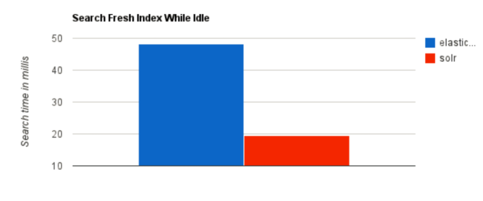
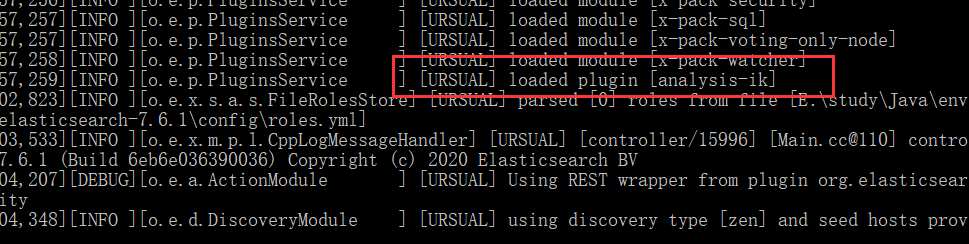
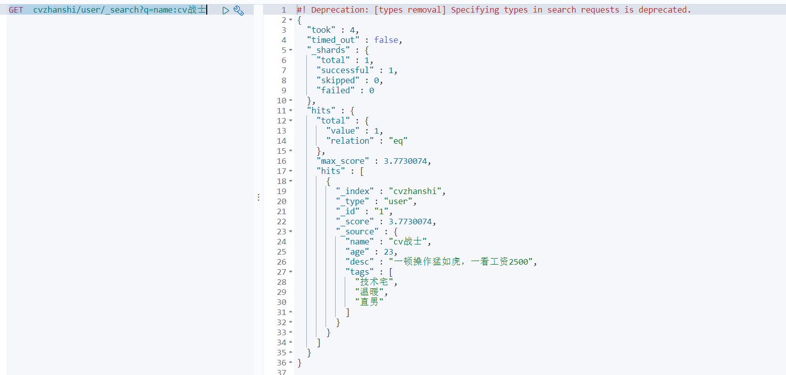

# 一、ElasticSearch 概述

## 1.1 ElasticSearch 简介

>  `ElasticSearch` 是基于 `Lucene` 做了一些封装和增强。而 `Lucene` 是一套信息检索工具包！ `jar` 包！ 不包含 搜索引擎系统！  包含的：索引结构！ 读写索引的工具！排序，搜索规则… 工具类！ 

Elaticsearch，简称为 es， es 是一个开源的**高扩展的分布式全文检索引擎**，它可以近乎**实时的存储、检索数据**；**本身扩展性很好，可以扩展到上百台服务器，处理 PB 级别（大数据时代）的数据**。es 也使用 Java 开发并使用 Lucene 作为其核心来实现所有索引和搜索的功能，但是它的目的是通过简单的 RESTful API 来隐藏 Lucene 的复杂性，从而让全文搜索变得简单。

-----

**Elasticsearch 是一个实时分布式搜索和分析引擎。它让你以前所未有的速度处理大数据成为可能。**

它用于**全文搜索、结构化搜索、分析**以及将这三者混合使用：

- 维基百科使用 Elasticsearch 提供全文搜索并高亮关键字，以及输入实时搜索(search-asyou-type)和搜索纠错(did-you-mean)等搜索建议功能。
- 英国卫报使用 Elasticsearch 结合用户日志和社交网络数据提供给他们的编辑以实时的反馈，以便及时了解公众对新发表的文章的回应。
- StackOverflow 结合全文搜索与地理位置查询，以及 more-like-this 功能来找到相关的问题和答案。
- Github 使用 Elasticsearch 检索 1300 亿行的代码。
- 但是 Elasticsearch 不仅用于大型企业，它还让像 DataDog 以及 Klout 这样的创业公司将最初的想法变成可扩展的解决方案。
- Elasticsearch 可以在你的笔记本上运行，也可以在数以百计的服务器上处理 PB 级别的数据 。
- Elasticsearch 是一个基于 Apache Lucene(TM)的开源搜索引擎。无论在开源还是专有领域，Lucene 可以被认为是迄今为止最先进、性能最好的、功能最全的搜索引擎库。
- 但是，Lucene 只是一个库。想要使用它，你必须使用 Java 来作为开发语言并将其直接集成到你的应用中，更糟糕的是，Lucene 非常复杂，你需要深入了解检索的相关知识来理解它是如何工作的。
- **Elasticsearch 也使用 Java 开发并使用 Lucene 作为其核心来实现所有索引和搜索的功能，但是它的目的是通过简单的 RESTful API 来隐藏 Lucene 的复杂性，从而让全文搜索变得简单**。

> 谁在使用

- 维基百科，类似百度百科，全文检索，高亮，搜索推荐/2 （权重，百度！）

- The Guardian（国外新闻网站），类似搜狐新闻，用户行为日志（点击，浏览，收藏，评论）+社交网络数据（对某某新闻的相关看法），数据分析，给到每篇新闻文章的作者，让他知道他的文章的公众反馈（好，坏，热门，垃圾，鄙视，崇拜）

- Stack Overflow（国外的程序异常讨论论坛），IT 问题，程序的报错，提交上去，有人会跟你讨论和回答，全文检索，搜索相关问题和答案，程序报错了，就会将报错信息粘贴到里面去，搜索有没有对应的答案

- GitHub（开源代码管理），搜索上千亿行代码

- 电商网站，检索商品
- 日志数据分析，logstash 采集日志，ES 进行复杂的数据分析，**ELK 技术， elasticsearch+logstash+kibana**

- 商品价格监控网站，用户设定某商品的价格阈值，当低于该阈值的时候，发送通知消息给用户，比如说订阅牙膏的监控，如果高露洁牙膏的家庭套装低于 50 块钱，就通知我，我就去买。

- BI 系统，商业智能，Business Intelligence。比如说有个大型商场集团，BI，分析一下某某区域最近3 年的用户消费金额的趋势以及用户群体的组成构成，产出相关的数张报表，**区，最近 3 年，每年消费金额呈现 100%的增长，而且用户群体 85%是高级白领，开一个新商场。ES 执行数据分析和挖掘，Kibana 进行数据可视化

- 国内：站内搜索（电商，招聘，门户，等等），IT 系统搜索（OA，CRM，ERP，等等），数据分析（ES 热门的一个使用场景）

## 1.2 ElasticSearch 和 solr的差别

### 1.2.1 solr简介

- Solr 是 Apache 下的一个顶级开源项目，采用 Java 开发，它是基于 Lucene 的全文搜索服务器。Solr 提供了比 Lucene 更为丰富的查询语言，同时实现了可配置、可扩展，并对索引、搜索性能进行了优化

- Solr 可以独立运行，运行在 Jetty、Tomcat 等这些 Servlet 容器中，Solr 索引的实现方法很简单，**用 POST 方法向 Solr 服务器发送一个描述 Field 及其内容的 XML 文档，Solr 根据 xml 文档添加、删除、更新索引**。Solr 搜索只需要发送 HTTP GET 请求，然后对 Solr 返回 Xml、json 等格式的查询结果进行解析，组织页面布局。Solr 不提供构建 UI 的功能，Solr 提供了一个管理界面，通过管理界面可以查询 Solr 的配置和运行情况。

- solr 是基于 lucene 开发企业级搜索服务器，实际上就是封装了 lucene。

- Solr 是一个独立的企业级搜索应用服务器，它对外提供类似于 **Web-service 的 API 接口**。用户可以通过 http 请求，向搜索引擎服务器提交一定格式的文件，生成索引；也可以通过提出查找请求，并得到返回结果。
  

### 1.2.2 Lucene 简介

> Lucene 是 apache 软件基金会 4 jakarta 项目组的一个子项目，**是一个开放源代码的全文检索引擎工具包**，但**它不是一个完整的全文检索引擎**，**而是一个全文检索引擎的架构**，提**供了完整的查询引擎和索引引擎，部分文本分析引擎（英文与德文两种西方语言）**。**Lucene 的目的是为软件开发人员提供一个简单易用的工具包**，**以方便的在目标系统中实现全文检索的功能，或者是以此为基础建立起完整的全文检索引擎。**Lucene 是一套用于全文检索和搜寻的开源程式库，由 Apache 软件基金会支持和提供。Lucene 提供了一个简单却强大的应用程式接口，能够做全文索引和搜寻。在 Java 开发环境里 Lucene 是一个成熟的免费开源工具。就其本身而言，Lucene 是当前以及最近几年最受欢迎的免费 Java 信息检索程序库。人们经常提到信息检索程序库，虽然与搜索引擎有关，但不应该将信息检索程序库与搜索引擎相混淆。

 `Lucene` 是一个全文检索引擎的架构。那什么是全文搜索引擎？ 

- 全文搜索引擎是名副其实的搜索引擎，国外具代表性的有 Google、Fast/AllTheWeb、AltaVista、Inktomi、Teoma、WiseNut 等，国内著名的有百度（Baidu）。它们都是通过从互联网上提取的各个网站的信息（以网页文字为主）而建立的数据库中，检索与用户查询条件匹配的相关记录，然后按一定的排列顺序将结果返回给用户，因此他们是真正的搜索引擎。

- 从搜索结果来源的角度，全文搜索引擎又可细分为两种，一种是拥有自己的检索程序（Indexer），俗称“蜘蛛”（Spider）程序或“机器人”（Robot）程序，并自建网页数据库，搜索结果直接从自身的数据库中调用，如上面提到的 7 家引擎；另一种则是租用其他引擎的数据库，并按自定的格式排列搜索结果，如Lycos 引擎。
  

### 1.2.3 Elasticsearch 和 Solr 比较

- 当单纯对已有的数据进行搜索时，Solr更快

  

- 当实时建立索引时，Solr会产生io阻塞， 查询性能较差，Elasticsearch具有明显的优势。

  

- 随着数据量的增加，Solr的搜索效率会变得更低，而Elasticsearch却没有明显的变化。

  

-----


> **ElasticSearch vs Solr 总结**

- es 基本是开箱即用（解压就可以用 ! ），非常简单。Solr 安装略微复杂一丢丢！

- Solr 利用 Zookeeper 进行分布式管理，而 Elasticsearch 自身带有分布式协调管理功能。

- Solr 支持更多格式的数据，比如 JSON、XML、CSV，而 Elasticsearch 仅支持 json 文件格式。

- Solr 官方提供的功能更多，而 Elasticsearch 本身更注重于核心功能，高级功能多有第三方插件提供，例如图形化界面需要 kibana 友好支撑~!
- Solr 查询快，但更新索引时慢（即插入删除慢），用于电商等查询多的应用；
  - ES 建立索引快（即查询慢），即实时性查询快，用于 facebook 新浪等搜索。
  - Solr 是传统搜索应用的有力解决方案，但 Elasticsearch 更适用于新兴的实时搜索应用。

- Solr 比较成熟，有一个更大，更成熟的用户、开发和贡献者社区，而 Elasticsearch 相对开发维护者较少，更新太快，学习使用成本较高。（趋势！）

# 二、ElasticSearch 的安装

## 2.1 下载

官网下载： https://www.elastic.co/ (不建议)

> 网盘提取（√）
>
> 链接：https://pan.baidu.com/s/1xRhS8qVclF0-48kcW2MEbg 
> 提取码：x4m8

## 2.2 Windows安装

- 只需要把下载好的压缩文件解压即可

  

- 解压后的目录解析

  

  ```bash
  bin 启动文件
  config 配置文件
      log4j2 日志配置文件
      jvm.options java 虚拟机相关的配置
      elasticsearch.yml elasticsearch 的配置文件！ 默认 9200 端口！ 跨域！
  lib 相关jar包
  logs 日志！
  modules 功能模块
  plugins 插件！
  ```

- 打开 jvm.options  java虚拟机相关的配置

  

- 启动，只需要进去bin目录双击elasticsearch.bat（**切记要使用管理员运行这个文件，不然会报错**）

  

- 访问测试，访问127.0.0.1:9200

  

## 2.3 安装可视化界面 es head的插件

-  下载地址：https://github.com/mobz/elasticsearch-head/ 

  

- 启动项目，到项目主目录下运行命令 

  ```bash
  npm install # 下载依赖
  
  npm run start # 启动项目
  ```

  

- 连接测试发现，存在跨域问题：配置 es 

  

  - 修改 `elasticsearch/config/elasticsearch.yml`

  - 添加如下内容

    ```yaml
    http.cors.enabled: true  # 开启跨域
    
    http.cors.allow-origin: "*" # 允许所有人
    ```

-  重启 es 服务器，然后再次连接

  

  > 可以把es当成一个数据库，可以新建索引(库)，文档(库中的数据)

- 新建索引

  

-----


- 说明：head这个页面一般只做三个操作，概览、索引、数据浏览

## 2.4 了解ELK

> ELK 是 Elasticsearch、Logstash、Kibana 三大开源框架首字母大写简称。市面上也被成为 ElasticStack。其中 Elasticsearch 是一个基于 Lucene、分布式、通过 Restful 方式进行交互的近实时搜索平台框架。像类似百度、谷歌这种大数据全文搜索引擎的场景都可以使用 Elasticsearch 作为底层支持框架，可见 Elasticsearch 提供的搜索能力确实强大,市面上很多时候我们简称 Elasticsearch 为 es。Logstash 是 ELK 的中央数据流引擎，用于从不同目标（文件/数据存储/MQ）收集的不同格式数据，经过过滤后支持输出到不同目的地（文件/MQ/redis/elasticsearch/kafka 等）。Kibana 可以将 elasticsearch 的数据通过友好的页面展示出来，提供实时分析的功能。
>
> 市面上很多开发只要提到 ELK 能够一致说出它是一个日志分析架构技术栈总称，但实际上 ELK 不仅仅适用于日志分析，它还可以支持其它任何数据分析和收集的场景，日志分析和收集只是更具有代表性。并非唯一性。


## 2.5 安装Kibana

> Kibana 是一个针对Elasticsearch 的开源分析及可视化平台，用来搜索、查看交互存储在 Elasticsearch 索引中的数据。使用 Kibana，可以通过各种图表进行高级数据分析及展示。Kibana 让海量数据更容易理解。它操作简单，基于浏览器的用户界面可以快速创建仪表板（dashboard）实时显示 Elasticsearch 查询动态。设置 Kibana 非常简单。无需编码或者额外的基础架构，几分钟内就可以完成 Kibana 安装并启动 Elasticsearch 索引监测。

 **`Kibana` 版本要和 `Es` 一致** 

安装可查看另一博客： [ELK+Kafka简单介绍以及下载安装](https://blog.csdn.net/qq_45408390/article/details/119639002) 

**说明：**

- **kibana自带开发工具**（类似于Postman一样的）


- **kibana自带汉化**，只需要在配置文件中添加一下内容

  ```yaml
  i18n.locale: "zh-CN"
  ```

- 重新启动查看效果

  

# 三、ElasticSearch 核心概念

## 3.1 概述

> elasticsearch 是面向文档的。

关系型数据库 和 elasticsearch 客观的对比

| **Relational DB**(mysql) | **Elasticsearch** |
| ------------------------ | ----------------- |
| 数据库(database)         | 索引(indices)     |
| 表(tables)               | types             |
| 行(rows)                 | documents(文档)   |
| 字段(columns)            | fields            |

**elasticsearch 一切都是JSON**

>  `elasticsearch`(集群)中可以包含多个索引(数据库)，每个索引中可以包含多个类型(表)，每个类型下又包含多 个文档(行)，每个文档中又包含多个字段(列)。 

**物理设计**

- `elasticsearch` 在后台把每个**索引划分成多个分片**，每分分片可以在集群中的不同服务器间迁移 。

-  一个人就是一个集群！默认的集群名称就是 `elaticsearh` 

  

**逻辑设计**

 一个索引类型中，包含多个文档，比如说文档 1，文档 2。 当我们索引一篇文档时，可以通过这样的一各顺序找到 它:索引 -> 类型 -> 文档 ID ，通过这个组合我们就能索引到某个具体的文档。 注意:ID 不必是整数，实际上它是个字 符串。 

## 3.2 文档

> 文档**就是我们的一条条数据**

```json
user
1   zhangsan        18
2   kuangshen       3
```

之前说 elasticsearch 是面向文档的，那么就意味着**索引和搜索数据的最小单位是文档**，elasticsearch 中，文档有几个 重要属性 :

- 自我包含，一篇文档同时包含字段和对应的值，也就是同时包含 key:value！

- 可以是层次型的，一个文档中包含自文档，复杂的逻辑实体就是这么来的！ {**就是一个 json 对象**！}

- 灵活的结构，文档不依赖预先定义的模式，我们知道关系型数据库中，要提前定义字段才能使用，在 elasticsearch 中，对于字段是非常灵活的，有时候，我们可以忽略该字段，或者动态的添加一个新的字段。

尽管我们可以随意的新增或者忽略某个字段，但是，每个字段的类型非常重要，比如一个年龄字段类型，可以是字符 串也可以是整形。因为 elasticsearch 会保存字段和类型之间的映射及其他的设置。这种映射具体到每个映射的每种类型，这也是为什么在 elasticsearch 中，类型有时候也称为映射类型。

## 3.3 类型

类型是文档的逻辑容器，就像关系型数据库一样，表格是行的容器。 类型中对于字段的定义称为映射，比如 name 映 射为字符串类型。 我们说文档是无模式的，它们不需要拥有映射中所定义的所有字段，比如新增一个字段，那么 elasticsearch 是怎么做的呢?elasticsearch 会自动的将新字段加入映射，但是这个字段的不确定它是什么类型，elasticsearch 就开始猜，如果这个值是 18，那么 elasticsearch 会认为它是整形。 但是 elasticsearch 也可能猜不对， 所以最安全的方式就是提前定义好所需要的映射，这点跟关系型数据库殊途同归了，先定义好字段，然后再使用。

## 3.4 索引

> 索引就是**数据库**

 索引是映射类型的容器，elasticsearch 中的索引是一个非常大的文档集合。索引存储了映射类型的字段和其他设置。 然后它们被存储到了各个分片上了。 我们来研究下分片是如何工作的。  

**物理设计 ：节点和分片 如何工作** 

创建索引时：

​		

一个集群至少有一个节点，而一个节点就是一个 elasricsearch 进程，节点可以有多个索引默认的，如果你创建索引，那么索引将会有个 5 个分片 ( primary shard ,又称主分片 ) 构成的，每一个主分片会有一个副本 ( replica shard ,又称复制分片 )


上图是一个有 3 个节点的集群，可以看到主分片和对应的复制分片都不会在同一个节点内，这样有利于某个节点挂掉 了，数据也不至于丢失。 实际上，一个分片是一个 Lucene 索引，一个包含倒排索引的文件目录，倒排索引的结构使 得 elasticsearch 在不扫描全部文档的情况下，就能告诉你哪些文档包含特定的关键字。

## 3.5 倒排索引

 elasticsearch 使用的是一种称为倒排索引的结构，**采用 Lucene 倒排索作为底层**。这种结构适用于快速的全文搜索， 一个索引由文档中所有不重复的列表构成，对于每一个词，都有一个包含它的文档列表。 例如，现在有两个文档， 每个文档包含如下内容： 

```java
Study every day, good good up to forever  # 文档1包含的内容
To forever, study every day, good good up # 文档2包含的内容
```

 为了创建倒排索引，我们首先要将每个文档拆分成独立的词(或称为词条或者 tokens)，然后创建一个包含所有不重复的词条的排序列表，然后列出每个词条出现在哪个文档 : 

| **term** | **doc_1** | **doc_2** |
| -------- | --------- | --------- |
| Study    | √         | ×         |
| To       | x         | √         |
| every    | √         | √         |
| forever  | √         | √         |
| day      | √         | √         |
| study    | ×         | √         |
| good     | √         | √         |
| every    | √         | √         |
| to       | √         | ×         |
| up       | √         | √         |

 现在，我们试图搜索 `to forever`，只需要查看包含每个词条的文档 `score` 

| **term** | **doc_1** | **doc_2** |
| -------- | --------- | --------- |
| to       | √         | ×         |
| forever  | √         | √         |
| total    | 2         | 1         |

 两个文档都匹配，但是第一个文档比第二个匹配程度更高。 所以返回doc_1

**实例**： 比如我们通过博客标签来搜索博客文章。那么倒排索引列表就是这样的一个结构 : 


如果要搜索含有 `python` 标签的文章，那相对于查找所有原始数据而言，查找倒排索引后的数据将会快的多。只需要 查看标签这一栏，然后获取相关的文章 `ID` 即可。完全过滤掉无关的所有数据，提高效率！ 

## 3.6 `elasticsearch` 的索引和 `Lucene` 的索引的关系

在 elasticsearch 中， 索引 （库）这个词被频繁使用，这就是术语的使用。 在 elasticsearch 中，索引被分为多个分片，**每份分片是一个 Lucene 的索引。所以一个 elasticsearch 索引是由多个 Lucene 索引组成的**。别问为什么，谁让 elasticsearch 使用 Lucene 作为底层呢! 如无特指，说起索引都是指 elasticsearch 的索引。

# 四、IK分词器

> 分词：即把一段中文或者别的划分成一个个的关键字，我们在搜索时候会把自己的信息进行分词，会把数据库中或者索引库中的数据进行分词，然后进行一个匹配操作，默认的中文分词是将每个字看成一个词，比如 “我爱展示” 会被分为"我",“爱”,“展”,“示”，这显然是不符合要求的，所以我们需要安装中文分词器 ik 来解决这个问题。
>
> 如果要使用中文，建议使用 ik 分词器！
>
>  `IK` 提供了两个分词算法：`ik_smart` 和 `ik_max_word`，其中 `ik_smart` 为最少切分，ik_max_word 为最细粒度划分 

**安装**

1、下载地址： https://github.com/medcl/elasticsearch-analysis-ik 


2、 下载完毕之后，放入到我们的 `elasticsearch` 安装目录下的plugins文件夹中


3、启动es 可以看到 `ik` 分词器被加载了 



4、 `elasticsearch-plugin` 可以通过这个命令来查看加载进来的插件
`bin`目录下开启`cmd`运行命令`elasticsearch-plugin list` 


5、 使用 `kibana`  测试不同分词算法的效果

- `ik_smart`最少切分

  

- `ik_max_word`最细粒度划分

  

-----

发现问题：如果我们不希望`连辉`这个词不能被划分，那么该如何是好？

> 这种自己需要的词，需要自己加到我们的分词器的字典中 


如图所示：


 **重启 `es` ，查看效果**


启动进入kibana测试看看

- 没有加入自己的字典

  

- 加入自定义的字典后

  

>  以后我们需要自己配置分词就在自己定义的 `dic` 文件中进行配置即可 

# 五、Rest风格操作

## 5.1 Rest风格说明

>  一种软件架构风格，而不是标准，只是提供了一组设计原则和约束条件。它主要用于客户端和服务器交互类的软件。基于这个风格设计的软件可以更简洁，更有层次，更易于实现缓存等机制。 

**基本Rest命令说明**

| method | url地址                                          | 描述                    |
| ------ | ------------------------------------------------ | ----------------------- |
| PUT    | localhost:9200/索引名称/类型名称/文档 id         | 创建文档（指定文档 id） |
| POST   | localhost:9200/索引名称/类型名称                 | 创建文档（随机文档 id） |
| POST   | localhost:9200/索引名称/类型名称/文档 id/_update | 修改文档                |
| DELETE | localhost:9200/索引名称/类型名称/文档 id         | 删除文档                |
| GET    | localhost:9200/索引名称/类型名称/文档 id         | 查询文档通过文档 id     |
| POST   | localhost:9200/索引名称/类型名称/_search         | 查询所有数据            |

## 5.2 关于索引的基本操作

### 5.2.1 创建一个索引

```json
PUT /索引名/~类型名~/文档id
{请求体}

PUT /test1/type1/1
{
  "name": "Ursula",
  "age": 3
}
```


-----

​	

>  完成了自动增加了索引！数据也成功的添加了 ，所以说可以把se当作数据库来看。

### 5.2.2 类型指定

> 上述命令并没有给数据指定数据类型， 毕竟关系型数据库 是需要指定类型 。

**类型分类**

- 字符串类型：text 、 keyword

- 数值类型：long, integer, short, byte, double, float, half_float, scaled_float

- 日期类型：date

- 布尔值类型：boolean

- 二进制类型：binary

**指定类型的命令**

```json
PUT /test2
{
  "mappings": {
    "properties": {
      "name": {
        "type":  "text"
      },
      "age": {
        "type":  "long"
      },
      "birthday": {
        "type":  "date"
      }
    }
  }
}
```


### 5.2.3 获取索引的规则

>  通过 `GET` 请求获取具体的信息 

```bash
GET test2
```


>  如果自己的文档字段没有指定，那么 `es` 就会给我们默认配置字段类型 


### 5.2.4 获取es的信息

>  通过 `get _cat/` 可以获得 `es` 的当前的很多信息 

```bash
GET _cat/health
GET _cat/indices?v
```


### 5.2.5 修改

方法一(原始)：

> 直接覆盖之前相同id的文档，但是如果少了写了字段，那个字段就会置空

```json
PUT /test3/_doc/1
{
  "name": "cvzhanshi",
  "age": 3,
  "birthday": "1998-10-25"
}
```


```bash
PUT /test3/_doc/1
{
  "name": "cvzhanshi",
  "age": 3,
}
```


方法二：

> 只写需要修改的列，没写的不会置空，灵活性更好

```bash
POST /test3/_doc/1/_update
{
  "doc": {
    "name": "法外狂徒张三"
  }
}
```


方法三(最新):

```bash
POST/{index}/_update/{id}

POST /test3/_update/1
{
  "doc": {
    "name": "法外狂徒张三2"
  }
}
```


### 5.2.6 删除索引

>  通过 `DELETE` 命令实现删除、 根据你的请求来判断是删除索引还是删除文档记录 

```bash
DELETE test1 # 删除索引test1
```


```bash
DELETE /test2/_doc/3 # 删除文档记录
```


## 5.3 关于文档的基本操作

### 5.3.1 基本操作

> 添加数据

命令格式：

```java
PUT /cvzhanshi/user/1
{
	"name": "cv战士",
	"age": 23,
	"desc": "一顿操作猛如虎，一看工资2500",
	"tags": ["技术宅","温暖","直男"]
}
```


继续添加数据

```java
PUT /cvzhanshi/user/2
{
	"name": "张三",
	"age": 3,
	"desc": "法外狂徒",
	"tags": ["交友","旅游","渣男"]
}

PUT /cvzhanshi/user/3
{
	"name": "李四",
	"age": 30,
	"desc": "逍遥自在",
	"tags": ["靓仔","大餐","编程"]
}
```


>  获取数据 `GET` 

语法格式：

```java
GET  cvzhanshi/user/1
```


> 更新数据

语法格式一：此语法有缺点，如果没有写的字段会置空，类似于覆盖之前的数据

```java
PUT /cvzhanshi/user/3
{
	"name": "李四233",
	"age": 30,
	"desc": "逍遥自在",
	"tags": ["靓仔","大餐","编程"]
}
```


语法格式二(**推荐**)：不会覆盖，只会更新自己更新的字段

```java
POST /cvzhanshi/user/2/_update
{
  "doc": {
    "name": "cvzhanshi Java"
  }
}
```


> 简单的查询、简单的带条件查询

- 简单的查询

  语法格式

  ```java
  GET cvzhanshi/user/1
  ```

  

-  简答的条件查询，可以根据默认的映射规则，产生基本的查询 

  语法格式

  ```java
  GET  cvzhanshi/user/_search?q=name:cv战士
  ```

  

  ```bash
  GET  cvzhanshi/user/_search?q=name:战士 # 这个语句也能得到上诉的结果
  ```

  

  

### 5.3.2 复杂操作搜索select（排序、分页、高亮、模糊查询、精准查询）

> 带条件的查询以及过滤

- **带条件复杂查询**

```java
GET  cvzhanshi/user/_search
{
  "query": {
    "match": {
      "name": "战士"
    }
  }
}
```


查询结果


- **过滤**

如果我们只想看到姓名、年龄字段，那么就可以使过滤

语法格式

```Java
GET  cvzhanshi/user/_search
{
  "query": {
    "match": {
      "name": "战士"
    }
  },
  "_source": ["name","desc"]
}
```

运行结果


> 排序

语法格式：

```java
GET  cvzhanshi/user/_search
{
  "query": {
    "match": {
      "name": "战士"
    }
  },
  "sort": [
    {
      "age": {
        "order": "asc"
      }
    }
  ]
}
```


> 分页查询

语法格式

```java
GET  cvzhanshi/user/_search
{
  "query": {
    "match": {
      "name": "战士"
    }
  },
  "sort": [
    {
      "age": {
        "order": "asc"
      }
    }
  ],
  "from": 0,
  "size": 2
}
```


 数据下标还是从 `0` 开始的，比如前端会通过url传参数 /search/{current}/{pagesize} 

> 布尔值查询

 **`must` （`and`），所有的条件都要符合 `where id = 1 and name = xxx` **

**语法格式**

```java
GET  kuangshen/user/_search
{
  "query": {
    "bool": {
      "must": [
        {
          "match": {
            "name": "战士"
          }
        },{
          "match": {
            "age": 3
          }
        }
      ]
    }
  }
}
```


 **`should`（`or`），所有的条件都要符合`where id = 1 or name = xxx`** 

语法格式

```java
GET  cvzhanshi/user/_search
{
  "query": {
    "bool": {
      "should": [
        {
          "match": {
            "name": "战士"
          }
        },{
          "match": {
            "age": 3
          }
        }
      ]
    }
  }
}
```


 **`must_not` （`not`）** 

语法格式

```java
GET  cvzhanshi/user/_search
{
  "query": {
    "bool": {
      "must_not": [
        {
          "match": {
            "name": "战士"
          }
        }
      ]
    }
  }
}
```


 **过滤器 `filter`** 

语法格式

```java
GET  cvzhanshi/user/_search
{
  "query": {
    "bool": {
      "must": [
        {
          "match": {
            "name": "战士"
          }
        }
      ],
      "filter": {
        "range": {
          "age": {
            "gte": 10,
            "lte": 25
          }
        }
      }
    }
  }
}
```


- `gt` 大于
- `gte` 大于等于
- `lt` 小于
- `lte` 小于等于

> 匹配多个条件

语法格式

```java
GET  cvzhanshi/user/_search
{
  "query": {
    "match": {
      "tags": "男 技术"
    }
  }
}
```


> 精确查询

`term` 查询是直接通过倒排索引指定的词条进程精确查找的！

**关于分词：**

- `term` ，直接查询精确的
- `match`，会使用分词器解析（先分析文档，然后在通过分析的文档进行查询！）

 **两个类型** **text keyword** 

- text，可以通过分词器进行拆分
- keyword，不能进行拆分

**演示**

-  新建一个数据库 

  ```java
  PUT testdb
  {
    "mappings": {
      "properties": {
        "name": {
          "type": "text"
        },
        "desc": {
          "type": "keyword"
        }
      }
    }
  }
  ```

-  添加数据 

  ```
  PUT testdb/_doc/1
  {
    "name": "cvzhanshi 连辉 Java name",
    "desc": "cvzhanshi 连辉 Java desc"
  }
  
  PUT testdb/_doc/2
  {
    "name": "cvzhanshi 连辉 Java name2",
    "desc": "cvzhanshi 连辉 Java desc2"
  }
  ```

-  分词查看 

  ```java
  GET _analyze
  {
    "analyzer": "keyword",
    "text": ["cvzhanshi 连辉 Java name"]
  }
  GET _analyze
  {
    "analyzer": "standard",
    "text": ["cvzhanshi 连辉 Java name"]
  }
  ```

  

  -----

  

- 查询数据

  ```java
  GET testdb/_search
  {
    "query": {
      "term": {
        "name": "连"
      }
    }
  }
  
  GET testdb/_search
  {
    "query": {
      "term": {
        "desc": "cvzhanshi 连辉 Java desc"
      }
    }
  }
  ```

  

  -----

  

> 多个值匹配精确查询

添加数据

```bash
PUT testdb/_doc/3
{
  "t1": "22",
  "t2": "2020-4-6"
}

PUT testdb/_doc/4
{
  "t1": "33",
  "t2": "2020-4-7"
}
```


查询

```java
GET testdb/_search
{
  "query": {
    "bool": {
      "should": [
        {
          "term": {
              "t1": "22"
          }
        },{
          "term": {
              "t1": "33"
          }
        }
      ]
    }
  }
}
```


> 高亮查询

语法格式

```java
GET testdb/_search
{
  "query": {
    "match": {
      "name": "连辉"
    }
  },
  "highlight": {
    "fields": {
      "name": {}
    }
  }
}
```


也可以自定义高亮的样式

```java
GET testdb/_search
{
  "query": {
    "match": {
      "name": "连辉"
    }
  },
  "highlight": {
    "pre_tags": "<span class='key' style='color:red'>", 
    "post_tags": "</span>", 
    "fields": {
      "name": {}
    }
  }
}
```


# 六、集成Spring Boot

## 6.1 环境的搭建

- 新建一个空项目

- 新建一个spring boot模块

  

- 发现导入的默认es依赖和我们本地的es版本不一样

  

- 自定义es 的版本

  ```xml
  <properties>
      <java.version>1.8</java.version>
      <!--自定义es版本依赖,保证和本地一样-->
      <elasticsearch.version>7.6.1</elasticsearch.version>
  </properties>
  ```

- 编写配置类ElasticSearchClientConfig

```java
@Bean
public RestHighLevelClient restHighLevelClient() {
    RestHighLevelClient client = new RestHighLevelClient(
        RestClient.builder(
            new HttpHost("localhost", 9200, "http")));
    return client;
}
```

## 6.2 API测试

### 6.2.1 关于索引的API测试

> **创建索引**

代码实现

```java
@Autowired
@Qualifier("restHighLevelClient")
private RestHighLevelClient client;
//测试索引的创建
@Test
public void testCreateIndex() throws IOException {
    // 1、创建索引请求
    CreateIndexRequest request = new CreateIndexRequest("cvzhanshi_index");
    // 2、客户端执行请求 IndicesClient, 请求后获得响应
    CreateIndexResponse createIndexResponse = client.indices().create(request, RequestOptions.DEFAULT);
    System.out.println(createIndexResponse);
}
```


> **判断索引是否存在**

代码实现

```java
//测试获取索引
@Test
void testExistIndex() throws IOException{
    GetIndexRequest request = new GetIndexRequest("cvzhanshi_index");
    boolean exists = client.indices().exists(request, RequestOptions.DEFAULT);
    System.out.println(exists);
}
```


换一个不存在的索引名字


> **删除索引**

代码实现

```java
// 测试删除索引
@Test
void testDeleteIndex() throws IOException {
    DeleteIndexRequest request = new DeleteIndexRequest("cvzhanshi_index");
    //删除
    AcknowledgedResponse delete = client.indices().delete(request, RequestOptions.DEFAULT);
    System.out.println(delete.isAcknowledged());

}
```


-----


> **完整代码**

```java
@SpringBootTest
class EsApiApplicationTests {

    @Autowired
    @Qualifier("restHighLevelClient")
    private RestHighLevelClient client;
    //测试索引的创建
    @Test
    public void testCreateIndex() throws IOException {
        // 1、创建索引请求
        CreateIndexRequest request = new CreateIndexRequest("cvzhanshi_index");
        // 2、客户端执行请求 IndicesClient, 请求后获得响应
        CreateIndexResponse createIndexResponse = client.indices().create(request, RequestOptions.DEFAULT);
        System.out.println(createIndexResponse);
    }

    //测试获取索引
    @Test
    void testExistIndex() throws IOException{
        GetIndexRequest request = new GetIndexRequest("cvzhanshi_index1");
        boolean exists = client.indices().exists(request, RequestOptions.DEFAULT);
        System.out.println(exists);
    }

    // 测试删除索引
    @Test
    void testDeleteIndex() throws IOException {
        DeleteIndexRequest request = new DeleteIndexRequest("cvzhanshi_index");
        //删除
        AcknowledgedResponse delete = client.indices().delete(request, RequestOptions.DEFAULT);
        System.out.println(delete.isAcknowledged());

    }
}
```

### 6.2.2 关于文档的API测试

> 创建实体类

```java
/**
 * @author cVzhanshi
 * @create 2021-08-14 14:19
 */
@Data
@AllArgsConstructor
@NoArgsConstructor
@Component
public class User {
    private String name;
    private int age;
}
```

导入json依赖

```xml
<dependency>
    <groupId>com.alibaba</groupId>
    <artifactId>fastjson</artifactId>
    <version>1.2.74</version>
</dependency>
```

> **添加文档（插入）**

代码实现

```java
//测试文档的添加
@Test
public void testAddDocument() throws IOException {
    //创建对象
    User user = new User("cvzhanshi", 20);
    //创建请求
    IndexRequest request = new IndexRequest("cvzhanshi_index");
    //规则 put /kuang_index/_doc/1
    request.id("1");
    //设置请求超时时间 1s
    request.timeout(TimeValue.timeValueSeconds(1));
    // 将我们的数据放入请求  json
    request.source(JSON.toJSONString(user), XContentType.JSON);
    // 客户端发送请求 , 获取响应的结果
    IndexResponse indexResponse  = client.index(request, RequestOptions.DEFAULT);

    System.out.println(indexResponse.toString());
    System.out.println(indexResponse.status());

}
```


-----


> **判断文档是否存在**

代码实现

```java
//判断文档是否存在
@Test
void testIsExists() throws IOException {
    GetRequest getRequest = new GetRequest("cvzhanshi_index", "1");
    // 不获取返回的 _source 的上下文了
    getRequest.fetchSourceContext(new FetchSourceContext(false));
    getRequest.storedFields("_none_");

    boolean exists = client.exists(getRequest, RequestOptions.DEFAULT);
    System.out.println(exists);

}
```


> 获取文档信息

代码实现

```java
//获取文档信息
@Test
void testGetDocument() throws IOException {
    GetRequest getRequest = new GetRequest("cvzhanshi_index", "1");
    // 不获取返回的 _source 的上下文了
    //		getRequest.fetchSourceContext(new FetchSourceContext(false));
    //		getRequest.storedFields("_none_");
    GetResponse getResponse = client.get(getRequest, RequestOptions.DEFAULT);
    System.out.println(getResponse);
    System.out.println(getResponse.getSourceAsString());
}
```


> 更新文档信息

代码实现

```java
//获取文档信息
@Test
void testUpdateDocument() throws IOException {
    UpdateRequest request = new UpdateRequest("cvzhanshi_index","1");
    request.timeout("1s");

    User user = new User("cv战士", 21);
    request.doc(JSON.toJSONString(user),XContentType.JSON);

    UpdateResponse update = client.update(request, RequestOptions.DEFAULT);
    System.out.println(update.status());
}
```


> 删除文档信息

代码实现

```java
// 删除文档记录
@Test
void testDeleteRequest() throws IOException {
    DeleteRequest deleteRequest = new DeleteRequest("cvzhanshi_index", "1");
    deleteRequest.timeout("1s");
    DeleteResponse deleteResponse = client.delete(deleteRequest, RequestOptions.DEFAULT);
    System.out.println(deleteResponse.status());
}
```


> **批量插入数据**

代码实现

```java
// 特殊的，真的项目一般都会批量插入数据！
@Test
void testBulkRequest() throws IOException {
    BulkRequest bulkRequest = new BulkRequest();
    bulkRequest.timeout("10s");

    List<User> userList = new ArrayList<>();
    userList.add(new User("cvzhanshi",20));
    userList.add(new User("user",21));
    userList.add(new User("ursula",22));
    userList.add(new User("wile",23));
    userList.add(new User("CVZHANSHI",24));

    for (int i = 0;i< userList.size();i++){
        bulkRequest.add(
            new IndexRequest("cvzhanshi_index")
            .id("" + (i+1))
            .source(JSON.toJSONString(userList.get(i)),XContentType.JSON)
        );
    }
    BulkResponse bulk = client.bulk(bulkRequest, RequestOptions.DEFAULT);
    System.out.println(bulk.hasFailures());//false 返回是否失败，false表示成功

}
```


**当然批量更新，删除等操作类似**


> 查询

语法实现

```java
// 查询
// SearchRequest 搜索请求
// SearchSourceBuilder 条件构造
//  HighlightBuilder 构建高亮
//  TermQueryBuilder 精确查询
//  MatchAllQueryBuilder
//  xxx QueryBuilder 对应我们刚才看到的命令！
@Test
void testSearch() throws IOException {
    SearchRequest searchRequest = new SearchRequest("cvzhanshi_index");
    //构建搜索条件
    SearchSourceBuilder sourceBuilder = new SearchSourceBuilder();

    //查询条件,我们可以使用SearchSourceBuilder工具来实现
    //精确匹配QueryBuilders.termQuery()
    TermQueryBuilder termQueryBuilder = QueryBuilders.termQuery("name", "cvzhanshi");
    sourceBuilder.query(termQueryBuilder);
    sourceBuilder.timeout(new TimeValue(60, TimeUnit.SECONDS));

    searchRequest.source(sourceBuilder);

    SearchResponse searchResponse = client.search(searchRequest, RequestOptions.DEFAULT);
    System.out.println(JSON.toJSONString(searchResponse));
    System.out.println("+++++++++++++++++++++++++++++++++++++++++");
    for (SearchHit hit : searchResponse.getHits()) {
        System.out.println(hit.getSourceAsMap());
    }
}
```


> 完整代码

```java
@SpringBootTest
class EsApiApplicationTests {

    @Autowired
    @Qualifier("restHighLevelClient")
    private RestHighLevelClient client;

    //测试文档的添加
    @Test
    void testAddDocument() throws IOException {
        //创建对象
        User user = new User("cvzhanshi", 20);
        //创建请求
        IndexRequest request = new IndexRequest("cvzhanshi_index");
        //规则 put /kuang_index/_doc/1
        request.id("1");
        //设置请求超时时间 1s
        request.timeout(TimeValue.timeValueSeconds(1));
        // 将我们的数据放入请求  json
        request.source(JSON.toJSONString(user), XContentType.JSON);
        // 客户端发送请求 , 获取响应的结果
        IndexResponse indexResponse  = client.index(request, RequestOptions.DEFAULT);

        System.out.println(indexResponse.toString());
        System.out.println(indexResponse.status());
    }

    //判断文档是否存在
    @Test
    void testIsExists() throws IOException {
        GetRequest getRequest = new GetRequest("cvzhanshi_index", "1");
        // 不获取返回的 _source 的上下文了
        getRequest.fetchSourceContext(new FetchSourceContext(false));
        getRequest.storedFields("_none_");

        boolean exists = client.exists(getRequest, RequestOptions.DEFAULT);
        System.out.println(exists);

    }

    //获取文档信息
    @Test
    void testGetDocument() throws IOException {
        GetRequest getRequest = new GetRequest("cvzhanshi_index", "1");
        // 不获取返回的 _source 的上下文了
        //		getRequest.fetchSourceContext(new FetchSourceContext(false));
        //		getRequest.storedFields("_none_");
        GetResponse getResponse = client.get(getRequest, RequestOptions.DEFAULT);
        System.out.println(getResponse);
        System.out.println(getResponse.getSourceAsString());
    }

    //更新文档信息
    @Test
    void testUpdateDocument() throws IOException {
        UpdateRequest request = new UpdateRequest("cvzhanshi_index","1");
        request.timeout("1s");

        User user = new User("cv战士", 21);
        request.doc(JSON.toJSONString(user),XContentType.JSON);

        UpdateResponse update = client.update(request, RequestOptions.DEFAULT);
        System.out.println(update.status());
    }
    // 删除文档记录
    @Test
    void testDeleteRequest() throws IOException {
        DeleteRequest deleteRequest = new DeleteRequest("cvzhanshi_index", "1");
        deleteRequest.timeout("1s");
        DeleteResponse deleteResponse = client.delete(deleteRequest, RequestOptions.DEFAULT);
        System.out.println(deleteResponse.status());
    }


    // 特殊的，真的项目一般都会批量插入数据！
    @Test
    void testBulkRequest() throws IOException {
        BulkRequest bulkRequest = new BulkRequest();
        bulkRequest.timeout("10s");

        List<User> userList = new ArrayList<>();
        userList.add(new User("cvzhanshi",20));
        userList.add(new User("user",21));
        userList.add(new User("ursula",22));
        userList.add(new User("wile",23));
        userList.add(new User("CVZHANSHI",24));

        for (int i = 0;i< userList.size();i++){
            bulkRequest.add(
                new IndexRequest("cvzhanshi_index")
                .id("" + (i+1))
                .source(JSON.toJSONString(userList.get(i)),XContentType.JSON)
            );
        }
        BulkResponse bulk = client.bulk(bulkRequest, RequestOptions.DEFAULT);
        System.out.println(bulk.hasFailures());//false 返回是否失败，false表示成功
    }

    // 查询
    // SearchRequest 搜索请求
    // SearchSourceBuilder 条件构造
    //  HighlightBuilder 构建高亮
    //  TermQueryBuilder 精确查询
    //  MatchAllQueryBuilder
    //  xxx QueryBuilder 对应我们刚才看到的命令！
    @Test
    void testSearch() throws IOException {
        SearchRequest searchRequest = new SearchRequest("cvzhanshi_index");
        //构建搜索条件
        SearchSourceBuilder sourceBuilder = new SearchSourceBuilder();

        //查询条件,我们可以使用SearchSourceBuilder工具来实现
        //精确匹配QueryBuilders.termQuery()
        TermQueryBuilder termQueryBuilder = QueryBuilders.termQuery("name", "cvzhanshi");
        sourceBuilder.query(termQueryBuilder);
        sourceBuilder.timeout(new TimeValue(60, TimeUnit.SECONDS));

        searchRequest.source(sourceBuilder);

        SearchResponse searchResponse = client.search(searchRequest, RequestOptions.DEFAULT);
        System.out.println(JSON.toJSONString(searchResponse));
        System.out.println("+++++++++++++++++++++++++++++++++++++++++");
        for (SearchHit hit : searchResponse.getHits()) {
            System.out.println(hit.getSourceAsMap());
        }
    }
}
```

# 七、小实战-效仿京东搜索

## 7.1 环境搭建

- 新建spring boot项目

  

- 修改es的版本，与本地es版本对应，导入json依赖(肯定能用到)

  ```xml
  <properties>
      <java.version>1.8</java.version>
      <!--自定义es版本依赖,保证和本地一样-->
      <elasticsearch.version>7.6.1</elasticsearch.version>
  </properties>
  
  
  <dependency>
      <groupId>com.alibaba</groupId>
      <artifactId>fastjson</artifactId>
      <version>1.2.74</version>
  </dependency>
  ```

- 配置文件的编写

  ```yaml
  server:
    port: 9090
  
  # 关闭thymeleaf缓存
  spring:
    thymeleaf:
      cache: false
  ```

- 前端页面

> 前端页面可以关注公众号“狂神说”分享的网盘链接自行下载
>
> ES资料地址：链接：https://pan.baidu.com/s/1PT3jLvCksOhq7kgAKzQm7g 提取码：s824

解压后


粘贴进项目中


- 测试，创建IndexController

  ```java
  /**
   * @author cVzhanshi
   * @create 2021-08-14 17:05
   */
  @Controller
  public class IndexController {
  
      @GetMapping({"/","/index"})
      public String index(){
          return "index";
      }
  }
  ```

  

## 7.2 爬取数据

> 获取请求返回的数据，筛选出我们想要的数据

- 导入爬虫所需要的依赖

  ```xml
  <!--jsoup 解析网页-->
  <dependency>
      <groupId>org.jsoup</groupId>
      <artifactId>jsoup</artifactId>
      <version>1.13.1</version>
  </dependency>
  ```

- 爬取数据的工具类的编写

  ```java
  /**
   * @author cVzhanshi
   * @create 2021-08-15 10:36
   */
  @Component
  public class HtmlParseUtil {
      public List<Content> parseJD(String keywords) throws IOException {
          //获取请求:     https://search.jd.com/Search?keyword=java&enc=utf-8&wq=java&pvid=f807c58b66dc4baab4c7ed71834c36be
          //前提,联网,ajax不能获得
  
          String url = "https://search.jd.com/Search?keyword=" + keywords + "&enc=utf-8";
          //解析网页。(Jsoup返回Document就是浏览器Document对象)
          //        Document document = Jsoup.parse(new URL(url), 30000);
          //设置绕过登录
          Document document = Jsoup.connect(url).userAgent("Mozilla/5.0 (Windows NT 5.1; zh-CN) AppleWebKit/535.12 (KHTML, like Gecko) Chrome/22.0.1229.79 Safari/535.12").timeout(30000).get();
          System.out.println(document.html());
          //所有你在js中可以使用的方法，这里都能用!
          Element element = document.getElementById("J_goodsList");
          //获取所有的Li元素
          Elements elements = element.getElementsByTag("li");
          System.out.println(elements);
          List<Content> contents = new ArrayList<>();
  
          //获取元素中的内容,这el就是每一 个Li标签了!
          for (Element el : elements) {
              //由于图片是延迟加载
              //data-lazy-img
              String img = el.getElementsByTag("img").eq(0).attr("data-lazy-img");
              String price = el.getElementsByClass("p-price").eq(0).text();
              String title = el.getElementsByClass("p-name").eq(0).text();
              contents.add(new Content(img,price,title));
          }
          return contents;
      }
  }
  ```

- 测试工具类

  

## 7.3 业务的编写

- 编写es的配置类

  ```java
  /**
   * @author cVzhanshi
   * @create 2021-08-14 11:43
   */
  @Configuration
  public class ElasticSearchClientConfig {
      @Bean
      public RestHighLevelClient restHighLevelClient() {
          RestHighLevelClient client = new RestHighLevelClient(
                  RestClient.builder(
                          new HttpHost("localhost", 9200, "http")));
          return client;
      }
  }
  ```

- 编写service层的ContentService

  ```java
  /**
   * @author cVzhanshi
   * @create 2021-08-15 11:23
   */
  //业务的编写
  @Service
  public class ContentService {
  
      @Autowired
      private RestHighLevelClient restHighLevelClient;
  
      public Boolean parseContent(String keywords) throws IOException {
          List<Content> contents = new HtmlParseUtil().parseJD(keywords);
          BulkRequest bulkRequest = new BulkRequest();
          bulkRequest.timeout("2m");
          for (int i = 0; i < contents.size(); i++) {
              bulkRequest.add(new IndexRequest("jd_goods")
                              .source(JSON.toJSONString(contents.get(i)), XContentType.JSON)
                             );
          }
          BulkResponse bulkResponse = restHighLevelClient.bulk(bulkRequest, RequestOptions.DEFAULT);
          return !bulkResponse.hasFailures();
      }
  
      public List<Map<String, Object>> searchPage(String keyword, int pageNo, int pageSize) throws IOException {
          if (pageNo <= 1) {
              pageNo = 1;
          }
  
          //条件搜索
          SearchRequest searchRequest = new SearchRequest("jd_goods");
          SearchSourceBuilder sourceBuilder = new SearchSourceBuilder();
          //分页
          sourceBuilder.from(pageNo);
          sourceBuilder.size(pageSize);
  
          //精准匹配
          TermQueryBuilder termQueryBuilder = QueryBuilders.termQuery("title", keyword);
          sourceBuilder.query(termQueryBuilder);
          sourceBuilder.timeout(new TimeValue(60, TimeUnit.SECONDS));
          //执行搜索
          searchRequest.source(sourceBuilder);
          SearchResponse searchResponse = restHighLevelClient.search(searchRequest, RequestOptions.DEFAULT);
          //解析结果
          ArrayList<Map<String, Object>> list = new ArrayList<>();
          for (SearchHit documentFields : searchResponse.getHits().getHits()) {
              list.add(documentFields.getSourceAsMap());
          }
          System.out.println(list);
          return list;
      }
  
  
      // 2.获取这些数据实现搜索高亮功能
      public List<Map<String, Object>> searchPageHighlightBuilder(String keyword, int pageNo, int pageSize) throws IOException {
          if (pageNo <= 1) {
              pageNo = 1;
          }
  
          //条件搜索
          SearchRequest searchRequest = new SearchRequest("jd_goods");
          SearchSourceBuilder sourceBuilder = new SearchSourceBuilder();
          //分页
          sourceBuilder.from(pageNo);
          sourceBuilder.size(pageSize);
  
          //精准匹配
          TermQueryBuilder termQueryBuilder = QueryBuilders.termQuery("title", keyword);
          sourceBuilder.query(termQueryBuilder);
          sourceBuilder.timeout(new TimeValue(60, TimeUnit.SECONDS));
  
          //高亮
          HighlightBuilder highlightBuilder = new HighlightBuilder();
          highlightBuilder.field("title");
          highlightBuilder.requireFieldMatch(false); //多个高亮显示
          highlightBuilder.preTags("<span style='color:red'>");
          highlightBuilder.postTags("</span>");
          sourceBuilder.highlighter(highlightBuilder);
  
  
          //执行搜索
          searchRequest.source(sourceBuilder);
          SearchResponse searchResponse = restHighLevelClient.search(searchRequest, RequestOptions.DEFAULT);
          //解析结果
          ArrayList<Map<String, Object>> list = new ArrayList<>();
          for (SearchHit hit : searchResponse.getHits().getHits()) {
              Map<String, HighlightField> highlightFields = hit.getHighlightFields();
              HighlightField title = highlightFields.get("title");
              Map<String, Object> sourceAsMap = hit.getSourceAsMap(); //原来的结果!
              //解析高亮的字段，将原来的字段换为我们高亮的字段即可!
              if (title != null) {
                  Text[] fragments = title.fragments();
                  String n_title = "";
                  for (Text text : fragments) {
                      n_title += text;
                      sourceAsMap.put("title", n_title); //高亮字段替换掉原来的内容即可!
                  }
              }
              list.add(sourceAsMap);
          }
          return list;
      }
  }
  ```

- 编写controller层的ContentController

  ```java
  /**
   * @author cVzhanshi
   * @create 2021-08-15 11:25
   */
  @RestController
  public class ContentController {
      @Autowired
      private ContentService contentService;
  	
      //爬取数据
      @GetMapping("/parse/{keywords}")
      public Boolean parse(@PathVariable("keywords") String keywords) throws Exception {
          return contentService.parseContent(keywords);
      }
  	
      //搜索
      @GetMapping("/search/{keyword}/{pageNo}/{pageSize}")
      public List<Map<String, Object>> search(@PathVariable("keyword") String keyword,
                                              @PathVariable("pageNo") int pageNo,
                                              @PathVariable("pageSize") int pageSize) throws IOException {
          //return contentService.searchPage(keyword, pageNo, pageSize);
          return contentService.searchPageHighlightBuilder(keyword, pageNo, pageSize);
      }
  }
  ```

- 先进行数据的爬取，存入到es中，浏览器访问localhost:9090/parse/java

  

- 因为要使用vue在前端接收数据，所以我们学要vue的js

- 找个空的文件夹运行命令

  ```bash
  npm install vue
  ```

  

  ```bash
  npm install axios
  ```

  

- 在生成的文件中找到两个js，复制到项目中

  

-----


- 改写index.html，使用vue接收数据

  ```html
  <!DOCTYPE html>
  <html xmlns:th="http://www.thymeleaf.org">
  
      <head>
          <meta charset="utf-8"/>
          <title>cv战士Java-ES仿京东实战</title>
          <link rel="stylesheet" th:href="@{/css/style.css}"/>
          <!--<script th:src="@{/js/jquery.min.js}"></script>-->
      </head>
  
      <body class="pg">
          <div class="page" id="app">
              <div id="mallPage" class=" mallist tmall- page-not-market ">
  
                  <!-- 头部搜索 -->
                  <div id="header" class=" header-list-app">
                      <div class="headerLayout">
                          <div class="headerCon ">
                              <!-- Logo-->
                              <h1 id="mallLogo">
                                  
                              </h1>
  
                              <div class="header-extra">
  
                                  <!--搜索-->
                                  <div id="mallSearch" class="mall-search">
                                      <form name="searchTop" class="mallSearch-form clearfix">
                                          <fieldset>
                                              <legend>天猫搜索</legend>
                                              <div class="mallSearch-input clearfix">
                                                  <div class="s-combobox" id="s-combobox-685">
                                                      <div class="s-combobox-input-wrap">
                                                          <input v-model="keyword" type="text" autocomplete="off" value="dd"
                                                                 id="mq"
                                                                 class="s-combobox-input" aria-haspopup="true">
                                                      </div>
                                                  </div>
                                                  <button type="submit" @click.prevent="searchKey" id="searchbtn">搜索</button>
                                              </div>
                                          </fieldset>
                                      </form>
                                      <ul class="relKeyTop">
                                          <li><a>cv战士Java</a></li>
                                          <li><a>cv战士前端</a></li>
                                          <li><a>cv战士Linux</a></li>
                                          <li><a>cv战士大数据</a></li>
                                          <li><a>cv战士理财</a></li>
                                      </ul>
                                  </div>
                              </div>
                          </div>
                      </div>
                  </div>
  
                  <!-- 商品详情页面 -->
                  <div id="content">
                      <div class="main">
                          <!-- 品牌分类 -->
                          <form class="navAttrsForm">
                              <div class="attrs j_NavAttrs" style="display:block">
                                  <div class="brandAttr j_nav_brand">
                                      <div class="j_Brand attr">
                                          <div class="attrKey">
                                              品牌
                                          </div>
                                          <div class="attrValues">
                                              <ul class="av-collapse row-2">
                                                  <li><a href="#"> cv战士 </a></li>
                                                  <li><a href="#"> Java </a></li>
                                              </ul>
                                          </div>
                                      </div>
                                  </div>
                              </div>
                          </form>
  
                          <!-- 排序规则 -->
                          <div class="filter clearfix">
                              <a class="fSort fSort-cur">综合<i class="f-ico-arrow-d"></i></a>
                              <a class="fSort">人气<i class="f-ico-arrow-d"></i></a>
                              <a class="fSort">新品<i class="f-ico-arrow-d"></i></a>
                              <a class="fSort">销量<i class="f-ico-arrow-d"></i></a>
                              <a class="fSort">价格<i class="f-ico-triangle-mt"></i><i class="f-ico-triangle-mb"></i></a>
                          </div>
  
                          <!-- 商品详情 -->
                          <div class="view grid-nosku">
  
                              <div class="product" v-for="result in results">
                                  <div class="product-iWrap">
                                      <!--商品封面-->
                                      <div class="productImg-wrap">
                                          <a class="productImg">
                                              
                                          </a>
                                      </div>
                                      <!--价格-->
                                      <p class="productPrice">
                                          <em>{{result.price}}</em>
                                      </p>
                                      <!--标题-->
                                      <p class="productTitle">
                                          <a v-html="result.title"></a>
                                      </p>
                                      <!-- 店铺名 -->
                                      <div class="productShop">
                                          <span>店铺： cv战士Java </span>
                                      </div>
                                      <!-- 成交信息 -->
                                      <p class="productStatus">
                                          <span>月成交<em>999笔</em></span>
                                          <span>评价 <a>3</a></span>
                                      </p>
                                  </div>
                              </div>
                          </div>
                      </div>
                  </div>
              </div>
          </div>
          <!--前端使用Vue,实现前后端分离-->
          <script th:src="@{/js/axios.min.js}"></script>
          <script th:src="@{/js/vue.min.js}"></script>
          <script>
  
              new Vue({
                  el: '#app',
                  data: {
                      keyword: "", //搜索的关键字
                      results: [] //搜索的结果
                  },
                  methods: {
                      searchKey() {
                          let keyword = this.keyword;
                          console.log(keyword);
                          //对接后端的接口
                          axios.get('search/' + keyword + "/1/20").then(response => {
                              console.log(response);
                              this.results = response.data;//绑定数据
                          })
                      }
                  }
              })
  
          </script>
      </body>
  </html>
  ```

## 7.5 测试

> 启动项目，直接访问localhost:9090/


> 进行搜索，搜索的前提是，之前有把关键的数据爬取下来放在es中


-----


> 分享代码地址
>
> Gitee：https://gitee.com/cvzhanshi-ursula/es-api.git
>
> GitHub：https://github.com/cvzhanshi-ursula/es-api

# 补充

ElasticSearch8.x之后就默认开始了安全设置，以下记录ES8.x之后的版本的安全设置

首先

## 基本安全设置

传输层依赖于双向 TLS 来进行节点的加密和身份验证。**正确应用 TLS 可确保恶意节点无法加入集群并与其他节点交换数据**。虽然在 HTTP 层实现用户名和密码身份验证对于保护本地集群很有用，但节点之间通信的安全性需要 TLS。 在**节点之间配置 TLS 是防止未经授权的节点访问集群的基本安全设置**。

在安全集群中，Elasticsearch 节点在与其他节点通信时使用证书来标识自己。 集群必须验证这些证书的真实性。推荐的方法是信任特定的证书颁发机构 (CA)。将节点添加到集群时，它们必须使用由同一 CA 签名的证书。 对于传输层，我们建议使用单独的专用 CA，而不是现有的、可能共享的 CA，以便严格控制节点成员资格。使用elasticsearch-certutil工具为您的集群生成CA。

设置步骤如下：

- 在启动 Elasticsearch 之前， 使用bin目录下的elasticsearch-certutil 工具为生成 CA

  ```bash
  elasticsearch-certutil ca
  
  # 会出现如下提示
  Please enter the desired output file [elastic-stack-ca.p12]:  # 回车就行  默认文件名elastic-stack-ca.p12
  Enter password for elastic-stack-ca.p12 :  # 设置CA的密码
  ```

- 用上面生成的CA生成证书和私钥

  ```sh
  elasticsearch-certutil cert --ca elastic-stack-ca.p12
  
  # 会出现如下提示
  Enter password for CA (elastic-stack-ca.p12) :  # 输入使用CA的密码  上面设置的
  Please enter the desired output file [elastic-certificates.p12]:  # 回车就行   默认证书的名字
  Enter password for elastic-certificates.p12 :  # 设置证书的密码
  ```

- 把生成的证书拷贝到配置文件夹config中

- 修改es的配置

  ```yaml
  # 文件末尾添加如下配置
  xpack.security.enabled: true
  
  xpack.security.enrollment.enabled: true
  
  # Enable encryption and mutual authentication between cluster nodes
  xpack.security.transport.ssl:
    enabled: true
    verification_mode: certificate
    keystore.path: elastic-certificates.p12
    truststore.path: elastic-certificates.p12
  ```

- 将CA和证书密码存储在Elasticsearch密钥库，使用bin目录下的elasticsearch-keystore工具

  ```sh
  elasticsearch-keystore add xpack.security.transport.ssl.keystore.secure_password
  elasticsearch-keystore add xpack.security.transport.ssl.truststore.secure_password
  ```

## 加密 Elasticsearch 的 HTTP 客户端通信(https)

- 通过运行 Elasticsearch HTTP 证书工具elasticsearch-certutil以生成证书签名请求 (CSR)

  ```sh
  elasticsearch-certutil http
  
  # 会出现如下提示
  Generate a CSR? [y/N]n
  Use an existing CA? [y/N]y  # 是否使用已经存在的ca，基本安全设置已经生成过了
  CA Path: elastic-stack-ca.p12  # 输入ca的相对配置文件夹的路径，应该把ca复制到config中
  Password for elastic-stack-ca.p12: # ca的密码
  You may enter the validity period in years (e.g. 3Y), months (e.g. 18M), or days (e.g. 90D)
  For how long should your certificate be valid? [5y] 5y  # 证书有效期 
  Generate a certificate per node? [y/N]n  # 是否为每个节点生成，单节点就n 集群的话就y 根据情况而定
  Enter all the hostnames that you need, one per line.
  When you are done, press <ENTER> once more to move on to the next step  # 输入可以可以颁发（通过）证书的域名  直接回车
  Is this correct [Y/n]y
  
  Enter all the IP addresses that you need, one per line.
  When you are done, press <ENTER> once more to move on to the next step.  # 输入可以可以颁发（通过）证书的IP  直接回车
  Is this correct [Y/n]y
  Do you wish to change any of these options? [y/N]n  # 是否修改上述信息
  Provide a password for the "http.p12" file:  [<ENTER> for none] # 设置http证书请求的密码
  What filename should be used for the output zip file? [C:\cvzhanshi\environment\elasticsearch-8.15.0\elasticsearch-ssl-http.zip]  # 生成的文件名  回车默认
  ```

- 把生成的文件解压

  ```
  /elasticsearch
  |_ README.txt
  |_ http.p12
  |_ sample-elasticsearch.yml
  /kibana
  |_ README.txt
  |_ elasticsearch-ca.pem
  |_ sample-kibana.yml
  ```

- 把http.p12复制到es的config中，elasticsearch-ca.pem复制到kibana的config中

- 修改es的配置文件末尾追加

  ```yaml
  # Enable encryption for HTTP API client connections, such as Kibana, Logstash, and Agents
  xpack.security.http.ssl:
    enabled: true
    keystore.path: http.p12
    truststore.path: http.p12
  ```

- 将私钥的密码添加到 Elasticsearch 中的安全设置中

  ```sh
  elasticsearch-keystore add xpack.security.http.ssl.keystore.secure_password
  elasticsearch-keystore add xpack.security.http.ssl.truststore.secure_password
  ```

## 加密 Kibana 和 Elasticsearch 之间的通信

- 将上面的elasticsearch-ca.pem复制到kibana的config中

- 修改配置文件

  ```yaml
  elasticsearch.hosts: ["https://localhost:9200"]
  elasticsearch.username: "kibana"
  elasticsearch.password: "kibana"
  elasticsearch.ssl.certificateAuthorities: [ "C:/cvzhanshi/environment/kibana-8.15.0/config/certs/elasticsearch-ca.pem" ]
  i18n.locale: "zh-CN"
  ```

## 加密浏览器和 Kibana 之间的通信

- 通过es的工具elasticsearch-certutil为 Kibana 生成服务器证书和私钥。

  ```sh
  elasticsearch-certutil csr -name kibana-server -dns example.com,www.example.com
  ```

  得到一个文件解压目录如下:

  ```
  /kibana-server
  |_ kibana-server.csr
  |_ kibana-server.key
  ```

- 解压csr-bundle.zip文件，获取kibana-server.csr未签名安全证书和kibana-server.key未加密私钥

- 将 kibana-server.csr 证书签名请求发送到您的内部 CA 或受信任的 CA 进行签名，以获得签名证书。

  ```sh
  # 可以使用命令  生成kibana-server.crt证书
  openssl x509 -req -in ./kibana-server.csr -signkey ./kibana-server.key -out ./kibana-server.crt
  ```

- 把证书拷贝到config目录下

- 修改配置文件

  ```yaml
  server.ssl.enabled: true
  server.ssl.certificate: C:/cvzhanshi/environment/kibana-8.7.1/config/certs/kibana-server.crt
  server.ssl.key: C:/cvzhanshi/environment/kibana-8.7.1/config/certs/kibana-server.key
  ```

**重启es和kibana测试通过https访问9200和5601端口**

## 附录

### 完整配置文件

 elasticsearch.yml

```yaml
# ----------------------------------- Paths ------------------------------------
#
# Path to directory where to store the data (separate multiple locations by comma):
#
path.data: C:\\cvzhanshi\\environment\\elasticsearch-8.15.0\\data
#
# Path to log files:
#
path.logs: C:\\cvzhanshi\\environment\\elasticsearch-8.15.0\\logs


xpack.security.enabled: true

xpack.security.enrollment.enabled: true

# Enable encryption for HTTP API client connections, such as Kibana, Logstash, and Agents
xpack.security.http.ssl:
  enabled: true
  keystore.path: http.p12
  truststore.path: http.p12

# Enable encryption and mutual authentication between cluster nodes
xpack.security.transport.ssl:
  enabled: true
  verification_mode: certificate
  keystore.path: elastic-certificates.p12
  truststore.path: elastic-certificates.p12

```

 kibana.yml

```yaml
# =================== System: Kibana Server (Optional) ===================
# Enables SSL and paths to the PEM-format SSL certificate and SSL key files, respectively.
# These settings enable SSL for outgoing requests from the Kibana server to the browser.
server.ssl.enabled: true
server.ssl.certificate: C:/cvzhanshi/environment/kibana-8.7.1/config/certs/kibana-server.crt
server.ssl.key: C:/cvzhanshi/environment/kibana-8.7.1/config/certs/kibana-server.key

# =================== System: Elasticsearch ===================
# The URLs of the Elasticsearch instances to use for all your queries.
elasticsearch.hosts: ["https://localhost:9200"]

# If your Elasticsearch is protected with basic authentication, these settings provide
# the username and password that the Kibana server uses to perform maintenance on the Kibana
# index at startup. Your Kibana users still need to authenticate with Elasticsearch, which
# is proxied through the Kibana server.
elasticsearch.username: "kibana"
elasticsearch.password: "kibana"


# =================== System: Elasticsearch (Optional) ===================
# These files are used to verify the identity of Kibana to Elasticsearch and are required when
# xpack.security.http.ssl.client_authentication in Elasticsearch is set to required.
#elasticsearch.ssl.certificate: /path/to/your/client.crt
#elasticsearch.ssl.key: /path/to/your/client.key

# Enables you to specify a path to the PEM file for the certificate
# authority for your Elasticsearch instance.
elasticsearch.ssl.certificateAuthorities: [ "C:/cvzhanshi/environment/kibana-8.7.1/config/certs/elasticsearch-ca.pem" ]


# Specifies locale to be used for all localizable strings, dates and number formats.
# Supported languages are the following: English (default) "en", Chinese "zh-CN", Japanese "ja-JP", French "fr-FR".
i18n.locale: "zh-CN"
```

参考链接

[基本安全设置](https://www.elastic.co/guide/en/elasticsearch/reference/8.15/security-basic-setup.html)

[传输加密设置https](https://www.elastic.co/guide/en/elasticsearch/reference/8.15/security-basic-setup-https.html#encrypt-kibana-elasticsearch)
