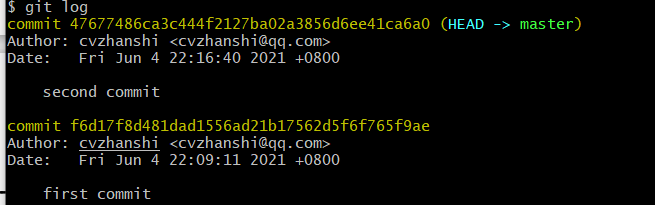
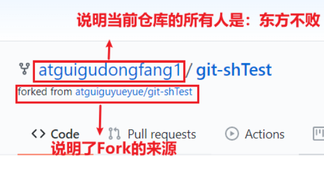
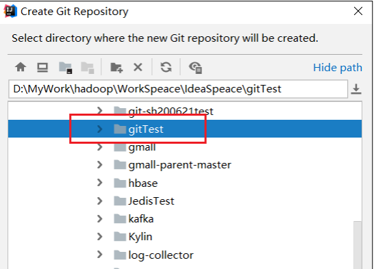
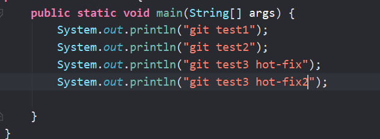

# ① Git安装

[Git官方地址(下载链接)](https://git-scm.com/)


**安装过程**


-  选择 Git 安装位置，要求是非中文并且没有空格的目录，然后下一步


-  Git 选项配置，推荐默认设置，然后下一步


-  Git 的默认编辑器，建议使用默认的 Vim 编辑器，然后点击下一步


-  默认分支名设置，选择让 Git 决定，分支名默认为 master，下一步 


-  修改 Git 的环境变量，选第一个，不修改环境变量，只在 Git Bash 里使用 Git


-  选择后台客户端连接协议，选默认值 OpenSSL，然后下一步


-  配置 Git 文件的行末换行符，Windows 使用 CRLF，Linux 使用 LF，选择第一个自动 转换，然后继续下一步


-  选择 Git 终端类型，选择默认的 Git Bash 终端，然后继续下一步


-  选择 Git pull 合并的模式，选择默认，然后下一步 


-  选择 Git 的凭据管理器，选择默认的跨平台的凭据管理器，然后下一步 


-  其他配置，选择默认设置，然后下一步 


-  实验室功能，技术还不成熟，有已知的 bug，不要勾选，然后点击右下角的 Install 按钮，开始安装 Git


- 测试是否安装成功

  - 到桌面，点击鼠标右键

  
  - 点击Git Bash Here,输入git --version命令，出现如下内容即为成功。

  

# ②Git常用命令

## 设置用户签名

- 基本语法

>  git config --global user.name 用户名 
>
> git config --global user.email 邮箱 
>
> 说明： 签名的作用是区分不同操作者身份。用户的签名信息在每一个版本的提交信息中能够看 到，以此确认本次提交是谁做的。Git 首次安装必须设置一下用户签名，否则无法提交代码。这里设置用户签名和将来登录 GitHub（或其他代码托管中心）的账号没有任 何关系 

- 案例实操


## 初始化本地库

- 基本语法

> git init

- 案例实操


- 结果查看


## 查看本地库状态

- 基本语法

> git status

- 案例实操

  - 首次查看（工作区中没有任何文件）

  

  - 添加文件后再次查看（检测到为追踪的文件）

  

## 添加暂存区

**将工作区的文件添加到暂存区**

- 基本语法

> git add 文件名

- 案例实操


**查看状态**


## 提交本地库

**将暂存区的文件提交到本地库**

- 基本语法

> git commit -m "日志信息" 文件名

- 案例实操


**查看状态（没有文件需要提交）**


## 修改文件

> 先修改之前的文件，然后再次查看状态

**检测到工作区有文件被修改**


- 将修改的文件再次添加到暂存区


- 再次查看状态（工作区的修改添加到了暂存区）


## 历史版本

### 查看历史版本

- 基本语法

> git reflog  查看版本信息
>
> git log   查看版本详细信息

- 案例实操




### 版本穿梭

- 基本语法

> git reset -- hard 版本号

- 案例实操


> 说明：  Git 切换版本，底层其实是移动的 HEAD 指针 
>
> 

# ③Git分支操作

## 分支的概述与优点

>  在版本控制过程中，同时推进多个任务，为每个任务，我们就可以创建每个任务的单独 分支。使用分支意味着程序员可以把自己的工作从开发主线上分离开来，开发自己分支的时 候，不会影响主线分支的运行。对于初学者而言，分支可以简单理解为副本，一个分支就是 一个单独的副本。（分支底层其实也是指针的引用） 


**优点**

-  同时并行推进多个功能开发，提高开发效率
-  各个分支在开发过程中，如果某一个分支开发失败，不会对其他分支有任何影响。失败 的分支删除重新开始即可

## 分支的操作

| 命令名称            | 作用                         |
| ------------------- | ---------------------------- |
| git branch 分支名   | 创建分支                     |
| git branch -v       | 查看分支                     |
| git checkout 分支名 | 切换分支                     |
| git merge 分支名    | 把指定的分支合并到当前分支上 |

### 查看分支

- 基本语法

> git branch -v

- 案例实操


### 创建分支

- 基本语法

> git branch 分支名

- 案例实操


### 修改分支

```txt
--在 maste 分支上做修改
Layne@LAPTOP-Layne MINGW64 /d/Git-Space/SH0720 (master)
$ vim hello.txt
--添加暂存区
Layne@LAPTOP-Layne MINGW64 /d/Git-Space/SH0720 (master)
$ git add hello.txt
--提交本地库
Layne@LAPTOP-Layne MINGW64 /d/Git-Space/SH0720 (master)
$ git commit -m "my forth commit" hello.txt
[master f363b4c] my forth commit
1 file changed, 1 insertion(+), 1 deletion(-)
--查看分支
Layne@LAPTOP-Layne MINGW64 /d/Git-Space/SH0720 (master)
$ git branch -v
 hot-fix 087a1a7 my third commit （hot-fix 分支并未做任何改变）
* master f363b4c my forth commit （当前 master 分支已更新为最新一次提交
的版本）
--查看 master 分支上的文件内容
Layne@LAPTOP-Layne MINGW64 /d/Git-Space/SH0720 (master)
$ cat hello.txt
hello git! hello atguigu! 2222222222222
hello git! hello atguigu! 3333333333333
hello git! hello atguigu!
hello git! hello atguigu!
hello git! hello atguigu!
hello git! hello atguigu!
hello git! hello atguigu!
hello git! hello atguigu!
hello git! hello atguigu!
hello git! hello atguigu!
hello git! hello atguigu!
hello git! hello atguigu!
hello git! hello atguigu!
hello git! hello atguigu!
hello git! hello atguigu! master test
hello git! hello atguigu!
```

### 切换分支

- 基本语法

> git checkout 分支名

- 案例实操


### 合并分支

- 基本语法

> git merge 分支名

- 案例实操


## 产生冲突和解决冲突

>  合并分支时，两个分支在同一个文件的同一个位置有两套完全不同的修改。Git 无法替我们决定使用哪一个。必须人为决定新代码内容 
>
>  冲突产生的表现：后面状态为 MERGING 


-  查看状态（检测到有文件有两处修改） 


- 解决冲突

> - 编辑有冲突的文件，删除特殊符号，决定要使用的内容 
>
>    	特殊符号：<<<<<<< HEAD 当前分支的代码 ======= 合并过来的代码 >>>>>>> hot-fix  
>
> - 添加到暂存区
>
> 
>
> - 执行提交（注意：此时使用git commit命令时**不能带文件名**）
>
> 

### 总结分支

>  master、hot-fix 其实都是指向具体版本记录的指针。当前所在的分支，其实是由 HEAD 决定的。所以创建分支的本质就是多创建一个指针。 
>
> HEAD 如果指向 master，那么我们现在就在 master 分支上。 
>
> HEAD 如果执行 hotfix，那么我们现在就在 hotfix 分支上 

# ④Git团队协作机制

- 团队内协作


- 跨团队协作


# ⑤GitHub操作

## 创建远程仓库


## 远程仓库操作

| 命令名称                           | 作用                                                     |
| ---------------------------------- | -------------------------------------------------------- |
| git remote -v                      | 查看当前所有远程地址别名                                 |
| git remote add 别名 远程地址       | 起别名                                                   |
| git push 别名 分支                 | 推送本地分支上的内容到远程仓库                           |
| git clone 远程地址                 | 将远程仓库的内容克隆到本地                               |
| git pull 远程库地址别名 远程分支名 | 将远程仓库对于分支最新内容拉下来后与当前本地分支直接合并 |

### 创建远程仓库别名

- 基本语法

>  git remote -v 查看当前所有远程地址别名 
>
> git remote add 别名 远程地址 

- 案例实操


> 说明： 这个地址在创建完远程仓库后生成的连接，如图所示红框中
>
> 

###  推送本地分支到远程仓库

- 基本语法

>  git push 别名 分支

- 案例实操


### 拉取远程仓库的代码

- 基本语法

> git pull 远程库地址别名 远程分支名
>
> 将远程仓库对于分支最新内容拉下来后与当前本地分支直接合并(会自动提交)

- 案例实操


###  克隆远程仓库到本地 

- 基本语法

>  git clone 远程地址 

- 案例实操


> 说明： clone 会做如下操作。1、拉取代码。2、初始化本地仓库。3、创建别名（别名是随机的）

###  邀请加入团队（团队内合作）

- 选择邀请合作者


-  填入想要合作的人 


-  复 制 地 址 并 通 过 微 信 钉 钉 等 方 式 发 送 给 该 用 户 


- 在邀请人的账号中的地址栏搜索复制的链接，然后点击接受邀请


-  成功之后可以在受邀请人 这个账号上看到 git-demo 的远程仓库 


- 受邀请人可以修改内容并 push 到远程仓库
- 回到原来账号的Github远程仓库中可以查看到受邀请人修改后push后的代码

###  跨团队协作  

-  将远程仓库的地址复制发给邀请跨团队协作的人
-  在其他团队的人的 GitHub 账号里的地址栏复制收到的链接，然后点击 Fork 将项目叉到自 己的本地仓库 




-  其他团队的人就可以在线编辑叉取过来的文件


-  编辑完毕后，填写描述信息并点击左下角绿色按钮提交


-  接下来点击上方的 Pull 请求，并创建一个新的请求 


-  回到原来的 GitHub 账号可以看到有一个 Pull request 请求 


-  进入到聊天室，可以讨论代码相关内容 


-  如果代码没有问题，可以点击 Merge pull reque 合并代码


## SSH免密登录

>  我们可以看到远程仓库中还有一个 SSH 的地址，因此我们也可以使用 SSH 进行访问


**具体操作**

-  进入当前用户的家目录， 删除.ssh 目录


-  -运行命令生成.ssh 秘钥目录[注意：这里-C 这个参数是大写的 C]  


-  进入.ssh 目录查看文件列表 ， 查看 id_rsa.pub 文件内容 


-  复制 id_rsa.pub 文件内容，登录 GitHub，点击用户头像→Settings→SSH and GPG keys→New SSH key


- 完成会显示如下页面


- 对其进行测试


> 能往远程库推送表明，操作成功

# ⑥IDEA集成Git

##  配置 Git 忽略文件

> 由于不管是idea还是eclipse都有各自特定的文件，但是这些文件 与项目的实际功能无关，不参与服务器上部署运行。把它们忽略掉能够屏蔽 IDE 工具之 间的差异 ，所以在git操作的时候需要忽略它们

**具体操作**

-  创建忽略规则文件 git.ignore

>   这个文件的存放位置原则上在哪里都可以，为了便于让~/.gitconfig 文件引用，建议也放在用 户家目录下

文件内容模板如下：

```js
# Compiled class file
*.class

# Log file
*.log

# BlueJ files
*.ctxt

# Mobile Tools for Java (J2ME)
.mtj.tmp/

# Package Files #
*.jar
*.war
*.nar
*.ear
*.zip
*.tar.gz
*.rar

# virtual machine crash logs, see http://www.java.com/en/download/help/error_hotspot.xml
hs_err_pid*

.classpath
.project
.settings
target
.idea
*.iml
```

- 在.gitconfig 文件中引用忽略配置文件（此文件在 Windows 的家目录中） 

```
[core]
excludesfile = C:/Users/asus/git.ignore
注意：这里要使用“正斜线（/）”，不要使用“反斜线（\）”
```

## 定位Git程序


> 点击Test后，弹出④窗口则说明成功

##  初始化本地库


 选择要创建 Git 本地仓库的工程



##  添加到暂存区 


## 提交到本地库


## 切换版本

- 在 IDEA 的左下角，点击 Version Control，然后点击 Log 查看版本 


-  右键选择要切换的版本，然后在菜单里点击 Checkout Revision 


##   创建分支与切换分支

### 创建分支

- 选择 Git，在 Repository 里面，点击 Branches 按钮 


- 在弹出的 Git Branches 框里，点击 New Branch 按钮 


- 输入分支名字，勾选跳到新建分支


-  然后再 IDEA 的右下角看到 hot-fix，说明分支创建成功，并且当前已经切换成 hot-fix 分 支  


### 切换分支

 在 IDEA 窗口的右下角，切换到 master 分支 


## 合并分支

 在 IDEA 窗口的右下角，将 hot-fix 分支合并到当前 master 分支 


>  如果代码没有冲突，分支直接合并成功，分支合并成功以后，代码自动提交，无需手动 提交本地库 

**解决冲突**

>  如图所示，如果 master 分支和 hot-fix 分支都修改了代码，在合并分支的时候就会发生 冲突 
>
> 
>
> 

合并的时候会有冲突弹窗


-  手动合并完代码以后，点击右下角的 Apply 按钮


- 代码冲突解决，自动提交本地库 

# ⑦IDEA集成GitHub

##  设置 GitHub 账号 


> 如果登不上就使用口令登录，点击Enter token
>
> 然后口令去github账户中生成，步骤如下：


##  分享工程到 GitHub 


##   push 推送本地库到远程库 


> 如果网络良好，可以直接push


> 如果网络不佳，建议使用ssh免密登录


> 注意： push 是将本地库代码推送到远程库，如果本地库代码跟远程库代码版本不一致， push 的操作是会被拒绝的。也就是说，要想 push 成功，一定要保证本地库的版本要比远程 库的版本高！因此一个成熟的程序员在动手改本地代码之前，一定会先检查下远程库跟本地 代码的区别！如果本地的代码版本已经落后，切记要先 pull 拉取一下远程库的代码，将本地 代码更新到最新以后，然后再修改，提交，推送！  

##  pull 拉取远程库到本地库 


> 注意： pull 是拉取远端仓库代码到本地，如果远程库代码和本地库代码不一致，会自动 合并，如果自动合并失败，还会涉及到手动解决冲突的问题 

## clone 克隆远程库到本地 


#  ⑧国内代码托管中心-码云 （Gitee）

> 操作也GitHub及其相似，且码云是中文的，更容易上手
>
> 使用码云建议使用https不用ssh免密登录

##  码云复制 GitHub 项目 


> 按操作完成 即可导入仓库

