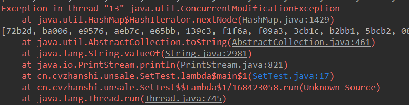
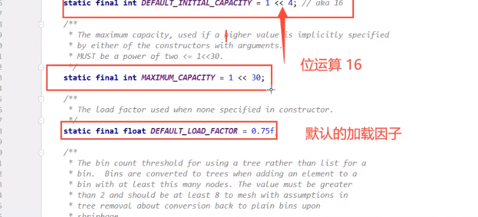
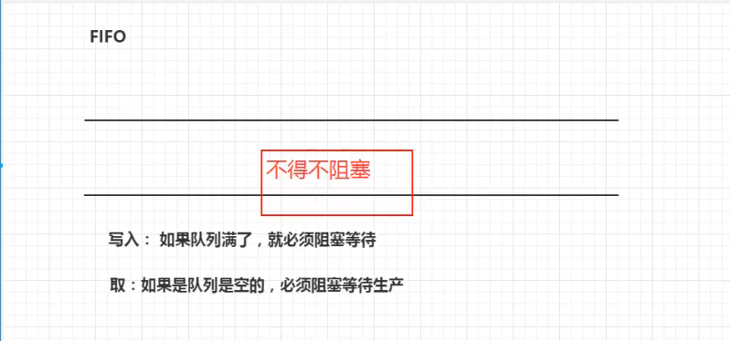
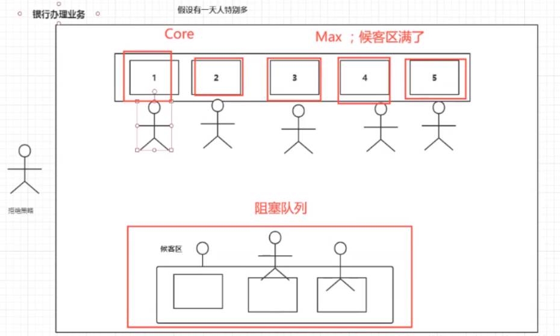
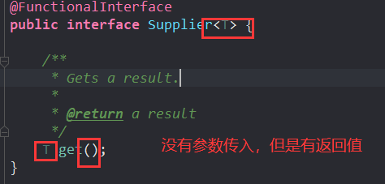
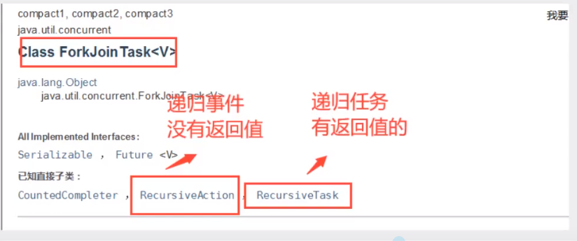
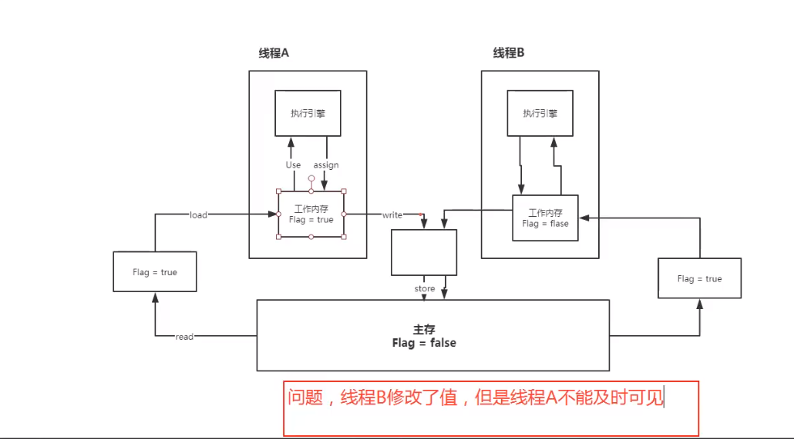

# 1、什么是JUC


java.util工具包

**业务：普通的线程代码 Thread**

**Runnable：** 没有返回值、效率相比于**Callable** 相对较低！


-----


# 2、线程和进程

> 进程、线程

**进程**：一个程序，QQ.EXE Music.EXE 程序的集合

一个进程可以包含多个线程，至少包含一个线程！

**Java默认有几个线程？**

- 2个线程 =>  **main线程、GC线程**

线程：开了一个进程Typora，写字，等待几分钟会进行自动保存(线程负责的)

对于Java而言：可以通过Thread、Runable、Callable进行开启线程的

**JAVA真的可以开启线程吗？** 

- 通过查看源码可知**是开不了的**

```java
// 测试代码
public class demo01 {
    public static void main(String[] args) {
        new Thread().start();
    }
}

// 进入start方法进行查看,可知调用了start0
public synchronized void start() {
    /**
         * This method is not invoked for the main method thread or "system"
         * group threads created/set up by the VM. Any new functionality added
         * to this method in the future may have to also be added to the VM.
         *
         * A zero status value corresponds to state "NEW".
         */
    if (threadStatus != 0)
        throw new IllegalThreadStateException();

    /* Notify the group that this thread is about to be started
         * so that it can be added to the group's list of threads
         * and the group's unstarted count can be decremented. */
    group.add(this);

    boolean started = false;
    try {
        start0();
        started = true;
    } finally {
        try {
            if (!started) {
                group.threadStartFailed(this);
            }
        } catch (Throwable ignore) {
            /* do nothing. If start0 threw a Throwable then
                  it will be passed up the call stack */
        }
    }
}
//本地方法，这是一个C++底层，Java是没有权限操作底层硬件的
private native void start0();
```

> 并发、并行

**并发：** 多线程操作同一个资源。

- CPU 只有一核，模拟出来多条线程，天下武功，唯快不破。那么我们就可以使用CPU快速交替，来模拟多线程。

**并行：** 多个人一起行走

- CPU多核，多个线程可以同时执行。 我们可以使用线程池！

```java
/**
 * @author cVzhanshi
 * @create 2021-09-14 11:23
 */
public class demo01 {
    public static void main(String[] args) {
        // 获取CPU核数
        // CPU 密集型、IO 密集型
        System.out.println(Runtime.getRuntime().availableProcessors());
    }
}v
```

**并发编程的本质**：**充分利用CPU的资源**

> 线程有几个状态

```java
public enum State {
    //新生
    NEW,

    //运行
    RUNNABLE,

    //阻塞
    BLOCKED,

    //等待，死死的等待
    WAITING,

    //超时等待
    TIMED_WAITING,

    //终止
    TERMINATED;
}
```

> wait 和 sleep 区别

**1、来自不同的类**

- wait => Object

- sleep => Thread

一般企业中使用睡眠都是用工具类：

```java
TimeUnit.DAYS.sleep(1); //休眠1天
TimeUnit.SECONDS.sleep(1); //休眠1s
```

**2、关于锁的释放**

- wait会释放锁
- sleep睡觉了，抱锁睡觉，不释放锁

**3、使用的范围是不同的**

- wait必须在同步代码块中使用
- sleep可以在任何地方睡

**4、是否需要捕获异常**

- wait不需要捕获异常
- sleep必须捕获异常

# 3、Lock锁（重点）

## 3.1 传统的Synchronized

- 不加synchronized

```java
/**
 * @author cVzhanshi
 * @create 2021-09-14 11:23
 */
//基本的卖票例子

/**
 * 真正的多线程开发，公司中的开发
 * 线程是一个单独的资源类，没有任何附属的操作
 * 1、属性、方法
 */
public class SaleTicketDemo01 {
    public static void main(String[] args) {
        
        // 并发：多个线程操作同一个资源，把资源丢入线程
        SaleTicket ticket = new SaleTicket();
        new Thread(() -> {
            for (int i = 1; i < 40; i++) {
                ticket.sale();
            }
        },"A").start();
        new Thread(() -> {
            for (int i = 1; i < 40; i++) {
                ticket.sale();
            }
        },"B").start();
        new Thread(() -> {
            for (int i = 1; i < 40; i++) {
                ticket.sale();
            }
        },"C").start();
    }

}
//资源类
//属性+方法
//OOP
class SaleTicket{
    //属性、方法
    private int number = 50;

    //卖票的方式
    public void sale(){
        if(number > 0){
            System.out.println(Thread.currentThread().getName() + " 卖出了第"+ (number--) + "张票,剩余：" + number + "张票");
        }
    }
}
```

会得到错误的结果


- 加上synchronized

```java
...
//卖票的方式
//synchronized本质：队列、锁
public synchronized void sale(){
    if(number > 0){
        System.out.println(Thread.currentThread().getName() + " 卖出了第"+ (number--) + "张票,剩余：" + number + "张票");
    }
}
...
```

结果就不会出错


## 3.2 Lock 接口


-----


- 进入类中查看构造器


**公平锁：** 十分公平，必须先来后到~；

**非公平锁：** 十分不公平，可以插队；**(默认为非公平锁)**

**示例代码**：

```java
public class SaleTicketDemo02 {
    public static void main(String[] args) {

        // 并发：多个线程操作同一个资源，把资源丢入线程
        Ticket ticket = new Ticket();
        new Thread(() -> { for (int i = 1; i < 40; i++)ticket.sale(); },"A").start();
        new Thread(() -> { for (int i = 1; i < 40; i++)ticket.sale(); },"B").start();
        new Thread(() -> { for (int i = 1; i < 40; i++)ticket.sale(); },"C").start();
    }

}
//Lock三部曲
//1、new ReentrantLock();
//2、lock.lock();    //加锁
//3、lock.unlock();  //解锁
class Ticket{
    //属性、方法
    private int number = 30;

    Lock lock = new ReentrantLock();

    //卖票的方式
    public void sale(){
        lock.lock();    //加锁
        try {
            if(number > 0){
                System.out.println(Thread.currentThread().getName() + " 卖出了第"+ (number--) + "张票,剩余：" + number + "张票");
            }
        }catch (Exception e){
            e.printStackTrace();
        }finally {
            lock.unlock();  //解锁
        }
    }
}
```

效果和synchronized相同

## 3.3 synchronized 和 Lock 的区别

- Synchronized 内置的Java关键字，Lock是一个Java类
- Synchronized 无法判断获取锁的状态，Lock可以判断
- Synchronized 会自动释放锁，lock必须要手动加锁和手动释放锁！可能会遇到死锁
- Synchronized 线程1(获得锁->阻塞)、线程2(等待，只能傻傻的等待)；lock就不一定会一直等待下去，lock会有一个trylock去尝试获取锁，不会造成长久的等待。
- Synchronized 是不可重入锁，不可以中断的，非公平的；Lock，可重入的，可以判断锁，可以自己设置公平锁和非公平锁；
- Synchronized 适合锁少量的代码同步问题，Lock适合锁大量的同步代码；

# 4、生产者和消费者问题

## 4.1 Synchronized 版本

```java
/**
 * @author cVzhanshi
 * @create 2021-09-16 10:59
 */
/**
 * 线程之阿健的通信问题：生产者和消费者问题！等待唤醒，通知唤醒
 * 线程交替执行   A   B 操作同一个变量 num = 0
 * A num+1
 * B num-1
 */
public class A {
    public static void main(String[] args) {
        Data data = new Data();
        new Thread(() -> {
            for(int i =0;i<10;i++) {
                try {
                    data.increment();
                } catch (InterruptedException e) {
                    e.printStackTrace();
                }
            }
        },"A").start();
        new Thread(() -> {
            for(int i =0;i<10;i++) {
                try {
                    data.decrement();
                } catch (InterruptedException e) {
                    e.printStackTrace();
                }
            }
        },"B").start();
    }

}

//判断等待、业务、通知
class Data{// 数字  资源类

    private  int number = 0;

    //+1
    public synchronized void increment() throws InterruptedException {
        if(number!=0){  //0的时候干活  即 没有商品了开始生产
            //等待操作
            this.wait();
        }
        number++;
        System.out.println("increment" + " " + Thread.currentThread().getName()+"=>"+number);
        //通知其他线程 我+1完毕了
        this.notifyAll();

    }

    //-1
    public synchronized void decrement() throws InterruptedException {
        if(number==0){ //1的时候干活 即 有商品了开始消费
            //等待操作
            this.wait();
        }
        number--;
        System.out.println("decrement" + " " + Thread.currentThread().getName()+"=>"+number);
        //通知其他线程  我-1完毕了
        this.notifyAll();
    }

}
```

运行效果，0、1交替


-----

- **存在的问题**：如果有多个线程可能出现虚假唤醒的可能性


-----


**产生的原因**：


- **解决方案**： **if 改为while即可，防止虚假唤醒**

## 4.2 JUC版的生产者和消费者问题

 **await、signal 替换 wait、notify**


**通过Lock找到Condition，api中Condition的使用方法**


**代码实现**：

```java
package cn.cvzhanshi.pc;
import java.util.concurrent.locks.Condition;
import java.util.concurrent.locks.Lock;
import java.util.concurrent.locks.ReentrantLock;
/**
 * @author cVzhanshi
 * @create 2021-09-16 15:13
 */
public class B {
    public static void main(String[] args) {
        Data2 data = new Data2();
        new Thread(() -> {
            for(int i =0;i<10;i++) {
                try {
                    data.increment();
                } catch (InterruptedException e) {
                    e.printStackTrace();
                }
            }
        },"A").start();
        new Thread(() -> {
            for(int i =0;i<10;i++) {
                try {
                    data.decrement();
                } catch (InterruptedException e) {
                    e.printStackTrace();
                }
            }
        },"B").start();
        new Thread(() -> {
            for(int i =0;i<10;i++) {
                try {
                    data.increment();
                } catch (InterruptedException e) {
                    e.printStackTrace();
                }
            }
        },"C").start();
        new Thread(() -> {
            for(int i =0;i<10;i++) {
                try {
                    data.decrement();
                } catch (InterruptedException e) {
                    e.printStackTrace();
                }
            }
        },"D").start();
    }

}

//判断等待、业务、通知
class Data2{// 数字  资源类

    private  int number = 0;

    Lock lock = new ReentrantLock();
    Condition condition = lock.newCondition();

    //condition.await();  等待
    //condition.signalAll();  唤醒全部


    //+1
    public void increment() throws InterruptedException {
        lock.lock();
        try {
            while (number!=0){  //0的时候干活  即 没有商品了开始生产
                //等待操作
                condition.await();
            }
            number++;
            System.out.println("increment" + " " + Thread.currentThread().getName()+"=>"+number);
            //通知其他线程 我+1完毕了
            condition.signalAll();
        } catch (Exception e) {
            e.printStackTrace();
        } finally {
            lock.unlock();
        }
    }

    //-1
    public void decrement() throws InterruptedException {
        lock.lock();
        try {
            while(number==0){ //1的时候干活 即 有商品了开始消费
                //等待操作
                condition.await();
            }
            number--;
            System.out.println("decrement" + " " + Thread.currentThread().getName()+"=>"+number);
            //通知其他线程  我-1完毕了
            condition.signalAll();
        } catch (Exception e) {
            e.printStackTrace();
        } finally {
            lock.unlock();
        }
    }

}
```

**看效果和synchronized差不多，但是任何一个新的技术，绝对不是仅仅只是覆盖了原来的技术，优势和补充！**

## 4.3 Condition的优势：精准的通知和唤醒的线程！

要求：

 * A 执行完 调用B
 * B 执行完 调用C
 * C 执行完 调用A

```java
package cn.cvzhanshi.pc;

import java.util.concurrent.locks.Condition;
import java.util.concurrent.locks.Lock;
import java.util.concurrent.locks.ReentrantLock;

/**
 * @author cVzhanshi
 * @create 2021-09-16 15:53
 */

/**
 * 要求：
 *  * A 执行完 调用B
 *  * B 执行完 调用C
 *  * C 执行完 调用A
 */
public class C {
    public static void main(String[] args) {
        Data3 data = new Data3();
        new Thread(() -> {
            for (int i =0 ;i<10;i++){
                data.printA();
            }
        },"A").start();
        new Thread(() -> {
            for (int i =0 ;i<10;i++){
                data.printB();
            }
        },"B").start();
        new Thread(() -> {
            for (int i =0 ;i<10;i++){
                data.printC();
            }
        },"C").start();
    }
}

class Data3{
    //资源类
    private Lock lock=new ReentrantLock();
    private Condition condition1 = lock.newCondition();
    private Condition condition2 = lock.newCondition();
    private Condition condition3 = lock.newCondition();
    private int number = 1; //1A 2B 3C

    public void printA(){
        lock.lock();
        try {
            //业务 判断 -> 执行 -> 通知
            while(number!=1){
                //等待
                condition1.await();
            }
            //操作
            System.out.println(Thread.currentThread().getName()+",AAAAA");
            //唤醒指定的线程
            number=2;
            condition2.signal(); // 唤醒2

        } catch (Exception e) {
            e.printStackTrace();
        } finally {
            lock.unlock();
        }
    }
    public void printB(){
        lock.lock();
        try {
            //业务 判断 -> 执行 -> 通知
            while (number!=2){
                condition2.await();
            }
            System.out.println(Thread.currentThread().getName()+",BBBBB");
            //唤醒3
            number=3;
            condition3.signal();
        } catch (Exception e) {
            e.printStackTrace();
        } finally {
            lock.unlock();
        }
    }
    public void printC(){
        lock.lock();
        try {
            //业务 判断 -> 执行 -> 通知
            while(number!=3){
                condition3.await();
            }
            System.out.println(Thread.currentThread().getName()+",CCCCC");
            //唤醒1
            number=1;
            condition1.signal();
        } catch (Exception e) {
            e.printStackTrace();
        } finally {
            lock.unlock();
        }
    }

    //生产线：下单->支付->交易->物流
}
```


# 5、8锁现象

> 8锁就是8个关于锁的问题

**如何判断锁的是谁！永远的知道什么是锁，锁到底锁的是谁！**

锁会锁住的东西：**对象、Class**

> 1、标准情况下，两个线程去执行资源类中的两个方法，先执行的是哪一个？ 发短信还是打电话
>
> 2、在1的情况下，sendSms延迟4s，同样的问题

示例代码：

```java
import java.util.concurrent.TimeUnit;

/**
 * @author cVzhanshi
 * @create 2021-09-16 16:23
 */
public class Test1 {
    public static void main(String[] args) {
        Phone phone = new Phone();
        new Thread(() -> {
            phone.sendSms();
        },"A").start();

        //睡1s
        try {
            TimeUnit.SECONDS.sleep(1);
        } catch (InterruptedException e) {
            e.printStackTrace();
        }
        new Thread(() -> {
            phone.call();
        },"B").start();
    }
}
class Phone{
    public synchronized void sendSms(){
        System.out.println("发短信");
    }
    public synchronized void call(){
        System.out.println("打电话");
    }
}
```

- 答案：**先打印发短信，后打印打电话**


可能有人会被两个线程之间的睡觉1s所迷惑，说可能是因为调用顺序原因，那么在2的情况下测试，查看情况：

示例代码：

```java
public class Test1 {
    public static void main(String[] args) {
        Phone phone = new Phone();
        new Thread(() -> {
            phone.sendSms();
        },"A").start();

        //睡1s
        try {
            TimeUnit.SECONDS.sleep(1);
        } catch (InterruptedException e) {
            e.printStackTrace();
        }
        new Thread(() -> {
            phone.call();
        },"B").start();
    }


}
class Phone{
    public synchronized void sendSms(){
        try {
            TimeUnit.SECONDS.sleep(4);
        } catch (InterruptedException e) {
            e.printStackTrace();
        }
        System.out.println("发短信");
    }
    public synchronized void call(){
        System.out.println("打电话");
    }
}
```


效果是一样的

原因：**是因为synchronized 锁的对象是方法的调用者！对于两个方法用的是同一个锁，谁先拿到锁谁先执行！另外一个则等待**

> 3、资源类新增一个普通方法，线程1调用同步方法，线程2调用普通方法，中间睡眠1s同步方法睡4s 先执行同步方法还是普通方法？先打印hello还是发短信？

示例代码：

```java
import java.util.concurrent.TimeUnit;

/**
 * @author cVzhanshi
 * @create 2021-09-16 16:23
 */
public class Test2 {
    public static void main(String[] args) {
        Phone2 phone = new Phone2();
        new Thread(() -> {
            phone.sendSms();
        },"A").start();

        //睡1s
        try {
            TimeUnit.SECONDS.sleep(1);
        } catch (InterruptedException e) {
            e.printStackTrace();
        }
        new Thread(() -> {
            phone.hello();
        },"B").start();
    }


}

class Phone2{
    public synchronized void sendSms(){
        try {
            TimeUnit.SECONDS.sleep(4);
        } catch (InterruptedException e) {
            e.printStackTrace();
        }
        System.out.println("发短信");
    }
    public synchronized void call(){
        System.out.println("打电话");
    }

    public void hello(){
        System.out.println("hello");
    }
}
```

答案：先打印hello后打印发短信


原因：**普通方法不是同步方法，没有锁，不受锁的影响**，但是我发现，如果我把发短信里面的延迟4秒去掉，那么就会顺序执行，先执行发短信然后再执行hello，这个就应该由执行时间来决定

> 4、两个对象，两个同步方法，先短信还是先打电话？

示例代码：

```java
import java.util.concurrent.TimeUnit;

/**
 * @author cVzhanshi
 * @create 2021-09-16 16:23
 */
public class Test2 {
     public static void main(String[] args) {
        Phone2 phone1 = new Phone2();
        Phone2 phone2 = new Phone2();
        new Thread(() -> {
            phone1.sendSms();
        },"A").start();

        //睡1s
        try {
            TimeUnit.SECONDS.sleep(1);
        } catch (InterruptedException e) {
            e.printStackTrace();
        }
        new Thread(() -> {
            phone2.call();
        },"B").start();
    }
}
class Phone2{
    public synchronized void sendSms(){
        try {
            TimeUnit.SECONDS.sleep(4);
        } catch (InterruptedException e) {
            e.printStackTrace();
        }
        System.out.println("发短信");
    }
    public synchronized void call(){
        System.out.println("打电话");
    }

    public void hello(){
        System.out.println("hello");
    }
}
```

答案：先打印打电话，后打印发短信


原因：**synchronized 锁的对象是方法的调用者，两个对象，两个调用者就有两把锁，所以它们应该互不影响，根据执行时间来打印结果**

> **5、把synchronized的方法加上static变成静态同步方法**，那么是先打印发短信还是打电话？

示例代码：

```java
import java.util.concurrent.TimeUnit;

/**
 * @author cVzhanshi
 * @create 2021-09-16 16:23
 */
public class Test3{
    public static void main(String[] args) {
        Phone3 phone = new Phone3();
        new Thread(() -> {
            phone.sendSms();
        },"A").start();

        //睡1s
        try {
            TimeUnit.SECONDS.sleep(1);
        } catch (InterruptedException e) {
            e.printStackTrace();
        }

        new Thread(() -> {
            phone.call();
        },"B").start();
    }
}

class Phone3{
    public static synchronized void sendSms(){
        try {
            TimeUnit.SECONDS.sleep(4);
        } catch (InterruptedException e) {
            e.printStackTrace();
        }
        System.out.println("发短信");
    }
    public static synchronized void call(){
        System.out.println("打电话");
    }
}
```

答案：先打印发短信，后打印打电话


原因：**对于static静态方法来说，对于整个类Class来说只有一份，对于不同的对象使用的是同一份方法，相当于这个方法是属于这个class模板中的的，如果静态static方法使用synchronized锁定，那么这个synchronized锁会锁住整个class模板，全局只有一个！不管多少个对象，对于静态的锁都只有一把锁，谁先拿到这个锁就先执行，其他的进程都需要等待！**

> **6、把synchronized的方法加上static变成静态同步方法**，制造两个对象分别调用方法，那么是先打印发短信还是打电话？

```java
public class Test3{
    public static void main(String[] args) {
        Phone3 phone1 = new Phone3();
        Phone3 phone2 = new Phone3();
        new Thread(() -> {
            phone1.sendSms();
        },"A").start();

        //睡1s
        try {
            TimeUnit.SECONDS.sleep(1);
        } catch (InterruptedException e) {
            e.printStackTrace();
        }

        new Thread(() -> {
            phone2.call();
        },"B").start();
    }
}
...
```


原因：**两个对象的Class类模板只有一个，锁的是class，只有一把锁，谁先拿到谁先执行**

> 7、**如果我们使用一个静态同步方法、一个同步方法、一个对象调用，那么打印的结果是什么？**

示例代码：

```java
/**
 * @author cVzhanshi
 * @create 2021-09-16 16:23
 */
public class Test4{
    public static void main(String[] args) {
        Phone4 phone = new Phone4();

        new Thread(() -> {
            phone.sendSms();
        },"A").start();

        //睡1s
        try {
            TimeUnit.SECONDS.sleep(1);
        } catch (InterruptedException e) {
            e.printStackTrace();
        }

        new Thread(() -> {
            phone.call();
        },"B").start();
    }
}

class Phone4{
    public static synchronized void sendSms(){
        try {
            TimeUnit.SECONDS.sleep(4);
        } catch (InterruptedException e) {
            e.printStackTrace();
        }
        System.out.println("发短信");
    }
    public synchronized void call(){
        System.out.println("打电话");
    }
}
```

答案：先打电话后发短信


原因：**因为一个锁的是Class类模板，一个锁的是对象调用者。两个方法使用两把锁，双方互相不影响，只和执行时间有关系**

> 8、如果我们使用一个静态同步方法、一个同步方法、两个对象调用，那么打印的结果是什么？

示例代码：

```java
/**
 * @author cVzhanshi
 * @create 2021-09-16 16:23
 */
public class Test4{
    public static void main(String[] args) {
        Phone4 phone1 = new Phone4();
        Phone4 phone2 = new Phone4();

        new Thread(() -> {
            phone1.sendSms();
        },"A").start();

        //睡1s
        try {
            TimeUnit.SECONDS.sleep(1);
        } catch (InterruptedException e) {
            e.printStackTrace();
        }

        new Thread(() -> {
            phone2.call();
        },"B").start();
    }
}

class Phone4{
    public static synchronized void sendSms(){
        try {
            TimeUnit.SECONDS.sleep(4);
        } catch (InterruptedException e) {
            e.printStackTrace();
        }
        System.out.println("发短信");
    }
    public synchronized void call(){
        System.out.println("打电话");
    }
}
```

答案：先打电话、后发短信


原因：**因为一个锁的是Class类模板，一个锁的是对象调用者。两个方法使用两把锁，双方互相不影响，只和执行时间有关系**

> 小结

**new** 出来的 this 是具体的一个对象

**static Class** 是唯一的一个模板

# 6、集合类不安全

## 6.1 List不安全

> 问题引出

示例代码：

```java
/**
 * @author cVzhanshi
 * @create 2021-09-17 10:20
 */
public class ListTest {
    public static void main(String[] args) {
        List<String> list = new ArrayList<>();
       for (int i = 1; i <= 10; i++) {
            new Thread(() -> {
                list.add(UUID.randomUUID().toString().substring(0,5));
                System.out.println(list);
            },String.valueOf(i)).start();
        }
    }
}
```

运行结果报错：


**java.util.ConcurrentModificationException**   ----->   **并发修改异常**

结论：**并发下ArrayList是不安全的**，单线程下是绝对安全的

> 解决方案

- **切换成Vector就是线程安全的**

  List`<String>` list = new Vector<>();

  ```java
  /**
   * @author cVzhanshi
   * @create 2021-09-17 10:20
   */
  public class ListTest {
      public static void main(String[] args) {
          List<String> list = new Vector<>();
          for (int i = 1; i <= 10; i++) {
              new Thread(() -> {
                  list.add(UUID.randomUUID().toString().substring(0,5));
                  System.out.println(list);
              },String.valueOf(i)).start();
          }
      }
  }
  ```

  

  原因：Vector底层增加了Synchronized关键字

- **使用工具类Collections.synchronizedList转成安全的**

  List`<String>` list = Collections.synchronizedList(new ArrayList<>());

  ```java
  /**
   * @author cVzhanshi
   * @create 2021-09-17 10:20
   */
  public class ListTest {
      public static void main(String[] args) {
  
          List<String> list = Collections.synchronizedList(new ArrayList<>());
         for (int i = 1; i <= 10; i++) {
              new Thread(() -> {
                  list.add(UUID.randomUUID().toString().substring(0,5));
                  System.out.println(list);
              },String.valueOf(i)).start();
          }
      }
  }
  ```

  

- **使用JUC的CopyOnWriteArrayList**

  示例代码：

  ```java
  /**
   * @author cVzhanshi
   * @create 2021-09-17 10:20
   */
  //java.util.ConcurrentModificationException   ----->   并发修改异常
  public class ListTest {
      public static void main(String[] args) {
          /**
           * 解决方案
           * 1、List<String> list = new Vector<>();
           * 2、List<String> list = Collections.synchronizedList(new ArrayList<>());
           * 3、List<String> list = new CopyOnWriteArrayList<>();
           */
          List<String> list = new CopyOnWriteArrayList<>();
          ffor (int i = 1; i <= 10; i++) {
              new Thread(() -> {
                  list.add(UUID.randomUUID().toString().substring(0,5));
                  System.out.println(list);
              },String.valueOf(i)).start();
          }
      }
  }
  ```

  

  **CopyOnWriteArrayList**：写入时复制 -->  **COW 计算机程序设计领域的一种优化策略**

  多个线程调用的时候，list，读取的时候，固定的，写入（存在覆盖操作）；

  CopyOnWrite在写入的时候避免覆盖，造成数据错乱的问题；

  

> CopyOnWriteArrayList与Vector的比较

- **Vector**底层是使用**synchronized**关键字来实现的：效率特别低下
- **CopyOnWriteArrayList**使用的是Lock锁，效率会更加高效

## 6.2 Set不安全

> 问题引出


示例代码：

```java
/**
 * @author cVzhanshi
 * @create 2021-09-17 10:47
 */
public class SetTest {
    public static void main(String[] args) {
        Set<String> set = new HashSet<>();
        for (int i = 1; i <= 30; i++) {
            new Thread(() -> {
                set.add(UUID.randomUUID().toString().substring(0,5));
                System.out.println(set);
            },String.valueOf(i)).start();
        }
    }
}
```

同理报并发修改异常的错误：



> 解决方案

- **使用工具类Collections.synchronizedSet转成安全的**

  ```java
  /**
   * @author cVzhanshi
   * @create 2021-09-17 10:47
   */
  public class SetTest {
      public static void main(String[] args) {
          Set<String> set = Collections.synchronizedSet(new HashSet<>());
          for (int i = 1; i <= 30; i++) {
              new Thread(() -> {
                  set.add(UUID.randomUUID().toString().substring(0,5));
                  System.out.println(set);
              },String.valueOf(i)).start();
          }
      }
  }
  ```

  

- **使用JUC的CopyOnWriteArraySet**

  ```java
  /**
   * @author cVzhanshi
   * @create 2021-09-17 10:47
   */
  public class SetTest {
      public static void main(String[] args) {
          Set<String> set = new CopyOnWriteArraySet<>();
          for (int i = 1; i <= 30; i++) {
              new Thread(() -> {
                  set.add(UUID.randomUUID().toString().substring(0,5));
                  System.out.println(set);
              },String.valueOf(i)).start();
          }
      }
  }
  ```

  

> hashSet底层就是HashMap

```java
public HashSet() {
    map = new HashMap<>();
}

//add方法就是map的put方法
public boolean add(E e) {
    return map.put(e, PRESENT)==null;
}
// 它的value是常量不会变的
private static final Object PRESENT = new Object();
```

**set的本质就是map的key是无法重复的**

## 6.3 Map不安全



> 问题引出

示例代码：

```java
/**
 * @author cVzhanshi
 * @create 2021-09-17 11:02
 */
public class MapTest {
    public static void main(String[] args) {
        // map 是这样用的吗？ 不是，工作中不用HashMap
        // 默认等价于什么？  new HashMap<>(16,0.75);
        Map<String,String> map = new HashMap<>();

        for (int i = 1; i <= 30; i++) {
            new Thread(() -> {
                map.put(Thread.currentThread().getName(), UUID.randomUUID().toString().substring(0,5));
                System.out.println(map);
            },String.valueOf(i)).start();
        }
    }
}
```

同理java.util.ConcurrentModificationException


> 解决方案

- **使用工具类Collections.synchronizedMap转成安全的**

  ```JAVA
  /**
   * @author cVzhanshi
   * @create 2021-09-17 11:02
   */
  public class MapTest {
      public static void main(String[] args) {
          // map 是这样用的吗？ 不是，工作中不用HashMap
          // 默认等价于什么？  new HashMap<>(16,0.75);
          Map<String,String> map = Collections.synchronizedMap(new HashMap<>());
          for (int i = 1; i <= 30; i++) {
              new Thread(() -> {
                  map.put(Thread.currentThread().getName(), UUID.randomUUID().toString().substring(0,5));
                  System.out.println(map);
              },String.valueOf(i)).start();
          }
      }
  }
  ```

  

- **使用JUC的ConcurrentHashMap**

  ```java
  /**
   * @author cVzhanshi
   * @create 2021-09-17 11:02
   */
  public class MapTest {
      public static void main(String[] args) {
          // map 是这样用的吗？ 不是，工作中不用HashMap
          // 默认等价于什么？  new HashMap<>(16,0.75);
          Map<String,String> map = new ConcurrentHashMap<>();
  
          for (int i = 1; i <= 30; i++) {
              new Thread(() -> {
                  map.put(Thread.currentThread().getName(), UUID.randomUUID().toString().substring(0,5));
                  System.out.println(map);
              },String.valueOf(i)).start();
          }
      }
  }
  ```

  

# 7、Callable

- `Callable`接口类似于Runnable，是专为其实例的类可能被另一个线程执行。然而，`Runnable`，不返回结果并不能抛出异常。而Callable：
  - 可以有返回值
  - 可以抛出异常
  - 方法不同，run()/call()

> 代码测试

- 目前为止启动线程的方式只有唯一的一种**new Thread().start();**	然而Thread的构造方法**只能传入Runable**，所以需要我们找到Callable和Runable的联系，让Thread启动Callable

  联系：

  - 查看Runable的api可知有一些实现类

    

  - 继续查看FutureTask的api，发现他的构造器中需要传入Callable

    

  - 至此，Callable与Runable产生了联系

    ```java
    new Thread(new Runnable()).start();
    => new Thread(new FutureTask<>()).start();
    => new Thread( new FutureTask<>(Callable)).start();
    ```

- 代码测试

  ```java
  /**
   * @author cVzhanshi
   * @create 2021-09-17 15:44
   */
  public class CallableTest {
      public static void main(String[] args) throws ExecutionException, InterruptedException {
          //new Thread( new FutureTask<>(Callable)).start();
          MyThread thread = new MyThread();
  
          FutureTask task = new FutureTask(thread);  // 适配类
          new Thread(task,"A").start();
          Integer o = (Integer) task.get();  // 获取Callable的返回结果
          System.out.println(o);
      }
  }
  
  class MyThread implements Callable<Integer> {
  
      @Override
      public Integer call() throws Exception {
          System.out.println("call()");
          return 1024;
      }
  }
  ```

  

  - 由测试可知
    - Callable可抛出异常
    - 可以由返回值
    - 要通过适配类FutureTask与Runable联系然后通过Thread.start启动线程

- 补充

  - **FutureTask的get方法可能会产生阻塞，因为它要等待线程的返回结果，一般把他放到最后或者用异步通信**

  - **同一个适配类，Callable的结果会被缓存，提高效率**

    ```java
    ...
    FutureTask task = new FutureTask(thread);  // 适配类
    new Thread(task,"A").start();
    new Thread(task,"B").start();
    Integer o = (Integer) task.get();
    System.out.println(o);
    ...
    ```

    

    ```java
    ...
    FutureTask task = new FutureTask(thread);
    FutureTask task2 = new FutureTask(thread);
    new Thread(task,"A").start();
    new Thread(task2,"B").start();
    Integer o = (Integer) task.get();
    System.out.println(o);
    ...
    ```

    

# 8、常用的辅助类

## 8.1 CountDownLatch

> 允许一个或多个线程等待，直到在其他线程中执行的一组操作完成的同步辅助。

**其实就是一个减法计数器，对于计数器归零之后再进行后面的操作**

代码测试：

```java
/**
 * @author cVzhanshi
 * @create 2021-09-18 17:56
 */
//计数器
public class CountDownLatchDemo {
    public static void main(String[] args) throws InterruptedException {
        CountDownLatch countDownLatch = new CountDownLatch(7);
        for (int i = 1; i <= 6; i++) {
            new Thread(() -> {
                System.out.println(Thread.currentThread().getName() + " Go out");
                countDownLatch.countDown();  //数量减一
            },String.valueOf(i)).start();
        }

        new Thread(() -> {
            try {
                TimeUnit.SECONDS.sleep(30);
            } catch (InterruptedException e) {
                e.printStackTrace();
            }
            countDownLatch.countDown();
        },"A").start();
        System.out.println("==============前面==============");
        countDownLatch.await();
        System.out.println("==============后面==============");

    }
}
```


主要方法：

- countDown --> 减一操作
- await  --->    等待操作

await等待计数器为0，就唤醒，再继续向下运行

## 8.2 CyclicBarrier

> 允许一组线程相互等待，以达到一个共同的障碍点

其实就是一个加法计数器；

```java
/**
 * @author cVzhanshi
 * @create 2021-09-19 13:18
 */
public class CyclicBarrierDemo {
    public static void main(String[] args) {
        /**
         * 例子：
         * 集齐7颗龙珠召唤神龙
         */

        //召唤神龙的线程
        CyclicBarrier cyclicBarrier = new CyclicBarrier(7,() -> {
            System.out.println("召唤神龙成功");
        });
        for (int i = 1; i <= 7; i++) {
            final int temp = i;
            new Thread(() -> {
                System.out.println(Thread.currentThread().getName() + " 收集了地" + temp + "颗龙珠");
                try {
                    cyclicBarrier.await(); //等待
                } catch (InterruptedException e) {
                    e.printStackTrace();
                } catch (BrokenBarrierException e) {
                    e.printStackTrace();
                }
            },String.valueOf(i)).start();
        }
    }
}
```


构造器解释：

```java
public CyclicBarrier(int parties, Runnable barrierAction);  //当计数器的数达到parties，执行barrierAction
```

主要方法：

- await  ---> 加一

## 8.3 Semaphore

> 计数信号量

例子：有3个停车位，六辆车

代码示例：

```java
/**
 * @author cVzhanshi
 * @create 2021-09-19 13:31
 */
public class SemaphoreDemo {
    public static void main(String[] args){
        //停车位为3个
        Semaphore semaphore = new Semaphore(3);
        for (int i = 1; i <= 6; i++) {
            int finalI = i;
            new Thread(()->{
                try {
                    semaphore.acquire(); //得到
                    //抢到车位
                    System.out.println(Thread.currentThread().getName()+" 抢到了车位");
                    TimeUnit.SECONDS.sleep(2); //停车2s
                    System.out.println(Thread.currentThread().getName()+" 离开车位");
                } catch (InterruptedException e) {
                    e.printStackTrace();
                }finally {
                    semaphore.release();//释放
                }
            },String.valueOf(i)).start();
        }
    }
}
```


**原理**：

**semaphore.acquire()获得资源，如果资源已经使用完了，就等待资源释放后再进行使用！**

**semaphore.release()释放，会将当前的信号量释放+1，然后唤醒等待的线程！**

作用： 多个共享资源互斥的使用，并发限流，控制最大的线程数！

# 9、读写锁

> 一个 `ReadWriteLock`保持一对一联系 [`locks`](../../../../java/util/concurrent/locks/Lock.html)，一个用于只读操作，一个用于写入，读操作可以多个线程而写操作只能一个线程


> 代码案例：做一个我们自己的cache缓存。分别有写入操作、读取操作，采用五个线程去写入，使用五个线程去读取，查看结果

代码示例：

```java
/**
 * @author cVzhanshi
 * @create 2021-09-22 14:50
 */
/**
 * ReadWriteLock
 */
public class ReadWriteLockDemo {
    public static void main(String[] args) {
        MyCacheLock myCache = new MyCacheLock();

        //写入
        for (int i = 1; i <= 5; i++) {
            final int temp = i;
            new Thread(() -> {
                myCache.put(temp +"",temp + "");
            },String.valueOf(i)).start();
        }

        //读取
        for (int i = 1; i <= 5; i++) {
            final int temp = i;
            new Thread(() -> {
                myCache.get(temp + "");
            },String.valueOf(i)).start();
        }
    }
}

class MyCacheLock{
    private volatile Map<String,String> map=new HashMap<>();
    //使用读写锁
    private ReadWriteLock readWriteLock=new ReentrantReadWriteLock();
    //普通锁
    private Lock lock=new ReentrantLock();

    public void put(String key,String value){
        readWriteLock.writeLock().lock();
        try {
            //写入
            System.out.println(Thread.currentThread().getName()+" 线程 开始写入");
            map.put(key, value);
            System.out.println(Thread.currentThread().getName()+" 线程 写入OK");
        } catch (Exception e) {
            e.printStackTrace();
        } finally {
            readWriteLock.writeLock().unlock();
        }

    }

    public void get(String key) {
        readWriteLock.readLock().lock();
        try {
            //得到
            System.out.println(Thread.currentThread().getName() + " 线程 开始读取");
            String o = map.get(key);
            System.out.println(Thread.currentThread().getName() + " 线程 读取OK");
        } catch (Exception e) {
            e.printStackTrace();
        } finally {
            readWriteLock.readLock().unlock();
        }
    }

}

/**
 * 自定义缓存
 */
class MyCache{
    private volatile Map<String,String> map=new HashMap<>();
    public void put(String key,String value){
        //写入
        System.out.println(Thread.currentThread().getName()+" 线程 开始写入");
        map.put(key, value);
        System.out.println(Thread.currentThread().getName()+" 线程 写入OK");
    }

    public String get(String key){
        //读取
        System.out.println(Thread.currentThread().getName()+" 线程 开始读取");
        String o = map.get(key);
        System.out.println(Thread.currentThread().getName()+" 线程 读取OK");
        return o;
    }
}
```

- 未加锁情况下

  

- 加锁情况下

  

> 小结

**ReadWriteLock**

- 读-读   可以共存
- 读-写   不能共存
- 写-写   不能共存

独占锁    ---->    写锁   ----->   一次只能被一个线程占用

共享锁    ---->    读锁   ----->   多个线程可以同时占有

# 10、阻塞队列

## 10.1 简述

对于队列与阻塞的理解



阻塞队列：


**BlockingQueue**不是新的东西，blockingQueue 是Collection的一个子类。

**Collection与BlockingQueue的结构图**：


**什么情况下会用到BlockingQueue**

- 多线程并发处理、线程池

## 10.2 四组API

**四组API**

| 方式       | 抛出异常  | 不会抛出异常，有返回值 | 阻塞 等待 | 超时 等待                |
| ---------- | --------- | ---------------------- | --------- | ------------------------ |
| 添加       | add()     | offer()                | put()     | offer(timenum，timeUnit) |
| 移除       | remove()  | poll()                 | take()    | poll(timenum，timeUnit)  |
| 判断队列首 | element() | peek()                 | -         | -                        |

**代码测试**

-  抛出异常

  ```java
  /**
   * 抛出异常
   */
  @Test
  public void test01(){
      //需要初始化队列的大小
      ArrayBlockingQueue queue = new ArrayBlockingQueue<>(3);
      System.out.println(queue.add("cvzhanshi1"));
      System.out.println(queue.add("cvzhanshi2"));
      System.out.println(queue.add("cvzhanshi3"));
      //抛出异常：java.lang.IllegalStateException: Queue full
      //System.out.println(queue.add("a"));
      System.out.println(queue.remove());
      System.out.println(queue.remove());
      System.out.println(queue.remove());
      //如果多移除一个
      //这也会造成 java.util.NoSuchElementException 抛出异常
      System.out.println(queue.remove());
  }
  ```

  

- 不会抛出异常，有返回值

  ```java
  /**
   * 不会抛出异常，有返回值
   */
  @Test
  public void test02(){
      //需要初始化队列的大小
      ArrayBlockingQueue queue = new ArrayBlockingQueue<>(3);
      System.out.println(queue.offer("cvzhanshi1"));
      System.out.println(queue.offer("cvzhanshi2"));
      System.out.println(queue.offer("cvzhanshi3"));
      //添加 一个不能添加的元素 使用offer只会返回false 不会抛出异常
      System.out.println(queue.offer("cvzhanshi4"));
      System.out.println(queue.poll());
      System.out.println(queue.poll());
      System.out.println(queue.poll());
      //弹出 如果没有元素 只会返回null 不会抛出异常
      System.out.println(queue.poll());
  }
  ```

  

- 阻塞 等待

  ```java
  /**
       * 阻塞 等待
       */
  @Test
  public void test03() throws InterruptedException {
      //需要初始化队列的大小
      ArrayBlockingQueue queue = new ArrayBlockingQueue<>(3);
  
      //一直阻塞 不会返回
      queue.put("cvzhanshi1");
      queue.put("cvzhanshi2");
      queue.put("cvzhanshi3");
  
      //如果队列已经满了， 再进去一个元素  这种情况会一直等待这个队列 什么时候有了位置再进去，程序不会停止
      queue.put("a");
  
      System.out.println(queue.take());
      System.out.println(queue.take());
      System.out.println(queue.take());
      //如果我们再来一个  这种情况也会等待，程序会一直运行 阻塞
      System.out.println(queue.take());
  }
  ```

- 超时 等待

  ```java
  /**
       * 等待 超时阻塞
       *  这种情况也会等待队列有位置 或者有产品 但是会超时结束
       */
  @Test
  public void test4() throws InterruptedException {
      ArrayBlockingQueue blockingQueue = new ArrayBlockingQueue<>(3);
      blockingQueue.offer("a");
      blockingQueue.offer("b");
      blockingQueue.offer("c");
      System.out.println("开始等待");
      blockingQueue.offer("d",2, TimeUnit.SECONDS);  //超时时间2s 等待如果超过2s就结束等待
      System.out.println("结束等待");
      System.out.println("===========取值==================");
      System.out.println(blockingQueue.poll());
      System.out.println(blockingQueue.poll());
      System.out.println(blockingQueue.poll());
      System.out.println("开始等待");
      blockingQueue.poll(2,TimeUnit.SECONDS); //超过两秒 我们就不要等待了
      System.out.println("结束等待");
  }
  ```

  

## 10.3 SynchronousQueue同步队列

**没有容量，进去一个元素，必须等待取出来之后，才能再往里面放一个元素**

代码示例：

```java
/**
 * 同步队列
 * 和其他的BlockingQueue不一样，SynchronousQueue不存储元素
 * put了一个元素，必须从里面先take取出来，否则不能在put进去值
 */
public class SynchronousQueueDemo {
    public static void main(String[] args) {
        BlockingQueue<String> queue = new SynchronousQueue<>();  //同步队列

        //使用两个进程
        // 一个进程 放进去
        // 一个进程 拿出来
        new Thread(() -> {
            try {
                System.out.println(Thread.currentThread().getName()+" Put 1");
                queue.put("1");
                System.out.println(Thread.currentThread().getName()+" Put 2");
                queue.put("2");
                System.out.println(Thread.currentThread().getName()+" Put 3");
                queue.put("3");
            } catch (InterruptedException e) {
                e.printStackTrace();
            }


        },"A").start();
        new Thread(() -> {
            try {
                System.out.println(Thread.currentThread().getName()+" Take "+queue.take());
                TimeUnit.SECONDS.sleep(3);
                System.out.println(Thread.currentThread().getName()+" Take "+queue.take());
                TimeUnit.SECONDS.sleep(3);
                System.out.println(Thread.currentThread().getName()+" Take "+queue.take());
            } catch (InterruptedException e) {
                e.printStackTrace();
            }
        },"B").start();
    }
}

```


# 11、线程池

线程池：**三大方法、七大参数、四种拒绝策略**

下面的示例业务图：



> 池化技术

程序的运行的**本质就是占用系统的资源**，为了优化资源的使用 ==> **池化技术**（线程池、连接池、对象池、内存池）

**池化技术：事先准备好一些资源，有人要用，就到池里拿，用完之后还给池**

**线程池的好处**：

- 降低资源的消耗
- 提高响应的速度
- 方便管理

**线程复用、可以控制最大并发数、方便管理线程**

> **线程池：三大方法**

- **ExecutorService threadPool = Executors.newSingleThreadExecutor(); 	//单个线程**
- **ExecutorService threadPool = Executors.newFixedThreadPool(5);         //创建一个固定的线程池的大小**
- **ExecutorService threadPool = Executors.newCachedThreadPool();      //可伸缩的，遇强则强，遇弱则弱**

```java
/**
 * @author cVzhanshi
 * @create 2021-09-22 20:23
 */
public class Demo01 {
    public static void main(String[] args) {
//        ExecutorService threadPool = Executors.newSingleThreadExecutor(); 	//单个线程
//        ExecutorService threadPool = Executors.newFixedThreadPool(5);         //创建一个固定的线程池的大小
        ExecutorService threadPool = Executors.newCachedThreadPool();      //可伸缩的，遇强则强，遇弱则弱
        try {
            for (int i = 0; i < 10; i++) {
                threadPool.execute(() -> {
                    System.out.println(Thread.currentThread().getName()+ " ok");
                });
            }
        } catch (Exception e) {
            e.printStackTrace();
        } finally {
            threadPool.shutdown();
        }
    }
}
```


> **线程池：七大参数**

源码分析

```java
public static ExecutorService newSingleThreadExecutor() {
    return new FinalizableDelegatedExecutorService
        (new ThreadPoolExecutor(1, 1,
                                0L, TimeUnit.MILLISECONDS,
                                new LinkedBlockingQueue<Runnable>()));
}

public static ExecutorService newFixedThreadPool(int nThreads) {
    return new ThreadPoolExecutor(nThreads, nThreads,
                                  0L, TimeUnit.MILLISECONDS,
                                  new LinkedBlockingQueue<Runnable>());
}

public static ExecutorService newCachedThreadPool() {
    return new ThreadPoolExecutor(0, Integer.MAX_VALUE,
                                  60L, TimeUnit.SECONDS,
                                  new SynchronousQueue<Runnable>());
}
// 本质：调用ThreadPoolExecutor()
// 分析源码
public ThreadPoolExecutor(int corePoolSize,      // 核心线程池大小
                          int maximumPoolSize,   // 最大核心线程池大小
                          long keepAliveTime,	 // 超时了没有人用就会释放
                          TimeUnit unit,		 // 超时单位
                          BlockingQueue<Runnable> workQueue, // 阻塞队列
                          ThreadFactory threadFactory,		 // 线程工厂，创建线程的，一般不用动
                          RejectedExecutionHandler handler   // 拒绝策略) {
    if (corePoolSize < 0 ||
        maximumPoolSize <= 0 ||
        maximumPoolSize < corePoolSize ||
        keepAliveTime < 0)
        throw new IllegalArgumentException();
    if (workQueue == null || threadFactory == null || handler == null)
        throw new NullPointerException();
    this.corePoolSize = corePoolSize;
    this.maximumPoolSize = maximumPoolSize;
    this.workQueue = workQueue;
    this.keepAliveTime = unit.toNanos(keepAliveTime);
    this.threadFactory = threadFactory;
    this.handler = handler;
}
```


**对于Integer.MAX_VALUE初始值较大，所以一般情况我们要使用底层的ThreadPoolExecutor来创建线程池**

> 自定义线程池

```java
/**
 * @author cVzhanshi
 * @create 2021-09-22 20:23
 */

/**
 * - new ThreadPoolExecutor.AbortPolicy()： => 该拒绝策略为：银行满了，还有人进来，不处理这个人的，并抛出异常，超出最大承载，就会抛出异常：队列容量大小+maxPoolSize
 * - new ThreadPoolExecutor.CallerRunsPolicy()：=> 该拒绝策略为：哪来的去哪里 main线程进行处理
 * - new ThreadPoolExecutor.DiscardPolicy():   => 该拒绝策略为：队列满了,丢掉异常，不会抛出异常。
 * - new ThreadPoolExecutor.DiscardOldestPolicy()：=> 该拒绝策略为：队列满了，尝试去和最早的进程竞争，不会抛出异常
 */
public class Demo02 {
    public static void main(String[] args) {
        ExecutorService threadPool = new ThreadPoolExecutor(
                2,
                5,
                3,
                TimeUnit.SECONDS,
                new LinkedBlockingQueue<>(3),
                Executors.defaultThreadFactory(),
                new ThreadPoolExecutor.AbortPolicy()
        );
        try {
            for (int i = 0; i < 10; i++) {
                threadPool.execute(() -> {
                    System.out.println(Thread.currentThread().getName()+ " ok");
                });
            }
        } catch (Exception e) {
            e.printStackTrace();
        } finally {
            threadPool.shutdown();
        }
    }
}
```

> **线程池：四种拒绝策略**


- new ThreadPoolExecutor.AbortPolicy()： => 该拒绝策略为：银行满了，还有人进来，不处理这个人的，并抛出异常，超出最大承载，就会抛出异常：队列容量大小+maxPoolSize
- new ThreadPoolExecutor.CallerRunsPolicy()：=> 该拒绝策略为：哪来的去哪里 main线程进行处理
- new ThreadPoolExecutor.DiscardPolicy():   => 该拒绝策略为：队列满了,丢掉异常，不会抛出异常。
- new ThreadPoolExecutor.DiscardOldestPolicy()：=> 该拒绝策略为：队列满了，尝试去和最早的进程竞争，不会抛出异常

> 小结与拓展

如何去设置线程池的最大大小如何去设置？

CPU密集型和IO密集型！

- **CPU密集型：电脑的核数是几核就选择几；选择maximunPoolSize的大小**
- **I/O密集型：**在程序中有15个大型任务，io十分占用资源；I/O密集型就是判断我们程序中十分耗I/O的线程数量，线程池大小大约是最大I/O数的一倍到两倍之间。

```java
Runtime.getRuntime().availableProcessors()  // 获取CPU的核数
```

# 12、四大函数式接口

> 函数式接口：有且只有一个方法的接口

```java
// Runnable
@FunctionalInterface
public interface Runnable {
    public abstract void run();
}
//超级多的@FunctionalInterface
//简化编程模型，在新版本的框架底层大量应用
//foreach()的参数也是一个函数式接口，消费者类的函数式接口
```


==函数型接口可以使用lambda表达式==

**代码测试**：

> **Function函数式型接口：有一个输入参数，有一个输出参数**


```java
/**
 * @author cVzhanshi
 * @create 2021-09-23 9:35
 */
/**
 * Function 函数型接口，有一个输入参数，有一个输出参数
 * 只要是 函数型接口都可以用lambda表达式简化
 */
public class Demo01 {
    public static void main(String[] args) {
//        Function<String, String> function = new Function<String, String>() {
//            @Override
//            public String apply(String str) {
//                return str;
//            }
//        };
        Function<String, String> function = (str) -> {return str;};
        System.out.println(function.apply("cvzhanshi"));
    }
}
```

> **Predicate断定型接口：只有一个输入参数，返回值只能是 布尔值**


```java
/**
 * @author cVzhanshi
 * @create 2021-09-23 9:42
 */

/**
 * 断定型接口：只有一个输入参数，返回值只能是 布尔值
 */
public class Demo02 {
    public static void main(String[] args) {
        // 判断字符串是否为空
//        Predicate<String> predicate = new Predicate<String>(){
//            @Override
//            public boolean test(String str) {
//                return str.isEmpty();
//            }
//        };
        Predicate<String> predicate = (str) -> {return str.isEmpty();};
        System.out.println(predicate.test("cvzhanshi"));
    }
}
```

> **Consumer 消费型接口：只有输入，没有返回值**


```java
/**
 * Consumer 消费型接口：只有输入，没有返回值
 */
public class Demo03 {
    public static void main(String[] args) {
//        Consumer<String> consumer = new Consumer<String>(){
//            @Override
//            public void accept(String str) {
//                System.out.println(str);
//            }
//        };

        Consumer<String> consumer = (str) -> { System.out.println(str);};
        consumer.accept("cvzhanshi");
    }
}
```

> Supplier 供给型接口 没有参数，只有返回值



```java
/**
 * @author cVzhanshi
 * @create 2021-09-23 9:52
 */

/**
 * Supplier 供给型接口 没有参数，只有返回值
 */
public class Demo04 {
    public static void main(String[] args) {
//        Supplier<Integer> supplier = new Supplier<Integer>() {
//            @Override
//            public Integer get() {
//                return 1024;
//            }
//        };

        Supplier<Integer> supplier = () -> { return 1024; };
        System.out.println(supplier.get());
    }
}
```

# 13、Stream流式计算

> 什么是Stream流式计算？

大数据：存储 + 计算

**集合、MySQL的本质就是存储**

计算都应该交给**流**来操作


代码示例：

题目要求：一分钟内完成此题，只能用一行代码实现！

现在有6个用户！筛选

 * ID必须是偶数
 * 年龄必须大于23
 * 用户名转为大写
 * 用户名字母倒序排序
 * 只输出一个用户

```java
/**
 * @author cVzhanshi
 * @create 2021-09-23 10:40
 */
@Data
@NoArgsConstructor
@AllArgsConstructor
public class User {
    private Integer id;
    private String name;
    private Integer age;
}

/**
 * @author cVzhanshi
 * @create 2021-09-23 10:42
 */

/**
 * 题目要求：一分钟内完成此题，只能用一行代码实现！
 * 现在有6个用户！筛选
 * 1、ID必须是偶数
 * 2、年龄必须大于23
 * 3、用户名转为大写
 * 4、用户名字母倒序排序
 * 5、只输出一个用户
 */
public class Test {
    public static void main(String[] args) {
        User user1 = new User(1,"a",21);
        User user2 = new User(2,"b",22);
        User user3 = new User(3,"c",23);
        User user4 = new User(4,"d",24);
        User user5 = new User(5,"e",25);
        User user6 = new User(6,"f",26);

        // 集合就是存储
        List<User> list = Arrays.asList(user1, user2, user3, user4, user5, user6);

        // 计算交给Stream流
        list.stream()
                .filter(user -> {return user.getId() % 2 == 0;})
                .filter(user -> {return user.getAge() > 23;})
                .map(user -> {return new User(user.getId(),user.getName().toUpperCase(),user.getAge());})
                .sorted((u1,u2) -> {return u2.getName().compareTo(u1.getName());})
                .limit(1)
                .forEach(System.out::println);
    }
}
```


# 14、ForkJoin

> 什么是ForkJoin

ForkJoin**主要用于并发执行任务，提高效率，大数据量**。

**大任务分成小任务，最后把小结果合并成大结果**


> ForkJoin 特点：工作窃取

**ForkJoin 维护的是双端队列**

**A、B线程执行任务，B更快执行完，他会去A那窃取任务过来执行，可以提高效率**


> ForkJoin 操作

查看ForkJoinPool


查看ForkJoinTask



查看直接子类RecursiveTask或RecursiveAction，可以看到使用方式


如何使用forkjoin

* ForkJoinPool 通过它来执行
* 计算任务 ForkJoin .execute(ForkJoinTask task)
* 计算类要继承ForkJoinTask

代码测试：

计算类

```java
/**
 * @author cVzhanshi
 * @create 2021-09-23 11:00
 */
/**
 * 求和计算的任务
 * 如何使用forkjoin
 * 1、forkjoinPool  通过他来执行
 * 2、计算任务 forkjoinPool.execute(ForkJoinTask task)
 * 3、计算类要继承ForkJoinTask
 */
public class ForkJoinDemo extends RecursiveTask<Long> {
    private Long start;
    private Long end;

    private Long temp = 100000L;// 切割任务的临界值

    public ForkJoinDemo(Long start, Long end) {
        this.start = start;
        this.end = end;
    }
    //计算方法
    @Override
    protected Long compute() {
        if((end-start) < temp){
            Long sum = 0L;
            for (Long i = start; i <= end; i++) {
                sum += i;
            }
            return sum;
        }else {
            //使用forkJoin 分而治之 计算
            //计算平均值
            long middle = (start + end) / 2;
            ForkJoinDemo leftTask = new ForkJoinDemo(start, middle);
            leftTask.fork();  //拆分任务，把线程任务压入线程队列
            ForkJoinDemo rightTask = new ForkJoinDemo(middle, end);
            rightTask.fork();  //拆分任务，把线程任务压入线程队列
            long taskSum = leftTask.join() + rightTask.join();
            return taskSum;
        }
    }
}
```

测试类

```java
/**
 * @author cVzhanshi
 * @create 2021-09-23 11:57
 */
public class Test {

    // 普通的计算
    @org.junit.Test
    public void test01(){
        Long sum = 0L;
        long start = System.currentTimeMillis();
        for (Long i = 1L; i <= 10_0000_0000; i++) {
            sum += i;
        }
        long end = System.currentTimeMillis();
        System.out.println("sum = " + sum + " 时间：" + (end - start)); // 8543ms
    }

    // ForkJoin的计算
    @org.junit.Test
    public void test02() throws ExecutionException, InterruptedException {
        long start = System.currentTimeMillis();
        ForkJoinDemo task = new ForkJoinDemo(0L, 10_0000_0000L);
        ForkJoinPool joinPool = new ForkJoinPool();
        ForkJoinTask<Long> submit = joinPool.submit(task);
        Long sum = submit.get();
        long end = System.currentTimeMillis();
        System.out.println("sum = " + sum + " 时间：" + (end - start)); // 5623ms
    }


    // Stream并行流计算
    @org.junit.Test
    public void test03() {
        long start = System.currentTimeMillis();
        long sum = LongStream.rangeClosed(0L, 10_0000_0000L).parallel().reduce(0, Long::sum);
        long end = System.currentTimeMillis();
        System.out.println("sum = " + sum + " 时间：" + (end - start)); // 910ms
    }
}
```

# 15、异步回调

> Future 设计的初衷：对将来的某个事件的结果进行建模

类似于是前端 --> 发送ajax异步请求给后端


一般都使用**CompletableFuture**

> **没有返回值的runAsync异步回调**

```java
/**
 * @author cVzhanshi
 * @create 2021-09-23 14:38
 */
public class Demo01 {
    public static void main(String[] args) throws ExecutionException, InterruptedException {
        // 发起一个请求
        CompletableFuture<Void> completableFuture =CompletableFuture.runAsync(() -> {
            try {
                TimeUnit.SECONDS.sleep(3);
            } catch (InterruptedException e) {
                e.printStackTrace();
            }
            System.out.println(Thread.currentThread().getName() + "runAsync=>Void");
        });
        System.out.println("111111111111111111111111");
        completableFuture.get(); // 获取阻塞执行结果
    }
}
```


> **有返回值的异步回调supplyAsync**

```java
/**
 * @author cVzhanshi
 * @create 2021-09-23 14:38
 */
public class Demo01 {
    public static void main(String[] args) throws ExecutionException, InterruptedException {
        // 发起一个请求
        CompletableFuture<Integer> completableFuture = CompletableFuture.supplyAsync(() -> {
            System.out.println(Thread.currentThread().getName() + "supplyAsync=>Integer");
            int i = 10 / 0;
            return 1024;
        });
        // 得到返回值
        Integer result = completableFuture.whenComplete((t, u) -> {
            System.out.println("t => " + t);  // 正常的返回结果
            System.out.println("u => " + u);  // 错误信息：java.util.concurrent.CompletionException:java.lang.ArithmeticException: / by zero
        }).exceptionally((e) -> {
            System.out.println(e.getMessage());
            return 5000;
        }).get();

        System.out.println(result);

    }
}
```

- 正常的返回结果

  

- 出现异常，返回错误信息

  

**whenComplete**: 有两个参数，一个是t 一个是u

T：是代表的 **正常返回的结果**

U：是代表的 **抛出异常的错误信息**

如果发生了异常，get可以获取到**exceptionally**返回的值

# 16、JMM

> Volatile的理解

**Volatile** 是 Java 虚拟机提供 **轻量级的同步机制**（与synchronized差不多，但是没有它强大）

1、保证可见性

**2、不保证原子性**

3、禁止指令重排

>  什么是JMM

JMM：Java内存模型，不存在的东西，是一种概念、约定！

**关于JMM的一些同步约定**：

- 线程解锁前，必须把共享变量==立刻==刷回主存

- 线程加锁前，必须读取主存中的最新值到共线程自己的工作内存中

  

- 加锁和解锁是同一把锁

-----

线程 **工作内存**、**主内存**

**内存交互操作有8种，虚拟机实现必须保证每一个操作都是原子的，不可在分的（对于double和long类型的变量来说，load、store、read、write操作在某些平台上允许例外）**

- **Read（读取）**：作用于主内存变量，它把一个变量的值从主内存传输到线程的工作内存中，以便随后的load动作使用；
- **load（载入）**：作用于工作内存的变量，它把read操作从主存中变量放入工作内存中；
- **Use（使用）**：作用于工作内存中的变量，它把工作内存中的变量传输给执行引擎，每当虚拟机遇到一个需要使用到变量的值，就会使用到这个指令；
- **assign（赋值）**：作用于工作内存中的变量，它把一个从执行引擎中接受到的值放入工作内存的变量副本中；
- **store（存储）**：作用于主内存中的变量，它把一个从工作内存中一个变量的值传送到主内存中，以便后续的write使用；
- **write（写入）**：作用于主内存中的变量，它把store操作从工作内存中得到的变量的值放入主内存的变量中；
- **lock（锁定）**：作用于主内存的变量，把一个变量标识为线程独占状态；
- **unlock（解锁）**：作用于主内存的变量，它把一个处于锁定状态的变量释放出来，释放后的变量才可以被其他线程锁定；


存在问题：



所以**JMM对这8种操作给了相应的规定**：

- 不允许read和load、store和write操作之一单独出现。即使用了read必须load，使用了store必须write
- 不允许线程丢弃他最近的assign操作，即工作变量的数据改变了之后，必须告知主存
- 不允许一个线程将没有assign的数据从工作内存同步回主内存
- 一个新的变量必须在主内存中诞生，不允许工作内存直接使用一个未被初始化的变量。就是对变量实施use、store操作之前，必须经过assign和load操作
- 一个变量同一时间只有一个线程能对其进行lock。多次lock后，必须执行相同次数的unlock才能解锁
- 如果对一个变量进行lock操作，会清空所有工作内存中此变量的值，在执行引擎使用这个变量前，必须重新load或assign操作初始化变量的值
- 如果一个变量没有被lock，就不能对其进行unlock操作。也不能unlock一个被其他线程锁住的变量
- 对一个变量进行unlock操作之前，必须把此变量同步回主内存


问题：程序不知道主存的值已经被修改过了，而是线程一直运行下去不会停止：

```java
/**
 * @author cVzhanshi
 * @create 2021-09-24 15:15
 */
public class JMMDemo {
    private static Integer number = 0;
    public static void main(String[] args) {
        new Thread(() -> {
            while (number == 0){

            }
        }).start();
        try {
            TimeUnit.SECONDS.sleep(2);
        } catch (InterruptedException e) {
            e.printStackTrace();
        }
        number = 1;
        System.out.println(number);
    }
}
```


# 17、Volatile

> 1、保证可见性

```java
/**
 * @author cVzhanshi
 * @create 2021-09-24 15:15
 */
public class JMMDemo {
    // 如果不加volatile 程序会死循环
    // 加了volatile是可以保证可见性的
    private volatile static Integer number = 0;

    public static void main(String[] args) {
        
        new Thread(() -> { // 线程1 对主内存的变化不知道的
            while (number == 0){

            }
        }).start();
        try {
            TimeUnit.SECONDS.sleep(2);
        } catch (InterruptedException e) {
            e.printStackTrace();
        }
        number = 1;
        System.out.println(number);
    }
}
```

> 2、不保证原子性

原子性：不可分割

线程A在执行任务的时候，不能被打扰，也不能被分割，要么同时成功，要么同时失败。

```java
/**
 * @author cVzhanshi
 * @create 2021-09-24 15:30
 */
//测试不保证原子性
public class VDemo02 {
    
    //volatile 不保证原子性
    private volatile static int num = 0;

    public static void add(){
        num++;
    }

    public static void main(String[] args) {

        //理论上num为20000
        for(int i = 1;i<=20;i++){
            new Thread(() -> {
                for (int j = 0; j < 1000; j++) {
                    add();
                }
            }).start();
        }
        while (Thread.activeCount() > 2){ // main gc 默认两个线程
            Thread.yield();
        }
        System.out.println(Thread.currentThread().getName() + " " + num);
    }
}
```


**num++底层（非原子性操作）**：


**如果不加synchronized和lock，怎样保证原子性**

- 使用原子类，解决原子性问题

  

  ```java
  /**
   * @author cVzhanshi
   * @create 2021-09-24 15:30
   */
  public class VDemo02 {
  
      //volatile 不保证原子性 但是使用原子类就能保证原子性了
      private volatile static AtomicInteger num = new AtomicInteger();
  
      public static void add(){
          num.getAndIncrement();  // AtomicInteger + 1 方法，CAS
      }
  
      public static void main(String[] args) {
  
          //理论上num为20000
          for(int i = 1;i<=20;i++){
              new Thread(() -> {
                  for (int j = 0; j < 1000; j++) {
                      add();
                  }
              }).start();
          }
          while (Thread.activeCount() > 2){ // main gc 默认两个线程
              Thread.yield();
          }
          System.out.println(Thread.currentThread().getName() + " " + num);
      }
  }
  ```

  原子类的底层都直接和操作系统挂钩！在内存中修改值！**Unsafe**类是一个很特殊的存在

> 3、禁止指令重排

**什么是指令重排？**

**我们写的程序，计算机并不是按照我们自己写的那样去执行的**

源代码–>编译器优化重排–>指令并行也可能会重排–>内存系统也会重排–>执行

**处理器在进行指令重排的时候，会考虑数据之间的依赖性！**

例如：

```java
int x=1; //1
int y=2; //2
x=x+5;   //3
y=x*x;   //4

//我们期望的执行顺序是 1_2_3_4  可能执行的顺序会变成2134 1324
//可不可能是 4123？ 不可能的 因为结果改变了
```

-----

可能造成的影响结果：其中a b x y这四个值 默认都是0

| 线程A | 线程B |
| :---: | :---: |
| x=a  | y=b  |
| b=1  | a=2  |

正常的结果： x = 0、y =0；但是可能由于指令重排出现以下执行顺序

| 线程A | 线程B |
| :---: | :---: |
|  b=1  |  a=2  |
|  x=a  |  y=b  |

指令重排可能会出现结果：x=2; y=1

**原理探究**

**volatile可以避免指令重排**，**volatile中会加一道内存的屏障，这个内存屏障可以保证在这个屏障中的指令顺序**

内存屏障：CPU指令。作用：

1、保证特定的操作的执行顺序；

2、可以保证某些变量的内存可见性（利用这些特性，就可以保证volatile实现的可见性）


> 小结

- **volatile可以保证可见性；**
- **不能保证原子性**
- **由于内存屏障，可以保证避免指令重排的现象产生**

内存屏障用得最多是**单例模式**

# 18、彻底玩转单例模式

> 饿汉式单例模式

```java
/**
 * @author cVzhanshi
 * @create 2021-09-25 16:13
 */
// 饿汉式单例
public class Hungry {

    //可能会浪费空间
    private byte[] data1 = new byte[1024*1024];
    private byte[] data2 = new byte[1024*1024];
    private byte[] data3 = new byte[1024*1024];
    
    // 构造器私有化
    private Hungry(){}

    private final static Hungry HUNGRY = new Hungry();

    public static Hungry getInstance(){
        return HUNGRY;
    }
}
```

> DCL懒汉式单例模式

- **初始版本**

  ```java
  /**
   * @author cVzhanshi
   * @create 2021-09-26 10:22
   */
  public class LazyMan {
  
      // 私有化构造器
      private LazyMan(){
          System.out.println(Thread.currentThread().getName() + "ok");
      }
  
      private static LazyMan lazyMan;
  
      public static LazyMan getInstance(){
          if(lazyMan == null){
              lazyMan = new LazyMan();
          }
          return lazyMan;
      }
  
      public static void main(String[] args) {
          // 单线程下绝对正确且安全，但是在多线程下不安全
          for (int i = 0; i < 10; i++) {
              new Thread(() -> {
                  LazyMan.getInstance();
              }).start();
          }
      }
  }
  ```

  多线程下不安全，就不是只有一个对象

  

- **加锁变成DCL懒汉式单例模式**

  ```java
  /**
   * @author cVzhanshi
   * @create 2021-09-26 10:22
   */
  public class LazyMan {
  
      // 私有化构造器
      private LazyMan(){
          System.out.println(Thread.currentThread().getName() + "ok");
      }
  
      private static LazyMan lazyMan;
  
      // 双重检测锁模式的懒汉式单例 --> DCL懒汉式
      public static LazyMan getInstance(){
          if(lazyMan == null){
              synchronized (LazyMan.class){
                  if(lazyMan == null){
                      lazyMan = new LazyMan();
                  }
              }
          }
          return lazyMan;
      }
  
      public static void main(String[] args) {
          // 单线程下绝对正确且安全，但是在多线程下不安全
          for (int i = 0; i < 10; i++) {
              new Thread(() -> {
                  LazyMan.getInstance();
              }).start();
          }
      }
  }
  ```

  运行结果实现了单例，但是也不是绝对安全的，因为lazyMan = new LazyMan();不是一个原子性操作

- 最终版的DCL单例模式

  ```java
  /**
   * @author cVzhanshi
   * @create 2021-09-26 10:22
   */
  public class LazyMan {
  
      // 私有化构造器
      private LazyMan(){
          System.out.println(Thread.currentThread().getName() + "ok");
      }
  
      // + volatile 防止指令重排
      private volatile static LazyMan lazyMan;
  
      // 双重检测锁模式的懒汉式单例 --> DCL懒汉式
      public static LazyMan getInstance(){
          if(lazyMan == null){
              synchronized (LazyMan.class){
                  if(lazyMan == null){
                      lazyMan = new LazyMan(); // 不是一个原子性操作
                      
                  }
              }
          }
          return lazyMan;
      }
  
      public static void main(String[] args) {
          // 单线程下绝对正确且安全，但是在多线程下不安全
          for (int i = 0; i < 10; i++) {
              new Thread(() -> {
                  LazyMan.getInstance();
              }).start();
          }
      }
  }
  ```

  分析：lazyMan = new LazyMan() 不是一个原子性操作
  lazyMan = new LazyMan();的执行步骤
  1、分配内存空间
  2、执行构造方法，初始化对象
  3、把这个对象指向这个空间
  可能由于指令重排 把执行顺序变成 1-3-2
  造成的结果：**线程A还没有初始化对象，线程B获取对象是lazyMan!=null就返回对象，此时lazyMan还没有完成构造**
  
  **为什么要用双重检测**
  
  执行双重检查是因为，如果多个线程同时通过了第一次检查，并且其中一个线程首先通过了第二次检查并实例化了对象，那么剩余通过了第一次检查的线程就不会再去实例化对象。
  
  这样，除了初始化的时候会出现加锁的情况，后续的所有调用都会避免加锁而直接返回，解决了性能消耗的问题。

> 静态内部类

```java
//静态内部类
public class Holder {
    private Holder(){

    }
    public static Holder getInstance(){
        return InnerClass.holder;
    }
    public static class InnerClass{
        private static final Holder holder = new Holder();
    }
}
```

> 单例不安全（因为反射）

- 情况1：第一个对象通过类去得到，第二个对象通过反射通过构造器造对象，破坏单例

  - 代码示例：

  ```java
  /**
   * @author cVzhanshi
   * @create 2021-09-26 10:22
   */
  public class LazyMan {
  
      // 私有化构造器
      private LazyMan(){
          System.out.println(Thread.currentThread().getName() + "ok");
      }
  
      // + volatile 防止指令重排
      private volatile static LazyMan lazyMan;
  
      // 双重检测锁模式的懒汉式单例 --> DCL懒汉式
      public static LazyMan getInstance(){
          if(lazyMan == null){
              synchronized (LazyMan.class){
                  if(lazyMan == null){
                      lazyMan = new LazyMan(); // 不是一个原子性操作
                  }
              }
          }
          return lazyMan;
      }
  
      public static void main(String[] args) throws NoSuchMethodException, IllegalAccessException, InvocationTargetException, InstantiationException {
          // 单线程下绝对正确且安全，但是在多线程下不安全
          LazyMan lazyMan = LazyMan.getInstance();
          Constructor<LazyMan> declaredConstructor = LazyMan.class.getDeclaredConstructor(null);
          declaredConstructor.setAccessible(true);
          LazyMan lazyMan1 = declaredConstructor.newInstance();
          System.out.println(lazyMan);
          System.out.println(lazyMan1);
      }
  }
  ```

  

  - 解决办法：可以在构造器中添加判断

  ```java
  ...
  private LazyMan(){
      if(lazyMan != null){
          throw new RuntimeException("不要试图通过反射破坏单例");
      }
      System.out.println(Thread.currentThread().getName() + "ok");
  }
  ...//省略的代码和上面一样
  ```

  

- 情况二：两个对象都通过反射得到

  ```java
  /**
   * @author cVzhanshi
   * @create 2021-09-26 10:22
   */
  public class LazyMan {
  
      // 私有化构造器
      private LazyMan(){
          if(lazyMan != null){
              throw new RuntimeException("不要试图通过反射破坏单例");
          }
          System.out.println(Thread.currentThread().getName() + "ok");
      }
  
      // + volatile 防止指令重排
      private volatile static LazyMan lazyMan;
  
      // 双重检测锁模式的懒汉式单例 --> DCL懒汉式
      public static LazyMan getInstance(){
          if(lazyMan == null){
              synchronized (LazyMan.class){
                  if(lazyMan == null){
                      lazyMan = new LazyMan(); // 不是一个原子性操作
                  }
              }
          }
          return lazyMan;
      }
  
      public static void main(String[] args) throws NoSuchMethodException, IllegalAccessException, InvocationTargetException, InstantiationException {
          // 单线程下绝对正确且安全，但是在多线程下不安全
          Constructor<LazyMan> declaredConstructor = LazyMan.class.getDeclaredConstructor(null);
          declaredConstructor.setAccessible(true);
          LazyMan lazyMan = declaredConstructor.newInstance();
          LazyMan lazyMan1 = declaredConstructor.newInstance();
          System.out.println(lazyMan);
          System.out.println(lazyMan1);
      }
  }
  
  ```

  

  原因：对象都通过反射得到，导致原类中的LazyMan没有被构造且一直为null，所以都能通过构造器里面的判断

  解决方案：设置一个红绿灯（一个标志，非当前对象）来判断

  ```java
  /**
   * @author cVzhanshi
   * @create 2021-09-26 10:22
   */
  public class LazyMan {
  
      private static boolean cvzhanshi = false;
  
      // 私有化构造器
      private LazyMan(){
         synchronized (LazyMan.class){
             if(cvzhanshi == false){
                 cvzhanshi = true;
             }else{
                 throw new RuntimeException("不要试图通过反射破坏单例");
             }
         }
         System.out.println(Thread.currentThread().getName() + "ok");
      }
  
      // + volatile 防止指令重排
      private volatile static LazyMan lazyMan;
  
      // 双重检测锁模式的懒汉式单例 --> DCL懒汉式
      public static LazyMan getInstance(){
          if(lazyMan == null){
              synchronized (LazyMan.class){
                  if(lazyMan == null){
                      lazyMan = new LazyMan(); // 不是一个原子性操作
                      /**
                       * lazyMan = new LazyMan();的执行步骤
                       * 1、分配内存空间
                       * 2、执行构造方法，初始化对象
                       * 3、把这个对象指向这个空间
                       * 可能由于指令重排 把执行顺序变成 1-3-2
                       * 造成的结果：线程A还没有初始化对象，线程B获取对象是lazyMan!=null就返回对象，此时lazyMan还没有完成构造
                       */
                  }
              }
          }
          return lazyMan;
      }
  
      public static void main(String[] args) throws NoSuchMethodException, IllegalAccessException, InvocationTargetException, InstantiationException {
          // 单线程下绝对正确且安全，但是在多线程下不安全
          Constructor<LazyMan> declaredConstructor = LazyMan.class.getDeclaredConstructor(null);
          declaredConstructor.setAccessible(true);
          LazyMan lazyMan = declaredConstructor.newInstance();
          LazyMan lazyMan1 = declaredConstructor.newInstance();
          System.out.println(lazyMan);
          System.out.println(lazyMan1);
      }
  }
  ```

  

- 情况三：在二的基础上那个“红绿灯”被破解了，也通过反射进行修改，进而破坏单例

  ```java
  ...
  public static void main(String[] args) throws NoSuchMethodException, IllegalAccessException, InvocationTargetException, InstantiationException, NoSuchFieldException {
      // 单线程下绝对正确且安全，但是在多线程下不安全
      Constructor<LazyMan> declaredConstructor = LazyMan.class.getDeclaredConstructor(null);
      // 获取cvzhanshi属性
      Field cvzhanshi = LazyMan.class.getDeclaredField("cvzhanshi");
      cvzhanshi.setAccessible(false);
  
      declaredConstructor.setAccessible(true);
      LazyMan lazyMan = declaredConstructor.newInstance();
      cvzhanshi.set(lazyMan,false);
      LazyMan lazyMan1 = declaredConstructor.newInstance();
      System.out.println(lazyMan);
      System.out.println(lazyMan1);
  }
  ...//省略的代码和上面一样
  ```

  

  查看newInstance方法，发现**不能使用反射而破坏枚举的单例模式**

  

> 尝试通过反射，破坏枚举类的单例模式

1. 正常取枚举类中的对象，确实是单例模式

   ```java
   /**
    * @author cVzhanshi
    * @create 2021-09-26 15:10
    */
   public enum EnumSingle {
       INSTANCE;
   
       public EnumSingle getInstance(){
           return INSTANCE;
       }
   }
   
   class Test{
       public static void main(String[] args) {
           EnumSingle instance1 = EnumSingle.INSTANCE;
           EnumSingle instance2 = EnumSingle.INSTANCE;
           System.out.println(instance1);
           System.out.println(instance2);
       }
   }
   ```

   

2. 通过查看枚举类编译的class文件，可以看到一个无参构造器

   ```java
   package cn.cvzhanshi.single;
   
   public enum EnumSingle {
       INSTANCE;
   
       private EnumSingle() {
       }
   
       public EnumSingle getInstance() {
           return INSTANCE;
       }
   }
   ```

3. 通过反射调用构造器构造对象，破坏单例

   ```java
   /**
    * @author cVzhanshi
    * @create 2021-09-26 15:10
    */
   public enum EnumSingle {
       INSTANCE;
   
       public EnumSingle getInstance(){
           return INSTANCE;
       }
   }
   
   class Test{
       public static void main(String[] args) throws NoSuchMethodException, IllegalAccessException, InvocationTargetException, InstantiationException {
           EnumSingle instance1 = EnumSingle.INSTANCE;
           Constructor<EnumSingle> declaredConstructor = EnumSingle.class.getDeclaredConstructor(null);
           declaredConstructor.setAccessible(true);
           EnumSingle instance2 = declaredConstructor.newInstance();
           System.out.println(instance1);
           System.out.println(instance2);
       }
   }
   ```

   结果不尽人意，报错没有空参构造器

   

   对class文件进行反编译查看代码，发现也有空参构造器

   

   我们使用更专业的反编译工具jad.exe，查看源代码可知他是有参构造器

   结论：**idea骗了我们**

   ```java
   public final class EnumSingle extends Enum
   {
   
       public static EnumSingle[] values()
       {
           return (EnumSingle[])$VALUES.clone();
       }
   
       public static EnumSingle valueOf(String name)
       {
           return (EnumSingle)Enum.valueOf(com/ogj/single/EnumSingle, name);
       }
   
       private EnumSingle(String s, int i)
       {
           super(s, i);
       }
   
       public EnumSingle getInstance()
       {
           return INSTANCE;
       }
   
       public static final EnumSingle INSTANCE;
       private static final EnumSingle $VALUES[];
   
       static 
       {
           INSTANCE = new EnumSingle("INSTANCE", 0);
           $VALUES = (new EnumSingle[] {
               INSTANCE
           });
       }
   }
   ```

4. 得知原因后继续通过反射通过构造器构造对象，破坏单例

   ```java
   ....
   class Test{
       public static void main(String[] args) throws NoSuchMethodException, IllegalAccessException, InvocationTargetException, InstantiationException {
           EnumSingle instance1 = EnumSingle.INSTANCE;
           Constructor<EnumSingle> declaredConstructor = EnumSingle.class.getDeclaredConstructor(String.class,int.class);
           declaredConstructor.setAccessible(true);
           EnumSingle instance2 = declaredConstructor.newInstance();
           System.out.println(instance1);
           System.out.println(instance2);
       }
   }
   ...//省略的代码和上面一样
   ```

   通过结果，我们得知枚举确实不能通过反射去改变单例模式

   

# 19、深入理解CAS

> 什么是CAS

**CAS：比较当前工作内存中的值和主内存中的值，如果这个值是期望的，那么执行操作，如果不是就一直循环（自旋锁）**

```java
/**
 * @author cVzhanshi
 * @create 2021-09-26 15:43
 */
public class CASDemo {

    // CAS compareAndSet : 比较并交换
    public static void main(String[] args) {

        AtomicInteger atomicInteger = new AtomicInteger(2021);
        // expect 期望、update 更新
        // public final boolean compareAndSet(int expect, int update)
        // 方法作用：如果原数据与期望的值相同就更新，否则就不更新   CAS 是CPU的并发原语（计算机层面的）
        System.out.println(atomicInteger.compareAndSet(2021, 2020));
        System.out.println(atomicInteger.get());
        System.out.println(atomicInteger.compareAndSet(2021, 2020));
        System.out.println(atomicInteger.get());
    }
}
```


> Unsafe类


-----

**Unsafe类执行+1操作的底层**


**总结**：

​	CAS：比较当前工作内存中的值和主内存中的值，如果这个值是期望的，那么执行操作，如果不是就一直循环（自旋锁）

**缺点**：

- 循环会耗时
- 一次性只能保证一个共享变量的原子性
- 存在ABA问题

> CAS：ABA问题（狸猫换太子）

图解：


线程A虽然拿到了期望的值，但是这个期望的值已经不是最开始的值了，是B修改过的值

```java
/**
 * @author cVzhanshi
 * @create 2021-09-26 15:43
 */
public class CASDemo {

    // CAS compareAndSet : 比较并交换
    public static void main(String[] args) {

        AtomicInteger atomicInteger = new AtomicInteger(2021);
        // expect 期望、update 更新
        // public final boolean compareAndSet(int expect, int update)
        // 方法作用：如果原数据与期望的值相同就更新，否则就不更新   CAS 是CPU的并发原语（计算机层面的）

        // ===============捣乱的线程===============
        System.out.println(atomicInteger.compareAndSet(2021, 2020));
        System.out.println(atomicInteger.get());

        System.out.println(atomicInteger.compareAndSet(2020, 2021));
        System.out.println(atomicInteger.get());

        // ===============期望的线程===============
        System.out.println(atomicInteger.compareAndSet(2021, 6666));
        System.out.println(atomicInteger.get());
    }
}
```


# 20、原子引用

带版本号的原子操作

> 解决ABA问题，对应的思想：就是使用了**乐观锁~**

代码示例：

```java
/**
 * @author cVzhanshi
 * @create 2021-09-26 17:21
 */
// 测试原子引用
public class CASDemo02 {
    public static void main(String[] args) {
        AtomicStampedReference<Integer> atomicStampedReference = new AtomicStampedReference<>(2020, 1);

        new Thread(() -> {
            int stamp = atomicStampedReference.getStamp(); //获取版本号
            System.out.println("a1=>"+ stamp);

            try {
                TimeUnit.SECONDS.sleep(2);
            } catch (InterruptedException e) {
                e.printStackTrace();
            }
            System.out.println(atomicStampedReference.compareAndSet(2020,
                    2022,
                    atomicStampedReference.getStamp(),
                    atomicStampedReference.getStamp() + 1));
            System.out.println("a2=>"+ atomicStampedReference.getStamp());

            System.out.println(atomicStampedReference.compareAndSet(2022,
                    2020,
                    atomicStampedReference.getStamp(),
                    atomicStampedReference.getStamp() + 1));
            System.out.println("a3=>"+ atomicStampedReference.getStamp());

        },"A").start();

        new Thread(() -> {
            int stamp = atomicStampedReference.getStamp(); //获取版本号
            System.out.println("b1=>"+ stamp);

            try {
                TimeUnit.SECONDS.sleep(4);
            } catch (InterruptedException e) {
                e.printStackTrace();
            }
            System.out.println(atomicStampedReference.compareAndSet(2020,
                    6666,
                    stamp,
                    stamp + 1));
            System.out.println("b2=>"+ atomicStampedReference.getStamp());
        },"B").start();
    }
}
```

运行结果：是错误的


错误原因：**Integer使用了对象缓存机制，默认范围是-128 ~ 127 ， 推荐使用静态工厂方法valueOf获取对象实例，而不是new，因**
**为valueOf使用缓存，而new 一定会创建新的对象分配新的内存空间；**代码中我们用的数太大，导致原子引用的不是同一个对象，所以修改不成功。

阿里巴巴开发手册：


解决方案：把数字改小（一搬在生产中不用使用包装类做泛型，用自定义对象如：User）

```java
/**
 * @author cVzhanshi
 * @create 2021-09-26 17:21
 */
// 测试原子引用
public class CASDemo02 {
    public static void main(String[] args) {

        // AtomicStampedReference 注意，如果泛型是一个包装类，应该注意对象的引用问题
        AtomicStampedReference<Integer> atomicStampedReference = new AtomicStampedReference<>(1, 1);
        // CAS compareAndSet:比较并交换
        new Thread(() -> {
            int stamp = atomicStampedReference.getStamp(); //获取版本号
            System.out.println("a1=>"+ stamp);

            try {
                TimeUnit.SECONDS.sleep(2);
            } catch (InterruptedException e) {
                e.printStackTrace();
            }
            System.out.println(atomicStampedReference.compareAndSet(1,
                    2,
                    atomicStampedReference.getStamp(),
                    atomicStampedReference.getStamp() + 1));
            System.out.println("a2=>"+ atomicStampedReference.getStamp());

            System.out.println(atomicStampedReference.compareAndSet(2,
                    1,
                    atomicStampedReference.getStamp(),
                    atomicStampedReference.getStamp() + 1));
            System.out.println("a3=>"+ atomicStampedReference.getStamp());

        },"A").start();

        new Thread(() -> {
            int stamp = atomicStampedReference.getStamp(); //获取版本号
            System.out.println("b1=>"+ stamp);

            try {
                TimeUnit.SECONDS.sleep(4);
            } catch (InterruptedException e) {
                e.printStackTrace();
            }
            System.out.println(atomicStampedReference.compareAndSet(1,
                    6666,
                    stamp,
                    stamp + 1));
            System.out.println("b2=>"+ atomicStampedReference.getStamp());
        },"B").start();
    }
}
```


# 21、各种锁的理解

## 21.1 公平锁、非公平锁

公平锁：非常公平，不能够插队，必须先来后到

非公平锁：非常不公平，可以插队（默认是非公平锁）

```java
// 默认非公平锁
public ReentrantLock() {
    sync = new NonfairSync();
}
// 根据传入的参数 改变
public ReentrantLock(boolean fair) {
    sync = fair ? new FairSync() : new NonfairSync();
}
```

## 21.2 可重入锁

可重入锁（递归锁）


> Synchronized版

```java
/**
 * @author cVzhanshi
 * @create 2021-09-26 17:56
 */
// Synchronized
public class Demo01 {
    public static void main(String[] args) {
        Phone phone = new Phone();
        new Thread(()->{
            phone.sms();
        },"A").start();
        new Thread(()->{
            phone.sms();
        },"B").start();
    }
}

class Phone{
    public synchronized void sms(){
        System.out.println(Thread.currentThread().getName()+"=> sms");
        call();//这里也有一把锁
    }
    public synchronized void call(){
        System.out.println(Thread.currentThread().getName()+"=> call");
        try {
            TimeUnit.SECONDS.sleep(2);
        } catch (InterruptedException e) {
            e.printStackTrace();
        }
    }
}
```


> lock版

```java
/**
 * @author cVzhanshi
 * @create 2021-09-26 17:56
 */
// Synchronized
public class Demo02 {
    public static void main(String[] args) {
        Phone2 phone = new Phone2();
        new Thread(()->{
            phone.sms();
        },"A").start();
        new Thread(()->{
            phone.sms();
        },"B").start();
    }

}

class Phone2{
    Lock lock = new ReentrantLock();

    public void sms(){
        lock.lock();
        try {
            System.out.println(Thread.currentThread().getName()+"=> sms");
            call();//这里也有一把锁
        } catch (Exception e) {
            e.printStackTrace();
        } finally {
            lock.unlock();
        }
    }
    public void call(){
        lock.lock();
        try {
            System.out.println(Thread.currentThread().getName()+"=> call");
            try {
                TimeUnit.SECONDS.sleep(2);
            } catch (InterruptedException e) {
                e.printStackTrace();
            }
        } catch (Exception e) {
            e.printStackTrace();
        } finally {
            lock.unlock();
        }
    }
}
```

同理需要A把两把锁都释放了B才能拿到锁


> 小结

细节问题：

​	lock锁必须配对，否则就会死在里面

​	

lock版和Synchronied版的区别：

- lock版有两把锁，A线程拿到第一把的时候紧接着就拿到了第二把
- Synchronized版，只有一把锁

## 21.3 自旋锁

> 使用自旋锁自定义锁

```java
/**
 * @author cVzhanshi
 * @create 2021-09-26 20:10
 */
public class SpinlockDemo {
	
    // 泛型为Thread 默认值为null
    AtomicReference<Thread> atomicReference = new AtomicReference<>();

    // 加锁
    public void myLock(){
        Thread thread = Thread.currentThread();
        System.out.println(Thread.currentThread().getName() + "==> myLock");

        // 自旋锁
        while (!atomicReference.compareAndSet(null,thread)){

        }
    }
    
    // 解锁
    public void myUnLock(){
        Thread thread=Thread.currentThread();
        System.out.println(thread.getName()+"===> myUnlock");
        atomicReference.compareAndSet(thread,null);
    }
}
```

**测试**

```java
/**
 * @author cVzhanshi
 * @create 2021-09-26 20:19
 */
public class TestSpinLock {
    public static void main(String[] args) {
        SpinlockDemo lock = new SpinlockDemo();

        new Thread(() -> {
            lock.myLock();
            try {
                TimeUnit.SECONDS.sleep(3);
            } catch (Exception e) {
                e.printStackTrace();
            } finally {
                lock.myUnLock();
            }
        },"T1").start();

        try {
            TimeUnit.SECONDS.sleep(1);
        } catch (InterruptedException e) {
            e.printStackTrace();
        }

        new Thread(() -> {
            lock.myLock();
            try {
                TimeUnit.SECONDS.sleep(3);
            } catch (Exception e) {
                e.printStackTrace();
            } finally {
                lock.myUnLock();
            }
        },"T2").start();
    }
}
```

运行结果：


**T2一定要等T1释放了锁才能拿到且释放锁，在这之前进行自旋等待**

## 21.4 死锁

> 死锁是什么


> 死锁测试

```java
/**
 * @author cVzhanshi
 * @create 2021-09-26 20:34
 */
public class DeadLockDemo {
    public static void main(String[] args) {
        String lockA= "lockA";
        String lockB= "lockB";

        new Thread(new MyThread(lockA,lockB),"t1").start();
        new Thread(new MyThread(lockB,lockA),"t2").start();
    }
}

class MyThread implements Runnable{

    private String lockA;
    private String lockB;

    public MyThread(String lockA, String lockB) {
        this.lockA = lockA;
        this.lockB = lockB;
    }

    @Override
    public void run() {
        synchronized (lockA){
            System.out.println(Thread.currentThread().getName()+" lock"+lockA+"===>get"+lockB);
            try {
                TimeUnit.SECONDS.sleep(2);
            } catch (InterruptedException e) {
                e.printStackTrace();
            }
            synchronized (lockB){
                System.out.println(Thread.currentThread().getName()+" lock"+lockB+"===>get"+lockA);
            }
        }
    }
}
```


> 死锁排查，解决问题

1. 使用`jsp -l`定位进程号

   

2. 使用`jstack 进程号`查看堆栈信息找到死锁

   

   


