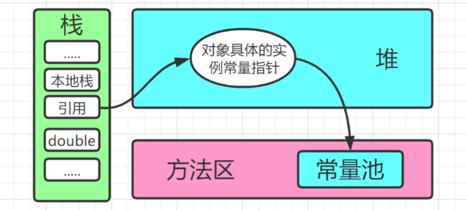

**面试常见**：

1. 请你谈谈你对JVM的理解?
2. java8虚拟机和之前的变化更新?
3. 什么是OOM，什么是栈溢出StackOverFlowError? 怎么分析?
4. JVM的常用调优参数有哪些?
5. 内存快照如何抓取？怎么分析Dump文件？
6. 谈谈JVM中，类加载器你的认识？

### 1、JVM的位置


**三种JVM:**

- Sun公司：HotSpot 用的最多
- BEA：JRockit
- IBM：J9VM

### 2、JVM的体系结构


- **JVM调优：99%都是在方法区和堆，大部分是在调堆。** JNI（java native interface）本地方法接口。

> JVM架构图


### 3、类加载器

 **作用**：加载Class文件——例如：new Student()；（具体实例在堆里，引用变量名在栈里，栈里存地址指向堆）

**类加载到JVM的基本结构图**


- 类是模板，对象是具体的，通过new来实例化对象。car1，car2，car3，名字在栈里面，真正的实例，具体的数据在堆里面，栈只是引用地址。
- 类是模板，只有一份，实例可以有多个

1. 虚拟机自带的加载器
2. 启动类（根）加载器
3. 扩展类加载器
4. 应用程序加载器

示例

```java
/**
 * @author cVzhanshi
 * @create 2021-10-20 14:59
 */
public class Car {


    public static void main(String[] args) {
        Car car1 = new Car();
        Car car2 = new Car();
        Car car3 = new Car();

        System.out.println("==================实例====================");
        System.out.println(car1.hashCode());
        System.out.println(car2.hashCode());
        System.out.println(car3.hashCode());

        System.out.println("==================Class====================");
        System.out.println(car1.getClass().hashCode());
        System.out.println(car2.getClass().hashCode());
        System.out.println(car3.getClass().hashCode());
    }
}
```


**查看类加载器**

```java
/**
 * @author cVzhanshi
 * @create 2021-10-20 14:59
 */
public class Car {


    public static void main(String[] args) {
        Car car1 = new Car();
        Class<? extends Car> aClass = car1.getClass();
        ClassLoader classLoader = aClass.getClassLoader();
        System.out.println(classLoader);   // AppClassLoader
        System.out.println(classLoader.getParent()); // ExtClassLoader    ---->  /jre/lib/ext
        System.out.println(classLoader.getParent().getParent()); // null 1、不存在  2、Java程序获取不到 ----> rt.jar
    }
}
```


**类加载器的分类：（由上至下）**

- Bootstrap ClassLoader 启动类加载器（根加载器） 
  - 主要负责加载Java核心类库，%JRE_HOME%\lib下的rt.jar、resources.jar、charsets.jar和class等
- Extention ClassLoader 标准扩展类加载器     
  - 主要负责加载目录%JRE_HOME%\lib\ext目录下的jar包和class文件
- Application ClassLoader 应用类加载器
  - 主要负责加载当前应用的classpath下的所有类
- User ClassLoader 用户自定义类加载器
  -  用户自定义的类加载器,可加载指定路径的class文件

### 4、双亲委派机制

> 案例引入

创建package  => java.lang

创建类String

```java
package java.lang;

/**
 * @author cVzhanshi
 * @create 2021-10-20 15:40
 */
public class String {
    public String toString() {
        return "Hello";
    }
    public static void main(String[] args) {
        String s = new String();
//        System.out.println(s.getClass());
        s.toString();
    }
}
```


可是我们明明创建了java.lang.String，且里面有Main方法

导致原因：**双亲委派机制**

案例解释：**在运行一个类之前，首先会在应用程序加载器(APP)中找，如果APP中有这个类，继续向上在扩展类加载器EXC中找，然后再向上，在启动类( 根 )加载器BOOT中找。如果在BOOT中有这个类的话，最终执行的就是根加载器中的。如果BOOT中没有的话，就会倒着找往回找**。运行案例时，需要加载java.lang.String.Class，它会把这个任务委托给他的上级类加载器，结果在根加载器有这个Class，所以就加载了根加载器的String.class，而这个String的并不是我们自己写的String，所以里面没有Main方法

**案例过程总结**

1. 类加载器收到类加载的请求
2. 将这个请求向上委托给父类加载器去完成，一直向上委托，直到启动类加载器
3. 启动类加载器检查是否能够加载当前这个类，能加载就结束，使用当前的加载器，否则，抛出异常，一层一层向下，通知子加载器进行加载
4. 重复步骤3

-----

> 双亲委派机制概述

- **当某个类加载器需要加载某个.class文件时，它首先把这个任务委托给他的上级类加载器，递归这个操作，如果上级的类加载器没有加载，自己才会去加载这个类**

> 加载流程


> 双亲委派机制作用

- 防止重复加载同一个.class。通过委托去向上面问一问，加载过了，就不用再加载一遍。保证数据安全。
- 保证核心.class不能被篡改。通过委托方式，不会去篡改核心.class，即使篡改也不会去加载，即使加载也不会是同一个.class对象了。不同的加载器加载同一个.class也不是同一个Class对象。这样保证了Class执行安全。

例如：如果有人想替换系统级别的类：String.java。篡改它的实现，在这种机制下这些系统的类已经被Bootstrap classLoader加载过了（为什么？因为当一个类需要加载的时候，最先去尝试加载的就是BootstrapClassLoader），所以其他类加载器并没有机会再去加载，从一定程度上防止了危险代码的植入。

[双亲委派机制详情（面试问题）](https://hollis.blog.csdn.net/article/details/112462198?utm_medium=distribute.pc_relevant.none-task-blog-2~default~BlogCommendFromMachineLearnPai2~default-11.control&dist_request_id=1329188.24840.16179780332075587&depth_1-utm_source=distribute.pc_relevant.none-task-blog-2~default~BlogCommendFromMachineLearnPai2~default-11.control)

[面试官：java双亲委派机制及作用](https://www.jianshu.com/p/1e4011617650)

### 5、沙箱安全机制

 Java安全模型的核心就是Java沙箱(sandbox)，什么是沙箱？**沙箱是一个限制程序运行的环境**。沙箱机制就是将Java代码限定在虚拟机(JVM)特定的运行范围中，并且严格限制代码对本地系统资源访问，通过这样的措施来保证对代码的有效隔离，防止对本地系统造成破坏。沙箱**主要限制系统资源访问**，那系统资源包括什么?CPU、内存、文件系统、网络。不同级别的沙箱对这些资源访问的限制也可以不一样。

所有的Java程序运行都可以指定沙箱，可以定制安全策略。

**组成沙箱的基本组件**:

- `字节码校验器`(bytecode verifier)︰确保Java类文件遵循lava语言规范。这样可以帮助lava程序实现内存保护。但并不是所有的类文件都会经过字节码校验，比如核心类。
- 类装载器(class loader) ：其中类装载器在3个方面对Java沙箱起作用：
  - 它防止恶意代码去干涉善意的代码;
  - 它守护了被信任的类库边界;
  - 它将代码归入保护域，确定了代码可以进行哪些操作。

 虚拟机为不同的类加载器载入的类提供不同的命名空间，命名空间由一系列唯一的名称组成，每一个被装载的类将有一个名字，这个命名空间是由Java虚拟机为每一个类装载器维护的，它们互相之间甚至不可见。

**类装载器采用的机制是双亲委派模式。**

1.从最内层VM自带类加载器开始加载，外层恶意同名类得不到加载从而无法使用;

2.由于严格通过包来区分了访问域，外层恶意的类通过内置代码也无法获得权限访问到内层类，破坏代码就自然无法生效。

- 存取控制器(access controller)︰存取控制器可以控制核心API对操作系统的存取权限，而这个控制的策略设定，可以由用户指定。
- 安全管理器(security manager)︰是核心API和操作系统之间的主要接口。实现权限控制，比存取控制器优先级高。
- 安全软件包(security package) : java.security下的类和扩展包下的类，允许用户为自己的应用增加新的安全特性，包括:
  - 安全提供者
  - 消息摘要
  - 数字签名
  - 加密
  - 鉴别

 ### 6、Native

- **凡是带了native关键字的，说明 java的作用范围达不到，去调用底层C/C++语言的库！**
- **JNI：Java Native Interface（Java本地方法接口）**
- 凡是带了native关键字的方法就会进入本地方法栈；
  - **Native Method Stack** 本地方法栈
- 本地接口的作用是融合不同的编程语言为Java所用，它的初衷是融合C/C++程序，Java在诞生的时候是C/C++横行的时候，想要立足，必须有调用C、C++的程序，于是就在内存中专门开辟了一块区域处理标记为native的代码，它的具体做法是 在 Native Method Stack 中登记native方法，在 ( ExecutionEngine ) 执行引擎执行的时候加载Native Libraies。
- 目前该方法使用的越来越少了，除非是与硬件有关的应用，比如通过Java程序驱动打印机或者Java系统管理生产设备，在企业级应用中已经比较少见。因为现在的异构领域间通信很发达，比如可以使用Socket通信，也可以使用Web Service等等，不多做介绍！

举例：Thread类中的start() 方法中调用一个start0()的native方法。

### 7、PC寄存器

**程序计数器：**Program Counter Register

- 每个线程都有一个程序计数器，是线程私有的，就是一个指针，指向方法区中的方法字节码(用来存储指向像一条指令的地址，也即将要执行的指令代码)，在执行引擎读取下一条指令，是一个非常小的内存空间，几乎可以忽略不计。如果正在执行的是Native方法，这个计数器值则为空（Unfined）
- **此内存区域是唯一一个在Java虚拟机规范中没有规定任何OOM情况的区域** 

### 8、方法区

**Method Area 方法区**

- 方法区是被所有线程共享，所有字段和方法字节码，以及一些特殊方法，如构造函数，接口代码也在此定义，简单说，所有定义的方法的信息都保存在该区域，**此区域属于共享区间;**
- ==静态变量、常量、类信息(构造方法、接口定义)、运行时的常量池存在方法区中，但是实例变量存在堆内存中，和方法区无关==
- static ，final ，Class ，常量池~

> 案例图解

```java
/**
 * @author cVzhanshi
 * @create 2021-10-21 11:23
 */
public class TestMethod {
    private String name = "cvzhanshi";
    private int age;

    public static void main(String[] args) {
        
    }
}
```


### 9、栈

- 栈：后进先出 / 先进后出
- 队列：先进先出（FIFO : First Input First Output）

==喝多了吐就是栈，吃多了拉就是队列==

图解，**为什么main先执行，最后结束**~


> 栈概述

- 栈也叫栈内存，主管Java程序的运行，是在线程创建时创建，**它的生命期是跟随线程的生命期，线程结束栈内存也就释放**。

- ==**对于栈来说不存在垃圾回收问题**==，只要线程一旦结束，该栈就Over，生命周期和线程一致，是**线程私有的**。

- 方法自己调自己就会导致栈溢出（递归死循环测试）。

  ```java
  /**
   * @author cVzhanshi
   * @create 2021-10-21 11:23
   */
  public class TestMethod {
      private String name = "cvzhanshi";
      private int age;
  
      public static void main(String[] args) {
          new TestMethod().a();
      }
  
      public void a(){
          test();
      }
      public void test(){
          a();
      }
  }
  ```

  

  图解：

  

  -----

**栈管理程序运行**

- 存储一些基本类型的值、对象的引用、方法等。
- ==**栈的优势是，存取速度比堆要快，仅次于寄存器，栈数据可以共享。**==

**栈里面会放什么东西呢？**

- 8大基本类型 + 对象的引用 + 实例的方法

> **栈运行原理**

- Java栈的组成元素——栈帧。
- 栈帧是一种用于帮助虚拟机执行方法调用与方法执行的数据结构。他是独立于线程的，一个线程有自己的一个栈帧。封装了方法的局部变量表、动态链接信息、方法的返回地址以及操作数栈等信息。
- 第一个方法从调用开始到执行完成，就对应着一个栈帧在虚拟机栈中从入栈到出栈的过程

当一个方法A被调用时就产生了一个栈帧F1，并被压入到栈中，A方法又调用了B方法，于是产生了栈帧F2也被压入栈中，B方法又调用了C方法，于是产生栈帧F3也被压入栈中 执行完毕后，先弹出F3， 然后弹出F2，在弹出F1……..

- 遵循 “先进后出” / “后进先出” 的原则。
- 栈满了，抛出异常：stackOverflowError
- 程序正在执行的方法，一定在栈的顶部


-----



> 对象实例化的过程（在内存中）


### 10、三种JVM

- Sun公司 **HotSpot** java Hotspot™64-Bit server vw (build 25.181-b13，mixed mode)
- BEA `JRockit`
- IBM `J9 VM `

### 11、堆

- Heap，一个JVM，只有一个堆内存，堆内存的大小是可以调节的。

- 类加载器读取了类文件后，一般会把什么东西放到堆中？
  - 类、方法、常量、变量~，保存我们所有引用类型的真实对象（栈中只保存了引用，引用通过地址指向堆中的真实对象）

-----

堆内存中还要细分为三个区域：

- 新生区（伊甸园区）Young/New

- 养老区 old

- 永久区 Perm（元空间 : JDK8 以后名称）

  

- 在JDK8以后，永久存储区改了个名字(元空间)。

  

GC垃圾回收，主要是在伊甸园区和养老区~

假设内存满了，OOM，堆内存不够！

### 12.新生区、养老区

- 新生区是类诞生，成长，消亡的区域，一个类在这里产生，应用，最后被垃圾回收器收集，结束生命。
- 新生区又分为两部分：伊甸区（Eden Space）和幸存者区（Survivor Space），所有的类都是在伊甸区被new出来的，幸存区有两个：0区 和 1区，当伊甸园的空间用完时，程序又需要创建对象，JVM的垃圾回收器将对伊甸园区进行垃圾回收（Minor GC）。将伊甸园中的剩余对象移动到幸存0区，若幸存0区也满了，再对该区进行垃圾回收，然后移动到1区，那如果1区也满了呢？（**这里幸存0区和1区是一个互相交替的过程**）再移动到养老区，若养老区也满了，那么这个时候将产生MajorGC（Full GC），进行养老区的内存清理，若养老区执行了Full GC后发现依然无法进行对象的保存，就会产生OOM异常 “OutOfMemoryError ”。如果出现 java.lang.OutOfMemoryError：java heap space异常，说明Java虚拟机的堆内存不够，原因如下：
  - Java虚拟机的堆内存设置不够，可以通过参数 -Xms（初始值大小），-Xmx（最大大小）来调整。
  - 代码中创建了大量大对象，并且长时间不能被垃圾收集器收集（存在被引用）或者死循环。

### 13.永久区（Perm）

- 永久存储区是一个常驻内存区域，用于存放JDK自身所携带的Class，Interface的元数据，也就是说它存储的是运行环境必须的类信息，被装载进此区域的数据是不会被垃圾回收器回收掉的，关闭JVM才会释放此区域所占用的内存。
- 如果出现 java.lang.OutOfMemoryError：**PermGen space（永久区OOM）**，说明是 Java虚拟机对永久代Perm内存设置不够。一般出现这种情况，都是程序启动需要加载大量的第三方jar包，
- 例如：在一个Tomcat下部署了太多的应用。或者大量动态反射生成的类不断被加载，最终导致Perm区被占满。

**注意：**

- JDK1.6之前： 有永久代，常量池1.6在方法区
- JDK1.7： 有永久代，但是已经逐步 “去永久代”，常量池1.7在堆
- JDK1.8及之后：无永久代，常量池1.8在元空间

**熟悉三区结构后方可学习**JVM垃圾回收机制

- 实际而言，方法区（Method Area）和堆一样，是各个线程共享的内存区域，它用于存储虚拟机加载的：类信息+普通常量+静态常量+编译器编译后的代码，虽然JVM规范将方法区描述为**堆的一个逻辑部分（逻辑上存在，物理上不存在），但它却还有一个别名，叫做Non-Heap（非堆），目的就是要和堆分开**。
- 对于HotSpot虚拟机，很多开发者习惯将方法区称之为 “永久代（Parmanent Gen）”，但严格本质上说两者不同，或者说使用永久代实现方法区而已，永久代是方法区（相当于是一个接口interface）的一个实现，Jdk1.7的版本中，已经将原本放在永久代的字符串常量池移走。
- 常量池（Constant Pool）是方法区的一部分，Class文件除了有类的版本，字段，方法，接口描述信息外，还有一项信息就是常量池，这部分内容将在类加载后进入方法区的运行时常量池中存放！

**堆的组成图**


### 14.堆内存调优

- ==-Xms==：设置初始分配大小，默认为物理内存的 “1/64”。
- ==-Xmx==：最大分配内存，默认为物理内存的 “1/4”。
- ==-XX:+PrintGCDetails==：输出详细的GC处理日志。

> 测试一

```java
/**
 * @author cVzhanshi
 * @create 2021-10-21 17:29
 */
public class TestHeap {
    public static void main(String[] args) {
        // 返回虚拟机试图使用的最大内存
        long max = Runtime.getRuntime().maxMemory();    // 字节：1024*1024
        // 返回jvm的总内存
        long total = Runtime.getRuntime().totalMemory();
        System.out.println("max=" + max + "字节\t" + (max/(double)1024/1024) + "MB");
        System.out.println("total=" + total + "字节\t" + (total/(double)1024/1024) + "MB");
        // 默认情况下:分配的总内存是电脑内存的1/4,初始化的内存是电脑的1/64
    }
}
```


- 发现，默认的情况下分配的内存是总内存的 1/4，而初始化的内存为 1/64 ！

- 修改VM参数再次运行

  ```sh
  -Xms1024m -Xmx1024m -XX:+PrintGCDetails
  ```

  

  运行结果

  

  大概计算分析一下新生代和老年代的空间

  

  结论：发现等于初始化和最大的物理内存，**验证了元空间逻辑存在，物理不存在**

> 测试二（测试OOM）

- 设置VM参数

```sh
-Xms8m -Xmx8m -XX:+PrintGCDetails
```

- 代码

  ```java
  /**
   * @author cVzhanshi
   * @create 2021-10-21 17:29
   */
  public class TestHeap {
      public static void main(String[] args) {
  //        // 返回虚拟机试图使用的最大内存
  //        long max = Runtime.getRuntime().maxMemory();    // 字节：1024*1024
  //        // 返回jvm的总内存
  //        long total = Runtime.getRuntime().totalMemory();
  //        System.out.println("max=" + max + "字节\t" + (max/(double)1024/1024) + "MB");
  //        System.out.println("total=" + total + "字节\t" + (total/(double)1024/1024) + "MB");
          // 默认情况下:分配的总内存是电脑内存的1/4,初始化的内存是电脑的1/64
  
          String str = "suneiLY";
          while (true) {
              str += str + new Random().nextInt(88888888)
                      + new Random().nextInt(999999999);
          }
      }
  }		
  ```

- 测试结果

  
  - 这是一个young 区域撑爆的JAVA 内存日志，其中 PSYoungGen 表示 youngGen分区的变化1536k 表示 GC之前的大  小。
  - 488k 表示GC 之后的大小。
  - 整个Young区域的大小从 1536K 到 672K , young代的总大小为 7680K。

  

  - user – 总计本次 GC 总线程所占用的总 CPU 时间。
  - sys – OS 调用 or 等待系统时间。
  - real – 应用暂停时间。
  - 如果GC 线程是 Serial Garbage Collector 串行搜集器的方式的话（只有一条GC线程,）， real time 等于user 和 system 时间之和。
  - 通过日志发现Young的区域到最后 GC 之前后都是0，old 区域 无法释放，最后报堆溢出错误。

**发生OOM内存溢出，解决方法**
A、 尝试扩大堆内存看结果
B、 分析内存，看一下哪个地方出现问题（专业工具）

> **JProfiler工具分析OOM原因**

[JProfiler下载地址](https://www.ej-technologies.com/download/jprofiler/version_92)

- 先在idea下载插件

  

- 下载客户端

  ```bash
  // 注册码仅供参考
  L-Larry_Lau@163.com#23874-hrwpdp1sh1wrn#0620
  L-Larry_Lau@163.com#36573-fdkscp15axjj6#25257
  L-Larry_Lau@163.com#5481-ucjn4a16rvd98#6038
  L-Larry_Lau@163.com#99016-hli5ay1ylizjj#27215
  L-Larry_Lau@163.com#40775-3wle0g1uin5c1#0674
  ```

- idea中绑定客户端

  

- 进行测试调优

只需要在VM参数中添加此参数，就会Dump下来文件，然后通过JProfiler进行判断错误

```bash
-XX:+HeapDumpOnOutOfMemoryError     # 配置jvm参数，获取Heap Dump文件，用于分析结果
```

- 分析Dump内存文件，快速定位内存泄漏
- 获得堆中的数据
- 获得大的对象
- 查看线程，定位错误的行数

**1、内存溢出：（Out Of Memory—-OOM）**
系统已经不能再分配出你所需要的空间，比如系统现在只有1G的空间，但是你偏偏要2个G空间，这就叫内存溢出
例子：一个盘子用尽各种方法只能装4个果子，你装了5个，结果掉倒地上不能吃了。这就是溢出。比方说栈，栈满时再做进栈必定产生空间溢出，叫上溢，栈空时再做退栈也产生空间溢出，称为下溢。就是分配的内存不足以放下数据项序列,称为内存溢出。说白了就是我承受不了那么多，那就报错。

**2、内存泄漏： (Memory Leak)**
强引用所指向的对象不会被回收，可能导致内存泄漏，虚拟机宁愿抛出OOM也不会去回收他指向的对象，意思就是你用资源的时候为他开辟了一段空间，当你用完时忘记释放资源了，这时内存还被占用着，一次没关系，但是内存泄漏次数多了就会导致内存溢出

**其他文章链接**

- [一文读懂 - 元空间和永久代](https://juejin.cn/post/684490402096480257)
- [Java方法区、永久代、元空间、常量池详解](https://blog.csdn.net/u011635492/article/details/81046174?utm_medium=distribute.pc_relevant.none-task-blog-2~default~BlogCommendFromMachineLearnPai2~default-2.control&dist_request_id=1331647.219.16183160373688617&depth_1-utm_source=distribute.pc_relevant.none-task-blog-2~default~BlogCommendFromMachineLearnPai2~default-2.control)

### 15、GC

**GC的作用域**


JVM在进行GC时，并不是对这三个区域统一回收。大部分时候，回收都是新生代~

- 新生代
- 幸存区（from，to）
- 老年区

GC分两种类：轻GC（普通的GC）、重GC（全局GC）

- 轻GC（普通的GC）大部分只清除新生代的内存，偶尔走一下幸存区

  过程：复制->清空->互换

  - 复制

    eden、Survivor From区 复制到Survivor To区，年龄+1

    首先，当Eden区满的时候会触发第一次GC，把还存活的对象拷贝到survivorFrom区，当Eden区再次触发GC的时候，会扫描Eden区和From区域，对这两个区域进行垃圾回收，经过这次垃圾回收后还存活的对象，则直接复制到To区(如果有对象的年龄已经达到了去往老年代的标准，则这些达到标准的对象将会被复制到老年代区)，同时把这些对象的年龄+1

  - 清空

    清空Eden、survivorFrom区。然后，清空Eden和SuriviorFrom中的对象，也即是复制之后有交换。谁空谁做to区。

  - SurvivorTo和SurvivorFrom互换

    最后，Survivor To和Survivor From互换，原来Survivor To成为下一次GC的Survivor From区，部分对象会在From和To区中复制来复制去的，如此交换15次(由JVM参数**MaxTenuringThreshold**决定的，这个参数默认值就是15)，最终如果还是存活的对象，就把这些存活的对象存入到老年代区域。

- 重GC（全局GC）相当于所有的东西清理一遍

**GC题目：**

- JVM是内存模型和分区~详细到每个区放什么？
- 堆里面的分区有哪些？说说他们的特点
- GC的算法有哪些？标记清除法、复制算法、标记整理算法、分代收集算法、引用计数法，怎么用的？
- 轻GC和重GC分别在什么时候发生

**说明**（**新对象在堆中可能遭遇的过程**）：一个对象在伊甸园区被new出来，当伊甸园区对象的数量满了会调用轻GC来清理伊甸园区的对象，没有被清理掉的对象会进入到幸存from区，如果满了会和幸存to区(**谁空谁是to**)互换，当一个对象经历了15次GC还没有死的话，对象会进入到养老区，当养老去满了的时候会调用重GC来清理垃圾

### 16、GC四大算法

> **引用计数法**


- 每个对象有一个引用计数器，当对象被引用一次则计数器加1，当对象引用失效一次，则计数器减1，对于计数器为0的对象意味着是垃圾对象，可以被GC回收。
- 目前虚拟机基本都是采用可达性算法，从GC Roots 作为起点开始搜索，那么整个连通图中的对象边都是活对象，对于GC Roots 无法到达的对象变成了垃圾回收对象，随时可被GC回收。

缺点：

- 每次对象赋值均要维护引用计数器，且计数器本身也有一定的消耗
- 较难处理循环引用

**JVM的实现一般不采用这种方式**

-----

> 复制算法

年轻代中使用的是Minor GC，采用的就是复制算法（Copying）

**Minor GC过程：复制->清空->互换**

- 复制

  eden、Survivor From区 复制到Survivor To区，年龄+1

  首先，当Eden区满的时候会触发第一次GC，把还存活的对象拷贝到survivorFrom区，当Eden区再次触发GC的时候，会扫描Eden区和From区域，对这两个区域进行垃圾回收，经过这次垃圾回收后还存活的对象，则直接复制到To区(如果有对象的年龄已经达到了去往老年代的标准，则这些达到标准的对象将会被复制到老年代区)，同时把这些对象的年龄+1

- 清空

  清空Eden、survivorFrom区。然后，清空Eden和SuriviorFrom中的对象，也即是复制之后有交换。**在幸存区中谁空谁是to**。

- SurvivorTo和SurvivorFrom互换

  最后，Survivor To和Survivor From互换，原来Survivor To成为下一次GC的Survivor From区，部分对象会在From和To区中复制来复制去的，如此交换15次(由JVM参数**MaxTenuringThreshold**决定的，这个参数默认值就是15)，最终如果还是存活的对象，就把这些存活的对象存入到老年代区域。

- `-XX:MaxTenuringThreshold` 任期门槛=>设置对象在新生代中存活的次数

-----

**原理解释**

- 年轻代中的GC，主要是复制算法（Copying）

- HotSpot JVM 把年轻代分为了三部分：一个 Eden 区 和 2 个Survivor区（from区 和 to区）。**默认比例为 8:1:1**，一般情况下，新创建的对象都会被分配到Eden区（一些大对象特殊处理），这些对象经过第一次Minor GC后，如果仍然存活，将会被移到Survivor区，对象在Survivor中每熬过一次Minor GC ， 年龄就会增加1岁，当它的年龄增加到一定程度时，就会被移动到年老代中，因为年轻代中的对象基本上都是朝生夕死，所以在年轻代的垃圾回收算法使用的是复制算法！复制算法的思想就是将内存分为两块，每次只用其中一块，当这一块内存用完，就将还活着的对象复制到另外一块上面。**复制算法不会产生内存碎片**！

  

- 在GC开始的时候，对象只会在Eden区和名为 “From” 的Survivor区，Survivor区“TO” 是空的，紧接着进行GC，Eden区中所有存活的对象都会被复制到 “To”，而在 “From” 区中，仍存活的对象会更具他们的年龄值来决定去向。

- 年龄达到一定值的对象会被移动到老年代中，没有达到阈值的对象会被复制到 “To 区域”，经过这次GC后，**Eden区和From区已经被清空**，这个时候， “From” 和 “To” 会交换他们的角色， 也就是新的 “To” 就是GC前的“From” ， 新的 “From” 就是上次GC前的 “To”。

- 不管怎样，都会保证名为To 的Survicor区域是空的。 Minor GC会一直重复这样的过程。直到 To 区 被填满 ，“To” 区被填满之后，会将所有的对象移动到老年代中。

  

  

-----

**好处**

- 没有内存的碎片

**坏处**

- 浪费了内存空间~多了一半的空间永远是空的（to）

**复制算法最佳使用场景：对象存活度较低的时候(新生区)**

**补充**

- 大对象直接进入到老年代，原因是新生代的GC算法是复制算法，这样做的目的是避免Eden去和两个Survivor区之间发生大量的内存复制

> 标记清除算法

- 当堆中的有效内存空间被耗尽的时候，就会停止整个程序（也被称为stop the world），然后进行两项工作，第一项则是标记，第二项则是清除。
- 标记：从引用根节点开始标记所有被引用的对象，标记的过程其实就是遍历所有的GC Roots ，然后将所有GC Roots 可达的对象，标记为存活的对象。
- 清除： 遍历整个堆，把未标记的对象清除。


**优点**

- 不需要额外的空间

**缺点**

- 它的缺点就是效率比较低，需要两次遍历（递归与全堆对象遍历），而且在进行GC的时候，需要停止应用 程序

- 主要的缺点则是这种方式清理出来的空闲内存是不连续的，会产生内存碎片。这点不难理解，我们的死亡对象 都是随机的出现在内存的各个角落，现在把他们清除之后，内存的布局自然乱七八糟，而为了应付 这一点，JVM就不得不维持一个内存空间的空闲列表，这又是一种开销。而且在分配数组对象的时 候，寻找连续的内存空间会不太好找。

> 标记压缩

对标记清除算法会产生内存碎片进行优化


- 在整理压缩阶段，不再对标记的对象作回收，而是通过所有存活对象都像一端移动，然后直接清除边界以外的内存。可以看到，标记的存活对象将会被整理，按照内存地址依次排列，而未被标记的内存会被 清理掉，如此一来，当我们需要给新对象分配内存时，JVM只需要持有一个内存的起始地址即可，这比维护一个空闲列表显然少了许多开销。
- 标记、整理算法 不仅可以弥补 标记、清除算法当中，内存区域分散的缺点，也消除了复制算法当中，内存减半的高额代价

> 标记清除压缩

- 先标记清除几次，在压缩


> **总结**

- 内存效率：复制算法 > 标记清除算法 > 标记压缩算法 （时间复杂度）；
- 内存整齐度：复制算法 = 标记压缩算法 > 标记清除算法；
- 内存利用率：标记压缩算法 = 标记清除算法 > 复制算法；

难道就没有一种最优算法吗？

答案： 无，没有最好的算法，只有最合适的算法 。 ==>  **分代收集算法**

**年轻代：**（Young Gen）

- 年轻代特点是**区域相对老年代较小**，**对象存活低**。
- 这种情况**复制算法**的回收整理，速度是最快的。复制算法的效率只和当前存活对象大小有关，因而很适用于年轻代的回收。而复制算法内存利用率不高的问题，通过hotspot中的两个survivor的设计得到缓解。

**老年代：**（Tenure Gen）

- 老年代的特点是**区域较大**，**对象存活率高**！
- 标记清除（内存碎片不太多） + 标记压缩是实现


