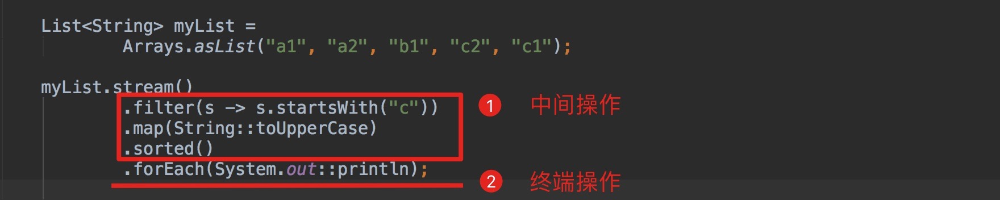

> - Stream流是Java8新特性中实践起来最让人舒服的功能，它让我们告别了繁琐的for循环迭代，所以Stream是我们必须要掌握的一个技术特性
> - 此文将带着你如何使用 Java 8 不同类型的 Stream 操作。同时您还将了解流的处理顺序，以及不同顺序的流操作是如何影响运行时性能的。

# ① Stream 流是如何工作的

流表示包含着一系列元素的集合，我们可以对其做不同类型的操作，用来对这些元素执行计算。

代码示例：

```java
List<String> myList =
    Arrays.asList("a1", "a2", "b1", "c2", "c1");

myList
    .stream() // 创建流
    .filter(s -> s.startsWith("c")) // 执行过滤，过滤出以 c 为前缀的字符串
    .map(String::toUpperCase) // 转换成大写
    .sorted() // 排序
    .forEach(System.out::println); // for 循环打印
// 打印结果
// C1
// C2
```

我们可以对流进行中间操作或者终端操作。

- **中间操作**会再次返回一个流，所以，我们可以链接多个中间操作，注意这里是不用加分号的。上图中的`filter` 过滤，`map` 对象转换，`sorted` 排序，就属于中间操作。

- **终端操作**是对流操作的一个结束动作，一般返回 `void` 或者一个非流的结果。上图中的 `forEach`循环 就是一个终止操作。

  

实际上，大部分流操作都支持 lambda 表达式作为参数，正确理解，应该说是接受一个函数式接口的实现作为参数。

# ② 不同类型的Stream流

我们可以通过从各种数据源中创建 Stream 流，其中以 Collection 集合最为常见。如 `List` 和 `Set` 均支持 `stream()` 方法来创建顺序流或者是并行流。并行流是通过多线程的方式来执行的，它能够充分发挥多核 CPU 的优势来提升性能。

在集合上调用`stream()`方法会返回一个普通的 Stream 流。但是我们也可以通过 `Stream.of()` 从一堆对象中创建 Stream 流。

```java
Stream.of("a1", "a2", "a3")
    .findFirst()
    .ifPresent(System.out::println);  // a1
```

不过除了常规对象流之外，Java 8还附带了一些特殊类型的流，用于处理原始数据类型`int`，`long`以及`double`。所对应的流是`IntStream`，`LongStream`还有`DoubleStream`。

上面这些原始类型流的工作方式与常规对象流基本是一样的，但还是略微存在一些区别：

- 原始类型流使用其独有的函数式接口，例如`IntFunction`代替`Function`，`IntPredicate`代替`Predicate`。

- 原始类型流支持额外的终端聚合操作，`sum()`以及`average()`，如下所示：

  ```java
  Arrays.stream(new int[] {1, 2, 3})
      .map(n -> 2 * n + 1) // 对数值中的每个对象执行 2*n + 1 操作
      .average() // 求平均值
      .ifPresent(System.out::println);  // 如果值不为空，则输出
  // 5.0
  ```

**不过也有中间操作将常规对象流转换为原始类型流。如： `mapToInt()`，`mapToLong()` 以及`mapToDouble`**

```java
Stream.of("a1", "a2", "a3")
    .map(s -> s.substring(1)) // 对每个字符串元素从下标1位置开始截取
    .mapToInt(Integer::parseInt) // 转成 int 基础类型类型流
    .max() // 取最大值
    .ifPresent(System.out::println);  // 不为空则输出
// 3
```

**如果需要将原始类型流妆化为对象流，可以使用`mapToObj()`**

```java
IntStream.range(1, 4)
    .mapToObj(i -> "a" + i) // for 循环 1->4, 拼接前缀 a
    .forEach(System.out::println); // for 循环打印

// a1
// a2
// a3
```

代码示例

```java
Stream.of(1.0, 2.0, 3.0)
    .mapToInt(Double::intValue) // double 类型转 int
    .mapToObj(i -> "a" + i) // 对值拼接前缀 a
    .forEach(System.out::println); // for 循环打印

// a1
// a2
// a3
```

# ③ Stream流的处理顺序

首选声明，中间操作是有**延迟性**的。

代码示例：

```java
Stream.of("d2", "a2", "b1", "b3", "c")
    .filter(s -> {
        System.out.println("filter: " + s);
        return true;
    });
```

上述代码带有欺骗性你可能会认为，将依次打印 "d2", "a2", "b1", "b3", "c" 元素。其实不会输出任何东西。

因为**当且仅当存在终端操作时，中间操作操作才会被执行。**

```java
Stream.of("d2", "a2", "b1", "b3", "c")
    .filter(s -> {
        System.out.println("filter: " + s);
        return true;
    })
    .forEach(s -> System.out.println("forEach: " + s));

// 输出
filter: d2
forEach: d2
filter: a2
forEach: a2
filter: b1
forEach: b1
filter: b3
forEach: b3
filter: c
forEach: c
```

这样就能输出所有元素。

从输出结果中我们不难发现，**输出的结果是随着链条垂直移动的**。比如说，当 Stream 开始处理 d2 元素时，它实际上会在执行完 filter 操作后，再执行 forEach 操作，接着才会处理第二个元素。

**原因是出于性能的考虑。这样设计可以减少对每个元素的实际操作数。**

代码示例：

```java
@Test
void contextLoads() {
    Stream.of("d2", "a2", "b1", "b3", "c")
        .map(s -> {
            System.out.println("map: " + s);
            return s.toUpperCase(); // 转大写
        })
        .anyMatch(s -> {
            System.out.println("anyMatch: " + s);
            return s.startsWith("A"); // 过滤出以 A 为前缀的元素
        });
	// 输出结果
    // map:      d2
    // anyMatch: D2
    // map:      a2
    // anyMatch: A2
}
```

从此可以明显的看出输出的结果是随着链条垂直移动的。

终端操作 `anyMatch()`表示任何一个元素以 A 为前缀，返回为 `true`，就停止循环。所以它会从 `d2` 开始匹配，接着循环到 `a2` 的时候，返回为 `true` ，于是停止循环。

由于数据流的链式调用时垂直执行的，`map`这里只需要执行两次。相对于水平执行来说，`map`会执行尽可能少的次数，而不是把所有元素都 `map` 转换一遍。

# ④ 中间操作属性呢重要吗？

代码示例

例子由两个中间操作`map`和`filter`，以及一个终端操作`forEach`组成

```java
Stream.of("d2", "a2", "b1", "b3", "c")
    .map(s -> {
        System.out.println("map: " + s);
        return s.toUpperCase(); // 转大写
    })
    .filter(s -> {
        System.out.println("filter: " + s);
        return s.startsWith("A"); // 过滤出以 A 为前缀的元素
    })
    .forEach(s -> System.out.println("forEach: " + s)); // for 循环输出
// 输出结果   执行顺序
// map:     d2
// filter:  D2
// map:     a2
// filter:  A2
// forEach: A2
// map:     b1
// filter:  B1
// map:     b3
// filter:  B3
// map:     c
// filter:  C
```

我们知道了中间操作的执行顺序，那么我们就知道`map`和`filter`会对集合中的每个字符串调用五次，而`forEach`却只会调用一次，因为只有 "a2" 满足过滤条件。

但是如果我们修改中间操作顺序，将`filter`移动到链头的最开始，就可以大大减少实际的执行次数：

```java
Stream.of("d2", "a2", "b1", "b3", "c")
    .filter(s -> {
        System.out.println("filter: " + s)
        return s.startsWith("a"); // 过滤出以 a 为前缀的元素
    })
    .map(s -> {
        System.out.println("map: " + s);
        return s.toUpperCase(); // 转大写
    })
    .forEach(s -> System.out.println("forEach: " + s)); // for 循环输出

// filter:  d2
// filter:  a2
// map:     a2
// forEach: A2
// filter:  b1
// filter:  b3
// filter:  c
```

现在，`map`仅仅只需调用一次，性能得到了提升。

如果在对上述例子增加sorted操作，那么对性能影响更大。

```java
Stream.of("d2", "a2", "b1", "b3", "c")
    .sorted((s1, s2) -> {
        System.out.printf("sort: %s; %s\n", s1, s2);
        return s1.compareTo(s2); // 排序
    })
    .filter(s -> {
        System.out.println("filter: " + s);
        return s.startsWith("a"); // 过滤出以 a 为前缀的元素
    })
    .map(s -> {
        System.out.println("map: " + s);
        return s.toUpperCase(); // 转大写
    })
    .forEach(s -> System.out.println("forEach: " + s)); // for 循环输出
```

`sorted` 是一个有状态的操作，因为它需要在处理的过程中，保存状态以对集合中的元素进行排序。

```java
// 执行顺序
sort:    a2; d2
sort:    b1; a2
sort:    b1; d2
sort:    b1; a2
sort:    b3; b1
sort:    b3; d2
sort:    c; b3
sort:    c; d2
filter:  a2
map:     a2
forEach: A2
filter:  b1
filter:  b3
filter:  c
filter:  d2
```

通过结果能发现，`sorted`是水平执行的。因此，在这种情况下，`sorted`会对集合中的元素组合调用八次。

我们把`sorted`操作放在过滤后面，那么性能就能大大提升

```java
Stream.of("d2", "a2", "b1", "b3", "c")
    .filter(s -> {
        System.out.println("filter: " + s);
        return s.startsWith("a");
    })
    .sorted((s1, s2) -> {
        System.out.printf("sort: %s; %s\n", s1, s2);
        return s1.compareTo(s2);
    })
    .map(s -> {
        System.out.println("map: " + s);
        return s.toUpperCase();
    })
    .forEach(s -> System.out.println("forEach: " + s));

// filter:  d2
// filter:  a2
// filter:  b1
// filter:  b3
// filter:  c
// map:     a2
// forEach: A2
```

从上面的输出中，我们看到了 `sorted`从未被调用过，因为经过`filter`过后的元素已经减少到只有一个，这种情况下，是不用执行排序操作的。因此性能被大大提高了。

# ⑤ 数据流复用问题

**Java8 Stream 流是不能被复用的，一旦你调用任何终端操作，流就会关闭**。

```java
Stream<String> stream =
    Stream.of("d2", "a2", "b1", "b3", "c")
        .filter(s -> s.startsWith("a"));

stream.anyMatch(s -> true);    // ok
stream.noneMatch(s -> true);   // 报异常exception
```

当我们对流进行了终止操作后，流就会关闭，之后不能去操作流了。再操作会报异常。

```java
java.lang.IllegalStateException: stream has already been operated upon or closed
	at java.util.stream.AbstractPipeline.evaluate(AbstractPipeline.java:229)
	at java.util.stream.ReferencePipeline.anyMatch(ReferencePipeline.java:449)
	at cn.cvzhanshi.test.TestApplicationTests.contextLoads(TestApplicationTests.java:33)
	at sun.reflect.NativeMethodAccessorImpl.invoke0(Native Method)
	at sun.reflect.NativeMethodAccessorImpl.invoke(NativeMethodAccessorImpl.java:62)
	at sun.reflect.DelegatingMethodAccessorImpl.invoke(DelegatingMethodAccessorImpl.java:43)
	at java.lang.reflect.Method.invoke(Method.java:483)
	at org.junit.platform.commons.util.ReflectionUtils.invokeMethod(ReflectionUtils.java:688)
	at org.junit.jupiter.engine.execution.MethodInvocation.proceed(MethodInvocation.java:60)
```

但是我们可以**通过 `Supplier` 来包装一下流，通过 `get()` 方法来构建一个新的 `Stream` 流**。就很好的克制了这个问题。

```java
Supplier<Stream<String>> streamSupplier =
    () -> Stream.of("d2", "a2", "b1", "b3", "c")
            .filter(s -> s.startsWith("a"));

streamSupplier.get().anyMatch(s -> true);   // ok
streamSupplier.get().noneMatch(s -> true);  // ok
```

# ⑥ 高级操作

`Streams` 支持的操作很丰富，除了上面介绍的这些比较常用的中间操作，如`filter`或`map`。还有一些更复杂的操作，如`collect`，`flatMap`以及`reduce`。

接下来测试代码均用Person类来测试

```java
/**
 * @author cVzhanshi
 * @create 2022-10-08 10:02
 */
@Data
@AllArgsConstructor
@NoArgsConstructor
public class Person {
    String name;
    Integer age;
}
```

## 6.1 Collect

collect 是一个非常有用的终端操作，它可以将流中的元素转变成另外一个不同的对象，例如一个`List`，`Set`或`Map`。collect 接受入参为`Collector`（收集器），它由四个不同的操作组成：供应器（supplier）、累加器（accumulator）、组合器（combiner）和终止器（finisher）。

**示例一**：collect(Collectors.toList())

- 过滤出名字以 P 开头的，然后生成一个新的List

```java
@Test
void testCollect(){
    // 构建一个 Person 集合
    List<Person> persons =
        Arrays.asList(
        new Person("Max", 18),
        new Person("Peter", 23),
        new Person("Pamela", 23),
        new Person("David", 12));


    List<Person> persons2 = persons
        .stream() // 构建流
        .filter(person -> person.getName().startsWith("P")) // 过滤
        .collect(Collectors.toList()); // 收集流的结果，生成一个新的List
    persons2.forEach(System.out::println);
}
```

**示例二**：collect(Collectors.groupingBy(p -> p.getName()))

- 将会按年龄对所有人进行分组

```java
@Test
void testCollect(){
    // 构建一个 Person 集合
    List<Person> persons =
        Arrays.asList(
        new Person("Max", 18),
        new Person("Peter", 23),
        new Person("Pamela", 23),
        new Person("David", 12));


    Map<String, List<Person>> collect = persons
        .stream() // 构建流
        .collect(Collectors.groupingBy(p -> p.getName()));
    collect.forEach((k,v) -> System.out.format("age %s : %s\n" ,k ,v));
}
```

**示例三**：collect(Collectors.averagingInt(p -> p.getAge()))

- 计算所有人的平均年龄

```java
@Test
void testCollect(){
    // 构建一个 Person 集合
    List<Person> persons =
        Arrays.asList(
        new Person("Max", 18),
        new Person("Peter", 23),
        new Person("Pamela", 23),
        new Person("David", 12));
    System.out.println(persons.stream().collect(Collectors.averagingInt(p -> p.getAge())));
}
```

**示例四**：collect(Collectors.summarizingInt(p -> p.getAge()))

- **摘要收集器可以返回一个特殊的内置统计对象。通过它，我们可以简单地计算出最小年龄、最大年龄、平均年龄、总和以及总数量。**

```java
@Test
void testCollect(){
    // 构建一个 Person 集合
    List<Person> persons =
        Arrays.asList(
        new Person("Max", 18),
        new Person("Peter", 23),
        new Person("Pamela", 23),
        new Person("David", 12));
    IntSummaryStatistics ageSummary =
        persons
        .stream()
        .collect(Collectors.summarizingInt(p -> p.getAge())); // 生成摘要统计
    System.out.println(ageSummary);
}

// IntSummaryStatistics{count=4, sum=76, min=12, average=19.000000, max=23}
```

**示例五**：collect(Collectors.joining(" 连接 ", "开头", "结尾"))

- 将所有人名连接成一个字符串

```java
@Test
void testCollect(){
    // 构建一个 Person 集合
    List<Person> persons =
        Arrays.asList(
        new Person("Max", 18),
        new Person("Peter", 23),
        new Person("Pamela", 23),
        new Person("David", 12));
    String phrase = persons
        .stream()
        .filter(p -> p.getAge() >= 18) // 过滤出年龄大于等于18的
        .map(p -> p.getName()) // 提取名字
        .collect(Collectors.joining(" 连接 ", "开头", "结尾"));
    System.out.println(phrase); // 开头Max 连接 Peter 连接 Pamela结尾
}
```

**示例六**：对于如何将流转换为 `Map`集合，我们必须指定 `Map` 的键和值。

这里需要注意，`Map` 的键必须是唯一的，否则会抛出`IllegalStateException` 异常。但是我们可以选择传递一个合并函数作为额外的参数来避免发生这个异常：

```java
@Test
void testCollect(){
    // 构建一个 Person 集合
    List<Person> persons =
        Arrays.asList(
        new Person("Max", 18),
        new Person("Peter", 23),
        new Person("Pamela", 23),
        new Person("David", 12));
    Map<Integer, String> map = persons
        .stream()
        .collect(Collectors.toMap(
            p -> p.getAge(),  // key
            p -> p.getName(), // value
            (name1, name2) -> name1 + ";" + name2)); // 对于同样 key 的，将值拼接

    System.out.println(map);// {18=Max, 23=Peter;Pamela, 12=David}
}
```

==**示例七：自定义收集器**==

希望将流中的所有人转换成一个字符串，包含所有大写的名称，并以`|`分割。为了达到这种效果，我们需要通过`Collector.of()`创建一个新的收集器。同时，我们还需要传入收集器的四个组成部分：供应器、累加器、组合器和终止器。

```java
@Test
void testCollect(){
    // 构建一个 Person 集合
    List<Person> persons =
        Arrays.asList(
        new Person("Max", 18),
        new Person("Peter", 23),
        new Person("Pamela", 23),
        new Person("David", 12));
    Collector<Person, StringJoiner, String> personNameCollector =
        Collector.of(
        () -> new StringJoiner(" | "),          // supplier 供应器
        (j, p) -> j.add(p.getName().toUpperCase()),  // accumulator 累加器
        (j1, j2) -> j1.merge(j2),               // combiner 组合器
        StringJoiner::toString);                // finisher 终止器

    String names = persons
        .stream()
        .collect(personNameCollector); // 传入自定义的收集器

    System.out.println(names);  // MAX | PETER | PAMELA | DAVID
}
```

由于Java 中的字符串是 final 类型的，我们需要借助辅助类`StringJoiner`，来帮我们构造字符串。

最开始供应器使用分隔符构造了一个`StringJointer`。

累加器用于将每个人的人名转大写，然后加到`StringJointer`中。

组合器将两个`StringJointer`合并为一个。

最终，终结器从`StringJointer`构造出预期的字符串。

## 6.2 Reduce

Java 8 支持三种不同的`reduce`方法。

**第一种将流中的元素规约成流中的一个元素。**

- **筛选出年龄最大的那个人**

```java
@Test
    void testCollect(){
        // 构建一个 Person 集合
        List<Person> persons =
                Arrays.asList(
                        new Person("Max", 18),
                        new Person("Peter", 23),
                        new Person("Pamela", 23),
                        new Person("David", 12));
        persons
                .stream()
                .reduce((p1, p2) -> p1.getAge() > p2.getAge() ? p1 : p2)
                .ifPresent(System.out::println);    // Pamela
    }
```

`reduce`方法接受`BinaryOperator`积累函数。该函数实际上是两个操作数类型相同的`BiFunction`。`BiFunction`功能和`Function`一样，但是它接受两个参数。示例代码中，我们比较两个人的年龄，来返回年龄较大的人。

**第二种`reduce`方法接受标识值和`BinaryOperator`累加器。此方法可用于构造一个新的 `Person`，其中包含来自流中所有其他人的聚合名称和年龄**

```java
Person result =
    persons
        .stream()
        .reduce(new Person("", 0), (p1, p2) -> {
            p1.age += p2.age;
            p1.name += p2.name;
            return p1;
        });

System.out.format("name=%s; age=%s", result.name, result.age);
// name=MaxPeterPamelaDavid; age=76
```

-----

**第三种`reduce`方法接受三个参数：标识值，`BiFunction`累加器和类型的组合器函数`BinaryOperator`。由于初始值的类型不一定为`Person`，我们可以使用这个归约函数来计算所有人的年龄总和**

```java
Integer ageSum = persons
    .stream()
    .reduce(0, (sum, p) -> sum += p.age, (sum1, sum2) -> sum1 + sum2);

System.out.println(ageSum);  // 76
```

结果为*76*，但是内部究竟发生了什么呢？让我们再打印一些调试日志：

```java
Integer ageSum = persons
    .stream()
    .reduce(0,
        (sum, p) -> {
            System.out.format("accumulator: sum=%s; person=%s\n", sum, p);
            return sum += p.age;
        },
        (sum1, sum2) -> {
            System.out.format("combiner: sum1=%s; sum2=%s\n", sum1, sum2);
            return sum1 + sum2;
        });

// accumulator: sum=0; person=Max
// accumulator: sum=18; person=Peter
// accumulator: sum=41; person=Pamela
// accumulator: sum=64; person=David
```

累加器函数完成了所有工作。它首先使用初始值`0`和第一个人年龄相加。接下来的三步中`sum`会持续增加，直到76。但是我们发现组合器好像没有执行一次

用并行流去测试一下

```java
Integer ageSum = persons
    .parallelStream()
    .reduce(0,
            (sum, p) -> {
                System.out.format("accumulator: sum=%s; person=%s\n", sum, p);
                return sum += p.age;
            },
            (sum1, sum2) -> {
                System.out.format("combiner: sum1=%s; sum2=%s\n", sum1, sum2);
                return sum1 + sum2;
            });

// accumulator: sum=0; person=Pamela
// accumulator: sum=0; person=David
// accumulator: sum=0; person=Max
// accumulator: sum=0; person=Peter
// combiner: sum1=18; sum2=23
// combiner: sum1=23; sum2=12
// combiner: sum1=41; sum2=35
```

并行流的执行方式完全不同。这里组合器被调用了。实际上，由于累加器被并行调用，组合器需要被用于计算部分累加值的总和。

# ⑦ 并行流

流是可以并行执行的，当流中存在大量元素时，可以显著提升性能。并行流底层使用的`ForkJoinPool`, 它由`ForkJoinPool.commonPool()`方法提供。底层线程池的大小最多为五个 - 具体取决于 CPU 可用核心数：

```java
@Test
void testParallelStream(){
    ForkJoinPool commonPool = ForkJoinPool.commonPool();
    System.out.println(commonPool.getParallelism());    // 7
}
```

**集合支持`parallelStream()`方法来创建元素的并行流。或者你可以在已存在的数据流上调用中间方法`parallel()`，将串行流转换为并行流**

为了详细了解并行流的执行行为，我们在下面的示例代码中，打印当前线程的信息：

```java
Arrays.asList("a1", "a2", "b1", "c2", "c1")
    .parallelStream()
    .filter(s -> {
        System.out.format("filter: %s [%s]\n", s, Thread.currentThread().getName());
        return true;
    })
    .map(s -> {
        System.out.format("map: %s [%s]\n",s, Thread.currentThread().getName());
        return s.toUpperCase();
    })
    .forEach(s -> System.out.format("forEach: %s [%s]\n",s, Thread.currentThread().getName()));
```

输出日志

```xml
filter: b1 [main]
filter: c1 [ForkJoinPool.commonPool-worker-2]
map: c1 [ForkJoinPool.commonPool-worker-2]
filter: a2 [ForkJoinPool.commonPool-worker-1]
map: a2 [ForkJoinPool.commonPool-worker-1]
filter: a1 [ForkJoinPool.commonPool-worker-3]
map: a1 [ForkJoinPool.commonPool-worker-3]
map: b1 [main]
forEach: A1 [ForkJoinPool.commonPool-worker-3]
forEach: A2 [ForkJoinPool.commonPool-worker-1]
forEach: C1 [ForkJoinPool.commonPool-worker-2]
filter: c2 [ForkJoinPool.commonPool-worker-4]
map: c2 [ForkJoinPool.commonPool-worker-4]
forEach: C2 [ForkJoinPool.commonPool-worker-4]
forEach: B1 [main]
```

并行流使用了所有的`ForkJoinPool`中的可用线程来执行流式操作。在持续的运行中，输出结果可能有所不同，因为所使用的特定线程是非特定的。

- 添加中间操作`sort`来扩展上面示例：

```java
Arrays.asList("a1", "a2", "b1", "c2", "c1")
    .parallelStream()
    .filter(s -> {
        System.out.format("filter: %s [%s]\n",
                          s, Thread.currentThread().getName());
        return true;
    })
    .map(s -> {
        System.out.format("map: %s [%s]\n",
                          s, Thread.currentThread().getName());
        return s.toUpperCase();
    })
    .sorted((s1, s2) -> {
        System.out.format("sort: %s <> %s [%s]\n",
                          s1, s2, Thread.currentThread().getName());
        return s1.compareTo(s2);
    })
    .forEach(s -> System.out.format("forEach: %s [%s]\n",
                                    s, Thread.currentThread().getName()));


// 输出
filter:  c2 [ForkJoinPool.commonPool-worker-3]
filter:  c1 [ForkJoinPool.commonPool-worker-2]
map:     c1 [ForkJoinPool.commonPool-worker-2]
filter:  a2 [ForkJoinPool.commonPool-worker-1]
map:     a2 [ForkJoinPool.commonPool-worker-1]
filter:  b1 [main]
map:     b1 [main]
filter:  a1 [ForkJoinPool.commonPool-worker-2]
map:     a1 [ForkJoinPool.commonPool-worker-2]
map:     c2 [ForkJoinPool.commonPool-worker-3]
sort:    A2 <> A1 [main]
sort:    B1 <> A2 [main]
sort:    C2 <> B1 [main]
sort:    C1 <> C2 [main]
sort:    C1 <> B1 [main]
sort:    C1 <> C2 [main]
forEach: A1 [ForkJoinPool.commonPool-worker-1]
forEach: C2 [ForkJoinPool.commonPool-worker-3]
forEach: B1 [main]
forEach: A2 [ForkJoinPool.commonPool-worker-2]
forEach: C1 [ForkJoinPool.commonPool-worker-1]
```

貌似`sort`只在主线程上串行执行。但是实际上，并行流中的`sort`在底层使用了Java8中新的方法`Arrays.parallelSort()`。这个方法会按照数据长度来决定以串行方式，或者以并行的方式来执行。（**如果指定数据的长度小于最小数值，它则使用相应的`Arrays.sort`方法来进行排序。**）

回到上小节 `reduce`的例子。我们已经发现了**组合器函数只在并行流中调用，而不不会在串行流中被调用**。

> - 并行流对含有大量元素的数据流提升性能极大。但是你也需要记住并行流的一些操作，例如`reduce`和`collect`操作，需要额外的计算（如组合操作），这在串行执行时是并不需要。
> - 所有并行流操作都共享相同的 JVM 相关的公共`ForkJoinPool`。所以你可能需要避免写出一些又慢又卡的流式操作，这很有可能会拖慢你应用中，严重依赖并行流的其它部分代码的性能。