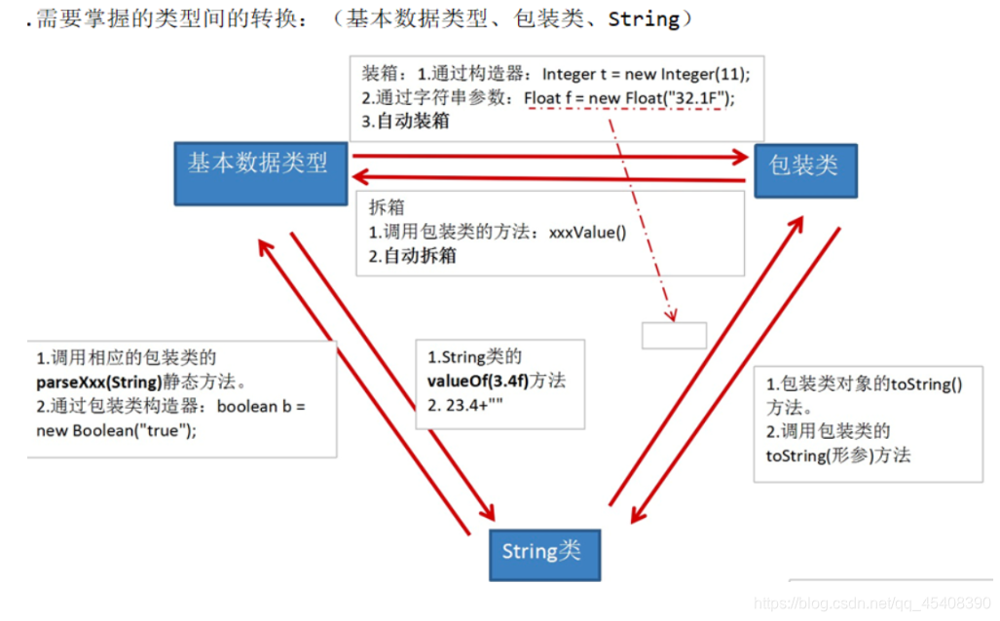
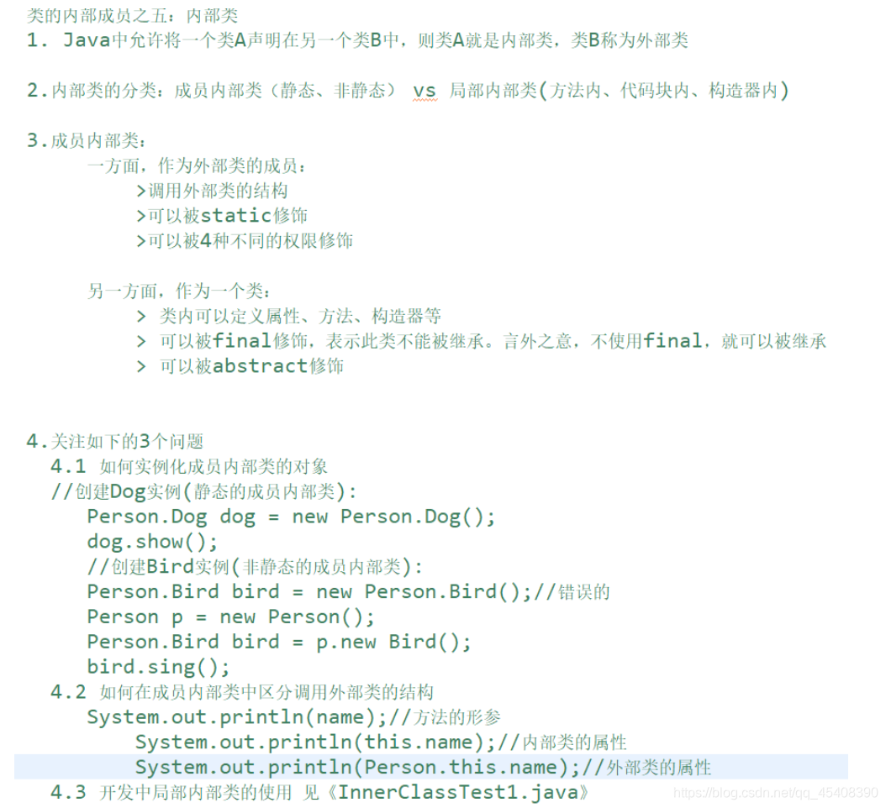
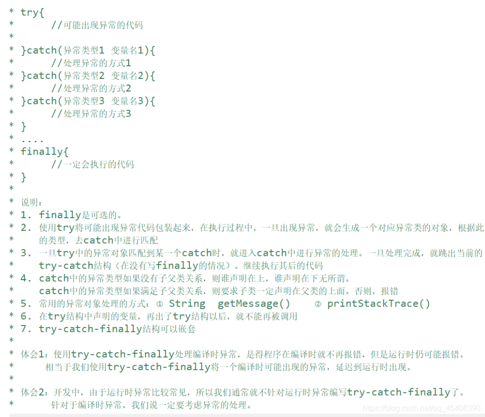

# Other

## 键盘输入

Scanner scan = new Scanner(System.in);

Datatype a = scan.nextDatatype(); 

Int a = scan.nextInt();

String s = sacn.next(

## Switch结构

   Switch结构中的表达式，只能是以下6种数据类型:

byte、short、char、int、枚举类型、String类型

## Lable(标签)

​	和break、continue一起用

## JDK、JRE、JVM的关系

# 数组

## 数组元素默认初始化

## JVM内存解析

## 一维数组的内存解析

## 二维数组的使用

## 数组中涉及到的常见算法

### 数组的复制底层实现

### 冒泡排序

~~~java
public class BubbleSortTest {
	public static void main(String[] args) {
		
		int[] arr = new int[]{43,32,76,-98,0,64,33,-21,32,99};
		
		//冒泡排序
		for(int i = 0;i < arr.length - 1;i++){
			
			for(int j = 0;j < arr.length - 1 - i;j++){
				
				if(arr[j] > arr[j + 1]){
					int temp = arr[j];
					arr[j] = arr[j + 1];
					arr[j + 1] = temp;
				}
				
			}
			
		}
		for(int i = 0;i < arr.length;i++){
			System.out.print(arr[i] + "\t");
		}
		
	}
}
~~~

### 快速排序

~~~java
/**
 * 快速排序
 * 通过一趟排序将待排序记录分割成独立的两部分，其中一部分记录的关键字均比另一部分关键字小，
 * 则分别对这两部分继续进行排序，直到整个序列有序。
 * @author ursula
 * 2021-3-25
 */
public class QuickSort {
	private static void swap(int[] data, int i, int j) {
		int temp = data[i];
		data[i] = data[j];
		data[j] = temp;
	}

	private static void subSort(int[] data, int start, int end) {
		if (start < end) {
			int base = data[start];
			int low = start;
			int high = end + 1;
			while (true) {
				while (low < end && data[++low] - base <= 0)
					;
				while (high > start && data[--high] - base >= 0)
					;
				if (low < high) {
					swap(data, low, high);
				} else {
					break;
				}
			}
			swap(data, start, high);
			
			subSort(data, start, high - 1);//递归调用
			subSort(data, high + 1, end);
		}
	}
	public static void quickSort(int[] data){
		subSort(data,0,data.length-1);
	}
	
	
	public static void main(String[] args) {
		int[] data = { 9, -16, 30, 23, -30, -49, 25, 21, 30 };
		System.out.println("排序之前：\n" + java.util.Arrays.toString(data));
		quickSort(data);
		System.out.println("排序之后：\n" + java.util.Arrays.toString(data));
	}
}
~~~

## 数组中常见的异常

ArrayIndexOutOfBoundsException:数组角标越界异常：

合理范围：[0,arr.length -1]

越界：arr[-1],arr[arr.length]

NullPointerException:空指针异常

int[] arr = null;

arr[0];

# 面向对象编程(上)

## 面向对象与面向过程

**总结:程序员从面向过程的执行者转化成了面向对象的指挥者**

## 对象的内存解析

## 局部变量与成员变量的区别:

## 对象数组的内存解析:

## 可变形参

## 方法参数的值传递:

## 封装性

## 权限修饰符

## 属性赋值的先后顺序

## UML类图

## this关键字

## 面向对象三大特征的说明

# 面向对象编程(中)

## 继承性

## 方法重写

## Super关键字

## 子类对象实例化全过程

## 多态性

## Instanceof

## Object类

### Object类的结构解析

### "=="运算符的使用 

### Equals()方法

### ToString()方法

## 包装类

### 数据类型之间的转换

# 面向对象编程(下)

## Static关键字

### static关键字修饰属性

#### 类变量vs实例变量内存解析

## static关键字修饰方法

## 单例设计模式

### 饿汉式

### 懒汉式

## 代码块:（代码块的执行先于构造器）

## 对属性赋值

## Final关键字

## abstract关键字

### 抽象类的匿名子类

### 抽象类的应用:（模块方法设计模式）

## 接口interface

### 概述

### 代理模式

代理模式是Java开发中使用较多的一种设计模式。代理设计就是为其他对象提供一种代理以控制对这个对象的访问。

#### 举例

~~~java
interface NetWork{
	
	public void browse();
	
}

//被代理类
class Server implements NetWork{

	@Override
	public void browse() {
		System.out.println("真实的服务器访问网络");
	}

}
//代理类
class ProxyServer implements NetWork{
	
	private NetWork work;
	
	public ProxyServer(NetWork work){
		this.work = work;
	}
	

	public void check(){
		System.out.println("联网之前的检查工作");
	}
	
	@Override
	public void browse() {
		check();
		
		work.browse();
		
	}
	
}
~~~

#### 应用场景

### 工厂的设计模式

1. 解决的问题
   实现了创建者与调用者的分离，即将创建对象的具体过程屏蔽隔离起来，达到提高灵活性的目的。

2. 具体模式

   简单工厂模式：用来生产同一等级结构中的任意产品。（对于增加新的产品，需要修改已有代码）
   工厂方法模式：用来生产同一等级结构中的固定产品。（支持增加任意产品)
   抽象工厂模式：用来生产不同产品族的全部产品。（对于增加新的产品，无能为力；支持增加产品族)

### Java8新特性

## 内部类

# 异常处理

## Error

## Exception体系结构

## 异常的处理

#### try-catch-finally

#### try-catch-finally中finally的使用

#### throws处理异常

## 自定义异常

