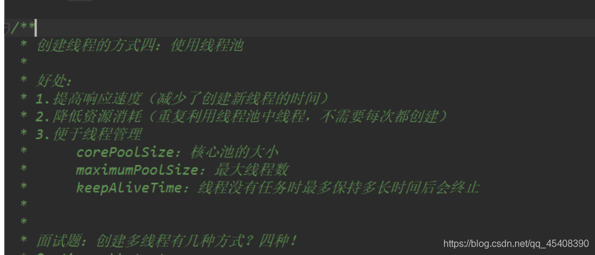
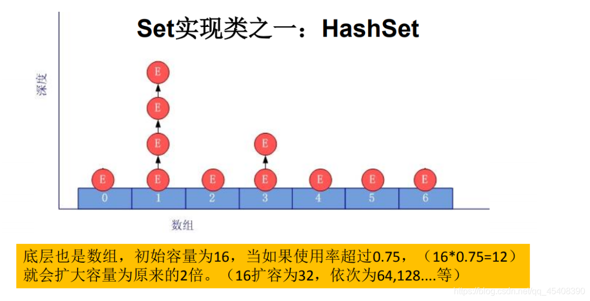
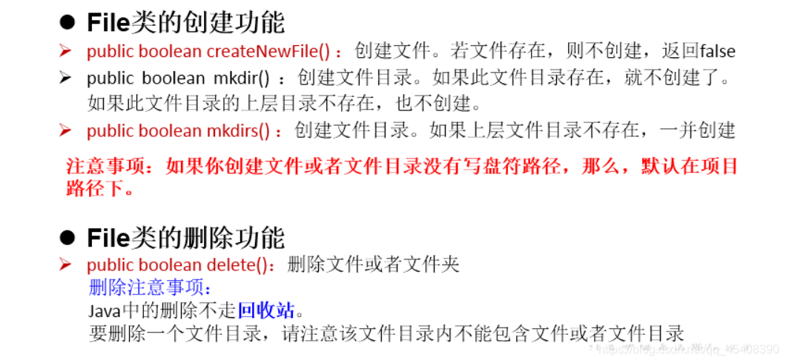
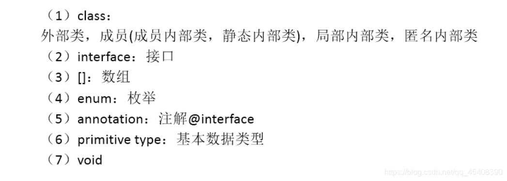
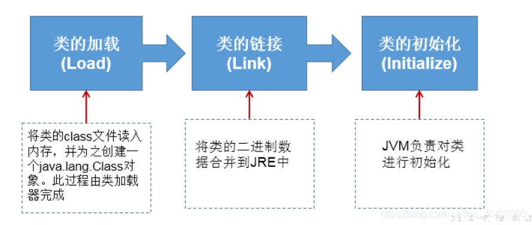

# 多线程

## 基本概念

- 程序(program)是为完成特定任务、用某种语言编写的一组指令的集合。即指一 段静态的代码，静态对象。 
- 进程(process)是程序的一次执行过程，或是正在运行的一个程序。是一个动态 的过程：有它自身的产生、存在和消亡的过程。——生命周期 
  - 如：运行中的QQ，运行中的MP3播放器 
   - 程序是静态的，进程是动态的 
   - 进程作为资源分配的单位，系统在运行时会为每个进程分配不同的内存区域 
- 线程(thread)，进程可进一步细化为线程，是一个程序内部的一条执行路径。 
  - 若一个进程同一时间并行执行多个线程，就是支持多线程的
   - 线程作为调度和执行的单位，每个线程拥有独立的运行栈和程序计数器(pc)，线程切换的开销小 
   - 一个进程中的多个线程共享相同的内存单元/内存地址空间->它们从同一堆中分配对象，可以访问相同的变量和对象。这就使得线程间通信更简便、高效。但多个线程操作共享的系统资源可能就会带来安全的隐患。 

**注:在JVM内存中一个线程一份虚拟机栈和程序计数器，而一个进程一份方法区和堆，所以一个进程下的线程要共享方法区和堆(但多个线程操作共享的系统资 源可能就会带来安全的隐患)**

**问： 以单核CPU为例，只使用单个线程先后完成多个任务（调用多个方 法），肯定比用多个线程来完成用的时间更短 ，为啥多线程时间更长?**

​		答:因为一个cpu完成一个任务时间是固定的，但是如果是多线程，那么出去完成任务的时间，还要加上线程切换的时间。

-  多线程程序的优点： 

   - 提高应用程序的响应。对图形化界面更有意义，可增强用户体验。 
   - 提高计算机系统CPU的利用率 

   - 改善程序结构。将既长又复杂的进程分为多个线程，独立运行，利于理解和 修改 

- 何时需要多线程：
  -  程序需要同时执行两个或多个任务。 
  -  程序需要实现一些需要等待的任务时，如用户输入、文件读写 操作、网络操作、搜索等。 
  -  需要一些后台运行的程序时。 

## 线程的创建与使用

### 创建

#### 方式一：继承Thread类的方式

* 1. 创建一个继承于Thread类的子类
* 2. 重写Thread类的run() --> 将此线程执行的操作声明在run()中
* 3. 创建Thread类的子类的对象
* 4. 通过此对象调用start()：①启动当前线程 ② 调用当前线程的run()

说明两个问题:

- 问题一：我们启动一个线程，必须调用start()，不能调用run()的方式启动线程

- 问题二：如果再启动一个线程，必须重新创建一个Thread子类的对象，调用此对象的start()

#### 方式二：实现Runnable接口的方式

* 1. 创建一个实现了Runnable接口的类
* 2. 实现类去实现Runnable中的抽象方法：run()
* 3. 创建实现类的对象
* 4. 将此对象作为参数传递到Thread类的构造器中，创建Thread类的对象
* 5. 通过Thread类的对象调用start()

#### 比较创建线程的两种方式

* 开发中：优先选择：实现Runnable接口的方式

  原因：

  1、实现的方式没类的单继承性的局限性

  2、实现的方式更适合来处理多个线程共享数据的情况。

​    联系：public class Thread implements Runnable

* 相同点：两种方式都需要重写run(),将线程要执行的逻辑声明在run()中。
      目前两种方式，要想启动线程，都是调用的Thread类中的start()。

### 线程常用的方法

Thread中常用方法:

* 1. start():启动当前线程；调用当前线程的run()
* 2. run(): 通常需要重写Thread类中的此方法，将创建的线程要执行的操作声明在此方法中
* 3. currentThread():静态方法，返回执行当前代码的线程
* 4. getName():获取当前线程的名字
* 5. setName():设置当前线程的名字
* 6. yield():释放当前cpu的执行权
* 7. join():在线程a中调用线程b的join(),此时线程a就进入阻塞状态，直到线程b完全执行完以后，线程a才结束阻塞状态。
* 8. stop():已过时。当执行此方法时，强制结束当前线程。
* 9. sleep(long millitime):让当前线程“睡眠”指定的millitime毫秒。在指定的millitime毫秒时间内，当前线程是阻塞状态。
* 10. isAlive():判断当前线程是否存活

### 线程的优先级

* MAX_PRIORITY：10
* MIN _PRIORITY：1
* NORM_PRIORITY：5  -->默认优先级
* 如何获取和设置当前线程的优先级：
  - getPriority():获取线程的优先级
  - setPriority(int p):设置线程的优先级
    *
* 说明：高优先级的线程要抢占低优先级线程cpu的执行权。但是只是从概率上讲，高优先级的线程高概率的情况下被执行。并不意味着只当高优先级的线程执行完以后，低优先级的线程才执行。

线程通信：wait() / notify() / notifyAll() :此三个方法定义在Object类中的。

## 线程的生命周期

 Java语言使用Thread类 及其子类的对象来表示线程，在它的一个完整的生命周期中通常要经历如下的五种状态：

- 新建： 当一个Thread类或其子类的对象被声明并创建时，新生的线程对象处于新建 状态 
- 就绪：处于新建状态的线程被start()后，将进入线程队列等待CPU时间片，此时它已 具备了运行的条件，只是没分配到CPU资源 
- 运行：当就绪的线程被调度并获得CPU资源时,便进入运行状态， run()方法定义了线 程的操作和功能 
- 阻塞：在某种特殊情况下，被人为挂起或执行输入输出操作时，让出 CPU 并临时中 止自己的执行，进入阻塞状态 
- 死亡：线程完成了它的全部工作或线程被提前强制性地中止或出现异常导致结束  

## 线程的同步(解决线程的安全问题)

### 背景

例子：创建个窗口卖票，总票数为100张.使用实现Runnable接口的方式

* 1.问题：卖票过程中，出现了重票、错票 -->出现了线程的安全问题
* 2.问题出现的原因：当某个线程操作车票的过程中，尚未操作完成时，其他线程参与进来，也操作车票。
* 3.如何解决：当一个线程a在操作ticket的时候，其他线程不能参与进来。直到线程a操作完ticket时，其他线程才可以开始操作ticket。这种情况即使线程a出现了阻塞，也不能被改变。

### Java解决方案：同步机制

#### 方式一：同步代码块

#### 方式二：同步方法

#### 方式三：Lock锁  --- JDK5.0新增

#### 同步方式的优缺点

- 同步的方式，解决了线程的安全问题。---好处
- 操作同步代码时，只能一个线程参与，其他线程等待。相当于是一个单线程的过程，效率低。 ---缺点

#### 使用同步机制将单例模式中的懒汉式改写为线程安全的

## 线程的通信

## JDK5.0新增线程创建的方式

### 新增方式一：实现Callable接口

**具体使用**

### 新增方式二：使用线程池

**具体使用**

# 常用类

## String

### 概述

String:字符串，使用一对""引起来表示。

- String声明为final的，不可被继承
- String实现了Serializable接口：表示字符串是支持序列化的。
          实现了Comparable接口：表示String可以比较大小
- String内部定义了final char[] value用于存储字符串数据
- 通过字面量的方式（区别于new给一个字符串赋值，此时的字符串值声明在字符串常量池中)。
- 字符串常量池中是不会存储相同内容(使用String类的equals()比较，返回true)的字符串的。

### String的不可变性

#### 说明

- 当对字符串重新赋值时，需要重写指定内存区域赋值，不能使用原有的value进行赋值。
- 当对现的字符串进行连接操作时，也需要重新指定内存区域赋值，不能使用原有的value进行赋值。
- 当调用String的replace()方法修改指定字符或字符串时，也需要重新指定内存区域赋值，不能使用原有的value进行赋值。

#### 代码举例

~~~java
String s1 = "abc";//字面量的定义方式
String s2 = "abc";
s1 = "hello";

System.out.println(s1 == s2);//比较s1和s2的地址值

System.out.println(s1);//hello
System.out.println(s2);//abc

System.out.println("*****************");

String s3 = "abc";
s3 += "def";
System.out.println(s3);//abcdef
System.out.println(s2);

System.out.println("*****************");

String s4 = "abc";
String s5 = s4.replace('a', 'm');
System.out.println(s4);//abc
System.out.println(s5);//mbc
~~~

#### 图示内存解析

### String对象的创建

#### 方式说明

方式一：通过字面量定义的方式
方式二：通过new + 构造器的方式

#### 代码举例

~~~java
//通过字面量定义的方式：此时的s1和s2的数据javaEE声明在方法区中的字符串常量池中。
String s1 = "javaEE";
String s2 = "javaEE";
//通过new + 构造器的方式:此时的s3和s4保存的地址值，是数据在堆空间中开辟空间以后对应的地址值。
String s3 = new String("javaEE");
String s4 = new String("javaEE");

System.out.println(s1 == s2);//true
System.out.println(s1 == s3);//false
System.out.println(s1 == s4);//false
System.out.println(s3 == s4);//false
~~~

#### 图示

#### 面试题

**String s = new String("abc");方式创建对象，在内存中创建了几个对象？**
两个:一个是堆空间中new结构，另一个是char[]对应的常量池中的数据："abc"

### 字符串拼接方式赋值的对比

#### 说明

- 常量与常量的拼接结果在常量池。且常量池中不会存在相同内容的常量。
- 只要其中一个是变量，结果就在堆中。
- 如果拼接的结果调用**intern()**方法，返回值就在常量池中

#### 代码举例

~~~java
String s1 = "javaEE";
String s2 = "hadoop";

String s3 = "javaEEhadoop";
String s4 = "javaEE" + "hadoop";
String s5 = s1 + "hadoop";
String s6 = "javaEE" + s2;
String s7 = s1 + s2;

System.out.println(s3 == s4);//true
System.out.println(s3 == s5);//false
System.out.println(s3 == s6);//false
System.out.println(s3 == s7);//false
System.out.println(s5 == s6);//false
System.out.println(s5 == s7);//false
System.out.println(s6 == s7);//false

String s8 = s6.intern();//返回值得到的s8使用的常量值中已经存在的“javaEEhadoop”
System.out.println(s3 == s8);//true
****************************
String s1 = "javaEEhadoop";
String s2 = "javaEE";
String s3 = s2 + "hadoop";
System.out.println(s1 == s3);//false

final String s4 = "javaEE";//s4:常量
String s5 = s4 + "hadoop";
System.out.println(s1 == s5);//true
~~~

### JVM中字符串常量池存放位置说明

- jdk 1.6 (jdk 6.0 ,java 6.0):字符串常量池存储在方法区（永久区）
- jdk 1.7:字符串常量池存储在堆空间
- jdk 1.8:字符串常量池存储在方法区（元空间）

### String的常用方法

~~~java
int length()：返回字符串的长度： return value.length
char charAt(int index)： 返回某索引处的字符return value[index]
boolean isEmpty()：判断是否是空字符串：return value.length == 0
String toLowerCase()：使用默认语言环境，将 String 中的所字符转换为小写
String toUpperCase()：使用默认语言环境，将 String 中的所字符转换为大写
String trim()：返回字符串的副本，忽略前导空白和尾部空白
boolean equals(Object obj)：比较字符串的内容是否相同
boolean equalsIgnoreCase(String anotherString)：与equals方法类似，忽略大小写
String concat(String str)：将指定字符串连接到此字符串的结尾。 等价于用“+”
int compareTo(String anotherString)：比较两个字符串的大小
String substring(int beginIndex)：返回一个新的字符串，它是此字符串的从beginIndex开始截取到最后的一个子字符串。
String substring(int beginIndex, int endIndex) ：返回一个新字符串，它是此字符串从beginIndex开始截取到endIndex(不包含)的一个子字符串。

boolean endsWith(String suffix)：测试此字符串是否以指定的后缀结束
boolean startsWith(String prefix)：测试此字符串是否以指定的前缀开始
boolean startsWith(String prefix, int toffset)：测试此字符串从指定索引开始的子字符串是否以指定前缀开始

boolean contains(CharSequence s)：当且仅当此字符串包含指定的 char 值序列时，返回 true
int indexOf(String str)：返回指定子字符串在此字符串中第一次出现处的索引
int indexOf(String str, int fromIndex)：返回指定子字符串在此字符串中第一次出现处的索引，从指定的索引开始
int lastIndexOf(String str)：返回指定子字符串在此字符串中最右边出现处的索引
int lastIndexOf(String str, int fromIndex)：返回指定子字符串在此字符串中最后一次出现处的索引，从指定的索引开始反向搜索

注：indexOf和lastIndexOf方法如果未找到都是返回-1

替换：
String replace(char oldChar, char newChar)：返回一个新的字符串，它是通过用 newChar 替换此字符串中出现的所 oldChar 得到的。
String replace(CharSequence target, CharSequence replacement)：使用指定的字面值替换序列替换此字符串所匹配字面值目标序列的子字符串。
String replaceAll(String regex, String replacement)：使用给定的 replacement 替换此字符串所匹配给定的正则表达式的子字符串。
String replaceFirst(String regex, String replacement)：使用给定的 replacement 替换此字符串匹配给定的正则表达式的第一个子字符串。
匹配:
boolean matches(String regex)：告知此字符串是否匹配给定的正则表达式。
切片：
String[] split(String regex)：根据给定正则表达式的匹配拆分此字符串。
String[] split(String regex, int limit)：根据匹配给定的正则表达式来拆分此字符串，最多不超过limit个，如果超过了，剩下的全部都放到最后一个元素中。

~~~

### String与其它结构的转换

#### 与基本数据类型、包装类之间的转换

String --> 基本数据类型、包装类：调用包装类的静态方法：parseXxx(str)
 基本数据类型、包装类 --> String:调用String重载的valueOf(xxx)

~~~java
@Test
    public void test1(){
        String str1 = "123";
//        int num = (int)str1;//错误的
        int num = Integer.parseInt(str1);

        String str2 = String.valueOf(num);//"123"
        String str3 = num + "";

        System.out.println(str1 == str3);
    }

~~~

#### 与字符数组之间的转换

String --> char[]:调用String的toCharArray()
char[] --> String:调用String的构造器

~~~java
@Test
public void test2(){
    String str1 = "abc123";  //题目： a21cb3

    char[] charArray = str1.toCharArray();
    for (int i = 0; i < charArray.length; i++) {
        System.out.println(charArray[i]);
    }

    char[] arr = new char[]{'h','e','l','l','o'};
    String str2 = new String(arr);
    System.out.println(str2);
}
~~~

#### 与字节数组之间的转换

编码：String --> byte[]:调用String的getBytes()
解码：byte[] --> String:调用String的构造器

编码：字符串 -->字节  (看得懂 --->看不懂的二进制数据)
解码：编码的逆过程，字节 --> 字符串 （看不懂的二进制数据 ---> 看得懂

说明：解码时，要求解码使用的字符集必须与编码时使用的字符集一致，否则会出现乱码。

~~~java
@Test
public void test3() throws UnsupportedEncodingException {
    String str1 = "abc123中国";
    byte[] bytes = str1.getBytes();//使用默认的字符集，进行编码。
    System.out.println(Arrays.toString(bytes));

    byte[] gbks = str1.getBytes("gbk");//使用gbk字符集进行编码。
    System.out.println(Arrays.toString(gbks));

    System.out.println("******************");

    String str2 = new String(bytes);//使用默认的字符集，进行解码。
    System.out.println(str2);

    String str3 = new String(gbks);
    System.out.println(str3);//出现乱码。原因：编码集和解码集不一致！

    String str4 = new String(gbks, "gbk");
    System.out.println(str4);//没出现乱码。原因：编码集和解码集一致！

}
~~~

#### 与StringBuffer、StringBuilder之间的转换

- String -->StringBuffer、StringBuilder:调用StringBuffer、StringBuilder构造器
- StringBuffer、StringBuilder -->String:①调用String构造器；②StringBuffer、StringBuilder的toString()

## StringBuffer、StringBuilder

### String、StringBuffer、StringBuilder三者的对比

* String:不可变的字符序列；底层使用char[]存储
* StringBuffer:可变的字符序列；线程安全的，效率低；底层使用char[]存储
* StringBuilder:可变的字符序列；jdk5.0新增的，线程不安全的，效率高；底层使用char[]存储

### StringBuffer与StringBuilder的内存解析

**以StringBuffer为例**

~~~java
String str = new String();//char[] value = new char[0];
String str1 = new String("abc");//char[] value = new char[]{'a','b','c'};

StringBuffer sb1 = new StringBuffer();//char[] value = new char[16];底层创建了一个长度是16的数组。
System.out.println(sb1.length());//
sb1.append('a');//value[0] = 'a';
sb1.append('b');//value[1] = 'b';

StringBuffer sb2 = new StringBuffer("abc");//char[] value = new char["abc".length() + 16];

//问题1. System.out.println(sb2.length());//3
//问题2. 扩容问题:如果要添加的数据底层数组盛不下了，那就需要扩容底层的数组。
         默认情况下，扩容为原来容量的2倍 + 2，同时将原数组中的元素复制到新的数组中。

        指导意义：开发中建议大家使用：StringBuffer(int capacity) 或 StringBuilder(int capacity)
~~~

****

**扩容问题:如果要添加的数据底层数组盛不下了，那就需要扩容底层的数组。
         默认情况下，扩容为原来容量的2倍 + 2，同时将原数组中的元素复制到新的数组中。**

### StringBuffer、StringBuilder中的常用方法

- 增：append(xxx)
- 删：delete(int start,int end)
- 改：setCharAt(int n ,char ch) / replace(int start, int end, String str)
- 查：charAt(int n )
- 插：insert(int offset, xxx)
- 长度：length();
- 遍历：for() + charAt() / toString()

~~~java
StringBuffer append(xxx)：提供了很多的append()方法，用于进行字符串拼接
StringBuffer delete(int start,int end)：删除指定位置的内容
StringBuffer replace(int start, int end, String str)：把[start,end)位置替换为str
StringBuffer insert(int offset, xxx)：在指定位置插入xxx
StringBuffer reverse() ：把当前字符序列逆转

StringBuffer append(xxx)：提供了很多的append()方法，用于进行字符串拼接
StringBuffer delete(int start,int end)：删除指定位置的内容
StringBuffer replace(int start, int end, String str)：把[start,end)位置替换为str
StringBuffer insert(int offset, xxx)：在指定位置插入xxx
StringBuffer reverse() ：把当前字符序列逆转
~~~

## JDK 8之前日期和时间的API测试

### 获取系统当前时间

~~~java
//System类中的currentTimeMillis()
long time = System.currentTimeMillis();
//返回当前时间与1970年1月1日0时0分0秒之间以毫秒为单位的时间差。
//称为时间戳
System.out.println(time);
~~~

###  java.util.Date类与java.sql.Date类

~~~java
/*
    java.util.Date类
           |---java.sql.Date类

    1.两个构造器的使用
        >构造器一：Date()：创建一个对应当前时间的Date对象
        >构造器二：创建指定毫秒数的Date对象
    2.两个方法的使用
        >toString():显示当前的年、月、日、时、分、秒
        >getTime():获取当前Date对象对应的毫秒数。（时间戳）

    3. java.sql.Date对应着数据库中的日期类型的变量
        >如何实例化
        >如何将java.util.Date对象转换为java.sql.Date对象
     */
    @Test
    public void test2(){
        //构造器一：Date()：创建一个对应当前时间的Date对象
        Date date1 = new Date();
        System.out.println(date1.toString());//Sat Feb 16 16:35:31 GMT+08:00 2019

        System.out.println(date1.getTime());//1550306204104

        //构造器二：创建指定毫秒数的Date对象
        Date date2 = new Date(155030620410L);
        System.out.println(date2.toString());

        //创建java.sql.Date对象
        java.sql.Date date3 = new java.sql.Date(35235325345L);
        System.out.println(date3);//1971-02-13

        //如何将java.util.Date对象转换为java.sql.Date对象
        //情况一：
//        Date date4 = new java.sql.Date(2343243242323L);
//        java.sql.Date date5 = (java.sql.Date) date4;
        //情况二：
        Date date6 = new Date();
        java.sql.Date date7 = new java.sql.Date(date6.getTime());

    }

~~~

### java.text.SimpleDataFormat类

~~~java
  /*
    SimpleDateFormat的使用：SimpleDateFormat对日期Date类的格式化和解析

    1.两个操作：
    1.1 格式化：日期 --->字符串
    1.2 解析：格式化的逆过程，字符串 ---> 日期

    2.SimpleDateFormat的实例化

     */
    @Test
    public void testSimpleDateFormat() throws ParseException {
        //实例化SimpleDateFormat:使用默认的构造器
        SimpleDateFormat sdf = new SimpleDateFormat();

        //格式化：日期 --->字符串
        Date date = new Date();
        System.out.println(date);

        String format = sdf.format(date);
        System.out.println(format);

        //解析：格式化的逆过程，字符串 ---> 日期
        String str = "19-12-18 上午11:43";
        Date date1 = sdf.parse(str);
        System.out.println(date1);

        //*************按照指定的方式格式化和解析：调用带参的构造器*****************
//        SimpleDateFormat sdf1 = new SimpleDateFormat("yyyyy.MMMMM.dd GGG hh:mm aaa");
        SimpleDateFormat sdf1 = new SimpleDateFormat("yyyy-MM-dd hh:mm:ss");
        //格式化
        String format1 = sdf1.format(date);
        System.out.println(format1);//2019-02-18 11:48:27
        //解析:要求字符串必须是符合SimpleDateFormat识别的格式(通过构造器参数体现),
        //否则，抛异常
        Date date2 = sdf1.parse("2020-02-18 11:48:27");
        System.out.println(date2);
    }
~~~

### Calendar类：日历类、抽象类

~~~java
	//1.实例化
        //方式一：创建其子类（GregorianCalendar的对象
        //方式二：调用其静态方法getInstance()
        Calendar calendar = Calendar.getInstance();
//        System.out.println(calendar.getClass());

        //2.常用方法
        //get()
        int days = calendar.get(Calendar.DAY_OF_MONTH);
        System.out.println(days);
        System.out.println(calendar.get(Calendar.DAY_OF_YEAR));

        //set()
        //calendar可变性
         calendar.set(Calendar.DAY_OF_MONTH,22);
        days = calendar.get(Calendar.DAY_OF_MONTH);
        System.out.println(days);

        //add()
        calendar.add(Calendar.DAY_OF_MONTH,-3);
        days = calendar.get(Calendar.DAY_OF_MONTH);
        System.out.println(days);

        //getTime():日历类---> Date
        Date date = calendar.getTime();
        System.out.println(date);

        //setTime():Date ---> 日历类
        Date date1 = new Date();
        calendar.setTime(date1);
        days = calendar.get(Calendar.DAY_OF_MONTH);
        System.out.println(days);

~~~

## JDK8中新日期时间API

### 期时间API的迭代

- 第一代：jdk 1.0 Date类
- 第二代：jdk 1.1 Calendar类，一定程度上替换Date类
- 第三代：jdk 1.8 提出了新的一套API

### 前两代存在的问题举例

- 可变性：像日期和时间这样的类应该是不可变的。
- 偏移性：Date中的年份是从1900开始的，而月份都从0开始。
- 格式化：格式化只对Date用，Calendar则不行。
- 此外，它们也不是线程安全的；不能处理闰秒等。

## java 8 中新的日期时间API涉及到的包

### 本地日期、本地时间、本地日期时间的使用：LocalDate / LocalTime / LocalDateTime

① 分别表示使用 ISO-8601日历系统的日期、时间、日期和时间。它们提供了简单的本地日期或时间，并不包含当前的时间信息，也不包含与时区相关的信息。
② LocalDateTime相较于LocalDate、LocalTime，使用频率要高
③ 类似于Calendar

#### 常用方法

#### 代码展示

~~~java
 @Test
    public void test1(){
        //now():获取当前的日期、时间、日期+时间
        LocalDate localDate = LocalDate.now();
        LocalTime localTime = LocalTime.now();
        LocalDateTime localDateTime = LocalDateTime.now();

        System.out.println(localDate);
        System.out.println(localTime);
        System.out.println(localDateTime);

        //of():设置指定的年、月、日、时、分、秒。没有偏移量
        LocalDateTime localDateTime1 = LocalDateTime.of(2020, 10, 6, 13, 23, 43);
        System.out.println(localDateTime1);

        //getXxx()：获取相关的属性
        System.out.println(localDateTime.getDayOfMonth());
        System.out.println(localDateTime.getDayOfWeek());
        System.out.println(localDateTime.getMonth());
        System.out.println(localDateTime.getMonthValue());
        System.out.println(localDateTime.getMinute());

        //体现不可变性
        //withXxx():设置相关的属性
        LocalDate localDate1 = localDate.withDayOfMonth(22);
        System.out.println(localDate);
        System.out.println(localDate1);

        LocalDateTime localDateTime2 = localDateTime.withHour(4);
        System.out.println(localDateTime);
        System.out.println(localDateTime2);

        //不可变性
        LocalDateTime localDateTime3 = localDateTime.plusMonths(3);
        System.out.println(localDateTime);
        System.out.println(localDateTime3);

        LocalDateTime localDateTime4 = localDateTime.minusDays(6);
        System.out.println(localDateTime);
        System.out.println(localDateTime4);
    }

~~~

### 时间点：Instant

#### 说明

① 时间线上的一个瞬时点。 概念上讲，它只是简单的表示自1970年1月1日0时0分0秒（UTC开始的秒数。）
② 类似于 java.util.Date类

#### 常用方法

### 日期时间格式化类：DateTimeFormatter

#### 说明

① 格式化或解析日期、时间
② 类似于SimpleDateFormat

#### 常用方法

① 实例化方式：
预定义的标准格式。如：ISO_LOCAL_DATE_TIME;ISO_LOCAL_DATE;ISO_LOCAL_TIME
本地化相关的格式。如：ofLocalizedDateTime(FormatStyle.LONG)自定义的格式。如：ofPattern(“yyyy-MM-dd hh:mm:ss”)

## Java比较器

### Java比较器的使用背景

Java中的对象，正常情况下，只能进行比较：==  或  != 。不能使用 > 或 < 的
但是在开发场景中，我们需要对多个对象进行排序，言外之意，就需要比较对象的大小。
如何实现？使用两个接口中的任何一个：Comparable 或 Comparator

### 自然排序：使用Comparable接口

#### 说明

- 像String、包装类等实现了Comparable接口，重写了compareTo(obj)方法，给出了比较两个对象大小的方式。
- 像String、包装类重写compareTo()方法以后，进行了从小到大的排列
- 重写compareTo(obj)的规则：
  - 如果当前对象this大于形参对象obj，则返回正整数，
  - 如果当前对象this小于形参对象obj，则返回负整数，
  - 如果当前对象this等于形参对象obj，则返回零。
- 对于自定义类来说，如果需要排序，我们可以让自定义类实现Comparable接口，重写compareTo(obj)方法。在compareTo(obj)方法中指明如何排序

#### 自定义类代码举例

~~~java
public class Goods implements  Comparable{

    private String name;
    private double price;

    //指明商品比较大小的方式:照价格从低到高排序,再照产品名称从高到低排序
    @Override
    public int compareTo(Object o) {
//        System.out.println("**************");
        if(o instanceof Goods){
            Goods goods = (Goods)o;
            //方式一：
            if(this.price > goods.price){
                return 1;
            }else if(this.price < goods.price){
                return -1;
            }else{
//                return 0;
               return -this.name.compareTo(goods.name);
            }
            //方式二：
//           return Double.compare(this.price,goods.price);
        }
//        return 0;
        throw new RuntimeException("传入的数据类型不一致！");
    }
// getter、setter、toString()、构造器：省略
}

~~~

### 定制排序：使用Comparator接口

#### 说明

- 背景：
  当元素的类型没实现java.lang.Comparable接口而又不方便修改代码，或者实现了java.lang.Comparable接口的排序规则不适合当前的操作，那么可以考虑使用 Comparator 的对象来排序
- 重写compare(Object o1,Object o2)方法，比较o1和o2的大小：
  - 如果方法返回正整数，则表示o1大于o2；
  - 如果返回0，表示相等；
  - 返回负整数，表示o1小于o2

#### 代码举例：

~~~java
Comparator com = new Comparator() {
    //指明商品比较大小的方式:照产品名称从低到高排序,再照价格从高到低排序
    @Override
    public int compare(Object o1, Object o2) {
        if(o1 instanceof Goods && o2 instanceof Goods){
            Goods g1 = (Goods)o1;
            Goods g2 = (Goods)o2;
            if(g1.getName().equals(g2.getName())){
                return -Double.compare(g1.getPrice(),g2.getPrice());
            }else{
                return g1.getName().compareTo(g2.getName());
            }
        }
        throw new RuntimeException("输入的数据类型不一致");
    }
}

使用：
Arrays.sort(goods,com);
Collections.sort(coll,com);
new TreeSet(com);
~~~

### 两种排序方式对比

*    Comparable接口的方式一旦一定，保证Comparable接口实现类的对象在任何位置都可以比较大小。
*    Comparator接口属于临时性的比较。

## 其他类

### System类

- System类代表系统，系统级的很多属性和控制方法都放置在该类的内部。该类位于java.lang包。
- 由于该类的构造器是private的，所以无法创建该类的对象，也就是无法实例化该类。其内部的成员变量和成
- 员方法都是static的，所以也可以很方便的进行调用。
  方法：
  - native long currentTimeMillis()
  - void exit(int status)
  - void gc()
  - String getProperty(String key)

### Math类

java.lang.Math提供了一系列静态方法用于科学计算。其方法的参数和返回值类型一般为double型

### BigInteger类、BigDecimal类

#### 说明

① java.math包的BigInteger可以表示不可变的任意精度的整数。
② 要求数字精度比较高，用到java.math.BigDecimal类

#### 代码举例

~~~java
@Test
    public void test2() {
        BigInteger bi = new BigInteger("1243324112234324324325235245346567657653");
        BigDecimal bd = new BigDecimal("12435.351");
        BigDecimal bd2 = new BigDecimal("11");
        System.out.println(bi);
//         System.out.println(bd.divide(bd2));
        System.out.println(bd.divide(bd2, BigDecimal.ROUND_HALF_UP));
        System.out.println(bd.divide(bd2, 25, BigDecimal.ROUND_HALF_UP));

    }
~~~

a

# 枚举类和注解

## 枚举类

### 枚举类的使用

* 1.枚举类的理解：类的对象只有有限个，确定的。我们称此类为枚举类
*  2.当需要定义一组常量时，强烈建议使用枚举类
* 3.如果枚举类中只有一个对象，则可以作为单例模式的实现方式。

### 如何定义枚举类

方式一：jdk5.0之前，自定义枚举类

代码举例:

~~~java
//自定义枚举类
class Season{
    //1.声明Season对象的属性:private final修饰
    private final String seasonName;
    private final String seasonDesc;

    //2.私有化类的构造器,并给对象属性赋值
    private Season(String seasonName,String seasonDesc){
        this.seasonName = seasonName;
        this.seasonDesc = seasonDesc;
    }

    //3.提供当前枚举类的多个对象：public static final的
    public static final Season SPRING = new Season("春天","春暖花开");
    public static final Season SUMMER = new Season("夏天","夏日炎炎");
    public static final Season AUTUMN = new Season("秋天","秋高气爽");
    public static final Season WINTER = new Season("冬天","冰天雪地");

    //4.其他诉求1：获取枚举类对象的属性
    public String getSeasonName() {
        return seasonName;
    }

    public String getSeasonDesc() {
        return seasonDesc;
    }
    //4.其他诉求1：提供toString()
    @Override
    public String toString() {
        return "Season{" +
                "seasonName='" + seasonName + '\'' +
                ", seasonDesc='" + seasonDesc + '\'' +
                '}';
    }
}
~~~

 方式二：jdk5.0，可以使用enum关键字定义枚举类

~~~java
interface Info{
    void show();
}

//使用enum关键字枚举类
enum Season1 implements Info{
    //1.提供当前枚举类的对象，多个对象之间用","隔开，末尾对象";"结束
    SPRING("春天","春暖花开"){
        @Override
        public void show() {
            System.out.println("春天在哪里？");
        }
    },
    SUMMER("夏天","夏日炎炎"){
        @Override
        public void show() {
            System.out.println("宁夏");
        }
    },
    AUTUMN("秋天","秋高气爽"){
        @Override
        public void show() {
            System.out.println("秋天不回来");
        }
    },
    WINTER("冬天","冰天雪地"){
        @Override
        public void show() {
            System.out.println("大约在冬季");
        }
    };

    //2.声明Season对象的属性:private final修饰
    private final String seasonName;
    private final String seasonDesc;

    //2.私有化类的构造器,并给对象属性赋值

    private Season1(String seasonName,String seasonDesc){
        this.seasonName = seasonName;
        this.seasonDesc = seasonDesc;
    }

    //4.其他诉求1：获取枚举类对象的属性
    public String getSeasonName() {
        return seasonName;
    }

    public String getSeasonDesc() {
        return seasonDesc;
    }
//    //4.其他诉求1：提供toString()
//
//    @Override
//    public String toString() {
//        return "Season1{" +
//                "seasonName='" + seasonName + '\'' +
//                ", seasonDesc='" + seasonDesc + '\'' +
//                '}';
//    }

//    @Override
//    public void show() {
//        System.out.println("这是一个季节");
//    }
}
~~~

### Enum类中的常用方法

* values()方法：返回枚举类型的对象数组。该方法可以很方便地遍历所有的枚举值。
*  valueOf(String str)：可以把一个字符串转为对应的枚举类对象。要求字符串必须是枚举类对象的“名字”。如不是，会有运行时异常：IllegalArgumentException。
*  toString()：返回当前枚举类对象常量的名称

代码如下:

~~~java
public class TestStates {
    public static void main(String[] args) {
        States vaction = States.VACTION;
        System.out.println(vaction.toString());
        States[] values = States.values();
        for (States s:values){
            System.out.println(s);
        }
        States busy = States.valueOf("BUSY");
        System.out.println(busy);
    }
}

~~~

### 使用enum关键字定义的枚举类实现接口的情况

* 情况一：实现接口，在enum类中实现抽象方法
* 情况二：让枚举类的对象分别实现接口中的抽象方法

## 注解

### 理解Annotation

* ① jdk 5.0 新增的功能
* ② Annotation 其实就是代码里的特殊标记, 这些标记可以在编译, 类加载, 运行时被读取, 并执行相应的处理。通过使用 Annotation, 程序员可以在不改变原有逻辑的情况下, 在源文件中嵌入一些补充信息。
* ③在JavaSE中，注解的使用目的比较简单，例如标记过时的功能，忽略警告等。在JavaEE/Android* 中注解占据了更重要的角色，例如用来配置应用程序的任何切面，代替JavaEE旧版中所遗留的繁冗* 代码和XML配置等。

###  Annocation的使用示例

* 示例一：生成文档相关的注解
* 示例二：在编译时进行格式检查(JDK内置的三个基本注解)  
  *   @Override: 限定重写父类方法, 该注解只能用于方法    
  * @Deprecated: 用于表示所修饰的元素(类, 方法等)已过时。通常是因为所修饰的结构危险或存在更好的选择  
  *   @SuppressWarnings: 抑制编译器警告
* 示例三：跟踪代码依赖性，实现替代配置文件功能

### 如何自定义注解：参照@SuppressWarnings定义

* ① 注解声明为：@interface
* ② 内部定义成员，通常使用value表示
*  ③ 可以指定成员的默认值，使用default定义
*  ④ 如果自定义注解没有成员，表明是一个标识作用。

**注：如果注解有成员，在使用注解时，需要指明成员的值。**

**自定义注解必须配上注解的信息处理流程(使用反射)才有意义。**

**自定义注解通过都会指明两个元注解：Retention、Target**

~~~java
@Retention(RetentionPolicy.RUNTIME)
@Target({TYPE, FIELD, METHOD, PARAMETER, CONSTRUCTOR, LOCAL_VARIABLE,TYPE_PARAMETER,TYPE_USE})
public @interface MyAnnotation {

    String value() default "hello";
}
~~~

###  jdk 提供的4种元注解

**元注解：对现有的注解进行解释说明的注解**

- Retention：指定所修饰的 Annotation 的生命周期：SOURCE\CLASS（默认行为）\RUNTIME       只有声明为RUNTIME生命周期的注解，才能通过反射获取。

- Target:用于指定被修饰的 Annotation 能用于修饰哪些程序元素

  **出现的频率较低**

- Documented:表示所修饰的注解在被javadoc解析时，保留下来。

- Inherited:被它修饰的 Annotation 将具有继承性。

### jdk 8 中注解的新特性：可重复注解、类型注解

#### 可重复注解：

① 在MyAnnotation上声明@Repeatable，成员值为MyAnnotations.class               ② MyAnnotation的Target和Retention等元注解与MyAnnotations相同。

~~~java
//jdk 8之前的写法：
//@MyAnnotations({@MyAnnotation(value="hi"),@MyAnnotation(value="hi")})
@MyAnnotation(value="hi")
@MyAnnotation(value="abc")
~~~

①

②

#### 类型注解：

ElementType.TYPE_PARAMETER 表示该注解能写在类型变量的声明语句中（如：泛型声明）。

ElementType.TYPE_USE 表示该注解能写在使用类型的任何语句中。

~~~java
class Generic<@MyAnnotation T>{

    public void show() throws @MyAnnotation RuntimeException{

        ArrayList<@MyAnnotation String> list = new ArrayList<>();

        int num = (@MyAnnotation int) 10L;
    }

}
~~~

# 集合

## 集合与数组存储数据概述

集合、数组都是对多个数据进行存储操作的结构，简称Java容器。
说明：此时的存储，主要指的是内存层面的存储，不涉及到持久化的存储（.txt,.jpg,.avi，数据库中)

## 数组存储的特点

- 一旦初始化以后，其长度就确定了。

- 数组一旦定义好，其元素的类型也就确定了。我们也就只能操作指定类型的数据了。

  ​	比如：String[] arr;int[] arr1;Object[] arr2;

## 数组存储的弊端

*      一旦初始化以后，其长度就不可修改。
*      数组中提供的方法非常限，对于添加、删除、插入数据等操作，非常不便，同时效率不高。
*      获取数组中实际元素的个数的需求，数组没有现成的属性或方法可用
*      数组存储数据的特点：有序、可重复。对于无序、不可重复的需求，不能满足。

## Collection接口

### 单列集合框架结构

~~~java
|----Collection接口：单列集合，用来存储一个一个的对象
*          |----List接口：存储序的、可重复的数据。  -->“动态”数组
*              |----ArrayList、LinkedList、Vector
*
*          |----Set接口：存储无序的、不可重复的数据   -->高中讲的“集合”
*              |----HashSet、LinkedHashSet、TreeSet
~~~

**对应图示**

### Collection接口常用方法

- add(Object e):将元素e添加到集合coll中
- size():获取添加的元素的个数
- addAll(Collection coll1):将coll1集合中的元素添加到当前的集合中
- clear():清空集合元素
- isEmpty():判断当前集合是否为空

~~~java
@Test
    public void test1(){
        Collection coll = new ArrayList();

        //add(Object e):将元素e添加到集合coll中
        coll.add("AA");
        coll.add("BB");
        coll.add(123);//自动装箱
        coll.add(new Date());

        //size():获取添加的元素的个数
        System.out.println(coll.size());//4

        //addAll(Collection coll1):将coll1集合中的元素添加到当前的集合中
        Collection coll1 = new ArrayList();
        coll1.add(456);
        coll1.add("CC");
        coll.addAll(coll1);

        System.out.println(coll.size());//6
        System.out.println(coll);

        //clear():清空集合元素
        coll.clear();

        //isEmpty():判断当前集合是否为空
        System.out.println(coll.isEmpty());

    }
~~~

- contains(Object obj):判断当前集合中是否包含obj

- containsAll(Collection coll1):判断形参coll1中的所有元素是否都存在于当前集合中。

  我们在判断时会调用obj对象所在类的equals()

~~~java
@Test
    public void test1(){
        Collection coll = new ArrayList();
        coll.add(123);
        coll.add(456);
//        Person p = new Person("Jerry",20);
//        coll.add(p);
        coll.add(new Person("Jerry",20));
        coll.add(new String("Tom"));
        coll.add(false);
        //1.contains(Object obj):判断当前集合中是否包含obj
        //我们在判断时会调用obj对象所在类的equals()。
        boolean contains = coll.contains(123);
        System.out.println(contains);
        System.out.println(coll.contains(new String("Tom")));
//        System.out.println(coll.contains(p));//true
        System.out.println(coll.contains(new Person("Jerry",20)));//false -->true

        //2.containsAll(Collection coll1):判断形参coll1中的所有元素是否都存在于当前集合中。
        Collection coll1 = Arrays.asList(123,4567);
        System.out.println(coll.containsAll(coll1));
    }
~~~

- remove(Object obj):从当前集合中移除obj元素。
- removeAll(Collection coll1):差集：从当前集合中移除coll1中所有的元素

~~~java
@Test
    public void test2(){
        //3.remove(Object obj):从当前集合中移除obj元素。
        Collection coll = new ArrayList();
        coll.add(123);
        coll.add(456);
        coll.add(new Person("Jerry",20));
        coll.add(new String("Tom"));
        coll.add(false);

        coll.remove(1234);
        System.out.println(coll);

        coll.remove(new Person("Jerry",20));
        System.out.println(coll);

        //4. removeAll(Collection coll1):差集：从当前集合中移除coll1中所有的元素。
        Collection coll1 = Arrays.asList(123,456);
        coll.removeAll(coll1);
        System.out.println(coll);
    }
~~~

- retainAll(Collection coll1):交集：获取当前集合和coll1集合的交集，并返回给当前集合
- equals(Object obj):要想返回true，需要当前集合和形参集合的元素都相同（list要顺序也一样）。

~~~java
@Test
    public void test3(){
        Collection coll = new ArrayList();
        coll.add(123);
        coll.add(456);
        coll.add(new Person("Jerry",20));
        coll.add(new String("Tom"));
        coll.add(false);

        //5.retainAll(Collection coll1):交集：获取当前集合和coll1集合的交集，并返回给当前集合
//        Collection coll1 = Arrays.asList(123,456,789);
//        coll.retainAll(coll1);
//        System.out.println(coll);

        //6.equals(Object obj):要想返回true，需要当前集合和形参集合的元素都相同。
        Collection coll1 = new ArrayList();
        coll1.add(456);
        coll1.add(123);
        coll1.add(new Person("Jerry",20));
        coll1.add(new String("Tom"));
        coll1.add(false);

        System.out.println(coll.equals(coll1));

    }
~~~

- hashCode():返回当前对象的哈希值
- 集合 --->数组：toArray()
- 数组 --->集合:调用Arrays类的静态方法asList()

~~~java
@Test
    public void test4(){
        Collection coll = new ArrayList();
        coll.add(123);
        coll.add(456);
        coll.add(new Person("Jerry",20));
        coll.add(new String("Tom"));
        coll.add(false);

        //7.hashCode():返回当前对象的哈希值
        System.out.println(coll.hashCode());

        //8.集合 --->数组：toArray()
        Object[] arr = coll.toArray();
        for(int i = 0;i < arr.length;i++){
            System.out.println(arr[i]);
        }

        //拓展：数组 --->集合:调用Arrays类的静态方法asList()
        List<String> list = Arrays.asList(new String[]{"AA", "BB", "CC"});
        System.out.println(list);

        List arr1 = Arrays.asList(new int[]{123, 456});
        System.out.println(arr1.size());//1

        List arr2 = Arrays.asList(new Integer[]{123, 456});
        System.out.println(arr2.size());//2

        //9.iterator():返回Iterator接口的实例，用于遍历集合元素。放在IteratorTest.java中测试

    }
~~~

## Iterator接口与foreach循环 

### 遍历的代码实现

~~~java
Iterator iterator = coll.iterator();
//hasNext():判断是否还下一个元素
while(iterator.hasNext()){
    //next():①指针下移 ②将下移以后集合位置上的元素返回
    System.out.println(iterator.next());
}
~~~

图例:

### iterator的错误使用

~~~java
//错误方式一：
//        Iterator iterator = coll.iterator();
//        while((iterator.next()) != null){
//            System.out.println(iterator.next());
//        }

        //错误方式二：
        //集合对象每次调用iterator()方法都得到一个全新的迭代器对象，默认游标都在集合的第一个元素之前。
        while (coll.iterator().hasNext()){
            System.out.println(coll.iterator().next());
        }
~~~

### remove()的使用

~~~java
//测试Iterator中的remove()
//如果还未调用next()或在上一次调用 next 方法之后已经调用了 remove 方法，再调用remove都会报IllegalStateException。
//内部定义了remove(),可以在遍历的时候，删除集合中的元素。此方法不同于集合直接调用remove()
    @Test
    public void test3(){
        Collection coll = new ArrayList();
        coll.add(123);
        coll.add(456);
        coll.add(new Person("Jerry",20));
        coll.add(new String("Tom"));
        coll.add(false);

        //删除集合中"Tom"
        Iterator iterator = coll.iterator();
        while (iterator.hasNext()){
//            iterator.remove();
            Object obj = iterator.next();
            if("Tom".equals(obj)){
                iterator.remove();
//                iterator.remove();
            }

        }
        //遍历集合
        iterator = coll.iterator();
        while (iterator.hasNext()){
            System.out.println(iterator.next());
        }
    }
~~~

### 增强for循环：(foreach循环)

~~~java
@Test
public void test1(){
    Collection coll = new ArrayList();
    coll.add(123);
    coll.add(456);
    coll.add(new Person("Jerry",20));
    coll.add(new String("Tom"));
    coll.add(false);

    //for(集合元素的类型 局部变量 : 集合对象)
    
    for(Object obj : coll){
        System.out.println(obj);
    }
}
//说明：
//内部仍然调用了迭代器。
~~~

### 注意点

~~~java
 //练习题
    @Test
    public void test3(){

        String[] arr = new String[]{"MM","MM","MM"};

//        //方式一：普通for赋值 输出结果 ‘GG'
//        for(int i = 0;i < arr.length;i++){
//            arr[i] = "GG";
//        }

        //方式二：增强for循环 输出结果 ‘MM'
        for(String s : arr){ //这里是把arr的值赋值给s，改变的是s，arr没变
            s = "GG";
        }

        for(int i = 0;i < arr.length;i++){
            System.out.println(arr[i]);
        }

    }
~~~

## Collection子接口：List接口

### 存储的数据特点

**存储序的、可重复的数据**

### 常用方法

- 增：add(Object obj)
- 删：remove(int index) / remove(Object obj)
- 改：set(int index, Object ele)
- 查：get(int index)
- 插：add(int index, Object ele)
- 长度：size()
- 遍历：
  - ① Iterator迭代器方式
  - ② 增强for循环

  - ​    ③ 普通的循环

- int indexOf(Object obj):返回obj在集合中首次出现的位置。如果不存在，返回-1.
- int lastIndexOf(Object obj):返回obj在当前集合中末次出现的位置。如果不存在，返回-1.
- Object remove(int index):移除指定index位置的元素，并返回此元素
- Object set(int index, Object ele):设置指定index位置的元素为ele
- List subList(int fromIndex, int toIndex):返回从fromIndex到toIndex位置的左闭右开区间的子集合

~~~java
@Test
    public void test2(){
        ArrayList list = new ArrayList();
        list.add(123);
        list.add(456);
        list.add("AA");
        list.add(new Person("Tom",12));
        list.add(456);
        //int indexOf(Object obj):返回obj在集合中首次出现的位置。如果不存在，返回-1.
        int index = list.indexOf(4567);
        System.out.println(index);

        //int lastIndexOf(Object obj):返回obj在当前集合中末次出现的位置。如果不存在，返回-1.
        System.out.println(list.lastIndexOf(456));

        //Object remove(int index):移除指定index位置的元素，并返回此元素
        Object obj = list.remove(0);
        System.out.println(obj);
        System.out.println(list);

        //Object set(int index, Object ele):设置指定index位置的元素为ele
        list.set(1,"CC");
        System.out.println(list);

        //List subList(int fromIndex, int toIndex):返回从fromIndex到toIndex位置的左闭右开区间的子集合
        List subList = list.subList(2, 4);
        System.out.println(subList);
        System.out.println(list);
    }

~~~

- void add(int index, Object ele):在index位置插入ele元素
- boolean addAll(int index, Collection eles):从index位置开始将eles中的所有元素添加进来
- Object get(int index):获取指定index位置的元素

~~~java
@Test
    public void test1(){
        ArrayList list = new ArrayList();
        list.add(123);
        list.add(456);
        list.add("AA");
        list.add(new Person("Tom",12));
        list.add(456);

        System.out.println(list);

        //void add(int index, Object ele):在index位置插入ele元素
        list.add(1,"BB");
        System.out.println(list);

        //boolean addAll(int index, Collection eles):从index位置开始将eles中的所有元素添加进来
        List list1 = Arrays.asList(1, 2, 3);
        list.addAll(list1);
//        list.add(list1);
        System.out.println(list.size());//9

        //Object get(int index):获取指定index位置的元素
        System.out.println(list.get(0));

    }
~~~

### 常用实现类

~~~Java
|----Collection接口：单列集合，用来存储一个一个的对象
*  |----List接口：存储序的、可重复的数据。  -->“动态”数组,替换原的数组
*      |----ArrayList：作为List接口的主要实现类；线程不安全的，效率高；底层使用Object[] elementData存储
*      |----LinkedList：对于频繁的插入、删除操作，使用此类效率比ArrayList高；底层使用双向链表存储
*      |----Vector：作为List接口的古老实现类；线程安全的，效率低；底层使用Object[] elementData存储
~~~

### 源码分析

#### ArrayList的源码分析

##### jdk 7情况下

~~~java
 *      ArrayList list = new ArrayList();//底层创建了长度是10的Object[]数组elementData
 *      list.add(123);//elementData[0] = new Integer(123);
 *      ...
 *      list.add(11);//如果此次的添加导致底层elementData数组容量不够，则扩容。
 *      默认情况下，扩容为原来的容量的1.5倍，同时需要将原有数组中的数据复制到新的数组中。
 *
 *      结论：建议开发中使用带参的构造器：ArrayList list = new ArrayList(int capacity)
~~~

##### jdk 8中ArrayList的变化

~~~java
*  ArrayList list = new ArrayList();//底层Object[] elementData初始化为{}.并没创建长度为10的数组
*
*  list.add(123);//第一次调用add()时，底层才创建了长度10的数组，并将数据123添加到elementData[0]
*      ...
*      后续的添加和扩容操作与jdk 7 无异。
~~~

##### 小结

jdk7中的ArrayList的对象的创建类似于单例的饿汉式，而jdk8中的ArrayList的对象的创建类似于单例的懒汉式，延迟了数组的创建，节省内存。

####  LinkedList的源码分析

~~~Java
*      LinkedList list = new LinkedList(); 内部声明了Node类型的first和last属性，默认值为null
*      list.add(123);//将123封装到Node中，创建了Node对象。
*
*      其中，Node定义为：体现了LinkedList的双向链表的说法
*      private static class Node<E> {
            E item;
            Node<E> next;
            Node<E> prev;

            Node(Node<E> prev, E element, Node<E> next) {
            this.item = element;
            this.next = next;
            this.prev = prev;
            }
        }
~~~

#### Vector的源码分析

​		jdk7和jdk8中通过Vector()构造器创建对象时，底层都创建了长度为10的数组。在扩容方面，默认扩容为原来的数组长度的2倍

### 存储的元素的要求

添加的对象，所在的类要重写equals()方法

### 面试题

~~~Java
*  面试题：ArrayList、LinkedList、Vector者的异同？
*  同：三个类都是实现了List接口，存储数据的特点相同：存储序的、可重复的数据
*  不同：见上源码分析
~~~

## Collection子接口：Set接口

### 存储的数据特点

无序的、不可重复的元素

- 无序性：不等于随机性。存储的数据在底层数组中并非按照数组索引的顺序添加，而是根据数据的哈希值决定的。
- 不可重复性：保证添加的元素按照equals()判断时，不能返回true.即：相同的元素只能添加一个。

### 元素添加过程：(以HashSet为例)

我们向HashSet中添加元素a,首先调用元素a所在类的hashCode()方法，计算元素a的哈希值，
此哈希值接着通过某种算法计算出在HashSet底层数组中的存放位置（即为：索引位置，判断
数组此位置上是否已经元素：
    如果此位置上没其他元素，则元素a添加成功。 --->情况1
    如果此位置上其他元素b(或以链表形式存在的多个元素，则比较元素a与元素b的hash值：
        如果hash值不相同，则元素a添加成功。--->情况2
        如果hash值相同，进而需要调用元素a所在类的equals()方法：
               equals()返回true,元素a添加失败
               equals()返回false,则元素a添加成功。--->情况3

对于添加成功的情况2和情况3而言：元素a 与已经存在指定索引位置上数据以链表的方式存储。
jdk 7 :元素a放到数组中，指向原来的元素。
jdk 8 :原来的元素在数组中，指向元素a
总结：七上八下

HashSet底层：数组+链表的结构。（前提：jdk7)

图示:

### 常用实现类

~~~java
 * 1. Set接口的框架：
 *
 * |----Collection接口：单列集合，用来存储一个一个的对象
 *          |----Set接口：存储无序的、不可重复的数据   -->高中讲的“集合”
 *              |----HashSet：作为Set接口的主要实现类；线程不安全的；可以存储null值
 *                  |----LinkedHashSet：作为HashSet的子类；遍历其内部数据时，可以按照添加的顺序遍历
 *                                      对于频繁的遍历操作，LinkedHashSet效率高于HashSet.
 *              |----TreeSet：可以按照添加对象的指定属性，进行排序。
~~~

### 存储对象所在类的要求

~~~java
 *  1. Set接口中没有额外定义新的方法，使用的都是Collection中声明过的方法。
 *
 *  2. 要求：向Set(主要指：HashSet、LinkedHashSet)中添加的数据，其所在的类一定要重写hashCode()和equals()
 *     要求：重写的hashCode()和equals()尽可能保持一致性：相等的对象必须具有相等的散列码
 *      重写两个方法的小技巧：对象中用作 equals() 方法比较的 Field，都应该用来计算 hashCode 值。
 *
~~~

### TreeSet

 使用说明:

- 向TreeSet中添加的数据，要求是相同类的对象。
- 两种排序方式：自然排序（实现Comparable接口 和 定制排序（Comparator）

1.自然排序中，比较两个对象是否相同的标准为：compareTo()返回0.不再是equals().
2.定制排序中，比较两个对象是否相同的标准为：compare()返回0.不再是equals().

~~~java
//方式一：自然排序
@Test
    public void test1(){
        TreeSet set = new TreeSet();

        //失败：不能添加不同类的对象
//        set.add(123);
//        set.add(456);
//        set.add("AA");//不是Integer
//        set.add(new User("Tom",12));

            //举例一：
//        set.add(34);
//        set.add(-34);
//        set.add(43);
//        set.add(11);
//        set.add(8);

        //举例二：
        set.add(new User("Tom",12));
        set.add(new User("Jerry",32));
        set.add(new User("Jim",2));
        set.add(new User("Mike",65));
        set.add(new User("Jack",33));
        set.add(new User("Jack",56));

        Iterator iterator = set.iterator();
        while(iterator.hasNext()){
            System.out.println(iterator.next());
        }

    }

//方式二：定制排序
    @Test
    public void test2(){
        Comparator com = new Comparator() {
            //照年龄从小到大排列
            @Override
            public int compare(Object o1, Object o2) {
                if(o1 instanceof User && o2 instanceof User){
                    User u1 = (User)o1;
                    User u2 = (User)o2;
                    return Integer.compare(u1.getAge(),u2.getAge());
                }else{
                    throw new RuntimeException("输入的数据类型不匹配");
                }
            }
        };

        TreeSet set = new TreeSet(com);
        set.add(new User("Tom",12));
        set.add(new User("Jerry",32));
        set.add(new User("Jim",2));
        set.add(new User("Mike",65));
        set.add(new User("Mary",33));
        set.add(new User("Jack",33));
        set.add(new User("Jack",56));

        Iterator iterator = set.iterator();
        while(iterator.hasNext()){
            System.out.println(iterator.next());
        }
    }
~~~

### 重要例题

~~~java
@Test
    public void test3(){
        HashSet set = new HashSet();
        Person p1 = new Person(1001,"AA");
        Person p2 = new Person(1002,"BB");

        set.add(p1);
        set.add(p2);
        System.out.println(set);

        p1.name = "CC";
        set.remove(p1); //先计算p1哈希值，通过索引去找，但是p1的name修改了 计算的哈希值和原来不一样
                        //所以没有删除原来的对象
        System.out.println(set);//还是两个对象
        set.add(new Person(1001,"CC"));//数组中已经有一个值相同的对象但是他的索引是name=AA的时候的索引值是CC所以不影响新对象的插入
        System.out.println(set);
        set.add(new Person(1001,"AA"));//虽然对应的索引又对象但是通过equals比较，两者的哈希值不一样，插入成功
        System.out.println(set);

    }
~~~

## Map接口

### 常用实现类结构

~~~Java
|----Map:双列数据，存储key-value对的数据   ---类似于高中的函数：y = f(x)
*       |----HashMap:作为Map的主要实现类；线程不安全的，效率高；存储null的key和value
*              |----LinkedHashMap:保证在遍历map元素时，可以照添加的顺序实现遍历。
*                    原因：在原的HashMap底层结构基础上，添加了一对指针，指向前一个和后一个元素。
*                    对于频繁的遍历操作，此类执行效率高于HashMap。
*       |----TreeMap:保证照添加的key-value对进行排序，实现排序遍历。此时考虑key的自然排序或定制排序
*                      底层使用红黑树
*       |----Hashtable:作为古老的实现类；线程安全的，效率低；不能存储null的key和value
*              |----Properties:常用来处理配置文件。key和value都是String类型
*
*
*      HashMap的底层：数组+链表  （jdk7及之前)
*                    数组+链表+红黑树 （jdk 8)
~~~

| Map集合类         | Key          | Value        |
| ----------------- | ------------ | ------------ |
| ConcurrentHashMap | 不允许为null | 不允许为null |
| Tree              | 不允许为null | 允许为null   |
| HashMap           | 允许为null   | 允许为null   |

### 存储结构的理解

- Map中的key:无序的、不可重复的，使用Set存储所的key  ---> key所在的类要重写equals()和hashCode() （以HashMap为例)
- Map中的value:无序的、可重复的，使用Collection存储所的value --->value所在的类要重写equals()
  一个键值对：key-value构成了一个Entry对象。
- Map中的entry:无序的、不可重复的，使用Set存储所的entry

图示:

### 常用方法

* 添加：put(Object key,Object value)
* 删除：remove(Object key)
* 修改：put(Object key,Object value)
* 查询：get(Object key)
* 长度：size()
* 遍历：keySet() / values() / entrySet()

~~~java
 /*
     添加、删除、修改操作：
 Object put(Object key,Object value)：将指定key-value添加到(或修改)当前map对象中
 void putAll(Map m):将m中的所有key-value对存放到当前map中
 Object remove(Object key)：移除指定key的key-value对，并返回value
 void clear()：清空当前map中的所有数据
     */
    @Test
    public void test3(){
        Map map = new HashMap();
        //添加
        map.put("AA",123);
        map.put(45,123);
        map.put("BB",56);
        //修改
        map.put("AA",87);

        System.out.println(map);

        Map map1 = new HashMap();
        map1.put("CC",123);
        map1.put("DD",123);

        map.putAll(map1);

        System.out.println(map);

        //remove(Object key)
        Object value = map.remove("CC");
        System.out.println(value);
        System.out.println(map);

        //clear()
        map.clear();//与map = null操作不同
        System.out.println(map.size());
        System.out.println(map);
    }
~~~

~~~java
  /*
 元素查询的操作：
 Object get(Object key)：获取指定key对应的value
 boolean containsKey(Object key)：是否包含指定的key
 boolean containsValue(Object value)：是否包含指定的value
 int size()：返回map中key-value对的个数
 boolean isEmpty()：判断当前map是否为空
 boolean equals(Object obj)：判断当前map和参数对象obj是否相等
     */
    @Test
    public void test4(){
        Map map = new HashMap();
        map.put("AA",123);
        map.put(45,123);
        map.put("BB",56);
        // Object get(Object key)
        System.out.println(map.get(45));
        //containsKey(Object key)
        boolean isExist = map.containsKey("BB");
        System.out.println(isExist);

        isExist = map.containsValue(123);
        System.out.println(isExist);

        map.clear();

        System.out.println(map.isEmpty());

    }
~~~

**遍历**

~~~java
 /*
 元视图操作的方法：
 Set keySet()：返回所有key构成的Set集合
 Collection values()：返回所有value构成的Collection集合
 Set entrySet()：返回所有key-value对构成的Set集合

     */

    @Test
    public void test5(){
        Map map = new HashMap();
        map.put("AA",123);
        map.put(45,1234);
        map.put("BB",56);

        //遍历所有的key集：keySet()
        Set set = map.keySet();
            Iterator iterator = set.iterator();
            while(iterator.hasNext()){
                System.out.println(iterator.next());
        }
        System.out.println();
        //遍历所有的value集：values()
        Collection values = map.values();
        for(Object obj : values){
            System.out.println(obj);
        }
        System.out.println();
        //遍历所有的key-value
        //方式一：entrySet()
        Set entrySet = map.entrySet();
        Iterator iterator1 = entrySet.iterator();
        while (iterator1.hasNext()){
            Object obj = iterator1.next();
            //entrySet集合中的元素都是entry
            Map.Entry entry = (Map.Entry) obj;
            System.out.println(entry.getKey() + "---->" + entry.getValue());

        }
        System.out.println();
        //方式二：
        Set keySet = map.keySet();
        Iterator iterator2 = keySet.iterator();
        while(iterator2.hasNext()){
            Object key = iterator2.next();
            Object value = map.get(key);
            System.out.println(key + "=====" + value);

        }

    }
~~~

### 内存结构说明：（难点）

#### HashMap在jdk7中实现原理

~~~java
HashMap map = new HashMap():
*      在实例化以后，底层创建了长度是16的一维数组Entry[] table。
*      ...可能已经执行过多次put...
*      map.put(key1,value1):
*      首先，调用key1所在类的hashCode()计算key1哈希值，此哈希值经过某种算法计算以后，得到在Entry数组中的存放位置。
*      如果此位置上的数据为空，此时的key1-value1添加成功。 ----情况1
*      如果此位置上的数据不为空，(意味着此位置上存在一个或多个数据(以链表形式存在)),比较key1和已经存在的一个或多个数据的哈希值：
*              如果key1的哈希值与已经存在的数据的哈希值都不相同，此时key1-value1添加成功。----情况2
*              如果key1的哈希值和已经存在的某一个数据(key2-value2)的哈希值相同，继续比较：调用key1所在类的equals(key2)方法，比较：
*                      如果equals()返回false:此时key1-value1添加成功。----情况3
*                      如果equals()返回true:使用value1替换value2。
*
*      补充：关于情况2和情况3：此时key1-value1和原来的数据以链表的方式存储。
*
*     在不断的添加过程中，会涉及到扩容问题，当超出临界值(且要存放的位置非空)时，扩容。默认的扩容方式：扩容为原来容量的2倍，并将原的数据复制过来。
~~~

#### HashMap在jdk8中相较于jdk7在底层实现方面的不同

- new HashMap():底层没创建一个长度为16的数组
- jdk 8底层的数组是：Node[],而非Entry[]
- 首次调用put()方法时，底层创建长度为16的数组
- jdk7底层结构只：数组+链表。jdk8中底层结构：数组+链表+红黑树。
  - 形成链表时，七上八下（jdk7:新的元素指向旧的元素。jdk8：旧的元素指向新的元素）
  - 当数组的某一个索引位置上的元素以链表形式存在的数据个数 > 8 且当前数组的长度 > 64时，此时此索引位置上的所数据改为使用红黑树存储。
-  后续如果由于删除或者其他原因调整了大小，当红黑树的节点小于或等于 6 个以后，又会恢复为链表形态
-   1.7中新增节点采用头插法，1.8中新增节点采用尾插法。这也是为什么1.8不容易出现环型链表的原因 
-   1.8rehash时保证原链表的顺序，而1.7中rehash时有可能改变链表的顺序（头插法导致） 

#### HashMap底层典型属性的属性的说明

- DEFAULT_INITIAL_CAPACITY : HashMap的默认容量，16
- DEFAULT_LOAD_FACTOR：HashMap的默认加载因子：0.75
- threshold：扩容的临界值，=容量*填充因子：16 * 0.75 => 12
- TREEIFY_THRESHOLD：Bucket中链表长度大于该默认值，转化为红黑树:8
- MIN_TREEIFY_CAPACITY：桶中的Node被树化时最小的hash表容量:64

#### LinkedHashMap的底层实现原理

### TreeMap的使用

向TreeMap中添加key-value，要求key必须是由同一个类创建的对象
因为要照key进行排序：自然排序 、定制排序

### 使用Properties读取配置文件

~~~java
//Properties:常用来处理配置文件。key和value都是String类型
public static void main(String[] args)  {
    FileInputStream fis = null;
    try {
        Properties pros = new Properties();

        fis = new FileInputStream("jdbc.properties");
        pros.load(fis);//加载流对应的文件

        String name = pros.getProperty("name");
        String password = pros.getProperty("password");

        System.out.println("name = " + name + ", password = " + password);
    } catch (IOException e) {
        e.printStackTrace();
    } finally {
        if(fis != null){
            try {
                fis.close();
            } catch (IOException e) {
                e.printStackTrace();
            }

        }
    }

~~~

# 泛型

## 泛型的概念

**所谓泛型，就是允许在定义类、接口时通过一个标识表示类中某个属性的类型或者是某个方法的返
回值及参数类型。这个类型参数将在使用时（例如，继承或实现这个接口，用这个类型声明变量、
创建对象时确定（即传入实际的类型参数，也称为类型实参）**

## 泛型在集合中的使用

### 集合使用泛型前

~~~java
@Test
    public void test1(){
        ArrayList list = new ArrayList();
        //需求：存放学生的成绩
        list.add(78);
        list.add(76);
        list.add(89);
        list.add(88);
        //问题一：类型不安全
//        list.add("Tom");

        for(Object score : list){
            //问题二：强转时，可能出现ClassCastException
            int stuScore = (Integer) score;

            System.out.println(stuScore);

        }

    }
~~~

图示：

### 集合使用泛型后

~~~java
@Test
    public void test2(){
       ArrayList<Integer> list =  new ArrayList<Integer>();

        list.add(78);
        list.add(87);
        list.add(99);
        list.add(65);
        //编译时，就会进行类型检查，保证数据的安全
//        list.add("Tom");

        //方式一：
//        for(Integer score : list){
//            //避免了强转操作
//            int stuScore = score;
//
//            System.out.println(stuScore);
//
//        }
        //方式二：
        Iterator<Integer> iterator = list.iterator();
        while(iterator.hasNext()){
            int stuScore = iterator.next();
            System.out.println(stuScore);
        }

    }

~~~

图示:

### 在集合中使用泛型例子2

~~~Java
//在集合中使用泛型的情况：以HashMap为例
    @Test
    public void test3(){
//        Map<String,Integer> map = new HashMap<String,Integer>();
        //jdk7新特性：类型推断
        Map<String,Integer> map = new HashMap<>();

        map.put("Tom",87);
        map.put("Jerry",87);
        map.put("Jack",67);

//        map.put(123,"ABC");
        //泛型的嵌套
        Set<Map.Entry<String,Integer>> entry = map.entrySet();
        Iterator<Map.Entry<String, Integer>> iterator = entry.iterator();

        while(iterator.hasNext()){
            Map.Entry<String, Integer> e = iterator.next();
            String key = e.getKey();
            Integer value = e.getValue();
            System.out.println(key + "----" + value);
        }

    }
~~~

### 集合中使用泛型总结

*  ① 集合接口或集合类在jdk5.0时都修改为带泛型的结构。
*  ② 在实例化集合类时，可以指明具体的泛型类型
*  ③ 指明完以后，在集合类或接口中凡是定义类或接口时，内部结构（比如：方法、构造器、属性等）使用到类的泛型的位置，都指定为实例化的泛型类型。
*  比如：add(E e)  --->实例化以后：add(Integer e)
*  ④ 注意点：泛型的类型必须是类，不能是基本数据类型。需要用到基本数据类型的位置，拿包装类替换
*  ⑤ 如果实例化时，没指明泛型的类型。默认类型为java.lang.Object类型。

## 自定义泛型类、泛型接口、泛型方法

### 举例代码

~~~Java
【Order.java】

public class Order<T> {

    String orderName;
    int orderId;

    //类的内部结构就可以使用类的泛型

    T orderT;

    public Order(){
        //编译不通过
//        T[] arr = new T[10];
        //编译通过
        T[] arr = (T[]) new Object[10];
    }

    public Order(String orderName,int orderId,T orderT){
        this.orderName = orderName;
        this.orderId = orderId;
        this.orderT = orderT;
    }

    //如下的个方法都不是泛型方法
    public T getOrderT(){
        return orderT;
    }

    public void setOrderT(T orderT){
        this.orderT = orderT;
    }

    @Override
    public String toString() {
        return "Order{" +
                "orderName='" + orderName + '\'' +
                ", orderId=" + orderId +
                ", orderT=" + orderT +
                '}';
    }
    //静态方法中不能使用类的泛型。
//    public static void show(T orderT){
//        System.out.println(orderT);
//    }

    public void show(){
        //编译不通过
//        try{
//
//
//        }catch(T t){
//
//        }

    }

    //泛型方法：在方法中出现了泛型的结构，泛型参数与类的泛型参数没任何关系。
    //换句话说，泛型方法所属的类是不是泛型类都没关系。
    //泛型方法，可以声明为静态的。原因：泛型参数是在调用方法时确定的。并非在实例化类时确定。
    public static <E>  List<E> copyFromArrayToList(E[] arr){

        ArrayList<E> list = new ArrayList<>();

        for(E e : arr){
            list.add(e);
        }
        return list;

    }
}

【SubOrder.java】
public class SubOrder extends Order<Integer> {//SubOrder:不是泛型类

    public static <E> List<E> copyFromArrayToList(E[] arr){

        ArrayList<E> list = new ArrayList<>();

        for(E e : arr){
            list.add(e);
        }
        return list;

    }

}

//实例化时，如下的代码是错误的 因为SubOrder不是泛型类
SubOrder<Integer> o = new SubOrder<>();

【SubOrder1.java】
public class SubOrder1<T> extends Order<T> {//SubOrder1<T>:仍然是泛型类

}

【测试】
@Test
    public void test1(){
        //如果定义了泛型类，实例化没指明类的泛型，则认为此泛型类型为Object类型
        //要求：如果大家定义了类是带泛型的，建议在实例化时要指明类的泛型。
        Order order = new Order();
        order.setOrderT(123);
        order.setOrderT("ABC");

        //建议：实例化时指明类的泛型
        Order<String> order1 = new Order<String>("orderAA",1001,"order:AA");

        order1.setOrderT("AA:hello");

    }

    @Test
    public void test2(){
        SubOrder sub1 = new SubOrder();
        //由于子类在继承带泛型的父类时，指明了泛型类型。则实例化子类对象时，不再需要指明泛型。
        sub1.setOrderT(1122);

        SubOrder1<String> sub2 = new SubOrder1<>();
        sub2.setOrderT("order2...");
    }

    @Test
    public void test3(){

        ArrayList<String> list1 = null;
        ArrayList<Integer> list2 = new ArrayList<Integer>();
        //泛型不同的引用不能相互赋值。
//        list1 = list2;

        Person p1 = null;
        Person p2 = null;
        p1 = p2;

    }

    //测试泛型方法
    @Test
    public void test4(){
        Order<String> order = new Order<>();
        Integer[] arr = new Integer[]{1,2,3,4};
        //泛型方法在调用时，指明泛型参数的类型。
        List<Integer> list = order.copyFromArrayToList(arr);

        System.out.println(list);
    }

~~~

## 泛型在继承上的体现

~~~java
/*
    1. 泛型在继承方面的体现

      虽然类A是类B的父类，但是G<A> 和G<B>二者不具备子父类关系，二者是并列关系。

       补充：类A是类B的父类，A<G> 是 B<G> 的父类

     */
    @Test
    public void test1(){

        Object obj = null;
        String str = null;
        obj = str;

        Object[] arr1 = null;
        String[] arr2 = null;
        arr1 = arr2;
        //编译不通过
//        Date date = new Date();
//        str = date;
        List<Object> list1 = null;
        List<String> list2 = new ArrayList<String>();
        //此时的list1和list2的类型不具子父类关系
        //编译不通过
//        list1 = list2;
        /*
        反证法：
        假设list1 = list2;
           list1.add(123);导致混入非String的数据。出错。

         */

        show(list1);
        show1(list2);

    }

    public void show1(List<String> list){

    }

    public void show(List<Object> list){

    }

    @Test
    public void test2(){

        AbstractList<String> list1 = null;
        List<String> list2 = null;
        ArrayList<String> list3 = null;

        list1 = list3;
        list2 = list3;

        List<String> list4 = new ArrayList<>();

    }
~~~

## 通配符

### 通配符的使用

~~~Java
/*
    通配符的使用
       通配符：?

       类A是类B的父类，G<A>和G<B>是没关系的，二者共同的父类是：G<?>
     */

    @Test
    public void test3(){
        List<Object> list1 = null;
        List<String> list2 = null;

        List<?> list = null;

        list = list1;
        list = list2;
        //编译通过
//        print(list1);
//        print(list2);

        //
        List<String> list3 = new ArrayList<>();
        list3.add("AA");
        list3.add("BB");
        list3.add("CC");
        list = list3;
        //添加(写入)：对于List<?>就不能向其内部添加数据。
        //除了添加null之外。
//        list.add("DD");
//        list.add('?');

        list.add(null);

        //获取(读取)：允许读取数据，读取的数据类型为Object。
        Object o = list.get(0);
        System.out.println(o);

    }

    public void print(List<?> list){
        Iterator<?> iterator = list.iterator();
        while(iterator.hasNext()){
            Object obj = iterator.next();
            System.out.println(obj);
        }
    }
~~~

### 有限制条件的通配符的使用

~~~Java
/*
    限制条件的通配符的使用。
        ? extends A:
                G<? extends A> 可以作为G<A>和G<B>的父类，其中B是A的子类

        ? super A:
                G<? super A> 可以作为G<A>和G<B>的父类，其中B是A的父类

     */
    @Test
    public void test4(){

        List<? extends Person> list1 = null;
        List<? super Person> list2 = null;
		//其中Student extends Person
        List<Student> list3 = new ArrayList<Student>();
        List<Person> list4 = new ArrayList<Person>();
        List<Object> list5 = new ArrayList<Object>();

        list1 = list3;
        list1 = list4;
//        list1 = list5;

//        list2 = list3;
        list2 = list4;
        list2 = list5;

        //读取数据：
        list1 = list3;
        Person p = list1.get(0);
        //编译不通过
        //Student s = list1.get(0);

        list2 = list4;
        Object obj = list2.get(0);
        ////编译不通过
//        Person obj = list2.get(0);

        //写入数据：
        //编译不通过
//        list1.add(new Student());

        //编译通过
        list2.add(new Person());
        list2.add(new Student());

    }	 

~~~

# IO

## File

### File类的理解

* 1. File类的一个对象，代表一个文件或一个文件目录(俗称：文件夹)
* 2. File类声明在java.io包下
* 3. File类中涉及到关于文件或文件目录的创建、删除、重命名、修改时间、文件大小等方法，
*    并未涉及到写入或读取文件内容的操作。如果需要读取或写入文件内容，必须使用IO流来完成。
* 4. 后续File类的对象常会作为参数传递到流的构造器中，指明读取或写入的"终点".

### File的实例化

#### 常用构造器

~~~java 
File(String filePath)
File(String parentPath,String childPath)
File(File parentFile,String childPath)
~~~

#### 路径的分类

相对路径：相较于某个路径下，指明的路径。
绝对路径：包含盘符在内的文件或文件目录的路径

说明：
IDEA中：
如果大家开发使用JUnit中的单元测试方法测试，相对路径即为当前Module下。
如果大家使用main()测试，相对路径即为当前的Project下。
Eclipse中：
不管使用单元测试方法还是使用main()测试，相对路径都是当前的Project下。

### File类的常用方法

## IO流的概述

### 流的分类

* 1.操作数据单位：字节流、字符流
* 2.数据的流向：输入流、输出流
* 3.流的角色：节点流、处理流

图示:

### 流的体系结构

说明：红框对应的是IO流中的4个抽象基类。
蓝框的流需要大家重点关注。

### 重点说明的几个流结构

### 输入、输出的标准化过程

#### 输入过程

① 创建File类的对象，指明读取的数据的来源。（要求此文件一定要存在）
② 创建相应的输入流，将File类的对象作为参数，传入流的构造器中
③ 具体的读入过程：
    创建相应的byte[] 或 char[]。
④ 关闭流资源

说明：程序中出现的异常需要使用try-catch-finally处理。

代码图例：

~~~java
 @Test
    public void testFileReader1()  {
        FileReader fr = null;
        try {
            //1.File类的实例化
            File file = new File("hello.txt");

            //2.FileReader流的实例化
            fr = new FileReader(file);

            //3.读入的操作
            //read(char[] cbuf):返回每次读入cbuf数组中的字符的个数。如果达到文件末尾，返回-1
            char[] cbuf = new char[5];
            int len;
            while((len = fr.read(cbuf)) != -1){
                //方式一：
                //错误的写法
//                for(int i = 0;i < cbuf.length;i++){
//                    System.out.print(cbuf[i]);
//                }
                //正确的写法
//                for(int i = 0;i < len;i++){
////                    System.out.print(cbuf[i]);
////                }
                //方式二：
                //错误的写法,对应着方式一的错误的写法
//                String str = new String(cbuf);
//                System.out.print(str);
                //正确的写法
                String str = new String(cbuf,0,len);
                System.out.print(str);
            }
        } catch (IOException e) {
            e.printStackTrace();
        } finally {
            if(fr != null){
                //4.资源的关闭
                try {
                    fr.close();
                } catch (IOException e) {
                    e.printStackTrace();
                }

            }
        }

    }
~~~

#### 输出过程

① 创建File类的对象，指明写出的数据的位置。（不要求此文件一定要存在）
② 创建相应的输出流，将File类的对象作为参数，传入流的构造器中
③ 具体的写出过程：
    write(char[]/byte[] buffer,0,len)
④ 关闭流资源
说明：程序中出现的异常需要使用try-catch-finally处理。

代码示例:

~~~java
public void testFileWriter() {
        FileWriter fw = null;
        try {
            //1.提供File类的对象，指明写出到的文件
            File file = new File("hello1.txt");

            //2.提供FileWriter的对象，用于数据的写出
            fw = new FileWriter(file,false);

            //3.写出的操作
            fw.write("I have a dream!\n");
            fw.write("you need to have a dream!");
        } catch (IOException e) {
            e.printStackTrace();
        } finally {
            //4.流资源的关闭
            if(fw != null){

                try {
                    fw.close();
                } catch (IOException e) {
                    e.printStackTrace();
                }
            }
        }

    }
~~~

## 节点流/文件流

### FileReader/FileWriter的使用

#### FileReader的使用

~~~java
/*
将day09下的hello.txt文件内容读入程序中，并输出到控制台

说明点：
1. read()的理解：返回读入的一个字符。如果达到文件末尾，返回-1
2. 异常的处理：为了保证流资源一定可以执行关闭操作。需要使用try-catch-finally处理
3. 读入的文件一定要存在，否则就会报FileNotFoundException。

 */
@Test
    public void testFileReader1()  {
        FileReader fr = null;
        try {
            //1.File类的实例化
            File file = new File("hello.txt");

            //2.FileReader流的实例化
            fr = new FileReader(file);

            //3.读入的操作
            //read(char[] cbuf):返回每次读入cbuf数组中的字符的个数。如果达到文件末尾，返回-1
            char[] cbuf = new char[5];
            int len;
            while((len = fr.read(cbuf)) != -1){
                //方式一：
                //错误的写法
//                for(int i = 0;i < cbuf.length;i++){
//                    System.out.print(cbuf[i]);
//                }
                //正确的写法
//                for(int i = 0;i < len;i++){
//                    System.out.print(cbuf[i]);
//                }
                //方式二：
                //错误的写法,对应着方式一的错误的写法
//                String str = new String(cbuf);
//                System.out.print(str);
                //正确的写法
                String str = new String(cbuf,0,len);
                System.out.print(str);
            }
        } catch (IOException e) {
            e.printStackTrace();
        } finally {
            if(fr != null){
                //4.资源的关闭
                try {
                    fr.close();
                } catch (IOException e) {
                    e.printStackTrace();
                }

            }
        }

    
~~~

#### FileWriter的使用

~~~java
/*
从内存中写出数据到硬盘的文件里。

说明：
1. 输出操作，对应的File可以不存在的。并不会报异常
2.
     File对应的硬盘中的文件如果不存在，在输出的过程中，会自动创建此文件。
     File对应的硬盘中的文件如果存在：
           如果流使用的构造器是：FileWriter(file,false) / FileWriter(file):对原文件的覆盖
           如果流使用的构造器是：FileWriter(file,true):不会对原文件覆盖，而是在原文件基础上追加内容

 */
@Test
public void testFileWriter() {
    FileWriter fw = null;
    try {
        //1.提供File类的对象，指明写出到的文件
        File file = new File("hello1.txt");

        //2.提供FileWriter的对象，用于数据的写出
        fw = new FileWriter(file,false);

        //3.写出的操作
        fw.write("I have a dream!\n");
        fw.write("you need to have a dream!");
    } catch (IOException e) {
        e.printStackTrace();
    } finally {
        //4.流资源的关闭
        if(fw != null){

            try {
                fw.close();
            } catch (IOException e) {
                e.printStackTrace();
            }
        }
    }
}
~~~

#### 文本文件的复制

~~~java
@Test
    public void testFileReaderFileWriter() {
        FileReader fr = null;
        FileWriter fw = null;
        try {
            //1.创建File类的对象，指明读入和写出的文件
            File srcFile = new File("hello.txt");
            File destFile = new File("hello2.txt");

            //不能使用字符流来处理图片等字节数据
//            File srcFile = new File("爱情与友情.jpg");
//            File destFile = new File("爱情与友情1.jpg");

            //2.创建输入流和输出流的对象
             fr = new FileReader(srcFile);
            fw = new FileWriter(destFile);

            //3.数据的读入和写出操作
            char[] cbuf = new char[5];
            int len;//记录每次读入到cbuf数组中的字符的个数
            while((len = fr.read(cbuf)) != -1){
                //每次写出len个字符
                fw.write(cbuf,0,len);

            }
        } catch (IOException e) {
            e.printStackTrace();
        } finally {
            //4.关闭流资源

            try {
                if(fw != null)
                    fw.close();
            } catch (IOException e) {
                e.printStackTrace();
            }

            try {
                if(fr != null)
                    fr.close();
            } catch (IOException e) {
                e.printStackTrace();
            }

        }

    }
~~~

### FileInputStream / FileOutputStream的使用

~~~java
* 1. 对于文本文件(.txt,.java,.c,.cpp)，使用字符流处理
* 2. 对于非文本文件(.jpg,.mp3,.mp4,.avi,.doc,.ppt,...)，使用字节流处理
/*
实现对图片的复制操作
 */
@Test
public void testFileInputOutputStream()  {
    FileInputStream fis = null;
    FileOutputStream fos = null;
    try {
        //1.造文件
        File srcFile = new File("爱情与友情.jpg");
        File destFile = new File("爱情与友情2.jpg");

        //2.造流
        fis = new FileInputStream(srcFile);
        fos = new FileOutputStream(destFile);

        //3.复制的过程
        byte[] buffer = new byte[5];
        int len;
        while((len = fis.read(buffer)) != -1){
            fos.write(buffer,0,len);
        }

    } catch (IOException e) {
        e.printStackTrace();
    } finally {
        if(fos != null){
            //4.关闭流
            try {
                fos.close();
            } catch (IOException e) {
                e.printStackTrace();
            }
        }
        if(fis != null){
            try {
                fis.close();
            } catch (IOException e) {
                e.printStackTrace();
            }

        }
    }

}
~~~

## 缓冲流

### 缓冲流涉及到的类

* BufferedInputStream
* BufferedOutputStream
* BufferedReader
* BufferedWriter

### 作用

作用：提供流的读取、写入的速度提高读写速度的原因：内部提供了一个缓冲区。默认情况下是8kb

### 典型代码

#### 使用BufferedInputStream和BufferedOutputStream:处理非文本文件

~~~java
//实现文件复制的方法
    public void copyFileWithBuffered(String srcPath,String destPath){
        BufferedInputStream bis = null;
        BufferedOutputStream bos = null;

        try {
            //1.造文件
            File srcFile = new File(srcPath);
            File destFile = new File(destPath);
            //2.造流
            //2.1 造节点流
            FileInputStream fis = new FileInputStream((srcFile));
            FileOutputStream fos = new FileOutputStream(destFile);
            //2.2 造缓冲流
            bis = new BufferedInputStream(fis);
            bos = new BufferedOutputStream(fos);

            //3.复制的细节：读取、写入
            byte[] buffer = new byte[1024];
            int len;
            while((len = bis.read(buffer)) != -1){
                bos.write(buffer,0,len);
            }
        } catch (IOException e) {
            e.printStackTrace();
        } finally {
            //4.资源关闭
            //要求：先关闭外层的流，再关闭内层的流
            if(bos != null){
                try {
                    bos.close();
                } catch (IOException e) {
                    e.printStackTrace();
                }

            }
            if(bis != null){
                try {
                    bis.close();
                } catch (IOException e) {
                    e.printStackTrace();
                }

            }
            //说明：关闭外层流的同时，内层流也会自动的进行关闭。关于内层流的关闭，我们可以省略.
//        fos.close();
//        fis.close();
        }
    }
~~~

#### 使用BufferedReader和BufferedWriter：处理文本文件

~~~java
@Test
    public void testBufferedReaderBufferedWriter(){
        BufferedReader br = null;
        BufferedWriter bw = null;
        try {
            //创建文件和相应的流
            br = new BufferedReader(new FileReader(new File("dbcp.txt")));
            bw = new BufferedWriter(new FileWriter(new File("dbcp1.txt")));

            //读写操作
            //方式一：使用char[]数组
//            char[] cbuf = new char[1024];
//            int len;
//            while((len = br.read(cbuf)) != -1){
//                bw.write(cbuf,0,len);
//    //            bw.flush();
//            }

            //方式二：使用String
            String data;
            while((data = br.readLine()) != null){
                //方法一：
//                bw.write(data + "\n");//data中不包含换行符
                //方法二：
                bw.write(data);//data中不包含换行符
                bw.newLine();//提供换行的操作

            }

        } catch (IOException e) {
            e.printStackTrace();
        } finally {
            //关闭资源
            if(bw != null){

                try {
                    bw.close();
                } catch (IOException e) {
                    e.printStackTrace();
                }
            }
            if(br != null){
                try {
                    br.close();
                } catch (IOException e) {
                    e.printStackTrace();
                }

            }
        }

    }
~~~

## 转换流

### 转换流涉及到的类：属于字符流

InputStreamReader：将一个字节的输入流转换为字符的输入流
解码：字节、字节数组  --->字符数组、字符串

OutputStreamWriter：将一个字符的输出流转换为字节的输出流
编码：字符数组、字符串 ---> 字节、字节数组

说明：编码决定了解码的方式

### 作用

提供字节流与字符流之间的转换

图示：

### 典型实现代码

~~~Java
@Test
    public void test1() throws IOException {

        FileInputStream fis = new FileInputStream("dbcp.txt");
//        InputStreamReader isr = new InputStreamReader(fis);//使用系统默认的字符集
        //参数2指明了字符集，具体使用哪个字符集，取决于文件dbcp.txt保存时使用的字符集
        InputStreamReader isr = new InputStreamReader(fis,"UTF-8");//使用系统默认的字符集

        char[] cbuf = new char[20];
        int len;
        while((len = isr.read(cbuf)) != -1){
            String str = new String(cbuf,0,len);
            System.out.print(str);
        }

        isr.close();

    }

/*
此时处理异常的话，仍然应该使用try-catch-finally

综合使用InputStreamReader和OutputStreamWriter
 */
@Test
public void test2() throws Exception {
    //1.造文件、造流
    File file1 = new File("dbcp.txt");
    File file2 = new File("dbcp_gbk.txt");

    FileInputStream fis = new FileInputStream(file1);
    FileOutputStream fos = new FileOutputStream(file2);

    InputStreamReader isr = new InputStreamReader(fis,"utf-8");
    OutputStreamWriter osw = new OutputStreamWriter(fos,"gbk");

    //2.读写过程
    char[] cbuf = new char[20];
    int len;
    while((len = isr.read(cbuf)) != -1){
        osw.write(cbuf,0,len);
    }

    //3.关闭资源
    isr.close();
    osw.close();

}
~~~

## 其它的流的使用

### 标准的输入输出流

System.in:标准的输入流，默认从键盘输入
System.out:标准的输出流，默认从控制台输出

修改默认的输入和输出行为：
System类的setIn(InputStream is) / setOut(PrintStream ps)方式重新指定输入和输出的流。

代码示例：

~~~java
public static void main(String[] args) {
        BufferedReader br = null;
        try {
            InputStreamReader isr = new InputStreamReader(System.in);
            br = new BufferedReader(isr);

            while (true) {
                System.out.println("请输入字符串：");
                String data = br.readLine();
                if ("e".equalsIgnoreCase(data) || "exit".equalsIgnoreCase(data)) {
                    System.out.println("程序结束");
                    break;
                }

                String upperCase = data.toUpperCase();
                System.out.println(upperCase);

            }
        } catch (IOException e) {
            e.printStackTrace();
        } finally {
            if (br != null) {
                try {
                    br.close();
                } catch (IOException e) {
                    e.printStackTrace();
                }

            }
        }
    }

~~~

### 打印流

PrintStream 和PrintWriter
说明：
提供了一系列重载的print()和println()方法，用于多种数据类型的输出
System.out返回的是PrintStream的实例

代码示例:

~~~java
//修改打印 打印到文件中
@Test
    public void test2() {
        PrintStream ps = null;
        try {
            FileOutputStream fos = new FileOutputStream(new File("D:\\IO\\text.txt"));
            // 创建打印输出流,设置为自动刷新模式(写入换行符或字节 '\n' 时都会刷新输出缓冲区)
            ps = new PrintStream(fos, true);
            if (ps != null) {// 把标准输出流(控制台输出)改成文件
                System.setOut(ps);
            }

            for (int i = 0; i <= 255; i++) { // 输出ASCII字符
                System.out.print((char) i);
                if (i % 50 == 0) { // 每50个数据一行
                    System.out.println(); // 换行
                }
            }

        } catch (FileNotFoundException e) {
            e.printStackTrace();
        } finally {
            if (ps != null) {
                ps.close();
            }
        }

    }
~~~

### 数据流

DataInputStream 和 DataOutputStream
作用：
用于读取或写出基本数据类型的变量或字符串

示例代码:

~~~java
/*
练习：将内存中的字符串、基本数据类型的变量写出到文件中。

注意：处理异常的话，仍然应该使用try-catch-finally.
 */
@Test
public void test3() throws IOException {
    //1.
    DataOutputStream dos = new DataOutputStream(new FileOutputStream("data.txt"));
    //2.
    dos.writeUTF("刘建辰");
    dos.flush();//刷新操作，将内存中的数据写入文件
    dos.writeInt(23);
    dos.flush();
    dos.writeBoolean(true);
    dos.flush();
    //3.
    dos.close();
}
/*
将文件中存储的基本数据类型变量和字符串读取到内存中，保存在变量中。

注意点：读取不同类型的数据的顺序要与当初写入文件时，保存的数据的顺序一致！

 */
@Test
public void test4() throws IOException {
    //1.
    DataInputStream dis = new DataInputStream(new FileInputStream("data.txt"));
    //2.
    String name = dis.readUTF();
    int age = dis.readInt();
    boolean isMale = dis.readBoolean();

    System.out.println("name = " + name);
    System.out.println("age = " + age);
    System.out.println("isMale = " + isMale);

    //3.
    dis.close();

}

~~~

## RandomAccessFile的使用

### 使用说明

* 1.RandomAccessFile直接继承于java.lang.Object类，实现了DataInput和DataOutput接口
* 2.RandomAccessFile既可以作为一个输入流，又可以作为一个输出流
* 3.如果RandomAccessFile作为输出流时，写出到的文件如果不存在，则在执行过程中自动创建。

  如果写出到的文件存在，则会对原文件内容进行覆盖。（默认情况下，从头覆盖）
* 4. 可以通过相关的操作，实现RandomAccessFile“插入”数据的效果。seek(int pos)

### 典型代码1

~~~java
@Test
public void test1() {

    RandomAccessFile raf1 = null;
    RandomAccessFile raf2 = null;
    try {
        //1.
        raf1 = new RandomAccessFile(new File("爱情与友情.jpg"),"r");
        raf2 = new RandomAccessFile(new File("爱情与友情1.jpg"),"rw");
        //2.
        byte[] buffer = new byte[1024];
        int len;
        while((len = raf1.read(buffer)) != -1){
            raf2.write(buffer,0,len);
        }
    } catch (IOException e) {
        e.printStackTrace();
    } finally {
        //3.
        if(raf1 != null){
            try {
                raf1.close();
            } catch (IOException e) {
                e.printStackTrace();
            }

        }
        if(raf2 != null){
            try {
                raf2.close();
            } catch (IOException e) {
                e.printStackTrace();
            }

        }
    }
}
~~~

### 典型代码2

~~~java
/*
使用RandomAccessFile实现数据的插入效果
 */
@Test
public void test3() throws IOException {

    RandomAccessFile raf1 = new RandomAccessFile("hello.txt","rw");

    raf1.seek(3);//将指针调到角标为3的位置
    //保存指针3后面的所数据到StringBuilder中
    StringBuilder builder = new StringBuilder((int) new File("hello.txt").length());
    byte[] buffer = new byte[20];
    int len;
    while((len = raf1.read(buffer)) != -1){
        builder.append(new String(buffer,0,len)) ;
    }
    //调回指针，写入“xyz”
    raf1.seek(3);
    raf1.write("xyz".getBytes());

    //将StringBuilder中的数据写入到文件中
    raf1.write(builder.toString().getBytes());

    raf1.close();

    //思考：将StringBuilder替换为ByteArrayOutputStream
}
~~~

## Path、Paths、Files的使用

### Path的使用

Path替换原有的File类

####  如何实例化

#### 常用方法

### Files工具类

#### 作用

操作文件或文件目录的工具类

#### 常用方法

## 一些类的使用

### ByteArrayOutputStream

~~~java
package com.atguigu.java1;

import java.io.BufferedReader;
import java.io.FileInputStream;
import java.io.IOException;
import java.io.InputStreamReader;

import org.junit.Test;

public class ByteArrayOutputStreamTest {

	@Test
	public void test1() throws Exception {
		FileInputStream fis = new FileInputStream("abc.txt");
		String info = readStringFromInputStream(fis);
		System.out.println(info);
	}

	private String readStringFromInputStream(FileInputStream fis) throws IOException {
		// 方式一：可能出现乱码
		// String content = "";
		// byte[] buffer = new byte[1024];
		// int len;
		// while((len = fis.read(buffer)) != -1){
		// content += new String(buffer);
		// }
		// return content;

		// 方式二：BufferedReader
		BufferedReader reader = new BufferedReader(new InputStreamReader(fis));
		char[] buf = new char[10];
		int len;
		String str = "";
		while ((len = reader.read(buf)) != -1) {
			str += new String(buf, 0, len);
		}
		return str;

		// 方式三：避免出现乱码
		 ByteArrayOutputStream baos = new ByteArrayOutputStream();
		 byte[] buffer = new byte[10];
		 int len;
		 while ((len = fis.read(buffer)) != -1) {
		 baos.write(buffer, 0, len);
		 }
		
		 return baos.toString();
	}
}

~~~

### Path

~~~java
package com.atguigu.java1;

import java.io.File;
import java.nio.file.Path;
import java.nio.file.Paths;

import org.junit.Test;

/**
 * 1. jdk 7.0 时，引入了 Path、Paths、Files三个类。
 * 2.此三个类声明在：java.nio.file包下。
 * 3.Path可以看做是java.io.File类的升级版本。也可以表示文件或文件目录，与平台无关
 * 

 * 4.如何实例化Path:使用Paths.
 * static Path get(String first, String … more) : 用于将多个字符串串连成路径
 * static Path get(URI uri): 返回指定uri对应的Path路径
 *
public class PathTest {

    //如何使用Paths实例化Path
    @Test
    public void test1() {
        Path path1 = Paths.get("d:\\nio\\hello.txt");//new File(String filepath)

        Path path2 = Paths.get("d:\\", "nio\\hello.txt");//new File(String parent,String filename);

        System.out.println(path1);
        System.out.println(path2);

        Path path3 = Paths.get("d:\\", "nio");
        System.out.println(path3);
    }

    //Path中的常用方法
    @Test
    public void test2() {
        Path path1 = Paths.get("d:\\", "nio\\nio1\\nio2\\hello.txt");
        Path path2 = Paths.get("hello.txt");

//		String toString() ： 返回调用 Path 对象的字符串表示形式
        System.out.println(path1);

//		boolean startsWith(String path) : 判断是否以 path 路径开始
        System.out.println(path1.startsWith("d:\\nio"));
//		boolean endsWith(String path) : 判断是否以 path 路径结束
        System.out.println(path1.endsWith("hello.txt"));
//		boolean isAbsolute() : 判断是否是绝对路径
        System.out.println(path1.isAbsolute() + "~");
        System.out.println(path2.isAbsolute() + "~");
//		Path getParent() ：返回Path对象包含整个路径，不包含 Path 对象指定的文件路径
        System.out.println(path1.getParent());
        System.out.println(path2.getParent());
//		Path getRoot() ：返回调用 Path 对象的根路径
        System.out.println(path1.getRoot());
        System.out.println(path2.getRoot());
//		Path getFileName() : 返回与调用 Path 对象关联的文件名
        System.out.println(path1.getFileName() + "~");
        System.out.println(path2.getFileName() + "~");
//		int getNameCount() : 返回Path 根目录后面元素的数量
//		Path getName(int idx) : 返回指定索引位置 idx 的路径名称
        for (int i = 0; i < path1.getNameCount(); i++) {
            System.out.println(path1.getName(i) + "*****");
        }

//		Path toAbsolutePath() : 作为绝对路径返回调用 Path 对象
        System.out.println(path1.toAbsolutePath());
        System.out.println(path2.toAbsolutePath());
//		Path resolve(Path p) :合并两个路径，返回合并后的路径对应的Path对象
        Path path3 = Paths.get("d:\\", "nio");
        Path path4 = Paths.get("nioo\\hi.txt");
        path3 = path3.resolve(path4);
        System.out.println(path3);

//		File toFile(): 将Path转化为File类的对象
        File file = path1.toFile();//Path--->File的转换

        Path newPath = file.toPath();//File--->Path的转换

    }

}

~~~

### 词频统计WordCount

~~~Java
package com.atguigu.java;

import org.junit.Test;

import java.io.*;
import java.util.HashMap;
import java.util.Map;
import java.util.Set;

/**
 * 练习3:获取文本上字符出现的次数,把数据写入文件
 *
 * 思路：
 * 1.遍历文本每一个字符
 * 2.字符出现的次数存在Map中
 *
 * Map<Character,Integer> map = new HashMap<Character,Integer>();
 * map.put('a',18);
 * map.put('你',2);
 *
 * 3.把map中的数据写入文件
 *

public class WordCount {
    /*
    说明：如果使用单元测试，文件相对路径为当前module
          如果使用main()测试，文件相对路径为当前工程
     */
    @Test
    public void testWordCount() {
        FileReader fr = null;
        BufferedWriter bw = null;
        try {
            //1.创建Map集合
            Map<Character, Integer> map = new HashMap<Character, Integer>();

            //2.遍历每一个字符,每一个字符出现的次数放到map中
            fr = new FileReader("dbcp.txt");
            int c = 0;
            while ((c = fr.read()) != -1) {
                //int 还原 char
                char ch = (char) c;
                // 判断char是否在map中第一次出现
                if (map.get(ch) == null) {
                    map.put(ch, 1);
                } else {
                    map.put(ch, map.get(ch) + 1);
                }
            }

            //3.把map中数据存在文件count.txt
            //3.1 创建Writer
            bw = new BufferedWriter(new FileWriter("wordcount.txt"));

            //3.2 遍历map,再写入数据
            Set<Map.Entry<Character, Integer>> entrySet = map.entrySet();
            for (Map.Entry<Character, Integer> entry : entrySet) {
                switch (entry.getKey()) {
                    case ' ':
                        bw.write("空格=" + entry.getValue());
                        break;
                    case '\t'://\t表示tab 键字符
                        bw.write("tab键=" + entry.getValue());
                        break;
                    case '\r'://
                        bw.write("回车=" + entry.getValue());
                        break;
                    case '\n'://
                        bw.write("换行=" + entry.getValue());
                        break;
                    default:
                        bw.write(entry.getKey() + "=" + entry.getValue());
                        break;
                }
                bw.newLine();
            }
        } catch (IOException e) {
            e.printStackTrace();
        } finally {
            //4.关流
            if (fr != null) {
                try {
                    fr.close();
                } catch (IOException e) {
                    e.printStackTrace();
                }

            }
            if (bw != null) {
                try {
                    bw.close();
                } catch (IOException e) {
                    e.printStackTrace();
                }

            }
        }

    }
}

~~~

# 网络编程

## InetAddress类的使用

一、实现网络通信需要解决的两个问题
* 1.如何准确地定位网络上一台或多台主机；定位主机上的特定的应用
* 2.找到主机后如何可靠高效地进行数据传输

二、网络通信的两个要素：

* 1.对应问题一：IP和端口号
* 2.对应问题二：提供网络通信协议：TCP/IP参考模型（应用层、传输层、网络层、物理+数据链路层）

三、通信要素一：IP和端口号
1.IP的理解
* 1. IP:唯一的标识 Internet 上的计算机（通信实体）
* 2. 在Java中使用InetAddress类代表IP
* 3. IP分类：IPv4 和 IPv6 ; 万维网 和 局域网
* 4. 域名:   www.baidu.com   www.mi.com  www.sina.com  www.jd.com
*           
     域名解析：域名容易记忆，当在连接网络时输入一个主机的域名后，域名服务器(DNS)负责将域名转化成IP地址，这样才能和主机建立连接。 -------域名解析
* 5. 本地回路地址：127.0.0.1 对应着：localhost

## InetAddress类

此类的一个对象就代表着一个具体的IP地址

### 实例化

getByName(String host) 、 getLocalHost()

### 常用方法

getHostName() / getHostAddress()

代码案例:

~~~java
public class InetAddressTest {

    public static void main(String[] args) {

        try {
            //File file = new File("hello.txt");
            InetAddress inet1 = InetAddress.getByName("192.168.10.14");

            System.out.println(inet1);

            InetAddress inet2 = InetAddress.getByName("www.atguigu.com");
            System.out.println(inet2);

            InetAddress inet3 = InetAddress.getByName("127.0.0.1");
            System.out.println(inet3);

            //获取本地ip
            InetAddress inet4 = InetAddress.getLocalHost();
            System.out.println(inet4);

            //getHostName()
            System.out.println(inet2.getHostName());
            //getHostAddress()
            System.out.println(inet2.getHostAddress());

        } catch (UnknownHostException e) {
            e.printStackTrace();
        }

    }

~~~

### 通信要素一：IP和端口号

1.IP的理解
* 1. IP:唯一的标识 Internet 上的计算机（通信实体）
* 2. 在Java中使用InetAddress类代表IP
* 3. IP分类：IPv4 和 IPv6 ; 万维网 和 局域网
* 4. 域名:   www.baidu.com   www.mi.com  www.sina.com  www.jd.com
*           
     域名解析：域名容易记忆，当在连接网络时输入一个主机的域名后，域名服务器(DNS)负责将域名转化成IP地址，这样才能和主机建立连接。 -------域名解析
* 5. 本地回路地址：127.0.0.1 对应着：localhost

2.端口号：正在计算机上运行的进程。

* 要求：不同的进程不同的端口号
* 范围：被规定为一个 16 位的整数 0~65535。

端口号与IP地址的组合得出一个网络套接字：Socket

### 通信要素二：网络通信协议

#### 分型模型

#### TCP和UDP的区别

#### TCP三次握手和四次挥手

## TCP网络编程

~~~java
代码示例1：客户端发送信息给服务端，服务端将数据显示在控制台上
//客户端
    @Test
    public void client()  {
        Socket socket = null;
        OutputStream os = null;
        try {
            //1.创建Socket对象，指明服务器端的ip和端口号
            InetAddress inet = InetAddress.getByName("192.168.14.100");
            socket = new Socket(inet,8899);
            //2.获取一个输出流，用于输出数据
            os = socket.getOutputStream();
            //3.写出数据的操作
            os.write("你好，我是客户端mm".getBytes());
        } catch (IOException e) {
            e.printStackTrace();
        } finally {
            //4.资源的关闭
            if(os != null){
                try {
                    os.close();
                } catch (IOException e) {
                    e.printStackTrace();
                }

            }
            if(socket != null){
                try {
                    socket.close();
                } catch (IOException e) {
                    e.printStackTrace();
                }

            }
        }

    }
    //服务端
    @Test
    public void server()  {

        ServerSocket ss = null;
        Socket socket = null;
        InputStream is = null;
        ByteArrayOutputStream baos = null;
        try {
            //1.创建服务器端的ServerSocket，指明自己的端口号
            ss = new ServerSocket(8899);
            //2.调用accept()表示接收来自于客户端的socket
            socket = ss.accept();
            //3.获取输入流
            is = socket.getInputStream();

            //不建议这样写，可能会乱码
//        byte[] buffer = new byte[1024];
//        int len;
//        while((len = is.read(buffer)) != -1){
//            String str = new String(buffer,0,len);
//            System.out.print(str);
//        }
            //4.读取输入流中的数据
            baos = new ByteArrayOutputStream();
            byte[] buffer = new byte[5];
            int len;
            while((len = is.read(buffer)) != -1){
                baos.write(buffer,0,len);
            }

            System.out.println(baos.toString());

            System.out.println("收到了来自于：" + socket.getInetAddress().getHostAddress() + "的数据");

        } catch (IOException e) {
            e.printStackTrace();
        } finally {
            if(baos != null){
                //5.关闭资源
                try {
                    baos.close();
                } catch (IOException e) {
                    e.printStackTrace();
                }
            }
            if(is != null){
                try {
                    is.close();
                } catch (IOException e) {
                    e.printStackTrace();
                }
            }
            if(socket != null){
                try {
                    socket.close();
                } catch (IOException e) {
                    e.printStackTrace();
                }
            }
            if(ss != null){
                try {
                    ss.close();
                } catch (IOException e) {
                    e.printStackTrace();
                }
            }

        }

    }

代码示例2：客户端发送文件给服务端，服务端将文件保存在本地。
/*
这里涉及到的异常，应该使用try-catch-finally处理
 */
@Test
public void client() throws IOException {
    //1.
    Socket socket = new Socket(InetAddress.getByName("127.0.0.1"),9090);
    //2.
    OutputStream os = socket.getOutputStream();
    //3.
    FileInputStream fis = new FileInputStream(new File("beauty.jpg"));
    //4.
    byte[] buffer = new byte[1024];
    int len;
    while((len = fis.read(buffer)) != -1){
        os.write(buffer,0,len);
    }
    //5.
    fis.close();
    os.close();
    socket.close();
}

/*
这里涉及到的异常，应该使用try-catch-finally处理
 */
@Test
public void server() throws IOException {
    //1.
    ServerSocket ss = new ServerSocket(9090);
    //2.
    Socket socket = ss.accept();
    //3.
    InputStream is = socket.getInputStream();
    //4.
    FileOutputStream fos = new FileOutputStream(new File("beauty1.jpg"));
    //5.
    byte[] buffer = new byte[1024];
    int len;
    while((len = is.read(buffer)) != -1){
        fos.write(buffer,0,len);
    }
    //6.
    fos.close();
    is.close();
    socket.close();
    ss.close();

}

代码示例3：从客户端发送文件给服务端，服务端保存到本地。并返回“发送成功”给客户端。并关闭相应的连接。

/*
    这里涉及到的异常，应该使用try-catch-finally处理
     */
@Test
public void client() throws IOException {
    //1.
    Socket socket = new Socket(InetAddress.getByName("127.0.0.1"),9090);
    //2.
    OutputStream os = socket.getOutputStream();
    //3.
    FileInputStream fis = new FileInputStream(new File("beauty.jpg"));
    //4.
    byte[] buffer = new byte[1024];
    int len;
    while((len = fis.read(buffer)) != -1){
        os.write(buffer,0,len);
    }
    //关闭数据的输出
    socket.shutdownOutput();

    //5.接收来自于服务器端的数据，并显示到控制台上
    InputStream is = socket.getInputStream();
    ByteArrayOutputStream baos = new ByteArrayOutputStream();
    byte[] bufferr = new byte[20];
    int len1;
    while((len1 = is.read(buffer)) != -1){
        baos.write(buffer,0,len1);
    }

    System.out.println(baos.toString());

    //6.
    fis.close();
    os.close();
    socket.close();
    baos.close();
}

/*
这里涉及到的异常，应该使用try-catch-finally处理
 */
@Test
public void server() throws IOException {
    //1.
    ServerSocket ss = new ServerSocket(9090);
    //2.
    Socket socket = ss.accept();
    //3.
    InputStream is = socket.getInputStream();
    //4.
    FileOutputStream fos = new FileOutputStream(new File("beauty2.jpg"));
    //5.
    byte[] buffer = new byte[1024];
    int len;
    while((len = is.read(buffer)) != -1){
        fos.write(buffer,0,len);
    }

    System.out.println("图片传输完成");

    //6.服务器端给予客户端反馈
    OutputStream os = socket.getOutputStream();
    os.write("你好，美女，照片我已收到，非常漂亮！".getBytes());

    //7.
    fos.close();
    is.close();
    socket.close();
    ss.close();
    os.close();

}

~~~

## UDP网络编程

~~~Java
代码示例：

//发送端
@Test
public void sender() throws IOException {

    DatagramSocket socket = new DatagramSocket();

    String str = "我是UDP方式发送的导弹";
    byte[] data = str.getBytes();
    InetAddress inet = InetAddress.getLocalHost();
    DatagramPacket packet = new DatagramPacket(data,0,data.length,inet,9090);

    socket.send(packet);

    socket.close();

}
//接收端
@Test
public void receiver() throws IOException {

    DatagramSocket socket = new DatagramSocket(9090);

    byte[] buffer = new byte[100];
    DatagramPacket packet = new DatagramPacket(buffer,0,buffer.length);

    socket.receive(packet);

    System.out.println(new String(packet.getData(),0,packet.getLength()));

    socket.close();
}

~~~

## URL编程

1.URL(Uniform Resource Locator)的理解:
统一资源定位符，对应着互联网的某一资源地址

2.URL的5个基本结构：
*  http://localhost:8080/examples/beauty.jpg?username=Tom
*  协议   主机名    端口号  资源地址           参数列表
3.如何实例化:
URL url = new URL("http://localhost:8080/examples/beauty.jpg?username=Tom");

4.常用方法：

代码:

~~~java
public static void main(String[] args) {

    HttpURLConnection urlConnection = null;
    InputStream is = null;
    FileOutputStream fos = null;
    try {
        URL url = new URL("http://localhost:8080/examples/beauty.jpg");

        urlConnection = (HttpURLConnection) url.openConnection();

        urlConnection.connect();

        is = urlConnection.getInputStream();
        fos = new FileOutputStream("day10\\beauty3.jpg");

        byte[] buffer = new byte[1024];
        int len;
        while((len = is.read(buffer)) != -1){
            fos.write(buffer,0,len);
        }

        System.out.println("下载完成");
    } catch (IOException e) {
        e.printStackTrace();
    } finally {
        //关闭资源
        if(is != null){
            try {
                is.close();
            } catch (IOException e) {
                e.printStackTrace();
            }
        }
        if(fos != null){
            try {
                fos.close();
            } catch (IOException e) {
                e.printStackTrace();
            }
        }
        if(urlConnection != null){
            urlConnection.disconnect();
        }
    }
}

~~~

# Java反射机制

## 反射的概念

### 关于反射的理解

Reflection（反射)是被视为动态语言的关键，反射机制允许程序在执行期借助于Reflection API取得任何
类的内部信息，并能直接操作任意对象的内部属性及方法。

框架 = 反射 + 注解 + 设计模式

### 反射的初理解

反射是通过内存加载的class文件造对象

~~~java
//反射之前，对于Person的操作
    @Test
    public void test1() {

        //1.创建Person类的对象
        Person p1 = new Person("Tom", 12);

        //2.通过对象，调用其内部的属性、方法
        p1.age = 10;
        System.out.println(p1.toString());

        p1.show();

        //在Person类外部，不可以通过Person类的对象调用其内部私有结构。
        //比如：name、showNation()以及私有的构造器
    }

    //反射之后，对于Person的操作
    @Test
    public void test2() throws Exception{
        Class clazz = Person.class;
        //1.通过反射，创建Person类的对象
        Constructor cons = clazz.getConstructor(String.class,int.class);
        Object obj = cons.newInstance("Tom", 12);
        Person p = (Person) obj;
        System.out.println(p.toString());
        //2.通过反射，调用对象指定的属性、方法
        //调用属性
        Field age = clazz.getDeclaredField("age");
        age.set(p,10);
        System.out.println(p.toString());

        //调用方法
        Method show = clazz.getDeclaredMethod("show");
        show.invoke(p);

        System.out.println("*******************************");

        //通过反射，可以调用Person类的私有结构的。比如：私有的构造器、方法、属性
        //调用私有的构造器
        Constructor cons1 = clazz.getDeclaredConstructor(String.class);
        cons1.setAccessible(true);
        Person p1 = (Person) cons1.newInstance("Jerry");
        System.out.println(p1);

        //调用私有的属性
        Field name = clazz.getDeclaredField("name");
        name.setAccessible(true);
        name.set(p1,"HanMeimei");
        System.out.println(p1);

        //调用私有的方法
        Method showNation = clazz.getDeclaredMethod("showNation", String.class);
        showNation.setAccessible(true);
        String nation = (String) showNation.invoke(p1,"中国");//相当于String nation = p1.showNation("中国")
        System.out.println(nation);

    }
~~~

### 体会反射机制的“动态性”

~~~java
//体会反射的动态性
@Test
public void test2(){

    for(int i = 0;i < 100;i++){
        int num = new Random().nextInt(3);//0,1,2
        String classPath = "";
        switch(num){
            case 0:
                classPath = "java.util.Date";
                break;
            case 1:
                classPath = "java.lang.Object";
                break;
            case 2:
                classPath = "com.atguigu.java.Person";
                break;
        }

        try {
            Object obj = getInstance(classPath);
            System.out.println(obj);
        } catch (Exception e) {
            e.printStackTrace();
        }
    }
}

/*
创建一个指定类的对象。
classPath:指定类的全类名
 */
public Object getInstance(String classPath) throws Exception {
   Class clazz =  Class.forName(classPath);
   return clazz.newInstance();
}
~~~

### 反射机制能提供的功能

## Class类的理解与获取Class的实例

### Class类的理解

1.类的加载过程：
程序经过javac.exe命令以后，会生成一个或多个字节码文件(.class结尾)。
接着我们使用java.exe命令对某个字节码文件进行解释运行。相当于将某个字节码文件
加载到内存中。此过程就称为类的加载。加载到内存中的类，我们就称为运行时类，此
运行时类，就作为Class的一个实例。
2.换句话说，Class的实例就对应着一个运行时类。
3.加载到内存中的运行时类，会缓存一定的时间。在此时间之内，我们可以通过不同的方式
来获取此运行时类。

### 获取Class实例的几种方式

~~~java
//方式一：调用运行时类的属性：.class
        Class clazz1 = Person.class;
        System.out.println(clazz1);
        //方式二：通过运行时类的对象,调用getClass()
        Person p1 = new Person();
        Class clazz2 = p1.getClass();
        System.out.println(clazz2);

        //方式三：调用Class的静态方法：forName(String classPath)
        Class clazz3 = Class.forName("com.atguigu.java.Person");
//        clazz3 = Class.forName("java.lang.String");
        System.out.println(clazz3);

        System.out.println(clazz1 == clazz2);
        System.out.println(clazz1 == clazz3);

        //方式四：使用类的加载器：ClassLoader  (了解)
        ClassLoader classLoader = ReflectionTest.class.getClassLoader();
        Class clazz4 = classLoader.loadClass("com.atguigu.java.Person");
        System.out.println(clazz4);

        System.out.println(clazz1 == clazz4);
~~~

### 总结：创建类的对象的方式

方式一：new + 构造器
方式二：要创建Xxx类的对象，可以考虑：Xxx、Xxxs、XxxFactory、XxxBuilder类中查看是否有
静态方法的存在。可以调用其静态方法，创建Xxx对象。
方式三：通过反射

### Class实例可以是哪些结构的说明

~~~java
Class c1 = Object.class;
Class c2 = Comparable.class;
Class c3 = String[].class;
Class c4 = int[][].class;
Class c5 = ElementType.class;
Class c6 = Override.class;
Class c7 = int.class;
Class c8 = void.class;
Class c9 = Class.class;

int[] a = new int[10];
int[] b = new int[100];
Class c10 = a.getClass();
Class c11 = b.getClass();
// 只要元素类型与维度一样，就是同一个Class
System.out.println(c10 == c11);
~~~

## 了解ClassLoader

### 类的加载过程

### 类的加载器的作用

### 类的加载器的分类

### Java类编译、运行的执行的流程

### 使用Classloader加载src目录下的配置文件

~~~java
@Test
    public void test2() throws Exception {

        Properties pros =  new Properties();
        //此时的文件默认在当前的module下。
        //读取配置文件的方式一：
//        FileInputStream fis = new FileInputStream("jdbc.properties");
//        FileInputStream fis = new FileInputStream("src\\jdbc1.properties");
//        pros.load(fis);

        //读取配置文件的方式二：使用ClassLoader
        //配置文件默认识别为：当前module的src下
        ClassLoader classLoader = ClassLoaderTest.class.getClassLoader();
        InputStream is = classLoader.getResourceAsStream("jdbc1.properties");
        pros.load(is);

        String user = pros.getProperty("user");
        String password = pros.getProperty("password");
        System.out.println("user = " + user + ",password = " + password);
    }
~~~

## 反射应用一：创建运行时类的对象

### 代码举例

~~~java
Class<Person> clazz = Person.class;

Person obj = clazz.newInstance();
System.out.println(obj);
~~~

### 说明

**newInstance()**:调用此方法，创建对应的运行时类的对象。内部调用了运行时类的空参的构造器。

要想此方法正常的创建运行时类的对象，要求：
1.运行时类必须提供空参的构造器
2.空参的构造器的访问权限得够。通常，设置为public。

在javabean中要求提供一个public的空参构造器。原因：
1.便于通过反射，创建运行时类的对象
2.便于子类继承此运行时类时，默认调用super()时，保证父类此构造器

## 反射应用二：获取运行时类的完整结构

### 说明

**我们可以通过反射，获取对应的运行时类中所有的属性、方法、构造器、父类、接口、父类的泛型、包、注解、异常等...**

### 典型代码

~~~java
@Test
public void test1(){

    Class clazz = Person.class;

    //获取属性结构
    //getFields():获取当前运行时类及其父类中声明为public访问权限的属性
    Field[] fields = clazz.getFields();
    for(Field f : fields){
        System.out.println(f);
    }
    System.out.println();

    //getDeclaredFields():获取当前运行时类中声明的所属性。（不包含父类中声明的属性
    Field[] declaredFields = clazz.getDeclaredFields();
    for(Field f : declaredFields){
        System.out.println(f);
    }
}

@Test
public void test1(){

    Class clazz = Person.class;

    //getMethods():获取当前运行时类及其所父类中声明为public权限的方法
    Method[] methods = clazz.getMethods();
    for(Method m : methods){
        System.out.println(m);
    }
    System.out.println();
    //getDeclaredMethods():获取当前运行时类中声明的所方法。（不包含父类中声明的方法
    Method[] declaredMethods = clazz.getDeclaredMethods();
    for(Method m : declaredMethods){
        System.out.println(m);
    }
}
@Test
    public void test1(){

        Class clazz = Person.class;

        //getMethods():获取当前运行时类及其所有父类中声明为public权限的方法
        Method[] methods = clazz.getMethods();
        for(Method m : methods){
            System.out.println(m);
        }
        System.out.println();
        //getDeclaredMethods():获取当前运行时类中声明的所有方法。（不包含父类中声明的方法）
        Method[] declaredMethods = clazz.getDeclaredMethods();
        for(Method m : declaredMethods){
            System.out.println(m);
        }
    }

    /*
    @Xxxx
    权限修饰符  返回值类型  方法名(参数类型1 形参名1,...) throws XxxException{}
     */
    @Test
    public void test2(){
        Class clazz = Person.class;
        Method[] declaredMethods = clazz.getDeclaredMethods();
        for(Method m : declaredMethods){
            //1.获取方法声明的注解
            Annotation[] annos = m.getAnnotations();
            for(Annotation a : annos){
                System.out.println(a);
            }

            //2.权限修饰符
            System.out.print(Modifier.toString(m.getModifiers()) + "\t");

            //3.返回值类型
            System.out.print(m.getReturnType().getName() + "\t");

            //4.方法名
            System.out.print(m.getName());
            System.out.print("(");
            //5.形参列表
            Class[] parameterTypes = m.getParameterTypes();
            if(!(parameterTypes == null && parameterTypes.length == 0)){
                for(int i = 0;i < parameterTypes.length;i++){

                    if(i == parameterTypes.length - 1){
                        System.out.print(parameterTypes[i].getName() + " args_" + i);
                        break;
                    }

                    System.out.print(parameterTypes[i].getName() + " args_" + i + ",");
                }
            }
            System.out.print(")");

            //6.抛出的异常
            Class[] exceptionTypes = m.getExceptionTypes();
            if(exceptionTypes.length > 0){
                System.out.print("throws ");
                for(int i = 0;i < exceptionTypes.length;i++){
                    if(i == exceptionTypes.length - 1){
                        System.out.print(exceptionTypes[i].getName());
                        break;
                    }

                    System.out.print(exceptionTypes[i].getName() + ",");
                }
            }
            System.out.println();
        }

    }

/*
    获取构造器结构

     */
    @Test
    public void test1(){

        Class clazz = Person.class;
        //getConstructors():获取当前运行时类中声明为public的构造器
        Constructor[] constructors = clazz.getConstructors();
        for(Constructor c : constructors){
            System.out.println(c);
        }

        System.out.println();
        //getDeclaredConstructors():获取当前运行时类中声明的所的构造器
        Constructor[] declaredConstructors = clazz.getDeclaredConstructors();
        for(Constructor c : declaredConstructors){
            System.out.println(c);
        }

    }

    /*
    获取运行时类的父类

     */
    @Test
    public void test2(){
        Class clazz = Person.class;

        Class superclass = clazz.getSuperclass();
        System.out.println(superclass);
    }

    /*
    获取运行时类的带泛型的父类

     */
    @Test
    public void test3(){
        Class clazz = Person.class;

        Type genericSuperclass = clazz.getGenericSuperclass();
        System.out.println(genericSuperclass);
    }

    /*
    获取运行时类的带泛型的父类的泛型

    代码：逻辑性代码  vs 功能性代码
     */
    @Test
    public void test4(){
        Class clazz = Person.class;

        Type genericSuperclass = clazz.getGenericSuperclass();
        ParameterizedType paramType = (ParameterizedType) genericSuperclass;
        //获取泛型类型
        Type[] actualTypeArguments = paramType.getActualTypeArguments();
//        System.out.println(actualTypeArguments[0].getTypeName());
        System.out.println(((Class)actualTypeArguments[0]).getName());
    }

    /*
    获取运行时类实现的接口
     */
    @Test
    public void test5(){
        Class clazz = Person.class;

        Class[] interfaces = clazz.getInterfaces();
        for(Class c : interfaces){
            System.out.println(c);
        }

        System.out.println();
        //获取运行时类的父类实现的接口
        Class[] interfaces1 = clazz.getSuperclass().getInterfaces();
        for(Class c : interfaces1){
            System.out.println(c);
        }

    }
    /*
        获取运行时类所在的包

     */
    @Test
    public void test6(){
        Class clazz = Person.class;

        Package pack = clazz.getPackage();
        System.out.println(pack);
    }

    /*
        获取运行时类声明的注解

     */
    @Test
    public void test7(){
        Class clazz = Person.class;

        Annotation[] annotations = clazz.getAnnotations();
        for(Annotation annos : annotations){
            System.out.println(annos);
        }
    }
~~~

## 反射应用三：调用运行时类的指定结构

### 调用指定的属性

~~~java
@Test
public void testField1() throws Exception {
    Class clazz = Person.class;

    //创建运行时类的对象
    Person p = (Person) clazz.newInstance();

    //1. getDeclaredField(String fieldName):获取运行时类中指定变量名的属性
    Field name = clazz.getDeclaredField("name");

    //2.保证当前属性是可访问的
    name.setAccessible(true);
    //3.获取、设置指定对象的此属性值
    name.set(p,"Tom");

    System.out.println(name.get(p));
}
~~~

### 调用指定的方法

~~~java
@Test
    public void testMethod() throws Exception {

        Class clazz = Person.class;

        //创建运行时类的对象
        Person p = (Person) clazz.newInstance();

        /*
        1.获取指定的某个方法
        getDeclaredMethod():参数1 ：指明获取的方法的名称  参数2：指明获取的方法的形参列表
         */
        Method show = clazz.getDeclaredMethod("show", String.class);
        //2.保证当前方法是可访问的
        show.setAccessible(true);

        /*
        3. 调用方法的invoke():参数1：方法的调用者  参数2：给方法形参赋值的实参
        invoke()的返回值即为对应类中调用的方法的返回值。
         */
        Object returnValue = show.invoke(p,"CHN"); //String nation = p.show("CHN");
        System.out.println(returnValue);

        System.out.println("*************如何调用静态方法*****************");

        // private static void showDesc()

        Method showDesc = clazz.getDeclaredMethod("showDesc");
        showDesc.setAccessible(true);
        //如果调用的运行时类中的方法没返回值，则此invoke()返回null
//        Object returnVal = showDesc.invoke(null);
        Object returnVal = showDesc.invoke(Person.class);
        System.out.println(returnVal);//null

    }

~~~

### 调用指定的构造器

~~~java
@Test
public void testConstructor() throws Exception {
    Class clazz = Person.class;

    //private Person(String name)
    /*
    1.获取指定的构造器
    getDeclaredConstructor():参数：指明构造器的参数列表
     */

    Constructor constructor = clazz.getDeclaredConstructor(String.class);

    //2.保证此构造器是可访问的
    constructor.setAccessible(true);

    //3.调用此构造器创建运行时类的对象
    Person per = (Person) constructor.newInstance("Tom");
    System.out.println(per);

}
~~~

## 反射应用四：动态代理

### 代理模式的原理

**使用一个代理将对象包装起来, 然后用该代理对象取代原始对象。任何对原始对象的调用都要通过代理。代理对象决定是否以及何时将方法调用转到原始对象上。**

### 静态代理

#### 举例

~~~java
//实现Runnable接口的方法创建多线程。
Class MyThread implements Runnable{} //相当于被代理类
Class Thread implements Runnable{} //相当于代理类
main(){
    MyThread t = new MyThread();
    Thread thread = new Thread(t);
    thread.start();//启动线程；调用线程的run()
}

//例子二：
interface ClothFactory{

    void produceCloth();

}

//代理类
class ProxyClothFactory implements ClothFactory{

    private ClothFactory factory;//用被代理类对象进行实例化

    public ProxyClothFactory(ClothFactory factory){
        this.factory = factory;
    }

    @Override
    public void produceCloth() {
        System.out.println("代理工厂做一些准备工作");

        factory.produceCloth();

        System.out.println("代理工厂做一些后续的收尾工作");

    }
}

//被代理类
class NikeClothFactory implements ClothFactory{

    @Override
    public void produceCloth() {
        System.out.println("Nike工厂生产一批运动服");
    }
}

public class StaticProxyTest {
    public static void main(String[] args) {
        //创建被代理类的对象
        ClothFactory nike = new NikeClothFactory();
        //创建代理类的对象
        ClothFactory proxyClothFactory = new ProxyClothFactory(nike);

        proxyClothFactory.produceCloth();

    }
}

~~~

#### 静态代理的缺点

① 代理类和目标对象的类都是在编译期间确定下来，不利于程序的扩展。
② 每一个代理类只能为一个接口服务，这样一来程序开发中必然产生过多的代理。

### 动态代理

#### 动态代理的特点

动态代理是指客户通过代理类来调用其它对象的方法，并且是在程序运行时根据需要动态创建目标类的代理对
象。

#### 动态代理的实现

##### 需要解决的两个主要问题

问题一：如何根据加载到内存中的被代理类，动态的创建一个代理类及其对象。 
（通过Proxy.newProxyInstance()实现）
问题二：当通过代理类的对象调用方法a时，如何动态的去调用被代理类中的同名方法a。
(通过InvocationHandler接口的实现类及其方法invoke())

##### 代码实现

~~~Java
/**
 *
 * 动态代理的举例
 *
 * @author shkstart
 * @create 2019 上午 10:18
 */

interface Human{

    String getBelief();

    void eat(String food);

}
//被代理类
class SuperMan implements Human{

    @Override
    public String getBelief() {
        return "I believe I can fly!";
    }

    @Override
    public void eat(String food) {
        System.out.println("我喜欢吃" + food);
    }
}

class HumanUtil{

    public void method1(){
        System.out.println("====================通用方法一====================");

    }

    public void method2(){
        System.out.println("====================通用方法二====================");
    }

}

class ProxyFactory{
    //调用此方法，返回一个代理类的对象。解决问题一
    public static Object getProxyInstance(Object obj){//obj:被代理类的对象
        MyInvocationHandler handler = new MyInvocationHandler();

        handler.bind(obj);

        return Proxy.newProxyInstance(obj.getClass().getClassLoader(),obj.getClass().getInterfaces(),handler);
    }

}

class MyInvocationHandler implements InvocationHandler{

    private Object obj;//需要使用被代理类的对象进行赋值

    public void bind(Object obj){
        this.obj = obj;
    }

    //当我们通过代理类的对象，调用方法a时，就会自动的调用如下的方法：invoke()
    //将被代理类要执行的方法a的功能就声明在invoke()中
    @Override
    public Object invoke(Object proxy, Method method, Object[] args) throws Throwable {

        HumanUtil util = new HumanUtil();
        util.method1();

        //method:即为代理类对象调用的方法，此方法也就作为了被代理类对象要调用的方法
        //obj:被代理类的对象
        Object returnValue = method.invoke(obj,args);

        util.method2();

        //上述方法的返回值就作为当前类中的invoke()的返回值。
        return returnValue;

    }
}

public class ProxyTest {

    public static void main(String[] args) {
        SuperMan superMan = new SuperMan();
        //proxyInstance:代理类的对象
        Human proxyInstance = (Human) ProxyFactory.getProxyInstance(superMan);
        //当通过代理类对象调用方法时，会自动的调用被代理类中同名的方法
        String belief = proxyInstance.getBelief();
        System.out.println(belief);
        proxyInstance.eat("四川麻辣烫");

        System.out.println("*****************************");

        NikeClothFactory nikeClothFactory = new NikeClothFactory();

        ClothFactory proxyClothFactory = (ClothFactory) ProxyFactory.getProxyInstance(nikeClothFactory);

        proxyClothFactory.produceCloth();

    }
}

~~~

#### 体会

反射的动态性。

# Java 8的其他新特性

## 概述

## Lambda表达式

### Lambda表达式使用前后的对比

~~~java
//举例一：
@Test
public void test1(){

    Runnable r1 = new Runnable() {
        @Override
        public void run() {
            System.out.println("我爱北京天安门");
        }
    };

    r1.run();

    System.out.println("***********************");

    Runnable r2 = () -> System.out.println("我爱北京故宫");

    r2.run();
}

//举例二：
@Test
public void test2(){

    Comparator<Integer> com1 = new Comparator<Integer>() {
        @Override
        public int compare(Integer o1, Integer o2) {
            return Integer.compare(o1,o2);
        }
    };

    int compare1 = com1.compare(12,21);
    System.out.println(compare1);

    System.out.println("***********************");
    //Lambda表达式的写法
    Comparator<Integer> com2 = (o1,o2) -> Integer.compare(o1,o2);

    int compare2 = com2.compare(32,21);
    System.out.println(compare2);

    System.out.println("***********************");
    //方法引用
    Comparator<Integer> com3 = Integer :: compare;

    int compare3 = com3.compare(32,21);
    System.out.println(compare3);
}
~~~

### Lambda表达式的基本语法

* 1.举例： (o1,o2) -> Integer.compare(o1,o2);
* 2.格式：
  *      -> :lambda操作符 或 箭头操作符
  *      ->左边：lambda形参列表 （其实就是接口中的抽象方法的形参列表
  *      ->右边：lambda体 （其实就是重写的抽象方法的方法体

### 如何使用：分为六种情况

### 总结六种情况

->左边：lambda形参列表的参数类型可以省略(类型推断)；如果lambda形参列表只一个参数，其一对()也可以省略
->右边：lambda体应该使用一对{}包裹；如果lambda体只一条执行语句（可能是return语句，省略这一对{}和return关键字

## 函数式接口

### 函数式接口的使用说明

如果一个接口中，只声明了一个抽象方法，则此接口就称为函数式接口。
我们可以在一个接口上使用 @FunctionalInterface 注解，这样做可以检查它是否是一个函数式接口。
Lambda表达式的本质：作为函数式接口的实例

### Java8中关于Lambda表达式提供的4个基本的函数式接口

### 总结

1 何时使用lambda表达式？
当需要对一个函数式接口实例化的时候，可以使用lambda表达式。
2 何时使用给定的函数式接口？
如果我们开发中需要定义一个函数式接口，首先看看在已有的jdk提供的函数式接口是否提供了
能满足需求的函数式接口。如果有，则直接调用即可，不需要自己再自定义了

## 方法引用

### 理解

方法引用可以看做是Lambda表达式深层次的表达。换句话说，方法引用就是Lambda表达式，也就是函数式接口的一个实例，通过方法的名字来指向一个方法。

### 使用情境

当要传递给Lambda体的操作，已经实现的方法了，可以使用方法引用！

 ### 格式
类(或对象) :: 方法名

分为如下的三种情况：
*    情况1     对象 :: 非静态方法
*    情况2     类 :: 静态方法
*    情况3     类 :: 非静态方法

### 要求

> 要求接口中的抽象方法的形参列表和返回值类型与方法引用的方法的形参列表和返回值类型相同！（针对于情况1和情况2）
> 当函数式接口方法的第一个参数是需要引用方法的调用者，并且第二个参数是需要引用方法的参数(或无参数)时：ClassName::methodName（针对于情况3）

### 使用建议

如果给函数式接口提供实例，恰好满足方法引用的使用情境，大家就可以考虑使用方法引用给函数式接口提供实例。如果大家不熟悉方法引用，那么还可以使用lambda表达式。

### 代码举例

~~~Java
// 情况一：对象 :: 实例方法
//Consumer中的void accept(T t)
//PrintStream中的void println(T t)
@Test
public void test1() {
	Consumer<String> con1 = str -> System.out.println(str);
	con1.accept("北京");

	System.out.println("*******************");
	PrintStream ps = System.out;
	Consumer<String> con2 = ps::println;
	con2.accept("beijing");
}

//Supplier中的T get()
//Employee中的String getName()
@Test
public void test2() {
	Employee emp = new Employee(1001,"Tom",23,5600);

	Supplier<String> sup1 = () -> emp.getName();
	System.out.println(sup1.get());

	System.out.println("*******************");
	Supplier<String> sup2 = emp::getName;
	System.out.println(sup2.get());

}

// 情况二：类 :: 静态方法
//Comparator中的int compare(T t1,T t2)
//Integer中的int compare(T t1,T t2)
@Test
public void test3() {
	Comparator<Integer> com1 = (t1,t2) -> Integer.compare(t1,t2);
	System.out.println(com1.compare(12,21));

	System.out.println("*******************");

	Comparator<Integer> com2 = Integer::compare;
	System.out.println(com2.compare(12,3));

}

//Function中的R apply(T t)
//Math中的Long round(Double d)
@Test
public void test4() {
	Function<Double,Long> func = new Function<Double, Long>() {
		@Override
		public Long apply(Double d) {
			return Math.round(d);
		}
	};

	System.out.println("*******************");

	Function<Double,Long> func1 = d -> Math.round(d);
	System.out.println(func1.apply(12.3));

	System.out.println("*******************");

	Function<Double,Long> func2 = Math::round;
	System.out.println(func2.apply(12.6));
}

// 情况：类 :: 实例方法  (难度)
// Comparator中的int comapre(T t1,T t2)
// String中的int t1.compareTo(t2)
@Test
public void test5() {
	Comparator<String> com1 = (s1,s2) -> s1.compareTo(s2);
	System.out.println(com1.compare("abc","abd"));

	System.out.println("*******************");

	Comparator<String> com2 = String :: compareTo;
	System.out.println(com2.compare("abd","abm"));
}

//BiPredicate中的boolean test(T t1, T t2);
//String中的boolean t1.equals(t2)
@Test
public void test6() {
	BiPredicate<String,String> pre1 = (s1,s2) -> s1.equals(s2);
	System.out.println(pre1.test("abc","abc"));

	System.out.println("*******************");
	BiPredicate<String,String> pre2 = String :: equals;
	System.out.println(pre2.test("abc","abd"));
}

// Function中的R apply(T t)
// Employee中的String getName();
@Test
public void test7() {
	Employee employee = new Employee(1001, "Jerry", 23, 6000);

	Function<Employee,String> func1 = e -> e.getName();
	System.out.println(func1.apply(employee));

	System.out.println("*******************");

	Function<Employee,String> func2 = Employee::getName;
	System.out.println(func2.apply(employee));

}
~~~

## 构造器引用与数组引用

### 构造器引用格式

类名::new

### 构造器引用使用要求

和方法引用类似，函数式接口的抽象方法的形参列表和构造器的形参列表一致。抽象方法的返回值类型即为构造器所属的类的类型

### 构造器引用举例

~~~java
//Supplier中的T get()
   //Employee的空参构造器：Employee()
   @Test
   public void test1(){

       Supplier<Employee> sup = new Supplier<Employee>() {
           @Override
           public Employee get() {
               return new Employee();
           }
       };
       System.out.println("*******************");

       Supplier<Employee>  sup1 = () -> new Employee();
       System.out.println(sup1.get());

       System.out.println("*******************");

       Supplier<Employee>  sup2 = Employee :: new;
       System.out.println(sup2.get());
   }

//Function中的R apply(T t)
   @Test
   public void test2(){
       Function<Integer,Employee> func1 = id -> new Employee(id);
       Employee employee = func1.apply(1001);
       System.out.println(employee);

       System.out.println("*******************");

       Function<Integer,Employee> func2 = Employee :: new;
       Employee employee1 = func2.apply(1002);
       System.out.println(employee1);

   }

//BiFunction中的R apply(T t,U u)
   @Test
   public void test3(){
       BiFunction<Integer,String,Employee> func1 = (id,name) -> new Employee(id,name);
       System.out.println(func1.apply(1001,"Tom"));

       System.out.println("*******************");

       BiFunction<Integer,String,Employee> func2 = Employee :: new;
       System.out.println(func2.apply(1002,"Tom"));

   }
~~~

### 数组引用格式

数组类型[] :: new

### 数组引用举例

~~~java
//Function中的R apply(T t)
@Test
public void test4(){
    Function<Integer,String[]> func1 = length -> new String[length];
    String[] arr1 = func1.apply(5);
    System.out.println(Arrays.toString(arr1));

    System.out.println("*******************");

    Function<Integer,String[]> func2 = String[] :: new;
    String[] arr2 = func2.apply(10);
    System.out.println(Arrays.toString(arr2));

}

~~~

## Stream API

- Stream关注的是对数据的运算，与CPU打交道集合关注的是数据的存储，与内存打交道
-  java8提供了一套api,使用这套api可以对内存中的数据进行过滤、排序、映射、归约等操作。类似于sql对数据库中表的相关操作。

###  注意点

* ①Stream 自己不会存储元素。
* ②Stream 不会改变源对象。相反，他们会返回一个持有结果的新Stream。
* ③Stream 操作是延迟执行的。这意味着他们会等到需要结果的时候才执行。

### Stream的使用流程

* ① Stream的实例化
* ② 一系列的中间操作（过滤、映射、...)
* ③ 终止操作

### 使用流程的注意点

*  一个中间操作链，对数据源的数据进行处理
*  一旦执行终止操作，就执行中间操作链，并产生结果。之后，不会再被使用

### 步骤一：Stream实例化

~~~java
//创建 Stream方式一：通过集合
    @Test
    public void test1(){
        List<Employee> employees = EmployeeData.getEmployees();

//        default Stream<E> stream() : 返回一个顺序流
        Stream<Employee> stream = employees.stream();

//        default Stream<E> parallelStream() : 返回一个并行流
        Stream<Employee> parallelStream = employees.parallelStream();

    }

    //创建 Stream方式二：通过数组
    @Test
    public void test2(){
        int[] arr = new int[]{1,2,3,4,5,6};
        //调用Arrays类的static <T> Stream<T> stream(T[] array): 返回一个流
        IntStream stream = Arrays.stream(arr);

        Employee e1 = new Employee(1001,"Tom");
        Employee e2 = new Employee(1002,"Jerry");
        Employee[] arr1 = new Employee[]{e1,e2};
        Stream<Employee> stream1 = Arrays.stream(arr1);

    }
    //创建 Stream方式三：通过Stream的of()
    @Test
    public void test3(){

        Stream<Integer> stream = Stream.of(1, 2, 3, 4, 5, 6);

    }

    //创建 Stream方式四：创建无限流
    @Test
    public void test4(){

//      迭代
//      public static<T> Stream<T> iterate(final T seed, final UnaryOperator<T> f)
        //遍历前10个偶数
        Stream.iterate(0, t -> t + 2).limit(10).forEach(System.out::println);

//      生成
//      public static<T> Stream<T> generate(Supplier<T> s)
        Stream.generate(Math::random).limit(10).forEach(System.out::println);

    }
~~~

### 步骤二：中间操作

~~~java
//1-筛选与切片
    @Test
    public void test1(){
        List<Employee> list = EmployeeData.getEmployees();
//        filter(Predicate p)——接收 Lambda ， 从流中排除某些元素。
        Stream<Employee> stream = list.stream();
        //练习：查询员工表中薪资大于7000的员工信息
        stream.filter(e -> e.getSalary() > 7000).forEach(System.out::println);

        System.out.println();
//        limit(n)——截断流，使其元素不超过给定数量。
        list.stream().limit(3).forEach(System.out::println);
        System.out.println();

//        skip(n) —— 跳过元素，返回一个扔掉了前 n 个元素的流。若流中元素不足 n 个，则返回一个空流。与 limit(n) 互补
        list.stream().skip(3).forEach(System.out::println);

        System.out.println();
//        distinct()——筛选，通过流所生成元素的 hashCode() 和 equals() 去除重复元素

        list.add(new Employee(1010,"刘强东",40,8000));
        list.add(new Employee(1010,"刘强东",41,8000));
        list.add(new Employee(1010,"刘强东",40,8000));
        list.add(new Employee(1010,"刘强东",40,8000));
        list.add(new Employee(1010,"刘强东",40,8000));

//        System.out.println(list);

        list.stream().distinct().forEach(System.out::println);
    }

    //映射
    @Test
    public void test2(){
//        map(Function f)——接收一个函数作为参数，将元素转换成其他形式或提取信息，该函数会被应用到每个元素上，并将其映射成一个新的元素。
        List<String> list = Arrays.asList("aa", "bb", "cc", "dd");
        list.stream().map(str -> str.toUpperCase()).forEach(System.out::println);

//        练习1：获取员工姓名长度大于3的员工的姓名。
        List<Employee> employees = EmployeeData.getEmployees();
        Stream<String> namesStream = employees.stream().map(Employee::getName);
        namesStream.filter(name -> name.length() > 3).forEach(System.out::println);
        System.out.println();
        //练习2：
        Stream<Stream<Character>> streamStream = list.stream().map(StreamAPITest1::fromStringToStream);
        streamStream.forEach(s ->{
            s.forEach(System.out::println);
        });
        System.out.println();
//        flatMap(Function f)——接收一个函数作为参数，将流中的每个值都换成另一个流，然后把所有流连接成一个流。
        Stream<Character> characterStream = list.stream().flatMap(StreamAPITest1::fromStringToStream);
        characterStream.forEach(System.out::println);

    }

    //将字符串中的多个字符构成的集合转换为对应的Stream的实例
    public static Stream<Character> fromStringToStream(String str){//aa
        ArrayList<Character> list = new ArrayList<>();
        for(Character c : str.toCharArray()){
            list.add(c);
        }
       return list.stream();

    }

    @Test
    public void test3(){
        ArrayList list1 = new ArrayList();
        list1.add(1);
        list1.add(2);
        list1.add(3);

        ArrayList list2 = new ArrayList();
        list2.add(4);
        list2.add(5);
        list2.add(6);

//        list1.add(list2);
        list1.addAll(list2);
        System.out.println(list1);

    }

    //3-排序
    @Test
    public void test4(){
//        sorted()——自然排序
        List<Integer> list = Arrays.asList(12, 43, 65, 34, 87, 0, -98, 7);
        list.stream().sorted().forEach(System.out::println);
        //抛异常，原因:Employee没有实现Comparable接口
//        List<Employee> employees = EmployeeData.getEmployees();
//        employees.stream().sorted().forEach(System.out::println);

//        sorted(Comparator com)——定制排序

        List<Employee> employees = EmployeeData.getEmployees();
        employees.stream().sorted( (e1,e2) -> {

           int ageValue = Integer.compare(e1.getAge(),e2.getAge());
           if(ageValue != 0){
               return ageValue;
           }else{
               return -Double.compare(e1.getSalary(),e2.getSalary());
           }

        }).forEach(System.out::println);
    }
~~~

### 步骤三：终止操作

Collector需要使用Collectors提供实例

~~~java
//1-匹配与查找
    @Test
    public void test1(){
        List<Employee> employees = EmployeeData.getEmployees();

//        allMatch(Predicate p)——检查是否匹配所有元素。
//          练习：是否所有的员工的年龄都大于18
        boolean allMatch = employees.stream().allMatch(e -> e.getAge() > 18);
        System.out.println(allMatch);

//        anyMatch(Predicate p)——检查是否至少匹配一个元素。
//         练习：是否存在员工的工资大于 10000
        boolean anyMatch = employees.stream().anyMatch(e -> e.getSalary() > 10000);
        System.out.println(anyMatch);

//        noneMatch(Predicate p)——检查是否没有匹配的元素。
//          练习：是否存在员工姓“雷”
        boolean noneMatch = employees.stream().noneMatch(e -> e.getName().startsWith("雷"));
        System.out.println(noneMatch);
//        findFirst——返回第一个元素
        Optional<Employee> employee = employees.stream().findFirst();
        System.out.println(employee);
//        findAny——返回当前流中的任意元素
        Optional<Employee> employee1 = employees.parallelStream().findAny();
        System.out.println(employee1);

    }

    @Test
    public void test2(){
        List<Employee> employees = EmployeeData.getEmployees();
        // count——返回流中元素的总个数
        long count = employees.stream().filter(e -> e.getSalary() > 5000).count();
        System.out.println(count);
//        max(Comparator c)——返回流中最大值
//        练习：返回最高的工资：
        Stream<Double> salaryStream = employees.stream().map(e -> e.getSalary());
        Optional<Double> maxSalary = salaryStream.max(Double::compare);
        System.out.println(maxSalary);
//        min(Comparator c)——返回流中最小值
//        练习：返回最低工资的员工
        Optional<Employee> employee = employees.stream().min((e1, e2) -> Double.compare(e1.getSalary(), e2.getSalary()));
        System.out.println(employee);
        System.out.println();
//        forEach(Consumer c)——内部迭代
        employees.stream().forEach(System.out::println);

        //使用集合的遍历操作
        employees.forEach(System.out::println);
    }

    //2-归约
    @Test
    public void test3(){
//        reduce(T identity, BinaryOperator)——可以将流中元素反复结合起来，得到一个值。返回 T
//        练习1：计算1-10的自然数的和
        List<Integer> list = Arrays.asList(1,2,3,4,5,6,7,8,9,10);
        Integer sum = list.stream().reduce(0, Integer::sum);
        System.out.println(sum);

//        reduce(BinaryOperator) ——可以将流中元素反复结合起来，得到一个值。返回 Optional<T>
//        练习2：计算公司所有员工工资的总和
        List<Employee> employees = EmployeeData.getEmployees();
        Stream<Double> salaryStream = employees.stream().map(Employee::getSalary);
//        Optional<Double> sumMoney = salaryStream.reduce(Double::sum);
        Optional<Double> sumMoney = salaryStream.reduce((d1,d2) -> d1 + d2);
        System.out.println(sumMoney.get());

    }

    //3-收集
    @Test
    public void test4(){
//        collect(Collector c)——将流转换为其他形式。接收一个 Collector接口的实现，用于给Stream中元素做汇总的方法
//        练习1：查找工资大于6000的员工，结果返回为一个List或Set

        List<Employee> employees = EmployeeData.getEmployees();
        List<Employee> employeeList = employees.stream().filter(e -> e.getSalary() > 6000).collect(Collectors.toList());

        employeeList.forEach(System.out::println);
        System.out.println();
            Set<Employee> employeeSet = employees.stream().filter(e -> e.getSalary() > 6000).collect(Collectors.toSet());

        employeeSet.forEach(System.out::println);
    }
~~~

## Optional类的使用

### 理解

为了解决java中的空指针问题而生

Optional<T> 类(java.util.Optional) 是一个容器类，它可以保存类型T的值，代表这个值存在。或者仅仅保存null
，表示这个值不存在。原来用 null 表示一个值不存在，现在 Optional 可以更好的表达这个概念。并且可以避
免空指针异常

### 常用方法

~~~java
@Test
    public void test1(){
        //empty():创建的Optional对象内部的value = null
        Optional<Object> op1 = Optional.empty();
        if(!op1.isPresent()){//Optional封装的数据是否包含数据
            System.out.println("数据为空");

        }
        System.out.println(op1);
        System.out.println(op1.isPresent());
        //如果Optional封装的数据value为空，则get()报错。否则，value不为空时，返回value.
//        System.out.println(op1.get());

    }

    @Test
    public void test2(){
        String str = "hello";
//        str = null;
        //of(T t):封装数据t生成Optional对象。要求t非空，否则报错。
        Optional<String> op1 = Optional.of(str);
        //get()通常与of()方法搭配使用。用于获取内部的封装的数据value
        String str1 = op1.get();
        System.out.println(str1);

    }

    @Test
    public void test3(){
        String str = "beijing";
        str = null;
        //ofNullable(T t) ：封装数据t赋给Optional内部的value。不要求t非空
        Optional<String> op1 = Optional.ofNullable(str);
        //orElse(T t1):如果Optional内部的value非空，则返回此value值。如果
        //value为空，则返回t1.
        String str2 = op1.orElse("shanghai");

        System.out.println(str2);//

    }

~~~

### 典型练习

能保证如下的方法执行中不会出现空指针的异常

~~~java
//使用Optional类的getGirlName():
public String getGirlName2(Boy boy){

    Optional<Boy> boyOptional = Optional.ofNullable(boy);
    //此时的boy1一定非空
    Boy boy1 = boyOptional.orElse(new Boy(new Girl("迪丽热巴")));

    Girl girl = boy1.getGirl();

    Optional<Girl> girlOptional = Optional.ofNullable(girl);
    //girl1一定非空
    Girl girl1 = girlOptional.orElse(new Girl("古力娜扎"));

    return girl1.getName();
}

@Test
public void test5(){
    Boy boy = null;
    boy = new Boy();
    boy = new Boy(new Girl("苍老师"));
    String girlName = getGirlName2(boy);
    System.out.println(girlName);

}

~~~

