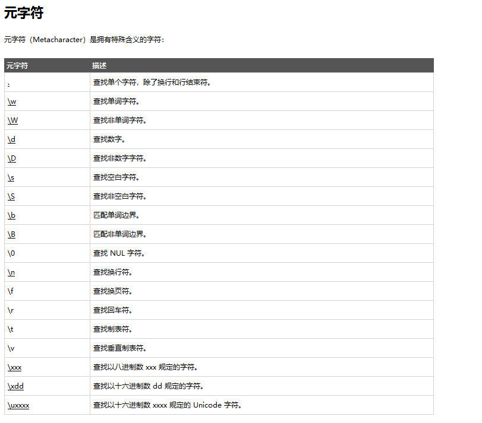
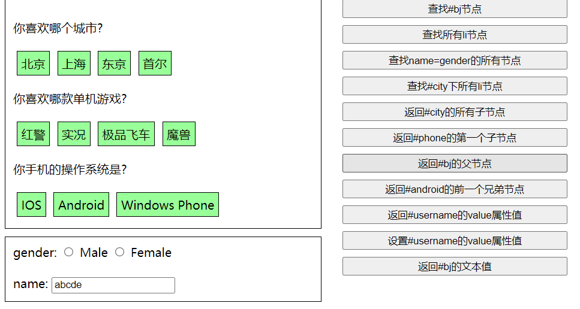
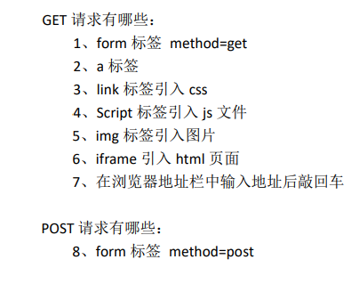
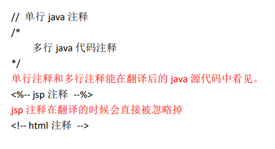

# HTML&CSS

## HTML

### 标签语法

~~~html
<body>
	<!-- ①标签不能交叉嵌套 -->
	正确：
	
早安，尚硅谷

	错误：
	
早安，尚硅谷

	
	

	
	<!-- ②标签必须正确关闭(闭合) -->
	<!-- i.有文本内容的标签： -->
	正确：
	
早安，尚硅谷

	错误：
	
早安，尚硅谷
		

	
		<!-- ii.没有文本内容的标签： -->
		正确： 1
		错误： 2
		

	
		<!-- ③属性必须有值，属性值必须加引号 -->
		正确：早安，尚硅谷
		错误：早安，尚硅谷
		错误：早安，尚硅谷
		

	
		<!-- ④注释不能嵌套 -->
		正确：<!-- 注释内容 -->  
		错误：<!-- 注释内容 <!-- 注释内容 --> -->
		

</body>
</html>
~~~

### font标签

~~~html
<body>
	<!-- 字体标签
	 需求1：在网页上显示 我是字体标签 ，并修改字体为 宋体，颜色为红色。

	 font标签是字体标签,它可以用来修改文本的字体,颜色,大小(尺寸)
	 	color属性修改颜色
	 	face属性修改字体
	 	size属性修改文本大小
	 -->
	我是字体标签
</body>
~~~

### 特殊字符

~~~html
<body>
	<!-- 特殊字符
	需求1：把   换行标签 变成文本 转换成字符显示在页面上

	常用的特殊字符:
		<	===>>>>		&lt;
		>   ===>>>>		&gt;
	  空格	===>>>>		&nbsp;

	 -->
	我是&lt;br&gt;标签 
	国哥好&nbsp;&nbsp;&nbsp;&nbsp;&nbsp;&nbsp;&nbsp;&nbsp;&nbsp;&nbsp;&nbsp;&nbsp;&nbsp;&nbsp;&nbsp;&nbsp;&nbsp;&nbsp;&nbsp;&nbsp;&nbsp;&nbsp;&nbsp;&nbsp;&nbsp;&nbsp;&nbsp;帅啊!
</body>
</html>
~~~

最常用的字符实体

| 显示结果 | 描述   | 实体名称          | 实体编号 |
| -------- | ------ | ----------------- | -------- |
|          | 空格   | &nbsp;            | &#160;   |
| <        | 小于号 | &lt;              | &#60;    |
| >        | 大于号 | &gt;              | &#62;    |
| &        | 和号   | &amp;             | &#38;    |
| "        | 引号   | &quot;            | &#34;    |
| '        | 撇号   | &apos; (IE不支持) | &#39;    |

其他一些常用的字符实体

| 显示结果 | 描述     | 实体名称 | 实体编号 |
| -------- | -------- | -------- | -------- |
| ￠       | 分       | &cent;   | &#162;   |
| £        | 镑       | &pound;  | &#163;   |
| ¥        | 日圆     | &yen;    | &#165;   |
| §        | 节       | &sect;   | &#167;   |
| ©        | 版权     | &copy;   | &#169;   |
| ®        | 注册商标 | &reg;    | &#174;   |
| ×        | 乘号     | &times;  | &#215;   |
| ÷        | 除号     | &divide; | &#247;   |

### 标题标签

~~~html
<body>
	<!-- 标题标签
	 需求1：演示标题1到 标题6的

	 	h1 - h6 都是标题标签
	 	h1 最大
	 	h6 最小
			align 属性是对齐属性
				left		左对齐(默认)
				center		剧中
				right		右对齐
	 -->
	<h1 align="left">标题1</h1>
	<h2 align="center">标题2</h2>
	<h3 align="right">标题3</h3>
	<h4>标题4</h4>
	<h5>标题5</h5>
	<h6>标题6</h6>
	<h7>标题7</h7>
</body>
~~~

### 超链接

~~~html
<body>
	<!-- a标签是 超链接
	 		href属性设置连接的地址
	 		target属性设置哪个目标进行跳转
	 			_self		表示当前页面(默认值)
	 			_blank		表示打开新页面来进行跳转
	 -->
	<a href="http://localhost:8080">百度</a> 
	<a href="http://localhost:8080" target="_self">百度_self</a> 
	<a href="http://localhost:8080" target="_blank">百度_blank</a> 
</body>
~~~

### img标签

~~~html
<body>
    <!--需求1：使用img标签显示一张美女的照片。并修改宽高，和边框属性

        img标签是图片标签,用来显示图片
            src属性可以设置图片的路径
            width属性设置图片的宽度
            height属性设置图片的高度
            border属性设置图片边框大小
            alt属性设置当指定路径找不到图片时,用来代替显示的文本内容

        在JavaSE中路径也分为相对路径和绝对路径.
            相对路径:从工程名开始算

            绝对路径:盘符:/目录/文件名

        在web中路径分为相对路径和绝对路径两种
            相对路径:
                .           表示当前文件所在的目录
                ..          表示当前文件所在的上一级目录
                文件名      表示当前文件所在目录的文件,相当于 ./文件名            ./ 可以省略

            绝对路径:
                正确格式是:  http://ip:port/工程名/资源路径

                错误格式是:  盘符:/目录/文件名
    -->
    
    
    
    
    
    
</body>	
~~~

### 表格标签

~~~HTML
<body>
<!--
	需求1：做一个 带表头的 ，三行，三列的表格，并显示边框
	需求2：修改表格的宽度，高度，表格的对齐方式，单元格间距。

		table 标签是表格标签
			border 设置表格标签
			width 设置表格宽度
			height 设置表格高度
			align 设置表格相对于页面的对齐方式
			cellspacing 设置单元格间距

		tr	 是行标签
		th	是表头标签
		td  是单元格标签
			align 设置单元格文本对齐方式

		b 是加粗标签

		colspan 属性设置跨列
		rowspan 属性设置跨行

	-->

<table align="center" border="1" width="300" height="300" cellspacing="0">
    <tr>
        <th>1.1</th>
        <th>1.2</th>
        <th>1.3</th>
    </tr>
    <tr>
        <td>2.1</td>
        <td>2.2</td>
        <td>2.3</td>
    </tr>
    <tr>
        <td>3.1</td>
        <td>3.2</td>
        <td>3.3</td>
    </tr>
</table>
    
    <table width="500" height="500" cellspacing="0" border="1">
        <tr>
            <td colspan="2">1.1</td>
            <td>1.3</td>
            <td>1.4</td>
            <td>1.5</td>
        </tr>
        <tr>
            <td rowspan="2">2.1</td>
            <td>2.2</td>
            <td>2.3</td>
            <td>2.4</td>
            <td>2.5</td>
        </tr>
        <tr>
            <td>3.2</td>
            <td>3.3</td>
            <td>3.4</td>
            <td>3.5</td>
        </tr>
        <tr>
            <td>4.1</td>
            <td>4.2</td>
            <td>4.3</td>
            <td colspan="2" rowspan="2">4.4</td>
        </tr>
        <tr>
            <td>5.1</td>
            <td>5.2</td>
            <td>5.3</td>
        </tr>
    </table>
</body>
~~~

### iframe标签

~~~html
<body>
	我是一个单独的完整的页面  
    <!--ifarme标签可以在页面上开辟一个小区域显示一个单独的页面
            ifarme和a标签组合使用的步骤:
                1 在iframe标签中使用name属性定义一个名称
                2 在a标签的target属性上设置iframe的name的属性值
    -->
    <iframe src="3.标题标签.html" width="500" height="400" name="abc"></iframe>
     

    <ul>
        <li><a href="0-标签语法.html" target="abc">0-标签语法.html</a></li>
        <li><a href="1.font标签.html" target="abc">1.font标签.html</a></li>
        <li><a href="2.特殊字符.html" target="abc">2.特殊字符.html</a></li>
    </ul>
</body>
~~~

### 列表

~~~html
<body>
    <!--需求1：使用无序，列表方式，把东北F4，赵四，刘能，小沈阳，宋小宝，展示出来
        ul 是无序列表
            type属性可以修改列表项前面的符号
        li  是列表项
    -->
    <ul type="none">
        <li>赵四</li>
        <li>刘能</li>
        <li>小沈阳</li>
        <li>宋小宝</li>
    </ul>
</body>
~~~

### 表单

~~~html
<body>
<!--需求1:创建一个个人信息注册的表单界面。包含用户名，密码，确认密码。性别（单选），兴趣爱好（多选），国籍（下拉列表）。
隐藏域，自我评价（多行文本域）。重置，提交。-->

    <!--
        form标签就是表单
            input type=text     是文件输入框  value设置默认显示内容
            input type=password 是密码输入框  value设置默认显示内容
            input type=radio    是单选框    name属性可以对其进行分组   checked="checked"表示默认选中
            input type=checkbox 是复选框   checked="checked"表示默认选中
            input type=reset    是重置按钮      value属性修改按钮上的文本
            input type=submit   是提交按钮      value属性修改按钮上的文本
            input type=button   是按钮          value属性修改按钮上的文本
            input type=file     是文件上传域
            input type=hidden   是隐藏域    当我们要发送某些信息，而这些信息，不需要用户参与，就可以使用隐藏域（提交的时候同时发送给服务器）

            select 标签是下拉列表框
            option 标签是下拉列表框中的选项 selected="selected"设置默认选中

            textarea 表示多行文本输入框 （起始标签和结束标签中的内容是默认值）
                rows 属性设置可以显示几行的高度
                cols 属性设置每行可以显示几个字符宽度
    -->
    <!--
        form标签是表单标签
            action属性设置提交的服务器地址
            method属性设置提交的方式GET(默认值)或POST

        表单提交的时候，数据没有发送给服务器的三种情况：
            1、表单项没有name属性值
            2、单选、复选（下拉列表中的option标签）都需要添加value属性，以便发送给服务器
            3、表单项不在提交的form标签中

        GET请求的特点是：
            1、浏览器地址栏中的地址是：action属性[+?+请求参数]
                请求参数的格式是：name=value&name=value
            2、不安全
            3、它有数据长度的限制

        POST请求的特点是：
            1、浏览器地址栏中只有action属性值
            2、相对于GET请求要安全
            3、理论上没有数据长度的限制
    -->
    <form>
        <h1 align="center">用户注册</h1>
        <table align="center">
            <tr>
                <td> 用户名称：</td>
                <td>
                    <input type="text" value="默认值"/>
                </td>
            </tr>
            <tr>
                <td> 用户密码：</td>
                <td><input type="password" value="abc"/></td>
            </tr>
            <tr>
                <td>确认密码：</td>
                <td><input type="password" value="abc"/></td>
            </tr>
             <tr>
                <td>性别：</td>
                <td>
                    <input type="radio" name="sex"/>男
                    <input type="radio" name="sex" checked="checked"  />女
                </td>
            </tr>
             <tr>
                <td> 兴趣爱好：</td>
                <td>
                    <input type="checkbox" checked="checked" />Java
                    <input type="checkbox" />JavaScript
                    <input type="checkbox" />C++
                </td>
            </tr>
             <tr>
                <td>国籍：</td>
                <td>
                    <select>
                        <option>--请选择国籍--</option>
                        <option selected="selected">中国</option>
                        <option>美国</option>
                        <option>小日本</option>
                    </select>
                </td>
            </tr>
             <tr>
                <td>自我评价：</td>
                <td><textarea rows="10" cols="20">我才是默认值</textarea></td>
            </tr>
             <tr>
                <td><input type="reset" /></td>
                <td align="center"><input type="submit"/></td>
            </tr>
        </table>
    </form>
</body>
~~~

### 其他标签

~~~html
<body>
        <!--需求1：div、span、p标签的演示
            div标签       默认独占一行
            span标签      它的长度是封装数据的长度
            p段落标签     默认会在段落的上方或下方各空出一行来（如果已有就不再空）
        -->
    
div标签1

    
div标签2

    span标签1
    span标签2
    
p段落标签1

    
p段落标签2

</body
~~~

## CSS

### CSS与HTML结合

#### 第一种

 在标签的 style 属性上设置”key:value value;”，修改标签样式 

~~~html
<!DOCTYPE html>
<html lang="en">
<head>
<meta charset="UTF-8">
<title>Title</title>
</head>
<body>
<!--需求 1：分别定义两个 div、span 标签，分别修改每个 div 标签的样式为：边框 1 个像素，实线，红色。-->

div 标签 1

div 标签 2

span 标签 1
span 标签 2
</body>
</html>
~~~

 **问题：这种方式的缺点？** 

- 如果标签多了。样式多了。代码量非常庞大。
- 可读性非常差
- Css 代码没什么复用性可方言 

#### 第二种

 在 head 标签中，使用 style 标签来定义各种自己需要的 css 样式。 

格式如下： xxx { Key : value value; } 

~~~html
<head>
    <meta charset="UTF-8">
    <title>Title</title>
    <!--style标签专门用来定义css样式代码-->
    
</head>

<body>
    
div标签1

    
div标签2

    span标签1
    span标签2
</body>
~~~

 **问题：这种方式的缺点**

- 只能在同一页面内复用代码，不能在多个页面中复用 css 代码

- 维护起来不方便，实际的项目中会有成千上万的页面，要到每个页面中去修改。工作量太大了

#### 第三种(final)

 把 css 样式写成一个单独的 css 文件，再通过 link 标签引入即可复用。 使用 html 的 link标签 导入 css 样 式文件。 

css代码

~~~css
div{
border: 1px solid yellow;
}
span{
border: 1px solid red;
}
~~~

html代码

~~~html
<head>
    <meta charset="UTF-8">
    <title>Title</title>
    <!--link标签专门用来引入css样式代码-->
    <link rel="stylesheet" type="text/css" href="1.css"/>

</head>

<body>
    
div标签1

    
div标签2

    span标签1
    span标签2
</body>
~~~

### CSS选择器

####  标签名选择器 

~~~html
<head>
	<meta charset="UTF-8">
	<title>CSS选择器</title>
	
</head>
<body>
	<!-- 
	需求1：在所有div标签上修改字体颜色为蓝色，字体大小30个像素。边框为1像素黄色实线。
	并且修改所有span 标签的字体颜色为黄色，字体大小20个像素。边框为5像素蓝色虚线。
	 -->
	
div标签1

	
div标签2

	span标签1
	span标签2
</body>
~~~

#### id选择器

~~~html
<head>
	<meta charset="UTF-8">
	<title>ID选择器</title>
	
</head>
<body>		
	<!--
	需求1：分别定义两个 div 标签，
	第一个div 标签定义 id 为 id001 ，然后根据id 属性定义css样式修改字体颜色为蓝色，
	字体大小30个像素。边框为1像素黄色实线。
	
	第二个div 标签定义 id 为 id002 ，然后根据id 属性定义css样式 修改的字体颜色为红色，字体大小20个像素。
	边框为5像素蓝色点线。
	 -->
	
	
div标签1

	
div标签2

</body
~~~

#### class类型选择器

~~~html
<head>
	<meta charset="UTF-8">
	<title>class类型选择器</title>
	
</head>
<body>
	<!--
		需求1：修改 class 属性值为 class01的 span 或 div 标签，字体颜色为蓝色，字体大小30个像素。边框为1像素黄色实线。
		需求2：修改 class 属性值为 class02的 div 标签，字体颜色为灰色，字体大小26个像素。边框为1像素红色实线。
	 -->

	
div标签class01

	
div标签

	span标签class01
	span标签2
</body>
~~~

#### class类型选择器

~~~html
<head>
    <meta charset="UTF-8">
    <title>class类型选择器</title>
    
</head>
<body>
	<!-- 
	需求1：修改 class="class01" 的div 标签 和 id="id01" 所有的span标签，
	字体颜色为蓝色，字体大小20个像素。边框为1像素黄色实线。
	 -->
   
div标签class01
  
   span 标签   
   
div标签
  
   
div标签id01
  
</body>
~~~

###  常用样式 

1 、字体颜色 

color：red；

 颜色可以写颜色名如：black, blue, red, green 等 

颜色也可以写 rgb 值和十六进制表示值：如 rgb(255,0,0)，#00F6DE，如果写十六进制值必 须加#

2、宽度

 width:19px;

 宽度可以写像素值：19px； 

也可以写百分比值：20%； 

3、高度 

height:20px; 

高度可以写像素值：19px；

 也可以写百分比值：20%； 

4、背景颜色 

background-color:#0F2D4C 

5、字体样式：

 color：#FF0000；

字体颜色红色 font-size：20px; 字体大小 

6、红色 1 像素实线边框

border：1px solid red;

 7、DIV 居中 

margin-left: auto; 

margin-right: auto; 

8、文本居中：

 text-align: center;

9、超连接去下划线 

text-decoration: none; 

10、表格细线

 table { 

​		border: 1px solid black; /*设置边框*/

​		 border-collapse: collapse; /*将边框合并*/ 

} 

td,th { border: 1px solid black; /*设置边框*/ } 

11、列表去除修饰 

ul { list-style: none; } 

**代码示例**

~~~html
<head>
    <meta charset="UTF-8">
    <title>06-css常用样式.html</title>
    
</head>
<body>
    <ul>
        <li>11111111111</li>
        <li>11111111111</li>
        <li>11111111111</li>
        <li>11111111111</li>
        <li>11111111111</li>
    </ul>
    <table>
        <tr>
            <td>1.1</td>
            <td>1.2</td>
        </tr>
    </table>
    <a href="http://www.baidu.com">百度</a>
    
我是div标签

</body>
~~~

# JavaScript

 **特点：**

- 交互性（它可以做的就是信息的动态交互）
- 安全性（不允许直接访问本地硬盘） 3. 跨
- 平台性（只要是可以解释 JS 的浏览器都可以执行，和平台无关） 

##  JavaScript 和 html 代码的结合方式 

### 第一种方式

 只需要在 head 标签中，或者在 body 标签中， 使用 script 标签 来书写JavaScript代码

~~~javascript
<head>
    <meta charset="UTF-8">
    <title>Title</title>
    
</head>
<body>

</body>
~~~

### 第二种方式

 使用script标签单独引入JavaScript代码文件

~~~JavaScript
<head>
    <meta charset="UTF-8">
    <title>Title</title>
    <!--
        现在需要使用script引入外部的js文件来执行
            src 属性专门用来引入js文件路径（可以是相对路径，也可以是绝对路径）

        script标签可以用来定义js代码，也可以用来引入js文件
        但是，两个功能二选一使用。不能同时使用两个功能
    -->
    
    
</head>
<body>

</body>
~~~

##  变量 

 **JavaScript 的变量类型：**

-  数值类型： number

- 字符串类型： string 

- 对象类型： object 

- 布尔类型： boolean 

- 函数类型： function

 

 JS 中的定义变量格式：

​					 var 变量名;

​					 var 变量名 = 值;

示例代码:

~~~javascript

~~~

## 关系(比较)运算

|        | 符号 | 作用                                         |
| ------ | ---- | -------------------------------------------- |
| 等于   | ==   | 做简单的字面值比较                           |
| 全等于 | ===  | 除了做字面值比较，还会比较两个变量的数据类型 |

代码示例:

~~~javascript

~~~

## 逻辑运算

且运算:		&&

或运算:		||

取反运算:	!

代码示例:

~~~javascript

~~~

## 数组

JS中数组的定义:

​			格式:

​			var 数组名 = [];//空数组

​			var 数组名 = [1,'abc',true];//定义数组同时赋值

示例代码

~~~JavaScript

~~~

## 函数

### 函数的两种定义方式

#### 第一种:可以使用function关键字来定义函数

示例代码:

~~~javascript

~~~

#### 函数的第二种定义方式

示例代码:

~~~javascript

~~~

**注意:js中不允许函数的重载**

~~~JavaScript

~~~

### 隐形参数arguments

示例代码:

~~~javascript

~~~

## JS中自定义对象

###  Object 形式的自定义对象 

示例代码:

~~~javascript

~~~

###  {}花括号形式的自定义对象 

示例代码:

~~~javascript

~~~

## JS中的事件

### onload加载完成事件

~~~javascript
<head>
    <meta charset="UTF-8">
    <title>Title</title>
    
</head>
<!--静态注册onload事件
        onload事件是浏览器解析完页面之后就会自动触发的事件
       <body onload="onloadFun();">
-->
<body>

</body>
~~~

### onclick单击事件

~~~JavaScript
<head>
    <meta charset="UTF-8">
    <title>Title</title>
    
</head>
<body>
    <!--静态注册onClick事件-->
    <button onclick="onclickFun();">按钮1</button>
    <button id="btn01">按钮2</button>
</body>
~~~

### onblur失去焦点事件

~~~JavaScript
<head>
    <meta charset="UTF-8">
    <title>Title</title>
    
</head>
<body>
    用户名:<input type="text" onblur="onblurFun();"> 
    密码:<input id="password" type="text" > 
</body>
~~~

### onchange内容发生改变事件

~~~JavaScript
<head>
    <meta charset="UTF-8">
    <title>Title</title>

    
</head>
<body>
    请选择你心中的女神：
    <!--静态注册onchange事件-->
    <select onchange="onchangeFun();">
        <option>--女神--</option>
        <option>芳芳</option>
        <option>佳佳</option>
        <option>娘娘</option>
    </select>

    请选择你心中的男神：
    <select id="sel01">
        <option>--男神--</option>
        <option>国哥</option>
        <option>华仔</option>
        <option>富城</option>
    </select>
</body>
~~~

### onsubmit表单提交事件

~~~JavaScript
<head>
    <meta charset="UTF-8">
    <title>Title</title>
    
</head>
<body>
    <!--return false 可以阻止 表单提交 -->
    <form action="http://localhost:8080" method="get" onsubmit="return onsubmitFun();">
        <input type="submit" value="静态注册"/>
    </form>
    <form action="http://localhost:8080" id="form01">
        <input type="submit" value="动态注册"/>
    </form>

</body>
~~~

## DOM模型

 **Document 对象的理解：**

- 第一点：Document 它管理了所有的 HTML 文档内容。 
- 第二点：document 它是一种树结构的文档。有层级关系。 
- 第三点：它让我们把所有的标签 都 对象化 
- 第四点：我们可以通过 document 访问所有的标签对象。 

### 正则表达式

~~~JavaScript

~~~

### Document对象中的方法

~~~
document.getElementById(elementId)
通过标签的 id 属性查找标签 dom 对象，elementId 是标签的 id 属性值
document.getElementsByName(elementName)
通过标签的 name 属性查找标签 dom 对象，elementName 标签的 name 属性值
document.getElementsByTagName(tagname)
通过标签名查找标签 dom 对象。tagname 是标签名
document.createElement( tagName)
方法，通过给定的标签名，创建一个标签对象。tagName 是要创建的标签名

注：
document 对象的三个查询方法，如果有 id 属性，优先使用 getElementById 方法来进行查询
如果没有 id 属性，则优先使用 getElementsByName 方法来进行查询
如果 id 属性和 name 属性都没有最后再按标签名查 getElementsByTagName
以上三个方法，一定要在页面加载完成之后执行，才能查询到标签对象。
~~~

####  getElementById方法

代码示例:

~~~javascript
<head>
    <meta charset="UTF-8">
    <title>Title</title>
    
</head>
<body>
    用户名：<input type="text" id="username" value="wzg"/>
    

    
    <button onclick="onclickFun()">较验</button>
</body>
~~~

####  getElementsByName方法

代码示例:

~~~javascript

</head>
<body>
    兴趣爱好：
    <input type="checkbox" name="hobby" value="cpp" checked="checked">C++
    <input type="checkbox" name="hobby" value="java">Java
    <input type="checkbox" name="hobby" value="js">JavaScript
     
    <button onclick="checkAll()">全选</button>
    <button onclick="checkNo()">全不选</button>
    <button onclick="checkReverse()">反选</button>
</body>
~~~

####  getElementsByTagName方法

代码示例:

~~~javascript
<head>
    <meta charset="UTF-8">
    <title>Title</title>
    
</head>
<body>

    <!--as -->
    兴趣爱好：
    <input type="checkbox" value="cpp" checked="checked">C++
    <input type="checkbox" value="java">Java
    <input type="checkbox" value="js">JavaScript
     
    <button id="btn01" onclick="checkAll()">全选</button>

</body>
~~~

####  createElement方法

代码示例:

~~~javascript
 
~~~

###  节点的常用属性和方法 

 节点的常用属性和方法 

#### 方法

通过具体的元素节点调用
getElementsByTagName()
方法，获取当前节点的指定标签名孩子节点

appendChild( oChildNode )
方法，可以添加一个子节点，oChildNode 是要添加的孩子节点

#### 属性

~~~JavaScript
childNodes
属性，获取当前节点的所有子节点
firstChild
属性，获取当前节点的第一个子节点
lastChild
属性，获取当前节点的最后一个子节点
parentNode
属性，获取当前节点的父节点
nextSibling
属性，获取当前节点的下一个节点
previousSibling
属性，获取当前节点的上一个节点
className
用于获取或设置标签的 class 属性值
innerHTML
属性，表示获取/设置起始标签和结束标签中的内容
innerText
属性，表示获取/设置起始标签和结束标签中的文本
~~~

### Dom查询练习

~~~html
<!DOCTYPE html>
<html>
<head>
<meta charset="UTF-8">
<title>dom查询</title>
<link rel="stylesheet" type="text/css" href="style/css.css" />

</head>
<body>

	

		

			你喜欢哪个城市?
		

		<ul id="city">
			<li id="bj">北京</li>
			<li>上海</li>
			<li>东京</li>
			<li>首尔</li>
		</ul>

		 
		 

		

			你喜欢哪款单机游戏?
		

		<ul id="game">
			<li id="rl">红警</li>
			<li>实况</li>
			<li>极品飞车</li>
			<li>魔兽</li>
		</ul>

		 
		 

		

			你手机的操作系统是?
		

		<ul id="phone"><li>IOS</li><li id="android">Android</li><li>Windows Phone</li></ul>
	

	

		gender:
		<input type="radio" name="gender" value="male"/>
		Male
		<input type="radio" name="gender" value="female"/>
		Female
		 
		 
		name:
		<input type="text" name="name" id="username" value="abcde"/>
	

	
<button id="btn01">查找#bj节点</button>

	
<button id="btn02">查找所有li节点</button>

	
<button id="btn03">查找name=gender的所有节点</button>

	
<button id="btn04">查找#city下所有li节点</button>

	
<button id="btn05">返回#city的所有子节点</button>

	
<button id="btn06">返回#phone的第一个子节点</button>

	
<button id="btn07">返回#bj的父节点</button>

	
<button id="btn08">返回#android的前一个兄弟节点</button>

	
<button id="btn09">返回#username的value属性值</button>

	
<button id="btn10">设置#username的value属性值</button>

	
<button id="btn11">返回#bj的文本值</button>

</body>
</html>
~~~

效果图:

# jQuery

## jQuery的初体验(helloworld)

需求:使用jquery给一个按钮绑定单击事件

~~~html
<!DOCTYPE html PUBLIC "-//W3C//DTD HTML 4.01 Transitional//EN" "http://www.w3.org/TR/html4/loose.dtd">
<html>
<head>
<meta http-equiv="Content-Type" content="text/html; charset=UTF-8">
<title>Insert title here</title>
	
	
</head>
<body>
	<button id="btnId">SayHello</button>
</body>
</html>
~~~

## jQuery的核心函数【$】

 $ 是 jQuery 的核心函数，能完成 jQuery 的很多功能。$()就是调用$这个函数

1、传入参数为 [ 函数 ] 时：
	表示页面加载完成之后。相当于 window.onload = function(){}
2、传入参数为 [ HTML 字符串 ] 时：
	会对我们创建这个 html 标签对象
3、传入参数为 [ 选择器字符串 ] 时：
	$(“#id 属性值”); id 选择器，根据 id 查询标签对象
	$(“标签名”); 标签名选择器，根据指定的标签名查询标签对象
	$(“.class 属性值”); 类型选择器，可以根据 class 属性查询标签对象
4、传入参数为 [ DOM 对象 ] 时：
	会把这个 dom 对象转换为 jQuery 对象

## jQuery对象与Dom对象的区别

**Dom 对象**
	1.通过 getElementById()查询出来的标签对象是 Dom 对象
	2.通过 getElementsByName()查询出来的标签对象是 Dom 对象
	3.通过 getElementsByTagName()查询出来的标签对象是 Dom 对象
	4.通过 createElement() 方法创建的对象，是 Dom 对象
DOM 对象 Alert 出来的效果是：[object HTML 标签名 Element]
**jQuery 对象**
	5.通过 JQuery 提供的 API 创建的对象，是 JQuery 对象
	6.通过 JQuery 包装的 Dom 对象，也是 JQuery 对象
	7.通过 JQuery 提供的 API 查询到的对象，是 JQuery 对象
jQuery 对象 Alert 出来的效果是：[object Object]

**jQuery对象的本质：**jQuery 对象是 dom 对象的数组 + jQuery 提供的一系列功能函数

**Dom 对象和 jQuery 对象互转**

- dom 对象转化为 jQuery 对象
  - 先有 DOM 对象
  - $( DOM 对象 ) 就可以转换成为 jQuery 对象
- jQuery 对象转为 dom 对象
  - 先有 jQuery 对象
  - jQuery 对象[下标]取出相应的 DOM 对象

## jQuery选择器

### 基本选择器

- #ID 选择器：根据 id 查找标签对象
- .class 选择器：根据 class 查找标签对象
- element 选择器：根据标签名查找标签对象

* *选择器：表示任意的，所有的元素
* selector1，selector2 组合选择器：合并选择器 1，选择器 2 的结果并返

其中p.myClass 表示: 表示标签名必须是 p 标签，而且 class 类型还要是 myClass 

代码示例:

~~~html

~~~

### 层次选择器

- ancestor descendant 后代选择器 ：在给定的祖先元素下匹配所有的后代元素
- parent > child 子元素选择器：在给定的父元素下匹配所有的子元素
- prev + next 相邻元素选择器：匹配所有紧接在 prev 元素后的 next 元素
- prev ~ sibings 之后的兄弟元素选择器：匹配 prev 元素之后的所有 siblings 元素

代码示例:

~~~html

~~~

### 过滤选择器

####  基本过滤器 

| 选择器         | 作用                                      |
| -------------- | ----------------------------------------- |
| :first         | 获取第一个元素                            |
| :last          | 获取最后个元素                            |
| :not(selector) | 去除所有与给定选择器匹配的元素            |
| :even          | 匹配所有索引值为偶数的元素，从 0 开始计数 |
| :odd           | 匹配所有索引值为奇数的元素，从 0 开始计数 |
| :eq(index)     | 匹配一个给定索引值的元素                  |
| :gt(index)     | 匹配所有大于给定索引值的元素              |
| :lt(index)     | 匹配所有小于给定索引值的元素              |
| :header        | 匹配如 h1, h2, h3 之类的标题元素          |
| :animated      | 匹配所有正在执行动画效果的元素            |

代码示例:

~~~html

~~~

####  内容过滤器 

| 选择器          | 作用                                 |
| --------------- | ------------------------------------ |
| :contains(text) | 匹配包含给定文本的元素               |
| :empty          | 匹配所有不包含子元素或者文本的空元素 |
| :parent         | 匹配含有子元素或者文本的元素         |
| :has(selector)  | 匹配含有选择器所匹配的元素的元素     |

代码示例:

~~~html

~~~

####  属性过滤器 

| 选择器                       | 作用                                                   |
| ---------------------------- | ------------------------------------------------------ |
| [attribute]                  | 匹配包含给定属性的元素。                               |
| [attribute=value]            | 匹配给定的属性是某个特定值的元素                       |
| [attribute!=value]           | 匹配所有不含有指定的属性，或者属性不等于特定值的元素。 |
| [attribute^=value]           | 匹配给定的属性是以某些值开始的元素                     |
| [attribute$=value]           | 匹配给定的属性是以某些值结尾的元素                     |
| [attribute*=value]           | 匹配给定的属性是以包含某些值的元素                     |
| attrSel1][attrSel2][attrSelN | 复合属性选择器，需要同时满足多个条件时使用             |

代码演示:

~~~html

~~~

#### 表单过滤器

| 选择器    | 作用                                                         |
| --------- | ------------------------------------------------------------ |
| :input    | 匹配所有 input, textarea, select 和 button 元素              |
| :text     | 匹配所有 文本输入框                                          |
| :password | 匹配所有的密码输入框                                         |
| :radio    | 匹配所有的单选框                                             |
| :checkbox | 匹配所有的复选框                                             |
| :submit   | 匹配所有提交按钮                                             |
| :image    | 匹配所有 img 标签                                            |
| :reset    | 匹配所有重置按钮                                             |
| :button   | 匹配所有 input type=button <button>按钮                      |
| :file     | 匹配所有 input type=file 文件上传                            |
| :hidden   | 匹配所有不可见元素 display:none 或 input type=hidden         |
| :enabled  | 匹配所有可用元素                                             |
| :disabled | 匹配所有不可用元素                                           |
| :checked  | 匹配所有选中的单选，复选，和下拉列表中选中的 option 标签对象 |
| :selected | 匹配所有选中的 option                                        |

代码示例:

~~~html

~~~

## jQuery元素筛选方法

| 方法          | 作用                                                 | 与选择器比较                    |
| ------------- | ---------------------------------------------------- | ------------------------------- |
| eq()          | 获取给定索引的元素                                   | 功能跟 :eq() 一样               |
| first()       | 获取第一个元素                                       | 功能跟 :first 一样              |
| last()        | 获取最后一个元素                                     | 功能跟 :last 一样               |
| filter(exp)   | 留下匹配的元素                                       |                                 |
| is(exp)       | 判断是否匹配给定的选择器，只要有一个匹配就返回，true |                                 |
| has(exp)      | 返回包含有匹配选择器的元素的元素                     | 功能跟 :has 一样                |
| not(exp)      | 删除匹配选择器的元素                                 | 功能跟 :not 一样                |
| children(exp) | 返回匹配给定选择器的子元素                           | 功能跟 parent>child 一样        |
| find(exp)     | 返回匹配给定选择器的后代元素                         | 功能跟 ancestor descendant 一样 |
| next()        | 返回当前元素的下一个兄弟元素                         | 功能跟 prev + next 功能一样     |
| nextAll()     | 返回当前元素后面所有的兄弟元素                       | 功能跟 prev ~ siblings 功能一样 |
| nextUntil()   | 返回当前元素到指定匹配的元素为止的后面元素           |                                 |
| parent()      | 返回父元素                                           |                                 |
| prev(exp)     | 返回当前元素的上一个兄弟元素                         |                                 |
| prevAll()     | 返回当前元素前面所有的兄弟元素                       |                                 |
| prevUnit(exp) | 返回当前元素到指定匹配的元素为止的前面元素           |                                 |
| siblings(exp) | 返回所有兄弟元素                                     |                                 |
| add()         | 把 add 匹配的选择器的元素添加到当前 jquery 对象中    |                                 |

代码示例:

~~~html

~~~

## jQuery的属性操作

| 操作   | 作用                                                         | 与dom属性对比              |
| ------ | ------------------------------------------------------------ | -------------------------- |
| html() | 它可以设置和获取起始标签和结束标签中的内容                   | 跟 dom 属性 innerHTML 一样 |
| text() | 它可以设置和获取起始标签和结束标签中的文本                   | 跟 dom 属性 innerText 一样 |
| val()  | 它可以设置和获取表单项的                                     | value 属性值               |
| attr() | 可以设置和获取属性的值，不推荐操作 checked、readOnly、selected、disabled 等等        attr 方法还可以操作非标准的属性。比如自定义属性：abc,bbj |                            |
| prop() | 可以设置和获取属性的值,只推荐操作 checked、readOnly、selected、disabled 等等 |                            |

代码示例:(val)

~~~~html

<body>
    单选：
    <input name="radio" type="radio" value="radio1" />radio1
    <input name="radio" type="radio" value="radio2" />radio2
     
    多选：
    <input name="checkbox" type="checkbox" value="checkbox1" />checkbox1
    <input name="checkbox" type="checkbox" value="checkbox2" />checkbox2
    <input name="checkbox" type="checkbox" value="checkbox3" />checkbox3
     

    下拉多选 ：
    <select id="multiple" multiple="multiple" size="4">
        <option value="mul1">mul1</option>
        <option value="mul2">mul2</option>
        <option value="mul3">mul3</option>
        <option value="mul4">mul4</option>
    </select>
     

    下拉单选 ：
    <select id="single">
        <option value="sin1">sin1</option>
        <option value="sin2">sin2</option>
        <option value="sin3">sin3</option>
    </select>
</body>
~~~~

代码示例:(attr\prop)

~~~html

</head>
<body>
<body>
     
    多选：
    <input name="checkbox" type="checkbox" checked="checked" value="checkbox1" />checkbox1
    <input name="checkbox" type="checkbox" value="checkbox2" />checkbox2
      
    
1234

    
1234

</body>
~~~

### 练习（全选，全不选）

~~~html

</head>
<body>

	<form method="post" action="">
	
		你爱好的运动是？<input type="checkbox" id="checkedAllBox" />全选/全不选 
		
		 
		<input type="checkbox" name="items" value="足球" />足球
		<input type="checkbox" name="items" value="篮球" />篮球
		<input type="checkbox" name="items" value="羽毛球" />羽毛球
		<input type="checkbox" name="items" value="乒乓球" />乒乓球
		 
		<input type="button" id="checkedAllBtn" value="全　选" />
		<input type="button" id="checkedNoBtn" value="全不选" />
		<input type="button" id="checkedRevBtn" value="反　选" />
		<input type="button" id="sendBtn" value="提　交" />
	</form>

</body>
~~~

效果图:

## DOM增删改

~~~html
/**
文档处理
内部插入

appendTo(content) 	   a.appendTo(b);  把a加到b里面				  添加到最后面
prependTo(content)	   a.prependTo(b); 把a添加到b里面    			  添加到最前面

外部插入
insertAfter(content) 	a.insertAfter(b);  把a插入到b的后面
insertBefore(content) 	a.insertBefore(b); 把a插入到b的前面

替换
replaceWith(content|fn) a.replaceWith(b)  把a用b替换
replaceAll(selector) 	a.replaceAll(b)	  用a替换所有的b

删除
empty() 				a.empty()   把a掏空，把a里面的所有元素都删除
remove([expr]) 			a.remove(b)  所有的a，是b的话就会删除	a.remove()删除a		
*/
			
~~~

### 练习( 从左到右，从右到左练习 )

~~~html

	
	
</head>
<body>

	

		<select multiple="multiple" name="sel01">
			<option value="opt01">选项1</option>
			<option value="opt02">选项2</option>
			<option value="opt03">选项3</option>
			<option value="opt04">选项4</option>
			<option value="opt05">选项5</option>
			<option value="opt06">选项6</option>
			<option value="opt07">选项7</option>
			<option value="opt08">选项8</option>
		</select>
		
		<button>选中添加到右边</button>
		<button>全部添加到右边</button>
	

	

		<select multiple="multiple" name="sel02">
		</select>
		<button>选中删除到左边</button>
		<button>全部删除到左边</button>
	

</body>
~~~

效果图:

## CSS样式的操作

| 操作          | 作用                     |
| ------------- | ------------------------ |
| addClass()    | 添加样式                 |
| removeClass() | 删除样式                 |
| toggleClass() | 有就删除，没有就添加样式 |
| offset()      | 获取和设置元素的坐标     |

## jQuery动画

~~~
基本动画
	show() 将隐藏的元素显示
	hide() 将可见的元素隐藏。
	toggle() 可见就隐藏，不可见就显示。
		以上动画方法都可以添加参数。
		1、第一个参数是动画 执行的时长，以毫秒为单位
		2、第二个参数是动画的回调函数 (动画完成后自动调用的函数)
淡入淡出动画
	fadeIn() 淡入（慢慢可见）
	fadeOut() 淡出（慢慢消失）
	fadeTo() 在指定时长内慢慢的将透明度修改到指定的值。0 透明，1 完成可见，0.5 半透明
	fadeToggle() 淡入/淡出 切换
~~~

### 练习(品牌展示)

~~~html

</head>
<body>
	

		<ul>
			<li><a href="#">佳能</a><i>(30440) </i></li>
			<li><a href="#">索尼</a><i>(27220) </i></li>
			<li><a href="#">三星</a><i>(20808) </i></li>
			<li><a href="#">尼康</a><i>(17821) </i></li>
			<li><a href="#">松下</a><i>(12289) </i></li>
			<li><a href="#">卡西欧</a><i>(8242) </i></li>
			<li><a href="#">富士</a><i>(14894) </i></li>
			<li><a href="#">柯达</a><i>(9520) </i></li>
			<li><a href="#">宾得</a><i>(2195) </i></li>
			<li><a href="#">理光</a><i>(4114) </i></li>
			<li><a href="#">奥林巴斯</a><i>(12205) </i></li>
			<li><a href="#">明基</a><i>(1466) </i></li>
			<li><a href="#">爱国者</a><i>(3091) </i></li>
			<li><a href="#">其它品牌相机</a><i>(7275) </i></li>
		</ul>
		

			<a href="more.html">显示全部品牌</a>
		

	

</body>
~~~

效果图:

## jQuery事件操作

**$( function(){} );和window.onload = function(){}的区别？**
**他们分别是在什么时候触发？**
1、jQuery 的页面加载完成之后是浏览器的内核解析完页面的标签创建好 DOM 对象之后就会马上执行。
2、原生 js 的页面加载完成之后，除了要等浏览器内核解析完标签创建好 DOM 对象，还要等标签显示时需要的内容加载完成。

**他们触发的顺序？**
1、jQuery 页面加载完成之后先执行
2、原生 js 的页面加载完成之后

**他们执行的次数？**
1、原生 js 的页面加载完成之后，只会执行最后一次的赋值函数。
2、jQuery 的页面加载完成之后是全部把注册的 function 函数，依次顺序全部执行

 **jQuery 中其他的事件处理方法 :**

| 事件        | 作用                                                         |
| ----------- | ------------------------------------------------------------ |
| click()     | 它可以绑定单击事件，以及触发单击事件                         |
| mouseover() | 鼠标移入事件                                                 |
| mouseout()  | 鼠标移出事件                                                 |
| bind()      | 可以给元素一次性绑定一个或多个事件                           |
| one()       | 使用上跟 bind 一样。但是 one 方法绑定的事件只会响应一次      |
| unbind()    | 跟 bind 方法相反的操作，解除事件的绑定                       |
| live()      | 也是用来绑定事件。它可以用来绑定选择器匹配的所有元素的事件。哪怕这个元素是后面动态创建出来的也有效 |

**事件的冒泡**

 什么是事件的冒泡？

 事件的冒泡是指，父子元素同时监听同一个事件。当触发子元素的事件的时候，同一个事件也被传递到了父元素的事件里去 响应。

 那么如何阻止事件冒泡呢？ 

在子元素事件函数体内，return false; 可以阻止事件的冒泡传递。 

 **javaScript 事件对象** 

 事件对象，是封装有触发的事件信息的一个 javascript 对象。 我们重点关心的是怎么拿到这个 javascript 的事件对象。以及使用。 

如何获取呢 javascript 事件对象呢？

 在给元素绑定事件的时候，在事件的 function( event ) 参数列表中添加一个参数，这个参数名，我们习惯取名为 event。 这个 event 就是 javascript 传递参事件处理函数的事件对象。 

### 练习(图片跟随)

~~~html

</head>
<body>

	
	
	

		
	

</body>
~~~

效果图；

# XML

##  dom4j 解析技术

需要解析的文件:

~~~xml
<?xml version="1.0" encoding="UTF-8"?>
<books>
    <book sn="SN12341232">
        <name>辟邪剑谱</name>
        <price>9.9</price>
        <author>班主任</author>
    </book>
    <book sn="SN12341231">
        <name>葵花宝典</name>
        <price>99.99</price>
        <author>班长</author>
    </book>
</books>
~~~

解析的代码:

【book.java】

~~~java
package com.atugigu.pojo;

import java.math.BigDecimal;

public class Book {
    private String sn;
    private String name;
    private BigDecimal price;
    private String author;

    public Book(String sn, String name, BigDecimal price, String author) {
        this.sn = sn;
        this.name = name;
        this.price = price;
        this.author = author;
    }

    public Book() {
    }

    public String getSn() {
        return sn;
    }

    public void setSn(String sn) {
        this.sn = sn;
    }

    public String getName() {
        return name;
    }

    public void setName(String name) {
        this.name = name;
    }

    public BigDecimal getPrice() {
        return price;
    }

    public void setPrice(BigDecimal price) {
        this.price = price;
    }

    public String getAuthor() {
        return author;
    }

    public void setAuthor(String author) {
        this.author = author;
    }

    @Override
    public String toString() {
        return "Book{" +
                "sn='" + sn + '\'' +
                ", name='" + name + '\'' +
                ", price=" + price +
                ", author='" + author + '\'' +
                '}';
    }
}

~~~

解析代码:

~~~java
@Test
    public void readXML() throws DocumentException {
        // 需要分四步操作:
        // 第一步，通过创建 SAXReader 对象。来读取 xml 文件，获取 Document 对象
        // 第二步，通过 Document 对象。拿到 XML 的根元素对象
        // 第三步，通过根元素对象。获取所有的 book 标签对象
        // 第四小，遍历每个 book 标签对象。然后获取到 book 标签对象内的每一个元素，再通过 getText() 方法拿到起始标签和结束标签之间的文本内容

        // 第一步，通过创建 SAXReader 对象。来读取 xml 文件，获取 Document 对象
        SAXReader reader = new SAXReader();
        Document document = reader.read("src/books.xml");
         // 第二步，通过 Document 对象。拿到 XML 的根元素对象
        Element root = document.getRootElement();
        // 打印测试
        // Element.asXML() 它将当前元素转换成为 String 对象
        // System.out.println( root.asXML() );
        // 第三步，通过根元素对象。获取所有的 book 标签对象
        // Element.elements(标签名)它可以拿到当前元素下的指定的子元素的集合
        List<Element> books = root.elements("book");
        // 第四小，遍历每个 book 标签对象。然后获取到 book 标签对象内的每一个元素，
        for (Element book : books) {
            // 测试
            // System.out.println(book.asXML());
            // 拿到 book 下面的 name 元素对象
            Element nameElement = book.element("name");
            // 拿到 book 下面的 price 元素对象
            Element priceElement = book.element("price");
            // 拿到 book 下面的 author 元素对象
            Element authorElement = book.element("author");
            // 再通过 getText() 方法拿到起始标签和结束标签之间的文本内容
            System.out.println("书名" + nameElement.getText() + " , 价格:"
                    + priceElement.getText() + ", 作者：" + authorElement.getText());
        }
    }

~~~

# Servlet

- Servlet 是 JavaEE 规范之一。规范就是接口
- Servlet 就 JavaWeb 三大组件之一。三大组件分别是：Servlet 程序、Filter 过滤器、Listener 监听器。
- Servlet 是运行在服务器上的一个 java 小程序，**它可以接收客户端发送过来的请求，并响应数据给客户端。**

## 配置文件web.xml说明

~~~xml
<?xml version="1.0" encoding="UTF-8"?>
<web-app xmlns="http://xmlns.jcp.org/xml/ns/javaee"
xmlns:xsi="http://www.w3.org/2001/XMLSchema-instance"
xsi:schemaLocation="http://xmlns.jcp.org/xml/ns/javaee
http://xmlns.jcp.org/xml/ns/javaee/web-app_4_0.xsd"
version="4.0">
	<!-- servlet 标签给 Tomcat 配置 Servlet 程序 -->
	<servlet>
        <!--servlet-name 标签 Servlet 程序起一个别名（一般是类名） -->
        <servlet-name>HelloServlet</servlet-name>
    	<!--servlet-class 是 Servlet 程序的全类名-->
        <servlet-class>com.atguigu.servlet.HelloServlet</servlet-class>
    </servlet>
    <!--servlet-mapping 标签给 servlet 程序配置访问地址-->
    <servlet-mapping>
        <!--servlet-name 标签的作用是告诉服务器，我当前配置的地址给哪个 Servlet 程序使用-->
        <servlet-name>HelloServlet</servlet-name>
        <!--url-pattern 标签配置访问地址  
        / 斜杠在服务器解析的时候，表示地址为：http://ip:port/工程路径  
        /hello 表示地址为：http://ip:port/工程路径/hello  
        -->
        <url-pattern>/hello</url-pattern>
	</servlet-mapping>
</web-app
~~~

## 常见的错误

 1：url-pattern 中配置的路径没有以斜杠打头 

2： servlet-name 配置的值不存在

 3：servlet-class 标签的全类名配置错误

##  url 地址到 Servlet 程序的访问的过程

##  Servlet 的生命周期 

 1、执行 Servlet 构造器方法 

2、执行 init 初始化方法

 第一、二步，是在第一次访问，的时候创建 Servlet 程序会调用。 

3、执行 service 方法 

第三步，每次访问都会调用。

 4、执行 destroy 销毁方法 

第四步，在 web 工程停止的时候调用 

##  ServletConfig 类

- ServletConfig 类从类名上来看，就知道是 Servlet 程序的配置信息类。

- Servlet 程序和 ServletConfig 对象都是由 Tomcat 负责创建，我们负责使用。

-  Servlet 程序默认是第一次访问的时候创建，ServletConfig 是每个 Servlet 程序创建时，就创建一个对应的 ServletConfig 对 象。 

**三大作用**

 1、可以获取 Servlet 程序的别名 servlet-name 的值

 2、获取初始化参数 init-param 

3、获取 ServletContext 对象 

web.xml信息:

~~~xml
<servlet>
        <!--servlet-name标签 Servlet程序起一个别名（一般是类名） -->
        <servlet-name>HelloServlet</servlet-name>
        <!--servlet-class是Servlet程序的全类名-->
        <servlet-class>com.atguigu.servlet.HelloServlet</servlet-class>
        <!--init-param是初始化参数-->
        <init-param>
            <!--是参数名-->
            <param-name>username</param-name>
            <!--是参数值-->
            <param-value>root</param-value>
        </init-param>
        <!--init-param是初始化参数-->
        <init-param>
            <!--是参数名-->
            <param-name>url</param-name>
            <!--是参数值-->
            <param-value>jdbc:mysql://localhost:3306/test</param-value>
        </init-param>
    </servlet>
    <!--servlet-mapping标签给servlet程序配置访问地址-->
    <servlet-mapping>
        <!--servlet-name标签的作用是告诉服务器，我当前配置的地址给哪个Servlet程序使用-->
        <servlet-name>HelloServlet</servlet-name>
        <!--
            url-pattern标签配置访问地址                                      
               / 斜杠在服务器解析的时候，表示地址为：http://ip:port/工程路径           
               /hello 表示地址为：http://ip:port/工程路径/hello               
        -->
        <url-pattern>/hello</url-pattern>
    </servlet-mapping>
~~~

Servlet代码:

~~~java
@Override
public void init(ServletConfig servletConfig) throws ServletException {
    System.out.println("2 init 初始化方法");
    // 1、可以获取 Servlet 程序的别名 servlet-name 的值
    System.out.println("HelloServlet 程序的别名是:" + servletConfig.getServletName());
    // 2、获取初始化参数 init-param
    System.out.println("初始化参数 username 的值是;" + servletConfig.getInitParameter("username"));
    System.out.println("初始化参数 url 的值是;" + servletConfig.getInitParameter("url"));
    // 3、获取 ServletContext 对象
    System.out.println(servletConfig.getServletContext());
}
~~~

##  ServletContext 类

 1、ServletContext 是一个接口，它表示 Servlet 上下文对象 

2、一个 web 工程，只有一个 ServletContext 对象实例。

 3、ServletContext 对象是一个域对象。 

4、**ServletContext 是在 web 工程部署启动的时候创建。在 web 工程停止的时候销毁。**

 什么是域对象? 

域对象，是可以像 Map 一样存取数据的对象，叫域对象。 这里的域指的是存取数据的操作范围，整个 web 工程。

|        | 存数据         | 取数据         | 删除数据          |
| ------ | -------------- | -------------- | ----------------- |
| Map    | put()          | get()          | remove()          |
| 域对象 | setAttribute() | getAttribute() | removeAttribute() |

**ServletContext 类的四大作用**

 1、获取 web.xml 中配置的上下文参数 context-param

2、获取当前的工程路径，格式: /工程路径 

3、获取工程部署后在服务器硬盘上的绝对路径 

4、像 Map 一样存取数据 

代码演示:

~~~javascript
protected void doGet(HttpServletRequest request, HttpServletResponse response) throws ServletException, IOException {
//        1、获取web.xml中配置的上下文参数context-param
        ServletContext context = getServletConfig().getServletContext();

        String username = context.getInitParameter("username");
        System.out.println("context-param参数username的值是:" + username);
        System.out.println("context-param参数password的值是:" + context.getInitParameter("password"));
//        2、获取当前的工程路径，格式: /工程路径
        System.out.println( "当前工程路径:" + context.getContextPath() );
//        3、获取工程部署后在服务器硬盘上的绝对路径
        /**
         *  / 斜杠被服务器解析地址为:http://ip:port/工程名/  映射到IDEA代码的web目录 
         */
        System.out.println("工程部署的路径是:" + context.getRealPath("/"));
        System.out.println("工程下css目录的绝对路径是:" + context.getRealPath("/css"));
        System.out.println("工程下imgs目录1.jpg的绝对路径是:" + context.getRealPath("/imgs/1.jpg"));
    }
~~~

web.xml

~~~xml
  <!--context-param是上下文参数(它属于整个web工程)-->
    <context-param>
        <param-name>username</param-name>
        <param-value>context</param-value>
    </context-param>
    <!--context-param是上下文参数(它属于整个web工程)-->
    <context-param>
        <param-name>password</param-name>
        <param-value>root</param-value>
    </context-param>
~~~

存数据和取数据

~~~java
//ContextServlet1.java
protected void doGet(HttpServletRequest request, HttpServletResponse response) throws ServletException, IOException {
        // 获取ServletContext对象
        ServletContext context = getServletContext();
        System.out.println(context);
        System.out.println("保存之前: Context1 获取 key1的值是:"+ context.getAttribute("key1"));

        context.setAttribute("key1", "value1");

        System.out.println("Context1 中获取域数据key1的值是:"+ context.getAttribute("key1"));
    }
    
    //ContextServlet2.java
    protected void doGet(HttpServletRequest request, HttpServletResponse response) throws ServletException, IOException {
        ServletContext context = getServletContext();
        System.out.println(context);
        System.out.println("Context2 中获取域数据key1的值是:"+ context.getAttribute("key1"));
    }
~~~

运行图:

> 说明了:ServletContext 是在 web 工程部署启动的时候创建。在 web 工程停止的时候销毁。作用域为整个项目

##  HttpServletRequest类 

### HttpServletRequest作用:

> 每次只要有请求进入 Tomcat 服务器，Tomcat 服务器就会把请求过来的 HTTP 协议信息解析好封装到 Request 对象中。 然后传递到 service 方法（doGet 和 doPost）中给我们使用。我们可以通过 HttpServletRequest 对象，获取到所有请求的信息

### HttpServletRequest常用方法

| 方法                     | 作用                                 |
| ------------------------ | ------------------------------------ |
| getRequestURI()          | 获取请求的资源路径                   |
| getRequestURL()          | 获取请求的统一资源定位符（绝对路径） |
| getRemoteHost()          | 获取客户端的 ip 地址                 |
| getHeader()              | 获取请求头                           |
| getParameter()           | 获取请求的参数                       |
| getParameterValues()     | 获取请求的参数（多个值的时候使用）   |
| getMethod()              | 获取请求的方式 GET 或 POST           |
| setAttribute(key, value) | 设置域数据                           |
| getAttribute(key)        | 获取域数据                           |
| getRequestDispatcher()   | 获取请求转发对象                     |

~~~java
@Override
    protected void doGet(HttpServletRequest req, HttpServletResponse resp) throws ServletException, IOException {
        //        i.getRequestURI()					获取请求的资源路径
        System.out.println("URI => " + req.getRequestURI());
//        ii.getRequestURL()					获取请求的统一资源定位符（绝对路径）
        System.out.println("URL => " + req.getRequestURL());
//        iii.getRemoteHost()				获取客户端的ip地址
        /**
         * 在IDEA中，使用localhost访问时，得到的客户端 ip 地址是 ===>>> 127.0.0.1 
         * 在IDEA中，使用127.0.0.1访问时，得到的客户端 ip 地址是 ===>>> 127.0.0.1 
         * 在IDEA中，使用 真实ip 访问时，得到的客户端 ip 地址是 ===>>> 真实的客户端 ip 地址 
         */
        System.out.println("客户端 ip地址 => " + req.getRemoteHost());
//        iv.getHeader()						获取请求头
        System.out.println("请求头User-Agent ==>> " + req.getHeader("User-Agent"));
//        vii.getMethod()					获取请求的方式GET或POST
        System.out.println( "请求的方式 ==>> " + req.getMethod() );
    }
~~~

### 获取请求参数及其中文乱码解决

解决中文乱码

doget

~~~java
 //1 先以iso8859-1进行编码
 //2 再以utf-8进行解码
 username = new String(username.getBytes("iso-8859-1"), "UTF-8");
~~~

dopost

~~~java
 // 设置请求体的字符集为UTF-8，从而解决post请求的中文乱码问题
 // 也要在获取请求参数之前调用才有效
 req.setCharacterEncoding("UTF-8");
~~~

代码案例:

~~~java
@Override
    protected void doGet(HttpServletRequest req, HttpServletResponse resp) throws ServletException, IOException {
        System.out.println("-------------doGet------------");

        // 获取请求参数
        String username = req.getParameter("username");

        //1 先以iso8859-1进行编码
        //2 再以utf-8进行解码
        username = new String(username.getBytes("iso-8859-1"), "UTF-8");

        String password = req.getParameter("password");
        String[] hobby = req.getParameterValues("hobby");

        System.out.println("用户名：" + username);
        System.out.println("密码：" + password);
        System.out.println("兴趣爱好：" + Arrays.asList(hobby));
    }

    @Override
    protected void doPost(HttpServletRequest req, HttpServletResponse resp) throws ServletException, IOException {
        // 设置请求体的字符集为UTF-8，从而解决post请求的中文乱码问题
        // 也要在获取请求参数之前调用才有效
        req.setCharacterEncoding("UTF-8");

        System.out.println("-------------doPost------------");
        // 获取请求参数
        String username = req.getParameter("username");
        String password = req.getParameter("password");
        String[] hobby = req.getParameterValues("hobby");

        System.out.println("用户名：" + username);
        System.out.println("密码：" + password);
        System.out.println("兴趣爱好：" + Arrays.asList(hobby));
    }
~~~

### 转发

 请求转发是指，服务器收到请求后，从一次资源跳转到另一个资源的操作叫请求转发 

示意图:

代码案例：

~~~java
//servlet1
@Override
    protected void doGet(HttpServletRequest req, HttpServletResponse resp) throws ServletException, IOException {

        // 获取请求的参数（办事的材料）查看
        String username = req.getParameter("username");
        System.out.println("在Servlet1（柜台1）中查看参数（材料）：" + username);

        // 给材料 盖一个章，并传递到Servlet2（柜台 2）去查看
        req.setAttribute("key1","柜台1的章");

        // 问路：Servlet2（柜台 2）怎么走
        /**
         * 请求转发必须要以斜杠打头，/ 斜杠表示地址为：http://ip:port/工程名/ , 映射到IDEA代码的web目录 
         *
         */
        RequestDispatcher requestDispatcher = req.getRequestDispatcher("/servlet2");
//        RequestDispatcher requestDispatcher = req.getRequestDispatcher("http://www.baidu.com");

        // 走向Sevlet2（柜台 2）
        requestDispatcher.forward(req,resp);

    }
    
    //servlet2
    @Override
    protected void doGet(HttpServletRequest req, HttpServletResponse resp) throws ServletException, IOException {
        // 获取请求的参数（办事的材料）查看
        String username = req.getParameter("username");
        System.out.println("在Servlet2（柜台2）中查看参数（材料）：" + username);

        // 查看 柜台1 是否有盖章
        Object key1 = req.getAttribute("key1");
        System.out.println("柜台1是否有章：" + key1);

        // 处理自己的业务
        System.out.println("Servlet2 处理自己的业务 ");
    }
~~~

###  base标签的作用 

代码示例:

~~~html
<!DOCTYPE html>
<html lang="zh_CN">
<head>
    <meta charset="UTF-8">
    <title>Title</title>
    <!--base标签设置页面相对路径工作时参照的地址
            href 属性就是参数的地址值
    -->
    <base href="http://localhost:8080/07_servlet/a/b/">
</head>
<body>
    这是a下的b下的c.html页面 
    <a href="../../index.html">跳回首页</a> 
</body>
</html>
~~~

###  Web中的相对路径和绝对路径及其"/"的含义

在 web 中 / 斜杠 是一种绝对路径。
/ 斜杠 如果被浏览器解析，得到的地址是：http://ip:port/

如

/ 斜杠 如果被服务器解析，得到的地址是：http://ip:port/工程路径
	1、<url-pattern>/servlet1</url-pattern>
	2、servletContext.getRealPath(“/”);
	3、request.getRequestDispatcher(“/”);

特殊情况： response.sendRediect(“/”); 把斜杠发送给浏览器解析。得到 http://ip:port/

##  HttpServletResponse 类 

### HttpServletResponse 作用:

>  HttpServletResponse 类和 HttpServletRequest 类一样。每次请求进来，Tomcat 服务器都会创建一个 Response 对象传 递给 Servlet 程序去使用。HttpServletRequest 表示请求过来的信息，HttpServletResponse 表示所有响应的信息， 我们如果需要设置返回给客户端的信息，都可以通过 HttpServletResponse 对象来进行设置 

回传数据代码示例:

~~~java
protected void doGet(HttpServletRequest req, HttpServletResponse resp) throws ServletException, IOException {

//        要求 ： 往客户端回传 字符串 数据。
        PrintWriter writer = resp.getWriter();
        writer.write("国哥很帅！");
    }
~~~

### 解决中文乱码

方式一:

~~~java
//        // 设置服务器字符集为UTF-8
        resp.setCharacterEncoding("UTF-8");
//        // 通过响应头，设置浏览器也使用UTF-8字符集
        resp.setHeader("Content-Type", "text/html; charset=UTF-8");
~~~

方式二:

~~~java
// 它会同时设置服务器和客户端都使用UTF-8字符集，还设置了响应头
        // 此方法一定要在获取流对象之前调用才有效
        resp.setContentType("text/html; charset=UTF-8");
~~~

### 重定向

>  请求重定向，是指客户端给服务器发请求，然后服务器告诉客户端说。我给你一些地址。你去新地址访问。叫请求重定向（因为之前的地址可能已经被废弃） 

图示重定向:

代码示例:

~~~Java
 //方式一
 // 设置响应状态码302 ，表示重定向，（已搬迁）
//        resp.setStatus(302);
        // 设置响应头，说明 新的地址在哪里
//        resp.setHeader("Location", "http://localhost:8080/07_servlet/response2");
//方式二
        resp.sendRedirect("http://localhost:8080");
~~~

# HTTP协议

> 客户端和服务器之间通信时，发送的数据，需要遵守的规则，叫 HTTP 协议。 HTTP 协议中的数据又叫报文 

## 请求http协议格式

### get请求

 1、请求行

​	 (1) 请求的方式 GET

​	 (2) 请求的资源路径[+?+请求参数]

​	 (3) 请求的协议的版本号 HTTP/1.1 

2、请求头 

​	key : value 组成 不同的键值对，表示不同的含义 

### POST请求

 1、请求行

​	(1) 请求的方式 POST

​	 (2) 请求的资源路径[+?+请求参数]

​	 (3) 请求的协议的版本号 HTTP/1.1

 2、请求头 

​	1) key : value 不同的请求头，有不同的含义 

​	空行 

3、请求体 ===>>> 就是发送给服务器的数据 

### 常用的请求头的说明

- Accept: 表示客户端可以接收的数据类型 
- Accpet-Languege: 表示客户端可以接收的语言类型 
- User-Agent: 表示客户端浏览器的信息 
- Host： 表示请求时的服务器 ip 和端口号 

###  哪些是 GET，哪些是POST

## 响应http协议格式

 1、响应行 

​	(1) 响应的协议和版本号

​	 (2) 响应状态码

​	 (3) 响应状态描述符

 2、响应头 

​	(1) key : value 不同的响应头，有其不同含义

​	 空行 

3、响应体  

**常用响应码的说明**

 200				表示请求成功 

302 				表示请求重定向 

404 				表示请求服务器已经收到了，但是你要的数据不存在（请求地址错误） 

500 				表示服务器已经收到请求，但是服务器内部错误（代码错误） 

# JSP

 jsp 的本质 ，其实是一个 Servlet 程序

## JSP的语法

### jsp 文件头部声明介绍(page 指令介绍)

 <%@ page language="java" contentType="text/html; charset=UTF-8" pageEncoding="UTF-8" %> 

| language 属性     | 值只能是 java。 表示翻译的得到的是 java 语言的               |
| ----------------- | ------------------------------------------------------------ |
| pageEncoding 属性 | 设置当前 jsp 页面的编码                                      |
| contentType 属性  | 设置响应头 contentType 的内容                                |
| import 属性       | 给当前 jsp 页面导入需要使用的类包                            |
| autoFlush 属性    | 设置是否自动刷新 out 的缓冲区，默认为 true                   |
| buffer 属性       | 设置 out 的缓冲区大小。默认为 8KB                            |
| errorPage 属性    | 设置当前 jsp 发生错误后，需要跳转到哪个页面去显示错误信息    |
| isErrorPage 属性  | 设置当前 jsp 页面是否是错误页面。是的话，就可以使用 exception 异常对象 |
| session 属性      | 设置当前 jsp 页面是否获取 session 对象,默认为 true           |
| extends 属性      | 给服务器厂商预留的                                           |

###  jsp 中的三种脚本介绍 

#### 第一种:声明脚本

#### 第二种:表达式脚本

翻译对照:

#### 第三种:代码脚本

翻译对照:

###  jsp 中的注释

### jsp 九大内置对象 

| 内置对象    | 介绍                                                         |
| ----------- | ------------------------------------------------------------ |
| request     | 请求对象，可以获取请求信息                                   |
| response    | 响应对象。可以设置响应信息                                   |
| pageContext | 当前页面上下文对象。可以在当前上下文保存属性信息             |
| session     | 会话对象。可以获取会话信息                                   |
| exception   | 异常对象只有在 jsp 页面的 page 指令中设置 isErrorPage="true" 的时候才会存在 |
| application | ServletContext 对象实例，可以获取整个工程的一些信息          |
| config      | ServletConfig 对象实例，可以获取 Servlet 的配置信息          |
| out         | 输出流                                                       |
| page        | 表示当前 Servlet 对象实例（无用，用它不如使用 this 对象）    |

>  **九大内置对象，都是我们可以在【代码脚本】中或【表达式脚本】中直接使用的对 象**

###  jsp 四大域对象

**四大域对象经常用来保存数据信息**

| 域对象                      | 作用域                                                       |
| --------------------------- | ------------------------------------------------------------ |
| pageContext                 | 可以保存数据在同一个 jsp 页面中使用                          |
| request                     | 可以保存数据在同一个 request 对象中使用。经常用于在转发的时候传递数据 |
| session                     | 可以保存在一个会话中使用                                     |
| application(ServletContext) | 就是 ServletContext 对象                                     |

##  jsp 中 out 输出流 和 response.getwriter() 输出流 

 由于 jsp 翻译之后，底层源代码都是使用 out 来进行输出，所以一般情况下。我们在 jsp 页面中统一使用 out 来进行输出。避 免打乱页面输出内容的顺序。

 out.write() 输出字符串没有问题 

out.print() 输出任意数据都没有问题（都转换成为字符串后调用的 write 输出）

 深入源码，浅出结论：在 jsp 页面中，可以统一使用 out.print()来进行输出 

## jsp常用标签

### 静态包含

示例说明:

~~~jsp
<%--
    <%@ include file=""%> 就是静态包含
    file 属性指定你要包含的 jsp 页面的路径
    地址中第一个斜杠 / 表示为 http://ip:port/工程路径/ 映射到代码的 web 目录
    静态包含的特点：
    1、静态包含不会翻译被包含的 jsp 页面。
    2、静态包含其实是把被包含的 jsp 页面的代码拷贝到包含的位置执行输出。
--%>

<%@ include file="/include/footer.jsp"%>
~~~

### 动态包含

示例说明:

~~~jsp
<%--
    <jsp:include page=""></jsp:include> 这是动态包含
    page 属性是指定你要包含的 jsp 页面的路径
    动态包含也可以像静态包含一样。把被包含的内容执行输出到包含位置
    动态包含的特点：
    1、动态包含会把包含的 jsp 页面也翻译成为 java 代码
    2、动态包含底层代码使用如下代码去调用被包含的 jsp 页面执行输出。
    JspRuntimeLibrary.include(request, response, "/include/footer.jsp", out, false);
    3、动态包含，还可以传递参数
--%>

<jsp:include page="/include/footer.jsp">
    <jsp:param name="username" value="bbj"/>
    <jsp:param name="password" value="root"/>
</jsp:include>
~~~

动态包含底层原理图:

### 转发

示例说明：

~~~jsp
<%--
    <jsp:forward page=""></jsp:forward> 是请求转发标签，它的功能就是请求转发
    page 属性设置请求转发的路径
--%>
<jsp:forward page="/scope2.jsp"></jsp:forward>
~~~

## 案例

### 九九乘法表

~~~jsp
<%@ page contentType="text/html;charset=UTF-8" language="java" %>
<html>
<head>
    <title>Title</title>
    
</head>
<body>
    <%-- 练习一：在jsp页面中输出九九乘法口诀表 --%>
    <h1 align="center">九九乘法口诀表</h1>
    <table align="center">
    <% for (int i = 1; i <= 9; i++) { %>
        <tr>
        <% for (int j = 1; j <= i ; j++) { %>
            <td><%=j + "x" + i + "=" + (i*j)%></td>
        <% } %>
        </tr>
    <% } %>
    </table>
</body>
</html>
~~~

###  jsp 输出一个表格，里面有 10 个学生信息

~~~jsp
<%@ page import="java.util.List" %>
<%@ page import="com.atguigu.pojo.Student" %>
<%@ page import="java.util.ArrayList" %>
<%@ page contentType="text/html;charset=UTF-8" language="java" %>
<html>
<head>
    <title>Title</title>
    
</head>
<body>
<%--练习二：jsp输出一个表格，里面有10个学生信息。--%>
    <%
        List<Student> studentList = (List<Student>) request.getAttribute("stuList");
    %>
    <table>
        <tr>
            <td>编号</td>
            <td>姓名</td>
            <td>年龄</td>
            <td>电话</td>
            <td>操作</td>
        </tr>
    <% for (Student student : studentList) { %>
        <tr>
            <td><%=student.getId()%></td>
            <td><%=student.getName()%></td>
            <td><%=student.getAge()%></td>
            <td><%=student.getPhone()%></td>
            <td>删除、修改</td>
        </tr>
    <% } %>
    </table>

</body>
</html>

~~~

## 监听器Listener

- Listener 监听器它是 JavaWeb 的三大组件之一。JavaWeb 的三大组件分别是：Servlet 程序、Filter 过滤器、Listener 监 听器。 
- Listener 它是 JavaEE 的规范，就是接口 
- 监听器的作用是，监听某种事物的变化。然后通过回调函数，反馈给客户（程序）去做一些相应的处理。 

###  ServletContextListener 监听器

 ServletContextListener 它可以监听 ServletContext 对象的创建和销毁。 

ServletContext 对象在 web 工程启动的时候创建，在 web 工程停止的时候销毁。

 监听到创建和销毁之后都会分别调用 ServletContextListener 监听器的方法反馈 。

方法如下：

~~~java
public interface ServletContextListener extends EventListener {
/**
* 在 ServletContext 对象创建之后马上调用，做初始化
*/
public void contextInitialized(ServletContextEvent sce);
/**
* 在 ServletContext 对象销毁之后调用
*/
public void contextDestroyed(ServletContextEvent sce);
}
~~~

配置监听器

~~~xml
<!--配置监听器-->
    <listener>
    <listener-class>com.atguigu.listener.MyServletContextListenerImpl</listener-class>
</listener>
~~~

实现类:

~~~java
public class MyServletContextListenerImpl implements ServletContextListener {
    @Override
    public void contextInitialized(ServletContextEvent sce) {
    	System.out.println("ServletContext 对象被创建了");
    }
    @Override
    public void contextDestroyed(ServletContextEvent sce) {
    	System.out.println("ServletContext 对象被销毁了");
    }
}
~~~

# EL表达式

## 概念与作用

>  EL 表达式主要是代替 jsp 页面中的表达式脚本在 jsp 页面中进行数据的输出。 因为 EL 表达式在输出数据的时候，要比 jsp 的表达式脚本要简洁很多。 

格式:

>  EL 表达式的格式是：${表达式} 
>
> EL 表达式在输出 null 值的时候，输出的是空串。jsp 表达式脚本输出 null 值的时候，输出的是 null 字符 

~~~html
<%
        request.setAttribute("key","值");
%>
    表达式脚本输出key的值是：<%=request.getAttribute("key1")==null?"":request.getAttribute("key1")%> 
    EL表达式输出key的值是：${key1}
~~~

##  EL表达式搜索数据域的顺序

> EL 表达式主要是在 jsp 页面中输出数据。 
>
> 主要是输出域对象中的数据。 
>
> 当四个域中都有相同的 key 的数据的时候，EL 表达式会按照四个域的从小到大的顺序去进行搜索，找到就输出。 

代码示例:

~~~jsp
 <%
        //往四个域中都保存了相同的key的数据。
        request.setAttribute("key", "request");
        session.setAttribute("key", "session");
        application.setAttribute("key", "application");
        pageContext.setAttribute("key", "pageContext");
    %>
~~~

##  EL 表达式输出 Bean 的普通属性，数组属性。List 集 合属性，map 集合属性 

代码示例:

~~~jsp
 <%
        Person person = new Person();
        person.setName("国哥好帅！");
        person.setPhones(new String[]{"18610541354","18688886666","18699998888"});

        List<String> cities = new ArrayList<String>();
        cities.add("北京");
        cities.add("上海");
        cities.add("深圳");
        person.setCities(cities);

        Map<String,Object>map = new HashMap<>();
        map.put("key1","value1");
        map.put("key2","value2");
        map.put("key3","value3");
        person.setMap(map);

        pageContext.setAttribute("p", person);
    %>

    输出Person：${ p } 
    输出Person的name属性：${p.name}  
    输出Person的pnones数组属性值：${p.phones[2]}  
    输出Person的cities集合中的元素值：${p.cities}  
    输出Person的List集合中个别元素值：${p.cities[2]}  
    输出Person的Map集合: ${p.map}  
    输出Person的Map集合中某个key的值: ${p.map.key3}  
    输出Person的age属性：${p.age}  
~~~

##  EL 表达式——运算 

代码示例:

~~~jsp
<body>
    ${ 12 == 12 } 或 ${ 12 eq 12 }  
    ${ 12 != 12 } 或 ${ 12 ne 12 }  
    ${ 12 < 12 } 或 ${ 12 lt 12 }  
    ${ 12 > 12 } 或 ${ 12 gt 12 }  
    ${ 12 <= 12 } 或 ${ 12 le 12 }  
    ${ 12 >= 12 } 或 ${ 12 ge 12 }  
    

    ${ 12 == 12 && 12 > 11 } 或 ${ 12 == 12 and 12 > 11 }  
    ${ 12 == 12 || 12 > 11 } 或 ${ 12 == 12 or 12 > 11 }  
    ${ ! true } 或 ${ not true }  
    

    ${ 12 + 12 }  
    ${ 12 - 12 }  
    ${ 12 * 12 }  
    ${ 18 / 12 } 或 ${ 18 div 12 } 
    ${ 18 % 12 } 或 ${ 18 mod 12 }  
</body>
~~~

**empty 运算**可以判断一个数据是否为空，如果为空，则输出 true,不为空输出 false。
以下几种情况为空：
	1、值为 null 值的时候，为空
	2、值为空串的时候，为空
	3、值是 Object 类型数组，长度为零的时候
	4、list 集合，元素个数为零
	5、map集合，元素个数为0

代码示例:

~~~jsp
<body>
    <%
//        1、值为null值的时候，为空
        request.setAttribute("emptyNull", null);
//        2、值为空串的时候，为空
        request.setAttribute("emptyStr", "");
//        3、值是Object类型数组，长度为零的时候
        request.setAttribute("emptyArr", new Object[]{});
//        4、list集合，元素个数为零
        List<String> list = new ArrayList<>();
//        list.add("abc");
        request.setAttribute("emptyList", list);
//        5、map集合，元素个数为零
        Map<String,Object> map = new HashMap<String, Object>();
//        map.put("key1", "value1");
        request.setAttribute("emptyMap", map);
    %>
    ${ empty emptyNull }  
    ${ empty emptyStr }  
    ${ empty emptyArr }  
    ${ empty emptyList }  
    ${ empty emptyMap }  

    

    ${ 12 != 12 ? "国哥帅呆":"国哥又骗人啦" }

</body>
~~~

##  EL 表达式的 11 个隐含对象

>  EL 个达式中 11 个隐含对象，是 EL 表达式中自己定义的，可以直接使用

| 变量             | 类型                 | 作用                                                   |
| ---------------- | -------------------- | ------------------------------------------------------ |
| pageContext      | PageContextImpl      | 它可以获取 jsp 中的九大内置对象                        |
| pageScope        | Map<String,Object>   | 它可以获取 pageContext 域中的数据                      |
| requestScope     | Map<String,Object>   | 它可以获取 Request 域中的数据                          |
| sessionScope     | Map<String,Object>   | 它可以获取 Session 域中的数据                          |
| applicationScope | Map<String,Object>   | 它可以获取 ServletContext 域中的数据                   |
| param            | Map<String,String>   | 它可以获取请求参数的值                                 |
| paramValues      | Map<String,String[]> | 它也可以获取请求参数的值，获取多个值的时候使用         |
| header           | Map<String,String>   | 它可以获取请求头的信息                                 |
| headerValues     | Map<String,String[]> | 它可以获取请求头的信息，它可以获取多个值的情况         |
| cookie           | Map<String,Cookie>   | 它可以获取当前请求的 Cookie 信息                       |
| initParam        | Map<String,String>   | 它可以获取在 web.xml 中配置的<context-param>上下文参数 |

###  EL 获取四个特定域中的属性 

~~~jsp
<body>
    <%
        pageContext.setAttribute("key1", "pageContext1");
        pageContext.setAttribute("key2", "pageContext2");
        request.setAttribute("key2", "request");
        session.setAttribute("key2", "session");
        application.setAttribute("key2", "application");
    %>
    ${ applicationScope.key2 }
</body>
~~~

###  pageContext 对象的使用 

~~~jsp
<body>
    <%--
    request.getScheme() 它可以获取请求的协议
    request.getServerName() 获取请求的服务器ip或域名
    request.getServerPort() 获取请求的服务器端口号
    getContextPath() 获取当前工程路径
    request.getMethod() 获取请求的方式（GET或POST）
    request.getRemoteHost()  获取客户端的ip 地址
    session.getId() 获取会话的唯一标识
    --%>
    <%
        pageContext.setAttribute("req", request);
    %>
    <%=request.getScheme() %>  
    1.协议： ${ req.scheme } 
    2.服务器ip：${ pageContext.request.serverName } 
    3.服务器端口：${ pageContext.request.serverPort } 
    4.获取工程路径：${ pageContext.request.contextPath } 
    5.获取请求方法：${ pageContext.request.method } 
    6.获取客户端ip地址：${ pageContext.request.remoteHost } 
    7.获取会话的id编号：${ pageContext.session.id } 

</body>
~~~

###  EL 表达式其他隐含对象的使用 

**param**对象

~~~jsp
输出请求参数username的值：${ param.username }  
输出请求参数password的值：${ param.password }  
~~~

**paramValues**对象

> 请求地址: http://localhost:8080/09_EL_JSTL/other_el_obj.jsp?username=wzg168&password=666666&hobby=java&hobby=cpp 

~~~jsp
输出请求参数username的值：${ paramValues.username[0] }  
输出请求参数hobby的值：${ paramValues.hobby[0] }  
输出请求参数hobby的值：${ paramValues.hobby[1] }  
~~~

**header**对象

~~~jsp
输出请求头【User-Agent】的值：${ header['User-Agent'] }  
输出请求头【Connection】的值：${ header.Connection }  
输出请求头【User-Agent】的值：${ headerValues['User-Agent'][0] }  
~~~

**cookie**对象

~~~jsp
获取Cookie的名称：${ cookie.JSESSIONID.name }  
获取Cookie的值：${ cookie.JSESSIONID.value }  
~~~

**initParam**对象

~~~jsp
输出&lt;Context-param&gt;username的值：${ initParam.username }  
输出&lt;Context-param&gt;url的值：${ initParam.url }  
~~~

web.xml

~~~xml
<context-param>
    <param-name>username</param-name>
    <param-value>root</param-value>
</context-param>
<context-param>
    <param-name>url</param-name>
    <param-value>jdbc:mysql:///test</param-value>
</context-param>
~~~

# JSTL标签库

## 概念与作用

>  JSTL 标签库 全称是指 JSP Standard Tag Library JSP 标准标签库。是一个不断完善的开放源代码的 JSP 标 签库。 
>
> EL 表达式主要是为了替换 jsp 中的表达式脚本，而标签库则是为了替换代码脚本。这样使得整个 jsp 页面 变得更佳简洁。 

## 使用步骤

1、先导入 jstl 标签库的 jar 包。
	taglibs-standard-impl-1.2.1.jar
	taglibs-standard-spec-1.2.1.jar
2、第二步，使用 taglib 指令引入标签库。

~~~jsp
<%@ taglib prefix="c" uri="http://java.sun.com/jsp/jstl/core" %>
~~~

##  core 核心库使用

### <c:set />

~~~jsp
<%--
    i.<c:set />
        作用：set标签可以往域中保存数据

        域对象.setAttribute(key,value);
        scope 属性设置保存到哪个域
            page表示PageContext域（默认值）
            request表示Request域
            session表示Session域
            application表示ServletContext域
        var属性设置key是多少
        value属性设置值
    --%>
    保存之前：${ sessionScope.abc }  
    <c:set scope="session" var="abc" value="abcValue"/>
    保存之后：${ sessionScope.abc }  
    

~~~

### <c:if />

~~~jsp
<%--
       ii.<c:if />
         if标签用来做if判断。
         test属性表示判断的条件（使用EL表达式输出）
    --%>
    <c:if test="${ 12 == 12 }">
        <h1>12等于12</h1>
    </c:if>
    <c:if test="${ 12 != 12 }">
        <h1>12不等于12</h1>
    </c:if>
    

~~~

###  `<c:choose> <c:when> <c:otherwise>标签`

~~~jsp
<%--
    iii.<c:choose> <c:when> <c:otherwise>标签
    作用：多路判断。跟switch ... case .... default非常接近

    choose标签开始选择判断
    when标签表示每一种判断情况
        test属性表示当前这种判断情况的值
    otherwise标签表示剩下的情况

    <c:choose> <c:when> <c:otherwise>标签使用时需要注意的点：
        1、标签里不能使用html注释，要使用jsp注释
        2、when标签的父标签一定要是choose标签
    --%>
    <%
        request.setAttribute("height", 180);
    %>
    <c:choose>
        <%-- 这是html注释 --%>
        <c:when test="${ requestScope.height > 190 }">
            <h2>小巨人</h2>
        </c:when>
         <c:when test="${ requestScope.height > 180 }">
            <h2>很高</h2>
        </c:when>
        <c:when test="${ requestScope.height > 170 }">
            <h2>还可以</h2>
        </c:when>
        <c:otherwise>
            <c:choose>
                <c:when test="${requestScope.height > 160}">
                    <h3>大于160</h3>
                </c:when>
                <c:when test="${requestScope.height > 150}">
                    <h3>大于150</h3>
                </c:when>
                <c:when test="${requestScope.height > 140}">
                    <h3>大于140</h3>
                </c:when>
                <c:otherwise>
                    其他小于140
                </c:otherwise>
            </c:choose>
        </c:otherwise>
    </c:choose>
~~~

### <c:forEach />

~~~jsp
 <%--1.遍历1到10，输出
        begin属性设置开始的索引
        end 属性设置结束的索引
        var 属性表示循环的变量(也是当前正在遍历到的数据)
        for (int i = 1; i < 10; i++)

    <table border="1">
        <c:forEach begin="1" end="10" var="i">
            <tr>
                <td>第${i}行</td>
            </tr>
        </c:forEach>
    </table>--%>
    

   <%-- 2.遍历Object数组
        for (Object item: arr)
        items 表示遍历的数据源（遍历的集合）
        var 表示当前遍历到的数据

    <%
        request.setAttribute("arr", new String[]{"18610541354","18688886666","18699998888"});
    %>
    <c:forEach items="${ requestScope.arr }" var="item">
        ${ item }  
    </c:forEach> --%>
    

    <%
        Map<String,Object> map = new HashMap<String, Object>();
        map.put("key1", "value1");
        map.put("key2", "value2");
        map.put("key3", "value3");
//        for ( Map.Entry<String,Object> entry : map.entrySet()) {
//        }
        request.setAttribute("map", map);
    %>
    <c:forEach items="${ requestScope.map }" var="entry">
        <h1>${entry.key} = ${entry.value}</h1>
    </c:forEach>
    

    <%--4.遍历List集合---list中存放 Student类，有属性：编号，用户名，密码，年龄，电话信息--%>
    <%
        List<Student> studentList = new ArrayList<Student>();
        for (int i = 1; i <= 10; i++) {
            studentList.add(new Student(i,"username"+i ,"pass"+i,18+i,"phone"+i));
        }
        request.setAttribute("stus", studentList);
    %>
    <form action="" enctype=""></form>
    <table>
        <tr>
            <th>编号</th>
            <th>用户名</th>
            <th>密码</th>
            <th>年龄</th>
            <th>电话</th>
            <th>操作</th>
        </tr>
        <%--
            items 表示遍历的集合
            var 表示遍历到的数据
            begin表示遍历的开始索引值
            end 表示结束的索引值
            step 属性表示遍历的步长值
            varStatus 属性表示当前遍历到的数据的状态
            for（int i = 1; i < 10; i+=2）
        --%>
    <c:forEach begin="2" end="7" step="2" varStatus="status" items="${requestScope.stus}" var="stu">
        <tr>
            <td>${stu.id}</td>
            <td>${stu.username}</td>
            <td>${stu.password}</td>
            <td>${stu.age}</td>
            <td>${stu.phone}</td>
            <td>${status.step}</td>
        </tr>
    </c:forEach>
    </table>
~~~

# 文件的上传与下载

## 文件的上传

### 说明

1、要有一个 form 标签，method=post 请求
2、form 标签的 encType 属性值必须为 multipart/form-data 值
3、在 form 标签中使用 input type=file 添加上传的文件
4、编写服务器代码（Servlet 程序）接收，处理上传的数据。

> encType=multipart/form-data 表示提交的数据，以多段（每一个表单项一个数据段）的形式进行拼
> 接，然后以二进制流的形式发送给服务器

###  文件上传，HTTP 协议的说明 

###  commons-fileupload.jar 常用 API 

 第一步，就是需要导入两个 jar 包：

-  commons-fileupload-1.2.1.jar 
- commons-io-1.4.jar 

**常用的类**

~~~
ServletFileUpload 类，用于解析上传的数据。
FileItem 类，表示每一个表单项。

boolean ServletFileUpload.isMultipartContent(HttpServletRequest request);
判断当前上传的数据格式是否是多段的格式。

public List<FileItem> parseRequest(HttpServletRequest request)
解析上传的数据

boolean FileItem.isFormField()
判断当前这个表单项，是否是普通的表单项。还是上传的文件类型。
true 表示普通类型的表单项
false 表示上传的文件类型

String FileItem.getFieldName()
获取表单项的 name 属性值

String FileItem.getString()
获取当前表单项的值。

String FileItem.getName();
获取上传的文件名

void FileItem.write( file );
将上传的文件写到 参数 file 
~~~

案例演示

表单:

~~~jsp
<form action="http://192.168.31.74:8080/09_EL_JSTL/uploadServlet" method="post" enctype="multipart/form-data">
        用户名：<input type="text" name="username" />  
        头像：<input type="file" name="photo" >  
        <input type="submit" value="上传">
   </form>
~~~

servelt：

~~~java
/**
     * 用来处理上传的数据
     * @param req
     * @param resp
     * @throws ServletException
     * @throws IOException
     */
    @Override
    protected void doPost(HttpServletRequest req, HttpServletResponse resp) throws ServletException, IOException {

        //1 先判断上传的数据是否多段数据（只有是多段的数据，才是文件上传的）
        if (ServletFileUpload.isMultipartContent(req)) {
//           创建FileItemFactory工厂实现类
            FileItemFactory fileItemFactory = new DiskFileItemFactory();
            // 创建用于解析上传数据的工具类ServletFileUpload类
            ServletFileUpload servletFileUpload = new ServletFileUpload(fileItemFactory);
            try {
                // 解析上传的数据，得到每一个表单项FileItem
                List<FileItem> list = servletFileUpload.parseRequest(req);
                // 循环判断，每一个表单项，是普通类型，还是上传的文件
                for (FileItem fileItem : list) {

                    if (fileItem.isFormField()) {
                        // 普通表单项

                        System.out.println("表单项的name属性值：" + fileItem.getFieldName());
                        // 参数UTF-8.解决乱码问题
                        System.out.println("表单项的value属性值：" + fileItem.getString("UTF-8"));

                    } else {
                        // 上传的文件
                        System.out.println("表单项的name属性值：" + fileItem.getFieldName());
                        System.out.println("上传的文件名：" + fileItem.getName());

                        fileItem.write(new File("e:\\" + fileItem.getName()));
                    }
                }
            } catch (Exception e) {
                e.printStackTrace();
            }
        }

    }
~~~

## 文件的下载

~~~java
public class Download extends HttpServlet {

    @Override
    protected void doGet(HttpServletRequest req, HttpServletResponse resp) throws ServletException, IOException {
//        1、获取要下载的文件名
        String downloadFileName = "2.jpg";
//        2、读取要下载的文件内容 (通过ServletContext对象可以读取)
        ServletContext servletContext = getServletContext();
        // 获取要下载的文件类型
        String mimeType = servletContext.getMimeType("/file/" + downloadFileName);
        System.out.println("下载的文件类型：" + mimeType);
//        4、在回传前，通过响应头告诉客户端返回的数据类型
        resp.setContentType(mimeType);
//        5、还要告诉客户端收到的数据是用于下载使用（还是使用响应头）
        // Content-Disposition响应头，表示收到的数据怎么处理
        // attachment表示附件，表示下载使用
        // filename= 表示指定下载的文件名
        // url编码是把汉字转换成为%xx%xx的格式
        if (req.getHeader("User-Agent").contains("Firefox")) {
            // 如果是火狐浏览器使用Base64编码
            resp.setHeader("Content-Disposition", "attachment; filename==?UTF-8?B?" + new BASE64Encoder().encode("中国.jpg".getBytes("UTF-8")) + "?=");
        } else {
            // 如果不是火狐，是IE或谷歌，使用URL编码操作
            resp.setHeader("Content-Disposition", "attachment; filename=" + URLEncoder.encode("中国.jpg", "UTF-8"));
        }
        /**
         * /斜杠被服务器解析表示地址为http://ip:prot/工程名/  映射 到代码的Web目录
         */
        InputStream resourceAsStream = servletContext.getResourceAsStream("/file/" + downloadFileName);
        // 获取响应的输出流
        OutputStream outputStream = resp.getOutputStream();
        //        3、把下载的文件内容回传给客户端
        // 读取输入流中全部的数据，复制给输出流，输出给客户端
        IOUtils.copy(resourceAsStream, outputStream);
    }

~~~

# Cookie_Session

## Cookie

### 概念

- Cookie 是服务器通知客户端保存键值对的一种技术
- 客户端有了 Cookie 后，每次请求都发送给服务器
- 每个 Cookie的大小不超过4kb

### 创建Cookie

示意图:

代码演示：

~~~java
protected void createCookie(HttpServletRequest req, HttpServletResponse resp) throws ServletException, IOException {
        //1 创建Cookie对象
        Cookie cookie = new Cookie("key4", "value4");
        //2 通知客户端保存Cookie
        resp.addCookie(cookie);
        //1 创建Cookie对象
        Cookie cookie1 = new Cookie("key5", "value5");
        //2 通知客户端保存Cookie
        resp.addCookie(cookie1);

        resp.getWriter().write("Cookie创建成功");
    }
~~~

### 服务器获取Cookie

示意图:

代码演示:

~~~java
 protected void getCookie(HttpServletRequest req, HttpServletResponse resp) throws ServletException, IOException {

        Cookie[] cookies = req.getCookies();

		//遍历cookie
        for (Cookie cookie : cookies) {
            // getName方法返回Cookie的key（名）
            // getValue方法返回Cookie的value值
            resp.getWriter().write("Cookie[" + cookie.getName() + "=" + cookie.getValue() + "]  ");
        }
     
        //查找cookie
     	Cookie iWantCookie = CookieUtils.findCookie("key1", cookies);
        for (Cookie cookie : cookies) {
            if ("key2".equals(cookie.getName())) {
                iWantCookie = cookie;
                break;
            }
        }
        // 如果不等于null，说明赋过值，也就是找到了需要的Cookie
        if (iWantCookie != null) {
            resp.getWriter().write("找到了需要的Cookie");
        }

    }
~~~

**也可以封装成工具类**CookieUtils.java

~~~java
public class CookieUtils {
    /**
     * 查找指定名称的Cookie对象
     * @param name
     * @param cookies
     * @return
     */
    public static Cookie findCookie(String name , Cookie[] cookies){
        if (name == null || cookies == null || cookies.length == 0) {
            return null;
        }

        for (Cookie cookie : cookies) {
            if (name.equals(cookie.getName())) {
                return cookie;
            }
        }

        return null;
    }

}
~~~

###  Cookie 值的修改

方式一：

1. 先创建一个要修改的同名的Cookie对象
2. 在构造器，同时赋于新的Cookie值。
3. 调用response.addCookie( Cookie ); 通知 客户端 保存修改

~~~java
protected void updateCookie(HttpServletRequest req, HttpServletResponse resp) throws ServletException, IOException {
    //方案一：
    //1、先创建一个要修改的同名的Cookie对象
    //2、在构造器，同时赋于新的Cookie值。
    Cookie cookie = new Cookie("key1","newValue1");
    //3、调用response.addCookie( Cookie ); 通知 客户端 保存修改
    resp.addCookie(cookie);
 }
~~~

方式二:

1. 先查找到需要修改的Cookie对象
2. 调用setValue()方法赋于新的Cookie值
3. 调用response.addCookie()通知客户端保存修改

~~~java
protected void updateCookie(HttpServletRequest req, HttpServletResponse resp) throws ServletException, IOException {
//        方案二：
//        1、先查找到需要修改的Cookie对象
        Cookie cookie = CookieUtils.findCookie("key2", req.getCookies());
        if (cookie != null) {
//            2、调用setValue()方法赋于新的Cookie值。
            cookie.setValue("newValue2");
//        3、调用response.addCookie()通知客户端保存修改
            resp.addCookie(cookie);
        }
~~~

###  Cookie 生命控制 

>  Cookie 的生命控制指的是如何管理 Cookie 什么时候被销毁（删除）

 **setMaxAge()** 

​	正数，表示在指定的秒数后过期 

​	负数，表示浏览器一关，Cookie 就会被删除（默认值是-1） 

​	零，表示马上删除 Cookie 

代码示例:

~~~java
/**
     * 设置存活1个小时的Cooie
     * @param req
     * @param resp
     * @throws ServletException
     * @throws IOException
     */
    protected void life3600(HttpServletRequest req, HttpServletResponse resp) throws ServletException, IOException {

        Cookie cookie = new Cookie("life3600", "life3600");
        cookie.setMaxAge(60 * 60); // 设置Cookie一小时之后被删除。无效
        resp.addCookie(cookie);
        resp.getWriter().write("已经创建了一个存活一小时的Cookie");

    }

    /**
     * 马上删除一个Cookie
     * @param req
     * @param resp
     * @throws ServletException
     * @throws IOException
     */
    protected void deleteNow(HttpServletRequest req, HttpServletResponse resp) throws ServletException, IOException {
        // 先找到你要删除的Cookie对象
        Cookie cookie = CookieUtils.findCookie("key4", req.getCookies());
        if (cookie != null) {
            // 调用setMaxAge(0);
            cookie.setMaxAge(0); // 表示马上删除，都不需要等待浏览器关闭
            // 调用response.addCookie(cookie);
            resp.addCookie(cookie);

            resp.getWriter().write("key4的Cookie已经被删除");
        }

    }

    /**
     * 默认的会话级别的Cookie
     * @param req
     * @param resp
     * @throws ServletException
     * @throws IOException
     */
    protected void defaultLife(HttpServletRequest req, HttpServletResponse resp) throws ServletException, IOException {
        Cookie cookie = new Cookie("defalutLife","defaultLife");
        cookie.setMaxAge(-1);//设置存活时间
        resp.addCookie(cookie);
    }
~~~

###  Cookie 有效路径 Path 的设置 

>  Cookie 的 path 属性可以有效的过滤哪些 Cookie 可以发送给服务器。哪些不发。 
>
> path 属性是通过请求的地址来进行有效的过滤。 

例：

代码示例:

~~~java
protected void testPath(HttpServletRequest req, HttpServletResponse resp) throws ServletException, IOException {
        Cookie cookie = new Cookie("path1", "path1");
        // getContextPath() ===>>>>  得到工程路径
        cookie.setPath( req.getContextPath() + "/abc" ); // ===>>>>  /工程路径/abc
        resp.addCookie(cookie);
        resp.getWriter().write("创建了一个带有Path路径的Cookie");
    }
~~~

###  练习---免输入用户名登录 

原理图:

代码实现：

login.jsp:

~~~jsp
<form action="http://localhost:8080/13_cookie_session/loginServlet" method="get">
	用户名：<input type="text" name="username" value="${cookie.username.value}">  
	密码：<input type="password" name="password">  
	<input type="submit" value="登录">
</form>
~~~

Servlet:

~~~java
@Override
    protected void doGet(HttpServletRequest req, HttpServletResponse resp) throws ServletException, IOException {
        String username = req.getParameter("username");
        String password = req.getParameter("password");

        if ("cvzhanshi".equals(username) && "123456".equals(password)) {
            //登录 成功
            Cookie cookie = new Cookie("username", username);
            cookie.setMaxAge(60 * 60 * 24 * 7);//当前Cookie一周内有效
            resp.addCookie(cookie);
            System.out.println("登录 成功");
        } else {
//            登录 失败
            System.out.println("登录 失败");
        }

    }
~~~

## Session

### 概念

> 1、Session 就一个接口（HttpSession）。 
>
> 2、Session 就是会话。它是用来维护一个客户端和服务器之间关联的一种技术。
>
> 3、每个客户端都有自己的一个 Session 会话。
>
> 4、Session 会话中，我们经常用来保存用户登录之后的信息 

###  创建 Session 和获取id

> request.getSession()
> 	第一次调用是：创建 Session 会话
> 	之后调用都是：获取前面创建好的 Session 会话对象。
> isNew()
> 	判断到底是不是刚创建出来的（新的）
> 	true 表示刚创建
> 	false 表示获取之前创建
> 	
> 每个会话都有一个身份证号。也就是 ID 值。而且这个 ID 是唯一的。
> getId() 
> 	得到 Session 的会话 id 值

###  Session 域数据的存取 

~~~Java
//设置数据
protected void setAttribute(HttpServletRequest req, HttpServletResponse resp) throws ServletException, IOException {
        req.getSession().setAttribute("key1", "value1");
        resp.getWriter().write("已经往Session中保存了数据");

    }
    /**
     * 获取Session域中的数据
     * @param req
     * @param resp
     * @throws ServletException
     * @throws IOException
     */
    protected void getAttribute(HttpServletRequest req, HttpServletResponse resp) throws ServletException, IOException {
        Object attribute = req.getSession().getAttribute("key1");
        resp.getWriter().write("从Session中获取出key1的数据是：" + attribute);
    }
~~~

###  Session 生命周期控制

~~~Java
public void setMaxInactiveInterval(int interval) 
	设置 Session 的超时时间（以秒为单位），超过指定的时长，Session就会被销毁。
	值为正数的时候，设定 Session 的超时时长。
	负数表示永不超时（极少使用）
public int getMaxInactiveInterval()获取 Session 的超时时间
public void invalidate() 让当前 Session 会话马上超时无效
~~~

>  Session 默认的超时时间长为 30 分钟
>
>  因为在 Tomcat 服务器的配置文件 web.xml中默认有以下的配置，它就表示配置了当前 Tomcat 服务器下所有的 Session 超时配置默认时长为：30 分钟

**如果设置总体的可以在web.xml种设置**

~~~xml
<!--表示当前 web 工程。创建出来 的所有 Session 默认是 20 分钟 超时时长-->
<session-config>
	<session-timeout>20</session-timeout>
</session-config>
~~~

如果 只修改个别 Session 的超时时长 用setMaxInactiveInterval(int interval)来进行单独的设 置

~~~java
protected void life3(HttpServletRequest req, HttpServletResponse resp) throws ServletException, IOException {
        // 先获取Session对象
        HttpSession session = req.getSession();
        // 设置当前Session3秒后超时
        session.setMaxInactiveInterval(3);

        resp.getWriter().write("当前Session已经设置为3秒后超时");
    }
~~~

###  浏览器和 Session 之间关联的技术内幕

# Filter

## 概述

>  1、Filter 过滤器它是 JavaWeb 的三大组件之一。三大组件分别是：Servlet 程序、Listener 监听器、Filter 过滤器 
>
> 2、Filter 过滤器它是 JavaEE 的规范。也就是接口 
>
> 3、Filter 过滤器它的作用是：**拦截请求**，过滤响应。 

**Filter的工作原理:**

##  Filter 过滤器的使用步骤 

###  编写一个类去实现 Filter 接口 

~~~java
public class AdminFilter implements Filter {
    @Override
    public void init(FilterConfig filterConfig) throws ServletException {

    }

    @Override
    public void doFilter(ServletRequest request, ServletResponse response, FilterChain chain) throws IOException, ServletException {
      
    }

    @Override
    public void destroy() {

    }
}
~~~

### 实现过滤方法 doFilter() 

~~~java
 @Override
    public void doFilter(ServletRequest request, ServletResponse response, FilterChain chain) throws IOException, ServletException {
        System.out.println("doFilter");
        HttpServletRequest httpServletRequest = (HttpServletRequest) request;
        HttpSession session = httpServletRequest.getSession();
        Object user = session.getAttribute("user");
        // 如果等于 null，说明还没有登录
        if (user == null) {
            request.getRequestDispatcher("/").forward(request,response);
            return;
        } else {
            // 让程序继续往下访问用户的目标资源
            chain.doFilter(request,response);
        }
    }
~~~

### 到 web.xml 中去配置 Filter 的拦截路径 

~~~xml
 <!--filter 标签用于配置一个 Filter 过滤器-->
    <filter>
        <!--给 filter 起一个别名-->
        <filter-name>AdminFilter</filter-name>
        <!--配置 filter 的全类名-->
        <filter-class>com.atguigu.filter.AdminFilter</filter-class>
    </filter>
    <!--filter-mapping 配置 Filter 过滤器的拦截路径-->
    <filter-mapping>
        <!--filter-name 表示当前的拦截路径给哪个 filter 使用-->
        <filter-name>AdminFilter</filter-name>
        <!--url-pattern 配置拦截路径
        / 表示请求地址为：http://ip:port/工程路径/ 映射到 IDEA 的 web 目录
        /admin/* 表示请求地址为：http://ip:port/工程路径/admin/*
        -->
        <url-pattern>/admin/*</url-pattern>
    </filter-mapping>
~~~

## Filter的生命周期

Filter 的生命周期包含几个方法
	1、构造器方法
	2、init 初始化方法

> 第 1，2 步，在 web 工程启动的时候执行（Filter 已经创建）

​	3、doFilter 过滤方法

> 第 3 步，每次拦截到请求，就会执行

​	4、destroy 销毁

> 第 4 步，停止 web 工程的时候，就会执行（停止 web 工程，也会销毁 Filter 过滤器）

##  FilterConfig 类 

>  FilterConfig 类见名知义，它是 Filter 过滤器的配置文件类。
>
>  Tomcat 每次创建 Filter 的时候，也会同时创建一个 FilterConfig 类，这里包含了 Filter 配置文件的配置信 

**作用:**

 FilterConfig 类的作用是获取 filter 过滤器的配置内容：

- 获取 Filter 的名称 filter-name 的内容 
- 获取在 Filter 中配置的 init-param 初始化参数 
- 获取 ServletContext 对象 

代码实现；

~~~Java
@Override
public void init(FilterConfig filterConfig) throws ServletException {
    System.out.println("2.Filter 的 init(FilterConfig filterConfig)初始化");
    // 1、获取 Filter 的名称 filter-name 的内容
    System.out.println("filter-name 的值是：" + filterConfig.getFilterName());
    // 2、获取在 web.xml 中配置的 init-param 初始化参数
    System.out.println("初始化参数 username 的值是：" + 		filterConfig.getInitParameter("username"));
    System.out.println("初始化参数 url 的值是：" + filterConfig.getInitParameter("url"));
    // 3、获取 ServletContext 对象
    System.out.println(filterConfig.getServletContext());
}
~~~

web.xml中:

~~~xml
<init-param>
    <param-name>username</param-name>
    <param-value>root</param-value>
</init-param>
<init-param>
    <param-name>url</param-name>
    <param-value>jdbc:mysql://localhost3306/test</param-value>
</init-param>
~~~

##  FilterChain 过滤器链

多个过滤器一起工作的原理图:

##  Filter 的拦截路径

**1、精确匹配**

**2、目录匹配**

**3、后缀名匹配**

~~~xml
<url-pattern>*.html</url-pattern>
以上配置的路径，表示请求地址必须以.html 结尾才会拦截到
<url-pattern>*.do</url-pattern>
以上配置的路径，表示请求地址必须以.do 结尾才会拦截到
<url-pattern>*.action</url-pattern>
以上配置的路径，表示请求地址必须以.action 结尾才会拦截到
~~~

>  Filter 过滤器它只关心请求的地址是否匹配，不关心请求的资源是否存在 

#  ThreadLocal 的使用 

**ThreadLocal 的作用**

它可以解决多线程的数据安全问题

ThreadLocal 它可以给当前线程关联一个数据（可以是普通变量，可以是对象，也可以是数组，集合）

**ThreadLocal 的特点**

- ThreadLocal 可以为当前线程关联一个数据。（它可以像 Map 一样存取数据，key 为当前线程）
- 每一个 ThreadLocal 对象，只能为当前线程关联一个数据，如果要为当前线程关联多个数据，就需要使用多个ThreadLocal 对象实例。
- 每个 ThreadLocal 对象实例定义的时候，一般都是 static 类型
- ThreadLocal 中保存数据，在线程销毁后。会由 JVM 虚拟自动释放

代码演示:

~~~java
public class ThreadLocalTest {

//    public static Map<String,Object> data = new Hashtable<String,Object>();
    public static ThreadLocal<Object> threadLocal = new ThreadLocal<Object>(){
        // 默认值
    @Override
    protected Object initialValue() {
        return "默认值";
    }
};

    private static Random random = new Random();

    public static class Task implements  Runnable {
        @Override
        public void run() {
            String name = Thread.currentThread().getName();
            System.out.println("在线程[" +name + "]保存的值是：bbj"  );
            threadLocal.set("bbj");

            /*
            // 在Run方法中，随机生成一个变量（线程要关联的数据），然后以当前线程名为key保存到map中
            Integer i = random.nextInt(1000);
            // 获取当前线程名
            String name = Thread.currentThread().getName();
            System.out.println("线程["+name+"]生成的随机数是：" + i);
//            data.put(name,i);
            threadLocal.set(i);

            try {
                Thread.sleep(3000);
            } catch (InterruptedException e) {
                e.printStackTrace();
            }
            new OrderService().createOrder();

            // 在Run方法结束之前，以当前线程名获取出数据并打印。查看是否可以取出操作
//            Object o = data.get(name);
            Object o = threadLocal.get();
            System.out.println("在线程["+name+"]快结束时取出关联的数据是：" + o);

             */
        }
    }

    public static void main(String[] args) {
//        for (int i = 0; i < 3; i++){
//            new Thread(new Task()).start();
//        }

        Map<String,Object> map = new HashMap<>();
        System.out.println(map.get("key"));

        System.out.println( threadLocal.get() ); // 不保存，也想取一个有效的值。怎么办，需要你事务准备这个值。

    }

}
~~~

# Json&Ajax

## Json

>  JSON (JavaScript Object Notation) 是一种轻量级( 轻量级指的是跟 xml 做比较 )的数据交换（ 数据交换指的是客户端和服务器之间业务数据的传递格式 ）格式。易于人阅读和编写。同时也易于机器解析和生成。JSON 采用完全独立于语言的文本格式，而且很多语言都提供了对 json 的支持（包括 C, C++, C#, Java, JavaScript, Perl, Python 等）。 这样就使得 JSON 成为理想的数据交换格式 

### Json在JavaScript中使用

#### json的定义

~~~js
var jsonOhbj = {
				"key1":12,
				"key2":"abc",
				"key3":true,
				"key4":[11,"arr",false],
				"key5":{
					"key5_1" : 551,
					"key5_2" : "key5_2_value"
				},
				"key6":[{
					"key6_1_1":6611,
					"key6_1_2":"key6_1_2_value"
				},{
					"key6_2_1":6621,
					"key6_2_2":"key6_2_2_value"
				}]
			};
~~~

#### json的访问

~~~javascript
alert(typeof(jsonObj));// object  json就是一个对象
alert(jsonObj.key1); //12
alert(jsonObj.key2); // abc
alert(jsonObj.key3); // true
alert(jsonObj.key4);// 得到数组[11,"arr",false]
// json 中 数组值的遍历
for(var i = 0; i < jsonObj.key4.length; i++) {
alert(jsonObj.key4[i]);
}
alert(jsonObj.key5.key5_1);//551
alert(jsonObj.key5.key5_2);//key5_2_value
alert( jsonObj.key6 );// 得到json数组

// 取出来每一个元素都是json对象
var jsonItem = jsonObj.key6[0];
// alert( jsonItem.key6_1_1 ); //6611
alert( jsonItem.key6_1_2 ); //key6_1_2_value
alert(jsonObj);
~~~

#### json对象转字符串

>  json 的存在有两种形式。 一种是：对象的形式存在，我们叫它 json 对象
>
>  一种是：字符串的形式存在，我们叫它 json 字符串
>
> 
>
>  一般我们要操作 json 中的数据的时候，需要 json 对象的格式
>
>  一般我们要在客户端和服务器之间进行数据交换的时候，使用 json 字符串 

 JSON.stringify() 把 json 对象转换成为 json 字符串 

~~~javascript
var jsonObjString = JSON.stringify(jsonObj); // 特别像 Java中对象的toString
alert(jsonObjString);
~~~

#### json字符串转json对象

~~~js
var jsonObj2 = JSON.parse(jsonObjString);
alert(jsonObj2.key1);// 12
alert(jsonObj2.key2);// abc
~~~

### Json在Java中使用

#### javaBean和json的互转

~~~java
@Test
    public void test1(){
        Person person = new Person(1,"cV展示");
        // 创建Gson对象实例
        Gson gson = new Gson();
        // toJson方法可以把java对象转换成为json字符串
        String personJsonString = gson.toJson(person);
        System.out.println(personJsonString);
        // fromJson把json字符串转换回Java对象
        // 第一个参数是json字符串
        // 第二个参数是转换回去的Java对象类型
        Person person1 = gson.fromJson(personJsonString, Person.class);
        System.out.println(person1);
    }
~~~

Person.java

~~~java
public class Person {
    private Integer id;
    private String name;
    ...
}
~~~

运行结果:

#### List 和json的互转

有两种方式(见代码):

~~~java
 @Test
    public void test2() {
        List<Person> personList = new ArrayList<>();

        personList.add(new Person(1, "cV展示"));
        personList.add(new Person(2, "cvzhanshi"));

        Gson gson = new Gson();

        // 把List转换为json字符串
        String personListJsonString = gson.toJson(personList);
        System.out.println(personListJsonString);

        //方式一：
        //List<Person> list = gson.fromJson(personListJsonString, new PersonListType().getType());
        //方式二：
        List<Person> list = gson.fromJson(personListJsonString, new TypeToken<ArrayList<Person>>(){}.getType());
        System.out.println(list);
        Person person = list.get(0);
        System.out.println(person);
    }
~~~

PersonListType.java

~~~java
public class PersonListType extends TypeToken<ArrayList<Person>> {
}
~~~

运行结果:

#### map 和json的互转

与list类似:

~~~java
 @Test
    public void test3(){
        Map<Integer,Person> personMap = new HashMap<>();

        personMap.put(1, new Person(1, "cV展示"));
        personMap.put(2, new Person(2, "cvzhanshi"));

        Gson gson = new Gson();
        // 把 map 集合转换成为 json字符串
        String personMapJsonString = gson.toJson(personMap);
        System.out.println(personMapJsonString);

//        Map<Integer,Person> personMap2 = gson.fromJson(personMapJsonString, new PersonMapType().getType());
        Map<Integer,Person> personMap2 = gson.fromJson(personMapJsonString, new TypeToken<HashMap<Integer,Person>>(){}.getType());

        System.out.println(personMap2);
        Person p = personMap2.get(1);
        System.out.println(p);

    }
~~~

PersonMapType.java

~~~java
public class PersonMapType extends TypeToken<HashMap<Integer, Person>> {
}
~~~

运行效果:

## Ajax

>  AJAX 即“Asynchronous Javascript And XML”（异步 JavaScript 和 XML），是指一种创建交互式网页应用的网页开发 技术 

ajax 是一种浏览器通过 js **异步**发起请求，**局部更新**页面的技术 

>  Ajax 请求的局部更新，浏览器地址栏不会发生变化 局部更新不会舍弃原来页面的内容 

### 原生ajax请求

代码示例:

html

~~~html
<!DOCTYPE html PUBLIC "-//W3C//DTD HTML 4.01 Transitional//EN" "http://www.w3.org/TR/html4/loose.dtd">
<html>
	<head>
		<meta http-equiv="pragma" content="no-cache" />
		<meta http-equiv="cache-control" content="no-cache" />
		<meta http-equiv="Expires" content="0" />
		
		<meta http-equiv="Content-Type" content="text/html; charset=UTF-8">
		<title>Insert title here</title>
	</head>
	<body>	
		<button onclick="ajaxRequest()">ajax request</button>
		

		

	</body>
</html>
~~~

servlet：

~~~java
protected void javaScriptAjax(HttpServletRequest request, HttpServletResponse response) throws ServletException, IOException {
        System.out.println("Ajax请求过来了");
        request.setCharacterEncoding("UTF-8");
//        response.setCharacterEncoding("");
        Person person = new Person(1, "cvzhanshi");
        try {
            Thread.sleep(500);
        } catch (InterruptedException e) {
            e.printStackTrace();
        }
        // json格式的字符串
        Gson gson = new Gson();
        String personJsonString = gson.toJson(person);

        response.getWriter().write(personJsonString);
    }
~~~

### Jquery中的ajax请求

#### $.ajax({});

> $.ajax 方法
>     	url 	表示请求的地址
>     	type 	表示请求的类型 GET 或 POST 请求
>     	data 	表示发送给服务器的数据
>     		格式有两种：
>         	一：name=value&name=value
>         	二：{key:value}
>     	success 	请求成功，响应的回调函数
>     	dataType 响应的数据类型
>         	常用的数据类型有：
>         		text 表示纯文本
>         		xml 表示 xml 数据
>        	 	json 表示 json 对象

代码演示:

如果dataType是json的胡data不需要手动转为json类型

~~~js
// ajax请求
				$("#ajaxBtn").click(function(){
					
					$.ajax({
						url:"http://localhost:8080/15_json_ajax_i18n/ajaxServlet",
						// data:"action=jQueryAjax",
						data:{action:"jQueryAjax"},
						type:"GET",
						success:function (data) {
							// alert("服务器返回的数据是：" + data);
							// var jsonObj = JSON.parse(data);
						$("#msg").html(" ajax 编号：" + data.id + " , 姓名：" + data.name);
						},
						dataType : "json"
					});

				});
~~~

#### $.get()和$.post()

~~~
$.get 方法和$.post 方法
    url 请求的 url 地址
    data 发送的数据
    callback 成功的回调函数
    type 返回的数据类型
~~~

代码演示:

~~~js
// ajax--get请求
$("#getBtn").click(function(){					$.get("http://localhost:8080/16_json_ajax_i18n/ajaxServlet","action=jQueryGet",function (data) {
						$("#msg").html(" get 编号：" + data.id + " , 姓名：" + data.name);
					},"json");
					
				});
				
				// ajax--post请求
$("#postBtn").click(function(){
					// post请求					$.post("http://localhost:8080/16_json_ajax_i18n/ajaxServlet","action=jQueryPost",function (data) {
						$("#msg").html(" post 编号：" + data.id + " , 姓名：" + data.name);
					},"json");
					
				});
~~~

#### $.getJSON()

~~~
$.getJSON 方法
    url 请求的 url 地址
    data 发送给服务器的数据
    callback 成功的回调函数
~~~

~~~js
// ajax--getJson请求
				$("#getJSONBtn").click(function(){
					$.getJSON("http://localhost:8080/16_json_ajax_i18n/ajaxServlet","action=jQueryGetJSON",function (data) {
						$("#msg").html(" getJSON 编号：" + data.id + " , 姓名：" + data.name);
					});
				});
~~~

####  serialize() 

>  serialize()可以把表单中所有表单项的内容都获取到，并以 name=value&name=value 的形式进行拼接

~~~js
// ajax请求
				$("#submit").click(function(){
					// 把参数序列化
					$.getJSON("http://localhost:8080/16_json_ajax_i18n/ajaxServlet","action=jQuerySerialize&" + $("#form01").serialize(),function (data) {
						$("#msg").html(" Serialize 编号：" + data.id + " , 姓名：" + data.name);
					});
				});
~~~

~~~html
<form id="form01" >
			用户名：<input name="username" type="text" /> 
			密码：<input name="password" type="password" /> 
			下拉单选：<select name="single">
			  	<option value="Single">Single</option>
			  	<option value="Single2">Single2</option>
			</select> 
		  	下拉多选：
		  	<select name="multiple" multiple="multiple">
		    	<option selected="selected" value="Multiple">Multiple</option>
		    	<option value="Multiple2">Multiple2</option>
		    	<option selected="selected" value="Multiple3">Multiple3</option>
		  	</select> 
		  	复选：
		 	<input type="checkbox" name="check" value="check1"/> check1
		 	<input type="checkbox" name="check" value="check2" checked="checked"/> check2 
		 	单选：
		 	<input type="radio" name="radio" value="radio1" checked="checked"/> radio1
		 	<input type="radio" name="radio" value="radio2"/> radio2 
		</form>			
		<button id="submit">提交--serialize()</button>
~~~

# i18n国际化

三要素

代码实现:

~~~java
@Test
    public void testI18n(){
        // 得到我们需要的Locale对象
        Locale locale = Locale.CHINA;
        // 通过指定的basename和Locale对象，读取 相应的配置文件
        ResourceBundle bundle = ResourceBundle.getBundle("i18n", locale);

        System.out.println("username：" + bundle.getString("username"));
        System.out.println("password：" + bundle.getString("password"));
        System.out.println("Sex：" + bundle.getString("sex"));
        System.out.println("age：" + bundle.getString("age"));
    }
~~~

配置文件:

~~~properties
#i18n_en_US.properties
username=username
password=password
sex=sex
age=age
regist=regist
boy=boy
email=email
girl=girl
reset=reset
submit=submit

#i18n_en_US.properties
username=用户名
password=密码
sex=性别
age=年龄
regist=注册
boy=男
girl=女
email=邮箱
reset=重置
submit=提交
~~~

## 通过请求头国际化页面

~~~jsp
<%@ page import="java.util.Locale" %>
<%@ page import="java.util.ResourceBundle" %>
<%@ page language="java" contentType="text/html; charset=UTF-8"
		 pageEncoding="UTF-8"%>
<!DOCTYPE html PUBLIC "-//W3C//DTD HTML 4.01 Transitional//EN" "http://www.w3.org/TR/html4/loose.dtd">
<html>
<head>
	<meta http-equiv="pragma" content="no-cache" />
	<meta http-equiv="cache-control" content="no-cache" />
	<meta http-equiv="Expires" content="0" />
	<meta http-equiv="Content-Type" content="text/html; charset=UTF-8">
	<title>Insert title here</title>
</head>
<body>

<%
    // 从请求头中获取 Locale 信息（语言）
    Locale locale = request.getLocale();
    System.out.println(locale);
    // 获取读取包（根据 指定的 baseName 和 Locale 读取 语言信息）
    ResourceBundle i18n = ResourceBundle.getBundle("i18n", locale);
%>
<a href="">中文</a>|
<a href="">english</a>

	<h1><%=i18n.getString("regist")%></h1>
	<table>
		<form>
			<tr>
				<td><%=i18n.getString("username")%></td>
				<td><input name="username" type="text" /></td>
			</tr>
			<tr>
				<td><%=i18n.getString("password")%></td>
				<td><input type="password" /></td>
			</tr>
			<tr>
				<td><%=i18n.getString("sex")%></td>
				<td>
					<input type="radio" /><%=i18n.getString("boy")%>
					<input type="radio" /><%=i18n.getString("girl")%>
				</td>
			</tr>
			<tr>
				<td><%=i18n.getString("email")%></td>
				<td><input type="text" /></td>
			</tr>
			<tr>
				<td colspan="2" align="center">
					<input type="reset" value="<%=i18n.getString("reset")%>" />&nbsp;&nbsp;
					<input type="submit" value="<%=i18n.getString("submit")%>" /></td>
			</tr>
		</form>
	</table>
	       

国际化测试：
  1、访问页面，通过浏览器设置，请求头信息确定国际化语言。
  2、通过左上角，手动切换语言
</body>
</html>
~~~

##  通过显示的选择语言类型进行国际化 

~~~jsp
<%@ page import="java.util.Locale" %>
<%@ page import="java.util.ResourceBundle" %>
<%@ page language="java" contentType="text/html; charset=UTF-8"
		 pageEncoding="UTF-8"%>
<!DOCTYPE html PUBLIC "-//W3C//DTD HTML 4.01 Transitional//EN" "http://www.w3.org/TR/html4/loose.dtd">
<html>
<head>
	<meta http-equiv="pragma" content="no-cache" />
	<meta http-equiv="cache-control" content="no-cache" />
	<meta http-equiv="Expires" content="0" />
	<meta http-equiv="Content-Type" content="text/html; charset=UTF-8">
	<title>Insert title here</title>
</head>
<body>
<%
	// 从请求头中获取Locale信息（语言）
	Locale locale = null;

	String country = request.getParameter("country");
	if ("cn".equals(country)) {
		locale = Locale.CHINA;
	} else if ("usa".equals(country)) {
		locale = Locale.US;
	} else {
		locale = request.getLocale();
	}

	System.out.println(locale);
	// 获取读取包（根据 指定的baseName和Locale读取 语言信息）
	ResourceBundle i18n = ResourceBundle.getBundle("i18n", locale);
%>
<a href="i18n.jsp?country=cn">中文</a>|
<a href="i18n.jsp?country=usa">english</a>

	<h1><%=i18n.getString("regist")%></h1>
	<table>
		<form>
			<tr>
				<td><%=i18n.getString("username")%></td>
				<td><input name="username" type="text" /></td>
			</tr>
			<tr>
				<td><%=i18n.getString("password")%></td>
				<td><input type="password" /></td>
			</tr>
			<tr>
				<td><%=i18n.getString("sex")%></td>
				<td>
					<input type="radio" /><%=i18n.getString("boy")%>
					<input type="radio" /><%=i18n.getString("girl")%>
				</td>
			</tr>
			<tr>
				<td><%=i18n.getString("email")%></td>
				<td><input type="text" /></td>
			</tr>
			<tr>
				<td colspan="2" align="center">
					<input type="reset" value="<%=i18n.getString("reset")%>" />&nbsp;&nbsp;
					<input type="submit" value="<%=i18n.getString("submit")%>" /></td>
			</tr>
		</form>
	</table>
	       

国际化测试：
  1、访问页面，通过浏览器设置，请求头信息确定国际化语言。
  2、通过左上角，手动切换语言
</body>
</html>
~~~

##  JSTL 标签库实现国际化 

~~~jsp
<%@ taglib prefix="fmt" uri="http://java.sun.com/jsp/jstl/fmt" %>
<%@ page language="java" contentType="text/html; charset=UTF-8"
		 pageEncoding="UTF-8"%>
<!DOCTYPE html PUBLIC "-//W3C//DTD HTML 4.01 Transitional//EN" "http://www.w3.org/TR/html4/loose.dtd">
<html>
<head>
	<meta http-equiv="pragma" content="no-cache" />
	<meta http-equiv="cache-control" content="no-cache" />
	<meta http-equiv="Expires" content="0" />
	<meta http-equiv="Content-Type" content="text/html; charset=UTF-8">
	<title>Insert title here</title>
</head>
<body>
<%--1 使用标签设置Locale信息--%>
<fmt:setLocale value="${param.locale}" />
<%--2 使用标签设置baseName--%>
<fmt:setBundle basename="i18n"/>

<a href="i18n_fmt.jsp?locale=zh_CN">中文</a>|
<a href="i18n_fmt.jsp?locale=en_US">english</a>

	<h1><fmt:message key="regist" /></h1>
	<table>
		<form>
			<tr>
				<td><fmt:message key="username" /></td>
				<td><input name="username" type="text" /></td>
			</tr>
			<tr>
				<td><fmt:message key="password" /></td>
				<td><input type="password" /></td>
			</tr>
			<tr>
				<td><fmt:message key="sex" /></td>
				<td>
					<input type="radio" /><fmt:message key="boy" />
					<input type="radio" /><fmt:message key="girl" />
				</td>
			</tr>
			<tr>
				<td><fmt:message key="email" /></td>
				<td><input type="text" /></td>
			</tr>
			<tr>
				<td colspan="2" align="center">
					<input type="reset" value="<fmt:message key="reset" />" />&nbsp;&nbsp;
					<input type="submit" value="<fmt:message key="submit" />" /></td>
			</tr>
		</form>
	</table>
	       

</body>
</html>
~~~

