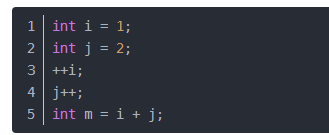
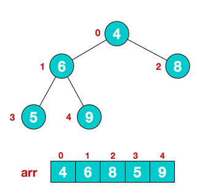

p1~p9

p50~p76

p107~p111

p91~p94

# 第 一 章 数据结构与算法的概述

## 1.1 数据结构与算法的重要性

- **算法是程序的灵魂**，优秀的程序可以在海量数据计算时，依然保持高速计算
- 一般来讲 程序会使用了内存计算框架(比如Spark)和缓存技术(比如Redis等)来优化程序,再深入的思考一下，这些计算框架和缓存技术， 它的核心功能是哪个部分呢？
- 拿实际工作经历来说, 在Unix下开发服务器程序，功能是要支持上千万人同时在线， 在上线前，做内测，一切OK,可上线后，服务器就支撑不住了, 公司的CTO对代码进行优化，再次上线，坚如磐石。你就能感受到程序是有灵魂的，就是算法。
- 目前程序员面试的门槛越来越高，**很多一线IT公司(大厂)，都会有数据结构和算法面试题**
- 如果你不想永远都是代码工人,那就花时间来研究下数据结构和算法

## 1.2 数据结构与算法的关系

- 数据data结构(structure)是一门**研究组织数据方式**的学科，有了编程语言也就有了数据结构.学好数据结构可以编写出更加漂亮,更加有效率的代码
- 要学习好数据结构就要多多考虑如何将生活中遇到的问题,用程序去实现解决
- **程序 = 数据结构 + 算法**
- **数据结构是算法的基础**, 换言之，要想学好算法，需要把数据结构学到位

## 1.3 线性结构和非线性结构

数据结构包括：**线性结构**和**非线性结构**。

**线性结构**

- 线性结构作为最常用的数据结构，其特点是数据元素之间存在一对一的线性关系
- 线性结构有两种不同的存储结构，即顺序存储结构和链式存储结构。顺序存储的线性表称为顺序表，顺序表中的存储元素是连续的
- 链式存储的线性表称为链表，链表中的存储元素不一定是连续的，元素节点中存放数据元素以及相邻元素的地址信息
- 线性结构常见的有：**数组、队列、链表和栈**，后面我们会详细讲解.

**非线性结构**

非线性结构包括：**二维数组，多维数组，广义表，树结构，图**结构

# 第 二 章 稀疏数组和队列

## 2.1 稀疏数组

### 2.1.1 基本介绍

> 当一个数组中大部分元素为０，或者为同一个值的数组时，可以使用稀疏数组来保存该数组

稀疏数组的处理方法是:

1)记录数组一共有几行几列，有多少个不同的值

2)把具有不同值的元素的行列及值记录在一个小规模的数组中，从而缩小程序的规模

### 2.1.2 需求举例

编写的五子棋程序中，有**存盘退出**和续上盘的功能


> 因为该二维数组的很多值是默认值0, 因此记录了很多没有意义的数据.所以用稀疏数组压缩存储 

**需求**：

1)使用稀疏数组，来保留类似前面的二维数组(棋盘、地图等等)

2)把稀疏数组存盘，并且可以从新恢复原来的二维数组数

**思路**


**二维数组 转 稀疏数组的思路**

- 遍历原始的二维数组，得到有效数据的个数 sum
- 根据sum 就可以创建 稀疏数组 sparseArr  int[sum + 1] [3]
- 将二维数组的有效数据数据存入到 稀疏数组

**稀疏数组转原始的二维数组的思路**

- 先读取稀疏数组的第一行，根据第一行的数据，创建原始的二维数组，比如上面的 chessArr2 = int [11][11]

- 在读取稀疏数组后几行的数据，并赋给 原始的二维数组 即可.

### 2.1.3 代码实现

```java
/**
 * @author cVzhanshi
 * @create 2021-07-15 20:55
 */
public class SparseArray {
    public static void main(String[] args) {
        // 创建一个原始的二维数组 11 * 11
        // 0: 表示没有棋子， 1 表示 黑子 2 表蓝子
        int chessArr1[][] = new int[11][11];
        chessArr1[1][2] = 1;
        chessArr1[2][3] = 2;
        chessArr1[2][4] = 2;

        //输出原始的二维数组
        System.out.println("原始的二维数组~~");
        for (int[] row : chessArr1) {
            for (int data : row) {
                System.out.print(data + "\t");
            }
            System.out.println();
        }

        // 将二维数组 转 稀疏数组的思路
        // 1. 先遍历二维数组 得到非0数据的个数
        int sum = 0;
        for (int i = 0; i < 11; i++) {
            for (int j = 0; j < 11; j++) {
                if (chessArr1[i][j] != 0) {
                    sum++;
                }
            }
        }

        // 2. 创建对应的稀疏数组
        int sparseArr[][] = new int[sum + 1][3];
        // 给稀疏数组赋值
        sparseArr[0][0] = 11;
        sparseArr[0][1] = 11;
        sparseArr[0][2] = sum;

        // 遍历二维数组，将非0的值存放到 sparseArr中
        int count = 0; //count 用于记录是第几个非0数据
        for (int i = 0; i < 11; i++) {
            for (int j = 0; j < 11; j++) {
                if (chessArr1[i][j] != 0) {
                    count++;
                    sparseArr[count][0] = i;
                    sparseArr[count][1] = j;
                    sparseArr[count][2] = chessArr1[i][j];
                }
            }
        }

        // 输出稀疏数组的形式
        System.out.println();
        System.out.println("得到稀疏数组为~~~~");
        for (int i = 0; i < sparseArr.length; i++) {
            System.out.printf("%d\t%d\t%d\t\n", sparseArr[i][0], sparseArr[i][1], sparseArr[i][2]);
        }
        System.out.println();

        //将稀疏数组 --》 恢复成 原始的二维数组
        /*
		 *  1. 先读取稀疏数组的第一行，根据第一行的数据，创建原始的二维数组，比如上面的  chessArr2 = int [11][11]
			2. 在读取稀疏数组后几行的数据，并赋给 原始的二维数组 即可.
		 */

        //1. 先读取稀疏数组的第一行，根据第一行的数据，创建原始的二维数组

        int chessArr2[][] = new int[sparseArr[0][0]][sparseArr[0][1]];

        //2. 在读取稀疏数组后几行的数据(从第二行开始)，并赋给 原始的二维数组 即可

        for(int i = 1; i < sparseArr.length; i++) {
            chessArr2[sparseArr[i][0]][sparseArr[i][1]] = sparseArr[i][2];
        }

        // 输出恢复后的二维数组
        System.out.println();
        System.out.println("恢复后的二维数组");

        for (int[] row : chessArr2) {
            for (int data : row) {
                System.out.printf("%d\t", data);
            }
            System.out.println();
        }
    }
}
```

# 第 六 章 排序算法

## 6.1 排序算法的介绍和分类

> **排序算法的介绍**

排序也称排序算法 (Sort Algorithm)，排序是将一 组数据，依指定的顺序进行排列的过程

> 排序算法的分类

- 内部排序：指将需要处理的所有数据都加载到内部存储器中进行排序。
- 外部排序法：数据量过大，无法全部加载到内存中，需要借助外部存储进行排序。

常见的排序算法分类


## 6.2 算法的时间复杂度

> 计算时间复杂度的方法

计算时间复杂度的方法：

- 用常数1代替运行时间中的所有加法常数 T(n)=n²+7n+6 => T(n)=n²+7n+1
- 修改后的运行次数函数中，只保留最高阶项 T(n)=n²+7n+1 => T(n) = n²
- 去除最高阶项的系数 T(n) = n² => T(n) = n² => O(n²)

**可以忽略常数项、忽略低次项、忽略系数**

> 常见的时间复杂度

- 常数阶O(1)

  无论代码执行了多少行，只要是没有循环等复杂结构，那这个代码的时间复杂度就都是O(1)

  

- 对数阶O(log2n)

  

  **说明**：在while循环里面，每次都将 i 乘以 2，乘完之后，i 距离 n 就越来越近了。假设循环x次之后，i 就大于 2 了，此时这个循环就退出了，也就是说 2 的 x 次方等于 n，那么 x = **log2n**也就是说当循环 **log2n** 次以后，这个代码就结束了。因此这个代码的时间复杂度为：O(**log2n**) 。 O(**log2n**) 的这个2 时间上是根据代码变化的，i = i * 3 ，则是 O(**log3n**)

- 线性阶O(n)

  

  for循环里面的代码会执行n遍，因此它消耗的时间是随着n的变化而变化的，因此这类代码都可以用O(n)来表示它的时间复杂度

- 线性对数阶O(nlog2n)

  

  线性对数阶O(nlogN) 其实非常容易理解，将时间复杂度为O(logn)的代码循环N遍的话，那么它的时间复杂度就是 n * O(logN)，也就是了O(nlogN)

- 平方阶O(n^2)^

- 立方阶O(n^3)^

- k次方阶O(n^k)^

- 指数阶O(2^n)

常见的算法时间复杂度由小到大依次为：Ο(1)＜Ο(log2n)＜Ο(n)＜Ο(nlog2n)＜Ο(n2)＜Ο(n3)＜Ο(n^k)＜Ο(2n) < Ο(n!)，随着问题规模n的不断增大，上述时间复杂度不断增大，算法的执行效率越低

## 6.3 冒泡排序

> 冒泡排序基本介绍

- 冒泡排序（Bubble Sorting）的基本思想是：通过对待排序序列从前向后（从下标较小的元素开始）,**依次比较相邻元素的值，若发现逆序则交换**，使值较大的元素逐渐从前移向后部，就象水底下的气泡一样逐渐向上冒
- 因为排序的过程中，各元素不断接近自己的位置，**如果一趟比较下来没有进行过交换，就说明序列有序**，因此要在排序过程中设置一个标志flag判断元素是进行过交换。从而减少不必要的比较

> 冒泡排序图解


-----


**冒泡排序规则小结**：

- 一共进行数组的大小-1次大的循环
- 每一趟排序的次数在逐渐的减少
- 如果我们发现在某躺排序中，没有发生一次交换，可以提前结束冒泡排序

> 代码实现

初始版

```java
/**冒泡排序
 * @author cVzhanshi
 * @create 2021-11-12 16:41
 */
public class BubbleSort {
    public static void main(String[] args) {
        int[] data = { 9, -16, 21, 23, -30, -49, 21, 30, 30 };
        System.out.println("排序之前：\n" + Arrays.toString(data));
        //selectSort(data,data.length);
        bubbleSort(data,data.length);
        System.out.println("排序之后：\n" + Arrays.toString(data));
    }

    private static void bubbleSort(int[] data,int len){
        for(int i = 0;i < len - 1;i++){
            for(int j = 0;j<len - 1 - i;j++){
                if(data[j] > data[j+1]){
                    int temp  = data[j];
                    data[j] = data[j + 1];
                    data[j + 1] = temp;
                }
            }
        }
    }
}
```

优化版

```java
/**冒泡排序
 * @author cVzhanshi
 * @create 2021-11-12 16:41
 */
public class BubbleSort {
    public static void main(String[] args) {
        int[] data = { 9, -16, 21, 23, -30, -49, 21, 30, 30 };
        System.out.println("排序之前：\n" + Arrays.toString(data));
        //selectSort(data,data.length);
        bubbleSort(data,data.length);
        System.out.println("排序之后：\n" + Arrays.toString(data));
    }

    private static void bubbleSort(int[] data,int len){

        boolean flag = false;  // 标识变量，表示一躺排序是否进行交换
        for(int i = 0;i < len - 1;i++){
            for(int j = 0;j<len - 1 - i;j++){
                if(data[j] > data[j+1]){
                    flag = true;
                    int temp  = data[j];
                    data[j] = data[j + 1];
                    data[j + 1] = temp;
                }
            }
            if(!flag){
                break;
            }else{
                flag = false; // 重置flag ！！ 进行下一趟排序
            }
        }
    }
}
```

## 6.4 选择排序

> 选择排序基本介绍

选择式排序也属于内部排序法，是从欲排序的数据中，按指定的规则选出某一元素，再依规定交换位置后达到排序的目的

> **选择排序思想**

选择排序（select sorting）也是一种简单的排序方法。它的**基本思想**是：第一次从arr[0]-arr[n-1]中选取最小值，与arr[0]交换，第二次从arr[1]-arr[n-1]中选取最小值，与arr[1]交换，第三次从arr[2]-arr[n-1]中选取最小值，与arr[2]交换，…，第i次从arr[i-1]~arr[n-1]中选取最小值，与arr[i-1]交换，…, 第n-1次从arr[n-2]~arr[n-1]中选取最小值，与arr[n-2]交换，总共通过n-1次，得到一个按排序码从小到大排列的有序序列
> 图解选择排序


> 代码实现

普通版

```java
/**
 * 简单选择排序
 * @author cVzhanshi
 * @create 2021-11-04 15:39
 */
public class SelectSort {
    public static void main(String[] args) {
        int[] data = { 9, -16, 21, 23, -30, -49, 21, 30, 30 };
        System.out.println("排序之前：\n" + Arrays.toString(data));
        //selectSort(data,data.length);
        selectSort2(data,data.length);
        System.out.println("排序之后：\n" + Arrays.toString(data));
    }

    private static void selectSort(int[] data, int length) {
        if(length == 0 || length == 1){
            return;
        }
        for(int i = 0; i < length - 1 ;i++){
            int index = i;
            for(int j = i + 1;j < length;j++){
                if(data[index] >= data[j]){
                    index = j;
                }
            }
            if(index != i){
                int temp = data[i];
                data[i] = data[index];
                data[index] = temp;
            }
        }
    }
}
```

优化版

```java
/**
 * 二元选择排序
 * @author cVzhanshi
 * @create 2021-11-04 15:39
 */
public class SelectSort {
    public static void main(String[] args) {
        int[] data = { 9, -16, 21, 23, -30, -49, 21, 30, 30 };
        System.out.println("排序之前：\n" + Arrays.toString(data));
        //selectSort(data,data.length);
        selectSort2(data,data.length);
        System.out.println("排序之后：\n" + Arrays.toString(data));
    }
    /**
     * 二元选择排序
     * 每趟循环确定两个元素（当前趟最大和最小记录）的位置,从而减少排序所需的循环次数。改进后对n个数据进行排序，最多只需进行[n/2]趟循环即可
     * @param a
     * @param len
     */
    private static void selectSort2(int a[],int len) {
        int i,j,min,max,tmp;
        for(i=0; i<len/2; i++){  // 做不超过n/2趟选择排序
            min = max = i;
            for(j=i+1; j<=len-1-i; j++){
                //分别记录最大和最小关键字记录位置
                if(a[j] > a[max]){
                    max = j;
                    continue;
                }
                if(a[j] < a[min]){
                    min = j;
                }
            }
            //该交换操作还可分情况讨论以提高效率
            if(min != i){//当第一个为min值，不用交换
                tmp=a[min];  a[min]=a[i];  a[i]=tmp;
            }
            if(max == len-1-i && min == i)//当第一个为min值，同时最后一个为max值，不再需要下面操作
                continue;
            if(max == i)//当第一个为max值，则交换后min的位置为max值
                max = min;
            if(max != len-1-i){//当最后一个为max值，不用交换
                tmp=a[max];  a[max]=a[len-1-i];  a[len-1-i]=tmp;
            }
        }
    }
}
```
## 6.5 插入排序

> 插入排序介绍

插入式排序属于内部排序法，是对于欲排序的元素以插入的方式找寻该元素的适当位置，以达到排序的目的

> 插入排序思想

插入排序（Insertion Sorting）的**基本思想**是：把n个待排序的元素看成为一个有序表和一个无序表，开始时有序表中只包含一个元素，无序表中包含有n-1个元素，排序过程中每次从无序表中取出第一个元素，把它的排序码依次与有序表元素的排序码进行比较，将它插入到有序表中的适当位置，使之成为新的有序表。

> 插入排序图解


-----

> 代码实现

```java
/**
 * 直接插入排序  时间复杂度：O（n^2）
 * @author cVzhanshi
 * @create 2021-11-03 17:32
 */
public class InsertSort {
    public static void insertSort(int[] data){
        if(data.length == 0 || data.length == 1)
            return;
        int length = data.length;
        for(int i = 1;i < length; i++){
            int temp = data[i];
            if(data[i] < data[i - 1]){
                int j = i - 1;
                for(;j >= 0 && data[j] > temp; j--){
                    data[j + 1] = data[j];
                }
                data[j + 1] = temp;
            }
            System.out.println(Arrays.toString(data));
        }
    }
    public static void main(String[] args) {
        int[] data = { 9, -16, 21, 23, -30, -49, 21, 30, 30 };
        System.out.println("排序之前：\n" + Arrays.toString(data));
        insertSort(data);
        System.out.println("排序之后：\n" + Arrays.toString(data));
    }
}
```

## 6.6 希尔排序

小结插入排序：**当需要插入的数是较小的数时，后移的次数明显增多，对效率有影响**

> 希尔排序介绍

希尔排序是希尔（Donald Shell）于1959年提出的一种排序算法。希尔排序也是一种**插入排序**，它是简单插入排序经过改进之后的一个**更高效的版本**，也称为缩小增量排序

>  希尔排序基本思想

希尔排序是把记录按下标的一定增量分组，对每组使用直接插入排序算法排序；随着增量逐渐减少，每组包含的关键词越来越多，当增量减至1时，整个文件恰被分成一组，算法便终止

> 图解希尔排序


> 代码实现

```java
/**
 * 希尔排序（插入排序）
 * @author cVzhanshi
 * @create 2021-11-04 14:42
 */
public class ShellSort {

    /**
     * 移动法
     * @param data 待排序数组
     * @param len    数组长度
     * @param incr 增量
     */
    public static void ShellInsertSort(int[] data,int len,int incr){

        for(int i = incr;i < len;i++){
            int temp = data[i];
            if(data[i] < data[i - incr]){
                int j = i - incr;
                for(;j>=0 && data[j] > temp;j-=incr){
                    data[j + incr] = data[j];
                }
                data[j + incr] = temp;
            }
        }
    }

    /**
     * 交换法
     * @param data 待排序数组
     * @param len    数组长度
     * @param incr 增量
     */
    public static void ShellInsertSortSwap(int[] data,int len,int incr){
        int temp = 0;
        for(int i = incr;i < len;i++){
            int j = i - incr;
            for(;j>=0 ;j-=incr){
                // 如果当前元素大于加上步长后的那个元素，说明交换
                if(data[j] > data[j + incr]){
                    temp = data[j];
                    data[j] = data[j + incr];
                    data[j + incr] = temp;
                }
            }
        }
    }

    public static void ShellSort(int[] data,int len){
        int incr = len/2;
        while (incr >= 1){
            ShellInsertSortSwap(data,len,incr);
            incr /= 2;
        }
    }


    public static void main(String[] args) {
        int[] data = { 9, -16, 21, 23, -30, -49, 21, 30, 30 };
        System.out.println("排序之前：\n" + Arrays.toString(data));
        ShellSort(data,data.length);
        System.out.println("排序之后：\n" + Arrays.toString(data));
    }
}
```

## 6.7 快速排序

> 快速排序介绍

快速排序（Quicksort）是对冒泡排序的一种改进。基本思想是：通过一趟排序将要排序的数据分割成独立的两部分，其中一部分的所有数据都比另外一部分的所有数据都要小，然后再按此方法对这两部分数据分别进行快速排序，整个排序过程可以递归进行，以此达到整个数据变成有序序列

> 快速排序图解


> 代码实现

```java
/**
 * 快速排序
 * @author cVzhanshi
 * @create 2021-11-12 17:02
 */
public class QuickSort {
    private static void swap(int[] data, int i, int j) {
        int temp = data[i];
        data[i] = data[j];
        data[j] = temp;
    }
    private static void subSort(int[] data, int start, int end) {
        if(start < end){
            int base = data[start];
            int i = start;
            int j = end + 1;
            while (true){
                while (i < end && data[++i] <= base);
                while (j > start && data[--j] >= base);
                if(i < j){
                    swap(data , i , j);
                }else{
                    break;
                }
            }
            swap(data ,start,j);
            subSort(data,start,j-1);
            subSort(data,j+1,end);
        }
    }
    public static void quickSort(int[] data){
        subSort(data,0,data.length-1);
    }

    public static void main(String[] args) {
        int[] data = { 9, -16, 21, 23, -30, -49, 21, 30, 30 };
        System.out.println("排序之前：\n" + Arrays.toString(data));
        //selectSort(data,data.length);
        quickSort(data);
        System.out.println("排序之后：\n" + Arrays.toString(data));
    }
}
```

## 6.8 归并排序

> 归并排序介绍

归并排序（MERGE-SORT）是利用归并的思想实现的排序方法，该算法采用经典的分治（divide-and-conquer）策略（分治法将问题分(divide)成一些小的问题然后递归求解，而治(conquer)的阶段则将分的阶段得到的各答案"修补"在一起，即分而治之)

> 归并排序图解


可以看到这种结构很像一棵完全二叉树，本文的归并排序我们采用递归去实现（也可采用迭代的方式去实现）。分阶段可以理解为就是递归拆分子序列的过程

-----

再来看看**治**阶段，我们需要将两个已经有序的子序列合并成一个有序序列，比如上图中的最后一次合并，要将[4,5,7,8]和[1,2,3,6]两个已经有序的子序列，合并为最终序列[1,2,3,4,5,6,7,8]，来看下实现步骤


> 代码实现

```java
/**
 * @author cVzhanshi
 * @create 2021-11-15 20:00
 */
public class MergeSort {

    public static void mergeSort(int[] data){
        sort(data,0,data.length - 1);
    }

    // 将索引从left到right范围的数组元素进行归并排序
    public static void sort(int[] data,int left,int right){
        if(left < right){
            // 找出中间索引
            int center = (left + right) / 2;
            sort(data, left , center);
            sort(data,center + 1,right);
            // 合并
            merge(data,left , center , right);
        }
    }

    // 将两个数组进行归并，归并前两个数组已经有序，归并后依然有序
    public static void merge(int[] data,int left,int center,int right){
        int[] tempArr = new int[data.length];
        int mid = center + 1;
        int third = left;
        int temp = left;
        while (left <= center && mid <= right) {
            if(data[left] <= data[mid]){
                tempArr[third++] = data[left++];
            }else {
                tempArr[third++] = data[mid++];
            }
        }
        while (left <= center){
            tempArr[third++] = data[left++];
        }
        while (mid <= left) {
            tempArr[third++] = data[mid++];
        }
        while (temp <= right){
            data[temp] = tempArr[temp++];
        }
    }
    public static void main(String[] args) {
        int[] data = { 9, -16, 21, 23, -30, -49, 21, 30, 30 };
        System.out.println("排序之前：\n" + Arrays.toString(data));
        //selectSort(data,data.length);
        mergeSort(data);
        System.out.println("排序之后：\n" + Arrays.toString(data));
    }
}
```


## 6.9 基数排序

### 6.9.1 基数排序介绍

> 基数排序的介绍

- 基数排序（radix sort）属于“分配式排序”（distribution sort），又称“桶子法”（bucket sort）或bin sort，顾名思义，它是通过键值的各个位的值，将要排序的元素分配至某些“桶”中，达到排序的作用
- 基数排序法是属于稳定性的排序，基数排序法的是效率高的**稳定性排序法**
- 基数排序(Radix Sort)是**[桶排序](http://www.cnblogs.com/skywang12345/p/3602737.html)**的扩展
- 基数排序是1887年赫尔曼·何乐礼发明的。它是这样实现的：将整数按位数切割成不同的数字，然后按每个位数分别比较

> **基数排序基本思想**

- 将所有待比较数值统一为同样的数位长度，数位较短的数前面补零。然后，从最低位开始，依次进行一次排序。这样从最低位排序一直到最高位排序完成以后, 数列就变成一个有序序列
- **负数解决思想：** 将负数转换成0或正数，对所有数据同时加上最小值的绝对值


### 6.9.2 基数排序图解

第一轮排序


第二轮排序


第三轮排序


### 6.9.3 代码实现

将数组 {53, 3, 542, 748, 14, 214} 使用基数排序, 进行升序排序

> 初始版

```java
/**
 * 基数排序
 * @author cVzhanshi
 * @create 2021-11-16 17:12
 */
public class RadixSort {
    public static void main(String[] args) {
        int data[] = { 53, 3, 542, 748, 14, 214};
        System.out.println("排序之前：\n" + Arrays.toString(data));
        radixSort(data);
        System.out.println("排序之后：\n" + Arrays.toString(data));
    }

    private static void radixSort(int[] data) {
        //定义一个二维数组，表示10个桶, 每个桶就是一个一维数组
        //说明
        //1. 二维数组包含10个一维数组
        //2. 为了防止在放入数的时候，数据溢出，则每个一维数组(桶)，大小定为arr.length
        //3. 基数排序是使用空间换时间的经典算法
        int[][] bucket = new int[10][data.length];
        //为了记录每个桶中，实际存放了多少个数据,我们定义一个一维数组来记录各个桶的每次放入的数据个数
        //可以这样理解
        //比如：bucketElementCounts[0] , 记录的就是  bucket[0] 桶的放入数据个数
        int[] bucketElementCounts = new int[10];

        // 第一轮（针对每个元素的个位进行排序处理）
        for(int j = 0;j < data.length;j++ ){
            // 取出每个元素的个位的值
            int digitOfElement = data[j] % 10;
            // 放入到对应的桶中
            bucket[digitOfElement][bucketElementCounts[digitOfElement]] = data[j];
            bucketElementCounts[digitOfElement]++;
        }
        //按照这个桶的顺序(一维数组的下标依次取出数据，放入原来数组)
        int index = 0;
        //遍历每一桶，并将桶中是数据，放入到原数组
        for(int k = 0;k < bucketElementCounts.length;k++){
            if(bucketElementCounts[k] != 0){
                for(int l = 0;l < bucketElementCounts[k];l++){
                    //取出元素放入到data
                    data[index++] = bucket[k][l];
                }
            }
            //第l轮处理后，需要将每个 bucketElementCounts[k] = 0 ！！！！ 不然下一轮会出错
            bucketElementCounts[k] = 0;
        }
        System.out.println("第1轮，对个位的排序处理 data =" + Arrays.toString(data));


        // ==================================
        // 第二轮（针对每个元素的十位进行排序处理）
        for(int j = 0;j < data.length;j++ ){
            // 取出每个元素的个位的值
            int digitOfElement = data[j] / 10 % 10;
            // 放入到对应的桶中
            bucket[digitOfElement][bucketElementCounts[digitOfElement]] = data[j];
            bucketElementCounts[digitOfElement]++;
        }
        //按照这个桶的顺序(一维数组的下标依次取出数据，放入原来数组)
        index = 0;
        //遍历每一桶，并将桶中是数据，放入到原数组
        for(int k = 0;k < bucketElementCounts.length;k++){
            if(bucketElementCounts[k] != 0){
                for(int l = 0;l < bucketElementCounts[k];l++){
                    //取出元素放入到data
                    data[index++] = bucket[k][l];
                }
            }
            //第l轮处理后，需要将每个 bucketElementCounts[k] = 0 ！！！！ 不然下一轮会出错
            bucketElementCounts[k] = 0;
        }

        System.out.println("第2轮，对个位的排序处理 data =" + Arrays.toString(data));


        // ==================================
        // 第三轮（针对每个元素的百位进行排序处理）
        for(int j = 0;j < data.length;j++ ){
            // 取出每个元素的个位的值
            int digitOfElement = data[j] / 100 % 10;
            // 放入到对应的桶中
            bucket[digitOfElement][bucketElementCounts[digitOfElement]] = data[j];
            bucketElementCounts[digitOfElement]++;
        }
        //按照这个桶的顺序(一维数组的下标依次取出数据，放入原来数组)
        index = 0;
        //遍历每一桶，并将桶中是数据，放入到原数组
        for(int k = 0;k < bucketElementCounts.length;k++){
            if(bucketElementCounts[k] != 0){
                for(int l = 0;l < bucketElementCounts[k];l++){
                    //取出元素放入到data
                    data[index++] = bucket[k][l];
                }
            }
            //第l轮处理后，需要将每个 bucketElementCounts[k] = 0 ！！！！ 不然下一轮会出错
            bucketElementCounts[k] = 0;
        }

        System.out.println("第3轮，对个位的排序处理 data =" + Arrays.toString(data));
    }
}
```


结果和图解相对应

> 最终的基数排序代码（使用循环）

```java
/**
 * 基数排序
 * @author cVzhanshi
 * @create 2021-11-16 17:12
 */
public class RadixSort {
    public static void main(String[] args) {
        int data[] = { 53, 3, 542, 748, 14, 214};
        System.out.println("排序之前：\n" + Arrays.toString(data));
        radixSort(data);
        System.out.println("排序之后：\n" + Arrays.toString(data));
    }

    private static void radixSort(int[] data) {

        //1. 得到数组中最大的数的位数
        int max = data[0]; //假设第一数就是最大数
        for(int i = 1; i < data.length; i++) {
            if (data[i] > max) {
                max = data[i];
            }
        }
        //得到最大数是几位数
        int maxLength = (max + "").length();

        //定义一个二维数组，表示10个桶, 每个桶就是一个一维数组
        //说明
        //1. 二维数组包含10个一维数组
        //2. 为了防止在放入数的时候，数据溢出，则每个一维数组(桶)，大小定为arr.length
        //3. 基数排序是使用空间换时间的经典算法
        int[][] bucket = new int[10][data.length];
        //为了记录每个桶中，实际存放了多少个数据,我们定义一个一维数组来记录各个桶的每次放入的数据个数
        //可以这样理解
        //比如：bucketElementCounts[0] , 记录的就是  bucket[0] 桶的放入数据个数
        int[] bucketElementCounts = new int[10];

        for(int i = 0 ,n = 1 ;i < maxLength;i++,n *= 10 ){
            // 第i轮 (针对每个元素的对应位进行排序处理)， 第一次是个位，第二次是十位，第三次是百位..）
            for(int j = 0;j < data.length;j++){
                // 取出每个元素的个位的值
                int digitOfElement = data[j] / n % 10;
                // 放入到对应的桶中
                bucket[digitOfElement][bucketElementCounts[digitOfElement]] = data[j];
                bucketElementCounts[digitOfElement]++;
            }
            //按照这个桶的顺序(一维数组的下标依次取出数据，放入原来数组)
            int index = 0;
            //遍历每一桶，并将桶中是数据，放入到原数组
            for(int k = 0;k < bucketElementCounts.length;k++){
                if(bucketElementCounts[k] != 0){
                    for(int l = 0;l < bucketElementCounts[k];l++){
                        //取出元素放入到data
                        data[index++] = bucket[k][l];
                    }
                }
                //第l轮处理后，需要将每个 bucketElementCounts[k] = 0 ！！！！ 不然下一轮会出错
                bucketElementCounts[k] = 0;
            }
            System.out.println("第"+ (i + 1) + "轮，对个位的排序处理 data =" + Arrays.toString(data));
        }
    }
}
```

> 注意事项

- 基数排序是对传统桶排序的扩展，速度很快.
- 基数排序是经典的空间换时间的方式，占用内存很大, 当对海量数据排序时，容易造成 OutOfMemoryError 。
- **基数排序是稳定**的。[注:假定在待排序的记录序列中，存在多个具有相同的关键字的记录，若经过排序，这些记录的相对次序保持不变，即在原序列中，r[i]=r[j]，且r[i]在r[j]之前，而在排序后的序列中，r[i]仍在r[j]之前，**则称这种排序算法是稳定的；否则称为不稳定的**]

## 6.10 常用排序算法总结与对比


- **稳定**：如果a原本在b前面，而a=b，排序之后a仍然在b的前面；
- **不稳定**：如果a原本在b的前面，而a=b，排序之后a可能会出现在b的后面；
- **内排序**：所有排序操作都在内存中完成；
- **外排序**：由于数据太大，因此把数据放在磁盘中，而排序通过磁盘和内存的数据传输才能进行；
- **时间复杂度：** 一个算法执行所耗费的时间。
- **空间复杂度**：运行完一个程序所需内存的大小。
- **n:** 数据规模
- **k:** “桶”的个数
- **In-place:**  不占用额外内存
- **Out-place:** 占用额外内存

# 第 七 章 查找算法

# 第 九 章 树结构的基础部分

## 9.1 二叉树

### 9.1.1 为什么需要树这种数据结构

> 数组存储方式的分析

**优点**：通过下标方式访问元素，速度快。**对于有序数组**，还可使用**二分查找**提高检索速度。
**缺点**：如果要检索具体某个值，或者插入值(按一定顺序)**会整体移动**，效率较低


> 链表存储方式的分析

**优点**：在一定程度上对数组存储方式有优化(比如：插入一个数值节点，只需要将插入节点，链接到链表中即可， 删除效率也很好)。
**缺点**：在进行检索时，效率仍然较低，比如(检索某个值，需要从头节点开始遍历) 


> 树存储方式的分析

能提高数据**存储，读取**的效率, 比如利用 **二叉排序树**(Binary Sort Tree)，既可以保证数据的检索速度，同时也可以保证数据的插入，删除，修改的速度


### 9.1.2 二叉树的概念

- 树有很多种，每个节点**最多只能有两个子节点**的一种形式称为二叉树。
- 二叉树的子节点分为左节点和右节点。


- 如果该二叉树的**所有叶子节点都在最后一层**，并且结点总数= 2^n -1 , n 为层数，则我们称为满二叉树。
- 如果该二叉树的所有叶子节点都在最后一层或者倒数第二层，而且最后一层的叶子节点在左边连续，倒数第二层的叶子节点在右边连续，我们称为完全二叉树


> 树的常用术语


### 9.1.3 二叉树的遍历

> 说明

前序遍历: **先输出父节点**，再遍历左子树和右子树

中序遍历: 先遍历左子树，**再输出父节点**，再遍历右子树

后序遍历: 先遍历左子树，再遍历右子树，**最后输出父节点**

**小结**: 看输出父节点的顺序，就确定是前序，中序还是后序

示例：


前序遍历：1-2-3-5-4

中序遍历：2-1-5-3-4

后序遍历：2-5-4-3-1

> 代码实现

```java
/**
 * @author cVzhanshi
 * @create 2022-01-07 22:49
 */
public class BinaryTreeDemo {
    public static void main(String[] args) {
        //先需要创建一颗二叉树
        BinaryTree binaryTree = new BinaryTree();
        //创建需要的结点
        HeroNode root = new HeroNode(1, "宋江");
        HeroNode node2 = new HeroNode(2, "吴用");
        HeroNode node3 = new HeroNode(3, "卢俊义");
        HeroNode node4 = new HeroNode(4, "林冲");
        HeroNode node5 = new HeroNode(5, "关胜");

        //说明，我们先手动创建该二叉树，后面我们学习递归的方式创建二叉树
        root.setLeft(node2);
        root.setRight(node3);
        node3.setRight(node4);
        node3.setLeft(node5);
        binaryTree.setRoot(root);

        //测试
		System.out.println("前序遍历"); // 1,2,3,5,4
		binaryTree.preOrder();

        //测试
		System.out.println("中序遍历");
		binaryTree.infixOrder(); // 2,1,5,3,4

		System.out.println("后序遍历");
		binaryTree.postOrder(); // 2,5,4,3,1
    }
}


class BinaryTree{
    private HeroNode root;
    
    public void setRoot(HeroNode root) {
        this.root = root;
    }

    //前序遍历
    public void preOrder() {
        if(this.root != null) {
            this.root.preOrder();
        }else {
            System.out.println("二叉树为空，无法遍历");
        }
    }

    //中序遍历
    public void infixOrder() {
        if(this.root != null) {
            this.root.infixOrder();
        }else {
            System.out.println("二叉树为空，无法遍历");
        }
    }
    //后序遍历
    public void postOrder() {
        if(this.root != null) {
            this.root.postOrder();
        }else {
            System.out.println("二叉树为空，无法遍历");
        }
    }
}

class HeroNode{
    private int no;
    private String name;
    private HeroNode left;
    private HeroNode right;

    public HeroNode(int no, String name) {
        this.no = no;
        this.name = name;
    }

    public int getNo() {
        return no;
    }

    public void setNo(int no) {
        this.no = no;
    }

    public String getName() {
        return name;
    }

    public void setName(String name) {
        this.name = name;
    }

    public HeroNode getLeft() {
        return left;
    }

    public void setLeft(HeroNode left) {
        this.left = left;
    }

    public HeroNode getRight() {
        return right;
    }

    public void setRight(HeroNode right) {
        this.right = right;
    }

    @Override
    public String toString() {
        return "HeroNode{" +
                "no=" + no +
                ", name='" + name + '\'' +
                '}';
    }

    //编写前序遍历的方法
    public void preOrder() {
        System.out.println(this); //先输出父结点
        //递归向左子树前序遍历
        if(this.left != null) {
            this.left.preOrder();
        }
        //递归向右子树前序遍历
        if(this.right != null) {
            this.right.preOrder();
        }
    }

    //中序遍历
    public void infixOrder() {

        //递归向左子树中序遍历
        if(this.left != null) {
            this.left.infixOrder();
        }
        //输出父结点
        System.out.println(this);
        //递归向右子树中序遍历
        if(this.right != null) {
            this.right.infixOrder();
        }
    }

    //后序遍历
    public void postOrder() {
        if(this.left != null) {
            this.left.postOrder();
        }
        if(this.right != null) {
            this.right.postOrder();
        }
        System.out.println(this);
    }
}
```

运行结果


# 第 十 章 树结构实际应用

## 10.1 堆排序

### 10.1.1 堆排序基本介绍

> **堆排序基本介绍**

1. 堆排序是利用**堆**这种数据结构而设计的一种排序算法，堆排序是一种**选择排序，**它的最坏，最好，平均时间复杂度均为O(nlogn)，它也是不稳定排序。

2. 堆是具有以下性质的**完全二叉树**：每个结点的值都大于或等于其左右孩子结点的值，称为大顶堆, **注意** : **没有要求结点的左孩子的值和右孩子的值的大小关系**。

3. 每个结点的值都小于或等于其左右孩子结点的值，称为**小顶堆**

4. 大顶堆举例说明

   

   **大顶堆特点**：arr[i] >=arr[2\*i+1] && arr[i] >=arr[2\*i+2] //i 对应第几个节点，i从0开始编号

5. 小顶堆举例说明

   

   **小顶堆特点**：arr[i] <=arr[2\*i+1] && arr[i] <=arr[2\*i+2] //i 对应第几个节点，i从0开始编号

6. 一般**升序采用大顶堆**，**降序采用小顶堆** 

> **堆排序的基本思想**

- 将待排序序列构造成一个大顶堆
- 此时，整个序列的最大值就是堆顶的根节点。
- 将其与末尾元素进行交换，此时末尾就为最大值。
- 然后将剩余n-1个元素重新构造成一个堆，这样会得到n个元素的次小值。如此反复执行，便能得到一个有序序列了

### 10.1.2 图解堆排序

> **图解堆排序**

**步骤一 构造初始堆。将给定无序序列构造成一个大顶堆（一般升序采用大顶堆，降序采用小顶堆)。**

- 假设给定无序序列结构如下

  

- 此时我们从最后一个非叶子结点开始（叶结点自然不用调整，第一个非叶子结点 arr.length/2-1=5/2-1=1，也就是下面的6结点），从左至右，从下至上进行调整。

  

- 找到第二个非叶节点4，由于[4,9,8]中9元素最大，4和9交换。

  

- 这时，交换导致了子根[4,5,6]结构混乱，继续调整，[4,5,6]中6最大，交换4和6。

  

- 此时，我们就将一个无序序列构造成了一个大顶堆。

**步骤二 将堆顶元素与末尾元素进行交换，使末尾元素最大。然后继续调整堆，再将堆顶元素与末尾元素交换，得到第二大元素。如此反复进行交换、重建、交换。**

- 将堆顶元素9和末尾元素4进行交换

  

- 重新调整结构，使其继续满足堆定义

  

- 再将堆顶元素8与末尾元素5进行交换，得到第二大元素8

  

- 后续过程，继续进行调整，交换，如此反复进行，最终使得整个序列有序

  

> **小结堆排序的基本思路**

- **将无序序列构建成一个堆，根据升序降序需求选择大顶堆或小顶堆**
- **将堆顶元素与末尾元素交换，将最大元素"沉"到数组末端;**
- **重新调整结构，使其满足堆定义，然后继续交换堆顶元素与当前末尾元素，反复执行调整+交换步骤，直到整个序列有序。**

### 10.1.3 代码实现

```java
/**
 * @author cVzhanshi
 * @create 2021-11-16 11:28
 */
public class HeapSort {
    public static void main(String[] args) {
        int[] data = { 9, -16, 21, 23, -30, -49, 21, 30, 30 };
        System.out.println("排序之前：\n" + Arrays.toString(data));
        heapSort(data);
        System.out.println("排序之后：\n" + Arrays.toString(data));
    }

    // 编写一个堆排序的方法
    public static void heapSort(int[] data){
        int temp = 0;
        //将无序序列构建成一个堆，根据升序降序需求选择大顶堆或小顶堆
        for(int i = data.length / 2 - 1;i >= 0;i--){
            adjustHeap(data,i,data.length);
        }
        /**
		 * 2).将堆顶元素与末尾元素交换，将最大元素"沉"到数组末端;
　　	 	* 3).重新调整结构，使其满足堆定义，然后继续交换堆顶元素与当前末尾元素，反复执行调整+交换步骤，直到整个序列有序。
		 */

        for(int j = data.length-1;j > 0; j--) {
            //交换
            temp = data[j];
            data[j] = data[0];
            data[0] = temp;
            // 继续调整结构 为大顶堆 
            adjustHeap(data, 0, j);
        }
    }

    // 将一个数组(完全二叉树),调整成一个大顶堆

    /**
     * 功能：完成 将以i对应的非叶子节点的树调整成大顶堆
     * 举例  int arr[] = {4, 6, 8, 5, 9}; => i = 1 => adjustHeap => 得到 {4, 9, 8, 5, 6}
     * 如果我们再次调用  adjustHeap 传入的是 i = 0 => 得到 {4, 9, 8, 5, 6} => {9,6,8,5, 4}
     * @param data 待调整的数组
     * @param i 表示非叶子节点在数组中的索引
     * @param length 表示对多少个元素进行调整，length是在逐渐的减少
     */
    public static void adjustHeap(int[] data,int i,int length){
        // 先取出当前元素的值，保存在临时变量
        int temp = data[i];
        // 开始调整
        for(int k = i * 2 + 1;k < length; k = k * 2 + 1){
            if(k + 1 < length && data[k] < data[k + 1]){
                k++;
            }
            if(data[k] > temp){ //如果子结点大于父结点
                data[i] = data[k]; //把较大的值赋给当前结点
                i = k; //!!! i 指向 k,继续循环比较
            }else{
                break;
            }
        }
        //当for 循环结束后，我们已经将以i 为父结点的树的最大值，放在了 最顶(局部)
        data[i] = temp;//将temp值放到调整后的位置
    }
}
```

a
