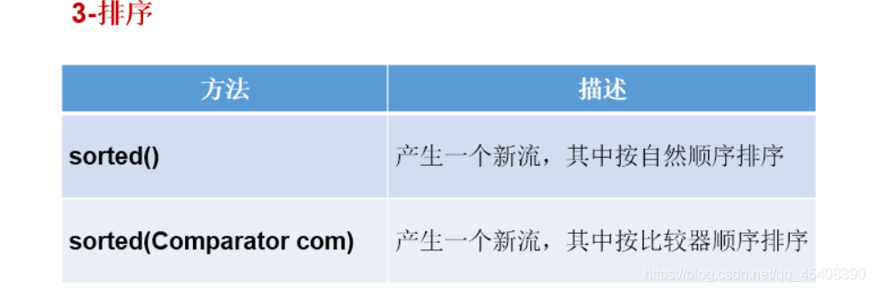

# 一、Java8新特性

## 概述


## ① 接口默认方法与静态方法

> 默认方法

Java 8 允许我们通过 `default` 关键字对接口中定义的抽象方法提供一个默认的实现。

默认方法使得开发者可以在不破坏二进制兼容性的前提下，往现存接口中添加新的方法，即不强制那些实现了该接口的类也同时实现这个新加的方法。

**默认方法和抽象方法之间的区别在于抽象方法需要实现，而默认方法不需要。接口提供的默认方法会被接口的实现类继承或者覆写。**

示例：

```java
/**
 * @author cVzhanshi
 * @create 2022-11-01 14:43
 */
public interface TestDefaultMethods {
    int getArg(int a);
	
    // 默认方法
    default double sqrt(double a){
        return Math.sqrt(a);
    }
}
```

接口中定义了一个抽象方法`getArg`，还定义了一个带有默认实现的方法 `sqrt`。那么我们在实现接口的时候可以只实现`getArg`方法，而不必强制实现默认方法 `sqrt` ，可以直接调用默认方法 `sqrt` 。

示例：

```java
/**
 * @author cVzhanshi
 * @create 2022-11-01 14:41
 */
public class TestJava8 {
    public static void main(String[] args) {
        TestDefaultMethods testDefaultMethods = new TestDefaultMethods() {
            @Override
            public int getArg(int a) {
                return a + 100;
            }
        };
        System.out.println(testDefaultMethods.getArg(100));   // 200
        System.out.println(testDefaultMethods.sqrt(100));     // 4.0
    }
}
```

 ==通过 default关键字这个新特性，可以非常方便地对之前的接口做拓展，而此接口的实现类不必做任何改动==

> 静态方法

代码示例：

```java
public interface DefaultFunctionTest {

    String getName();

    default String defaultFunction(){
        return "this is default function";
    }
}

class DefaultFunctionTestImpl implements DefaultFunctionTest{

    @Override
    public String getName() {
        return "cvzhanshi";
    }
}
interface DefaulableFactory {
    // Interfaces now allow static methods
    static DefaultFunctionTest create( Supplier<DefaultFunctionTest> supplier ) {
        return supplier.get();
    }
}
class DefaultFunctionTestImpl2 implements DefaultFunctionTest{

    @Override
    public String getName() {
        return "ursula";
    }

    @Override
    public String defaultFunction() {
        return "default function override";
    }

    public static void main(String[] args) {
        DefaultFunctionTest defaultFunctionTest = DefaulableFactory.create(DefaultFunctionTestImpl2::new);
        DefaultFunctionTest defaultFunctionTest1 = DefaulableFactory.create(DefaultFunctionTestImpl::new);
        System.out.println(defaultFunctionTest.getName());   //ursula
        System.out.println(defaultFunctionTest1.getName());  //cvzhanshi
    }
}
```

## ② Lambda表达式

### 2.1 Lambda表达式使用前后的对比

~~~java
//举例一：
@Test
public void test1(){

    Runnable r1 = new Runnable() {
        @Override
        public void run() {
            System.out.println("我爱北京天安门");
        }
    };

    r1.run();

    System.out.println("***********************");

    Runnable r2 = () -> System.out.println("我爱北京故宫");

    r2.run();
}

//举例二：
@Test
public void test2(){

    Comparator<Integer> com1 = new Comparator<Integer>() {
        @Override
        public int compare(Integer o1, Integer o2) {
            return Integer.compare(o1,o2);
        }
    };

    int compare1 = com1.compare(12,21);
    System.out.println(compare1);

    System.out.println("***********************");
    //Lambda表达式的写法
    Comparator<Integer> com2 = (o1,o2) -> Integer.compare(o1,o2);

    int compare2 = com2.compare(32,21);
    System.out.println(compare2);


    System.out.println("***********************");
    //方法引用
    Comparator<Integer> com3 = Integer :: compare;

    int compare3 = com3.compare(32,21);
    System.out.println(compare3);
}
~~~

### 2.2 Lambda表达式的基本语法

* 1.举例： (o1,o2) -> Integer.compare(o1,o2);
* 2.格式：
  *      -> :lambda操作符 或 箭头操作符
  *      ->左边：lambda形参列表 （其实就是接口中的抽象方法的形参列表
  *      ->右边：lambda体 （其实就是重写的抽象方法的方法体

### 2.3 如何使用：分为六种情况


### 2.4 总结六种情况

- 左边：lambda形参列表的参数类型可以省略(类型推断)；如果lambda形参列表只一个参数，其一对()也可以省略
- 右边：lambda体应该使用一对{}包裹；如果lambda体只一条执行语句（可能是return语句，省略这一对{}和return关键字

### 2.5 Lambda 访问外部变量及接口默认方法

#### 2.5.1 访问局部变量

==在 Lambda 表达式中，我们可以访问外部的 `final` 类型变==

代码示例

```java
// 转换器
@FunctionalInterface
interface Converter<F, T> {
    T convert(F from);
}


final int num = 1;
Converter<Integer, String> stringConverter =
        (from) -> String.valueOf(from + num);

stringConverter.convert(2);     // 3
```

**与匿名内部类不同的是，我们不必显式声明 `num` 变量为 `final` 类型**，下面这段代码同样有效：

```java
int num = 1;
Converter<Integer, String> stringConverter =
        (from) -> String.valueOf(from + num);

stringConverter.convert(2);     // 3
```

但是 `num` 变量必须为隐式的 `final` 类型，何为隐式的 `final` 呢？就是说到编译期为止，`num` 对象是不能被改变的，如下面这段代码，就不能被编译通过：

```java
int num = 1;
Converter<Integer, String> stringConverter =
        (from) -> String.valueOf(from + num);
num = 3;
```

在 lambda 表达式内部改变 `num` 值同样编译不通过，需要注意, 比如下面的示例代码：

```java
int num = 1;
Converter<Integer, String> converter = (from) -> {
	String value = String.valueOf(from + num);
	num = 3;
	return value;
};
```

#### 2.5.2 访问成员变量和静态变量

与局部变量相比，在 Lambda 表达式中对成员变量和静态变量拥有读写权限

代码测试：

```java
/**
 * @author cVzhanshi
 * @create 2022-11-01 15:10
 */
@FunctionalInterface
public interface Converter<F , T> {
    T convert(F from);
}
```

```java
// 静态变量
static int outerStaticNum;
// 成员变量
int outerNum;

void testScopes() {
    Converter<Integer, String> stringConverter1 = (from) -> {
        // 对成员变量赋值
        outerNum = 23;
        return String.valueOf(from + outerNum);
    };

    System.out.println(stringConverter1.convert(11));  // 34
    Converter<Integer, String> stringConverter2 = (from) -> {
        // 对静态变量赋值
        outerStaticNum = 72;
        return String.valueOf(from + outerStaticNum);
    };
    System.out.println(stringConverter2.convert(22));   //94
}
```

#### 2.5.3 访问接口的默认方法

代码示例：

```java
@FunctionalInterface
interface Formula {
	// 计算
	double calculate(int a);

	// 求平方根
	default double sqrt(int a) {
		return Math.sqrt(a);
	}
}
// 在接口中定义了一个带有默认实现的 sqrt 求平方根方法，在匿名内部类中我们可以很方便的访问此方法：
Formula formula = new Formula() {
	@Override
	public double calculate(int a) {
		return sqrt(a * 100);
	}
};
```

但是在 lambda 表达式中可不行，带有默认实现的接口方法，是**不能**在 lambda 表达式中访问的，下面这段代码将无法被编译通过。

```java
Formula formula = (a) -> sqrt(a * 100);
```

==带有默认实现的接口方法，是**不能**在 lambda 表达式中访问的==

## ③ 函数式接口

### 3.1 函数式接口的使用说明

**所谓函数式接口（Functional Interface）就是只包含一个抽象方法的声明。**
我们可以在一个接口上使用 @FunctionalInterface 注解，这样做可以检查它是否是一个函数式接口。
Lambda表达式的本质：作为函数式接口的实例

> 注意：你可能会有疑问，Java 8 中不是允许通过 defualt 关键字来为接口添加默认方法吗？那它算不算抽象方法呢？答案是：不算。因此，你可以毫无顾忌的添加默认方法，它并不违反函数式接口（Functional Interface）的定义。

总结：==只要接口中仅仅包含一个抽象方法，我们就可以将其改写为 Lambda 表达式。为了保证一个接口明确的被定义为一个函数式接口（Functional Interface），我们需要为该接口添加注解：`@FunctionalInterface`。这样，一旦你添加了第二个抽象方法，编译器会立刻抛出错误提示。==

代码示例：

```java
/**
 * @author cVzhanshi
 * @create 2022-11-01 15:10
 */
@FunctionalInterface
public interface Converter<F , T> {
    T convert(F from);
}

/**
 * @author cVzhanshi
 * @create 2022-11-01 14:41
 */
public class TestJava8 {
    public static void main(String[] args) {
        Converter<String, Integer> converter = (from) -> Integer.valueOf(from);
        Integer convert = converter.convert("123");
        System.out.println(convert);   // 123
    }
}
```

 **`@FunctionalInterface` 注解只是起到了一种约束，去掉也是没问题的**

### 3.2 基本的函数式接口


#### 3.2.1 Predicate断言

`Predicate` 是一个可以指定入参类型，并返回 boolean 值的函数式接口。它内部提供了一些带有默认实现的方法，可以 被用来组合一个复杂的逻辑判断（`and`, `or`, `negate`）：

```java
@Test
void testPredicate(){
    Predicate<String> predicate = (s) -> s.length() >= 5;
    System.out.println(predicate.test("aaa"));   // false
    System.out.println(predicate.test("bbbbb")); // true

    // negate取反
    System.out.println(predicate.negate().test("bbbbb"));


    Predicate<Boolean> nonNull = Objects::nonNull;
    Predicate<Boolean> isNull = Objects::isNull;

    Predicate<String> isEmpty = String::isEmpty;
    Predicate<String> isNotEmpty = isEmpty.negate();

}
```

#### 3.2.2 Function

`Function` 函数式接口的作用是，我们可以为其提供一个原料，他给生产一个最终的产品。通过它提供的默认方法，组合,链行处理(`compose`, `andThen`)：

```java
@Test
void testFunction(){
    Function<String ,Integer> toInteger = Integer::valueOf;
    Integer apply = toInteger.apply("123");
    System.out.println(apply.getClass().getTypeName());  // java.lang.Integer

    Function<String ,String> backToString = toInteger.andThen(String::valueOf);

    System.out.println(backToString.apply("123").getClass().getTypeName());  //java.lang.String
}
```

#### 3.2.3 Supplier 生产者

`Supplier` 与 `Function` 不同，它不接受入参，直接为我们生产一个指定的结果，有点像生产者模式：

```java
class Person {
    String firstName;
    String lastName;

    Person() {}

    Person(String firstName, String lastName) {
        this.firstName = firstName;
        this.lastName = lastName;
    }
}

@Test
void testSupplier(){
    Supplier<Person> personSupplier = Person::new;
    personSupplier.get();   // new Person
}
```

#### 3.2.4 Consumer 消费者

对于 `Consumer`，我们需要提供入参，用来被消费

```java
@Test
void testConsumer(){
    Consumer<Person> greeter  = (p) -> System.out.println("Hello, " + p.getName());
    greeter.accept(new Person("aa",12));
}
```

#### 3.2.5 Comparator

`Comparator` 在 Java 8 之前是使用比较普遍的。Java 8 中除了将其升级成了函数式接口，还为它拓展了一些默认方法：

```java
Comparator<Person> comparator = (p1, p2) -> p1.firstName.compareTo(p2.firstName);

Person p1 = new Person("John", "Doe");
Person p2 = new Person("Alice", "Wonderland");

comparator.compare(p1, p2);             // > 0
comparator.reversed().compare(p1, p2);  // < 0
```


### 3.3 总结

- 何时使用lambda表达式？
  当需要对一个函数式接口实例化的时候，可以使用lambda表达式。
- 何时使用给定的函数式接口？
  如果我们开发中需要定义一个函数式接口，首先看看在已有的jdk提供的函数式接口是否提供了能满足需求的函数式接口。如果有，则直接调用即可，不需要自己再自定义了

## ④ 方法引用

### 4.1 理解

方法引用可以看做是Lambda表达式深层次的表达。换句话说，方法引用就是Lambda表达式，也就是函数式接口的一个实例，通过方法的名字来指向一个方法。

### 4.2 使用情境

当要传递给Lambda体的操作，已经实现的方法了，可以使用方法引用！

 ### 4.3 格式

类(或对象) :: 方法名

分为如下的三种情况：

*    情况1     对象 :: 非静态方法
*    情况2     类 :: 静态方法
*    情况3     类 :: 非静态方法

### 4.4 要求

> 要求接口中的抽象方法的形参列表和返回值类型与方法引用的方法的形参列表和返回值类型相同！（针对于情况1和情况2）
> 当函数式接口方法的第一个参数是需要引用方法的调用者，并且第二个参数是需要引用方法的参数(或无参数)时：ClassName::methodName（针对于情况3）

### 4.5 使用建议

如果给函数式接口提供实例，恰好满足方法引用的使用情境，大家就可以考虑使用方法引用给函数式接口提供实例。如果大家不熟悉方法引用，那么还可以使用lambda表达式。

### 4.6 代码举例

~~~Java
// 情况一：对象 :: 实例方法
//Consumer中的void accept(T t)
//PrintStream中的void println(T t)
@Test
public void test1() {
	Consumer<String> con1 = str -> System.out.println(str);
	con1.accept("北京");

	System.out.println("*******************");
	PrintStream ps = System.out;
	Consumer<String> con2 = ps::println;
	con2.accept("beijing");
}

//Supplier中的T get()
//Employee中的String getName()
@Test
public void test2() {
	Employee emp = new Employee(1001,"Tom",23,5600);

	Supplier<String> sup1 = () -> emp.getName();
	System.out.println(sup1.get());

	System.out.println("*******************");
	Supplier<String> sup2 = emp::getName;
	System.out.println(sup2.get());

}

// 情况二：类 :: 静态方法
//Comparator中的int compare(T t1,T t2)
//Integer中的int compare(T t1,T t2)
@Test
public void test3() {
	Comparator<Integer> com1 = (t1,t2) -> Integer.compare(t1,t2);
	System.out.println(com1.compare(12,21));

	System.out.println("*******************");

	Comparator<Integer> com2 = Integer::compare;
	System.out.println(com2.compare(12,3));

}

//Function中的R apply(T t)
//Math中的Long round(Double d)
@Test
public void test4() {
	Function<Double,Long> func = new Function<Double, Long>() {
		@Override
		public Long apply(Double d) {
			return Math.round(d);
		}
	};

	System.out.println("*******************");

	Function<Double,Long> func1 = d -> Math.round(d);
	System.out.println(func1.apply(12.3));

	System.out.println("*******************");

	Function<Double,Long> func2 = Math::round;
	System.out.println(func2.apply(12.6));
}

// 情况：类 :: 实例方法  (难度)
// Comparator中的int comapre(T t1,T t2)
// String中的int t1.compareTo(t2)
@Test
public void test5() {
	Comparator<String> com1 = (s1,s2) -> s1.compareTo(s2);
	System.out.println(com1.compare("abc","abd"));

	System.out.println("*******************");

	Comparator<String> com2 = String :: compareTo;
	System.out.println(com2.compare("abd","abm"));
}

//BiPredicate中的boolean test(T t1, T t2);
//String中的boolean t1.equals(t2)
@Test
public void test6() {
	BiPredicate<String,String> pre1 = (s1,s2) -> s1.equals(s2);
	System.out.println(pre1.test("abc","abc"));

	System.out.println("*******************");
	BiPredicate<String,String> pre2 = String :: equals;
	System.out.println(pre2.test("abc","abd"));
}

// Function中的R apply(T t)
// Employee中的String getName();
@Test
public void test7() {
	Employee employee = new Employee(1001, "Jerry", 23, 6000);


	Function<Employee,String> func1 = e -> e.getName();
	System.out.println(func1.apply(employee));

	System.out.println("*******************");

	Function<Employee,String> func2 = Employee::getName;
	System.out.println(func2.apply(employee));


}
~~~

## ⑤ 构造器引用与数组引用

### 5.1 构造器引用格式

类名::new

### 5.2 构造器引用使用要求

和方法引用类似，函数式接口的抽象方法的形参列表和构造器的形参列表一致。抽象方法的返回值类型即为构造器所属的类的类型

### 5.3 构造器引用举例

~~~java
//Supplier中的T get()
   //Employee的空参构造器：Employee()
   @Test
   public void test1(){

       Supplier<Employee> sup = new Supplier<Employee>() {
           @Override
           public Employee get() {
               return new Employee();
           }
       };
       System.out.println("*******************");

       Supplier<Employee>  sup1 = () -> new Employee();
       System.out.println(sup1.get());

       System.out.println("*******************");

       Supplier<Employee>  sup2 = Employee :: new;
       System.out.println(sup2.get());
   }

//Function中的R apply(T t)
   @Test
   public void test2(){
       Function<Integer,Employee> func1 = id -> new Employee(id);
       Employee employee = func1.apply(1001);
       System.out.println(employee);

       System.out.println("*******************");

       Function<Integer,Employee> func2 = Employee :: new;
       Employee employee1 = func2.apply(1002);
       System.out.println(employee1);

   }

//BiFunction中的R apply(T t,U u)
   @Test
   public void test3(){
       BiFunction<Integer,String,Employee> func1 = (id,name) -> new Employee(id,name);
       System.out.println(func1.apply(1001,"Tom"));

       System.out.println("*******************");

       BiFunction<Integer,String,Employee> func2 = Employee :: new;
       System.out.println(func2.apply(1002,"Tom"));

   }
~~~

### 5.4 数组引用格式

数组类型[] :: new

### 5.5 数组引用举例

~~~java
//Function中的R apply(T t)
@Test
public void test4(){
    Function<Integer,String[]> func1 = length -> new String[length];
    String[] arr1 = func1.apply(5);
    System.out.println(Arrays.toString(arr1));

    System.out.println("*******************");

    Function<Integer,String[]> func2 = String[] :: new;
    String[] arr2 = func2.apply(10);
    System.out.println(Arrays.toString(arr2));

}

~~~

## ⑥ Stream API

### 6.1 简介

- 可以使用 `java.util.Stream` 对一个包含一个或多个元素的集合做各种操作。这些操作可能是 *中间操作* 亦或是 *终端操作*。 终端操作会返回一个结果，而中间操作会返回一个 `Stream` 流。

- 需要注意的是，你只能对实现了 `java.util.Collection` 接口的类做流的操作。

  **`Map` 不支持 `Stream` 流**

- `Stream` 流支持同步执行，也支持并发执行。

- Stream关注的是对数据的运算，与CPU打交道集合关注的是数据的存储，与内存打交道

- java8提供了一套api，使用这套api可以对内存中的数据进行过滤、排序、映射、归约等操作。类似于sql对数据库中表的相关操作。

> **注意点**

1. Stream 自己不会存储元素。
2. Stream 不会改变源对象。相反，他们会返回一个持有结果的新Stream。
3. Stream 操作是延迟执行的。这意味着他们会等到需要结果的时候才执行。

> **Stream的使用流程**

1.  Stream的实例化
2. 一系列的中间操作（过滤、映射、...)
3. 终止操作

> **使用流程的注意点**

*  一个中间操作链，对数据源的数据进行处理
*  一旦执行终止操作，就执行中间操作链，并产生结果。之后，不会再被使用

### 6.2 步骤一：Stream实例化

实例化的方式

- 创建 Stream方式一：通过集合 ---> employees.stream();
- 创建 Stream方式二：通过数组  ----> Arrays.stream(arr);
- 创建 Stream方式三：通过Stream的of()  -----> Stream.of(1, 2, 3, 4, 5, 6);
- 创建 Stream方式四：创建无限流

~~~java
//创建 Stream方式一：通过集合
@Test
public void test1(){
    List<Employee> employees = EmployeeData.getEmployees();

    //        default Stream<E> stream() : 返回一个顺序流
    Stream<Employee> stream = employees.stream();

    //        default Stream<E> parallelStream() : 返回一个并行流
    Stream<Employee> parallelStream = employees.parallelStream();

}

//创建 Stream方式二：通过数组
@Test
public void test2(){
    int[] arr = new int[]{1,2,3,4,5,6};
    //调用Arrays类的static <T> Stream<T> stream(T[] array): 返回一个流
    IntStream stream = Arrays.stream(arr);

    Employee e1 = new Employee(1001,"Tom");
    Employee e2 = new Employee(1002,"Jerry");
    Employee[] arr1 = new Employee[]{e1,e2};
    Stream<Employee> stream1 = Arrays.stream(arr1);

}
//创建 Stream方式三：通过Stream的of()
@Test
public void test3(){

    Stream<Integer> stream = Stream.of(1, 2, 3, 4, 5, 6);

}

//创建 Stream方式四：创建无限流
@Test
public void test4(){

    //      迭代
    //      public static<T> Stream<T> iterate(final T seed, final UnaryOperator<T> f)
    //遍历前10个偶数
    Stream.iterate(0, t -> t + 2).limit(10).forEach(System.out::println);


    //      生成
    //      public static<T> Stream<T> generate(Supplier<T> s)
    Stream.generate(Math::random).limit(10).forEach(System.out::println);

}
~~~

### 6.3 步骤二：中间操作




~~~java
//1-筛选与切片
    @Test
    public void test1(){
        List<Employee> list = EmployeeData.getEmployees();
//        filter(Predicate p)——接收 Lambda ， 从流中排除某些元素。
        Stream<Employee> stream = list.stream();
        //练习：查询员工表中薪资大于7000的员工信息
        stream.filter(e -> e.getSalary() > 7000).forEach(System.out::println);

        System.out.println();
//        limit(n)——截断流，使其元素不超过给定数量。
        list.stream().limit(3).forEach(System.out::println);
        System.out.println();

//        skip(n) —— 跳过元素，返回一个扔掉了前 n 个元素的流。若流中元素不足 n 个，则返回一个空流。与 limit(n) 互补
        list.stream().skip(3).forEach(System.out::println);

        System.out.println();
//        distinct()——筛选，通过流所生成元素的 hashCode() 和 equals() 去除重复元素

        list.add(new Employee(1010,"刘强东",40,8000));
        list.add(new Employee(1010,"刘强东",41,8000));
        list.add(new Employee(1010,"刘强东",40,8000));
        list.add(new Employee(1010,"刘强东",40,8000));
        list.add(new Employee(1010,"刘强东",40,8000));

//        System.out.println(list);

        list.stream().distinct().forEach(System.out::println);
    }

    //映射
    @Test
    public void test2(){
//        map(Function f)——接收一个函数作为参数，将元素转换成其他形式或提取信息，该函数会被应用到每个元素上，并将其映射成一个新的元素。
        List<String> list = Arrays.asList("aa", "bb", "cc", "dd");
        list.stream().map(str -> str.toUpperCase()).forEach(System.out::println);

//        练习1：获取员工姓名长度大于3的员工的姓名。
        List<Employee> employees = EmployeeData.getEmployees();
        Stream<String> namesStream = employees.stream().map(Employee::getName);
        namesStream.filter(name -> name.length() > 3).forEach(System.out::println);
        System.out.println();
        //练习2：
        Stream<Stream<Character>> streamStream = list.stream().map(StreamAPITest1::fromStringToStream);
        streamStream.forEach(s ->{
            s.forEach(System.out::println);
        });
        System.out.println();
//        flatMap(Function f)——接收一个函数作为参数，将流中的每个值都换成另一个流，然后把所有流连接成一个流。
        Stream<Character> characterStream = list.stream().flatMap(StreamAPITest1::fromStringToStream);
        characterStream.forEach(System.out::println);

    }

    //将字符串中的多个字符构成的集合转换为对应的Stream的实例
    public static Stream<Character> fromStringToStream(String str){//aa
        ArrayList<Character> list = new ArrayList<>();
        for(Character c : str.toCharArray()){
            list.add(c);
        }
       return list.stream();

    }


    @Test
    public void test3(){
        ArrayList list1 = new ArrayList();
        list1.add(1);
        list1.add(2);
        list1.add(3);

        ArrayList list2 = new ArrayList();
        list2.add(4);
        list2.add(5);
        list2.add(6);

//        list1.add(list2);
        list1.addAll(list2);
        System.out.println(list1);

    }

    //3-排序
    @Test
    public void test4(){
//        sorted()——自然排序
        List<Integer> list = Arrays.asList(12, 43, 65, 34, 87, 0, -98, 7);
        list.stream().sorted().forEach(System.out::println);
        //抛异常，原因:Employee没有实现Comparable接口
//        List<Employee> employees = EmployeeData.getEmployees();
//        employees.stream().sorted().forEach(System.out::println);


//        sorted(Comparator com)——定制排序

        List<Employee> employees = EmployeeData.getEmployees();
        employees.stream().sorted( (e1,e2) -> {

           int ageValue = Integer.compare(e1.getAge(),e2.getAge());
           if(ageValue != 0){
               return ageValue;
           }else{
               return -Double.compare(e1.getSalary(),e2.getSalary());
           }

        }).forEach(System.out::println);
    }
~~~


### 6.4 步骤三：终止操作


Collector需要使用Collectors提供实例


~~~java
//1-匹配与查找
@Test
public void test1(){
    List<Employee> employees = EmployeeData.getEmployees();

    //        allMatch(Predicate p)——检查是否匹配所有元素。
    //          练习：是否所有的员工的年龄都大于18
    boolean allMatch = employees.stream().allMatch(e -> e.getAge() > 18);
    System.out.println(allMatch);

    //        anyMatch(Predicate p)——检查是否至少匹配一个元素。
    //         练习：是否存在员工的工资大于 10000
    boolean anyMatch = employees.stream().anyMatch(e -> e.getSalary() > 10000);
    System.out.println(anyMatch);

    //        noneMatch(Predicate p)——检查是否没有匹配的元素。
    //          练习：是否存在员工姓“雷”
    boolean noneMatch = employees.stream().noneMatch(e -> e.getName().startsWith("雷"));
    System.out.println(noneMatch);
    //        findFirst——返回第一个元素
    Optional<Employee> employee = employees.stream().findFirst();
    System.out.println(employee);
    //        findAny——返回当前流中的任意元素
    Optional<Employee> employee1 = employees.parallelStream().findAny();
    System.out.println(employee1);

}

@Test
public void test2(){
    List<Employee> employees = EmployeeData.getEmployees();
    // count——返回流中元素的总个数
    long count = employees.stream().filter(e -> e.getSalary() > 5000).count();
    System.out.println(count);
    //        max(Comparator c)——返回流中最大值
    //        练习：返回最高的工资：
    Stream<Double> salaryStream = employees.stream().map(e -> e.getSalary());
    Optional<Double> maxSalary = salaryStream.max(Double::compare);
    System.out.println(maxSalary);
    //        min(Comparator c)——返回流中最小值
    //        练习：返回最低工资的员工
    Optional<Employee> employee = employees.stream().min((e1, e2) -> Double.compare(e1.getSalary(), e2.getSalary()));
    System.out.println(employee);
    System.out.println();
    //        forEach(Consumer c)——内部迭代
    employees.stream().forEach(System.out::println);

    //使用集合的遍历操作
    employees.forEach(System.out::println);
}

//2-归约
@Test
public void test3(){
    //        reduce(T identity, BinaryOperator)——可以将流中元素反复结合起来，得到一个值。返回 T
    //        练习1：计算1-10的自然数的和
    List<Integer> list = Arrays.asList(1,2,3,4,5,6,7,8,9,10);
    Integer sum = list.stream().reduce(0, Integer::sum);
    System.out.println(sum);


    //        reduce(BinaryOperator) ——可以将流中元素反复结合起来，得到一个值。返回 Optional<T>
    //        练习2：计算公司所有员工工资的总和
    List<Employee> employees = EmployeeData.getEmployees();
    Stream<Double> salaryStream = employees.stream().map(Employee::getSalary);
    //        Optional<Double> sumMoney = salaryStream.reduce(Double::sum);
    Optional<Double> sumMoney = salaryStream.reduce((d1,d2) -> d1 + d2);
    System.out.println(sumMoney.get());

}

//3-收集
@Test
public void test4(){
    //        collect(Collector c)——将流转换为其他形式。接收一个 Collector接口的实现，用于给Stream中元素做汇总的方法
    //        练习1：查找工资大于6000的员工，结果返回为一个List或Set

    List<Employee> employees = EmployeeData.getEmployees();
    List<Employee> employeeList = employees.stream().filter(e -> e.getSalary() > 6000).collect(Collectors.toList());

    employeeList.forEach(System.out::println);
    System.out.println();
    Set<Employee> employeeSet = employees.stream().filter(e -> e.getSalary() > 6000).collect(Collectors.toSet());

    employeeSet.forEach(System.out::println);
}
~~~

## ⑦ Parallel-Streams 并行流

`stream` 流是支持**顺序**和**并行**的。顺序流操作是单线程操作，而并行流是通过多线程来处理的，能够充分利用物理机 多核 CPU 的优势，同时处理速度更快。

- 创建一个包含 1000000 UUID list 集合。
- 顺序流排序
- 并行流排序

```java
@Test
public void  testParallelStream(){
    int max = 1000000;
    List<String> values = new ArrayList<>(max);
    for (int i = 0; i < max; i++) {
        UUID uuid = UUID.randomUUID();
        values.add(uuid.toString());
    }

    // 纳秒
    long t0 = System.nanoTime();

    long count = values.stream().sorted().count();
    System.out.println(count);

    long t1 = System.nanoTime();

    // 纳秒转微秒
    long millis = TimeUnit.NANOSECONDS.toMillis(t1 - t0);
    System.out.println(String.format("顺序流排序耗时: %d ms", millis)); // 1028 ms

    // 纳秒
    long t2 = System.nanoTime();

    long count2 = values.parallelStream().sorted().count();
    System.out.println(count2);

    long t3 = System.nanoTime();

    // 纳秒转微秒
    long millis1 = TimeUnit.NANOSECONDS.toMillis(t3 - t2);
    System.out.println(String.format("并行流排序耗时: %d ms", millis1)); // 815 ms
}
```

同样的逻辑处理，通过并行流，我们的性能提升了近 **50%**。完成这一切，我们需要做的仅仅是将 `stream` 改成了 `parallelStream`。

## ⑨ Optional类的使用

### 9.1 理解

`Optional` 它不是一个函数式接口，设计它的目的是为了防止空指针异常（`NullPointerException`）

Optional`<T>` 类(java.util.Optional) 是一个容器类，它可以保存类型T的值，代表这个值存在。或者仅仅保存null，表示这个值不存在。原来用 null 表示一个值不存在，现在 Optional 可以更好的表达这个概念。并且可以避免空指针异常

### 9.2 常用方法

| **修饰符和类型**          | 方法                                                | 作用                                                         |
| ------------------------- | --------------------------------------------------- | ------------------------------------------------------------ |
| static `<T> Optional<T>`  | empty()                                             | 返回一个空`Optional`实例                                     |
| `Optional<T>`             | filter(Predicate<? super T)> predicate)             | 如果存在一个值，并且该值与给定的谓词匹配，则返回一个`Optional`描述该值的值，否则返回一个空的`Optional`。 |
| T                         | get()                                               | 如果 this 中存在`Optional`值，则返回该值，否则抛出`NoSuchElementException`。 |
| void                      | ifPresent()                                         | 如果存在值，则使用该值调用指定的使用者，否则什么也不做。     |
| boolean                   | isPresent()                                         | `true`如果存在值则返回，否则返回`false`。                    |
| static `<T> Optional<T>`  | of(T value)                                         | 返回`Optional`具有指定当前非空值的 。                        |
| static `<T> Optional<T>`  | ofNullable(T value)                                 | `Optional`如果非空，则返回一个描述指定值的值，否则返回一个空值`Optional`。 |
| T                         | ofElse(T other)                                     | 如果存在则返回值，否则返回`other`。                          |
| T                         | ofElseGet(Supplier<? extends T> other)              | 如果存在则返回值，否则调用`other`并返回该调用的结果。        |
| `<X extends Throwable>` T | orElseThrow(Supplier<? extends X) exceptionSupplier | 返回包含的值（如果存在），否则抛出由提供的供应商创建的异常。 |

代码示例：

~~~java
@Test
public void test1(){
    //empty():创建的Optional对象内部的value = null
    Optional<Object> op1 = Optional.empty();
    if(!op1.isPresent()){//Optional封装的数据是否包含数据
        System.out.println("数据为空");

    }
    System.out.println(op1);   // Optional.empty
    System.out.println(op1.isPresent());  // false
    // 如果Optional封装的数据value为空，则get()报错。否则，value不为空时，返回value.
    // System.out.println(op1.get());
}

@Test
public void test2(){
    String str = "hello";
    // str = null;
    // of(T t):封装数据t生成Optional对象。要求t非空，否则报错。
    Optional<String> op1 = Optional.of(str);
    //get()通常与of()方法搭配使用。用于获取内部的封装的数据value
    String str1 = op1.get();
    System.out.println(str1); // hello
}

@Test
public void test3(){
    String str = "beijing";
    str = null;
    //ofNullable(T t) ：封装数据t赋给Optional内部的value。不要求t非空
    Optional<String> op1 = Optional.ofNullable(str);
    //orElse(T t1):如果Optional内部的value非空，则返回此value值。如果
    //value为空，则返回t1.
    String str2 = op1.orElse("shanghai");
    System.out.println(str2); // shanghai
}
~~~

### 9.3 典型练习

能保证如下的方法执行中不会出现空指针的异常

~~~java
//使用Optional类的getGirlName():
public String getGirlName2(Boy boy){

    Optional<Boy> boyOptional = Optional.ofNullable(boy);
    //此时的boy1一定非空
    Boy boy1 = boyOptional.orElse(new Boy(new Girl("迪丽热巴")));

    Girl girl = boy1.getGirl();

    Optional<Girl> girlOptional = Optional.ofNullable(girl);
    //girl1一定非空
    Girl girl1 = girlOptional.orElse(new Girl("古力娜扎"));

    return girl1.getName();
}

@Test
public void test5(){
    Boy boy = null;
    boy = new Boy();
    boy = new Boy(new Girl("苍老师"));
    String girlName = getGirlName2(boy);
    System.out.println(girlName);

}
~~~

## ⑩ Map集合

 `Map` 是不支持 `Stream` 流的，因为 `Map` 接口并没有像 `Collection` 接口那样，定义了 `stream()` 方法。但是，我们可以对其 `key`, `values`, `entry` 使用 流操作，如 `map.keySet().stream()`, `map.values().stream()` 和 `map.entrySet().stream()`

JDK 8 中对 `map` 提供了一些其他新特性:

```java
Map<Integer, String> map = new HashMap<>();

for (int i = 0; i < 10; i++) {
    // 与老版不同的是，putIfAbent() 方法在 put 之前，
    // 会判断 key 是否已经存在，存在则直接返回 value, 否则 put, 再返回 value
    map.putIfAbsent(i, "val" + i);
}

// forEach 可以很方便地对 map 进行遍历操作
map.forEach((key, value) -> System.out.println(value));
```

除了上面的 `putIfAbsent()` 和 `forEach()` 外，我们还可以很方便地对某个 `key` 的值做相关操作：

```java
// computeIfPresent(), 当 key 存在时，才会做相关处理
// 如下：对 key 为 3 的值，内部会先判断值是否存在，存在，则做 value + key 的拼接操作
map.computeIfPresent(3, (num, val) -> val + num);
map.get(3);             // val33

// 先判断 key 为 9 的元素是否存在，存在，则做删除操作
map.computeIfPresent(9, (num, val) -> null);
map.containsKey(9);     // false

// computeIfAbsent(), 当 key 不存在时，才会做相关处理
// 如下：先判断 key 为 23 的元素是否存在，不存在，则添加
map.computeIfAbsent(23, num -> "val" + num);
map.containsKey(23);    // true

// 先判断 key 为 3 的元素是否存在，存在，则不做任何处理
map.computeIfAbsent(3, num -> "bam");
map.get(3);             // val33
```

关于删除操作，JDK 8 中提供了能够新的 `remove()` API:

```java
map.remove(3, "val3");
map.get(3);             // val33

map.remove(3, "val33");
map.get(3);             // null
```

如上代码，只有当给定的 `key` 和 `value` 完全匹配时，才会执行删除操作。

关于添加方法，JDK 8 中提供了带有默认值的 `getOrDefault()` 方法：

```java
// 若 key 42 不存在，则返回 not found
map.getOrDefault(42, "not found");  // not found
```

对于 `value` 的合并操作也变得更加简单：

```java
// merge 方法，会先判断进行合并的 key 是否存在，不存在，则会添加元素
map.merge(9, "val9", (value, newValue) -> value.concat(newValue));
map.get(9);             // val9

// 若 key 的元素存在，则对 value 执行拼接操作
map.merge(9, "concat", (value, newValue) -> value.concat(newValue));
map.get(9);             // val9concat
```

# 二、Java9新特性

## ① 模块化

Java 9 中的模块化是对 Java 的一次重大改进。但是模块化并不是最近才提出来的，我们经常使用的 maven 构建工具，就是典型的模块化构建工具。模块化不仅让模块命名清晰，写出高内聚低耦合的代码，更可以方便处理模块之间的调用关系。

**module 是新增的Java代码访问权限级别，每个module可以包含多个package。**

- 通过**module-info.java**文件来声明该文件夹及其子文件夹为一个模块，**exports **关键字可以用来控制模块内哪些包对外暴露。使用module后，即使包中的类是public的，如果未通过exports显式导出其程序包，则外部模块是不可调用的。

  ```java
   module store.api{
     exports com.dingtalk.store.api;
   }
  ```

- 如果一个模块想要使用被另一个模块导出的package包中的类，可以用**requires**关键字在其module-info.java文件中来导入（读取）目标模块的package包。

  ```java
   module store.service {
     requires com.dingtalk.store.api;
   }
  ```

Java9 module 与Maven module 很像，但功能完全不一样，后者是作为依赖构建来方便管理应用代码，而Java Module是在于安全性、访问性控制，通过exports/requires 控制模块内需要暴露和依赖的具体包。

## ② 接口支持定义私有方法

在 Java 8 中增加了默认方法，在 Java 9 中又增加了私有方法，这时开始接口中不仅仅有了定义，还具有了行为。

代码示例：

```java
public class Jdk9Interface {
    public static void main(String[] args) {
        ChinaPeople chinaPeople = new ChinaPeople();
        chinaPeople.sleep();
        chinaPeople.eat();
        chinaPeople.doXxx();
    }

}

class ChinaPeople implements People {
    @Override
    public void sleep() {
        System.out.println("躺着睡");
    }
}

interface People {
    void sleep();

    default void eat() {
        drink();
    }

    default void doXxx() {
        drink();
    }

    private void drink() {
        System.out.println("喝水");
    }
}

// 输出结果
躺着睡
喝水
喝水
```

示例中的接口 people 中的 eat() 和 doXxx() 默认行为一致，使用私有方法可以方便的抽取一个方法出来。

## ③ 集合工厂方法

在 Java 9 中为集合的创建增加了静态工厂创建方式，也就是 of 方法，通过静态工厂 of 方法创建的集合是**只读集合**，里面的对象**不可改变**。并且**不能存在 null 值**，对于 set 和 map 集合，也**不能存在 key 值重复**。这样不仅**线程安全**，而且**消耗的内存也更小**。

代码示例：

```java
// 工厂方法创建集合
List<String> stringList = List.of("a", "b", "c", "d");
Set<String> stringSet = Set.of("a", "b", "c", "d");
Map<String, Integer> stringIntegerMap = Map.of("key1", 1, "key2", 2, "key3", 3);
Map<String, Integer> stringIntegerMap2 = Map.ofEntries(Map.entry("key1", 1), Map.entry("key2", 2));

// 集合输出
System.out.println(stringList);
System.out.println(stringSet);
System.out.println(stringIntegerMap);
System.out.println(stringIntegerMap2);
```

这种只读集合在 Java 9 之前创建是通过 Collections.unmodifiableList 修改集合操作权限实现的。

静态工厂 of 方法创建的集合还有一个特性，就是**工厂内部会自由复用已有实例或者创建新的实例**，所以应该避免对 of 创建的集合进行判等或者 haseCode 比较等操作。

```java
// 工厂可以自由创建新的实例或者复用现有实例，所以 使用 of 创建的集合，避免 == 或者 hashCode 判断操作
List<String> stringList = List.of("a", "b", "c", "d");
List<String> stringList2 = List.of("a", "b", "c", "d");
System.out.println(stringList.hashCode());
System.out.println(stringList2.hashCode());
// 输出结果
// 3910595
// 3910595
```

## ④ 增强流(Stream)API

在 Java 9 中，又对 Stream 进行了增强，主要增加了 4 个新的操作方法：dropWhile，takeWhile，ofNullable，iterate。

> takeWhile： 从头开始**筛选**，遇到不满足的就结束

```java
// takeWhile ,从头开始筛选，遇到不满足的就结束了
List<Integer> list1 = List.of(1, 2, 3, 4, 5);
List<Integer> listResult = list1.stream().takeWhile(x -> x < 3).collect(Collectors.toList());
System.out.println(listResult);  // 1, 2

// takeWhile ,从头开始筛选，遇到不满足的就结束
List<Integer> list2 = List.of(1, 2, 3, 4, 3, 0);
List<Integer> listResult2 = list2.stream().takeWhile(x -> x < 3).collect(Collectors.toList());
System.out.println(listResult2); // 1, 2
```

> dropWhile：从头开始**删除**，遇到不满足的就结束

```java
// dropWhile ,从头开始删除，遇到不满足的就结束
List<Integer> list1 = List.of(1, 2, 3, 4, 5);
List<Integer> listResult = list1.stream().dropWhile(x -> x < 3).collect(Collectors.toList());
System.out.println(listResult);  //3, 4, 5

// dropWhile ,从头开始删除，遇到不满足的就结束
List<Integer> list2 = List.of(1, 2, 3, 4, 3, 0);
List<Integer> listResult2 = list2.stream().dropWhile(x -> x < 3).collect(Collectors.toList());
System.out.println(listResult2); //3, 4, 3, 0
```

> ofNullable：创建支持全 null 的 Stream

```java
Stream<Integer> stream = Stream.of(1, 2, null);
stream.forEach(System.out::print);
System.out.println();

// 空指针异常
// stream = Stream.of(null);
stream = Stream.ofNullable(null);
stream.forEach(System.out::print);

----------------------------------
输出结果：
12null
```

> iterate: 可以重载迭代器

```java
IntStream.iterate(0, x -> x < 10, x -> x + 1).forEach(System.out::print);

----------------------------------
输出结果：
0123456789
```

> 在 Stream 增强之外，还增强了 Optional ，Optional 增加了可以转换成 Stream 的方法

```java
Stream<Integer> s = Optional.of(1).stream();
s.forEach(System.out::print);
```

## ⑤ HTTP / 2 Client

Java 9 内置了新的 HTTP/2 客户端，请求更加方便。

```java
HttpClient client = HttpClient.newHttpClient();
URI uri = URI.create("http://www.baidu.com");
HttpRequest req = HttpRequest.newBuilder(uri).header("User-Agent", "Java").GET().build();
HttpResponse<String> resp = client.send(req, HttpResponse.BodyHandler.asString());
String body = resp.body();
System.out.println(body);
```

## ⑥ Java REPL - JShell

交互式的编程环境在其他语言如 Python 上早就有了，而 Java 上的交互式语言只到 Java 9 才出现。交互式的编程可以让开发者在输入代码的时候就获取到程序的运行结果，而不用像之前一样新建文件、创建类、导包、测试一系列流程。

1、进入 JShell. 查看帮助文档

```sh
C:\Users>jshell
|  欢迎使用 JShell -- 版本 9
|  要大致了解该版本, 请键入: /help intro
jshell> /help
|  键入 Java 语言表达式, 语句或声明。
|  或者键入以下命令之一:
|  /list [<名称或 id>|-all|-start]
|       列出您键入的源
|  /edit <名称或 id>
|       编辑按名称或 id 引用的源条目
|  /drop <名称或 id>
|       删除按名称或 id 引用的源条目
|  /save [-all|-history|-start] <文件>
|       将片段源保存到文件。
|  /open <file>
|       打开文件作为源输入
|  /vars [<名称或 id>|-all|-start]
|       列出已声明变量及其值
|  /methods [<名称或 id>|-all|-start]
|       列出已声明方法及其签名
|  /types [<名称或 id>|-all|-start]
|       列出已声明的类型
|  /imports
|       列出导入的项
|  /exit
|       退出 jshell
|  /env [-class-path <路径>] [-module-path <路径>] [-add-modules <模块>] ...
|       查看或更改评估上下文
|  /reset [-class-path <路径>] [-module-path <路径>] [-add-modules <模块>]...
|       重启 jshell
|  /reload [-restore] [-quiet] [-class-path <路径>] [-module-path <路径>]...
|       重置和重放相关历史记录 -- 当前历史记录或上一个历史记录 (-restore)
|  /history
|       您键入的内容的历史记录
|  /help [<command>|<subject>]
|       获取 jshell 的相关信息
|  /set editor|start|feedback|mode|prompt|truncation|format ...
|       设置 jshell 配置信息
|  /? [<command>|<subject>]
|       获取 jshell 的相关信息
|  /!
|       重新运行上一个片段
|  /<id>
|       按 id 重新运行片段
|  /-<n>
|       重新运行前面的第 n 个片段
|
|  有关详细信息, 请键入 '/help', 后跟
|  命令或主题的名称。
|  例如 '/help /list' 或 '/help intro'。主题:
|
|  intro
|       jshell 工具的简介
|  shortcuts
|       片段和命令输入提示, 信息访问以及
|       自动代码生成的按键说明
|  context
|       /env /reload 和 /reset 的评估上下文选项

jshell>
```

2、定义一个变量：a = 10，遍历从 0 到 a 的数字

```sh
jshell> int a =10;
a ==> 10
jshell> for(int i=0;i<a;i++){System.out.println(i);}
0
1
2
3
4
5
6
7
8
9

```

3、定义一个集合，赋值 1,2,3,4,5。然后输出集合

```sh
jshell> List list = List.of(1,2,3,4,5);
list ==> [1, 2, 3, 4, 5]
jshell> list
list ==> [1, 2, 3, 4, 5]
```

4、查看输入过的代码

```sh
jshell> /list
   1 : int a =10;
   2 : for(int i=0;i<a;i++){System.out.println(i);}
   3 : List list = List.of(1,2,3,4,5);
   4 : list
```

5、列出导入的包

```sh
jshell> /imports
|    import java.io.*
|    import java.math.*
|    import java.net.*
|    import java.nio.file.*
|    import java.util.*
|    import java.util.concurrent.*
|    import java.util.function.*
|    import java.util.prefs.*
|    import java.util.regex.*
|    import java.util.stream.*
```

6、将代码保存到文件并退出

```sh
jshell> /save d:/JShell.java
jshell> /exit
  再见
```

## ⑦ JVM调优的新特性

**第一个：删除 JDK 8 中已弃用的垃圾收集器 (GC) 组合**

- 这意味着以下 GC 组合不再存在
  - DefNew + CMS
  - ParNew + SerialOld
  - 增量CMS
- 并发标记扫描 (CMS) 的“前台”模式也已被删除。以下命令行标志已被删除：
  - -Xincgc
  - -XX:+CMSIncrementalMode
  - -XX:+UseCMSCompactAtFullCollection
  - -XX:+CMSFullGCsBeforeCompaction
  - -XX:+UseCMSCollectionPassing
- 命令行标志-XX:+UseParNewGC不再有效。ParNew 只能与 CMS 一起使用，而 CMS 需要 ParNew。因此，该-XX:+UseParNewGC标志已被弃用，并且可能会在未来的版本中被删除。

**第二个：使 G1 成为默认垃圾收集器**

- 使垃圾优先 (G1) 成为 32 位和 64 位服务器配置上的默认垃圾收集器 (GC)。对于大多数用户来说，使用低暂停收集器（例如 G1）比以前默认的面向吞吐量的收集器（例如 Parallel GC）提供更好的整体体验。
- 增强垃圾优先 (G1) 垃圾收集器以自动确定几个重要的内存回收设置。以前必须手动设置这些设置以获得最佳结果。此外，修复了 G1 垃圾收集器的可用性、确定性和性能问题。
- 请参阅Java 平台中的 Garbage-First Garbage Collector ，标准版 HotSpot 虚拟机垃圾收集调优指南

**第三个：弃用并发标记扫描 (CMS) 垃圾收集器**

- 弃用并发标记扫描 (CMS) 垃圾收集器。-XX:+UseConcMarkSweepGC使用该选项在命令行上请求时会发出警告消息。Garbage-First (G1) 垃圾收集器旨在替代 CMS 的大多数用途。

## ⑧ 其他更新

Java 9 中增加或者优化的功能远不止这些，上面只是列举了常用的一些新特性，更多的新特性如：

- 不能使用下划线 _ 作为变量名，因为它是一个关键字。
- Javadoc 支持 HTML5 并且支持搜索功能。
- Nashorn 引擎升级，更好的支持 Javascript.
- String 存储结构变更从 char -> byte
- 多Jdk版本共存jar：在同一个Jar包可以包含多个Java版本的class文件，在不同Jdk环境下使用对应该 jdk 版本的 jar。（这对算是用户很友好的功能）

# 三、Java10新特性
