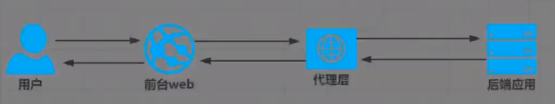
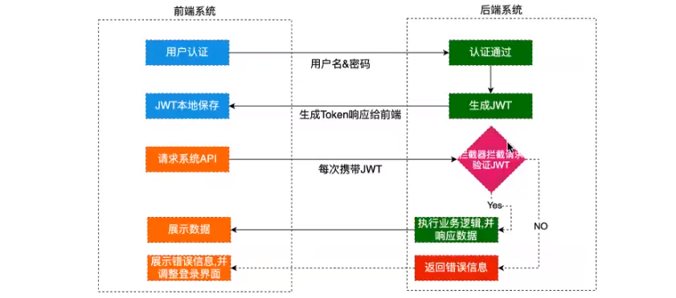
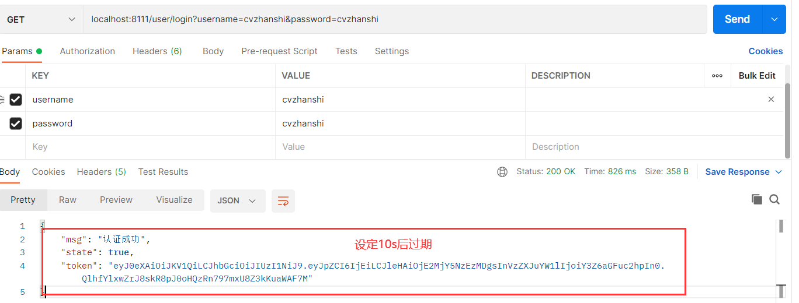
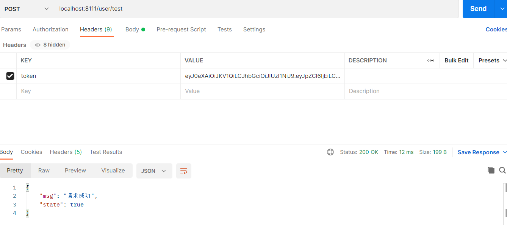
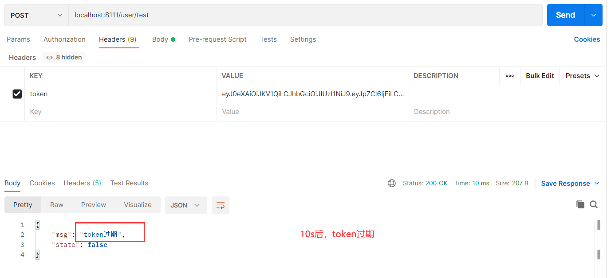
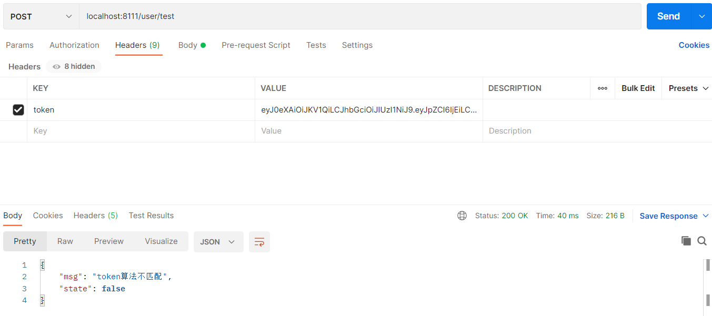

# JWT实战笔记

## ① JWT概述

> 官网解释：
>
> JSON Web Token (JWT) is an open standard ([RFC 7519](https://tools.ietf.org/html/rfc7519)) that defines a compact and self-contained way for securely transmitting information between parties as a JSON object. This information can be verified and trusted because it is digitally signed. JWTs can be signed using a secret (with the **HMAC** algorithm) or a public/private key pair using **RSA** or **ECDSA**. 
>
> 官网地址: https://jwt.io/introduction/

- **翻译**：jsonwebtoken (JWT) 是一个开放标准(rfc7519) ，它定义了一种紧凑的、自包含的方式，用于在各方之间以JSON对象安全地传输信息。此信息可以验证和信任，因为它是数字签名的。jwt可以使用秘密(使用HMAC算法)或使用RSA或ECDSA的公钥/私钥对进行签名

- **通俗解释**：JWT简称JSON Web Token, 也就是通过JSON形式作为Web应用中的令牌,用于在各方之间安全地将信息作为JSON对象传输。在数据传输过
  程中还可以完成数据加密、签名等相关处理。

 ## ② JWT的作用(能做什么)

**授权**

这是使用JWT的最常见方案。一旦用户登录，每个后续请求将包括JWT，从而允许用户访问该令牌允许的路由，服务和资源。单点登录是当今广泛使用JWT的一项功能，因为它的开销很小并且可以在不同的域中轻松使用。

**信息交换**

JSON Web Token是在各方之间安全地传输信息的好方法。因为可以对JWT进行签名(例如，使用公钥/私钥对)，所以您可以确保发件人是他们所说的人。此外，由于签名是使用标头和有效负载计算的，因此您还可以验证内容是否遭到篡改。

## ③ JWT的优势

### 3.1 基于传统的Session认证

**认证方式**

> 我们知道，http协议本身是一种无状态的协议，而这就意味着如果用户向我们的应用提供了用户名和密码来进行用户认证，那么下一 次请求时，用户还要再一次进行用户认证才行，因为根据http协议，我们并不能知道是哪个用户发出的请求，所以为了让我们的应用能识别是哪个用户发出的请求，我们只能在服务器存储一份用户登录的信息，这份登录信息会在响应时传递给浏览器，告诉其保存为cookie,以便下次请求时发送给我们的应用，这样我们的应用就能识别请求来自哪个用户了,这就是传统的基于session认证。

**认证流程**


**暴露的问题**

- 每个用户经过我们的应用认证之后，我们的应用都要在服务端做一次记录，以方便用户下次请求的鉴别，通常而言session都是保存在内存中，而随着认证用户的增多，服务端的开销会明显增大
- 用户认证之后，服务端做认证记录，如果认证的记录被保存在内存中的话，这意味着用户下次请求还必须要请求在这台服务器上，这样才能拿到授权的资源，这样在分布式的应用上，相应的限制了负载均衡器的能力。这也意味着限制了应用的扩展能力。
- 因为是基于cookie来进行用户识别的，cookie如果被截获， 用户就会很容易受到跨站请求伪造的攻击。
- 在前后端分离系统中就更加痛苦:如下图所示:
也就是说前后端分离在应用解耦后增加了部署的复杂性。通常用户-次请求就要转发多次。如果用session每次携带sessionid到服务器，服务器还要查询用户信息。同时如果用户很多。这些信息存储在服务器内存中，给服务器增加负担。还有就是CSRF (跨站伪造请求攻击)攻击，session是基于cookie进行用户识别的，cookie如果被截获， 用户就会很容易受到跨站请求伪造的攻击。还有就是sessionid就是一个特征值， 表达的信息不够丰富。不容易扩展。而且如果你后端应用是多节点部署。那么就需要实现session共享机制。
不方便集群应用。



### 3.2 基于JWT认证

**流程图**



**认证流程**

- 首先，前端通过Web表单将自己的用户名和密码发送到后端的接口。这一过程一般是一 个HTTP POST请求。 建议的方式是通过SSL加密的传输(https协议) ，从而避免敏感信息被嗅探。
- 后端核对用户名和密码成功后，将用户的id等其他信息作为JWT Payload (负载)， 将其与头部分别进行Base64编码拼接后签名，形成一个JWT。形成的JWT就是一个形同111.zzz.xxx的字符串。
- 后端将JWT字符串作为登录成功的返回结果返回给前端。前端可以将返回的结果保存在localstorage或sessionStorage上， 退出登录时前端删除保存的JWT即可。
- 前端在每次请求时将JWT放入HTTP Header中的Authorization位。 ( 解决XSS和XSRF问题)后端检查是否存在，如存在验证JWT的有效性。例如，检查签名是否正确;检查Token是否过期;检查Token的接收方是否是自己(可选）
- 验证通过后后端使用JWT中包含的用户信息进行其他逻辑操作，返回相应结果。

**JWT优势**

- 简洁(Compact): 可以通过URL, POST参 数或者在HTTP header发送， 因为数据量小，传输速度也很快
- 自包含(Self-contained): 负载中包含了所有用户所需要的信息，避免了多次查询数据库
- 因为Token是 以JSON加密的形式保存在客户端的，所以JWT是 跨语言的，原则上任何web形式都支持。
- 不需要在服务端保存会话信息，特别适用于分布式微服务。

## ④ JWT的结构

**令牌组成**

- 标头(Header)
- 有效载荷(Payload)
- 签名(Signature)

> 因此，JWT通常如下所示:xxxx . yyyy . zzzzz      ----->   Header . Payload . Signature

-----

**Header**

> - 标头通常由两部分组成王令牌的类型(即JWT) 和所使用的签名算法，例如HMAC SHA256或RSA。 它会使用Base64 编码组成JWT结构的第一部分。
> - 注意:Base64是一种编码， 也就是说，它是可以被翻译回原来的样子来的。它并不是一种加密过程。

```json
{
	"alg": "SHA256",
    "typ": "JWT"
}
```

**Payload**

> 令牌的第二部分是有效负载，其中包含声明。声明是有关实体(通常是用户)和其他数据的声明。同样的，它会使用Base64编码组成JWT结构的第二部分

```json
{
	"sub": "123456",
    "name": "cvzhanshi",
    "amdin": true
}
```

**Signature**

> - 前面两部分都是使用Base64 进行编码的，即前端可以解开知道里面的信息。Signature需要使用编码后的header 和payload以及我们提供的一个密钥，然后使用header 中指定的签名算法(HS256) 进行签名。签名的作用是保证JWT没有被篡改过
>
> 如：HMACSHA256 (base64UrlEncode(header) + "." + base64Ur1Encode( payload) , secret)
>
> **签名目的**
>
> - 最后一步签名的过程，实际上是对头部以及负载内容进行签名，防止内容被窜改。如果有人对头部以及负载的内容解码之后进行修改，再进行编码，最后加上之前的签名组合形成新的JWT的话，那么服务器端会判断出新的头部和负载形成的签名和JWT附带上的签名是不样的。如果要对新的头部和负载进行签名，在不知道服务器加密时用的密钥的话，得出来的签名也是不一-样的。

**信息安全问题**

Base64是一种编码，是可逆的，那么我的信息不就被暴露了吗?

- 是的。所以，在JWT中，不应该在负载里面加入任何敏感的数据。在上面的例子中，我们传输的是用户的User ID。这个值实际上不是什么敏感内容， - 般情况下被知道也是安全的。但是像密码这样的内容就不能被放在JWT中了。如果将用户的密码放在了JWT中，那么怀有恶意的第三方通过Base64解码就能很快地知道你的密码了 。因此JWT适合用于向Web应用传递一些非敏感信息。JWT还经常用于设计用户认证和授权系统， 甚至实现Web应用的单点登录。

**优点**

- 输出是三个由点分隔的Base64-URL字符串， 可以在HTML和HTTP环境中轻松传递这些字符串，与基于XML的标准(例如SAML) 相比，它更紧凑。
- 简洁(Compact)
- 可以通过URL，POST 参数或者在HTTP header 发送，因为数据量小，传输速度快
- 自包含(Self-contained)，负载中包含了所有用户所需要的信息，避免了多次查询数据库

**示例**


## ⑤ JWT的使用

```java
/**
 * @author cVzhanshi
 * @create 2021-07-22 11:39
 */
public class JwtTest {

    public static void main(String[] args) {
        String token = getToken();
        verifyToken(token);
    }

    //通过JWT获取token
    public static String getToken(){
        Calendar instance = Calendar.getInstance();
        instance.add(Calendar.SECOND,100);

        String token = JWT.create()
            //                .withHeader()//header一般用默认值
            .withClaim("userId", 12)
            .withClaim("username", "cvzhanshi")//payload
            .withExpiresAt(instance.getTime())//设置token过期时间
            .sign(Algorithm.HMAC256("@cvzhanshi123"));//签名
        System.out.println(token);
        return token;
    }

    //根据令牌和签名解析数据
    public static void verifyToken(String token){
        //创建验证对象
        JWTVerifier jwtVerifier = JWT.require(Algorithm.HMAC256("@cvzhanshi123")).build();

        //验证
        DecodedJWT verify = jwtVerifier.verify(token);
        System.out.println("-------验证结果---------");
        System.out.println(verify.getClaim("username").asString());
        System.out.println(verify.getClaim("userId").asInt());
    }
}
```

**说明**：

- 在解析数据的时候，放进去说明类型就需要asXxx()来获取，不然会出现null

**常见的异常信息**

| 报错信息                       | 异常解释          |
| ------------------------------ | ----------------- |
| SignatureVerificationException | 签名不一致异常    |
| TokenExpiredExceptibn          | 令牌过期异常      |
| AlgorithmMismatchException     | 算法不匹配异常    |
| InvalidClaimException          | 失效的payload异常 |

## ⑥ JWT工具类的封装

```java
/**
 * @author cVzhanshi
 * @create 2021-07-22 11:58
 */
public class JWTUtils {
    public static final String SING = "Cvzhanshi@aa3!3";

    /**
     * 生成token
     */
    public static String getToken(Map<String,String> map){
        Calendar instance = Calendar.getInstance();
        instance.add(Calendar.DATE,7);//默认7天
        //创建jwt builder
        JWTCreator.Builder builder = JWT.create();
        //payload
        map.forEach((k,v) ->{
            builder.withClaim(k,v);
        });
        String token = builder.withExpiresAt(instance.getTime())//指定令牌过期时间
            .sign(Algorithm.HMAC256(SING));//sign签名
        return token;
    }

    /**
     * 验证Token合法性
     */
    public static void verify(String token){
        JWT.require(Algorithm.HMAC256(SING)).build().verify(token);
    }

    /**
     * 获取token信息
     */
    public static DecodedJWT getTokenInfo(String token){
        DecodedJWT verify = JWT.require(Algorithm.HMAC256(SING)).build().verify(token);
        return verify;
    }

}
```

## ⑦ Spring Boot整合JWT

- 导入依赖

```xml
<dependencies>
    <dependency>
        <groupId>org.springframework.boot</groupId>
        <artifactId>spring-boot-starter-web</artifactId>
    </dependency>

    <dependency>
        <groupId>org.springframework.boot</groupId>
        <artifactId>spring-boot-starter-test</artifactId>
        <scope>test</scope>
    </dependency>
    <dependency>
        <groupId>com.auth0</groupId>
        <artifactId>java-jwt</artifactId>
        <version>3.4.1</version>
    </dependency>
    <!--引入mybatis-->
    <dependency>
        <groupId>org.mybatis.spring.boot</groupId>
        <artifactId>mybatis-spring-boot-starter</artifactId>
        <version>2.1.3</version>
    </dependency>

    <!--引入mysql-->
    <dependency>
        <groupId>mysql</groupId>
        <artifactId>mysql-connector-java</artifactId>
        <version>5.1.47</version>
    </dependency>

    <!--引入druid-->
    <!-- https://mvnrepository.com/artifact/com.alibaba/druid -->
    <dependency>
        <groupId>com.alibaba</groupId>
        <artifactId>druid</artifactId>
        <version>1.2.3</version>
    </dependency>

    <dependency>
        <groupId>org.projectlombok</groupId>
        <artifactId>lombok</artifactId>
        <optional>true</optional>
    </dependency>

</dependencies>
```

- 编写配置文件

```java
server:
  port: 8111

spring:
  datasource:
    username: root
    password: cvzhanshi
    driver-class-name: com.mysql.jdbc.Driver
    #?serverTimezone=UTC解决时区的报错
    url: jdbc:mysql://localhost:3306/springsecurity?serverTimezone=UTC&useUnicode=true&characterEncoding=utf-8

#整合mybatis
mybatis:
  mapper-locations: classpath:mybatis/mapper/*.xml
  type-aliases-package: cn.cvzhanshi.entity

```

- 创建数据表和实体类

```java
//数据表根据实体类创建就行，就三个字段
@Data
@AllArgsConstructor
@NoArgsConstructor
public class User {
    private String id;
    private String username;
    private String password;
}
```

- 创建dao层

```java
/**
 * @author cVzhanshi
 * @create 2021-07-22 23:51
 */
@Mapper
public interface UserDao {
    User login(User user);
}
```

- 创建对应的sql映射文件

```xml
<?xml version="1.0" encoding="UTF-8" ?>
<!DOCTYPE mapper PUBLIC "-//mybatis.org//DTD Mapper 3.0//EN"
        "http://mybatis.org/dtd/mybatis-3-mapper.dtd">
<mapper namespace="cn.cvzhanshi.dao.UserDao">
    <select id="login" parameterType="User" resultType="User">
        select id,username,password from users where username =#{username} and password=#{password}
    </select>
</mapper>
```

- 创建service层

**UserService**

```java
/**
 * @author cVzhanshi
 * @create 2021-07-22 23:54
 */
public interface UserService {
    User login(User user);
}
```

UserServiceImpl

```java
package cn.cvzhanshi.service.Impl;

/**
 * @author cVzhanshi
 * @create 2021-07-22 23:55
 */
@Service
public class UserServiceImpl implements UserService {
    @Autowired
    private UserDao userDao;

    @Override
    public User login(User user) {
        User user1 = userDao.login(user);
        if (user1 != null) {
            return user1;
        }
        throw new RuntimeException("登录失败");
    }
}
```

- 配置controller层

```java
/**
 * @author cVzhanshi
 * @create 2021-07-22 23:57
 */
@RestController
@Slf4j
public class UserController {

    @Autowired
    private UserService userService;

    @GetMapping("/user/login")
    public Map<String, Object> login(User user) {
        log.info("用户名：{}", user.getUsername());
        log.info("password: {}", user.getPassword());

        Map<String, Object> map = new HashMap<>();

        try {
            User userDB = userService.login(user);
            Map<String, String> payload = new HashMap<>();
            payload.put("id", userDB.getId());
            payload.put("username", userDB.getUsername());
            String token = JWTUtils.getToken(payload);
            map.put("state", true);
            map.put("msg", "认证成功");
            map.put("token", token);
            return map;
        } catch (Exception e) {
            e.printStackTrace();
            map.put("state", false);
            map.put("msg", e.getMessage());
            map.put("token", "");
        }
        return map;
    }

    @PostMapping("/user/test")
    public Map<String, Object> test(HttpServletRequest request) {
        //TODO 业务逻辑
        String token = request.getHeader("token");
        DecodedJWT tokenInfo = JWTUtils.getTokenInfo(token);
        String id = tokenInfo.getClaim("id").asString();
        String name = tokenInfo.getClaim("username").asString();
        log.info("用户id：{}", id);
        log.info("用户名: {}", name);
        Map<String, Object> map = new HashMap<>();
        map.put("state", true);
        map.put("msg", "请求成功");
        return map;
    }
}
```

- 配置拦截器

```java
/**
 * @author cVzhanshi
 * @create 2021-07-23 0:01
 */
public class JWTInterceptor implements HandlerInterceptor {
    @Override
    public boolean preHandle(HttpServletRequest request, HttpServletResponse response, Object handler) throws Exception {
        //获取请求头中的令牌
        String token = request.getHeader("token");

        Map<String, Object> map = new HashMap<>();
        try {
            JWTUtils.verify(token);//验证令牌
            return true;//放行
        } catch (SignatureVerificationException e) {
            e.printStackTrace();
            map.put("msg", "签名无效");
        } catch (TokenExpiredException e) {
            e.printStackTrace();
            map.put("msg", "token过期");
        } catch (AlgorithmMismatchException e) {
            e.printStackTrace();
            map.put("msg", "token算法不匹配");
        } catch (InvalidClaimException e) {
            e.printStackTrace();
            map.put("msg", "失效的payload");
        } catch (Exception e) {
            e.printStackTrace();
            map.put("msg", "token无效");
        }

        map.put("state", false);

        //响应到前台: 将map转为json
        String json = new ObjectMapper().writeValueAsString(map);
        response.setContentType("application/json;charset=UTF-8");
        response.getWriter().println(json);
        return false;
    }
}
```

- 配置拦截器的配置类

```java
/**
 * @author cVzhanshi
 * @create 2021-07-23 0:04
 */
@Configuration
public class InterceptorConfig implements WebMvcConfigurer {

    @Override
    public void addInterceptors(InterceptorRegistry registry) {
        registry.addInterceptor(new JWTInterceptor())
                .addPathPatterns("/user/test")
                .excludePathPatterns("/user/login");
    }
}
```

- 工具类用上面的工具类
- 测试



-----



-----



-----



a