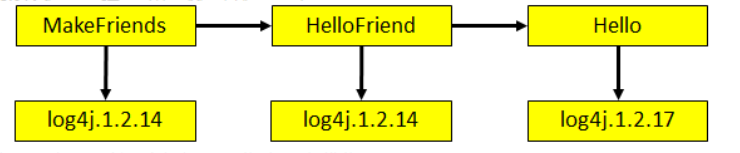
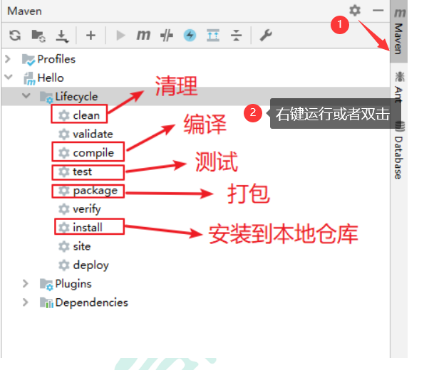

# Maven简介

## Maven的需求

**目前技术在开发中存在的问题**

- 一个项目就是一个工程

> 如果项目非常庞大,就不适合继续使用package来划分模块。最好是每一个模块对应一 个工程,利于分工协作。
>
> **借助于Maven就可以将一个项目拆分成多个工程。**

- 项目中的jar包必须手动“复制”、“粘贴”到WEB-INF/lib目录下

> 带来的问题是:同样的jar包文件重复出现在不同的项目工程中, 一方面浪费存储空间,另外也让工程比较臃肿。
>
> **借助Maven ,可以将jar包仅仅保存在“仓库”中,有需要使用的工程"引用”这个文件接口,并钚需要真的把jar包复制过来。**

- jar包需要别人替我们准备好，或到官网下载

> 不同技术的官网提供jar包下载的形式是五花八门的。
>
> 有些技术的官网就是通过Maven或SVN等专门的工具来提供下载的。
>
> 如果是以不规范的方式下载的jar包,那么其中的内容很可能也是不规范的。
>
> **借助于Maven可以以一种规范的方式下载jar包。因为所有知名框架或第三方工具的jar包以及按照统一-的规范存放在 了Maven的中央仓库中**
>
> 以规范的方式下载的jar包,内容也是可靠的。
>
> Tips: "统一的规范"不仅是对T开发领域非常重要,对于整个人类社会都是非常重要的。

- 一个jar包依赖的其他jar包需要自己手动加入到项目中

> FileUpload组件-->IO组件。 commons-fileupload-1.3.jar依赖于commons-io-2.0.1jar
>
> 如果所有jar包之间的依赖关系都需要程序员自己非常清楚的了解,那么就会极大的增加学习成本。
>
> **Maven会自动将被依赖的jar包导入进来。**

## Maven的概述

>   Maven是Apache软件基金会组织维护的一款自动化构建工具。主要有两个作用: 
>
>   - maven工程对jar包的管理过程
>   - 项目的一键构建

### 构建

> 概念：以“java原文件”、“框架配置文件”、“JSP”、“HTML”、“图片”等资源为“原材料”，去“生产”一个可以运行的项目过程
>
> 其中包括：编译、部署、搭建

- 编译：Java源文件[User.java]-→编译- +Class字节码文件[User.class]- +交给JVM去执行

- 部署：一个BS项目最终运行的并不是动态Web工程本身,而是这个动态Web工程"编译的结果”

> 一个形象的比喻：生的鸡  -> 处理 -> 熟的鸡
>
> ​							动态Web工程 -> 编译、部署 -> 编译结果

图解编译结果与动态Web工程的区别：


> 开发过程中,所有的路径或配置文件中配置的类路径等都是以编译结果的目录结构为标准的

其中：


被称为运行时环境，并不会加载到编译结果中

- 构建过程的各个环节

  - 清理:将以前编译得到的旧的class字节码文件删除,为下一-次编译做准备
  - 编译:将Java源程序编程成class字节码文件
  - 测试:自动测试，自动调用junit程序
  - 报告:测试程序执行的结果
  - 打包:动态Web_ I程打war包, Java工程打jar包
  - 安装: Maven特定的概念一将打包得到的文件复制到 "仓库”中的指定位置
  - 部署:将动态Web.工程生成的war包复制到Servlet容器的指定目录下,使其可以运行
    


- 自动化构建

### 安装Maven核心程序

- 检查JAVA_HOME环境变量, maven本身就是java写的,所以要求必须安装JDK 


-  [下载并解压 maven 安装程序](http://maven.apache.org/download.cgi) ,放在一个非中文无空格路径下
-  配置Maven相关的环境变量
   


- 验证是否安装成功，在cmd中运行mvn -v命令


### 第一个Maven工程（原生Maven）

- 创建约定的目录结构

```properties
目录结构
Hello						工程名
|---src						源码
|---|---main				放主程序
|---|---|---java			存放java源文件
|---|---|---resources		存放框架或其他工具的配置文件
|---|---test				存放测试程序
|---|---|---java			存放java源文件
|---|---|---resources		存放框架或其他工具的配置文件
|---pom.xml					Maven的核心配置文件
```

> 手动创建时为什么要遵守约定的目录结构？
>
> Maven要负责我们这个项目的自动化构建,以编译为例, Maven要想自动进行编译,那么它必须知道Java源文件保存在哪里
>
> 而，我们自定义的东西要想让框架知道或工具知道，有两种方式
>
> - 通过配置的方式告诉框架
> - 按照框架约定的来创建

- 编写pom.xml

```xml
<?xml version="1.0" ?>
<project xmlns="http://maven.apache.org/POM/4.0.0" xmlns:xsi="http://www.w3.org/2001/XMLSchema-instance" xsi:schemaLocation="http://maven.apache.org/POM/4.0.0 http://maven.apache.org/xsd/maven-4.0.0.xsd">
	<modelVersion>4.0.0</modelVersion>

	<groupId>com.atguigu.maven</groupId>
	<artifactId>Hello</artifactId>
	<version>0.0.1-SNAPSHOT</version>

	<name>Hello</name>
	  
	<dependencies>
		<dependency>
			<groupId>junit</groupId>
			<artifactId>junit</artifactId>
			<version>4.0</version>
			<scope>test</scope>
		</dependency>
	</dependencies>
</project>
```

- 在src/main/java/com/atguigu/maven目录下新建文件**Hello.java**

```java
package com.atguigu.maven;
		public class Hello {
			public String sayHello(String name){
				return "Hello "+name+"!";
			}
		}
```

- 在/src/test/java/com/atguigu/maven目录下新建测试文件**HelloTest.java**

```java
package com.atguigu.maven;	
		import org.junit.Test;
		import static junit.framework.Assert.*;
		public class HelloTest {
			@Test
			public void testHello(){
				Hello hello = new Hello();
				String results = hello.sayHello("litingwei");
				assertEquals("Hello litingwei!",results);	
			}
		}
```

- 在命令行中运行基本命令

```
mvn compile	编译
mvn clean	清理
mvn test	测试
mvn package	打包
```

> 注意：运行Maven命令时一定要进入pom.xml文件所在的目录！

# Maven的核心概念

## Maven目录结构

```properties
目录结构
Hello						工程名
|---src						源码
|---|---main				放主程序
|---|---|---java			存放java源文件
|---|---|---resources		存放框架或其他工具的配置文件
|---|---test				存放测试程序
|---|---|---java			存放java源文件
|---|---|---resources		存放框架或其他工具的配置文件
|---pom.xml					Maven的核心配置文件
```

## Maven常用命令

- mvn clean：将target目录删除,但是已经 install 到仓库里的包不会删除
- mvn compile：编译主程序
- mvn test-compile：编译测试程序
- mvn test：执行测试
- mvn package：打包
- mvn install：安装
- mvn deploy：部署、生成站点

##  maven工程对jar包的管理过程

- ①Maven的核心程序中仅仅定义了抽象的生命周期,但是具体的工作必须由特定的插件来完成。而插件本身并不包含在Maven的核心程序中。
- ②当我们执行的Maven命令需要用到某些插件时, Maven核心程序会首先到本地仓库中查找。
- ③本地仓库的默认位置: C:\USERS\USERNAME`\`.m2\repository
- ④Maven核心程序如果在本地仓库中找不到需要的插件,那么它会自动连接外网,到中央仓库下载
- ⑤如果此时无法连接外网,则构建失败。
- ⑥修改默认本地仓库的位置可以让Maven核心程序到我们事先准备好的目录下查找插件
  - [1]找到Maven解压目录\confsettings.xml
  - [2]在settings.xm|文件中找到localRepository标签
  - [3]将`<localRepository>` /path/to/local/repo`</localRepository`>从注释中取出
  - [4]将标签体内容修改为已经准备好的Maven仓库目录

## POM

> Project Object Model 项目对象模型
>
> ​		DOM 	Document Object Model 文档对象模型

**pom.xml对于Maven工程是核心配置文件,与构建过程相关的一切设置都在这个文件中进行配置。重要程度相当于web.xm|对于动态Web工程**

## 坐标gav

- 数学中的坐标：

  - 在平面上，使用x、y两个向量可以唯一的定位平面中的任何一个点
  - 在空间上，使用x、y、z三个向量可以唯一的定位空间中的任何一个点

- Maven的坐标

  - 使用三个向量在仓库中唯一定位一个Maven工程

    - groupid：公司或组织域名的倒序+项目名

    ```p
    com.baidu.projectname
    ```

    - artifactid：模块名
    - version：版本

  - Maven工程的坐标与仓库中路径的对应关系

  ```xml
  <groupId> org.springframework </groupId>
  <artifactId> spring-core </artifactId>
  <version>4.0.0.RELEASE </version>
  ```

  ```
  org/springframework/spring-core/4.0.0.RELEASE/spring-core-4.0.0.RELEASE.jar
  ```

  ## 仓库repository

- 仓库的分类

  - 本地仓库：当前电脑上部署的仓库目录，为当前电脑上多有Maven工程服务

  - 远程仓库

    - 私服：搭建在局域网环境中,为局域网范围内的所有Maven工程服务

    


    - 中央仓库：架设在Internet上,为全世界所有Maven工程服务
    - 中央仓库镜像：为了分担中央仓库的流量,提升用户访问速度


- 仓库中保存的内容：Maven工程

  - Maven自身所需的插件
  - 第三方框架或工具的jar包
  - 自己开发的Maven工程

## 依赖【初步】

- Maven解析依赖信息时会到本地仓库中查找被依赖的jar包。对于我们自己开发的Maven工程,使用mvn install命令安装后就可以进入仓库。

- 依赖的范围
  

  - compile范围依赖
    - 对主程序是否有效：有效
    - 对测试程序是否有效：有效
    - 是否参与打包：参与
    - 是否参与部署：参与
    - 典型例子：spring-core
  - test范围依赖
    - 对主程序是否有效：无效
    - 对测试程序是否有效：有效
    - 是否参与打包：不参与
    - 是否参与部署：不参与
    - 典型例子：junit
  - provided范围依赖
    - 对主程序是否有效：有效
    - 对测试程序是否有效：有效
    - 是否参与打包：不参与
    - 是否参与部署：不参与
    - 典型例子：servlet-api.jar
      


## 生命周期

- 各个构建环节执行的顺序:不能打乱顺序,必须按照既定的正确顺序来执行
- Maven的核心程序中定义了抽象的生命周期,生命周期中各个阶段的具体任务是由插件来完成的
- Maven核心程序为了更好的实现自动化构建,按照这一的特点执行生命周期中的各个阶段:不论现在要执行生命周期中的哪一个阶段,都是从这个生命周期最初的位置开始执行

例如：


### 插件与目标

- 生命周期的各个阶段仅仅定义了要执行的任务是什么
- 各个阶段和插件的目标是对应的
- 相似的日标由特定的插件来完成
- 可以将目标看作”调用插件功能的命令“
  

## 依赖【高级】

- 

- 依赖的传递性


> 好处:可以传递的依赖不必在每个模块工程中都重复声明,在”最下面”的工程中依赖-次即可。
>
> 注意:非compile范围的依赖不能传递。所以在各个工程模块中,如果有需要就得重复声明依赖。

- 依赖的排除

  - 需要设置依赖排除的场合

  

  - 依赖排除的设置方式

  ```xml
  <exclusions>
      <exclusion>
          <groupId>commons-logging</groupId>
          <artifactId>commons-logging</artifactId>
      </exclusion>
  </exclusions>
  ```

- 依赖的原则

  - 作用：解决模块工程之间的jar包冲突问题
  - 情景设定一：验证路径最短者优先原则

  

  - 情景设定二：验证路径相同时先声明者优先

  

- 统一管理依赖的版本

  - 情景举例

  

  > 这里需要对spring各个jar包的依赖版本进行管理，如需要升级到4.1.1

  - 配置方式

    - 使用properties标签内使用自定义标签统一声明版本号

    ```XML
     <properties>
    	 	<cvzhanshi.spring.version>4.0.0.RELEASE</cvzhanshi.spring.version>
    	 </properties>
    ```

    - 在需要统一版本的位置,使用${自定义标签名}引用声明的版本号

    ```xml
    <version>${cvzhanshi.spring.versio}</version>
    ```

  - 其实properties标签配合自定义标签声明数据的配置并不是只能用于声明依赖的版本号。凡是需要统一声明后再弓|用的场合都可以使用

  ```xml
   <properties>
  	 	<cvzhanshi.spring.version>4.0.0.RELEASE</cvzhanshi.spring.version>
  	 	<project.build.sourceEncoding>UTF-8</project.build.sourceEncoding>
  </properties>
  
  ```

## 继承

- 现状

  

- 需求：统一管理各个模块工程中对junit依赖的版本

- 解决思路：将junit依赖统一提取到“父”工程中,在子工程中声明junit依赖时不指定版本,以父工程中统一设定的为准。同时也便于修改

- 操作步骤

  - 创建一个Maven工程作为父工程。注意：打包的方式为pom

  ```xml
  <groupId>com.cvzhanshi.maven</groupId>
  <artifactId>Parent</artifactId>
  <version>0.0.1-SNAPSHOT</version>
  <packaging>pom</packaging>
  ```

  - 在子工程中声明对父工程的引用

  ```xml
  <!-- 子工程中声明父工程 -->
  	<parent>
  		<groupId>com.cvzhanshi.maven</groupId>
  		<artifactId>Parent</artifactId>
  		<version>0.0.1-SNAPSHOT</version>
          
  		<!-- 以当前文件为基准的父工程pom.xml文件的相对路径 -->
  		<relativePath>../Parent/pom.xml</relativePath>
  	</parent>
  ```

  - 将子工程的坐标中与父工程坐标中重复的内容删除

  

  - 在父工程中统一管理junit的依赖

  ```xml
  <!-- 配置依赖的管理 -->
  	<dependencyManagement>
  		<dependencies>
  			<dependency>
  				<groupId>junit</groupId>
  				<artifactId>junit</artifactId>
  				<version>4.9</version>
  				<scope>test</scope>
  			</dependency>
  		</dependencies>
  	</dependencyManagement>
  ```

  - 在子工程中删除junit依赖的版本号部分

  

- 注意：配置继承后，执行安装命令时要先安装父工程

## 聚合

- 作用：一键安装各个模块工程
- 配置方式：在一个”总的聚合工程“中配置各个参与聚合的模块

```xml
<!-- 配置聚合 -->
	<modules>
		<!-- 指定各个子工程的相对路径 -->
		<module>../HelloFriend</module>
		<module>../MakeFriends</module>
		<module>../Hello</module>
	</modules>
```

- 使用方式：在聚合工程的pom.xml上点右键->run as->maven install（eclipse中）

# IDEA中使用Maven

##  在 Idea中配置 Maven

>  Idea 中也自带 Maven 插件，而且我们也可以给自带的 Maven 插件进行配置， 所以我们可以使用自带的 Maven，也可以使用我们安装的 Maven 核心程序

### 配置自己安装的Maven


### 配置IDEA自带的Maven插件

进入idea的安装目录

E:\study\Java\soft\idea\ideaIU-2019.2.4.win\plugins\maven\lib\maven3\conf配置setting.xml


1、添加本地仓库位置

```xml
<localRepository>E:\study\Java\maven\apache-maven-3.5.3\repository</localRepository>
```

2、添加阿里云仓库和中央仓库，方便联网时下载jar包

```xml
<mirror>
		<id>nexus-aliyun</id>
		<mirrorOf>central</mirrorOf>
		<name>Nexus aliyun</name>
		<url>http://maven.aliyun.com/nexus/content/groups/public</url>
	</mirror>

	<!-- 中央仓库1 -->
	<mirror>
		<id>repo1</id>
		<mirrorOf>central</mirrorOf>
		<name>Human Readable Name for this Mirror.</name>
		<url>http://repo1.maven.org/maven2/</url>
	</mirror>

	<!-- 中央仓库2 -->
	<mirror>
		<id>repo2</id>
		<mirrorOf>central</mirrorOf>
		<name>Human Readable Name for this Mirror.</name>
		<url>http://repo2.maven.org/maven2/</url>
	</mirror>
```

3、配置jdk版本

```xml
<profile>
	  <id>jdk-1.8</id>
	  <activation>
		<activeByDefault>true</activeByDefault>
		<jdk>1.8</jdk>
	  </activation>
	  <properties>
		  <maven.compiler.source>1.8</maven.compiler.source>
		  <maven.compiler.target>1.8</maven.compiler.target>
		  <maven.compiler.compilerVersion>1.8</maven.compiler.compilerVersion>
	  </properties>
	</profile>
```

## 使用Maven创建Java工程

### 创建


### 测试

-  配置 Maven 的核心配置文件 pom.xml

```xml
<?xml version="1.0" encoding="UTF-8"?>
<project xmlns="http://maven.apache.org/POM/4.0.0"
         xmlns:xsi="http://www.w3.org/2001/XMLSchema-instance"
         xsi:schemaLocation="http://maven.apache.org/POM/4.0.0 http://maven.apache.org/xsd/maven-4.0.0.xsd">
    <modelVersion>4.0.0</modelVersion>

    <groupId>com.cvzhanshi.maven</groupId>
    <artifactId>Hello</artifactId>
    <version>1.0-SNAPSHOT</version>


    <dependencies>
        <dependency>
            <groupId>junit</groupId>
            <artifactId>junit</artifactId>
            <version>4.12</version>
            <scope>test</scope>
        </dependency>
    </dependencies>
</project>
```

-  在 src/main/java 目录下创建包并创建 Hello.java 文件 

```java
/**
 * @author cVzhanshi
 * @create 2021-04-26 1:06
 */
public class Hello {
    public String sayHello(String name){
        return "Hello "+name+"!";
    }
}
```

-  在/src/test/java 目录下创建包并创建 HelloTest.java 文件 

```java
package com.atguigu.maven;
import org.junit.Test;
public class HelloTest {
 @Test
 public void testHello(){
 Hello hello = new Hello();
 String maven = hello.sayHello("Maven");
 System.out.println(maven);
 }
}
```

 使用 Maven 的方式运行 Maven 工程 ：



## 使用Maven创建Java Web工程

### 创建

-  选择Maven->选择java jdk->勾选Create from archetype->选择maven-archetype-webapp


-  填写GroupId（域名.公司名.项目名）、Artifacted(模块名)


-  选择本地maven解压的路径、配置文件


- 选择工作空间


- 创建成功，结构如下


-  在main底下new两个Directory:java,resources


-  点Project Struct，设置源码文件夹和资源文件夹 


-  tomcat部署


- 启动tomcat


## Idea 中导入 Maven 项目

-  点击 Project Structure


-  点击 Modules→➕→Import Module


-  找到项目所在的位置


-  选择 Import module from external model（从外部模型导入模块）→Maven →Finish


# eclipse中使用Maven

## 在eclipse中配置 Maven

-  Eclipse 中默认自带 Maven 插件，但是自带的 Maven 插件不能修改本地仓库，所 以通常我们不使用自带的 Maven，而是使用自己安装的，在 Eclipse 中配置 Maven 的 步骤如下：

  -  点击 Eclipse 中的 Window→Preferences

  

  -  点开 Maven 前面的箭头，选择 Installations，点击 Add… 

  

  -  点击 Directory…选择我们安装的 Maven 核心程序的根目录，然后点击 Finish

  

  -   勾上添加的 Maven 核心程序

  

  -  选择 Maven 下的 User Settings，在全局设置哪儿点击 Browse…选择 Maven 核心程序的配置文件 settings.xml，本地仓库会自动变为我们在 settings.xml 文件中设置的路径

  

## 使用eclipse创建Java项目

-  点击 File→New→Maven Project，弹出如下窗口


-  点击 Next，配置坐标（GAV）及打包方式，然后点击 Finish


-  创建完工程之后发现默认的 JDK 的编译版本与电脑安装的不符合，在 Maven 的核心配置文 件 settings.xml 文件中添加以下配置将编译版本改为 1.8，重启 Eclipse 即可

```xml
<profile>
     <id>jdk-1.8</id>
         <activation>
        	<activeByDefault>true</activeByDefault>
        <jdk>1.8</jdk>
     </activation>
 <properties>
     <maven.compiler.source>1.8</maven.compiler.source>
     <maven.compiler.target>1.8</maven.compiler.target>

    <maven.compiler.compilerVersion>1.8</maven.compiler.compilerVersion>
 </properties>
</profile>

```

-  配置 Maven 的核心配置文件 pom.xml 文件

```xml
<project xmlns="http://maven.apache.org/POM/4.0.0"
xmlns:xsi="http://www.w3.org/2001/XMLSchema-instance"
xsi:schemaLocation="http://maven.apache.org/POM/4.0.0 
https://maven.apache.org/xsd/maven-4.0.0.xsd">
 <modelVersion>4.0.0</modelVersion>
 <groupId>com.atguigu.maven</groupId>
 <artifactId>Hello</artifactId>
 <version>0.0.1-SNAPSHOT</version> 
 <dependencies>
     <dependency>
         <groupId>junit</groupId>
         <artifactId>junit</artifactId>
         <version>4.12</version>
         <scope>test</scope>
     </dependency>
 </dependencies>
</project>
```

-  编写主代码

 在 src/main/java 目录下创建包并创建 Hello.java 文件

```java
package com.cvzhanshi.maven;
public class Hello {
	public String sayHello(String name){
		return "Hello "+name+"!";
	}
}
```

-  编写测试代码

 在 src/test/java 目录下创建包并创建 HelloTest.java 文件

```java
package com.cvzhanshi.maven;	
import org.junit.Test;
import static junit.framework.Assert.*;
public class HelloTest {
	@Test
	public void testHello(){
		Hello hello = new Hello();
		String results = hello.sayHello("litingwei");
		assertEquals("Hello litingwei!",results);	
	}
}

```

-  使用 Maven 的方式运行 Maven 工程

 在工程名 Hello 或 pom.xml 上右键→Run As 运行 Maven 项目


## 使用eclipse创建Web工程

-  创建简单的 Maven 工程，打包方式为 war 包


-  创建完成之后因缺少 web.xml 文件工程出现小红叉


-  在工程上右键→Build Path→Configure Build Path…


-  点击 Project Facets 欺骗 Eclipse 当前工程不是 Web 工程，点击应用 

-  再告诉 Eclipse 当前工程是一个 Web 工程，点击应用并关闭


-  发现 MavenWeb 工程小红叉消失，并出现了 WebContext 目录


-  在 WebContext 下创建 index.jsp 页面并添加 Tomcat 库 


-  在 MavenWeb 上右键→Run As→Run on Server 部署到 Tomcat 上运行

##  Eclipse 中导入 Maven 项目

-  点击 File→Import...


-  第一次导入手动创建的 Maven 项目时，由于项目中没有 Eclipse 生成的一些文件， 使用方式一导入时 Eclipse 认为它不是一个工程


-  所以必须通过方式二导入到 Eclipse 中


-  导入到 Eclipse 中之后就会生成一些 Eclipse 能识别的文件


-  有了这些 Eclipse 能识别的文件之后以后再往 Eclipse 中导入的时候选择方式一和 方式二都可以 