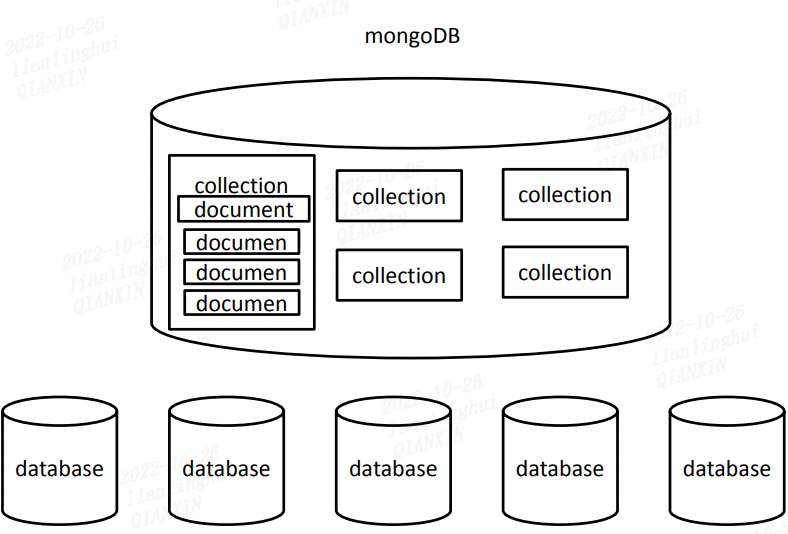
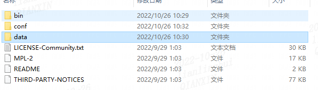
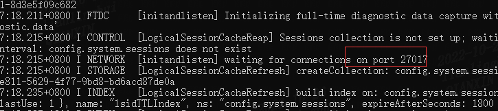
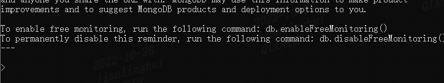
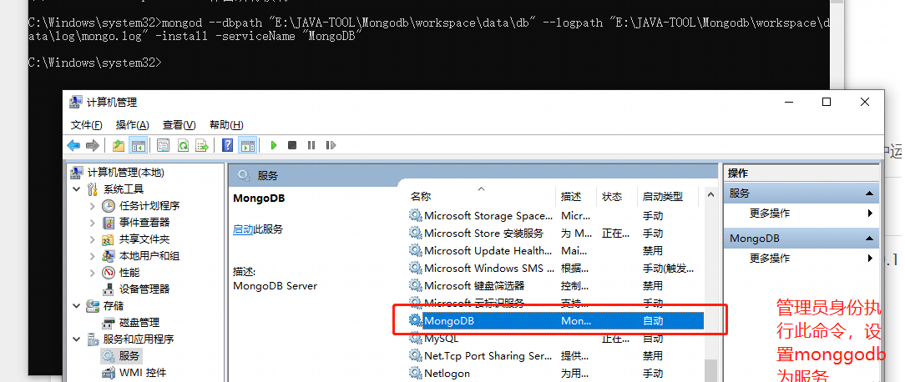
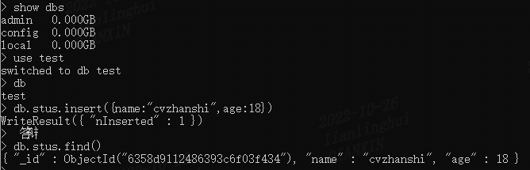
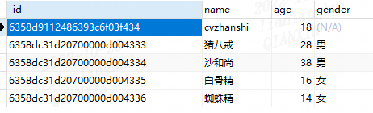

# ① MongoDB简介

> **简介**

- MongoDB是为快速开发互联网Web应用而设计的数据库系统
- MongoDB的设计目标是极简、灵活、 作为Web应用栈的一部分
- MongoDB是No SQL数据库
- MongoDB的数据模型是面向文档的，所谓文档是一种类似于JSON的结构。简单理解MongoDB这个数据库存的是各种各样的JSON。（**BSON：二进制的JSON**）

> **三个概念**

- 数据库（database）：是一个仓库，在仓库中可以存放集合。多个文档组成集合，多个集合组成数据库
- 集合（collection）：类似于数组，在集合中可以存放文档。集合就是一组文档，也就是集合是用来存放文 档的 – 集合中存储的文档可以是各种各样的，没有格式要求。
- 文档（document）：文档是数据库中的最小单位，我们存储和操作的内容都是文档。类似于JS中的对象，在MongoDB中每一条数 据都是一个文档
  - 一个文档的属性也可以是一个文档，那么这个文档叫做内嵌文档



# ② MongoDB的安装

> **下载安装，命令行启动**，每次都要手动启动

- 进入[官网下载地址](https://www.mongodb.com/try/download/community)进行下载，选择相应的版本、系统、下载模式。其中版本6.0.2的第二位是偶数表示稳定版，奇数表示开发版

  

- 绿色解压直接使用

  

- 配置环境变量到bin目录

  C:\cvzhanshi\environment\mongodb-win32-x86_64-2008plus-ssl-4.0.28\bin

- 启动方式一：命令行参数方式启服务

  ```properties
  # 进入到bin目录，然后打开cmd，在bin目录统计建一个data文件夹再建一个db文件夹存储数据库数据
  mongod --dbpath=..\data\db
  
  mongod --dbpath 数据库路径 --port 端口号
  ```

  

- 启动方式二：配置文件方式启动

  在解压目录下新建conf文件夹，该文件夹下新建mongod.conf配置文件，内容如下

  ```properties
  storage:
  	dbPath: C:\cvzhanshi\environment\mongodb-win32-x86_64-windows-6.0.2\data\db
  ```

  启动命令

  ```properties
  mongod -f ../conf/mongod.conf
  或
  mongod --config ../conf/mongod.conf
  ```

- 打开客户端就是新打开一个cmd 使用命令`mongo` 

  

> **将MongoDB设置为系统服务，可以自动在后台启动，不需要每次都手动启动**

- 在安装目录创建data文件夹，在data下创建db和log文件夹

- 创建配置文件，在bin目录统计创建配置文件mongod.cfg

  ```properties
  systemLog:
  	destination: file
  	path: C:\cvzhanshi\environment\mongodb-win32-x86_64-2008plus-ssl-4.0.28\data\log
  storage:
  	dbPath: C:\cvzhanshi\environment\mongodb-win32-x86_64-2008plus-ssl-4.0.28\data\db
  ```

- 以管理员的身份打开命令行窗口

- 执行如下的命令

  ```sh
  mongod --dbpath "C:\cvzhanshi\environment\mongodb-win32-x86_64-2008plus-ssl-4.0.28\data\db" --logpath "C:\cvzhanshi\environment\mongodb-win32-x86_64-2008plus-ssl-4.0.28\data\log\mongod.log" -install -serviceName "MongoDB"
  ```

- 查看服务，进行启动

  

# ③MongoDB的基本使用

## 3.1 基本指令

| 命令                          | 作用                                                         |
| ----------------------------- | ------------------------------------------------------------ |
| show dbs<br/>show databases   | 显示当前的所有数据库                                         |
| use 数据库名                  | 进入到指定的数据库中，进入的不用是存在的数据库，也可以进入不存在的，当插入第一条数据是创建数据库 |
| db                            | db表示的是当前所处的数据库                                   |
| show collections              | 显示数据库中所有的集合                                       |
| db.`<collection>`.insert(doc) | 向集合中**插入**一个文档<br />向test数据库中的，stus集合中插入一个新的学生对象{name:"cvzhanshi",age:18,gender:"男"}<br />db.stus.insert({name:"cvzhanshi",age:18,gender:"男"}) |
| db.`<collection>`.find()      | 查询当前集合中的所有的文档                                   |



## 3.2 插入操作

| 命令                       | 作用                       | 说明                   |
| -------------------------- | -------------------------- | ---------------------- |
| db.`<collection>`.insert() | 向集合中插入一个或多个文档 | 是对后面两个命令的集合 |
| db.collection.insertOne()  | 向集合中插入一个文档       |                        |
| db.collection.insertMany() | 插入多个文档对象           |                        |

```js
db.stus.insert({name:"猪八戒",age:28,gender:"男"});

db.stus.insert([
    {name:"沙和尚",age:38,gender:"男"},
    {name:"白骨精",age:16,gender:"女"},
    {name:"蜘蛛精",age:14,gender:"女"}
]);
```



- 当我们向集合中插入文档时，如果没有给文档指定_id属性，则数据库会自动为文档添加_id该属性用来作为文档的唯一标识
- id我们可以自己指定，如果我们指定了数据库就不会在添加了，如果自己指定_id 也必须确保它的唯一性

```shell
db.stus.insert({_id:"hello",name:"猪八戒",age:28,gender:"男"});
```

## 3.3 查询操作

| 命令                           | 作用                                                         | 说明                                                         |
| ------------------------------ | ------------------------------------------------------------ | ------------------------------------------------------------ |
| db.collection.find()           | find()用来查询集合中所有符合条件的文档<br />find()返回的是一个数组 | find()可以接收一个对象作为条件参数<br/>            {} 表示查询集合中所有的文档<br/>            {属性:值} 查询属性是指定值的文档 |
| db.collection.findOne()        | 用来查询集合中符合条件的第一个文档  <br />findOne()返回的是一个文档对象 |                                                              |
| db.collection.find({}).count() | 查询所有符合条件结果的数量                                   |                                                              |

```js
db.stus.find({_id:"hello"});
db.stus.find({age:16 , name:"白骨精"});
db.stus.find({age:28});
db.stus.findOne({age:28});
db.stus.find({}).count();
```

- **MongoDB支持持节内嵌文档的属性值查询，如果要查询内嵌文档则可以通过 . 的形式来匹配**

- **如果要通过内嵌文档来对文档进行查询，此时属性名必须加上引号**

  ```js
  db.collection.find({"hobby.movies":"hero"});
  ```

## 3.4 修改操作

| 命令                                  | 作用                                                         | 说明                                                         |
| ------------------------------------- | ------------------------------------------------------------ | ------------------------------------------------------------ |
| db.collection.update(查询条件,新对象) | update()默认情况下会使用新对象来替换旧的对象<br />update()默认只会修改一个 | 如果需要修改指定的属性，而不是替换需要使用“修改操作符”来完成修改<br/>            $set 可以用来修改文档中的指定属性<br/>            $unset 可以用来删除文档的指定属性<br />$push 用于向数组添加一个元素，可以重复<br />$addToSet 向数组中添加一个新元素，不重复的 |
| db.collection.updateMany()            | 同时修改多个符合条件的文档                                   |                                                              |
| db.collection.updateOne()             | 修改一个符合条件的文档                                       |                                                              |
| db.collection.replaceOne()            | 替换一个文档                                                 |                                                              |

```js
// 新对象直接替换
db.stus.update({name:"沙和尚"},{age:28});

// 修改
db.stus.update(
    {"_id" : ObjectId("59c219689410bc1dbecc0709")},
    {$set:{
        gender:"男",
        address:"流沙河"
    }}    
)

// 删除指定属性
db.stus.update(
    {"_id" : ObjectId("59c219689410bc1dbecc0709")},
    {$unset:{
        address:1
    }}    
)

// 修改所有满足条件的文档
db.stus.updateMany(
    {"name" : "猪八戒"},
    {
        $set:{
            address:"猪老庄"
        }
    }    
);

// 使用multi属性是update修改多个
db.stus.update(
    {"name" : "猪八戒"},
    
    {
        $set:{
        address:"呵呵呵"
        }
    }  ,
    {
        multi:true
    }    
)
```

## 3.5 删除操作

| 命令                       | 作用                           | 说明                                                         |
| -------------------------- | ------------------------------ | ------------------------------------------------------------ |
| db.collection.remove()     | 删除满足条件的集合一个或多个； | 删除一个或多个，可以第二个参数传递一个true，则只会删除一个<br />如果传递一个空对象作为参数，则会删除所有的 |
| db.collection.deleteOne()  | 删除满足条件的一个集合         |                                                              |
| db.collection.deleteMany() | 删除满足条件的多个集合         |                                                              |
| db.collection.drop()       | 删除集合                       |                                                              |
| db.dropDatabase()          | 删除数据库                     |                                                              |

## 3.6 练习

```js
//1.进入my_test数据库
use my_test;

//2.向数据库的user集合中插入一个文档
db.user.insert({
	username: "cvzhanshi"
});

//3.查询user集合中的文档
db.user.find();

//4.向数据库的user集合中插入一个文档   
db.user.insert({
    username:"ursula"
});

//5.查询数据库user集合中的文档
db.user.find();

//6.统计数据库user集合中的文档数量
db.user.find().count();

//7.查询数据库user集合中username为cvzhanshi的文档
db.user.find({
	username:"cvzhanshi"
});

//8.向数据库user集合中的username为cvzhanshi的文档，添加一个address属性，属性值为huaguoshan
db.user.update({username:"cvzhanshi"}, {$set:{address:"huaguoshan"}});

//9.使用{username:"tangseng"} 替换 username 为 ursula的文档
db.user.replaceOne({username:"ursula"}, {username:"tangseng"})

//10.删除username为cvzhanshi的文档的address属性
db.user.update({username:"cvzhanshi"}, {$unset:{address:1}});

//11.向username为cvzhanshi的文档中，添加一个hobby:{cities:["beijing","shanghai","shenzhen"] , movies:["sanguo","hero"]}
//MongoDB的文档的属性值也可以是一个文档，当一个文档的属性值是一个文档时，我们称这个文档叫做 内嵌文档
db.user.update({username:"cvzhanshi"}, {$set:{hobby:{cities:["beijing","shanghai","shenzhen"] , movies:["sanguo","hero"]}}});
db.user.find();

//12.向username为tangseng的文档中，添加一个hobby:{movies:["A Chinese Odyssey","King of comedy"]}
db.user.update({username:"tangseng"},{$set:{hobby:{movies:["A Chinese Odyssey","King of comedy"]}}});

//13.查询喜欢电影hero的文档
//MongoDB支持直接通过内嵌文档的属性进行查询，如果要查询内嵌文档则可以通过.的形式来匹配
//如果要通过内嵌文档来对文档进行查询，此时属性名必须使用引号 
// find是可以查询数组里面是否包含的
db.user.find({'hobby.movies':"hero"});

//14.向tangseng中添加一个新的电影Interstellar
//$push 用于向数组中添加一个新的元素
//$addToSet 向数组中添加一个新元素 ， 如果数组中已经存在了该元素，则不会添加
db.user.update({username:"tangseng"},{$push:{"hobby.movies":"Interstellar"}});

//15.删除喜欢Interstellar的用户
db.user.remove({
	"hobby.movies":"Interstellar"
});
db.user.find();

//16.删除user集合
db.user.drop();

//17.向numbers中插入20000条数据 7.2s

for(var i=1 ; i<=20000 ; i++){
    db.numbers.insert({num:i});
}

db.numbers.find()

db.numbers.remove({});


//0.4s
var arr = [];

for(var i=1 ; i<=20000 ; i++){
    arr.push({num:i});
}

db.numbers.insert(arr);
//18.查询numbers中num为500的文档
db.numbers.find({num:500})
db.numbers.find({num:{$eq:500}});

//19.查询numbers中num大于5000的文档
db.numbers.find({num:{$gt:500}});

//20.查询numbers中num小于30的文档
db.numbers.find({num:{$lt:30}});

//21.查询numbers中num大于40小于50的文档
db.numbers.find({num:{$gt:40 , $lt:50}});

//22.查询numbers中num大于19996的文档
db.numbers.find({num:{$gt:19996}});

//23.查看numbers集合中的前10条数据
db.numbers.find({num:{$lte:10}});
//limit()设置显示数据的上限
db.numbers.find().limit(10);

//24.查看numbers集合中的第11条到20条数据
/*
    分页 每页显示10条
        1-10     0
        11-20    10
        21-30    20
        。。。
        
        skip((页码-1) * 每页显示的条数).limit(每页显示的条数);
        
    skip()用于跳过指定数量的数据    
    
    MongoDB会自动调整skip和limit的位置
*/
db.numbers.find().skip(10).limit(10);

//25.查看numbers集合中的第21条到30条数据
db.numbers.find().skip(20).limit(10);

//26.将dept和emp集合导入到数据库中
db.dept.insert([{
  "_id" : ObjectId("5941f2bac1bc86928f4de49a"),
  "deptno" : 10.0,
  "dname" : "财务部",
  "loc" : "北京"
},
{
  "_id" : ObjectId("5941f2bac1bc86928f4de49b"),
  "deptno" : 20.0,
  "dname" : "办公室",
  "loc" : "上海"
},
{
  "_id" : ObjectId("5941f2bac1bc86928f4de49c"),
  "deptno" : 30.0,
  "dname" : "销售部",
  "loc" : "广州"
},
{
  "_id" : ObjectId("5941f2bac1bc86928f4de49d"),
  "deptno" : 40.0,
  "dname" : "运营部",
  "loc" : "深圳"
}]);

db.emp.insert([
	{
  "_id" : ObjectId("5941f5bfc1bc86928f4de4ac"),
  "empno" : 7369.0,
  "ename" : "林冲",
  "job" : "职员",
  "mgr" : 7902.0,
  "hiredate" : ISODate("1980-12-16T16:00:00Z"),
  "sal" : 800.0,
  "depno" : 20.0
},
{
  "_id" : ObjectId("5941f5bfc1bc86928f4de4ad"),
  "empno" : 7499.0,
  "ename" : "孙二娘",
  "job" : "销售",
  "mgr" : 7698.0,
  "hiredate" : ISODate("1981-02-19T16:00:00Z"),
  "sal" : 1600.0,
  "comm" : 300.0,
  "depno" : 30.0
},
{
  "_id" : ObjectId("5941f5bfc1bc86928f4de4ae"),
  "empno" : 7521.0,
  "ename" : "扈三娘",
  "job" : "销售",
  "mgr" : 7698.0,
  "hiredate" : ISODate("1981-02-21T16:00:00Z"),
  "sal" : 1250.0,
  "comm" : 500.0,
  "depno" : 30.0
},
{
  "_id" : ObjectId("5941f5bfc1bc86928f4de4af"),
  "empno" : 7566.0,
  "ename" : "卢俊义",
  "job" : "经理",
  "mgr" : 7839.0,
  "hiredate" : ISODate("1981-04-01T16:00:00Z"),
  "sal" : 2975.0,
  "depno" : 20.0
},
{
  "_id" : ObjectId("5941f5bfc1bc86928f4de4b0"),
  "empno" : 7654.0,
  "ename" : "潘金莲",
  "job" : "销售",
  "mgr" : 7698.0,
  "hiredate" : ISODate("1981-09-27T16:00:00Z"),
  "sal" : 1250.0,
  "comm" : 1400.0,
  "depno" : 30.0
},
{
  "_id" : ObjectId("5941f5bfc1bc86928f4de4b1"),
  "empno" : 7698.0,
  "ename" : "西门庆",
  "job" : "经理",
  "mgr" : 7839.0,
  "hiredate" : ISODate("1981-04-30T16:00:00Z"),
  "sal" : 2850.0,
  "depno" : 30.0
},
{
  "_id" : ObjectId("5941f5bfc1bc86928f4de4b2"),
  "empno" : 7782.0,
  "ename" : "柴进",
  "job" : "经理",
  "mgr" : 7839.0,
  "hiredate" : ISODate("1981-06-08T16:00:00Z"),
  "sal" : 2450.0,
  "depno" : 10.0
},
{
  "_id" : ObjectId("5941f5bfc1bc86928f4de4b3"),
  "empno" : 7788.0,
  "ename" : "公孙胜",
  "job" : "分析师",
  "mgr" : 7566.0,
  "hiredate" : ISODate("1987-07-12T16:00:00Z"),
  "sal" : 3000.0,
  "depno" : 20.0
},
{
  "_id" : ObjectId("5941f5bfc1bc86928f4de4b4"),
  "empno" : 7839.0,
  "ename" : "宋江",
  "job" : "董事长",
  "hiredate" : ISODate("1981-11-16T16:00:00Z"),
  "sal" : 5000.0,
  "depno" : 10.0
},
{
  "_id" : ObjectId("5941f5bfc1bc86928f4de4b5"),
  "empno" : 7844.0,
  "ename" : "阎婆惜",
  "job" : "销售",
  "mgr" : 7698.0,
  "hiredate" : ISODate("1981-09-07T16:00:00Z"),
  "sal" : 1500.0,
  "comm" : 0.0,
  "depno" : 30.0
},
{
  "_id" : ObjectId("5941f5bfc1bc86928f4de4b6"),
  "empno" : 7876.0,
  "ename" : "李逵",
  "job" : "职员",
  "mgr" : 7902.0,
  "hiredate" : ISODate("1987-07-12T16:00:00Z"),
  "sal" : 1100.0,
  "depno" : 20.0
},
{
  "_id" : ObjectId("5941f5bfc1bc86928f4de4b7"),
  "empno" : 7900.0,
  "ename" : "武松",
  "job" : "职员",
  "mgr" : 7782.0,
  "hiredate" : ISODate("1981-12-02T16:00:00Z"),
  "sal" : 950.0,
  "depno" : 10.0
},
{
  "_id" : ObjectId("5941f5bfc1bc86928f4de4b8"),
  "empno" : 7902.0,
  "ename" : "吴用",
  "job" : "分析师",
  "mgr" : 7566.0,
  "hiredate" : ISODate("1981-12-02T16:00:00Z"),
  "sal" : 3000.0,
  "depno" : 20.0
},
{
  "_id" : ObjectId("5941f5bfc1bc86928f4de4b9"),
  "empno" : 7934.0,
  "ename" : "鲁智深",
  "job" : "职员",
  "mgr" : 7782.0,
  "hiredate" : ISODate("1982-01-22T16:00:00Z"),
  "sal" : 1300.0,
  "depno" : 10.0
}]);
db.dept.find()
db.emp.find()

//27.查询工资小于2000的员工
db.emp.find({sal:{$lt:2000}});

//28.查询工资在1000-2000之间的员工
db.emp.find({sal:{$lt:2000 , $gt:1000}});

//29.查询工资小于1000或大于2500的员工
db.emp.find({$or:[{sal:{$lt:1000}} , {sal:{$gt:2500}}]});

//30.查询财务部的所有员工
var depno = db.dept.findOne({dname:"财务部"}).deptno;
db.emp.find({depno:depno});

//31.查询销售部的所有员工
var depno = db.dept.findOne({dname:"销售部"}).deptno;
db.emp.find({depno:depno});

//32.查询所有mgr为7698的所有员工
db.emp.find({mgr:7698})

//33.为所有薪资低于1000的员工增加工资400元
db.emp.updateMany({sal:{$lte:1000}} , {$inc:{sal:400}});
db.emp.find()
```

## 3.7 sort和投影

> **sort**

- 查询文档时，默认情况是按照_id的值进行排列（升序）
- **sort()可以用来指定文档的排序的规则,sort()需要传递一个对象来指定排序规则 1表示升序 -1表示降序**
- limit skip sort 可以以任意的顺序进行调用

```js
// 先按照工资升序排序，后面按照部门编号降序排序
db.emp.find({}).sort({sal:1,empno:-1});
```

> 投影

在查询时，可以在第二个参数的位置来设置查询结果的 投影

```js
db.emp.find({},{ename:1 , _id:0 , sal:1});
```

# ④ 文档之间的关系

> 一对一（one to one）

 - 夫妻 (一个丈夫 对应 一个妻子)
 - 在MongoDB，可以通过内嵌文档的形式来体现出一对一的关系

```javascript
db.wifeAndHusband.insert([
    {
        name:"黄蓉",
        husband:{
            name:"郭靖"
        }
    },{
        name:"潘金莲",
        husband:{
            name:"武大郎"
        }
    }

]);
db.wifeAndHusband.find();
```

> 一对多（one to many）/多对一(many to one)

 - 父母 - 孩子
 - 用户 - 订单
 - 文章 - 评论

也可以通过内嵌文档来映射一对多的关系

```js
//一对多 用户(users) 和 订单(orders)
db.users.insert([{
    username:"swk"
    },{
    username:"zbj"
}]);

db.order.insert({
    
    list:["牛肉","漫画"],
    user_id: ObjectId("59c47e35241d8d36a1d50de0")
    
});

db.users.find()
db.order.find()

//查找用户swk的订单
var user_id = db.users.findOne({username:"zbj"})._id;
db.order.find({user_id:user_id});
```

> 多对多(many to many)

   - 分类 - 商品
   - 老师 - 学生 

```js
//多对多
db.teachers.insert([
    {name:"洪七公"},
    {name:"黄药师"},
    {name:"龟仙人"}
]);

db.stus.insert([
    {
        name:"郭靖",
        tech_ids:[
            ObjectId("59c4806d241d8d36a1d50de4"),
            ObjectId("59c4806d241d8d36a1d50de5")
        ]
    },{
        name:"孙悟空",
        tech_ids:[
            ObjectId("59c4806d241d8d36a1d50de4"),
            ObjectId("59c4806d241d8d36a1d50de5"),
            ObjectId("59c4806d241d8d36a1d50de6")
        ]
    }
])
```

# ⑤ Spring Boot整合MongoDB

> spring-data-mongodb提供了两种方式访问mongodb：
>
> （1）MongoTemplate
>
> （2）MongoRepository
>
> MongoRepository操作简单，MongoTemplate操作灵活

- 创建spring boot项目

- 导入依赖

  ```xml
  <?xml version="1.0" encoding="UTF-8"?>
  <project xmlns="http://maven.apache.org/POM/4.0.0" xmlns:xsi="http://www.w3.org/2001/XMLSchema-instance"
           xsi:schemaLocation="http://maven.apache.org/POM/4.0.0 https://maven.apache.org/xsd/maven-4.0.0.xsd">
      <modelVersion>4.0.0</modelVersion>
      <groupId>cn.cvzhanshi</groupId>
      <artifactId>mongodb</artifactId>
      <version>0.0.1-SNAPSHOT</version>
      <name>mongodb</name>
      <description>Demo project for Spring Boot</description>
      <properties>
          <java.version>1.8</java.version>
          <project.build.sourceEncoding>UTF-8</project.build.sourceEncoding>
          <project.reporting.outputEncoding>UTF-8</project.reporting.outputEncoding>
          <spring-boot.version>2.3.7.RELEASE</spring-boot.version>
      </properties>
      <dependencies>
          <dependency>
              <groupId>org.springframework.boot</groupId>
              <artifactId>spring-boot-starter-data-mongodb</artifactId>
          </dependency>
          <!-- 引入lombok -->
          <dependency>
              <groupId>org.projectlombok</groupId>
              <artifactId>lombok</artifactId>
              <optional>true</optional>
          </dependency>
          <!-- https://mvnrepository.com/artifact/cn.hutool/hutool-all -->
          <dependency>
              <groupId>cn.hutool</groupId>
              <artifactId>hutool-all</artifactId>
              <version>5.8.5</version>
          </dependency>
          <dependency>
              <groupId>org.springframework.boot</groupId>
              <artifactId>spring-boot-starter-web</artifactId>
          </dependency>
          <dependency>
              <groupId>org.springframework.boot</groupId>
              <artifactId>spring-boot-starter-test</artifactId>
              <scope>test</scope>
              <exclusions>
                  <exclusion>
                      <groupId>org.junit.vintage</groupId>
                      <artifactId>junit-vintage-engine</artifactId>
                  </exclusion>
              </exclusions>
          </dependency>
      </dependencies>
  
      <dependencyManagement>
          <dependencies>
              <dependency>
                  <groupId>org.springframework.boot</groupId>
                  <artifactId>spring-boot-dependencies</artifactId>
                  <version>${spring-boot.version}</version>
                  <type>pom</type>
                  <scope>import</scope>
              </dependency>
          </dependencies>
      </dependencyManagement>
  </project>
  ```

- 编写配置文件

  ```yaml
  spring:
    data:
      mongodb:
        host: localhost
        port: 27017
        # 数据库不一定要事先创建好
        database: mongodb_demo
  ```

- 创建实体类

  ```java
  /**
   * @author cVzhanshi
   * @create 2022-10-26 19:14
   */
  @Data
  @AllArgsConstructor
  @NoArgsConstructor
  @Accessors(chain = true)
  // 对应Collection名
  @Document("user")
  public class User {
      @Id
      private String id;
      private String name;
      private Integer age;
      private String email;
      private Date createDate;
  }
  ```

## 5.1 MongoRepository测试

**MongoRepository的生成规则**

| 方法关键字        | 示例                                                      | 等价于SQL                                      |
| :---------------- | :-------------------------------------------------------- | :--------------------------------------------- |
| And               | findByLastnameAndFirstname                                | … where x.lastname = ?1 and x.firstname = ?2   |
| Or                | findByLastnameOrFirstname                                 | … where x.lastname = ?1 or x.firstname = ?2    |
| Is,Equals         | findByFirstname，findByFirstnameIs，findByFirstnameEquals | … where x.firstname = ?1                       |
| Between           | findByStartDateBetween                                    | … where x.startDate between ?1 and ?2          |
| LessThan          | findByAgeLessThan                                         | … where x.age < ?1                             |
| LessThanEqual     | findByAgeLessThanEqual                                    | … where x.age <= ?1                            |
| GreaterThan       | findByAgeGreaterThan                                      | … where x.age > ?1                             |
| GreaterThanEqual  | findByAgeGreaterThanEqual                                 | … where x.age >= ?1                            |
| After             | findByStartDateAfter                                      | … where x.startDate > ?1                       |
| Before            | findByStartDateBefore                                     | … where x.startDate < ?1                       |
| IsNull            | findByAgeIsNull                                           | … where x.age is null                          |
| IsNotNull,NotNull | findByAge(Is)NotNull                                      | … where x.age not null                         |
| Like              | findByFirstnameLike                                       | … where x.firstname like ?1                    |
| NotLike           | findByFirstnameNotLike                                    | … where x.firstname not like ?1                |
| StartingWith      | findByFirstnameStartingWith                               | … where x.firstname like ?1（参数绑定附加%）   |
| EndingWith        | findByFirstnameEndingWith                                 | … where x.firstname like ?1（参数与预先绑定%） |
| Containing        | findByFirstnameContaining                                 | … where x.firstname like ?1（参数绑定%）       |
| OrderBy           | findByAgeOrderByLastnameDesc                              | … where x.age = ?1 order by x.lastname desc    |
| Not               | findByLastnameNot                                         | … where x.lastname <> ?1                       |
| In                | findByAgeIn(Collection ages)                              | … where x.age in ?1                            |
| NotIn             | findByAgeNotIn(Collection ages)                           | … where x.age not in ?1                        |
| True              | findByActiveTrue()                                        | … where x.active = true                        |
| False             | findByActiveFalse()                                       | … where x.active = false                       |
| IgnoreCase        | findByFirstnameIgnoreCase                                 | … where UPPER(x.firstame) = UPPER(?1)          |

### 5.1.1 插入操作

```java
@Test
void addOneUserForRepo() {
    User user = new User()
        .setAge(221)
        .setName("user")
        .setEmail("cvzhanshi@qq.com")
        .setCreateDate(DateUtil.date());
    // save方法既可以添加也可以修改，取决于user中有没有id
    //        userRepository.save(user);
    userRepository.insert(user);
}
```

### 5.1.2 修改操作

```java
@Test
void updateUserForRepo() {
    User user = userRepository.findById("635921e925015871927c1d09").get();
    user.setName("1111");
    user.setAge(26);
    User save = userRepository.save(user);
    System.out.println(save);
}
```

### 5.1.3 删除操作

```java
@Test
void deleteByIdUserForRepo() {
    userRepository.deleteById("635921e925015871927c1d09");
}
```

### 5.1.4 查询操作

```java
@Test
void queryUserForRepo() {
    /**
         * 根据id查询
         */
    User user = userRepository.findById("635921e925015871927c1d09").get();
    System.out.println(user);

    /**
         * 查询所有
         */
    userRepository.findAll().forEach(System.out::println);

    /**
         * 查询所有并排序
         */
    Sort sort = Sort.by(Sort.Direction.DESC, "age");
    userRepository.findAll(sort).forEach(System.out::println);

    /**
         * 条件查询
         */
    Example<User> userExample = Example.of(new User().setName("cvzhanshi1121"));
    userRepository.findAll(userExample).forEach(System.out::println);

    /**
         * 分页查询
         */
    //page=0表示第一页
    PageRequest pageable = PageRequest.of(0, 2);
    Page<User> all = userRepository.findAll(pageable);
    List<User> userList = all.getContent();
    userList.forEach(u -> {
        System.out.println(u);
    });
    long totalElements = all.getTotalElements();//总记录数
    int totalPages = all.getTotalPages();//总页数
    System.out.println("总记录数："+ totalElements);
    System.out.println("总页数："+ totalPages);


}

@Test
void pageSortQueryUser(){
    /**
         * 分页查询并排序
         */
    Sort sort = Sort.by(Sort.Direction.DESC, "age");
    //page=0表示第一页
    PageRequest pageable = PageRequest.of(0, 2,sort);
    Page<User> all = userRepository.findAll(pageable);
    List<User> userList = all.getContent();
    userList.forEach(u -> {
        System.out.println(u);
    });
    long totalElements = all.getTotalElements();//总记录数
    int totalPages = all.getTotalPages();//总页数
    System.out.println("总记录数："+ totalElements);
    System.out.println("总页数："+ totalPages);
}

@Test
void queryLikeForRepoUser(){
    /**
         * 分页查询并排序
         */
    User user = new User();
    user.setName("cvzhanshi1121");
    //模糊查询固定格式
    ExampleMatcher matcher =
        ExampleMatcher
        .matching()
        .withStringMatcher(ExampleMatcher.StringMatcher.CONTAINING)//模糊查询
        .withIgnoreCase(true); //忽略大小写

    Example<User> example =  Example.of(user,matcher);

    List<User> userList = userRepository.findAll(example);
    userList.forEach(System.out::println);
}

@Test
void queryLikePageSortForRepoUser(){
    /**
         * 分页排序加模糊查询
         */
    Sort sort = Sort.by(Sort.Direction.DESC, "age");
    //page=0表示第一页
    PageRequest pageable = PageRequest.of(0, 4,sort);

    //模糊查询
    ExampleMatcher matcher = ExampleMatcher.matching()
        .withStringMatcher(ExampleMatcher.StringMatcher.CONTAINING)
        .withIgnoreCase(true);

    User user = new User();
    user.setName("est");

    Example<User> example = Example.of(user, matcher);

    Page<User> pages = userRepository.findAll(example, pageable);

    List<User> userList = pages.getContent();
    userList.forEach(System.out::println);

}
```


## 5.2 MongoTemplate测试

**MongoTemplate常用的方法**

| 方法                                            | 作用                      |
| ----------------------------------------------- | ------------------------- |
| mongoTemplate.findAll(User.class)               | 查询User文档的全部数据    |
| mongoTemplate.findById(`<id>`, User.class)      | 查询User文档id为id的数据  |
| mongoTemplate.find(query, User.class)           | 根据query内的查询条件查询 |
| mongoTemplate.upsert(query, update, User.class) | 根据query内的查询条件修改 |
| mongoTemplate.remove(query, User.class)         | 根据query内的查询条件删除 |
| mongoTemplate.insert(User)                      | 新增文档                  |

**Query对象**

- 创建一个query对象（用来封装所有条件对象)，再创建一个criteria对象（用来构建条件）

- 精准条件：criteria.and(“key”).is(“条件”)

  模糊条件：criteria.and(“key”).regex(“条件”)

- 封装条件：query.addCriteria(criteria)

- 大于（创建新的criteria）：Criteria gt = Criteria.where(“key”).gt（“条件”）

  小于（创建新的criteria）：Criteria lt = Criteria.where(“key”).lt（“条件”）

- Query.addCriteria(new Criteria().andOperator(gt,lt));
- 一个query中只能有一个andOperator()。其参数也可以是Criteria数组。
- 排序 ：query.with（new Sort(Sort.Direction.ASC, "age"). and(new Sort(Sort.Direction.DESC, "date")))

**Criteria关键字解释**

|关键字|	解释|
|------|-------|
|eq	|等于，第一个参数是对象属性，第二个参数是值|
|allEq|	参数为一个Map对象，相当于多个eq的叠加|
|gt|	大于|
|ge|	大于等于|
|lt|	小于|
|le|	小于等于|
|between|	在两个值之间Expression.between(“age”,new Integer(10),new Integer(20));|
|like|	like查询|
|in	|in查询|

**测试类**

```java
@SpringBootTest
class MongodbApplicationTests {
    @Autowired
    private MongoTemplate mongoTemplate;
}
```

### 5.2.1 插入操作

```java
// 插入一条记录
@Test
void addOneUser() {
    User user = new User()
        .setAge(22)
        .setName("cvzhanshi")
        .setEmail("cvzhanshi@qq.com")
        .setCreateDate(DateUtil.date());
    mongoTemplate.insert(user);
}
// 插入多条记录
@Test
void addManyUser() {
    ArrayList<User> users = new ArrayList<>();
    for (int i = 0; i < 10; i++) {
        User user = new User()
            .setAge(22)
            .setName("cvzhanshi")
            .setEmail("cvzhanshi@qq.com")
            .setCreateDate(DateUtil.date());
        users.add(user);
    }
    // 第一个参数，要插入的集合
    // 第二个参数，collectionNmae
    mongoTemplate.insert(users,"user");
}
```

### 5.2.2 修改操作

> #### updateMulti 修改

```java
@Test
void updateMultiUser() {
    // 修改的条件
    Query query = new Query(Criteria.where("name").is("cvzhanshi"));

    // 修改的属性及其要修改的值
    Update update = new Update();
    update.set("name","cvzhanshi111");
    update.set("age",11);

    // 修改满足条件的所有文档
    UpdateResult result = mongoTemplate.updateMulti(query, update, "user");
}
```

> #### save修改

```java
@Test
void updateSaveUser() {
    User user = mongoTemplate.findById("63591941ae0958363215b15f", User.class);
    user.setName("testsave");
    // user有id  save（）执行修改指定文档   无id  执行新增操作
    mongoTemplate.save(user);
}
```

### 5.2.3 删除操作

> remove带条件删除

```java
@Test
void removeUser() {
    Query query = new Query(Criteria.where("_id").is("63591941ae0958363215b15f"));
    mongoTemplate.remove(query, "user");
}
```

### 5.2.4 查询操作

```java
@Test
void queryUser() {
    /**
         * 查询全部
         */

    List<User> users = mongoTemplate.findAll(User.class);
    users.forEach(System.out::println);

    /**
         * 根据id查询
         */
    User user = mongoTemplate.findById("63591941ae0958363215b15f", User.class);
    System.out.println(user);

    /**
         * 根据条件查询
         */
    Query query = new Query();
    //is方法的参数类型object,但是实际传入的值一定和字段本身的类型要一致
    query.addCriteria(Criteria.where("name").is("cvzhanshi1121"));
    List<User> userList = mongoTemplate.find(query, User.class);
    userList.forEach(System.out::println);

    /**
         * 分页查询/带条件分页查询
         */
    Query query1 = new Query(Criteria.where("age").is(11)).skip(0).limit(3);
    List<User> userList2 = mongoTemplate.find(query1, User.class);
    userList2.forEach(u -> {
        System.out.println(u);
    });

}

@Test
void queryLikeUser() {
    /**
         * 模糊查询
         */
    String name = "1";

    //这几行固定格式的，实现模糊查询
    String regex = String.format("%s%s%s", "^.*", name, ".*$");
    Pattern pattern = Pattern.compile(regex, Pattern.CASE_INSENSITIVE);
    Query query = new Query(Criteria.where("name").regex(pattern));

    List<User> userList = mongoTemplate.find(query, User.class);
    userList.forEach(System.out::println);
}
```

## 5.3 聚合操作

> 聚合管道常用的表达式

| 聚合函数 | sql类比               | 描述                                                         |
| :------- | :-------------------- | :----------------------------------------------------------- |
| project  | select                | 类似于select关键字，筛选出对应字段                           |
| match    | where                 | 类似于sql中的where，进行条件筛选                             |
| group    | group by              | 进行group by分组操作                                         |
| sort     | order by              | 对应字段进行排序                                             |
| count    | count                 | 统计计数，类似于sql中的count                                 |
| limit    | limit                 | 限制返回的数据，一般用于分页                                 |
| out      | select into new_table | 将查询出来的数据，放在另外一个document(table) ， 会在mongodb数据库生成一个新的表 |
