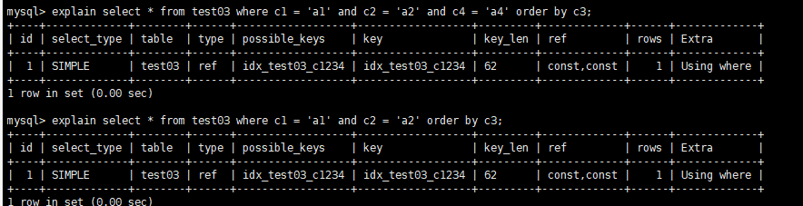

# 一、MySQL的架构介绍

## 1.1 MySQL简介

> 概述

- MySQL是一个关系型数据库管理系统，由瑞典MySQL AB公司开发，目前属于Oracle公司。
- MySQL是一种**关联数据库管理系统**，将数据保存在不同的表中，而不是将所有数据放在一个大仓库内，这样就增加了速度并提高了灵活性。
- Mysql是开源的，所以你不需要支付额外的费用。
- MysqI支持大型的数据库。可以处理拥有上千万条记录的大型数据库。
- MySQL使用标准的SQL数据语言形式。
- MySQL可以允许于多个系统上，并且支持多种语言。这些编程语言包括C、C++、 Python、 Java、 Perl、 PHP、Eiffel、 Ruby和Tc|等 。
- MySQL对PHP有很好的支持，PHP是 目前最流行的Web开发语言。
- MySQL支持大型数据库，支持5000万条记录的数据仓库，32位 系统表文件最大可支持4GB, 64位系统支持最大的表文件为8TB。
- MySQL是可以定制的，采用了GPL协议，你可以修改源码来开发自己的MySQL系统。

> 高级MySQL

高级MySQL包括：MySQL内核、sql优化攻城狮、mysql服务器的优化、各种参数常量设定、查询语句优化、主从复制、软硬件升级、容灾备份、sql编程

## 1.2 MySQL Linux版的安装

[参考此篇文章](https://blog.csdn.net/qq_45408390/article/details/119487953)

## 1.3 MySQL 配置文件

> 二进制日志log-bin

```sh
# Replication Master Server (default)
# binary logging is required for replication
log-bin=mysql-bin
```

> 错误日志log-error

**默认是关闭的。记录严重的警告和错误信息，每次启动和关闭的详细信息等**

> 查询日志log

**默认关闭，记录查询的sql语句，如果开启会减低mysqI的整体性能，因为记录日志也是需要消耗系统资源的**

> 数据文件

- frm文件 —— 存放表结构的
- myd文件 —— 存放表数据
- myi文件 —— 存放表索引

## 1.4 MySQL的逻辑架构介绍

> 总体概览

-  和其它数据库相比，MySQL有点与众不同，它的架构可以在多种不同场景中应用并发挥良好作用。主要体现在**存储引擎的架构**上，**插件式的存储引擎架构将查询处理和其它的系统任务以及数据的存储提取相分离**。这种架构可以根据业务的需求和实际需要选择合适的存储引擎。


1. 连接层

   > 最上层是一些客户端和连接服务，包含本地sock通信和大多数基于客户端/服务端工具实现的类似于tcp/ip的通信。主要完成-些类似于连接处理、授权认证、及相关的安全方案。在该层上引入了线程池的概念，为通过认证安全接入的客户端提供线程。同样在该层上可以实现基于SSL的安全链接。服务器也会为安全接入的每个客户端验证它所具有的操作权限。

2. 服务层

   > 第二层架构主要完成大多数的核心服务功能，如SQL接口，并完成缓存的查询，SQL的分析和优化及部分内置函数的执行。所有跨存储引擎的功能也在这一层实现， 如过程、函数等。在该层，服务器会解析查询并创建相应的内部解析树，并对其完成相应的优化如确定查询表的顺序，是否利用索引等，最后生成相应的执行操作。如果是select语句，服务器还会查询内部的缓存。如果缓存空间足够大，这样在解决大量读操作的环境中能够很好的提升系统的性能。

3. 引擎层

   > 存储引擎层，存储引擎真正的负责了MySQL中数据的存储和提取，服务器通过API与存储引擎进行通信。不同的存储引擎具有的功能不同，这样我们可以根据自己的实际需要进行选取。后面介绍MyISAM和InnoDB
   
4. 存储层

   > 数据存储层，主要是将数据存储在运行于裸设备的文件系统之上，并完成与存储引擎的交互。

## 1.5 MySQL存储引擎

> 查看存储引擎命令

```sql
mysql> show engines;
mysql> show variables like '%storage_engine%';
```


> MyISAM和InnoDB


> 阿里、淘宝用的存储引擎


- Percona为MySQL数据库服务器进行了改进，在功能和性能上较MySQL有着很显著的提升。该版本提升了在高负载情况下的InnoDB的性能、为DBA提供一些非常有用的性能诊断工具;另外有更多的参数和命令来控制服务器行为。
- 该公司新建了一款存储引擎叫xtradb完全可以替代innodb,并且在性能和并发上做得更好,
- **阿里巴巴大部分mysq|数据库其实使用的percona的原型加以修改**。
- AliSql+AliRedis

# 二、索引优化分析

## 2.1 SQL性能下降的原因

**性能下降SQL慢、执行时间长、等待时间长**

原因：

- 查询语句写的烂

- 索引失效

  - 单值索引

  - 复合索引

    

- 关联查询太多join（设计缺陷或不得已的需求）

- 服务器调优及各个参数设置（缓冲、线程数等）

## 2.2 常见通用的Join查询

> SQL的执行顺序

- **手写SQL**

  ```sql
  SELECT DISTINCT
  	<select_list>
  FROM
  	<left_table> <join_type>
  JOIN <right_table> ON <join_condition>
  WHERE
  	<where_condition>
  GROUP BY
  	<group_by_list>
  HAVING
  	<having_condition>
  ORDER BY
  	<order_by_condition>
  LIMIT <limit_number>
  ```

- 机器读取的SQL

  ```sql
  FROM
  	<left_table> <join_type>
  JOIN <right_table> ON <join_condition>
  WHERE
  	<where_condition>
  GROUP BY
  	<group_by_list>
  HAVING
  	<having_condition>
  SELECT 
  DISTINCT <select_list>
  ORDER BY
  	<order_by_condition>
  LIMIT <limit_number>
  ```

- 总结

  

> 七种Join图


> 测试7种Join

- 建表sql

  ```sql
  USE db01;
  CREATE TABLE tbl_dept(
  	id INT(11) NOT NULL AUTO_INCREMENT,
  	deptName VARCHAR(30) DEFAULT NULL,
  	locAdd VARCHAR(40) DEFAULT NULL,
  	PRIMARY KEY(id)
  ) ENGINE=INNODB AUTO_INCREMENT=1 DEFAULT CHARSET=utf8;
  
  
  CREATE TABLE tbl_emp(
  	id int(11) NOT NULL AUTO_INCREMENT,
  	name VARCHAR(20) DEFAULT NULL,
  	deptId INT(11) DEFAULT NULL,
  	PRIMARY KEY(id),
  	KEY fk_dept_id(deptId)
  	#CONSTRAINT 'fk_dept_id' FOREIGN KEY('deptId) REFERENCES 'tbl_dept'('id)
  ) ENGINE=INNODB AUTO_INCREMENT=1 DEFAULT CHARSET=utf8;
  
  INSERT INTO tbl_dept(deptName,locAdd) VALUES('RD',11);
  INSERT INTO tbl_dept(deptName,locAdd) VALUES('HR',12);
  INSERT INTO tbl_dept(deptName,locAdd) VALUES('MK',13);
  INSERT INTO tbl_dept(deptName,locAdd) VALUES('MIS',14);
  INSERT INTO tbl_dept(deptName,locAdd) VALUES('FD',15);
  
  INSERT INTO tbl_emp(NAME,deptId) VALUES('z3',1);
  INSERT INTO tbl_emp(NAME,deptId) VALUES('z4',1);
  INSERT INTO tbl_emp(NAME,deptId) VALUES('z5',1);
  INSERT INTO tbl_emp(NAME,deptId) VALUES('w5',2);
  INSERT INTO tbl_emp(NAME,deptId) VALUES('w6',2);
  INSERT INTO tbl_emp(NAME,deptId) VALUES('s7',3);
  INSERT INTO tbl_emp(NAME,deptId) VALUES('s8',4); 
  INSERT INTO tbl_emp(NAME,deptId) VALUES('s9',51);
  ```

- inner join

  

  **只查询两个共有的，其余的不显示**

- left join

  

  **左表都查询，右表没有对应的就置空**

- right join

  

  右表都查询，左表没有对应的就置空

- right join where left.id is null

  

  查询右表独有的数据

- left join where right.id is null

  

  查询左表独有的数据

- full outer join

  说明，此连接对mysql无效，对Oracle有用，但是为了达到效果，还是要编写sql

  ```sql
  # union去重+合并
  select * from tbl_emp a left join tbl_dept b on a.deptId = b.id
  union
  select * from tbl_emp a right join tbl_dept b on a.deptId = b.id;
  ```

  

- 只显示两个独有的

  ```sql
  select * from tbl_emp a left join tbl_dept b on a.deptId = b.id where b.id is null 
  union 
  select * from tbl_emp a right join tbl_dept b on a.deptId = b.id where a.deptId is null;
  ```

  

## 2.3 索引简介

### 2.3.1 索引是什么

- ==MySQL官方定义：索引是帮助MySQL高效获取数据的数据结构==

- **索引的本质**：**数据结构**

- ==索引是排好序的快速查找的数据结构==   =>  索引的作用：排序和快速查找

-----

- ==在数据之外，**数据库系统还维护着满足特定查找算法的数据结构，这些数据结构以某种方式引用（指向）数据，这样就可以在这些数据结构上实现高级查找算法**。这种数据结构就是**索引**。==

- 一般来说索引本身也很大，不可能全部存储在内存中，因此索引往往以索引文件的形式存储的磁盘上

- 一种索引方式示例：

  

- **我们平常所说的索引，如果没有特别指明，都是指B树(多路搜索树，并不一定是二叉的)结构组织的索引**。其中聚集索引，次要索引，覆盖索引，复合索引，前缀索引，唯一 索引默认都是使用B+树索引，统称索引。当然，除了B+树这种类型的索引之外，还有哈稀索引(hash index)等。

### 2.3.2 索引的优势与劣势

> **优势**

- 类似于大学图书馆建书目索引，**提高数据检索效率**，降低数据库的IO成本
- 通过索引列对数据进行排序，**降低数据排序的成本**，降低了CPU的消耗

> **劣势**

- 实际上索引也是一张表，该表保存了主键和索引的字段，并指向实体表的记录，索引索引列也是要占用空间的
- 虽然索引大大提高了查询速度，同时却会**降低更新表的速度**，如对表进行INSERT、UPDATE 和DELETE.因为更新表时，MySQL不仅要保存数据，还要保存一下索引文件每次更新添加了索引列的字段，都会调整因为更新所带来的键值变化后的索引信息
- 索引只是提高效率的一个因素，如果你的MySQL有大数据量的表，就需要花时间研究建立最优秀的索引，或优化查询语句

### 2.3.3 MySQL索引分类

> 单值索引：一个索引只包含单个列，一个表可以有多个单列索引

建议：一张表建的索引最多不要超过5个

> 唯一索引：索引列的值必须唯一，单允许空值

> 复合索引：即一个索引包含多个列

> 基本语法

- 创建

  ```sql
  CREATE [UNIQUE] INDEX indexName ON mytable(columnname(length));
  ALTER mytable ADD [UNIQUE] INDEX [indexName] ON (columnname(length))
  ```

- 删除

  ```sql
  DROP INDEX [indexName] on mytable;
  ```

- 查看

  ```sql
  SHOW INDEX FROM table_name;
  ```

- ALTER命令

  ```sql
  有四种方式来添加数据表的索引:ALTER TABLE tbl_name ADD PRIMARY KEY (column_list);          该语句添加一个主键，这意味着索引值必须是唯一-的， 且不能为NULL。ALTER TABLE tbl_name ADD UNIQUE index_name (column_list);    这条语句创建索引的值必须是唯一的 (除了NULL外，NULL可能会出现多次)。ALTER TABLE tbl_name ADD INDEX index_name (column_list);     添加普通索引，索引值可出现多次。ALTER TABLE tbl name ADD FULLTEXT index_name (column_list);  该语句指定了索引为FULLTEXT，用于全文索引。
  ```

### 2.3.4 MySQL索引结构

> BTree索引

==检索原理==


【**初始化介绍**】

- 一颗b+树，浅蓝色的块我们称之为一个磁盘块，可以看到每个磁盘块包含几个数据项(深蓝色所示)和指针(黄色所示)，如磁盘块1包含数据项17和35， 包含指针P1、P2、P3，P1表示小于17的磁盘块，P2表示在17和35之间的磁盘块，P3表示大于35的磁盘块。

- **真实的数据存在于叶子节点**即3、5、9、10、13、15、28、29、36、60、75、79、90、99。

- **非叶子节点只不存储真实的数据，只存储指引搜索方向的数据项**，如17、 35并不真实存在于数据表中。

【**查找过程**】

如果要查找数据项29，那么首先会把磁盘块1由磁盘加载到内存，此时发生一次IO，在内存中用分查找确定29在17间，锁定磁盘块1的P2指针，内存时间因为非常短(相比磁盘的I0)可以忽略不计，通过磁盘块1的P2指针的磁盘地址把磁盘块3由磁盘加载到内有，发生第二次IO，29在26和30之间， 锁定磁盘块3的P2指针，通过指针加载磁盘块8到内存，发生第三次IO，同时内存中做二分查找找到29，结束查询，总计三次IO。

-----

真实的情况是，3层的b+树可以表示上百万的数据，如果上百万的数据查找只需要三次IO，性能提高将是巨大的，如果没有索引，每个数据项都要发生一次IO,那么总共需要百万次的IO，显然成本非常非常高。

【**其他类型索引**】

- Hash索引
- full-text全文索引
- R-Tree索引

### 2.3.5 MySQL创建索引的情景

> 哪些情况需要创建索引

- 主键自动建立唯一索引
- 频繁作为查询条件的字段应该创建索引
- 查询中与其它表关联的字段，外键关系建立索引
- 频繁更新的字段**不适合**创建索引，因为每次更新不单单是更新了记录，还会更新索引，加重IO负担
- where条件里用不到的字段**不创建索引**
- 单键/组合索引的选择问题，who？（**在高并发下倾向创建组合索引**）
- 查询中排序的字段，排序字段若通过索引去访问将大大提高排序速度
- 查询中统计或者分组字段

>哪些情况不要创建索引

- 表记录太少
- 经常增删改的表
  - Why：提高了查询速度，同时却会降低更新表的速度，如对表进行INSERT、UPDATE和DELETE。因为更新表时，MySQL不仅要保存数据，还要保存一下索引文件。
- 数据重复且分布平均的表字段，因此应该只为最经常查询和最经常排序的数据列建立索引。注意，如果某个数据列包含许多重复的内容，为它建立索引就没有太大的实际效果。

## 2.4 性能分析

> MySQL Query Optimizer

- MysqI中有专门负责优化SELECT语句的优化器模块，主要功能：通过计算分析系统中收集到的统计信息，为客户端请求的Query提供他认为最优的执行计划（他认为最优的数据检索方式，但不见得是DBA认为是最优的，这部分最耗费时间）
- 当客户端向MySQL请求一条Query，命令解析器模块完成请求分类，区别出是SELECT并转发给MySQL Query Optimizer时，MySQL Query Optimizer首先会对整条Query进行优化，处理掉一些常量表达式的预算，直接换算成常量值。并对Query中的查询条件进行简化和转换，如去掉一些无用或显而 易见的条件、结构调整等。然后分析Query中的Hint信息(如果有)，看显示Hint信息是否可以完全确定该Query的执行计划。如果没有Hint或Hint信息还不足以完全确定执行计划，则会读取所涉及对象的统计信息，根据Query进行写相应的计算分析，然后再得出最后的执行计划。

> MySQL常见瓶颈

- CPU：CPU在饱和的时候一般发生在数据装入内存或从磁盘上读取数据时候
- IO：磁盘I/O瓶颈发生在装入数据远大于内存容量的时候
- 服务器硬件的性能瓶颈：top，free，iostat和vmstat来查看系统的性能状态

### 2.4.1 Explain

> Explain是什么（查看执行计划）

- 使用EXPLAIN关键字可以模拟优化器执行SQL查询语句，从而知道MySQL是如何处理你的SQL语句的。分析你的查询语句或是表结构的性能瓶颈。

> Explain的作用

- 表的读取顺序
- 数据读取操作的操作类型
- 哪些索引可以使用
- 哪些索引被实际使用
- 表之间的应用
- 每张表有多少行被优化器查询

> Explain的用法

用法：Explain + SQL语句

执行计划包含的信息


> 执行计划包含的信息的字段解释

- **id**：select查询的序列号，包含一组数字，表示查询中执行select子句或操作表的顺序。分三种情况：

  - id相同，执行顺序由上至下

  - id不同，如果是子查询，id的序列号会递增，id值越大优先级越高，越先被执行

  - id相同、不同同时存在，id如果相同，可以认为是一-组，从上往下顺序执行；在所有组中，id值越大，优先级越高，越先执行，其中 衍生 = DERIVED

    

- **select_type**：查询的类型，主要用于区别普通查询、联合查询、子查询等的复杂查询

  - SIMPLE：简单的select查询，查询中不包含子查询或者UNION
  - PRIMARY：查询中若包含任何复杂的子部分，最外层查询则被标记为
  - SUBQUERY：在SELECT或WHERE列表中包含子查询
  - DERIVED：在FROM列表中包含的子查询被标记为DERIVED（衍生）。MySQL会递归执行这些子查询，把结果放在临时表里
  - UNION：若第二个SELECT出现在UNION之后，则被标记为UNION；若UNION包含在FROM子句的子查询中，外层SELECT将被标记为：DERIVED
  - UNION RESULT：从UNION表中获取结果的SELECT

- **table**：显示这一行的数据是关于哪些表的

- **type**：type显示的是访问类型，是较为重要的一个指标，结果值从最好到最坏依次是：**system>const>eq_ref>ref>fulltext>ref_or_null>index_merge>unique_subquery>index_subquery>range>index>All**，常用的访问类型排序：system>const>eq_ref>ref>range>index>All

  - system：表只有一行记录（等于系统表），这是const类型的特例，平时不会出现，这个也可以忽略不计

  - const：表示通过索引一次就找到了，const用于比较primary key或则unique索引。因为只匹配一行数据，所以很快。如将主键置于where列表中，MySQL就能将该查询转换为一个常量

    

  - eq_ref：唯一性索引扫描，对于每个索引键，表中只有一条记录与之匹配。常见于主键或唯一索引扫描

    

  - ref：非唯一性索引扫描，返回匹配某个单独值的所有行。本质上也是一种索引访问，它返回所有匹配某个单独值的行，然而，它可能会找到多个符合条件的行，所以它应该属于查找和扫描的混合体

    

  - range：只检索给定范围的行，使用一个索引来选择行。key列显示使用了哪个索引。一般就是在你的where语句中出现了between、<、>、in等的查询。这种范围扫描索引扫描比全表扫描要好，因为它只需要开始于索引的某一点，而结束于另一点，不会扫描全部索引

  - index：Full Index Scan，index与All区别为index类型只遍历索引树。这通常比All快，因为索引文件通常比数据文件小。（也就是说虽然all和index都是读全表，但index是从索引中读取的，而all是从硬盘中读的）

  - all：Full Table Scan，将遍历全表以找到匹配的行。

  - 一般来说，**得保证查询至少达到range级别，最好能达到ref**

- **possible_keys**：显示可能应用在这张表中的索引，一个或多个。查询涉及到的字段上若存在索引，则该索引将被列出。**但不一定被查询实际使用**

- **key**：实际使用的索引。如果为NULL，则没有使用索引。**查询中若使用了覆盖索引，则该索引仅出现在key列表中，不会出现在possible_keys列表中。**（覆盖索引：查询的字段与建立的复合索引的个数一一吻合）

- **key_len**：表示索引中使用的字节数，可通过该列计算查询中使用的索引的长度。在不损失精确性的情况下，长度越短越好。

  key_len显示的值为索引字段的最大可能长度，**并非实际使用长度**，即key_len是根据表定义计算而得，不是通过表内检索出的

- **ref**：显示索引的哪一列被使用了，如果可能的话，是一个常数。哪些列或常量被用于查找索引列上的值。**查询中与其它表关联的字段，外键关系建立索引**

- **rows**：根据表统计信息及索引选用情况，大致估算出找到所需的记录所需要读取的行数

- **Extra**：包含不适合在其他列中显示但十分重要的额外信息

  - ***Using filesort***：说明mysql会对数据使用一个外部的索引排序，而不是按照表内的索引顺序进行读取。MySQL中无法利用索引完成的排序操作成为“文件排序”

    

  - ***Using temporary***：使用了临时表保存中间结果，MySQL在对查询结果排序时使用临时表。常见于排序order by和分组查询group by

    

  - ***Using index***：表示相应的select操作中使用了覆盖索引（Covering Index），避免访问了表的数据行，效率不错！如果同时出现using where，表明索引被用来执行索引键值的查找；如果没有同时出现using where，表明索引用来读取数据而非执行查找动作

    

    - 覆盖索引

      

  - **Using where**：表明使用了where过滤

  - **Using join buffer**：使用了连接缓存

  - **impossible where**：where子句的值总是false，不能用来获取任何元组。（查询语句中where的条件不可能被满足，恒为False）

    

  - select tables optimized away：在没有GROUPBY子句的情况下，基于索引优化MIN/MAX操作或者对于MyISAM存储引擎优化COUNT(*)操作，不必等到执行阶段再进行计算，查询执行计划生成的阶段即完成优化

  - **distinct**：优化distinct操作，在找到第一匹配的元组后即停止找相同值的动作

> 热身Case

写出下列sql的执行顺序


结果：


## 2.5 索引优化

### 2.5.1 索引分析

> 单表

**建表SQL**

```sql
CREATE TABLE IF NOT EXISTS `article`(`id` INT(10) UNSIGNED NOT NULL PRIMARY KEY AUTO_INCREMENT,`author_id` INT (10) UNSIGNED NOT NULL,`category_id` INT(10) UNSIGNED NOT NULL , `views` INT(10) UNSIGNED NOT NULL , `comments` INT(10) UNSIGNED NOT NULL,`title` VARBINARY(255) NOT NULL,`content` TEXT NOT NULL);INSERT INTO `article`(`author_id`,`category_id` ,`views` ,`comments` ,`title` ,`content` )VALUES(1,1,1,1,'1','1'),(2,2,2,2,'2','2'),(3,3,3,3,'3','3'); SELECT * FROM ARTICLE;
```

**案例**

- 查询category_ id 为1且comments大于1的情况下，views最多的article_ id。

  ```SQL
  -- 查询sqlSELECT id,author_id FROM article WHERE category_id=1 AND comments>1 ORDER BY views DESC LIMIT 1;-- 分析性能EXPLAIN SELECT id,author_id FROM article WHERE category_id=1 AND comments>1 ORDER BY views DESC LIMIT 1;
  ```

  

  结论：很显然，type是ALL，即最坏的情况。Extra里还出现了Using filesort，也是最坏的情况。优化是必须的。

- 开始优化

  - 添加索引

    ```sql
    # 添加索引
    create index index_article_ccv on article(category_id,comments,views);
    # 继续查看索引性能
    EXPLAIN SELECT id,author_id FROM article WHERE category_id=1 AND comments>1 ORDER BY views DESC LIMIT 1;
    ```
  
    

    **结论**：type变成了range,这是可以忍受的。但是extra里使用Using filesort 仍是无法接受的。
    **疑问**：我们已经建立了索引，为啥没用呢？
  
    **解答**：这是因为按照BTree索引的工作原理，先排序category_id，如果遇到相同的category_ id则再排序comments，如果遇到相同的comments则再排序views。当comments字段在联合索引里处于中间位置时，因comments> 1条件是-一个范围值(所谓range)，MySQL无法利用索引再对后面的views部分进行检索，**即range类型查询字段后面的索引无效**。
  
  - 删除第一次的索引，第二次新建索引，这次的索引不包含range类型查询所涉及的字段
  
    ```sql
    # 删除索引
    drop index index_article_ccv on article;
    # 创建新的索引
    create index index_article_ccv on article(category_id,views);
    # 查看查询的性能
    EXPLAIN SELECT id,author_id FROM article WHERE category_id=1 AND comments>1 ORDER BY views DESC LIMIT 1;
    ```
  
    
  
    结论：可以看到，type变成了ref，Extra中的Using filesort也消失了，结果还是非常理想的。
  
  - 删除测试的索引

> 两表

**建表sql**

```sql
CREATE TABLE IF NOT EXISTS `class`(`id` INT(10) UNSIGNED NOT NULL PRIMARY KEY AUTO_INCREMENT,`card` INT (10) UNSIGNED NOT NULL);CREATE TABLE IF NOT EXISTS `book`(`bookid` INT(10) UNSIGNED NOT NULL PRIMARY KEY AUTO_INCREMENT,`card` INT (10) UNSIGNED NOT NULL);insert into class(card) values(floor(1+(rand()*20)));insert into class(card) values(floor(1+(rand()*20)));insert into class(card) values(floor(1+(rand()*20)));insert into class(card) values(floor(1+(rand()*20)));insert into class(card) values(floor(1+(rand()*20)));insert into class(card) values(floor(1+(rand()*20)));insert into class(card) values(floor(1+(rand()*20)));insert into class(card) values(floor(1+(rand()*20)));insert into class(card) values(floor(1+(rand()*20)));insert into class(card) values(floor(1+(rand()*20)));insert into class(card) values(floor(1+(rand()*20)));insert into class(card) values(floor(1+(rand()*20)));insert into class(card) values(floor(1+(rand()*20)));insert into class(card) values(floor(1+(rand()*20)));insert into class(card) values(floor(1+(rand()*20)));insert into class(card) values(floor(1+(rand()*20)));insert into class(card) values(floor(1+(rand()*20)));insert into class(card) values(floor(1+(rand()*20)));insert into class(card) values(floor(1+(rand()*20)));insert into class(card) values(floor(1+(rand()*20)));insert into book(card) values(floor(1+(rand()*20)));insert into book(card) values(floor(1+(rand()*20)));insert into book(card) values(floor(1+(rand()*20)));insert into book(card) values(floor(1+(rand()*20)));insert into book(card) values(floor(1+(rand()*20)));insert into book(card) values(floor(1+(rand()*20)));insert into book(card) values(floor(1+(rand()*20)));insert into book(card) values(floor(1+(rand()*20)));insert into book(card) values(floor(1+(rand()*20)));insert into book(card) values(floor(1+(rand()*20)));insert into book(card) values(floor(1+(rand()*20)));insert into book(card) values(floor(1+(rand()*20)));insert into book(card) values(floor(1+(rand()*20)));insert into book(card) values(floor(1+(rand()*20)));insert into book(card) values(floor(1+(rand()*20)));insert into book(card) values(floor(1+(rand()*20)));insert into book(card) values(floor(1+(rand()*20)));insert into book(card) values(floor(1+(rand()*20)));insert into book(card) values(floor(1+(rand()*20)));insert into book(card) values(floor(1+(rand()*20)));
```

**案例**

```sql
# 开始explain分析explain select * from book left join class on book.card = class.card;
```


结论：type有ALL，不是很理想

- 添加索引优化

  ```sql
  alter table class add index Y(card);
  ```

- explain性能分析

  

  结论：可以看到第二行的type变为ref，rows也变成了优化比较明显。

  原因：**这是由于左连接特性决定的，LEFT JOIN条件用于确定如何从右表搜索行，左边一定都有，所有右边是我们的关键点，所以所有要在右表建立。同理，右连接的关键在左边，所以索引要在左边建立。**

  总结：**左连接建右表，右连接建左表。**理由：以左连接为例，左表的信息全都有，所以右表需要查找，所以建立右表index

> 三表

建表SQL（在二表的基础上，清除所有索引）

```sql
CREATE TABLE IF NOT EXISTS `phone`(`phoneid` INT(10) UNSIGNED NOT NULL PRIMARY KEY AUTO_INCREMENT,`card` INT (10) UNSIGNED NOT NULL)ENGINE = INNODB;insert into phone(card) values(floor(1+(rand()*20)));insert into phone(card) values(floor(1+(rand()*20)));insert into phone(card) values(floor(1+(rand()*20)));insert into phone(card) values(floor(1+(rand()*20)));insert into phone(card) values(floor(1+(rand()*20)));insert into phone(card) values(floor(1+(rand()*20)));insert into phone(card) values(floor(1+(rand()*20)));insert into phone(card) values(floor(1+(rand()*20)));insert into phone(card) values(floor(1+(rand()*20)));insert into phone(card) values(floor(1+(rand()*20)));insert into phone(card) values(floor(1+(rand()*20)));insert into phone(card) values(floor(1+(rand()*20)));insert into phone(card) values(floor(1+(rand()*20)));insert into phone(card) values(floor(1+(rand()*20)));insert into phone(card) values(floor(1+(rand()*20)));insert into phone(card) values(floor(1+(rand()*20)));insert into phone(card) values(floor(1+(rand()*20)));insert into phone(card) values(floor(1+(rand()*20)));insert into phone(card) values(floor(1+(rand()*20)));insert into phone(card) values(floor(1+(rand()*20)));
```

**案例**

```sql
explain select * from class left join book on book.card = class.card left join phone on book.card = phone.card;
```


分析：sql都是左连接，class是全部加载的，索引book需要一个索引，继续左连接phone，phone是右表也需要一个索引

实施：

```sql
 create index Y on phone(card); create index Y on book(card); explain select * from class left join book on book.card = class.card left join phone on book.card = phone.card;
```


结论：后两行的type都是ref且总rows优化很好，效果不错。因此所有最好设置在需要经常查询的字段中。

> Join语句的优化

- 尽可能减少Join语句中的NestedL oop的循环总次数； “永远用小结果集驱动大的结果集”
- 优先优化嵌套循环的内层循环
- 保证Join语句中被驱动表上join条件字段已经被索引
- 当无法保证被驱动表的Join条件字段被索引且内存资源充足的前提下，不要太吝惜Join Buffer的设置

### 2.5.2 索引失效(应该避免)

**建表SQL**

```sql
CREATE TABLE staffs(id INT PRIMARY KEY AUTO_INCREMENT,`name` VARCHAR(24)NOT NULL DEFAULT'' COMMENT'姓名',`age` INT NOT NULL DEFAULT 0 COMMENT'年龄',`pos` VARCHAR(20) NOT NULL DEFAULT'' COMMENT'职位',`add_time` TIMESTAMP NOT NULL DEFAULT CURRENT_TIMESTAMP COMMENT'入职时间')CHARSET utf8 COMMENT'员工记录表';insert into staffs(NAME,age,pos,add_time) values('z3',22,'manager',NOW());insert into staffs(NAME,age,pos,add_time) values('July',23,'dev',NOW());insert into staffs(NAME,age,pos,add_time) values('2000',23,'dev',NOW());ALTER TABLE staffs ADD INDEX index_staffs_nameAgePos(`name`,`age`,`pos`);
```

**索引失效案例**

> **全值匹配我最爱**

建立几个复合索引字段，最好就用上几个字段。且按照顺序来用


> **最佳左前缀法则**

如果索引了多列，要遵守最左前缀法则。指的是查询从索引的最左前列开始并且不跳过索引中的列。最前缀法则，必须有车头，中间车厢不能断


> **不在索引列上作任何操作（计算、函数、（自动or手动）类型转换），会导致索引失效而转向全表扫描**


> **存储引擎不能使用索引中范围条件右边的列**


> **尽量使用覆盖索引（只访问索引的查询(索引列和查询列一致)），减少select ***


> **mysql在使用不等于（！=或者<>）的时候无法使用索引会导致全表扫描**


> **is null,is not null 也无法使用索引**


> **like以通配符开头(‘%abc...’)mysql索引失效会变成全表扫描的操作**


问题：解决like ‘%字符串%’时索引不被使用的方法

**案例**

建表SQL

```sql
CREATE TABLE tbl_user(`id` INT(11) NOT NULL AUTO_INCREMENT,`name` VARCHAR(20) DEFAULT NULL,`age`INT(11) DEFAULT NULL,`email` VARCHAR(20) DEFAULT NULL,PRIMARY KEY(`id`))ENGINE=INNODB AUTO_INCREMENT=1 DEFAULT CHARSET=utf8;insert into tbl_user(NAME,age,email) values('1aa1',21,'b@163.com');insert into tbl_user(NAME,age,email) values('2aa2',222,'a@163.com');insert into tbl_user(NAME,age,email) values('3aa3',265,'c@163.com');insert into tbl_user(NAME,age,email) values('4aa4',21,'d@163.com');# 创建索引create index index_nameAge on tbl_user(name,age);
```

经过测试得到结论：**利用覆盖索引解决两边%的优化问题**

```sql
explain select * from tbl_user where name like '%aa%';explain select id,name,age from tbl_user where name like '%aa%';explain select id,name,age,email from tbl_user where name like '%aa%';
```


> 字符串不加单引号会索引失效


结论：都能查询出结果，但是不带单引号的会导致索引失效，原因是不带单引号的mysql底层会做一个隐式的类型转换。

> 少用or，用它连接是会索引失效


> 小结

全值匹配我最爱，最左前缀要遵守
带头大哥不能丢，中间兄弟不能断
索引列上少计算，范围之后全失效
like百分写最右， 覆盖索引不写星
不等空值还有or，索引失效要少用
var引号不能丢，SQL高级也不难

**小总结**：


### 2.5.3 面试讲解

**建表SQL**

```sql
create table test03(
id int primary key not null auto_increment,
c1 char(10),
c2 char(10),
c3 char(10),
c4 char(10),
c5 char(10));

insert into test03(c1,c2,c3,c4,c5) values ('a1','a2','a3','a4','a5');
insert into test03(c1,c2,c3,c4,c5) values ('b1','b2','b3','b4','b5');
insert into test03(c1,c2,c3,c4,c5) values ('c1','c2','c3','c4','c5');
insert into test03(c1,c2,c3,c4,c5) values ('d1','d2','d3','d4','d5');
insert into test03(c1,c2,c3,c4,c5) values ('e1','e2','e3','e4','e5');

create index idx_test03_c1234 on test03(c1,c2,c3,c4);
```

**分析sql**

```sql
explain select * from test03 where c1 = 'a1';
explain select * from test03 where c1 = 'a1' and c2 = 'a2';
explain select * from test03 where c1 = 'a1' and c2 = 'a2' and c3 = 'a3';
explain select * from test03 where c1 = 'a1' and c2 = 'a2' and c3 = 'a3' and c4 = 'a4';
# 查询顺序与首页创建的不一样
explain select * from test03 where c2 = 'a2' and c1 = 'a1' and c3 = 'a3' and c4 = 'a4';
# 查询顺序与首页创建的不一样
explain select * from test03 where c4 = 'a4' and c3 = 'a3' and c2 = 'a2' and c1 = 'a1';
```


结论：当查询为常量查询，且查询顺序与索引创建的顺序不一样，由图可知，同样也使用了索引。原因：**MySQL在服务层的时候会自动把SQL进行优化，会根据我们所有创建的顺序来优化查询条件的顺序**。

-----

```sql
explain select * from test03 where c1 = 'a1' and c2 = 'a2' and c4 > 'a4' and c3 = 'a3';explain select * from test03 where c1 = 'a1' and c2 = 'a2' and c3 > 'a3' and c4 = 'a4';
```


```sql
explain select * from test03 where c1 = 'a1' and c2 = 'a2' and c4 = 'a4' order by c3;explain select * from test03 where c1 = 'a1' and c2 = 'a2' order by c3;
```



结论：**c3的作用在排序而不是查找，用到了但是没有统计在结果中**

-----

```sql
explain select * from test03 where c1 = 'a1' and c2 = 'a2' order by c4;
```


结论：**出现了Using filesort，原因：索引的使用跳过了c3，自己创建的索引不能达到需求，索引有了文件排序**

-----

```sql
explain select * from test03 where c1 = 'a1' and c5 = 'a5' order by c2,c3;
```


结论：**只用c1一个字段索引，但是c2、c3用于排序且按照索引创建顺序来使用，所以无filesort**

-----

```sql
explain select * from test03 where c1 = 'a1' and c5 = 'a5' order by c3,c2;
```


结论：**出现了filesort，我们建的索引是1234，它没有按照顺序来，3和2颠倒了，所以出现filesort**

----

```sql
explain select * from test03 where c1 = 'a1' and c2  = 'a2' and c5 = 'a5' order by c3,c2;
```


结论：**本例有常量c2的情况，因此排序就相当于order by c3,常量，所以没有出现filesort的情况**

-----

```sql
explain select * from test03 where c1 = 'a1' and c4 = 'a4' group by c2,c3;explain select * from test03 where c1 = 'a1' and c4 = 'a4' group by c3,c2;
```


结论：第一句sql用到了3个索引，一个用于查询，2个用于排序

​		   第二局sql 用到了一个索引，用于查询，用于排序的字段与索引创建的顺序不同，所以出现了filesort

其中group by基本上都需要排序的，可能还会有临时表产生

> - 定值、范围还是排序，一般order by是给个范围
> - group by基本上都需要进行排序，会有临时表产生
> - like后面看是否常量开头，是则使用索引，后续也能用，不是就断了

# 三、查询截取分析

总结步骤：

1. 慢查询的开启并捕获
2. explain+慢SQL分析
3. show profile查询SQL在MySQL服务器里面的执行细节和生命周期情况
4. SQL数据库服务器的参数调优

## 3.1 查询优化

### 3.1.1 小表驱动大表

> 优化引出

**永远小表驱动大表**，类似嵌套循环Nested Loop

```java
for(int i = 5...){
	for(int j = 1000...){
        
    }
}
===========================
for(int i = 1000...){
	for(int j = 5...){
        
    }
} 
```

两种方式都能达到效果，只不过推荐上面的方式，在MySQL中，如果是需要两张表驱动的话，那么第一种方式只需要连接5次，而第二种方式需要连接1000次

> 优化原则：小表驱动大表，即小的数据集驱动大的数据集


> EXISTS

- SELECT … FROM table WHERE EXISTS(subquery)
  该语法可以理解为：**将主查询的数据，放到子查询中做条件验证，根据验证结果（TRUE或FALSE）来决定主查询的数据结果是否得以保留**。
- 提示
  - EXISTS（subquery）只返回TRUE或FALSE，因此子查询中的SELECT *也可以是SELECT 1或SELECT ‘X’，官方说法是实际执行时会忽略SELECT清单，因此没有区别。
  - EXISTS子查询的实际执行过程可能经过了优化而不是我们理解上的逐条对比，如果担心效率问题，可进行实际检验以确定是否有效率问题。
  - EXISTS子查询往往也可以用条件表达式/其他子查询或者JOIN来替代，何种最优需要具体问题具体分析。

> 小结


### 3.1.2 ORDER BY关键字优化

建表SQL

```sql
create table tblA(    age int,    birth timestamp not null);insert into tblA(age,birth) values(22,now());insert into tblA(age,birth) values(23,now());insert into tblA(age,birth) values(24,now());
```

- case 1：

  

- case 2:

  

**结论**：

- **由case可知在order by的字段顺序中，如果和索引创建的顺序一样，不丢火车头，不断中间字段，都不会出现filesort，特别的，索引从创建默认是升序，    如果排序降序会出现fileosort**
- MySQL支持二种方式的排序，FileSort和Index，Index效率高，它指MySQL扫描索引本身完成排序。FileSort方式效率较低

> Order By满足两情况，会使用Index方式排序

- ORDER BY语句使用索引最左前列
- 使用Where子句与Order By子句条件列满足索引最左前列

**尽可能在索引列上完成排序操作，遵照索引建的最佳最前缀**

> 如果不在索引列上，filesort有两种算法：mysql就要启动双路排序和单路排序

- 双路排序
  - MySQL4.1之前是使用双路排序，字面意思就是**两次**扫描磁盘，最终得到数据。读取行指针和order by列，对他们进行排序，然后扫描已经排好序的列表，按照列表中的值重新从列表中读取对应的数据输出。
  - 从磁盘取排序字段，在buffer进行排序，再从磁盘读取其他字段。

-----

**取一批数据，要对磁盘进行了两次扫描，众所周知，I\O是很耗时的**，所以在mysql4.1之后，出现了第二种改进的算法，就是单路排序

-----

- 单路排序
  - 从磁盘读取查询需要的所有列，**按照order by列在buffer对它们进行排序**，然后扫描排序后的列表进行输出，它的效率更快一些，避免了第二次读取数据。并且把随机IO变成了顺序IO，但是它会使用更多的空间。

-----

**结论及引申出的问题**

**单路排序的问题**：在sort_ buffer中， 方法B比方法A要多占用很多空间，因为方法B是把所有字段都取出，所以有可能取出的数据的总大小超出了sort_ buffer的容量， 导致每次只能取sort_ buffer容量大小的数据，进行排序(创建tmp文件， 多路合并)，排完再取sort_ buffer容量大小，再排...从而多次I/O。本来想省一次I/O操作， 反而导致了大量的I/O操作， 反而得不偿失。

> 优化策略

- 增大sort_buffer_size参数的设置
- 增大max_length_for_sort_data参数的设置

> 优化策略的解释


> 小总结

为排序使用索引

- MySQL两种排序方式：文件排序或扫描有序索引排序
- MySQL能为排序与查询使用相同的索引

```SQL
KEY a_b_c(a,b,c);

order by 能使用最左前缀
- ORDER BY a
- ORDER BY a,b
- ORDER BY a,b,c
- ORDER BY a DESC,b DESC,c DESC

如果WHERE使用索引的最左前缀定义为常量，则orfer by能使用索引

- WHERE a = const ORDER BY b, c
- WHERE a = const AND b = const ORDERBY c
- WHERE a = const ORDER BY b, c
- WHERE a = const AND b > const ORDERBY b, c

不能使用索引进行排序
- ORDER BY a ASC, b DESC, c DESC /* 排序不一致*/
- WHERE g = const ORDER BY b,c /* 丢失a索引*/
- WHERE a = const ORDER BY c /* 丢失b素引*/
- WHERE a = const ORDER BY a,d /* d不是素引的一部分*/
- WHERE a in (...) ORDER BY b,c /* 对于排序来说,多个相等条件也是范围查询*/
```

### 3.1.3 GROUP BY 关键字优化

- group by实质是先排序后进行分组，遵照索引建的最佳左前缀。
- 当无法使用索引列，增大max_length_for_sort_data参数的设置+增大sort_buffer_size参数的设置。
- where高于having，能写在where限定的条件就不要去having限定了。

## 3.2 慢查询日志

### 3.2.1 是什么

- MySQL的慢查询日志是MySQL提供的一种日志记录，它用来记录在MySQL中响应时间超过阈值的语句，具体指运行时间超过long_query_time值的SQL，则会被记录到慢查询日志中。
- long_query_time的默认值是10，意思是运行10秒以上的语句。
- 由它来查看哪些SQL超出了我们的最大忍耐时间值，比如一条sql执行超过5秒钟，我们就算慢SQL，希望能收集超过5秒的sql，结合之前的explain进行全面分析。

### 3.2.2 怎么玩

> 慢查询日志的说明

- **默认情况下，MySQL数据库没有开启慢查询日志，需要我们手动来设置这个参数**。
- 当然，**如果不是调优需要的话，一般不建议启动该参数，因为开启慢查询日志会或多或少带来一定的性能影响**。慢查询日志支持将日志记录写入文件。

> 查询是否开启及如何开启

- 查看

  ```sql
  show variables like '%slow_query_log%';
  ```

  

  默认情况下slow_query_log的值为OFF，表示慢查询日志是禁用的，可以通过设置slow_query_log的值来开启

- 开启

  ```sql
  set global slow_query_log=1;
  ```

  

  说明：使用set global slow_query_log=1开启了慢查询日志只对当前数据库有效，且如果MySQL重启后则会失效

  

> 那么开启了慢查询日志后，什么样的SQL才会记录到慢查询日志里面呢

这个是由参数long_query_time控制的，默认情况下long_query_time的值为10s，可以用命令修改，也可以在my.cnf参数里面修改

**查看命令**

```sql
show variables like '%long_query_time%';
```


其中，加入运行时间正好等于long_query_time的情况，并不会被记录下来。也就是说，在mysql源码里是判断大于long_query_time，而非大于等于。

> Case

- 查看当前多少秒算慢

  ```sql
  SHOW VARIABLES LIKE ‘long_query_time%’;
  ```

- 设置慢的阈值时间

  ```sql
  set global long_query_time=3;
  ```

  

- 为什么设置后看不出变化（设置3之后，查询依然显示10）

  - 需要重新连接或新开一个会话才能看到修改值。

  - 或者设置全局参数

    ```sql
    show global variables like ‘long_query_time’;
    ```

- 记录慢SQL并后续分析

  先执行select sleep(4)

  

  ```sh
  [root@cVzhanshi ~]# cat /var/lib/mysql/cVzhanshi-slow.log 
  /usr/sbin/mysqld, Version: 5.5.48-log (MySQL Community Server (GPL)). started with:
  Tcp port: 3306  Unix socket: /var/lib/mysql/mysql.sock
  Time                 Id Command    Argument
  # Time: 211015 10:27:45
  # User@Host: [root] @ localhost []
  # Query_time: 4.006637  Lock_time: 0.000000 Rows_sent: 1  Rows_examined: 0
  SET timestamp=1634264865;
  select sleep(4);
  ```

- 查询当前系统中有多少条慢查询记录

  ```sql
  show global status like ‘%Slow_queries%’;
  ```

  

> 配置文件中设置慢查询日志

只需要在my.cnf中配置如下内容：

```sh
【mysqlId】下配置：
slow_query_log=1;
slow_query_log_file=/var/lib/mysql/cVzhanshi-slow.log;
long_query_time=3;
log_output=FILE;
```

### 3.2.3 **日志分析工具mysqldumpslow**

在生产环境中，如果要手工分析日志，查找、分析SQL，显然是个体力活，MySQL提供了日志分析工具mysqldumpslow

查看mysqldumpslow的帮助信息


> 参数解释

- s：是表示按照何种方式排序
- c：访问次数
- I：锁定时间
- r：返回记录
- t：查询时间
- al：平均锁定时间
- ar：平均返回记录数
- at：平均查询时间
- t：即为返回前面多少条的数据
- g：后边搭配一个正则匹配模式，大小写不敏感

> 工作常用参考

- 得到返回记录集最多的10个SQL

  ```bash
  mysqldumpslow -s r -t 10 /var/lib/mysql/cVzhanshi-slow.log
  ```

- 得到访问次数最多的10个SQL

  ```bash
  mysqldumpslow -s c -t 10 /var/lib/mysql/cVzhanshi-slow.log
  ```

- 得到按照时间排序的前10条里面含有左连接的查询语句

  ```bash
  mysqldumpslow -s t -t 10 -g "left join" /var/lib/mysql/cVzhanshi-slow.log
  ```

- 另外建议在使用这些命令时结合 | 和 more 使用，否则可能出现爆屏情况

  ```bash
  mysqldumpslow -s r -t 10 /var/lib/mysql/cVzhanshi-slow.log| more
  ```

## 3.3 批量数据脚本

> 准备工作

- 设置参数log_bin_trust_function_creators

  ```sql
  show variables like 'log_bin_trust_function_creators';set global log_bin_trust_function_creators=1;
  ```

  

  说明：这样添加了参数以后，如果mysqlId重启，上述参数又会消失

  永久方法：在配置文件中[mysqlId]下加上log_bin_trust_function_creators=1

> 建表SQL

```sql
create table dept(id int unsigned primary key auto_increment,deptno mediumint unsigned not null default 0,dname varchar(20) not null default "",loc varchar(13) not null default "")engine=innodb default charset=GBK;CREATE TABLE emp(id int unsigned primary key auto_increment,empno mediumint unsigned not null default 0,ename varchar(20) not null default "",job varchar(9) not null default "",mgr mediumint unsigned not null default 0,hiredate date not null,sal decimal(7,2) not null,comm decimal(7,2) not null,deptno mediumint unsigned not null default 0)ENGINE=INNODB DEFAULT CHARSET=GBK;
```

> 编写函数

```sql
/* 函数 随机产生字符串*/delimiter $$create function rand_string(n int) returns varchar(255)begindeclare chars_str varchar(100) default 'abcdefghijklmnopqrstuvwxyzABCDEFGHIJKLMNOPQRSTUVWXYZ';declare return_str varchar(255) default '';declare i int default 0;while i < n doset return_str = concat(return_str,substring(chars_str,floor(1+rand()*52),1));set i=i+1;end while;return return_str;end $$/* 函数 随机产生部门编号 */delimiter $$create function rand_num() returns int(5)begindeclare i int default 0;set i=floor(100+rand()*10);return i;end $$/* 如果要删除 */drop function function_name;
```

> 编写存储过程

```sql
//存储过程delimiter $$ create procedure insert_emp(in start int(10),in max_num int(10))begindeclare i int default 0;set autocommit = 0;repeatset i = i+1;insert into emp(empno,ename,job,mgr,hiredate,sal,comm,deptno) values((start+i),rand_string(6),'salesman',0001,curdate(),2000,400,rand_num());until i=max_numend repeat;commit;end $$//存储过程delimiter $$ create procedure insert_dept(in start int(10),in max_num int(10))begindeclare i int default 0;set autocommit = 0;repeatset i = i+1;insert into dept(deptno,dname,loc) values((start+i),rand_string(10),rand_string(8));until i=max_numend repeat;commit;end $$
```

> 调用过程

- dept

  ```sql
  DELIMITER ;CALL insert_dept(100, 10);
  ```

- emp

  ```sql
  DELIMITER ;CALL insert_emp(100001, 500000);
  ```

## 3.4 Show Profile

- Show Profile：是MySQL提供可以用来分析当前会话中语句执行的资源消耗情况。可以用于SQL的调优的测量
- 默认情况下，参数处于关闭状态，并保存最近的15次运行结果

> 分析步骤

- 查看开启当前的mysql版本是否支持

  ```sql
  show variables like 'profiling';
  ```

  

- 开启功能，默认是关闭的，使用前需要开启（**开启之后会在后台默认抓SQL**）

  ```sql
  set profiling=on;
  ```

  

- 运行SQL

  ```sql
  select * from emp group by id%10 limit 150000;
  select * from emp group by id%20 order by 5;
  ...
  ```

- 查询结果

  ```sql
  show profiles;
  ```

  

  能看到我们所执行的sql，且有执行时间

- 诊断SQL

  ```sql
  show profile cpu,block io for query 上一步查询的Query_ID;
  ```

  - 参数说明
    - ALL：显示所有的开销信息
    - BLOCK IO ：显示块IO相关开销
    - CONTEXT SWITCHES：上下文切换相关开销
    - CPU：显示CPU相关开销信息
    - IPC：显示发送和接收相关开销信息
    - MEMORY：显示内存相关开销信息
    - PAGE FAULTS：显示页面错误相关开销信息
    - SOURCE：显示和Source_ function， Source_ file，Source_ line相关的开销信息
    - SWAPS：显示交换次数相关开销的信息

  

- **日常开发需要注意的结论**

  - converting HEAP to MyISAM：查询结果太大，内存都不够用了往磁盘上搬了
  - Creating tmp table：创建临时表
    - 拷贝数据到临时表
    - 用完再删除
  - Copying to tmp table on disk：把内存中临时表复制到磁盘，危险！！
  - locked

  

## 3.5 全局查询日志

> 配置启用

在MySQL的my.cnf中，设置如下：

```sql
# 开启general_log=1# 记录日志文件的路径general_log_file=/path/logfile# 输出格式log_output=FILE
```

> 编码启用

```
set global general_log=1;set global log_output='TABLE';
```

开启之后，执行的sql语句都会记录到mysql库里的general_log表中

> 查看

```sql
select * from mysql.general_log;
```


**永远不要在生产环境开启这个功能**

# 四、MySQL锁机制

## 4.1 概述

> 定义

**锁是计算机协调多个进程并发访问某一资源的机制**

在数据库中，除传统的计算资源(如CPU、RAM、/0等)的争用以外，数据也是一种供许多用户共享的资源。如何保证数据并发访问的一致性、有效性是所有数据库必须解决的一个问题，锁冲突也是影响数据库并发访问性能的一个重要因素。从这个角度来说，锁对数据库而言显得尤其重要，也更加复杂。

> 举例

生活购物


> 锁的分类

- 从对数据操作的类型（读/写）分
  - 读锁（共享锁）：针对同一份数据，多个读操作可以同时进行而不会互相影响。
  - 写锁（排它锁）：当前写操作没有完成前，它会阻断其他写锁和读锁。
- 从对数据操作的粒度分
  - 表锁
  - 行锁

## 4.2 三锁

### 4.2.1 表锁(偏读)

> 特点

**偏向MyISAM存储引擎，开销小，加锁快；无死锁；锁定粒度大，发生锁冲突的概率最高，并发度最低**

> 案例分析

**建表SQL**

```sql
create table mylock (
id int not null primary key auto_increment,
name varchar(20) default ''
) engine myisam;

insert into mylock(name) values('a');
insert into mylock(name) values('b');
insert into mylock(name) values('c');
insert into mylock(name) values('d');
insert into mylock(name) values('e');
```

- 手动增加表锁

  ```sql
  lock table mylock read,book write;
  ```

  

- 查看表上加过的锁

  ```sql
  show open tables;
  ```

  

- 释放表

  ```sql
  unlock tables;
  ```

**加读锁**

|            session_1(锁表session)             |                          session_2                           |
| :-------------------------------------------: | :----------------------------------------------------------: |
|            在session_1中对表加读锁            |                           连接终端                           |
|          当前session可以查询该表记录          |                其他session也可以查询该表记录                 |
|        当前session不能查询其他表的记录        |               其他session可以查询其他表的记录                |
| 当前session中插入或者更新锁定的表都会提示错误 | 其他session插入或者更新锁定的表会进入阻塞状态，一直等待获得锁 |
|                    释放锁                     |                session_2得到锁，插入操作完成                 |

**加写锁**

|               session_1(锁表session)                |                          session_2                           |
| :-------------------------------------------------: | :----------------------------------------------------------: |
|               获得表mylock的WRITE锁定               |           待Session开启写锁后，session_2再连接终端           |
| 当前session对锁定表的查询、更新、插入操作都可以执行 | 其他session对锁定表的查询会被阻塞，需要等待锁被释放<br />备注：如果可以，查询sql换一下，因为MySQL有缓存，第二次查询条件会从缓存中取得 |
|                       释放锁                        |                         查询操作完成                         |

> 案例结论

- MyISAM在执行查询语句(SELECT) 前，会自动给涉及的所有表加读锁，在执行增删改操作前，会自动给涉及的表加写锁
- 对MyISAM表的读操作(加读锁)，不会阻塞其他进程对同一表的读请求，但会阻塞对同一表的写请求。只有当读锁释放后，才会执行其它进程的写操作。
- 对MyISAM表的写操作(加写锁)，会阻塞其他进程对同一表的读和写操作，只有当写锁释放后，才会执行其它进程的读写操作

**简而言之，就是读锁会阻塞写，但是不会堵塞读。而写锁则会把读和写都堵塞**

> 表锁分析

- 看看哪些表被加锁了

  ```sql
  show open tables;
  ```

- 如何分析表锁定：可以通过检查table_locks_waited和table_locks_immediate状态变量来分析系统上的表锁定。

  ```sql
  show status like ‘table%’;
  ```

  这里有两个状态变量记录MySQL内部表级锁定的情况，两个变量的说明如下：
  Table_locks_immediate：产生表级锁定的次数，表示可以立即获取锁的查询次数，每立即获取锁值加1；
  **Table_locks_waited**：出现表级锁定争用而发生等待的次数（不能立即获取锁的次数，每等待一次锁值加1），此值高则说明存在着较严重的表级锁争用情况。

此外，**MyISAM的读写锁调度是写优先**，这也是MyISAM不适合做写为主表的引擎。因为写锁后，其他线程不能做任何操作，大量的更新会使查询很难得到锁，从而造成永远阻塞。

### 4.2.2 行锁(偏写)

> 特点

- 偏向Innodb存储引擎，开销大，加锁慢；会出现死锁；锁定粒度小，发生锁冲突的概率最低，并发度也最高。

- Innodb与MyISAM的最大不同有两点：
  - 一是支持事务（TRANSACTION）
  - 而是采用了行级锁

> 案例分析

建表SQL

```sql
CREATE TABLE test_innodb_lock (a INT(11),b VARCHAR(16))ENGINE=INNODB;

INSERT INTO test_innodb_lock VALUES(1,'b2');
INSERT INTO test_innodb_lock VALUES(3,'3');
INSERT INTO test_innodb_lock VALUES(4, '4000');
INSERT INTO test_innodb_lock VALUES(5,'5000');
INSERT INTO test_innodb_lock VALUES(6, '6000');
INSERT INTO test_innodb_lock VALUES(7,'7000');
INSERT INTO test_innodb_lock VALUES(8, '8000');
INSERT INTO test_innodb_lock VALUES(9,'9000');
INSERT INTO test_innodb_lock VALUES(1,'b1');

CREATE INDEX test_innodb_a_ind ON test_innodb_lock(a);
CREATE INDEX test_innodb_lock_b_ind ON test_innodb_lock(b);

select * from test_innodb_lock;

SET autocommit=0;
```

> 行锁定的基本演示

|              Session_1              |                          Session_2                          |
| :---------------------------------: | :---------------------------------------------------------: |
|          SET autocommit=0;          |                      SET autocommit=0;                      |
| 更新记录1但是不提交，还没手动commit |           Session_2要更新记录1会被阻塞，只能等待            |
|              提交更新               |                   解除阻塞，更新正常执行                    |
| 更新记录1但是不提交，还没手动commit | 更新记录9但是不提交，还没手动commit，不影响，因为操作不同行 |

说明：由于我们把两个session的autocommit都设置为0，所有会出现，session_1进行update后，session_2查询会看不到更新的值，需要commit后才能看见，这个不是错误，是由于我们为了测试把autocommit都设置为0导致的。

> 无索引行锁升级为表锁

如果在更新数据的时候出现了强制类型转换导致索引失效，使得行锁变表锁，即在操作不同行的时候，会出现阻塞的现象

示例：

建表时给a,b都创建了索引

**正确的**


**错误的，导索引失效，行锁变表锁**


> 间隙锁危害

- **什么是间隙锁**：当我们用**范围条件**而不是相等条件索引数据，并请求共享或排他锁时，**InnoDB会给符合条件的已有数据记录的索引项加锁**；对于键值在条件范围内但并不存在的记录，叫做“间隙（GAP）”。InnoDB也会对这个“间隙”加锁，这种锁机制就是所谓的间隙锁（Next-Key锁）

- **危害**：
  - **因为Query执行过程中通过范围查找的话，会锁定整个范围内所有的索引键值，即使这个键值并不存在**。
  - 间隙锁有一个比较致命的弱点，就是当锁定一个范围键值之后，即使某些不存在的键值也会被无辜的锁定，而造成在锁定的时候无法插入锁定键值范围内的任何数据。在某些场景下这可能会对性能造成很大的危害。

**示例**


> 如何锁定一行


> 案例结论

- InnoDB存储引擎由于实现了行级锁定，虽然在锁定机制的实现方面所带来的性能损耗可能比表级锁定会更高一些，但是在整体并发处理能力方面要远远优于MyISAM的表级锁定的。当系统并发量较高的时候，InnoDB的整体性能和MyISAM相比就会有比较明显的优势了。
- 但是，InnoDB的行级锁定同样也有其脆弱的一面，当我们使用不当的时候，可能会让InnoDB的整体性能表现不仅不能比MyISAM高，甚至可能会更差。

> 行锁分析

通过检查InnoDB_row_lock状态变量来分析系统上的行锁的争夺情况

```sql
show status like ‘innodb_row_lock%’;
```


**参数说明**：

- Innodb_row_lock_current_waits：当前正在等待锁定的数量；
- innodb_row_lock_time：从系统启动到现在锁定总时间长度；
- innodb_row_lock_time_avg：每次等待所花平均时间；
- innodb_row_lock_time_max：从系统启动到现在等待最长的一次所花的时间；
- innodb_row_lock_waits：系统启动后到现在总共等待的次数。

**比较重要的参数**：

- innodb_row_lock_time_avg（等待平均时长）
- innodb_row_lock_waits（等待总次数）
- innodb_row_lock_time（等待总时长）

这三项，尤其是当等待次数很高，而且每次等待时长也不小的时候，我们就需要分析系统中为什么会有如此多的等待，然后根据分析结果着手制定优化计划。

> 优化建议

- 尽可能让所有数据检索都通过索引来完成，避免无索引行锁升级为表锁。
- 合理设计索引，尽量缩小锁的范围。
- 尽可能减少索引条件，避免间隙锁。
- 尽量控制事务大小，减少锁定资源量和时间长度。
- 尽可能低级别事务隔离。

> **页锁**

- 开销和加锁时间介于表锁和行锁之间。
- 会出现死锁。
- 锁定粒度介于表锁和行锁之间。
- 并发度一般。

# 五、主从复制

> #### 复制的基本原理

- slave会从master读取binlog来进行数据同步

- 三步骤+原理图

  - master将改变记录到二进制日志(binary log)。这些记录过程叫做二进制日志事件，binary log events;
  - slave将master的binary log events拷贝到它的中继日志(relay log) ;
  - slave重做中继日志中的事件，将改变应用到自己的数据库中。MySQL复制是异步的且 串行化的

  

> #### 复制的基本原则

- 每个slave只有一个master
- 每个slave只能有一个唯一的服务器ID
- 每个master可以有多个slave

> #### 复制的最大问题

- 延时

> #### 一主一从常见配置

- mysql版本一致且后台以服务运行

- 主从都配置在[mysqld]结点下，都是小写

- **主机修改my.ini配置文件**

  - 【必须】主服务器唯一ID

    - server-id=1

  - 【必须】启用二进制日志

    - log-bin=自己本地的路径/mysqlbin

      

  - 【可选】启用错误日志

    - log-err=自己本地的路径/mysqlerr

      

  - 【可选】根目录

    - basedir=自己本地路径

      

  - 【可选】临时目录

    - temdir=自己本地路径

      

  - 【可选】数据目录

    - datadir=自己本地路径/Data/

      

  - read-only=0

    - 主机，读写都可以

  - 【可选】设置不要复制的数据库

    - binlog-ignore-db=mysql

  - 【可选】设置需要复制的数据库

    - binlog-do-db=需要复制的主数据库名字

- **从机修改my.cnf配置文件**

  - 【必须】从服务器唯一ID
    - server-id=2
  - 【可选】启用二进制日志

- 因修改过配置文件，请主机+从机都重启后台mysql服务

- 主机从机都关闭防火墙

  - windows手动关闭
  - 关闭虚拟机linux防火墙：service iptables stop

- 在Windows主机上建立账户并授权slave

  - 运行命令

    ```sql
    GRANT REPLICATION SLAVE ON *.* TO 'zhangsan【账号】' @ '192.168.14.167【从机数据库IP】' IDENTIFIED BY '123456'【密码】;
    ```

  - 刷新数据库：flush privileges;

  - 查询master的状态：show master status；

    

  - 记录下File和Position的值
  - 执行完此步骤后不要再操作主服务器MYSQL，防止主服务器状态值变化

- 在Linux从机上配置需要复制的主机

  ```sql
  CHANGE MASTER TO MASTER_HOST='主机IP', MASTER_USER='zhangsan', MASTER_PASSWORD='123456', MASTER_LOG_FILE='file名字',MASTER_LOG_POS=position数字;
  ```

  

- 启动从服务器复制功能：start slave;

- show slave status\G【\G是为了以键值的形式显示，好看一些】

  - 下面两个参数都是Yes，则说明主从配置成功！

  - Slave_IO_Running：Yes

  - Slave_SQL_Running：Yes

    

- 主机新建库、新建表、insert记录，从机复制，然后发现从机也有着些数据了

- 如何停止从服务复制功能：stop slave;
