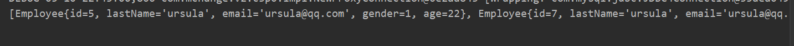

# 一、简介&集成MP环境

## 简介

 [MyBatis-Plus (opens new window)](https://github.com/baomidou/mybatis-plus)（简称 MP）是一个 [MyBatis (opens new window)](http://www.mybatis.org/mybatis-3/)的增强工具，在 MyBatis 的基础上只做增强不做改变，为简化开发、提高效率而生 

**特性**

- **无侵入**：只做增强不做改变，引入它不会对现有工程产生影响，如丝般顺滑
- **损耗小**：启动即会自动注入基本 CURD，性能基本无损耗，直接面向对象操作
- **强大的 CRUD 操作**：内置通用 Mapper、通用 Service，仅仅通过少量配置即可实现单表大部分 CRUD 操作，更有强大的条件构造器，满足各类使用需求
- **支持 Lambda 形式调用**：通过 Lambda 表达式，方便的编写各类查询条件，无需再担心字段写错
- **支持主键自动生成**：支持多达 4 种主键策略（内含分布式唯一 ID 生成器 - Sequence），可自由配置，完美解决主键问题
- **支持 ActiveRecord 模式**：支持 ActiveRecord 形式调用，实体类只需继承 Model 类即可进行强大的 CRUD 操作
- **支持自定义全局通用操作**：支持全局通用方法注入（ Write once, use anywhere ）
- **内置代码生成器**：采用代码或者 Maven 插件可快速生成 Mapper 、 Model 、 Service 、 Controller 层代码，支持模板引擎，更有超多自定义配置等您来使用
- **内置分页插件**：基于 MyBatis 物理分页，开发者无需关心具体操作，配置好插件之后，写分页等同于普通 List 查询
- **分页插件支持多种数据库**：支持 MySQL、MariaDB、Oracle、DB2、H2、HSQL、SQLite、Postgre、SQLServer 等多种数据库
- **内置性能分析插件**：可输出 Sql 语句以及其执行时间，建议开发测试时启用该功能，能快速揪出慢查询
- **内置全局拦截插件**：提供全表 delete 、 update 操作智能分析阻断，也可自定义拦截规则，预防误操作

## 集成MP环境

-  创建测试表

```sql
-- 创建库
CREATE DATABASE mp;
-- 使用库
USE mp;
-- 创建表
CREATE TABLE tbl_employee(
 id INT(11) PRIMARY KEY AUTO_INCREMENT,
 last_name VARCHAR(50),
 email VARCHAR(50),
 gender CHAR(1),
 age INT
);
INSERT INTO tbl_employee(last_name,email,gender,age) VALUES('cVzhanshi','tom@cvzhanshi.com',1,22);
INSERT INTO tbl_employee(last_name,email,gender,age) VALUES('Jerry','jerry@cvzhanshi.com',0,25);
INSERT INTO tbl_employee(last_name,email,gender,age) VALUES('Black','black@cvzhanshi.com',1,30);
INSERT INTO tbl_employee(last_name,email,gender,age) VALUES('White','white@cvzhanshi.com',0,35);

SELECT * FROM tbl_employee;
```

- 创建一个Maven项目
- 创建JavaBean

```java
public class Employee {

    private Integer id ;
    private String  lastName;
    private String  email ;
    private Integer gender;
    private Integer age ;
    ...
}
```

-  依赖配置 

```xml
 <dependencies>
        <!-- mp依赖
             mybatisPlus 会自动的维护Mybatis 以及MyBatis-spring相关的依赖
         -->
        <dependency>
            <groupId>com.baomidou</groupId>
            <artifactId>mybatis-plus</artifactId>
            <version>2.3</version>
        </dependency>
        <!--junit -->
        <dependency>
            <groupId>junit</groupId>
            <artifactId>junit</artifactId>
            <version>4.9</version>
        </dependency>
        <!-- log4j -->
        <dependency>
            <groupId>log4j</groupId>
            <artifactId>log4j</artifactId>
            <version>1.2.17</version>
        </dependency>
        <!-- c3p0 -->
        <dependency>
            <groupId>com.mchange</groupId>
            <artifactId>c3p0</artifactId>
            <version>0.9.5.2</version>
        </dependency>
        <!-- mysql -->
        <dependency>
            <groupId>mysql</groupId>
            <artifactId>mysql-connector-java</artifactId>
            <version>5.1.37</version>
        </dependency>
        <!-- spring -->
        <dependency>
            <groupId>org.springframework</groupId>
            <artifactId>spring-context</artifactId>
            <version>4.3.10.RELEASE</version>
        </dependency>
        <dependency>
            <groupId>org.springframework</groupId>
            <artifactId>spring-orm</artifactId>
            <version>4.3.10.RELEASE</version>
        </dependency>

    </dependencies>
```

-  加入 MyBatis 的全局配置文件

```xml
<?xml version="1.0" encoding="UTF-8" ?>
<!DOCTYPE configuration
        PUBLIC "-//mybatis.org//DTD Config 3.0//EN"
        "http://mybatis.org/dtd/mybatis-3-config.dtd">
<configuration>
</configuration>
```

-  加入 log4j.xml

```xml
<?xml version="1.0" encoding="UTF-8" ?>
        <!DOCTYPE log4j:configuration SYSTEM "log4j.dtd">
<log4j:configuration xmlns:log4j="http://jakarta.apache.org/log4j/">
    <appender name="STDOUT" class="org.apache.log4j.ConsoleAppender">
        <param name="Encoding" value="UTF-8" />
        <layout class="org.apache.log4j.PatternLayout">
            <param name="ConversionPattern" value="%-5p %d{MM-dd
HH:mm:ss,SSS} %m (%F:%L) \n" />
        </layout>
    </appender>
    <logger name="java.sql">
        <level value="debug" />
    </logger>
    <logger name="org.apache.ibatis">
        <level value="info" />
    </logger>
    <root>
        <level value="debug" />
        <appender-ref ref="STDOUT" />
    </root>
</log4j:configuration>
```

-  加入 db.properties 连接信息配置 

```properties
jdbc.driver=com.mysql.jdbc.Driver
jdbc.url=jdbc:mysql://localhost:3306/mp
jdbc.username=root
jdbc.password=cvzhanshi
```

-  加入 spring 的配置文件 applicationContext.xml

```xml
<?xml version="1.0" encoding="UTF-8"?>
<beans xmlns="http://www.springframework.org/schema/beans"
       xmlns:xsi="http://www.w3.org/2001/XMLSchema-instance"
       xmlns:context="http://www.springframework.org/schema/context"
       xmlns:tx="http://www.springframework.org/schema/tx"
       xmlns:mybatis-spring="http://mybatis.org/schema/mybatis-spring"
       xsi:schemaLocation="http://mybatis.org/schema/mybatis-spring
        http://mybatis.org/schema/mybatis-spring-1.2.xsd
        http://www.springframework.org/schema/beans
        http://www.springframework.org/schema/beans/spring-beans.xsd
        http://www.springframework.org/schema/context
        http://www.springframework.org/schema/context/spring-context-4.0.xsd
        http://www.springframework.org/schema/tx
        http://www.springframework.org/schema/tx/spring-tx-4.0.xsd">
    <!-- 数据源 -->
    <context:property-placeholder location="classpath:db.properties"/>

    <bean id="dataSource" class="com.mchange.v2.c3p0.ComboPooledDataSource">
        <property name="driverClass" value="${jdbc.driver}"></property>
        <property name="jdbcUrl" value="${jdbc.url}"></property>
        <property name="user" value="${jdbc.username}"></property>
        <property name="password" value="${jdbc.password}"></property>
    </bean>
    <!-- 事务管理器 -->
    <bean id="dataSourceTransactionManager" class="org.springframework.jdbc.datasource.DataSourceTransactionManager">
        <property name="dataSource" ref="dataSource"></property>
    </bean>
    <!-- 基于注解的事务管理 -->
    <tx:annotation-driven transaction-manager="dataSourceTransactionManager"/>


    <!--  配置SqlSessionFactoryBean
     Mybatis提供的: org.mybatis.spring.SqlSessionFactoryBean
     MP提供的:com.baomidou.mybatisplus.spring.MybatisSqlSessionFactoryBean
  -->
    <bean id="sqlSessionFactoryBean" class="com.baomidou.mybatisplus.spring.MybatisSqlSessionFactoryBean">
        <!-- 数据源 -->
        <property name="dataSource" ref="dataSource"></property>
        <property name="configLocation" value="classpath:mybatis-config.xml"></property>
        <!-- 别名处理 -->
        <property name="typeAliasesPackage"
                  value="com.cvzhanshi.entity"></property>
    </bean>
    <!--
    配置 mybatis 扫描 mapper 接口的路径
    -->
    <mybatis-spring:scan base-package="com.cvzhanshi.mapper"/>
</beans>
```

- 测试是否可以获得数据库连接

```java
@Test
    public void test() throws SQLException {
        DataSource dataSource = ioc.getBean("dataSource", DataSource.class);
        System.out.println(dataSource);

        Connection connection = dataSource.getConnection();
        System.out.println(connection);
    }
```

如图所示表示环境集成成功


-  集成 MP

>  Mybatis-Plus 的集成非常简单，对于 Spring，我们仅仅需要把 Mybatis 自带的 MybatisSqlSessionFactoryBean 替换为 MP 自带的即可 

```xml
<!--  配置SqlSessionFactoryBean
     Mybatis提供的: org.mybatis.spring.SqlSessionFactoryBean
     MP提供的:com.baomidou.mybatisplus.spring.MybatisSqlSessionFactoryBean
  -->
    <bean id="sqlSessionFactoryBean" class="com.baomidou.mybatisplus.spring.MybatisSqlSessionFactoryBean">
       ...
    </bean>
```

# 二、通用CRUD

 **实现方式:** 

基于 Mybatis ：需要编写 EmployeeMapper 接口，并手动编写 CRUD 方法 提供 EmployeeMapper.xml 映射文件，并手动编写每个方法对应的 SQL 语句. 

基于 MP ：只需要创建 EmployeeMapper 接口, 并继承 BaseMapper 接口.这就是使用 MP 需要完成的所有操作，甚至不需要创建 SQL 映射文件 

- 创建EmployeeMapper 接口

```java
public interface EmployeeMapper extends BaseMapper<Employee> {
}
```

## 插入操作

- **insert(T entity)方法**

```java
 @Test
    public void testCommonInsert(){
        Employee employee = new Employee("ursula", "ursula@qq.com", 1, 22);
        Integer result = employeeMapper.insert(employee);
        System.out.println(result);
    }
```

-  **@TableId注解**

> - value: 指定表中的主键列的列名， 如果实体属性名与列名一致，可以省略不指定
> - type: 指定主键策略
>
> 使用场景：当主键的列名与属性名不一致或者主键策略不同时使用
>
> 当然也可以通过全局策略配置解决此问题，全局策略配置往后看

```java
@TableId(value="id" , type = IdType.AUTO)
    private Integer id ;
```

- **@TableName注解**

> 使用场景：当数据库表名与javaBean的类名不匹配时，用此注解绑定JavaBean与表
>
> 当然也可以通过全局策略配置解决此问题，全局策略配置往后看

```java
@TableName(value="tbl_employee")
public class Employee {
}
```

- **全局策略配置**

> 使用场景：像上述的注解，每个JavaBean都需要进行注解，那么我们用全局策略配置解决此问题

```xml
 <!-- 定义MybatisPlus的全局策略配置-->
    <bean id ="globalConfiguration" class="com.baomidou.mybatisplus.entity.GlobalConfiguration">
        <!-- 在2.3版本以后，dbColumnUnderline 默认值就是true 驼峰命名对应-->
        <property name="dbColumnUnderline" value="true"></property>

        <!-- 全局的主键策略 -->
        <property name="idType" value="0"></property>

        <!-- 全局的表前缀策略配置 -->
        <property name="tablePrefix" value="tbl_"></property>

    </bean>
```

**注意**：一定要在MybatisSqlSessionFactoryBean中注入才能生效

```xml
<bean id="sqlSessionFactoryBean" class="com.baomidou.mybatisplus.spring.MybatisSqlSessionFactoryBean">
      ...
        <!-- 注入全局MP策略配置 -->
        <property name="globalConfig" ref="globalConfiguration"></property>
    </bean>
```

- **@TableField注解**

> 使用场景：当属性名也数据库表中的列名不一样时或者不遵守驼峰命名规则，可以使用此注解进行绑定列名
>
> 其注解中有：value和exist属性
>
> - value：对应表种列名
> - exist：是否为数据库中的表字段

场景一：

当属性名也数据库表中的列名不一样

```java
@TableField(value="last_name")
private String lastName;
```

场景二：

JavaBean属性不是数据库中的表字段

```java
public class Employee {
  
    private Integer id ;
    private String  lastName;
    private String  email ;
    private Integer gender;
    private Integer age ;
    private Double salary ;
}

@Test
    public void testCommonInsert(){
        Employee employee = new Employee("ursula", "ursula@qq.com", 1, 22,99.5);
        Integer result = employeeMapper.insert(employee);
        System.out.println(result);
    }
```

会报错：


解决方法：

```java
@TableField(exist=false)
    private Double salary ;
```

- **插入数据获取主键值**

> 支持主键自增的数据库插入数据获取主键值 
>
> - Mybatis: 需要通过 useGeneratedKeys 以及 keyProperty 来设置 
>
> - MP: 自动将主键值回写到实体类中 

```java
@Test
    public void testCommonInsert(){
        Employee employee = new Employee("ursula", "ursula@qq.com", 1, 22);
        Integer result = employeeMapper.insert(employee);

        System.out.println("result: " + result );

        //获取当前数据在数据库中的主键值
        Integer key = employee.getId();
        System.out.println("key:" + key );
    }
```

-  **insertAllColumn(T entity)方法**

> - insert方法在插入时， 会根据实体类的每个属性进行非空判断，只有非空的属性对应的字段才会出现到SQL语句中
> - insertAllColumn方法在插入时， 不管属性是否非空， 属性所对应的字段都会出现到SQL语句中

## 更新操作

- **updateById(T entity)方法**

> 通过id修改数据表，返回影响行数
>
> 会根据实体类的每个属性进行非空判断，只有非空的属性对应的字段才会出现到SQL语句中

```java
@Test
    public void testCommonUpdate(){
        Employee employee = new Employee(6,"cvzhanshi", "cvzhanshi@163.com", 1, 22);
        Integer result = employeeMapper.updateById(employee);
       
        System.out.println(result);
    }
```

- **updateAllColumnById(T entity)方法**

> 通过id修改数据表，返回影响行数
>
> 不管属性是否非空， 属性所对应的字段都会出现到SQL语句中

```java
@Test
    public void testCommonUpdate(){
        Employee employee = new Employee(6,"cvzhanshi", "cvzhanshi@163.com", 1, 22);
       
        Integer result = employeeMapper.updateAllColumnById(employee);
        System.out.println(result);
    }
```

## 查询操作

- **T selectById(Serializable id)方法**

> 通过id查询

```java
@Test
    public void testCommonSelect(){
        Employee employee = employeeMapper.selectById(6);
        System.out.println(employee);

        
    }
```

查询结果


-  **selectOne(@Param("ew") T entity)**

> 通过entity中的非空属性查询

```java
 @Test
    public void testCommonSelect(){
        Employee employee1 = new Employee();
        employee1.setId(6);
        employee1.setLastName("cvzhanshi");
        employee1.setGender(1);
        Employee employee2 = employeeMapper.selectOne(employee1);
        System.out.println(employee2);


    }
```

**其中**它发出的sql语句是：


条件包含employee中的非空属性

查询结果：


**注意：**此方法只能返回null或者一个记录，如果匹配了多个记录会报错

制造场景：


```java
 @Test
    public void testCommonSelect(){
        Employee employee1 = new Employee();
        employee1.setLastName("ursula");
        employee1.setGender(1);
        Employee employee2 = employeeMapper.selectOne(employee1);
        System.out.println(employee2);


    }
```


-  **selectBatchIds(List idList)方法**

> 通过id批量查询，id封装正在list中

```java
@Test
    public void testCommonSelect(){
        //3、通过多个id查询记录
        List<Integer> idList = new ArrayList<>();
        idList.add(4);
        idList.add(5);
        idList.add(6);
        List<Employee> employees = employeeMapper.selectBatchIds(idList);
        System.out.println(employees);

    }
```

查询结果


其中发出的sql代码：


-  **selectByMap(@Param("cm") Map columnMap) 方法**

> 此方法通过map封装查询条件，map的key是列名，map的值是值
>
> **注意**：map的key必须是列名不能写JavaBean的属性名（属性名与表的列名不一样时）

```java
 @Test
    public void testCommonSelect(){
        //4、通过map封装条件查询
        Map<String,Object> columnMap = new HashMap<>();
        columnMap.put("last_name","ursula");
        //columnMap.put("email","cvzhanshi@163.com");

        List<Employee> employees = employeeMapper.selectByMap(columnMap);
        System.out.println(employees);

    }
```

查询结果



其中发出的sql：


**错误的示范：**

```java
@Test
    public void testCommonSelect(){
        //4、通过map封装条件查询
        Map<String,Object> columnMap = new HashMap<>();
        columnMap.put("lastName","ursula");
        List<Employee> employees = employeeMapper.selectByMap(columnMap);
        System.out.println(employees);

    }
```


发出的sql


-  **selectPage(RowBounds rowBounds, @Param("ew") Wrapper wrapper) 方法**

> 分页查询，但是此处并不是真正意义上的物理分页（sql使用了limit）

```java
@Test
    public void testCommonSelect(){
        //5、分页查询
        List<Employee> employees = employeeMapper.selectPage(new Page<>(3, 2), null);

        System.out.println(employees);

    }
```

> 说明：传入page参数，构造器第一个参数是查询的页数，第二个参数是每页页数

查询结果


发出的sql


## 删除操作

-   **deleteById(Serializable id)方法**

> 根据id删除对应的记录，返回影响的行数

```java
 @Test
    public void testCommonDelete(){
        //1、根据id删除
        Integer integer = employeeMapper.deleteById(4);
        System.out.println(integer);
    }
```

删除结果


-  **deleteByMap(@Param("cm") Map columnMap)**方法

> 把删除条件封装在map中，map的key是列名，map的值是值，返回影响的行数
>
> **注意**：map的key必须是列名不能写JavaBean的属性名（属性名与表的列名不一样时）

```java
@Test
    public void testCommonDelete(){
        //2、通过map封装条件删除
        Map<String,Object> columnMap = new HashMap<>();
        columnMap.put("last_name","ursula");
        columnMap.put("email","ursula@qq.com");
        Integer integer = employeeMapper.deleteByMap(columnMap);
        System.out.println(integer);
    }
```

运行后


-  **deleteBatchIds(List idList) 方法**

> 通过id批量删除，id封装在list中，返回影响的行数

```java
@Test
    public void testCommonDelete(){
        //3、通过list中的id批量删除
        List<Integer> list = new ArrayList<>();
        list.add(3);
        list.add(6);
        Integer integer = employeeMapper.deleteBatchIds(list);

        System.out.println(integer);
    }
```

删除后


## MP启动注入SQL原理分析 

- 问题： xxxMapper 继承了 BaseMapper, BaseMapper 中提供了通用的 CRUD 方法, 方法来源于 BaseMapper, 有方法就必须有 SQL, 因为 MyBatis 最终还是需要通过 SQL 语句操作数据 

-  通过现象看到本质

  -   employeeMapper 的本质 org.apache.ibatis.binding.MapperProxy 
  -  MapperProxy 中 sqlSession –>SqlSessionFactory

  
  -  SqlSessionFacotry 中 → Configuration→ MappedStatements。其中每一个 mappedStatement 都表示 Mapper 接口中的一个方法与 Mapper 映射文件 中的一个 SQL

  >  MP 在启动就会挨个分析 xxxMapper 中的方法，并且将对应的 SQL 语句处理好，保存到 configuration 对象中的mappedStatements中 

- 本质：


```properties
Configuration： MyBatis 或者 MP 全局配置对象
MappedStatement：一个 MappedStatement 对象对应 Mapper 配置文件中的一个
			select/update/insert/delete 节点，主要描述的是一条 SQL 语句
SqlMethod : 枚举对象 ，MP 支持的 SQL 方法
TableInfo：数据库表反射信息 ，可以获取到数据库表相关的信息
SqlSource: SQL 语句处理对象
MapperBuilderAssistant： 用于缓存、SQL 参数、查询方剂结果集处理等.
     通过 MapperBuilderAssistant 将每一个 mappedStatement 
    添加到 configuration 中的 mappedstatements 中
```


## 小结

>  以上是基本的 CRUD 操作，如您所见，我们仅仅需要继承一个 BaseMapper 即可实现 大部分单表 CRUD 操作。BaseMapper 提供了多达 17 个方法给大家使用, 可以极其方 便的实现单一、批量、分页等操作。极大的减少开发负担。

# 三、条件构造器 EntityWrapper & ActiveRecord(活动记录) 

## 条件构造器 EntityWrapper

-  Mybatis-Plus 通过 EntityWrapper（简称 EW，MP 封装的一个查询条件构造器）或者 Condition（与 EW 类似） 来让用户自由的构建查询条件，简单便捷，没有额外的负担， 能够有效提高开发效率
-  实体包装器，主要用于处理 sql 拼接，排序，实体参数查询等
-  **注意: 使用的是数据库字段，不是 Java 属性**

-  条件参数说明


###  带条件的查询

> 需要分页查询tbl_employee表中，年龄在18~50之间且性别为男且姓名为Tom的所有用户

```java
 @Test
    public void testEntityWrapperSelect() {
        //我们需要分页查询tbl_employee表中，年龄在18~50之间且性别为男且姓名为Tom的所有用户
		List<Employee> emps =employeeMapper.selectPage(new Page<Employee>(1, 4),
					new EntityWrapper<Employee>()
					.between("age", 18, 50)
					.eq("gender", 1)
					.eq("last_name", "Tom")
				);
		System.out.println(emps);
    }
```

> 查询tbl_employee表中， 性别为女并且名字中带有"老师" 或者  邮箱中带有"a"

```java
 @Test
    public void testEntityWrapperSelect() {
		List<Employee> emps = employeeMapper.selectList(
				new EntityWrapper<Employee>()
				.eq("gender", 0)
				.like("last_name", "老师")
				//.or()    // SQL: (gender = ? AND last_name LIKE ? OR email LIKE ?)
				.orNew()   // SQL: (gender = ? AND last_name LIKE ?) OR (email LIKE ?)
				.like("email", "a")
				);
		System.out.println(emps);
```

说明：or()与orNew()的区别：发出的sql不同

or()     SQL: (gender = ? AND last_name LIKE ? OR email LIKE ?)
orNew()    SQL: (gender = ? AND last_name LIKE ?) OR (email LIKE ?)

> 查询性别为女的, 根据age进行排序(asc/desc), 简单分页

```java
@Test
    public void testEntityWrapperSelect() {
        // 查询性别为女的, 根据age进行排序(asc/desc), 简单分页

		List<Employee> emps  = employeeMapper.selectList(
				new EntityWrapper<Employee>()
				.eq("gender", 0)
				.orderBy("age")
				//.orderDesc(Arrays.asList(new String [] {"age"}))
				.last("desc limit 1,3")
				);
		System.out.println(emps);

    }
```

说明：last()是直接拼接在sql上，所以有sql注入问题，小心使用

###  带条件的修改

```java
@Test
    public void testEntityWrapperUpdate() {

        Employee employee = new Employee();
        employee.setLastName("苍老师");
        employee.setEmail("cls@sina.com");
        employee.setGender(0);


        employeeMapper.update(employee,
                new EntityWrapper<Employee>()
                        .eq("last_name", "Tom")
                        .eq("age", 44)
        );
    }
```

###  带条件的删除

```java
@Test
    public void testEntityWrapperDelete() {

        employeeMapper.delete(
                new EntityWrapper<Employee>()
                        .eq("last_name", "Tom")
                        .eq("age", 22)
        );
    }
```

###  Condition的使用

> Condition和EntitWarapper都继承了Warapper，所以用法相似

```java
@Test
    public void testEntityWrapperSelect() {
        //我们需要分页查询tbl_employee表中，年龄在18~50之间且性别为男且姓名为Tom的所有用户
        List<Employee > emps = employeeMapper.selectPage(
                new Page<Employee>(1,2),
                Condition.create()
                        .between("age", 18, 50)
                        .eq("gender", "1")
                        .eq("last_name", "Tom")

        );
    }
```

## ActiveRecord(活动记录)

>  Active Record(活动记录)，是一种领域模型模式，特点是一个模型类对应关系型数据库中的 一个表，而模型类的一个实例对应表中的一行记录

**如何使用 AR 模式**

-  仅仅需要让实体类继承 Model 类且实现主键指定方法，即可开启 AR 之旅

```java
public class Employee extends Model<Employee> {
    private Integer id ;
    private String  lastName;
    private String  email ;
    private Integer gender;
    private Integer age ;
    @TableField(exist=false)
    private Double salary ;

    /**
     * 指定当前实体类的主键属性
     * @return
     */
    @Override
    protected Serializable pkVal() {
        return this.id;
    }
    ...
}
```

### AR插入操作

> 根据一个Employee对象中的属性，通过对象调用父类Model中的插入方法，把自身插入到数据库中，返回操作是否成功

```java
 /**
     * AR  插入操作
     */
    @Test
    public void  testARInsert() {
        Employee employee = new Employee();
        employee.setLastName("宋老师");
        employee.setEmail("sls@atguigu.com");
        employee.setGender(1);
        employee.setAge(35);

        boolean result = employee.insert();
        System.out.println("result:" +result );
    }
```


### AR修改操作

> 根据一个Employee对象中的属性，通过对象调用父类Model中的修改方法，根据id修改其数据库中的内容，返回操作是否成功

```java
/**
     * AR 修改操作
     */
    @Test
    public void testARUpdate() {
        Employee employee = new Employee();
        employee.setId(10);
        employee.setLastName("宋老湿");
        employee.setEmail("sls@atguigu.com");
        employee.setGender(1);
        employee.setAge(36);

        boolean result = employee.updateById();
        System.out.println("result:" +result );

    }
```


### AR查询操作

-   **T selectById() 方法**

> 这是个重载方法，可以不传参，通过employee中的自身id查询，也可以手动传入id查询，返回查询到的结果

```java
@Test
    public void testARSelect() {
        Employee employee = new Employee();
		//手动传参
        Employee result = employee.selectById(14);
        
        //不传参，使用对象中的自身id
		//employee.setId(14);
		//Employee result = employee.selectById();
		System.out.println(result );

    }
```


-   **List selectAll() 方法**

> 查询所有记录，返回一个list

```java
@Test
    public void testARSelect() {
        Employee employee = new Employee();

		List<Employee> emps = employee.selectAll();
		System.out.println(emps);
    }
```


-  **List selectList(Wrapper wrapper)**

> 通过条件构造器查询，把条件封装在Wrapper中,返回查询到的结果集

```java
@Test
    public void testARSelect() {
        Employee employee = new Employee();
		List<Employee > emps=
				employee.selectList(new EntityWrapper<Employee>().like("last_name", "To"));
		System.out.println(emps);

    }
```


-   **int selectCount(Wrapper wrapper)方法** 

> 通过条件构造器查询，把条件封装在Wrapper中,返回查询到的记录数

```Java
@Test
    public void testARSelect() {
        Employee employee = new Employee();
        Integer result = employee.selectCount(new EntityWrapper<Employee>().eq("gender", 1));
        System.out.println("result: " +result );


    }
```


### AR删除操作

-  **boolean deleteById()** 

> 这是个重载方法，可以不传参，通过employee中的自身id查询，也可以手动传入id查询，返回操作的结果
>
> 注意：删除不存在的数据理论上也算删除成功会返回true

```java
@Test
    public void testARDelete() {

        Employee employee = new Employee();
        //手动传参
        boolean result = employee.deleteById(2);
        
       	//用兑现本身的参数
//		employee.setId(2);
//		boolean result = employee.deleteById();
		System.out.println("result:" +result );
    }
```


-  **boolean delete(Wrapper wrapper) 方法**

> 封装条件删除指定记录

```java
 @Test
    public void testARDelete() {

        Employee employee = new Employee();
        boolean result = employee.delete(new EntityWrapper<Employee>().like("last_name", "老师"));
        System.out.println(result );
    }
```


###  分页复杂操作

```java
 @Test
    public void  testARPage() {

        Employee employee = new Employee();

        Page<Employee> page = employee.selectPage(new Page<>(1, 1),
                new EntityWrapper<Employee>().like("last_name", "Tom"));
        List<Employee> emps = page.getRecords();
        System.out.println(emps);
    }
```

### 小结

-  AR 模式提供了一种更加便捷的方式实现 CRUD 操作，其本质还是调用的 Mybatis 对 应的方法，类似于语法糖  
  -  语法糖是指计算机语言中添加的某种语法，这种语法对原本语言的功能并没有影响. 可以更方便开发者使用，可以避免出错的机会，让程序可读性更好

# 四、代码生成器

-  MP 提供了大量的自定义设置，生成的代码完全能够满足各类型的需求
-  MP 的代码生成器 和 Mybatis MBG 代码生成器
  -  MP 的代码生成器都是基于 java 代码来生成。MBG 基于 xml 文件进行代码生成 
  -  MyBatis 的代码生成器可生成: 实体类、Mapper 接口、Mapper 映射文件 
  -  MP 的代码生成器可生成: 实体类(可以选择是否支持 AR)、Mapper 接口、Mapper 映射 文件、 Service 层、Controller 层
-  表及字段命名策略选择
  -  在 MP 中，我们建议数据库表名 和 表字段名采用驼峰命名方式， 如果采用下划 线命名方式 请开启全局下划线开关，如果表名字段名命名方式不一致请注解指定
  -  这么做的原因是为了避免在对应实体类时产生的性能损耗，这样字段不用做映射就能直 接和实体类对应。当然如果项目里不用考虑这点性能损耗，那么你采用下滑线也是没问 题的，只需要在生成代码时配置 dbColumnUnderline 属性就可以

**使用步骤**：

-  模板引擎，加入 Apache Velocity 的依赖 

```xml
<dependency>
 <groupId>org.apache.velocity</groupId>
 <artifactId>velocity-engine-core</artifactId>
 <version>2.0</version>
</dependency>
```

-  加入 slf4j ,查看日志输出信息

```xml
<dependency>
    <groupId>org.slf4j</groupId>
    <artifactId>slf4j-api</artifactId>
    <version>1.7.7</version>
</dependency>
<dependency>
    <groupId>org.slf4j</groupId>
    <artifactId>slf4j-log4j12</artifactId>
    <version>1.7.7</version>
</dependency>
```

- MP本需要的依赖

```xml
<dependencies>
        <!-- mp依赖
             mybatisPlus 会自动的维护Mybatis 以及MyBatis-spring相关的依赖
         -->
        <dependency>
            <groupId>com.baomidou</groupId>
            <artifactId>mybatis-plus</artifactId>
            <version>2.3</version>
        </dependency>
        <!--junit -->
        <dependency>
            <groupId>junit</groupId>
            <artifactId>junit</artifactId>
            <version>4.9</version>
        </dependency>
        <!-- log4j -->
        <dependency>
            <groupId>log4j</groupId>
            <artifactId>log4j</artifactId>
            <version>1.2.17</version>
        </dependency>
        <!-- c3p0 -->
        <dependency>
            <groupId>com.mchange</groupId>
            <artifactId>c3p0</artifactId>
            <version>0.9.5.2</version>
        </dependency>
        <!-- mysql -->
        <dependency>
            <groupId>mysql</groupId>
            <artifactId>mysql-connector-java</artifactId>
            <version>5.1.37</version>
        </dependency>
        <!-- spring -->
        <dependency>
            <groupId>org.springframework</groupId>
            <artifactId>spring-context</artifactId>
            <version>4.3.10.RELEASE</version>
        </dependency>
        <dependency>
            <groupId>org.springframework</groupId>
            <artifactId>spring-orm</artifactId>
            <version>4.3.10.RELEASE</version>
        </dependency>
        <dependency>
            <groupId>org.springframework</groupId>
            <artifactId>spring-webmvc</artifactId>
            <version>4.3.10.RELEASE</version>
        </dependency>

    </dependencies>

```

- 编写 MP代码生成器示例代码

```java
/**
     * 代码生成    示例代码
     */
    @Test
    public void  testGenerator() {
        //1. 全局配置
        GlobalConfig config = new GlobalConfig();
        config.setActiveRecord(true) // 是否支持AR模式
                .setAuthor("cVzhanshi") // 作者
                .setOutputDir("E:\\study\\Java\\workspace\\workspace_idea1\\Mybatis-Plus_workspace\\mp03\\src\\main\\java") // 生成路径
                .setFileOverride(true)  // 文件覆盖
                .setIdType(IdType.AUTO) // 主键策略
                .setServiceName("%sService")  // 设置生成的service接口的名字的首字母是否为I
                // IEmployeeService
                .setBaseResultMap(true)   //设置一些通用的resultMap
                .setBaseColumnList(true);  //设置一些通用的列

        //2. 数据源配置
        DataSourceConfig dsConfig  = new DataSourceConfig();
        dsConfig.setDbType(DbType.MYSQL)  // 设置数据库类型
                .setDriverName("com.mysql.jdbc.Driver")
                .setUrl("jdbc:mysql://localhost:3306/mp")
                .setUsername("root")
                .setPassword("cvzhanshi");

        //3. 策略配置
        StrategyConfig stConfig = new StrategyConfig();
        stConfig.setCapitalMode(true) //全局大写命名
                .setDbColumnUnderline(true)  // 指定表名 字段名是否使用下划线
                .setNaming(NamingStrategy.underline_to_camel) // 数据库表映射到实体的命名策略(下划线转驼峰)
                .setTablePrefix("tbl_")
                .setInclude("tbl_employee");  // 生成的表

        //4. 包名策略配置
        PackageConfig pkConfig = new PackageConfig();
        pkConfig.setParent("com.cvzhanshi.mp")
                .setMapper("mapper")
                .setService("service")
                .setController("controller")
                .setEntity("entity")
                .setXml("mapper");

        //5. 整合配置
        AutoGenerator ag = new AutoGenerator();

        ag.setGlobalConfig(config)
                .setDataSource(dsConfig)
                .setStrategy(stConfig)
                .setPackageInfo(pkConfig);

        //6. 执行
        ag.execute();
    }
```

运行结果：


其中:

```java
/**
     * EmployeeServiceImpl  继承了ServiceImpl
     * 1. 在ServiceImpl中已经完成Mapper对象的注入,直接在EmployeeServiceImpl中进行使用
     * 2. 在ServiceImpl中也帮我们提供了常用的CRUD方法， 基本的一些CRUD方法在Service中不需要我们自己定义.
     *
     *
     */
```

# 五、插件扩展

## Mybatis 插件机制简介

[ Mybatis 插件机制简介](https://blog.csdn.net/qq_45408390/article/details/116564824)

## 分页插件

> com.baomidou.mybatisplus.plugins.PaginationInterceptor
>
> 说明：此分页不同于之前的分页查询，之气的分页查询是基于内存的分页，这个是基于数据库的，sql中带有limit字段

- 在配置文件中注册分页插件

```xml
<bean id="sqlSessionFactoryBean" class="com.baomidou.mybatisplus.spring.MybatisSqlSessionFactoryBean">
      ...
        <!-- 插件注册 -->
        <property name="plugins">
            <list>
                <!-- 注册分页插件 -->
                <bean class="com.baomidou.mybatisplus.plugins.PaginationInterceptor"></bean>
            </list>

        </property>
    </bean>
```

- 使用

```java
@Test
    public void testPage() {

        Page<Employee> page = new Page<>(1,1);

        List<Employee > emps =
                employeeMapper.selectPage(page, null);
        System.out.println(emps);


        System.out.println("===============获取分页相关的一些信息======================");

        System.out.println("总条数:" +page.getTotal());
        System.out.println("当前页码: "+  page.getCurrent());
        System.out.println("总页码:" + page.getPages());
        System.out.println("每页显示的条数:" + page.getSize());
        System.out.println("是否有上一页: " + page.hasPrevious());
        System.out.println("是否有下一页: " + page.hasNext());

        //将查询的结果封装到page对象中
        page.setRecords(emps);


    }
```


##  执行分析插件

> - com.baomidou.mybatisplus.plugins.SqlExplainInterceptor
> -  SQL 执行分析拦截器，只支持 MySQL5.6.3 以上版本
> -  该插件的作用是分析 DELETE UPDATE 语句,防止小白 或者恶意进行 DELETE UPDATE 全表操作
> -  只建议在开发环境中使用，不建议在生产环境使用
> -  在插件的底层 通过 SQL 语句分析命令:Explain 分析当前的 SQL 语句， 根据结果集中的 Extra 列来断定当前是否全表操作

- 在配置文件中注册插件

```xml
<bean id="sqlSessionFactoryBean" class="com.baomidou.mybatisplus.spring.MybatisSqlSessionFactoryBean">
      ...
        <!-- 插件注册 -->
       <!-- 注册执行分析插件 -->
                <bean class="com.baomidou.mybatisplus.plugins.SqlExplainInterceptor">
			<!--如果是全表删除就停止操作-->
                    <property name="stopProceed" value="true"></property>
                </bean>
            </list>
        </property>
    </bean>
```

- 测试

```java
@Test
    public void testSQLExplain() {

        employeeMapper.delete(null);  // 全表删除
    }
```


> 说明：注册了插件不一定有用，一定要把stopProceed加上值为true

##  性能分析插件

> -  com.baomidou.mybatisplus.plugins.PerformanceInterceptor 
> -  性能分析拦截器，用于输出每条 SQL 语句及其执行时间
> -  SQL 性能执行分析,开发环境使用，超过指定时间，停止运行。有助于发现问题

- 配置文件中注册插件

```xml
<!-- 注册性能分析插件 -->
<bean class="com.baomidou.mybatisplus.plugins.PerformanceInterceptor">
    <!--格式化sql语句-->
    <property name="format" value="true"></property>
    <!--设置超时时间-->
    <property name="maxTime" value="5"></property>
</bean>
```

- 测试（未设置超时时间）

```java
@Test
    public void testPerformance() {
        Employee employee = new Employee();
        employee.setLastName("玛利亚老师");
        employee.setEmail("mly@sina.com");
        employee.setGender("0");
        employee.setAge(22);
        employeeMapper.insert(employee);

    }
```


- 测试（设置超时时间为5ms）


##  乐观锁插件

> -  com.baomidou.mybatisplus.plugins.OptimisticLockerInterceptor 
> -  如果想实现如下需求: 当要更新一条记录的时候，希望这条记录没有被别人更新
> -  乐观锁的实现原理:
>   -  取出记录时，获取当前 version 2
>   -  更新时，带上这个 version 2 
>   -  执行更新时， set version = yourVersion+1 where version = yourVersion
>   -  如果 version 不对，就更新失败
> -  @Version 用于注解实体字段，必须要有

- 配置文件中注册插件

```xml
<!-- 注册乐观锁插件 -->
<bean class="com.baomidou.mybatisplus.plugins.OptimisticLockerInterceptor">
</bean>
```

- 添加version字段加上@Version注解

```JAVA
@Version
private Integer version ;

public Integer getVersion() {
	return version;
}

public void setVersion(Integer version) {
	this.version = version;
}
```

- 数据库添加相应的列


- 测试（version与数据库中相同）

```java
@Test
    public void testOptimisticLocker() {
        //更新操作
        Employee employee = new Employee();
        employee.setId(15);
        employee.setLastName("TomAA");
        employee.setEmail("tomAA@sina.com");
        employee.setGender("1");
        employee.setAge(22);
        //与数据库中相同
        employee.setVersion(1);

        employeeMapper.updateById(employee);

    }
```


- 测试（version与数据不同）

```
@Test
    public void testOptimisticLocker() {
        //更新操作
        Employee employee = new Employee();
        employee.setId(15);
        employee.setLastName("cvzhanshi");
        employee.setEmail("tomAA@sina.com");
        employee.setGender("1");
        employee.setAge(22);
        //与数据库中不同
        employee.setVersion(1);

        employeeMapper.updateById(employee);

    }
```


# 六、自定义全局操作

##  AutoSqlInjector

> -  根据 MybatisPlus 的 AutoSqlInjector 可以自定义各种你想要的 sql ,注入到全局中，相当于自 定义 Mybatisplus 自动注入的方法
> -  之前需要在 xml 中进行配置的 SQL 语句，现在通过扩展 AutoSqlInjector 在加载 mybatis 环境 时就注入

**使用步骤**

-  在 Mapper 接口中定义相关的 CRUD 方法

```java
public interface EmployeeMapper extends BaseMapper<Employee> {
    int deleteAll();
}
```

-  扩展 AutoSqlInjector inject 方法，实现 Mapper 接口中方法要注入的 SQL

```java
/**
 * 自定义全局操作
 */
public class MySqlInjector  extends AutoSqlInjector {

    /**
     * 扩展inject 方法，完成自定义全局操作
     */
    @Override
    public void inject(Configuration configuration, MapperBuilderAssistant builderAssistant, Class<?> mapperClass,
                       Class<?> modelClass, TableInfo table) {
        //将EmployeeMapper中定义的deleteAll， 处理成对应的MappedStatement对象，加入到configuration对象中。

        //注入的SQL语句
        String sql = "delete from " +table.getTableName();
        //注入的方法名   一定要与EmployeeMapper接口中的方法名一致
        String method = "deleteAll" ;

        //构造SqlSource对象
        SqlSource sqlSource = languageDriver.createSqlSource(configuration, sql, modelClass);

        //构造一个删除的MappedStatement
        this.addDeleteMappedStatement(mapperClass, method, sqlSource);

    }
}
```

-  在 MP 全局策略中，配置 自定义注入器

```xml
<!-- 定义MybatisPlus的全局策略配置-->
    <bean id ="globalConfiguration" class="com.baomidou.mybatisplus.entity.GlobalConfiguration">
       ...
        <!--注入自定义全局操作 -->
		<property name="sqlInjector" ref="mySqlInjector"></property>
        
    </bean>

    <!-- 定义自定义注入器 -->
    <bean id="mySqlInjector" class="com.cvzhanshi.mp.injector.MySqlInjector"></bean>
```

- 测试

```java
@Test
    public void  testMySqlInjector() {
        Integer result = employeeMapper.deleteAll();
        System.out.println("result: " +result );
    }
```


## 逻辑删除

>  假删除、逻辑删除: 并不会真正的从数据库中将数据删除掉，而是将当前被删除的这条数据 中的一个逻辑删除字段置为删除状态.  
>
> tbl_user logic_flag = 1 → -1  
>
> - com.baomidou.mybatisplus.mapper.LogicSqlInjector

- 在配置文件中注入LogicSqlInjector

```xml
<!-- 定义MybatisPlus的全局策略配置-->
    <bean id ="globalConfiguration" class="com.baomidou.mybatisplus.entity.GlobalConfiguration">
       ...
        <!--注入自定义全局操作 -->
		<property name="sqlInjector" ref="logicSqlInjector"></property>
        
    </bean>
<!-- 逻辑删除 -->
	<bean id="logicSqlInjector" class="com.baomidou.mybatisplus.mapper.LogicSqlInjector"></bean>
```

-  logicDeleteValue 逻辑删除全局值 和 logicNotDeleteValue 逻辑未删除全局值 

```xml
 <!-- 定义MybatisPlus的全局策略配置-->
    <bean id ="globalConfiguration" class="com.baomidou.mybatisplus.entity.GlobalConfiguration">
      ...
        <!-- 注入逻辑删除全局值 -->
        <property name="logicDeleteValue" value = "-1"></property>
        <property name="logicNotDeleteValue" value="1"></property>

        <property name="sqlInjector" ref="logicSqlInjector"></property>
    </bean>

```

-  在 POJO 的逻辑删除字段 添加 @TableLogic 注解

```java
public class User{
    private Integer id  ;

    private String name ;

    @TableLogic   // 逻辑删除属性
    private Integer logicFlag ;
}
```

- 实现原理

>  会在 mp 自带查询和更新方法的 sql 后面，追加『逻辑删除字段』=『LogicNotDeleteValue 默认值』 删除方法: deleteById()和其他 delete 方法, 底层 SQL 调用的是 update tbl_xxx  set 『逻辑删除字段』=『logicDeleteValue 默认值』 

- 测试

```java
/**
     * 测试逻辑删除
     */
    @Test
    public void testLogicDelete() {

		Integer result = userMapper.deleteById(1);
		System.out.println("result:" +result );
        
         User user = userMapper.selectById(1);
        System.out.println(user);

    }
```


# 七、 公共字段自动填充

> 使用场景：当我们插入或者修改数据是，我们希望有些字段没有值可以给他自动填充一个值

-  注解填充字段 @TableFile(fill = FieldFill.INSERT) 

```java
public class User {
    private Integer id;

    @TableField(fill= FieldFill.INSERT_UPDATE)
    private String name;
    ...
}
```

-  自定义公共字段填充处理器

> 需要实现 com.baomidou.mybatisplus.mapper.MetaObjectHandler接口

```java
/**
 * 自定义公共字段填充处理器
 */
public class MyMetaObjectHandler extends MetaObjectHandler {

    /**
     * 插入操作 自动填充
     */
    @Override
    public void insertFill(MetaObject metaObject) {
        //获取到需要被填充的字段的值
        Object fieldValue = getFieldValByName("name", metaObject);
        if(fieldValue == null) {
            System.out.println("*******插入操作 满足填充条件*********");
            setFieldValByName("name", "insertCvzhanshi", metaObject);
        }

    }
    /**
     * 修改操作 自动填充
     */
    @Override
    public void updateFill(MetaObject metaObject) {
        Object fieldValue = getFieldValByName("name", metaObject);
        if(fieldValue == null) {
            System.out.println("*******修改操作 满足填充条件*********");
            setFieldValByName("updateCvzhanshi", "weiyh", metaObject);
        }
    }

}
```

-  MP 全局注入 自定义公共字段填充处理器

```xml
<!-- 定义MybatisPlus的全局策略配置-->
    <bean id ="globalConfiguration" class="com.baomidou.mybatisplus.entity.GlobalConfiguration">
       ...
        <property name="metaObjectHandler" ref="myMetaObjectHandler"></property>
    </bean>

<!--自动填充-->
    <bean id="myMetaObjectHandler" class="com.cvzhanshi.mp.metaObjectHandler.MyMetaObjectHandler"></bean>
```

- 测试

```java
@Test
    public void testMetaObjectHandler() {
        User user = new User();
        //user.setName("Tom");

        user.setId(5);
        user.setLogicFlag(1);

        userMapper.updateById(user);
    }
```


