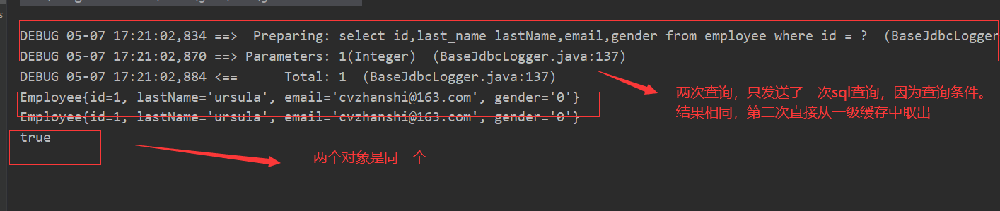
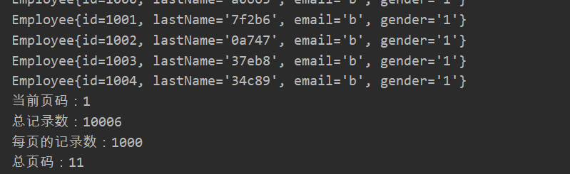

# 一、Mybatis简介

## 概述

-  MyBatis 是支持定制化 SQL、存储过程以及高级映射的优秀的持久层框架
-  MyBatis 避免了几乎所有的 JDBC 代码和手动设 置参数以及获取结果集
-  MyBatis可以使用简单的XML或注解用于配置和原 始映射，将接口和Java的POJO（Plain Old Java  Objects，普通的Java对象）映射成数据库中的记录

## Mybatis的优势

- MyBatis是一个半自动化的持久化层框架 
-  JDBC
  -  SQL夹在Java代码块里，耦合度高导致硬编码内伤 
  -  维护不易且实际开发需求中sql是有变化，频繁修改的情况多见
-  Hibernate和JPA
  -  长难复杂SQL，对于Hibernate而言处理也不容易
  -  内部自动生产的SQL，不容易做特殊优化
  -  基于全映射的全自动框架，大量字段的POJO进行部分映射时比较困难。 导致数据库性能下降 


> Mybatis能实现的需求：
>
> -  对开发人员而言，核心sql还是需要自己优化
> - sql和java编码分开，功能边界清晰，一个专注业务、 一个专注数据

## Mybatis的下载

[Mybatis下载地址](https://github.com/mybatis/mybatis-3/releases)
[Mybatis官方文档地址](https://mybatis.org/mybatis-3/)


# 二、Mybatis-HelloWorld

## 方式一：通过xml

- 导入jar包


- 创建于数据库对应的JavaBean

```java
public class Employee {
    private Integer id;
    private String lastName;
    private String email;
    private String gender;
    ...
}
```


- 创建mybatis的全局配置文件

```xml
<?xml version="1.0" encoding="UTF-8" ?>
<!DOCTYPE configuration
 PUBLIC "-//mybatis.org//DTD Config 3.0//EN"
 "http://mybatis.org/dtd/mybatis-3-config.dtd">
<configuration>
    <!--连接数据库-->
	<environments default="development">
		<environment id="development">
			<transactionManager type="JDBC" />
			<dataSource type="POOLED">
				<property name="driver" value="com.mysql.jdbc.Driver" />
				<property name="url" value="jdbc:mysql://localhost:3306/mybatis" />
				<property name="username" value="root" />
				<property name="password" value="lian0911" />
			</dataSource>
		</environment>
	</environments>
	<!-- 将我们写好的sql映射文件（EmployeeMapper.xml）一定要注册到全局配置文件（mybatis-config.xml）中 -->
	<mappers>
		<mapper resource="EmployeeMapper.xml" />
	</mappers>
</configuration>
```

- 创建sql映射文件

```xml
<?xml version="1.0" encoding="UTF-8" ?>
<!DOCTYPE mapper
 PUBLIC "-//mybatis.org//DTD Mapper 3.0//EN"
 "http://mybatis.org/dtd/mybatis-3-mapper.dtd">
<mapper namespace="com.cvzhanshi.mybatis.entity.EmployeeMapper">
	<!--
	namespace:名称空间;在这种方式是随便取的
	id：唯一标识
	resultType：返回值类型
	#{id}：从传递过来的参数中取出id值
	-->
	<select id="getEmpById" resultType="com.cvzhanshi.mybatis.entity.Employee">
		select id,last_name lastName,email,gender from employee where id = #{id}
	</select>
</mapper>
```

- 测试

```java
	/**
	 * 1、根据xml配置文件（全局配置文件）创建一个SqlSessionFactory对象 有数据源一些运行环境信息
	 * 2、sql映射文件；配置了每一个sql，以及sql的封装规则等。 
	 * 3、将sql映射文件注册在全局配置文件中
	 * 4、写代码：
	 * 		1）、根据全局配置文件得到SqlSessionFactory；
	 * 		2）、使用sqlSession工厂，获取到sqlSession对象使用他来执行增删改查
	 * 			一个sqlSession就是代表和数据库的一次会话，用完关闭
	 * 		3）、使用sql的唯一标志来告诉MyBatis执行哪个sql。sql都是保存在sql映射文件中的。
	 *
	 * @throws IOException
	 */
	@Test
	public void test() throws IOException {
        //1、根据xml配置文件（全局配置文件）创建一个SqlSessionFactory对象 有数据源一些运行环境信息
		String resource = "mybatis-config.xml";
		InputStream inputStream = Resources.getResourceAsStream(resource);
		SqlSessionFactory sqlSessionFactory =new SqlSessionFactoryBuilder().build(inputStream);
		// 2、获取sqlSession实例，能直接执行已经映射的sql语句
		
		SqlSession openSession = sqlSessionFactory.openSession();
		try {
            // 第一个参数 ：sql的唯一标识：
			// 第二个参数 ：执行sql要用的参数：
			Employee employee = openSession.selectOne(
					"com.cvzhanshi.mybatis.entity.EmployeeMapper.getEmpById", 1);
			System.out.println(employee);
		} finally {
			openSession.close();
		}
	}
```

- 运行效果


## 方式二：接口式编程

**在方式一的基础上**

- 新建EmployeeMapper.java接口

```xml
public interface EmployeeMapper {
	
	public Employee getEmpById(Integer id);

}
```

- 把sql映射文件的命名空间修改为对应的接口的全类名，并且把唯一标识修改为与接口中对应的方法名

```xml
<?xml version="1.0" encoding="UTF-8" ?>
<!DOCTYPE mapper
 PUBLIC "-//mybatis.org//DTD Mapper 3.0//EN"
 "http://mybatis.org/dtd/mybatis-3-mapper.dtd">
<mapper namespace="com.cvzhanshi.mybatis.dao.EmployeeMapper">
	<!--
	namespace:名称空间;指定为接口的全类名（这里就要使用接口的全类名）
	id：唯一标识
	resultType：返回值类型
	#{id}：从传递过来的参数中取出id值

	public Employee getEmpById(Integer id);  让id与方法名相同，进行动态绑定
	 -->
	<select id="getEmpById" resultType="com.cvzhanshi.mybatis.entity.Employee">
		select id,last_name lastName,email,gender from employee where id = #{id}
	</select>
</mapper>
```

- 测试

```java
public class MyBatisTest {
	
	//提取根据xml配置文件（全局配置文件）创建一个SqlSessionFactory对象的方法
	public SqlSessionFactory getSqlSessionFactory() throws IOException {
		String resource = "mybatis-config.xml";
		InputStream inputStream = Resources.getResourceAsStream(resource);
		return new SqlSessionFactoryBuilder().build(inputStream);
	}
    
	@Test
	public void test01() throws IOException {
		// 1、获取sqlSessionFactory对象
		SqlSessionFactory sqlSessionFactory = getSqlSessionFactory();
		// 2、获取sqlSession对象
		SqlSession openSession = sqlSessionFactory.openSession();
		try {
			// 3、获取接口的实现类对象
			//会为接口自动的创建一个代理对象，代理对象去执行增删改查方法
			EmployeeMapper mapper = openSession.getMapper(EmployeeMapper.class);
			Employee employee = mapper.getEmpById(1);
			System.out.println(mapper.getClass());
			System.out.println(employee);
		} finally {
			openSession.close();
		}

	}

}
```

- 运行效果


## 小结

- 方式一

> - 根据xml配置文件（全局配置文件）创建一个SqlSessionFactory对象 有数据源一些运行环境信息
>
>  * sql映射文件；配置了每一个sql，以及sql的封装规则等。 
>  * 将sql映射文件注册在全局配置文件中
>  * 写代码：
>     * 		根据全局配置文件得到SqlSessionFactory；
>     * 		使用sqlSession工厂，获取到sqlSession对象使用他来执行增删改查
>     * 			一个sqlSession就是代表和数据库的一次会话，用完关闭
>     * 使用sql的唯一标志来告诉MyBatis执行哪个sql。sql都是保存在sql映射文件中的

- 方式二

> 1、接口式编程
>
> - 原生：		Dao		====>  DaoImpl
>
>  * 	mybatis：	Mapper	====>  xxMapper.xml
>
> 2、SqlSession代表和数据库的一次会话；用完必须关闭；
>
> 3、SqlSession和connection一样她都是非线程安全。每次使用都应该去获取新的对象。
>
> 4、mapper接口没有实现类，但是mybatis会为这个接口生成一个代理对象。（将接口和xml进行绑定）
>
> ​				EmployeeMapper empMapper =	sqlSession.getMapper(EmployeeMapper.class);
>
> 5、两个重要的配置文件：
>
>  * mybatis的全局配置文件：包含数据库连接池信息，事务管理器信息等...系统运行环境信息
>
>  * sql映射文件：保存了每一个sql语句的映射信息：
>
>     ​			这里就是和hibernate不同的地方将sql抽取出来

**通常推荐方式二**

# 三、Mybatis-全局配置文件

官方文档的目录


## Eclipse中 引入XML的dtd约束文件

>  方便编写XML的时候有提示

- 先在mybatis的jar包中解压除两个dtd的文件
- 

##  properties属性

> - mybatis可以使用properties来引入外部properties配置文件的内容
>   - resource：引入类路径下的资源
>   - url：引入网络路径或者磁盘路径下的资源

示例：

mybatis-config.xml

```xml
<properties resource="dbconfig.properties"></properties>

```

dbconfig.properties

```properties
jdbc.driver=com.mysql.jdbc.Driver
jdbc.url=jdbc:mysql://localhost:3306/mybatis
jdbc.username=root
jdbc.password=cvzhanshi
```

应用引入的配置文件，方便修改数据库连接信息

```xml
<dataSource type="POOLED">
    <property name="driver" value="${jdbc.driver}" />
    <property name="url" value="${jdbc.url}" />
    <property name="username" value="${jdbc.username}" />
    <property name="password" value="${jdbc.password}" />
</dataSource>
```

##  settings设置

>  这是 MyBatis 中极为重要的调整设置，它们会改变 MyBatis 的运行时行为
>
> settings包含很多重要的设置项
>
> ​			name：设置项名
> ​			value：设置项取值

| 设置名                           | 描述                                                         | 有效值                                                       | 默认值                                                |
| :------------------------------- | :----------------------------------------------------------- | :----------------------------------------------------------- | :---------------------------------------------------- |
| cacheEnabled                     | 全局性地开启或关闭所有映射器配置文件中已配置的任何缓存。     | true \| false                                                | true                                                  |
| lazyLoadingEnabled               | 延迟加载的全局开关。当开启时，所有关联对象都会延迟加载。 特定关联关系中可通过设置 `fetchType` 属性来覆盖该项的开关状态。 | true \| false                                                | false                                                 |
| aggressiveLazyLoading            | 开启时，任一方法的调用都会加载该对象的所有延迟加载属性。 否则，每个延迟加载属性会按需加载（参考 `lazyLoadTriggerMethods`)。 | true \| false                                                | false （在 3.4.1 及之前的版本中默认为 true）          |
| multipleResultSetsEnabled        | 是否允许单个语句返回多结果集（需要数据库驱动支持）。         | true \| false                                                | true                                                  |
| useColumnLabel                   | 使用列标签代替列名。实际表现依赖于数据库驱动，具体可参考数据库驱动的相关文档，或通过对比测试来观察。 | true \| false                                                | true                                                  |
| useGeneratedKeys                 | 允许 JDBC 支持自动生成主键，需要数据库驱动支持。如果设置为 true，将强制使用自动生成主键。尽管一些数据库驱动不支持此特性，但仍可正常工作（如 Derby）。 | true \| false                                                | False                                                 |
| autoMappingBehavior              | 指定 MyBatis 应如何自动映射列到字段或属性。 NONE 表示关闭自动映射；PARTIAL 只会自动映射没有定义嵌套结果映射的字段。 FULL 会自动映射任何复杂的结果集（无论是否嵌套）。 | NONE, PARTIAL, FULL                                          | PARTIAL                                               |
| autoMappingUnknownColumnBehavior | 指定发现自动映射目标未知列（或未知属性类型）的行为。`NONE`: 不做任何反应`WARNING`: 输出警告日志（`'org.apache.ibatis.session.AutoMappingUnknownColumnBehavior'` 的日志等级必须设置为 `WARN`）`FAILING`: 映射失败 (抛出 `SqlSessionException`) | NONE, WARNING, FAILING                                       | NONE                                                  |
| defaultExecutorType              | 配置默认的执行器。SIMPLE 就是普通的执行器；REUSE 执行器会重用预处理语句（PreparedStatement）； BATCH 执行器不仅重用语句还会执行批量更新。 | SIMPLE REUSE BATCH                                           | SIMPLE                                                |
| defaultStatementTimeout          | 设置超时时间，它决定数据库驱动等待数据库响应的秒数。         | 任意正整数                                                   | 未设置 (null)                                         |
| defaultFetchSize                 | 为驱动的结果集获取数量（fetchSize）设置一个建议值。此参数只可以在查询设置中被覆盖。 | 任意正整数                                                   | 未设置 (null)                                         |
| defaultResultSetType             | 指定语句默认的滚动策略。（新增于 3.5.2）                     | FORWARD_ONLY \| SCROLL_SENSITIVE \| SCROLL_INSENSITIVE \| DEFAULT（等同于未设置） | 未设置 (null)                                         |
| safeRowBoundsEnabled             | 是否允许在嵌套语句中使用分页（RowBounds）。如果允许使用则设置为 false。 | true \| false                                                | False                                                 |
| safeResultHandlerEnabled         | 是否允许在嵌套语句中使用结果处理器（ResultHandler）。如果允许使用则设置为 false。 | true \| false                                                | True                                                  |
| mapUnderscoreToCamelCase         | 是否开启驼峰命名自动映射，即从经典数据库列名 A_COLUMN 映射到经典 Java 属性名 aColumn。 | true \| false                                                | False                                                 |
| localCacheScope                  | MyBatis 利用本地缓存机制（Local Cache）防止循环引用和加速重复的嵌套查询。 默认值为 SESSION，会缓存一个会话中执行的所有查询。 若设置值为 STATEMENT，本地缓存将仅用于执行语句，对相同 SqlSession 的不同查询将不会进行缓存。 | SESSION \| STATEMENT                                         | SESSION                                               |
| jdbcTypeForNull                  | 当没有为参数指定特定的 JDBC 类型时，空值的默认 JDBC 类型。 某些数据库驱动需要指定列的 JDBC 类型，多数情况直接用一般类型即可，比如 NULL、VARCHAR 或 OTHER。 | JdbcType 常量，常用值：NULL、VARCHAR 或 OTHER。              | OTHER                                                 |
| lazyLoadTriggerMethods           | 指定对象的哪些方法触发一次延迟加载。                         | 用逗号分隔的方法列表。                                       | equals,clone,hashCode,toString                        |
| defaultScriptingLanguage         | 指定动态 SQL 生成使用的默认脚本语言。                        | 一个类型别名或全限定类名。                                   | org.apache.ibatis.scripting.xmltags.XMLLanguageDriver |
| defaultEnumTypeHandler           | 指定 Enum 使用的默认 `TypeHandler` 。（新增于 3.4.5）        | 一个类型别名或全限定类名。                                   | org.apache.ibatis.type.EnumTypeHandler                |
| callSettersOnNulls               | 指定当结果集中值为 null 的时候是否调用映射对象的 setter（map 对象时为 put）方法，这在依赖于 Map.keySet() 或 null 值进行初始化时比较有用。注意基本类型（int、boolean 等）是不能设置成 null 的。 | true \| false                                                | false                                                 |
| returnInstanceForEmptyRow        | 当返回行的所有列都是空时，MyBatis默认返回 `null`。 当开启这个设置时，MyBatis会返回一个空实例。 请注意，它也适用于嵌套的结果集（如集合或关联）。（新增于 3.4.2） | true \| false                                                | false                                                 |
| logPrefix                        | 指定 MyBatis 增加到日志名称的前缀。                          | 任何字符串                                                   | 未设置                                                |
| logImpl                          | 指定 MyBatis 所用日志的具体实现，未指定时将自动查找。        | SLF4J \| LOG4J \| LOG4J2 \| JDK_LOGGING \| COMMONS_LOGGING \| STDOUT_LOGGING \| NO_LOGGING | 未设置                                                |
| proxyFactory                     | 指定 Mybatis 创建可延迟加载对象所用到的代理工具。            | CGLIB \| JAVASSIST                                           | JAVASSIST （MyBatis 3.3 以上）                        |
| vfsImpl                          | 指定 VFS 的实现                                              | 自定义 VFS 的实现的类全限定名，以逗号分隔。                  | 未设置                                                |
| useActualParamName               | 允许使用方法签名中的名称作为语句参数名称。 为了使用该特性，你的项目必须采用 Java 8 编译，并且加上 `-parameters` 选项。（新增于 3.4.1） | true \| false                                                | true                                                  |
| configurationFactory             | 指定一个提供 `Configuration` 实例的类。 这个被返回的 Configuration 实例用来加载被反序列化对象的延迟加载属性值。 这个类必须包含一个签名为`static Configuration getConfiguration()` 的方法。（新增于 3.2.3） | 一个类型别名或完全限定类名。                                 | 未设置                                                |
| shrinkWhitespacesInSql           | 从SQL中删除多余的空格字符。请注意，这也会影响SQL中的文字字符串。 (新增于 3.5.5) | true \| false                                                | false                                                 |
| defaultSqlProviderType           | Specifies an sql provider class that holds provider method (Since 3.5.6). This class apply to the `type`(or `value`) attribute on sql provider annotation(e.g. `@SelectProvider`), when these attribute was omitted. | A type alias or fully qualified class name                   | Not set                                               |

代码示例：

mybatis-config.xml

```xml
<settings>
    <!--是否开启驼峰命名自动映射，即从经典数据库列名 A_COLUMN 映射到经典 Java 属性名 aColumn-->
    <setting name="mapUnderscoreToCamelCase" value="true"/>
</settings>
```

案例说明：


sql语句

```xml
<select id="getEmpById" resultType="com.cvzhanshi.mybatis.entity.Employee">
		select id,last_name,email,gender from employee where id = #{id}
	</select>
```

运行效果一：

```xml
<settings>
		<setting name="mapUnderscoreToCamelCase" value="false"/>
	</settings>
```

未开启，lastname匹配不成功


运行效果二：

```xml
<settings>
		<setting name="mapUnderscoreToCamelCase" value="true"/>
	</settings>
```

开启，lastname匹配成功


## typeAliases别名处理器 

-  类型别名是为 Java 类型设置一个短的名字，可以方便我们 引用某个类
  - type:指定要起别名的类型全类名;默认别名就是类名小写
  - employeealias:指定新的别名

```xml
<typeAlias type="com.atguigu.mybatis.bean.Employee" alias="emp"/>
```

-  类很多的情况下，可以批量设置别名这个包下的每一个类 创建一个默认的别名，就是简单类名小写

```xml
<package name="com.atguigu.mybatis.bean"/>
```

- 批量起别名的情况下，使用@Alias注解为某个类型指定新的别名

```java
@Alias("emp")
public class Employee {
}
```

>  值得注意的是，MyBatis已经为许多常见的 Java 类型内建 了相应的类型别名。它们都是大小写不敏感的，我们在起 别名的时候千万不要占用已有的别名


##  typeHandlers类型处理器

>  无论是 MyBatis 在预处理语句（PreparedStatement）中 设置一个参数时，还是从结果集中取出一个值时， 都会 用类型处理器将获取的值以合适的方式转换成 Java 类型

###  自定义类型处理器

>  我们可以重写类型处理器或创建自己的类型处理 器来处理不支持的或非标准的类型

步骤

-  实现org.apache.ibatis.type.TypeHandler接口或 者继承org.apache.ibatis.type.BaseTypeHandler
-  指定其映射某个JDBC类型（可选操作）
-  在mybatis全局配置文件中注册

##   environments环境

-  MyBatis可以配置多种环境，比如开发、测试和生 产环境需要有不同的配置
-  每种环境使用一个environment标签进行配置并指 定唯一标识符
-  可以通过environments标签中的default属性指定 一个环境的标识符来快速的切换环境

例如：

```xml
	<environments default="dev_mysql">
		<environment id="dev_mysql">
			<transactionManager type="JDBC"></transactionManager>
			<dataSource type="POOLED">
				<property name="driver" value="${jdbc.driver}" />
				<property name="url" value="${jdbc.url}" />
				<property name="username" value="${jdbc.username}" />
				<property name="password" value="${jdbc.password}" />
			</dataSource>
		</environment>
	
		<environment id="dev_oracle">
			<transactionManager type="JDBC" />
			<dataSource type="POOLED">
				<property name="driver" value="${orcl.driver}" />
				<property name="url" value="${orcl.url}" />
				<property name="username" value="${orcl.username}" />
				<property name="password" value="${orcl.password}" />
			</dataSource>
		</environment>
	</environments>
	
```

> 说明：
>
> - environments：环境们，mybatis可以配置多种环境 ,default指定使用某种环境。可以达到快速切换环境
>   - environment：配置一个具体的环境信息；必须有两个标签；id代表当前环境的唯一标识
>     - transactionManager：事务管理器
>       - 事务管理器的类型;JDBC(JdbcTransactionFactory)|MANAGED(ManagedTransactionFactory)
>       - 自定义事务管理器：实现TransactionFactory接口.type指定为全类名
>     - dataSource：数据源
>       - type:数据源类型;UNPOOLED(UnpooledDataSourceFactory)
>
> 		 								|POOLED(PooledDataSourceFactory)
> 		 								|JNDI(JndiDataSourceFactory)
> 
>   - 自定义数据源：实现DataSourceFactory接口，type是全类名
>   
> -  实际开发中我们使用Spring管理数据源，并进行 事务控制的配置来覆盖上述配置

##  databaseIdProvider环境

-  MyBatis 可以根据不同的数据库厂商执行不同的语句

- type="DB_VENDOR"：VendorDatabaseIdProvider
  - 作用就是得到数据库厂商的标识(驱动getDatabaseProductName())，mybatis就能根据数据库厂商标识来执行不同的sql（mysql、Oracle、sql server等等）

```xml
<databaseIdProvider type="DB_VENDOR">
		<!-- 为不同的数据库厂商起别名 -->
		<property name="MySQL" value="mysql"/>
		<property name="Oracle" value="oracle"/>
		<property name="SQL Server" value="sqlserver"/>
	</databaseIdProvider>
```

-  MyBatis匹配规则如下 
  -  如果没有配置databaseIdProvider标签，那么databaseId=null 
  -  如果配置了databaseIdProvider标签，使用标签配置的name去匹 配数据库信息，匹配上设置databaseId=配置指定的值，否则依旧为 null
  -  如果databaseId不为null，他只会找到配置databaseId的sql语句
  -  MyBatis 会加载不带 databaseId 属性和带有匹配当前数据库 databaseId 属性的所有语句。如果同时找到带有 databaseId 和不带 databaseId 的相同语句，则后者会被舍弃

```xml
<select id="getEmpById" resultType="com.atguigu.mybatis.bean.Employee">
		select * from tbl_employee where id = #{id}
	</select>
	<select id="getEmpById" resultType="com.atguigu.mybatis.bean.Employee"
		databaseId="mysql">
		select * from tbl_employee where id = #{id}
	</select>
	<select id="getEmpById" resultType="com.atguigu.mybatis.bean.Employee"
		databaseId="oracle">
		select EMPLOYEE_ID id,LAST_NAME	lastName,EMAIL email 
		from employees where EMPLOYEE_ID=#{id}
	</select>
```

##  mapper映射

> 将sql映射注册到全局配置中

- mapper:注册一个sql映射

  - resource：引用类路径下的sql映射文件

  ```xml
  <mapper resource="mybatis/mapper/EmployeeMapper.xml"/>
  ```

  - url：引用网路路径或者磁盘路径下的sql映射文件

  ```xml
  <mapper url="file:///var/mappers/AuthorMapper.xml"/>
  ```

  - class：引用（注册）接口

    - 有sql映射文件，映射文件名必须和接口同名，并且放在与接口同一目录下

    ```xml
     <mapper class="com.cvzhanshi.mybatis.dao.EmployeeMapper"/>
    ```

    

    - 没有sql映射文件，所有的sql都是利用注解写在接口上

    ```java
    public interface EmployeeMapperAnnotation {
    	
    	@Select("select * from employee where id=#{id}")
    	public Employee getEmpById(Integer id);
    }
    ```

    xml

    ```xml
     <mapper class="com.cvzhanshi.mybatis.dao.EmployeeMapperAnnotation"/>
    ```

    测试

    ```java
    @Test
        public void test02() throws IOException{
            SqlSessionFactory sqlSessionFactory = getSqlSessionFactory();
            SqlSession openSession = sqlSessionFactory.openSession();
            try{
                EmployeeMapperAnnotation mapper = openSession.getMapper(EmployeeMapperAnnotation.class);
                Employee empById = mapper.getEmpById(1);
                System.out.println(empById);
            }finally{
                openSession.close();
            }
        }
    ```

> 推荐：
>
> - 比较重要的，复杂的Dao接口我们来写sql映射文件
> - 不重要，简单的Dao接口为了开发快速可以使用注解

# 四、Mybatis-映射文件

## 增删改查

mapper.xml

```xml
<mapper namespace="com.cvzhanshi.mybatis.dao.EmployeeMapper">

	<select id="getEmpById" resultType="com.cvzhanshi.mybatis.entity.Employee">
		select id,last_name lastName,email,gender from employee where id = #{id}
	</select>
	
	<!-- public void addEmp(Employee employee); -->
	<!-- parameterType：参数类型，可以省略，
	<insert id="addEmp" parameterType="com.cvzhanshi.mybatis.entity.Employee">
		insert into employee(last_name,email,gender)
		values(#{lastName},#{email},#{gender})
	</insert>

	<!-- public void updateEmp(Employee employee);  -->
	<update id="updateEmp">
		update employee
		set last_name=#{lastName},email=#{email},gender=#{gender}
		where id=#{id}
	</update>

	<!-- public void deleteEmpById(Integer id); -->
	<delete id="deleteEmpById">
		delete from employee where id=#{id}
	</delete>

</mapper>
```

EmployeeMapper.java接口

```java
public interface EmployeeMapper {
	
	public Employee getEmpById(Integer id);

	public Long addEmp(Employee employee);

	public boolean updateEmp(Employee employee);

	public void deleteEmpById(Integer id);
}
```

测试：

```
@Test
	public void test03() throws IOException{

		SqlSessionFactory sqlSessionFactory = getSqlSessionFactory();
		//1、获取到的SqlSession不会自动提交数据
		SqlSession openSession = sqlSessionFactory.openSession();

		try{
			EmployeeMapper mapper = openSession.getMapper(EmployeeMapper.class);
			//测试添加
//			Employee employee = new Employee(null, "jerry4",null, "1");
//			mapper.addEmp(employee);
//			System.out.println(employee.getId());

			//测试修改
//			Employee employee = new Employee(1, "Tom", "jerry@atguigu.com", "0");
//			boolean updateEmp = mapper.updateEmp(employee);
//			System.out.println(updateEmp);
			//测试删除
			mapper.deleteEmpById(2);
			//2、手动提交数据
			openSession.commit();
		}finally{
			openSession.close();
		}

	}
```

> 说明：
>
> - mybatis允许增删改直接定义以下类型返回值
>   - Integer（影响的行数）、Long（影响的行数）、Boolean（操作是否成功）、void
> - 我们需要手动提交数据
>   - sqlSessionFactory.openSession();===》手动提交
>   - sqlSessionFactory.openSession(true);===》自动提交

## 获取自增主键的值

>  若数据库支持自动生成主键的字段（比如 MySQL  和 SQL Server），则可以设置 useGeneratedKeys=”true”，然后再把 keyProperty 设置到目标属性上

mapper.xml

```xml
<insert id="addEmp" parameterType="com.cvzhanshi.mybatis.entity.Employee"
			useGeneratedKeys="true" keyProperty="id" databaseId="mysql">
		insert into employee(last_name,email,gender)
		values(#{lastName},#{email},#{gender})
	</insert>
```

> 说明：
>
> - mysql支持自增主键，自增主键值的获取，mybatis也是利用statement.getGenreatedKeys()；
> - useGeneratedKeys="true"；使用自增主键获取主键值策略
> - keyProperty；指定对应的主键属性，也就是mybatis获取到主键值以后，将这个值封装给javaBean的哪个属性

测试：

```java
@Test
	public void test03() throws IOException{

		SqlSessionFactory sqlSessionFactory = getSqlSessionFactory();
		//1、获取到的SqlSession不会自动提交数据
		SqlSession openSession = sqlSessionFactory.openSession();
		try{
			EmployeeMapper mapper = openSession.getMapper(EmployeeMapper.class);
			//测试添加
			Employee employee = new Employee(null, "cvzhanshi","cvzhanshi@qq.com", "1");
			System.out.println("操作前-----" + employee.getId());
			mapper.addEmp(employee);
			System.out.println("操作后-----" + employee.getId());
			//2、手动提交数据
			openSession.commit();
		}finally{
			openSession.close();
		}

	}
```

运行效果：


## 获取非自增主键的值

>  对于不支持自增型主键的数据库（例如 Oracle），则可以使用 selectKey 子元素： selectKey 元素将会首先运行，id 会被设置，然 后插入语句会被调用

mapper.xml

```xml
	<!-- 
	获取非自增主键的值：
		Oracle不支持自增；Oracle使用序列来模拟自增；
		每次插入的数据的主键是从序列中拿到的值；如何获取到这个值；
	 -->
	<insert id="addEmp" databaseId="oracle">
		<selectKey keyProperty="id" order="BEFORE" resultType="Integer">
			<!-- 编写查询主键的sql语句 -->
			<!-- BEFORE-->
			select EMPLOYEES_SEQ.nextval from dual 
			<!-- AFTER：
			 select EMPLOYEES_SEQ.currval from dual -->
		</selectKey>
		
		<!-- 插入时的主键是从序列中拿到的 -->
		<!-- BEFORE:-->
		insert into employees(EMPLOYEE_ID,LAST_NAME,EMAIL) 
		values(#{id},#{lastName},#{email}) 
		<!-- AFTER：
		insert into employees(EMPLOYEE_ID,LAST_NAME,EMAIL) 
		values(employees_seq.nextval,#{lastName},#{email}) -->
	</insert>
```

**selectKey**

| 属性        | 作用                                                         |
| ----------- | ------------------------------------------------------------ |
| keyProperty | 查出的主键值封装给javaBean的哪个属性                         |
| order       | "BEFORE":当前sql在插入sql之前运行<br>AFTER：当前sql在插入sql之后运行 |
| resultType  | 查出的数据的返回值类型                                       |

BEFORE运行顺序：
			先运行selectKey查询id的sql；查出id值封装给javaBean的id属性
			在运行插入的sql；就可以取出id属性对应的值
AFTER运行顺序：
			先运行插入的sql（从序列中取出新值作为id）；
			再运行selectKey查询id的sql；

## 参数处理

### 参数的传递

- 单个参数：mybatis不会做特殊处理

  - #{参数名/任意名}：取出参数值

- 多个参数：mybatis会做特殊处理

  -  任意多个参数，都会被MyBatis重新包装成一个Map传入。 Map的key是param1，param2，0，1…，值就是参数的值
  - 操作时的异常

  ```java
  异常：
  	org.apache.ibatis.binding.BindingException: 
  	Parameter 'id' not found. 
  	Available parameters are [1, 0, param1, param2]
      操作：
          方法：public Employee getEmpByIdAndLastName(Integer id,String lastName);
          取值：#{id},#{lastName}
  ```

-  命名参数

  -  为参数使用@Param起一个名字，MyBatis就会将这些参数封 装进map中，key就是我们自己指定的名字
  - 使用：@Param("id")------> #{指定的key}取出对应的参数值（key：使用@Param注解指定的值、value：参数值）

-  POJO

  -  当这些参数属于我们业务POJO时，我们直接传递POJO
  - #{属性名}：取出传入的pojo的属性值

-  Map 

  - 如果多个参数不是业务模型中的数据，没有对应的pojo，不经常使用，为了方便，我们也可以传入map
  - #{key}：取出map中对应的值

- TO

  - 如果多个参数不是业务模型中的数据，但是经常要使用，推荐来编写一个TO（Transfer Object）数据传输对象

  ```java
  Page{
  	int index;
  	int size;
  }
  ```

**思考案例**

- public Employee getEmp(@Param("id")Integer id,String lastName);
  - 取值：id==>#{id/param1}   lastName==>#{param2}
- public Employee getEmp(Integer id,@Param("e")Employee emp);
  - 取值：id==>#{param1}    lastName===>#{param2.lastName/e.lastName}

> 特别注意：如果是Collection（List、Set）类型或者是数组，
> 		 也会特殊处理。也是把传入的list或者数组封装在map中。
> 			key：Collection（collection）,如果是List还可以使用这个key(list)、数组(array)

- public Employee getEmpById(List`<Integer> `ids);
  - 取值：取出第一个id的值：   #{list[0]}


### **结合源码，看看mybatis如何处理参数**

> 总结：参数多时会封装map，为了不混乱，我们可以使用@Param来指定封装时使用的key
> #{key}就可以取出map中的值；

解析：

传入的参数     (@Param("id")Integer id,@Param("lastName")String lastName);

ParamNameResolver解析参数封装map的；

- names：{0=id, 1=lastName}；构造器的时候就确定好了

  - 确定流程

    - 获取每个标了param注解的参数的@Param的值：id，lastName；  赋值给name

    - 每次解析一个参数给map中保存信息：（key：参数索引，value：name的值）

      - name的值：

        - 标注了param注解：注解的值
        - 没有标注
          - 全局配置：useActualParamName（jdk1.8）：name=参数名
          - name=map.size()；相当于当前元素的索引

      - > 类似于{0=id, 1=lastName,2=2}

```java
// 传入的参数   args【1，"Tom",'hello'】:
//1、参数为null直接返回
//2、如果只有一个元素，并且没有Param注解；args[0]：单个参数直接返回
//3、多个元素或者有Param标注
//3.1、遍历names集合；{0=id, 1=lastName,2=2}
	//names集合的value作为key;  names集合的key又作为取值的参考args[0]:args【1，"Tom"】:
    //eg:{id=args[0]:1,lastName=args[1]:Tom,2=args[2]}
	//额外的将每一个参数也保存到map中，使用新的key：param1...paramN
    //效果：有Param注解可以#{指定的key}，或者#{param1}

public Object getNamedParams(Object[] args) {
    final int paramCount = names.size();
    //1、参数为null直接返回
    if (args == null || paramCount == 0) {
      return null;
     
    //2、如果只有一个元素，并且没有Param注解；args[0]：单个参数直接返回
    } else if (!hasParamAnnotation && paramCount == 1) {
      return args[names.firstKey()];
      
    //3、多个元素或者有Param标注
    } else {
      final Map<String, Object> param = new ParamMap<Object>();
      int i = 0;
      
      //4、遍历names集合；{0=id, 1=lastName,2=2}
      for (Map.Entry<Integer, String> entry : names.entrySet()) {
      
      	//names集合的value作为key;  names集合的key又作为取值的参考args[0]:args【1，"Tom"】:
      	//eg:{id=args[0]:1,lastName=args[1]:Tom,2=args[2]}
        param.put(entry.getValue(), args[entry.getKey()]);
        
        
        // add generic param names (param1, param2, ...)param
        //额外的将每一个参数也保存到map中，使用新的key：param1...paramN
        //效果：有Param注解可以#{指定的key}，或者#{param1}
        final String genericParamName = GENERIC_NAME_PREFIX + String.valueOf(i + 1);
        // ensure not to overwrite parameter named with @Param
        if (!names.containsValue(genericParamName)) {
          param.put(genericParamName, args[entry.getKey()]);
        }
        i++;
      }
      return param;
    }
  }
}
```

### $和#的取值区别

- #{}：可以获取map中的值或者pojo对象属性的值
- ${}：可以获取map中的值或者pojo对象属性的值

```sql
select * from tbl_employee where id=${id} and last_name=#{lastName}
Preparing: select * from tbl_employee where id=2 and last_name=?
```

**区别**

- #{}:是以预编译的形式，将参数设置到sql语句中；PreparedStatement；防止sql注入
- ${}:取出的值直接拼装在sql语句中；会有安全问题（sql注入问题，和starment差不多）

> 大多情况下，我们去参数的值都应该去使用#{}
>
> 原生jdbc不支持占位符的地方我们就可以使用${}进行取值
>
> 比如分表、排序。。。；按照年份分表拆分
>
> ​			select * from ${year}_salary where xxx;
> ​			select * from tbl_employee order by ${f_name} ${order}

### #{}:更丰富的用法--jdbcType

> 规定参数的一些规则：
>
> ​	javaType、 jdbcType、 mode（存储过程）、 numericScale、
> ​	resultMap、 typeHandler、 jdbcTypeName、 expression（未来准备支持的功能）

jdbcType通常需要在某种特定的条件下被设置：

​	在我们数据为null的时候，有些数据库可能不能识别mybatis对null的默认处理。比如Oracle（报错）

​	JdbcType OTHER：无效的类型；因为mybatis对所有的null都映射的是原生Jdbc的OTHER类型，oracle不能正确处理


由于全局配置中：jdbcTypeForNull=OTHER；oracle不支持；两种办法

- #{email,jdbcType=OTHER}
- jdbcTypeForNull=NULL
  			在全局配置文件中配置`<setting name="jdbcTypeForNull" value="NULL"/>`

## Select

-  Select元素来定义查询操作
-  Id：唯一标识符
  -  – 用来引用这条语句，需要和接口的方法名一致
-  parameterType：参数类型
  -  可以不传，MyBatis会根据TypeHandler自动推断
-  resultType：返回值类型
  -  别名或者全类名，如果返回的是集合，定义集合中元 素的类型。不能和resultMap同时使用

### selcet返回list

> resultType：如果返回的是一个集合，要写集合中元素的类型

示例：

marpper.xml

```xml
<!-- (对应接口的方法)public List<Employee> getEmpsByLastNameLike(String lastName); -->
	<!--resultType：如果返回的是一个集合，要写集合中元素的类型  -->
	<select id="getEmpsByLastNameLike" resultType="com.cvzhanshi.mybatis.entity.Employee">
		select * from employee where last_name like #{lastName}
	</select>
```

测试

```java
@Test
	public void test04() throws IOException{

		SqlSessionFactory sqlSessionFactory = getSqlSessionFactory();
		//1、获取到的SqlSession不会自动提交数据
		SqlSession openSession = sqlSessionFactory.openSession();

		try{
			EmployeeMapper mapper = openSession.getMapper(EmployeeMapper.class);

			List<Employee> like = mapper.getEmpsByLastNameLike("%s%");
			for (Employee employee : like) {
				System.out.println(employee);
			}
		}finally{
			openSession.close();
		}
	}
```

测试结果：


### 记录封装成map

#### 返回一条记录的map；key就是列名，值就是对应的值

> resultType为map

mapper.xml

```xml
<!--对应接口中的方法->
<!--public Map<String, Object> getEmpByIdReturnMap(Integer id);  -->
 	<select id="getEmpByIdReturnMap" resultType="map">
 		select * from tbl_employee where id=#{id}
 	</select>
```

测试：

```java
@Test
	public void test04() throws IOException{

		SqlSessionFactory sqlSessionFactory = getSqlSessionFactory();
		//1、获取到的SqlSession不会自动提交数据
		SqlSession openSession = sqlSessionFactory.openSession();

		try{
			EmployeeMapper mapper = openSession.getMapper(EmployeeMapper.class);
			Map<String, Object> map = mapper.getEmpByIdReturnMap(1);
			System.out.println(map);
		}finally{
			openSession.close();
		}
	}
```

测试结果


#### 多条记录封装一个map：Map<Integer,Employee>:键是这条记录的一个属性名，值是记录封装后的javaBean

> @MapKey:告诉mybatis封装这个map的时候使用哪个属性作为map的key
>
> resultType为javaBean的全类名

接口方法中

```java
	//多条记录封装一个map：Map<Integer,Employee>:键是这条记录的主键，值是记录封装后的javaBean
	//@MapKey:告诉mybatis封装这个map的时候使用哪个属性作为map的key
	@MapKey("lastName")
	public Map<String, Employee> getEmpByLastNameLikeReturnMap(String lastName);
```

mapper.xml

```xml
<!--public Map<Integer, Employee> getEmpByLastNameLikeReturnMap(String lastName);  -->
	<select id="getEmpByLastNameLikeReturnMap" resultType="com.atguigu.mybatis.bean.Employee">
 		select * from employee where last_name like #{lastName}
 	</select>
```

测试

```java
@Test
	public void test04() throws IOException{

		SqlSessionFactory sqlSessionFactory = getSqlSessionFactory();
		//1、获取到的SqlSession不会自动提交数据
		SqlSession openSession = sqlSessionFactory.openSession();

		try{
			EmployeeMapper mapper = openSession.getMapper(EmployeeMapper.class);

			Map<String, Employee> map = mapper.getEmpByLastNameLikeReturnMap("%s%");
			Set<String> strings = map.keySet();
			Iterator<String> iterator = strings.iterator();
			while ((iterator.hasNext())){
				String next = iterator.next();
				System.out.println(next+ "=" +map.get(next));
			}
		}finally{
			openSession.close();
		}
	}
```

测试效果：


### resultMap-自定义结果映射规则	

> 使用场景：当mysql中表的列名与javaBean的属性名不对应时有两种解决方法：
>
> - 数据库字段命名规范，POJO属性符合驼峰命名法，如 A_COLUMNaColumn，我们可以开启自动驼峰命名规 则映射功能，mapUnderscoreToCamelCase=true  
> - 使用resultMap自定义映射规则

- resultMap
  - type：自定义规则的Java类型
  - id:唯一id方便引用

```xml
<!--自定义某个javaBean的封装规则
	type：自定义规则的Java类型
	id:唯一id方便引用
	  -->
	<resultMap type="com.atguigu.mybatis.bean.Employee" id="MySimpleEmp">
		<!--指定主键列的封装规则
		id定义主键会底层有优化；
		column：指定哪一列
		property：指定对应的javaBean属性
		  -->
		<id column="id" property="id"/>
		<!-- 定义普通列封装规则 -->
		<result column="last_name" property="lastName"/>
		<!-- 其他不指定的列会自动封装：我们只要写resultMap就把全部的映射规则都写上。 -->
		<result column="email" property="email"/>
		<result column="gender" property="gender"/>
	</resultMap>

	<!-- resultMap:自定义结果集映射规则；  -->
	<!-- public Employee getEmpById(Integer id); -->
	<select id="getEmpById"  resultMap="MySimpleEmp">
		select * from employee where id=#{id}
	</select>
```

测试

使用了resultMap


未使用则lastName为Null

### resultMap-关联查询

#### 级联属性封装结果

> 场景一：  
>
> 查询Employee的同时查询员工对应的部门   Employee===Department   一个员工有与之对应的部门信息；   id  last_name  gender    d_id     did  dept_name (private Department dept;)

```java
public class Employee {
    private Integer id;
    private String lastName;
    private String email;
    private String gender;
    private Department dept;
}

public class Department {
	private Integer id;
	private String departmentName;
}
```

xml

```xml
<!--
		联合查询：级联属性封装结果集
	  -->
    <resultMap type="com.cvzhanshi.mybatis.entity.Employee" id="MyDifEmp">
        <id column="id" property="id"/>
        <result column="last_name" property="lastName"/>
        <result column="gender" property="gender"/>
        <result column="did" property="dept.id"/>
        <result column="dept_name" property="dept.departmentName"/>
    </resultMap>
    
    <!--  public Employee getEmpAndDept(Integer id);-->
    <select id="getEmpAndDept" resultMap="MyDifEmp2">
        SELECT e.id id,e.last_name last_name,e.gender gender,e.d_id d_id,
		d.id did,d.dept_name dept_name FROM employee e,dept d
		WHERE e.d_id=d.id AND e.id=#{id}
	</select>
```

测试

```java
@Test
	public void test05() throws IOException{
		SqlSessionFactory sqlSessionFactory = getSqlSessionFactory();
		SqlSession sqlSession = sqlSessionFactory.openSession();

        try{
            EmployeeMapperPlus mapper = sqlSession.getMapper(EmployeeMapperPlus.class);

            Employee empById = mapper.getEmpAndDept(1);
            System.out.println(empById);
        }finally{
            sqlSession.close();
        }
	}
```

运行效果


#### association定义关联的单个对象的封装规则

> 场景一：  
>
> 查询Employee的同时查询员工对应的部门   Employee===Department   一个员工有与之对应的部门信息；   id  last_name  gender    d_id     did  dept_name (private Department dept;)

```xml
<!--
		使用association定义关联的单个对象的封装规则；
	 -->
    <resultMap type="com.cvzhanshi.mybatis.entity.Employee" id="MyDifEmp2">
        <id column="id" property="id"/>
        <result column="last_name" property="lastName"/>
        <result column="gender" property="gender"/>

        <!--  association可以指定联合的javaBean对象
        property="dept"：指定哪个属性是联合的对象
        javaType:指定这个属性对象的类型[不能省略]
		column：对应查询结果哪个列
        -->
        <association property="dept" javaType="com.cvzhanshi.mybatis.entity.Department">
            <id column="did" property="id"/>
            <result column="dept_name" property="departmentName"/>
        </association>
    </resultMap>
    <!--  public Employee getEmpAndDept(Integer id);-->
    <select id="getEmpAndDept" resultMap="MyDifEmp2">
        SELECT e.id id,e.last_name last_name,e.gender gender,e.d_id d_id,
		d.id did,d.dept_name dept_name FROM employee e,dept d
		WHERE e.d_id=d.id AND e.id=#{id}
	</select>
```

运行结果：


#### association进行分步查询

xml

```xml
<!-- 使用association进行分步查询：
		1、先按照员工id查询员工信息
		2、根据查询员工信息中的d_id值去部门表查出部门信息
		3、部门设置到员工中；
	 -->

    <!--  id  last_name  email   gender    d_id   -->
    <resultMap type="com.cvzhanshi.mybatis.entity.Employee" id="MyEmpByStep">
        <id column="id" property="id"/>
        <result column="last_name" property="lastName"/>
        <result column="email" property="email"/>
        <result column="gender" property="gender"/>
        <!-- association定义关联对象的封装规则
            select:表明当前属性是调用select指定的方法查出的结果
            column:指定将哪一列的值传给这个方法（）用作参数

            流程：使用select指定的方法（传入column指定的这列参数的值）查出对象，并封装给property指定的属性
         -->
        <association property="dept"
                     select="com.cvzhanshi.mybatis.dao.DepartmentMapper.getDeptById"
                     column="d_id">
        </association>
    </resultMap>
    <!--  public Employee getEmpByIdStep(Integer id);-->
    <select id="getEmpByIdStep" resultMap="MyEmpByStep">
        select * from employee where id=#{id}
    </select>
```

DepartmentMapper.java

```java
public interface DepartmentMapper {

    public Department getDeptById(Integer id);

}
```

DepartmentMapper.xml

```xml
<mapper namespace="com.cvzhanshi.mybatis.dao.DepartmentMapper">

    <!--public Department getDeptById(Integer id);  -->
    <select id="getDeptById" resultType="com.cvzhanshi.mybatis.entity.Department">
		select id,dept_name departmentName from dept where id=#{id}
	</select>
</mapper>
```

测试

```java
@Test
	public void test05() throws IOException{
		SqlSessionFactory sqlSessionFactory = getSqlSessionFactory();
		SqlSession sqlSession = sqlSessionFactory.openSession();

        try{
            EmployeeMapperPlus mapper = sqlSession.getMapper(EmployeeMapperPlus.class);
            Employee empByIdStep = mapper.getEmpByIdStep(4);
            System.out.println(empByIdStep);
            System.out.println(empByIdStep.getDept());
        }finally{
            sqlSession.close();
        }
	}
```

运行结果


####  association-分段查询&延迟加载

用分段查询的代码 只需要在全局文件中配置一下属性

> Employee==>Dept：
> 	 		我们每次查询Employee对象的时候，都将一起查询出来。
> 	 		部门信息在我们使用的时候再去查询；
> 	 		分段查询的基础之上加上两个配置：

```xml
<settings>
    <!--开启延迟加载和属性按需加载-->
        <!--显示的指定每个我们需要更改的配置的值，即使他是默认的。防止版本更新带来的问题  -->
        <setting name="lazyLoadingEnabled" value="true"/>
        <setting name="aggressiveLazyLoading" value="false"/>
	</settings>

```

测试

```java
@Test
	public void test05() throws IOException{
		SqlSessionFactory sqlSessionFactory = getSqlSessionFactory();
		SqlSession sqlSession = sqlSessionFactory.openSession();

        try{
            EmployeeMapperPlus mapper = sqlSession.getMapper(EmployeeMapperPlus.class);
            Employee empByIdStep = mapper.getEmpByIdStep(4);
            //只要employee的lastname属性
            System.out.println(empByIdStep.getLastName());
        }finally{
            sqlSession.close();
        }
	}
```

未配置


> 发送了两条查询sql，并没有按需加载 

配置了


> 只发送了一条查询employee的sql，达到了按需加载延迟加载

#### collection定义关联集合封装规则

> 场景二：   查询部门的时候将部门对应的所有员工信息也查询出来

Department.java

```java
public class Department {

	private Integer id;
	private String departmentName;
	private List<Employee> emps;
	...
	}
```

DepartmentMapper.xml

```xml
<!--
	public class Department {
			private Integer id;
			private String departmentName;
			private List<Employee> emps;
	  did  dept_name  ||  eid  last_name  email   gender
	 -->

    <!--嵌套结果集的方式，使用collection标签定义关联的集合类型的属性封装规则  -->
    <resultMap type="com.cvzhanshi.mybatis.entity.Department" id="MyDept">
        <id column="did" property="id"/>
        <result column="dept_name" property="departmentName"/>
        <!--
            collection定义关联集合类型的属性的封装规则
            ofType:指定集合里面元素的类型
        -->
        <collection property="emps" ofType="com.cvzhanshi.mybatis.entity.Employee">
            <!-- 定义这个集合中元素的封装规则 -->
            <id column="eid" property="id"/>
            <result column="last_name" property="lastName"/>
            <result column="email" property="email"/>
            <result column="gender" property="gender"/>
        </collection>
    </resultMap>
    <!-- public Department getDeptByIdPlus(Integer id); -->
    <select id="getDeptByIdPlus" resultMap="MyDept">
		SELECT d.id did,d.dept_name dept_name,
				e.id eid,e.last_name last_name,e.email email,e.gender gender
		FROM dept d
		LEFT JOIN employee e
		ON d.id=e.d_id
		WHERE d.id=#{id}
	</select>
```

测试

```java
@Test
    public void test06() throws IOException{
        SqlSessionFactory sqlSessionFactory = getSqlSessionFactory();
        SqlSession sqlSession = sqlSessionFactory.openSession();

        try{
            DepartmentMapper mapper = sqlSession.getMapper(DepartmentMapper.class);
            Department deptByIdPlus = mapper.getDeptByIdPlus(1);
            System.out.println(deptByIdPlus);
            System.out.println(deptByIdPlus.getEmps());

        }finally{
            sqlSession.close();
        }
    }
```

运行效果


#### collection分段查询&延迟加载

DepartmentMapper.xml

```xml
<!-- collection：分段查询 -->
    <resultMap type="com.cvzhanshi.mybatis.entity.Department" id="MyDeptStep">
        <id column="id" property="id"/>
        <id column="dept_name" property="departmentName"/>
        <collection property="emps"
                    select="com.cvzhanshi.mybatis.dao.EmployeeMapperPlus.getEmpsByDeptId"
                    column="{deptId=id}" fetchType="lazy"></collection>
    </resultMap>
    <!-- public Department getDeptByIdStep(Integer id); -->
    <select id="getDeptByIdStep" resultMap="MyDeptStep">
		select id,dept_name from dept where id=#{id}
	</select>
```

EmployeeMapperPlus.xml

```xml
 <!-- public List<Employee> getEmpsByDeptId(Integer deptId); -->
    <select id="getEmpsByDeptId" resultType="com.cvzhanshi.mybatis.entity.Employee">
		select * from employee where d_id=#{deptId}
	</select>
```

测试

```java
@Test
    public void test06() throws IOException{
        SqlSessionFactory sqlSessionFactory = getSqlSessionFactory();
        SqlSession sqlSession = sqlSessionFactory.openSession();

        try{
            DepartmentMapper mapper = sqlSession.getMapper(DepartmentMapper.class);
            Department deptByIdStep = mapper.getDeptByIdStep(1);
            System.out.println(deptByIdStep.getDepartmentName());
            System.out.println(deptByIdStep.getEmps());
        }finally{
            sqlSession.close();
        }
    }
```

运行效果


> 扩展：多列的值传递过去：   
>
> 将多列的值封装map传递；   column="{key1=column1,key2=column2}
>
> "fetchType="lazy"：表示使用延迟加载；      - lazy：延迟      - eager：立即

#### discriminator鉴别器

> 情景：
>
> 封装Employee：
>             如果查出的是女生：就把部门信息查询出来，否则不查询；
>             如果是男生，把last_name这一列的值赋值给email;

EmployeeMapperPlus.xml

```xml
<!-- =======================鉴别器============================ -->
    <!-- <discriminator javaType=""></discriminator>
        鉴别器：mybatis可以使用discriminator判断某列的值，然后根据某列的值改变封装行为
        封装Employee：
            如果查出的是女生：就把部门信息查询出来，否则不查询；
            如果是男生，把last_name这一列的值赋值给email;
     -->
    <resultMap type="com.cvzhanshi.mybatis.entity.Employee" id="MyEmpDis">
        <id column="id" property="id"/>
        <result column="last_name" property="lastName"/>
        <result column="email" property="email"/>
        <result column="gender" property="gender"/>
        <!--
            column：指定判定的列名
            javaType：列值对应的java类型  -->
        <discriminator javaType="string" column="gender">
            <!--女生  resultType:指定封装的结果类型；不能缺少。/resultMap-->
            <case value="0" resultType="com.cvzhanshi.mybatis.entity.Employee">
                <association property="dept"
                             select="com.cvzhanshi.mybatis.dao.DepartmentMapper.getDeptById"
                             column="d_id">
                </association>
            </case>
            <!--男生 ;如果是男生，把last_name这一列的值赋值给email; -->
            <case value="1" resultType="com.cvzhanshi.mybatis.entity.Employee">
                <id column="id" property="id"/>
                <result column="last_name" property="lastName"/>
                <result column="last_name" property="email"/>
                <result column="gender" property="gender"/>
            </case>
        </discriminator>
    </resultMap>


<!--  public Employee getEmpByIdStep(Integer id);-->
    <select id="getEmpByIdStep" resultMap="MyEmpDis">
        select * from employee where id=#{id}
    </select>
```

测试

```java
@Test
	public void test05() throws IOException{
		SqlSessionFactory sqlSessionFactory = getSqlSessionFactory();
		SqlSession sqlSession = sqlSessionFactory.openSession();

        try{
            EmployeeMapperPlus mapper = sqlSession.getMapper(EmployeeMapperPlus.class);
            Employee empByIdStep = mapper.getEmpByIdStep(1);
            System.out.println(empByIdStep.getLastName());
            System.out.println(empByIdStep.getDept());
        }finally{
            sqlSession.close();
        }
	}
```

运行效果

女生时：


男生时：


# 五、Mybatis-动态SQL

## if（判断）&OGNL

EmployeeMapperDynamicSQL.xml

```xml
 <!-- 查询员工，要求，携带了哪个字段查询条件就带上这个字段的值 -->
    <!-- public List<Employee> getEmpsByConditionIf(Employee employee); -->
    <select id="getEmpsByConditionIf" resultType="com.cvzhanshi.mybatis.entity.Employee">
        select * from employee where
        <!-- test：判断表达式（OGNL）
            OGNL参照PPT或者官方文档。
                   c:if  test
            从参数中取值进行判断

            遇见特殊符号应该去写转义字符：
            &&：
            -->
        <if test="id!=null">
            id=#{id}
        </if>
        <if test="lastName!=null &amp;&amp; lastName!=&quot;&quot;">
            and last_name like #{lastName}
        </if>
        <if test="email!=null and email.trim()!=&quot;&quot;">
            and email=#{email}
        </if>
        <!-- ognl会进行字符串与数字的转换判断  "0"==0 -->
        <if test="gender==0 or gender==1">
            and gender=#{gender}
        </if>
    </select>	
```

测试

```java
@Test
	public void testDynamicSQL() throws IOException{
		SqlSessionFactory sqlSessionFactory = getSqlSessionFactory();
		SqlSession sqlSession = sqlSessionFactory.openSession();

		try{
			EmployeeMapperDynamicSQL mapper = sqlSession.getMapper(EmployeeMapperDynamicSQL.class);
			Employee employee = new Employee(3, "%e%", "cvzhanshi@163.com", null);
			List<Employee> empsByConditionIf = mapper.getEmpsByConditionIf(employee);
			for (Employee employee1 : empsByConditionIf) {
				System.out.println(employee1);
			}
		}finally{
			sqlSession.close();
		}
	}
```

运行效果


> 这样些会出现的问题：当id为null时，拼接sql会出错，多出一个and


解决方法：1、用where标签（能解决前面多了一个and）

​					2、用trim标签（自定义拼接规则）

**OGNL**


## where（查询条件）

> 当发生上述情况时，用`<where>``</where>`代替where可以解决前面多了一个and错误情况

xml

```xml
<!-- 查询员工，要求，携带了哪个字段查询条件就带上这个字段的值 -->
    <!-- public List<Employee> getEmpsByConditionIf(Employee employee); -->
    <select id="getEmpsByConditionIf" resultType="com.cvzhanshi.mybatis.entity.Employee">
        select * from employee
        <where>
            <!-- test：判断表达式（OGNL）
            OGNL参照PPT或者官方文档。
                   c:if  test
            从参数中取值进行判断

            遇见特殊符号应该去写转义字符：
            &&：
            -->
            <if test="id!=null">
                id=#{id}
            </if>
            <if test="lastName!=null &amp;&amp; lastName!=&quot;&quot;">
                and last_name like #{lastName}
            </if>
            <if test="email!=null and email.trim()!=&quot;&quot;">
                and email=#{email}
            </if>
            <!-- ognl会进行字符串与数字的转换判断  "0"==0 -->
            <if test="gender==0 or gender==1">
                and gender=#{gender}
            </if>
        </where>
    </select>
```

测试（其中id为null）

```java
@Test
	public void testDynamicSQL() throws IOException{
		SqlSessionFactory sqlSessionFactory = getSqlSessionFactory();
		SqlSession sqlSession = sqlSessionFactory.openSession();

		try{
			EmployeeMapperDynamicSQL mapper = sqlSession.getMapper(EmployeeMapperDynamicSQL.class);
			Employee employee = new Employee(null, "%e%", "cvzhanshi@163.com", null);
			List<Employee> empsByConditionIf = mapper.getEmpsByConditionIf(employee);
			for (Employee employee1 : empsByConditionIf) {
				System.out.println(employee1);
			}
		}finally{
			sqlSession.close();
		}
	}
```

运行效果


## trim（自定义拼接规则）

> 当后面多出的and或者or where标签不能解决

- trim
  - prefix：prefix给拼串后的整个字符串加一个前缀
  - prefixOverrides：去掉整个字符串前面多余的字符
  - suffix：suffix给拼串后的整个字符串加一个后缀
  - suffixOverrides：去掉整个字符串后面多余的字符

示例

xml

```xml
<!--public List<Employee> getEmpsByConditionTrim(Employee employee);  -->
    <select id="getEmpsByConditionTrim" resultType="com.cvzhanshi.mybatis.entity.Employee">
        select * from employee
        <!-- 后面多出的and或者or where标签不能解决 -->
        <!-- 自定义字符串的截取规则 -->
        <trim prefix="where" suffixOverrides="and">
            <if test="id!=null">
                id=#{id} and
            </if>
            <if test="lastName!=null &amp;&amp; lastName!=&quot;&quot;">
                last_name like #{lastName} and
            </if>
            <if test="email!=null and email.trim()!=&quot;&quot;">
                email=#{email} and
            </if>
            <!-- ognl会进行字符串与数字的转换判断  "0"==0 -->
            <if test="gender==0 or gender==1">
                gender=#{gender}
            </if>
        </trim>
    </select>
```

测试

```java
@Test
	public void testDynamicSQL() throws IOException{
		SqlSessionFactory sqlSessionFactory = getSqlSessionFactory();
		SqlSession sqlSession = sqlSessionFactory.openSession();

		try{
			EmployeeMapperDynamicSQL mapper = sqlSession.getMapper(EmployeeMapperDynamicSQL.class);
			Employee employee = new Employee(null, "%e%", "cvzhanshi@163.com", null);
			//测试trim
			List<Employee> empsByConditionTrim = mapper.getEmpsByConditionTrim(employee);
			for (Employee employee1 : empsByConditionTrim) {
				System.out.println(employee1);
			}
		}finally{
			sqlSession.close();
		}
	}
```

运行效果


## choose（分支选择）

xml

```xml
<!-- public List<Employee> getEmpsByConditionChoose(Employee employee); -->
    <select id="getEmpsByConditionChoose" resultType="com.cvzhanshi.mybatis.entity.Employee">
        select * from tbl_employee
        <where>
            <!-- 如果带了id就用id查，如果带了lastName就用lastName查;只会进入其中一个 -->
            <choose>
                <when test="id!=null">
                    id=#{id}
                </when>
                <when test="lastName!=null">
                    last_name like #{lastName}
                </when>
                <when test="email!=null">
                    email = #{email}
                </when>
                <otherwise>
                    gender = 0
                </otherwise>
            </choose>
        </where>
    </select>
```

测试

```java
@Test
	public void testDynamicSQL() throws IOException{
		SqlSessionFactory sqlSessionFactory = getSqlSessionFactory();
		SqlSession sqlSession = sqlSessionFactory.openSession();

		try{
			EmployeeMapperDynamicSQL mapper = sqlSession.getMapper(EmployeeMapperDynamicSQL.class);
			Employee employee = new Employee(null, "%e%", "cvzhanshi@163.com", null);
			//测试choose
			List<Employee> empsByConditionChoose = mapper.getEmpsByConditionChoose(employee);
			for (Employee employee1 : empsByConditionChoose) {
				System.out.println(employee1);
			}
		}finally{
			sqlSession.close();
		}
	}
```

运行效果


## set与if结合动态更新

xml

```xml
<!--    场景：javaBean中带了什么就更新什么-->
    <!--public void updateEmp(Employee employee);  -->
    <update id="updateEmp">
        <!-- Set标签的使用 -->
        update employee
        <set>
            <if test="lastName!=null">
                last_name=#{lastName},
            </if>
            <if test="email!=null">
                email=#{email},
            </if>
            <if test="gender!=null">
                gender=#{gender}
            </if>
        </set>
        where id=#{id}
        <!--
                Trim：更新拼串
                update tbl_employee
                <trim prefix="set" suffixOverrides=",">
                    <if test="lastName!=null">
                        last_name=#{lastName},
                    </if>
                    <if test="email!=null">
                        email=#{email},
                    </if>
                    <if test="gender!=null">
                        gender=#{gender}
                    </if>
                </trim>
                where id=#{id}  -->
    </update>
```

测试

```java
@Test
	public void testDynamicSQL() throws IOException{
		SqlSessionFactory sqlSessionFactory = getSqlSessionFactory();
		SqlSession sqlSession = sqlSessionFactory.openSession();

		try{
			EmployeeMapperDynamicSQL mapper = sqlSession.getMapper(EmployeeMapperDynamicSQL.class);
			Employee employee = new Employee(1, "ursula", "cvzhanshi@163.com", null);
			//测试set
			mapper.updateEmp(employee);
			sqlSession.commit();
		}finally{
			sqlSession.close();
		}
	}
```

运行效果


## foreach

### 遍历集合

- foreach
  - collection：指定要遍历的集合（list类型的参数会特殊处理封装在map中，map的key就叫list）
  - item：将当前遍历出的元素赋值给指定的变量
  - separator:每个元素之间的分隔符
  - open：遍历出所有结果拼接一个开始的字符
  - close:遍历出所有结果拼接一个结束的字符
  - index:索引：遍历list的时候是index就是索引，item就是当前值
    	 				      遍历map的时候index表示的就是map的key，item就是map的值
  - #{变量名}就能取出变量的值也就是当前遍历出的元素

示例

xml

```xml
<!--public List<Employee> getEmpsByConditionForeach(List<Integer> ids);  -->
    <select id="getEmpsByConditionForeach" resultType="com.cvzhanshi.mybatis.entity.Employee">
        select * from employee
       
        <foreach collection="ids" item="item_id" separator=","
                 open="where id in(" close=")">
            #{item_id}
        </foreach>
    </select>
```

测试

```java
@Test
	public void testForeach() throws IOException{
		SqlSessionFactory sqlSessionFactory = getSqlSessionFactory();
		SqlSession sqlSession = sqlSessionFactory.openSession();
		try{
			EmployeeMapperDynamicSQL mapper = sqlSession.getMapper(EmployeeMapperDynamicSQL.class);
			List<Employee> empsByConditionForeach = mapper.getEmpsByConditionForeach(Arrays.asList(1, 2, 3, 4));
			for (Employee byConditionForeach : empsByConditionForeach) {
				System.out.println(byConditionForeach);
			}
		}finally{
			sqlSession.close();
		}
	}
```

运行效果：


### 批量插入（mysql）

> 两种方式：详情件xml代码

xml

```xml
	<!-- 批量保存 -->
    <!--public void addEmps(@Param("emps")List<Employee> emps);  -->
    <!--MySQL下批量保存：可以foreach遍历   mysql支持values(),(),()语法-->
    <insert id="addEmps">
        insert into employee(last_name,email,gender,d_id)
        values
        <foreach collection="emps" item="emp" separator=",">
            (#{emp.lastName},#{emp.email},#{emp.gender},#{emp.dept.id})
        </foreach>
    </insert><!--   -->

    <!-- 这种方式需要数据库连接属性allowMultiQueries=true；
        这种分号分隔多个sql可以用于其他的批量操作（删除，修改） -->
    <!-- <insert id="addEmps">
        <foreach collection="emps" item="emp" separator=";">
            insert into tbl_employee(last_name,email,gender,d_id)
            values(#{emp.lastName},#{emp.email},#{emp.gender},#{emp.dept.id})
        </foreach>
    </insert> -->
```

测试

```java
@Test
	public void testBatchSave() throws IOException{
		SqlSessionFactory sqlSessionFactory = getSqlSessionFactory();
		SqlSession sqlSession = sqlSessionFactory.openSession();
		try{
			EmployeeMapperDynamicSQL mapper = sqlSession.getMapper(EmployeeMapperDynamicSQL.class);
			ArrayList<Employee> employees = new ArrayList<>();
			employees.add(new Employee(null,"fsadf","123@qq.com","1",new Department(1)));
			employees.add(new Employee(null,"jhgj","123@qq.com","1",new Department(1)));
			mapper.addEmps(employees);
			sqlSession.commit();
		}finally{
			sqlSession.close();
		}
	}
```

运行结果


### 批量插入（Oracle）

xml

```xml
 <!-- Oracle数据库批量保存： 
	 	Oracle不支持values(),(),()
	 	Oracle支持的批量方式
	 	1、多个insert放在begin - end里面
	 		begin
			    insert into employees(employee_id,last_name,email) 
			    values(employees_seq.nextval,'test_001','test_001@atguigu.com');
			    insert into employees(employee_id,last_name,email) 
			    values(employees_seq.nextval,'test_002','test_002@atguigu.com');
			end;
		2、利用中间表：
			insert into employees(employee_id,last_name,email)
		       select employees_seq.nextval,lastName,email from(
		              select 'test_a_01' lastName,'test_a_e01' email from dual
		              union
		              select 'test_a_02' lastName,'test_a_e02' email from dual
		              union
		              select 'test_a_03' lastName,'test_a_e03' email from dual
		       )	
	 -->
	 <insert id="addEmps" databaseId="oracle">
	 	<!-- oracle第一种批量方式 -->
	 	<!-- <foreach collection="emps" item="emp" open="begin" close="end;">
	 		insert into employees(employee_id,last_name,email) 
			    values(employees_seq.nextval,#{emp.lastName},#{emp.email});
	 	</foreach> -->
	 	
	 	<!-- oracle第二种批量方式  -->
	 	insert into employees(
	 		<!-- 引用外部定义的sql -->
	 		<include refid="insertColumn">
	 			<property name="testColomn" value="abc"/>
	 		</include>
	 	)
	 			<foreach collection="emps" item="emp" separator="union"
	 				open="select employees_seq.nextval,lastName,email from("
	 				close=")">
	 				select #{emp.lastName} lastName,#{emp.email} email from dual
	 			</foreach>
	 </insert>
```

测试与mysql一样

## 两个内置参数`_parameter&_databaseId`和bind（绑定）

> _parameter:代表整个参数
>
> - 单个参数：_parameter就是这个参数
> - 多个参数：参数会被封装为一个map；_parameter就是代表这个map
>
>  _databaseId:如果配置了databaseIdProvider标签
>
> -  _databaseId就是代表当前数据库的别名
>
> bind：可以将OGNL表达式的值绑定到一个变量中，方便后来引用这个变量的值

xml

```xml
	<!--public List<Employee> getEmpsTestInnerParameter(Employee employee);  -->
    <select id="getEmpsTestInnerParameter" resultType="com.cvzhanshi.mybatis.entity.Employee">
        <!-- bind：可以将OGNL表达式的值绑定到一个变量中，方便后来引用这个变量的值 -->
        <bind name="_lastName" value="'%'+lastName+'%'"/>
        <if test="_databaseId=='mysql'">
            select * from tbl_employee
            <if test="_parameter!=null">
                where last_name like #{lastName}
            </if>
        </if>
        <if test="_databaseId=='oracle'">
            select * from employees
            <if test="_parameter!=null">
                where last_name like #{_parameter.lastName}
            </if>
        </if>
    </select>
```

##  sql（抽取可重复的sql片段）

> 抽取可重用的sql片段。方便后面引用
>
> - sql抽取：经常将要查询的列名，或者插入用的列名抽取出来方便引用
> - include来引用已经抽取的sql
> - include还可以自定义一些property，sql标签内部就能使用自定义的属性
>   - include-property：取值的正确方式${prop},#{不能使用这种方式}

示例

```xml
<!-- 引用外部定义的sql -->
<include refid="insertColumn">
    <property name="testColomn" value="abc"/>
</include>


<sql id="insertColumn">
	  		<if test="_databaseId=='oracle'">
	  			employee_id,last_name,email
	  		</if>
	  		<if test="_databaseId=='mysql'">
	  			last_name,email,gender,d_id
	  		</if>
	  </sql>
```

# 六、Mybatis-缓存机制

- MyBatis 包含一个非常强大的查询缓存特性,它可以非 常方便地配置和定制。缓存可以极大的提升查询效率。 
- MyBatis系统中默认定义了两级缓存
  - 一级缓存和二级缓存
    - 默认情况下，只有一级缓存（SqlSession级别的缓存， 也称为本地缓存）开启
    - 二级缓存需要手动开启和配置，他是基于namespace级 别的缓存
    - 为了提高扩展性。MyBatis定义了缓存接口Cache。我们 可以通过实现Cache接口来自定义二级缓存  

## 一级缓存

- 一级缓存(local cache), 即本地缓存, 作用域默认为sqlSession。当 Session flush 或 close 后, 该 Session 中的所有 Cache 将被清空 
-  本地缓存不能被关闭, 但可以调用 clearCache()  来清空本地缓存, 或者改变缓存的作用域

### 一级缓存的演示

> - 同一次会话期间只要查询过的数据都会保存在当 前SqlSession的一个Map中 
>   -  key:hashCode+查询的SqlId+编写的sql查询语句+参数
> - 与数据库同一次会话期间查询到的数据会放在本地缓存中
>   - 以后如果需要获取相同的数据，直接从缓存中拿，没必要再去查询数据库；

示例

```java
@Test
	public void testFirstLevelCache() throws IOException{
		SqlSessionFactory sqlSessionFactory = getSqlSessionFactory();
		SqlSession openSession = sqlSessionFactory.openSession();
		try{
			EmployeeMapper mapper = openSession.getMapper(EmployeeMapper.class);
			Employee emp01 = mapper.getEmpById(1);
			System.out.println(emp01);
			
            Employee emp02 = mapper.getEmpById(1);
			System.out.println(emp02);
			
            System.out.println(emp01==emp02);

		}finally{
			openSession.close();
		}
	}
```

运行效果



### 一级缓存失效情况

> 没有使用到当前一级缓存的情况，效果就是，还需要再向数据库发出查询

**一级缓存失效情况的四种情况**

- sqlSession不同
- sqlSession相同，查询条件不同.(当前一级缓存中还没有这个数据)
- sqlSession相同，两次查询之间执行了增删改操作(这次增删改可能对当前数据有影响)
- sqlSession相同，手动清除了一级缓存（缓存清空）

示例演示：

**1、sqlSession不同**

```java
@Test
	public void testFirstLevelCache() throws IOException{
		SqlSessionFactory sqlSessionFactory = getSqlSessionFactory();
		SqlSession openSession = sqlSessionFactory.openSession();
		try{
			EmployeeMapper mapper = openSession.getMapper(EmployeeMapper.class);
			Employee emp01 = mapper.getEmpById(1);
			System.out.println(emp01);

            //1、sqlSession不同。
			SqlSession openSession2 = sqlSessionFactory.openSession();
			EmployeeMapper mapper2 = openSession2.getMapper(EmployeeMapper.class);
			Employee emp02 = mapper2.getEmpById(1);
			System.out.println(emp02);
			
            System.out.println(emp01==emp02);

			openSession2.close();
		}finally{
			openSession.close();
		}
	}
```

运行结果


**2、sqlSession相同，查询条件不同.(当前一级缓存中还没有这个数据)**

```java
@Test
	public void testFirstLevelCache() throws IOException{
		SqlSessionFactory sqlSessionFactory = getSqlSessionFactory();
		SqlSession openSession = sqlSessionFactory.openSession();
		try{
			EmployeeMapper mapper = openSession.getMapper(EmployeeMapper.class);
			Employee emp01 = mapper.getEmpById(1);
			System.out.println(emp01);
			//2、sqlSession相同，查询条件不同
			Employee emp02 = mapper.getEmpById(3);
			System.out.println(emp02);
			System.out.println(emp01==emp02);

		}finally{
			openSession.close();
		}
	}
```

运行结果


**3、sqlSession相同，两次查询之间执行了增删改操作(这次增删改可能对当前数据有影响)**

```java
@Test
	public void testFirstLevelCache() throws IOException{
		SqlSessionFactory sqlSessionFactory = getSqlSessionFactory();
		SqlSession openSession = sqlSessionFactory.openSession();
		try{
			EmployeeMapper mapper = openSession.getMapper(EmployeeMapper.class);
			Employee emp01 = mapper.getEmpById(1);
			System.out.println(emp01);

//			3、sqlSession相同，两次查询之间执行了增删改操作(这次增删改可能对当前数据有影响)
			mapper.addEmp(new Employee(null, "testCache", "cache", "1"));
			System.out.println("数据添加成功");

			Employee emp02 = mapper.getEmpById(1);
			System.out.println(emp02);
			System.out.println(emp01==emp02);

		}finally{
			openSession.close();
		}
	}
```

运行效果


**4、sqlSession相同，手动清除了一级缓存（缓存清空）**

```java
@Test
	public void testFirstLevelCache() throws IOException{
		SqlSessionFactory sqlSessionFactory = getSqlSessionFactory();
		SqlSession openSession = sqlSessionFactory.openSession();
		try{
			EmployeeMapper mapper = openSession.getMapper(EmployeeMapper.class);
			Employee emp01 = mapper.getEmpById(1);
			System.out.println(emp01);
			//4、sqlSession相同，手动清除了一级缓存（缓存清空）
			openSession.clearCache();
			Employee emp02 = mapper.getEmpById(1);
			System.out.println(emp02);

			System.out.println(emp01==emp02);

		}finally{
			openSession.close();
		}
	}
```

运行效果


## 二级缓存

> 二级缓存：（全局缓存）：基于namespace级别的缓存，一个namespace对应一个二级缓存
>
> 工作机制：
>
> - 一个会话，查询一条数据，这个数据就会被放在当前会话的一级缓存中
> - 如果会话关闭；一级缓存中的数据会被保存到二级缓存中；新的会话查询信息，就可以参照二级缓存中的内容
> - sqlSession===EmployeeMapper==>Employee
>
> 							DepartmentMapper===>Department
> 					
> 				不同namespace查出的数据会放在自己对应的缓存中（map）

**效果：数据会从二级缓存中获取，查出的数据都会被默认先放在一级缓存中。只有会话提交或者关闭以后，一级缓存中的数据才会转移到二级缓存中**

### 二级缓存的使用

使用步骤：

- 开启全局二级缓存配置：`<setting name="cacheEnabled" value="true"/>`
- 去mapper.xml中配置使用二级缓存  `<cache></cache>`

```xml
<cache eviction="FIFO" flushInterval="60000" readOnly="false" size="1024"></cache>
	<!--
	eviction:缓存的回收策略：
		• LRU – 最近最少使用的：移除最长时间不被使用的对象。
		• FIFO – 先进先出：按对象进入缓存的顺序来移除它们。
		• SOFT – 软引用：移除基于垃圾回收器状态和软引用规则的对象。
		• WEAK – 弱引用：更积极地移除基于垃圾收集器状态和弱引用规则的对象。
		• 默认的是 LRU。
	flushInterval：缓存刷新间隔
		缓存多长时间清空一次，默认不清空，设置一个毫秒值
	readOnly:是否只读：
		true：只读；mybatis认为所有从缓存中获取数据的操作都是只读操作，不会修改数据。
				 mybatis为了加快获取速度，直接就会将数据在缓存中的引用交给用户。不安全，速度快
		false：非只读：mybatis觉得获取的数据可能会被修改。
				mybatis会利用序列化&反序列的技术克隆一份新的数据给你。安全，速度慢
	size：缓存存放多少元素；
	type=""：指定自定义缓存的全类名；
			实现Cache接口即可；
	-->
```

-  POJO需要实现Serializable接口 

测试

```java
@Test
	public void testSecondLevelCache() throws IOException{
		SqlSessionFactory sqlSessionFactory = getSqlSessionFactory();
		SqlSession openSession = sqlSessionFactory.openSession();
		SqlSession openSession2 = sqlSessionFactory.openSession();
		try{
			//1、
			EmployeeMapper mapper = openSession.getMapper(EmployeeMapper.class);
			EmployeeMapper mapper2 = openSession2.getMapper(EmployeeMapper.class);

			Employee emp01 = mapper.getEmpById(1);
			System.out.println(emp01);
			openSession.close();

			//第二次查询是从二级缓存中拿到的数据，并没有发送新的sql
			//mapper2.addEmp(new Employee(null, "aaa", "nnn", "0"));
			Employee emp02 = mapper2.getEmpById(1);
			System.out.println(emp02);
			openSession2.close();

		}finally{

		}
	}
```

运行效果


**再次说明， 二级缓存在 SqlSession 关闭或提交之后才会生效** 

测试

```java
@Test
	public void testSecondLevelCache() throws IOException{
		SqlSessionFactory sqlSessionFactory = getSqlSessionFactory();
		SqlSession openSession = sqlSessionFactory.openSession();
		SqlSession openSession2 = sqlSessionFactory.openSession();
		try{
			//1、
			EmployeeMapper mapper = openSession.getMapper(EmployeeMapper.class);
			EmployeeMapper mapper2 = openSession2.getMapper(EmployeeMapper.class);

			Employee emp01 = mapper.getEmpById(1);
			System.out.println(emp01);
		
			Employee emp02 = mapper2.getEmpById(1);
			System.out.println(emp02);
			openSession.close();
			openSession2.close();

		}finally{

		}
	}
```

运行效果


## 和缓存有关的设置/属性

- cacheEnabled=true：false：关闭缓存（二级缓存关闭）(一级缓存一直可用的)
- 每个select标签都有useCache="true"
  - false：不使用缓存（一级缓存依然使用，二级缓存不使用）
- 每个增删改标签的：flushCache="true"：（一级二级都会清除）
  - 增删改执行完成后就会清楚缓存
  - 查询标签：flushCache="false"
    - 如果查询标签中flushCache=true;每次查询之后都会清空缓存；缓存是没有被使用的
- sqlSession.clearCache();只是清楚当前session的一级缓存
- localCacheScope：本地缓存作用域：（一级缓存SESSION）；当前会话的所有数据保存在会话缓存中
  - STATEMENT：可以禁用一级缓存（一般不用）

## 缓存原理图示


## Mybatis整合ehcache

- 导入第三方缓存包即可


- 导入与第三方缓存整合的适配包


- 要有一个ehcache.xml配置文件

```xml
<?xml version="1.0" encoding="UTF-8"?>
<ehcache xmlns:xsi="http://www.w3.org/2001/XMLSchema-instance"
 xsi:noNamespaceSchemaLocation="../config/ehcache.xsd">
 <!-- 磁盘保存路径 -->
 <diskStore path="D:\44\ehcache" />
 
 <defaultCache 
   maxElementsInMemory="10000" 
   maxElementsOnDisk="10000000"
   eternal="false" 
   overflowToDisk="true" 
   timeToIdleSeconds="120"
   timeToLiveSeconds="120" 
   diskExpiryThreadIntervalSeconds="120"
   memoryStoreEvictionPolicy="LRU">
 </defaultCache>
</ehcache>
 
<!-- 
属性说明：
l diskStore：指定数据在磁盘中的存储位置。
l defaultCache：当借助CacheManager.add("demoCache")创建Cache时，EhCache便会采用<defalutCache/>指定的的管理策略
 
以下属性是必须的：
l maxElementsInMemory - 在内存中缓存的element的最大数目 
l maxElementsOnDisk - 在磁盘上缓存的element的最大数目，若是0表示无穷大
l eternal - 设定缓存的elements是否永远不过期。如果为true，则缓存的数据始终有效，如果为false那么还要根据timeToIdleSeconds，timeToLiveSeconds判断
l overflowToDisk - 设定当内存缓存溢出的时候是否将过期的element缓存到磁盘上
 
以下属性是可选的：
l timeToIdleSeconds - 当缓存在EhCache中的数据前后两次访问的时间超过timeToIdleSeconds的属性取值时，这些数据便会删除，默认值是0,也就是可闲置时间无穷大
l timeToLiveSeconds - 缓存element的有效生命期，默认是0.,也就是element存活时间无穷大
 diskSpoolBufferSizeMB 这个参数设置DiskStore(磁盘缓存)的缓存区大小.默认是30MB.每个Cache都应该有自己的一个缓冲区.
l diskPersistent - 在VM重启的时候是否启用磁盘保存EhCache中的数据，默认是false。
l diskExpiryThreadIntervalSeconds - 磁盘缓存的清理线程运行间隔，默认是120秒。每个120s，相应的线程会进行一次EhCache中数据的清理工作
l memoryStoreEvictionPolicy - 当内存缓存达到最大，有新的element加入的时候， 移除缓存中element的策略。默认是LRU（最近最少使用），可选的有LFU（最不常使用）和FIFO（先进先出）
 -->
```

- mapper.xml中使用自定义缓存

```xml
<cache type="org.mybatis.caches.ehcache.EhcacheCache"></cache>
```

# 七、Mybatis-Spring整合

> Spring-SpringMVC-Mybatis初整合

- Mybatis-Spring整合适配包的下载

[点击下载](https://mvnrepository.com/artifact/org.mybatis/mybatis-spring/2.0.6?__cf_chl_captcha_tk__=17f7ee68806f13706b7d6df3f94bd1990628c32f-1620444786-0-AYCg5PXjzXWvaSGltZ0LEuStRri9egfMeE8wJxMl9mSt_jFT9-fGkknJBwAJY74y2m8iI4BcnsrIMrZQGYJewkvVURtGo8X0p8MT5D8lY3gC70G0M7GjEYcPhbaRXbstB4P9spqkGePdbIfMZKAscqFmdiTAHxtCM6TbRwNe2exzfFM66t01NvoksvprComAZIjmRi93u6r76jvPbAzPeRQhratCCq5RY2PF_ZPUeX5y_c8FfOQSBsUc2-pX7N-zTyaEAkCekA331_EtHe0unptRfX43JifAWxEfpk2DR1yOxyR5JgmFxwPMAkUdWLG7s3sE9kkR0C-REDiyTlhWP_fmrwql5-6NqgfldDGR0oy_d4WkOTRbhnjWGDnGU2WhZBCRKq-oTanmXy--IzPoPpdai3xBrCyJiDhoQVBz-u67WNNxPVWg-CBF_ejvjsoP46ADfk4xYjX_1buqdYsJJg1C8CzTPtcPFKgcQanUBfQR59y0HV5tak84EiTGAUOK6e-SFVyDM5rHbj5e4-eTtaxLyQxDpyrhtrrkhAe8MpU2Mfa1fo_VCp0CGNac6ZnzH8f9LoK3zdxLRZC3WHQmgDSoayvs09XBeYZGfJKmm358U004DifjqlbUPYAAtQHhKptvy3TNrhRZ10pHXW6tT_fRy__s5By1seThYrABLNLcFq8NMXGvZhNjHY8HmxMsqjksWY8MSVXQtOKAFkPHyUKUea6ZKYWdA2YQCTUm5vms)

- 创建一个动态web工程

[点击查看创建过程](https://blog.csdn.net/qq_45408390/article/details/116144065)

- 导入相应的jar包


- 引入mybatis的配置

mybatis-config.xml

```xml
<?xml version="1.0" encoding="UTF-8" ?>
<!DOCTYPE configuration
 PUBLIC "-//mybatis.org//DTD Config 3.0//EN"
 "http://mybatis.org/dtd/mybatis-3-config.dtd">
<configuration>

	<settings>
		<setting name="mapUnderscoreToCamelCase" value="true"/>

        <!--显示的指定每个我们需要更改的配置的值，即使他是默认的。防止版本更新带来的问题  -->
        <setting name="lazyLoadingEnabled" value="true"/>
        <setting name="aggressiveLazyLoading" value="false"/>

		<setting name="cacheEnabled" value="true"/>
	</settings>


	<databaseIdProvider type="DB_VENDOR">
		<!-- 为不同的数据库厂商起别名 -->
		<property name="MySQL" value="mysql"/>
		<property name="Oracle" value="oracle"/>
		<property name="SQL Server" value="sqlserver"/>
	</databaseIdProvider>


</configuration>
```

EmployeeMapper.xml

```xml
<?xml version="1.0" encoding="UTF-8" ?>
<!DOCTYPE mapper
 PUBLIC "-//mybatis.org//DTD Mapper 3.0//EN"
 "http://mybatis.org/dtd/mybatis-3-mapper.dtd">
<mapper namespace="com.cvzhanshi.mybatis.dao.EmployeeMapper">
	<!--public Employee getEmpById(Integer id);  让id与方法名相同，今天动态绑定-->
	<select id="getEmpById" resultType="com.cvzhanshi.mybatis.entity.Employee">
		select id,last_name lastName,email,gender from employee where id = #{id}
	</select>


	<select id="getEmps" resultType="com.cvzhanshi.mybatis.entity.Employee">
		select id,last_name,email,gender from employee
	</select>

	<!-- public void addEmp(Employee employee); -->
	<!-- parameterType：参数类型，可以省略，-->
	<insert id="addEmp" parameterType="com.cvzhanshi.mybatis.entity.Employee">
		insert into employee(last_name,email,gender)
		values(#{lastName},#{email},#{gender})
	</insert>
</mapper>
```

dbconfig.properties

```properties
jdbc.driver=com.mysql.jdbc.Driver
jdbc.url=jdbc:mysql://localhost:3306/mybatis
jdbc.username=root
jdbc.password=cvzhanshi
```

- SpringMVC配置文件的编写

web.xml中添加

```xml
<!-- SpringMVC配置 -->
    <servlet>
        <servlet-name>spring</servlet-name>
        <servlet-class>org.springframework.web.servlet.DispatcherServlet</servlet-class>
        <load-on-startup>1</load-on-startup>
    </servlet>
    <servlet-mapping>
        <servlet-name>spring</servlet-name>
        <url-pattern>/</url-pattern>
    </servlet-mapping>
```

web.xml目录下创建spring-servlet.xml

```xml
<?xml version="1.0" encoding="UTF-8"?>
<beans xmlns="http://www.springframework.org/schema/beans"
	xmlns:xsi="http://www.w3.org/2001/XMLSchema-instance"
	xmlns:context="http://www.springframework.org/schema/context"
	xmlns:mvc="http://www.springframework.org/schema/mvc"
	xsi:schemaLocation="http://www.springframework.org/schema/mvc http://www.springframework.org/schema/mvc/spring-mvc-4.0.xsd
		http://www.springframework.org/schema/beans http://www.springframework.org/schema/beans/spring-beans.xsd
		http://www.springframework.org/schema/context http://www.springframework.org/schema/context/spring-context-4.0.xsd">

	<!--SpringMVC只是控制网站跳转逻辑  -->
	<!-- 只扫描控制器 -->
	<context:component-scan base-package="com.cvzhanshi.mybatis" use-default-filters="false">
		<context:include-filter type="annotation" expression="org.springframework.stereotype.Controller"/>
	</context:component-scan>
	
	<!-- 视图解析器 -->
	<bean class="org.springframework.web.servlet.view.InternalResourceViewResolver">
		<property name="prefix" value="/WEB-INF/pages/"></property>
		<property name="suffix" value=".jsp"></property>
	</bean>
	
	<mvc:annotation-driven></mvc:annotation-driven>
	<mvc:default-servlet-handler/>
</beans>
```

spring配置文件的编写

```xml
<?xml version="1.0" encoding="UTF-8"?>
<beans xmlns="http://www.springframework.org/schema/beans"
       xmlns:xsi="http://www.w3.org/2001/XMLSchema-instance"
       xmlns:context="http://www.springframework.org/schema/context" xmlns:tx="http://www.springframework.org/schema/tx"
       xmlns:mybatis-spring="http://mybatis.org/schema/mybatis-spring"
       xsi:schemaLocation="http://www.springframework.org/schema/beans http://www.springframework.org/schema/beans/spring-beans.xsd
                            http://www.springframework.org/schema/context https://www.springframework.org/schema/context/spring-context.xsd
                            http://www.springframework.org/schema/tx http://www.springframework.org/schema/tx/spring-tx.xsd
                            http://mybatis.org/schema/mybatis-spring http://mybatis.org/schema/mybatis-spring.xsd">

    <!-- Spring希望管理所有的业务逻辑组件，等。。。 -->
    <context:component-scan base-package="com.cvzhanshi.mybatis">
        <context:exclude-filter type="annotation" expression="org.springframework.stereotype.Controller" />
    </context:component-scan>

    <!-- 引入数据库的配置文件 -->
    <context:property-placeholder location="classpath:dbconfig.properties" />
    <!-- Spring用来控制业务逻辑。数据源、事务控制、aop -->
    <bean id="dataSource" class="com.alibaba.druid.pool.DruidDataSource" destroy-method="close">
        <property name="url" value="${jdbc.url}" />
        <property name="username" value="${jdbc.username}" />
        <property name="password" value="${jdbc.password}" />
        <property name="driverClassName" value="${jdbc.driver}" />
    </bean>

    <!-- spring事务管理 -->
    <bean id="dataSourceTransactionManager" class="org.springframework.jdbc.datasource.DataSourceTransactionManager">
        <property name="dataSource" ref="dataSource"></property>
    </bean>

    <!-- 开启基于注解的事务 -->
    <tx:annotation-driven transaction-manager="dataSourceTransactionManager"/>

    <!--
	整合mybatis
		目的：1、spring管理所有组件。mapper的实现类。
				service==>Dao   @Autowired:自动注入mapper；
			2、spring用来管理事务，spring声明式事务
	-->
    <!--创建出SqlSessionFactory对象  -->
    <bean id="sqlSessionFactoryBean" class="org.mybatis.spring.SqlSessionFactoryBean">
        <property name="dataSource" ref="dataSource"></property>
        <!-- configLocation指定全局配置文件的位置 -->
        <property name="configLocation" value="classpath:mybatis-config.xml"></property>
        <!--mapperLocations: 指定mapper文件的位置-->
        <property name="mapperLocations" value="classpath:mybatis/mapper/*.xml"></property>
    </bean>

    <!--配置一个可以进行批量执行的sqlSession  -->
    <bean id="sqlSession" class="org.mybatis.spring.SqlSessionTemplate">
        <constructor-arg name="sqlSessionFactory" ref="sqlSessionFactoryBean"></constructor-arg>
        <constructor-arg name="executorType" value="BATCH"></constructor-arg>
    </bean>


    <!-- 扫描所有的mapper接口的实现，让这些mapper能够自动注入；
	base-package：指定mapper接口的包名
	 -->
    <mybatis-spring:scan base-package="com.cvzhanshi.mybatis.dao"/>
<!--    还可以用老版的-->
    <!-- <bean class="org.mybatis.spring.mapper.MapperScannerConfigurer">
		<property name="basePackage" value="com.atguigu.mybatis.dao"></property>
	</bean> -->
</beans>
```

- 整合测试

index.jsp

```jsp
<a href="getemps">查询所有员工</a>
```

EmployeeController.java（控制器）

```java
@Controller
public class EmployeeController {

    @Autowired
    private EmployeeService employeeService;

    @RequestMapping("/getemps")
    public String getEmps(Map<String,Object> map){
        List<Employee> emps = employeeService.getEmps();
        map.put("allEmps",emps);
        return "list";
    }
}
```

EmployeeService.java（服务层）

```java
@Service
public class EmployeeService {

    @Autowired
    private EmployeeMapper employeeMapper;

    @Transactional
    public List<Employee> getEmps(){
        Employee employee = new Employee(null, "test", "dsadsa", "1");
        //测试事务管理
        //employeeMapper.addEmp(employee);
        //int a  = 1/0;
        return employeeMapper.getEmps();
    }

}
```

EmployeeMapper.java（dao层）

```java
public interface EmployeeMapper {


	public Employee getEmpById(Integer id);

	public List<Employee> getEmps();

	public void addEmp(Employee employee);

}
```

Employee.java（entity）

```java
public class Employee implements Serializable {
    private Integer id;
    private String lastName;
    private String email;
    private String gender;
    private Department dept;
    ...
    }
```

list.jsp

```jsp
<body>
    <table cellpadding="1">
        <tr>
            <th>id</th>
            <th>lastName</th>
            <th>email</th>
            <th>gender</th>
        </tr>
        <c:forEach items="${allEmps}" var="emp">
            <tr>
                <td>${emp.id}</td>
                <td>${emp.lastName}</td>
                <td>${emp.email}</td>
                <td>${emp.gender}</td>
            </tr>
        </c:forEach>
    </table>
</body>
```

运行结果


- 测试事务管理是否可以回滚

只需修改service

```java
@Service
public class EmployeeService {

    @Autowired
    private EmployeeMapper employeeMapper;

    @Transactional
    public List<Employee> getEmps(){
        Employee employee = new Employee(null, "test", "dsadsa", "1");
        //测试事务管理
        employeeMapper.addEmp(employee);
        int a  = 1/0;
        return employeeMapper.getEmps();
    }

}
```

运行结果


当出现异常时数据回滚，信息并未插入数据库中

# 八、Mybatis-逆向工程

> -  MyBatis Generator： 简称MBG，是一个专门为MyBatis框架使用者定 制的代码生成器，可以快速的根据表生成对应的 映射文件，接口，以及bean类。支持基本的增删 改查，以及QBC风格的条件查询。但是表连接、 存储过程等这些复杂sql的定义需要我们手工编写 
> - [mbg下载地址](https://github.com/mybatis/generator/releases/tag/mybatis-generator-1.4.0)

**mbg的使用**

- 导入jar包


- 配置文件的编写

```xml
<?xml version="1.0" encoding="UTF-8"?>
<!DOCTYPE generatorConfiguration
        PUBLIC "-//mybatis.org//DTD MyBatis Generator Configuration 1.0//EN"
        "http://mybatis.org/dtd/mybatis-generator-config_1_0.dtd">
<generatorConfiguration>

    <!--
        targetRuntime="MyBatis3Simple":生成简单版的CRUD
        MyBatis3:豪华版

     -->
    <context id="DB2Tables" targetRuntime="MyBatis3">

        <commentGenerator>
            <!-- 是否去除自动生成的注释 true：是 ： false:否 -->
            <property name="suppressAllComments" value="false" />
        </commentGenerator>
        <!-- jdbcConnection：指定如何连接到目标数据库 -->
        <jdbcConnection driverClass="com.mysql.jdbc.Driver"
                        connectionURL="jdbc:mysql://localhost:3306/mybatis?allowMultiQueries=true"
                        userId="root"
                        password="lian0911">
        </jdbcConnection>

        <!-- 默认false，把JDBC DECIMAL 和 NUMERIC 类型解析为 Integer，为 true时把JDBC DECIMAL 和
            NUMERIC 类型解析为java.math.BigDecimal -->
        <javaTypeResolver >
            <property name="forceBigDecimals" value="false" />
        </javaTypeResolver>

        <!-- javaModelGenerator：指定javaBean的生成策略
        targetPackage="test.model"：目标包名
        targetProject="\MBGTestProject\src"：目标工程
        -->
        <javaModelGenerator targetPackage="com.cvzhanshi.mybatis.entity"
                            targetProject=".\src">
            <!-- enableSubPackages:是否让schema作为包的后缀 -->
            <property name="enableSubPackages" value="true" />
            <!-- 从数据库返回的值被清理前后的空格 -->
            <property name="trimStrings" value="true" />
        </javaModelGenerator>

        <!-- sqlMapGenerator：sql映射生成策略： -->
        <sqlMapGenerator targetPackage="com.cvzhanshi.mybatis.dao"
                         targetProject=".\config">
            <!-- enableSubPackages:是否让schema作为包的后缀 -->
            <property name="enableSubPackages" value="true" />
        </sqlMapGenerator>

        <!-- javaClientGenerator:指定mapper接口所在的位置 -->
        <!-- xml方式的mapper-->
        <javaClientGenerator type="XMLMAPPER" targetPackage="com.cvzhanshi.mybatis.dao"
                             targetProject=".\src">
            <property name="enableSubPackages" value="true" />
        </javaClientGenerator>

        <!-- 注解方式的mapper-->
<!--        <javaClientGenerator type="ANNOTATEDMAPPER"-->
<!--                             targetPackage="cn.jxust.srw.campushelper.dao"-->
<!--                             targetProject="src/main/java">-->
<!--            &lt;!&ndash; enableSubPackages:是否让schema作为包的后缀 &ndash;&gt;-->
<!--            <property name="enableSubPackages" value="false" />-->
<!--        </javaClientGenerator>-->

        <!-- 指定要逆向分析哪些表：根据表要创建javaBean -->
        <table tableName="dept" domainObjectName="Department"></table>
        <table tableName="employee" domainObjectName="Employee"></table>
    </context>
</generatorConfiguration>

```

- 运行代码生成需要的文件

```java
@Test
	public void testMbg() throws Exception {
		List<String> warnings = new ArrayList<String>();
		boolean overwrite = true;
		File configFile = new File("mbg.xml");
		ConfigurationParser cp = new ConfigurationParser(warnings);
		Configuration config = cp.parseConfiguration(configFile);
		DefaultShellCallback callback = new DefaultShellCallback(overwrite);
		MyBatisGenerator myBatisGenerator = new MyBatisGenerator(config, callback, warnings);
		myBatisGenerator.generate(null);
	}
```

>  Context标签 
>
> targetRuntime=“MyBatis3“可以生成带条件的增删改查
>
> targetRuntime=“MyBatis3Simple“可以生成基本的增删改查 
>
> 如果再次生成，建议将之前生成的数据删除，避免xml向后追加内容出现的问题 

基本的crud测试

```java
@Test
	public void testMyBatis3Simple() throws IOException{
		SqlSessionFactory sqlSessionFactory = getSqlSessionFactory();
		SqlSession openSession = sqlSessionFactory.openSession();
		try{
			EmployeeMapper mapper = openSession.getMapper(EmployeeMapper.class);
			List<Employee> list = mapper.selectAll();
			for (Employee employee : list) {
				System.out.println(employee.getId());
			}
		}finally{
			openSession.close();
		}
	}
```

带条件的crud

```java
@Test
	public void testMyBatis3() throws IOException{
		SqlSessionFactory sqlSessionFactory = getSqlSessionFactory();
		SqlSession openSession = sqlSessionFactory.openSession();
		try{
			EmployeeMapper mapper = openSession.getMapper(EmployeeMapper.class);
			//xxxExample就是封装查询条件的
			//1、查询所有
			//List<Employee> emps = mapper.selectByExample(null);
			//2、查询员工名字中有e字母的，和员工性别是1的
			//封装员工查询条件的example
			EmployeeExample example = new EmployeeExample();
			//创建一个Criteria，这个Criteria就是拼装查询条件
			//select id, last_name, email, gender, d_id from tbl_employee
			//WHERE ( last_name like ? and gender = ? ) or email like "%e%"
			EmployeeExample.Criteria criteria = example.createCriteria();
			criteria.andLastNameLike("%e%");
			criteria.andGenderEqualTo("1");

//			EmployeeExample.Criteria criteria2 = example.createCriteria();
//			criteria2.andEmailLike("%e%");
//			example.or(criteria2);

			List<Employee> list = mapper.selectByExample(example);
			for (Employee employee : list) {
				System.out.println(employee.getId());
			}

		}finally{
			openSession.close();
		}
	}
```

> 总结：如果条件是and就在同一个Criteria对象中addxxxxx（）；如果是or就在生成一个Criteria对象，然后
>
> example.or(criteria2);

# 九、Mybatis-工作原理

**mybatis层级图**


## 获取sqlSessionFactory对象

> 解析文件的每一个信息保存在Configuration中，返回包含Configuration的DefaultSqlSession；
> 注意：【MappedStatement】：代表一个增删改查的详细信息


## 获取sqlSession对象

> 返回一个DefaultSQlSession对象，包含Executor和Configuration;
> 这一步会创建Executor对象


## 获取接口的代理对象（MapperProxy）

> getMapper，使用MapperProxyFactory创建一个MapperProxy的代理对象
> 代理对象里面包含了，DefaultSqlSession（Executor）


## 执行增删改查方法

**查询流程**


**查询流程总结**


## 总结

1. 根据配置文件（全局，sql映射）初始化出Configuration对象
2. 创建一个DefaultSqlSession对象，他里面包含Configuration以及Executor（根据全局配置文件中的defaultExecutorType创建出对应的Executor）
3. DefaultSqlSession.getMapper（）：拿到Mapper接口对应的MapperProxy
4. MapperProxy里面有（DefaultSqlSession）
5. 执行增删改查方法
   1. 调用DefaultSqlSession的增删改查（Executor）
   2. 会创建一个StatementHandler对象。
      （同时也会创建出ParameterHandler和ResultSetHandler）
   3. 调用StatementHandler预编译参数以及设置参数值;
      使用ParameterHandler来给sql设置参数
   4. 调用StatementHandler的增删改查方法
   5. ResultSetHandler封装结果

> 注意：四大对象每个创建的时候都有一个interceptorChain.pluginAll(parameterHandler)

# 十、Mybatis-插件开发与扩展（MyBatis实用场景）

## 插件开发

-  MyBatis在四大对象的创建过程中，都会有插件进行 介入。插件可以利用动态代理机制一层层的包装目标 对象，而实现在目标对象执行目标方法之前进行拦截 的效果
-  MyBatis 允许在已映射语句执行过程中的某一点进行 拦截调用
-  默认情况下，MyBatis 允许使用插件来拦截的方法调 用包括:
  -  Executor (update, query, flushStatements, commit, rollback,  getTransaction, close, isClosed) 
  -  ParameterHandler (getParameterObject, setParameters)
  -  ResultSetHandler (handleResultSets, handleOutputParameters)
  -  StatementHandler (prepare, parameterize, batch, update, query) 

### 插件原理

在四大对象创建的时候

- 每个创建出来的对象不是直接返回的，而是
  要执行interceptorChain.pluginAll(parameterHandler);

```java
public Object pluginAll(Object target) {
		    for (Interceptor interceptor : interceptors) {
		      target = interceptor.plugin(target);
		    }
		    return target;
		  }
```

- 获取到所有的Interceptor（拦截器）（插件需要实现的接口）；
  调用interceptor.plugin(target);返回target包装后的对象
- 插件机制，我们可以使用插件为目标对象创建一个代理对象；AOP（面向切面）
  - 我们的插件可以为四大对象创建出代理对象
  - 代理对象就可以拦截到四大对象的每一个执行

### 插件的使用

-  编写插件实现Interceptor接口，并使用 @Intercepts注解完成插件签名

```java
/**
 * 完成插件签名：
 *		告诉MyBatis当前插件用来拦截哪个对象的哪个方法
 */
@Intercepts(
		{
			@Signature(type=StatementHandler.class,method="parameterize",args=java.sql.Statement.class)
		})
public class MyFirstPlugin implements Interceptor{

	/**
	 * intercept：拦截：
	 * 		拦截目标对象的目标方法的执行；
	 */
	@Override
	public Object intercept(Invocation invocation) throws Throwable {
		// TODO Auto-generated method stub
		System.out.println("MyFirstPlugin...intercept:"+invocation.getMethod());
		//执行目标方法
		Object proceed = invocation.proceed();
		//返回执行后的返回值
		return proceed;
	}

	/**
	 * plugin：
	 * 		包装目标对象的：包装：为目标对象创建一个代理对象
	 */
	@Override
	public Object plugin(Object target) {
		// TODO Auto-generated method stub
		//我们可以借助Plugin的wrap方法来使用当前Interceptor包装我们目标对象
		System.out.println("MyFirstPlugin...plugin:mybatis将要包装的对象"+target);
		Object wrap = Plugin.wrap(target, this);
		//返回为当前target创建的动态代理
		return wrap;
	}

	/**
	 * setProperties：
	 * 		将插件注册时 的property属性设置进来
	 */
	@Override
	public void setProperties(Properties properties) {
		// TODO Auto-generated method stub
		System.out.println("插件配置的信息："+properties);
	}

}
```

-  在全局配置文件中注册插件

```xml
<plugins>
		<plugin interceptor="com.cvzhanshi.mybatis.dao.MyFirstPlugin">
			<property name="username" value="root"/>
			<property name="password" value="123456"/>
		</plugin>
	</plugins>
```

- 运行结果


**若配置了多个拦截器拦截同一个对象方法**


**小案例**

> 动态的改变一下sql运行的参数：以前1号员工，实际从数据库查询11号员工

只需要修改MyFirstPlugin中的intercept方法

```java
/**
	 * intercept：拦截：
	 * 		拦截目标对象的目标方法的执行；
	 */
	@Override
	public Object intercept(Invocation invocation) throws Throwable {
		// TODO Auto-generated method stub
		System.out.println("MyFirstPlugin...intercept:"+invocation.getMethod());
		//动态的改变一下sql运行的参数：以前1号员工，实际从数据库查询3号员工
		Object target = invocation.getTarget();
		System.out.println("当前拦截到的对象："+target);
		//拿到：StatementHandler==>ParameterHandler===>parameterObject
		//拿到target的元数据
		MetaObject metaObject = SystemMetaObject.forObject(target);
		Object value = metaObject.getValue("parameterHandler.parameterObject");
		System.out.println("sql语句用的参数是："+value);
		//修改完sql语句要用的参数
		metaObject.setValue("parameterHandler.parameterObject", 11);
		//执行目标方法
		Object proceed = invocation.proceed();
		//返回执行后的返回值
		return proceed;
	}
```

运行结果


## 扩展（ MyBatis实用场景 ）

### 分页插件PageHelper 

**说明**：

[jar包下载地址](https://github.com/pagehelper/Mybatis-PageHelper)

[官方文档](https://github.com/pagehelper/Mybatis-PageHelper/blob/master/wikis/en/HowToUse.md)

####  使用步骤

- 导入jar包


-  在MyBatis全局配置文件中配置分页插件

```xml
<plugins>
		<plugin interceptor="com.github.pagehelper.PageInterceptor"></plugin>
	</plugins>
```

-  使用PageHelper提供的方法进行分页

```java
@Test
	public void test01() throws IOException {
		// 1、获取sqlSessionFactory对象
		SqlSessionFactory sqlSessionFactory = getSqlSessionFactory();
		// 2、获取sqlSession对象
		SqlSession openSession = sqlSessionFactory.openSession();
		try {
			EmployeeMapper mapper = openSession.getMapper(EmployeeMapper.class);
            //第一个参数 pageNum（显示第几页）
            //第二个参数 pageSize（每页显示多少页）
			Page<Object> page = PageHelper.startPage(1, 1000);

			List<Employee> emps = mapper.getEmps();

			for (Employee employee : emps) {
				System.out.println(employee);
			}
			System.out.println("当前页码："+page.getPageNum());
			System.out.println("总记录数："+page.getTotal());
			System.out.println("每页的记录数："+page.getPageSize());
			System.out.println("总页码："+page.getPages());
		} finally {
			openSession.close();
		}
	}
```

运行效果



-  可以使用更强大的PageInfo封装返回结果

```java
@Test
	public void test02() throws IOException {
		// 1、获取sqlSessionFactory对象
		SqlSessionFactory sqlSessionFactory = getSqlSessionFactory();
		// 2、获取sqlSession对象
		SqlSession openSession = sqlSessionFactory.openSession();
		try {
			EmployeeMapper mapper = openSession.getMapper(EmployeeMapper.class);
			Page<Object> page = PageHelper.startPage(5, 1000);

			List<Employee> emps = mapper.getEmps();
			//第二个参数 传入要连续显示的页数  如  2，3，4，5，6
			PageInfo<Employee> info = new PageInfo<>(emps, 5);

			for (Employee employee : emps) {
				System.out.println(employee);
			}
			System.out.println("当前页码："+info.getPageNum());
			System.out.println("总记录数："+info.getTotal());
			System.out.println("每页的记录数："+info.getPageSize());
			System.out.println("总页码："+info.getPages());
			System.out.println("是否第一页："+info.isIsFirstPage());
			System.out.println("连续显示的页码：");
			int[] nums = info.getNavigatepageNums();
			for (int i = 0; i < nums.length; i++) {
				System.out.println(nums[i]);
			}

		} finally {
			openSession.close();
		}
	}
```

运行效果


### 批量处理

#### 概述

 默认的 openSession() 方法没有参数,它会创建有如下特性的

-  会开启一个事务(也就是不自动提交)
- 连接对象会从由活动环境配置的数据源实例得到
- 事务隔离级别将会使用驱动或数据源的默认设置
- 预处理语句不会被复用,也不会批量处理更新 

 openSession 方法的 ExecutorType 类型的参数，枚举类型

-  ExecutorType.SIMPLE: 这个执行器类型不做特殊的事情（这是默认装配 的）
- 它为每个语句的执行创建一个新的预处理语句
- ExecutorType.REUSE: 这个执行器类型会复用预处理语句
- **ExecutorType.BATCH: 这个执行器会批量执行所有更新语句** 

#### 批量处理的使用

>  批量操作我们是使用MyBatis提供的BatchExecutor进行的， 他的底层就是通过jdbc攒sql的方式进行的。我们可以让他 攒够一定数量后发给数据库一次

测试

核心代码就是

```java
SqlSession openSession = sqlSessionFactory.openSession(ExecutorType.BATCH);
```


```java
@Test
public void testBatch() throws IOException{
    SqlSessionFactory sqlSessionFactory = getSqlSessionFactory();

    //可以执行批量操作的sqlSession
    SqlSession openSession = sqlSessionFactory.openSession(ExecutorType.BATCH);
    try{
        EmployeeMapper mapper = openSession.getMapper(EmployeeMapper.class);
        for (int i = 0; i < 10000; i++) {
            mapper.addEmp(new Employee(UUID.randomUUID().toString().substring(0, 5), "b", "1"));
        }
        openSession.commit();
    }finally{
        openSession.close();
    }

}
```

> 总结：
>
> 批量处理：（预编译sql一次==>设置参数===>10000次===>执行（1次））   耗时4598
>
> 非批量：（预编译sql=设置参数=执行）==》10000次   耗时10200

### 存储过程

> 以Oracle为例

使用案例

xml

```xml
<!-- public void getPageByProcedure(); 
	1、使用select标签定义调用存储过程
	2、statementType="CALLABLE":表示要调用存储过程
	3、{call procedure_name(params)}
	-->
	<select id="getPageByProcedure" statementType="CALLABLE" databaseId="oracle">
		{call hello_test(
			#{start,mode=IN,jdbcType=INTEGER},
			#{end,mode=IN,jdbcType=INTEGER},
			#{count,mode=OUT,jdbcType=INTEGER},
			#{emps,mode=OUT,jdbcType=CURSOR,javaType=ResultSet,resultMap=PageEmp}
		)}
	</select>
	<resultMap type="com.atguigu.mybatis.bean.Employee" id="PageEmp">
		<id column="EMPLOYEE_ID" property="id"/>
		<result column="LAST_NAME" property="email"/>
		<result column="EMAIL" property="email"/>
	</resultMap>
```

JavaBean

```java
public class PageEmp {
    private int start;
    private int end;
    private int count;
    private List<Emp> emps;
    }
```

创建存储过程


测试

```java
/**
	 * oracle分页：
	 * 		借助rownum：行号；子查询；
	 * 存储过程包装分页逻辑
	 * @throws IOException 
	 */
	@Test
	public void testProcedure() throws IOException{
		SqlSessionFactory sqlSessionFactory = getSqlSessionFactory();
		SqlSession openSession = sqlSessionFactory.openSession();
		try{
			EmployeeMapper mapper = openSession.getMapper(EmployeeMapper.class);
			OraclePage page = new OraclePage();
			page.setStart(1);
			page.setEnd(5);
			mapper.getPageByProcedure(page);
			
			System.out.println("总记录数："+page.getCount());
			System.out.println("查出的数据："+page.getEmps().size());
			System.out.println("查出的数据："+page.getEmps());
		}finally{
			openSession.close();
		}
		
	}
```

### 自定义类型处理器（枚举为例）

>  我们可以通过自定义TypeHandler的形式来在设置参数或 者取出结果集的时候自定义参数封装策略 

测试

枚举类

```java
/**
 * 希望数据库保存的是100,200这些状态码，而不是默认0,1或者枚举的名
 * @author lfy
 *
 */
public enum EmpStatus {
	LOGIN(100,"用户登录"),LOGOUT(200,"用户登出"),REMOVE(300,"用户不存在");

	private Integer code;
	private String msg;
	private EmpStatus(Integer code,String msg){
		this.code = code;
		this.msg = msg;
	}
	public Integer getCode() {
		return code;
	}
	
	public void setCode(Integer code) {
		this.code = code;
	}
	public String getMsg() {
		return msg;
	}
	public void setMsg(String msg) {
		this.msg = msg;
	}
	
	//按照状态码返回枚举对象
	public static EmpStatus getEmpStatusByCode(Integer code){
		switch (code) {
			case 100:
				return LOGIN;
			case 200:
				return LOGOUT;	
			case 300:
				return REMOVE;
			default:
				return LOGOUT;
		}
	}
}
```

JavaBean

```java
public class Employee {
    private Integer id;
    private String lastName;
    private String email;
    private String gender;
    //员工状态
    private EmpStatus empStatus=EmpStatus.LOGOUT;
    ...
}
```

自定义类型处理器

```java
/**
 * 1、实现TypeHandler接口。或者继承BaseTypeHandler
 * @author lfy
 *
 */
public class MyEnumEmpStatusTypeHandler implements TypeHandler<EmpStatus> {

	/**
	 * 定义当前数据如何保存到数据库中
	 */
	@Override
	public void setParameter(PreparedStatement ps, int i, EmpStatus parameter,
			JdbcType jdbcType) throws SQLException {
		// TODO Auto-generated method stub
		System.out.println("要保存的状态码："+parameter.getCode());
		ps.setString(i, parameter.getCode().toString());
	}

	@Override
	public EmpStatus getResult(ResultSet rs, String columnName)
			throws SQLException {
		// TODO Auto-generated method stub
		//需要根据从数据库中拿到的枚举的状态码返回一个枚举对象
		int code = rs.getInt(columnName);
		System.out.println("从数据库中获取的状态码："+code);
		EmpStatus status = EmpStatus.getEmpStatusByCode(code);
		return status;
	}

	@Override
	public EmpStatus getResult(ResultSet rs, int columnIndex)
			throws SQLException {
		// TODO Auto-generated method stub
		int code = rs.getInt(columnIndex);
		System.out.println("从数据库中获取的状态码："+code);
		EmpStatus status = EmpStatus.getEmpStatusByCode(code);
		return status;
	}

	@Override
	public EmpStatus getResult(CallableStatement cs, int columnIndex)
			throws SQLException {
		// TODO Auto-generated method stub
		int code = cs.getInt(columnIndex);
		System.out.println("从数据库中获取的状态码："+code);
		EmpStatus status = EmpStatus.getEmpStatusByCode(code);
		return status;
	}

}
```

全局配置文件配置类型转换器

```xml
<typeHandlers>
		<!--1、配置我们自定义的TypeHandler  -->
		<typeHandler handler="com.cvzhanshi.mybatis.typehandler.MyEnumEmpStatusTypeHandler" javaType="com.cvzhanshi.mybatis.entity.EmpStatus"/>
		<!--2、也可以在处理某个字段的时候告诉MyBatis用什么类型处理器
				保存：#{empStatus,typeHandler=xxxx}
				查询：
					<resultMap type="com.atguigu.mybatis.bean.Employee" id="MyEmp">
				 		<id column="id" property="id"/>
				 		<result column="empStatus" property="empStatus" typeHandler=""/>
				 	</resultMap>
				注意：如果在参数位置修改TypeHandler，应该保证保存数据和查询数据用的TypeHandler是一样的。
		  -->
	</typeHandlers>
```

测试插入

```java
@Test
	public void testEnum() throws IOException{
		SqlSessionFactory sqlSessionFactory = getSqlSessionFactory();
		SqlSession openSession = sqlSessionFactory.openSession();
		try{
			EmployeeMapper mapper = openSession.getMapper(EmployeeMapper.class);
			Employee employee = new Employee("test_enum", "enum@atguigu.com","1");
			mapper.addEmp(employee);
			System.out.println("保存成功"+employee.getId());
			openSession.commit();
		}finally{
			openSession.close();
		}
	}
```

运行结果


测试查询

```java
@Test
	public void testEnum() throws IOException{
		SqlSessionFactory sqlSessionFactory = getSqlSessionFactory();
		SqlSession openSession = sqlSessionFactory.openSession();
		try{
			EmployeeMapper mapper = openSession.getMapper(EmployeeMapper.class);
			Employee employee = new Employee("test_enum", "enum@atguigu.com","1");
			Employee empById = mapper.getEmpById(10012);
			System.out.println(empById.getEmpStatus());
		}finally{
			openSession.close();
		}
	}
```

运行结果


手动修改数据库中的状态码再查询


