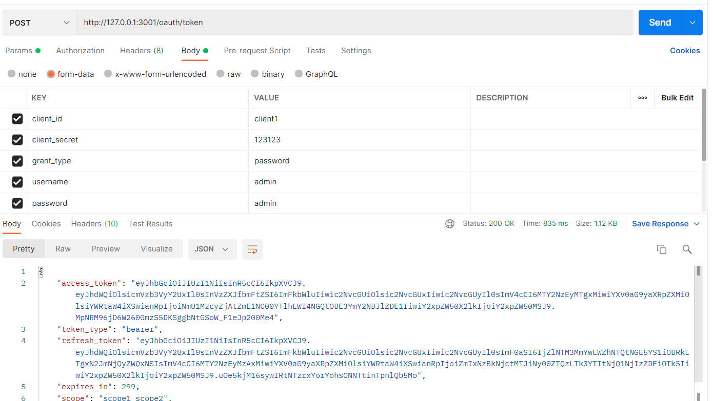

# 一、OAuth2.0介绍

## 1.1 **概述**

- OAUTH协议为用户资源的授权提供了一个安全的、开放而又简易的标准。**与以往的授权方式不同之处是OAUTH的授权不会使第三方触及到用户的帐号信息（如用户名与密码）**，即**第三方无需使用用户的用户名与密码就可以申请获得该用户资源的授权**，因此OAUTH是安全的。oAuth是Open Authorization的简写。
- OAuth（开放授权）是一个开放标准，**允许用户授权第三方应用访问他们存储在另外的服务提供者上的信息，而不需要将用户名和密码提供给第三方应用或分享他们数据的所有内容**。OAuth2.0是OAuth协议的延续版本，但不向后兼容OAuth1.0即完全废止了OAuth1.0。
- OAUTH是一种开放的协议，为桌面、手机或web应用提供了一种简单的，标准的方式去访问需要用户授权的API服务

## 1.2 **特点**

- 简单：不管是OAUTH服务提供者还是应用开发者，都很易于理解与使用；
- 安全：没有涉及到用户密钥等信息，更安全更灵活；
- 开放：任何服务提供商都可以实现OAUTH，任何软件开发商都可以使用OAUTH；

## 1.2 **Oauth2认证的例子**

> 本例子是某网站使用微信认证的过程

1. 用户借助微信认证登录某网站，用户就不用单独在某网站注册用户，怎么样算认证成功吗？
2. 某网站需要成功从微信获取用户的身份信息则认为用户认证成功，那如何从微信获取用户的身份信息？
3. 用户信息的拥有者是用户本人，微信需要经过用户的同意方可为某网站生成令牌，某网站拿此令牌方可从微信获取用户的信息。

-----

**第一步**：**客户端（浏览器）请求第三方授权**

用户进入网站的登录页面，点击微信的图标以微信账号登录系统，用户是自己在微信里信息的资源拥有者。点击“微信”出现一个二维码，此时用户扫描二维码，开始给客户端授权。


**第二步：资源拥有者同意给客户端授权**

资源拥有者扫描二维码表示资源拥有者同意给客户端授权，微信会对资源拥有者的身份进行验证， 验证通过后，微信会询问用户是否给授权客户端访问自己的微信数据，用户点击“确认登录”表示同意授权，微信认证服务器会颁发一个授权码，并重定向到客户端的网站。


**第三步：客户端获取到授权码，请求认证服务器申请令牌**

此过程用户看不到，客户端应用程序请求认证服务器，请求携带授权码。

**第四步：认证服务器向客户端响应令牌**

微信认证服务器验证了客户端请求的授权码，如果合法则给客户端颁发令牌，令牌是客户端访问资源的通行证。 此交互过程用户看不到，当客户端拿到令牌后，用户在网站上看到已经登录成功。

**第五步：客户端请求资源服务器的资源**

客户端携带令牌访问资源服务器的资源。 

客户端网站携带令牌请求访问微信服务器获取用户的基本信息。

**第六步：资源服务器返回受保护资源**

资源服务器校验令牌的合法性，如果合法则向用户响应资源信息内容。

> 以上认证授权详细的执行流程如下：


## 1.4 **官网上OAuth2.0认证过程**


OAauth2.0包括以下角色：

- 客户端 

  本身不存储资源，需要通过资源拥有者的授权去请求资源服务器的资源，比如：Android客户端、Web客户端（浏览器端）、微信客户端等。 

- 资源拥有者 

  通常为用户，也可以是应用程序，即该资源的拥有者。 

- 授权服务器（也称认证服务器）

  用于服务提供商对资源拥有的身份进行认证、对访问资源进行授权，认证成功后会给客户端发放令牌 （access_token），作为客户端访问资源服务器的凭据。本例为微信的认证服务器。 

- 资源服务器 

  存储资源的服务器，本例子为微信存储的用户信息。 

现在还有一个问题，服务提供商能允许随便一个客户端就接入到它的授权服务器吗？答案是否定的，服务提供商会给准入的接入方一个身份，用于接入时的凭据: client_id：客户端标识

client_secret：客户端秘钥 

因此，准确来说，**授权服务器**对两种OAuth2.0中的两个角色进行认证授权，分别是**资源拥有者、客户端**。

## 1.5 授权流程

**三个URL**

- Request Token URL: 获取未授权的Request Token服务地址；

- User Authorization URL: 获取用户授权的Request Token服务地址；

- Access Token URL: 用授权的Request Token换取Access Token的服务地址；

OAUTH认证授权就三个步骤，三句话可以概括：

1. 获取未授权的Request Token
2.  获取用户授权的Request Token
3. 用授权的Request Token换取Access Token

**当应用拿到Access Token后，就可以有权访问用户授权的资源**了。大家可能看出来了，这三个步骤不就是对应OAUTH的三个URL服务地址嘛。上面的三个步骤中，每个步骤分别请求一个URL，并且收到相关信息，并且拿到上步的相关信息去请求接下来的URL直到拿到Access Token。

具体每步执行信息如下：

1. 使用者（第三方软件）向OAUTH服务提供商请求未授权的Request Token。向Request Token URL发起请求，请求需要带上的参数。
2. OAUTH服务提供商同意使用者的请求，并向其颁发未经用户授权的oauth_token与对应的oauth_token_secret，并返回给使用者。
3. 使用者向OAUTH服务提供商请求用户授权的Request Token。向User Authorization URL发起请求，请求带上上步拿到的未授权的token与其密钥。
4. OAUTH服务提供商将引导用户授权。该过程可能会提示用户，你想将哪些受保护的资源授权给该应用。此步可能会返回授权的Request Token也可能不返回。如Yahoo OAUTH就不会返回任何信息给使用者。
5.  Request Token 授权后，使用者将向Access Token URL发起请求，将上步授权的Request Token换取成Access Token。这个比第一步多了一个参数就是Request Token。
6. OAUTH服务提供商同意使用者的请求，并向其颁发Access Token与对应的密钥，并返回给使用者。
7. 使用者以后就可以使用上步返回的Access Token访问用户授权的资源。

从上面的步骤可以看出，用户始终没有将其用户名与密码等信息提供给使用者，从而更安全。

# 二、OAuth2实践

> - Spring-Security-OAuth2是对OAuth2的一种实现，并且跟我们之前学习的Spring Security相辅相成，与Spring Cloud体系的集成也非常便利
> - OAuth2.0的服务提供方涵盖两个服务，即授权服务 (Authorization Server，也叫认证服务) 和资源服务 (Resource Server)，使用 Spring Security OAuth2 的时候你可以选择把它们在同一个应用程序中实现，也可以选择建立使用 同一个授权服务的多个资源服务。

**授权服务 (Authorization Server）**应包含对接入端以及登入用户的合法性进行验证并颁发token等功能，对令牌 的请求端点由 Spring MVC 控制器进行实现，下面是配置一个认证服务必须要实现的endpoints：

- **AuthorizationEndpoint** 服务于认证请求。默认 URL： `/oauth/authorize `。
- **TokenEndpoint** 服务于访问令牌的请求。默认 URL：` /oauth/token `。

**资源服务 (Resource Server)**，应包含对资源的保护功能，对非法请求进行拦截，对请求中token进行解析鉴 权等，下面的过滤器用于实现 OAuth 2.0 资源服务：

- OAuth2AuthenticationProcessingFilter用来对请求给出的身份令牌解析鉴权。

## 2.1 最简单的OAuth2进行分布式权限管理

==项目一==

**认证授权demo流程图**


1、客户端请求授权服务进行认证。 

2、认证通过后由颁发令牌。 

3、客户端携带令牌Token请求资源服务。

4、资源服务校验令牌的合法性，合法即返回资源信息。

**demo说明图**


### 2.1.1 授权服务搭建

- 创建一个spring boot项目

- 导入依赖

  ```xml
  <?xml version="1.0" encoding="UTF-8"?>
  <project xmlns="http://maven.apache.org/POM/4.0.0" xmlns:xsi="http://www.w3.org/2001/XMLSchema-instance"
           xsi:schemaLocation="http://maven.apache.org/POM/4.0.0 https://maven.apache.org/xsd/maven-4.0.0.xsd">
      <modelVersion>4.0.0</modelVersion>
      <parent>
          <groupId>org.springframework.boot</groupId>
          <artifactId>spring-boot-starter-parent</artifactId>
          <version>2.2.4.RELEASE</version>
          <relativePath/> <!-- lookup parent from repository -->
      </parent>
      <groupId>cn.cvzhanshi</groupId>
      <artifactId>authorization_server</artifactId>
      <version>0.0.1-SNAPSHOT</version>
      <name>authorization_server</name>
      <description>Demo project for Spring Boot</description>
  
      <properties>
          <java.version>1.8</java.version>
          <project.build.sourceEncoding>UTF-8</project.build.sourceEncoding>
          <project.reporting.outputEncoding>UTF-8</project.reporting.outputEncoding>
          <spring-cloud.version>Hoxton.SR1</spring-cloud.version>
      </properties>
  
      <dependencies>
          <dependency>
              <groupId>org.springframework.boot</groupId>
              <artifactId>spring-boot-starter-web</artifactId>
          </dependency>
          <dependency>
              <groupId>org.springframework.cloud</groupId>
              <artifactId>spring-cloud-starter-oauth2</artifactId>
          </dependency>
  
          <dependency>
              <groupId>org.springframework.boot</groupId>
              <artifactId>spring-boot-starter-test</artifactId>
              <scope>test</scope>
              <exclusions>
                  <exclusion>
                      <groupId>org.junit.vintage</groupId>
                      <artifactId>junit-vintage-engine</artifactId>
                  </exclusion>
              </exclusions>
          </dependency>
      </dependencies>
  
      <dependencyManagement>
          <dependencies>
              <dependency>
                  <groupId>org.springframework.cloud</groupId>
                  <artifactId>spring-cloud-dependencies</artifactId>
                  <version>${spring-cloud.version}</version>
                  <type>pom</type>
                  <scope>import</scope>
              </dependency>
          </dependencies>
      </dependencyManagement>
  
      <build>
          <plugins>
              <plugin>
                  <groupId>org.springframework.boot</groupId>
                  <artifactId>spring-boot-maven-plugin</artifactId>
              </plugin>
          </plugins>
      </build>
  </project>
  ```

- 配置文件

  ```yaml
  # 应用名称
  spring:
    application:
      name: authorization_server
  server:
    port: 3001
  ```

- security配置类

  ```java
  /**
   * @author cVzhanshi
   * @create 2022-10-25 17:55
   */
  @Configuration
  @EnableGlobalMethodSecurity(securedEnabled = true, prePostEnabled = true)
  public class SecurityConfig extends WebSecurityConfigurerAdapter {
  
  
  
      @Bean
      public PasswordEncoder passwordEncoder(){
          return new BCryptPasswordEncoder();
      }
  
      //密码模式才需要配置,认证管理器
      @Bean
      @Override
      protected AuthenticationManager authenticationManager() throws Exception {
          return super.authenticationManager();
      }
  
      @Override
      protected void configure(HttpSecurity http) throws Exception {
          http.csrf().disable()
                  .authorizeRequests()
                  .anyRequest().permitAll()
                  .and()
                  .formLogin()
                  .and()
                  .logout();
      }
  
      // 模拟账号密码验证  就两个账号   user/user  admin/admin
      @Bean
      public UserDetailsService userDetailsService() {
          UserDetailsService userDetailsService = new UserDetailsService() {
              @Override
              public UserDetails loadUserByUsername(String username) throws UsernameNotFoundException {
                  if (username.equals("user")){
                      MyUserDetails user = new MyUserDetails();
                      user.setUsername("user");
                      user.setPassword(passwordEncoder().encode("user"));
                      user.setPerms("user");
                      return user;
                  }
                  if (username.equals("admin")){
                      MyUserDetails admin = new MyUserDetails();
                      admin.setUsername("admin");
                      admin.setPassword(passwordEncoder().encode("admin"));
                      admin.setPerms("admin");
                      return admin;
                  }
                  return null;
              }
          };
          return userDetailsService;
      }
  }
  ```

- 配置OAuth2.0 授权服务配置类

  - 可以用 @EnableAuthorizationServer 注解并继承AuthorizationServerConfigurerAdapter来配置OAuth2.0 授权服务器。

  - AuthorizationServerConfigurerAdapter要求配置以下几个类，这几个类是由Spring创建的独立的配置对象，它们 会被Spring传入AuthorizationServerConfigurer中进行配置。

    ```java
    public class AuthorizationServerConfigurerAdapter implements AuthorizationServerConfigurer {
        public AuthorizationServerConfigurerAdapter() {}
        public void configure(AuthorizationServerSecurityConfigurer security) throws Exception {}
        public void configure(ClientDetailsServiceConfigurer clients) throws Exception {}
        public void configure(AuthorizationServerEndpointsConfigurer endpoints) throws Exception {}
    }
    ```

    - **ClientDetailsServiceConfigurer**：用来配置客户端详情服务（ClientDetailsService），客户端详情信息在 这里进行初始化，你能够把客户端详情信息写死在这里或者是通过数据库来存储调取详情信息。
    - **AuthorizationServerEndpointsConfigurer**：用来配置令牌（token）的访问端点和令牌服务(token services)。
    - **AuthorizationServerSecurityConfigurer**：用来配置令牌端点的安全约束

  - **配置客户端详细信息**

    - ClientDetailsServiceConfigurer 能够使用内存或者JDBC来实现客户端详情服务（ClientDetailsService）， ClientDetailsService负责查找ClientDetails，而ClientDetails有几个重要的属性如下列表：

      - clientId：（必须的）用来标识客户的Id。 
      - secret：（需要值得信任的客户端）客户端安全码（密码），如果有的话
      - scope：用来限制客户端的访问范围，如果为空（默认）的话，那么客户端拥有全部的访问范围。 
      - authorizedGrantTypes：此客户端可以使用的授权类型，默认为空。 
      - authorities：此客户端可以使用的权限（基于Spring Security authorities）。

      ```java
      // 配置客户端详细信息，可以配置多个
      @Override
      public void configure(ClientDetailsServiceConfigurer clients) throws Exception {
          // 存储在缓存中，后期可以选择存在数据库中
          clients.inMemory()
              // 设置客户端的id和密码
              .withClient(("client1"))
              .secret(passwordEncoder.encode("123456"))
              // 给client一个id,这个在client的配置里要用的, 能使用的资源id
              .resourceIds("resource1")
      
              //允许的申请token的方式
              //authorization_code授权码模式,这个是标准模式
              //implicit简单模式,这个主要是给无后台的纯前端项目用的
              //password密码模式,直接拿用户的账号密码授权,不安全
              //client_credentials客户端模式,用clientid和密码授权,和用户无关的授权方式
              //refresh_token使用有效的refresh_token去重新生成一个token,之前的会失效
              .authorizedGrantTypes("authorization_code", "password", "client_credentials", "implicit", "refresh_token")
              // 授权的范围,每个resource会设置自己的范围.
              .scopes("scope1","scope2")
              .autoApprove(false)
              .redirectUris("http://www.baidu.com");
      
          /*配置更多客户端
                      .and()
      
                      .withClient("client2")
                      .secret(passwordEncoder.encode("123123"))
                      .resourceIds("resource1")
                      .authorizedGrantTypes("authorization_code", "password", "client_credentials", "implicit", "refresh_token")
                      .scopes("all")
                      .autoApprove(false)
                      .redirectUris("http://www.qq.com");*/
      
      
      }
      ```

      

  - **管理令牌**

    - AuthorizationServerTokenServices 接口定义了一些操作使得你可以对令牌进行一些必要的管理，令牌可以被用来加载身份信息，里面包含了这个令牌的相关权限。除了持久化令牌是委托一个 TokenStore 接口来实现以外，这个类几乎帮你做了 所有的事情。并且 TokenStore 这个接口有一个默认的实现，它就是 InMemoryTokenStore ，如其命名，所有的令牌是被保存在了内存中。除了InMemoryTokenStore 还有一些其他版本JdbcTokenStore：这是一个基于JDBC的实现版本，令牌会被保存进关系型数据库。JwtTokenStore。

    - 定义TokenConfig

      ```java
      /**
       * @author cVzhanshi
       * @create 2022-10-25 18:18
       */
      @Configuration
      public class TokenConfig {
      	// 令牌的存储策略
          @Bean
          public TokenStore tokenStore(){
              // 在内存中生成一个普通的令牌
              return new InMemoryTokenStore();
          }
      }
      ```

    - 定义AuthorizationServerTokenServices 在AuthorizationServer中定义AuthorizationServerTokenServices

      ```java
      @Autowired
      private TokenStore tokenStore;
      @Autowired
      private ClientDetailsService clientDetailsService;
      
      
      //配置token管理服务
      @Bean
      public AuthorizationServerTokenServices tokenServices() {
          DefaultTokenServices defaultTokenServices = new DefaultTokenServices();
          // 客户端信息服务
          defaultTokenServices.setClientDetailsService(clientDetailsService);
          // 是否产生刷新令牌
          defaultTokenServices.setSupportRefreshToken(true);
      
          //配置token的存储策略
          defaultTokenServices.setTokenStore(tokenStore);
          // 令牌的有效期
          defaultTokenServices.setAccessTokenValiditySeconds(300);
          // 刷新令牌的时间
          defaultTokenServices.setRefreshTokenValiditySeconds(1500);
          return defaultTokenServices;
      }
      ```

  - **令牌访问端点配置**

    AuthorizationServerEndpointsConfigurer 这个对象的实例可以完成令牌服务以及令牌endpoint配置。

    - **配置授权类型**（Grant Types）AuthorizationServerEndpointsConfigurer 通过设定以下属性决定支持的授权类型（Grant Types）:

      - **authenticationManager**：认证管理器，当你选择了资源所有者密码（password）授权类型的时候，请设置 这个属性注入一个 AuthenticationManager 对象。
      - **userDetailsService**：如果你设置了这个属性的话，那说明你有一个自己的 UserDetailsService 接口的实现， 或者你可以把这个东西设置到全局域上面去，当你设置了这个之后，那么 "refresh_token" 即刷新令牌授权类型模式的流程中就会包含一个检查，用来确保这个账号是否仍然有效，假如说你禁用了这个账户的话就授权失败。
      - **authorizationCodeServices**：这个属性是用来设置授权码服务的（即 AuthorizationCodeServices 的实例对 象），主要用于 "authorization_code" 授权码类型模式。
      - **implicitGrantService**：这个属性用于设置隐式授权模式，用来管理隐式授权模式的状态。
      - **tokenGranter**：当你设置了这个东西（即 TokenGranter 接口实现），那么授权将会交由你来完全掌控，并且会忽略掉上面的这几个属性，这个属性一般是用作拓展用途的，即标准的四种授权模式已经满足不了你的 需求的时候，才会考虑使用这个。

    - 配置授权端点的URL（Endpoint URLs）：AuthorizationServerEndpointsConfigurer 这个配置对象有一个叫做 pathMapping() 的方法用来配置端点URL链 接，它有两个参数： 第一个参数：String 类型的，这个端点URL的默认链接。 第二个参数：String 类型的，你要进行替代的URL链接。

      ```java
      以上的参数都将以 "/" 字符为开始的字符串，框架的默认URL链接如下列表，可以作为这个 pathMapping() 方法的第一个参数：
      /oauth/authorize：授权端点。
      /oauth/token：令牌端点。
      /oauth/confirm_access：用户确认授权提交端点。
      /oauth/error：授权服务错误信息端点。
      /oauth/check_token：用于资源服务访问的令牌解析端点。
      /oauth/token_key：提供公有密匙的端点，如果你使用JWT令牌的话。
      需要注意的是授权端点这个URL应该被Spring Security保护起来只供授权用户访问.
      ```

    ```java
    //密码模式才需要配置,认证管理器
    @Autowired
    private AuthenticationManager authenticationManager;
    @Bean
    public AuthorizationCodeServices authorizationCodeServices() { //设置授权码模式的授权码如何存取，暂时采用内存方式
        return new InMemoryAuthorizationCodeServices();
    }
    @Autowired
    private AuthorizationCodeServices authorizationCodeServices;
    
    // 把上面的各个组件组合在一起
    @Override
    public void configure(AuthorizationServerEndpointsConfigurer endpoints) throws Exception {
        endpoints.authenticationManager(authenticationManager)//认证管理器
            .authorizationCodeServices(authorizationCodeServices)//授权码管理
            .tokenServices(tokenServices())//token管理
            .allowedTokenEndpointRequestMethods(HttpMethod.POST);
    }
    ```

  - **令牌端点的安全约束**

    ```java
    // 令牌端点的安全约束
    //配置哪些接口可以被访问
    @Override
    public void configure(AuthorizationServerSecurityConfigurer security) throws Exception {
        security.tokenKeyAccess("permitAll()")//   /oauth/token_key公开
            .checkTokenAccess("permitAll()")//   /oauth/check_token公开
            .allowFormAuthenticationForClients();//允许表单认证
    }
    ```

  - **授权配置类的完整代码**

    ```java
    /**
     * @author cVzhanshi
     * @create 2022-10-25 18:05
     */
    @Configuration
    //开启oauth2,auth server模式
    @EnableAuthorizationServer
    public class AuthorizationServerConfig extends AuthorizationServerConfigurerAdapter {
    
        @Autowired
        private PasswordEncoder passwordEncoder;
    
        // 配置客户端详细信息，可以配置多个
        @Override
        public void configure(ClientDetailsServiceConfigurer clients) throws Exception {
            // 存储在缓存中，后期可以选择存在数据库中
            clients.inMemory()
                // 设置客户端的id和密码
                .withClient(("client1"))
                .secret(passwordEncoder.encode("123456"))
                // 给client一个id,这个在client的配置里要用的, 能使用的资源id
                .resourceIds("resource1")
    
                //允许的申请token的方式
                //authorization_code授权码模式,这个是标准模式
                //implicit简单模式,这个主要是给无后台的纯前端项目用的
                //password密码模式,直接拿用户的账号密码授权,不安全
                //client_credentials客户端模式,用clientid和密码授权,和用户无关的授权方式
                //refresh_token使用有效的refresh_token去重新生成一个token,之前的会失效
                .authorizedGrantTypes("authorization_code", "password", "client_credentials", "implicit", "refresh_token")
                // 授权的范围,每个resource会设置自己的范围.
                .scopes("scope1","scope2")
                .autoApprove(false)
                .redirectUris("http://www.baidu.com");
    
            /*配置更多客户端
                    .and()
    
                    .withClient("client2")
                    .secret(passwordEncoder.encode("123123"))
                    .resourceIds("resource1")
                    .authorizedGrantTypes("authorization_code", "password", "client_credentials", "implicit", "refresh_token")
                    .scopes("all")
                    .autoApprove(false)
                    .redirectUris("http://www.qq.com");*/
    
    
        }
    
        @Autowired
        private TokenStore tokenStore;
        @Autowired
        private ClientDetailsService clientDetailsService;
    
    
        //配置token管理服务
        @Bean
        public AuthorizationServerTokenServices tokenServices() {
            DefaultTokenServices defaultTokenServices = new DefaultTokenServices();
            // 客户端信息服务
            defaultTokenServices.setClientDetailsService(clientDetailsService);
            // 是否产生刷新令牌
            defaultTokenServices.setSupportRefreshToken(true);
    
            //配置token的存储策略
            defaultTokenServices.setTokenStore(tokenStore);
            // 令牌的有效期
            defaultTokenServices.setAccessTokenValiditySeconds(300);
            // 刷新令牌的时间
            defaultTokenServices.setRefreshTokenValiditySeconds(1500);
            return defaultTokenServices;
        }
    
        //密码模式才需要配置,认证管理器
        @Autowired
        private AuthenticationManager authenticationManager;
        @Bean
        public AuthorizationCodeServices authorizationCodeServices() { //设置授权码模式的授权码如何存取，暂时采用内存方式
            return new InMemoryAuthorizationCodeServices();
        }
        @Autowired
        private AuthorizationCodeServices authorizationCodeServices;
    
        // 把上面的各个组件组合在一起
        @Override
        public void configure(AuthorizationServerEndpointsConfigurer endpoints) throws Exception {
            endpoints.authenticationManager(authenticationManager)//认证管理器
                .authorizationCodeServices(authorizationCodeServices)//授权码管理
                .tokenServices(tokenServices())//token管理
                .allowedTokenEndpointRequestMethods(HttpMethod.POST);
        }
    
        // 令牌端点的安全约束
        //配置哪些接口可以被访问
        @Override
        public void configure(AuthorizationServerSecurityConfigurer security) throws Exception {
            security.tokenKeyAccess("permitAll()")//   /oauth/token_key公开
                .checkTokenAccess("permitAll()")//   /oauth/check_token公开
                .allowFormAuthenticationForClients();//允许表单认证
        }
    }
    
    ```

### 2.1.2 授权服务测试(五种模式)

#### 授权码模式


1. 资源拥有者打开客户端，客户端要求资源拥有者给予授权，它将浏览器被重定向到授权服务器，重定向时会附加客户端的身份信息。

   ```
   访问链接
   http://127.0.0.1:3001/oauth/authorize?client_id=client1&response_type=code&scope=scope1&redirect_uri=http://www.baidu.com
   
   参数列表如下：
   client_id：客户端准入标识。
   response_type：授权码模式固定为code。
   scope：客户端权限。
   redirect_uri：跳转uri，当授权码申请成功后会跳转到此地址，并在后边带上code参数（授权码）。
   ```

2. 浏览器出现向授权服务器授权页面，之后将用户同意授权

3. 授权服务器将授权码（AuthorizationCode）转经浏览器发送给client(通过redirect_uri)。

   

4. 客户端拿着授权码向授权服务器索要访问access_token，请求如下：

   ```
   http://127.0.0.1:3001/oauth/token?client_id=c1&client_secret=secret&grant_type=authorization_code&code=5PgfcD&redirect_uri=http://www.baidu.com
   
   参数列表如下
   client_id：客户端准入标识。
   client_secret：客户端秘钥。
   grant_type：授权类型，填写authorization_code，表示授权码模式
   code：授权码，就是刚刚获取的授权码，注意：授权码只使用一次就无效了，需要重新申请。
   redirect_uri：申请授权码时的跳转url，一定和申请授权码时用的redirect_uri一致。
   ```

5. 授权服务器返回令牌(access_token)

   

这种模式是四种模式中最安全的一种模式。一般用于client是Web服务器端应用或第三方的原生App调用资源服务 的时候。因为在这种模式中access_token不会经过浏览器或移动端的App，而是直接从服务端去交换，这样就最大 限度的减小了令牌泄漏的风险。

#### 简化模式


1. 资源拥有者打开客户端，客户端要求资源拥有者给予授权，它将浏览器被重定向到授权服务器，重定向时会附加客户端的身份信息。如：

   ```
   http://127.0.0.1:3001/oauth/authorize?client_id=client1&response_type=token&scope=scope1&redirect_uri=http://www.baidu.com
   ```

2. 浏览器出现向授权服务器授权页面，之后将用户同意授权

3. 授权服务器将授权码将令牌（access_token）以Hash的形式存放在重定向uri的fargment中发送给浏览 器。

   

**简化模式用于没有服务器端的第三方单页面应用，因为没有服务器端就无法接收授权码**

这个一般给纯前端的项目用,没有后台的

#### 密码模式


1. 资源拥有者将用户名、密码发送给客户端
2. 客户端拿着资源拥有者的用户名、密码向授权服务器请求令牌（access_token）


请求参数列表

- client_id：客户端准入标识。 
- client_secret：客户端秘钥。 
- grant_type：授权类型，填写password表示密码模式 
- username：资源拥有者用户名。 
- password：资源拥有者密码。

**这种模式十分简单，但是却意味着直接将用户敏感信息泄漏给了client，因此这就说明这种模式只能用于client是我 们自己开发的情况下。**

#### 客户端模式


1. 客户端向授权服务器发送自己的身份信息，并请求令牌（access_token）

2. 确认客户端身份无误后，将令牌（access_token）发送给client

   

参数列表

- client_id：客户端准入标识。 
- client_secret：客户端秘钥。 
- grant_type：授权类型，填写client_credentials表示客户端模式

**这种模式是最方便但最不安全的模式。因此这就要求我们对client完全的信任，而client本身也是安全的。因 此这种模式一般用来提供给我们完全信任的服务器端服务。比如，合作方系统对接，拉取一组用户信息。**

#### 令牌刷新测试

1. 先用授权码模式获取到token以及reflash

   

2. 然后使用refresh_token去请求接口刷新access_token

   

### 2.1.3 资源服务的搭建

- 创建项目和依赖和授权服务一样

- SecurityConfig配置类

  ```java
  /**
   * @author cVzhanshi
   * @create 2022-10-25 19:18
   */
  @Configuration
  @EnableGlobalMethodSecurity(securedEnabled = true, prePostEnabled = true)
  public class SecurityConfig extends WebSecurityConfigurerAdapter {
  
      @Override
      protected void configure(HttpSecurity http) throws Exception {
          http.csrf().disable()
                  .authorizeRequests()
                  .anyRequest().permitAll();
      }
  }
  ```

- @EnableResourceServer 注解到一个 @Configuration 配置类上，并且必须使用 ResourceServerConfigurer 这个 配置对象来进行配置（可以选择继承自 ResourceServerConfigurerAdapter 然后覆写其中的方法，参数就是这个 对象的实例），下面是一些可以配置的属性：

  ResourceServerSecurityConfigurer中主要包括：

  - tokenServices：ResourceServerTokenServices 类的实例，用来实现令牌服务。 
  - tokenStore：TokenStore类的实例，指定令牌如何访问，与tokenServices配置可选 
  - resourceId：这个资源服务的ID，这个属性是可选的，但是推荐设置并在授权服务中进行验证。 
  - 其他的拓展属性例如 tokenExtractor 令牌提取器用来提取请求中的令牌。

  HttpSecurity配置这个与Spring Security类似：

  - 请求匹配器，用来设置需要进行保护的资源路径，默认的情况下是保护资源服务的全部路径。 
  - 通过http.authorizeRequests()来设置受保护资源的访问规则 
  - 其他的自定义权限保护规则通过 HttpSecurity 来进行配置。

- @EnableResourceServer 注解自动增加了一个类型为 OAuth2AuthenticationProcessingFilter 的过滤器链

```java
/**
 * @author cVzhanshi
 * @create 2022-10-25 19:18
 */
@Configuration
//开启oauth2,reousrce server模式
@EnableResourceServer
public class ResourceServerConfig extends ResourceServerConfigurerAdapter {
    @Override
    public void configure(ResourceServerSecurityConfigurer resources) throws Exception {
        //远程token验证, 普通token必须远程校验
        RemoteTokenServices tokenServices = new RemoteTokenServices();
        //配置去哪里验证token
        tokenServices.setCheckTokenEndpointUrl("http://127.0.0.1:3001/oauth/check_token");
        // 配置组件的clientid和密码,这个也是在auth中配置好的  资源服务相对于授权服务也是一个客户端所以也需要clientid
        tokenServices.setClientId("client2");
        tokenServices.setClientSecret("123456");
        resources
            //设置我这个resource的id, 这个在auth中配置
            .resourceId("resource1")
            .tokenServices(tokenServices)

            //这个貌似是配置要不要把token信息记录在session中
            .stateless(true);
    }

    @Override
    public void configure(HttpSecurity http) throws Exception {
        http.csrf().disable()
            .authorizeRequests()

            //本项目所需要的授权范围  可以多个,这个scope是和auth服务那里的配置的scope做对比
            .antMatchers("/**").access("#oauth2.hasScope('scope1')")

            .and()

            //这个貌似是配置要不要把token信息记录在session中
            .sessionManagement().sessionCreationPolicy(SessionCreationPolicy.STATELESS);
    }
}
```

- 编写资源接口

  ```java
  /**
   * @author cVzhanshi
   * @create 2022-10-25 19:17
   */
  @RestController
  public class TestController {
      @RequestMapping("user")
      public String user() {
          return "user";
      }
  
      //测试接口
      @RequestMapping("admin")
      // 需要权限
      @PreAuthorize("hasAnyAuthority('admin')")
      public String admin() {
          return "admin";
      }
  
      @RequestMapping("me")
      public Principal me(Principal principal) {
          return principal;
      }
  }
  ```

### 2.1.4 资源服务测试

- 先用密码模式获取到token

  

- 然后再使用token去访问资源

  

- 访问权限不够的资源

  

- 使用admin去登录获取token然后访问权限资源

  


## 2.2 把token改造成jwt_token

==项目二：复制项目一进行改造==

**demo流程图**


### 2.2.1 改造授权服务

1. 修改TokenConfig

   ```java
   /**
    * @author cVzhanshi
    * @create 2022-10-25 18:18
    */
   @Configuration
   public class TokenConfig {
   
       // 配置jwt的token转换器
       @Bean
       public JwtAccessTokenConverter tokenConverter(){
           JwtAccessTokenConverter converter = new JwtAccessTokenConverter();
           // 配置密钥
           converter.setSigningKey("jwt_token");
           return converter;
       }
   
       // 令牌的存储策略
       @Bean
       public TokenStore tokenStore(){
           // 把策略换成jwt_token Store
           return new JwtTokenStore(tokenConverter());
       }
   }
   ```

2. 在AuthorizationServerConfig配置一个token增强链，把token增强为jwttoken

   ```java
   @Autowired
   private TokenStore tokenStore;
   @Autowired
   private ClientDetailsService clientDetailsService;
   @Autowired
   private JwtAccessTokenConverter tokenConverter;
   
   
   //配置token管理服务
   @Bean
   public AuthorizationServerTokenServices tokenServices() {
       DefaultTokenServices defaultTokenServices = new DefaultTokenServices();
       // 客户端信息服务
       defaultTokenServices.setClientDetailsService(clientDetailsService);
       // 是否产生刷新令牌
       defaultTokenServices.setSupportRefreshToken(true);
   
       //配置token的存储策略
       defaultTokenServices.setTokenStore(tokenStore);
       // 令牌的有效期
       defaultTokenServices.setAccessTokenValiditySeconds(300);
       // 刷新令牌的时间
       defaultTokenServices.setRefreshTokenValiditySeconds(1500);
   
       /**
       * 新增的
       **/
       // 配置一个token增强链  配置完之后token就增强为jwttoken
       TokenEnhancerChain tokenEnhancerChain = new TokenEnhancerChain();
       tokenEnhancerChain.setTokenEnhancers(Arrays.asList(tokenConverter));
       defaultTokenServices.setTokenEnhancer(tokenEnhancerChain);
   
       return defaultTokenServices;
   }
   ```

3. 配置完毕

### 2.2.2 测试授权服务

- 测试密码模式认证，获取token

  

- 校验token

  

### 2.2.3 改造资源服务

首先使用jwttoken那么资源服务就不需要去授权服务校验去了，自己就能校验jwttoken

- 首先加一个TokenConfig配置类，配置jwt转换器以及策略

  ```java
  /**
       * @author cVzhanshi
       * @create 2022-10-25 18:18
       */
  @Configuration
  public class TokenConfig {
  
      // 配置jwt的token转换器
      @Bean
      public JwtAccessTokenConverter tokenConverter(){
          JwtAccessTokenConverter converter = new JwtAccessTokenConverter();
          // 配置密钥
          converter.setSigningKey("jwt_token");
          return converter;
      }
  
      // 令牌的存储策略
      @Bean
      public TokenStore tokenStore(){
          // 把策略换成jwt_token Store
          return new JwtTokenStore(tokenConverter());
      }
  }
  ```

- 修改ResourceServerConfig的配置，不需要远程去校验

  ```java
  @Autowired
  private TokenStore tokenStore;
  
  @Override
  public void configure(ResourceServerSecurityConfigurer resources) throws Exception {
      resources
          //设置我这个resource的id, 这个在auth中配置
          .resourceId("resource1")
          .tokenStore(tokenStore)
  
          //这个貌似是配置要不要把token信息记录在session中
          .stateless(true);
  }
  ```

### 2.2.4 测试资源服务

- 首先使用密码模式获取jwt_token（使用user用户，没有admin权限访问不了/admin）

  

- 带着token访问有权限的资源

  

- 访问没有权限的资源

  

- 使用admin获取token访问admin资源

  

## 2.3 把token持久化到数据库

==项目三：复制项目一进行改造==

demo流程


- token持久化到只需要在简单的例子上修改授权服务的令牌存储策略

- 导入数据库依赖，创建数据库表

  ```sql
  create table oauth_client_details (
      client_id VARCHAR(128) PRIMARY KEY,
      resource_ids VARCHAR(128),
      client_secret VARCHAR(128),
      scope VARCHAR(128),
      authorized_grant_types VARCHAR(128),
      web_server_redirect_uri VARCHAR(128),
      authorities VARCHAR(128),
      access_token_validity INTEGER,
      refresh_token_validity INTEGER,
      additional_information VARCHAR(4096),
      autoapprove VARCHAR(128)
  );
      create table oauth_client_token (
          token_id VARCHAR(128),
          token BLOB,
          authentication_id VARCHAR(128) PRIMARY KEY,
          user_name VARCHAR(128),
          client_id VARCHAR(128)
      );
      create table oauth_access_token (
          token_id VARCHAR(128),
          token BLOB,
          authentication_id VARCHAR(128) PRIMARY KEY,
          user_name VARCHAR(128),
          client_id VARCHAR(128),
          authentication BLOB,
          refresh_token VARCHAR(128)
      );
      create table oauth_refresh_token (
          token_id VARCHAR(128),
          token BLOB,
          authentication BLOB
      );
      create table oauth_code (
          code VARCHAR(128), authentication BLOB
      );
      create table oauth_approvals (
          userId VARCHAR(128),
          clientId VARCHAR(128),
          scope VARCHAR(128),
          status VARCHAR(10),
          expiresAt TIMESTAMP,
          lastModifiedAt TIMESTAMP DEFAULT CURRENT_TIMESTAMP
      );
      -- customized oauth_client_details table
      create table ClientDetails (
          appId VARCHAR(128) PRIMARY KEY,
          resourceIds VARCHAR(128),
          appSecret VARCHAR(128),
          scope VARCHAR(128),
          grantTypes VARCHAR(128),
          redirectUrl VARCHAR(128),
          authorities VARCHAR(128),
          access_token_validity INTEGER,
          refresh_token_validity INTEGER,
          additionalInformation VARCHAR(4096),
          autoApproveScopes VARCHAR(128)
      );
      
      
       INSERT INTO `oauth_client_details` VALUES ('client1', 'resource1', '$2a$10$YEpRG0cFXz5yfC/lKoCHJ.83r/K3vaXLas5zCeLc.EJsQ/gL5Jvum', 'scope1,scope2', 'authorization_code,password,client_credentials,implicit,refresh_token', 'http://www.baidu.com', null, '300', '1500', null, 'false');
  ```

- 修改配置类令牌的存储策略

  ```java
  /**
   * @author cVzhanshi
   * @create 2022-10-25 18:18
   */
  @Configuration
  public class TokenConfig {
  
      @Autowired
      private DataSource dataSource;
  
      // 令牌的存储策略
      @Bean
      public TokenStore tokenStore(){
          return new JdbcTokenStore(dataSource);
      }
  }
  ```

  ```java
  @Autowired
  private DataSource dataSource;
  
  @Override
  public void configure(ClientDetailsServiceConfigurer clients) throws Exception {
      JdbcClientDetailsService detailsService = new JdbcClientDetailsService(dataSource);
      detailsService.setPasswordEncoder(passwordEncoder);
      clients.withClientDetails(detailsService);
  }
  
  //设置授权码模式的授权码如何存取，暂时采用内存方式
  @Bean
  public AuthorizationCodeServices authorizationCodeServices() { 
      return new JdbcAuthorizationCodeServices(dataSource);
  }
  ```

- 配置完成

> 测试

- 启动授权服务、资源服务

- 认证

  

- 查看数据库

  

  已经存在数据库中

- 测试资源

  

## 2.4 把jwt_token持久化到数据库

==项目四：复制项目三进行改造==

> 因为jwttoken不与授权进行验证，所以jwt_token不存储到数据库


> 修改授权服务

- 修改TokenConfig

  ```java
  /**
   * @author cVzhanshi
   * @create 2022-10-25 18:18
   */
  @Configuration
  public class TokenConfig {
  
      @Bean
      public JwtAccessTokenConverter tokenConverter(){
          JwtAccessTokenConverter converter = new JwtAccessTokenConverter();
          converter.setSigningKey("jwt_token");
          return converter;
      }
  
      // 令牌的存储策略
      @Bean
      public TokenStore tokenStore(){
          return new JwtTokenStore(tokenConverter());
      }
  }
  ```

- 修改oauth配置

  ```java
  @Autowired
  private JwtAccessTokenConverter tokenConverter;
  
  
  //配置token管理服务
  @Bean
  public AuthorizationServerTokenServices tokenServices() {
      DefaultTokenServices defaultTokenServices = new DefaultTokenServices();
      // 客户端信息服务
      defaultTokenServices.setClientDetailsService(clientDetailsService);
      // 是否产生刷新令牌
      defaultTokenServices.setSupportRefreshToken(true);
  
      //配置token的存储策略
      defaultTokenServices.setTokenStore(tokenStore);
      // 令牌的有效期
      defaultTokenServices.setAccessTokenValiditySeconds(300);
      // 刷新令牌的时间
      defaultTokenServices.setRefreshTokenValiditySeconds(1500);
  
      TokenEnhancerChain tokenEnhancerChain = new TokenEnhancerChain();
      tokenEnhancerChain.setTokenEnhancers(Arrays.asList(tokenConverter));
      defaultTokenServices.setTokenEnhancer(tokenEnhancerChain);
  
      return defaultTokenServices;
  }
  ```

- 测试授权服务

  

- 查看数据库

  

> 修改资源服务

- 将授权服务的TokenConfig复制过来

- 修改配置类

  ```java
  @Autowired
  private TokenStore tokenStore;
  
  @Override
  public void configure(ResourceServerSecurityConfigurer resources) throws Exception {
  
      resources
          //设置我这个resource的id, 这个在auth中配置
          .resourceId("resource1")
          .tokenStore(tokenStore)
  
          //这个貌似是配置要不要把token信息记录在session中
          .stateless(true);
  }
  ```

- 启动测试

  

## 2.5 在SpringCloud微服务架构中使用SpringOAuth2

demo流程图


或者


### 2.5.1 搭建eureka和zuul

> 搭建eureka

- 创建Spring Boot项目

- 导入依赖

  ```xml
  <dependencies>
      <dependency>
          <groupId>org.springframework.boot</groupId>
          <artifactId>spring-boot-starter-web</artifactId>
      </dependency>
      <dependency>
          <groupId>org.springframework.cloud</groupId>
          <artifactId>spring-cloud-starter-netflix-eureka-server</artifactId>
      </dependency>
  
      <dependency>
          <groupId>org.springframework.boot</groupId>
          <artifactId>spring-boot-starter-test</artifactId>
          <scope>test</scope>
          <exclusions>
              <exclusion>
                  <groupId>org.junit.vintage</groupId>
                  <artifactId>junit-vintage-engine</artifactId>
              </exclusion>
          </exclusions>
      </dependency>
  </dependencies>
  
  <dependencyManagement>
      <dependencies>
          <dependency>
              <groupId>org.springframework.cloud</groupId>
              <artifactId>spring-cloud-dependencies</artifactId>
              <version>${spring-cloud.version}</version>
              <type>pom</type>
              <scope>import</scope>
          </dependency>
      </dependencies>
  </dependencyManagement>
  ```

- 修改配置文件

  ```yaml
  server:
    port: 2001
  spring:
    application:
      name: eureka
    cloud:
      client:
        ipAddress: 127.0.0.1
  eureka:
    instance:
      #基于ip配置
      prefer-ip-address: false
      #自定义id
      instance-id: ${spring.cloud.client.ipAddress}:${server.port}
      hostname: ${spring.cloud.client.ipAddress}
    client:
      serviceUrl:
        defaultZone: http://${eureka.instance.hostname}:${server.port}/eureka/
      #注册到其他eureka
      registerWithEureka: false
      #从其他eureka拉取信息
      fetchRegistry: false
    server:
      #自我保护
      enable-self-preservation: false
  ```

- 在主启动类上添加注解`@EnableEurekaServer`

- 启动项目访问localhost:2001有页面说明成功

> 搭建Zuul

- 创建Spring Boot项目

- 导入依赖

  ```xml
  <dependencies>
      <dependency>
          <groupId>org.springframework.boot</groupId>
          <artifactId>spring-boot-starter-web</artifactId>
      </dependency>
      <dependency>
          <groupId>org.springframework.cloud</groupId>
          <artifactId>spring-cloud-starter-netflix-eureka-client</artifactId>
      </dependency>
      <dependency>
          <groupId>org.springframework.cloud</groupId>
          <artifactId>spring-cloud-starter-netflix-zuul</artifactId>
      </dependency>
      <dependency>
          <groupId>com.alibaba</groupId>
          <artifactId>fastjson</artifactId>
          <version>1.2.75</version>
      </dependency>
  
      <dependency>
          <groupId>org.springframework.boot</groupId>
          <artifactId>spring-boot-starter-test</artifactId>
          <scope>test</scope>
          <exclusions>
              <exclusion>
                  <groupId>org.junit.vintage</groupId>
                  <artifactId>junit-vintage-engine</artifactId>
              </exclusion>
          </exclusions>
      </dependency>
  </dependencies>
  
  <dependencyManagement>
      <dependencies>
          <dependency>
              <groupId>org.springframework.cloud</groupId>
              <artifactId>spring-cloud-dependencies</artifactId>
              <version>${spring-cloud.version}</version>
              <type>pom</type>
              <scope>import</scope>
          </dependency>
      </dependencies>
  </dependencyManagement>
  ```

- 修改配置文件

  ```yaml
  server:
    port: 5001
  spring:
    application:
      name: zuul
    cloud:
      client:
        ipAddress: 127.0.0.1
  eureka:
    instance:
      prefer-ip-address: false
      instance-id: ${spring.cloud.client.ipAddress}:${server.port}
      hostname: ${spring.cloud.client.ipAddress}
    client:
      serviceUrl:
        #eurekaServers
        defaultZone: http://127.0.0.1:2001/eureka
  ```

- 添加另一个配置文件application.properties

  ```properties
  #zuul不传递cookie和head信息
  #方法1:这个设置是开启全局的cookie和head传递
  zuul.sensitive-headers=
  ```

- 修改著启动类

  ```java
  @SpringCloudApplication
  @EnableZuulProxy
  public class ZuulApplication {
  
      public static void main(String[] args) {
          SpringApplication.run(ZuulApplication.class, args);
      }
  
  }
  ```

- 启动，查看eureka中zuul是否注册进去

### 2.5.2 搭建授权中心

授权中心复制==项目二==进行改造

- 修改客户端详情配置，配置两个客户端

  ```java
  // 配置客户端详细信息，可以配置多个
  @Override
  public void configure(ClientDetailsServiceConfigurer clients) throws Exception {
      // 存储在缓存中，后期可以选择存在数据库中
      clients.inMemory()
          // 设置客户端的id和密码
          .withClient(("client1"))
          .secret(passwordEncoder.encode(" "))
          // 给client一个id,这个在client的配置里要用的, 能使用的资源id
          .resourceIds("resource1")
  
          //允许的申请token的方式
          //authorization_code授权码模式,这个是标准模式
          //implicit简单模式,这个主要是给无后台的纯前端项目用的
          //password密码模式,直接拿用户的账号密码授权,不安全
          //client_credentials客户端模式,用clientid和密码授权,和用户无关的授权方式
          //refresh_token使用有效的refresh_token去重新生成一个token,之前的会失效
          .authorizedGrantTypes("authorization_code", "password", "client_credentials", "implicit", "refresh_token")
          // 授权的范围,每个resource会设置自己的范围.
          .scopes("scope1")
          .autoApprove(true)
          .authorities("admin")
          .redirectUris("http://www.baidu.com")
  
          // 资源服务配置，因为资源服务也需要校验token，调用授权服务，所以需要配置客户端id
          .and()
          // 设置客户端的id和密码
          .withClient(("client2"))
          .secret(passwordEncoder.encode("123456"))
          // 给client一个id,这个在client的配置里要用的, 能使用的资源id
          .resourceIds("resource2")
  
          //允许的申请token的方式
          //authorization_code授权码模式,这个是标准模式
          //implicit简单模式,这个主要是给无后台的纯前端项目用的
          //password密码模式,直接拿用户的账号密码授权,不安全
          //client_credentials客户端模式,用clientid和密码授权,和用户无关的授权方式
          //refresh_token使用有效的refresh_token去重新生成一个token,之前的会失效
          .authorizedGrantTypes("authorization_code", "password", "client_credentials", "implicit", "refresh_token")
          // 授权的范围,每个resource会设置自己的范围.
          .scopes("scope2")
          .autoApprove(true)
          .authorities("admin")
          .redirectUris("http://www.sogou.com");
  }
  ```

- 添加eureka客户端依赖

  ```xml
  <dependency>
      <groupId>org.springframework.cloud</groupId>
      <artifactId>spring-cloud-starter-netflix-eureka-client</artifactId>
  </dependency>
  ```

- 修改配置文件

  ```yaml
  # 应用名称
  server:
    port: 3001
  spring:
    application:
      name: auth
    cloud:
      client:
        ipAddress: 127.0.0.1
  eureka:
    instance:
      prefer-ip-address: false
      instance-id: ${spring.cloud.client.ipAddress}:${server.port}
      hostname: ${spring.cloud.client.ipAddress}
    client:
      serviceUrl:
        #eurekaServers
        defaultZone: http://127.0.0.1:2001/eureka
  ```

- 主启动类添加`@EnableEurekaClient`注解

- 启动，查看eureka是否有注册进去

> 通过zuul测试授权中心

- 先通过浏览器访问授权获取code  

  http://127.0.0.1:5001/auth/oauth/authorize?client_id=client1&response_type=code&scope=scope1&redirect_uri=http://www.baidu.com

- 拿到code继续通过zuul访问授权中心去获取token

- 拿到token通过zuul访问授权中心去检验token

### 2.5.3 搭建资源中心

同样复制==项目二==的资源中心进行改造

- 添加eureka客户端依赖

- 主启动类上田间eureka客户端注解

- 修改配置文件

  ```java
  # 应用名称
  server:
    port: 4001
  spring:
    application:
      name: source1
    cloud:
      client:
        ipAddress: 127.0.0.1
  eureka:
    instance:
      prefer-ip-address: false
      instance-id: ${spring.cloud.client.ipAddress}:${server.port}
      hostname: ${spring.cloud.client.ipAddress}
    client:
      serviceUrl:
        #eurekaServers
        defaultZone: http://127.0.0.1:2001/eureka
  ```

- 改造完毕，启动

- 复制第一个资源中心改名为source2

- 修改端口号

- 修改资源id、scope2

- 启动第二个资源中心

### 2.5.4 测试

- 先通过浏览器访问授权获取code  使用**scope1**

  http://127.0.0.1:5001/auth/oauth/authorize?client_id=client1&response_type=code&scope=scope1&redirect_uri=http://www.baidu.com

- 拿到code用client1通过zuul访问授权中心去获取token

- 拿到token通过zuul访问授权中心source1去访问资源

  

- 拿到token通过zuul访问授权中心source2去访问资源

  

### 2.5.6 改造成在zuul中统一授权

给zuul配置一个过滤器

```java
/**
 * @author cVzhanshi
 * @create 2022-11-02 16:56
 */
@Component
public class ScopeFilter extends ZuulFilter {
    @Override
    public String filterType() {
        return "pre";
    }

    @Override
    public int filterOrder() {
        return 0;
    }

    @Override
    public boolean shouldFilter() {
        return true;
    }

    @Override
    public Object run() throws ZuulException {
        RequestContext currentContext = RequestContext.getCurrentContext();
        HttpServletRequest request = currentContext.getRequest();
        String requestURI = request.getRequestURI();
        // 如果是访问授权中心，直接放行
        if(requestURI.startsWith("/auth")){
            return null;
        }

        String token = request.getHeader("Authorization");
        token = token.split("\\.")[1];
        byte[] bytes = Base64.getUrlDecoder().decode(token);
        try {
            token = new String(bytes,"UTF-8");
        } catch (UnsupportedEncodingException e) {
            e.printStackTrace();
        }
        JSONObject jsonObject = JSONObject.parseObject(token);
        List<String> scope = jsonObject.getJSONArray("scope").toJavaList(String.class);
        // 判断scope
        if(requestURI.startsWith("/source1") && scope.contains("scope1")){
            return null;
        }
        if(requestURI.startsWith("/source2") && scope.contains("scope2")){
            return null;
        }
        // 不满足报403
        currentContext.setSendZuulResponse(false);
        currentContext.setResponseStatusCode(403);
        return null;
    }
}
```

