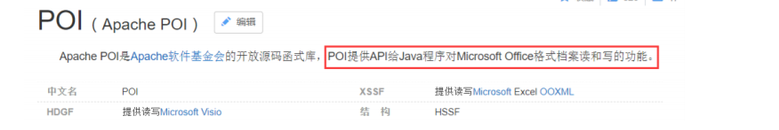
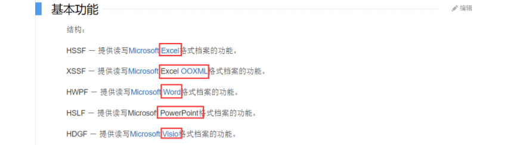
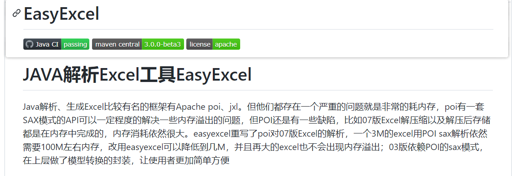
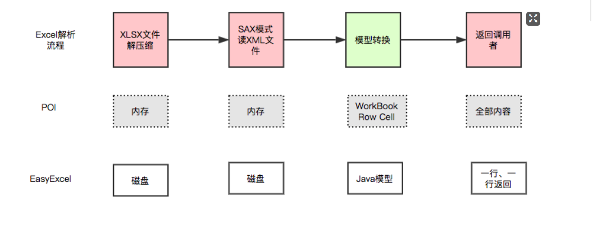
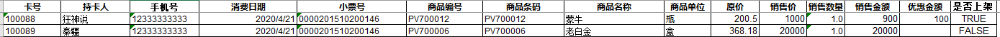
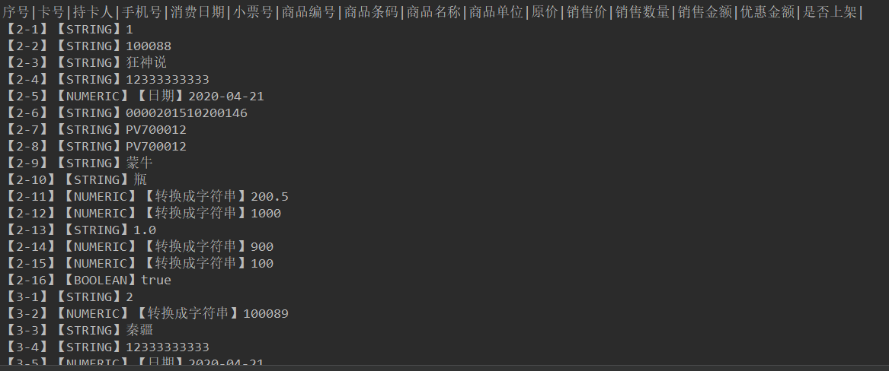
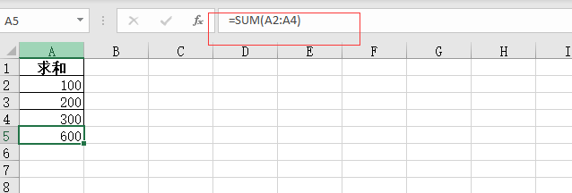
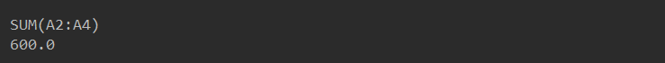
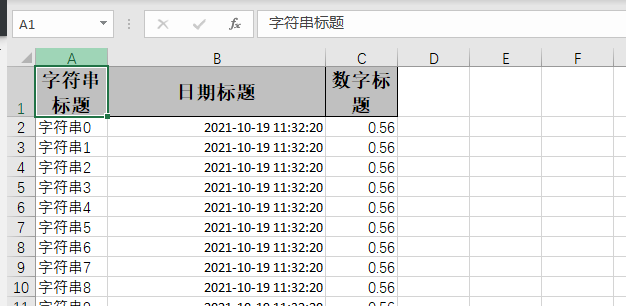
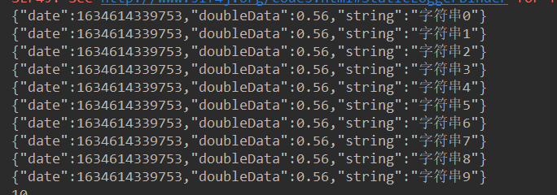

## 谈谈 POI 和 easyExcel

> 常用场景

1、将用户信息导出为excel表格（导出数据....） 

2、将Excel表中的信息录入到网站数据库（习题上传....） 

开发中经常会设计到excel的处理，如导出Excel，导入Excel到数据库中！ 

操作Excel目前比较流行的就是 **Apache POI** 和 阿里巴巴的 **easyExcel** ！

> Apache POI

Apache POI 官网：https://poi.apache.org/  --> 因为原生，所以比较复杂，还可能会报OOM





> easyExcel

easyExcel 官网地址：https://github.com/alibaba/easyexcel

官方文档：https://www.yuque.com/easyexcel/doc/easyexcel



- EasyExcel 是阿里巴巴开源的一个excel处理框架，**以使用简单、节省内存著称**。 

- EasyExcel 能大大减少占用内存的主要原因是在解析 Excel 时没有将文件数据一次性全部加载到内存中， 而是从磁盘上一行行读取数据，逐个解析。 

内存问题：POI = 100M先加载到内存 OOM。再写入文件。 EasyExcel = 1行

下图是 EasyExcel 和 POI 在解析Excel时的对比图



## POI-Excel写

> 创建项目

- 建立一个空项目POI-EasyExcel，创建普通Maven的Moudle poi 

- 引入pom依赖

  ```xml
  <dependencies>
      <!--xls(03)-->
      <dependency>
          <groupId>org.apache.poi</groupId>
          <artifactId>poi</artifactId>
          <version>3.9</version>
      </dependency>
      <!--xlsx(07)-->
      <dependency>
          <groupId>org.apache.poi</groupId>
          <artifactId>poi-ooxml</artifactId>
          <version>3.9</version>
      </dependency>
      <!--日期格式化工具-->
      <dependency>
          <groupId>joda-time</groupId>
          <artifactId>joda-time</artifactId>
          <version>2.10.1</version>
      </dependency>
      <!--test-->
      <dependency>
          <groupId>junit</groupId>
          <artifactId>junit</artifactId>
          <version>4.12</version>
      </dependency>
  </dependencies>
  ```

> 03 | 07 版本的写，就是对象不同，方法一样的！

需要注意：

- 2003 版本和 2007 版本存在兼容性的问题！
- 03最多只有 65535 行！
- 03版本就是使用xls结尾，07版本是使用xlsx结尾

03版本：

```Java
String PATH = "D:\\study\\Java\\workspace\\workspace_idea1\\POI-EasyExcel\\poi";

@Test
public void test03() throws Exception {
    // 1、创建一个工作簿
    Workbook workbook = new HSSFWorkbook();
    // 在Excel工作簿中建一工作表，其名为缺省值 Sheet0
    //Sheet sheet = workbook.createSheet();
    // 如要新建一名为"会员登录统计"的工作表，其语句为：
    Sheet sheet = workbook.createSheet("观众统计表");
    // 创建行（row 1）
    Row row1 = sheet.createRow(0);
    // 创建单元格（col 1-1）
    Cell cell11 = row1.createCell(0);
    cell11.setCellValue("今日新增关注");
    // 创建单元格（col 1-2）
    Cell cell12 = row1.createCell(1);
    cell12.setCellValue(999);
    // 创建行（row 2）
    Row row2 = sheet.createRow(1);
    // 创建单元格（col 2-1）
    Cell cell21 = row2.createCell(0);
    cell21.setCellValue("统计时间");
    //创建单元格（第三列）
    Cell cell22 = row2.createCell(1);
    String dateTime = new DateTime().toString("yyyy-MM-dd HH:mm:ss");
    cell22.setCellValue(dateTime);
    // 新建一输出文件流（注意：要先创建文件夹）
    FileOutputStream out = new FileOutputStream(PATH +"观众统计表_03.xls");
    // 把相应的Excel 工作簿存盘
    workbook.write(out);
    // 操作结束，关闭文件
    out.close();
    System.out.println("文件生成成功");
}
```

07版本：

```java 
@Test
public void test06() throws Exception {
    // 1、创建一个工作簿
    Workbook workbook = new XSSFWorkbook();
    // 在Excel工作簿中建一工作表，其名为缺省值 Sheet0
    //Sheet sheet = workbook.createSheet();
    // 如要新建一名为"会员登录统计"的工作表，其语句为：
    Sheet sheet = workbook.createSheet("观众统计表");
    // 创建行（row 1）
    Row row1 = sheet.createRow(0);
    // 创建单元格（col 1-1）
    Cell cell11 = row1.createCell(0);
    cell11.setCellValue("今日新增关注");
    // 创建单元格（col 1-2）
    Cell cell12 = row1.createCell(1);
    cell12.setCellValue(999);
    // 创建行（row 2）
    Row row2 = sheet.createRow(1);
    // 创建单元格（col 2-1）
    Cell cell21 = row2.createCell(0);
    cell21.setCellValue("统计时间");
    //创建单元格（第三列）
    Cell cell22 = row2.createCell(1);
    String dateTime = new DateTime().toString("yyyy-MM-dd HH:mm:ss");
    cell22.setCellValue(dateTime);
    // 新建一输出文件流（注意：要先创建文件夹）
    FileOutputStream out = new FileOutputStream(PATH +"观众统计表_07.xlsx");
    // 把相应的Excel 工作簿存盘
    workbook.write(out);
    // 操作结束，关闭文件
    out.close();
    System.out.println("文件生成成功");
}
```

07和03注意对象的区别和文件的后缀区别

> 大文件写HSSF

缺点：**最多只能处理65536行，否则会抛出异常**

```java
java.lang.IllegalArgumentException: Invalid row number (65536) outside allowable range (0..65535)
```

优点：**过程中写入缓存，不操作磁盘，最后一次性写入磁盘，速度快**

```java
@Test
public void testWrite03BigData() throws IOException {
    //记录开始时间
    long start = System.currentTimeMillis();

    // 创建一个工作簿
    Workbook workbook = new HSSFWorkbook();

    // 创建一个sheet
    Sheet sheet = workbook.createSheet();

    for (int rowNum = 0; rowNum < 65536; rowNum++) {
        // 创建一个行
        Row row = sheet.createRow(rowNum);
        for (int cellNum = 0; cellNum < 10; cellNum++) {
            // 创建单元格
            Cell cell = row.createCell(cellNum);
            cell.setCellValue(cellNum);
        }
    }
    System.out.println("done");
    FileOutputStream out = new FileOutputStream(PATH +"bigdata03.xls");
    workbook.write(out);
    // 操作结束，关闭文件
    out.close();

    //记录结束时间
    long end = System.currentTimeMillis();
    System.out.println((double)(end - start)/1000);
}
```

> 大文件写XSSF

缺点：**写数据时速度非常慢，非常耗内存，也会发生内存溢出**，如100万条 

优点：**可以写较大的数据量，如20万条**

```java
@Test
public void testWrite07BigData() throws IOException {
    //记录开始时间
    long start = System.currentTimeMillis();

    // 创建一个工作簿
    Workbook workbook = new XSSFWorkbook();

    // 创建一个sheet
    Sheet sheet = workbook.createSheet();

    for (int rowNum = 0; rowNum < 65536; rowNum++) {
        // 创建一个行
        Row row = sheet.createRow(rowNum);
        for (int cellNum = 0; cellNum < 10; cellNum++) {
            // 创建单元格
            Cell cell = row.createCell(cellNum);
            cell.setCellValue(cellNum);
        }
    }
    System.out.println("done");
    FileOutputStream out = new FileOutputStream(PATH +"bigdata07.xlsx");
    workbook.write(out);
    // 操作结束，关闭文件
    out.close();

    //记录结束时间
    long end = System.currentTimeMillis();
    System.out.println((double)(end - start)/1000);
}
```

> 大文件写SXSSF

优点：**可以写非常大的数据量，如100万条甚至更多条，写数据速度快，占用更少的内存**

注意： 

- 过程中会产生临时文件，需要清理临时文件 
- 默认由100条记录被保存在内存中，如果超过这数量，则最前面的数据被写入临时文件 
- 如果想自定义内存中数据的数量，可以使用new SXSSFWorkbook ( 数量 )

```java
@Test
public void testWrite07BigDataS() throws IOException {
    //记录开始时间
    long start = System.currentTimeMillis();

    // 创建一个工作簿
    Workbook workbook = new SXSSFWorkbook();

    // 创建一个sheet
    Sheet sheet = workbook.createSheet();

    for (int rowNum = 0; rowNum < 65536; rowNum++) {
        // 创建一个行
        Row row = sheet.createRow(rowNum);
        for (int cellNum = 0; cellNum < 10; cellNum++) {
            // 创建单元格
            Cell cell = row.createCell(cellNum);
            cell.setCellValue(cellNum);
        }
    }
    System.out.println("done");
    FileOutputStream out = new FileOutputStream(PATH +"bigdata07S.xlsx");
    workbook.write(out);

    // 清除临时文件
    ((SXSSFWorkbook)workbook).dispose();
    // 操作结束，关闭文件
    out.close();

    //记录结束时间
    long end = System.currentTimeMillis();
    System.out.println((double)(end - start)/1000);
}
```

- SXSSFWorkbook-来至官方的解释：实现“BigGridDemo”策略的流式XSSFWorkbook版本。这允许写入 非常大的文件而不会耗尽内存，因为任何时候只有可配置的行部分被保存在内存中。 
- 请注意，仍然可能会消耗大量内存，这些内存基于您正在使用的功能，例如合并区域，注释......仍然只存 储在内存中，因此如果广泛使用，可能需要大量内存。

## POI-Excel读

> 03 | 07

03版本：

```java
@Test
public void testRead03() throws Exception {
    // 获取文件流
    FileInputStream inputStream = new FileInputStream(new File(PATH + "观众统计表_03.xls"));

    // 1、创建一个工作簿，使用excel能操作的这边他都可以操作
    Workbook workbook = new HSSFWorkbook(inputStream);
    // 2、得到表
    Sheet sheet = workbook.getSheetAt(0);
    // 3、得到行
    Row row = sheet.getRow(0);
    // 4、得到列
    Cell cell = row.getCell(1);

    // 读取值的时候，一定需要注意类型
    // getStringCellValue 字符串类型
    //        System.out.println(cell.getStringCellValue());
    System.out.println(cell.getNumericCellValue());
    inputStream.close();
}
```

07版本：

```java
@Test
public void testRead07() throws Exception {
    // 获取文件流
    FileInputStream inputStream = new FileInputStream(new File(PATH + "观众统计表_07.xlsx"));

    // 1、创建一个工作簿，使用excel能操作的这边他都可以操作
    Workbook workbook = new XSSFWorkbook(inputStream);
    // 2、得到表
    Sheet sheet = workbook.getSheetAt(0);
    // 3、得到行
    Row row = sheet.getRow(0);
    // 4、得到列
    Cell cell = row.getCell(1);

    // 读取值的时候，一定需要注意类型
    // getStringCellValue 字符串类型
    //        System.out.println(cell.getStringCellValue());
    System.out.println(cell.getNumericCellValue());
    inputStream.close();
}
```

> 读取不同的数据类型

案例



```java
@Test
public void testCellType() throws Exception {
    FileInputStream inputStream = new FileInputStream(new File(PATH + "会员消费商品明细表.xls"));
    Workbook workbook = new HSSFWorkbook(inputStream);
    Sheet sheet = workbook.getSheetAt(0);

    // 读取标题内容
    Row rowTitle = sheet.getRow(0);
    if(rowTitle != null){
        // 读取cell
        int cellCount = rowTitle.getPhysicalNumberOfCells();
        for (int cellNum = 0; cellNum < cellCount; cellNum++) {
            Cell cell = rowTitle.getCell(cellNum);
            if(cell != null){
                int cellType = cell.getCellType();
                String cellValue = cell.getStringCellValue();
                System.out.print(cellValue + "|");
            }
        }
        System.out.println();
    }

    // 读取列表数据
    int rowCount = sheet.getPhysicalNumberOfRows();
    for (int rowNum = 1; rowNum < rowCount; rowNum++) {
        Row rowData = sheet.getRow(rowNum);
        // 读取Cell
        int cellCount = rowData.getPhysicalNumberOfCells();
        for (int cellNum = 0; cellNum < cellCount; cellNum++) {
            System.out.print("【" + (rowNum + 1) + "-" + (cellNum + 1) + "】");
            Cell cell = rowData.getCell(cellNum);
            if(cell != null){
                int cellType = cell.getCellType();

                // 判断单元格数据类型
                String cellValue = "";
                switch (cellType){
                    case HSSFCell.CELL_TYPE_STRING:// 字符串
                        System.out.print("【STRING】");
                        cellValue = cell.getStringCellValue();
                        break;
                    case HSSFCell.CELL_TYPE_BOOLEAN:// 布尔
                        System.out.print("【BOOLEAN】");
                        cellValue = String.valueOf(cell.getBooleanCellValue());
                        break;
                    case HSSFCell.CELL_TYPE_BLANK:// 空
                        System.out.print("【BLANK】");
                        break;
                    case HSSFCell.CELL_TYPE_NUMERIC:
                        System.out.print("【NUMERIC】");
                        if(HSSFDateUtil.isCellDateFormatted(cell)){// 日期
                            System.out.print("【日期】");
                            Date date = cell.getDateCellValue();
                            cellValue = new DateTime(date).toString("yyyy-MM-dd");
                        }else {// 不是日期格式，则防止当数字过长时以科学计数法显示
                            System.out.print("【转换成字符串】");
                            cell.setCellType(HSSFCell.CELL_TYPE_STRING);
                            cellValue = cell.toString();
                        }
                        break;
                    case Cell.CELL_TYPE_ERROR:
                        System.out.print("【数据类型错误】");
                        break;

                }
                System.out.println(cellValue);
            }
        }
    }
    inputStream.close();
}
```



> 计算公式

案例



```java
@Test
public void testFormula() throws Exception{
    InputStream is = new FileInputStream(PATH + "计算公式.xls");
    Workbook workbook = new HSSFWorkbook(is);
    Sheet sheet = workbook.getSheetAt(0);
    // 读取第五行第一列
    Row row = sheet.getRow(4);
    Cell cell = row.getCell(0);
    //公式计算器
    FormulaEvaluator formulaEvaluator = new HSSFFormulaEvaluator((HSSFWorkbook) workbook);
    // 输出单元内容
    int cellType = cell.getCellType();
    switch (cellType) {
        case Cell.CELL_TYPE_FORMULA://2
            //得到公式
            String formula = cell.getCellFormula();
            System.out.println(formula);
            // 计算结果
            CellValue evaluate = formulaEvaluator.evaluate(cell);
            //String cellValue = String.valueOf(evaluate.getNumberValue());
            String cellValue = evaluate.formatAsString();
            System.out.println(cellValue);
            break;
    }

}
```



## EasyExcel操作

> 导入依赖

```xml
<dependency>
    <groupId>com.alibaba</groupId>
    <artifactId>easyexcel</artifactId>
    <version>3.0.0-beta3</version>
</dependency>
```

> 写入测试（导出）

1、DemoData.java

```java
/**
 * @author cVzhanshi
 * @create 2021-10-19 11:26
 */
@Data
public class DemoData {
    @ExcelProperty("字符串标题")
    private String string;
    @ExcelProperty("日期标题")
    private Date date;
    @ExcelProperty("数字标题")
    private Double doubleData;
    /**
     * 忽略这个字段
     */
    @ExcelIgnore
    private String ignore;
}
```

2、测试写入数据

```java
import com.alibaba.excel.EasyExcel;
import org.junit.Test;

import java.util.ArrayList;
import java.util.Date;
import java.util.List;

/**
 * @author cVzhanshi
 * @create 2021-10-19 11:28
 */
public class EasyExcelTest {

    String PATH = "D:\\study\\Java\\workspace\\workspace_idea1\\POI-EasyExcel\\poi\\";
    private List<DemoData> data() {
        List<DemoData> list = new ArrayList<DemoData>();
        for (int i = 0; i < 10; i++) {
            DemoData data = new DemoData();
            data.setString("字符串" + i);
            data.setDate(new Date());
            data.setDoubleData(0.56);
            list.add(data);
        }
        return list;
    }

    /**
     * 最简单的写
     * <p>
     * 1. 创建excel对应的实体对象 参照{@link DemoData}
     * <p>
     * 2. 直接写即可
     */
    @Test
    public void simpleWrite() {
        // 写法1 JDK8+
        // since: 3.0.0-beta1
        String fileName = PATH + "EasyExcelTest.xlsx";
        // 这里 需要指定写用哪个class去写，然后写到第一个sheet，名字为模板 然后文件流会自动关闭
        // 如果这里想使用03 则 传入excelType参数即可

        // write(fileName,格式类)
        // sheet(表名)
        // doWrite(数据)
        EasyExcel.write(fileName, DemoData.class).sheet("模板").doWrite( data());
    }
}
```

最终结果：



> 读取测试（导入）

1、监听器

```java
// 有个很重要的点 DemoDataListener 不能被spring管理，要每次读取excel都要new,然后里面用到spring可以构造方法传进去
public class DemoDataListener extends AnalysisEventListener<DemoData> {
    private static final Logger LOGGER = LoggerFactory.getLogger(DemoDataListener.class);
    /**
     * 每隔5条存储数据库，实际使用中可以3000条，然后清理list ，方便内存回收
     */
    private static final int BATCH_COUNT = 3000;
    /**
     * 缓存的数据
     */
    private List<DemoData> list = new ArrayList<>(BATCH_COUNT);
    /**
     * 假设这个是一个DAO，当然有业务逻辑这个也可以是一个service。当然如果不用存储这个对象没用。
     */
    private DemoDAO demoDAO;

    public DemoDataListener() {
        // 这里是demo，所以随便new一个。实际使用如果到了spring,请使用下面的有参构造函数
        demoDAO = new DemoDAO();
    }

    /**
     * 如果使用了spring,请使用这个构造方法。每次创建Listener的时候需要把spring管理的类传进来
     *
     * @param demoDAO
     */
    public DemoDataListener(DemoDAO demoDAO) {
        this.demoDAO = demoDAO;
    }

    /**
     * 这个每一条数据解析都会来调用
     *
     * @param data    one row value. Is is same as {@link AnalysisContext#readRowHolder()}
     * @param context
     */
    @Override
    public void invoke(DemoData data, AnalysisContext context) {
        System.out.println(JSON.toJSONString(data));
        list.add(data);
        // 达到BATCH_COUNT了，需要去存储一次数据库，防止数据几万条数据在内存，容易OOM
        if (list.size() >= BATCH_COUNT) {
            saveData();
            // 存储完成清理 list
            list = new ArrayList<>(BATCH_COUNT);
        }
    }

    /**
     * 所有数据解析完成了 都会来调用
     *
     * @param context
     */
    @Override
    public void doAfterAllAnalysed(AnalysisContext context) {
        // 这里也要保存数据，确保最后遗留的数据也存储到数据库
        saveData();
        System.out.println("所有数据解析完成！");
    }

    /**
     * 加上存储数据库
     */
    private void saveData() {
        System.out.println( list.size());
        demoDAO.save(list);
        System.out.println("存储数据库成功！");
    }
}
```

2、持久层

```java
/**
 * 假设这个是你的DAO存储。当然还要这个类让spring管理，当然你不用需要存储，也不需要这个类。
 **/
public class DemoDAO {
    public void save(List<DemoData> list) {
        // 如果是mybatis,尽量别直接调用多次insert,自己写一个mapper里面新增一个方法batchInsert,所有数据一次性插入
    }
}
```

3、代码测试

```java
/**
     * 最简单的读
     * <p>
     * 1. 创建excel对应的实体对象 参照{@link DemoData}
     * <p>
     * 2. 由于默认一行行的读取excel，所以需要创建excel一行一行的回调监听器，参照{@link DemoDataListener}
     * <p>
     * 3. 直接读即可
     */
@Test
public void simpleRead() {
    // 写法1：JDK8+ ,不用额外写一个DemoDataListener
    // since: 3.0.0-beta1
    String fileName = PATH + "EasyExcelTest.xlsx";
    // 这里 需要指定读用哪个class去读，然后读取第一个sheet 文件流会自动关闭
    EasyExcel.read(fileName, DemoData.class, new DemoDataListener()).sheet().doRead();
}
```

最终结果：



固定套路：

1、写入，固定类格式进行写入

2、读取，根据监听器设置的规则进行读取


