## 创建数据库和数据库表

> 理论

- 第一范式：数据库表中的每一列都不可再分，也就是**原子性**

  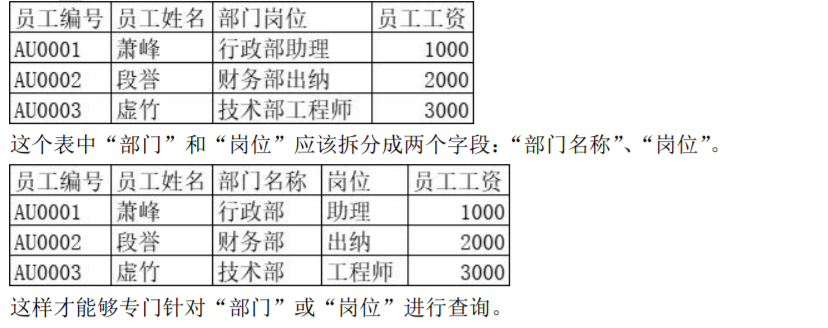

- 第二范式：在满足第一范式基础上要求**每个字段都和主键完整相关**，而不是仅和主键部分相关（主要针对联合主键而言）

  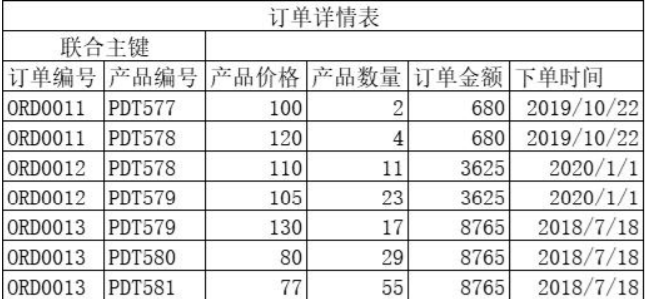

  说明：“订单详情表”使用“订单编号”和“产品编号”作为联合主键。此时“产 品价格”、“产品数量”都和联合主键整体相关，但“订单金额”和“下单时间” 只和联合主键中的“订单编号”相关，和“产品编号”无关。所以只关联了主 键中的部分字段，不满足第二范式。

  把“订单金额”和“下单时间”移到订单表就符合第二范式了。

  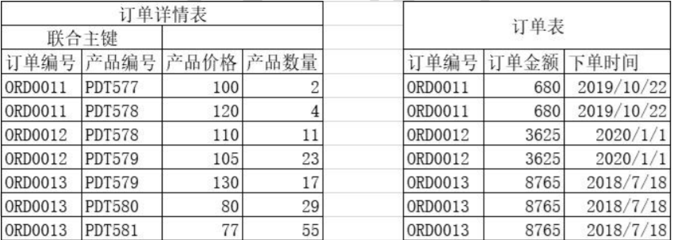

- 第三范式：**表中的非主键字段和主键字段直接相关**，不允许间接相关

  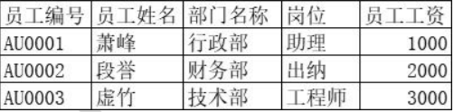

  上面表中的“部门名称”和“员工编号”的关系是“员工编号”→“部门编号” →“部门名称”，不是直接相关。此时会带来下列问题：

  - 数据冗余：“部门名称”多次重复出现。

  - 插入异常：组建一个新部门时没有员工信息，也就无法单独插入部门 信息。就算强行插入部门信息，员工表中没有员工信息的记录同样是 非法记录。

  - 删除异常：删除员工信息会连带删除部门信息导致部门信息意外丢失。

  - 更新异常：哪怕只修改一个部门的名称也要更新多条员工记录。 

    正确的做法是：把上表拆分成两张表，以外键形式关联

    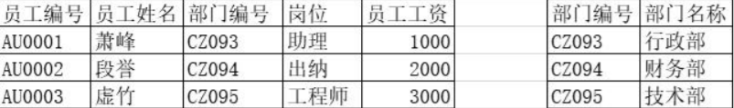

    “部门编号”和“员工编号”是直接相关的。 第三范式的另一种表述方式是：两张表要通过外键关联，不保存冗余字段。例 如：不能在“员工表”中存储“部门名称”。

## 日志系统

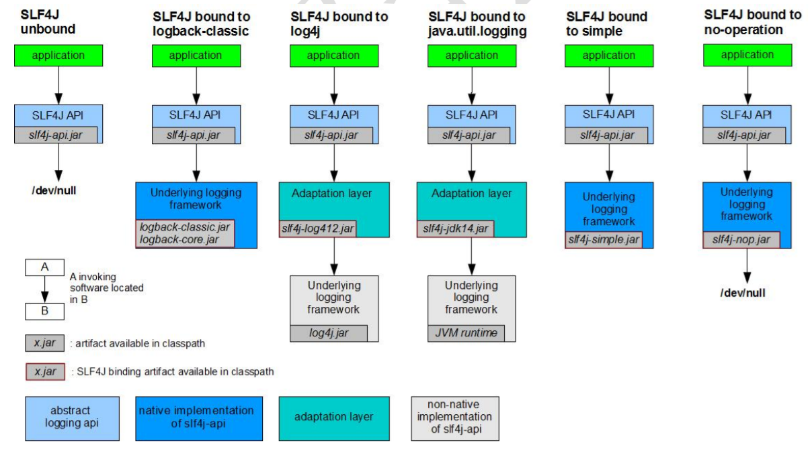

-----

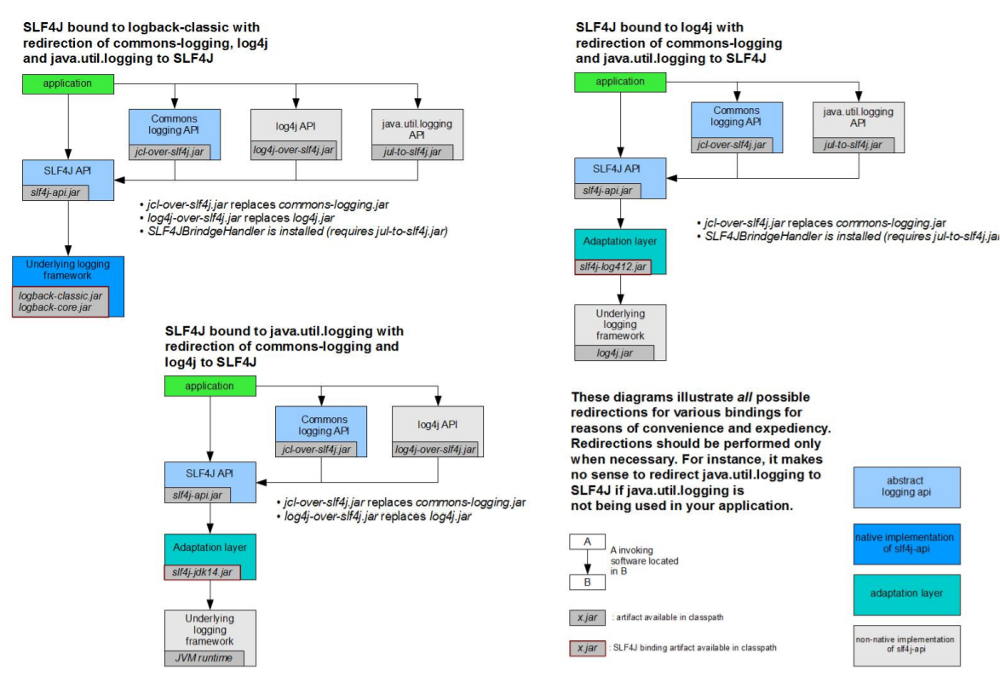

> 需要的依赖

```xml
<!-- 日志 -->
<dependency>
    <groupId>org.slf4j</groupId>
    <artifactId>slf4j-api</artifactId>
    <version>1.7.25</version>
</dependency>
<dependency>
    <groupId>ch.qos.logback</groupId>
    <artifactId>logback-classic</artifactId>
    <version>1.2.3</version>
</dependency>
<!-- 其他日志框架的中间转换包 -->
<dependency>
    <groupId>org.slf4j</groupId>
    <artifactId>jcl-over-slf4j</artifactId>
    <version>1.7.25</version>
</dependency>
<dependency>
    <groupId>org.slf4j</groupId>
    <artifactId>jul-to-slf4j</artifactId>
    <version>1.7.25</version>
</dependency>
<!--还需要排除了spring自带的commons-logging日志 -->
```

**还需要排除了spring自带的commons-logging日志** 

```xml
<dependency>
    <groupId>org.springframework</groupId>
    <artifactId>spring-orm</artifactId>
    <exclusions>
        <exclusion>
            <groupId>commons-logging</groupId>
            <artifactId>commons-logging</artifactId>
        </exclusion>
    </exclusions>
</dependency>
...
```

**logback.xml配置文件**

```xml
<?xml version="1.0" encoding="UTF-8"?>
<configuration debug="true">
    <!-- 指定日志输出的位置 -->
    <appender name="STDOUT" class="ch.qos.logback.core.ConsoleAppender">
        <encoder>
            <!-- 日志输出的格式 -->
            <!-- 按照顺序分别是：时间、日志级别、线程名称、打印日志的类、日志主体
            内容、换行 -->
            <pattern>[%d{HH:mm:ss.SSS}] [%-5level] [%thread] [%logger] [%msg]%n</pattern>
        </encoder>
    </appender>
    <!-- 设置全局日志级别。日志级别按顺序分别是：DEBUG、INFO、WARN、ERROR -->
    <!-- 指定任何一个日志级别都只打印当前级别和后面级别的日志。 -->
    <root level="INFO">
        <!-- 指定打印日志的 appender，这里通过“STDOUT”引用了前面配置的 appender -->
        <appender-ref ref="STDOUT" />
    </root>
    <!-- 根据特殊需求指定局部日志级别 -->
    <logger name="cn.cvzhanshi.crowd.mapper" level="DEBUG"/>
</configuration>
```

**类中使用**

```java
public class CrowdTest {
    private final Logger Log = LoggerFactory.getLogger(CrowdTest.class);

    @Test
    public void testLog(){
        // 如果在实际开发中，所有想查看数值的地方都使用sysout方式打印，会给项目上线运行带来问题！
        // sysout本质上是一个IO操作，通常IO的操作是比较消耗性能的。如果项目中sysout很多，那么对性能的影响就比较大了。
        // 即使上线前专门花时间删除代码中的sysout，也很可能有遗漏，而且非常麻烦。
        // 而如果使用日志系统，那么通过日志级别就可以批量的控制信息的打印。

        // 1.获取Logger对象，这里传入的Class对象就是当前打印日志的类


        // 2.根据不同日志级别打印日志
        Log.debug("Hello I am Debug level!!!");
        Log.debug("Hello I am Debug level!!!");
        Log.debug("Hello I am Debug level!!!");

        Log.info("Info level!!!");
        Log.info("Info level!!!");
        Log.info("Info level!!!");

        Log.warn("Warn level!!!");
        Log.warn("Warn level!!!");
        Log.warn("Warn level!!!");

        Log.error("Error level!!!");
        Log.error("Error level!!!");
        Log.error("Error level!!!");
    }
}
```

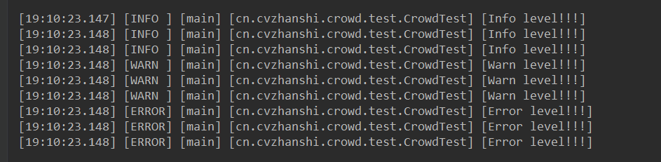

## Spring事务操作xml方式

> 目标

从事务角度：一个事务方法中包含的多个数据库操作，要么一起提交、要么一起回 滚。也就是说事务方法中的多个数据库操作，有任何一个失败，整个事务全部回滚。 从声明式角度：由 Spring 来全面接管数据库事务。用声明式代替编程式。

```java
try {
    // 核心操作前：开启事务（关闭自动提交）
    // 对应 AOP 的前置通知
    connection.setAutoCommit(false);
    // 核心操作
    adminService.updateXxx(xxx, xxx);
    // 核心操作成功：提交事务
    // 对应 AOP 的返回通知
    connection.commit();
}catch(Exception e){
    // 核心操作失败：回滚事务
    // 对应 AOP 的异常通知
    connection.rollBack();
}finally{
    // 不论成功还是失败，核心操作终归是结束了
    // 核心操作不管是怎么结束的，都需要释放数据库连接
    // 对应 AOP 的后置通知
    if(connection != null){
        connection.close();
    }
}
```

> 思路

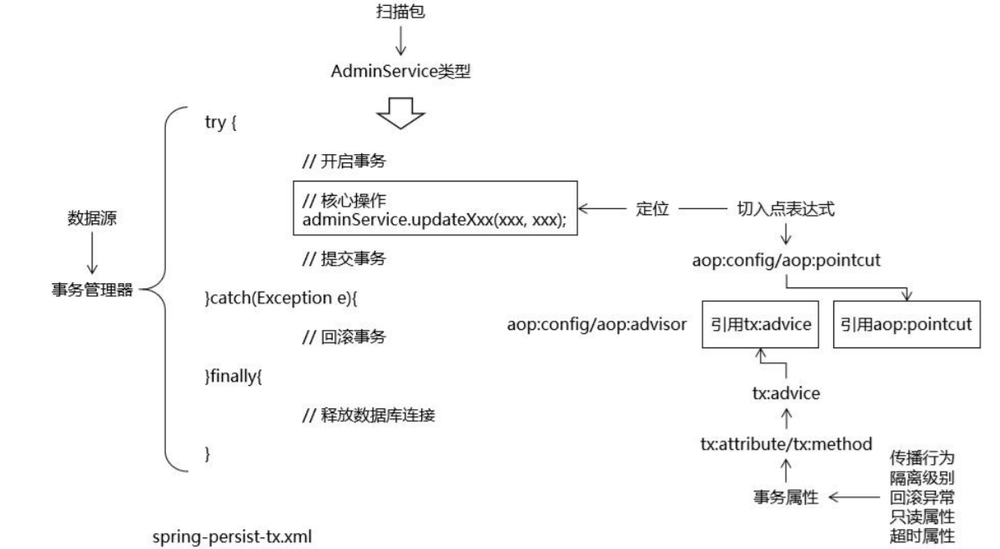

> 操作

```xml
<beans xmlns="http://www.springframework.org/schema/beans"
       xmlns:xsi="http://www.w3.org/2001/XMLSchema-instance"
       xmlns:context="http://www.springframework.org/schema/context"
       xmlns:tx="http://www.springframework.org/schema/tx"
       xmlns:aop="http://www.springframework.org/schema/aop"
       xsi:schemaLocation="http://www.springframework.org/schema/beans http://www.springframework.org/schema/beans/spring-beans.xsd
		http://www.springframework.org/schema/context http://www.springframework.org/schema/context/spring-context.xsd
		http://www.springframework.org/schema/aop http://www.springframework.org/schema/aop/spring-aop.xsd
		http://www.springframework.org/schema/tx http://www.springframework.org/schema/tx/spring-tx.xsd">

    <!-- 配置自动扫描的包：主要是为了把Service扫描到IOC容器中 -->
    <context:component-scan base-package="cn.cvzhanshi.crowd.service"/>

    <!--    事务管理器-->
    <bean id="transactionManager" class="org.springframework.jdbc.datasource.DataSourceTransactionManager">
        <!--注入数据源-->
        <property name="dataSource" ref="dataSource"></property>
    </bean>

    <!-- 配置事务切面 -->
    <aop:config>
        <!-- 考虑到后面我们整合SpringSecurity，避免把UserDetailsService加入事务控制，让切入点表达式定位到ServiceImpl -->
        <aop:pointcut expression="execution(* *..*ServiceImpl.*(..))" id="txPointcut"/>

        <!-- 将切入点表达式和事务通知关联起来 -->
        <aop:advisor advice-ref="txAdvice" pointcut-ref="txPointcut"/>
    </aop:config>

    <!--配置事务的通知-->
    <tx:advice transaction-manager="transactionManager" id="txAdvice">
        <!-- 配置事务属性 -->
        <tx:attributes>
            <!-- 查询方法：配置只读属性，让数据库知道这是一个查询操作，能够进行一定优化 -->
            <tx:method name="get*" read-only="true"/>
            <tx:method name="find*" read-only="true"/>
            <tx:method name="query*" read-only="true"/>
            <tx:method name="count*" read-only="true"/>

            <!-- 增删改方法：配置事务传播行为、回滚异常 -->
            <!--
                propagation属性：
                    REQUIRED：默认值，表示当前方法必须工作在事务中，如果当前线程上没有已经开启的事务，则自己开新事务。如果已经有了，那么就使用这个已有的事务。
                        顾虑：用别人的事务有可能“被”回滚。
                    REQUIRES_NEW：建议使用的值，表示不管当前线程上有没有事务，都要自己开事务，在自己的事务中运行。
                        好处：不会受到其他事务回滚的影响。
             -->
            <!--
                rollback-for属性：配置事务方法针对什么样的异常回滚
                    默认：运行时异常回滚
                    建议：编译时异常和运行时异常都回滚
             -->
            <tx:method name="save*" propagation="REQUIRES_NEW" rollback-for="java.lang.Exception"/>
            <tx:method name="update*" propagation="REQUIRES_NEW" rollback-for="java.lang.Exception"/>
            <tx:method name="remove*" propagation="REQUIRES_NEW" rollback-for="java.lang.Exception"/>
            <tx:method name="batch*" propagation="REQUIRES_NEW" rollback-for="java.lang.Exception"/>
        </tx:attributes>
    </tx:advice>

</beans>
```

**注意**：在基于XML的声明式事务中，事务属性的tx:method是**必须配置**的，如果某个方法没有配置对应的tx:method,那么事务对这个方法就不生效!

## Spring与mvc整合

> web.xml和Spring配置文件关系

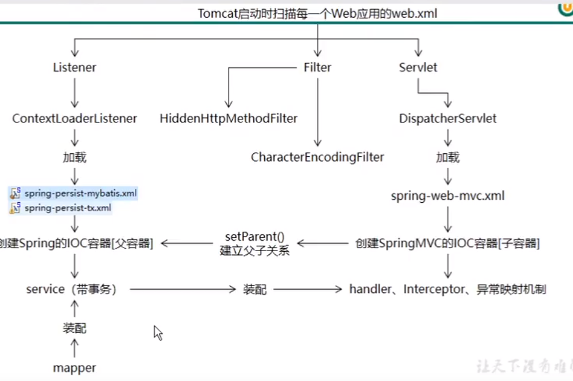

> web.xml

```xml
<?xml version="1.0" encoding="UTF-8"?>
<web-app xmlns:xsi="http://www.w3.org/2001/XMLSchema-instance"
         xmlns="http://java.sun.com/xml/ns/javaee"
         xsi:schemaLocation="http://java.sun.com/xml/ns/javaee http://java.sun.com/xml/ns/javaee/web-app_2_5.xsd"
         id="WebApp_ID" version="2.5">

    <!--1、启动Spring的容器  -->
    <!-- needed for ContextLoaderListener -->
    <context-param>
        <param-name>contextConfigLocation</param-name>
        <param-value>classpath:spring-persist-*.xml</param-value>
    </context-param>
    <listener>
        <listener-class>org.springframework.web.context.ContextLoaderListener</listener-class>
    </listener>
    <!--2、springmvc的前端控制器，拦截所有请求  -->
    <servlet>
        <servlet-name>dispatcherServlet</servlet-name>
        <servlet-class>org.springframework.web.servlet.DispatcherServlet</servlet-class>
        <!-- 以初始化参数的形式指定 SpringMVC 配置文件的位置 -->
        <init-param>
            <param-name>contextConfigLocation</param-name>
            <param-value>classpath:spring-web-mvc.xml</param-value>
        </init-param>
        <!-- Servlet默认生命周期中，创建对象是在第一次接收到请求时 -->
        <!-- 而DispatcherServlet创建对象后有大量的“框架初始化”工作，不适合在第一次请求时来做 -->
        <!-- 设置load-on-startup就是为了让DispatcherServlet在Web应用启动时创建对象、初始化 -->
        <load-on-startup>1</load-on-startup>
    </servlet>
    <servlet-mapping>
        <servlet-name>dispatcherServlet</servlet-name>
        <!-- url-pattern配置方式一：/表示拦截所有请求 -->
        <!-- <url-pattern>/</url-pattern> -->

        <!-- url-pattern配置方式二：配置请求扩展名 -->
        <!-- 优点1：xxx.css、xxx.js、xxx.png等等静态资源完全不经过SpringMVC，不需要特殊处理 -->
        <!-- 优点2：可以实现伪静态效果。表面上看起来是访问一个HTML文件这样的静态资源，但是实际上是经过Java代码运算的结果。 -->
        <!-- 	伪静态作用1：给黑客入侵增加难度。 -->
        <!-- 	伪静态作用2：有利于SEO优化（让百度、谷歌这样的搜索引擎更容易找到我们项目）。 -->
        <!-- 缺点：不符合RESTFul风格 -->
        <url-pattern>*.html</url-pattern>

        <!-- 为什么要另外再配置json扩展名呢？ -->
        <!-- 如果一个Ajax请求扩展名是html，但是实际服务器给浏览器返回的是json数据，二者就不匹配了，会出现406错误。 -->
        <!-- 为了让Ajax请求能够顺利拿到JSON格式的响应数据，我们另外配置json扩展名 -->
        <url-pattern>*.json</url-pattern>
    </servlet-mapping>

    <!--解决 POST 请求的字符乱码问题。需要注意的是：在 web.xml 中存在多个 Filter时，
    让这个 Filter 作为过滤器链中的第一个 Filter。request.setCharacterEncoding(encoding) 要求必须在所有request.getParameter(xxx)操作前面
    response.setCharacterEncoding(encoding)要求必须在所有 response.getWriter()操作前面
    不满足这个顺序要求字符集设定无法生效-->

    <!-- 3、字符编码过滤器，一定要放在所有过滤器之前 -->
    <filter>
        <filter-name>CharacterEncodingFilter</filter-name>
        <filter-class>org.springframework.web.filter.CharacterEncodingFilter</filter-class>
        <!-- 指定字符集 -->
        <init-param>
            <param-name>encoding</param-name>
            <param-value>UTF-8</param-value>
        </init-param>
        <!-- 强制请求进行编码 -->
        <init-param>
            <param-name>forceRequestEncoding</param-name>
            <param-value>true</param-value>
        </init-param>
        <!-- 强制响应进行编码 -->
        <init-param>
            <param-name>forceResponseEncoding</param-name>
            <param-value>true</param-value>
        </init-param>
    </filter>
    <filter-mapping>
        <filter-name>CharacterEncodingFilter</filter-name>
        <url-pattern>/*</url-pattern>
    </filter-mapping>
    <!-- 4、使用Rest风格的URI，将页面普通的post请求转为指定的delete或者put请求 -->
    <filter>
        <filter-name>HiddenHttpMethodFilter</filter-name>
        <filter-class>org.springframework.web.filter.HiddenHttpMethodFilter</filter-class>
    </filter>
    <filter-mapping>
        <filter-name>HiddenHttpMethodFilter</filter-name>
        <url-pattern>/*</url-pattern>
    </filter-mapping>

    <!--让直接发put请求，能从map中取值-->
    <filter>
        <filter-name>HttpPutFormContentFilter</filter-name>
        <filter-class>org.springframework.web.filter.HttpPutFormContentFilter</filter-class>
    </filter>
    <filter-mapping>
        <filter-name>HttpPutFormContentFilter</filter-name>
        <url-pattern>/*</url-pattern>
    </filter-mapping>
</web-app>
```

> spring-web-mvc.xml

```xml
<?xml version="1.0" encoding="UTF-8"?>
<beans xmlns="http://www.springframework.org/schema/beans"
       xmlns:xsi="http://www.w3.org/2001/XMLSchema-instance"
       xmlns:mvc="http://www.springframework.org/schema/mvc"
       xmlns:context="http://www.springframework.org/schema/context"
       xsi:schemaLocation="http://www.springframework.org/schema/mvc http://www.springframework.org/schema/mvc/spring-mvc.xsd
		http://www.springframework.org/schema/beans http://www.springframework.org/schema/beans/spring-beans.xsd
		http://www.springframework.org/schema/context http://www.springframework.org/schema/context/spring-context.xsd">

    <!-- 配置自动扫描的包：扫描handler -->
    <context:component-scan base-package="cn.cvzhanshi.crowd.mvc"/>

    <!-- 配置SpringMVC的注解驱动 -->
    <mvc:annotation-driven/>

    <!-- 配置视图解析器 -->
    <bean id="viewResolver" class="org.springframework.web.servlet.view.InternalResourceViewResolver">
        <property name="prefix" value="/WEB-INF/"/>
        <property name="suffix" value=".jsp"/>
    </bean>
</beans>
```

> base标签

```jsp
<base href="http://${pageContext.request.serverName}:${pageContext.request.serverPort}${pageContext.request.contextPath}/"/>
```

- base 标签必须写在 head 标签内部
- base 标签必须在所有“带具体路径”的标签的前面
- serverName 部分 EL 表达式和 serverPort 部分 EL 表达式之间必须写“:” 
- serverPort 部分 EL 表达式和 contextPath 部分 EL 表达式之间绝对不能写“/” 
  - 原因：contextPath 部分 EL 表达式本身就是“/”开头
  -  如果多写一个“/”会干扰 Cookie 的工作机制
-  contextPath部分 EL 表达式后面必须写“/“

## 统一请求的返回结果

> 第一种

Result.java

```java
public class Result implements Serializable {

    private int code;
    private String message;
    private Object data;

    public Result(int code, String message, Object data) {
        this.code = code;
        this.message = message;
        this.data = data;
    }

    public Result(int code, String message) {
        this.code = code;
        this.message = message;
    }

    public Result(String message, Object data) {
        this.message = message;
        this.data = data;
    }


    public static Result SUCCESS(){
        return new Result(ResultStatus.SUCCESS.getCode(), ResultStatus.SUCCESS.getMessage());
    }

    public static Result SUCCESS(String message){
        return new Result(ResultStatus.SUCCESS.getCode(),message);
    }

    public static Result SUCCESS(Object data){
        return new Result(ResultStatus.SUCCESS.getCode(), ResultStatus.SUCCESS.getMessage(), data);
    }

    public static Result SUCCESS(String message,Object data){
        return new Result(ResultStatus.SUCCESS.getCode(),message, data);
    }

    public static Result ERROR(){
        return new Result(ResultStatus.ERROR.getCode(), ResultStatus.ERROR.getMessage());
    }
    public static Result ERROR(String message){
        return new Result(ResultStatus.ERROR.getCode(),message);
    }

    public int getCode() {
        return code;
    }

    public void setCode(int code) {
        this.code = code;
    }

    public String getMessage() {
        return message;
    }

    public void setMessage(String message) {
        this.message = message;
    }

    public Object getData() {
        return data;
    }

    public void setData(Object data) {
        this.data = data;
    }
}
```

ResultStatus

```java
public enum ResultStatus {

    SUCCESS(2000, "请求成功"),
    ERROR(5000, "请求失败"),
    REDIRECT(302, "跳转"),
    BAD_REQUEST(400, "请求参数有误"),
    FORBIDDEN(403, "拒绝服务"),
    NOT_FOUND(404, "请求资源不存在");

    private int code;
    private String message;

    ResultStatus(int code, String message) {
        this.code = code;
        this.message = message;
    }

    public int getCode() {
        return code;
    }

    public void setCode(int code) {
        this.code = code;
    }

    public String getMessage() {
        return message;
    }

    public void setMessage(String message) {
        this.message = message;
    }
}
```

> 第二种

```java
/**
 * 用于统一项目中所有 Ajax 请求的返回值类型
 * @author cVzhanshi
 * @create 2021-12-02 10:50
 */
public class ResultEntity<T> {
    public static final String SUCCESS = "SUCCESS";
    public static final String FAILED = "FAILED";
    public static final String NO_MESSAGE = "NO_MESSAGE";
    public static final String NO_DATA = "NO_DATA";
    /**
     * 返回操作结果为成功，不带数据
     * @return
     */
    public static <E> ResultEntity<E> successWithoutData() {
        return new ResultEntity<E>(SUCCESS, NO_MESSAGE, null);
    }
    /**
     * 返回操作结果为成功，携带数据
     * @param data * @return
     */
    public static <E> ResultEntity<E> successWithData(E data) {
        return new ResultEntity<E>(SUCCESS, NO_MESSAGE, data);
    }
    /**
     * 返回操作结果为失败，不带数据
     * @param message * @return
     */
    public static <E> ResultEntity<E> failed(String message) {
        return new ResultEntity<E>(FAILED, message, null);
    }
    private String operationResult;
    private String operationMessage;
    private T queryData;
    public ResultEntity() {
    }
    public ResultEntity(String operationResult, String operationMessage, T queryData) {
        super();
        this.operationResult = operationResult;
        this.operationMessage = operationMessage;
        this.queryData = queryData;
    }
    @Override
    public String toString() {
        return "AjaxResultEntity [operationResult=" + operationResult + ", operationMessage=" + operationMessage
            + ", queryData=" + queryData + "]";
    }
    public String getOperationResult() {
        return operationResult;
    }
    public void setOperationResult(String operationResult) {
        this.operationResult = operationResult;
    }
    public String getOperationMessage() {
        return operationMessage;
    }
    public void setOperationMessage(String operationMessage) {
        this.operationMessage = operationMessage;
    }
    public T getQueryData() {
        return queryData;
    }
    public void setQueryData(T queryData) {
        this.queryData = queryData;
    }
}
```

## 异常映射

> 基于xml的异常映射

```xml
<!-- 配置基于 XML 的异常映射 -->
<bean id="simpleMappingExceptionResolver" class="org.springframework.web.servlet.handler.SimpleMappingExceptionResolver">
    <!-- 指定异常类型和逻辑视图名称的对应关系 -->
    <property name="exceptionMappings">
        <props>
            <!-- key 属性指定异常类型（全类名） -->
            <!-- 文本标签体中指定异常对应的逻辑视图名称 -->
            <prop key="java.lang.NullPointerException">system-error</prop>
        </props>
    </property>
    <!-- 使用 exceptionAttribute 可以修改异常对象存入请求域时使用的属性名 -->
    <!-- <property name="exceptionAttribute"></property> -->
</bean>

<!--
    @RequestMapping("/xxx/xxx.html")
    public String xxx(){
    	return "target"; 
	}
	如果只是一个页面跳转，可以使用一以下注解
-->
<mvc:view-controller path=" /xxx/xxx.html" view-name="target"/>
```

> 基于注解的异常映射

判断请求是否为ajax的工具类

```java
@ControllerAdvice
public class CrowdExceptionResolver {


    @ExceptionHandler(value = LoginFailedException.class)
    public ModelAndView resolveLoginFailedException(
            LoginFailedException exception,
            HttpServletRequest request,
            HttpServletResponse response
    ) throws IOException {

        String viewName = "admin-login";

        return commonResolve(viewName, exception, request, response);
    }


	@ExceptionHandler(value = ArithmeticException.class)
	public ModelAndView resolveMathException(
				ArithmeticException exception,
				HttpServletRequest request,
				HttpServletResponse response
			) throws IOException {

		String viewName = "system-error";

		return commonResolve(viewName, exception, request, response);
	}
	@ExceptionHandler(value = NullPointerException.class)
	public ModelAndView resolveNullPointerException(
			NullPointerException exception, 
			HttpServletRequest request,
			HttpServletResponse response) throws IOException {
		
		String viewName = "system-error";

		return commonResolve(viewName, exception, request, response);
	}
	
	// @ExceptionHandler将一个具体的异常类型和一个方法关联起来
	private ModelAndView commonResolve(
			
			// 异常处理完成后要去的页面
			String viewName,

			// 实际捕获到的异常类型
			Exception exception,

			// 当前请求对象
			HttpServletRequest request,

			// 当前响应对象
			HttpServletResponse response) throws IOException {
		
		// 1.判断当前请求类型
		boolean judgeResult = CrowdUtil.judgeRequestType(request);
		
		// 2.如果是Ajax请求
		if(judgeResult) {
			
			// 3.创建ResultEntity对象
			ResultEntity<Object> resultEntity = ResultEntity.failed(exception.getMessage());
			
			// 4.创建Gson对象
			Gson gson = new Gson();
			
			// 5.将ResultEntity对象转换为JSON字符串
			String json = gson.toJson(resultEntity);
			
			// 6.将JSON字符串作为响应体返回给浏览器
			response.getWriter().write(json);
			
			// 7.由于上面已经通过原生的response对象返回了响应，所以不提供ModelAndView对象
			return null;
		}
		
		// 8.如果不是Ajax请求则创建ModelAndView对象
		ModelAndView modelAndView = new ModelAndView();
		
		// 9.将Exception对象存入模型
		modelAndView.addObject(CrowdConstant.ATTR_NAME_EXCEPTION, exception);
		
		// 10.设置对应的视图名称
		modelAndView.setViewName(viewName);
		
		// 11.返回modelAndView对象
		return modelAndView;
	}

}
```

## MD5加密

```java
/**
     * 对明文字符串进行MD5加密
     * @param source 传入的明文字符串
     * @return 加密结果
     */
public static String md5(String source) {

    // 1.判断source是否有效
    if(source == null || source.length() == 0) {

        // 2.如果不是有效的字符串抛出异常
        throw new RuntimeException(CrowdConstant.MESSAGE_STRING_INVALIDATE);
    }

    try {
        // 3.获取MessageDigest对象
        String algorithm = "md5";

        MessageDigest messageDigest = MessageDigest.getInstance(algorithm);

        // 4.获取明文字符串对应的字节数组
        byte[] input = source.getBytes();

        // 5.执行加密
        byte[] output = messageDigest.digest(input);

        // 6.创建BigInteger对象
        int signum = 1;
        BigInteger bigInteger = new BigInteger(signum, output);

        // 7.按照16进制将bigInteger的值转换为字符串
        int radix = 16;
        String encoded = bigInteger.toString(radix).toUpperCase();

        return encoded;

    } catch (NoSuchAlgorithmException e) {
        e.printStackTrace();
    }

    return null;
}

```

## SSM整合SpringSecurity

- 导入依赖

  ```xml
  <!-- SpringSecurity 对 Web 应用进行权限管理 -->
  <!-- https://mvnrepository.com/artifact/org.springframework.security/spring-security-web -->
  <dependency>
      <groupId>org.springframework.security</groupId>
      <artifactId>spring-security-web</artifactId>
      <version>5.3.5.RELEASE</version>
  </dependency>
  <!-- SpringSecurity 配置 -->
  <!-- https://mvnrepository.com/artifact/org.springframework.security/spring-security-config -->
  <dependency>
      <groupId>org.springframework.security</groupId>
      <artifactId>spring-security-config</artifactId>
      <version>5.3.5.RELEASE</version>
  </dependency>
  <!-- SpringSecurity 标签库 -->
  <dependency>
      <groupId>org.springframework.security</groupId>
      <artifactId>spring-security-taglibs</artifactId>
      <version>5.3.5.RELEASE</version>
  </dependency>
  ```

- 在 web.xml 中配置 DelegatingFilterProxy

  ```xml
  <filter>
      <filter-name>springSecurityFilterChain</filter-name>
      <filter-class>org.springframework.web.filter.DelegatingFilterProxy</filter-class>
  </filter>
  <filter-mapping>
      <filter-name>springSecurityFilterChain</filter-name>
      <url-pattern>/*</url-pattern>
  </filter-mapping>
  ```

- 创建基于注解的配置类

  ```java
  // 表示当前类是一个配置类
  @Configuration
  // 启用 Web 环境下权限控制功能
  @EnableWebSecurity
  public class WebAppSecurityConfig extends WebSecurityConfigurerAdapter {
  
  }
  ```

- 谁来把 WebAppSecurityConfig 扫描到 IOC 里？

  如果是 Spring 的 IOC 容器扫描

  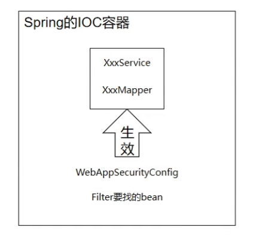

  如果是 SpringMVC 的 IOC 容器扫描：

  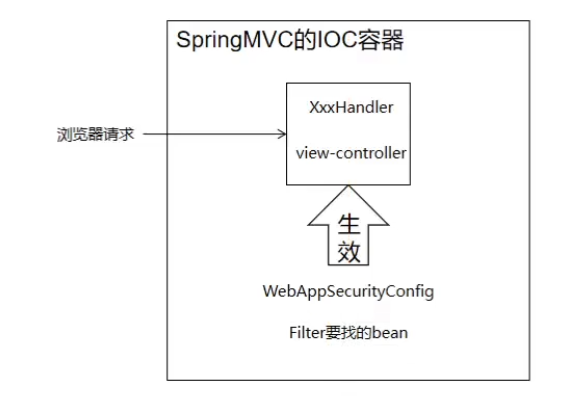

  **结论**：为了让 SpringSecurity 能够针对浏览器请求进行权限控制，需要让 SpringMVC 来扫描 WebAppSecurityConfig 类。 

  **衍生问题**：DelegatingFilterProxy 初始化时需要到 IOC 容器查找一个 bean， 这个 bean 所在的 IOC 容器要看是谁扫描了 WebAppSecurityConfig。 如果是 Spring 扫描了 WebAppSecurityConfig，那么 Filter 需要的 bean 就在 Spring 的 IOC 容器。 如果是 SpringMVC 扫描了 WebAppSecurityConfig，那么 Filter 需要的 bean 就在 SpringMVC 的 IOC 容器

> 启动项目会发现报错，提出找不到bean的问题

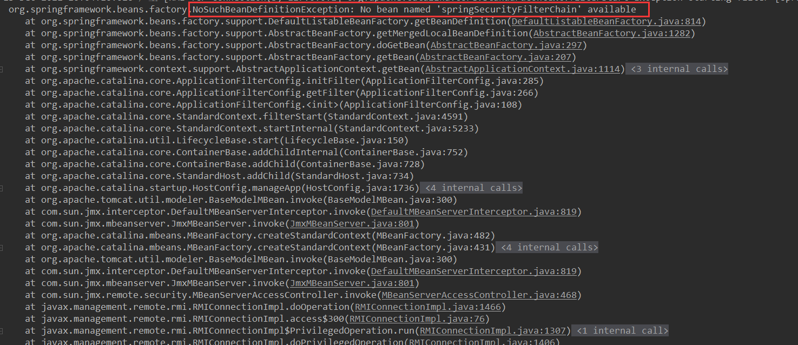

> 分析问题

- 明确三大组件启动顺序

  首先：ContextLoaderListener 初始化，创建 Spring 的 IOC 容器 

  其次：DelegatingFilterProxy 初始化，查找 IOC 容器、查找 bean 

  最后：DispatcherServlet 初始化，创建 SpringMVC 的 IOC 容器

- DelegatingFilterProxy 查找 IOC 容器然后查找 bean 的工作机制

  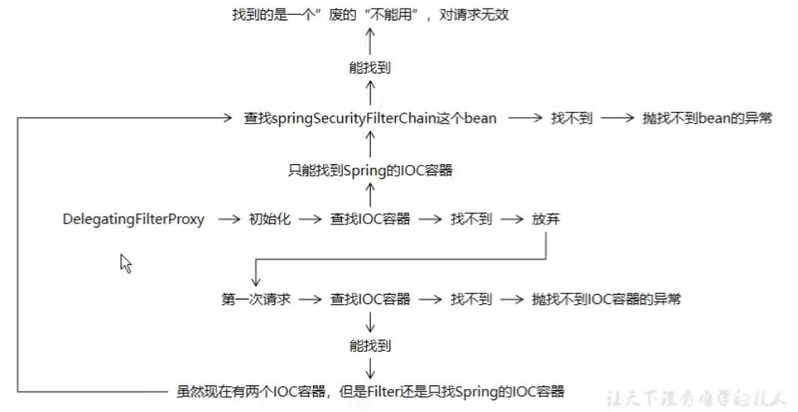

> 解决方案一：把两个 IOC 容器合二为一

不使用 ContextLoaderListener，让 DispatcherServlet 加载所有 Spring 配置文件。

- DelegatingFilterProxy 在初始化时查找 IOC 容器，找不到，放弃。
- 第一次请求时再次查找。  找到 SpringMVC 的 IOC 容器。
- 从这个 IOC 容器中找到所需要的 bean。 

遗憾：会破坏现有程序的结构。原本是 ContextLoaderListener 和 DispatcherServlet 两个组件创建两个 IOC 容器，现在改成只有一个。

> 解决方案二：改源码

- 创建相同的包名和类名

  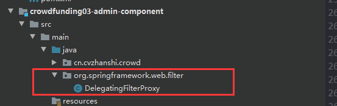

- 初始化时直接跳过查找 IOC 容器的环节

  ```java
  @Override
  protected void initFilterBean() throws ServletException {
      synchronized (this.delegateMonitor) {
          if (this.delegate == null) {
              // If no target bean name specified, use filter name.
              if (this.targetBeanName == null) {
                  this.targetBeanName = getFilterName();
              }
              // Fetch Spring root application context and initialize the delegate early, // if possible. If the root application context will be started after this
              // filter proxy, we'll have to resort to lazy initialization. /*WebApplicationContext wac = findWebApplicationContext();
              if (wac != null) {
                  this.delegate = initDelegate(wac);
              }*/
          }
      }
  }
  ```

- 第一次请求的时候直接找 SpringMVC 的 IOC 容器

  ```java
  @Override
  public void doFilter(ServletRequest request, ServletResponse response, FilterChain filterChain)
      throws ServletException, IOException {
  
      // Lazily initialize the delegate if necessary.
      Filter delegateToUse = this.delegate;
      if (delegateToUse == null) {
          synchronized (this.delegateMonitor) {
              delegateToUse = this.delegate;
              if (delegateToUse == null) {
  
  
                  // 把原来的查找 IOC 容器的代码注释掉
                  // WebApplicationContext wac = findWebApplicationContext();
                  // 按我们自己的需要重新编写
                  // 1.获取 ServletContext 对象
                  ServletContext sc = this.getServletContext();
                  // 2.拼接 SpringMVC 将 IOC 容器存入 ServletContext 域的时候使用的属性名
                  String servletName = "dispatcherServlet";
                  String attrName = FrameworkServlet.SERVLET_CONTEXT_PREFIX + servletName;
                  // 3.根据 attrName 从 ServletContext 域中获取 IOC 容器对象
                  WebApplicationContext wac = (WebApplicationContext) sc.getAttribute(attrName);
                  if (wac == null) {
                      throw new IllegalStateException("No WebApplicationContext found: " +
                                                      "no ContextLoaderListener or DispatcherServlet registered?");
                  }
                  delegateToUse = initDelegate(wac);
              }
              this.delegate = delegateToUse;
          }
      }
  
      // Let the delegate perform the actual doFilter operation.
      invokeDelegate(delegateToUse, request, response, filterChain);
  }
  ```

**启动项目，整合成功**

## 实体类的划分

- VO：View Object 视图对象
  - 用途 1：接收**浏览器**发送过来的数据
  - 用途 2：把数据发送给**浏览器**去显示
- PO：Persistent Object 持久化对象
  - 用途 1：将数据封装到 PO 对象存入数据库
  - 用途 2：将数据库数据查询出来存入 PO 对象
  - 所以 PO 对象是和数据库表对应，一个数据库表对应一个 PO 对象
- DO：Data Object 数据对象
  - 用途 1：从 Redis 查询得到数据封装为 DO 对象
  - 用途 2：从 ElasticSearch 查询得到数据封装为 DO 对象
  - 用途 3：从 Solr 查询得到数据封装为 DO 对象……
  - 从中间件或其他第三方接口查询到的数据封装为 DO 对象
- DTO：Data Transfer Object 数据传输对象
  - 用途 1：从 Consumer 发送数据到 Provider
  - 用途 2：Provider 返回数据给 Consumer

## 项目部署

```sh
//这种方法会把日志文件输入到你指定的文件中，没有则会自动创建。进程会在后台运行。
$ nohup java -jar test.jar >temp.txt &
```

## 线程池问题

创建了一个线程池

```java
ExecutorService taskExecutorService = new ThreadPoolExecutor(1, 10, 60, TimeUnit.SECONDS,
        new LinkedBlockingQueue<>(1024),
        BasicThreadFactory.builder().namingPattern("stats_report_%d").build(),
        new ThreadPoolExecutor.AbortPolicy()
); 
```

其中：**如果队列没满，那么只有核心线程数的线程工作，如果队列满了就会新建线程进行工作，直到最大线程数**
