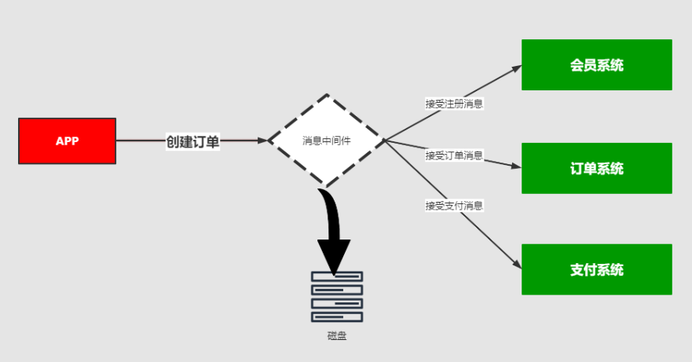
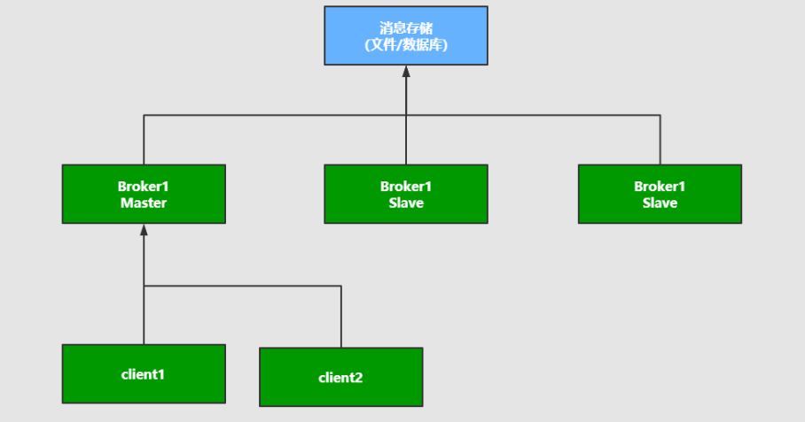
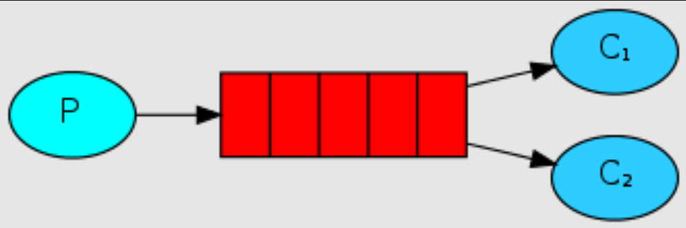

# 一、消息中间件的概述

## ① 基于消息中间件的分布式系统的架构

> **1、基于消息中间件的分布式系统的架构**


从上图中可以看出来，消息中间件的是
1、利用可靠的消息传递机制进行系统和系统直接的通讯
2、通过提供消息传递和消息的排队机制，它可以在分布式系统环境下扩展进程间的通讯。

> **2、消息中间件应用的场景**

- 跨系统数据传递
- 高并发的流量削峰
- 数据的分发和异步处理
- 大数据分析与传递
- 分布式事务

比如你有一个数据要进行迁移或者请求并发过多的时候，比如你有10W的并发请求下订单，我们可以在这些订单入库之前，我们可以把订单请求堆积到消息队列中，让它稳健可靠的入库和执行。

> **3、常见的消息中间件**

- ActiveMQ
- **RabbitMQ**
- **Kafka**
- RocketMQ

> **4、消息中间件的本质及设计**
>
> ​		它是一种接受数据，接受请求、存储数据、发送数据等功能的技术服务

MQ消息队列：负责数据的传接受，存储和传递，所以性能要过于普通服务和技术


其中生产者发送数据，MQ存储数据，消费者接受数据


> **5、消息中间件的核心组成部分**

- 消息的协议
- 消息的持久化机制
- 消息的分发策略
- 消息的高可用，高可靠
- 消息的容错机制

## ② 消息队列协议

> **1、什么是协议**


消息中间件负责数据的传递，存储，和分发消费三个部分，数据的存储和分发的过程中肯定要遵循某种约定成俗的规范，你是采用底层的TCP/IP，UDP协议还是其他的自己取构建等，而这些约定成俗的规范就称之为：协议

所谓**协议**是指：

- 计算机底层操作系统和应用程序通讯时**共同遵守的一组约定**，只有遵循共同的约定和规范，系统和底层操作系统之间才能相互交流。
- 和一般的网络应用程序的不同它主要负责数据的接受和传递，所以性能比较的高。
- 协议对数据格式和计算机之间交换数据都必须严格遵守规范。

> **2、网络协议的三要素**

**语法**：语法是用户数据与控制信息的结构与格式，以及数据出现的顺序。

**语义**：语义是解释控制信息每个部分的意义。它规定了需要发出何种控制信息,以及完成的动作与做出什么样的响应。

**时序**：时序是对事件发生顺序的详细说明。

例如：比如我MQ发送一个信息，是以什么数据格式发送到队列中，然后每个部分的含义是什么，发送完毕以后的执行的动作，以及消费者消费消息的动作，消费完毕的响应结果和反馈是什么，然后按照对应的执行顺序进行处理。

http请求协议中：

- 语法：http规定了请求报文和响应报文的格式。
- 语义：客户端主动发起请求称之为请求。（这是一种定义，同时你发起的是post/get请求）
- 时序：一个请求对应一个响应。（一定先有请求在有响应，这个是时序）

**而消息中间件采用的并不是http协议，而常见的消息中间件协议有：OpenWire、AMQP、MQTT、Kafka，OpenMessage协议**

> **3、AMQP协议（详细讲）**

AMQP：(全称：Advanced Message Queuing Protocol) 是高级消息队列协议。由摩根大通集团联合其他公司共同设计。是一个提供统一消息服务的应用层标准高级消息队列协议，是应用层协议的一个开放标准，为面向消息的中间件设计。基于此协议的客户端与消息中间件可传递消息，并不受客户端/中间件不同产品，不同的开发语言等条件的限制。Erlang中的实现有RabbitMQ等。
**特性**：

- 分布式事务支持。
- 消息的持久化支持。
- 高性能和高可靠的消息处理优势。

**AMQP协议的支持者**：RabbitMQ、ActiveMQ

**AMQP生产者流转过程**


**AMQP消费者流转过程**


> **4、MQTT协议**

MQTT协议：（Message Queueing Telemetry Transport）消息队列是IBM开放的一个即时通讯协议，物联网系统架构中的重要组成部分。
**特点**：

- 轻量
- 结构简单
- 传输快，**不支持事务**
- **没有持久化设计**。

**应用场景**：

- 适用于计算能力有限
- 低带宽
- 网络不稳定的场景。

**MQTT协议的支持者**：RabbitMQ、ActiveMQ

> **5、OpenMessage协议**

是近几年由阿里、雅虎和滴滴出行、Stremalio等公司共同参与创立的分布式消息中间件、流处理等领域的应用开发标准。
**特点**：

- 结构简单
- 解析速度快
- 支持事务和持久化设计。

**OpenMessage协议的支持者**：RocketMQ

> 6、Kafka

Kafka协议是基于TCP/IP的二进制协议。消息内部是通过长度来分割，由一些基本数据类型组成。
**特点**：

- 结构简单
- 解析速度快
- 无事务支持
- 有持久化设计

==协议的总结：是在tcp/ip协议基础之上构建的一种约定成俗的规范和机制、它的主要目的可以让客户端（应用程序 java，go）进行沟通和通讯。并且这种协议下规范必须具有持久性，高可用，高可靠的性能。==

## ③ 消息队列持久化

|          | ActiveMQ | RabbitMQ | Kafka | RocketMQ |
| -------- | -------- | -------- | ----- | -------- |
| 文件存储 | 支持     | 支持     | 支持  | 支持     |
| 数据库   | 支持     | /        | /     | /        |

## ④ 消息分发策略

MQ消息队列有如下几个角色

- 生产者
- 存储消息
- 消费者

那么生产者生成消息以后，MQ进行存储，消费者一般获取数据的方式无外乎推（push）或者拉（pull）两种方式，典型的git就有推拉机制，我们发送的http请求就是一种典型的拉取数据库数据返回的过程。而消息队列MQ是一种推送的过程，而这些推机制会适用到很多的业务场景也有很多对应推机制策略。

> **1、场景分析一**



比如我在APP上下了一个订单，我们的系统和服务很多，我们如何得知这个消息被那个系统或者那些服务或者系统进行消费，那这个时候就需要一个分发的策略。这就需要消费策略。或者称之为消费的方法论。

> **2、场景分析二**


在发送消息的过程中可能会出现异常，或者网络的抖动，故障等等因为造成消息的无法消费，比如用户在下订单，消费MQ接受，订单系统出现故障，导致用户支付失败，那么这个时候就需要消息中间件就必须支持消息重试机制策略。也就是支持：**出现问题和故障的情况下，消息不丢失还可以进行重发**。

> **3、消息分发策略的机制和对比**

|          | ActiveMQ | RabbitMQ | Kafka | **RocketMQ** |
| -------- | -------- | -------- | ----- | ------------ |
| 发布订阅 | 支持     | 支持     | 支持  | 支持         |
| 轮询分发 | 支持     | 支持     | 支持  | /            |
| 公平分发 | /        | 支持     | 支持  | /            |
| 重发     | 支持     | 支持     | /     | 支持         |
| 消息拉取 | /        | 支持     | 支持  | 支持         |

## ⑤ 消息队列高可用和高可靠

> ### 1、**高可用机制**

**高可用**：**是指产品在规定的条件和规定的时刻或时间内处于可执行规定功能状态的能力**。
当业务量增加时，请求也过大，一台消息中间件服务器的会触及硬件（CPU,内存，磁盘）的极限，一台消息服务器你已经无法满足业务的需求，所以**消息中间件必须支持集群部署**。来达到高可用的目的。

> **01、集群模式1 - Master-slave主从共享数据的部署方式**



生产者将消费发送到Master节点，所有的都连接这个消息队列共享这块数据区域，Master节点负责写入，一旦Master挂掉，slave节点继续服务。从而形成高可用。

> **02、集群模式2 - Master- slave主从同步部署方式**


这种模式写入消息同样在Master主节点上，但是主节点会同步数据到slave节点形成副本，和zookeeper或者redis主从机制很类同。这样可以达到负载均衡的效果，如果消费者有多个这样就可以去不同的节点就行消费，以为消息的拷贝和同步会暂用很大的带宽和网络资源。在后续的rabbtmq中会有使用。

> **03、多主集群同步部署模式**


和上面的区别不是特别的大，但是它的写入可以往任意节点去写入。

> **04、集群模式4 - 多主集群转发部署模式**


如果你插入的数据是broker-1中，元数据信息会存储数据的相关描述和记录存放的位置（队列）。
它会对描述信息也就是元数据信息就行同步，如果消费者在broker-2中进行消费，发现自己几点没有对应的消息，可以从对应的元数据信息中去查询，然后返回对应的消息信息，场景：比如买火车票或者黄牛买演唱会门票，比如第一个黄牛有顾客说要买的演唱会门票，但是没有但是他会去联系其他的黄牛询问，如果有就返回。

> 05、集群模式5 Master-slave与Breoker-cluster组合的方案


实现多主多从的热备机制来完成消息的高可用以及数据的热备机制，在生产规模达到一定的阶段的时候，这种使用的频率比较高。

-----

- **要么消息共享，**
- **要么消息同步**
- **要么元数据共享**

> ### 高可靠机制

高可靠是指：是指系统可以无故障低持续运行，比如一个系统突然崩溃，报错，异常等等并不影响线上业务的正常运行，出错的几率极低，就称之为：高可靠。
在高并发的业务场景中，如果不能保证系统的高可靠，那造成的隐患和损失是非常严重的。
如何保证中间件消息的可靠性呢？可以从两个方面考虑：

- 消息的传输：通过协议来保证系统间数据解析的正确性。
- 消息的存储可靠：通过持久化来保证消息的可靠性。

# 二、RabbitMQ概述

## ① RabbitMQ入门及安装

> ### 1、概述
>
> 官网：https://www.rabbitmq.com/

- RabbitMQ是部署最广泛的开源消息代理。

- RabbitMQ拥有成千上万的用户，是最受欢迎的开源消息代理之一。从T-Mobile 到Runtastic，RabbitMQ在全球范围内的小型初创企

  业和大型企业中都得到使用。

- RabbitMQ轻巧，易于在内部和云中部署。它支持多种消息传递协议。RabbitMQ可以部署在分布式和联合配置中，以满足大规模，高

  可用性的要求。

- RabbitMQ可在许多操作系统和云环境上运行，并为大多数流行语言提供了广泛的开发人员工具。

**RabbitMQ是一个开源的遵循AMQP协议实现的基于Erlang语言编写，支持多种客户端（语言）。用于在分布式系统中存储消息，转发消息，具有高可用，高可扩性，易用性等特征。**

> ### 2、安装RabbitMQ
>
> 下载地址：https://www.rabbitmq.com/download.html

环境准备：CentOS7.x+ / Erlang
RabbitMQ是采用Erlang语言开发的，所以系统环境必须提供Erlang环境，第一步就是安装Erlang。其中erlang和RabbitMQ版本的按照比较: https://www.rabbitmq.com/which-erlang.html

> 安装Erlang
>
> 下载地址：https://www.erlang-solutions.com/downloads/

```bash
# 先把下载好的丢到Linux中
# 1、rpm依赖
rpm -Uvh erlang-solutions-2.0-1.noarch.rpm
# 2、安装
yum install -y erlang
# 3、查看是否安装成功
erl -v
```

> 安装socat（RabbitMQ安装中需要的插件）

```bash
yum install -y socat
```

> 安装rabbitmq
>
> 下载地址：https://www.rabbitmq.com/download.html

```bash
# 先把下载好的丢到Linux中
# 1、rpm依赖
rpm -Uvh rabbitmq-server-3.8.13-1.el7.noarch.rpm
# 2、安装
yum install rabbitmq-server -y
# 3、查看是否安装成功
erl -v

# 启动服务
systemctl start rabbitmq-server
# 查看服务状态
systemctl status rabbitmq-server
# 停止服务
systemctl stop rabbitmq-server
# 开机启动服务
systemctl enable rabbitmq-server
```

> ### **3、相关端口**

- **5672**：RabbitMQ的通讯端口
- **25672**：RabbitMQ的节点间的CLI通讯端口是
- **15672**：RabbitMQ HTTP_API的端口，管理员用户才能访问，用于管理RabbitMQ,需要启动Management插件。
- **1883**、**8883**：MQTT插件启动时的端口。
- **61613**、**61614**：STOMP客户端插件启用的时候的端口。
- **15674**、**15675**：基于webscoket的STOMP端口和MOTT端口

## ② RabbitMQ的Web管理界面及授权操作

> ### 1、安装RabbitMQ管理界面

**默认情况下，rabbitmq是没有安装web端的客户端插件，需要安装才可以生效**

安装命令

```bash
# 安装web端的客户端插件
rabbitmq-plugins enable rabbitmq_management

# 重启服务
systemctl restart rabbitmq-server
```

**说明**：rabbitmq有一个默认账号和密码是：`guest` 默认情况只能在localhost本机下访问，所以需要添加一个远程登录的用户。

**值得注意的是**：在对应服务器(阿里云，腾讯云等)的安全组中开放`15672`的端口。

在浏览器中访问


> ### 2、授权账号和密码

- 新增用户

  ```bash
  # rabbitmqctl add_user 账号 密码
  rabbitmqctl add_user admin admin
  ```

- 设置用户分配操作权限

  ```bash
  # rabbitmqctl set_user_tags 账号 权限级别
  rabbitmqctl set_user_tags admin administrator
  
  # 用户级别
  #1、administrator 可以登录控制台、查看所有信息、可以对rabbitmq进行管理
  #2、monitoring 监控者 登录控制台，查看所有信息
  #3、policymaker 策略制定者 登录控制台,指定策略
  #4、managment 普通管理员 登录控制台
  ```

- 为用户添加资源权限

  ```bash
  rabbitmqctl.bat set_permissions -p / 账号 ".*" ".*" ".*"
  ```

> ### 3、小结

```bash
# 新增用户
rabbitmqctl add_user 账号 密码
# 赋予用户级别
rabbitmqctl set_user_tags 账号 administrator
# 修改密码
rabbitmqctl change_password Username Newpassword
# 删除用户
rabbitmqctl delete_user Username 
# 查看用户清单
rabbitmqctl list_users 
rabbitmqctl set_permissions -p / 用户名 ".*" ".*" ".*" 为用户设置administrator角色
rabbitmqctl set_permissions -p / root ".*" ".*" ".*"
```

## ③ RabbitMQ之Docker安装

> ### 1、安装docker
>
> [安装Docker参考文章](https://blog.csdn.net/qq_45408390/article/details/120264152)

docker的相关命令

```bash
# 启动docker：
systemctl start docker
# 停止docker：
systemctl stop docker
# 重启docker：
systemctl restart docker
# 查看docker状态：
systemctl status docker
# 开机启动：  
systemctl enable docker
systemctl unenable docker
# 查看docker概要信息
docker info
# 查看docker帮助文档
docker --help
```

> 2、安装RabbitMQ
>
> 参考网站：
> 1：https://www.rabbitmq.com/download.html
> 2：https://registry.hub.docker.com/_/rabbitmq/

- 获取rabbit镜像

  ```bash
  docker pull rabbitmq:management
  ```

- 创建并运行容器

  ```bash
  # —hostname：指定容器主机名称
  # —name:指定容器名称
  # -p:将mq端口号映射到本地
  docker run -di --name=myrabbit -p 15672:15672 rabbitmq:management
  ```

  但是这样运行的话进入Web监控页面需要重新进入容器中设置一个账号密码

- **所以可以运行时设置用户和密码**

  ```bash
  docker run -di --name myrabbit -e RABBITMQ_DEFAULT_USER=admin -e RABBITMQ_DEFAULT_PASS=admin -p 15672:15672 -p 5672:5672 -p 25672:25672 -p 61613:61613 -p 1883:1883 rabbitmq:management
  ```

  查看日志

  ```bash
  docker logs -f myrabbit
  ```

- 容器运行正常

  使用 `http://你的IP地址:15672` 访问rabbit控制台

## ④ RabbitMQ的角色分类

> ## 1：none

- 不能访问management plugin

> ### 2：management：查看自己相关节点信息

- 列出自己可以通过AMQP登入的虚拟机
- 查看自己的虚拟机节点 virtual hosts的queues,exchanges和bindings信息
- 查看和关闭自己的channels和connections
- 查看有关自己的虚拟机节点virtual hosts的统计信息。包括其他用户在这个节点virtual hosts中的活动信息。

> ### 3：Policymaker

- 包含management所有权限
- 查看和创建和删除自己的virtual hosts所属的policies和parameters信息。

> ### 4：Monitoring

- 包含management所有权限
- 罗列出所有的virtual hosts，包括不能登录的virtual hosts。
- 查看其他用户的connections和channels信息
- 查看节点级别的数据如clustering和memory使用情况
- 查看所有的virtual hosts的全局统计信息。

> ### 5：Administrator

- 最高权限
- 可以创建和删除virtual hosts
- 可以查看，创建和删除users
- 查看创建permisssions
- 关闭所有用户的connections

> ### 6：具体操作页面


## ⑤ RabbitMQ的核心组成部分

> **RabbitMQ的核心组成部分**


- **Server**：又称Broker ,接受客户端的连接，实现AMQP实体服务。 安装rabbitmq-server
- **Connection**：连接，应用程序与Broker的网络连接 TCP/IP/ 三次握手和四次挥手
- **Channel**：网络信道，几乎所有的操作都在Channel中进行，Channel是进行消息读写的通道，客户端可以建立对各Channel，每个Channel代表一个会话任务。
- **Message** :消息：服务与应用程序之间传送的数据，由Properties和body组成，Properties可是对消息进行修饰，比如消息的优先级，延迟等高级特性，Body则就是消息体的内容。
- **Virtual Host** 虚拟地址，用于进行逻辑隔离，最上层的消息路由，一个虚拟主机理由可以有若干个Exhange和Queueu，同一个虚拟主机里面不能有相同名字的Exchange
- **Exchange**：交换机，**接受消息（不是队列接受消息，而是交换机）**，根据路由键发送消息到绑定的队列。(==不具备消息存储的能力==)
- **Bindings**：Exchange和Queue之间的虚拟连接，binding中可以保护多个routing key.
- **Routing key**：是一个路由规则，虚拟机可以用它来确定如何路由一个特定消息。
- **Queue**：队列：也成为Message Queue,消息队列，保存消息并将它们转发给消费者。

> **RabbitMQ整体架构**


> **RabbitMQ的运行流程**


> **RabbitMQ支持消息的模式**

- 简单模式Simple
- 工作模式Work
  - 特点：分发机制
- 发布订阅模式
  - 类型：fanout
  - 特点：Fanout—发布与订阅模式，是一种广播机制，它是没有路由key的模式。
- 路由模式
  - 类型：direct
  - 特点：有routing-key的匹配模式
- 主题Topic模式
  - 类型：topic
  - 特点：模糊的routing-key的匹配模式
- 参数模式
  - 类型：headers
  - 特点：参数匹配模式

# 三、RabbitMQ入门案例

## ① Simple简单模式

架构图


- 创建maven项目

- 导入依赖

  ```xml
  <dependencies>
      <dependency>
          <groupId>com.rabbitmq</groupId>
          <artifactId>amqp-client</artifactId>
          <version>5.10.0</version>
      </dependency>
  </dependencies>
  ```

- 编写生产者

  ```java
  /**
   * @author cVzhanshi
   * @create 2022-11-08 16:31
   */
  public class Producer {
      public static void main(String[] args) {
          // 所有的中间件技术都是基于tcp/ip协议基础上构建新型的协议规范，只不过rabbitmq遵循的是AMQP
  
          // 1: 创建连接工程
          ConnectionFactory connectionFactory = new ConnectionFactory();
          connectionFactory.setHost("120.79.66.222");
          connectionFactory.setPort(5672);
          connectionFactory.setUsername("admin");
          connectionFactory.setPassword("admin");
          connectionFactory.setVirtualHost("/");
          Connection connection = null;
          Channel channel = null;
          try {
              // 2: 创建连接Connection
              connection = connectionFactory.newConnection("生产者");
              // 3: 通过连接获取通道
              channel = connection.createChannel();
              // 4: 通过通道创建交换机、声明队列、绑定关系、路由key、发送消息和接收消息
              /*
               *  如果队列不存在，则会创建
               *  Rabbitmq不允许创建两个相同的队列名称，否则会报错。
               *
               *  @params1： queue 队列的名称
               *  @params2： durable 队列是否持久化 非持久化也会存盘，但是会随着重启服务而丢失
               *  @params3： exclusive 是否排他，即是否私有的，如果为true,会对当前队列加锁，其他的通道不能访问，并且连接自动关闭
               *  @params4： autoDelete 是否自动删除，当最后一个消费者断开连接之后是否自动删除消息。
               *  @params5： arguments 可以设置队列附加参数，设置队列的有效期，消息的最大长度，队列的消息生命周期等等。
               * */
              channel.queueDeclare("queue1", true, false, false, null);
              // 5: 准备消息内容
              String message = "Hello RabbitMQ";
              // 6: 发送消息给队列queue
              // @params1: 交换机exchange  没指定交换机，会和默认交换机绑定
              // @params2: 队列名称/routing
              // @params3: 属性配置
              // @params4: 发送消息的内容
              channel.basicPublish("", "queue1", null, message.getBytes());
              System.out.println("消息发送成功");
  
          } catch (IOException e) {
              System.out.println("发送消息出现异常...");
              e.printStackTrace();
          } catch (TimeoutException e) {
              System.out.println("发送消息出现异常...");
              e.printStackTrace();
          }finally {
              // 7: 关闭连接
              if(connection != null && connection.isOpen()){
                  try {
                      connection.close();
                  } catch (IOException e) {
                      e.printStackTrace();
                  }
              }
              // 8: 关闭通道
              if(channel != null && channel.isOpen()){
                  try {
                      channel.close();
                  } catch (IOException e) {
                      e.printStackTrace();
                  } catch (TimeoutException e) {
                      e.printStackTrace();
                  }
              }
          }
      }
  }
  ```

- 编写消费者

  ```java
  /**
   * 简单模式simple
   * @author cVzhanshi
   * @create 2022-11-08 16:31
   */
  public class Consumer {
      public static void main(String[] args) {
  
          // 1: 创建连接工程
          ConnectionFactory connectionFactory = new ConnectionFactory();
          connectionFactory.setHost("120.79.66.222");
          connectionFactory.setPort(5672);
          connectionFactory.setUsername("admin");
          connectionFactory.setPassword("admin");
          connectionFactory.setVirtualHost("/");
          Connection connection = null;
          Channel channel = null;
          try {
              // 2: 创建连接Connection
              connection = connectionFactory.newConnection("消费者");
              // 3: 通过连接获取通道
              channel = connection.createChannel();
              // 4: 通过通道接收消息
              channel.basicConsume("queue1", true, new DeliverCallback() {
                  @Override
                  public void handle(String s, Delivery delivery) throws IOException {
                      System.out.println("收到消息是：" + new String(delivery.getBody() ,"UTF-8"));
                  }
              }, new CancelCallback() {
                  @Override
                  public void handle(String s) throws IOException {
                      System.out.println("接收消息失败");
                  }
              });
              System.out.println("消息接收成功");
  
          } catch (IOException e) {
              System.out.println("发送消息出现异常...");
              e.printStackTrace();
          } catch (TimeoutException e) {
              System.out.println("发送消息出现异常...");
              e.printStackTrace();
          }finally {
              // 7: 关闭连接
              if(connection != null && connection.isOpen()){
                  try {
                      connection.close();
                  } catch (IOException e) {
                      e.printStackTrace();
                  }
              }
              // 8: 关闭通道
              if(channel != null && channel.isOpen()){
                  try {
                      channel.close();
                  } catch (IOException e) {
                      e.printStackTrace();
                  } catch (TimeoutException e) {
                      e.printStackTrace();
                  }
              }
          }
      }
  }
  ```

- 测试

  ```
  消息接收成功
  
  消息接收成功
  收到消息是：Hello RabbitMQ
  ```

  到web页面去看能看到Connection、Channel、queue都有展示

- 执行发送，这个时候可以在web控制台查看到这个队列queue的信息


- 我们可以进行对队列的消息进行预览和测试如下：

  

- 进行预览和获取消息进行测试，**如果是在页面测试的话使用nack，不会去消费消息**

  

**总结：**

- **生产者的消息都是发给交换机的，然后再由交换机分发给队列，多以每个队列都必须指定绑定的交换机，没指定的话就会和默认交换机绑定**

## ② fanout发布订阅模式

> 图解


说明：**Fanout—发布与订阅模式，是一种广播机制，它是没有路由key的模式。这种模式只需要订阅交换机，这样生产者发送到交换机的消息会自动同步到订阅了的队列中**

> **代码示例**

**生产者**

```java
/**
 * @author cVzhanshi
 * @create 2022-11-09 10:29
 */
public class Producer {
    public static void main(String[] args) {
        // 1: 创建连接工厂
        ConnectionFactory connectionFactory = new ConnectionFactory();
        // 2: 设置连接属性
        connectionFactory.setHost("120.79.66.222");
        connectionFactory.setPort(5672);
        connectionFactory.setUsername("admin");
        connectionFactory.setPassword("admin");
        connectionFactory.setVirtualHost("/");
        Connection connection = null;
        Channel channel = null;
        try {
            // 3: 从连接工厂中获取连接
            connection = connectionFactory.newConnection("生产者");
            // 4: 从连接中获取通道channel
            channel = connection.createChannel();
            // 5： 准备发送消息的内容
            String message = "Hello fanout RabbitMQ";
            // 6：发送消息给队列queue
            // @params1: 交换机exchange
            // @params2: 队列名称/routing
            // @params3: 属性配置
            // @params4: 发送消息的内容
            channel.basicPublish("fanout-exchange", "", null, message.getBytes());
            System.out.println("发送消息到交换机成功");
        } catch (IOException e) {
            e.printStackTrace();
            System.out.println("发送消息出现异常...");
        } catch (TimeoutException e) {
            e.printStackTrace();
            System.out.println("发送消息出现异常...");
        }finally {
            // 7: 释放连接关闭通道
            if(channel != null && channel.isOpen()){
                try {
                    channel.close();
                } catch (IOException e) {
                    e.printStackTrace();
                } catch (TimeoutException e) {
                    e.printStackTrace();
                }
            }
            if(connection != null && connection.isOpen()){
                try {
                    connection.close();
                } catch (IOException e) {
                    e.printStackTrace();
                }
            }
        }
    }
}
```

消费者

```java
/**
 * @author cVzhanshi
 * @create 2022-11-09 10:38
 */
public class Consumer {
    public static Runnable runnable = () -> {
        // 1: 创建连接工厂
        ConnectionFactory connectionFactory = new ConnectionFactory();
        // 2: 设置连接属性
        connectionFactory.setHost("120.79.66.222");
        connectionFactory.setPort(5672);
        connectionFactory.setUsername("admin");
        connectionFactory.setPassword("admin");
        connectionFactory.setVirtualHost("/");
        final String queueName = Thread.currentThread().getName();
        Connection connection = null;
        Channel channel = null;
        try {
            // 3: 从连接工厂中获取连接
            connection = connectionFactory.newConnection("生产者");
            // 4: 从连接中获取通道channel
            channel = connection.createChannel();

            // 5: 申明队列queue存储消息
            // 在web页面一件创建好队列
            // 6： 定义接受消息的回调
            Channel finalChannel = channel;
            finalChannel.basicConsume(queueName, true, new DeliverCallback() {
                @Override
                public void handle(String s, Delivery delivery) throws IOException {
                    System.out.println(queueName + "：收到消息是：" + new String(delivery.getBody(), "UTF-8"));
                }
            }, new CancelCallback() {
                @Override
                public void handle(String s) throws IOException {
                    System.out.println(queueName + "：接受消息失败");
                }
            });
            System.out.println(queueName + "：开始接受消息");
            System.in.read();
        } catch (IOException e) {
            e.printStackTrace();
        } catch (TimeoutException e) {
            e.printStackTrace();
        }finally {
            // 7: 释放连接关闭通道
            if(channel != null && channel.isOpen()){
                try {
                    channel.close();
                } catch (IOException e) {
                    e.printStackTrace();
                } catch (TimeoutException e) {
                    e.printStackTrace();
                }
            }
            if(connection != null && connection.isOpen()){
                try {
                    connection.close();
                } catch (IOException e) {
                    e.printStackTrace();
                }
            }
        }

    };
    public static void main(String[] args) {
        new Thread(runnable, "queue1").start();
        new Thread(runnable, "queue2").start();
        new Thread(runnable, "queue3").start();
    }
}
```

其中只有queue1订阅了fanout-exchange交换机

运行结果

```txt
queue3：开始接受消息
queue1：开始接受消息
queue1：收到消息是：Hello fanout RabbitMQ
queue2：开始接受消息
```

## ③ Direct路由模式

> 图解


**Direct模式是fanout模式上的一种叠加，增加了路由RoutingKey的模式。**

> 代码演示

生产者

```java
/**
 * @author cVzhanshi
 * @create 2022-11-09 11:05
 */
public class Producer {

    public static void main(String[] args) {
        // 1: 创建连接工厂
        ConnectionFactory connectionFactory = new ConnectionFactory();
        // 2: 设置连接属性
        connectionFactory.setHost("120.79.66.222");
        connectionFactory.setPort(5672);
        connectionFactory.setUsername("admin");
        connectionFactory.setPassword("admin");
        connectionFactory.setVirtualHost("/");
        Connection connection = null;
        Channel channel = null;
        try {
            // 3: 从连接工厂中获取连接
            connection = connectionFactory.newConnection("生产者");
            // 4: 从连接中获取通道channel
            channel = connection.createChannel();
            // 5： 准备发送消息的内容
            String message = "Hello routing RabbitMQ";
            // 6：发送消息给队列queue
            // @params1: 交换机exchange
            // @params2: 队列名称/routing
            // @params3: 属性配置
            // @params4: 发送消息的内容
            channel.basicPublish("routing-exchange","sms",null, message.getBytes());
            System.out.println("发送消息到交换机成功");
        } catch (IOException e) {
            e.printStackTrace();
            System.out.println("发送消息出现异常...");
        } catch (TimeoutException e) {
            e.printStackTrace();
            System.out.println("发送消息出现异常...");
        }finally {
            // 7: 释放连接关闭通道
            if(channel != null && channel.isOpen()){
                try {
                    channel.close();
                } catch (IOException e) {
                    e.printStackTrace();
                } catch (TimeoutException e) {
                    e.printStackTrace();
                }
            }
            if(connection != null && connection.isOpen()){
                try {
                    connection.close();
                } catch (IOException e) {
                    e.printStackTrace();
                }
            }
        }
    }
}
```

消费者

```java
/**
 * @author cVzhanshi
 * @create 2022-11-09 10:38
 */
public class Consumer {
    public static Runnable runnable = () -> {
        // 1: 创建连接工厂
        ConnectionFactory connectionFactory = new ConnectionFactory();
        // 2: 设置连接属性
        connectionFactory.setHost("120.79.66.222");
        connectionFactory.setPort(5672);
        connectionFactory.setUsername("admin");
        connectionFactory.setPassword("admin");
        connectionFactory.setVirtualHost("/");
        final String queueName = Thread.currentThread().getName();
        Connection connection = null;
        Channel channel = null;
        try {
            // 3: 从连接工厂中获取连接
            connection = connectionFactory.newConnection("生产者");
            // 4: 从连接中获取通道channel
            channel = connection.createChannel();

            // 5: 申明队列queue存储消息
            // 在web页面一件创建好队列
            // 6： 定义接受消息的回调
            Channel finalChannel = channel;
            finalChannel.basicConsume(queueName, true, new DeliverCallback() {
                @Override
                public void handle(String s, Delivery delivery) throws IOException {
                    System.out.println(queueName + "：收到消息是：" + new String(delivery.getBody(), "UTF-8"));
                }
            }, new CancelCallback() {
                @Override
                public void handle(String s) throws IOException {
                    System.out.println(queueName + "：接受消息失败");
                }
            });
            System.out.println(queueName + "：开始接受消息");
            System.in.read();
        } catch (IOException e) {
            e.printStackTrace();
        } catch (TimeoutException e) {
            e.printStackTrace();
        }finally {
            // 7: 释放连接关闭通道
            if(channel != null && channel.isOpen()){
                try {
                    channel.close();
                } catch (IOException e) {
                    e.printStackTrace();
                } catch (TimeoutException e) {
                    e.printStackTrace();
                }
            }
            if(connection != null && connection.isOpen()){
                try {
                    connection.close();
                } catch (IOException e) {
                    e.printStackTrace();
                }
            }
        }

    };
    public static void main(String[] args) {
        new Thread(runnable, "queue1").start();
        new Thread(runnable, "queue2").start();
        new Thread(runnable, "queue3").start();
    }
}
```

说明：因为只往一个routing-key中发送了消息

```txt
queue3：开始接受消息
queue1：开始接受消息
queue2：开始接受消息
queue1：收到消息是：Hello routing RabbitMQ
```

## ④ Topic模糊路由模式

> 图解


==Topic模式是direct模式上的一种叠加，增加了模糊路由RoutingKey的模式==

其中

- **#：可以有0-n级匹配**
- ***：至少要有1级匹配**

代码示例和上述一样

## ⑤ 完整的声明式创建

```java
/**
 * @author cVzhanshi
 * @create 2022-11-08 16:31
 */
public class Producer {
    public static void main(String[] args) {
        // 所有的中间件技术都是基于tcp/ip协议基础上构建新型的协议规范，只不过rabbitmq遵循的是AMQP

        // 1: 创建连接工程
        ConnectionFactory connectionFactory = new ConnectionFactory();
        connectionFactory.setHost("120.79.66.222");
        connectionFactory.setPort(5672);
        connectionFactory.setUsername("admin");
        connectionFactory.setPassword("admin");
        connectionFactory.setVirtualHost("/");
        Connection connection = null;
        Channel channel = null;
        try {
            // 2: 创建连接Connection
            connection = connectionFactory.newConnection("生产者");
            // 3: 通过连接获取通道
            channel = connection.createChannel();
            // 4: 通过通道创建交换机、声明队列、声明路由器、绑定关系、路由key、发送消息和接收消息

            // 交换机
            String exchangeName = "direct_message_exchange";

            // 交换机类型 direct/topic/fanout/headers
            String exchangeType = "direct";
            // 声明交换机
            channel.exchangeDeclare(exchangeName,exchangeType,true);

            /*
             *  声明队列  如果队列不存在，则会创建
             *  Rabbitmq不允许创建两个相同的队列名称，否则会报错。
             *
             *  @params1： queue 队列的名称
             *  @params2： durable 队列是否持久化 非持久化也会存盘，但是会随着重启服务而丢失
             *  @params3： exclusive 是否排他，即是否私有的，如果为true,会对当前队列加锁，其他的通道不能访问，并且连接自动关闭
             *  @params4： autoDelete 是否自动删除，当最后一个消费者断开连接之后是否自动删除消息。
             *  @params5： arguments 可以设置队列附加参数，设置队列的有效期，消息的最大长度，队列的消息生命周期等等。
             * */
            channel.queueDeclare("queue9", true, false, false, null);
            // 绑定队列和交换机的关系
            channel.queueBind("queue9",exchangeName,"order");
            // 5: 准备消息内容
            String message = "Hello RabbitMQ";
            // 6: 发送消息给队列queue
            // @params1: 交换机exchange
            // @params2: 队列名称/routing
            // @params3: 属性配置
            // @params4: 发送消息的内容
            channel.basicPublish(exchangeName, "order", null, message.getBytes());
            System.out.println("消息发送成功");

        } catch (IOException e) {
            System.out.println("发送消息出现异常...");
            e.printStackTrace();
        } catch (TimeoutException e) {
            System.out.println("发送消息出现异常...");
            e.printStackTrace();
        }finally {
            // 7: 关闭连接
            if(connection != null && connection.isOpen()){
                try {
                    connection.close();
                } catch (IOException e) {
                    e.printStackTrace();
                }
            }
            // 8: 关闭通道
            if(channel != null && channel.isOpen()){
                try {
                    channel.close();
                } catch (IOException e) {
                    e.printStackTrace();
                } catch (TimeoutException e) {
                    e.printStackTrace();
                }
            }
        }
    }
}
```

## ⑥ Work模式



主要有两种模式：
1、轮询模式的分发：一个消费者一条，按均分配；
2、公平分发：根据消费者的消费能力进行公平分发，处理快的处理的多，处理慢的处理的少；按劳分配；

> **轮询分发**

==该模式接收消息是当有多个消费者接入时，消息的分配模式是一个消费者分配一条，直至消息消费完成，会阻塞==

代码示例

**生产者**

```java
public class Producer {
    public static void main(String[] args) {
        // 1: 创建连接工厂
        ConnectionFactory connectionFactory = new ConnectionFactory();
        // 2: 设置连接属性
        connectionFactory.setHost("120.79.66.222");
        connectionFactory.setPort(5672);
        connectionFactory.setVirtualHost("/");
        connectionFactory.setUsername("admin");
        connectionFactory.setPassword("admin");
        Connection connection = null;
        Channel channel = null;
        try {
            // 3: 从连接工厂中获取连接
            connection = connectionFactory.newConnection("生产者");
            // 4: 从连接中获取通道channel
            channel = connection.createChannel();
            // 6： 准备发送消息的内容
            //===============================end topic模式==================================
            for (int i = 1; i <= 20; i++) {
                //消息的内容
                String msg = "cvzhanshi:" + i;
                // 7: 发送消息给中间件rabbitmq-server
                // @params1: 交换机exchange
                // @params2: 队列名称/routingkey
                // @params3: 属性配置
                // @params4: 发送消息的内容
                channel.basicPublish("", "queue1", null, msg.getBytes());
            }
            System.out.println("消息发送成功!");
        } catch (Exception ex) {
            ex.printStackTrace();
            System.out.println("发送消息出现异常...");
        } finally {
            // 7: 释放连接关闭通道
            if (channel != null && channel.isOpen()) {
                try {
                    channel.close();
                } catch (Exception ex) {
                    ex.printStackTrace();
                }
            }
            if (connection != null) {
                try {
                    connection.close();
                } catch (Exception ex) {
                    ex.printStackTrace();
                }
            }
        }
    }
}
```

消费者1

```java
public class Work1 {
    public static void main(String[] args) {
        // 1: 创建连接工厂
        ConnectionFactory connectionFactory = new ConnectionFactory();
        // 2: 设置连接属性
        connectionFactory.setHost("120.79.66.222");
        connectionFactory.setPort(5672);
        connectionFactory.setVirtualHost("/");
        connectionFactory.setUsername("admin");
        connectionFactory.setPassword("admin");
        Connection connection = null;
        Channel channel = null;
        try {
            // 3: 从连接工厂中获取连接
            connection = connectionFactory.newConnection("消费者-Work1");
            // 4: 从连接中获取通道channel
            channel = connection.createChannel();
            // 5: 申明队列queue存储消息
            /*
             *  如果队列不存在，则会创建
             *  Rabbitmq不允许创建两个相同的队列名称，否则会报错。
             *
             *  @params1： queue 队列的名称
             *  @params2： durable 队列是否持久化
             *  @params3： exclusive 是否排他，即是否私有的，如果为true,会对当前队列加锁，其他的通道不能访问，并且连接自动关闭
             *  @params4： autoDelete 是否自动删除，当最后一个消费者断开连接之后是否自动删除消息。
             *  @params5： arguments 可以设置队列附加参数，设置队列的有效期，消息的最大长度，队列的消息生命周期等等。
             * */
            // 这里如果queue已经被创建过一次了，可以不需要定义
//            channel.queueDeclare("queue1", false, false, false, null);
            // 同一时刻，服务器只会推送一条消息给消费者
            // 6： 定义接受消息的回调
            Channel finalChannel = channel;
            finalChannel.basicConsume("queue1", true, new DeliverCallback() {
                @Override
                public void handle(String s, Delivery delivery) throws IOException {
                    try{
                        System.out.println("Work1-收到消息是：" + new String(delivery.getBody(), "UTF-8"));
                        Thread.sleep(2000);
                    }catch(Exception ex){
                        ex.printStackTrace();
                    }
                }
            }, new CancelCallback() {
                @Override
                public void handle(String s) throws IOException {
                }
            });
            System.out.println("Work1-开始接受消息");
            System.in.read();
        } catch (Exception ex) {
            ex.printStackTrace();
            System.out.println("发送消息出现异常...");
        } finally {
            // 7: 释放连接关闭通道
            if (channel != null && channel.isOpen()) {
                try {
                    channel.close();
                } catch (Exception ex) {
                    ex.printStackTrace();
                }
            }
            if (connection != null && connection.isOpen()) {
                try {
                    connection.close();
                } catch (Exception ex) {
                    ex.printStackTrace();
                }
            }
        }
    }
}
```

消费者2

```java
public class Work2 {
    public static void main(String[] args) {
        // 1: 创建连接工厂
        ConnectionFactory connectionFactory = new ConnectionFactory();
        // 2: 设置连接属性
        connectionFactory.setHost("120.79.66.222");
        connectionFactory.setPort(5672);
        connectionFactory.setVirtualHost("/");
        connectionFactory.setUsername("admin");
        connectionFactory.setPassword("admin");
        Connection connection = null;
        Channel channel = null;
        try {
            // 3: 从连接工厂中获取连接
            connection = connectionFactory.newConnection("消费者-Work2");
            // 4: 从连接中获取通道channel
            channel = connection.createChannel();
            // 5: 申明队列queue存储消息
            /*
             *  如果队列不存在，则会创建
             *  Rabbitmq不允许创建两个相同的队列名称，否则会报错。
             *
             *  @params1： queue 队列的名称
             *  @params2： durable 队列是否持久化
             *  @params3： exclusive 是否排他，即是否私有的，如果为true,会对当前队列加锁，其他的通道不能访问，并且连接自动关闭
             *  @params4： autoDelete 是否自动删除，当最后一个消费者断开连接之后是否自动删除消息。
             *  @params5： arguments 可以设置队列附加参数，设置队列的有效期，消息的最大长度，队列的消息生命周期等等。
             * */
            // 这里如果queue已经被创建过一次了，可以不需要定义
            //channel.queueDeclare("queue1", false, true, false, null);
            // 同一时刻，服务器只会推送一条消息给消费者
            //channel.basicQos(1);
            // 6： 定义接受消息的回调
            Channel finalChannel = channel;
            finalChannel.basicQos(1);
            finalChannel.basicConsume("queue1", true, new DeliverCallback() {
                @Override
                public void handle(String s, Delivery delivery) throws IOException {
                    try{
                        System.out.println("Work2-收到消息是：" + new String(delivery.getBody(), "UTF-8"));
                        Thread.sleep(200);
                    }catch(Exception ex){
                        ex.printStackTrace();
                    }
                }
            }, new CancelCallback() {
                @Override
                public void handle(String s) throws IOException {
                }
            });
            System.out.println("Work2-开始接受消息");
            System.in.read();
        } catch (Exception ex) {
            ex.printStackTrace();
            System.out.println("发送消息出现异常...");
        } finally {
            // 7: 释放连接关闭通道
            if (channel != null && channel.isOpen()) {
                try {
                    channel.close();
                } catch (Exception ex) {
                    ex.printStackTrace();
                }
            }
            if (connection != null && connection.isOpen()) {
                try {
                    connection.close();
                } catch (Exception ex) {
                    ex.printStackTrace();
                }
            }
        }
    }
}
```

结果

```
Work2-开始接受消息
Work2-收到消息是：cvzhanshi:1
Work2-收到消息是：cvzhanshi:3
Work2-收到消息是：cvzhanshi:5
Work2-收到消息是：cvzhanshi:7
Work2-收到消息是：cvzhanshi:9
Work2-收到消息是：cvzhanshi:11
Work2-收到消息是：cvzhanshi:13
Work2-收到消息是：cvzhanshi:15
Work2-收到消息是：cvzhanshi:17
Work2-收到消息是：cvzhanshi:19


Work1-开始接受消息
Work1-收到消息是：cvzhanshi:2
Work1-收到消息是：cvzhanshi:4
Work1-收到消息是：cvzhanshi:6
Work1-收到消息是：cvzhanshi:8
Work1-收到消息是：cvzhanshi:10
Work1-收到消息是：cvzhanshi:12
Work1-收到消息是：cvzhanshi:14
Work1-收到消息是：cvzhanshi:16
Work1-收到消息是：cvzhanshi:18
Work1-收到消息是：cvzhanshi:20
```

都是一条一条的分发，不管执行的时间快慢

> 公平分发

==由于消息接收者处理消息的能力不同，存在处理快慢的问题，我们就需要能者多劳，处理快的多处理，处理慢的少处理==

代码示例

生产者和轮询分发一样

消费者代码唯一区别是需要修改为手动应答，设置qos

```java
...
    Channel finalChannel = channel;
finalChannel.basicQos(1);
// 修改为false
finalChannel.basicConsume("queue1", false, new DeliverCallback() {
    @Override
    public void handle(String s, Delivery delivery) throws IOException {
        try{
            System.out.println("Work2-收到消息是：" + new String(delivery.getBody(), "UTF-8"));
            Thread.sleep(200);
            // 手动应答
            finalChannel.basicAck(delivery.getEnvelope().getDeliveryTag(),false);
        }catch(Exception ex){
            ex.printStackTrace();
        }
    }
}, new CancelCallback() {
    @Override
    public void handle(String s) throws IOException {
    }
});
...
```

运行结果

```
Work2-开始接受消息
Work2-收到消息是：cvzhanshi:2
Work2-收到消息是：cvzhanshi:3
Work2-收到消息是：cvzhanshi:4
Work2-收到消息是：cvzhanshi:5
Work2-收到消息是：cvzhanshi:6
Work2-收到消息是：cvzhanshi:7
Work2-收到消息是：cvzhanshi:8
Work2-收到消息是：cvzhanshi:9
Work2-收到消息是：cvzhanshi:10
Work2-收到消息是：cvzhanshi:12
Work2-收到消息是：cvzhanshi:13
Work2-收到消息是：cvzhanshi:14
Work2-收到消息是：cvzhanshi:15
Work2-收到消息是：cvzhanshi:16
Work2-收到消息是：cvzhanshi:17
Work2-收到消息是：cvzhanshi:18
Work2-收到消息是：cvzhanshi:19

Work1-开始接受消息
Work1-收到消息是：cvzhanshi:1
Work1-收到消息是：cvzhanshi:11
Work1-收到消息是：cvzhanshi:20
```

**完美的体现了能者多劳**

**小结**

- 消费者一次接收一条消息，代码channel.BasicQos(0, 1, false);
- 公平分发需要消费者开启手动应答，关闭自动应答
- 关闭自动应答代码channel.BasicConsume(“queue_test”, false, consumer)
- 消费者开启手动应答代码：channel.BasicAck(ea.DeliveryTag, false)

> 总结

- 当队列里消息较多时，我们通常会开启多个消费者处理消息；公平分发和轮询分发都是我们经常使用的模式。
- 轮询分发的主要思想是“按均分配”，不考虑消费者的处理能力，所有消费者均分；这种情况下，处理能力弱的服务器，一直都在处理消息，而处理能力强的服务器，在处理完消息后，处于空闲状态。
- 公平分发的主要思想是”能者多劳”，按需分配，能力强的干的多。

# 四、RabbitMQ使用场景

## ① 解耦、削峰、异步

### 1-1、同步异步的问题（串行）

串行方式：将订单信息写入数据库成功后，发送注册邮件，再发送注册短信。以上三个任务全部完成后，返回给客户端


**代码**

```java
public void makeOrder(){
    // 1 :保存订单 
    orderService.saveOrder();
    // 2： 发送短信服务
    messageService.sendSMS("order");//1-2 s
    // 3： 发送email服务
    emailService.sendEmail("order");//1-2 s
    // 4： 发送APP服务
    appService.sendApp("order");    
}
```

### 1-2 并行方式 异步线程池

并行方式：将订单信息写入数据库成功后，发送注册邮件的同时，发送注册短信。以上三个任务完成后，返回给客户端。与串行的差别是，并行的方式可以提高处理的时间


**代码**

```java
public void makeOrder(){
    // 1 :保存订单 
    orderService.saveOrder();
   // 相关发送
   relationMessage();
}
public void relationMessage(){
    // 异步
     theadpool.submit(new Callable<Object>{
         public Object call(){
             // 2： 发送短信服务  
             messageService.sendSMS("order");
         }
     })
    // 异步
     theadpool.submit(new Callable<Object>{
         public Object call(){
              // 3： 发送email服务
            emailService.sendEmail("order");
         }
     })
      // 异步
     theadpool.submit(new Callable<Object>{
         public Object call(){
             // 4： 发送短信服务
             appService.sendApp("order");
         }
     })
      // 异步
         theadpool.submit(new Callable<Object>{
         public Object call(){
             // 4： 发送短信服务
             appService.sendApp("order");
         }
     })
}
```

存在问题：

- 耦合度高
- 需要自己写线程池自己维护成本太高
- 出现了消息可能会丢失，需要你自己做消息补偿
- 如何保证消息的可靠性你自己写
- 如果服务器承载不了，你需要自己去写高可用

### 1-3、异步消息队列的方式


**好处**

- 完全解耦，用MQ建立桥接
- 有独立的线程池和运行模型
- 出现了消息可能会丢失，MQ有持久化功能
- 如何保证消息的可靠性，死信队列和消息转移的等
- 如果服务器承载不了，你需要自己去写高可用，HA镜像模型高可用。

按照以上约定，用户的响应时间相当于是订单信息写入数据库的时间，也就是50毫秒。注册邮件，发送短信写入消息队列后，直接返回，因此写入消息队列的速度很快，基本可以忽略，因此用户的响应时间可能是50毫秒。因此架构改变后，系统的吞吐量提高到每秒20 QPS。比串行提高了3倍，比并行提高了两倍

**代码**

```java
public void makeOrder(){
    // 1 :保存订单 
    orderService.saveOrder();   
    rabbitTemplate.convertSend("ex","2","消息内容");
}
```

## 02、高内聚，低耦合


03、流量的削峰


# 五、Spring Boot整合RabbitMQ

## ① fanout模式

> **目标**


> 具体实现

### 1.1 创建生产者

- 创建springboot项目

- 导入依赖

  ```xml
  <dependencies>
      <dependency>
          <groupId>org.springframework.boot</groupId>
          <artifactId>spring-boot-starter-amqp</artifactId>
      </dependency>
      <dependency>
          <groupId>org.springframework.boot</groupId>
          <artifactId>spring-boot-starter-web</artifactId>
      </dependency>
  
      <dependency>
          <groupId>org.springframework.boot</groupId>
          <artifactId>spring-boot-starter-test</artifactId>
          <scope>test</scope>
          <exclusions>
              <exclusion>
                  <groupId>org.junit.vintage</groupId>
                  <artifactId>junit-vintage-engine</artifactId>
              </exclusion>
          </exclusions>
      </dependency>
      <dependency>
          <groupId>org.springframework.amqp</groupId>
          <artifactId>spring-rabbit-test</artifactId>
          <scope>test</scope>
      </dependency>
  </dependencies>
  ```

- 配置application.yaml配置文件

  ```yaml
  server:
    port: 9999
  spring:
    rabbitmq:
      username: admin
      password: admin
      virtual-host: /
      host: 120.79.66.222
      port: 5672
  ```

- 定义订单的生产者

  ```java
  /**
   * @author cVzhanshi
   * @create 2022-11-09 17:20
   */
  @Service
  public class OrderService {
      @Autowired
      private RabbitTemplate rabbitTemplate;
  
      // 1: 定义交换机
      private String exchangeName = "fanout_order_exchange";
      // 2: 路由key
      private String routeKey = "";
  
      public void makeOrder(Long userId, Long productId, int num) {
          // 1： 模拟用户下单
          String orderNumber = UUID.randomUUID().toString();
     		// 中间步骤省略
          // 6: 下单完成以后
          System.out.println("用户 " + userId + ",订单编号是：" + orderNumber);
          rabbitTemplate.convertAndSend(exchangeName,routeKey,orderNumber);
      }
  }
  ```

- 编写rabbitmq的配置类，去定义交换机、队列以及绑定关系

  ```java
  /**
   * @author cVzhanshi
   * @create 2022-11-09 17:24
   */
  @Configuration
  public class FanoutRabbitConfig {
  
      // 声明fanout模式的交换机
      @Bean
      public FanoutExchange fanoutOrderExchange(){
          return new FanoutExchange("fanout_order_exchange" ,true ,false);
      }
  
      // 声明对垒
      @Bean
      public Queue smsQueue(){
          return new Queue("sms.fanout.queue",true);
      }
  
      @Bean
      public Queue emailQueue(){
          return new Queue("email.fanout.queue",true);
      }
  
      @Bean
      public Queue duanxinQueue(){
          return new Queue("duanxin.fanout.queue",true);
      }
  
      // 绑定关系
      @Bean
      public Binding bindingFanout1(){
          return BindingBuilder.bind(smsQueue()).to(fanoutOrderExchange());
      }
  
      @Bean
      public Binding bindingFanout2(){
          return BindingBuilder.bind(emailQueue()).to(fanoutOrderExchange());
      }
  
      @Bean
      public Binding bindingFanout3(){
          return BindingBuilder.bind(duanxinQueue()).to(fanoutOrderExchange());
      }
  }
  ```

- 进行测试

  ```java
  @Autowired
  OrderService orderService;
  @Test
  void contextLoads() throws InterruptedException {
      for (int i = 0; i < 10; i++) {
          Thread.sleep(10000);
          Long userId = 100L + i;
          Long productId = 10001L + i;
          int num = 10;
          orderService.makeOrder(userId, productId, num);
      }
  }
  ```

- 测试结果

  ```
  用户 101,订单编号是：a497cc3a-8c8c-4967-b6cb-40770302cd77
  用户 102,订单编号是：157992e2-6ef0-4e0d-a23b-b80f79126742
  用户 103,订单编号是：b4514f16-0d9f-4ec2-94c8-9ab472b3a011
  用户 104,订单编号是：51a6322d-61b7-49ef-bdcb-3841bc7d0fd0
  用户 105,订单编号是：5fd3e79e-a522-413b-97d3-17746be8f142
  用户 106,订单编号是：0d2c6b90-fb1b-4cd6-b2ad-440dd8f22c33
  用户 107,订单编号是：2d63ffe7-998e-4fef-ae8c-38ea07fdc4b9
  用户 108,订单编号是：ed696717-c312-471a-8644-c8d12ca18063
  用户 109,订单编号是：d8a1e6ca-8a71-4527-b6bd-92ccb89aca6a
  ```

  web页面也创建了三个队列和一个交换机并且都绑定了关系，消息也都广播到了队列中

### 1.2 创建消费者

- 创建项目，导入依赖，配置文件和上面一样

- 创建接受消息的类

  ```java
  /**
   * @author cVzhanshi
   * @create 2022-11-09 17:50
   */
  @RabbitListener(queues = {"email.fanout.queue"})
  @Component
  public class EmailConsumer {
      // @RabbitHandler 代表此方法是一个消息接收的方法。该不要有返回值
      @RabbitHandler
      public void messagerevice(String message){
          // 此处省略发邮件的逻辑
          System.out.println("email-------------->" + message);
      }
  }
  
  /**
   * @author cVzhanshi
   * @create 2022-11-09 17:50
   */
  @RabbitListener(queues = {"sms.fanout.queue"})
  @Component
  public class FanoutSMSConsumer {
      // @RabbitHandler 代表此方法是一个消息接收的方法。该不要有返回值
      @RabbitHandler
      public void messagerevice(String message){
          // 此处省略发邮件的逻辑
          System.out.println("sms-------------->" + message);
      }
  }
  
  /**
   * @author cVzhanshi
   * @create 2022-11-09 17:50
   */
  @RabbitListener(queues = {"duanxin.fanout.queue"})
  @Component
  public class FanoutDuanxinConsumer {
      // @RabbitHandler 代表此方法是一个消息接收的方法。该不要有返回值
      @RabbitHandler
      public void messagerevice(String message){
          // 此处省略发邮件的逻辑
          System.out.println("dunaxin-------------->" + message);
      }
  }
  ```

- 启动测试

  ```txt
  email-------------->eba643f8-9c82-49d7-811e-2acef20ae276
  email-------------->a497cc3a-8c8c-4967-b6cb-40770302cd77
  email-------------->157992e2-6ef0-4e0d-a23b-b80f79126742
  email-------------->b4514f16-0d9f-4ec2-94c8-9ab472b3a011
  email-------------->51a6322d-61b7-49ef-bdcb-3841bc7d0fd0
  email-------------->5fd3e79e-a522-413b-97d3-17746be8f142
  email-------------->0d2c6b90-fb1b-4cd6-b2ad-440dd8f22c33
  email-------------->2d63ffe7-998e-4fef-ae8c-38ea07fdc4b9
  email-------------->ed696717-c312-471a-8644-c8d12ca18063
  email-------------->d8a1e6ca-8a71-4527-b6bd-92ccb89aca6a
  dunaxin-------------->eba643f8-9c82-49d7-811e-2acef20ae276
  dunaxin-------------->a497cc3a-8c8c-4967-b6cb-40770302cd77
  dunaxin-------------->157992e2-6ef0-4e0d-a23b-b80f79126742
  dunaxin-------------->b4514f16-0d9f-4ec2-94c8-9ab472b3a011
  dunaxin-------------->51a6322d-61b7-49ef-bdcb-3841bc7d0fd0
  dunaxin-------------->5fd3e79e-a522-413b-97d3-17746be8f142
  dunaxin-------------->0d2c6b90-fb1b-4cd6-b2ad-440dd8f22c33
  dunaxin-------------->2d63ffe7-998e-4fef-ae8c-38ea07fdc4b9
  dunaxin-------------->ed696717-c312-471a-8644-c8d12ca18063
  dunaxin-------------->d8a1e6ca-8a71-4527-b6bd-92ccb89aca6a
  sms-------------->eba643f8-9c82-49d7-811e-2acef20ae276
  sms-------------->a497cc3a-8c8c-4967-b6cb-40770302cd77
  sms-------------->157992e2-6ef0-4e0d-a23b-b80f79126742
  sms-------------->b4514f16-0d9f-4ec2-94c8-9ab472b3a011
  sms-------------->51a6322d-61b7-49ef-bdcb-3841bc7d0fd0
  sms-------------->5fd3e79e-a522-413b-97d3-17746be8f142
  sms-------------->0d2c6b90-fb1b-4cd6-b2ad-440dd8f22c33
  sms-------------->2d63ffe7-998e-4fef-ae8c-38ea07fdc4b9
  sms-------------->ed696717-c312-471a-8644-c8d12ca18063
  sms-------------->d8a1e6ca-8a71-4527-b6bd-92ccb89aca6a
  ```

  把对应队列里面的消息全部都消费了

## ② Direct模式

### 2.1 创建生产者

- 其他步骤和fanout一样

- 修改绑定配置类

  ```java
  /**
   * @author cVzhanshi
   * @create 2022-11-09 17:24
   */
  // 配置在生产者、消费者都能申明
  @Configuration
  public class DirectRabbitConfig {
  
      // 声明direct模式的交换机
      @Bean
      public DirectExchange directOrderExchange(){
          return new DirectExchange("direct_order_exchange" ,true ,false);
      }
  
      // 声明对垒
      @Bean
      public Queue directSmsQueue(){
          return new Queue("sms.direct.queue",true);
      }
  
      @Bean
      public Queue directEmailQueue(){
          return new Queue("email.direct.queue",true);
      }
  
      @Bean
      public Queue directDuanxinQueue(){
          return new Queue("duanxin.direct.queue",true);
      }
  
      // 绑定关系 要添加routing-key
      @Bean
      public Binding bindingdirect1(){
          return BindingBuilder.bind(directSmsQueue()).to(directOrderExchange()).with("sms");
      }
  
      @Bean
      public Binding bindingdirect2(){
          return BindingBuilder.bind(directEmailQueue()).to(directOrderExchange()).with("email");
      }
  
      @Bean
      public Binding bindingdirect3(){
          return BindingBuilder.bind(directDuanxinQueue()).to(directOrderExchange()).with("duanxin");
      }
  }
  ```

- 定义订单的生产者

  ```java
  public void makeOrderDirect(Long userId, Long productId, int num) {
      // 1: 定义交换机
      String exchangeName = "direct_order_exchange";
      // 2: 路由key
      // 1： 模拟用户下单
      String orderNumber = UUID.randomUUID().toString();
      System.out.println("用户 " + userId + ",订单编号是：" + orderNumber);
      rabbitTemplate.convertAndSend(exchangeName,"sms",orderNumber);
      rabbitTemplate.convertAndSend(exchangeName,"email",orderNumber);
  }
  ```

- 启动测试，web页面看到了声明的队列与交换机，以及发送进去的消息

### 2.2 创建消费者

- 在fanout模式上修改一下即可

  ```java
  /**
   * @author cVzhanshi
   * @create 2022-11-09 17:50
   */
  @RabbitListener(queues = {"sms.direct.queue"})
  @Component
  public class DirectSMSConsumer {
      // @RabbitHandler 代表此方法是一个消息接收的方法。该不要有返回值
      @RabbitHandler
      public void messagerevice(String message){
          // 此处省略发邮件的逻辑
          System.out.println("sms-direct------------->" + message);
      }
  }
  ```

- 测试

  ```txt
  email--direct------------>12b9e26f-76fa-4e6f-a9a7-093c9d33678c
  email--direct------------>93c0890f-cd34-4274-9b84-afa68a2d9ef5
  email--direct------------>929b13d8-2de3-4115-bdaa-19b3d51fe559
  email--direct------------>9b52b283-fe48-4585-bdf8-deda4946587a
  email--direct------------>41cc2a45-1c83-44ce-9600-5df091304c46
  email--direct------------>1121fdd4-fa9b-4ffe-b12f-7588fb1106d5
  email--direct------------>8eb68ac6-4e87-4387-a335-f99ef0dece3a
  email--direct------------>4343a0e7-e106-40a0-a088-2bcabe09e1d2
  email--direct------------>09748a4d-566d-45a6-bdb9-ce59f5dae37c
  email--direct------------>406ceaf1-4291-4384-833c-21fdb760a43f
  sms-direct------------->12b9e26f-76fa-4e6f-a9a7-093c9d33678c
  sms-direct------------->93c0890f-cd34-4274-9b84-afa68a2d9ef5
  sms-direct------------->929b13d8-2de3-4115-bdaa-19b3d51fe559
  sms-direct------------->9b52b283-fe48-4585-bdf8-deda4946587a
  sms-direct------------->41cc2a45-1c83-44ce-9600-5df091304c46
  sms-direct------------->1121fdd4-fa9b-4ffe-b12f-7588fb1106d5
  sms-direct------------->8eb68ac6-4e87-4387-a335-f99ef0dece3a
  sms-direct------------->4343a0e7-e106-40a0-a088-2bcabe09e1d2
  sms-direct------------->09748a4d-566d-45a6-bdb9-ce59f5dae37c
  sms-direct------------->406ceaf1-4291-4384-833c-21fdb760a43f
  ```

## ③ topic模式

> 此模式尝试通过注解进行配置绑定关系，代替配置类

### 3.1  创建消费者

- 创建消费者，在消费者类上通过注解绑定关系

  ```java
  /**
   * @author cVzhanshi
   * @create 2022-11-10 11:07
   */
  @Component
  // bindings其实就是用来确定队列和交换机绑定关系
  @RabbitListener(bindings = @QueueBinding(
          // email.fanout.queue 是队列名字，这个名字你可以自定随便定义。
          value = @Queue(value = "email.topic.queue",autoDelete = "false" ,durable = "true"),
          // order.topic 交换机的名字 必须和生产者保持一致
          exchange = @Exchange(value = "topic_order_exchange",
                  // 这里是确定的rabbitmq模式是：topic 是以广播模式 、 发布订阅模式
                  type = ExchangeTypes.TOPIC),
          key = "*.email.#"
  ))
  public class TopicEmailConsumer {
      // @RabbitHandler 代表此方法是一个消息接收的方法。该不要有返回值
      @RabbitHandler
      public void messagerevice(String message){
          // 此处省略发邮件的逻辑
          System.out.println("email-topic------------->" + message);
      }
  }
  
  ```

- 其他消费者类似

- 启动消费者，通过web页面可以看到队列、交换机以及之间的关系都创建绑定好了

### 3.2 创建生产者

- 定义订单的生产者

  ```java
  public void makeOrderTopic(Long userId, Long productId, int num) {
      // 1: 定义交换机
      String exchangeName = "topic_order_exchange";
      // 2: 路由key
      // 1： 模拟用户下单
      String orderNumber = UUID.randomUUID().toString();
      // 通过routing只给短信和email发送
      String routingKey = "abc.email.duanxin.cvzhanshi";
      // #.duanxin.#
      // *.email.#
      System.out.println("用户 " + userId + ",订单编号是：" + orderNumber);
      rabbitTemplate.convertAndSend(exchangeName,routingKey,orderNumber);
  }
  ```

- 测试

  ```java
  // 生产者输出
  用户 100,订单编号是：8d3b3bff-d749-4d60-b05f-5da9107caeaa
  用户 101,订单编号是：c6a09a69-d9d3-4ad0-82cd-f26eb41d8e9b
  用户 102,订单编号是：32dc34fa-9119-4a7f-95db-193a7e921a38
  用户 103,订单编号是：e197dbce-15e0-4e01-9e66-534ba60c3d6f
  用户 104,订单编号是：136fc91c-5f4f-4b78-9ad4-f83dd5fbb220
  用户 105,订单编号是：64ac5c6d-7232-405d-af6b-3f9f9fe83ca0
  用户 106,订单编号是：b9676615-f63a-4296-b728-c0c0c03baaa6
  用户 107,订单编号是：7d4d6e34-5250-446b-adf6-61e97f03a6e0
  用户 108,订单编号是：77daeb64-03ad-4fc6-8f41-e17d37eaf128
  用户 109,订单编号是：d5821444-9c71-461b-aa62-07c0c946a507
  // 消费者输出
  duanxin-topic------------->8d3b3bff-d749-4d60-b05f-5da9107caeaa
  email-topic------------->8d3b3bff-d749-4d60-b05f-5da9107caeaa
  duanxin-topic------------->c6a09a69-d9d3-4ad0-82cd-f26eb41d8e9b
  email-topic------------->c6a09a69-d9d3-4ad0-82cd-f26eb41d8e9b
  duanxin-topic------------->32dc34fa-9119-4a7f-95db-193a7e921a38
  email-topic------------->32dc34fa-9119-4a7f-95db-193a7e921a38
  duanxin-topic------------->e197dbce-15e0-4e01-9e66-534ba60c3d6f
  email-topic------------->e197dbce-15e0-4e01-9e66-534ba60c3d6f
  duanxin-topic------------->136fc91c-5f4f-4b78-9ad4-f83dd5fbb220
  email-topic------------->136fc91c-5f4f-4b78-9ad4-f83dd5fbb220
  email-topic------------->64ac5c6d-7232-405d-af6b-3f9f9fe83ca0
  duanxin-topic------------->64ac5c6d-7232-405d-af6b-3f9f9fe83ca0
  duanxin-topic------------->b9676615-f63a-4296-b728-c0c0c03baaa6
  email-topic------------->b9676615-f63a-4296-b728-c0c0c03baaa6
  email-topic------------->7d4d6e34-5250-446b-adf6-61e97f03a6e0
  duanxin-topic------------->7d4d6e34-5250-446b-adf6-61e97f03a6e0
  email-topic------------->77daeb64-03ad-4fc6-8f41-e17d37eaf128
  duanxin-topic------------->77daeb64-03ad-4fc6-8f41-e17d37eaf128
  duanxin-topic------------->d5821444-9c71-461b-aa62-07c0c946a507
  email-topic------------->d5821444-9c71-461b-aa62-07c0c946a507
  ```

# 六、RabbitMQ高级

## ① 过期时间TTL

过期时间TTL表示可以对消息设置预期的时间，在这个时间内都可以被消费者接收获取；过了之后消息将自动被删除。RabbitMQ可以对**消息和队列**设置TTL。目前

有两种方法可以设置。

- 第一种方法是通过队列属性设置，队列中所有消息都有相同的过期时间。
- 第二种方法是对消息进行单独设置，每条消息TTL可以不同。

如果**上述两种方法同时使用**，则**消息的过期时间以两者之间TTL较小的那个数值为准**。消息在队列的生存时间一旦超过设置的TTL值，就称为dead message被投递

到死信队列， 消费者将无法再收到该消息。

> 设置队列的TTL

```java
/**
 * @author cVzhanshi
 * @create 2022-11-09 17:24
 */
// 配置在生产者、消费者都能申明
@Configuration
public class TTLRabbitMqConfig {

    // 声明direct模式的交换机
    @Bean
    public DirectExchange directOrderExchange(){
        return new DirectExchange("ttl_direct_exchange" ,true ,false);
    }

    // 声明队列
    @Bean
    public Queue directTTLQueue(){
        // 设置过期时间
        HashMap<String, Object> args = new HashMap<>();
        args.put("x-message-ttl", 5000); // 一定是int类型
        return new Queue("ttl.direct.queue",true,false,false,args);
    }


    // 绑定关系
    @Bean
    public Binding bindingdirect1(){
        return BindingBuilder.bind(directTTLQueue()).to(directOrderExchange()).with("tll");
    }
}
```

或者

```java
public class Producer {
    public static void main(String[] args) {
        // 1: 创建连接工厂
        ConnectionFactory connectionFactory = new ConnectionFactory();
        // 2: 设置连接属性
        connectionFactory.setHost("localhost");
        connectionFactory.setPort(5672);
        connectionFactory.setVirtualHost("/");
        connectionFactory.setUsername("admin");
        connectionFactory.setPassword("admin");
        Connection connection = null;
        Channel channel = null;
        try {
            // 3: 从连接工厂中获取连接
            connection = connectionFactory.newConnection("生产者");
            // 4: 从连接中获取通道channel
            channel = connection.createChannel();
            // 5: 申明队列queue存储消息
            /*
             *  如果队列不存在，则会创建
             *  Rabbitmq不允许创建两个相同的队列名称，否则会报错。
             *
             *  @params1： queue 队列的名称
             *  @params2： durable 队列是否持久化
             *  @params3： exclusive 是否排他，即是否私有的，如果为true,会对当前队列加锁，其他的通道不能访问，并且连接自动关闭
             *  @params4： autoDelete 是否自动删除，当最后一个消费者断开连接之后是否自动删除消息。
             *  @params5： arguments 可以设置队列附加参数，设置队列的有效期，消息的最大长度，队列的消息生命周期等等。
             * */
            Map<String,Object> args2 = new HashMap<>();
            args2.put("x-message-ttl",5000);
            channel.queueDeclare("ttl.queue", true, false, false, args2);
            ...
        }
    }
```

> 设置消息的TTL

```java
public void makeOrderTTLMessage(Long userId, Long productId, int num) {
    // 1: 定义交换机
    String exchangeName = "ttl_direct_exchange";
    // 2: 路由key
    // 1： 模拟用户下单
    String orderNumber = UUID.randomUUID().toString();

    String routingKey = "ttl";
    MessagePostProcessor messagePostProcessor = new MessagePostProcessor() {
        @Override
        public Message postProcessMessage(Message message) throws AmqpException {
            message.getMessageProperties().setExpiration("5000");
            message.getMessageProperties().setContentEncoding("UTF-8");
            return message;
        }
    };
    rabbitTemplate.convertAndSend(exchangeName,routingKey,orderNumber,messagePostProcessor);
}
```

> 小结

参数 x-message-ttl 的值 必须是非负 32 位整数 (0 <= n <= 2^32-1) ，以毫秒为单位表示 TTL 的值。这样，值 6000 表示存在于 队列 中的当前 消息 将最多只存活 

6 秒钟。


## ② 死信队列

DLX，全称为Dead-Letter-Exchange , 可以称之为死信交换机，也有人称之为死信邮箱。当消息在一个队列中变成死信(dead message)之后，它能被重新发送到另

一个交换机中，这个交换机就是DLX ，绑定DLX的队列就称之为死信队列。

消息变成死信，可能是由于以下的原因：

- 消息被拒绝
- 消息过期
- 队列达到最大长度

DLX也是一个正常的交换机，和一般的交换机没有区别，它能在任何的队列上被指定，实际上就是设置某一个队列的属性。当这个队列中存在死信时，Rabbitmq

就会自动地将这个消息重新发布到设置的DLX上去，进而被路由到另一个队列，即死信队列。

要想使用死信队列，只需要在定义队列的时候设置队列参数 `x-dead-letter-exchange` 指定交换机即可。


> web页面的显示

- 未过期

  

- 过期后

  

> 流程


其中队列也是通过参数去绑定死信交换机的

```java
// 声明队列
@Bean
public Queue directTTLQueue(){
    // 设置过期时间
    HashMap<String, Object> args = new HashMap<>();
    args.put("x-message-ttl", 5000); // 一定是int类型
    // 设置死信交换机
    args.put("x-dead-letter-exchange", "dead_exchange");
    // 对应的routing-key
    args.put("x-dead-letter-routing-key", "dead"); 
    return new Queue("ttl.direct.queue",true,false,false,args);
}

```

但是我们也要去声明一个dead_exchange交换机以及对应绑定的队列

## ③ 内存磁盘的监控

### 3.1 RabbitMQ的内存警告

当内存使用超过配置的阈值或者磁盘空间剩余空间对于配置的阈值时，RabbitMQ会暂时阻塞客户端的连接，并且停止接收从客户端发来的消息，以此避免服务器

的崩溃，客户端与服务端的心态检测机制也会失效。


当出现blocking或blocked话说明到达了阈值和以及高负荷运行了。

### 3.2 RabbitMQ的内存控制

当出现警告的时候，可以通过配置去修改和调整

> 命令方式

```bash
rabbitmqctl set_vm_memory_high_watermark <fraction>
rabbitmqctl set_vm_memory_high_watermark absolute 50MB
```

fraction/value 为内存阈值。默认情况是：0.4/2GB，代表的含义是：当RabbitMQ的内存超过40%时，就会产生警告并且阻塞所有生产者的连接。通过此命令修改阈值在Broker重启以后将会失效，通过修改配置文件方式设置的阈值则不会随着重启而消失，但修改了配置文件一样要重启broker才会生效。

> 配置文件方式
>
> /etc/rabbitmq/rabbitmq.conf

```sh
#默认
#vm_memory_high_watermark.relative = 0.4
# 使用relative相对值进行设置fraction,建议取值在04~0.7之间，不建议超过0.7.
vm_memory_high_watermark.relative = 0.6
# 使用absolute的绝对值的方式，但是是KB,MB,GB对应的命令如下
vm_memory_high_watermark.absolute = 2GB
```

### 3.3 RabbitMQ的内存换页

在某个Broker节点及内存阻塞生产者之前，它会尝试将队列中的消息换页到磁盘以释放内存空间，持久化和非持久化的消息都会写入磁盘中，其中持久化的消息本

身就在磁盘中有一个副本，所以在转移的过程中持久化的消息会先从内存中清除掉。

> 默认情况下，内存到达的阈值是50%时就会换页处理。
> 也就是说，在默认情况下该内存的阈值是0.4的情况下，当内存超过0.4*0.5=0.2时，会进行换页动作。

比如有1000MB内存，当内存的使用率达到了400MB,已经达到了极限，但是因为配置的换页内存0.5，这个时候会在达到极限400mb之前，会把内存中的200MB进行转移到磁盘中。从而达到稳健的运行。

可以通过设置 `vm_memory_high_watermark_paging_ratio` 来进行调整

```bash
vm_memory_high_watermark.relative = 0.4
# 为什么设置小于1，以为你如果你设置为1的阈值。内存都已经达到了极限了。你在去换页意义不是很大了。
vm_memory_high_watermark_paging_ratio = 0.7（设置小于1的值）
```

### 3.4 RabbitMQ的磁盘预警

当磁盘的剩余空间低于确定的阈值时，RabbitMQ同样会阻塞生产者，这样可以避免因非持久化的消息持续换页而耗尽磁盘空间导致服务器崩溃。

默认情况下：磁盘预警为50MB的时候会进行预警。表示当前磁盘空间第50MB的时候会阻塞生产者并且停止内存消息换页到磁盘的过程。

这个阈值可以减小，但是不能完全的消除因磁盘耗尽而导致崩溃的可能性。比如在两次磁盘空间的检查空隙内，第一次检查是：60MB ，第二检查可能就是1MB,

就会出现警告。

通过命令方式修改如下：

```bash
rabbitmqctl set_disk_free_limit  <disk_limit>
rabbitmqctl set_disk_free_limit memory_limit  <fraction>
disk_limit：固定单位 KB MB GB
fraction ：是相对阈值，建议范围在:1.0~2.0之间。（相对于内存）
```

通过配置文件配置如下：

```bash
disk_free_limit.relative = 3.0
disk_free_limit.absolute = 50mb
```

## ④ 集群

RabbitMQ这款消息队列中间件产品本身是基于Erlang编写，Erlang语言天生具备分布式特性（通过同步Erlang集群各节点的magic cookie来实现）。因此，

RabbitMQ天然支持Clustering。这使得RabbitMQ本身不需要像ActiveMQ、Kafka那样通过ZooKeeper分别来实现HA方案和保存集群的元数据。集群是保证可靠

性的一种方式，同时可以通过水平扩展以达到增加消息吞吐量能力的目的。

> 单机多实例集群搭建

- 停止单机的Rabbitmq服务

- 启动第一个节点rabbit-1

  ```sh
  sudo RABBITMQ_NODE_PORT=5672 RABBITMQ_NODENAME=rabbit-1 rabbitmq-server start &
  ```

- 启动第二个节点rabbit-2，这里就要修改端口号和rabbit-1不冲突

  ```sh
  sudo RABBITMQ_NODE_PORT=5673 RABBITMQ_SERVER_START_ARGS="-rabbitmq_management listener [{port,15673}]" RABBITMQ_NODENAME=rabbit-2 rabbitmq-server start &
  ```

- 查看两个节点是否启动完成

  ```sh
  ps aux|grep rabbitmq
  ```

- rabbit-1操作作为主节点

  ```sh
  #停止应用
  sudo rabbitmqctl -n rabbit-1 stop_app
  #目的是清除节点上的历史数据（如果不清除，无法将节点加入到集群）
  sudo rabbitmqctl -n rabbit-1 reset
  #启动应用
  sudo rabbitmqctl -n rabbit-1 start_app
  ```

- rabbit2操作为从节点

  ```sh
  # 停止应用
  sudo rabbitmqctl -n rabbit-2 stop_app
  # 目的是清除节点上的历史数据（如果不清除，无法将节点加入到集群）
  sudo rabbitmqctl -n rabbit-2 reset
  # 将rabbit2节点加入到rabbit1（主节点）集群当中【Server-node服务器的主机名】,如果不在一个机子上就是ip
  sudo rabbitmqctl -n rabbit-2 join_cluster rabbit-1@'Server-node'
  # 启动应用
  sudo rabbitmqctl -n rabbit-2 start_app
  ```

- 验证集群状态

  ```sh
  sudo rabbitmqctl cluster_status -n rabbit-1
  ```

- Web监控

  

  注意在访问的时候：web结面的管理需要给15672 node-1 和15673的node-2 设置用户名和密码。如下:

  ```sh
  rabbitmqctl -n rabbit-1 add_user admin admin
  rabbitmqctl -n rabbit-1 set_user_tags admin administrator
  rabbitmqctl -n rabbit-1 set_permissions -p / admin ".*" ".*" ".*"
  rabbitmqctl -n rabbit-2 add_user admin admin
  rabbitmqctl -n rabbit-2 set_user_tags admin administrator
  rabbitmqctl -n rabbit-2 set_permissions -p / admin ".*" ".*" ".*"
  ```

> Tips

如果采用多机部署方式，需读取其中一个节点的cookie, 并复制到其他节点（节点之间通过cookie确定相互是否可通信）。cookie存放在/var/lib/rabbitmq/.erlang.cookie。
例如：主机名分别为rabbit-1、rabbit-2
1、逐个启动各节点
2、配置各节点的hosts文件( vim /etc/hosts)
 ip1：rabbit-1
 ip2：rabbit-2
其它步骤雷同单机部署方式

## ⑤ 消息确认机制的配置

- NONE值是禁用发布确认模式，是默认值
- CORRELATED值是发布消息成功到交换器后会触发回调方法，如1示例
- SIMPLE值经测试有两种效果，其一效果和CORRELATED值一样会触发回调方法，其二在发布消息成功后使用rabbitTemplate调用waitForConfirms或waitForConfirmsOrDie方法等待broker节点返回发送结果，根据返回结果来判定下一步的逻辑，要注意的点是waitForConfirmsOrDie方法如果返回false则会关闭channel，则接下来无法发送消息到broker;

> 代码示例

- 配置文件

```
# 服务端口
server:
  port: 8080
# 配置rabbitmq服务
spring:
  rabbitmq:
    username: admin
    password: admin
    virtual-host: /
    host: 47.104.141.27
    port: 5672
    publisher-confirm-type: correlated
```

- 确认机制

```java
public class MessageConfirmCallback implements RabbitTemplate.ConfirmCallback {
    @Override
    public void confirm(CorrelationData correlationData, boolean ack, String cause) {
        if(ack){
            System.out.println("消息确认成功!!!!");
        }else{
            System.out.println("消息确认失败!!!!");
        }
    }
}
```

- 发送消息时设置确认机制

```java
public void makeOrderTopic(String userId,String productId,int num){
    // 1: 根据商品id查询库存是否充足
    // 2: 保存订单
    String orderId = UUID.randomUUID().toString();
    System.out.println("保存订单成功：id是：" + orderId);
    // 3: 发送消息
    //com.#  duanxin
    //#.email.* email
    //#.sms.# sms
    // 设置消息确认机制
    rabbitTemplate.setConfirmCallback(new MessageConfirmCallback());
    rabbitTemplate.convertAndSend("topic_order_ex","com.email.sms.xxx",orderId);
}
```

# *面试题

## ① 为什么消息中间件不直接使用http协议呢？

- **因为http请求报文头和响应报文头是比较复杂的**，包含了cookie，数据的加密解密，状态码，响应码等附加的功能，**但是对于一个消息而言，我们并不需要这么复杂**，也没有这个必要性，它**其实就是负责数据传递，存储，分发就行，一定要追求的是高性能。尽量简洁，快速**。
- **大部分情况下http大部分都是短链接**，在实际的交互过程中，一个请求到响应很有可能会中断，中断以后就不会就行持久化，就会造成请求的丢失。这样就不利于消息中间件的业务场景，因为**消息中间件可能是一个长期的获取消息的过程，出现问题和故障要对数据或消息就行持久化**等，目的是为了保证消息和数据的高可靠和稳健的运行。

## ② RabbitMQ为什么是基于channel去处理而不是连接

- TCP的创建和销毁，开销大，创建要三次握手，销毁要4次分手。
- 如果不用信道，那应用程序就会TCP连接到Rabbit服务器，高峰时每秒成千上万连接就会造成资源的巨大浪费，而且==底层操作系统每秒处理tcp连接数也是有限制的，==必定造成性能瓶颈。
- 信道的原理是一条线程一条信道，多条线程多条信道同用一条TCP连接，一条TCP连接可以容纳无限的信道，即使每秒成千上万的请求也不会成为性能瓶颈。

## ③ **queue队列到底在消费者创建还是生产者创建？**

- 一般建议是在rabbitmq操作面板创建。这是一种稳妥的做法。
- 按照常理来说，确实应该消费者这边创建是最好，消息的消费是在这边。这样你承受一个后果，可能我生产在生产消息可能会丢失消息。
- 在生产者创建队列也是可以，这样稳妥的方法，消息是不会出现丢失。
- 如果你生产者和消费都创建的队列，谁先启动谁先创建，后面启动就覆盖前面的

