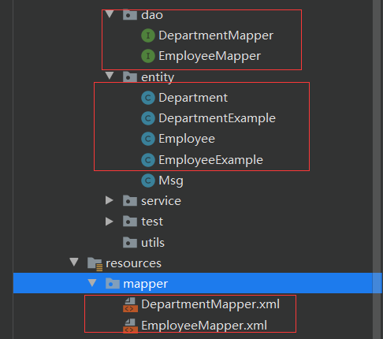
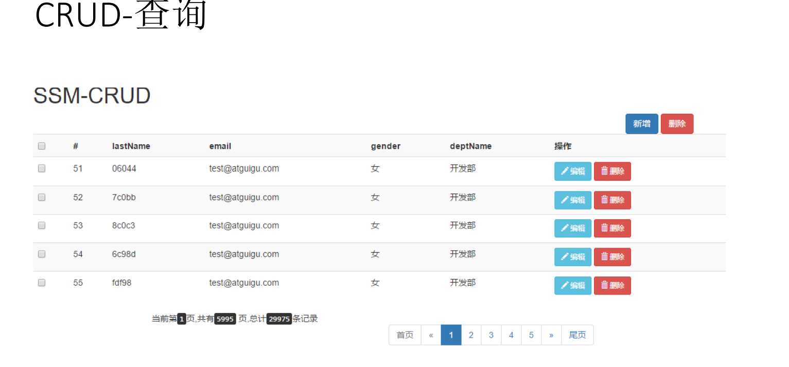
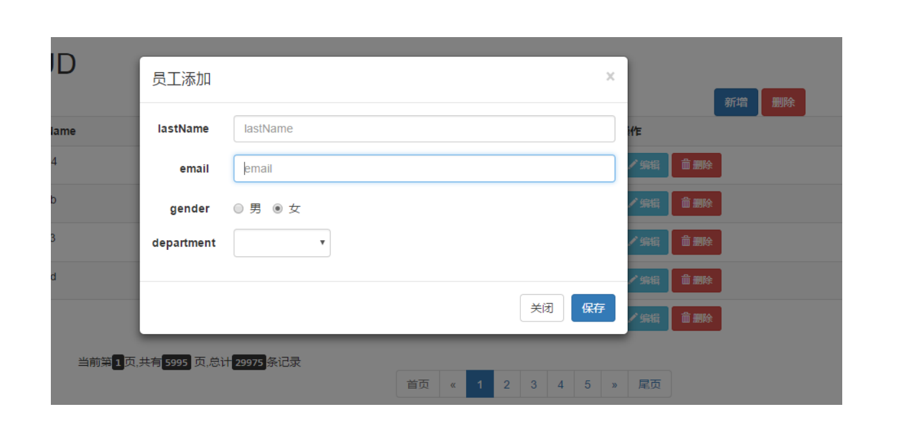
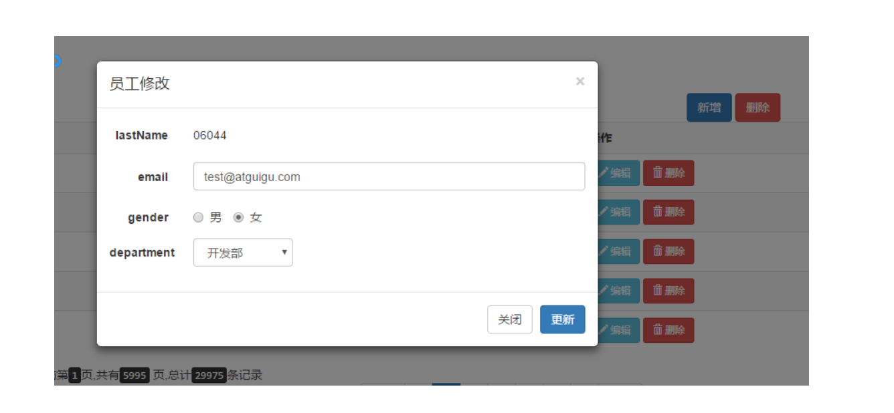
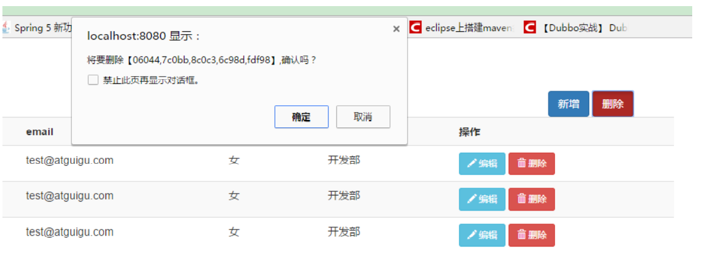
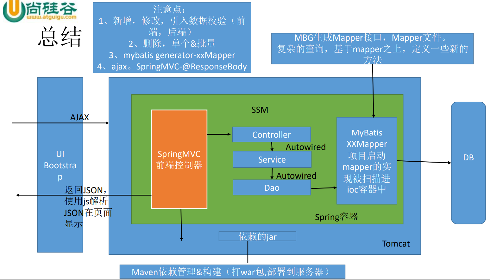

# 	概述

> 此次整合是对员工信息的CRUD

## 功能点

-  分页
-  数据校验
  -   jquery前端校验+JSR303后端校验
-  ajax
-  Rest风格的URI；使用HTTP协议请求方式的动词，来表示对资 源的操作（GET（查询），POST（新增），PUT（修改），DELETE （删除））

## 技术栈

-  基础框架-ssm（SpringMVC+Spring+MyBatis）
-  数据库-MySQL
-  前端框架-bootstrap快速搭建简洁美观的界面
-  项目的依赖管理-Maven
-  分页-pagehelper
-  逆向工程-MyBatis Generator
-  开发环境IDEA2019

# 具体实现

## 环境的搭建

- 创建maven项目

[创建Maven的Java Web项目](https://blog.csdn.net/qq_45408390/article/details/116144065)

- 导入所需要的jar包的依赖

```xml
<dependencies>

    <!--引入pageHelper分页插件 -->
    <dependency>
      <groupId>com.github.pagehelper</groupId>
      <artifactId>pagehelper</artifactId>
      <version>5.0.0</version>
    </dependency>

    <!-- MBG -->
    <!-- https://mvnrepository.com/artifact/org.mybatis.generator/mybatis-generator-core -->
    <dependency>
      <groupId>org.mybatis.generator</groupId>
      <artifactId>mybatis-generator-core</artifactId>
      <version>1.3.5</version>
    </dependency>

    <dependency>
      <groupId>org.springframework</groupId>
      <artifactId>spring-webmvc</artifactId>
      <version>4.3.7.RELEASE</version>
    </dependency>
    <!-- Spring-Jdbc -->
    <!-- https://mvnrepository.com/artifact/org.springframework/spring-jdbc -->
    <dependency>
      <groupId>org.springframework</groupId>
      <artifactId>spring-jdbc</artifactId>
      <version>4.3.7.RELEASE</version>
    </dependency>

    <!--Spring-test -->
    <!-- https://mvnrepository.com/artifact/org.springframework/spring-test -->
    <dependency>
      <groupId>org.springframework</groupId>
      <artifactId>spring-test</artifactId>
      <version>4.3.7.RELEASE</version>
    </dependency>


    <!-- Spring面向切面编程 -->
    <!-- https://mvnrepository.com/artifact/org.springframework/spring-aspects -->
    <dependency>
      <groupId>org.springframework</groupId>
      <artifactId>spring-aspects</artifactId>
      <version>4.3.7.RELEASE</version>
    </dependency>

    <!--MyBatis -->
    <!-- https://mvnrepository.com/artifact/org.mybatis/mybatis -->
    <dependency>
      <groupId>org.mybatis</groupId>
      <artifactId>mybatis</artifactId>
      <version>3.4.2</version>
    </dependency>
    <!-- MyBatis整合Spring的适配包 -->
    <!-- https://mvnrepository.com/artifact/org.mybatis/mybatis-spring -->
    <dependency>
      <groupId>org.mybatis</groupId>
      <artifactId>mybatis-spring</artifactId>
      <version>1.3.1</version>
    </dependency>

    <!-- 数据库连接池、驱动 -->
    <!-- https://mvnrepository.com/artifact/c3p0/c3p0 -->
    <dependency>
      <groupId>c3p0</groupId>
      <artifactId>c3p0</artifactId>
      <version>0.9.1</version>
    </dependency>
    <!-- https://mvnrepository.com/artifact/mysql/mysql-connector-java -->
    <dependency>
      <groupId>mysql</groupId>
      <artifactId>mysql-connector-java</artifactId>
      <version>5.1.10</version>
    </dependency>
    <!-- （jstl，servlet-api，junit） -->
    <!-- https://mvnrepository.com/artifact/jstl/jstl -->
    <dependency>
      <groupId>jstl</groupId>
      <artifactId>jstl</artifactId>
      <version>1.2</version>
    </dependency>


    <!-- 返回json字符串的支持 -->
    <!-- https://mvnrepository.com/artifact/com.fasterxml.jackson.core/jackson-databind -->
    <dependency>
      <groupId>com.fasterxml.jackson.core</groupId>
      <artifactId>jackson-databind</artifactId>
      <version>2.8.8</version>
    </dependency>

    <!--JSR303数据校验支持；tomcat7及以上的服务器，
    tomcat7以下的服务器：el表达式。额外给服务器的lib包中替换新的标准的el
    -->
    <!-- https://mvnrepository.com/artifact/org.hibernate/hibernate-validator -->
    <dependency>
      <groupId>org.hibernate</groupId>
      <artifactId>hibernate-validator</artifactId>
      <version>5.4.1.Final</version>
    </dependency>

    <dependency>
      <groupId>javax.servlet</groupId>
      <artifactId>jsp-api</artifactId>
      <version>2.0</version>
      <scope>provided</scope>
    </dependency>

    <!-- https://mvnrepository.com/artifact/javax.servlet/javax.servlet-api -->
    <dependency>
      <groupId>javax.servlet</groupId>
      <artifactId>javax.servlet-api</artifactId>
      <version>3.0.1</version>
      <scope>provided</scope>
    </dependency>

    <dependency>
      <groupId>junit</groupId>
      <artifactId>junit</artifactId>
      <version>4.12</version>
<!--      <scope>test</scope>-->
    </dependency>
  </dependencies>
```

- 导入Bootstrap(前端美化框架)

> 只需要去官网下载，然后放到项目中就行

[下载地址及官方文档](https://v3.bootcss.com/)

- 配置web.xml

```xml
<!DOCTYPE web-app PUBLIC
 "-//Sun Microsystems, Inc.//DTD Web Application 2.3//EN"
 "http://java.sun.com/dtd/web-app_2_3.dtd" >

<web-app xmlns:xsi="http://www.w3.org/2001/XMLSchema-instance"
         xmlns="http://java.sun.com/xml/ns/javaee"
         xsi:schemaLocation="http://java.sun.com/xml/ns/javaee http://java.sun.com/xml/ns/javaee/web-app_2_5.xsd"
         id="WebApp_ID" version="2.5">

  <!--1、启动Spring的容器  -->
  <!-- needed for ContextLoaderListener -->
  <context-param>
    <param-name>contextConfigLocation</param-name>
    <param-value>classpath:applicationContext.xml</param-value>
  </context-param>
  <listener>
    <listener-class>org.springframework.web.context.ContextLoaderListener</listener-class>
  </listener>

  <!--2、springmvc的前端控制器，拦截所有请求  -->
  <servlet>
    <servlet-name>dispatcherServlet</servlet-name>
    <servlet-class>org.springframework.web.servlet.DispatcherServlet</servlet-class>
  </servlet>
  <servlet-mapping>
    <servlet-name>dispatcherServlet</servlet-name>
    <url-pattern>/</url-pattern>
  </servlet-mapping>

  <!-- 3、字符编码过滤器，一定要放在所有过滤器之前 -->
  <filter>
    <filter-name>CharacterEncodingFilter</filter-name>
    <filter-class>org.springframework.web.filter.CharacterEncodingFilter</filter-class>
    <init-param>
      <param-name>encoding</param-name>
      <param-value>utf-8</param-value>
    </init-param>
    <init-param>
      <param-name>forceRequestEncoding</param-name>
      <param-value>true</param-value>
    </init-param>
    <init-param>
      <param-name>forceResponseEncoding</param-name>
      <param-value>true</param-value>
    </init-param>
  </filter>
  <filter-mapping>
    <filter-name>CharacterEncodingFilter</filter-name>
    <url-pattern>/*</url-pattern>
  </filter-mapping>

  <!-- 4、使用Rest风格的URI，将页面普通的post请求转为指定的delete或者put请求 -->
  <filter>
    <filter-name>HiddenHttpMethodFilter</filter-name>
    <filter-class>org.springframework.web.filter.HiddenHttpMethodFilter</filter-class>
  </filter>
  <filter-mapping>
    <filter-name>HiddenHttpMethodFilter</filter-name>
    <url-pattern>/*</url-pattern>
  </filter-mapping>

  <!--让直接发put请求，能从map中取值-->
  <filter>
    <filter-name>HttpPutFormContentFilter</filter-name>
    <filter-class>org.springframework.web.filter.HttpPutFormContentFilter</filter-class>
  </filter>
  <filter-mapping>
    <filter-name>HttpPutFormContentFilter</filter-name>
    <url-pattern>/*</url-pattern>
  </filter-mapping>
  
</web-app>

```

- 配置SpringMVC

dispatcherServlet-servlet.xml

```xml
<?xml version="1.0" encoding="UTF-8"?>
<beans xmlns="http://www.springframework.org/schema/beans"
       xmlns:xsi="http://www.w3.org/2001/XMLSchema-instance"
       xmlns:context="http://www.springframework.org/schema/context"
       xmlns:mvc="http://www.springframework.org/schema/mvc"
       xsi:schemaLocation="http://www.springframework.org/schema/beans http://www.springframework.org/schema/beans/spring-beans.xsd http://www.springframework.org/schema/context http://www.springframework.org/schema/context/spring-context.xsd http://www.springframework.org/schema/mvc http://www.springframework.org/schema/mvc/spring-mvc.xsd">

    <!--SpringMVC的配置文件，包含网站跳转逻辑的控制，配置  -->
    <context:component-scan base-package="cn.cvzhanshi.crud" use-default-filters="false">
        <!--只扫描控制器。  -->
        <context:include-filter type="annotation" expression="org.springframework.stereotype.Controller"/>
    </context:component-scan>


    <!--配置视图解析器，方便页面返回  -->
    <bean class="org.springframework.web.servlet.view.InternalResourceViewResolver">
        <property name="prefix" value="/WEB-INF/views/"></property>
        <property name="suffix" value=".jsp"></property>
    </bean>

    <!-- 将springmvc不能处理的请求交给tomcat -->
    <mvc:default-servlet-handler/>
    <!-- 能支持springmvc更高级的一些功能，JSR303校验，快捷的ajax...映射动态请求 -->
    <mvc:annotation-driven/>

</beans>
```

- 配置Spring及其整合Mybatis

applicationContext.xml

```xml
<?xml version="1.0" encoding="UTF-8"?>
<beans xmlns="http://www.springframework.org/schema/beans"
       xmlns:xsi="http://www.w3.org/2001/XMLSchema-instance"
       xmlns:context="http://www.springframework.org/schema/context"
       xmlns:mybatis-spring="http://mybatis.org/schema/mybatis-spring"
       xmlns:tx="http://www.springframework.org/schema/tx" xmlns:aop="http://www.springframework.org/schema/aop"
       xsi:schemaLocation="http://www.springframework.org/schema/beans http://www.springframework.org/schema/beans/spring-beans.xsd http://www.springframework.org/schema/context http://www.springframework.org/schema/context/spring-context.xsd http://mybatis.org/schema/mybatis-spring http://mybatis.org/schema/mybatis-spring.xsd http://www.springframework.org/schema/tx http://www.springframework.org/schema/tx/spring-tx.xsd http://www.springframework.org/schema/aop http://www.springframework.org/schema/aop/spring-aop.xsd">


    <!-- Spring的配置文件，这里主要配置和业务逻辑有关的 -->
    <!--不扫描控制器。其他的都交给spring ioc容器  -->
    <context:component-scan base-package="cn.cvzhanshi.crud">
        <context:exclude-filter type="annotation" expression="org.springframework.stereotype.Controller" />
    </context:component-scan>

    <!--=================== 数据源，事务控制，xxx ================-->
    <context:property-placeholder location="classpath:dbconfig.properties" />
    <bean id="pooledDataSource" class="com.mchange.v2.c3p0.ComboPooledDataSource">
        <property name="jdbcUrl" value="${jdbc.jdbcUrl}"></property>
        <property name="driverClass" value="${jdbc.driverClass}"></property>
        <property name="user" value="${jdbc.user}"></property>
        <property name="password" value="${jdbc.password}"></property>
    </bean>

    <!--================== 配置和MyBatis的整合=============== -->
    <bean id="sqlSessionFactory" class="org.mybatis.spring.SqlSessionFactoryBean">
        <!-- 指定mybatis全局配置文件的位置 -->
        <property name="configLocation" value="classpath:mybatis-config.xml"></property>
        <property name="dataSource" ref="pooledDataSource"></property>
        <property name="mapperLocations" value="classpath:mapper/*.xml"></property>
    </bean>

    <!-- 扫描所有的mapper接口的实现，让这些mapper能够自动注入；
	base-package：指定mapper接口的包名
	 -->
<!--    <mybatis-spring:scan base-package="cn.cvzhanshi.crud.dao"/>-->
    <bean class="org.mybatis.spring.mapper.MapperScannerConfigurer">
		<property name="basePackage" value="cn.cvzhanshi.crud.dao"></property>
	</bean>

    <!-- 配置一个可以执行批量的sqlSession -->
    <bean id="sqlSession" class="org.mybatis.spring.SqlSessionTemplate">
        <constructor-arg name="sqlSessionFactory" ref="sqlSessionFactory"></constructor-arg>
        <constructor-arg name="executorType" value="BATCH"></constructor-arg>
    </bean>

    <!--================================================-->

    <!-- ===============事务控制的配置 ================-->
    <!-- spring事务管理 -->
    <bean id="dataSourceTransactionManager" class="org.springframework.jdbc.datasource.DataSourceTransactionManager">
        <property name="dataSource" ref="pooledDataSource"></property>
    </bean>

    <!-- 开启基于注解的事务 -->
<!--    <tx:annotation-driven transaction-manager="dataSourceTransactionManager"/>-->

    <!--开启基于注解的事务，使用xml配置形式的事务（必要主要的都是使用配置式）  -->
    <aop:config>
        <!-- 切入点表达式 -->
        <aop:pointcut expression="execution(* com.atguigu.crud.service..*(..))" id="txPoint"/>
        <!-- 配置事务增强 -->
        <aop:advisor advice-ref="txAdvice" pointcut-ref="txPoint"/>
    </aop:config>

    <!--配置事务增强，事务如何切入  -->
    <tx:advice id="txAdvice" transaction-manager="dataSourceTransactionManager">
        <tx:attributes>
            <!-- 所有方法都是事务方法 -->
            <tx:method name="*"/>
            <!--以get开始的所有方法  -->
            <tx:method name="get*" read-only="true"/>
        </tx:attributes>
    </tx:advice>

    <!-- Spring配置文件的核心点（数据源、与mybatis的整合，事务控制） -->
</beans>
```

mybatis-config.xml

```xml
<?xml version="1.0" encoding="UTF-8"?>
<!DOCTYPE configuration
        PUBLIC "-//mybatis.org//DTD Config 3.0//EN"
        "http://mybatis.org/dtd/mybatis-3-config.dtd">
<configuration>
    <settings>
        <setting name="mapUnderscoreToCamelCase" value="true"/>
    </settings>

    <typeAliases>
        <package name="cn.cvzhanshi.crud.entity"/>
    </typeAliases>

    <plugins>
        <plugin interceptor="com.github.pagehelper.PageInterceptor">
            <!--分页参数合理化  -->
            <property name="reasonable" value="true"/>
        </plugin>
    </plugins>

</configuration>

```

dbconfig.properties

```properties
jdbc.jdbcUrl=jdbc:mysql://localhost:3306/ssm_crud
jdbc.driverClass=com.mysql.jdbc.Driver
jdbc.user=root
jdbc.password=cvzhanshi
```

- 运用Mybatis逆向工程自动生成mapper、JavaBean等等

mbg.xml

```xml
<?xml version="1.0" encoding="UTF-8"?>
<!DOCTYPE generatorConfiguration
        PUBLIC "-//mybatis.org//DTD MyBatis Generator Configuration 1.0//EN"
        "http://mybatis.org/dtd/mybatis-generator-config_1_0.dtd">
<generatorConfiguration>


    <!--
        targetRuntime="MyBatis3Simple":生成简单版的CRUD
        MyBatis3:豪华版

     -->
    <context id="DB2Tables" targetRuntime="MyBatis3">
        <commentGenerator>
            <!-- 是否去除自动生成的注释 true：是 ： false:否 -->
            <property name="suppressAllComments" value="true" />
        </commentGenerator>
        <!-- jdbcConnection：指定如何连接到目标数据库 -->
        <jdbcConnection driverClass="com.mysql.jdbc.Driver"
                        connectionURL="jdbc:mysql://localhost:3306/ssm_crud"
                        userId="root"
                        password="lian0911">
        </jdbcConnection>

        <!--  -->
        <javaTypeResolver >
            <property name="forceBigDecimals" value="false" />
        </javaTypeResolver>

        <!-- javaModelGenerator：指定javaBean的生成策略
        targetPackage="test.model"：目标包名
        targetProject="\MBGTestProject\src"：目标工程
        -->
        <javaModelGenerator targetPackage="cn.cvzhanshi.crud.entity"
                            targetProject=".\src\main\java">
            <property name="enableSubPackages" value="true" />
            <property name="trimStrings" value="true" />
        </javaModelGenerator>

        <!-- sqlMapGenerator：sql映射生成策略： -->
        <sqlMapGenerator targetPackage="mapper"
                         targetProject=".\src\main\resources">
            <property name="enableSubPackages" value="true" />
        </sqlMapGenerator>

        <!-- javaClientGenerator:指定mapper接口所在的位置 -->
        <javaClientGenerator type="XMLMAPPER" targetPackage="cn.cvzhanshi.crud.dao"
                             targetProject=".\src\main\java">
            <property name="enableSubPackages" value="true" />
        </javaClientGenerator>

        <!-- 指定要逆向分析哪些表：根据表要创建javaBean -->
        <table tableName="tbl_dept" domainObjectName="Department"></table>
        <table tableName="tbl_emp" domainObjectName="Employee"></table>
    </context>
</generatorConfiguration>
```

运行生成代码

```java
@Test
    public void test() throws Exception{
        List<String> warnings = new ArrayList<String>();
        boolean overwrite = true;
        File configFile = new File("mbg.xml");
        ConfigurationParser cp = new ConfigurationParser(warnings);
        Configuration config = cp.parseConfiguration(configFile);
        DefaultShellCallback callback = new DefaultShellCallback(overwrite);
        MyBatisGenerator myBatisGenerator = new MyBatisGenerator(config, callback, warnings);
        myBatisGenerator.generate(null);
    }
```

自动生成的文件



- 编通用的返回的类，后端请求返回前端信息

```java
/**
 * 通用的返回的类
 * 
 * @author cVzhanshi
 * 
 */
public class Msg {
	//状态码   100-成功    200-失败
	private int code;
	//提示信息
	private String msg;
	
	//用户要返回给浏览器的数据
	private Map<String, Object> extend = new HashMap<String, Object>();

	public static Msg success(){
		Msg result = new Msg();
		result.setCode(100);
		result.setMsg("处理成功！");
		return result;
	}
	
	public static Msg fail(){
		Msg result = new Msg();
		result.setCode(200);
		result.setMsg("处理失败！");
		return result;
	}
	
	public Msg add(String key,Object value){
		this.getExtend().put(key, value);
		return this;
	}
	
	public int getCode() {
		return code;
	}

	public void setCode(int code) {
		this.code = code;
	}

	public String getMsg() {
		return msg;
	}

	public void setMsg(String msg) {
		this.msg = msg;
	}

	public Map<String, Object> getExtend() {
		return extend;
	}

	public void setExtend(Map<String, Object> extend) {
		this.extend = extend;
	}
	
	
}
```

> 由此一个项目的环境已经搭建完成了

## 查询操作

### 基本步骤

- 访问index.jsp页面 
- index.jsp页面发送出查询员工列表请求
- EmployeeController来接受请求，查出员工数据
- 来到list.jsp页面进行展示
- pageHelper分页插件完成分页查询功能
- URI：/emps 

> 其中为了 实现客户端的无关性，采用ajax请求，返回json数据，利用js对json数据进行解析，也通过js对dom对象的增删改来进行改变页面

- index.jsp页面直接发送ajax请求进行员工分页数据的查询 
- 服务器将查出的数据，以json字符串的形式返回给浏览器
- 浏览器收到js字符串。可以使用js对json进行解析，使用js通过 dom增删改改变页面

效果图：



### 具体实现

- index.jsp

```jsp
<%@ taglib prefix="c" uri="http://java.sun.com/jsp/jstl/core" %>
<%--
  Created by IntelliJ IDEA.
  User: cVzhanshi
  Date: 2021/5/12
  Time: 13:55
  To change this template use File | Settings | File Templates.
--%>
<%@ page contentType="text/html;charset=UTF-8" language="java" %>

<html>
<head>
    <meta http-equiv="Content-Type" content="text/html; charset=UTF-8">
    <title>员工列表</title>

    <%
        pageContext.setAttribute("APP_PATH", request.getContextPath());
    %>
    <!-- web路径：
        不以/开始的相对路径，找资源，以当前资源的路径为基准，经常容易出问题。
        以/开始的相对路径，找资源，以服务器的路径为标准(http://localhost:3306)；需要加上项目名
		http://localhost:3306/crud
 -->
    <script type="text/javascript" src="${APP_PATH}/static/js/jquery-1.12.4.min.js"></script>
    <script type="text/javascript" src="${APP_PATH}/static/bootstrap-3.3.7-dist/js/bootstrap.min.js"></script>
    <link href="${APP_PATH}/static/bootstrap-3.3.7-dist/css/bootstrap.min.css" rel="stylesheet">


</head>
<body>
<!-- 搭建显示页面 -->
<div class="container">
    <!-- 标题 -->
    <div class="row">
        <div class="col-md-12">
            <h1>SSM-CRUD-PROJECT</h1>
        </div>
    </div>
    <!-- 按钮 -->
    <div class="row">
        <div class="col-md-4 col-md-offset-8">
            <button class="btn btn-primary" id="emp_add_modal_btn">新增</button>
            <button class="btn btn-danger" id="emp_delete_all_btn">删除</button>
        </div>
    </div>
    <!-- 显示表格数据 -->
    <div class="row">
        <div class="col-md-12">
            <table class="table table-hover" id="emps_table">
                <thead>
                <tr>
                    <th>
                        <input type="checkbox" id="check_all"/>
                    </th>
                    <th>#</th>
                    <th>empName</th>
                    <th>gender</th>
                    <th>email</th>
                    <th>deptName</th>
                    <th>操作</th>
                </tr>
                </thead>
                <tbody>

                </tbody>
            </table>
        </div>
    </div>

    <!-- 显示分页信息 -->
    <div class="col-md-6" id="page_info_area"></div>
    <!-- 分页条信息 -->
    <div class="col-md-6" id="page_nav_area">
    </div>
</div>


<script type="text/javascript">
    var totalRecord,currentPage;
    //1、页面加载完成以后，直接去发送ajax请求,要到分页数据
    $(function(){
        //去首页
        to_page(1);
    });

    function to_page(pageNum){
        $.ajax({
            url:"${APP_PATH}/emps",
            data:"pageNum="+pageNum,
            type:"GET",
            success:function(result){
                //console.log(result);
                //1、解析并显示员工数据
                build_emps_table(result);
                //2、解析并显示分页信息
                build_page_info(result);
                //3、解析显示分页条数据
                build_page_nav(result);
            }
        });
    }

    //解析并显示员工数据
    function build_emps_table(result){
        //清空table表格
        $("#emps_table tbody").empty();
        var emps = result.extend.pageInfo.list;
        $.each(emps,function(index,item){
            var checkBoxTd = $("<td><input type='checkbox' class='check_item'/></td>");
            var empIdTd = $("<td></td>").append(item.empId);
            var empNameTd = $("<td></td>").append(item.empName);
            var genderTd = $("<td></td>").append(item.gender=='M'?"男":"女");
            var emailTd = $("<td></td>").append(item.email);
            var deptNameTd = $("<td></td>").append(item.department.deptName);
            /**
             <button class="">
             <span class="" aria-hidden="true"></span>
             编辑
             </button>
             */
            var editBtn = $("<button></button>").addClass("btn btn-primary btn-sm edit_btn")
                .append($("<span></span>").addClass("glyphicon glyphicon-pencil")).append("编辑");
            //为编辑按钮添加一个自定义的属性，来表示当前员工id
            editBtn.attr("edit-id",item.empId);
            var delBtn =  $("<button></button>").addClass("btn btn-danger btn-sm delete_btn")
                .append($("<span></span>").addClass("glyphicon glyphicon-trash")).append("删除");
            //为删除按钮添加一个自定义的属性来表示当前删除的员工id
            delBtn.attr("del-id",item.empId);
            var btnTd = $("<td></td>").append(editBtn).append(" ").append(delBtn);
            //var delBtn =
            //append方法执行完成以后还是返回原来的元素
            $("<tr></tr>").append(checkBoxTd)
                .append(empIdTd)
                .append(empNameTd)
                .append(genderTd)
                .append(emailTd)
                .append(deptNameTd)
                .append(btnTd)
                .appendTo("#emps_table tbody");
        });
    }

    //解析显示分页信息
    function build_page_info(result){
        $("#page_info_area").empty();
        $("#page_info_area").append("当前"+result.extend.pageInfo.pageNum+"页,总"+
            result.extend.pageInfo.pages+"页,总"+
            result.extend.pageInfo.total+"条记录");

        currentPage = result.extend.pageInfo.pageNum;
        totalRecord = result.extend.pageInfo.total;
    }

    //解析显示分页条，点击分页要能去下一页....
    function build_page_nav(result){
        //page_nav_area
        $("#page_nav_area").empty();
        var ul = $("<ul></ul>").addClass("pagination");

        //构建元素
        var firstPageLi = $("<li></li>").append($("<a></a>").append("首页").attr("href","#"));
        var prePageLi = $("<li></li>").append($("<a></a>").append("&laquo;"));
        if(result.extend.pageInfo.hasPreviousPage == false){
            firstPageLi.addClass("disabled");
            prePageLi.addClass("disabled");
        }else{
            //为元素添加点击翻页的事件
            firstPageLi.click(function(){
                to_page(1);
            });
            prePageLi.click(function(){
                to_page(result.extend.pageInfo.pageNum -1);
            });
        }


        var nextPageLi = $("<li></li>").append($("<a></a>").append("&raquo;"));
        var lastPageLi = $("<li></li>").append($("<a></a>").append("末页").attr("href","#"));
        if(result.extend.pageInfo.hasNextPage == false){
            nextPageLi.addClass("disabled");
            lastPageLi.addClass("disabled");
        }else{
            nextPageLi.click(function(){
                to_page(result.extend.pageInfo.pageNum +1);
            });
            lastPageLi.click(function(){
                to_page(result.extend.pageInfo.pages);
            });
        }


        //添加首页和前一页 的提示
        ul.append(firstPageLi).append(prePageLi);
        //1,2，3遍历给ul中添加页码提示
        $.each(result.extend.pageInfo.navigatepageNums,function(index,item){

            var numLi = $("<li></li>").append($("<a></a>").append(item));
            if(result.extend.pageInfo.pageNum == item){
                numLi.addClass("active");
            }
            numLi.click(function(){
                to_page(item);
            });
            ul.append(numLi);
        });
        //添加下一页和末页 的提示
        ul.append(nextPageLi).append(lastPageLi);

        //把ul加入到nav
        var navEle = $("<nav></nav>").append(ul);
        navEle.appendTo("#page_nav_area");
    }
    </script>
</body>
</html>
```

- EmployeeController

```java
@Controller
public class EmployeeController {
    @Autowired
    private EmployeeService employeeService;
    /**
     * 导入jackson包。
     * 返回json
     * @param pageNum
     * @return
     */
    @RequestMapping("/emps")
    @ResponseBody
    public Msg getEmpsWithJson(
            @RequestParam(value = "pageNum", defaultValue = "1") Integer pageNum) {
        // 这不是一个分页查询
        // 引入PageHelper分页插件
        // 在查询之前只需要调用，传入页码，以及每页的大小
        PageHelper.startPage(pageNum, 5);
        // startPage后面紧跟的这个查询就是一个分页查询
        List<Employee> emps = employeeService.getAll();
        // 使用pageInfo包装查询后的结果，只需要将pageInfo交给页面就行了。
        // 封装了详细的分页信息,包括有我们查询出来的数据，传入连续显示的页数
        PageInfo page = new PageInfo(emps, 5);
        return Msg.success().add("pageInfo", page);
    }

}
```

- EmployeeService

```java
@Service
public class EmployeeService {

    @Autowired
    EmployeeMapper employeeMapper;


    /**
     * 查询所有员工
     * @return
     */
    public List<Employee> getAll() {
        List<Employee> employees = employeeMapper.getEmpsStep();
        return employees;
    }
}
```

> 这里由于数据库中有外键的关系，关联了两张表，他自动生成的employee是没有部门这个属性，为了方便我们需要手动加上，在EmployeeMapper.xml中也需要手动加上分步查询，能查询到部门信息

```java
public class Employee {
    private Integer empId;
    private String empName;
    private String gender;
    private String email;
    private Integer dId;

    //希望查询员工的同时部门信息也是查询好的
    private Department department;
    ...
    }
```

- EmployeeMapper.xml

```xml
<!--  分步查询，待部门信息-->
  <resultMap type="cn.cvzhanshi.crud.entity.Employee" id="MyEmpByStep">
    <id column="emp_id" jdbcType="INTEGER" property="empId" />
    <result column="emp_name" jdbcType="VARCHAR" property="empName" />
    <result column="gender" jdbcType="CHAR" property="gender" />
    <result column="email" jdbcType="VARCHAR" property="email" />
    <result column="d_id" jdbcType="INTEGER" property="dId" />
    <!-- association定义关联对象的封装规则
        select:表明当前属性是调用select指定的方法查出的结果
        column:指定将哪一列的值传给这个方法（）用作参数

        流程：使用select指定的方法（传入column指定的这列参数的值）查出对象，并封装给property指定的属性
     -->
    <association property="department"
                 select="cn.cvzhanshi.crud.dao.DepartmentMapper.selectByPrimaryKey"
                 column="d_id">
    </association>
  </resultMap>

  <select id="getEmpsStep" resultMap="MyEmpByStep">
        select * from tbl_emp
    </select>
```

## 添加操作

### 基本步骤

-  在index.jsp页面点击”新增”
-  弹出新增对话框 
-  去数据库查询部门列表，显示在对话框中
-  用户输入数据，并进行校验
  -   jquery前端校验，ajax用户名重复校验，重要数据（后端校验(JSR303)，唯一约束）
- 完成保存

- URI: 
  - /emp/{id} GET 查询员工 
  - /emp POST 新增员工 
  - /emp/{id} PUT 修改员工 
  - /emp/{id} DELETE 删除员工 

效果图：



### 具体实现

- index.jsp中的新增模态框

```jsp
<!-- 员工添加的模态框 -->
<div class="modal fade" id="empAddModal" tabindex="-1" role="dialog" aria-labelledby="myModalLabel">
    <div class="modal-dialog" role="document">
        <div class="modal-content">
            <div class="modal-header">
                <button type="button" class="close" data-dismiss="modal" aria-label="Close"><span aria-hidden="true">&times;</span></button>
                <h4 class="modal-title" id="myModalLabel">员工添加</h4>
            </div>
            <div class="modal-body">
                <form class="form-horizontal">
                    <div class="form-group">
                        <label class="col-sm-2 control-label">empName</label>
                        <div class="col-sm-10">
                            <input type="text" name="empName" class="form-control" id="empName_add_input" placeholder="empName">
                            <span class="help-block"></span>
                        </div>
                    </div>
                    <div class="form-group">
                        <label class="col-sm-2 control-label">email</label>
                        <div class="col-sm-10">
                            <input type="text" name="email" class="form-control" id="email_add_input" placeholder="cvzhanshi@163.com">
                            <span class="help-block"></span>
                        </div>
                    </div>
                    <div class="form-group">
                        <label class="col-sm-2 control-label">gender</label>
                        <div class="col-sm-10">
                            <label class="radio-inline">
                                <input type="radio" name="gender" id="gender1_add_input" value="M" checked="checked"> 男
                            </label>
                            <label class="radio-inline">
                                <input type="radio" name="gender" id="gender2_add_input" value="F"> 女
                            </label>
                        </div>
                    </div>
                    <div class="form-group">
                        <label class="col-sm-2 control-label">deptName</label>
                        <div class="col-sm-4">
                            <!-- 部门提交部门id即可 -->
                            <select class="form-control" name="dId">
                            </select>
                        </div>
                    </div>
                </form>
            </div>
            <div class="modal-footer">
                <button type="button" class="btn btn-default" data-dismiss="modal">关闭</button>
                <button type="button" class="btn btn-primary" id="emp_save_btn">保存</button>
            </div>
        </div>
    </div>
</div>
```

- js逻辑代码

```js
<script type="text/javascript">
//清空表单样式及内容
    function reset_form(ele){
        $(ele)[0].reset();
        //清空表单样式
        $(ele).find("*").removeClass("has-error has-success");
        $(ele).find(".help-block").text("");
    }

    //点击新增按钮弹出模态框。
    $("#emp_add_modal_btn").click(function(){
        //清除表单数据（表单完整重置（表单的数据，表单的样式））
        reset_form("#empAddModal form");
        //s$("")[0].reset();
        //发送ajax请求，查出部门信息，显示在下拉列表中
        getDepts("#empAddModal select");
        //弹出模态框
        $("#empAddModal").modal({
            backdrop:"static"
        });
    });

    //查出所有的部门信息并显示在下拉列表中
    function getDepts(ele){
        //清空之前下拉列表的值
        $(ele).empty();
        $.ajax({
            url:"${APP_PATH}/depts",
            type:"GET",
            success:function(result){
                //显示部门信息在下拉列表中
                //$("#empAddModal select").append("")
                $.each(result.extend.depts,function(){
                    var optionEle = $("<option></option>").append(this.deptName).attr("value",this.deptId);
                    optionEle.appendTo(ele);
                });
            }
        });
    }

    //校验表单数据
    function validate_add_form(){
        //1、拿到要校验的数据，使用正则表达式
        var empName = $("#empName_add_input").val();
        var regName = /(^[a-zA-Z0-9_-]{6,16}$)|(^[\u2E80-\u9FFF]{2,5})/;
        if(!regName.test(empName)){
            //alert("用户名可以是2-5为中文或者6-16位英文和数字的组合");
            show_validate_msg("#empName_add_input", "error", "用户名可以是2-5位中文或者6-16位英文和数字的组合");
            return false;
        }else{
            show_validate_msg("#empName_add_input", "success", "");
        };
        //2、校验邮箱信息
        var email = $("#email_add_input").val();
        var regEmail = /^([a-z0-9_\.-]+)@([\da-z\.-]+)\.([a-z\.]{2,6})$/;
        if(!regEmail.test(email)) {
            // alert("邮箱格式不正确");
            show_validate_msg("#email_add_input", "error", "邮箱格式不正确");
            return false;
        }else{
            show_validate_msg("#email_add_input", "success", "");
        };
        return true;
    }

    //显示校验结果的提示信息
    function show_validate_msg(ele,status,msg){
        //清除当前元素的校验状态
        $(ele).parent().removeClass("has-success has-error");
        $(ele).next("span").text("");
        if("success"==status){
            $(ele).parent().addClass("has-success");
            $(ele).next("span").text(msg);
        }else if("error" == status){
            $(ele).parent().addClass("has-error");
            $(ele).next("span").text(msg);
        }
    };

    //校验用户名ajax是否可用
    $("#empName_add_input").change(function(){
        //发送ajax请求校验用户名是否可用
        var empName = this.value;
        $.ajax({
            url:"${APP_PATH}/checkuser",
            data:"empName="+empName,
            type:"POST",
            success:function(result){
                if(result.code==100){
                    show_validate_msg("#empName_add_input","success","用户名可用");
                    $("#emp_save_btn").attr("ajax-va","success");
                }else{
                    show_validate_msg("#empName_add_input","error",result.extend.va_msg);
                    $("#emp_save_btn").attr("ajax-va","error");
                }
            }
        });
    });

    //点击保存，保存员工。
    $("#emp_save_btn").click(function() {
        //1、先对要提交给服务器的数据进行校验
        if(!validate_add_form()){
            return false;
        }

        //1、判断之前的ajax用户名校验是否成功。如果成功。
        if($(this).attr("ajax-va")=="error"){
            return false;
        }

        //2、发送ajax请求保存员工
        $.ajax({
            url:"${APP_PATH}/emp",
            type:"POST",
            data:$("#empAddModal form").serialize(),
            success:function(result){
                //alert(result.msg);

                if(result.code == 100){

                    //员工保存成功；
                    //1、关闭模态框
                    $("#empAddModal").modal('hide');

                    //2、来到最后一页，显示刚才保存的数据
                    //发送ajax请求显示最后一页数据即可
                    to_page(totalRecord);
                }else{
                    //保存失败
                    //显示失败信息
                    //console.log(result);
                    //有哪个字段的错误信息就显示哪个字段的；
                    if(undefined != result.extend.errorFields.email){
                        //显示邮箱错误信息
                        show_validate_msg("#email_add_input", "error", result.extend.errorFields.email);
                    }
                    if(undefined != result.extend.errorFields.empName){
                        //显示员工名字的错误信息
                        show_validate_msg("#empName_add_input", "error", result.extend.errorFields.empName);
                    }
                }
            }
        });
    });
    </script>
```

- EmployeeController

```java
 /**
     * 检查用户名是否可用
     * @param empName
     * @return
     */
    @ResponseBody
    @RequestMapping("/checkuser")
    public Msg checkuser(@RequestParam("empName")String empName){
        //先判断用户名是否是合法的表达式;
        String regx = "(^[a-zA-Z0-9_-]{6,16}$)|(^[\u2E80-\u9FFF]{2,5})";
        if(!empName.matches(regx)){
            return Msg.fail().add("va_msg", "用户名必须是6-16位数字和字母的组合或者2-5位中文");
        }

        //数据库用户名重复校验
        boolean b = employeeService.checkUser(empName);
        if(b){
            return Msg.success();
        }else{
            return Msg.fail().add("va_msg", "用户名不可用");
        }
    }


    /**
     * 员工保存
     * @param employee
     * @return
     */
    @RequestMapping(value="/emp",method= RequestMethod.POST)
    @ResponseBody
    public Msg saveEmp(@Valid Employee employee, BindingResult result){
        if(result.hasErrors()){
            //校验失败，应该返回失败，在模态框中显示校验失败的错误信息
            Map<String, Object> map = new HashMap<>();
            List<FieldError> errors = result.getFieldErrors();
            for (FieldError fieldError : errors) {
                System.out.println("错误的字段名："+fieldError.getField());
                System.out.println("错误信息："+fieldError.getDefaultMessage());
                map.put(fieldError.getField(), fieldError.getDefaultMessage());
            }
            return Msg.fail().add("errorFields", map);
        }else{
            employeeService.saveEmp(employee);
            return Msg.success();
        }
    }

```

- DepartmentController

```java
@Controller
public class DepartmentController {

    @Autowired
    private DepartmentService departmentService;

    @RequestMapping("/depts")
    @ResponseBody
    public Msg getDepts(){
        //查出的所有部门信息
        List<Department> list = departmentService.getDepts();
        return Msg.success().add("depts", list);
    }
}
```

- EmployeeService

```java
public void saveEmp(Employee employee) {
        employeeMapper.insertSelective(employee);
    }

    /**
     * 检验用户名是否可用
     *
     * @param empName
     * @return  true：代表当前姓名可用   fasle：不可用
     */
    public boolean checkUser(String empName) {
        EmployeeExample example = new EmployeeExample();
        EmployeeExample.Criteria criteria = example.createCriteria();
        criteria.andEmpNameEqualTo(empName);
        long count = employeeMapper.countByExample(example);
        return count == 0;
    }

```

- DepartmentService

```java
@Service
public class DepartmentService {

    @Autowired
    private DepartmentMapper departmentMapper;


    public List<Department> getDepts() {
        return departmentMapper.selectByExample(null);
    }
}
```

## 更新操作

### 基本步骤

-  点击编辑
-  弹出用户修改的模态框（显示用户信息） 
-  点击更新，完成用户修改 ，定位到修改的页数

效果图：



### 具体实现

- index.jsp中的修改模态框

```jsp
<!-- 员工修改的模态框 -->
<div class="modal fade" id="empUpdateModal" tabindex="-1" role="dialog" aria-labelledby="myModalLabel">
    <div class="modal-dialog" role="document">
        <div class="modal-content">
            <div class="modal-header">
                <button type="button" class="close" data-dismiss="modal" aria-label="Close"><span aria-hidden="true">&times;</span></button>
                <h4 class="modal-title">员工修改</h4>
            </div>
            <div class="modal-body">
                <form class="form-horizontal">
                    <div class="form-group">
                        <label class="col-sm-2 control-label">empName</label>
                        <div class="col-sm-10">
                            <p class="form-control-static" id="empName_update_static"></p>
                        </div>
                    </div>
                    <div class="form-group">
                        <label class="col-sm-2 control-label">email</label>
                        <div class="col-sm-10">
                            <input type="text" name="email" class="form-control" id="email_update_input" placeholder="email@atguigu.com">
                            <span class="help-block"></span>
                        </div>
                    </div>
                    <div class="form-group">
                        <label class="col-sm-2 control-label">gender</label>
                        <div class="col-sm-10">
                            <label class="radio-inline">
                                <input type="radio" name="gender" id="gender1_update_input" value="M" checked="checked"> 男
                            </label>
                            <label class="radio-inline">
                                <input type="radio" name="gender" id="gender2_update_input" value="F"> 女
                            </label>
                        </div>
                    </div>
                    <div class="form-group">
                        <label class="col-sm-2 control-label">deptName</label>
                        <div class="col-sm-4">
                            <!-- 部门提交部门id即可 -->
                            <select class="form-control" name="dId">
                            </select>
                        </div>
                    </div>
                </form>
            </div>
            <div class="modal-footer">
                <button type="button" class="btn btn-default" data-dismiss="modal">关闭</button>
                <button type="button" class="btn btn-primary" id="emp_update_btn">更新</button>
            </div>
        </div>
    </div>
</div>
```

- js逻辑代码

```js
	//1、我们是按钮创建之前就绑定了click，所以绑定不上。
    //1）、可以在创建按钮的时候绑定。    2）、绑定点击.live()
    //jquery新版没有live，使用on进行替代
    $(document).on("click",".edit_btn",function(){
        //alert("edit");


        //1、查出部门信息，并显示部门列表
        getDepts("#empUpdateModal select");

        //2、查出员工信息，显示员工信息
        getEmp($(this).attr("edit-id"));


        //3、把员工的id传递给模态框的更新按钮
        $("#emp_update_btn").attr("edit-id",$(this).attr("edit-id"));

        $("#empUpdateModal").modal({
            backdrop:"static"
        });
    });


    function getEmp(id){
        $.ajax({
            url:"${APP_PATH}/emp/"+id,
            type:"GET",
            success:function(result){
                //console.log(result);
                var empData = result.extend.emp;
                $("#empName_update_static").text(empData.empName);
                $("#email_update_input").val(empData.email);
                $("#empUpdateModal input[name=gender]").val([empData.gender]);
                $("#empUpdateModal select").val([empData.dId]);
            }
        });
    }

    //点击更新，更新员工信息
    $("#emp_update_btn").click(function(){
        //验证邮箱是否合法
        //1、校验邮箱信息
        var email = $("#email_update_input").val();
        var regEmail = /^([a-z0-9_\.-]+)@([\da-z\.-]+)\.([a-z\.]{2,6})$/;
        if(!regEmail.test(email)){
            show_validate_msg("#email_update_input", "error", "邮箱格式不正确");
            return false;
        }else{
            show_validate_msg("#email_update_input", "success", "");
        };
        //2、发送ajax请求保存更新的员工数据
        $.ajax({
            url:"${APP_PATH}/emp/"+$(this).attr("edit-id"),
            type:"PUT",
            data:$("#empUpdateModal form").serialize(),
            success:function(result){
                //alert(result.msg);
                //1、关闭对话框
                $("#empUpdateModal").modal("hide");
                //2、回到本页面
                to_page(currentPage);
            }
        });
    });
```

- EmployeeController

```java
/**
     * 员工更新方法
     * @param employee
     * @return
     */
    @ResponseBody
    @RequestMapping(value="/emp/{empId}",method=RequestMethod.PUT)
    public Msg saveEmp(Employee employee, HttpServletRequest request){
        System.out.println("请求体中的值："+request.getParameter("gender"));
        System.out.println("将要更新的员工数据："+employee);
        employeeService.updateEmp(employee);
        return Msg.success();
    }


    /**
     * 根据id查询员工
     * @param id
     * @return
     */
    @RequestMapping(value="/emp/{id}",method=RequestMethod.GET)
    @ResponseBody
    public Msg getEmp(@PathVariable("id")Integer id){

        Employee employee = employeeService.getEmp(id);
        return Msg.success().add("emp", employee);
    }
```

> 其中说明：
>
>   * 如果直接发送ajax=PUT形式的请求
>      * 封装的数据
>      * Employee[empId=1014, empName=null, gender=null, email=null, dId=null]
>
>
> * 问题：
>      
> * 请求体中有数据，但是Employee对象封装不上；
>      
> * 原因：
>      * Tomcat：
>
>        * 将请求体中的数据，封装一个map。
>        * request.getParameter("empName")就会从这个map中取值。
>        * SpringMVC封装POJO对象的时候。会把POJO中每个属性的值，request.getParamter("email");
>
>      * AJAX发送PUT请求引发的血案：
>        * PUT请求，请求体中的数据，request.getParameter("empName")拿不到
>        * Tomcat一看是PUT不会封装请求体中的数据为map，只有POST形式的请求才封装请求体为map
>
>      * 报错：org.apache.catalina.connector.Request--parseParameters() (3111);
>
>     ```java
>     其中底层原理
>     protected String parseBodyMethods = "POST";
>     if( !getConnector().isParseBodyMethod(getMethod()) ) {
>       success = true;
>       return;
>       }
>       
>       //看到put不是post直接返回
>     ```
>
>     
>
>      * 解决方案；
>        
>        * 我们要能支持直接发送PUT之类的请求还要封装请求体中的数据
>        * 配置上HttpPutFormContentFilter；
>        * 作用；将请求体中的数据解析包装成一个map。

- EmployeeService

```java
 /**
     * 按照员工id查询员工
     * @param id
     * @return
     */

    public Employee getEmp(Integer id) {
        return employeeMapper.selectByPrimaryKey(id);
    }

    /**
     * 员工更新
     * @param employee
     */
    public void updateEmp(Employee employee) {
        employeeMapper.updateByPrimaryKeySelective(employee);
    }
```

## 删除操作



- js逻辑代码

```js
//单个删除
    $(document).on("click",".delete_btn",function(){
        //1、弹出是否确认删除对话框
        var empName = $(this).parents("tr").find("td:eq(2)").text();
        var empId = $(this).attr("del-id");
        if(confirm("确认删除【"+empName+"】吗？")){
            //确认，发送ajax请求删除即可
            $.ajax({
                url:"${APP_PATH}/emp/"+empId,
                type:"DELETE",
                success:function(result){
                    //alert(result.msg);
                    //回到本页
                    to_page(currentPage);
                }
            });
        }
    });

    //完成全选/全不选功能
    $("#check_all").click(function(){
        //attr获取checked是undefined;
        //我们这些dom原生的属性；attr获取自定义属性的值；
        //prop修改和读取dom原生属性的值
        $(".check_item").prop("checked",$(this).prop("checked"));
    });

    //check_item
    $(document).on("click",".check_item",function(){
        //判断当前选择中的元素是否5个
        var flag = $(".check_item:checked").length==$(".check_item").length;
        $("#check_all").prop("checked",flag);
    });

    //点击全部删除，就批量删除
    $("#emp_delete_all_btn").click(function(){
        //
        var empNames = "";
        var del_idstr = "";
        $.each($(".check_item:checked"),function(){
            //this
            empNames += $(this).parents("tr").find("td:eq(2)").text()+",";
            //组装员工id字符串
            del_idstr += $(this).parents("tr").find("td:eq(1)").text()+"-";
        });
        //去除empNames多余的,
        empNames = empNames.substring(0, empNames.length-1);
        //去除删除的id多余的-
        del_idstr = del_idstr.substring(0, del_idstr.length-1);
        if(confirm("确认删除【"+empNames+"】吗？")){
            //发送ajax请求删除
            $.ajax({
                url:"${APP_PATH}/emp/"+del_idstr,
                type:"DELETE",
                success:function(result){
                    //alert(result.msg);
                    //回到当前页面
                    to_page(currentPage);
                }
            });
        }
    });
```

- EmployeeController

```java
@ResponseBody
    @RequestMapping(value="/emp/{ids}",method=RequestMethod.DELETE)
    public Msg deleteEmp(@PathVariable("ids")String ids){
        //批量删除
        if(ids.contains("-")){
            List<Integer> del_ids = new ArrayList<>();
            String[] str_ids = ids.split("-");
            //组装id的集合
            for (String string : str_ids) {
                del_ids.add(Integer.parseInt(string));
            }
            employeeService.deleteBatch(del_ids);
        }else{
            Integer id = Integer.parseInt(ids);
            employeeService.deleteEmp(id);
        }
        return Msg.success();
    }
```

- EmployeeService

```java
 /**
     * 删除单个员工
     * @param id
     */

    public void deleteEmp(Integer id) {
        employeeMapper.deleteByPrimaryKey(id);
    }

//批量删除
    public void deleteBatch(List<Integer> del_ids) {
        EmployeeExample example = new EmployeeExample();
        EmployeeExample.Criteria criteria = example.createCriteria();
        //delete from xxx where emp_id in(1,2,3)
        criteria.andEmpIdIn(del_ids);
        employeeMapper.deleteByExample(example);
    }
```

# 总结



- Spring5以上要用json，json必须2.9以上

```xml
 <dependency>
      <groupId>com.fasterxml.jackson.core</groupId>
      <artifactId>jackson-databind</artifactId>
      <version>2.9.8</version>
    </dependency>
    <dependency>
      <groupId>com.fasterxml.jackson.core</groupId>
      <artifactId>jackson-core</artifactId>
      <version>2.9.8</version>
    </dependency>
```


