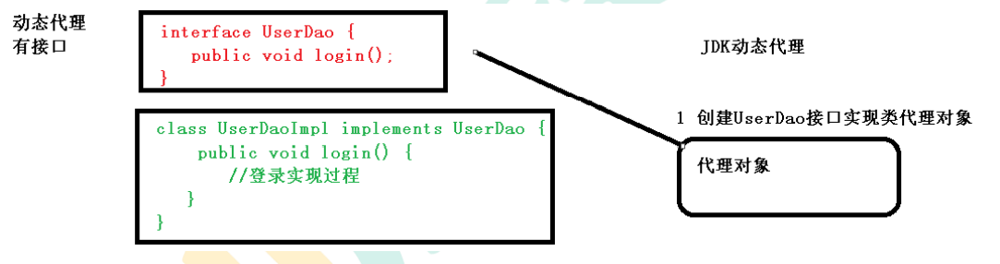

# Spring5框架的概述与入门案例

## 概述

- Spring 是轻量级的开源的 JavaEE 框架
- Spring 可以解决企业应用开发的复杂性
- Spring 有两个核心部分：IOC 和 Aop
  - IOC：控制反转，把创建对象过程交给 Spring 进行管理
  - Aop：面向切面，不修改源代码进行功能增强

## Spring 特点

- 方便解耦，简化开发
- Aop 编程支持
- 方便程序测试
- 方便和其他框架进行整合
- 方便进行事务操作
- 降低 API 开发难度

## 入门案例

### spring5的下载

> 下载地址:https://repo.spring.io/release/org/springframework/spring/

选取相应的版本下载(本人使用的是Spring最新稳定版5.2.6)

### 入门案例

1、创建java项目

2、导入spring5相关的jar包


3、 创建普通类，在这个类创建普通方法 

~~~Java
public class User {
    public void add(){
        System.out.println("add.......");
    }
}
~~~

4、 创建 Spring 配置文件，在配置文件配置创建的对象 


~~~xml
<?xml version="1.0" encoding="UTF-8"?>
<beans xmlns="http://www.springframework.org/schema/beans"
       xmlns:xsi="http://www.w3.org/2001/XMLSchema-instance"
       xsi:schemaLocation="http://www.springframework.org/schema/beans http://www.springframework.org/schema/beans/spring-beans.xsd">
    <!--配置User对象创建-->
    <bean id="user" class="com.atguigu.spring5.User"></bean>
</beans>
~~~

5、 进行测试代码编写  

~~~java
	@Test
    public void testAdd(){
        //1、加载spring配置文件
        ApplicationContext context = new ClassPathXmlApplicationContext("bean1.xml");
        //2、获取配置创建的对象
        User user = context.getBean("user", User.class);
        
        System.out.println(user);
        user.add();
    }
~~~

运行效果:


# IOC容器

## 概念

- 控制反转，把对象创建和对象之间的调用过程，交给 Spring 进行管理
- 使用 IOC 目的：为了耦合度降低
- 做入门案例就是 IOC 实现

## IOC底层原理

> xml解析、工厂模式、反射

图解:


## IOC(BeanFactory接口)

>  IOC 思想基于 IOC 容器完成，IOC 容器**底层就是对象工厂** 


**Spring提供IOC容器的两种实现方式:(两个接口)**

​	(1) BeanFactory：IOC 容器基本实现，是 Spring 内部的使用接口，不提供开发人员进行使用 

​		**特点**:加载配置文件时候不会创建对象，在获取对象（使用）才去创建对象 

​	(2) ApplicationContext：BeanFactory 接口的**子接口**，提供更多更强大的功能，一般由开发人 员进行使用

​		 **特点**:加载配置文件时候就会把在配置文件对象进行创建 


**ApplicationContext 接口有实现类 **

- ClassPathXmlApplicationContext

  ​	说明:在src下的配置文件

- FileSystemXmlApplicationContext

  ​	说明:在系统磁盘中的绝对路径

## IOC操作--Bean管理(基于xml方式)

### 基于xml方式创建对象

（1）在 spring 配置文件中，使用 bean 标签，标签里面添加对应属性，就可以实现对象创建
（2）在 bean 标签有很多属性，介绍常用的属性

​			id 属性：唯一标识

​			class 属性：类全路径（包类路径）
（3）创建对象时候，默认也是**执行无参数构造方法**完成对象创建

~~~xml
<bean id="user" class="com.atguigu.spring5.User"></bean>
~~~

### 基于xml方式注入属性

>  DI：依赖注入，就是注入属性 

####  第一种注入方式：使用 set 方法进行注入 

1、创建类，定义属性和对应的set方法

~~~java
/**
 * @author cVzhanshi
 * @create 2021-04-14 21:51
 */
public class Book {
    private String name;
    private String author;

    public void setAuthor(String author) {
        this.author = author;
    }

    public void setName(String name) {
        this.name = name;
    }
}
~~~

2、 在 spring 配置文件配置对象创建，配置属性注入 

~~~xml
<!--2 set 方法注入属性-->
    <bean id="book" class="com.atguigu.spring5.Book">
        <!--使用 property 完成属性注入
        name：类里面属性名称
        value：向属性注入的值
        -->
        <property name="name" value="Java入门到精通"></property>
        <property name="author" value="cVzhanshi"></property>
    </bean>
~~~

3、测试

~~~java
@Test
    public void testBook(){
        //1、加载spring配置文件

        ApplicationContext context = new ClassPathXmlApplicationContext("bean1.xml");
        //2、获取配置创建的对象
        Book book = context.getBean("book", Book.class);

        System.out.println(book);
        
    }
}
~~~

运行效果:


####  第二种注入方式：使用有参数构造进行注入 

1、 创建类，定义属性，创建属性对应有参数构造方法 

~~~java
/** 使用有参构造器注入
 * @author cVzhanshi
 * @create 2021-04-14 22:02
 */
public class Orders {

    private String name;
    private String address;

    public Orders(String name, String address) {
        this.name = name;
        this.address = address;
    }

    @Override
    public String toString() {
        return "Orders{" +
                "name='" + name + '\'' +
                ", address='" + address + '\'' +
                '}';
    }
}

~~~

2、在spring配置文件中进行配置

~~~xml
<!--3 有参构造器注入属性--> 
<bean id="orders" class="com.atguigu.spring5.Orders">
        <constructor-arg name="name" value="asus"></constructor-arg>
        <constructor-arg name="address" value="cVzhanshi"></constructor-arg>
   </bean>
~~~

3、测试

~~~java
@Test
    public void testOrder(){
        //1、加载spring配置文件

        ApplicationContext context = new ClassPathXmlApplicationContext("bean1.xml");
        //2、获取配置创建的对象
        Orders oders = context.getBean("orders", Orders.class);

        System.out.println(oders);

    }
~~~

运行效果:


#### p 名称空间注入 (简化set方法注入)

> 基于set方法进行注入，简化了一下使用set方法的配置文件内容

1、 添加 p 名称空间在配置文件中 


2、编写配置文件 

~~~xml
<!--    <bean id="book" class="com.atguigu.spring5.Book">-->
<!--        <property name="name" value="java入门到精通"></property>-->
<!--        <property name="author" value="cvzhanshi"></property>-->
<!--    </bean>-->
	<!--形成对比，一样的效果-->
    <bean id="book" class="com.atguigu.spring5.Book" p:name="java入门到精通" p:author="cVzhanshi">
    </bean>
~~~

###  IOC 操作 Bean 管理（xml 注入其他类型属性）  

####  字面量

##### null值

~~~xml
<!--null 值-->
<property name="address">
	 <null/>
</property>
~~~

运行效果:


#####  属性值包含特殊符号 

~~~xml
<!--属性值包含特殊符号
 1 把<>进行转义 &lt; &gt;
 2 把带特殊符号内容写到 CDATA
-->
<property name="address">
 <value><![CDATA[<<南京>>]]></value>
</property>

~~~

####  注入属性-外部 bean 

 1、创建两个类 service 类和 dao 类，在 service 调用 dao 里面的方法 

~~~Java
/**dao类
 * @author cVzhanshi
 * @create 2021-04-15 9:38
 */
public class UserDaoImpl implements UserDao {
    @Override
    public void update() {
        System.out.println("update---------------------");
    }
}


/**Service类
 * @author cVzhanshi
 * @create 2021-04-15 9:39
 */
public class UserService {
    private UserDao userDao;

    public void setUserDao(UserDao userDao) {
        this.userDao = userDao;
    }

    public void add(){
        System.out.println("add-------------------");
        userDao.update();
    }
}

~~~

 2、在 spring 配置文件中进行配置 

~~~xml
<!--1 service 和 dao 对象创建-->
<bean id="userService" class="com.atguigu.service.UserService">
    	<!--注入 userDao 对象
         name 属性：类里面属性名称
         ref 属性：创建 userDao 对象 bean 标签 id 值
         -->
      <property name="userDao" ref="userDaoImpl"></property>
</bean>
<bean id="userDaoImpl" class="com.atguigu.dao.Impl.UserDaoImpl"></bean>
~~~

3、测试

~~~java
@Test
    public void testwaiBean(){
        ApplicationContext context = new ClassPathXmlApplicationContext("bean2.xml");
        UserService userService = context.getBean("userService", UserService.class);
        userService.add();
    }
~~~

运行效果


####  注入属性-内部 bean 

 （1）一对多关系：部门和员工 一个部门有多个员工，一个员工属于一个部门 部门是一，员工是多 

 （2）在实体类之间表示一对多关系，员工表示所属部门，使用对象类型属性进行表示 

~~~Java
//部门类
/**
 * @author cVzhanshi
 * @create 2021-04-15 10:03
 */
public class Dep {
    private String dname;
    public void setDname(String dname) {
        this.dname = dname;
    }
    @Override
    public String toString() {
        return "Dep{" +
                "dname='" + dname + '\'' +
                '}';
    }
}


//员工类
/**
 * @author cVzhanshi
 * @create 2021-04-15 10:03
 */
public class Emp {
    private String ename;
    private String gender;
    //员工属于某一个部门，使用对象形式表示
    private Dep dept;
    public void setDept(Dep dept) {
        this.dept = dept;
    }
    public void setEname(String ename) {
        this.ename = ename;
    }
    public void setGender(String gender) {
        this.gender = gender; }
    @Override
    public String toString() {
        return "Emp{" +
                "ename='" + ename + '\'' +
                ", gender='" + gender + '\'' +
                ", dept=" + dept +
                '}';
    }
}

~~~

(3) 在 spring 配置文件中进行配置 

~~~xml
 <bean id="emp" class="com.atguigu.entity.Emp">
        <!--设置两个普通属性-->
        <property name="ename" value="cvzhanshi"></property>
        <property name="gender" value="男"></property>
        <!--设置对象类型属性-->
        <property name="dept">
            <bean id="dept" class="com.atguigu.entity.Dep">
                <property name="dname" value="安保部"></property>
            </bean>
        </property>
    </bean>
~~~

（4）测试

~~~java
 @Test
    public void testneiBean(){
        ApplicationContext context = new ClassPathXmlApplicationContext("bean3.xml");
        Emp emp = context.getBean("emp", Emp.class);
        System.out.println(emp);
    }
~~~

运行效果:


####  注入属性-级联赋值 

##### 第一种写法

~~~xml
<!--级联赋值-->
<bean id="emp" class="com.atguigu.entity.Emp">
     <!--设置两个普通属性-->
     <property name="ename" value="lucy"></property>
     <property name="gender" value="女"></property>
     <!--级联赋值-->
     <property name="dept" ref="dept"></property>
</bean>
<bean id="dept" class="com.atguigu.entity.Dep">
	 <property name="dname" value="财务部"></property>
</bean>

~~~

运行效果


##### 第二种写法(对象要有get方法)

~~~java
 private Dep dept;

    public Dep getDept() {
        return dept;
    }

    public void setDept(Dep dept) {
        this.dept = dept;
    }
~~~

   ~~~xml
	<!--级联赋值-->
    <bean id="emp" class="com.atguigu.entity.Emp">
        <!--设置两个普通属性-->
        <property name="ename" value="lucy"></property>
        <property name="gender" value="女"></property>
        <!--级联赋值-->
        <property name="dept" ref="dept"></property>
        <!--需要给dept设置get方法-->
        <property name="dept.dname" value="技术部"></property>
    </bean>
    <bean id="dept" class="com.atguigu.entity.Dep">
        <property name="dname" value="财务部"></property>
    </bean>
   ~~~

运行效果


###  IOC 操作 Bean 管理（xml 注入集合属性）  

#### 注入list、map、数组等集合属性

1、 创建类，定义数组、list、map、set 类型属性，生成对应 set 方法 

~~~Java
/**
 * @author cVzhanshi
 * @create 2021-04-15 10:49
 */
public class Stu {
    //1 数组类型属性
    private String[] courses;
    //2 list 集合类型属性
    private List<String> list;
    //3 map 集合类型属性
    private Map<String,String> maps;
    //4 set 集合类型属性
    private Set<String> sets;
    public void setSets(Set<String> sets) {
        this.sets = sets;
    }
    public void setCourses(String[] courses) {
        this.courses = courses;
    }
    public void setList(List<String> list) {
        this.list = list;
    }
    public void setMaps(Map<String, String> maps) {
        this.maps = maps;
    }
}

~~~

2、 在 spring 配置文件进行配置 

~~~xml
<!--创建对象-->
<bean id="stu" class="com.atguigu.collection.Stu">
   		 <!--数组属性的注入-->	
        <property name="courses">
            <array>
                <value>Java编程</value>
                <value>PHH</value>
                <value>Andriod</value>
            </array>
        </property>
     <!--list属性的注入-->	
        <property name="list">
            <list>
                <value>cVzhanshi</value>
                <value>ursula</value>
            </list>
        </property>
     <!--map属性的注入-->	
        <property name="maps">
            <map>
                <entry key="JAVA" value="java"></entry>
                <entry key="PYTHON" value="python"></entry>
                <entry key="C++" value="c++"></entry>
            </map>
        </property>
     <!--set属性的注入-->	
        <property name="sets">
            <set>
                <value>abc</value>
                <value>def</value>
            </set>
        </property>
    </bean>
~~~

####  在集合里面设置对象类型值 

~~~xml
<!--创建多个 course 对象-->
<bean id="course1" class="com.atguigu.collection.Course">
 	<property name="cname" value="Spring5 框架"></property>
</bean>
<bean id="course2" class="com.atguigu.spring5.collectiontype.Course">
	 <property name="cname" value="MyBatis 框架"></property>
</bean>
<!--注入 list 集合类型，值是对象-->
<property name="courseList">
     <list>
         <ref bean="course1"></ref>
         <ref bean="course2"></ref>
     </list>
</property>
~~~

 #### 把集合注入部分提取出来 

1、 在 spring 配置文件中引入名称空间 util 


2、 使用 util 标签完成 list 集合注入提取 

~~~xml
<!--1 提取 list 集合类型属性注入-->
<util:list id="bookList">
     <value>易筋经</value>
     <value>九阴真经</value>
     <value>九阳神功</value>
</util:list>
<!--2 提取 list 集合类型属性注入使用-->
<bean id="book" class="com.atguigu.collection.Book">
 	<property name="list" ref="bookList"></property>
</bean>
~~~

###  IOC 操作 Bean 管理（FactoryBean)

>  Spring 有两种类型 bean，一种普通 bean，另外一种工厂 bean（FactoryBean）


- 普通 bean：在配置文件中定义 bean 类型就是返回类型 
- 工厂 bean：在配置文件定义 bean 类型可以和返回类型不一样 

测试工厂bean

 第一步 创建类，让这个类作为工厂 bean，实现接口 FactoryBean 

 第二步 实现接口里面的方法，在实现的方法中定义返回的 bean 类型 

~~~java
/**
 * @author cVzhanshi
 * @create 2021-04-15 11:22
 */
public class MyBean implements FactoryBean<Course> {

    /**
     * 定义返回类型
     * @return
     * @throws Exception
     */
    @Override
    public Course getObject() throws Exception {
        Course course = new Course("cVzhanshi");
        return course;
    }

    @Override
    public Class<?> getObjectType() {
        return null;
    }

    @Override
    public boolean isSingleton() {
        return false;
    }

}

~~~

test&xml

~~~java
public void testFactoryBean(){
        ApplicationContext context = new ClassPathXmlApplicationContext("bean5.xml");
        Course myBean = context.getBean("myBean", Course.class);
        System.out.println(myBean);
    }	
~~~

~~~xml
<bean id="myBean" class="com.atguigu.FactoryBean.MyBean">
        </bean>
~~~

运行效果


### IOC 操作 Bean 管理（ bean 作用域 )

> 作用域:  在 Spring 里面，设置创建 bean 实例是单实例还是多实例 
>
> 		>单实例：只有一个对象
> 		>
> 		>多实例：又多个对象

 **在 Spring 里面，默认情况下，bean 是单实例对象**  

~~~java
@Test
    public void testjilianBean(){
        ApplicationContext context = new ClassPathXmlApplicationContext("bean3.xml");
        Emp emp1 = context.getBean("emp", Emp.class);
        Emp emp2 = context.getBean("emp", Emp.class);
        System.out.println(emp1);
        System.out.println(emp2);
    }
~~~


 **Bean中设置单实例或多实例** 

 1、在 spring 配置文件 bean 标签里面有属性（scope）用于设置单实例还是多实例 

 2、scope的属性值

- 第一个值 默认值，singleton，表示是单实例对象 
-  第二个值 prototype，表示是多实例对象 

**设置多实例**

~~~Java
@Test
    public void testjilianBean(){
        ApplicationContext context = new ClassPathXmlApplicationContext("bean3.xml");
        Emp emp1 = context.getBean("emp", Emp.class);
        Emp emp2 = context.getBean("emp", Emp.class);
        System.out.println(emp1);
        System.out.println(emp2);
    }
~~~

~~~xml
<bean id="emp" class="com.atguigu.entity.Emp" scope="prototype">
    </bean>
~~~


 **singleton 和 prototype 区别** 

- singleton 单实例，prototype 多实例 
- 设置 scope 值是 singleton 时候，加载 spring 配置文件时候就会创建单实例对象 设置 scope 值是 prototype 时候，不是在加载 spring 配置文件时候创建 对象，在调用 getBean 方法时候创建多实例对象 

###  IOC 操作 Bean 管理（bean 生命周期） 

> 生命周期: 从对象创建到对象销毁的过程  

####  bean 生命周期 

（1）通过构造器创建 bean 实例（无参数构造） 

（2）为 bean 的属性设置值和对其他 bean 引用（调用 set 方法） 

（3）调用 bean 的初始化的方法（需要进行配置初始化的方法

（4）bean 可以使用了（对象获取到了）

（5）当容器关闭时候，调用 bean 的销毁的方法（需要进行配置销毁的方法）  

代码演示:

bean类:

~~~java
/**
 * @author cVzhanshi
 * @create 2021-04-15 20:21
 */
public class Lifes {
    private String name;

    public Lifes() {
        System.out.println("第一步 执行无参构造器创建bean对象");
    }

    public String getName() {

        return name;
    }

    public void setName(String name) {
        System.out.println("第二步 调用 set 方法设置属性值");
        this.name = name;
    }

    //创建执行的初始化的方法
    public void initMethod() {
        System.out.println("第三步 执行初始化的方法");
    }
    //创建执行的销毁的方法
    public void destroyMethod() {
        System.out.println("第五步 执行销毁的方法");
    }

}
~~~

xml

~~~xml
 <bean id="life" class="com.atguigu.life_cycle.Lifes"
          init-method="initMethod" destroy-method="destroyMethod">
        <property name="name" value="cVzhanshi"></property>
    </bean>
~~~

test

~~~java
@Test
    public void testLife(){
        ClassPathXmlApplicationContext context = new ClassPathXmlApplicationContext("bean6.xml");
        Lifes life = context.getBean("life", Lifes.class);
        System.out.println("第四步，获取创建bean实例对象");
        System.out.println(life);
        
        //需要手动关闭
       //且ApplicationConteext对象中没有close方法，需要ClassPathXmlApplicationConteext对象才有
        context.close();
    }
~~~

运行效果


####  bean 的后置处理器，bean 生命周期有七步 

（1）通过构造器创建 bean 实例（无参数构造）
（2）为 bean 的属性设置值和对其他 bean 引用（调用 set 方法）
（3）把 bean 实例传递 bean 后置处理器的方法 postProcessBeforeInitialization 
（4）调用 bean 的初始化的方法（需要进行配置初始化的方法）（5）把 bean 实例传递 bean 后置处理器的方法 postProcessAfterInitialization
（6）bean 可以使用了（对象获取到了）
（7）当容器关闭时候，调用 bean 的销毁的方法（需要进行配置销毁的方法）

代码演示

- 创建类，实现接口 BeanPostProcessor，创建后置处理器 

~~~Java
/**
 * @author cVzhanshi
 * @create 2021-04-15 20:24
 */
public class MyBeanPost implements BeanPostProcessor {


    @Override
    public Object postProcessBeforeInitialization(Object bean, String beanName) throws BeansException {
        System.out.println("在初始化之前执行的方法");
        return null;
    }
    
    @Override
    public Object postProcessAfterInitialization(Object bean, String beanName) throws BeansException {
        System.out.println("在初始化之后执行的方法");
        return null;
    }
}

~~~

- xml配置文件

~~~xml
<!--
        init-method属性：配置初始化方法
        destroy-method：配置销毁方法

        值只写方法名不需要假括号
    -->
    <bean id="life" class="com.atguigu.life_cycle.Lifes"
          init-method="initMethod" destroy-method="destroyMethod">
        <property name="name" value="cVzhanshi"></property>
    </bean>
    <!--配置后置处理器，实现接口 BeanPostProcessor会被认为是后置处理器
        一个后置处理器可以给多给bean使用
    -->
    <bean id="myBeanPost" class="com.atguigu.life_cycle.MyBeanPost">
    </bean>
~~~

- 测试

~~~Java
@Test
    public void testLife(){
        ClassPathXmlApplicationContext context = new ClassPathXmlApplicationContext("bean6.xml");
        Lifes life = context.getBean("life", Lifes.class);
        System.out.println("第四步，获取创建bean实例对象");
        System.out.println(life);
        context.close();
    }
~~~

- 运行效果


###  IOC 操作 Bean 管理（xml 自动装配） 

>  根据指定装配规则（属性名称或者属性类型），Spring 自动将匹配的属性值进行注入 

####  根据属性名称自动注入 

user&course class

~~~java
/**
 * @author cVzhanshi
 * @create 2021-04-16 9:19
 */
public class User {
    private Course course;

    public User() {
    }

    public void setCourse(Course course) {
        this.course = course;
    }

    @Override
    public String toString() {
        return "User{" +
                "course=" + course +
                '}';
    }
}


/**
 * @author cVzhanshi
 * @create 2021-04-16 9:19
 */
public class Course {
    private String name;

    public void setName(String name) {
        this.name = name;
    }

    @Override
    public String toString() {
        return "Course{" +
                "name='" + name + '\'' +
                '}';
    }
}
~~~

spring配置文件

~~~xml
<!--实现自动装配
     bean 标签属性 autowire，配置自动装配
     autowire 属性常用两个值：
     byName 根据属性名称注入 ，注入值 bean 的 id 值和类属性名称一样
     byType 根据属性类型注入
-->
	<bean id="user" class="com.atguigu.autowire.User" autowire="byName">
    </bean>
    <bean id="course" class="com.atguigu.autowire.Course">
        <property name="name" value="cVzhanshi"></property>
    </bean>
~~~

运行效果:


图解：


####  根据属性类型自动注入 

~~~xml
<!--实现自动装配
     bean 标签属性 autowire，配置自动装配
     autowire 属性常用两个值：
     byName 根据属性名称注入 ，注入值 bean 的 id 值和类属性名称一样
     byType 根据属性类型注入
-->
<bean id="emp" class="com.atguigu.spring5.autowire.Emp" autowire="byType">
</bean>
<bean id="dept" class="com.atguigu.spring5.autowire.Dept"></bean>
~~~


###  IOC 操作 Bean 管理(外部属性文件) 

> 常用于数据库连接

1、当不使用外部属性文件配置德鲁伊连接池

~~~xml
<!--直接配置连接池-->
<bean id="dataSource" class="com.alibaba.druid.pool.DruidDataSource">
     <property name="driverClassName" value="com.mysql.jdbc.Driver"></property>
     <property name="url" value="jdbc:mysql://localhost:3306/userDb"></property>
     <property name="username" value="root"></property>
     <property name="password" value="root"></property>
</bean>

~~~

2、使用外面文件配置德鲁伊连接池

-  引入 context 名称空间 

~~~xml
<beans ...
 xmlns:context="http://www.springframework.org/schema/context" 
 xsi:schemaLocation="
...
http://www.springframework.org/schema/context/spring-context.xsd">
~~~

-  在 spring 配置文件使用标签引入外部属性文件 

~~~xml
<!--引入外部属性文件-->
<context:property-placeholder location="classpath:jdbc.properties"/>
<!--配置连接池-->
<bean id="dataSource" class="com.alibaba.druid.pool.DruidDataSource">
 <property name="driverClassName" value="${prop.driverClass}"></property>
 <property name="url" value="${prop.url}"></property>
 <property name="username" value="${prop.userName}"></property>
 <property name="password" value="${prop.password}"></property>
</bean>

~~~

## IOC操作--Bean管理(基于注解方式)

- 注解是代码特殊标记，格式：@注解名称(属性名称=属性值, 属性名称=属性值..) （
- 使用注解，注解作用在类上面，方法上面，属性上面 
- 使用注解目的：简化 xml 配置  

### 基于注解方式创建对象

**Spring 针对 Bean 管理中创建对象提供注解**

-  @Component 
- @Service    ---->  一般用于service层
- @Controller    ---->  一般用于web层
- @Repository   ---->  一般用于dao层

> 上面四个注解功能是一样的，都可以用来创建 bean 实例 

#### 创建对象过程

- 导入依赖


-  开启组件扫描 (配置文件)

~~~xml
<!--开启组件扫描
 1 如果扫描多个包，多个包使用逗号隔开
 2 扫描包上层目录
-->
<context:component-scan base-package="com.atguigu"></context:component-scan>
~~~

-  创建类，在类上面添加创建对象注解  

~~~Java
/**
 * @author cVzhanshi
 * @create 2021-04-16 10:51
 */

//在注解里面 value 属性值可以省略不写，
//默认值是类名称，首字母小写
//UserDao -- userDao@Component(value = "userDao") ----> <bean id="userService" class=".."/
@Controller(value = "userDao")
public class UserDao {
    public void add(){
        System.out.println("add==========================");
    }
}
~~~

- 测试

~~~java
@Test
    public void testAnnotation(){
        ApplicationContext context = new ClassPathXmlApplicationContext("bean8.xml");
        UserDao userDao = context.getBean("userDao", UserDao.class);
        System.out.println(userDao);
        userDao.add();
    }
~~~

运行结果:


####  开启组件扫描细节配置 

~~~xml
<!--示例 1
 use-default-filters="false" 表示现在不使用默认 filter，自己配置 filter
 context:include-filter ，设置扫描哪些内容
-->
<context:component-scan base-package="com.atguigu" use-defaultfilters="false">
 <context:include-filter type="annotation"  
				expression="org.springframework.stereotype.Controller"/>
</context:component-scan>
<!--示例 2
 下面配置扫描包所有内容
 context:exclude-filter： 设置哪些内容不进行扫描
-->
<context:component-scan base-package="com.atguigu">
 <context:exclude-filter type="annotation" 
			expression="org.springframework.stereotype.Controller"/>
</context:component-scan>
~~~

### 基于注解方式注入属性

####  @Autowired （根据属性类型进行自动装配  ）

>  根据属性类型进行自动装配  

- 把 service 和 dao 对象创建，在 service 和 dao 类添加创建对象注解

- 第二步 在 service 注入 dao 对象，在 service 类添加 dao 类型属性，在属性上面使用注解 

~~~java
@Repository(value = "userDaoImpl")
public class UserDaoImpl implements UserDao{

    @Override
    public void add() {
        System.out.println("UserDao Add---------------");
    }
}
~~~

~~~java
@Service(value = "userService")
public class UserService {

    @Autowired
    private UserDao userDao;

    public void add(){
        System.out.println("UserService add--------");
        userDao.add();
    }
}
~~~

- 测试

~~~Java
@Test
    public void testAnnotation2(){
        ApplicationContext context = new ClassPathXmlApplicationContext("bean8.xml");
        UserService userService = context.getBean("userService", UserService.class);
        System.out.println(userService);
        userService.add();
    }
~~~

运行效果:


####  @Qualifier（根据名称进行注入）

>  这个@Qualifier 注解的使用，和上面@Autowired 一起使用  
>
> 当一个接口有多个实现类类时根据类型不好注入属性，所有就需要用Qualifier注解来通过名称注入属性

如:


就会报错，所以需要@Qualifier注解

- 把 service 和 dao 对象创建，在 service 和 dao 类添加创建对象注解
- 创建多个dao的实现类

- 在 service 注入 dao 对象，在 service 类添加 dao 类型属性，在属性上面使用注解 

~~~java
@Repository(value = "userDaoImpl")
public class UserDaoImpl implements UserDao{

    @Override
    public void add() {
        System.out.println("userDaoImpl Add---------------");
    }
}
~~~

~~~Java
@Repository(value = "userDaoImpl1")
public class UserDaoIml1 implements UserDao {
    @Override
    public void add() {
        System.out.println("UserDaoIml1 -add=-=");
    }
}
~~~

~~~Java
@Service(value = "userService")
public class UserService {

    @Autowired
    @Qualifier(value = "userDaoImpl1")
    private UserDao userDao;

    public void add(){
        System.out.println("UserService add--------");
        userDao.add();
    }
}
~~~

- 测试

~~~Java
@Test
    public void testAnnotation2(){
        ApplicationContext context = new ClassPathXmlApplicationContext("bean8.xml");
        UserService userService = context.getBean("userService", UserService.class);
        System.out.println(userService);
        userService.add();
    }
~~~

当 @Qualifier(value = "userDaoImpl1")时，运行效果


当 @Qualifier(value = "userDaoImpl")时，运行效果


**由此可见，根据name的不同，注入的时不同对象的属性**

####  @Resource：可以根据类型注入，可以根据名称注入 

> 能达到相同的效果，但是不推荐使用，因为他是来自类javax.annotation.Resource，而不是spring的

~~~Java
//@Resource //根据类型进行注入
@Resource(name = "userDaoImpl1") //根据名称进行注入
private UserDao userDao;
~~~

####  @Value：注入普通类型属性  

~~~Java
@Service(value = "userService")
public class UserService {
    
    @Autowired
    @Qualifier(value = "userDaoImpl")
    private UserDao userDao;
    
    
    @Value(value = "cVzhanshi")
    private String name;
    

    public void add(){
        System.out.println("UserService add-------- name = "+ name);
        userDao.add();
    }
}

~~~

运行效果:


###  完全注解开发 

-  创建配置类，替代 xml 配置文件 

~~~java 
@Configuration //作为配置类，替代 xml 配置文件
@ComponentScan(basePackages = {"com.atguigu"})
public class SpringConfig {
}
~~~

-  编写测试类 

~~~Java
@Test
    public void testAnnotation2(){
        //加载配置类
        ApplicationContext context = new AnnotationConfigApplicationContext(SpringConfig.class);
        UserService userService = context.getBean("userService", UserService.class);
        System.out.println(userService);
        userService.add();
    }
~~~

运行结果:


# AOP

## AOP概念

-  面向切面编程（方面），利用 AOP 可以对业务逻辑的各个部分进行隔离，从而使得 业务逻辑各部分之间的耦合度降低，提高程序的可重用性，同时提高了开发的效率 
-  通俗描述：不通过修改源代码方式，在主干功能里面添加新功能 

例子图解:


## AOP底层原理

> **AOP 底层原理使用动态代理**

动态代理有两种:

-  有接口情况，使用 JDK 动态代理 



-  没有接口情况，使用 CGLIB 动态代理 


## AOP底层原理(JDK动态代理代码实现)

### 说明

-  使用 JDK 动态代理，使用 Proxy 类里面的方法创建代理对象 


- 调用 newProxyInstance 方法 


第一参数，类加载器 

第二参数，增强方法所在的类，这个类实现的接口，支持多个接口 

第三参数，实现这个接口 InvocationHandler，创建代理对象，写增强的部分 

### 代码实现

-  创建接口，定义方法 

~~~Java
/**
 * @author cVzhanshi
 * @create 2021-04-16 15:42
 */
public interface UserDao {
    int add(int a,int b);

    String update(String id);
}
~~~

-  创建接口实现类，实现方法 

~~~Java
/**
 * @author cVzhanshi
 * @create 2021-04-16 15:42
 */
public class UserDaoImpl implements UserDao {
    @Override
    public int add(int a, int b) {
        System.out.println("执行了add方法");
        return a + b;
    }

    @Override
    public String update(String id) {
        System.out.println("执行了update方法");
        return id;
    }
}
~~~

-  使用 Proxy 类创建接口代理对象 

~~~Java
/**
 * @author cVzhanshi
 * @create 2021-04-16 15:44
 */
public class JDKProxyTest {
    public static void main(String[] args) {
        //创建接口实现类代理对象
        Class[] interfaces = {UserDao.class};

        //方式一 ：匿名内部类
//         Proxy.newProxyInstance(JDKProxyTest.class.getClassLoader(), interfaces,new InvocationHandler() {
//             @Override
//             public Object invoke(Object proxy, Method method, Object[] args)throws Throwable {
//                return null;
//             }
//         });
//

        UserDaoImpl userDao = new UserDaoImpl();
        //方式二: new一个实现InvocationHandler的类传入参数
        UserDao dao = (UserDao) Proxy.newProxyInstance(JDKProxyTest.class.getClassLoader(), interfaces, new UserDaoProxy(userDao));

        System.out.println(dao.add(10, 20));
        System.out.println("---------------------------------------------");
        System.out.println(dao.update("cVzhanshi"));
    }
}

class UserDaoProxy implements InvocationHandler{
    // 把创建的是谁的代理对象，把谁传递过来
    //有参数构造传递  有利于方法的调用
    private Object obj;
    public UserDaoProxy(Object obj) {
        this.obj = obj;
    }

    //增强的逻辑
    @Override
    public Object invoke(Object proxy, Method method, Object[] args) throws Throwable {

        //方法之前
        System.out.println("方法之前执行...."+method.getName()+" :传递的参 数..."+ Arrays.toString(args));
        //被增强的方法执行
        Object res = method.invoke(obj, args);
        //方法之后
        System.out.println("方法之后执行...."+obj);

        return res;
    }
}

~~~

- 运行效果：


- 补充

> 运用小技巧，在增强的逻辑中对不同的方法，进行不同的增强

~~~Java
	//增强的逻辑
    @Override
    public Object invoke(Object proxy, Method method, Object[] args) throws Throwable {
		if("add".equals(method.getName())){
			//add方法的增强
		}else if("update".equals(method.getName())){
			//update方法的增强
		}
    }
~~~

##  AOP（术语） 

- 连接点

> 类里面能被增强的方法称为连接点

- 切入点

> 实际被真正增强的方法称为切入点

- 通知(增强)

> 实际增强的逻辑部分  例如，登录的权限管理

通知有多种类型

> 前置通知（增强逻辑在方法之前）
>
> 后置通知（增强逻辑在方法之后）
>
> 环绕通知（增强逻辑在方法前后都有）
>
> 异常通知（增强逻辑在方法有异常时执行）
>
> 最终通知（finally中）

- 切面

> 是一种动作，把通知应用到切入点的过程

## AOP操作

### 操作准备

> Spring 框架一般都是基于 AspectJ 实现 AOP 操作 ,其中 AspectJ 不是 Spring 组成部分，独立 AOP 框架，一般把 AspectJ 和 Spirng 框架一起使 用，进行 AOP 操作  

 基于 AspectJ 实现 AOP 操作 有两种

-  基于 xml 配置文件实现 
-  基于注解方式实现

 在项目工程里面引入 AOP 相关依赖 


 **切入点表达式** 

>  切入点表达式作用：知道对哪个类里面的哪个方法进行增强 
>
>  语法结构： execution([权限修饰符] [返回类型] `[类全路径`]`[方法名称`][参数列表]) ) 

案例:

~~~java
举例 1：对 com.atguigu.dao.BookDao 类里面的 add 进行增强
execution(* com.atguigu.dao.BookDao.add(..))

举例 2：对 com.atguigu.dao.BookDao 类里面的所有的方法进行增强
execution(* com.atguigu.dao.BookDao.* (..))

举例 3：对 com.atguigu.dao 包里面所有类，类里面所有方法进行增强
execution(* com.atguigu.dao.*.* (..))

~~~

###  AOP 操作（AspectJ 注解）  

> @Before  ----> 前置通知
>
> @AfterReturning   ------> 后置通知(返回通知)  ----> 有异常不会运行
>
> @After    ----->   最终通知
>
> @AfterThrowing  ----->   异常通知
>
> @Around   ----->  环绕通知
>
> 后面演示验证

-  创建类，在类里面定义方法  

~~~Java
public class User {
    public void add(){
        System.out.println("----------------add-----------------");
    }
}
~~~

-  创建增强类（编写增强逻辑） 在增强类里面，创建方法，让不同方法代表不同通知类型 

  ~~~Java
  /**
   * @author cVzhanshi
   * @create 2021-04-16 19:27
   */
  public class UserProxy {
      //前置通知
      public void before() {
          System.out.println("before.........");
      }
      //后置通知（返回通知）
      public void afterReturning() {
          System.out.println("afterReturning.........");
      }
      //最终通知
      public void after() {
          System.out.println("after.........");
      }
      //异常通知
      public void afterThrowing() {
          System.out.println("afterThrowing.........");
      }
      //环绕通知
      public void around(ProceedingJoinPoint proceedingJoinPoint) throws
              Throwable {
          System.out.println("环绕之前.........");
          //被增强的方法执行
          proceedingJoinPoint.proceed();
          System.out.println("环绕之后.........");
      }
  }
  
  ~~~

-  进行通知的配置 

  -  在 spring 配置文件中，开启注解扫描  

    添加context和aop命名空间

  ~~~xml
  <beans xmlns="http://www.springframework.org/schema/beans"
         xmlns:xsi="http://www.w3.org/2001/XMLSchema-instance"
         xmlns:context="http://www.springframework.org/schema/context"
         xmlns:aop="http://www.springframework.org/schema/aop"
         xsi:schemaLocation="http://www.springframework.org/schema/beans http://www.springframework.org/schema/beans/spring-beans.xsd
                              http://www.springframework.org/schema/context http://www.springframework.org/schema/context/spring-context.xsd
                              http://www.springframework.org/schema/aop http://www.springframework.org/schema/aop/spring-aop.xsd">
      <context:component-scan base-package="com.atguigu.anno"></context:component-scan>
  </beans>
  ~~~

  -  使用注解创建 User 和 UserProxy 对象  

  ~~~Java
  @Component
  public class UserProxy {}
  
  @Component
  public class User {}
  ~~~

  -  在增强类上面添加注解 @Aspect 

  ~~~Java
  @Component
  @Aspect
  public class UserProxy {}
  ~~~

  -  在 spring 配置文件中开启生成代理对象 

  ~~~xml
  <aop:aspectj-autoproxy></aop:aspectj-autoproxy>
  ~~~

-  配置不同类型的通知 ，在增强类的里面，在作为通知方法上面添加通知类型注解，使用切入点表达式配置 

~~~Java
/**
 * @author cVzhanshi
 * @create 2021-04-16 19:27
 */
@Component
@Aspect
public class UserProxy {


    //前置通知
    //@Before 注解表示作为前置通知
    @Before(value = "execution(* com.atguigu.anno.User.add(..))")
    public void before() {
        System.out.println("before.........");
    }
    //后置通知（返回通知）
    @AfterReturning(value = "execution(* com.atguigu.anno.User.add(..))")
    public void afterReturning() {
        System.out.println("afterReturning.........");
    }
    //最终通知
    @After(value = "execution(* com.atguigu.anno.User.add(..))")
    public void after() {
        System.out.println("after.........");
    }
    //异常通知
    @AfterThrowing(value = "execution(* com.atguigu.anno.User.add(..))")
    public void afterThrowing() {
        System.out.println("afterThrowing.........");
    }
    //环绕通知
    @Around(value = "execution(* com.atguigu.anno.User.add(..))")
    public void around(ProceedingJoinPoint proceedingJoinPoint) throws
            Throwable {
        System.out.println("环绕之前.........");
        //被增强的方法执行
        proceedingJoinPoint.proceed();
        
        System.out.println("环绕之后.........");
    }
}
~~~

- 测试

~~~JAVA 
 @Test
    public void test(){
        ApplicationContext context = new ClassPathXmlApplicationContext("bean.xml");
        User user = context.getBean("user", User.class);
        user.add();
    }
~~~

- 运行效果(无异常):


- 运行效果(有异常)：


> 由此可知:
>
> @Before  ----> 前置通知
>
> @AfterReturning   ------> 后置通知(返回通知)  ----> 有异常不会运行
>
> @After    ----->   最终通知
>
> @AfterThrowing  ----->   异常通知
>
> @Around   ----->  环绕通知

**补充**

-  相同的切入点抽取 

> 当使用的切入点表达式有很多相同时，可以进行相同切入点抽取

~~~java
/**
 * @author cVzhanshi
 * @create 2021-04-16 19:27
 */
@Component
@Aspect
public class UserProxy {

    //相同切入点抽取
    @Pointcut(value = "execution(* com.atguigu.anno.User.add(..))")
    public void pointdemo() {
    }
    

    //前置通知
    //@Before 注解表示作为前置通知
    @Before(value = "pointdemo()")
    public void before() {
        System.out.println("before.........");
    }
    //后置通知（返回通知）
    @AfterReturning(value = "pointdemo()")
    public void afterReturning() {
        System.out.println("afterReturning.........");
    }
    //最终通知
    @After(value = "pointdemo()")
    public void after() {
        System.out.println("after.........");
    }
    //异常通知
    @AfterThrowing(value = "pointdemo()")
    public void afterThrowing() {
        System.out.println("afterThrowing.........");
    }
    //环绕通知
    @Around(value = "pointdemo()")
    public void around(ProceedingJoinPoint proceedingJoinPoint) throws
            Throwable {
        System.out.println("环绕之前.........");
        //被增强的方法执行
        proceedingJoinPoint.proceed();
        System.out.println("环绕之后.........");
    }
}

~~~

-  有多个增强类多同一个方法进行增强，设置增强类优先级 

>  在增强类上面添加注解 @Order(数字类型值)，数字类型值越小优先级越高 

~~~java 
@Component
@Aspect
@Order(1)
public class PersonProxy {


    //相同切入点抽取
    @Pointcut(value = "execution(* com.atguigu.anno.User.add(..))")
    public void pointdemo() {
    }
    @Before(value = "pointdemo()")
    public void before() {
        System.out.println("before  Person ---- 1.........");
    }
}


@Component
@Aspect
@Order(3)
public class UserProxy {

    //相同切入点抽取
    @Pointcut(value = "execution(* com.atguigu.anno.User.add(..))")
    public void pointdemo() {
    }
    //前置通知
    //@Before 注解表示作为前置通知
    @Before(value = "pointdemo()")
    public void before() {
        System.out.println("before UserProxy ---- 3.........");
    }
}
~~~

运行效果:


-  完全使用注解开发 

>  创建配置类，不需要创建 xml 配置文件 

~~~java 
@Configuration
@ComponentScan(basePackages = {"com.atguigu.anno"})  //开启扫描注解
@EnableAspectJAutoProxy(proxyTargetClass = true)  //开启生成代理对象
public class ConfigAop {
}
~~~

相当于:

~~~xml
<context:component-scan base-package="com.atguigu.anno"></context:component-scan>
<aop:aspectj-autoproxy></aop:aspectj-autoproxy>
~~~

### AOP 操作（AspectJ 配置文件）

- 创建两个类，增强类和被增强类，创建方法 

- 在 spring 配置文件中创建两个类对象

  ~~~xml
<!--创建对象-->
<bean id="book" class="com.atguigu.spring5.aopxml.Book"></bean>
<bean id="bookProxy" class="com.atguigu.spring5.aopxml.BookProxy"></bean>
  ~~~

-  在 spring 配置文件中配置切入点 

~~~xml
<!--配置 aop 增强-->
<aop:config>
     <!--切入点-->
   <aop:pointcut id="p"expression="execution(*com.atguigu.spring5.aopxml.Book.buy(..))"/>
     <!--配置切面-->
     <aop:aspect ref="bookProxy">
         <!--增强作用在具体的方法上-->
         <aop:before method="before" pointcut-ref="p"/>
     </aop:aspect>
</aop:config>

~~~

#  JdbcTemplate 

>  Spring 框架对 JDBC 进行封装，使用 JdbcTemplate 方便实现对数据库操作 

## 使用前的准备

-  引入相关 jar 包 


-  在 spring 配置文件配置数据库连接池 

~~~xml
<!-- 数据库连接池 -->
    <bean id="dataSource" class="com.alibaba.druid.pool.DruidDataSource"
          destroy-method="close">
        <property name="url" value="jdbc:mysql://localhost:3306/test" />
        <property name="username" value="root" />
        <property name="password" value="cVzhanshi" />
        <property name="driverClassName" value="com.mysql.jdbc.Driver" />
    </bean>
~~~

-  配置 JdbcTemplate 对象，注入 DataSource 

~~~java
<!-- JdbcTemplate 对象 -->
    <bean id="jdbcTemplate" class="org.springframework.jdbc.core.JdbcTemplate">
        <!--注入 dataSource-->
        <property name="dataSource" ref="dataSource"></property>
    </bean>
~~~

-  创建 service 类，创建 dao 类，在 dao 注入 jdbcTemplate 对象 ,在service注入dao

~~~java 
/*DAO*/
@Repository
public class UserDaoImpl implements UserDao{

    @Autowired
    private JdbcTemplate jdbcTemplate;
    ...
 }
 
 
 /*service*/
 @Service
public class UserService {

    @Autowired
    private UserDao userDao;
    ...
}
~~~

##  JdbcTemplate 操作数据库（添加） 

- 创建实体类User

~~~java
public class User {

    private String userId;
    private String userName;
    private String passWord;
    private String addRess;
    private String phone;
	...
}
~~~

-  编写 service 和 dao 

 调用 JdbcTemplate 对象里面 update 方法实现添加操作 


有两个参数 

- 第一个参数：sql 语句 
-  第二个参数：可变参数，设置 sql 语句值 

代码实现:

~~~java
/*service*/
public int insertUser(User user){
    int i = userDao.addUser(user);
    return i;
}

/*dao*/
//插入
@Override
public int addUser(User user) {
    String sql = "insert into user values(?,?,?,?,?)";
    int update = jdbcTemplate.update(sql, user.getUserId(), user.getUserName(), user.getPassWord(), user.getAddRess(), user.getPhone());
    return update;
}

~~~

##  JdbcTemplate 操作数据库（修改和删除） 

> 修改、删除与插入类似，用的方法相同

###  修改 

~~~java
/*service*/
public int updateUser(User user){
        int i = userDao.updateUser(user);
        return i;
    }

//修改
    @Override
    public int updateUser(User user) {
        String sql = "update user set name=?,address=? where id=?";
        int update = jdbcTemplate.update(sql, user.getUserName(), user.getAddRess(), user.getUserId());
        return update;
    }
~~~

### 删除

~~~java
/*service*/
public int deleteUser(String id){
        int i = userDao.deleteUser(id);
        return i;
    }

//删除
@Override
public int deleteUser(String id) {
    String sql = "delete from user where id=?";
    int update = jdbcTemplate.update(sql, id);
    return update;
}
~~~

##  JdbcTemplate 操作数据库（查询返回某个值） 

> 类似于“ 查询表里面有多少条记录，返回是某个值 ”这样的要求

 使用 JdbcTemplate 实现查询返回某个值代码 


  有两个参数  

- 第一个参数：sql 语句 
- 第二个参数：返回类型 Class 

~~~java
//sevice
public int selcetCount(){
    int count = userDao.selectCount();
    return count;
}

//dao
@Override
public int selectCount() {
    String sql = "select count(*) from user";
    Integer count = jdbcTemplate.queryForObject(sql, Integer.class);
    return count;
}
~~~

##  JdbcTemplate 操作数据库（查询返回对象）  

>  场景：查询用户详情 

 JdbcTemplate 实现查询返回对象  


 有三个参数  

- 第一个参数：sql 语句 
- 第二个参数：RowMapper 是接口，针对返回不同类型数据，使用这个接口里面实现类完成 数据封装 
-  第三个参数：sql 语句值 

~~~java
//service
public int selcetCount(){
    int count = userDao.selectCount();
    return count;
}

//dao
//查询一个用户
@Override
public User findBookInfo(String id) {
    String sql = "select id userId,name userName,password,address,phone from user where id=?";
    User user = jdbcTemplate.queryForObject(sql, new BeanPropertyRowMapper<User>(User.class), id);
    return user;
}
~~~

##  JdbcTemplate 操作数据库（查询返回集合） 

>  场景：查询图书列表分页 

 调用 JdbcTemplate 方法实现查询返回集合  


 有三个参数  

-  第一个参数：sql 语句 
- 第二个参数：RowMapper 是接口，针对返回不同类型数据，使用这个接口里面实现类完成 数据封装 
- 第三个参数：sql 语句值 

~~~java 
//service
public List<User> findBookList(){
    List<User> list = userDao.getBeanList();
    return list;
}

//dao
@Override
public List<User> getBeanList() {
    String sql = "select id userId,name userName,password,address,phone from user";
    List<User> query = jdbcTemplate.query(sql, new BeanPropertyRowMapper<User>(User.class));
    return query;
}
~~~

##  JdbcTemplate 操作数据库（批量操作） 

>  批量操作：操作表里面多条记录  

### 批量添加

 JdbcTemplate 实现批量添加操作 


 原理:

> 将list中的每组数据执行sql语句，实现了批量操作

有两个参数  

- 第一个参数：sql 语句 
- 第二个参数：List 集合，添加多条记录数据 

~~~java
//批量添加
@Override
public void batchAddBook(List<Object[]> batchArgs) {
 String sql = "insert into t_book values(?,?,?)";
 int[] ints = jdbcTemplate.batchUpdate(sql, batchArgs);
 System.out.println(Arrays.toString(ints));
}
//批量添加测试
List<Object[]> batchArgs = new ArrayList<>();
Object[] o1 = {"3","java","a"};
Object[] o2 = {"4","c++","b"};
Object[] o3 = {"5","MySQL","c"};
batchArgs.add(o1);
batchArgs.add(o2);
batchArgs.add(o3);
//调用批量添加
bookService.batchAdd(batchArgs);

~~~

### 批量修改

~~~Java
//批量修改
@Override
public void batchUpdateBook(List<Object[]> batchArgs) {
 String sql = "update t_book set username=?,ustatus=? where user_id=?";
 int[] ints = jdbcTemplate.batchUpdate(sql, batchArgs);
 System.out.println(Arrays.toString(ints));
}
//批量修改
List<Object[]> batchArgs = new ArrayList<>();
Object[] o1 = {"java0909","a3","3"};
Object[] o2 = {"c++1010","b4","4"};
Object[] o3 = {"MySQL1111","c5","5"};
batchArgs.add(o1);
batchArgs.add(o2);
batchArgs.add(o3);
//调用方法实现批量修改
bookService.batchUpdate(batchArgs);
~~~

### 批量删除

~~~Java
//批量删除
@Override
public void batchDeleteBook(List<Object[]> batchArgs) {
 String sql = "delete from t_book where user_id=?";
 int[] ints = jdbcTemplate.batchUpdate(sql, batchArgs);
 System.out.println(Arrays.toString(ints));
}
//批量删除
List<Object[]> batchArgs = new ArrayList<>();Object[] o1 = {"3"};
Object[] o2 = {"4"};
batchArgs.add(o1);
batchArgs.add(o2);
//调用方法实现批量删除
bookService.batchDelete(batchArgs);
~~~

## 附录:完整代码

UserDaoImpl.java

~~~java
/**
 * @author cVzhanshi
 * @create 2021-04-16 21:27
 */
@Repository
public class UserDaoImpl implements UserDao{

    @Autowired
    private JdbcTemplate jdbcTemplate;


    //插入
    @Override
    public int addUser(User user) {
        String sql = "insert into user values(?,?,?,?,?)";
        int update = jdbcTemplate.update(sql, user.getUserId(), user.getUserName(), user.getPassWord(), user.getAddRess(), user.getPhone());
        return update;
    }

    //修改
    @Override
    public int updateUser(User user) {
        String sql = "update user set name=?,address=? where id=?";
        int update = jdbcTemplate.update(sql, user.getUserName(), user.getAddRess(), user.getUserId());
        return update;
    }

    //删除
    @Override
    public int deleteUser(String id) {
        String sql = "delete from user where id=?";
        int update = jdbcTemplate.update(sql, id);
        return update;
    }

    //查询一个用户
    @Override
    public User findBookInfo(String id) {
        String sql = "select id userId,name userName,password,address,phone from user where id=?";
        User user = jdbcTemplate.queryForObject(sql, new BeanPropertyRowMapper<User>(User.class), id);
        return user;
    }
	//获取记录数
    @Override
    public int selectCount() {
        String sql = "select count(*) from user";
        Integer count = jdbcTemplate.queryForObject(sql, Integer.class);
        return count;
    }
	//获取用户列表
    @Override
    public List<User> getBeanList() {
        String sql = "select id userId,name userName,password,address,phone from user";
        List<User> query = jdbcTemplate.query(sql, new BeanPropertyRowMapper<User>(User.class));
        return query;
    }
}

~~~

UserService.java

~~~java
/**
 * @author cVzhanshi
 * @create 2021-04-16 21:27
 */
@Service
public class UserService {

    @Autowired
    private UserDao userDao;

    public int insertUser(User user){
        int i = userDao.addUser(user);
        return i;
    }

    public int updateUser(User user){
        int i = userDao.updateUser(user);
        return i;
    }
    public int deleteUser(String id){
        int i = userDao.deleteUser(id);
        return i;
    }
    public int selcetCount(){
        int count = userDao.selectCount();
        return count;
    }

    public User findBookInfo(String id){
        User user = userDao.findBookInfo(id);
        return user;
    }
    public List<User> findBookList(){
        List<User> list = userDao.getBeanList();
        return list;
    }
}

~~~

UserDao.java

~~~java

/**
 * @author cVzhanshi
 * @create 2021-04-16 21:27
 */
public interface UserDao {
    int addUser(User user);

    int updateUser(User user);

    int deleteUser(String id);

    int selectCount();

    User findBookInfo(String id);

    List<User> getBeanList();
}

~~~

Test.java

~~~Java

/**
 * @author cVzhanshi
 * @create 2021-04-16 21:32
 */
public class JDBCTest {

    private UserService userService;
    //读取配置文件 获取service对象
    @Before
    public  void before(){
        ApplicationContext context = new ClassPathXmlApplicationContext("bean.xml");
        userService = context.getBean("userService", UserService.class);
    }

    @Test
    public void insert(){
        int i = userService.insertUser(new User("6", "cVzhanshi", "root", "jiangxi", "10086"));
        System.out.println(i);
    }
    @Test
    public void update(){
        int i = userService.updateUser(new User("6", "cV展示", null, "beijin", null));
        System.out.println(i);
    }
    @Test
    public void delete(){
        int i = userService.deleteUser("5");
        System.out.println(i);
    }
    @Test
    public void count(){
        int i = userService.selcetCount();
        System.out.println(i);
    }
    @Test
    public void getBean(){
        User bookInfo = userService.findBookInfo("6");
        System.out.println(bookInfo);
    }
    @Test
    public void getBeanList(){
        List<User> bookList = userService.findBookList();
        System.out.println(bookList);
    }


}

~~~

# 事务操作

## 事务的概念

[事务的概念请查看另一篇博客【MySQL基础篇-（五）TCL语言(事务)】](https://blog.csdn.net/qq_45408390/article/details/115789696)

[和这一篇博客-JDBC篇-【第六章 数据库事务】](https://blog.csdn.net/qq_45408390/article/details/115422965)

##  事务操作（搭建事务操作环境）    


-  创建数据库表，添加记录
-  创建 service，搭建 dao，完成对象创建和注入关系 
  -  service 注入 dao，在 dao 注入 JdbcTemplate，在 JdbcTemplate 注入 DataSource 

~~~java
/*dao*/
@Repository
public class AccountDaoImpl {
    @Autowired
    private JdbcTemplate jdbcTemplate;
}

/*Service*/
@Service
public class AccountService {
    @Autowired
    private AccountDao accountDao;
}
~~~

-  在 dao 创建两个方法：多钱和少钱的方法，在 service 创建方法（转账的方法）
~~~java
/*dao*/
@Repository
public class AccountDaoImpl implements AccountDao {
    @Autowired
    private JdbcTemplate jdbcTemplate;

    //减钱
    @Override
    public void reduceMoney() {
        String sql = "update account set balance=balance-? where username=?";
        jdbcTemplate.update(sql,1000,"cvzhanshi");
    }

    //加钱
    @Override
    public void addMoney() {
        String sql = "update account set balance=balance+? where username=?";
        jdbcTemplate.update(sql,1000,"ursula");
    }
}

/*Service*/
@Service
public class AccountService {
    @Autowired
    private AccountDao accountDao;


    public void accountMoney(){

        //cvzhanshi少1000
        accountDao.reduceMoney();

        //Ursula加1000
        accountDao.addMoney();
    }
}
~~~

- 往操作中手动添加异常

~~~java
@Service
public class AccountService {
    @Autowired
    private AccountDao accountDao;


    public void accountMoney(){

        //cvzhanshi少1000
        accountDao.reduceMoney();

        //手动异常
        int i = 10 / 0;
        
        //Ursula加1000
        accountDao.addMoney();
    }
}

~~~

- 运行效果

运行前:


有异常：


无异常:


**引入事务:**

> 当遇到这样的情况，该如何解决       --------------------->     事务（要不都成功，要不都失败）

手动代码的事务:

~~~java
@Service
public class AccountService {
    @Autowired
    private AccountDao accountDao;


    public void accountMoney(){

        try {
            //第一步 开启事务

            //第二步 进行业务操作
            //cvzhanshi少1000
            accountDao.reduceMoney();

            //手动异常
            //int i = 10 / 0;

            //Ursula加1000
            accountDao.addMoney();

            //第三步 没有异常，提交事务
        } catch (Exception e) {
            //第四步 有异常，事务回滚
            e.printStackTrace();
        }
    }
}
~~~

##  事务操作（Spring 事务管理介绍） 

-  事务添加到 JavaEE 三层结构里面 Service 层（业务逻辑层）  
-  在 Spring 进行事务管理操作 
  - 有两种方式: 编程式事务管理和声明式事务管理（使用） 
-  声明式事务管理  
  -  基于注解方式 
  -  基于 xml 配置文件方式  
-  在 Spring 进行声明式事务管理，底层使用 AOP 原理 
-  Spring 事务管理 API 

 提供一个接口，代表事务管理器，这个接口针对不同的框架提供不同的实现类 


##  事务操作（注解声明式事务管理）  

-  在 spring 配置文件配置事务管理器 

~~~XML
<!--创建事务管理器-->
<bean id="transactionManager"
      class="org.springframework.jdbc.datasource.DataSourceTransactionManager">
    <!--注入数据源-->
    <property name="dataSource" ref="dataSource"></property>
</bean>
~~~

-  在 spring 配置文件，开启事务注解  

  -  在 spring 配置文件引入名称空间 tx 

  

  - 开启事务注解

  ~~~xml
  <!--开启事务注解-->
      <tx:annotation-driven transaction-manager="transactionManager"></tx:annotation-driven>
  ~~~

- 在 service 类上面（或者 service 类里面方法上面）添加事务注解 

>  @Transactional，这个注解添加到类上面，也可以添加方法上面 
>
> （1）如果把这个注解添加类上面，这个类里面所有的方法都添加事务 
>
> （2）如果把这个注解添加方法上面，为这个方法添加事务  

~~~java
@Service
@Transactional
public class AccountService {
	 @Autowired
    private AccountDao accountDao;

    public void accountMoney(){}
}
~~~

运行效果:

运行前：


运行后:


**开启事务管理后，就解决了有异常会出错的问题**

## 事务操作（ 声明式事务管理参数配置 ）


### propagation 事务传播行为

>  概念:多事务方法直接进行调用，这个过程中事务是如何进行管理的 

例如:


**七种传播行为**

> 事务的传播行为可以由传播属性指定


应用:

~~~java
@Service
@Transactional(propagation = Propagation.REQUIRED)
public class AccountService {
    @Autowired
    private AccountDao accountDao;

    public void accountMoney(){}
}
~~~

###  ioslation：事务隔离级别 

[事务的隔离性、隔离级别、及其引发的问题请看博客【MySQL基础篇-（五）TCL语言(事务)】](https://blog.csdn.net/qq_45408390/article/details/115789696)

应用

~~~java
@Service
@Transactional(isolation = Isolation.READ_UNCOMMITTED,propagation = Propagation.REQUIRED)
public class AccountService {
    @Autowired
    private AccountDao accountDao;

    public void accountMoney(){}
}
~~~

### timeout：超时时间 

>  事务需要在一定时间内进行提交，如果不提交进行回滚 
>
>  默认值是 -1 ，设置时间以秒单位进行计算 

应用

~~~java
@Service
@Transactional(timeout = -1,isolation = Isolation.READ_UNCOMMITTED,propagation = Propagation.REQUIRED)
public class AccountService {
    @Autowired
    private AccountDao accountDao;

    public void accountMoney(){}
}
~~~

###  readOnly：是否只读  

> 读：查询操作，写：添加修改删除操作
> （1）readOnly 默认值 false，表示可以查询，可以添加修改删除操作
> （2）设置 readOnly 值是 true，设置成 true 之后，只能查询

###  rollbackFor：回滚 

>  设置出现哪些异常进行事务回滚 

### noRollbackFor：不回滚

> 设置出现哪些异常进行事务不回滚 

##  事务操作（XML 声明式事务管理） 

-  配置事务管理器  
- 配置通知第三步 
- 配置切入点和切面 

~~~xml
<!--创建事务管理器-->
    <bean id="transactionManager"
          class="org.springframework.jdbc.datasource.DataSourceTransactionManager">
        <!--注入数据源-->
        <property name="dataSource" ref="dataSource"></property>
    </bean>


    <!--2 配置通知-->
    <tx:advice id="txadvice">
        <!--配置事务参数-->
        <tx:attributes>
            <!--两种方式-->
            <tx:method name="accountMoney" propagation="REQUIRED"/>
            <!--<tx:method name="account*" propagation="REQUIRED"/>-->

        </tx:attributes>
    </tx:advice>

    <!--3 配置切入点和切面-->
    <aop:config>
        <!--配置切入点-->
        <aop:pointcut id="pt" expression="execution(* com.atguigu.service.AccountService.*(..))"/>
        <!--配置切面-->
        <aop:advisor advice-ref="txadvice" pointcut-ref="pt"></aop:advisor>
    </aop:config>
~~~

##  事务操作（完全注解声明式事务管理） 

> 用配置类替换xml文件

~~~java
/**
 * @author cVzhanshi
 * @create 2021-04-18 19:40
 */
@Configuration//作为配置类，替换xml配置文件
@ComponentScan(basePackages = "com.atguigu")//组件扫描
@EnableTransactionManagement//开启事务
public class TxConfig {

    //配置文件中的bean就用@bean注解表示，返回类型就是在配置文件中要创建的类型，如果需要用到其他类，直接在形参中加
    //spring会自动到ioc容器中根据类型查找你创建好的类拿来用
    @Bean
    public DruidDataSource getDruidDataSource() {
        DruidDataSource dataSource = new DruidDataSource();
        dataSource.setDriverClassName("com.mysql.jdbc.Driver");
        dataSource.setUrl("jdbc:mysql://localhost:3306/test");
        dataSource.setUsername("root");
        dataSource.setPassword("lian0911");
        return dataSource;
    }

    //创建 JdbcTemplate 对象
    @Bean
    public JdbcTemplate getJdbcTemplate(DataSource dataSource) {
        //到 ioc 容器中根据类型找到 dataSource
        JdbcTemplate jdbcTemplate = new JdbcTemplate();
        //注入 dataSource
        jdbcTemplate.setDataSource(dataSource); return jdbcTemplate;
    }

    //创建事务管理器
    @Bean
    public DataSourceTransactionManager getDataSourceTransactionManager(DataSource dataSource) {
        DataSourceTransactionManager transactionManager = new DataSourceTransactionManager();
        transactionManager.setDataSource(dataSource);
        return transactionManager;
    }
}

~~~

**配置文件中的bean就用@bean注解表示，返回类型就是在配置文件中要创建的类型，如果需要用到其他类，直接在形参中加spring会自动到ioc容器中根据类型查找你创建好的类拿来用**

对比图：


# Spring框架新功能

>  整个 Spring5 框架的代码基于 Java8，运行时兼容 JDK9，许多不建议使用的类和方 法在代码库中删除 

## 整合日志框架

>  Spring5 已经移除 Log4jConfigListener，官方建议使用 Log4j2 

**Spring5 框架整合 Log4j2**

-  引入 jar 包 


-  创建 log4j2.xml 配置文件 

~~~xml
<?xml version="1.0" encoding="UTF-8"?>
<!--日志级别以及优先级排序: OFF > FATAL > ERROR > WARN > INFO > DEBUG > TRACE > ALL -->
<!--Configuration后面的status用于设置log4j2自身内部的信息输出，可以不设置，当设置成trace时，可以看到log4j2内部各种详细输出-->
<configuration status="INFO">
    <!--先定义所有的appender-->
    <appenders>
        <!--输出日志信息到控制台-->
        <console name="Console" target="SYSTEM_OUT">
            <!--控制日志输出的格式-->
            <PatternLayout pattern="%d{yyyy-MM-dd HH:mm:ss.SSS} [%t] %-5level %logger{36} - %msg%n"/>
        </console>
    </appenders>
    <!--然后定义logger，只有定义了logger并引入的appender，appender才会生效-->
    <!--root：用于指定项目的根日志，如果没有单独指定Logger，则会使用root作为默认的日志输出-->
    <loggers>
        <root level="info">
            <appender-ref ref="Console"/>
        </root>
    </loggers>
</configuration>
~~~

- 手动输出日子

~~~java
public class UserLog {
    public static final Logger log = LoggerFactory.getLogger(UserLog.class);

    public static void main(String[] args) {
        log.warn("cvzhanshi");
        log.info("cvzhanshi");
    }
}
~~~


##  Spring5 框架核心容器支持@Nullable 注解 

>  @Nullable 注解可以使用在方法上面，属性上面，参数上面，表示方法返回可以为空，属性值可以为空，参数值可以为空  

-  注解用在方法上面，方法返回值可以为空 


-  注解使用在方法参数里面，方法参数可以为空  


-  注解使用在属性上面，属性值可以为空 


##  Spring5 核心容器支持函数式风格 GenericApplicationContext 

~~~java
@Test
public void test4(){
    //1 创建 GenericApplicationContext 对象
    GenericApplicationContext context = new GenericApplicationContext();
    //2 调用 context 的方法对象注册
    context.refresh();
    context.registerBean( "user",User.class,() -> new User());
    //3 获取在 spring 注册的对象
    //方式一：
    User bean = (User) context.getBean("user");
    //方式二：
    //context.registerBean( User.class,() -> new User());
    //User bean = (User) context.getBean("com.atguigu.entity.User");
    System.out.println(bean);

}
~~~

> 如果是自己手动new的对象，spring框架是不知道的，不能管理new 出来的对象所以需要注册一下，交给spring框架来统一管理对象

##  Spring5 支持整合 JUnit5 

###  整合 JUnit4 

-  引入 Spring 相关针对测试依赖


-  创建测试类，使用注解方式完成 

~~~java
/**
 * @author cVzhanshi
 * @create 2021-04-19 9:13
 */
@RunWith(SpringJUnit4ClassRunner.class)//单元测试框架
@ContextConfiguration("classpath:bean.xml") //加载配置文件
public class JUnit4Test {

    @Autowired
    private AccountService accountService;

    @Test
    public void test(){
        accountService.accountMoney();
    }
}

~~~

对比

~~~java
@Test
public void test(){
    ApplicationContext context = new ClassPathXmlApplicationContext("bean.xml");
    AccountService account = context.getBean("accountService", AccountService.class);
    account.accountMoney();
}
~~~

###  Spring5 整合 JUnit5 

- 引入 JUnit5 的 jar 包  


-  创建测试类，使用注解完成 

~~~java
@ExtendWith(SpringExtension.class)
@ContextConfiguration("classpath:bean1.xml")
public class JTest5 {
     @Autowired
     private UserService userService;
     @Test
     public void test1() {
     	userService.accountMoney();
 }
}

~~~

-  使用一个复合注解替代上面两个注解完成整合 

~~~java
@SpringJUnitConfig(locations = "classpath:bean1.xml")
public class JTest5 {
     @Autowired
     private UserService userService;
     @Test
     public void test1() {
     	userService.accountMoney();
     }
}

~~~

## SpringWebfulx

###  SpringWebflux 介绍 

>（1）是 Spring5 添加新的模块，用于 web 开发的，功能和 SpringMVC 类似的，Webflux 使用当前一种比较流行的响应式编程的框架
>
>（2） 使用传统 web 框架，比如 SpringMVC，这些基于 Servlet 容器，Webflux 是一种异步非阻 塞的框架，异步非阻塞的框架在 Servlet3.1 以后才支持，核心是基于 Reactor的相关 API实现的   

 ####  异步和同步 

 **异步和同步针对调用者**，调用者发送请求，如果等着对方回应之后才去做其他事情就是同 步，如果发送请求之后不等着对方回应就去做其他事情就是异步  

####  非阻塞和阻塞 

**阻塞和非阻塞针对被调用者**，被调用者受到请求之后，做完请求任务之后才给出反馈就是阻 塞，受到请求之后马上给出反馈然后再去做事情就是非阻塞  

####  Webflux 特点 

- 非阻塞式：在有限资源下，提高系统吞吐量和伸缩性，以 Reactor 为基础实现响应式编程 
- 函数式编程：Spring5 框架基于 java8，Webflux 使用 Java8 函数式编程方式实现路由请求  

####  比较 SpringMVC 


-  两个框架都可以使用注解方式，都运行在 Tomet 等容器中 
-  SpringMVC 采用命令式编程，Webflux 采用异步响应式编程

###  响应式编程（Java实现）

>  响应式编程是一种面向数据流和变化传播的编程范式。这意味着可以在编程语言中很方便 地表达静态或动态的数据流，而相关的计算模型会自动将变化的值通过数据流进行传播

常见的响应式编程

> 电子表格程序就是响应式编程的一个例子。单元格可以包含字面值或类似"=B1+C1"的公 式，而包含公式的单元格的值会依据其他单元格的值的变化而变化

代码演示:

~~~java
/**
 * @author cVzhanshi
 * @create 2021-04-19 18:10
 */
public class ObserverDemo extends Observable {
    public static void main(String[] args) {
        ObserverDemo observerDemo = new ObserverDemo();
		
        //添加观察者
        observerDemo.addObserver((o,arg) -> {
            System.out.println("发生变化" + arg.toString());
        });

        observerDemo.addObserver((o,arg) -> {
            System.out.println("手动被观察者通知，准备变化" + arg.toString());
        });

        observerDemo.setChanged();//数据变化
        observerDemo.notifyObservers("我变化了");//通知
    }

}
~~~

运行效果


> 说明：当添加了观察者是并不会执行观察者回调函数，他需要等待被观察者的变化通知才会执行回调函数。
>
> 例如有数据变化但是没有通知也不会执行回调函数：
>
> ```java
> observerDemo.setChanged();//数据变化
> //observerDemo.notifyObservers("我变化了");//通知
> ```


###  响应式编程（Reactor 实现）  

> （1） 响应式编程操作中，Reactor 是满足 Reactive 规范框架 
>
> （2） Reactor 有两个核心类，Mono 和 Flux，这两个类实现接口 Publisher，提供丰富操作 符。Flux 对象实现发布者，返回 N 个元素；Mono 实现发布者，返回 0 或者 1 个元素  
>
> （3） Flux 和 Mono 都是数据流的发布者，使用 Flux 和 Mono 都可以发出三种数据信号： 元素值，错误信号，完成信号，错误信号和完成信号都代表终止信号，终止信号用于告诉 订阅者数据流结束了，错误信号终止数据流同时把错误信息传递给订阅者  


**代码演示Flux和Mono**

- 第一步 引入依赖

~~~xml
<dependency>
 	<groupId>io.projectreactor</groupId>
 	<artifactId>reactor-core</artifactId>
 	<version>3.1.5.RELEASE</version>
</dependency>
~~~

- 第二步 编程代码

~~~java
public static void main(String[] args) {
     //just 方法直接声明
     Flux.just(1,2,3,4);
     Mono.just(1);
     //其他的方法
    //数组
     Integer[] array = {1,2,3,4};
     Flux.fromArray(array);

    //集合
     List<Integer> list = Arrays.asList(array);
     Flux.fromIterable(list);
    
    //流
     Stream<Integer> stream = list.stream();
     Flux.fromStream(stream);
}
~~~

> 说明： 调用 just 或者其他方法只是声明数据流，数据流并没有发出，只有进行订阅之后才会触发数据流，不订阅什么都不会发生的 
>
> 比如这样能触发数据流:
>
> ```java
> Flux.just(1,2,3,4).subscribe(System.out::println);
> ```

**三种信号特点** 

- 错误信号和完成信号都是终止信号，不能共存的
- 如果没有发送任何元素值，而是直接发送错误或者完成信号，表示是空数据流
- 如果没有错误信号，没有完成信号，表示是无限数据流  

**操作符**

>  对数据流进行一道道操作，成为操作符，比如工厂流水线 

-  map 元素映射为新元素 


-  flatMap 元素映射为流 

>  把每个元素转换流，把转换之后多个流合并大的流 


###  SpringWebflux 执行流程和核心API 

>  SpringWebflux 基于Reactor，默认使用容器是Netty，Netty 是高性能的 NIO框架，异步非阻塞的框架 

- Netty

**BIO**


**NIO**


-  SpringWebflux 执行过程和 SpringMVC 相似的
  - SpringWebflux 核心控制器 DispatchHandler，实现接口 WebHandler
  -  接口 WebHandler 有一个方法 

  


-  SpringWebflux 里面 DispatcherHandler，负责请求的处理 

   HandlerMapping：请求查询到处理的方法 

​		HandlerAdapter：真正负责请求处理 

​		HandlerResultHandler：响应结果处理 

-  SpringWebflux 实现函数式编程，两个接口：RouterFunction（路由处理） 和 HandlerFunction（处理函数）  

###  SpringWebflux（基于注解编程模型）

>  使用注解编程模型方式，和SpringMVC 使用相似的，只需要把相关依赖配置到项目中， SpringBoot 自动配置相关运行容器，默认情况下使用 Netty 服务器 

-   创建 SpringBoot 工程，引入 Webflux 依赖 

~~~xml
<dependency>
    <groupId>org.springframework.boot</groupId>
    <artifactId>spring-boot-starter-webflux</artifactId>
</dependency>
~~~

-  配置启动端口号 

~~~properties
server.port=8081
~~~

-   创建包和相关类 

实体类

~~~java
public class User {
    private String name;
    private String gender;
    private Integer age;

    public User(String name, String gender, Integer age) {
        this.name = name;
        this.gender = gender;
        this.age = age;
    }

    public void setName(String name) {
        this.name = name;
    }
}
~~~

 创建接口定义操作的方法 

~~~java
//用户操作接口
public interface UserService {
    //根据id查询用户
    Mono<User> getUserById(int id);

    //查询所有用户
    Flux<User> getAllUser();

    //添加用户
    Mono<Void> saveUserInfo(Mono<User> user);
}

~~~

 接口实现类 

~~~java
@Repository
public class UserServiceImpl implements UserService {

    //创建map集合存储数据
    private final Map<Integer, User> users = new HashMap<>();

    public UserServiceImpl() {
        this.users.put(1,new User("lucy","nan",20));
        this.users.put(2,new User("mary","nv",30));
        this.users.put(3,new User("jack","nv",50));
    }

    //根据id查询
    @Override
    public Mono<User> getUserById(int id) {
        return Mono.justOrEmpty(this.users.get(id));
    }

    //查询多个用户
    @Override
    public Flux<User> getAllUser() {
        return Flux.fromIterable(this.users.values());
    }

    //添加用户
    @Override
    public Mono<Void> saveUserInfo(Mono<User> userMono) {
        return userMono.doOnNext(person -> {
            //向map集合里面放值
            int id = users.size()+1;
            users.put(id,person);
        }).thenEmpty(Mono.empty());
    }
}

~~~

 创建 controller 

~~~java
@RestController
public class UserController {

    //注入service
    @Autowired
    private UserService userService;

    //id查询
    @GetMapping("/user/{id}")
    public Mono<User> geetUserId(@PathVariable int id) {
        return userService.getUserById(id);
    }

    //查询所有
    @GetMapping("/user")
    public Flux<User> getUsers() {
        return userService.getAllUser();
    }

    //添加
    @PostMapping("/saveuser")
    public Mono<Void> saveUser(@RequestBody User user) {
        Mono<User> userMono = Mono.just(user);
        return userService.saveUserInfo(userMono);
    }
}
~~~

> 说明：
>
>  SpringMVC 方式实现，同步阻塞的方式，基于 SpringMVC+Servlet+Tomcat 
>
> SpringWebflux 方式实现，异步非阻塞 方式，基于 SpringWebflux+Reactor+Netty 

###  SpringWebflux（基于函数式编程模型）  

> （1）在使用函数式编程模型操作时候，需要自己初始化服务器 
>
> （2）基于函数式编程模型时候，有两个核心接口：RouterFunction（实现路由功能，请求转发 给对应的 handler）和 HandlerFunction（处理请求生成响应的函数）。核心任务定义两个函数 式接口的实现并且启动需要的服务器。 
>
> （ 3 ） SpringWebflux 请 求 和 响 应 不 再 是 ServletRequest 和 ServletResponse ，而是 ServerRequest 和 ServerResponse 

-  把注解编程模型工程复制一份 ，保留 entity 和 service 内容 
-  创建 Handler（具体实现方法） 

~~~java
/**
 * @author cVzhanshi
 * @create 2021-04-19 19:39
 */
public class UserHandler {
    private final UserService userService;
    public UserHandler(UserService userService) {
        this.userService = userService;
    }

    //根据 id 查询
    public Mono<ServerResponse> getUserById(ServerRequest request) {
        //获取 id 值
        int userId = Integer.valueOf(request.pathVariable("id"));
        //空值处理
        Mono<ServerResponse> notFound = ServerResponse.notFound().build();
        //调用 service 方法得到数据
        Mono<User> userMono = this.userService.getUserById(userId);
        //把 userMono 进行转换返回
        //使用 Reactor 操作符 flatMap
        return userMono
                .flatMap(person -> ServerResponse.ok()
                        .contentType(MediaType.APPLICATION_JSON)
                .body(fromObject(person)))
                .switchIfEmpty(notFound);
    }
    //查询所有
    public Mono<ServerResponse> getAllUsers() {
        //调用 service 得到结果
        Flux<User> users = this.userService.getAllUser();
        return ServerResponse.ok().contentType(MediaType.APPLICATION_JSON).body(users,User.class);
    }
    //添加
    public Mono<ServerResponse> saveUser(ServerRequest request) {
        //得到 user 对象
        Mono<User> userMono = request.bodyToMono(User.class);
        return ServerResponse.ok().build(this.userService.saveUserInfo(userMono));
    }
}

~~~

-  初始化服务器，编写 Router

  -  创建路由的方法

  ~~~java
  //1 创建Router路由
      public RouterFunction<ServerResponse> routingFunction() {
          //创建hanler对象
          UserService userService = new UserServiceImpl();
          UserHandler handler = new UserHandler(userService);
          //设置路由
          return RouterFunctions.route(
                  GET("/users/{id}").and(accept(APPLICATION_JSON)),handler::getUserById)
                  .andRoute(GET("/users").and(accept(APPLICATION_JSON)),handler::getAllUsers);
      }
  ~~~

  -  创建服务器完成适配 

  ~~~java
   //2 创建服务器完成适配
      public void createReactorServer() {
          //路由和handler适配
          RouterFunction<ServerResponse> route = routingFunction();
          HttpHandler httpHandler = toHttpHandler(route);
          ReactorHttpHandlerAdapter adapter = new ReactorHttpHandlerAdapter(httpHandler);
          //创建服务器
          HttpServer httpServer = HttpServer.create();
          httpServer.handle(adapter).bindNow();
      }
  ~~~

  -  最终调用  

  ~~~java
  public static void main(String[] args) throws Exception{
          Server server = new Server();
          server.createReactorServer();
          System.out.println("enter to exit");
          System.in.read();
      }
  ~~~

（4） 使用 WebClient 调用 

~~~java
public class Client {

    public static void main(String[] args) {
        //调用服务器地址
        WebClient webClient = WebClient.create("http://127.0.0.1:62280");

        //根据id查询
        String id = "1";
        User userresult = webClient.get().uri("/users/{id}", id)
                .accept(MediaType.APPLICATION_JSON).retrieve().bodyToMono(User.class)
                .block();
        System.out.println(userresult.getName());

        //查询所有
        Flux<User> results = webClient.get().uri("/users")
                .accept(MediaType.APPLICATION_JSON).retrieve().bodyToFlux(User.class);

        results.map(stu -> stu.getName())
                    .buffer().doOnNext(System.out::println).blockFirst();
    }
}
~~~

