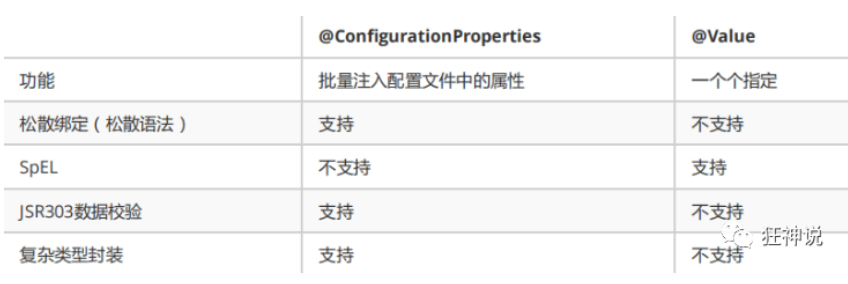
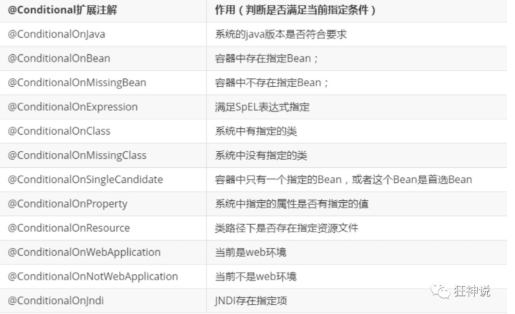
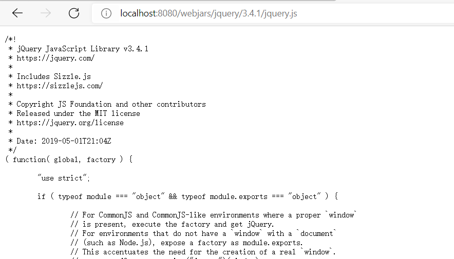
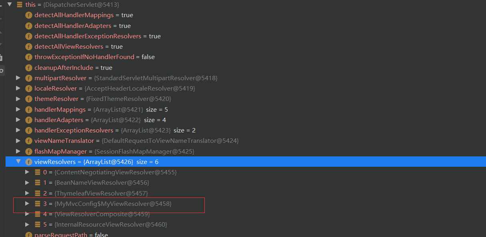
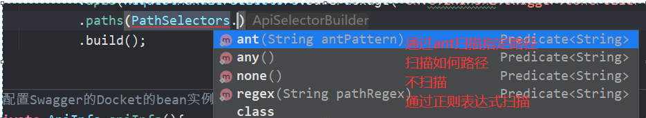
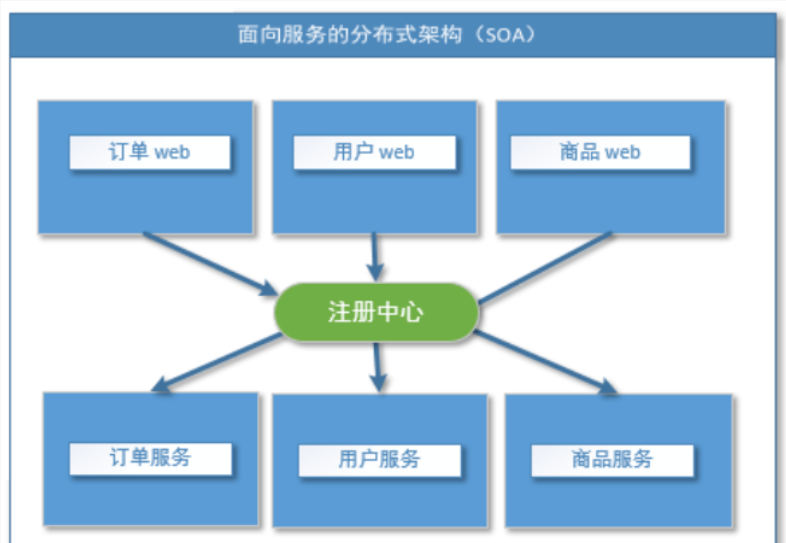
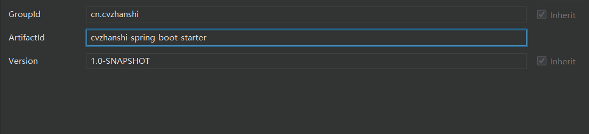

# 一、Spring Boot 入门(Hello World)

## 1.1 回顾Spring

-  Spring是一个开源框架，2003 年兴起的一个轻量级的Java 开发框架，作者：Rod Johnson
-  **Spring是为了解决企业级应用开发的复杂性而创建的，简化开发** 

**Spring是如何简化Java开发的**

- 基于POJO的轻量级和最小侵入性编程，所有东西都是bean；
- 通过IOC，依赖注入（DI）和面向接口实现松耦合；
- 基于切面（AOP）和惯例进行声明式编程；
- 通过切面和模版减少样式代码，RedisTemplate，xxxTemplate；

## 1.2 Spring Boot 简介

> 简化Spring应用开发的一个框架； 
>
> 整个Spring技术栈的一个大整合； 
>
> J2EE开发的一站式解决方案；  

## 1.3 微服务简介

>  微服务：架构风格（服务微化） 
>
>  一个应用应该是一组小型服务；可以通过HTTP的方式进行互通； 
>
>  单体应用：ALL IN ONE
>
>  微服务：每一个功能元素最终都是一个可独立替换和独立升级的软件单元； 

**微服务的优点**

- 单一职责原则
- 每个服务足够内聚，足够小，代码容易理解，这样能聚焦一个指定业务功能或业务需求
- 开发简单，开发效率提高，一个服务可能就是专一的只干一件事
- 微服务能够被小团队单独开发，这个小团队是2~5人的开发人员组成
- 微服务是松耦合的，是有功能意义的服务，无论是在开发阶段或部署阶段都是独立的。
- 微服务能使用不同的语言开发。
- 易于和第三方集成，微服务允许容易且灵活的方式集成自动部署，通过持续集成工具，如jenkins, Hudson,
  bamboo
- 微服务易于被-一个开发人员理解，修改和维护，这样小团队能够更关注自己的工作成果。无需通过合作才能体
  现价值。
- 微服务允许你利用融合最新技术。
- **微服务只是业务逻辑的代码，不会和HTML，CSS或其他界面混合**
- **每个微服务都有自己的存储能力，可以有自己的数据库,也可以有统一数据库**

**微服务缺点**

- 开发人员要处理分布式系统的复杂性；
- 多服务运维难度，随着服务的增加，运维的压力也在增大；
- 系统部署依赖问题；
- 服务间通信成本问题；
- 数据一致性问题；
- 系统集成测试问题；
- 性能和监控问题

## 1.4 Spring Boot 优点与缺点

### 1.4.1 优点

- Create stand-alone Spring applications
  - 创建独立Spring应用
- Embed Tomcat, Jetty or Undertow directly (no need to deploy WAR files)
  - 内嵌web服务器
- Provide opinionated 'starter' dependencies to simplify your build configuration
  - 自动starter依赖，简化构建配置
- Automatically configure Spring and 3rd party libraries whenever possible
  - 自动配置Spring以及第三方功能
- Provide production-ready features such as metrics, health checks, and externalized configuration
  - 提供生产级别的监控、健康检查及外部化配置
- Absolutely no code generation and no requirement for XML configuration
  - 无代码生成、无需编写XML

> SpringBoot是整合Spring技术栈的一站式框架
>
> SpringBoot是简化Spring技术栈的快速开发脚手架

**SptingBoot的核心思想：约定大于配置**

### 1.4.2 缺点

- 人称版本帝，迭代快，需要时刻关注变化

- 封装太深，内部原理复杂，不容易精通

## 1.5 Spring Boot HelloWorld

>  一个功能： 浏览器发送hello请求，服务器接受请求并处理，响应Hello World字符串

### 1.5.1 方式一：创建普通Maven项目

> 创建maven时不需要勾选任何模板

#### 1.5.1.1  导入spring boot相关的依赖 

```xml
<parent>
        <groupId>org.springframework.boot</groupId>
        <artifactId>spring-boot-starter-parent</artifactId>
        <version>1.5.9.RELEASE</version>
    </parent>


    <dependencies>
        <dependency>
            <groupId>org.springframework.boot</groupId>
            <artifactId>spring-boot-starter-web</artifactId>
        </dependency>
    </dependencies>

    <!-- 这个插件，可以将应用打包成一个可执行的jar包；-->
    <build>
        <plugins>
            <plugin>
                <groupId>org.springframework.boot</groupId>
                <artifactId>spring-boot-maven-plugin</artifactId>
            </plugin>
        </plugins>
    </build>

```

#### 1.5.1.2  编写一个主程序；启动Spring Boot应用 

```java
/**
 * @SpringBootApplication 来标注一个主程序类，说明这是一个Spring Boot应用
 */
@SpringBootApplication
public class HelloWorldMainApplication {

    public static void main(String[] args) {
        // Spring应用启动起来
        SpringApplication.run(HelloWorldMainApplication.class,args);
    }
}
```

#### 1.5.1.3  编写相关的Controller、Service 

```java
/**
 * @author cVzhanshi
 * @create 2021-06-08 17:38
 */
@Controller
public class HelloController {
    @ResponseBody
    @RequestMapping("/hello")
    public String hello(){
        return "Hello World!";
    }
}

```

#### 1.5.1.4 测试主程序


#### 1.5.1.5  简化部署 

```xml
 <!-- 这个插件，可以将应用打包成一个可执行的jar包；-->
    <build>
        <plugins>
            <plugin>
                <groupId>org.springframework.boot</groupId>
                <artifactId>spring-boot-maven-plugin</artifactId>
            </plugin>
        </plugins>
    </build>
```

演示：


**直接运行jar包**


### 1.5.2 方式二： 使用Spring Initializr 的 Web页面创建项目 

- 打开  https://start.spring.io/

- 填写项目信息
- 点击”Generate Project“按钮生成项目；下载此项目
- 解压项目包，并用IDEA以Maven项目导入，一路下一步即可，直到项目导入完毕。
- 如果是第一次使用，可能速度会比较慢，包比较多、需要耐心等待一切就绪

### 1.5.3 方式三(常用)：通过IDEA集成的Spring Initializr创建项目

#### 1.5.3.1 创建项目

- new project --> Spring Initializr


- 按操作提示进行下一步


**项目结构分析：**

通过上面步骤完成了基础项目的创建。就会自动生成以下文件。

1、程序的主启动类

2、一个 application.properties 配置文件

3、一个 测试类

4、一个 pom.xml

#### 1.5.3.1 编写相关controller

-  在主程序的同级目录下，新建一个controller包，**一定要在同级目录下，否则识别不到** 
-  在包中新建一个HelloWorldController类 

```java
/**
 * @author cVzhanshi
 * @create 2021-06-10 14:20
 */

@Controller
@RequestMapping("/hello")
public class HelloWorldController {

    @GetMapping("/hello")
    @ResponseBody
    public String hello(){
        return "Hello World";
    }
}
```

#### 1.5.3.2 运行测试

>  编写完毕后，从主程序启动项目，浏览器发起请求，看页面返回；控制台输出了 Tomcat 访问的端口号！ 


> 其中简化部署和maven相同

#### 1.5.3.3 修改端口号和修改banner

- 修改端口号

> 只需要在application.properties配置文件中修改就行

```properties
#修改端口号
server.port=8081
```

- 修改banner

> banner时运行spring boot时出现的一个图案
>
> 

**修改过程**

- [此地址自定义banner](https://www.bootschool.net/ascii)

- 复制生成的内容，在application.properties配置文件同级目录下创建banner.txt，把内容复制进去就行


# 二、Spring Boot 运行原理初探(自动配置)

## 2.1 POM.xml

### 2.1.1 父依赖

-  其中它主要是依赖一个父项目，主要是管理项目的资源过滤及插件！ 

```xml
<parent>
    <groupId>org.springframework.boot</groupId>
    <artifactId>spring-boot-starter-parent</artifactId>
    <version>2.2.5.RELEASE</version>
    <relativePath/> <!-- lookup parent from repository -->
</parent>
```

-  点进去，发现还有一个父依赖 

```xml
<parent>
    <groupId>org.springframework.boot</groupId>
    <artifactId>spring-boot-dependencies</artifactId>
    <version>2.2.5.RELEASE</version>
    <relativePath>../../spring-boot-dependencies</relativePath>
</parent>
```

>  这里才是真正管理SpringBoot应用里面所有依赖版本的地方，SpringBoot的版本控制中心;

 **以后我们导入依赖默认是不需要写版本；但是如果导入的包没有在依赖中管理着就需要手动配置版本了；** 

### 2.1.2 启动器 spring-boot-starter

```xml
<dependency>
    <groupId>org.springframework.boot</groupId>
    <artifactId>spring-boot-starter-web</artifactId>
</dependency>
```

**springboot-boot-starter-xxx**：就是spring-boot的场景启动器

**spring-boot-starter-web**：帮我们导入了web模块正常运行所依赖的组件

>  SpringBoot将所有的功能场景都抽取出来，做成一个个的starter （启动器），只需要在项目中引入这些starter即可，所有相关的依赖都会导入进来 ， 我们要用什么功能就导入什么样的场景启动器即可 ；我们未来也可以自己自定义 starter .

## 2.2 主启动类

### 2.2.1 默认的启动类

```java
//@SpringBootApplication 来标注一个主程序类
//说明这是一个Spring Boot应用
@SpringBootApplication
public class SpringbootApplication {

   public static void main(String[] args) {
     //以为是启动了一个方法，没想到启动了一个服务
      SpringApplication.run(SpringbootApplication.class, args);
   }
}
```

### 2.2.2 @SpringBootApplication

>  作用：标注在某个类上说明这个类是SpringBoot的主配置类 ， SpringBoot就应该运行这个类的main方法来启动SpringBoot应用； 

- 进入这个注解：可以看到上面还有很多其他注解！

```java
@SpringBootConfiguration
@EnableAutoConfiguration
@ComponentScan(
    excludeFilters = {@Filter(
    type = FilterType.CUSTOM,
    classes = {TypeExcludeFilter.class}
), @Filter(
    type = FilterType.CUSTOM,
    classes = {AutoConfigurationExcludeFilter.class}
)}
)
public @interface SpringBootApplication {
    // ......
}
```

### 2.2.3 @ComponentScan

- 这个注解在Spring中很重要 ,它对应XML配置中的元素。
- 作用：自动扫描并加载符合条件的组件或者bean ， 将这个bean定义加载到IOC容器中

### 2.2.4 @SpringBootConfiguration

-  作用：SpringBoot的配置类 ，标注在某个类上 ， 表示这是一个SpringBoot的配置类； 

```java
// 点进去得到下面的 @Component
@Configuration
public @interface SpringBootConfiguration {}

@Component
public @interface Configuration {}
```

> 这里的 @Configuration，说明这是一个配置类 ，配置类就是对应Spring的xml 配置文件；里面的@Component 这就说明，启动类本身也是Spring中的一个组件而已，负责启动应用！

### 2.2.5 @EnableAutoConfiguration

>  以前我们需要自己配置的东西，而现在SpringBoot可以自动帮我们配置 ；@EnableAutoConfiguration告诉SpringBoot开启自动配置功能，这样自动配置才能生效； 

点击查看

```java
@AutoConfigurationPackage
@Import(AutoConfigurationImportSelector.class)
public @interface EnableAutoConfiguration {...}
```

**@AutoConfigurationPackage ：自动配置包**

```java
@Import({Registrar.class})
public @interface AutoConfigurationPackage {
}
```

> **@import** ：Spring底层注解@import ， 给容器中导入一个组件
>
> Registrar.class 作用：将主启动类的所在包及包下面所有子包里面的所有组件扫描到Spring容器 

 **@Import({AutoConfigurationImportSelector.class}) ：给容器导入组件** 

>  AutoConfigurationImportSelector ：自动配置导入选择器，那么它会导入哪些组件的选择器呢？我们点击去这个类看源码： 

- 这个类中有一个这样的方法 

```java
// 获得候选的配置
protected List<String> getCandidateConfigurations(AnnotationMetadata metadata, AnnotationAttributes attributes) {
    //这里的getSpringFactoriesLoaderFactoryClass（）方法
    //返回的就是我们最开始看的启动自动导入配置文件的注解类；EnableAutoConfiguration
    List<String> configurations = SpringFactoriesLoader.loadFactoryNames(this.getSpringFactoriesLoaderFactoryClass(), this.getBeanClassLoader());
    Assert.notEmpty(configurations, "No auto configuration classes found in META-INF/spring.factories. If you are using a custom packaging, make sure that file is correct.");
    return configurations;
}
```

-  这个方法又调用了  SpringFactoriesLoader 类的静态方法！我们进入SpringFactoriesLoader类loadFactoryNames() 方法

```java
public static List<String> loadFactoryNames(Class<?> factoryClass, @Nullable ClassLoader classLoader) {
    String factoryClassName = factoryClass.getName();
    //这里它又调用了 loadSpringFactories 方法
    return (List)loadSpringFactories(classLoader).getOrDefault(factoryClassName, Collections.emptyList());
}
```

- 我们继续点击查看 loadSpringFactories 方法 

```java
private static Map<String, List<String>> loadSpringFactories(@Nullable ClassLoader classLoader) {
    //获得classLoader ， 我们返回可以看到这里得到的就是EnableAutoConfiguration标注的类本身
    MultiValueMap<String, String> result = (MultiValueMap)cache.get(classLoader);
    if (result != null) {
        return result;
    } else {
        try {
            //去获取一个资源 "META-INF/spring.factories"
            Enumeration<URL> urls = classLoader != null ? classLoader.getResources("META-INF/spring.factories") : ClassLoader.getSystemResources("META-INF/spring.factories");
            LinkedMultiValueMap result = new LinkedMultiValueMap();

            //将读取到的资源遍历，封装成为一个Properties
            while(urls.hasMoreElements()) {
                URL url = (URL)urls.nextElement();
                UrlResource resource = new UrlResource(url);
                Properties properties = PropertiesLoaderUtils.loadProperties(resource);
                Iterator var6 = properties.entrySet().iterator();

                while(var6.hasNext()) {
                    Entry<?, ?> entry = (Entry)var6.next();
                    String factoryClassName = ((String)entry.getKey()).trim();
                    String[] var9 = StringUtils.commaDelimitedListToStringArray((String)entry.getValue());
                    int var10 = var9.length;

                    for(int var11 = 0; var11 < var10; ++var11) {
                        String factoryName = var9[var11];
                        result.add(factoryClassName, factoryName.trim());
                    }
                }
            }

            cache.put(classLoader, result);
            return result;
        } catch (IOException var13) {
            throw new IllegalArgumentException("Unable to load factories from location [META-INF/spring.factories]", var13);
        }
    }
}
```

- 发现一个多次出现的文件：spring.factories，全局搜索它

### 2.2.6 spring.factories

>  打开spring.factories ， 看到了很多自动配置的文件；这就是自动配置根源所在 


**WebServicesAutoConfiguration**


>  可以看到这些一个个的都是JavaConfig配置类，而且都注入了一些Bean 
>
>  自动配置真正实现是从classpath中搜寻所有的META-INF/spring.factories配置文件 ，并将其中对应的 org.springframework.boot.autoconfigure. 包下的配置项，通过反射实例化为对应标注了 @Configuration的JavaConfig形式的IOC容器配置类 ， 然后将这些都汇总成为一个实例并加载到IOC容器中 

### 2.2.7 结论

- SpringBoot在启动的时候从类路径下的META-INF/spring.factories中获取EnableAutoConfiguration指定的值
- 将这些值作为自动配置类导入容器 ， 自动配置类就生效 ， 帮我们进行自动配置工作；
- 整个J2EE的整体解决方案和自动配置都在springboot-autoconfigure的jar包中；
- 它会给容器中导入非常多的自动配置类 （xxxAutoConfiguration）, 就是给容器中导入这个场景需要的所有组件 ， 并配置好这些组件 ；
- 有了自动配置类 ， 免去了我们手动编写配置注入功能组件等的工作；

> 说明：资料中上传了根据老师的讲解画的思维导图

## 2.3 RUN

>  **SpringApplication.run分析** 

**这个类主要做了以下四件事情：**

1、推断应用的类型是普通的项目还是Web项目

2、查找并加载所有可用初始化器 ， 设置到initializers属性中

3、找出所有的应用程序监听器，设置到listeners属性中

4、推断并设置main方法的定义类，找到运行的主类

**run方法流程分析**


# 三、Spring Boot 配置文件(yaml配置注入)

## 3.1 配置文件和yaml语法学习

### 3.1.1 配置文件

SpringBoot使用一个全局的配置文件 ， 配置文件名称是固定的

- application.properties
- 语法结构 ：key=value
- application.yml
- 语法结构 ：key：空格 value

 **配置文件的作用 ：**修改SpringBoot自动配置的默认值，因为SpringBoot在底层都给我们自动配置好了

> 比如我们可以在配置文件中修改Tomcat 默认启动的端口号
>
> ```
> server.port=8081
> ```

### 3.1.2 yaml概述

>  YAML是 "YAML Ain't a Markup Language" （YAML不是一种标记语言）的递归缩写。在开发的这种语言时，YAML 的意思其实是："Yet Another Markup Language"（仍是一种标记语言）

 **这种语言以数据作为中心，而不是以标记语言为重点** 

-  以前的配置文件，大多数都是使用xml来配置

- xml与yaml对比

  - 传统xml配置

  ``` xml
  <server>
      <port>8081<port>
  </server>
  ```

  - yaml配置

  ```yaml
  server：
    prot: 8080
  ```

### 3.1.2 yaml基础语法

 说明：语法要求**严格**

- 空格不能省略

- 以缩进来控制层级关系，只要是左边对齐的一列数据都是同一个层级的。

- 属性和值的大小写都是十分敏感的。

**字面量：普通的值  [ 数字，布尔值，字符串  ]**

字面量直接写在后面就可以 ， 字符串默认不用加上双引号或者单引号

> k: v 

 注意： 

- “ ” 双引号，不会转义字符串里面的特殊字符 ， 特殊字符会作为本身想表示的意思；

  比如 ：name: "kuang \n shen"  输出 ：kuang  换行  shen

- '' 单引号，会转义特殊字符 ， 特殊字符最终会变成和普通字符一样输出

  比如 ：name: ‘kuang \n shen’  输出 ：kuang  \n  shen

**对象、Map（键值对）**

```yaml
#对象、Map格式
k: 
    v1:
    v2:
```

 在下一行来写对象的属性和值得关系，注意缩进 

```yaml
student:
    name: qinjiang
    age: 3
```

 行内写法 

```yaml
student: {name: qinjiang,age: 3}
```

 **数组（ List、set ）** 

 用 - 值表示数组中的一个元素

```yaml
pets:
 - cat
 - dog
 - pig
```

 行内写法 

```yaml
pets: [cat,dog,pig]
```

 **修改SpringBoot的默认端口号** 

```yaml
server：
  prot: 8080
```

## 3.2  注入配置文件

>  yaml文件更强大的地方在于，他可以给我们的实体类直接注入匹配值

### 3.2.1 yaml注入配置文件

-  在springboot项目中的resources目录下新建一个文件 application.yml
-  编写一个实体类 Dog

```java
/**
 * @author cVzhanshi
 * @create 2021-06-11 15:15
 */
@Component//注册bean
public class Dog {
    private String name;
    private Integer age;
...
}
```

- 使用原来的放过给属性注入值  @Value注解

```java
@Component //注册bean
public class Dog {
    @Value("阿黄")
    private String name;
    @Value("18")
    private Integer age;
}
```

-  在SpringBoot的测试类下 测试

```java
@SpringBootTest
class Springboot02ConfigApplicationTests {
    @Autowired
    private Dog dog;

    @Test
    void contextLoads() {
        System.out.println(dog);
    }
}
```

 结果成功输出，@Value注入成功 


- 编写一个复杂一点的实体类：Person 类 

```java
public class Person {
    private String name;
    private Integer age;
    private Boolean happy;
    private Date birth;
    private Map<String,Object> maps;
    private List<Object> lists;
    private Dog dog;
...
}
```

-  使用yaml配置的方式进行注入 

```yaml
person:
  name: cvzhanshi
  age: 3
  happy: false
  birth: 2000/01/01
  maps: {k1: v1,k2: v2}
  lists:
    - code
    - girl
    - music
  dog:
    name: fdsf
    age: 1

```

- 把person类引入到容器中，并绑定信息

```java
@Component //注册bean
@ConfigurationProperties(prefix = "person")
public class Person {
}
```

其中@ConfigurationProperties作用：

> 将配置文件中配置的每一个属性的值，映射到这个组件中；
> 告诉SpringBoot将本类中的所有属性和配置文件中相关的配置进行绑定
> 参数 prefix = “person” : 将配置文件中的person下面的所有属性一一对应

-  IDEA 提示，springboot配置注解处理器没有找到 


解决方法，导入依赖：

```xml
<!-- 导入配置文件处理器，配置文件进行绑定就会有提示，需要重启 -->
<dependency>
  <groupId>org.springframework.boot</groupId>
  <artifactId>spring-boot-configuration-processor</artifactId>
  <optional>true</optional>
</dependency>
```

- 测试

```java
@Autowired
    private Person person;

    @Test
    void contextLoads() {
        System.out.println(person);
    }
```

 结果：所有值全部注入成功 


>  **如果将配置文件的key 值 和 属性的值设置为不一样，则结果输出为null，注入失败** 

### 3.2.2 加载指定的配置文件

**@PropertySource ：**加载指定的配置文件；

**@configurationProperties**：默认从全局配置文件中获取值；

- 在resources目录下新建一个**person.properties**文件

```properties
name=cvzhanshi
```

- 在代码中指定加载的文件

```java
@PropertySource(value = "classpath:person.properties")
@Component //注册bean
public class Person {

    @Value("${name}")
    private String name;
    ...
}
```

- 测试


### 3.2.3 配置文件占位符

 配置文件还可以编写占位符生成随机数 

```yaml
person:
    name: cvzhanshi${random.uuid} # 随机uuid
    age: ${random.int}  # 随机int
    happy: false
    birth: 2000/01/01
    maps: {k1: v1,k2: v2}
    lists:
      - code
      - girl
      - music
    dog:
      name: ${person.hello:other}_旺财
      age: 1
```

### 3.2.4 回顾properties配置

 **上面采用的yaml方法都是最简单的方式，开发中最常用的；也是springboot所推荐的** 

- properties配置文件在写中文的时候，会有乱码 ， 我们需要去IDEA中设置编码格式为UTF-8 

 settings-->FileEncodings 中配置 


- 测试使用步骤

  -  新建一个实体类User 

  ```java
  @Component //注册bean
  public class User {
      private String name;
      private int age;
      private String sex;
  }
  ```

  -  编辑配置文件 user.properties 

  ```properties
  user1.name=cvzhanshi
  user1.age=18
  user1.sex=男
  ```

  -  在User类上使用@Value来进行注入 

  ```java
  @Component //注册bean
  @PropertySource(value = "classpath:user.properties")
  public class User {
      //直接使用@value
      @Value("${user.name}") //从配置文件中取值
      private String name;
      @Value("#{9*2}")  // #{SPEL} Spring表达式
      private int age;
      @Value("男")  // 字面量
      private String sex;
  }
  ```

  - 测试

  ```java
  @Autowired
      private User user;
  
      @Test
      void contextLoads() {
          System.out.println(user);
      }
  
  ```

  

### 3.2.5 对比小结

 @Value这个使用起来并不友好！我们需要为每个属性单独注解赋值，比较麻烦； 



- @ConfigurationProperties只需要写一次即可 ， @Value则需要每个字段都添加
- 松散绑定：这个什么意思呢? 比如我的yml中写的last-name，这个和lastName是一样的， - 后面跟着的字母默认是大写的。这就是松散绑定。可以测试一下
- JSR303数据校验 ， 这个就是我们可以在字段是增加一层过滤器验证 ， 可以保证数据的合法性
- 复杂类型封装，yml中可以封装对象 ， 使用value就不支持

**结论：**

配置yml和配置properties都可以获取到值 ， 强烈推荐 yml；

如果我们在某个业务中，只需要获取配置文件中的某个值，可以使用一下 @value；

如果说，我们专门编写了一个JavaBean来和配置文件进行一一映射，就直接@configurationProperties。

## 3.3  JSR303数据校验 

### 3.3.1 JSR303数据校验 的使用

>  Springboot中可以用@validated来校验数据，如果数据异常则会统一抛出异常，方便异常中心统一处理 

-  写个注解让我们的name只能支持Email格式 

```java
@Component //注册bean
@ConfigurationProperties(prefix = "person")
@Validated  //数据校验
public class Person {

    @Email(message="邮箱格式错误") //name必须是邮箱格式
    private String name;
}
```

运行结果会报错： default message [邮箱格式错误]; 

 **使用数据校验，可以保证数据的正确性；**  

### 3.3.2 常见参数

```java
@NotNull(message="名字不能为空")
private String userName;
@Max(value=120,message="年龄最大不能查过120")
private int age;
@Email(message="邮箱格式错误")
private String email;

空检查
@Null       验证对象是否为null
@NotNull    验证对象是否不为null, 无法查检长度为0的字符串
@NotBlank   检查约束字符串是不是Null还有被Trim的长度是否大于0,只对字符串,且会去掉前后空格.
@NotEmpty   检查约束元素是否为NULL或者是EMPTY.
    
Booelan检查
@AssertTrue     验证 Boolean 对象是否为 true  
@AssertFalse    验证 Boolean 对象是否为 false  
    
长度检查
@Size(min=, max=) 验证对象（Array,Collection,Map,String）长度是否在给定的范围之内  
@Length(min=, max=) string is between min and max included.

日期检查
@Past       验证 Date 和 Calendar 对象是否在当前时间之前  
@Future     验证 Date 和 Calendar 对象是否在当前时间之后  
@Pattern    验证 String 对象是否符合正则表达式的规则

.......等等
除此以外，我们还可以自定义一些数据校验规则
```

## 3.4  多环境切换 

>  profile是Spring对不同环境提供不同配置功能的支持，可以通过激活不同的环境版本，实现快速切换环境 

### 3.4.1 多配置文件

>  我们在主配置文件编写的时候，文件名可以是 application-{profile}.properties/yml , 用来指定多个环境版本； 

**例如：**

application-test.properties 代表测试环境配置

application-dev.properties 代表开发环境配置

但是Springboot并不会直接启动这些配置文件，它**默认使用application.properties主配置文件**；

我们需要通过一个配置来选择需要激活的环境：

```properties
#比如在配置文件中指定使用dev环境，我们可以通过设置不同的端口号进行测试；
#我们启动SpringBoot，就可以看到已经切换到dev下的配置了；
spring.profiles.active=dev
```

### 3.4.2 yaml的多文档块

>   和properties配置文件中一样，但是使用yml去实现不需要创建多个配置文件，更加方便了 

```yaml

server:
  port: 8081
#选择要激活那个环境块
spring:
  profiles:
    active: test

---
server:
  port: 8083
spring:
  profiles: dev #配置环境的名称


---

server:
  port: 8084
spring:
  profiles: test  #配置环境的名称
```

 **注意：如果yml和properties同时都配置了端口，并且没有激活其他环境 ， 默认会使用properties配置文件的！** 

### 3.4.3 配置文件加载位置

 官方外部配置文件说明参考文档中给出的加载位置


 springboot 启动会扫描以下位置的application.properties或者application.yml文件作为Spring boot的默认配置文件： 

```
优先级1：项目路径下的config文件夹配置文件
优先级2：项目路径下配置文件
优先级3：资源路径下的config文件夹配置文件
优先级4：资源路径下配置文件
```

优先级由高到底，高优先级的配置会覆盖低优先级的配置；

**SpringBoot会从这四个位置全部加载主配置文件；互补配置；**

自动装配的再理解

# 四、Spring Boot 自动配置原理再理解

## 4.1 分析自动配置原理

 以**HttpEncodingAutoConfiguration（Http编码自动配置）**为例 

```java

//表示这是一个配置类，和以前编写的配置文件一样，也可以给容器中添加组件；
@Configuration 
//启动指定类的ConfigurationProperties功能；
//进入这个HttpProperties查看，将配置文件中对应的值和HttpProperties绑定起来；
//并把HttpProperties加入到ioc容器中
@EnableConfigurationProperties({HttpProperties.class}) 

//Spring底层@Conditional注解
//根据不同的条件判断，如果满足指定的条件，整个配置类里面的配置就会生效；
//这里的意思就是判断当前应用是否是web应用，如果是，当前配置类生效
@ConditionalOnWebApplication(
    type = Type.SERVLET
)
//判断当前项目有没有这个类CharacterEncodingFilter；SpringMVC中进行乱码解决的过滤器；
@ConditionalOnClass({CharacterEncodingFilter.class})
//判断配置文件中是否存在某个配置：spring.http.encoding.enabled；
//如果不存在，判断也是成立的
//即使我们配置文件中不配置pring.http.encoding.enabled=true，也是默认生效的；
@ConditionalOnProperty(
    prefix = "spring.http.encoding",
    value = {"enabled"},
    matchIfMissing = true
)
public class HttpEncodingAutoConfiguration {
    //他已经和SpringBoot的配置文件映射了
    private final Encoding properties;
    //只有一个有参构造器的情况下，参数的值就会从容器中拿
    public HttpEncodingAutoConfiguration(HttpProperties properties) {
        this.properties = properties.getEncoding();
    }

    //给容器中添加一个组件，这个组件的某些值需要从properties中获取
    @Bean
    @ConditionalOnMissingBean //判断容器没有这个组件？
    public CharacterEncodingFilter characterEncodingFilter() {
        CharacterEncodingFilter filter = new OrderedCharacterEncodingFilter();
        filter.setEncoding(this.properties.getCharset().name());
        filter.setForceRequestEncoding(this.properties.shouldForce(org.springframework.boot.autoconfigure.http.HttpProperties.Encoding.Type.REQUEST));
        filter.setForceResponseEncoding(this.properties.shouldForce(org.springframework.boot.autoconfigure.http.HttpProperties.Encoding.Type.RESPONSE));
        return filter;
    }
    ...
}
```

**一句话总结 ：根据当前不同的条件判断，决定这个配置类是否生效！**

- 一但这个配置类生效；这个配置类就会给容器中添加各种组件；
- 这些组件的属性是从对应的properties类中获取的，这些类里面的每一个属性又是和配置文件绑定的；
- 所有在配置文件中能配置的属性都是在xxxxProperties类中封装着；
- 配置文件能配置什么就可以参照某个功能对应的这个属性类

```java
//从配置文件中获取指定的值和bean的属性进行绑定
@ConfigurationProperties(prefix = "spring.http") 
public class HttpProperties {
    // .....
}
```

## 4.2 了解：@Conditional

 **自动配置类必须在一定的条件下才能生效** 

 **@Conditional派生注解（Spring注解版原生的@Conditional作用）** 

 作用：必须是@Conditional指定的条件成立，才给容器中添加组件，配置配里面的所有内容才生效



**如何自动哪些自动配置类生效？**

>  **可以通过启用 debug=true属性；来让控制台打印自动配置报告** ,**这样我们就可以很方便的知道哪些自动配置类生效** 

```yaml
#开启springboot的调试类
debug=true
```

**Positive matches:（自动配置类启用的：正匹配）**

**Negative matches:（没有启动，没有匹配成功的自动配置类：负匹配）**

**Unconditional classes: （没有条件的类）**

## 4.3 结论

1、SpringBoot启动会加载大量的自动配置类

2、我们看我们需要的功能有没有在SpringBoot默认写好的自动配置类当中；

3、我们再来看这个自动配置类中到底配置了哪些组件；（只要我们要用的组件存在在其中，我们就不需要再手动配置了）

4、给容器中自动配置类添加组件的时候，会从properties类中获取某些属性。我们只需要在配置文件中指定这些属性的值即可；

**xxxxAutoConfigurartion：自动配置类；**给容器中添加组件

**xxxxProperties:封装配置文件中相关属性；**

# 五、Spring Boot Web开发

## 5.1  静态资源处理 

>  如果我们是一个web应用，我们的main下会有一个webapp，我们以前都是将所有的页面导在这里面的，对吧！但是我们现在的pom呢，打包方式是为jar的方式，那么这种方式SpringBoot能不能来给我们写页面呢？当然是可以的，但是SpringBoot对于静态资源放置的位置，是有规定的 .

 **SpringBoot中，SpringMVC的web配置都在 WebMvcAutoConfiguration 这个配置类里面** 

 有一个方法：addResourceHandlers 添加资源处理 

```java
@Override
public void addResourceHandlers(ResourceHandlerRegistry registry) {
    //先判断是否自定义了静态资源路径
    if (!this.resourceProperties.isAddMappings()) {
        // 已禁用默认资源处理
        logger.debug("Default resource handling disabled");
        return;
    }
    // webjars 配置
    addResourceHandler(registry, "/webjars/**", "classpath:/META-INF/resources/webjars/");
    // 静态资源配置
    addResourceHandler(registry, this.mvcProperties.getStaticPathPattern(), (registration) -> {
        registration.addResourceLocations(this.resourceProperties.getStaticLocations());
        if (this.servletContext != null) {
            ServletContextResource resource = new ServletContextResource(this.servletContext, SERVLET_LOCATION);
            registration.addResourceLocations(resource);
        }
    });
}
```

**由源码可知有三种静态资源映射规则**

### 5.1.1 webjars资源映射规则

>  Webjars本质就是以jar包的方式引入我们的静态资源 ， 我们以前要导入一个静态资源文件，现在直接导入即可 

使用SpringBoot需要使用Webjars，我们可以去搜索一下：

网站：https://www.webjars.org 

- 要使用jQuery，我们只要要引入jQuery对应版本的pom依赖即可！

```xml
<dependency>
    <groupId>org.webjars</groupId>
    <artifactId>jquery</artifactId>
    <version>3.4.1</version>
</dependency>
```

- 导入完毕，查看webjars目录结构


- 访问Jquery.js文件 

>  访问：只要是静态资源，SpringBoot就会去对应的路径寻找资源，我们这里访问：http://localhost:8080/webjars/jquery/3.4.1/jquery.js 



### 5.1.2 第二种静态资源映射规则

>  我们去找staticPathPattern发现第二种映射规则 ：/** , 访问当前的项目任意资源，它会去找 resourceProperties 这个类，我们可以点进去看一下分析： 

```java
// 进入方法
public String[] getStaticLocations() {
    return this.staticLocations;
}

// 找到对应的值
private String[] staticLocations = CLASSPATH_RESOURCE_LOCATIONS;

// 找到路径
private static final String[] CLASSPATH_RESOURCE_LOCATIONS = { 
    "classpath:/META-INF/resources/",
  "classpath:/resources/", 
    "classpath:/static/", 
    "classpath:/public/" 
};
```

>  ResourceProperties 可以设置和我们静态资源有关的参数；这里面指向了它会去寻找资源的文件夹，即上面数组的内容 

 结论，以下四个目录存放的静态资源可以被我们识别 :

```java
"classpath:/META-INF/resources/"
"classpath:/resources/"
"classpath:/static/"
"classpath:/public/"
且优先级别resources>static(默认)>public
```

>  可以在resources根目录下新建对应的文件夹，都可以存放我们的静态文件 
>
>  访问方式 http://localhost:8080/1.js 

### 5.1.3 自定义静态资源路径

>  可以自己通过配置文件来指定一下，哪些文件夹是需要我们放静态资源文件的，在application.properties中配置； 

```properties
spring.resources.static-locations=classpath:/coding/,classpath:/cvzhanshi/
```

 一旦自己定义了静态文件夹的路径，原来的自动配置就都会失效了 

## 5.2  首页处理 

>  静态资源文件夹说完后，我们继续向下看源码！可以看到一个欢迎页的映射，就是我们的首页 

```java
@Bean
public WelcomePageHandlerMapping welcomePageHandlerMapping(ApplicationContext applicationContext,
                                                           FormattingConversionService mvcConversionService, ResourceUrlProvider mvcResourceUrlProvider) {
    WelcomePageHandlerMapping welcomePageHandlerMapping = new WelcomePageHandlerMapping(
        new TemplateAvailabilityProviders(applicationContext), applicationContext, getWelcomePage(),
        this.mvcProperties.getStaticPathPattern());
    welcomePageHandlerMapping.setInterceptors(getInterceptors(mvcConversionService, mvcResourceUrlProvider));
    welcomePageHandlerMapping.setCorsConfigurations(getCorsConfigurations());
    return welcomePageHandlerMapping;
}
```

点击继续查看

```java
private Resource getWelcomePage() {
    for (String location : this.resourceProperties.getStaticLocations()) {
        Resource indexHtml = getIndexHtml(location);
        if (indexHtml != null) {
            return indexHtml;
        }
    }
    ServletContext servletContext = getServletContext();
    if (servletContext != null) {
        return getIndexHtml(new ServletContextResource(servletContext, SERVLET_LOCATION));
    }
    return null;
}

private Resource getIndexHtml(String location) {
    return getIndexHtml(this.resourceLoader.getResource(location));
}
```

> 由此可知 欢迎页就是一个location下的的 index.html 而已， 静态资源文件夹下的所有 index.html 页面；被 /** 映射 比如我访问  http://localhost:8080/ ，就会找静态资源文件夹下的 index.html 

- 测试


 **说明：注意点，所有页面的静态资源都需要使用thymeleaf接管;**

​			**url用 @{}**

**关于网站图标说明**：

 与其他静态资源一样，Spring Boot在配置的静态内容位置中查找 favicon.ico。如果存在这样的文件，它将自动用作应用程序的favicon 

-  关闭SpringBoot默认图标 

```properties
#关闭默认图标
spring.mvc.favicon.enabled=false
```

-  自己放一个图标在静态资源目录下

> 说明：由于版本的更新，次功能只有旧版有用，最新版已经移除

## 5.3 Thymeleaf模板引擎

### 5.3.1 模板引擎

前端交给我们的页面，是html页面。如果是我们以前开发，我们需要把他们转成jsp页面，jsp好处就是当我们查出一些数据转发到JSP页面以后，我们可以用jsp轻松实现数据的显示，及交互等。

jsp支持非常强大的功能，包括能写Java代码，但是呢，我们现在的这种情况，SpringBoot这个项目首先是以jar的方式，不是war，像第二，我们用的还是嵌入式的Tomcat，所以呢，**他现在默认是不支持jsp的**。

 **SpringBoot推荐你可以来使用模板引擎：** 

 模板引擎，我们其实大家听到很多，其实jsp就是一个模板引擎，还有用的比较多的freemarker，包括SpringBoot给我们推荐的Thymeleaf，模板引擎有非常多，但再多的模板引擎，他们的思想都是一样的 


>  模板引擎的作用就是我们来写一个页面模板，比如有些值呢，是动态的，我们写一些表达式。而这些值，从哪来呢，就是我们在后台封装一些数据。然后把这个模板和这个数据交给我们模板引擎，模板引擎按照我们这个数据帮你把这表达式解析、填充到我们指定的位置，然后把这个数据最终生成一个我们想要的内容给我们写出去，这就是我们这个模板引擎，不管是jsp还是其他模板引擎，都是这个思想。 

### 5.3.2 引入Thymeleaf

[Thymeleaf官网](https://www.thymeleaf.org/)
[Thymeleaf 在Github 的主页](https://github.com/thymeleaf/thymeleaf)
[Spring官方文档：找到我们对应的版本](https://docs.spring.io/spring-boot/docs/2.2.5.RELEASE/reference/htmlsingle/#using-boot-starter)

**导入依赖**

```xml
<!--thymeleaf-->
<dependency>
    <groupId>org.springframework.boot</groupId>
    <artifactId>spring-boot-starter-thymeleaf</artifactId>
</dependency>
```


### 5.3.3 Thymeleaf分析

> 根据之前的自动装配原理，我们可以自动Thymeleaf也会有一个 ThymeleafProperties 的配置类，我们可以进去查看一下

```java
@ConfigurationProperties(prefix = "spring.thymeleaf")
public class ThymeleafProperties {

    private static final Charset DEFAULT_ENCODING = StandardCharsets.UTF_8;

    public static final String DEFAULT_PREFIX = "classpath:/templates/";

    public static final String DEFAULT_SUFFIX = ".html";
    ...
}
```

>  我们可以在其中看到默认的前缀和后缀 , 我们只需要把我们的html页面放在类路径下的templates下，thymeleaf就可以帮我们自动渲染了 .和springmvc配置的前缀后缀一样。

**测试**

- 编写一个Controller

```java
@Controller
public class HelloController {
    @RequestMapping("/hello")
    public String hello(Model model) {
        model.addAttribute("msg","hello1,cvzhanshi");
        return "hello";
    }
}
```

-  编写一个测试页面  hello.html 放在 templates 目录下 

```html
<!DOCTYPE html>
<html lang="en" xmlns:th="http://www.thymeleaf.org">
<head>
    <meta charset="UTF-8">
    <title>Title</title>
</head>
<body>
    <div th:text="${msg}"></div>
</body>
</html>
```

- 启动测试


### 5.3.4 Thymeleaf 语法学习

-  **我们可以使用任意的 th:attr 来替换Html中原生属性的值** 


-  **能写的表达式** 

```java

Simple expressions:（表达式语法）
Variable Expressions: ${...}：获取变量值；OGNL；
    1）、获取对象的属性、调用方法
    2）、使用内置的基本对象：#18
         #ctx : the context object.
         #vars: the context variables.
         #locale : the context locale.
         #request : (only in Web Contexts) the HttpServletRequest object.
         #response : (only in Web Contexts) the HttpServletResponse object.
         #session : (only in Web Contexts) the HttpSession object.
         #servletContext : (only in Web Contexts) the ServletContext object.

    3）、内置的一些工具对象：
　　　　　　#execInfo : information about the template being processed.
　　　　　　#uris : methods for escaping parts of URLs/URIs
　　　　　　#conversions : methods for executing the configured conversion service (if any).
　　　　　　#dates : methods for java.util.Date objects: formatting, component extraction, etc.
　　　　　　#calendars : analogous to #dates , but for java.util.Calendar objects.
　　　　　　#numbers : methods for formatting numeric objects.
　　　　　　#strings : methods for String objects: contains, startsWith, prepending/appending, etc.
　　　　　　#objects : methods for objects in general.
　　　　　　#bools : methods for boolean evaluation.
　　　　　　#arrays : methods for arrays.
　　　　　　#lists : methods for lists.
　　　　　　#sets : methods for sets.
　　　　　　#maps : methods for maps.
　　　　　　#aggregates : methods for creating aggregates on arrays or collections.
================================================================================== 

  Selection Variable Expressions: *{...}：选择表达式：和${}在功能上是一样；
  Message Expressions: #{...}：获取国际化内容
  Link URL Expressions: @{...}：定义URL；
  Fragment Expressions: ~{...}：片段引用表达式

Literals（字面量）
      Text literals: 'one text' , 'Another one!' ,…
      Number literals: 0 , 34 , 3.0 , 12.3 ,…
      Boolean literals: true , false
      Null literal: null
      Literal tokens: one , sometext , main ,…
      
Text operations:（文本操作）
    String concatenation: +
    Literal substitutions: |The name is ${name}|
    
Arithmetic operations:（数学运算）
    Binary operators: + , - , * , / , %
    Minus sign (unary operator): -
    
Boolean operations:（布尔运算）
    Binary operators: and , or
    Boolean negation (unary operator): ! , not
    
Comparisons and equality:（比较运算）
    Comparators: > , < , >= , <= ( gt , lt , ge , le )
    Equality operators: == , != ( eq , ne )
    
Conditional operators:条件运算（三元运算符）
    If-then: (if) ? (then)
    If-then-else: (if) ? (then) : (else)
    Default: (value) ?: (defaultvalue)
    
Special tokens:
    No-Operation: _
```

- **测试**

  -  编写一个Controller，放一些数据 

  ```java
  @Controller
  public class HelloController {
      @RequestMapping("/hello")
      public String hello(Model model) {
          model.addAttribute("msg","<h1>hello1,cvzhanshi</h1>");
          model.addAttribute("users", Arrays.asList("cvzhanshi","ursula"));
          return "hello";
      }
  }
  
  ```

  -  测试页面取出数据 

  ```html
  <!DOCTYPE html>
  <html lang="en" xmlns:th="http://www.thymeleaf.org">
  <head>
      <meta charset="UTF-8">
      <title>Title</title>
  </head>
  <body>
      <div th:text="${msg}"></div>
      <div th:utext="${msg}"></div>
  
      <hr>
      <!--遍历数据-->
      <!--th:each每次遍历都会生成当前这个标签：官网#9-->
      <h4 th:each="user:${users}" th:text="${user}">
      </h4>
      <hr>
      <h4>
          <!--行内写法：官网#12-->
          <span th:each="user:${users}">[[${user}]]</span>
      </h4>
  </body>
  </html>
  ```

  - 启动项目测试

  

## 5.4 MVC自动配置原理

### 5.4.1 官网阅读

> 我们想要知道 SpringBoot对SpringMVC还做了哪些配置，包括如何扩展，如何定制，可以进行源码分析或阅读官方文档
>
> [官方文档](https://docs.spring.io/spring-boot/docs/2.2.5.RELEASE/reference/htmlsingle/#boot-features-spring-mvc-auto-configuration)

```java
Spring MVC Auto-configuration
// Spring Boot为Spring MVC提供了自动配置，它可以很好地与大多数应用程序一起工作。
Spring Boot provides auto-configuration for Spring MVC that works well with most applications.
// 自动配置在Spring默认设置的基础上添加了以下功能：
The auto-configuration adds the following features on top of Spring’s defaults:
// 包含视图解析器
Inclusion of ContentNegotiatingViewResolver and BeanNameViewResolver beans.
// 支持静态资源文件夹的路径，以及webjars
Support for serving static resources, including support for WebJars 
// 自动注册了Converter：
// 转换器，这就是我们网页提交数据到后台自动封装成为对象的东西，比如把"1"字符串自动转换为int类型
// Formatter：【格式化器，比如页面给我们了一个2019-8-10，它会给我们自动格式化为Date对象】
Automatic registration of Converter, GenericConverter, and Formatter beans.
// HttpMessageConverters
// SpringMVC用来转换Http请求和响应的的，比如我们要把一个User对象转换为JSON字符串，可以去看官网文档解释；
Support for HttpMessageConverters (covered later in this document).
// 定义错误代码生成规则的
Automatic registration of MessageCodesResolver (covered later in this document).
// 首页定制
Static index.html support.
// 图标定制
Custom Favicon support (covered later in this document).
// 初始化数据绑定器：帮我们把请求数据绑定到JavaBean中！
Automatic use of a ConfigurableWebBindingInitializer bean (covered later in this document).

/*
如果您希望保留Spring Boot MVC功能，并且希望添加其他MVC配置（拦截器、格式化程序、视图控制器和其他功能），则可以添加自己
的@configuration类，类型为webmvcconfiguer，但不添加@EnableWebMvc。如果希望提供
RequestMappingHandlerMapping、RequestMappingHandlerAdapter或ExceptionHandlerExceptionResolver的自定义
实例，则可以声明WebMVCregistrationAdapter实例来提供此类组件。
*/
If you want to keep Spring Boot MVC features and you want to add additional MVC configuration 
(interceptors, formatters, view controllers, and other features), you can add your own 
@Configuration class of type WebMvcConfigurer but without @EnableWebMvc. If you wish to provide 
custom instances of RequestMappingHandlerMapping, RequestMappingHandlerAdapter, or 
ExceptionHandlerExceptionResolver, you can declare a WebMvcRegistrationsAdapter instance to provide such components.

// 如果您想完全控制Spring MVC，可以添加自己的@Configuration，并用@EnableWebMvc进行注释。
If you want to take complete control of Spring MVC, you can add your own @Configuration annotated with @EnableWebMvc.
```

> 通过阅读它告诉我们SpringBoot已经帮我们自动配置好了SpringMVC，然后自动配置了哪些东西呢 ?

### 5.4.2 **ContentNegotiatingViewResolver 内容协商视图解析器** 

>  源码分析：我们找到 WebMvcAutoConfiguration ， 然后搜索ContentNegotiatingViewResolver。找到如下方法 ！

```java
@Bean
@ConditionalOnBean(ViewResolver.class)
@ConditionalOnMissingBean(name = "viewResolver", value = ContentNegotiatingViewResolver.class)
public ContentNegotiatingViewResolver viewResolver(BeanFactory beanFactory) {
    ContentNegotiatingViewResolver resolver = new ContentNegotiatingViewResolver();
    resolver.setContentNegotiationManager(beanFactory.getBean(ContentNegotiationManager.class));
// ContentNegotiatingViewResolver使用所有其他视图解析器来定位视图，因此它应该具有较高的优先级
    resolver.setOrder(Ordered.HIGHEST_PRECEDENCE);
    return resolver;
}
```

> 进入ContentNegotiatingViewResolver类中, 找到对应的解析视图的代码 

```java
public View resolveViewName(String viewName, Locale locale) throws Exception {
    RequestAttributes attrs = RequestContextHolder.getRequestAttributes();
    Assert.state(attrs instanceof ServletRequestAttributes, "No current ServletRequestAttributes");
    List<MediaType> requestedMediaTypes = getMediaTypes(((ServletRequestAttributes) attrs).getRequest());
    if (requestedMediaTypes != null) {
        // 获取候选的视图对象
        List<View> candidateViews = getCandidateViews(viewName, locale, requestedMediaTypes);
        // 选择一个最适合的视图对象，然后把这个对象返回
        View bestView = getBestView(candidateViews, requestedMediaTypes, attrs);
        ...
    }
```

> 查看如何获取候选视图的

```java
//getCandidateViews中看到他是把所有的视图解析器拿来，进行while循环，挨个解析
for (ViewResolver viewResolver : this.viewResolvers) {
    View view = viewResolver.resolveViewName(viewName, locale);
}
```

**结论**： **ContentNegotiatingViewResolver 这个视图解析器就是用来组合所有的视图解析器的**  

>  我们再去研究下他的组合逻辑，看到有个属性viewResolvers，看看它是在哪里进行赋值的 

```java
protected void initServletContext(ServletContext servletContext) {
    // 这里它是从beanFactory工具中获取容器中的所有视图解析器
    // ViewRescolver.class 把所有的视图解析器来组合的
    Collection<ViewResolver> matchingBeans = BeanFactoryUtils.beansOfTypeIncludingAncestors(this.obtainApplicationContext(), ViewResolver.class).values();
    ViewResolver viewResolver;
    if (this.viewResolvers == null) {
        this.viewResolvers = new ArrayList(matchingBeans.size());
    }
    // ...............
}
```

**猜想：**既然它是在容器中去找视图解析器，我们可以自己给容器中去添加一个视图解析器；这个类就会帮我们自动的将它组合进来

验证：

-  我们在我们的主程序中去写一个视图解析器

```java
@Configuration
public class MyMvcConfig implements WebMvcConfigurer {


    @Bean
    public ViewResolver myViewResolver(){
        return new MyViewResolver();
    }

    public static class MyViewResolver implements ViewResolver{
        @Override
        public View resolveViewName(String viewName, Locale locale) throws Exception {
            return null;
        }
    }
}
```

-  给 DispatcherServlet 中的 doDispatch方法 加个断点进行调试 ，查看自定义的视图解析器是否被组合了



> 组合成功， 所以说，我们如果想要使用自己定制化的东西，我们只需要给容器中添加这个组件就好了！剩下的事情SpringBoot就会帮我们做了 

### 5.4.3 转换器和格式化器

 找到格式化转换器 

```java
@Bean
@Override
public FormattingConversionService mvcConversionService() {
    // 拿到配置文件中的格式化规则
    WebConversionService conversionService = 
        new WebConversionService(this.mvcProperties.getDateFormat());
    addFormatters(conversionService);
    return conversionService;
}
```

查看getDateFormat方法在WebMvcProperties中

```java
public String getDateFormat() {
    return this.dateFormat;
}
/**
* Date format to use. For instance, `dd/MM/yyyy`. 默认的
 */
private String dateFormat;
```

> 所以我们可以通过配置文件来修改格式化转换器

### 5.4.4 修改SpringBoot的默认配置

- SpringBoot在自动配置很多组件的时候，先看容器中有没有用户自己配置的（如果用户自己配置@bean），如果有就用用户配置的，如果没有就用自动配置的
-  如果有些组件可以存在多个，比如我们的视图解析器，就将用户配置的和自己默认的组合起来 

 **扩展使用SpringMVC**  官方文档如下 :

```java
/*
如果您希望保留Spring Boot MVC功能，并且希望添加其他MVC配置（拦截器、格式化程序、视图控制器和其他功能），则可以添加自己
的@configuration类，类型为webmvcconfiguer，但不添加@EnableWebMvc。如果希望提供
RequestMappingHandlerMapping、RequestMappingHandlerAdapter或ExceptionHandlerExceptionResolver的自定义
实例，则可以声明WebMVCregistrationAdapter实例来提供此类组件。
*/
If you want to keep Spring Boot MVC features and you want to add additional MVC configuration 
(interceptors, formatters, view controllers, and other features), you can add your own 
@Configuration class of type WebMvcConfigurer but without @EnableWebMvc. If you wish to provide 
custom instances of RequestMappingHandlerMapping, RequestMappingHandlerAdapter, or 
ExceptionHandlerExceptionResolver, you can declare a WebMvcRegistrationsAdapter instance to provide such components.
```

**实践：**

```java
@Configuration
public class MyMvcConfig implements WebMvcConfigurer {
    @Override
    public void addViewControllers(ViewControllerRegistry registry) {
        registry.addViewController("cvzhanshi").setViewName("hello");
    }
}
```

运行，访问localhost:8080/hello


**分析原理**

-  WebMvcAutoConfiguration 是 SpringMVC的自动配置类，里面有一个类WebMvcAutoConfigurationAdapter 
-  这个类上有一个注解，在做其他自动配置时会导入：@Import(EnableWebMvcConfiguration.class) 
-  点进EnableWebMvcConfiguration这个类看一下，它继承了一个父类：DelegatingWebMvcConfiguration 

父类中有这段代码：

```java
public class DelegatingWebMvcConfiguration extends WebMvcConfigurationSupport {
    private final WebMvcConfigurerComposite configurers = new WebMvcConfigurerComposite();
    
  // 从容器中获取所有的webmvcConfigurer
    @Autowired(required = false)
    public void setConfigurers(List<WebMvcConfigurer> configurers) {
        if (!CollectionUtils.isEmpty(configurers)) {
            this.configurers.addWebMvcConfigurers(configurers);
        }
    }
}
```

-  我们可以在这个类中去寻找一个我们刚才设置的viewController当做参考，发现它调用了一个 

```java
protected void addViewControllers(ViewControllerRegistry registry) {
    this.configurers.addViewControllers(registry);
}
```

- 查看调用的方法

```java
@Override
public void addViewControllers(ViewControllerRegistry registry) {
    // 将所有的WebMvcConfigurer相关配置来一起调用！包括我们自己配置的和Spring给我们配置的
    for (WebMvcConfigurer delegate : this.delegates) {
        delegate.addViewControllers(registry);
    }
}
```

**结论： 所有的WebMvcConfiguration都会被作用，不止Spring自己的配置类，我们自己的配置类当然也会被调用**

### 5.4.5 全面接管SpringMVC

官方文档：

```java
If you want to take complete control of Spring MVCyou can add your own @Configuration annotated with @EnableWebMvc.
```

> 全面接管即：SpringBoot对SpringMVC的自动配置不需要了，所有都是我们自己去配置！
>
> 只需在我们的配置类中要加一个@EnableWebMvc

 **如果我们全面接管了SpringMVC了，我们之前SpringBoot给我们配置的静态资源映射一定会无效** 

测试：

 不加注解之前，访问首页


 给配置类加上注解：@EnableWebMvc 


>  所有的SpringMVC自动配置都失效了！回归到了最初的样子 

**原因：**

- 查看@EnableWebMvc 源码

```java
@Retention(RetentionPolicy.RUNTIME)
@Target(ElementType.TYPE)
@Documented
//这里发现它是导入了一个类
@Import(DelegatingWebMvcConfiguration.class)
public @interface EnableWebMvc {
}
```

- 继续查看DelegatingWebMvcConfiguration源码

```java
继承了一个父类 WebMvcConfigurationSupport
public class DelegatingWebMvcConfiguration extends WebMvcConfigurationSupport {
}
```

- 查看WebMvcAutoConfiguration类源码

```java
@Configuration(proxyBeanMethods = false)
@ConditionalOnWebApplication(type = Type.SERVLET)
@ConditionalOnClass({ Servlet.class, DispatcherServlet.class, WebMvcConfigurer.class })
//不是WebMvcConfigurationSupport类，自动装配才生效
@ConditionalOnMissingBean(WebMvcConfigurationSupport.class)
@AutoConfigureOrder(Ordered.HIGHEST_PRECEDENCE + 10)
@AutoConfigureAfter({ DispatcherServletAutoConfiguration.class, TaskExecutionAutoConfiguration.class,
                     ValidationAutoConfiguration.class })
public class WebMvcAutoConfiguration {
    ...
}
```

> 所以加了@EnableWebMvc会导致 springboot的自动装配失效
>
> @EnableWebMvc将WebMvcConfigurationSupport组件导入进来了；而导入的WebMvcConfigurationSupport只是SpringMVC最基本的功能

## 5.5 页面国际化

### 5.5.1 准备工作

>  先在IDEA中统一设置properties的编码问题 ,防止出现乱码


### 5.5.2 配置文件编写

-  在resources资源文件下新建一个i18n目录，存放国际化配置文件 
-  立一个login.properties文件，还有一个login_en_US.properties；IDEA自动识别了我们要做国际化操作；文件夹变了 


- 新建一个文件  login_zh_CN.properties


- idea还提供了可视化视图


最后得到配置文件：

```properties
#英文
login.btn=Sign in
login.password=Password
login.remember=Remember me
login.tip=Please sign in
login.username=Username
```

```properties
#中文
login.btn=登 录
login.password=密码
login.remember=记住我
login.tip=请登录
login.username=用户名
```

### 5.5.3 配置文件生效探究

> 探究SpringBoot对国际化的自动装配   ---->  MessageSourceAutoConfiguration  里面有一个方法，这里发现SpringBoot已经自动配置好了管理我们国际化资源文件的组件 ResourceBundleMessageSource 

```java
// 获取 properties 传递过来的值进行判断
@Bean
public MessageSource messageSource(MessageSourceProperties properties) {
    ResourceBundleMessageSource messageSource = new ResourceBundleMessageSource();
    if (StringUtils.hasText(properties.getBasename())) {
        // 设置国际化文件的基础名（去掉语言国家代码的）
        messageSource.setBasenames(
            StringUtils.commaDelimitedListToStringArray(
                                       StringUtils.trimAllWhitespace(properties.getBasename())));
    }
    if (properties.getEncoding() != null) {
        messageSource.setDefaultEncoding(properties.getEncoding().name());
    }
    messageSource.setFallbackToSystemLocale(properties.isFallbackToSystemLocale());
    Duration cacheDuration = properties.getCacheDuration();
    if (cacheDuration != null) {
        messageSource.setCacheMillis(cacheDuration.toMillis());
    }
    messageSource.setAlwaysUseMessageFormat(properties.isAlwaysUseMessageFormat());
    messageSource.setUseCodeAsDefaultMessage(properties.isUseCodeAsDefaultMessage());
    return messageSource;
}
```

>  查看MessageSourceProperties可知可以通过修改basename来指定国际化的配置文件的映射

```java
public class MessageSourceProperties {

    private String basename = "messages";
}
```

所以

```properties
spring.messages.basename=i18n.login
```

### 5.5.4 配置页面国际化值

>  去页面获取国际化的值，查看Thymeleaf的文档，找到message取值操作为：#{...} ,然后对页面进行修改

```html
<form class="form-signin" action="dashboard.html">
    
    <h1 class="h3 mb-3 font-weight-normal" th:text="#{login.tip}">Please sign in</h1>
    <input type="text" class="form-control" name="username" th:placeholder="#{login.username}" required="" autofocus="">
    <input type="password" class="form-control" name="password" th:placeholder="#{login.password}" required="">
    <div class="checkbox mb-3">
        <label>
            <input type="checkbox" value="remember-me" > [[#{login.remember}]]
        </label>
    </div>
    <button class="btn btn-lg btn-primary btn-block" type="submit">[[#{login.btn}]]</button>
    <p class="mt-5 mb-3 text-muted">© 2021-2022</p>
    <a class="btn btn-sm" th:href="@{/index.html(l='zh_CN')}">中文</a>
    <a class="btn btn-sm" th:href="@{/index.html(l='en_US')}">English</a>
</form>
```

测试：


### 5.5.5 配置国际化解析

> 方便进行按钮控制页面语言

------

>  在Spring中有一个国际化的Locale （区域信息对象）；里面有一个叫做LocaleResolver （获取区域信息对象）的解析器 

-  查看webmvc自动配置文件，看到SpringBoot默认配置： 

```java
@Override
@Bean
@ConditionalOnMissingBean(name = DispatcherServlet.LOCALE_RESOLVER_BEAN_NAME)
@SuppressWarnings("deprecation")
public LocaleResolver localeResolver() {
    // 容器中没有就自己配，有的话就用用户配置的
    if (this.webProperties.getLocaleResolver() == WebProperties.LocaleResolver.FIXED) {
        return new FixedLocaleResolver(this.webProperties.getLocale());
    }
    if (this.mvcProperties.getLocaleResolver() == WebMvcProperties.LocaleResolver.FIXED) {
        return new FixedLocaleResolver(this.mvcProperties.getLocale());
    }
    // 接收头国际化分解
    AcceptHeaderLocaleResolver localeResolver = new AcceptHeaderLocaleResolver();
    Locale locale = (this.webProperties.getLocale() != null) ? this.webProperties.getLocale()
        : this.mvcProperties.getLocale();
    localeResolver.setDefaultLocale(locale);
    return localeResolver;
}
```

- 继续查看 AcceptHeaderLocaleResolver， 这个类中有一个方法 

```java
@Override
public Locale resolveLocale(HttpServletRequest request) {
    Locale defaultLocale = getDefaultLocale();
    // 默认的就是根据请求头带来的区域信息获取Locale进行国际化
    if (defaultLocale != null && request.getHeader("Accept-Language") == null) {
        return defaultLocale;
    }
    Locale requestLocale = request.getLocale();
    List<Locale> supportedLocales = getSupportedLocales();
    if (supportedLocales.isEmpty() || supportedLocales.contains(requestLocale)) {
        return requestLocale;
    }
    Locale supportedLocale = findSupportedLocale(request, supportedLocales);
    if (supportedLocale != null) {
        return supportedLocale;
    }
    return (defaultLocale != null ? defaultLocale : requestLocale);
}
```

-----

> 那假如我们现在想点击链接让我们的国际化资源生效，就需要让我们自己的Locale生效 ,我们需要编写 自己的LocaleResolver并在按钮跳转链接带上区域信息

-  修改一下前端页面的跳转连接 

```html
<!-- 这里传入参数不需要使用 ？使用 （key=value）-->
<a class="btn btn-sm" th:href="@{/index.html(l='zh_CN')}">中文</a>
<a class="btn btn-sm" th:href="@{/index.html(l='en_US')}">English</a>
```

- 编写一个自己的LocaleResolver

```java
/**
 * @author cVzhanshi
 * @create 2021-06-15 11:22
 */
public class MyLocalResolver implements LocaleResolver {
    //解析请求
    @Override
    public Locale resolveLocale(HttpServletRequest request) {
        //请求语言中的参数
        String language = request.getParameter("l");
        Locale locale = Locale.getDefault();//没有就用默认的

        //如果参数携带了国际化的参数
        if (!StringUtils.isEmpty(language)){
            //zh_CN
            String[] split = language.split("_");
            //国家，地区
            locale = new Locale(split[0],split[1]);
        }
        return locale;
    }

    @Override
    public void setLocale(HttpServletRequest httpServletRequest, HttpServletResponse httpServletResponse, Locale locale) {

    }
}
```

-   为了让我们的区域化信息能够生效，我们需要再配置一下这个组件，把他交给Spring的ioc容器，在我们自己的MvcConofig下添加bean 

```java
 @Bean
    public LocaleResolver localeResolver(){
        return new MyLocalResolver();
    }
```

- 测试


### 5.5.6 总结

- 需要配置i18n文件
- 如果需要在项目中进行按钮自动切换，我们需要自定义一个组件LocaleResolver
- 记得将自己写的组件配置到spring容器@Bean
- 用#{}替换页面中的值

## 5.6 扩展：编写一个网站的基本步骤

**1.前端搞定: 页面长什么样子:数据**
**2.设计数据库(数据库设计难点! )**
**3.前端让他能够自动运行，独立化工程**
**4.数据接口如何对接: json，对象all in one !**
**5.前后端联调测试!**

-----


**1.有一套自己熟悉的后台模板:工作必要! x-admin**
**2.前端界面:至少自己能够通过前端框架，组合出来-个网站页 面**

- **index** 
- **about**
- **blog** 
- **post**
- **user**

**3.让这个网站能够独立运行!**

# 六、Spring Boot 整合JDBC

## 6.1  SpringData简介 

- 对于数据访问层，无论是 SQL(关系型数据库) 还是 NOSQL(非关系型数据库)，Spring Boot 底层都是采用 Spring Data 的方式进行统一处理
-  Spring Boot 底层都是采用 Spring Data 的方式进行统一处理各种数据库，Spring Data 也是 Spring 中与 Spring Boot、Spring Cloud 等齐名的知名项目 

[Sping Data 官网](https://spring.io/projects/spring-data)
[数据库相关的启动器](https://docs.spring.io/spring-boot/docs/2.2.5.RELEASE/reference/htmlsingle/#using-boot-starter)

## 6.2  整合JDBC 

### 6.2.1 创建测试项目测试数据源

-  新建一个项目测试：springboot-data-jdbc ; 引入相应的模块 


-  项目建好之后，发现自动帮我们导入了如下的启动器 

```xml
<dependency>
    <groupId>org.springframework.boot</groupId>
    <artifactId>spring-boot-starter-jdbc</artifactId>
</dependency>
<dependency>
    <groupId>org.springframework.boot</groupId>
    <artifactId>spring-boot-starter-web</artifactId>
</dependency>

<dependency>
    <groupId>mysql</groupId>
    <artifactId>mysql-connector-java</artifactId>
    <scope>runtime</scope>
</dependency>
```

-  编写yaml配置文件连接数据库 

```yaml
spring:
  datasource:
    username: root
    password: cvzhanshi
    driver-class-name: com.mysql.jdbc.Driver
    #?serverTimezone=UTC解决时区的报错
    url: jdbc:mysql://localhost:3306/springboot?serverTimezone=UTC&useUnicode=true&characterEncoding=utf-8
```

>  配置完这一些东西后，我们就可以直接去使用了，因为SpringBoot已经默认帮我们进行了自动配置 

- 测试数据库连接

```java
@SpringBootTest
class Springboot04DataApplicationTests {

    @Autowired
    DataSource dataSource;
    @Test
    void contextLoads() throws SQLException {
        //看一下默认数据源
        System.out.println(dataSource);

        //获取连接
        Connection connection = dataSource.getConnection();
        System.out.println(connection);
        //关闭连接
        connection.close();
    }

}

```


>  可以看到他默认给我们配置的数据源为 : class com.zaxxer.hikari.HikariDataSource

-----

**探究为啥默认给我们装配了HikariDataSource** 

- 查看DataSourceAutoConfiguration类，其中有如下代码：

```java
@Configuration(proxyBeanMethods = false)
@Conditional(PooledDataSourceCondition.class)
@ConditionalOnMissingBean({ DataSource.class, XADataSource.class })
//导入了各类数据源
@Import({ DataSourceConfiguration.Hikari.class, DataSourceConfiguration.Tomcat.class,
         DataSourceConfiguration.Dbcp2.class, DataSourceConfiguration.OracleUcp.class,
         DataSourceConfiguration.Generic.class, DataSourceJmxConfiguration.class })
protected static class PooledDataSourceConfiguration {

}
```

- 点击深入查看DataSourceConfiguration可以发现springboot默认给我装配了HikariDataSource数据源，其他数据源因为条件不满足不生效


- **HikariDataSource 号称 Java WEB 当前速度最快的数据源，相比于传统的 C3P0 、DBCP、Tomcat jdbc 等连接池更加优秀；** 

-  **可以使用 spring.datasource.type 指定自定义的数据源类型，值为 要使用的连接池实现的完全限定名** 

### 6.2.2 JDBCTemplate

1、有了数据源(com.zaxxer.hikari.HikariDataSource)，然后可以拿到数据库连接(java.sql.Connection)，有了连接，就可以使用原生的 JDBC 语句来操作数据库；

2、即使不使用第三方第数据库操作框架，如 MyBatis等，Spring 本身也对原生的JDBC 做了轻量级的封装，即JdbcTemplate。

3、数据库操作的所有 CRUD 方法都在 JdbcTemplate 中。

4、Spring Boot 不仅提供了默认的数据源，同时默认已经配置好了 JdbcTemplate 放在了容器中，程序员只需自己注入即可使用

5、JdbcTemplate 的自动配置是依赖 org.springframework.boot.autoconfigure.jdbc 包下的 JdbcTemplateConfiguration 类

**JdbcTemplate主要提供以下几类方法：**

- execute方法：可以用于执行任何SQL语句，一般用于执行DDL语句；
- update方法及batchUpdate方法：update方法用于执行新增、修改、删除等语句；batchUpdate方法用于执行批处理相关语句；
- query方法及queryForXXX方法：用于执行查询相关语句；
- call方法：用于执行存储过程、函数相关语句。

### 6.2.3 测试

 **编写一个Controller，注入 jdbcTemplate，编写测试方法进行访问测试** 

```java
/**
 * @author cVzhanshi
 * @create 2021-06-16 21:00
 */
@RestController
public class JDBCController {
    @Autowired
    private JdbcTemplate jdbcTemplate;

    //查询user表中所有数据
    //List 中的1个 Map 对应数据库的 1行数据
    //Map 中的 key 对应数据库的字段名，value 对应数据库的字段值
    @RequestMapping("/userList")
    public List<Map<String, Object>> userList(){
        String sql = "select * from user";
        List<Map<String, Object>> maps = jdbcTemplate.queryForList(sql);
        return maps;

    }

    //添加一个用户
    @GetMapping("/add")
    public String addUser(){
        String sql = "insert into user(username,password)" + " values ('lian','123456')";
        jdbcTemplate.update(sql);
        return "addOk";
    }

    //修改用户信息
    @GetMapping("/update/{id}")
    public String updateUser(@PathVariable("id") int id){
        //修改语句
        String sql = "update user set username=?,password=? where id="+id;
        //数据
        Object[] objects = new Object[2];
        objects[0] = "cvzhanshi-ursula";
        objects[1] = "admin";
        jdbcTemplate.update(sql,objects);
        return "updateOk";
    }

    //删除用户
    @GetMapping("/delete/{id}")
    public String delUser(@PathVariable("id") int id){
        //删除语句
        String sql = "delete from user where id=?";
        jdbcTemplate.update(sql,id);
        return "deleteOk";
    }
}
```

> JDBC完成了CRUD的基本操作

# 七、Spring Boot 整合Druid

- Druid 是阿里巴巴开源平台上一个数据库连接池实现，结合了 C3P0、DBCP 等 DB 池的优点，同时加入了日志监控。

- Druid 可以很好的监控 DB 池连接和 SQL 的执行情况，天生就是针对监控而生的 DB 连接池。

-  Spring Boot 2.0 以上默认使用 Hikari 数据源，可以说 Hikari 与 Driud 都是当前 Java Web 上最优秀的数据源，我们来重点介绍 Spring Boot 如何集成 Druid 数据源，如何实现数据库监控

[Github地址](https://github.com/alibaba/druid/)

## 7.1 配置数据源

-  添加上 Druid 数据源依赖 

```xml
<!-- https://mvnrepository.com/artifact/com.alibaba/druid -->
<dependency>
    <groupId>com.alibaba</groupId>
    <artifactId>druid</artifactId>
    <version>1.2.6</version>
</dependency>
```

-  切换数据源；之前已经说过 Spring Boot 2.0 以上默认使用 com.zaxxer.hikari.HikariDataSource 数据源，但可以 通过 spring.datasource.type 指定数据源 

```yaml
spring:
  datasource:
    username: root
    password: lian0911
    driver-class-name: com.mysql.jdbc.Driver
    #?serverTimezone=UTC解决时区的报错
    url: jdbc:mysql://localhost:3306/springboot?serverTimezone=UTC&useUnicode=true&characterEncoding=utf-8
    type: com.alibaba.druid.pool.DruidDataSource
```

-  数据源切换之后，在测试类中注入 DataSource，查看是否切换成功


-  切换成功，就可以设置数据源连接初始化大小、最大连接数、等待时间、最小连接数 等设置项

```yaml
spring:
  datasource:
    username: root
    password: lian0911
    driver-class-name: com.mysql.jdbc.Driver
    #?serverTimezone=UTC解决时区的报错
    url: jdbc:mysql://localhost:3306/springboot?serverTimezone=UTC&useUnicode=true&characterEncoding=utf-8
    type: com.alibaba.druid.pool.DruidDataSource

    #Spring Boot 默认是不注入这些属性值的，需要自己绑定
    #druid 数据源专有配置
    initialSize: 5
    minIdle: 5
    maxActive: 20
    maxWait: 60000
    timeBetweenEvictionRunsMillis: 60000
    minEvictableIdleTimeMillis: 300000
    validationQuery: SELECT 1 FROM DUAL
    testWhileIdle: true
    testOnBorrow: false
    testOnReturn: false
    poolPreparedStatements: true

    #配置监控统计拦截的filters，stat:监控统计、log4j：日志记录、wall：防御sql注入
    #如果允许时报错  java.lang.ClassNotFoundException: org.apache.log4j.Priority
    #则导入 log4j 依赖即可，Maven 地址：https://mvnrepository.com/artifact/log4j/log4j
    filters: stat,wall,log4j
    maxPoolPreparedStatementPerConnectionSize: 20
    useGlobalDataSourceStat: true
    connectionProperties: druid.stat.mergeSql=true;druid.stat.slowSqlMillis=500

```

-  导入Log4j 的依赖 

```xml
<!-- https://mvnrepository.com/artifact/log4j/log4j -->
<dependency>
    <groupId>log4j</groupId>
    <artifactId>log4j</artifactId>
    <version>1.2.17</version>
</dependency>
```

-  因为Spring Boot 默认是不注入这些属性值的，需要自己绑定，需要自己为 DruidDataSource 绑定全局配置文件中的参数，再添加到容器中，而不再使用 Spring Boot 的自动生成了；我们需要 自己添加DruidDataSource 组件到容器中，并绑定属性； 

```java
/**
 * @author cVzhanshi
 * @create 2021-06-16 21:52
 */
@Configuration
public class DruidConfig {

    /*
      将自定义的 Druid数据源添加到容器中，不再让 Spring Boot 自动创建
      绑定全局配置文件中的 druid 数据源属性到 com.alibaba.druid.pool.DruidDataSource从而让它们生效
      @ConfigurationProperties(prefix = "spring.datasource")：作用就是将 全局配置文件中
      前缀为 spring.datasource的属性值注入到 com.alibaba.druid.pool.DruidDataSource 的同名参数中
    */
    @ConfigurationProperties(prefix = "spring.datasource")
    @Bean
    public DruidDataSource druidDataSource(){
        return new DruidDataSource();
    }
}
```

- 测试

```java
@SpringBootTest
class Springboot04DataApplicationTests {

    @Autowired
    DataSource dataSource;
    @Test
    void contextLoads() throws SQLException {
        //看一下默认数据源
        System.out.println(dataSource.getClass());
        DruidDataSource druidDataSource = (DruidDataSource) this.dataSource;
        //获取连接
        //输出最大连接数
        System.out.println(druidDataSource.getMaxActive());
        //输出初始化数目
        System.out.println(druidDataSource.getInitialSize());
        Connection connection = this.dataSource.getConnection();
        System.out.println(connection);
        //关闭连接
        connection.close();
    }

}
```

未手动配置


配置后


## 7.2 配置Druid数据源监控

>  Druid 数据源具有监控的功能，并提供了一个 web 界面方便用户查看，类似安装 路由器 时，人家也提供了一个默认的 web 页面 

-  第一步需要设置 Druid 的后台管理页面，比如 登录账号、密码 等；配置后台管理； 

```java
//配置 Druid 监控管理后台的Servlet；
    //内置 Servlet 容器时没有web.xml文件，所以使用 Spring Boot 的注册 Servlet 方式
    @Bean
    public ServletRegistrationBean statViewServlet() {
        ServletRegistrationBean bean = new ServletRegistrationBean(new StatViewServlet(), "/druid/*");

        // 这些参数可以在 com.alibaba.druid.support.http.StatViewServlet的父类 com.alibaba.druid.support.http.ResourceServlet 中找到
        Map<String, String> initParams = new HashMap<>();
        initParams.put("loginUsername", "admin"); //后台管理界面的登录账号
        initParams.put("loginPassword", "123456"); //后台管理界面的登录密码

        //后台允许谁可以访问
        //initParams.put("allow", "localhost")：表示只有本机可以访问
        //initParams.put("allow", "")：为空或者为null时，表示允许所有访问
        initParams.put("allow", "");
        //deny：Druid 后台拒绝谁访问
        //initParams.put("cvzhanshi", "192.168.1.20");表示禁止此ip访问

        //设置初始化参数
        bean.setInitParameters(initParams);
        return bean;
    }
```

 配置完毕后，我们可以选择访问 ：http://localhost:8080/druid/login.html 


账号密码是自己设置的登录进去


 **配置 Druid web 监控 filter 过滤器** 

```java
//配置 Druid 监控 之  web 监控的 filter
//WebStatFilter：用于配置Web和Druid数据源之间的管理关联监控统计
@Bean
public FilterRegistrationBean webStatFilter() {
    FilterRegistrationBean bean = new FilterRegistrationBean();
    bean.setFilter(new WebStatFilter());

    //exclusions：设置哪些请求进行过滤排除掉，从而不进行统计
    Map<String, String> initParams = new HashMap<>();
    initParams.put("exclusions", "*.js,*.css,/druid/*,/jdbc/*");
    bean.setInitParameters(initParams);

    //"/*" 表示过滤所有请求
    bean.setUrlPatterns(Arrays.asList("/*"));
    return bean;
}
```

# 八、Spring Boot 整合Mybatis

-  **导入 MyBatis 所需要的依赖** 

```xml
<dependency>
    <groupId>org.mybatis.spring.boot</groupId>
    <artifactId>mybatis-spring-boot-starter</artifactId>
    <version>2.1.1</version>
</dependency>
```

-   **配置数据库连接信息** 

```yaml
spring:
  datasource:
    username: root
    password: lian0911
    driver-class-name: com.mysql.jdbc.Driver
    #?serverTimezone=UTC解决时区的报错
    url: jdbc:mysql://localhost:3306/springboot?serverTimezone=UTC&useUnicode=true&characterEncoding=utf-8
```

-  **测试数据库是否连接成功** 
-  **创建实体类，导入 Lombok** 

```java
/**
 * @author cVzhanshi
 * @create 2021-06-17 14:39
 */
@Data
@NoArgsConstructor
@AllArgsConstructor
public class user {
    private Integer id;
    private String username;
    private String password;
}
```

-  **创建mapper目录以及对应的 Mapper 接口** 

```java
/**
 * @author cVzhanshi
 * @create 2021-06-17 14:40
 */
//这个注解表示了Mybatis的mapper类
@Mapper
@Repository
public interface UserMapper {
    // 获取所有用户信息
    List<User> getUserForList();

    // 新增一个用户
    int addUser(User user);

    // 通过id获得用户信息
    User getUserById(Integer id);

    // 通过id删除用户
    int deleteById(Integer id);
}

```

- **对应的Mapper映射文件** 

```xml
<?xml version="1.0" encoding="UTF-8" ?>
<!DOCTYPE mapper
        PUBLIC "-//mybatis.org//DTD Mapper 3.0//EN"
        "http://mybatis.org/dtd/mybatis-3-mapper.dtd">

<mapper namespace="cn.cvzhanshi.mapper.UserMapper">

    <select id="getUserForList" resultType="User">
       select * from user
    </select>

    <insert id="addUser" parameterType="User">
        insert into user (username,password)
        values (#{username},#{password});
    </insert>

    <select id="getUserById" resultType="User">
        select * from user where id = #{id}
    </select>
    <delete id="deleteById" parameterType="Integer">
        delete from user where id = #{id}
    </delete>

</mapper>
```

- SpringBoot整合MyBatis

```yaml
#整合mybatis
mybatis:
  mapper-locations: classpath:mybatis/mapper/*.xml
  type-aliases-package: cn.cvzhanshi.entity

```

-   **编写用户的 UserController 进行测试** 

```java
/**
 * @author cVzhanshi
 * @create 2021-06-17 14:53
 */
@RestController
public class UserController {

    @Autowired
    private UserMapper userMapper;

    @RequestMapping("/getUserForList")
    public List<User> getUserForList(){
        List<User> userForList = userMapper.getUserForList();
        return userForList;
    }

    @RequestMapping("/addUser")
    public String addUser(){
        userMapper.addUser(new User(null,"adminadmin","admin"));
        return "add ok";
    }

    @RequestMapping("/getUserById")
    public User getUserById(){
        User userById = userMapper.getUserById(7);
        return userById;
    }

    @RequestMapping("/deleteById")
    public String deleteById(){
        userMapper.deleteById(7);
        return "delete ok";
    }
}
```

 **启动项目访问进行测试** ，整合完毕

# 九、Spring Boot 集成SpringSecurity

## 9.1 安全简介&认识SpringSecurity

### 9.1.1 安全简介

>  在 Web 开发中，安全一直是非常重要的一个方面。安全虽然属于应用的非功能性需求，但是应该在应用开发的初期就考虑进来。如果在应用开发的后期才考虑安全的问题，就可能陷入一个两难的境地：一方面，应用存在严重的安全漏洞，无法满足用户的要求，并可能造成用户的隐私数据被攻击者窃取；另一方面，应用的基本架构已经确定，要修复安全漏洞，可能需要对系统的架构做出比较重大的调整，因而需要更多的开发时间，影响应用的发布进程。因此，从应用开发的第一天就应该把安全相关的因素考虑进来，并在整个应用的开发过程中。
>
>  市面上存在比较有名的：Shiro，Spring Security 

### 9.1.2 认识SpringSecurity

**官网介绍**

- Spring Security是一个功能强大且高度可定制的身份验证和访问控制框架。它实际上是保护基于spring的应用程序的标准。
- Spring Security是一个框架，侧重于为Java应用程序提供身份验证和授权。与所有Spring项目一样，Spring安全性的真正强大之处在于它可以轻松地扩展以满足定制需求

-----

>  Spring 是一个非常流行和成功的 Java 应用开发框架。Spring Security 基于 Spring 框架，提供了一套 Web 应用安全性的完整解决方案。一般来说，Web 应用的安全性包括用户认证（Authentication）和用户授权（Authorization）两个部分。用户认证指的是验证某个用户是否为系统中的合法主体，也就是说用户能否访问该系统。用户认证一般要求用户提供用户名和密码。系统通过校验用户名和密码来完成认证过程。用户授权指的是验证某个用户是否有权限执行某个操作。在一个系统中，不同用户所具有的权限是不同的。比如对一个文件来说，有的用户只能进行读取，而有的用户可以进行修改。一般来说，系统会为不同的用户分配不同的角色，而每个角色则对应一系列的权限。 
>
>  在用户认证方面，Spring Security 框架支持主流的认证方式，包括 HTTP 基本认证、HTTP 表单验证、HTTP 摘要认证、OpenID 和 LDAP 等。在用户授权方面，Spring Security 提供了基于角色的访问控制和访问控制列表（Access Control List，ACL），可以对应用中的领域对象进行细粒度的控制 

Spring Security 是针对Spring项目的安全框架，也是Spring Boot底层安全模块默认的技术选型，他可以实现强大的Web安全控制，对于安全控制，我们仅需要引入 spring-boot-starter-security 模块，进行少量的配置，即可实现强大的安全管理！

记住几个类：

- WebSecurityConfigurerAdapter：自定义Security策略
- AuthenticationManagerBuilder：自定义认证策略
- @EnableWebSecurity：开启WebSecurity模式

Spring Security的两个主要目标是 “认证” 和 “授权”（访问控制）。

**“认证”（Authentication）**

身份验证是关于验证您的凭据，如用户名/用户ID和密码，以验证您的身份。

身份验证通常通过用户名和密码完成，有时与身份验证因素结合使用。

 **“授权” （Authorization）**

授权发生在系统成功验证您的身份后，最终会授予您访问资源（如信息，文件，数据库，资金，位置，几乎任何内容）的完全权限。

## 9.2 实验环境搭建

1、新建一个初始的springboot项目web模块，thymeleaf模块

2、导入静态资源


3、 controller跳转 

```java
/**
 * @author cVzhanshi
 * @create 2021-06-17 15:43
 */
@Controller
public class RouterController {

    @RequestMapping({"/", "/index"})
    public String index() {
        return "index";
    }

    @RequestMapping("/toLogin")
    public String toLogin() {
        return "views/login";
    }

    @RequestMapping("/level1/{id}")
    public String level1(@PathVariable("id") int id) {
        return "views/level1/" + id;
    }

    @RequestMapping("/level2/{id}")
    public String level2(@PathVariable("id") int id) {
        return "views/level2/" + id;
    }

    @RequestMapping("/level3/{id}")
    public String level3(@PathVariable("id") int id) {
        return "views/level3/" + id;
    }

}

```

4、 测试实验环境是否OK 

## 9.3 认证和授权

1、 引入 Spring Security 模块 

```xml
<dependency>
   <groupId>org.springframework.boot</groupId>
   <artifactId>spring-boot-starter-security</artifactId>
</dependency>
```

2、 编写 Spring Security 配置类 

[Spring Security官网](https://spring.io/projects/spring-security)

```java
@EnableWebSecurity // 开启WebSecurity模式
public class SecurityConfig extends WebSecurityConfigurerAdapter {

   @Override
   protected void configure(HttpSecurity http) throws Exception {
       
  }
}
```

3、 定制请求的授权规则 

```java
@Override
protected void configure(HttpSecurity http) throws Exception {
    //首页所有人可以访问，功能页有相应权限才能访问
    //链式编程
    //请求授权的规则
    http.authorizeRequests()
        .antMatchers("/").permitAll()
        .antMatchers("/level1/**").hasRole("vip1")
        .antMatchers("/level2/**").hasRole("vip2")
        .antMatchers("/level3/**").hasRole("vip3");
}
```

4、 测试一下：发现除了首页都进不去了！因为我们目前没有登录的角色，因为请求需要登录的角色拥有对应的权限才可以 

5、 在configure()方法中加入以下配置，开启自动配置的登录功能 

```java
 //没有权限，默认到登录页面
 http.formLogin().loginPage("/toLogin").loginProcessingUrl("/login");
```

> 其中loginPage修改默认的登录页面
>
> loginProcessingUrl修改登录验证的请求，不加的话默认和loginPage一样

6、测试一下：发现，没有权限的时候，会跳转到登录的页面 


7、 定义认证规则，重写configure(AuthenticationManagerBuilder auth)方法 

```java
/**
     * 认证的
     * @param auth
     * @throws Exception
     */
@Override
protected void configure(AuthenticationManagerBuilder auth) throws Exception {
    auth.inMemoryAuthentication()
        .withUser("admin").password("admin").roles("vip2","vip3")
       .and()
          .withUser("root").password("123456").roles("vip1","vip2","vip3")
          .and()
          .withUser("guest").password("123456").roles("vip1","vip2");

    //There is no PasswordEncoder mapped for the id "null"

}
```

8、 测试，我们可以使用这些账号登录进行测试！发现会报错 


9、 原因，我们要将前端传过来的密码要进行某种方式加密，否则就无法登录，修改代码 

```java
/**
     * 认证的
     * @param auth
     * @throws Exception
     */
@Override
protected void configure(AuthenticationManagerBuilder auth) throws Exception {
    //在内存中定义，也可以在jdbc中去拿....
   //Spring security 5.0中新增了多种加密方式，也改变了密码的格式。
   //要想我们的项目还能够正常登陆，需要修改一下configure中的代码。我们要将前端传过来的密码进行某种方式加密
   //spring security 官方推荐的是使用bcrypt加密方式。
    auth.inMemoryAuthentication().passwordEncoder(new BCryptPasswordEncoder())
        .withUser("admin").password(new BCryptPasswordEncoder().encode("admin")).roles("vip2","vip3")
        .and()
        .withUser("root").password(new BCryptPasswordEncoder().encode("admin")).roles("vip1","vip2","vip3")
        .and()
        .withUser("guest").password(new BCryptPasswordEncoder().encode("admin")).roles("vip1");

    //There is no PasswordEncoder mapped for the id "null"

}
```

10、 测试，发现，登录成功，并且每个角色只能访问自己认证下的规则 

## 9.4 权限控制和注销

 1、开启自动配置的注销的功能 

```java
//定制请求的授权规则
@Override
protected void configure(HttpSecurity http) throws Exception {
   //....
   //开启自动配置的注销的功能
      // /logout 注销请求
   http.logout();
}
```

2、 在前端增加一个注销的按钮，index.html 导航栏中

```java
<a class="item" th:href="@{/logout}">
   <i class="address card icon"></i> 注销
</a>
```

3、 测试一下，登录成功后点击注销，发现注销完毕会跳转到登录页面 

4、 我们想让他注销成功后，依旧可以跳转到首页，处理方式如下：

```java
// .logoutSuccessUrl("/"); 注销成功来到首页
http.logout().logoutSuccessUrl("/");
```

5、 现在又来一个需求：用户没有登录的时候，导航栏上只显示登录按钮，用户登录之后，导航栏可以显示登录的用户信息及注销按钮！还有就是，比如cvzhanshi这个用户，它只有 vip2，vip3功能，那么登录则只显示这两个功能，而vip1的功能菜单不显示 

>  我们需要结合thymeleaf中的一些功能 ------>  sec：authorize="isAuthenticated()":是否认证登录！来显示不同的页面 

导入 Maven依赖 

```xml
<!-- https://mvnrepository.com/artifact/org.thymeleaf.extras/thymeleaf-extras-springsecurity4 -->
<dependency>
   <groupId>org.thymeleaf.extras</groupId>
   <artifactId>thymeleaf-extras-springsecurity5</artifactId>
   <version>3.0.4.RELEASE</version>
</dependency>
```

6、  修改我们的 前端页面 

```html
<!DOCTYPE html>
<html lang="en" xmlns="http://www.w3.org/1999/xhtml"
      xmlns:th="http://www.thymeleaf.org"
      xmlns:sec="http://www.thymeleaf.org/extras/spring-security">
<head>
    <meta charset="UTF-8">
    <meta name="viewport" content="width=device-width, initial-scale=1, maximum-scale=1">
    <title>首页</title>
    <!--semantic-ui-->
    <link href="https://cdn.bootcss.com/semantic-ui/2.4.1/semantic.min.css" rel="stylesheet">
    <link th:href="@{/qinjiang/css/qinstyle.css}" rel="stylesheet">
</head>
<body>

<!--主容器-->
<div class="ui container">

    <div class="ui segment" id="index-header-nav" th:fragment="nav-menu">
        <div class="ui secondary menu">
            <a class="item" th:href="@{/index}">首页</a>

            <!--登录注销-->
            <div class="right menu">
                <!--如果没有登录-->
                <div sec:authorize="!isAuthenticated()">
                    <a class="item" th:href="@{/toLogin}">
                        <i class="address card icon"></i> 登录
                    </a>
                </div>
                <div sec:authorize="isAuthenticated()">
                    <!--如果登录：用户名，注销-->
                    <!--注销-->
                    <a class="item">
                        用户名：<span sec:authentication="name"></span>
                        角色：<span sec:authentication="authorities"></span>
                    </a>
                </div>
                <div sec:authorize="isAuthenticated()">
                    <!--如果登录：用户名，注销-->
                    <!--注销-->
                    <a class="item" th:href="@{/logout}">
                        <i class="sign-out icon"></i> 注销
                    </a>
                </div>


            </div>
        </div>
    </div>

    <div class="ui segment" style="text-align: center">
        <h3>Spring Security Study by cvzhanshi</h3>
    </div>

    <div>
        <br>
        <div class="ui three column stackable grid">
            <!--动态菜单的效果-->
            <div class="column" sec:authorize="hasAnyRole('vip1')">
                <div class="ui raised segment">
                    <div class="ui">
                        <div class="content">
                            <h5 class="content">Level 1</h5>
                            <hr>
                            <div><a th:href="@{/level1/1}"><i class="bullhorn icon"></i> Level-1-1</a></div>
                            <div><a th:href="@{/level1/2}"><i class="bullhorn icon"></i> Level-1-2</a></div>
                            <div><a th:href="@{/level1/3}"><i class="bullhorn icon"></i> Level-1-3</a></div>
                        </div>
                    </div>
                </div>
            </div>

            <div class="column">
                <div class="ui raised segment" sec:authorize="hasAnyRole('vip2')">
                    <div class="ui">
                        <div class="content">
                            <h5 class="content">Level 2</h5>
                            <hr>
                            <div><a th:href="@{/level2/1}"><i class="bullhorn icon"></i> Level-2-1</a></div>
                            <div><a th:href="@{/level2/2}"><i class="bullhorn icon"></i> Level-2-2</a></div>
                            <div><a th:href="@{/level2/3}"><i class="bullhorn icon"></i> Level-2-3</a></div>
                        </div>
                    </div>
                </div>
            </div>

            <div class="column">
                <div class="ui raised segment" sec:authorize="hasAnyRole('vip3')">
                    <div class="ui">
                        <div class="content">
                            <h5 class="content">Level 3</h5>
                            <hr>
                            <div><a th:href="@{/level3/1}"><i class="bullhorn icon"></i> Level-3-1</a></div>
                            <div><a th:href="@{/level3/2}"><i class="bullhorn icon"></i> Level-3-2</a></div>
                            <div><a th:href="@{/level3/3}"><i class="bullhorn icon"></i> Level-3-3</a></div>
                        </div>
                    </div>
                </div>
            </div>

        </div>
    </div>

</div>


<script th:src="@{/qinjiang/js/jquery-3.1.1.min.js}"></script>
<script th:src="@{/qinjiang/js/semantic.min.js}"></script>

</body>
</html>
```

9、 如果注销404了，就是因为它默认防止csrf跨站请求伪造，因为会产生安全问题，我们可以将请求改为post表单提交，或者在spring security中关闭csrf功能； 

```java
  //防止网站攻击
  http.csrf().disable();//登出可能存在失败的原因
```

## 9.5 记住我

> 现在的情况，我们只要登录之后，关闭浏览器，再登录，就会让我们重新登录，但是很多网站的情况，就是有一个记住密码的功能 

1、 开启记住我功能 

```java
//定制请求的授权规则
@Override
protected void configure(HttpSecurity http) throws Exception {
//。。。。。。。。。。。
   //记住我
   http.rememberMe();
}
```

2、 我们再次启动项目测试一下，发现登录页多了一个记住我功能，我们登录之后关闭 浏览器，然后重新打开浏览器访问，发现用户依旧存在 

> 原理： 登录成功后，将cookie发送给浏览器保存，以后登录带上这个cookie，只要通过检查就可以免登录了。如果点击注销，则会删除这个cookie 

## 9.6 定制登录页

> 不适用SPring Security默认登录页面，定制自己的登录页面

1、 在刚才的登录页配置后面指定 loginpage 

```java
http.formLogin().loginPage("/toLogin");
```

2、 前端也需要指向我们自己定义的 login请求 

```java
<a class="item" th:href="@{/toLogin}">
   <i class="address card icon"></i> 登录
</a>
```

3、我们登录，需要将这些信息发送到哪里，我们也需要配置，login.html 配置提交请求及方式，方式必须为post 

> 说明：这里的账号密码的输入框一定要是username和password(security默认)，或者这里的name要和后面配置的要一致，不然会去login/error

```java
<form th:action="@{/login}" method="post">
   <div class="field">
       <label>Username</label>
       <div class="ui left icon input">
           <input type="text" placeholder="Username" name="username">
           <i class="user icon"></i>
       </div>
   </div>
   <div class="field">
       <label>Password</label>
       <div class="ui left icon input">
           <input type="password" name="password">
           <i class="lock icon"></i>
       </div>
   </div>
   <input type="submit" class="ui blue submit button"/>
</form>
```

4、 置接收登录的用户名和密码的参数 

```java

http.formLogin()
  .usernameParameter("username")
  .passwordParameter("password")
  .loginPage("/toLogin")
  .loginProcessingUrl("/login"); // 登陆表单提交请求
```

5、 在登录页增加记住我的多选框 

```html
<input type="checkbox" name="remember"> 记住我
```

6、 后端验证处理

```java
//定制记住我的参数！
http.rememberMe().rememberMeParameter("remember");
```

## 9.7 Security配置类完整代码

```java
/**
 * @author cVzhanshi
 * @create 2021-06-17 21:20
 */
@EnableWebSecurity
public class SecurityConfig extends WebSecurityConfigurerAdapter  {
    /**
     * 认证的
     * @param http
     * @throws Exception
     */
    @Override
    protected void configure(HttpSecurity http) throws Exception {
        //首页所有人可以访问，功能页有相应权限才能访问
        //链式编程
        //请求授权的规则
        http.authorizeRequests()
            .antMatchers("/").permitAll()
            .antMatchers("/level1/**").hasRole("vip1")
            .antMatchers("/level2/**").hasRole("vip2")
            .antMatchers("/level3/**").hasRole("vip3");
        //没有权限，默认到登录页面
        http.formLogin().loginPage("/toLogin").loginProcessingUrl("/login");
        //防止网站攻击
        http.csrf().disable();//登出可能存在失败的原因
        //注销
        http.logout().logoutSuccessUrl("/");
        //开启记住我功能  cookie 默认保存两周
        http.rememberMe();
    }

    /**
     * 授权的
     * @param auth
     * @throws Exception
     */
    @Override
    protected void configure(AuthenticationManagerBuilder auth) throws Exception {
        auth.inMemoryAuthentication().passwordEncoder(new BCryptPasswordEncoder())
            .withUser("cvzhanshi").password(new BCryptPasswordEncoder().encode("admin")).roles("vip2","vip3")
            .and()
            .withUser("root").password(new BCryptPasswordEncoder().encode("admin")).roles("vip1","vip2","vip3")
            .and()
            .withUser("guest").password(new BCryptPasswordEncoder().encode("admin")).roles("vip1");

        //There is no PasswordEncoder mapped for the id "null"

    }
}
```

# 十、Spring Boot 整合Shiro

## 10.1 什么是Shiro

### 10.1.1 Shiro简介

>  Apache Shiro是一个强大且易用的Java安全框架,执行身份验证、授权、密码和会话管理。使用Shiro的易于理解的API,您可以快速、轻松地获得任何应用程序,从最小的移动应用程序到最大的网络和企业应用程序。

### 10.1.2 Shiro功能

 **基本功能如下 :**


- **Authentication：**身份认证 / 登录，验证用户是不是拥有相应的身份；
- **Authorization：**授权，即权限验证，验证某个已认证的用户是否拥有某个权限；即判断用户是否能做事情，常见的如：验证某个用户是否拥有某个角色。或者细粒度的验证某个用户对某个资源是否具有某个权限；
- **Session Management：**会话管理，即用户登录后就是一次会话，在没有退出之前，它的所有信息都在会话中；会话可以是普通 JavaSE 环境的，也可以是如 Web 环境的；
- **Cryptography**：加密，保护数据的安全性，如密码加密存储到数据库，而不是明文存储；
- **Web Support：**Web 支持，可以非常容易的集成到 Web 环境；
- **Caching：**缓存，比如用户登录后，其用户信息、拥有的角色 / 权限不必每次去查，这样可以提高效率；
- **Concurrency：**shiro 支持多线程应用的并发验证，即如在一个线程中开启另一个线程，能把权限自动传播过去；
- **Testing：**提供测试支持；
  Run As：允许一个用户假装为另一个用户（如果他们允许）的身份进行访问；
- **Remember Me：**记住我，这个是非常常见的功能，即一次登录后，下次再来的话不用登录了。
  记住一点，Shiro 不会去维护用户、维护权限；这些需要我们自己去设计 / 提供；然后通过相应的接口注入给 Shiro 即可。 

**核心对象**


>  **Subject：**主体，代表了当前 “用户”，这个用户不一定是一个具体的人，与当前应用交互的任何东西都是 Subject，如网络爬虫，机器人等；即一个抽象概念；所有 Subject 都绑定到 SecurityManager，与 Subject 的所有交互都会委托给 SecurityManager；可以把 Subject 认为是一个门面；SecurityManager 才是实际的执行者；
> **SecurityManager：**安全管理器；即所有与安全有关的操作都会与 SecurityManager 交互；且它管理着所有 Subject；可以看出它是 Shiro 的核心，它负责与后边介绍的其他组件进行交互，如果学习过 SpringMVC，你可以把它看成 DispatcherServlet 前端控制器；
> **Realm：**域，Shiro 从从 Realm 获取安全数据（如用户、角色、权限），就是说 SecurityManager 要验证用户身份，那么它需要从 Realm 获取相应的用户进行比较以确定用户身份是否合法；也需要从 Realm 得到用户相应的角色 / 权限进行验证用户是否能进行操作；可以把 Realm 看成 DataSource，即安全数据源 

 **从shiro内部看其架构** 


>  **Subject：**主体，可以看到主体可以是任何可以与应用交互的 “用户”；
> **SecurityManager：**相当于 SpringMVC 中的 DispatcherServlet 或者 Struts2 中的 FilterDispatcher；是 Shiro 的心脏；所有具体的交互都通过 SecurityManager 进行控制；它管理着所有 Subject、且负责进行认证和授权、及会话、缓存的管理。
> **Authenticator：**认证器，负责主体认证的，这是一个扩展点，如果用户觉得 Shiro 默认的不好，可以自定义实现；其需要认证策略（Authentication Strategy），即什么情况下算用户认证通过了；
> **Authrizer：**授权器，或者访问控制器，用来决定主体是否有权限进行相应的操作；即控制着用户能访问应用中的哪些功能；
> **Realm：**可以有 1 个或多个 Realm，可以认为是安全实体数据源，即用于获取安全实体的；可以是 JDBC 实现，也可以是 LDAP 实现，或者内存实现等等；由用户提供；注意：Shiro 不知道你的用户 / 权限存储在哪及以何种格式存储；所以我们一般在应用中都需要实现自己的 Realm；
> **SessionManager：**如果写过 Servlet 就应该知道 Session 的概念，Session 呢需要有人去管理它的生命周期，这个组件就是 SessionManager；而 Shiro 并不仅仅可以用在 Web 环境，也可以用在如普通的 JavaSE 环境、EJB 等环境；所以呢，Shiro 就抽象了一个自己的 Session 来管理主体与应用之间交互的数据；这样的话，比如我们在 Web 环境用，刚开始是一台 Web 服务器；接着又上了台 EJB 服务器；这时想把两台服务器的会话数据放到一个地方，这个时候就可以实现自己的分布式会话（如把数据放到 Memcached 服务器）；
> **SessionDAO：**DAO 大家都用过，数据访问对象，用于会话的 CRUD，比如我们想把 Session 保存到数据库，那么可以实现自己的 SessionDAO，通过如 JDBC 写到数据库；比如想把 Session 放到 Memcached 中，可以实现自己的 Memcached SessionDAO；另外 SessionDAO 中可以使用 Cache 进行缓存，以提高性能；
> **CacheManager：**缓存控制器，来管理如用户、角色、权限等的缓存的；因为这些数据基本上很少去改变，放到缓存中后可以提高访问的性能
> **Cryptography：**密码模块，Shiro 提供了一些常见的加密组件用于如密码加密 / 解密的。 

## 10.2 快速入门(Hello World)

[Shiro官方文档](http://shiro.apache.org/tutorial.html)
[QuickStart代码下载地址](https://mirrors.tuna.tsinghua.edu.cn/apache/shiro/1.7.1/shiro-root-1.7.1-source-release.zip)

- 创建普通maven项目

- 导入坐标依赖

```xml
<dependencies>
    <dependency>
        <groupId>org.apache.shiro</groupId>
        <artifactId>shiro-core</artifactId>
        <version>1.4.1</version>
    </dependency>
    <!-- configure logging -->
    <dependency>
        <groupId>org.slf4j</groupId>
        <artifactId>jcl-over-slf4j</artifactId>
        <version>1.7.21</version>
    </dependency>
    <dependency>
        <groupId>org.slf4j</groupId>
        <artifactId>slf4j-log4j12</artifactId>
        <version>1.7.25</version>
    </dependency>
    <dependency>
        <groupId>log4j</groupId>
        <artifactId>log4j</artifactId>
        <version>1.2.17</version>
    </dependency>
</dependencies>
```

- 导入log4j.properties和shrio.ini

**log4j.properties**

```properties
log4j.rootLogger=INFO, stdout

log4j.appender.stdout=org.apache.log4j.ConsoleAppender
log4j.appender.stdout.layout=org.apache.log4j.PatternLayout
log4j.appender.stdout.layout.ConversionPattern=%d %p [%c] - %m %n

# General Apache libraries
log4j.logger.org.apache=WARN

# Spring
log4j.logger.org.springframework=WARN

# Default Shiro logging
log4j.logger.org.apache.shiro=INFO

# Disable verbose logging
log4j.logger.org.apache.shiro.util.ThreadContext=WARN
log4j.logger.org.apache.shiro.cache.ehcache.EhCache=WARN
```

**shiro.ini**

```ini
[users]
# user 'root' with password 'secret' and the 'admin' role
root = secret, admin
# user 'guest' with the password 'guest' and the 'guest' role
guest = guest, guest
# user 'presidentskroob' with password '12345' ("That's the same combination on
# my luggage!!!" ;)), and role 'president'
presidentskroob = 12345, president
# user 'darkhelmet' with password 'ludicrousspeed' and roles 'darklord' and 'schwartz'
darkhelmet = ludicrousspeed, darklord, schwartz
# user 'lonestarr' with password 'vespa' and roles 'goodguy' and 'schwartz'
lonestarr = vespa, goodguy, schwartz

[roles]
# 'admin' role has all permissions, indicated by the wildcard '*'
admin = *
# The 'schwartz' role can do anything (*) with any lightsaber:
schwartz = lightsaber:*
# The 'goodguy' role is allowed to 'drive' (action) the winnebago (type) with
# license plate 'eagle5' (instance specific id)
goodguy = winnebago:drive:eagle5
```

- 直接复制官网上的Quickstart.java,运行

```java
import org.apache.shiro.SecurityUtils;
import org.apache.shiro.authc.*;
import org.apache.shiro.config.IniSecurityManagerFactory;
import org.apache.shiro.mgt.SecurityManager;
import org.apache.shiro.session.Session;
import org.apache.shiro.subject.Subject;
import org.apache.shiro.util.Factory;
import org.slf4j.Logger;
import org.slf4j.LoggerFactory;

public class Quickstart {

    private static final transient Logger log = LoggerFactory.getLogger(Quickstart.class);


    public static void main(String[] args) {

        Factory<SecurityManager> factory = new IniSecurityManagerFactory("classpath:shiro.ini");
        SecurityManager securityManager = factory.getInstance();

      
        SecurityUtils.setSecurityManager(securityManager);

        Subject currentUser = SecurityUtils.getSubject();

        // Do some stuff with a Session (no need for a web or EJB container!!!)
        Session session = currentUser.getSession();
        session.setAttribute("someKey", "aValue");
        String value = (String) session.getAttribute("someKey");
        if (value.equals("aValue")) {
            log.info("Retrieved the correct value! [" + value + "]");
        }

        
        if (!currentUser.isAuthenticated()) {
            UsernamePasswordToken token = new UsernamePasswordToken("lonestarr", "vespa");
            token.setRememberMe(true);
            try {
                currentUser.login(token);
            } catch (UnknownAccountException uae) {
                log.info("There is no user with username of " + token.getPrincipal());
            } catch (IncorrectCredentialsException ice) {
                log.info("Password for account " + token.getPrincipal() + " was incorrect!");
            } catch (LockedAccountException lae) {
                log.info("The account for username " + token.getPrincipal() + " is locked.  " +
                         "Please contact your administrator to unlock it.");
            }
            // ... catch more exceptions here (maybe custom ones specific to your application?
            catch (AuthenticationException ae) {
                //unexpected condition?  error?
            }
        }

        //say who they are:
        //print their identifying principal (in this case, a username):
        log.info("User [" + currentUser.getPrincipal() + "] logged in successfully.");

        //test a role:
        if (currentUser.hasRole("schwartz")) {
            log.info("May the Schwartz be with you!");
        } else {
            log.info("Hello, mere mortal.");
        }

        //test a typed permission (not instance-level)
        if (currentUser.isPermitted("lightsaber:wield")) {
            log.info("You may use a lightsaber ring.  Use it wisely.");
        } else {
            log.info("Sorry, lightsaber rings are for schwartz masters only.");
        }

        //a (very powerful) Instance Level permission:
        if (currentUser.isPermitted("winnebago:drive:eagle5")) {
            log.info("You are permitted to 'drive' the winnebago with license plate (id) 'eagle5'.  " +
                     "Here are the keys - have fun!");
        } else {
            log.info("Sorry, you aren't allowed to drive the 'eagle5' winnebago!");
        }

        //all done - log out!
        currentUser.logout();

        System.exit(0);
    }
}

```

**运行结果**


- 通过阅读QuickStart得到Subject常用的方法

> 获取subject对象：Subject currentUser = SecurityUtils.getSubject();
> 通过当前对象得到session：Session session = currentUser.getSession();
> 判断当前用户是否被认证：currentUser.isAuthenticated()
> 获取token： UsernamePasswordToken token = new UsernamePasswordToken(“lonestarr”, “vespa”);
> 记住我：token.setRememberMe(true);
> 登录： currentUser.login(token);
> 登出： currentUser.logout(token);
> 获取当前用户的认证：currentUser.getPrincipal()
> 当前用户是否拥有指定角色：currentUser.hasRole(“schwartz”)
> 获取当前用户的权限：currentUser.isPermitted(“lightsaber:wield” 

## 10.3 SpringBoot集成Shiro

> 集成Shiro的过程中整合了MyBatis、thymeleaf

-  新建springBoot项目，properites与ini文件同上Hello world一样
- 依赖导入pox.xml

```xml
<dependencies>
        <!--shiro-thymeleaf整合-->
        <dependency>
            <groupId>com.github.theborakompanioni</groupId>
            <artifactId>thymeleaf-extras-shiro</artifactId>
            <version>2.0.0</version>
        </dependency>

        <!-- https://mvnrepository.com/artifact/com.alibaba/druid -->
        <dependency>
            <groupId>com.alibaba</groupId>
            <artifactId>druid</artifactId>
            <version>1.2.6</version>
        </dependency>

        <dependency>
            <groupId>mysql</groupId>
            <artifactId>mysql-connector-java</artifactId>
            <scope>runtime</scope>
        </dependency>
        <dependency>
            <groupId>org.mybatis.spring.boot</groupId>
            <artifactId>mybatis-spring-boot-starter</artifactId>
            <version>2.1.3</version>
        </dependency>
        <!-- https://mvnrepository.com/artifact/log4j/log4j -->
        <dependency>
            <groupId>log4j</groupId>
            <artifactId>log4j</artifactId>
            <version>1.2.17</version>
        </dependency>
        <!--
            Subject:用户
            SecurityManager: 管理所有用户
            Realm：连接数据
        -->
        <!--shiro整合-->
        <dependency>
            <groupId>org.apache.shiro</groupId>
            <artifactId>shiro-spring</artifactId>
            <version>1.4.1</version>
        </dependency>
        <dependency>
            <groupId>org.springframework.boot</groupId>
            <artifactId>spring-boot-starter-web</artifactId>
        </dependency>
        <!--thymeleaf-->
        <dependency>
            <groupId>org.springframework.boot</groupId>
            <artifactId>spring-boot-starter-thymeleaf</artifactId>
        </dependency>

        <dependency>
            <groupId>org.springframework.boot</groupId>
            <artifactId>spring-boot-starter-test</artifactId>
            <scope>test</scope>
        </dependency>
        <!-- https://mvnrepository.com/artifact/org.projectlombok/lombok -->
        <dependency>
            <groupId>org.projectlombok</groupId>
            <artifactId>lombok</artifactId>
            <version>1.18.12</version>
            <scope>provided</scope>
        </dependency>
    </dependencies>
```

- 编写配置类ShiroConfig

```java
/**
 * @author cVzhanshi
 * @create 2021-06-19 13:27
 */
@Configuration
public class ShiroConfig {

    //ShiroFilterFactoryBean
    @Bean
    public ShiroFilterFactoryBean getShiroFilterFactoryBean(@Qualifier("getDefaultWebSecurityManager") DefaultWebSecurityManager defaultWebSecurityManager){
        ShiroFilterFactoryBean bean = new ShiroFilterFactoryBean();
        //设置安全管理器
        bean.setSecurityManager(defaultWebSecurityManager);
        //添加shiro的内置过滤器
        /*
            anno: 无需认证就可以访问
            authc: 必须认证了才可以访问
            user: 必须拥有 记住我 功能才能用
            perms: 拥有对某个资源的权限才能访问
            role: 拥有某个角色权限才能访问
        */
        //拦截
        Map<String, String> filterMap = new LinkedHashMap<>();

        //授权
        filterMap.put("/user/add","perms[user:add]");
        filterMap.put("/user/update","perms[user:update]");

        filterMap.put("/user/*","authc");
        bean.setFilterChainDefinitionMap(filterMap);

        //设置登录请求
        bean.setLoginUrl("/toLogin");
        //设置未授权的请求
        bean.setUnauthorizedUrl("/noauth");

        return bean;

    }

    //DefaultWebSecurityManager : Step2
    @Bean
    public DefaultWebSecurityManager getDefaultWebSecurityManager(@Qualifier("userRealm") UserRealm userRealm){
        DefaultWebSecurityManager securityManager = new DefaultWebSecurityManager();
        securityManager.setRealm(userRealm);
        return securityManager;
    }

    //创建 realm 对象  需要自定义:Step1

    @Bean
    public UserRealm userRealm(){
        return new UserRealm();
    }

    //整合 ShiroDialect  用来整合thymeleaf shiro
    @Bean
    public ShiroDialect getShiroDialect(){
        return new ShiroDialect();
    }
}
```

- 自定义realm继承AuthorizingRealm

```java
/**
 * @author cVzhanshi
 * @create 2021-06-19 22:01
 */
//自定义的UserRealm
public class UserRealm extends AuthorizingRealm{
    @Autowired
    UserServiceImpl userService;

    //授权
    @Override
    protected AuthorizationInfo doGetAuthorizationInfo(PrincipalCollection principalCollection) {
        System.out.println("执行了 => 授权doGetAuthorizationInfo");
        SimpleAuthorizationInfo info = new SimpleAuthorizationInfo();
        //info.addStringPermission("user:add");

        //拿到当前登录的对象
        Subject subject = SecurityUtils.getSubject();
        User user = (User) subject.getPrincipal();


        //设置当前用户权限
        info.addStringPermission(user.getPerms());


        return info;
    }

    //认证
    @Override
    protected AuthenticationInfo doGetAuthenticationInfo(AuthenticationToken authenticationToken) throws AuthenticationException {
        System.out.println("执行了 => 认证doGetAuthenticationInfo");


        UsernamePasswordToken userToken = (UsernamePasswordToken) authenticationToken;

        //连接真是数据库
        User user = userService.queryByUserName(userToken.getUsername());

        if(user == null){//没有这个人
            return null;//报异常
        }
        // 登录成功 将用户信息存入session
        Subject currentSubject = SecurityUtils.getSubject();
        Session session = currentSubject.getSession();
        session.setAttribute("loginUser",user.getUsername());

        //密码认证，Shiro帮我们认证
        return new SimpleAuthenticationInfo(user,user.getPassword(),"");
    }
}

```

- controller

```java

/**
 * @author cVzhanshi
 * @create 2021-06-18 15:54
 */
@Controller
public class MyController {

    @RequestMapping({"/","/index","/index,html"})
    public String toIndex(Model model){
        model.addAttribute("msg","<h1>hello cvzhanshi</h1>");
        return "index";
    }

    @RequestMapping("/user/add")
    public String add(){
        return "user/add";
    }

    @RequestMapping("/user/update")
    public String update(){
        return "user/update";
    }
    @RequestMapping("/toLogin")
    public String toLogin(){
        return "login";
    }

    @RequestMapping("/login")
    public String login(String username,String password,Model model){
        //获取当前用户
        Subject subject = SecurityUtils.getSubject();
        //封装用户的登录数据
        UsernamePasswordToken token = new UsernamePasswordToken(username, password);

        try {
            subject.login(token);//执行登录的方法，如果没有异常就说明ok了
            return "index";
        }catch (UnknownAccountException accountException){
            // 用户名不存在
            model.addAttribute("msg","用户名错误");
            return "login";
        }catch (IncorrectCredentialsException e){
            // 密码错误
            model.addAttribute("msg","密码错误");
            return "login";
        }
    }

    @RequestMapping("/noauth")
    @ResponseBody
    public String unauthorized(){
        return "未经授权无法访问此页面！";
    }
}

```

- 实体类User

```java
/**
 * @author cVzhanshi
 * @create 2021-06-20 16:14
 */
@Data
@NoArgsConstructor
@AllArgsConstructor
public class User {
    private Integer id;
    private String username;
    private String password;
    private String perms;
}

```

- index.html

```html
<!DOCTYPE html>
<html lang="en" xmlns:th="http://www.thymeleaf.org"
                xmlns:shiro="http://www.thymeleaf.org/thymeleaf-extras-shiro">
<head>
    <meta charset="UTF-8">
    <title>Title</title>
</head>
<body>
<h1>首页</h1>
<h1>hello shiro</h1>
<div th:utext="${msg}"></div>
<hr>
<!--从session中判断值-->
<div th:if="${session.loginUser == null}">
    <a th:href="@{/toLogin}">登录</a>
</div>
<div th:text="${session.loginUser}"></div>

<div shiro:hasPermission="user:add">
    <a th:href="@{/user/add}">add</a>
</div>
<div shiro:hasPermission="user:update">
    <a th:href="@{/user/update}">update</a>
</div>
</body>
</html>
```

- login.html

```html
<!DOCTYPE html>
<html lang="en" xmlns:th="http://www.thymeleaf.org">
<head>
    <meta charset="UTF-8">
    <title>Login</title>
</head>
<body>
<h1>登录</h1>
<hr>
<p th:text="${msg}" style="color: red"></p>
<form th:action="@{/login}">
    <p> 用户名：<input type="text" name="username"> </p>
    <p> 密码：<input type="password" name="password"> </p>
    <p> <input type="submit"> </p>
</form>

</body>
</html>
```

- 配置文件

```yaml
spring:
  datasource:
    username: root
    password: lian0911
    driver-class-name: com.mysql.jdbc.Driver
    #?serverTimezone=UTC解决时区的报错
    url: jdbc:mysql://localhost:3306/springboot?serverTimezone=UTC&useUnicode=true&characterEncoding=utf-8
    type: com.alibaba.druid.pool.DruidDataSource

    #Spring Boot 默认是不注入这些属性值的，需要自己绑定
    #druid 数据源专有配置
    initialSize: 5
    minIdle: 5
    maxActive: 20
    maxWait: 60000
    timeBetweenEvictionRunsMillis: 60000
    minEvictableIdleTimeMillis: 300000
    validationQuery: SELECT 1 FROM DUAL
    testWhileIdle: true
    testOnBorrow: false
    testOnReturn: false
    poolPreparedStatements: true

    #配置监控统计拦截的filters，stat:监控统计、log4j：日志记录、wall：防御sql注入
    #如果允许时报错  java.lang.ClassNotFoundException: org.apache.log4j.Priority
    #则导入 log4j 依赖即可，Maven 地址：https://mvnrepository.com/artifact/log4j/log4j
    filters: stat,wall,log4j
    maxPoolPreparedStatementPerConnectionSize: 20
    useGlobalDataSourceStat: true
    connectionProperties: druid.stat.mergeSql=true;druid.stat.slowSqlMillis=500

#整合mybatis
mybatis:
  mapper-locations: classpath:mapper/*.xml
  type-aliases-package: cn.cvzhanshi.entity
```

- 代码结构如下


# 十一、Spring Boot 集成Swagger

## 11.1 Swagger简介

**前后端分离**

- 前端 -> 前端控制层、视图层
- 后端 -> 后端控制层、服务层、数据访问层
- 前后端通过API进行交互
- 前后端相对独立且松耦合

**产生的问题**

- 前后端集成，前端或者后端无法做到“及时协商，尽早解决”，最终导致问题集中爆发

**解决方案**

- 首先定义schema [ 计划的提纲 ]，并实时跟踪最新的API，降低集成风险

**Swagger**

- 号称世界上最流行的API框架
- Restful Api 文档在线自动生成器 => **API 文档 与API 定义同步更新**
- 直接运行，在线测试API
- 支持多种语言 （如：Java，PHP等）
- 官网：https://swagger.io/

## 11.2 SpringBoot集成Swagger

-  新建一个SpringBoot-web项目
-  添加Maven依赖 

```xml
<!-- https://mvnrepository.com/artifact/io.springfox/springfox-swagger2 -->
<dependency>
   <groupId>io.springfox</groupId>
   <artifactId>springfox-swagger2</artifactId>
   <version>2.9.2</version>
</dependency>
<!-- https://mvnrepository.com/artifact/io.springfox/springfox-swagger-ui -->
<dependency>
   <groupId>io.springfox</groupId>
   <artifactId>springfox-swagger-ui</artifactId>
   <version>2.9.2</version>
</dependency>
```

-  编写HelloController，测试确保运行成功
-  要使用Swagger，我们需要编写一个配置类SwaggerConfig来配置 Swagger

```java
/**
 * @author cVzhanshi
 * @create 2021-06-21 14:16
 */
@Configuration
@EnableSwagger2 //开启Swagger2
public class SwaggerConfig {
}
```

-  访问测试 ：http://localhost:8080/swagger-ui.html ，可以看到swagger的界面


- 说明初步集成成功！

## 11.3 配置Swagger

-  Swagger实例Bean是Docket，所以通过配置Docket实例来配置Swaggger 

```java
@Bean //配置docket以配置Swagger具体参数
public Docket docket() {
   return new Docket(DocumentationType.SWAGGER_2);
}
```

-  通过apiInfo()属性配置文档信息 

```java
//配置Swagger的Docket的bean实例
private ApiInfo apiInfo(){
    //作者信息
    Contact contact = new Contact("cvzhanshi", "https://blog.csdn.net/qq_45408390?spm=1011.2124.3001.5343", "cvzhanshi@qq.com");
    ApiInfo apiInfo = new ApiInfo(
        "cVzhanshi的SwaggerApi文档",
        "It's now!",
        "v1.0",
        "https://blog.csdn.net/qq_45408390?spm=1011.2124.3001.5343",
        contact,
        "Apache 2.0",
        "http://www.apache.org/licenses/LICENSE-2.0",
        new ArrayList<VendorExtension>());

    return apiInfo;
}
```

-  Docket 实例关联上 apiInfo() 

```java
@Bean
public Docket docket() {
   return new Docket(DocumentationType.SWAGGER_2).apiInfo(apiInfo());
}
```

-  重启项目，访问测试 http://localhost:8080/swagger-ui.html  看下效果 


## 11.4 配置扫描接口

-  构建Docket时通过select()方法配置如何扫描接口 

```java
@Bean
public Docket getDocket(){
    return new Docket(DocumentationType.SWAGGER_2)
        .apiInfo(apiInfo())
        .select()// 通过.select()方法，去配置扫描接口,RequestHandlerSelectors配置如何扫描接口
        .apis(RequestHandlerSelectors.basePackage("cn.cvzhanshi.swagger.controller"))
        .build();
}
```

-  重启项目测试，由于我们配置根据包的路径扫描接口，所以我们只能看到一个类 

-  除了通过包路径配置扫描接口外，还可以通过配置其他方式扫描接口

```java
any() // 扫描所有，项目中的所有接口都会被扫描到
none() // 不扫描接口
// 通过方法上的注解扫描，如withMethodAnnotation(GetMapping.class)只扫描get请求
withMethodAnnotation(final Class<? extends Annotation> annotation)
// 通过类上的注解扫描，如.withClassAnnotation(Controller.class)只扫描有controller注解的类中的接口
withClassAnnotation(final Class<? extends Annotation> annotation)
basePackage(final String basePackage) // 根据包路径扫描接口
```

-  除此之外，我们还可以配置接口扫描过滤 

```java
@Bean
public Docket docket() {
   return new Docket(DocumentationType.SWAGGER_2)
      .apiInfo(apiInfo())
      .select()// 通过.select()方法，去配置扫描接口,RequestHandlerSelectors配置如何扫描接口
      .apis(RequestHandlerSelectors.basePackage("com.kuang.swagger.controller"))
       // 配置如何通过path过滤,即这里只扫描请求以/kuang开头的接口
      .paths(PathSelectors.ant("/cvzhanshi/**"))
      .build();
}
```

-  可选值还有 

```java
any() // 任何请求都扫描
none() // 任何请求都不扫描
regex(final String pathRegex) // 通过正则表达式控制
ant(final String antPattern) // 通过ant()控制
```



## 11.5 配置Swagger开关

-  通过enable()方法配置是否启用swagger，如果是false，swagger将不能在浏览器中访问了 

```java
@Bean
public Docket getDocket(){
    return new Docket(DocumentationType.SWAGGER_2)
        .apiInfo(apiInfo())
        .enable(false)
        .select()// 通过.select()方法，去配置扫描接口,RequestHandlerSelectors配置如何扫描接口
        .apis(RequestHandlerSelectors.basePackage("cn.cvzhanshi.swagger.controller"))
        .build();
}
```


-  **如何动态配置当项目处于test、dev环境时显示swagger，处于prod时不显示？** 

```java
@Bean
public Docket docket(Environment environment) {
    // 设置要显示swagger的环境
    Profiles of = Profiles.of("dev", "test");
    // 判断当前是否处于该环境
    // 通过 enable() 接收此参数判断是否要显示
    boolean b = environment.acceptsProfiles(of);

    return new Docket(DocumentationType.SWAGGER_2)
        .apiInfo(apiInfo())
        .enable(b) //配置是否启用Swagger，如果是false，在浏览器将无法访问
        .select()// 通过.select()方法，去配置扫描接口,RequestHandlerSelectors配置如何扫描接口
        .apis(RequestHandlerSelectors.basePackage("com.kuang.swagger.controller"))
        // 配置如何通过path过滤,即这里只扫描请求以/kuang开头的接口
        .paths(PathSelectors.ant("/kuang/**"))
        .build();
}
```

- 测试动态配置Swagger

application-dev.properties

```properties
server.port=8082
```

application-prod.properties

```properties
server.port=8081
```

application.properties

```properties
spring.profiles.active=prod
```


application.properties

```properties
spring.profiles.active=dev
```


## 11.6 配置API分组

- 如果没有配置分组，默认是default。通过groupName()方法即可配置分组 

```java
@Bean
public Docket getDocket(Environment environment){
    // 设置要显示swagger的环境
    Profiles of = Profiles.of("dev", "test");
    // 判断当前是否处于该环境
    // 通过 enable() 接收此参数判断是否要显示
    boolean flag = environment.acceptsProfiles(of);
    return new Docket(DocumentationType.SWAGGER_2)
        .apiInfo(apiInfo())
        .groupName("cvzhanshi")
        ...;
}
```

- 启动项目查看


- 如何配置多个分组？配置多个分组只需要配置多个docket即可

```java
@Bean
public Docket docket1(){
   return new Docket(DocumentationType.SWAGGER_2).groupName("group1");
}
@Bean
public Docket docket2(){
   return new Docket(DocumentationType.SWAGGER_2).groupName("group2");
}
@Bean
public Docket docket3(){
   return new Docket(DocumentationType.SWAGGER_2).groupName("group3");
}
```


> 设置了分组就能不同的人开发生成不同的api文档

## 11.7 实体配置

- 新建一个实体类 

```java
@ApiModel("用户实体")
public class User {
    @ApiModelProperty("用户名")
    public String username;
    @ApiModelProperty("密码")
    public String password;
}
```

-  只要这个实体在**请求接口**的返回值上（即使是泛型），都能映射到实体项中 

```java
@RequestMapping("/getUser")
public User getUser(){
   return new User();
}
```


>  注：并不是因为@ApiModel这个注解让实体显示在这里了，而是只要出现在接口方法的返回值上的实体都会显示在这里，而@ApiModel和@ApiModelProperty这两个注解只是为实体添加注释的
>
> @ApiModel为类添加注释
>
> @ApiModelProperty为类属性添加注释 

## 11.8 常用注解

>  Swagger的所有注解定义在io.swagger.annotations包下 

| Swagger注解                                            | 简单说明                                             |
| ------------------------------------------------------ | ---------------------------------------------------- |
| @Api(tags = "xxx模块说明")                             | 作用在模块类上                                       |
| @ApiOperation("xxx接口说明")                           | 作用在接口方法上                                     |
| @ApiModel("xxxPOJO说明")                               | 作用在模型类上：如VO、BO                             |
| @ApiModelProperty(value = "xxx属性说明",hidden = true) | 作用在类方法和属性上，hidden设置为true可以隐藏该属性 |
| @ApiParam("xxx参数说明")                               | 作用在参数、方法和字段上，类似@ApiModelProperty      |

>  通过添加注解可以给一些比较难理解的属性或者接口，增加一些配置信息，让人更容易阅读 

**总结:** 
1.我们可以通过Swagger给一些比较难理解的属性或者接口， 增加注释信息
2.接口文档实时更新
3.可以在线测试

# 十二、Spring Boot 异步、定时、邮件任务

> 在工作中，常常会用到异步处理任务，比如我们在网站上发送邮件，后台会去发送邮件，此时前台会造成响应不动，直到邮件发送完毕，响应才会成功，所以我们一般会采用多线程的方式去处理这些任务。还有一些定时任务，比如需要在每天凌晨的时候，分析一次前一天的日志信息。还有就是邮件的发送，微信的前身也是邮件服务,这些东西的实现其实是SpringBoot给我们提供了对应的支持，我们上手使用十分的简单，只需要开启一些注解支持，配置一些配置文件即可 

## 12.1 异步任务

- 在Service包中创建AsyncService

>  异步处理还是非常常用的，比如我们在网站上发送邮件，后台会去发送邮件，此时前台会造成响应不动，直到邮件发送完毕，响应才会成功，所以我们一般会采用多线程的方式去处理这些任务 

```java
/**
 * @author cVzhanshi
 * @create 2021-06-21 17:05
 */
@Service
public class AsyncService {
    public void hello(){
        try {
            //假装正在处理数据，使用线程设置一些延时，模拟同步等待的情况
            Thread.sleep(3000);
        } catch (InterruptedException e) {
            e.printStackTrace();
        }
        System.out.println("业务进行中....");
    }
}
```

- 在Controller包中创建AsyncService

```java
/**
 * @author cVzhanshi
 * @create 2021-06-21 17:06
 */
@RestController
public class AsyncController {

    @Autowired
    AsyncService asyncService;

    @RequestMapping("/hello")
    public String hello(){
        asyncService.hello();
        return "OK";
    }
}
```

-  访问http://localhost:8080/hello进行测试，3秒后出现ok，这是同步等待的情况 

>  问题：我们如果想让用户直接得到消息，就在后台使用多线程的方式进行处理即可，但是每次都需要自己手动去编写多线程的实现的话，太麻烦了，我们只需要用一个简单的办法，在我们的方法上加一个简单的注解即可 

- 给hello方法加上@Async注解

```java
//告诉Spring这是一个异步方法
@Async
public void hello(){
   try {
       Thread.sleep(3000);
  } catch (InterruptedException e) {
       e.printStackTrace();
  }
   System.out.println("业务进行中....");
}
```

-  SpringBoot就会自己开一个线程池，进行调用！但是要让这个注解生效，我们还需要在主程序上添加一个注解@EnableAsync ，开启异步注解功能 

```java
@EnableAsync//开启异步注解功能
@SpringBootApplication
public class Springboot09TestApplication {

    public static void main(String[] args) {
        SpringApplication.run(Springboot09TestApplication.class, args);
    }

}
```

-  重启测试，网页瞬间响应，后台代码依旧执行 

## 12.2 定时任务

>  项目开发中经常需要执行一些定时任务，比如需要在每天凌晨的时候，分析一次前一天的日志信息，Spring为我们提供了异步执行任务调度的方式，提供了两个接口
>
> - TaskExecutor接口
> - TaskScheduler接口
>
> 两个注解：
>
> - @EnableScheduling
> - @Scheduled

**Cron表达式**：


- 创建一个ScheduledService，定义hello时间并通过cron表达式定时运行

```java
/**
 * @author cVzhanshi
 * @create 2021-06-21 22:16
 */
public class ScheduledService {
    //秒   分   时     日   月   周几
    //0 * * * * MON-FRI
    //注意cron表达式的用法；
    @Scheduled(cron = "0 * * * * 0-7")
    public void hello(){
        System.out.println("hello.....");
    }
}
```

-  在主程序上增加@EnableScheduling 开启定时任务功能 

```java
@EnableAsync
@EnableScheduling
@SpringBootApplication
public class Springboot09TestApplication {

    public static void main(String[] args) {
        SpringApplication.run(Springboot09TestApplication.class, args);
    }

}
```

-  常用的cron表达式 

```xml
（1）0/2 * * * * ?   表示每2秒 执行任务
（1）0 0/2 * * * ?   表示每2分钟 执行任务
（1）0 0 2 1 * ?   表示在每月的1日的凌晨2点调整任务
（2）0 15 10 ? * MON-FRI   表示周一到周五每天上午10:15执行作业
（3）0 15 10 ? 6L 2002-2006   表示2002-2006年的每个月的最后一个星期五上午10:15执行作
（4）0 0 10,14,16 * * ?   每天上午10点，下午2点，4点
（5）0 0/30 9-17 * * ?   朝九晚五工作时间内每半小时
（6）0 0 12 ? * WED   表示每个星期三中午12点
（7）0 0 12 * * ?   每天中午12点触发
（8）0 15 10 ? * *   每天上午10:15触发
（9）0 15 10 * * ?     每天上午10:15触发
（10）0 15 10 * * ?   每天上午10:15触发
（11）0 15 10 * * ? 2005   2005年的每天上午10:15触发
（12）0 * 14 * * ?     在每天下午2点到下午2:59期间的每1分钟触发
（13）0 0/5 14 * * ?   在每天下午2点到下午2:55期间的每5分钟触发
（14）0 0/5 14,18 * * ?     在每天下午2点到2:55期间和下午6点到6:55期间的每5分钟触发
（15）0 0-5 14 * * ?   在每天下午2点到下午2:05期间的每1分钟触发
（16）0 10,44 14 ? 3 WED   每年三月的星期三的下午2:10和2:44触发
（17）0 15 10 ? * MON-FRI   周一至周五的上午10:15触发
（18）0 15 10 15 * ?   每月15日上午10:15触发
（19）0 15 10 L * ?   每月最后一日的上午10:15触发
（20）0 15 10 ? * 6L   每月的最后一个星期五上午10:15触发
（21）0 15 10 ? * 6L 2002-2005   2002年至2005年的每月的最后一个星期五上午10:15触发
（22）0 15 10 ? * 6#3   每月的第三个星期五上午10:15触发
```

## 12.3 邮件任务

> 邮件发送，在我们的日常开发中，也非常的多，Springboot也帮我们做了支持

- 邮件发送需要引入spring-boot-start-mail
- SpringBoot 自动配置MailSenderAutoConfiguration
- 定义MailProperties内容，配置在application.yaml中
- 自动装配JavaMailSender
- 测试邮件发送

**测试：**

- 引入pom依赖

```xml
<dependency>
   <groupId>org.springframework.boot</groupId>
   <artifactId>spring-boot-starter-mail</artifactId>
</dependency>
```

 看它引入的依赖，可以看到 jakarta.mail 

```xml
<dependency>
   <groupId>com.sun.mail</groupId>
   <artifactId>jakarta.mail</artifactId>
   <version>1.6.4</version>
   <scope>compile</scope>
</dependency>
```

- 查看 MailSenderAutoConfiguration源码

```java
@Import({ MailSenderJndiConfiguration.class, MailSenderPropertiesConfiguration.class })
public class MailSenderAutoConfiguration {
}
```

> 引入了MailSenderJndiConfiguration，继续深入查看MailSenderJndiConfiguration

- 查看MailSenderJndiConfiguration源码

```java
@Configuration(proxyBeanMethods = false)
@ConditionalOnClass(Session.class)
@ConditionalOnProperty(prefix = "spring.mail", name = "jndi-name")
@ConditionalOnJndi
class MailSenderJndiConfiguration {

    private final MailProperties properties;

    MailSenderJndiConfiguration(MailProperties properties) {
        this.properties = properties;
    }

    @Bean
    JavaMailSenderImpl mailSender(Session session) {
        JavaMailSenderImpl sender = new JavaMailSenderImpl();
        sender.setDefaultEncoding(this.properties.getDefaultEncoding().name());
        sender.setSession(session);
        return sender;
    }

    @Bean
    @ConditionalOnMissingBean
    Session session() {
        String jndiName = this.properties.getJndiName();
        try {
            return JndiLocatorDelegate.createDefaultResourceRefLocator().lookup(jndiName, Session.class);
        }
        catch (NamingException ex) {
            throw new IllegalStateException(String.format("Unable to find Session in JNDI location %s", jndiName), ex);
        }
    }

}

```

> 该类把 JavaMailSenderImpl 交给了Spring管理

- 继续查看配置类MailProperties源码

```java
@ConfigurationProperties(prefix = "spring.mail")
public class MailProperties {
	private static final Charset DEFAULT_CHARSET = StandardCharsets.UTF_8;
	private String host;
	private Integer port;
	private String username;
	private String password;
	private String protocol = "smtp";
	private Charset defaultEncoding = DEFAULT_CHARSET;
	private Map<String, String> properties = new HashMap<>();
	private String jndiName;
	...}
```

- 然后通过查看配置类，我们修改配置文件application.properties

```java
spring.mail.username=cvzhanshi@qq.com
spring.mail.password=usdtkujdffeehdc
spring.mail.host=smtp.qq.com
#开启加密
spring.mail.properties.mail.smtp.ssl.enable=true
```

> password的获取方式查看：[获取passwod](https://blog.csdn.net/qq_45408390/article/details/115589812)

- 测试

```java
@SpringBootTest
class Springboot09TestApplicationTests {

    @Autowired
    JavaMailSender mailSender;


    @Test
    void contextLoads() {
        //一个简单的邮件
        SimpleMailMessage simpleMailMessage = new SimpleMailMessage();
        simpleMailMessage.setSubject("cv战士好帅");
        simpleMailMessage.setText("小胖考研必上岸，李18k薪资");
        simpleMailMessage.setFrom("cvzhanshi@qq.com");
        simpleMailMessage.setTo("16132146@qq.com","31008532@qq.com");
        mailSender.send(simpleMailMessage);
    }


    @Test
    void contextLoads1() throws MessagingException {
        //一个复杂的邮件
        MimeMessage mimeMessage = mailSender.createMimeMessage();
        //组装
        MimeMessageHelper helper = new MimeMessageHelper(mimeMessage, true);
        helper.setSubject("cvzhanshi 最帅");
        helper.setText("<h1>胖考研必上岸，李18k薪资</h1>",true);

        //附件
        helper.addAttachment("1.jpg",new File("F:\\desktop\\1.jpg"));

        helper.setFrom("cvzhanshi@qq.com");
        helper.setTo(new String[]{"161313146@qq.com","31208532@qq.com","cvzhanshi@qq.com"});

        mailSender.send(mimeMessage);

    }

}
```

> 查看邮件，测试成功
>
>  只需要使用Thymeleaf进行前后端结合即可开发自己网站邮件收发功能了 

# 十三、Spring Boot 集成Dubbo和Zookeeper

## 13.1  分布式理论 

### 13.1.1 分布式概述

>  分布式系统是若干独立计算机的集合，这些计算机对于用户来说就像单个相关系统 

- 分布式系统是由一组通过网络进行通信、为了完成共同的任务而协调工作的计算机节点组成的系统。分布式系统的出现是为了用廉价的、普通的机器完成单个计算机无法完成的计算、存储任务。其目的是**利用更多的机器，处理更多的数据** 
-  分布式系统（distributed system）是建立在网络之上的软件系统 

>  首先需要明确的是，只有当单个节点的处理能力无法满足日益增长的计算、存储任务的时候，且硬件的提升（加内存、加磁盘、使用更好的CPU）高昂到得不偿失的时候，应用程序也不能进一步优化的时候，我们才需要考虑分布式系统。因为，分布式系统要解决的问题本身就是和单机系统一样的，而由于分布式系统多节点、通过网络通信的拓扑结构，会引入很多单机系统没有的问题，为了解决这些问题又会引入更多的机制、协议，带来更多的问题 

### 13.1.2 单一应用架构

>  当网站流量很小时，只需一个应用，将所有功能都部署在一起，以减少部署节点和成本。此时，用于简化增删改查工作量的数据访问框架(ORM)是关键 


适用于小型网站，小型管理系统，将所有功能都部署到一个功能里，简单易用。

**缺点：**

1、性能扩展比较难

2、协同开发问题

3、不利于升级维护

### 13.1.3 垂直应用架构

>  当访问量逐渐增大，单一应用增加机器带来的加速度越来越小，将应用拆成互不相干的几个应用，以提升效率。此时，用于加速前端页面开发的Web框架(MVC)是关键


通过切分业务来实现各个模块独立部署，降低了维护和部署的难度，团队各司其职更易管理，性能扩展也更方便，更有针对性。

缺点：公用模块无法重复利用，开发性的浪费

### 13.1.4 分布式服务架构

>  当垂直应用越来越多，应用之间交互不可避免，将核心业务抽取出来，作为独立的服务，逐渐形成稳定的服务中心，使前端应用能更快速的响应多变的市场需求。此时，用于提高业务复用及整合的**分布式服务框架(RPC)**是关键 


### 13.1.5 流动计算架构

>  当服务越来越多，容量的评估，小服务资源的浪费等问题逐渐显现，此时需增加一个调度中心基于访问压力实时管理集群容量，提高集群利用率。此时，用于**提高机器利用率的资源调度和治理中心**(SOA)[ Service Oriented Architecture]是关键 



## 13.2  RPC 简介

> RPC【Remote Procedure Call】是指远程过程调用，是一种进程间通信方式，他是一种技术的思想，而不是规范。它允许程序调用另一个地址空间（通常是共享网络的另一台机器上）的过程或函数，而不用程序员显式编码这个远程调用的细节。即程序员无论是调用本地的还是远程的函数，本质上编写的调用代码基本相同。
>
> 也就是说两台服务器A，B，一个应用部署在A服务器上，想要调用B服务器上应用提供的函数/方法，由于不在一个内存空间，不能直接调用，需要通过网络来表达调用的语义和传达调用的数据。为什么要用RPC呢？就是无法在一个进程内，甚至一个计算机内通过本地调用的方式完成的需求，比如不同的系统间的通讯，甚至不同的组织间的通讯，由于计算能力需要横向扩展，需要在多台机器组成的集群上部署应用。RPC就是要像调用本地的函数一样去调远程函数；
>
>  推荐阅读文章：https://www.jianshu.com/p/2accc2840a1b 

 **RPC基本原理** 


 **步骤解析：** 


 **RPC两个核心模块：通讯，序列化** 

## 13.3  测试环境搭建 

### 13.3.1 Duboo

>  Apache Dubbo |ˈdʌbəʊ| 是一款高性能、轻量级的开源Java RPC框架，它提供了三大核心能力：面向接口的远程方法调用，智能容错和负载均衡，以及服务自动注册和发现 
>
>  dubbo官网 http://dubbo.apache.org/zh-cn/index.html 

 **dubbo基本概念** 


> **服务提供者**（Provider）：暴露服务的服务提供方，服务提供者在启动时，向注册中心注册自己提供的服务。
>
> **服务消费者**（Consumer）：调用远程服务的服务消费方，服务消费者在启动时，向注册中心订阅自己所需的服务，服务消费者，从提供者地址列表中，基于软负载均衡算法，选一台提供者进行调用，如果调用失败，再选另一台调用。
>
> **注册中心**（Registry）：注册中心返回服务提供者地址列表给消费者，如果有变更，注册中心将基于长连接推送变更数据给消费者
>
> **监控中心**（Monitor）：服务消费者和提供者，在内存中累计调用次数和调用时间，定时每分钟发送一次统计数据到监控中心

**调用关系说明**

- 服务容器负责启动，加载，运行服务提供者。
- 服务提供者在启动时，向注册中心注册自己提供的服务。
- 服务消费者在启动时，向注册中心订阅自己所需的服务。
- 注册中心返回服务提供者地址列表给消费者，如果有变更，注册中心将基于长连接推送变更数据给消费者。
- 服务消费者，从提供者地址列表中，基于软负载均衡算法，选一台提供者进行调用，如果调用失败，再选另一台调用。
- 服务消费者和提供者，在内存中累计调用次数和调用时间，定时每分钟发送一次统计数据到监控中心

### 13.3.2 Window下安装zookeeper

- 下载Zookeeper 地址： https://archive.apache.org/dist/zookeeper/zookeeper-3.4.14/ 
-  把conf中的 zoo_sample.cfg文件备份一份重命名未zoo.cfg

> 方式闪退报错

-  运行/bin/zkServer.cmd 


- 运行 zkCli.cmd测试 


> 其中在安装zookeeper遇到的问题：
>
> 1、上述的闪退问题
>
> 2、路径问题
>
> ​	第一次安装的路径为E:\study\Java\zookeeper&Dubbo\zookeeper\zookeeper-3.4.14\bin
>
> ​	其中zookeeper&Dubbo中的&符号导致系统找不到路径的错误
>
> ​	解决方式：把路径修改一下，把&去掉
>
> ​	E:\study\Java\zookeeper_Dubbo\zookeeper\zookeeper-3.4.14\bin
>
> ​	重启zookeeper服务就解决了问题

### 13.3.3 window下安装dubbo-admin

>  dubbo本身并不是一个服务软件。它其实就是一个jar包，能够帮你的java程序连接到zookeeper，并利用zookeeper消费、提供服务 
>
>  但是为了让用户更好的管理监控众多的dubbo服务，官方提供了一个可视化的监控程序dubbo-admin，不过这个监控即使不装也不影响使用 

-  **下载dubbo-admin** 

>  地址 ：https://github.com/apache/dubbo-admin/tree/master 

-  **在项目目录下**打包dubbo-admin 

```
mvn clean package -Dmaven.test.skip=true
```


-  执行 dubbo-admin\target 下的dubbo-admin-0.0.1-SNAPSHOT.jar 

>  【注意：zookeeper的服务一定要打开！】 
>
>  执行完毕，我们去访问一下 http://localhost:7001/ ， 这时候我们需要输入登录账户和密码，我们都是默认的root-root 

-  登录成功后，查看界面 


## 13.4 SpringBoot 集成 Dubbo + zookeeper

### 13.4.1 框架搭建

**1. IDEA创建一个空项目；**

**2.创建一个模块，实现服务提供者：provider-server ， 选择web依赖即可**

**3.项目创建完毕，我们写一个服务，比如卖票的服务；**

编写接口

```java
package com.kuang.provider.service;
public interface TicketService {  
	public String getTicket();
}
```

编写实现类

```java
/**
 * @author cVzhanshi
 * @create 2021-06-22 16:18
 */
public class TicketServiceImpl implements TicketService {
    @Override
    public String getTicket() {
        return "cvzhanshi Test Dubbo + Zookeeper";
    }
}
```

**4.创建一个模块，实现服务消费者：consumer-server ， 选择web依赖即可**

**5.项目创建完毕，我们写一个服务，比如用户的服务；**

编写service

```java
package com.kuang.consumer.service;
public class UserService {  
//我们需要去拿去注册中心的服务
}
```

搭建完毕，下面实现用户买服务的票

### 13.4.2 服务提供者

 **1、将服务提供者注册到注册中心，我们需要整合Dubbo和zookeeper，所以需要导包** 

```xml
<!--dubbo-->
<!-- Dubbo Spring Boot Starter -->
<dependency>
    <groupId>org.apache.dubbo</groupId>
    <artifactId>dubbo-spring-boot-starter</artifactId>
    <version>2.7.3</version>
</dependency>
<!--zookeeper-->
<!-- https://mvnrepository.com/artifact/com.github.sgroschupf/zkclient -->
<dependency>
    <groupId>com.github.sgroschupf</groupId>
    <artifactId>zkclient</artifactId>
    <version>0.1</version>
</dependency>
<!-- 引入zookeeper -->
<dependency>
    <groupId>org.apache.curator</groupId>
    <artifactId>curator-framework</artifactId>
    <version>2.12.0</version>
</dependency>
<dependency>
    <groupId>org.apache.curator</groupId>
    <artifactId>curator-recipes</artifactId>
    <version>2.12.0</version>
</dependency>
<dependency>
    <groupId>org.apache.zookeeper</groupId>
    <artifactId>zookeeper</artifactId>
    <version>3.4.14</version>
    <!--排除这个slf4j-log4j12-->
    <exclusions>
        <exclusion>
            <groupId>org.slf4j</groupId>
            <artifactId>slf4j-log4j12</artifactId>
        </exclusion>
    </exclusions>
</dependency>
```

 **2、在springboot配置文件中配置dubbo相关属性！**

```properties
server.port=8081
#当前应用名字
dubbo.application.name=provider-server
#注册中心地址
dubbo.registry.address=zookeeper://127.0.0.1:2181
#扫描指定包下服务
dubbo.scan.base-packages=cn.cvzhanshi.service
```

 **3、在service的实现类中配置服务注解，发布服务！注意导包问题** 

```java
/**
 * @author cVzhanshi
 * @create 2021-06-22 16:18
 */
@Service //放在容器中
@org.apache.dubbo.config.annotation.Service//将服务发布出去
public class TicketServiceImpl implements TicketService {
    @Override
    public String getTicket() {
        return "cvzhanshi Test Dubbo + Zookeeper";
    }
}
```

>  **逻辑理解 ：应用启动起来，dubbo就会扫描指定的包下带有@component注解的服务，将它发布在指定的注册中心中** 

### 13.4.3 服务消费者

 **1、导入依赖，和之前的依赖一样**

 2、**配置参数** 

```properties
server.port=8082

#当前应用名字
dubbo.application.name=consumer-server
#注册中心地址
dubbo.registry.address=zookeeper://127.0.0.1:2181
```

 **3. 本来正常步骤是需要将服务提供者的接口打包，然后用pom文件导入，我们这里使用简单的方式，直接将服务的接口拿过来，路径必须保证正确，即和服务提供者相同** 


 **4. 完善消费者的服务类** 

```java
/**
 * @author cVzhanshi
 * @create 2021-06-22 16:11
 */
@Service//注入到容器中
public class UserService {
    //我们需要去拿去注册中心的服务
    @Reference//远程引用指定的服务，他会按照全类名进行匹配，看谁给注册中心注册了这个全类名
    TicketService ticketService;
    public void bugTicket(){
        String ticket = ticketService.getTicket();
        System.out.println("在注册中心买到"+ticket);
    }
}
```

 **5. 测试类编写** 

```java
@SpringBootTest
class ConsumerServerApplicationTests {
	@Autowired
	UserService userService;

	@Test
	void contextLoads() {
		userService.bugTicket();
	}

}
```

### 13.4.4 启动测试

**1. 开启zookeeper**

**2. 打开dubbo-admin实现监控**

**3. 开启服务者**

 **4. 消费者消费测试，结果：** 


 **监控中心 ：** 


>  **结束：这就是SpingBoot + dubbo + zookeeper实现分布式开发的应用，其实就是一个服务拆分的思想** 

# 十四、Spring Boot 自定义starter

## 14.1 说明

>  启动器模块是一个 空 jar 文件，仅提供辅助性依赖管理，这些依赖可能用于自动装配或者其他类库 

**命名归约：**

官方命名：

- 前缀：spring-boot-starter-xxx
- 比如：spring-boot-starter-web....

自定义命名：

- xxx-spring-boot-starter
- 比如：mybatis-spring-boot-starter

## 14.2 编写启动器

1、在IDEA中新建一个空项目 spring-boot-starter-diy

2、新建一个普通Maven模块：cvzhanshi-spring-boot-starter



 3、新建一个Springboot模块：cvzhanshi-spring-boot-starter-autoconfigure 

 4、点击apply即可，基本结构 


 5、在我们的 starter 中 导入  autoconfigure 的依赖 

```xml
<!-- 启动器 -->
<dependencies>
    <!--  引入自动配置模块 -->
    <dependency>
        <groupId>com.kuang</groupId>
        <artifactId>kuang-spring-boot-starter-autoconfigure</artifactId>
        <version>0.0.1-SNAPSHOT</version>
    </dependency>
</dependencies>
```

 6、将 autoconfigure 项目下多余的文件都删掉，Pom中只留下一个 starter，这是所有的启动器基本配置 

> 包括启动类和配置文件


 7、我们编写一个自己的服务 

```java
/**
 * @author cVzhanshi
 * @create 2021-06-22 17:13
 */
public class HelloService {
    HelloProperties helloProperties;

    public HelloProperties getHelloProperties() {
        return helloProperties;
    }

    public void setHelloProperties(HelloProperties helloProperties) {
        this.helloProperties = helloProperties;
    }

    public String sayHello(String name){
        return helloProperties.getPrefix() + name + helloProperties.getSuffix();
    }
}

```

 8、编写HelloProperties 配置类 

```java
/**
 * @author cVzhanshi
 * @create 2021-06-22 17:13
 */
@ConfigurationProperties(prefix = "cvzhanshi.hello")
public class HelloProperties {
    private String prefix;
    private String suffix;

    public String getPrefix() {
        return prefix;
    }

    public void setPrefix(String prefix) {
        this.prefix = prefix;
    }

    public String getSuffix() {
        return suffix;
    }

    public void setSuffix(String suffix) {
        this.suffix = suffix;
    }
}

```

 9、编写我们的自动配置类并注入bean

```java
/**
 * @author cVzhanshi
 * @create 2021-06-22 17:13
 */

@Configuration
@ConditionalOnWebApplication //web应用生效
@EnableConfigurationProperties(HelloProperties.class)
public class HelloServiceAutoConfiguration {

    @Autowired
    HelloProperties helloProperties;

    @Bean
    public HelloService helloService(){
        HelloService service = new HelloService();
        service.setHelloProperties(helloProperties);
        return service;
    }

}
```

 10、在resources编写一个自己的 META-INF\spring.factories 

```java
# Auto Configure
org.springframework.boot.autoconfigure.EnableAutoConfiguration=\
cn.cvzhanshi.HelloServiceAutoConfiguration
```

11、编写结束，项目结构如下


12、 编写完成后，可以安装到maven仓库中 


## 14.3 测试自定义的启动器

1、创建一个springboot项目 导入web启动器

2、导入自定义的启动器

```xml
<dependency>
    <groupId>com.kuang</groupId>
    <artifactId>kuang-spring-boot-starter</artifactId>
    <version>1.0-SNAPSHOT</version>
</dependency>
```

3、编写一个 HelloController  进行测试我们自己的写的接口 

```java
/**
 * @author cVzhanshi
 * @create 2021-06-22 17:30
 */
@RestController
public class HelloController {
    @Autowired
    HelloService helloService;

    @RequestMapping("/hello")
    public String hello(){
        return helloService.sayHello("cvzhanshi");
    }
}
```

 4、编写配置文件 application.properties 

```properties
cvzhanshi.hello.prefix=cvzhanshi
cvzhanshi.hello.suffix=cvzhanshi
```

 5、启动项目进行测试 


**diy启动器成功**

# 十五、Spring Boot 整合Redis

> - springboot 2.x后 ，原来默认使用的 Jedis 被 lettuce 替换，配置文件中的配置注意使用lettuce。
> - jedis：采用的直连，多个线程操作的话，是不安全的。如果要避免不安全，使用jedis pool连接池！更像BIO模式
> - lettuce：采用netty，实例可以在多个线程中共享，不存在线程不安全的情况！可以减少线程数据了，更像NIO模式 

## 15.1 测试整合

- 创建springboot项目， 勾选上以下选项（导入依赖）


- 源码分析，有之前的自动装配原理可知Redis也存在一个配置类并且绑定了一个配置文件类

```java
@Configuration(proxyBeanMethods = false)
@ConditionalOnClass(RedisOperations.class)
//对应的配置类
@EnableConfigurationProperties(RedisProperties.class)
//导入了两个类点击进去看看，可知JedisConnectionConfiguration不生效
@Import({ LettuceConnectionConfiguration.class, JedisConnectionConfiguration.class })
public class RedisAutoConfiguration {

    @Bean
    //说明我们可以自己定义一个redi sTemp late来替换这个默认的
    @ConditionalOnMissingBean(name = "redisTemplate")
    @ConditionalOnSingleCandidate(RedisConnectionFactory.class)
    public RedisTemplate<Object, Object> redisTemplate(RedisConnectionFactory redisConnectionFactory) {
        //默认的RedisTemplate 没有过多的设置，redis 对象都是需要序列化! 
		//两个泛型都是object，object 的类型，我们后使用需要强制转换<string， object>
        RedisTemplate<Object, Object> template = new RedisTemplate<>();
        template.setConnectionFactory(redisConnectionFactory);
        return template;
    }

    @Bean
    @ConditionalOnMissingBean
    @ConditionalOnSingleCandidate(RedisConnectionFactory.class)
    public StringRedisTemplate stringRedisTemplate(RedisConnectionFactory redisConnectionFactory) {//由于string 是redis中最常使用的类型，所以说单独提出来了一个bean !
        StringRedisTemplate template = new StringRedisTemplate();
        template.setConnectionFactory(redisConnectionFactory);
        return template;
    }

}
```

- 编写配置文件，连接Redis

```yaml
spring:
  redis:
    host: 192.168.242.110
    port: 6379
```

- 测试方法

```java
// 这就是之前 RedisAutoConfiguration 源码中的 Bean
@Autowired
private RedisTemplate redisTemplate;
@Test
void contextLoads() {
    /** redisTemplate 操作不同的数据类型，API 和 Redis 中的是一样的
         * opsForValue 类似于 Redis 中的 String
         * opsForList 类似于 Redis 中的 List
         * opsForSet 类似于 Redis 中的 Set
         * opsForHash 类似于 Redis 中的 Hash
         * opsForZSet 类似于 Redis 中的 ZSet
         * opsForGeo 类似于 Redis 中的 Geospatial
         * opsForHyperLogLog 类似于 Redis 中的 HyperLogLog
         */

    // 除了基本的操作，常用的命令都可以直接通过redisTemplate.xxxx操作，比如事务、基本的CRUD……

    // 和数据库相关的操作都需要通过连接操作
    //获取Redis的连接对象
    //RedisConnection connection = redisTemplate.getConnectionFactory().getConnection();
    //connection.flushDb();

    redisTemplate.opsForValue().set("key", "呵呵");
    System.out.println(redisTemplate.opsForValue().get("key"));
}
```

- 测试结果


## 15.2 序列化(自定义RedisTemplate模板)

**为什么要序列化？**

- 新建User类，先不要序列化

```java
/**
 * @author cVzhanshi
 * @create 2021-07-28 22:06
 */
@Component
@Data
@AllArgsConstructor
@NoArgsConstructor
public class User {
    private String name;
    private int age;
}
```

- 往Redis中存入user对象

```java
@Test
public void test() throws JsonProcessingException {
    User user = new User("cv战士", 12);
    String string = new ObjectMapper().writeValueAsString(user);
    redisTemplate.opsForValue().set("user",string);
    System.out.println(redisTemplate.opsForValue().get("user"));
}
```

- 结果

控制台输出


Linux中redis控制台


- 测试二，redis直接存储对象

```java
@Test
public void test() {
    User user = new User("cv战士", 12);

    redisTemplate.opsForValue().set("user",user);
    System.out.println(redisTemplate.opsForValue().get("user"));
}
```

- 测试结果报错


> 综上所述，需要序列化

**如何序列化呢？**

- 首先对象要求序列化

```java
@Component
@Data
@AllArgsConstructor
@NoArgsConstructor
public class User implements Serializable {
    private String name;
    private int age;
}
```

- 进一步查看RedisTemplate类的源码


-----


- 自定义RedisTemplate，在定义一的redisTemplate设置序列化

```java
@Configuration
public class RedisConfig {
    /**
     *  编写自定义的 redisTemplate
     *  这是一个比较固定的模板
     */
    @Bean
    @SuppressWarnings("all")
    public RedisTemplate<String, Object> redisTemplate(RedisConnectionFactory redisConnectionFactory) throws UnknownHostException {
        // 为了开发方便，直接使用<String, Object>
        RedisTemplate<String, Object> template = new RedisTemplate();
        template.setConnectionFactory(redisConnectionFactory);

        // Json 配置序列化
        // 使用 jackson 解析任意的对象
        Jackson2JsonRedisSerializer<Object> jackson2JsonRedisSerializer = new Jackson2JsonRedisSerializer<>(Object.class);
        // 使用 objectMapper 进行转义
        ObjectMapper objectMapper = new ObjectMapper();
        objectMapper.setVisibility(PropertyAccessor.ALL, JsonAutoDetect.Visibility.ANY);
        objectMapper.activateDefaultTyping(LaissezFaireSubTypeValidator.instance, ObjectMapper.DefaultTyping.NON_FINAL);
        jackson2JsonRedisSerializer.setObjectMapper(objectMapper);
        // String 的序列化
        StringRedisSerializer stringRedisSerializer = new StringRedisSerializer();

        // key 采用 String 的序列化方式
        template.setKeySerializer(stringRedisSerializer);
        // Hash 的 key 采用 String 的序列化方式
        template.setHashKeySerializer(stringRedisSerializer);
        // value 采用 jackson 的序列化方式
        template.setValueSerializer(jackson2JsonRedisSerializer);
        // Hash 的 value 采用 jackson 的序列化方式
        template.setHashValueSerializer(jackson2JsonRedisSerializer);
        // 把所有的配置 set 进 template
        template.afterPropertiesSet();

        return template;
    }
}
```

- 继续测试

```java
@Test
public void test() throws JsonProcessingException {
    User user = new User("cv战士", 12);
    //String string = new ObjectMapper().writeValueAsString(user);
    redisTemplate.opsForValue().set("user",user);
    System.out.println(redisTemplate.opsForValue().get("user"));
}
```

- 测试结果


## 15.3 Redis工具类

```java
@Component
public final class RedisUtil {

    @Autowired
    private RedisTemplate<String, Object> redisTemplate;

    // =============================common============================
    /**
* 指定缓存失效时间
* @param key  键
* @param time 时间(秒)
*/
    public boolean expire(String key, long time) {
        try {
            if (time > 0) {
                redisTemplate.expire(key, time, TimeUnit.SECONDS);
            }
            return true;
        } catch (Exception e) {
            e.printStackTrace();
            return false;
        }
    }

    /**
* 根据key 获取过期时间
* @param key 键 不能为null
* @return 时间(秒) 返回0代表为永久有效
*/
    public long getExpire(String key) {
        return redisTemplate.getExpire(key, TimeUnit.SECONDS);
    }


    /**
* 判断key是否存在
* @param key 键
* @return true 存在 false不存在
*/
    public boolean hasKey(String key) {
        try {
            return redisTemplate.hasKey(key);
        } catch (Exception e) {
            e.printStackTrace();
            return false;
        }
    }


    /**
* 删除缓存
* @param key 可以传一个值 或多个
*/
    @SuppressWarnings("unchecked")
    public void del(String... key) {
        if (key != null && key.length > 0) {
            if (key.length == 1) {
                redisTemplate.delete(key[0]);
            } else {
                redisTemplate.delete((Collection<String>) CollectionUtils.arrayToList(key));
            }
        }
    }


    // ============================String=============================

    /**
* 普通缓存获取
* @param key 键
* @return 值
*/
    public Object get(String key) {
        return key == null ? null : redisTemplate.opsForValue().get(key);
    }

    /**
* 普通缓存放入
* @param key   键
* @param value 值
* @return true成功 false失败
*/

    public boolean set(String key, Object value) {
        try {
            redisTemplate.opsForValue().set(key, value);
            return true;
        } catch (Exception e) {
            e.printStackTrace();
            return false;
        }
    }


    /**
* 普通缓存放入并设置时间
* @param key   键
* @param value 值
* @param time  时间(秒) time要大于0 如果time小于等于0 将设置无限期
* @return true成功 false 失败
*/

    public boolean set(String key, Object value, long time) {
        try {
            if (time > 0) {
                redisTemplate.opsForValue().set(key, value, time, TimeUnit.SECONDS);
            } else {
                set(key, value);
            }
            return true;
        } catch (Exception e) {
            e.printStackTrace();
            return false;
        }
    }


    /**
* 递增
* @param key   键
* @param delta 要增加几(大于0)
*/
    public long incr(String key, long delta) {
        if (delta < 0) {
            throw new RuntimeException("递增因子必须大于0");
        }
        return redisTemplate.opsForValue().increment(key, delta);
    }


    /**
* 递减
* @param key   键
* @param delta 要减少几(小于0)
*/
    public long decr(String key, long delta) {
        if (delta < 0) {
            throw new RuntimeException("递减因子必须大于0");
        }
        return redisTemplate.opsForValue().increment(key, -delta);
    }


    // ================================Map=================================

    /**
* HashGet
* @param key  键 不能为null
* @param item 项 不能为null
*/
    public Object hget(String key, String item) {
        return redisTemplate.opsForHash().get(key, item);
    }

    /**
* 获取hashKey对应的所有键值
* @param key 键
* @return 对应的多个键值
*/
    public Map<Object, Object> hmget(String key) {
        return redisTemplate.opsForHash().entries(key);
    }

    /**
* HashSet
* @param key 键
* @param map 对应多个键值
*/
    public boolean hmset(String key, Map<String, Object> map) {
        try {
            redisTemplate.opsForHash().putAll(key, map);
            return true;
        } catch (Exception e) {
            e.printStackTrace();
            return false;
        }
    }


    /**
* HashSet 并设置时间
* @param key  键
* @param map  对应多个键值
* @param time 时间(秒)
* @return true成功 false失败
*/
    public boolean hmset(String key, Map<String, Object> map, long time) {
        try {
            redisTemplate.opsForHash().putAll(key, map);
            if (time > 0) {
                expire(key, time);
            }
            return true;
        } catch (Exception e) {
            e.printStackTrace();
            return false;
        }
    }


    /**
* 向一张hash表中放入数据,如果不存在将创建
*
* @param key   键
* @param item  项
* @param value 值
* @return true 成功 false失败
*/
    public boolean hset(String key, String item, Object value) {
        try {
            redisTemplate.opsForHash().put(key, item, value);
            return true;
        } catch (Exception e) {
            e.printStackTrace();
            return false;
        }
    }

    /**
* 向一张hash表中放入数据,如果不存在将创建
*
* @param key   键
* @param item  项
* @param value 值
* @param time  时间(秒) 注意:如果已存在的hash表有时间,这里将会替换原有的时间
* @return true 成功 false失败
*/
    public boolean hset(String key, String item, Object value, long time) {
        try {
            redisTemplate.opsForHash().put(key, item, value);
            if (time > 0) {
                expire(key, time);
            }
            return true;
        } catch (Exception e) {
            e.printStackTrace();
            return false;
        }
    }


    /**
* 删除hash表中的值
*
* @param key  键 不能为null
* @param item 项 可以使多个 不能为null
*/
    public void hdel(String key, Object... item) {
        redisTemplate.opsForHash().delete(key, item);
    }


    /**
* 判断hash表中是否有该项的值
*
* @param key  键 不能为null
* @param item 项 不能为null
* @return true 存在 false不存在
*/
    public boolean hHasKey(String key, String item) {
        return redisTemplate.opsForHash().hasKey(key, item);
    }


    /**
* hash递增 如果不存在,就会创建一个 并把新增后的值返回
*
* @param key  键
* @param item 项
* @param by   要增加几(大于0)
*/
    public double hincr(String key, String item, double by) {
        return redisTemplate.opsForHash().increment(key, item, by);
    }


    /**
* hash递减
*
* @param key  键
* @param item 项
* @param by   要减少记(小于0)
*/
    public double hdecr(String key, String item, double by) {
        return redisTemplate.opsForHash().increment(key, item, -by);
    }


    // ============================set=============================

    /**
* 根据key获取Set中的所有值
* @param key 键
*/
    public Set<Object> sGet(String key) {
        try {
            return redisTemplate.opsForSet().members(key);
        } catch (Exception e) {
            e.printStackTrace();
            return null;
        }
    }


    /**
* 根据value从一个set中查询,是否存在
*
* @param key   键
* @param value 值
* @return true 存在 false不存在
*/
    public boolean sHasKey(String key, Object value) {
        try {
            return redisTemplate.opsForSet().isMember(key, value);
        } catch (Exception e) {
            e.printStackTrace();
            return false;
        }
    }


    /**
* 将数据放入set缓存
*
* @param key    键
* @param values 值 可以是多个
* @return 成功个数
*/
    public long sSet(String key, Object... values) {
        try {
            return redisTemplate.opsForSet().add(key, values);
        } catch (Exception e) {
            e.printStackTrace();
            return 0;
        }
    }


    /**
* 将set数据放入缓存
*
* @param key    键
* @param time   时间(秒)
* @param values 值 可以是多个
* @return 成功个数
*/
    public long sSetAndTime(String key, long time, Object... values) {
        try {
            Long count = redisTemplate.opsForSet().add(key, values);
            if (time > 0)
                expire(key, time);
            return count;
        } catch (Exception e) {
            e.printStackTrace();
            return 0;
        }
    }


    /**
* 获取set缓存的长度
*
* @param key 键
*/
    public long sGetSetSize(String key) {
        try {
            return redisTemplate.opsForSet().size(key);
        } catch (Exception e) {
            e.printStackTrace();
            return 0;
        }
    }


    /**
* 移除值为value的
*
* @param key    键
* @param values 值 可以是多个
* @return 移除的个数
*/

    public long setRemove(String key, Object... values) {
        try {
            Long count = redisTemplate.opsForSet().remove(key, values);
            return count;
        } catch (Exception e) {
            e.printStackTrace();
            return 0;
        }
    }

    // ===============================list=================================

    /**
* 获取list缓存的内容
*
* @param key   键
* @param start 开始
* @param end   结束 0 到 -1代表所有值
*/
    public List<Object> lGet(String key, long start, long end) {
        try {
            return redisTemplate.opsForList().range(key, start, end);
        } catch (Exception e) {
            e.printStackTrace();
            return null;
        }
    }


    /**
* 获取list缓存的长度
*
* @param key 键
*/
    public long lGetListSize(String key) {
        try {
            return redisTemplate.opsForList().size(key);
        } catch (Exception e) {
            e.printStackTrace();
            return 0;
        }
    }


    /**
* 通过索引 获取list中的值
*
* @param key   键
* @param index 索引 index>=0时， 0 表头，1 第二个元素，依次类推；index<0时，-1，表尾，-2倒数第二个元素，依次类推
*/
    public Object lGetIndex(String key, long index) {
        try {
            return redisTemplate.opsForList().index(key, index);
        } catch (Exception e) {
            e.printStackTrace();
            return null;
        }
    }


    /**
* 将list放入缓存
*
* @param key   键
* @param value 值
*/
    public boolean lSet(String key, Object value) {
        try {
            redisTemplate.opsForList().rightPush(key, value);
            return true;
        } catch (Exception e) {
            e.printStackTrace();
            return false;
        }
    }


    /**
* 将list放入缓存
* @param key   键
* @param value 值
* @param time  时间(秒)
*/
    public boolean lSet(String key, Object value, long time) {
        try {
            redisTemplate.opsForList().rightPush(key, value);
            if (time > 0)
                expire(key, time);
            return true;
        } catch (Exception e) {
            e.printStackTrace();
            return false;
        }

    }


    /**
* 将list放入缓存
*
* @param key   键
* @param value 值
* @return
*/
    public boolean lSet(String key, List<Object> value) {
        try {
            redisTemplate.opsForList().rightPushAll(key, value);
            return true;
        } catch (Exception e) {
            e.printStackTrace();
            return false;
        }

    }


    /**
* 将list放入缓存
*
* @param key   键
* @param value 值
* @param time  时间(秒)
* @return
*/
    public boolean lSet(String key, List<Object> value, long time) {
        try {
            redisTemplate.opsForList().rightPushAll(key, value);
            if (time > 0)
                expire(key, time);
            return true;
        } catch (Exception e) {
            e.printStackTrace();
            return false;
        }
    }


    /**
* 根据索引修改list中的某条数据
*
* @param key   键
* @param index 索引
* @param value 值
* @return
*/

    public boolean lUpdateIndex(String key, long index, Object value) {
        try {
            redisTemplate.opsForList().set(key, index, value);
            return true;
        } catch (Exception e) {
            e.printStackTrace();
            return false;
        }
    }


    /**
* 移除N个值为value
*
* @param key   键
* @param count 移除多少个
* @param value 值
* @return 移除的个数
*/

    public long lRemove(String key, long count, Object value) {
        try {
            Long remove = redisTemplate.opsForList().remove(key, count, value);
            return remove;
        } catch (Exception e) {
            e.printStackTrace();
            return 0;
        }

    }

}
```

- 测试

```java
@Autowired
private RedisUtil redisUtil;
@Test
public void test1()  {
    redisUtil.set("name","cv战士");
    System.out.println(redisUtil.get("name"));
}
```


a