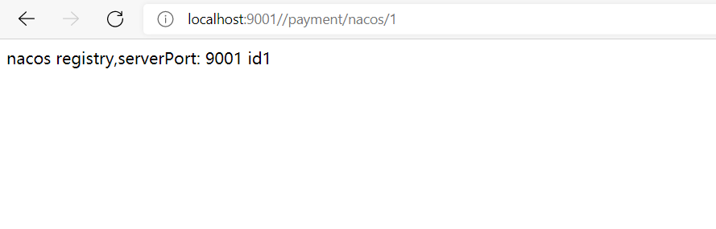
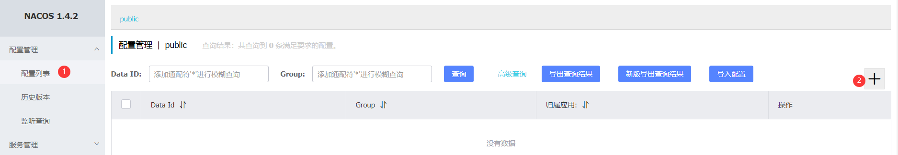
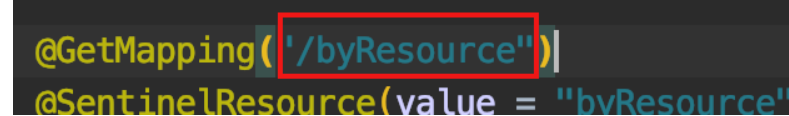
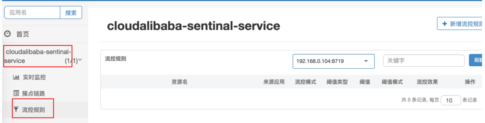

# ①Spring Cloud Alibaba 入门简介

-  Spring Cloud Alibaba 致力于提供微服务开发的一站式解决方案。此项目包含开发分布式应用微服务的必需组件，方便开发者通过 Spring Cloud 编程模型轻松使用这些组件来开发分布式应用服务
-  依托 Spring Cloud Alibaba，您只需要添加一些注解和少量配置，就可以将 Spring Cloud 应用接入阿里微服务解决方案，通过阿里中间件来迅速搭建分布式应用系统 
-  由于Spring Cloud Netflix进入维护模式，2018.10.31，Spring Cloud Alibaba 正式入驻了Spring Cloud官方孵化器，并在Maven 中央库发布了第一个版本 

**Spring Cloud Alibaba能干嘛**

- **服务限流降级**：默认支持 WebServlet、WebFlux, OpenFeign、RestTemplate、Spring Cloud Gateway, Zuul, Dubbo 和 RocketMQ 限流降级功能的接入，可以在运行时通过控制台实时修改限流降级规则，还支持查看限流降级 Metrics 监控。
- **服务注册与发现**：适配 Spring Cloud 服务注册与发现标准，默认集成了 Ribbon 的支持。
- **分布式配置管理**：支持分布式系统中的外部化配置，配置更改时自动刷新。
- **消息驱动能力**：基于 Spring Cloud Stream 为微服务应用构建消息驱动能力。
- **分布式事务**：使用 @GlobalTransactional 注解， 高效并且对业务零侵入地解决分布式事务问题。
- **阿里云对象存储**：阿里云提供的海量、安全、低成本、高可靠的云存储服务。支持在任何应用、任何时间、任何地点存储和访问任意类型的数据。
- **分布式任务调度**：提供秒级、精准、高可靠、高可用的定时（基于 Cron 表达式）任务调度服务。同时提供分布式的任务执行模型，如网格任务。网格任务支持海量子任务均匀分配到所有 Worker（schedulerx-client）上执行。
- **阿里云短信服务**：覆盖全球的短信服务，友好、高效、智能的互联化通讯能力，帮助企业迅速搭建客户触达通道

**依赖管理**

 如果需要使用已发布的版本，在 `dependencyManagement` 中添加如下配置 

```xml
<dependencyManagement>
    <dependencies>
        <dependency>
            <groupId>com.alibaba.cloud</groupId>
            <artifactId>spring-cloud-alibaba-dependencies</artifactId>
            <version>2.1.1.BUILD-SNAPSHOT</version>
            <type>pom</type>
            <scope>import</scope>
        </dependency>
    </dependencies>
</dependencyManagement>
```

 然后在 `dependencies` 中添加自己所需使用的依赖即可使用 

**组件**

- **[Nacos](https://github.com/alibaba/Nacos)**：一个更易于构建云原生应用的动态服务发现、配置管理和服务管理平台。

- **[Dubbo](https://github.com/apache/dubbo)**：Apache Dubbo™ 是一款高性能 Java RPC 框架。

-  **[Sentinel](https://github.com/alibaba/Sentinel)**：把流量作为切入点，从流量控制、熔断降级、系统负载保护等多个维度保护服务的稳定性。
- **[RocketMQ](https://rocketmq.apache.org/)**：一款开源的分布式消息系统，基于高可用分布式集群技术，提供低延时的、高可靠的消息发布与订阅服务。
-  **[Seata](https://github.com/seata/seata)**：阿里巴巴开源产品，一个易于使用的高性能微服务分布式事务解决方案。
- **[Alibaba Cloud OSS](https://www.aliyun.com/product/oss)**: 阿里云对象存储服务（Object Storage Service，简称 OSS），是阿里云提供的海量、安全、低成本、高可靠的云存储服务。您可以在任何应用、任何时间、任何地点存储和访问任意类型的数据。
- **[Alibaba Cloud SchedulerX](https://help.aliyun.com/document_detail/43136.html)**: 阿里中间件团队开发的一款分布式任务调度产品，提供秒级、精准、高可靠、高可用的定时（基于 Cron 表达式）任务调度服务。
- **[Alibaba Cloud SMS](https://www.aliyun.com/product/sms)**: 覆盖全球的短信服务，友好、高效、智能的互联化通讯能力，帮助企业迅速搭建客户触达通道。

> 官网： https://spring.io/projects/spring-cloud-alibaba#overview
>
> 英文：https://github.com/alibaba/spring-cloud-alibaba
>
> https://spring-cloud-alibaba-group.github.io/github-pages/greenwich/spring-cloud-alibaba.html
>
> 中文：https://github.com/alibaba/spring-cloud-alibaba/blob/master/README-zh.md

# ② SpringBoot、SpringCloud、SpringCloudAlibaba版本对应关系

由于Spring Cloud基于Spring Boot构建，而Spring Cloud Alibaba又基于Spring Cloud Common的规范实现，所以当我们使用``Spring Cloud Alibaba`来构建微服务应用的时候，需要知道这三者之间的版本关系。

下表整理了目前Spring Cloud Alibaba的版本与Spring Boot、Spring Cloud版本的兼容关系：


**Spring Cloud Alibaba与组件版本关系**


# ③ Nacos 【服务中心和配置中心】

## 2.1 Nacos 简介和安装

>  前四个字母分别为Naming和Configuration的前两个字母，最后的s为Service 

**Nacos是什么**

**专业术语**： `一个更易于构建云原生应用的动态服务发现、配置管理和服务管理平台。`
				 `Nacos：Dynamic Naming and Configuration Service`
**简单的说**：`Nacos就是 注册中心 + 配置中心的组合`
				 `Nacos = Eureka + Config + Bus` 

**作用**：能替代eureka做服务注册中心、能替代config做服务配置中心

-----

官方文档： https://nacos.io/zh-cn/index.html
学习手册：https://spring-cloud-alibaba-group.github.io/github-pages/greenwich/spring-cloud-alibaba.html#_spring_cloud_alibaba_nacos_config

下载地址： [Release 1.4.2 (Apr 29th, 2021) · alibaba/nacos (github.com)](https://github.com/alibaba/nacos/releases/tag/1.4.2) 

-----

**各注册中心的对比**


----

**安装**

- 先从官网下载Nacos
- 解压安装包，直接运行bin目录下的startup.cmd
  - 如果启动失败就使用  **startup.cmd -m standalone** 命令启动， 因为默认启动是cluster模式，我们带参数改为单机版启动就行 
- 运行成功后访问http://localhost:8848/nacos
- 登录页面的账号密码全为nacos


## 2.2 Nacos作为服务注册中心

### 2.2.1 基于Nacos的服务提供者

- 新建项目父项目springcloud_alibaba
- 导入父依赖

```xml
<?xml version="1.0" encoding="UTF-8"?>
<project xmlns="http://maven.apache.org/POM/4.0.0"
         xmlns:xsi="http://www.w3.org/2001/XMLSchema-instance"
         xsi:schemaLocation="http://maven.apache.org/POM/4.0.0 http://maven.apache.org/xsd/maven-4.0.0.xsd">
    <modelVersion>4.0.0</modelVersion>

    <groupId>cn.cvzhanshi</groupId>
    <artifactId>springcloud_alibaba</artifactId>
    <version>1.0-SNAPSHOT</version>

    <packaging>pom</packaging>


    <properties>
        <project.build.sourceEncoding>UTF-8</project.build.sourceEncoding>
        <maven.compiler.source>1.8</maven.compiler.source>
        <maven.compiler.target>1.8</maven.compiler.target>
        <junit.version>4.12</junit.version>
        <log4j.version>1.2.17</log4j.version>
        <lombok.version>1.18.12</lombok.version>
    </properties>

    <dependencyManagement>
        <dependencies>
            <!--springCloud的依赖-->
            <!-- https://mvnrepository.com/artifact/org.springframework.cloud/spring-cloud-dependencies -->
            <dependency>
                <groupId>org.springframework.cloud</groupId>
                <artifactId>spring-cloud-dependencies</artifactId>
                <version>Hoxton.SR3</version>
                <type>pom</type>
                <scope>import</scope>
            </dependency>

            <!--spring cloud alibaba 2.2.1.RELEASE-->
            <dependency>
                <groupId>com.alibaba.cloud</groupId>
                <artifactId>spring-cloud-alibaba-dependencies</artifactId>
                <version>2.2.1.RELEASE</version>
                <type>pom</type>
                <scope>import</scope>
            </dependency>

            <!--SpringBoot-->
            <dependency>
                <groupId>org.springframework.boot</groupId>
                <artifactId>spring-boot-dependencies</artifactId>
                <version>2.2.5.RELEASE</version>
                <type>pom</type>
                <scope>import</scope>
            </dependency>
            <!--数据库-->
            <dependency>
                <groupId>mysql</groupId>
                <artifactId>mysql-connector-java</artifactId>
                <version>5.1.47</version>
            </dependency>
            <!-- https://mvnrepository.com/artifact/com.alibaba/druid -->
            <dependency>
                <groupId>com.alibaba</groupId>
                <artifactId>druid</artifactId>
                <version>1.2.6</version>
            </dependency>
            <!--SpringBoot 启动器-->
            <!-- https://mvnrepository.com/artifact/org.mybatis.spring.boot/mybatis-spring-boot-starter -->
            <dependency>
                <groupId>org.mybatis.spring.boot</groupId>
                <artifactId>mybatis-spring-boot-starter</artifactId>
                <version>2.1.3</version>
            </dependency>

            <!--日志测试~-->
            <dependency>
                <groupId>ch.qos.logback</groupId>
                <artifactId>logback-core</artifactId>
                <version>1.2.3</version>
            </dependency>
            <dependency>
                <groupId>junit</groupId>
                <artifactId>junit</artifactId>
                <version>${junit.version}</version>
            </dependency>
            <dependency>
                <groupId>log4j</groupId>
                <artifactId>log4j</artifactId>
                <version>${log4j.version}</version>
            </dependency>
            <dependency>
                <groupId>org.projectlombok</groupId>
                <artifactId>lombok</artifactId>
                <version>${lombok.version}</version>
            </dependency>
        </dependencies>
    </dependencyManagement>
    <build>
        <plugins>
            <plugin>
                <groupId>org.springframework.boot</groupId>
                <artifactId>spring-boot-maven-plugin</artifactId>
                <configuration>
                    <fork>true</fork>
                    <addResources>true</addResources>
                </configuration>
            </plugin>
        </plugins>
    </build>
</project>
```

- 新建模块springcloudalibaba-provider-payment9001服务提供者
- 导入依赖

```xml
<!--本pom.xml引入nacos-->
<dependencies>
    <!--springcloud alibaba nacos-->
    <dependency>
        <groupId>com.alibaba.cloud</groupId>
        <artifactId>spring-cloud-starter-alibaba-nacos-discovery</artifactId>
    </dependency>
    <dependency>
        <groupId>org.springframework.boot</groupId>
        <artifactId>spring-boot-starter-web</artifactId>
    </dependency>
    <dependency>
        <groupId>org.springframework.boot</groupId>
        <artifactId>spring-boot-starter-actuator</artifactId>
    </dependency>
    <dependency>
        <groupId>org.projectlombok</groupId>
        <artifactId>lombok</artifactId>
        <optional>true</optional>
    </dependency>
    <dependency>
        <groupId>org.springframework.boot</groupId>
        <artifactId>spring-boot-devtools</artifactId>
        <scope>runtime</scope>
        <optional>true</optional>
    </dependency>
    <dependency>
        <groupId>org.springframework.boot</groupId>
        <artifactId>spring-boot-starter-test</artifactId>
        <scope>test</scope>
    </dependency>
</dependencies>
```

- 编写配置文件application.yaml

```yaml
server:
  port: 9001

spring:
  application:
    name: nacos-payment-provider
  cloud:
    nacos:
      discovery:
        server-addr: localhost:8848 #配置Nacos地址

management:
  endpoints:
    web:
      exposure:
        include: '*'  #监控
```

- 主启动类

```java
/**
 * @author cVzhanshi
 * @create 2021-07-01 15:15
 */
@SpringBootApplication
@EnableDiscoveryClient
public class PaymentMain9001 {
    public static void main(String[] args) {
        SpringApplication.run(PaymentMain9001.class,args);
    }
}
```

- 业务类

```java
/**
 * @author cVzhanshi
 * @create 2021-07-01 15:16
 */
@RestController
public class PaymentController {

    @Value("${server.port}")
    private String serverPort;

    @GetMapping("/payment/nacos/{id}")
    public String getPayment(@PathVariable("id") Integer id){
        return "nacos registry,serverPort: "+ serverPort+"\t id"+id;
    }
}
```

- 运行nacos和9001模块


- 测试业务



- 添加模块9002和9001除了端口其他一样，为了测试负载均衡，启动9002后就发现一个服务下有两个实例


### 2.2.2 基于Nacos的服务消费者

- 新建服务消费者模块springcloud-consumer-nacos-order83，导入依赖

```xml
<dependencies>
    <dependency>
        <groupId>com.alibaba.cloud</groupId>
        <artifactId>spring-cloud-starter-alibaba-nacos-discovery</artifactId>
    </dependency>
    <dependency>
        <groupId>org.springframework.boot</groupId>
        <artifactId>spring-boot-starter-web</artifactId>
    </dependency>
    <dependency>
        <groupId>org.springframework.boot</groupId>
        <artifactId>spring-boot-starter-actuator</artifactId>
    </dependency>
    <dependency>
        <groupId>org.projectlombok</groupId>
        <artifactId>lombok</artifactId>
        <optional>true</optional>
    </dependency>
    <dependency>
        <groupId>org.springframework.boot</groupId>
        <artifactId>spring-boot-starter-test</artifactId>
        <scope>test</scope>
    </dependency>
</dependencies>
```

- 编写配置文件

```yaml
server:
  port: 83

spring:
  application:
    name: nacos-order-consumer
  cloud:
    nacos:
      discovery:
        server-addr: localhost:8848

#消费者将要去访问的微服务名称（成功注册进nacos的微服务提供者），在这配置了访问的服务，业务类就不用在定义常量了
service-url:
  nacos-user-service: http://nacos-payment-provider
```

- 主启动类
- 因为nacos自动集成了Ribbon，所以配置restTemplate

```java
/**
 * @author cVzhanshi
 * @create 2021-07-01 16:37
 */
@Configuration
public class ApplicationContextConfig {

    @Bean
    @LoadBalanced//负载均衡
    public RestTemplate getRestTemplate(){
        return new RestTemplate();
    }
}
```

- 主启动类

```java
/**
 * @author cVzhanshi
 * @create 2021-07-03 16:22
 */
@SpringBootApplication
public class OrderNacosMain83 {
    public static void main(String[] args) {
        SpringApplication.run(OrderNacosMain83.class,args);
    }
}
```

- 业务类

```java
/**
 * @author cVzhanshi
 * @create 2021-07-01 16:39
 */
@RestController
public class OrderNacosController {
    /*
    因为在yaml中配置了service-url.nacos-user-service，
    这里不需要再定义要访问微服务名常量，而是通过boot直接读出来
     */
    @Value("${service-url.nacos-user-service}")
    private String serverURL;

    @Resource
    private RestTemplate restTemplate;

    @GetMapping("/consumer/payment/nacos/{id}")
    public String paymentInfo(@PathVariable("id") Long id){
        return restTemplate.getForObject(serverURL+"/payment/nacos/"+id,String.class);
    }
}
```

- 测试


发现一个消费者两个服务实例


### 2.2.3 服务注册中心的对比


Nacos 支持AP 和 CP模式的转换

C是所有节点在同一时间看到的数据是一致的；而A的定义是所有的请求都会受到响应。

何时选择使用何种模式？

一般来说，如果不需要存储服务级别的信息且服务实例是通过nacos-client注册，并能够保持心跳上报，那么就可以选择AP模式。当前主流的服务如SpringCloud和Dubbo服务，都适用与AP模式，AP模式为了服务的可能性而减弱了一致性，因此AP模式下只支持注册临时实例。

如果需要在服务级别编辑或存储配置信息，那么CP是必须，K8S服务和DNS服务则适用于CP模式。CP模式下则支持注册持久化实例，此时则是以Raft协议为集群运行模式，该模式下注册实例之前必须先注册服务，如果服务不出存在，则会返回错误。

用下面命令切换
`curl -X PUT '$NACOS_SERVER:8848/nacos/v1/ns/operator/switches?entry=serverMode&value=CP`

## 2.3 Nacos作为服务配置中心

### 2.3.1 基础配置

- 新建模块springcloudalibaba-config-nacos-client3377，导入依赖

```xml
<dependencies>
    <dependency>
        <groupId>com.alibaba.cloud</groupId>
        <artifactId>spring-cloud-starter-alibaba-nacos-config</artifactId>
    </dependency>
    <dependency>
        <groupId>com.alibaba.cloud</groupId>
        <artifactId>spring-cloud-starter-alibaba-nacos-discovery</artifactId>
    </dependency>
    <dependency>
        <groupId>org.springframework.boot</groupId>
        <artifactId>spring-boot-starter-web</artifactId>
    </dependency>
    <dependency>
        <groupId>org.springframework.boot</groupId>
        <artifactId>spring-boot-starter-actuator</artifactId>
    </dependency>
    <dependency>
        <groupId>org.projectlombok</groupId>
        <artifactId>lombok</artifactId>
        <optional>true</optional>
    </dependency>
    <dependency>
        <groupId>org.springframework.boot</groupId>
        <artifactId>spring-boot-starter-test</artifactId>
        <scope>test</scope>
    </dependency>
</dependencies>
```

- 编写配置文件 bootstrap.yaml 和 application.yaml 

**bootstrap.yaml** 

```yaml
#bootstrap.xml
server:
  port: 3377

spring:
  application:
    name: nacos-config-client
  cloud:
    nacos:
      discovery:
        server-addr: localhost:8848 #Nacos服务注册中心地址
      config:
        server-addr: localhost:8848 #Nacos作为配置中心地址
        file-extension: yaml  #指定yaml格式的配置

# ${spring.application.name}-${spring.profile.active}.${spring.cloud.nacos.config.file.extension}
# nacos-config-client-dev.yaml

```

**application.yaml**

```yaml
#application.yml
spring:
  profiles:
    active: dev #开发环境
```

- 主启动类

```java
/**
 * @author cVzhanshi
 * @create 2021-07-03 16:52
 */
@SpringBootApplication
@EnableDiscoveryClient
public class NacosConfigClientMain3377 {
    public static void main(String[] args) {
        SpringApplication.run(NacosConfigClientMain3377.class,args);
    }
}
```

- 在Nacos中添加配置信息

>  Nacos中的匹配规则 
>
>  **${prefix}-${spring.profiles.active}.${file-extension}** 
>
> - `prefix` 默认为 `spring.application.name` 的值，也可以通过配置项 `spring.cloud.nacos.config.prefix`来配置。
> - `spring.profiles.active` 即为当前环境对应的 profile。 **注意：当 `spring.profiles.active` 为空时，对应的连接符 `-` 也将不存在，dataId 的拼接格式变成 `${prefix}.${file-extension}`**
> - `file-exetension` 为配置内容的数据格式，可以通过配置项 `spring.cloud.nacos.config.file-extension` 来配置。目前只支持 `properties` 和 `yaml` 类型。





- 运行测试 ，访问 http://localhost:3377/config/info 


- 修改nacos中的配置，客户端不重新启动，测试实时更新


### 2.3.2 分类配置

> 问题1：
> 实际开发中，通常一个系统会准备dev开发环境、test测试环境、prod生产环境，如何保证指定环境启动时服务能正确读取到Nacos上相应环境的配置文件呢？
> 问题2：
> 一个大型分布式微服务系统会有很多微服务子项目，每个微服务项目又会有相应的开发环境、测试环境、预发环境、正式环境…那怎么对这些微服务配置进行管理呢？

**Namespace + Group + Data ID三者关系** ：

类似Java中的package名和类名
最外层的namespace是可以用于区分部署环境的，Group和DataID逻辑上区分两个目标对象 


默认情况：
Namespace=public，Group=DEFAULT_GROUP，默认Cluster是DEFAULT

Nacos默认的命名空间是public，Namespace主要用来实现隔离
比方说我们现在有三个环境：开发、测试、生产环境，我们就可以创建三个Namespace，不同的Namespace之间是隔离的。

Group默认是DEFAULT_GROUP，Group可以把不同的微服务划分到同一个分组里面去

Service就是微服务，一个Service可以包含多个Cluster（集群）,Nacos默认Cluster是DEFAULT，Cluster是对指定微服务的一个虚拟划分
比方说为了容灾，将Service微服务分别部署在了杭州机房和广州机房，这时就可以给杭州机房的Service微服务起一个集群名称（HZ）给广州机房的Service微服务起一个集群名称（GZ），还可以尽量让同一个机房的微服务互相调用，以提升性能。

最后是Instance，就是微服务的实例。


 **三种方案加载配置** 

-  **DataID方案配置**：指定spring.profile.active和配置文件的DataID来使不同环境下读取不同的配置 
  -  默认空间 + 默认分组 + 新建dev和test两个DataID 

  
  -  通过spring.profile.active属性就能进行多环境下配置文件的读取 

  

-  **Group方案：通过Group实现环境区分** 

  - 创建两个分组

  
  -  bootstrap 和 application配置修改 

  **bootstrap** 

  ```YAML
  #bootstrap.yaml
  spring:
    application:
      name: nacos-config-client
    cloud:
      nacos:
        discovery:
          server-addr: localhost:8848 #Nacos服务注册中心地址
        config:
          server-addr: localhost:8848 #Nacos作为配置中心地址
          file-extension: yaml  #指定yaml格式的配置
          group: DEV_GROUP
  ```

  **application**

  ```yaml
  #application.yml
  spring:
    profiles:
      active: info #开发环境
  ```

  - 测试

  

  - 修改分组，再测试

  

-  **Namespace方案：** 

  - 新建命名空间

  
  

  - 在新建的命名空间中创建配置文件

  

  - 修改配置文件

   **bootstrap.yaml**

  ```yaml
  #bootstrap.xml
  spring:
    application:
      name: nacos-config-client
    cloud:
      nacos:
        discovery:
          server-addr: localhost:8848 #Nacos服务注册中心地址
        config:
          server-addr: localhost:8848 #Nacos作为配置中心地址
          file-extension: yaml  #指定yaml格式的配置
          group: TEST_GROUP
          namespace: d5105f8e-f24f-4cd8-a6a4-b3c88bdd824e
  ```

  **application.yaml**

  ```yaml
  #application.yml
  spring:
    profiles:
      active: dev #开发环境
  ```

  - 测试

  

  ​	

  

> 由此我们可以通过配置文件中的namespace、group、active来选择要读取的nacos中的配置文件

## 2.4 Nacos 集群和持久化

### 2.4.1 集群和持久化的简介


**自己准备搭建集群的结构图**


默认Nacos使用嵌入式数据库（derby）实现数据的存储。所以，如果启动多个默认配置下的Nacos节点，数据存储是存在一致性问题的。
为了解决这个问题，Nacos采用了集中式存储的方式来支持集群化部署，目前只支持Mysql的存储 

Nacos支持三种部署模式
https://nacos.io/zh-cn/docs/deployment.html

1. 单机模式：用于测试和单机试用
2. 集群模式：用于生产环境，确保高可用
3. 多集群模式：用于多数据中心场景

### 2.4.2 持久化

Nacos默认自带的是嵌入式数据库derby
derby到mysql切换配置步骤：

- nacos-server-1.1.4\nacos\conf 目录下执行sql脚本 `nacos-mysql.sql`
- nacos-server-1.1.4\nacos\conf 目录下找到`application.properties`，添加配置：

```properties
spring.datasource.platform=mysql
db.num=1
db.url.0=jdbc:mysql://127.0.0.1:3306/nacos_config?characterEncoding=utf8&connectTimeout=1000&socketTimeout=3000&autoReconnect=true
db.user=xxx
db.password=xxx
```

### 2.4.3 Linux搭建Nacos集群

**Linux安装nacos**

- 在官网上下载好安装包，上传到linux上


- 解压安装包

```bash
tar -zxvf nacos-server-1.1.4.tar.gz
```

- 把解压出来的文件夹复制到/mynacos文件夹中(个人习惯，不动源文件)

```bash
[root@cVzhanshi opt]# cp -r nacos /mynacos/
```

- 进入/mynacos/nacos/bin目录中，备份启动文件


**重点：集群的配置**

- **Linux服务器上MySQL数据库配置**

> 在服务器的mysql，新建数据库nacos_config，如何在nacos解压文件的conf下有sql脚本nacos-mysql.sql，执行即可


- **application.properties的配置**

> 先备份application.properties
>
> ```bash
> cp application.properties application.properties.bf
> ```
>
> vim这个文件，添加以下内容
>
> ```bash
> spring.datasource.platform=mysql
> 
> db.num=1
> db.url.0=jdbc:mysql://127.0.0.1:3306/nacos_config?characterEncoding=utf8&connectTimeout=1000&socketTimeout=3000&autoReconnect=true
> db.user=root
> db.password.0=123456
> ```

- **Linux服务器上nacos的集群配置cluster. conf**

> 老套路，先备份
>
> ```bash
> cp cluster.conf.example cluster.conf
> ```
>
> 文件内容修改如下，其中文件中的ip是hostname -i 能识别的ip
>
> ```bash
> 192.168.242.110:3333
> 192.168.242.110:4444
> 192.168.242.110:5555
> ```

- **编辑Nacos的启动脚本startup.sh，使它能够接受不同的启动端口**

修改内容如下


- **Nginx的配置，由它作为负载均衡器**

> 修改内容如下，路径用whereis nginx查看，其中的conf/nginx.conf
>
> 
>
> 

**测试**

- 先启动3个nacaos


查询有三个nacos启动成功


- 启动nginx

```bash
./nginx -c /usr/local/nginx/conf/nginx.conf
```

- 浏览器访问nacos


- 登录进去新建一个配置然后查询数据库看看是否有记录添加


- 项目中配置nacos，看看项目服务能不能注册进入nacos集群中


**集群搭建完成**

# ④ Sentinel 【熔断与限流】

## 4.1 Sentinel简介

> 分布式系统的流量防卫兵
>
>  官网：https://github.com/alibaba/Sentinel 

随着微服务的流行，服务和服务之间的稳定性变得越来越重要。Sentinel 以流量为切入点，从流量控制、熔断降级、系统负载保护等多个维度保护服务的稳定性。 

**Sentinel 具有以下特征**:

- **丰富的应用场景**：Sentinel 承接了阿里巴巴近 10 年的双十一大促流量的核心场景，例如秒杀（即突发流量控制在系统容量可以承受的范围）、消息削峰填谷、集群流量控制、实时熔断下游不可用应用等。
- **完备的实时监控**：Sentinel 同时提供实时的监控功能。您可以在控制台中看到接入应用的单台机器秒级数据，甚至 500 台以下规模的集群的汇总运行情况。
- **广泛的开源生态**：Sentinel 提供开箱即用的与其它开源框架/库的整合模块，例如与 Spring Cloud、Dubbo、gRPC 的整合。您只需要引入相应的依赖并进行简单的配置即可快速地接入 Sentinel。
- **完善的 SPI 扩展点**：Sentinel 提供简单易用、完善的 SPI 扩展接口。您可以通过实现扩展接口来快速地定制逻辑。例如定制规则管理、适配动态数据源等。

 **Sentinel 的主要特性**:


**Sentinel 分为两个部分:**

- 核心库（Java 客户端）不依赖任何框架/库，能够运行于所有 Java 运行时环境，同时对 Dubbo / Spring Cloud 等框架也有较好的支持。
- 控制台（Dashboard）基于 Spring Boot 开发，打包后可以直接运行，不需要额外的 Tomcat 等应用容器。

**Sentinel的下载与安装**

- 下载地址 [Releases · alibaba/Sentinel (github.com)](https://github.com/alibaba/Sentinel/releases) 


- 进入文件目录直接运行jar包就行(运行命令为: java -jar xxxx.jar)


-  访问sentinel管理界面  (localhost:8080/)


- 账号密码全为sentinel


- 安装完成

## 4.2 初始化监控

- 新建模块springcloudalibaba-sentinel-service8401，导入依赖

```xml
<!--pom.xml依赖-->
<dependencies>
    <!--springcloud alibaba nacos-->
    <dependency>
        <groupId>com.alibaba.cloud</groupId>
        <artifactId>spring-cloud-starter-alibaba-nacos-discovery</artifactId>
    </dependency>
    <!--springcloud alibaba sentinel-datasource-nacos 后续做持久化用到-->
    <dependency>
        <groupId>com.alibaba.csp</groupId>
        <artifactId>sentinel-datasource-nacos</artifactId>
    </dependency>
    <!--springcloud alibaba sentinel-->
    <dependency>
        <groupId>com.alibaba.cloud</groupId>
        <artifactId>spring-cloud-starter-alibaba-sentinel</artifactId>
    </dependency>
    <dependency>
        <groupId>org.springframework.cloud</groupId>
        <artifactId>spring-cloud-starter-openfeign</artifactId>
    </dependency>
    <dependency>
        <groupId>org.springframework.boot</groupId>
        <artifactId>spring-boot-starter-web</artifactId>
    </dependency>
    <dependency>
        <groupId>org.springframework.boot</groupId>
        <artifactId>spring-boot-starter-actuator</artifactId>
    </dependency>
    <dependency>
        <groupId>org.projectlombok</groupId>
        <artifactId>lombok</artifactId>
        <optional>true</optional>
    </dependency>
    <dependency>
        <groupId>org.springframework.boot</groupId>
        <artifactId>spring-boot-starter-test</artifactId>
        <scope>test</scope>
    </dependency>
</dependencies>
```

- 编写配置文件

```yaml
#yml配置
server:
  port: 8401

spring:
  application:
    name: springcloudalibaba-sentinel-service
  cloud:
    nacos:
      discovery:
        #Nacos服务注册中心地址
        server-addr: localhost:8848
    sentinel:
      transport:
        #配置sentinel dashboard地址
        dashboard: localhost:8080
        #默认8719端口，假如被占用会自动从8719开始依次+1扫描，直至找到未被占用的端口
        port: 8719

management:
  endpoints:
    web:
      exposure:
        include: '*'
```

- 主启动类

```java
/**
 * @author cVzhanshi
 * @create 2021-07-04 14:23
 */
@SpringBootApplication
@EnableDiscoveryClient
public class MainApp8401 {
    public static void main(String[] args) {
        SpringApplication.run(MainApp8401.class,args);
    }
}
```

- 业务类

```java
/**
 * @author cVzhanshi
 * @create 2021-07-04 14:26
 */
@RestController
public class FlowLimitController {
    @GetMapping("/testA")
    public String testA(){
        return "--------testA";
    }

    @GetMapping("/testB")
    public String testB(){
        return "--------testB";
    }
}
```

- 测试

  - 启动nacos8848
  - 启动Sentinel8080
  - 启动微服务8401
  - 打开sentinel控制台发现控制台空空如也

  

  > sentinel采用的是懒加载，需要执行一次请求才能在控制台显示监控的服务

  - 访问一次请求后查看控制台

  

  

## 4.2 流控

### 4.2.1 基本介绍

- **资源名**：唯一名称，默认请求路径
- **针对来源**：Sentinel可以针对调用者 进行限流，填写微服务名，默认default (不区分来源)
- **阈值类型/单机阈值**：
  - QPS (每秒钟的请求数量) ：当调用该api的QPS达到阈值的时候，进行限流
  - 线程数：当调用该api的线程数达到阈值的时候，进行限流
- **是否集群**：不需要集群，暂不研究
- **流控模式**:
  - 直接：api达到限流条件时，直接限流
  - 关联：当关联的资源达到阈值时，就限流自己
  - 链路：只记录指定链路上的流量(指定资源从入口资源进来的流量，如果达到阈值，就进行限流) [api级
    别的针对来源]
- **流控效果**:
  - 快速失败：直接失败，抛异常.
  - Warm Up：根据codeFactor (冷 加载因子，默认3)的值，从阈值/codeFactor, 经过预热时长，才达到设置的QPS阈值
  - 排队等待：匀速排队，让请求以匀速的速度通过，阈值类型必须设置为QPS,否则无效

**修改流控的地方**

一、

二、

例如：


访问/testA,并刷新就会出现错误


### 4.2.2 流控模式

- **流控模式**:
  - 直接：api达到限流条件时，直接限流
  - 关联：当关联的资源达到阈值时，就限流自己
  - 链路：只记录指定链路上的流量(指定资源从入口资源进来的流量，如果达到阈值，就进行限流) [api级
    别的针对来源]

**直接**

> 当资源访问达到阈值时就直接限流自己

**关联**

> 当关联的资源达到阈值时，就限流自己。类似于当与A关联的资源B达到阈值后，就限流A。
>
> 即，B惹事，A挂了

### 4.2.3 流控效果

- **流控效果**:
  - 快速失败：直接失败，抛异常.
  - Warm Up：根据codeFactor (冷加载因子，默认3)的值，从阈值/codeFactor, 经过预热时长，才达到设置的QPS阈值
  - 排队等待：匀速排队，让请求以匀速的速度通过，阈值类型必须设置为QPS,否则无效

**快速失败**

> 直接失败，抛出异常

**Warm up**


测试，新建流控规则


>  然后输入`http://localhost:8401/testA`，不停刷新，前5秒会限流，5秒后只要每秒不超过10个请求，就不会限流 

**排队等待**


-----


> postman发起的每秒10个请求进行排队，testB每秒处理一个请求,请求都进行排队

## 4.3 降级

### 4.3.1 降级策略概述

Sentinel 提供以下几种熔断策略：

- **慢调用比例** (`SLOW_REQUEST_RATIO`)：选择以慢调用比例作为阈值，需要设置允许的慢调用 RT（即最大的响应时间），请求的响应时间大于该值则统计为慢调用。当单位统计时长（`statIntervalMs`）内请求数目大于设置的最小请求数目，并且慢调用的比例大于阈值，则接下来的熔断时长内请求会自动被熔断。经过熔断时长后熔断器会进入探测恢复状态（HALF-OPEN 状态），若接下来的一个请求响应时间小于设置的慢调用 RT 则结束熔断，若大于设置的慢调用 RT 则会再次被熔断。
- **异常比例** (`ERROR_RATIO`)：当单位统计时长（`statIntervalMs`）内请求数目大于设置的最小请求数目，并且异常的比例大于阈值，则接下来的熔断时长内请求会自动被熔断。经过熔断时长后熔断器会进入探测恢复状态（HALF-OPEN 状态），若接下来的一个请求成功完成（没有错误）则结束熔断，否则会再次被熔断。异常比率的阈值范围是 `[0.0, 1.0]`，代表 0% - 100%。
- **异常数** (`ERROR_COUNT`)：当单位统计时长内的异常数目超过阈值之后会自动进行熔断。经过熔断时长后熔断器会进入探测恢复状态（HALF-OPEN 状态），若接下来的一个请求成功完成（没有错误）则结束熔断，否则会再次被熔断。


> Sentinel熔断降级会在调用链路中某个资源出现不稳定状态时(例如调用超时或异常比例升高)，对这个资源的调用进行限制,让请求快速失败，避免影响到其它的资源而导致级联错误。
>
> 当资源被降级后，在接下来的降级时间窗口之内，对该资源的调用都自动熔断(默认行为是抛出DegradeException).

### 4.3.2 降级策略 RT( 慢调用比例 )

> **慢调用比例** (`SLOW_REQUEST_RATIO`)：选择以慢调用比例作为阈值，需要设置允许的慢调用 RT（即最大的响应时间），请求的响应时间大于该值则统计为慢调用。当单位统计时长（`statIntervalMs`）内请求数目大于设置的最小请求数目，并且慢调用的比例大于阈值，则接下来的熔断时长内请求会自动被熔断。经过熔断时长后熔断器会进入探测恢复状态（HALF-OPEN 状态），若接下来的一个请求响应时间小于设置的慢调用 RT 则结束熔断，若大于设置的慢调用 RT 则会再次被熔断


**测试**

- 在controller中添加

```java
@GetMapping("/testD")
public String testD() {
    try {
        TimeUnit.SECONDS.sleep(1);
    } catch (InterruptedException e) {
        e.printStackTrace();
    }
    System.out.println("testD 测试RT");
    return "----testD";
}
```

-  启动8401，在浏览器输入`http://localhost:8401/testD`，然后在sentinel设置testD降级规则


### 4.3.3 降级策略 异常比例

> **异常比例** (`ERROR_RATIO`)：当单位统计时长（`statIntervalMs`）内请求数目大于设置的最小请求数目，并且异常的比例大于阈值，则接下来的熔断时长内请求会自动被熔断。经过熔断时长后熔断器会进入探测恢复状态（HALF-OPEN 状态），若接下来的一个请求成功完成（没有错误）则结束熔断，否则会再次被熔断。异常比率的阈值范围是 `[0.0, 1.0]`，代表 0% - 100%。


- 在controller中添加

```java
@GetMapping("/testE")
public String testE() {
    int age = 10 / 0;   //百分百出错
    System.out.println("testE 测试 异常比例");
    return "----testD";
}
```

- 编辑降级规则


- 结果，刚开始第一次访问的时候回报错


- 继续范围，有异常的话会降级熔断


- 等设定的降级时间过去后又恢复了报错页面


### 4.3.4 降级策略 异常数

> **异常数** (`ERROR_COUNT`)：当单位统计时长内的异常数目超过阈值之后会自动进行熔断。经过熔断时长后熔断器会进入探测恢复状态（HALF-OPEN 状态），若接下来的一个请求成功完成（没有错误）则结束熔断，否则会再次被熔断。

同异常比例一样测试

- 

- 有异常就降级熔断


## 4.4 热点参数限流

何为热点？热点即经常访问的数据。很多时候我们希望统计某个热点数据中访问频次最高的 Top K 数据，并对其访问进行限制。比如：

- 商品 ID 为参数，统计一段时间内最常购买的商品 ID 并进行限制
- 用户 ID 为参数，针对一段时间内频繁访问的用户 ID 进行限制

热点参数限流会统计传入参数中的热点参数，并根据配置的限流阈值与模式，对包含热点参数的资源调用进行限流。热点参数限流可以看做是一种特殊的流量控制，仅对包含热点参数的资源调用生效。

Sentinel 利用 LRU 策略统计最近最常访问的热点参数，结合令牌桶算法来进行参数级别的流控。热点参数限流支持集群模式。 

> **兜底方法**：分为系统默认和客户自定义两种，之前的case,限流出问题后，都是用sentinel系统默认的提示: Blocked by Sentinel (flow limiting)
> 我们能不能自定?类似hystrix,某个方法出问题了，就找对应的兜底降级方法?
>
> 结论：从HystrixCommand到@SentinelResource

**测试**

- 在controller中添加代码：

```java
@GetMapping("/testHotKey")
@SentinelResource(value = "testHotKey", blockHandler = "deal_testHotKey")
public String testHotKey(@RequestParam(value = "p1", required = false)String p1,
                         @RequestParam(value = "p2", required = false)String p2) {
    return "----testHotKey";
}

//兜底方法
public String deal_testHotKey(String p1, String p2, BlockException exception) {
    // sentinel的默认提示都是： Blocked by Sentinel (flow limiting)
    return "----deal_testHotKey, o(╥﹏╥)o";
}
```

-  重启8401，浏览器输入`http://localhost:8401/testHotKey`，然后在后台对testHotKey进行热点规则配置 


>  *如果每秒的访问请求带有索引为0的参数的数量超过1，进入统计窗口期，然后调用兜底方法，1秒后退出统计窗口期，继续处理请求。* 


>  如果设置热点规则，而@SentinelResource注解里没有指明blockHandler兜底方法，就会把直接把错误页面信息打印到前台。 


**参数例外项**

需求：我们期望p1参数当它是某个特殊值时，它的限流值和平时不一样。假如当p1的值等于5时，它的阈值可以达到200

配置：

-----


-----


>  给testHotKey方法添加`int i = 1 / 0;`异常。
> 然后重新测试，发现兜底方法不适用于异常，有异常会直接打印到页面。 


> **结论**：**@SentinelResource主管配置出错，运行出错该走异常走异常**

## 4.5 系统自适应限流

> Sentinel 系统自适应限流从整体维度对应用入口流量进行控制，结合应用的 Load、CPU 使用率、总体平均 RT、入口 QPS 和并发线程数等几个维度的监控指标，通过自适应的流控策略，让系统的入口流量和系统的负载达到一个平衡，让系统尽可能跑在最大吞吐量的同时保证系统整体的稳定性。 
>
> - 保证系统不被拖垮
> - 在系统稳定的前提下，保持系统的吞吐量
>
>  系统保护规则是应用整体维度的，而不是资源维度的，并且**仅对入口流量生效**。 

- **Load 自适应**（仅对 Linux/Unix-like 机器生效）：系统的 load1 作为启发指标，进行自适应系统保护。当系统 load1 超过设定的启发值，且系统当前的并发线程数超过估算的系统容量时才会触发系统保护（BBR 阶段）。系统容量由系统的 `maxQps * minRt` 估算得出。设定参考值一般是 `CPU cores * 2.5`。
- **CPU usage**（1.5.0+ 版本）：当系统 CPU 使用率超过阈值即触发系统保护（取值范围 0.0-1.0），比较灵敏。
- **平均 RT**：当单台机器上所有入口流量的平均 RT 达到阈值即触发系统保护，单位是毫秒。
- **并发线程数**：当单台机器上所有入口流量的并发线程数达到阈值即触发系统保护。
- **入口 QPS**：当单台机器上所有入口流量的 QPS 达到阈值即触发系统保护。

**测试**


## 4.6 @SentinelResource

### 4.6.1 按资源名称限流+后续处理


**测试**

- 在8401pom中导入依赖

```xml
<dependency>
    <groupId>cn.cvzhanshi</groupId>
    <artifactId>springcloud-api-commons</artifactId>
    <version>${project.version}</version>
</dependency>
```

- 新建 RateLimitController 

```java
/**
 * @author cVzhanshi
 * @create 2021-07-10 16:04
 */
@RestController
public class RateLimitController {
    @GetMapping("/byResource")
    @SentinelResource(value = "byResource",blockHandler = "handleException")
    public CommonResult byResource() {
        return  new CommonResult(200,"按照资源名称限流测试",new Payment(2020L,"serial001"));
    }

    //兜底方法
    public CommonResult handleException(BlockException exception) {
        return  new CommonResult(444,exception.getClass().getCanonicalName() + "\t 服务不可用");
    }
}
```

- 启动8401，访问`http://localhost:8401/byResource` 


- 对资源名新建流控


- 先单击访问`http://localhost:8401/byResource` ，然后连续点击


**其中，如果中间关闭8401模块，会发现Sentinel控制台的流控规则会消失，所以得出结论，流控规则是临时的**

### 4.6.2 按照URL地址限流+后续处理



**测试**

-  在RateLimitController中添加代码

```java
@GetMapping("/rateLimit/byUrl")
@SentinelResource(value = "byUrl")	//没有兜底方法，系统就用默认的
public CommonResult byUrl() {
    return  new CommonResult(200,"按照byUrl限流测试",new Payment(2020L,"serial002"));
}
```

-  启动8401，访问`http://localhost:8401/rateLimit/byUrl` 


- 新曾流控规则


- 继续访问`http://localhost:8401/rateLimit/byUrl` ，先单击后连续访问


**上面兜底方案面临的问题**

- 系统默认的，没有体现我们自己的业务要求。
- 依照现有条件,我们自定义的处理方法又和业务代码耦合在- -块，不直观
- 每个业务方法都添加一个兜底的，那代码膨胀加剧。
- 全局统一的处理方法没有体现

> 所以出现了提供了客户自定义限流处理逻辑

### 4.6.3 客户自定义限流处理逻辑

- 创建CustomerBlockHandler类用于自定义限流处理逻辑

```java
/**
 * @author cVzhanshi
 * @create 2021-07-10 16:16
 */
public class CustomerBlockHandler {

    public static CommonResult handlerException(BlockException exception) {
        return  new CommonResult(444,"按照客户自定义限流测试，Glogal handlerException ---- 1");
    }

    public static CommonResult handlerException2(BlockException exception) {
        return  new CommonResult(444,"按照客户自定义限流测试，Glogal handlerException ---- 2");
    }
}
```

-  在RateLimitController中添加代码

```java
//CustomerBlockHandler
@GetMapping("/rateLimit/customerBlockHandler")
@SentinelResource(value = "customerBlockHandler",
                  blockHandlerClass = CustomerBlockHandler.class, blockHandler = "handlerException2")
public CommonResult customerBlockHandler() {
    return  new CommonResult(200,"按照客户自定义限流测试",new Payment(2020L,"serial003"));
}

```

- 启动8401`http://localhost:8401/rateLimit/customerBlockHandler` 


- 配置流控规则，让兜底方法生效


> 说明：

## 4.7 服务熔断

### 4.7.1 Ribbon系列

#### 4.7.1.1 测试环境的搭建

- **新建提供者模块springcloudalibaba-provider-payment9003**，导入依赖

```xml
<dependencies>
    <!-- SpringCloud ailibaba nacos-->
    <dependency>
        <groupId>com.alibaba.cloud</groupId>
        <artifactId>spring-cloud-starter-alibaba-nacos-discovery</artifactId>
    </dependency>
    <!-- SpringCloud ailibaba sentinel-->
    <dependency>
        <groupId>com.alibaba.cloud</groupId>
        <artifactId>spring-cloud-starter-alibaba-sentinel</artifactId>
    </dependency>
    <!-- 引用自己定义的api通用包，可以使用Payment支付Entity -->
    <dependency>
        <groupId>cn.cvzhanshi</groupId>
        <artifactId>springcloud-api-commons</artifactId>
        <version>${project.version}</version>
    </dependency>
    <dependency>
        <groupId>org.springframework.cloud</groupId>
        <artifactId>spring-cloud-starter-openfeign</artifactId>
    </dependency>
    <dependency>
        <groupId>org.springframework.boot</groupId>
        <artifactId>spring-boot-starter-web</artifactId>
    </dependency>
    <!--监控-->
    <dependency>
        <groupId>org.springframework.boot</groupId>
        <artifactId>spring-boot-starter-actuator</artifactId>
    </dependency>
    <!--热部署-->
    <dependency>
        <groupId>org.springframework.boot</groupId>
        <artifactId>spring-boot-devtools</artifactId>
        <scope>runtime</scope>
        <optional>true</optional>
    </dependency>
    <dependency>
        <groupId>org.projectlombok</groupId>
        <artifactId>lombok</artifactId>
        <optional>true</optional>
    </dependency>
    <dependency>
        <groupId>org.springframework.boot</groupId>
        <artifactId>spring-boot-starter-test</artifactId>
        <scope>test</scope>
    </dependency>
</dependencies>
```

- 编写配置文件

```yaml
server:
  port: 9003

spring:
  application:
    name: nacos-payment-provider
  cloud:
    nacos:
      discovery:
        server-addr: localhost:8848 #配置Nacos地址

management:
  endpoints:
    web:
      exposure:
        include: '*'  #监控
```

- 主启动类

```java
/**
 * @author cVzhanshi
 * @create 2021-07-11 11:33
 */
@SpringBootApplication
@EnableDiscoveryClient
public class PaymentMain9003 {
    public static void main(String[] args) {
        SpringApplication.run(PaymentMain9003.class,args);
    }
}
```

- controller代码编写

```java
/**
 * @author cVzhanshi
 * @create 2021-07-01 15:16
 */
@RestController
public class PaymentController {

    @Value("${server.port}")    //spring的注解
    private  String serverPort;

    public static HashMap<Long, Payment> map = new HashMap<>();
    static {
        map.put(1L,new Payment(1L,"1111"));
        map.put(2L,new Payment(2L,"2222"));
        map.put(3L,new Payment(3L,"3333"));
    }


    @GetMapping(value = "/paymentSQL/{id}")
    public CommonResult<Payment> paymentSQL(@PathVariable("id") Long id) {
        Payment payment = map.get(id);
        CommonResult<Payment> result = new CommonResult<>(200,"from mysql,serverPort: " + serverPort,payment);
        return result;
    }
}
```

- 新建模块9004按照9003一样

- **新建消费者模块springcloudalibaba-consumer-nacos-order84**，导入依赖

```xml
<dependencies>
    <!-- SpringCloud ailibaba nacos-->
    <dependency>
        <groupId>com.alibaba.cloud</groupId>
        <artifactId>spring-cloud-starter-alibaba-nacos-discovery</artifactId>
    </dependency>
    <!-- SpringCloud ailibaba sentinel-->
    <dependency>
        <groupId>com.alibaba.cloud</groupId>
        <artifactId>spring-cloud-starter-alibaba-sentinel</artifactId>
    </dependency>
    <!-- 引用自己定义的api通用包，可以使用Payment支付Entity -->
    <dependency>
        <groupId>cn.cvzhanshi</groupId>
        <artifactId>springcloud-api-commons</artifactId>
        <version>${project.version}</version>
    </dependency>
    <dependency>
        <groupId>org.springframework.cloud</groupId>
        <artifactId>spring-cloud-starter-openfeign</artifactId>
    </dependency>
    <dependency>
        <groupId>org.springframework.boot</groupId>
        <artifactId>spring-boot-starter-web</artifactId>
    </dependency>
    <!--监控-->
    <dependency>
        <groupId>org.springframework.boot</groupId>
        <artifactId>spring-boot-starter-actuator</artifactId>
    </dependency>
    <!--热部署-->
    <dependency>
        <groupId>org.springframework.boot</groupId>
        <artifactId>spring-boot-devtools</artifactId>
        <scope>runtime</scope>
        <optional>true</optional>
    </dependency>
    <dependency>
        <groupId>org.projectlombok</groupId>
        <artifactId>lombok</artifactId>
        <optional>true</optional>
    </dependency>
    <dependency>
        <groupId>org.springframework.boot</groupId>
        <artifactId>spring-boot-starter-test</artifactId>
        <scope>test</scope>
    </dependency>
</dependencies>
```

- 编写配置文件

```yaml
server:
  port: 84

spring:
  application:
    name: nacos-order-consumer
  cloud:
    nacos:
      discovery:
        server-addr: localhost:8848
    sentinel:
      transport:
        dashboard: localhost:8080    #sentinel
        port: 8719

#消费者将要去访问的微服务名称（成功注册进nacos的微服务提供者），在这配置了访问的服务，业务类就不用在定义常量了
service-url:
  nacos-user-service: http://nacos-payment-provider
```

- 主启动类

```java
/**
 * @author cVzhanshi
 * @create 2021-07-11 12:00
 */
@SpringBootApplication
@EnableDiscoveryClient
public class OrderMain84 {
    public static void main(String[] args) {
        SpringApplication.run(OrderMain84.class,args);
    }
}
```

- config

```java
/**
 * @author cVzhanshi
 * @create 2021-07-11 12:06
 */
@Configuration
public class ApplicationContextConfig {
    @Bean
    @LoadBalanced
    public RestTemplate getRestTemplate() {
        return new RestTemplate();
    }
}
```

- controller代码的编写

```java
/**
 * @author cVzhanshi
 * @create 2021-07-11 12:01
 */
@RestController
@Slf4j
public class CircleBreakerController {

    public static  final  String SERVICE_URL = "http://nacos-payment-provider";

    @Resource
    private RestTemplate restTemplate;

    @RequestMapping("/consumer/fallback/{id}")
    @SentinelResource(value = "fallback")   //没有配置
    public CommonResult<Payment> fallback(@PathVariable Long id) {
        CommonResult<Payment> result = restTemplate.getForObject(
                SERVICE_URL + "/paymentSQL/" + id, CommonResult.class,id);

        if(id == 4){
            throw new IllegalArgumentException("IllegalArgument,非法参数异常...");
        }else if(result.getData() == null) {
            throw new NullPointerException("NullPointerException,该ID没有对应记录，空指针异常");
        }

        return  result;
    }
}
```

**运行测试**

- 启动Nacos
- 启动Sentinel
- 启动9003、9004
- 启动消费者84

- 连续访问localhost:84/consumer/fallback/1，会出现负载均衡的现象，9003、9004交替出现


- 分别访问localhost:84/consumer/fallback/4、localhost:84/consumer/fallback/5会出现错误页面


#### 4.7.1.2 只配置fallback

- 修改消费者的controller

```java
@RequestMapping("/consumer/fallback/{id}")
//@SentinelResource(value = "fallback")   //没有配置
@SentinelResource(value = "fallback",fallback ="handlerFallback")   //只配置fallback（只负责业务异常）
public CommonResult<Payment> fallback(@PathVariable Long id) {
    CommonResult<Payment> result = restTemplate.getForObject(
        SERVICE_URL + "/paymentSQL/" + id, CommonResult.class,id);

    if(id == 4){
        throw new IllegalArgumentException("IllegalArgument,非法参数异常...");
    }else if(result.getData() == null) {
        throw new NullPointerException("NullPointerException,该ID没有对应记录，空指针异常");
    }

    return  result;
}

//fallback兜底
public CommonResult handlerFallback(@PathVariable Long id,Throwable e) {
    Payment payment = new Payment(id,"null");
    return new CommonResult(444,"异常handlerFallback，exception内容： " + e.getMessage(), payment);
}
```

- 运行84模块，访问localhost:84/consumer/fallback/4或者localhost:84/consumer/fallback/5，不会出现错误页面，因为有fallback兜底方法


#### 4.7.1.3 只配置blockHandler

- 修改消费者controller

```java
@RequestMapping("/consumer/fallback/{id}")
//@SentinelResource(value = "fallback")   //没有配置
//@SentinelResource(value = "fallback",fallback ="handlerFallback")   //只配置fallback（只负责业务异常）
@SentinelResource(value = "fallback", blockHandler = "blockHandler")	//只配置blockHandler（只负责sentinel控制台配置违规）
public CommonResult<Payment> fallback(@PathVariable Long id) {
    CommonResult<Payment> result = restTemplate.getForObject(
        SERVICE_URL + "/paymentSQL/" + id, CommonResult.class,id);

    if(id == 4){
        throw new IllegalArgumentException("IllegalArgument,非法参数异常...");
    }else if(result.getData() == null) {
        throw new NullPointerException("NullPointerException,该ID没有对应记录，空指针异常");
    }

    return  result;
}
//blockHandler兜底
public CommonResult blockHandler(@PathVariable Long id, BlockException e) {
    Payment payment = new Payment(id,"null");
    return new CommonResult(444,"blockHandler-sentinel 限流，BlockException： " + e.getMessage(), payment);
}
```

-  重启项目，访问`http://localhost:84/consumer/fallback/1`，然后在sentinel后台进行配置


- 继续快速访问`http://localhost:84/consumer/fallback/1`


- 但是访问错误的url会出现错误页面，对用户不友好


> 因为没配置指定fallback兜底方法，所以会直接显示错误页面，配置了blockHandler兜底方法，所以当sentinel配置违规会执行blockHandler兜底方法 

#### 4.7.1.4 配置fallback和blockHandler

-  修改@SentinelResource注解 

```java
@SentinelResource(value = "fallback", 
                  fallback ="handlerFallback", 
                  blockHandler = "blockHandler")
```

- 重启项目，访问`http://localhost:84/consumer/fallback/1`，然后在sentinel后台进行配置


- 访问 `http://localhost:84/consumer/fallback/1`多次刷新执行blockHandler兜底方法


- 访问  `http://localhost:84/consumer/fallback/5`执行fallback兜底方法 


 **当@SentinelResource注解fallback和blockHandler都指定后，然后同时符合，优先执行blockHandler兜底方法**

#### 4.7.1.5 忽略属性

- 修改@Sen'tinelResource注解

```java
 @SentinelResource(value = "fallback",
            fallback ="handlerFallback",
            blockHandler = "blockHandler",
            exceptionsToIgnore = {IllegalArgumentException.class})
```


- 运行访问 `http://localhost:84/consumer/fallback/4`


- 运行访问 [localhost:84/consumer/fallback/5](http://localhost:84/consumer/fallback/5) 


> 说明IllegalArgumentException异常被忽略了

### 4.7.2 Feign系列

- 在84模块的基础上添加依赖

```xml
<dependency>
    <groupId>org.springframework.cloud</groupId>
    <artifactId>spring-cloud-starter-openfeign</artifactId>
</dependency>
```

- 修改配置文件

```yaml
#激活Sentinel对Feign的支持
feign:
  sentinel:
    enabled: true
```

-  主启动类上添加`@EnableFeignClients` 
- 创建service层，创建PaymentService接口

```java
/**
 * @author cVzhanshi
 * @create 2021-07-11 17:53
 */
@FeignClient(value = "nacos-payment-provider",fallback = PaymentFallbackService.class)
public interface PaymentService {

    @GetMapping(value = "/paymentSQL/{id}")
    public CommonResult<Payment> paymentSQL(@PathVariable("id") Long id);
}
```

- 创建fallback类实现PaymentService

```java
/**
 * @author cVzhanshi
 * @create 2021-07-11 17:59
 */
@Component
public class PaymentFallbackService implements PaymentService {
    @Override
    public CommonResult<Payment> paymentSQL(Long id) {
        return new CommonResult<>(444,"服务降级返回，---PaymentFallbackService",new Payment(id,"ErrorSerial"));
    }
}
```

- 修改CircleBreakerController

```java
@Resource
private PaymentService paymentService;
@GetMapping(value = "/consumer/paymentSQL/{id}")
public CommonResult< Payment > paymentSQL(@PathVariable("id") Long id){
    return paymentService.paymentSQL(id);
}
```

- **测试**

  - 启动nacos、sentinel、9003、9004、84
  - 访问http://localhost:84/consumer/paymentSQL/1

  

  - 关闭9003、9004访问http://localhost:84/consumer/paymentSQL/1

  

### 4.7.3 熔断限流框架对比

 

## 4.8 Sentinel持久化规则

> 一旦我们重启应用， sentinel规则将消失,生产环境需要将配置规则进行持久化
>
> **持久化**：将限流配置规则持久化进Nacos保存，只要刷新8401某个rest地址，sentinel控制台
> 的流控规则就能看到，只要Nacos里面的配置不删除，针对8401.上sentinel.上的流控规则持续有效

**测试** 修改8401 

-  添加持久化需要的依赖

```xml
<dependency>
    <groupId>com.alibaba.csp</groupId>
    <artifactId>sentinel-datasource-nacos</artifactId>
</dependency>
```

- 修改配置文件

```Yaml
#yml配置
server:
  port: 8401

spring:
  application:
    name: springcloudalibaba-sentinel-service
  cloud:
    nacos:
      discovery:
        #Nacos服务注册中心地址
        server-addr: localhost:8848
    sentinel:
      transport:
        #配置sentinel dashboard地址
        dashboard: localhost:8080
        #默认8719端口，假如被占用会自动从8719开始依次+1扫描，直至找到未被占用的端口
        port: 8719
      datasource:
        ds1:
          nacos:
            server-addr: localhost:8848  #nacos
            dataId: ${spring.application.name}
            groupId: DEFAULT_GROUP
            data-type: json
            rule-type: flow

management:
  endpoints:
    web:
      exposure:
        include: '*'
feign:
  sentinel:
    enabled: true #激活Sentinel 对Feign的支持
```

> 其中可能会因为jdk版本问题报错，修改jdk版本即可


- 在nacos中添加配置


-  启动8401`http://localhost:8401/rateLimit/byUrl`多次刷新 


-  停止8401 



-  再次启动8401，因为sentinel是懒加载模式，所以需要先访`http://localhost:8401/rateLimit/byUrl`，然后查看sentinel后台 

>  实现了sentinel配置的持久化 


# ⑤ Seata【分布式事务】

## 5.1 分布式事务的由来

**实例**

> 单体应用被拆分成微服务应用，原来的三个模块被拆分成三个独立的应用,分别使用三个独立的数据源,
> 业务操作需要调用三个服务来完成。此时每个服务内部的数据一致性由本地事务来保证， 但是**全局的数据一致性问题**没法保证。


**总结**：**一次业务操作需要跨多个数据源或需要跨多个系统进行远程调用,就会产生分布式事务问题**。

## 5.2 Seata简介

> Seata是一款开源的分布式事务解决方案，致力于在微服务架构下提供高性能和简单易用的分布式事务服务.
>
>  官网：http://seata.io/zh-cn/ 

**分布式处理事务过程的 ID+三组件模型**

- **Transaction ID XID - 全局唯一的事务ID**

- **TC (Transaction Coordinator) - 事务协调者**

  ​	维护全局和分支事务的状态，驱动全局事务提交或回滚。

- **TM (Transaction Manager) - 事务管理器**

  ​	定义全局事务的范围：开始全局事务、提交或回滚全局事务。

- **RM (Resource Manager) - 资源管理器**

  ​	管理分支事务处理的资源，与TC交谈以注册分支事务和报告分支事务的状态，并驱动分支事务提交或回滚。

**图解**


> 1. TM向TC申请开启一个全局事务,全局事务创建成功并生成一个全局唯一 的XID;
> 2. XID 在微服务调用链路的上下文中传播;
> 3. RM向TC注册分支事务,将其纳入XID对应全局事务的管辖;
> 4. TM向TC发起针对XID的全局提交或回滚决议;
> 5. TC调度XID下管辖的全部分支事务完成提交或回滚请求。

**Seata的简单使用(怎么玩)**

> 在spring的时候是通过注解@Transactional 管理本地事务


## 5.3 Seata-server的下载与安装

下载地址： https://github.com/seata/seata/releases

- 先从官网中下载好Seata-server并解压到文件夹

- 先备份file.conf,然后修改file.conf

  - 修改service模块，**1.0以后没有这个选项，就默认是my_test_tx_group分组**

  ```conf
  vgroup_mapping.my_test_tx_group = "fsp_tx_group"
  ```

  - 修改store模块

  ```conf
  store {
    ## store mode: file、db
    mode = "db"
    ...
    ## database store
    db {
      ## the implement of javax.sql.DataSource, such as DruidDataSource(druid)/BasicDataSource(dbcp) etc.
      datasource = "dbcp"
      ## mysql/oracle/h2/oceanbase etc.
      db-type = "mysql"
      driver-class-name = "com.mysql.jdbc.Driver"
      url = "jdbc:mysql://127.0.0.1:3306/seata"
      user = "root"
      password = "cvzhanshi"
      min-conn = 1
      max-conn = 3
      global.table = "global_table"
      branch.table = "branch_table"
      lock-table = "lock_table"
      query-limit = 100
    }
  }
  ```

- 备份file.example.conf,然后修改file.example.conf,修改内容和file.conf一样

- 备份registry.conf，修改文件

> 设置注册进nacos中

```conf
type = "nacos"

nacos {
serverAddr = "localhost:8848"
namespace = ""
cluster = "default"
}
```

- 创建数据库和表

```sql
#创建seata数据库
create database seata character set utf8;
use seata;

#创建seata数据库需要的表（三张表）
CREATE TABLE IF NOT EXISTS `global_table`
(
    `xid`                       VARCHAR(128) NOT NULL,
    `transaction_id`            BIGINT,
    `status`                    TINYINT      NOT NULL,
    `application_id`            VARCHAR(32),
    `transaction_service_group` VARCHAR(32),
    `transaction_name`          VARCHAR(128),
    `timeout`                   INT,
    `begin_time`                BIGINT,
    `application_data`          VARCHAR(2000),
    `gmt_create`                DATETIME,
    `gmt_modified`              DATETIME,
    PRIMARY KEY (`xid`),
    KEY `idx_gmt_modified_status` (`gmt_modified`, `status`),
    KEY `idx_transaction_id` (`transaction_id`)
) ENGINE = InnoDB
  DEFAULT CHARSET = utf8;

CREATE TABLE IF NOT EXISTS `branch_table`
(
    `branch_id`         BIGINT       NOT NULL,
    `xid`               VARCHAR(128) NOT NULL,
    `transaction_id`    BIGINT,
    `resource_group_id` VARCHAR(32),
    `resource_id`       VARCHAR(256),
    `branch_type`       VARCHAR(8),
    `status`            TINYINT,
    `client_id`         VARCHAR(64),
    `application_data`  VARCHAR(2000),
    `gmt_create`        DATETIME(6),
    `gmt_modified`      DATETIME(6),
    PRIMARY KEY (`branch_id`),
    KEY `idx_xid` (`xid`)
) ENGINE = InnoDB
  DEFAULT CHARSET = utf8;

CREATE TABLE IF NOT EXISTS `lock_table`
(
    `row_key`        VARCHAR(128) NOT NULL,
    `xid`            VARCHAR(96),
    `transaction_id` BIGINT,
    `branch_id`      BIGINT       NOT NULL,
    `resource_id`    VARCHAR(256),
    `table_name`     VARCHAR(32),
    `pk`             VARCHAR(36),
    `gmt_create`     DATETIME,
    `gmt_modified`   DATETIME,
    PRIMARY KEY (`row_key`),
    KEY `idx_branch_id` (`branch_id`)
) ENGINE = InnoDB
  DEFAULT CHARSET = utf8;
```

- 启动nacos和seata测试


> 
>
> seate在nacos中注册成功，说明安装完成

## 5.4 订单/库存/账户业务数据库准备

> **业务说明**：
>
> 这里我们会创建三个服务,一个订单服务, 一个库存服务, 一个账户服务。
>
> 当用户下单时，会在订单服务中创建一个订单 ，然后通过远程调用库存服务来扣减下单商品的库存,
> 再通过远程调用账户服务来扣减用户账户里面的余额,最后在订单服务中修改订单状态为已完成。
>
> 该操作跨越三三个数据库,有两次远程调用，很明显会有分布式事务问题。

- 创建三个数据库

```sql
create database seata_order; --订单
create database seata_storage; --库存
create database seata_account; --账户
```

- 在每个库下建表

**seata_order**库

```sql
CREATE TABLE t_order(
    `id` BIGINT(11) NOT NULL AUTO_INCREMENT PRIMARY KEY,
    `user_id` BIGINT(11) DEFAULT NULL COMMENT '用户id',
    `product_id` BIGINT(11)DEFAULT NULL COMMENT '产品id',
    `count` INT(11) DEFAULT NULL COMMENT '数量',
    `money` DECIMAL(11,0) DEFAULT NULL COMMENT '金额',
    `status` INT(1) DEFAULT NULL COMMENT '订单状态: 0:创建中; 1:已完结'
)ENGINE=INNODB AUTO_INCREMENT=7 DEFAULT CHARSET=utf8;

select * from t_order;

--回滚日志
CREATE TABLE `undo_log` (
  `id` bigint(20) NOT NULL AUTO_INCREMENT,
  `branch_id` bigint(20) NOT NULL,
  `xid` varchar(100) NOT NULL,
  `context` varchar(128) NOT NULL,
  `rollback_info` longblob NOT NULL,
  `log_status` int(11) NOT NULL,
  `log_created` datetime NOT NULL,
  `log_modified` datetime NOT NULL,
  `ext` varchar(100) DEFAULT NULL,
  PRIMARY KEY (`id`),
  UNIQUE KEY `ux_undo_log` (`xid`,`branch_id`)
) ENGINE=InnoDB AUTO_INCREMENT=1 DEFAULT CHARSET=utf8;
```

**seata_storage**库

```sql
CREATE TABLE t_storage(
`id` BIGINT(11) NOT NULL AUTO_INCREMENT PRIMARY KEY,
`product_id` BIGINT(11) DEFAULT NULL COMMENT '产品id',
`total` INT(11) DEFAULT NULL COMMENT '总库存',
`used` INT(11) DEFAULT NULL COMMENT '已用库存',
`residue` INT(11) DEFAULT NULL COMMENT '剩余库存'
)ENGINE=INNODB AUTO_INCREMENT=2 DEFAULT CHARSET=utf8;

INSERT INTO t_storage(`id`,`product_id`,`total`,`used`,`residue`)VALUES('1','1','100','0','100');

--回滚日志
CREATE TABLE `undo_log` (
  `id` bigint(20) NOT NULL AUTO_INCREMENT,
  `branch_id` bigint(20) NOT NULL,
  `xid` varchar(100) NOT NULL,
  `context` varchar(128) NOT NULL,
  `rollback_info` longblob NOT NULL,
  `log_status` int(11) NOT NULL,
  `log_created` datetime NOT NULL,
  `log_modified` datetime NOT NULL,
  `ext` varchar(100) DEFAULT NULL,
  PRIMARY KEY (`id`),
  UNIQUE KEY `ux_undo_log` (`xid`,`branch_id`)
) ENGINE=InnoDB AUTO_INCREMENT=1 DEFAULT CHARSET=utf8;
```

**seata_account**库

```sql
CREATE TABLE t_account(
`id` BIGINT(11) NOT NULL AUTO_INCREMENT PRIMARY KEY COMMENT 'id',
`user_id` BIGINT(11) DEFAULT NULL COMMENT '用户id',
`total` DECIMAL(10,0) DEFAULT NULL COMMENT '总额度',
`used` DECIMAL(10,0) DEFAULT NULL COMMENT '已用余额',
`residue` DECIMAL(10,0) DEFAULT '0' COMMENT '剩余可用额度'
)ENGINE=INNODB AUTO_INCREMENT=2 DEFAULT CHARSET=utf8;

INSERT INTO t_account(`id`,`user_id`,`total`,`used`,`residue`)VALUES('1','1','1000','0','1000');

--回滚日志
CREATE TABLE `undo_log` (
  `id` bigint(20) NOT NULL AUTO_INCREMENT,
  `branch_id` bigint(20) NOT NULL,
  `xid` varchar(100) NOT NULL,
  `context` varchar(128) NOT NULL,
  `rollback_info` longblob NOT NULL,
  `log_status` int(11) NOT NULL,
  `log_created` datetime NOT NULL,
  `log_modified` datetime NOT NULL,
  `ext` varchar(100) DEFAULT NULL,
  PRIMARY KEY (`id`),
  UNIQUE KEY `ux_undo_log` (`xid`,`branch_id`)
) ENGINE=InnoDB AUTO_INCREMENT=1 DEFAULT CHARSET=utf8;
```

结果：


## 5.5 订单/库存/账户业务微服务准备

> **业务需求**：下订单->减库存->扣余额->改(订单)状态

### 5.5.1 订单模块

- 新建模块seata-order-service2001
- 导入依赖

```xml
<dependencies>
    <!-- nacos -->
    <dependency>
        <groupId>com.alibaba.cloud</groupId>
        <artifactId>spring-cloud-starter-alibaba-nacos-discovery</artifactId>
    </dependency>
    <!-- seata-->
    <dependency>
        <groupId>com.alibaba.cloud</groupId>
        <artifactId>spring-cloud-starter-alibaba-seata</artifactId>
        <exclusions>
            <exclusion>
                <groupId>io.seata</groupId>
                <artifactId>seata-all</artifactId>
            </exclusion>
            <exclusion>
                <groupId>io.seata</groupId>
                <artifactId>seata-spring-boot-starter</artifactId>
            </exclusion>
        </exclusions>
    </dependency>
    <dependency>
        <groupId>io.seata</groupId>
        <artifactId>seata-all</artifactId>
        <version>1.2.0</version>
    </dependency>
    <dependency>
        <groupId>io.seata</groupId>
        <artifactId>seata-spring-boot-starter</artifactId>
        <version>1.2.0</version>
    </dependency>
    <dependency>
        <groupId>org.springframework.cloud</groupId>
        <artifactId>spring-cloud-starter-openfeign</artifactId>
    </dependency>
    <dependency>
        <groupId>org.mybatis.spring.boot</groupId>
        <artifactId>mybatis-spring-boot-starter</artifactId>
    </dependency>
    <!-- https://mvnrepository.com/artifact/com.alibaba/druid-spring-boot-starter -->
    <dependency>
        <groupId>com.alibaba</groupId>
        <artifactId>druid-spring-boot-starter</artifactId>
    </dependency>
    <dependency>
        <groupId>mysql</groupId>
        <artifactId>mysql-connector-java</artifactId>
    </dependency>
    <!--jdbc-->
    <dependency>
        <groupId>org.springframework.boot</groupId>
        <artifactId>spring-boot-starter-jdbc</artifactId>
    </dependency>
    <dependency>
        <groupId>org.springframework.boot</groupId>
        <artifactId>spring-boot-starter-web</artifactId>
    </dependency>
    <dependency>
        <groupId>org.springframework.boot</groupId>
        <artifactId>spring-boot-starter-actuator</artifactId>
    </dependency>
    <dependency>
        <groupId>org.projectlombok</groupId>
        <artifactId>lombok</artifactId>
        <optional>true</optional>
    </dependency>
    <dependency>
        <groupId>org.springframework.boot</groupId>
        <artifactId>spring-boot-starter-test</artifactId>
        <scope>test</scope>
    </dependency>
</dependencies>
```

- 编写配置文件

```yaml
server:
  port: 2001

spring:
  application:
    name: seata-order-service
  cloud:
    alibaba:
      seata:
        # 自定义事务组名称需要与seata-server中的对应
        tx-service-group: my_test_tx_group #因为seata的file.conf文件中没有service模块，事务组名默认为my_test_tx_group
        #service要与tx-service-group对齐，vgroupMapping和grouplist在service的下一级，my_test_tx_group在再下一级
        service:
          vgroupMapping:
            #要和tx-service-group的值一致
            my_test_tx_group: default
          grouplist:
            # seata seaver的 地址配置，此处可以集群配置是个数组
            default: 192.168.1.104:8091
    nacos:
      discovery:
        server-addr: localhost:8848  #nacos
  datasource:
    # 当前数据源操作类型
    type: com.alibaba.druid.pool.DruidDataSource
    # mysql驱动类
    driver-class-name: com.mysql.jdbc.Driver
    url: jdbc:mysql://localhost:3306/seata_order
    username: root
    password: lian0911
feign:
  hystrix:
    enabled: false
logging:
  level:
    io:
      seata: info

mybatis:
  mapperLocations: classpath*:mapper/*.xml
```

- 编写 file.conf 文件

> 内容在解压的seata中从conf中的README.md中有链接

```conf
transport {
  # tcp, unix-domain-socket
  type = "TCP"
  #NIO, NATIVE
  server = "NIO"
  #enable heartbeat
  heartbeat = true
  # the client batch send request enable
  enableClientBatchSendRequest = true
  #thread factory for netty
  threadFactory {
    bossThreadPrefix = "NettyBoss"
    workerThreadPrefix = "NettyServerNIOWorker"
    serverExecutorThread-prefix = "NettyServerBizHandler"
    shareBossWorker = false
    clientSelectorThreadPrefix = "NettyClientSelector"
    clientSelectorThreadSize = 1
    clientWorkerThreadPrefix = "NettyClientWorkerThread"
    # netty boss thread size
    bossThreadSize = 1
    #auto default pin or 8
    workerThreadSize = "default"
  }
  shutdown {
    # when destroy server, wait seconds
    wait = 3
  }
  serialization = "seata"
  compressor = "none"
}
service {
  #transaction service group mapping
  vgroupMapping.my_test_tx_group = "default"
  #only support when registry.type=file, please don't set multiple addresses
  default.grouplist = "127.0.0.1:8091"
  #degrade, current not support
  enableDegrade = false
  #disable seata
  disableGlobalTransaction = false
}

client {
  rm {
    asyncCommitBufferLimit = 10000
    lock {
      retryInterval = 10
      retryTimes = 30
      retryPolicyBranchRollbackOnConflict = true
    }
    reportRetryCount = 5
    tableMetaCheckEnable = false
    tableMetaCheckerInterval = 60000
    reportSuccessEnable = false
    sagaBranchRegisterEnable = false
    sagaJsonParser = jackson
    sagaRetryPersistModeUpdate = false
    sagaCompensatePersistModeUpdate = false
    tccActionInterceptorOrder = -2147482648 #Ordered.HIGHEST_PRECEDENCE + 1000
  }
  tm {
    commitRetryCount = 5
    rollbackRetryCount = 5
    defaultGlobalTransactionTimeout = 60000
    degradeCheck = false
    degradeCheckPeriod = 2000
    degradeCheckAllowTimes = 10
    interceptorOrder = -2147482648 #Ordered.HIGHEST_PRECEDENCE + 1000
  }
  undo {
    dataValidation = true
    onlyCareUpdateColumns = true
    logSerialization = "jackson"
    logTable = "undo_log"
    compress {
      enable = true
      # allow zip, gzip, deflater, 7z, lz4, bzip2, default is zip
      type = zip
      # if rollback info size > threshold, then will be compress
      # allow k m g t
      threshold = 64k
    }
  }
  loadBalance {
      type = "RandomLoadBalance"
      virtualNodes = 10
  }
}
log {
  exceptionRate = 100
}
```

- 编写 registry.conf 

> 内容和file.conf一样查找

```conf
registry {
  # file 、nacos 、eureka、redis、zk、consul、etcd3、sofa、custom
  type = "nacos"

  nacos {
    application = "seata-server"
    serverAddr = "127.0.0.1:8848"
    group = "SEATA_GROUP"
    namespace = ""
    username = ""
    password = ""
  }
  eureka {
    serviceUrl = "http://localhost:8761/eureka"
    weight = "1"
  }
  redis {
    serverAddr = "localhost:6379"
    db = "0"
    password = ""
    timeout = "0"
  }
  zk {
    serverAddr = "127.0.0.1:2181"
    sessionTimeout = 6000
    connectTimeout = 2000
    username = ""
    password = ""
  }
  consul {
    serverAddr = "127.0.0.1:8500"
    aclToken = ""
  }
  etcd3 {
    serverAddr = "http://localhost:2379"
  }
  sofa {
    serverAddr = "127.0.0.1:9603"
    region = "DEFAULT_ZONE"
    datacenter = "DefaultDataCenter"
    group = "SEATA_GROUP"
    addressWaitTime = "3000"
  }
  file {
    name = "file.conf"
  }
  custom {
    name = ""
  }
}

config {
  # file、nacos 、apollo、zk、consul、etcd3、springCloudConfig、custom
  type = "file"

  nacos {
    serverAddr = "127.0.0.1:8848"
    namespace = ""
    group = "SEATA_GROUP"
    username = ""
    password = ""
    dataId = "seata.properties"
  }
  consul {
    serverAddr = "127.0.0.1:8500"
    aclToken = ""
  }
  apollo {
    appId = "seata-server"
    apolloMeta = "http://192.168.1.204:8801"
    namespace = "application"
    apolloAccesskeySecret = ""
  }
  zk {
    serverAddr = "127.0.0.1:2181"
    sessionTimeout = 6000
    connectTimeout = 2000
    username = ""
    password = ""
    nodePath = "/seata/seata.properties"
  }
  etcd3 {
    serverAddr = "http://localhost:2379"
  }
  file {
    name = "file.conf"
  }
  custom {
    name = ""
  }
}
```

- domain包实体类编写

Order

```java
@Data
@AllArgsConstructor
@NoArgsConstructor
public class Order {

    private Long id;

    private Long userId;

    private Long productId;

    private Integer count;

    private BigDecimal money;

    private Integer status; // 订单状态 0：创建中 1：已完结
}
```

CommonResult

```java
/**
 * @author cVzhanshi
 * @create 2021-07-12 21:30
 */
@Data
@AllArgsConstructor
@NoArgsConstructor
public class CommonResult<T> {
    private Integer code;
    private String message;
    private T data;

    public CommonResult(Integer code, String message) {
        this(code, message, null);
    }
}
```

- dao层的编写

OrderDao

```java
/**
 * @author cVzhanshi
 * @create 2021-07-12 21:33
 */
@Mapper
@Repository
public interface OrderDao {
    //1 新建订单
    void create(Order order);

    //2 修改订单状态,从0改为1
    void update(@Param("userId") Long userId, @Param("status") Integer status);
}
```

对应的映射文件classpath:mapper/OrderMapper.xml

```xml
<mapper namespace="cn.cvzhanshi.springcloud.alibaba.dao.OrderDao">

    <resultMap id="BaseResultMap" type="cn.cvzhanshi.springcloud.alibaba.domain.Order">
        <id column="id" property="id" jdbcType="BIGINT" />
        <result column="user_id" property="userId" jdbcType="BIGINT" />
        <result column="product_id" property="productId" jdbcType="BIGINT" />
        <result column="count" property="count" jdbcType="INTEGER" />
        <result column="money" property="money" jdbcType="DECIMAL" />
        <result column="status" property="status" jdbcType="INTEGER" />
    </resultMap>

    <insert id="create" parameterType="cn.cvzhanshi.springcloud.alibaba.domain.Order"
            useGeneratedKeys="true" keyProperty="id">
        insert into t_order(`user_id`, `product_id`, `count`, `money`, `status`)
        values(#{userId}, #{productId}, #{count}, #{money}, 0);
    </insert>
    <update id="update" parameterType="cn.cvzhanshi.springcloud.alibaba.domain.Order">
        update t_order set `status` = 1
        where `user_id` = #{userId} and `status` = #{status};
    </update>
</mapper>
```

- service层的编写

AccountService

```java
/**
 * @author cVzhanshi
 * @create 2021-07-12 21:57
 */
@Service
@FeignClient(value = "seata-account-service")
public interface AccountService {

    @PostMapping(value = "/account/decrease")
    CommonResult decrease(@RequestParam("userId") Long userId, @RequestParam("money") BigDecimal money);
}
```

StorageService

```java
/**
 * @author cVzhanshi
 * @create 2021-07-12 21:56
 */
@Service
@FeignClient(value = "seata-storage-service")
public interface StorageService {
    //减库存
    @PostMapping(value = "/storage/decrease")
    CommonResult decrease(@RequestParam("productId") Long productId, @RequestParam("count") Integer count);
}
```

OrderService

```java
/**
 * @author cVzhanshi
 * @create 2021-07-12 21:57
 */
public interface OrderService {
    void create(Order order);
}
```

OrderServiceImpl

```java
/**
 * @author cVzhanshi
 * @create 2021-07-12 22:04
 */
@Slf4j
@Service
public class OrderServiceImpl implements OrderService {

    @Autowired
    private OrderDao orderDao;

    @Autowired
    private AccountService accountService;

    @Autowired
    private StorageService storageService;

    @Override
    public void create(Order order) {

        //1. 新建订单
        log.info("-------> 开始新建订单");
        orderDao.create(order);

        //2. 扣减库存
        log.info("-------> 订单微服务开始调用库存，做扣减count");
        storageService.decrease(order.getProductId(), order.getCount());
        log.info("-------> 订单微服务开始调用库存，做扣减完成");

        //3. 扣减账号余额
        log.info("-------> 订单微服务开始调用账号，做扣减money");
        accountService.decrease(order.getUserId(), order.getMoney());
        log.info("-------> 订单微服务开始调用账号，做扣减完成");

        //4、修改状态
        log.info("-------> 修改订单状态");
        orderDao.update(order.getUserId(), 0);
        log.info("-------> 修改订单状态完成");

        log.info("-------> 新建订单完成");
    }
}
```

- controller层的编写

```java
/**
 * @author cVzhanshi
 * @create 2021-07-12 22:56
 */
@RestController
public class OrderController {
    @Autowired
    private OrderService orderService;

    @GetMapping("/order/create")
    public CommonResult create(Order order){
        orderService.create(order);
        return new CommonResult(200, "订单创建成功!");
    }
}
```

- config配置类的编写

MybatisConfig

```java
/**
 * @author cVzhanshi
 * @create 2021-07-12 22:58
 */
@MapperScan("cn.cvzhanshi.springcloud.alibaba.dao")
@Configuration
public class MybatisConfig {
}
```

DataSourceProxyConfig

```java
/**
 * @author cVzhanshi
 * @create 2021-07-12 22:58
 */
//使用Seata对数据源进行代理
@Configuration
public class DataSourceProxyConfig {

    @Value("${mybatis.mapperLocations}")
    private String mapperLocations;

    @Bean
    @ConfigurationProperties(prefix = "spring.datasource")
    public DataSource druidDataSource() {
        return new DruidDataSource();
    }

    @Bean
    public DataSourceProxy dataSourceProxy(DataSource druidDataSource) {
        return new DataSourceProxy(druidDataSource);
    }

    @Bean
    public SqlSessionFactory sqlSessionFactoryBean(DataSourceProxy dataSourceProxy) throws Exception {
        SqlSessionFactoryBean bean = new SqlSessionFactoryBean();
        bean.setDataSource(dataSourceProxy);
        ResourcePatternResolver resolver = new PathMatchingResourcePatternResolver();
        bean.setMapperLocations(resolver.getResources(mapperLocations));
        return bean.getObject();
    }
}
```

- 主启动类

```java
/**
 * @author cVzhanshi
 * @create 2021-07-12 23:02
 */
@SpringBootApplication(exclude = DataSourceAutoConfiguration.class) //取消数据源的自动创建
@EnableDiscoveryClient
@EnableFeignClients
public class SeataOrderMain2001 {
    public static void main(String[] args) {
        SpringApplication.run(SeataOrderMain2001.class,args);
    }
}
```

**启动测试**

- 出现错误


- 出错原因

> seata 版本问题， spring-cloud-alibaba 依赖下的seata-spring-boot-starter 版本是1.1.0，而我用的seata是 1.2.0 版本 。
> 1.2.0 版本SeataAutoConfiguration.class 没有seataDataSourceBeanPostProcessor bean ,而是用SeataAutoDataSourceProxyCreator代替

- 解决方法

>  去掉spring-cloud-starter-alibaba-seata 下seata-spring-boot-starter 依赖，**切记，要添加1.2 的seata-spring-boot-starter的依赖，不然后面会回滚失败**。

```xml
<dependency>
    <groupId>com.alibaba.cloud</groupId>
    <artifactId>spring-cloud-starter-alibaba-seata</artifactId>
    <exclusions>
        <exclusion>
            <groupId>io.seata</groupId>
            <artifactId>seata-all</artifactId>
        </exclusion>
        <exclusion>
            <groupId>io.seata</groupId>
            <artifactId>seata-spring-boot-starter</artifactId>
        </exclusion>
        <exclusion>
            <artifactId>spring-boot-starter</artifactId>
            <groupId>org.springframework.boot</groupId>
        </exclusion>
    </exclusions>
</dependency>
<dependency>
    <groupId>io.seata</groupId>
    <artifactId>seata-all</artifactId>
    <version>1.2.0</version>
</dependency>
```

- 问题解决，继续测试


### 5.5.2 库存模块

- 新建模块seata-storage-service2002

- 导入依赖和2001一样直接拷贝
- 编写配置文件

```yaml
server:
  port: 2002

spring:
  application:
    name: seata-storage-service
  cloud:
    alibaba:
      seata:
        # 自定义事务组名称需要与seata-server中的对应
        tx-service-group: my_test_tx_group #因为seata的file.conf文件中没有service模块，事务组名默认为my_test_tx_group
        #service要与tx-service-group对齐，vgroupMapping和grouplist在service的下一级，my_test_tx_group在再下一级
        service:
          vgroupMapping:
            #要和tx-service-group的值一致
            my_test_tx_group: default
          grouplist:
            # seata seaver的 地址配置，此处可以集群配置是个数组
            default: 192.168.1.104:8091
    nacos:
      discovery:
        server-addr: localhost:8848  #nacos
  datasource:
    # 当前数据源操作类型
    type: com.alibaba.druid.pool.DruidDataSource
    # mysql驱动类
    driver-class-name: com.mysql.jdbc.Driver
    url: jdbc:mysql://localhost:3306/seata_storage
    username: root
    password: lian0911
feign:
  hystrix:
    enabled: false
logging:
  level:
    io:
      seata: info

mybatis:
  mapperLocations: classpath:mapper/*.xml

```

-  file.conf 和registry.conf 与2001一样，直接拷贝

-  domain层实体类

 CommonResult 

```java
@Data
@AllArgsConstructor
@NoArgsConstructor
public class CommonResult<T> {
    private Integer code;
    private String message;
    private T data;

    public CommonResult(Integer code, String message) {
        this(code, message, null);
    }
}
```

 Storage

```java
@Data
@AllArgsConstructor
@NoArgsConstructor
public class Storage {
    private Long id;
    //产品id
    private Long productId;
    //总库存
    private Integer total;
    //已用库存
    private Integer used;
    //剩余库存
    private Integer residue;
}
```

-  dao层的编写

 StorageDao 

```java
/**
 * @author cVzhanshi
 * @create 2021-07-13 0:17
 */
@Mapper
@Repository
public interface StorageDao {
    void decrease(@Param("productId") Long productId, @Param("count") Integer count);
}
```

对应的映射文件classpath:mapper/StorageMapper.xml

```xml
<mapper namespace="com.angenin.springcloud.dao.StorageDao">

    <resultMap id="BaseResultMap" type="com.angenin.springcloud.domain.Storage">
        <id column="id" property="id" jdbcType="BIGINT"/>
        <result column="product_id" property="productId" jdbcType="BIGINT"/>
        <result column="total" property="total" jdbcType="INTEGER"/>
        <result column="used" property="used" jdbcType="INTEGER"/>
        <result column="residue" property="residue" jdbcType="INTEGER"/>
    </resultMap>

    <update id="decrease">
        update t_storage
        set used = used + #{count}, residue = residue - #{count}
        where product_id= #{productId};
    </update>
</mapper>
```

- service层的编写

 StorageService 

```java
/**
 * @author cVzhanshi
 * @create 2021-07-13 0:22
 */
public interface StorageService {
    /**
     * 扣减库存
     * @param productId
     * @param count
     */
    void decrease(Long productId, Integer count);
}
```

StorageServiceImpl

```java
/**
 * @author cVzhanshi
 * @create 2021-07-13 0:23
 */
@Service
public class StorageServiceImpl implements StorageService {

    private static final Logger LOGGER = LoggerFactory.getLogger(StorageServiceImpl.class);

    @Resource
    private StorageDao storageDao;

    @Override
    public void decrease(Long productId, Integer count) {
        LOGGER.info("----> StorageService中扣减库存");
        storageDao.decrease(productId, count);
        LOGGER.info("----> StorageService中扣减库存完成");
    }
}
```

- controller层的编写

 StorageController 

```java
@RestController
public class StorageController {

    @Resource
    private StorageService storageService;

	@RequestMapping("/storage/decrease")
	public CommonResult decrease(@RequestParam("productId") Long productId, @RequestParam("count") Integer count){
        storageService.decrease(productId, count);
        return new CommonResult(200, "扣减库存成功!");
    }

}
```

- 配置类 MyBatisConfig 和 DataSourceProxyConfig 与2001一样，直接copy

- 主启动类

```java
/**
 * @author cVzhanshi
 * @create 2021-07-13 0:29
 */
@SpringBootApplication(exclude = DataSourceAutoConfiguration.class)
@EnableFeignClients
@EnableDiscoveryClient
public class SeataStorageMain2002 {

    public static void main(String[] args) {
        SpringApplication.run(SeataStorageMain2002.class,args);
    }
}
```

- 启动测试


### 5.5.3 账户模块

- 新建模块seata-account-service2003

- 导入依赖和2001一样直接拷贝
- 编写配置文件

```yaml
server:
  port: 2003

spring:
  application:
    name: seata-account-service
  cloud:
    alibaba:
      seata:
        # 自定义事务组名称需要与seata-server中的对应
        tx-service-group: my_test_tx_group #因为seata的file.conf文件中没有service模块，事务组名默认为my_test_tx_group
        #service要与tx-service-group对齐，vgroupMapping和grouplist在service的下一级，my_test_tx_group在再下一级
        service:
          vgroupMapping:
            #要和tx-service-group的值一致
            my_test_tx_group: default
          grouplist:
            # seata seaver的 地址配置，此处可以集群配置是个数组
            default: 192.168.1.104:8091
    nacos:
      discovery:
        server-addr: localhost:8848  #nacos
  datasource:
    # 当前数据源操作类型
    type: com.alibaba.druid.pool.DruidDataSource
    # mysql驱动类
    driver-class-name: com.mysql.jdbc.Driver
    url: jdbc:mysql://localhost:3306/seata_account
    username: root
    password: lian0911
feign:
  hystrix:
    enabled: false
logging:
  level:
    io:
      seata: info

mybatis:
  mapperLocations: classpath:mapper/*.xml
```

-  file.conf 和registry.conf 与2001一样，直接拷贝

-  domain层实体类

 CommonResult 

```java
@Data
@AllArgsConstructor
@NoArgsConstructor
public class CommonResult<T> {
    private Integer code;
    private String message;
    private T data;

    public CommonResult(Integer code, String message) {
        this(code, message, null);
    }
}
```

  Account 

```java
/**
 * @author cVzhanshi
 * @create 2021-07-13 0:37
 */
@Data
@AllArgsConstructor
@NoArgsConstructor
public class Account {
    private Long id;

    /**
     * 用户id
     */
    private Long userId;

    /**
     * 总额度
     */
    private Integer total;

    /**
     * 已用额度
     */
    private Integer used;

    /**
     * 剩余额度
     */
    private Integer residue;
}
```

-  dao 层的编写

 AccountDao 

```java
@Mapper
@Repository
public interface AccountDao {
    void decrease(@Param("userId") Long userId, @Param("money") BigDecimal money);
}

```

对应的映射文件classpath:mapper/ AccountMapper.xml 

```xml
<?xml version="1.0" encoding="UTF-8" ?>
<!DOCTYPE mapper PUBLIC "-//mybatis.org//DTD Mapper 3.0//EN"
        "http://mybatis.org/dtd/mybatis-3-mapper.dtd">
<mapper namespace="cn.cvzhanshi.springcloud.alibaba.dao.AccountDao">

    <resultMap id="BaseResultMap" type="cn.cvzhanshi.springcloud.alibaba.domain.Account">
        <id column="id" property="id" jdbcType="BIGINT"/>
        <result column="user_id" property="userId" jdbcType="BIGINT"/>
        <result column="total" property="total" jdbcType="DECIMAL"/>
        <result column="used" property="used" jdbcType="DECIMAL"/>
        <result column="residue" property="residue" jdbcType="DECIMAL"/>
    </resultMap>

    <update id="decrease">
        update t_account
        set used = used + #{money}, residue = residue - #{money}
        where user_id = #{userId};
    </update>
</mapper>
```

- service层的编写

 AccountService 

```java
public interface AccountService {
    void decrease(Long userId, BigDecimal money);
}
```

AccountServiceImpl

```java
/**
 * @author cVzhanshi
 * @create 2021-07-13 0:43
 */
@Service
public class AccountServiceImpl implements AccountService {

    private static final Logger LOGGER = LoggerFactory.getLogger(AccountServiceImpl.class);

    @Resource
    private AccountDao accountDao;

    @Override
    public void decrease(Long userId, BigDecimal money) {
        LOGGER.info("---> AccountService中扣减账户余额");
        accountDao.decrease(userId, money);
        LOGGER.info("---> AccountService中扣减账户余额完成");
    }
}
```

- controller层的编写

```java
/**
 * @author cVzhanshi
 * @create 2021-07-13 0:44
 */
@RestController
public class AccountController {

    @Autowired
    private AccountService accountService;

    @RequestMapping("/account/decrease")
    public CommonResult decrease(@RequestParam("userId") Long userId, @RequestParam("money") BigDecimal money){
        accountService.decrease(userId, money);
        return new CommonResult(200, "扣减库存成功!");
    }

}
```

- 主启动类

```java
/**
 * @author cVzhanshi
 * @create 2021-07-13 0:46
 */
@SpringBootApplication(exclude = DataSourceAutoConfiguration.class)
@EnableFeignClients
@EnableDiscoveryClient
public class SeataAccountMain2003 {

    public static void main(String[] args) {
        SpringApplication.run(SeataAccountMain2003.class,args);
    }
}
```

- 启动测试


**环境准备完毕**

-----

### 5.5.4 Test

- **正常下单**

> - 启动nacos、seata、2001、2002、2003
> - 访问 http://localhost:2001/order/create?userId=1&productId=1&count=10&money=10 
>
> 
>
> - 查看数据库中的数据变化
>
> order表
>
> 
>
> account表
>
> 
>
> storage表
>
> 
>
> 输入日志
>
> 

- **超时异常**

> -  停止2003 
> -  在2003的AccountServiceImpl里的decrease中添加异常代码
>
> ```java
> @Override
> public void decrease(Long userId, BigDecimal money) {
>     LOGGER.info("---> AccountService中扣减账户余额");
>     //模拟超时异常，暂停20秒
>     try {
>         TimeUnit.SECONDS.sleep(20);
>     } catch (InterruptedException e) {
>         e.printStackTrace();
>     }
>     accountDao.decrease(userId, money);
>     LOGGER.info("---> AccountService中扣减账户余额完成");
> }
> ```
>
> - 重新启动2003
> - 继续访问`http://localhost:2001/order/create?userId=1&productId=1&count=10&money=10` 
>
> 
>
> - 查看数据库
>
> storage表
>
> 
>
> account表
>
> 
>
> order表
>
> 
>
> **故障原因**：当库存和账户金额扣减后,订单状态并没有设置为已经完成，没有从零改为1
> 而且由于feign的重试机制，账户余额还有可能被多次扣减

- **超市异常，添加 @GlobalTransactional 注解**

> - 停止2001
> -  在2001的OderServiceImpl里的create方法上加上 @GlobalTransactional 
>
> ```java
> @Override
> //name随便命名，只要不重复即可
> //rollbackFor = Exception.class表示出现所有异常都回滚
> //rollbackFor表示哪些需要回滚
> //noRollbackFor表示哪些不需要回滚
> @GlobalTransactional(name = "test-create-order", rollbackFor = Exception.class)
> public void create(Order order) {}
> ```
>
> - 重启2001。
> - 刷新页面`http://localhost:2001/order/create?userId=1&productId=1&count=10&money=10`
>
> 
>
> - 查看数据库
>
> order表
>
> 
>
> account表
>
> 
>
> storage表
>
> 
>
> order表没有插入，相应的账户表和库存表都没有改变，回滚成功

## 5.6 Seata的再理解

### 5.6.1 图解TC/TM/RM三组件

- **官方图解**


- **自身理解**


### 5.6.2 分布式事务的执行流程

- TM开启分布式事务(TM 向TC注册全局事务记录) ;
- 按业务场景，编排数据库、服务等事务内资源(RM向TC汇报资源准备状态) ;
- TM结束分布式事务，事务一阶段结束(TM通知TC提交/回滚分布式事务) ;
- TC汇总事务信息，决定分布式事务是提交还是回滚;
- TC通知所有RM提交/回滚资源，事务二阶段结束。

-----

**模式分类**

- **AT 模式**

  提供无侵入自动补偿的事务模式，目前已支持 MySQL、 Oracle 、PostgreSQL和 TiDB的AT模式，H2 开发中 

- **TCC 模式**

   支持 TCC 模式并可与 AT 混用，灵活度更高 

- **SAGA 模式**

   为长事务提供有效的解决方案 

------

**AT模式详解**

**整体机制**  两阶段提交协议的演变：

- 一阶段：业务数据和回滚日志记录在同一个本地事务中提交，释放本地锁和连接资源。

> 在一阶段, Seata 会拦截“业务SQL”,
> 1、解析SQL语义,找到“业务SQL"要更新的业务数据,在业务数据被更新前,将其保存成"before image”,
> 2、执行“业务SQL"更新业务数据，在业务数据更新之后,
> 3、其保存成"after image” ,最后生成行锁。
> 以上操作全部在一个数据库事务内完成，这样保证了一阶段操作的原子性。
>
> 

- 二阶段：

  - 提交异步化，非常快速地完成。

  > 二阶段如是顺利提交的话,
  > 因为“业务SQL"在一阶段已经提交至数据库,所以Seata框架**只需将一阶段保存的快照数据和行锁删掉， 完成数据清理即可。**
  >
  > 

  - 回滚通过一阶段的回滚日志进行反向补偿

  > 二阶段回滚: .
  > 二阶段如果是回滚的话, Seata就需要回滚一阶段已经执行的“业务SQL" ,还原业务数据。
  > 回滚方式便是用"before image"还原业务数据;但在还原前要首先要校验脏写,对比”数据库当前业务数据”和"after image”,如果两份数据完全一致就说明没有脏写， 可以还原业务数据，如果不一致就说明有脏写，出现脏写就需要转人工处理。
  >
  > 

-----

**简略流程图**

