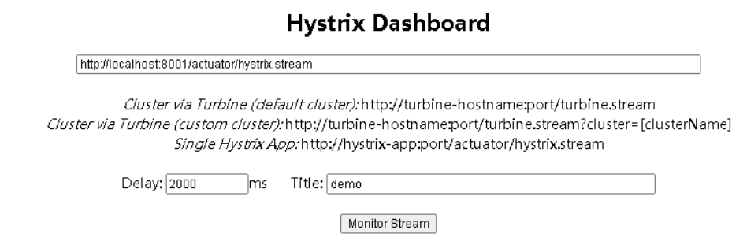
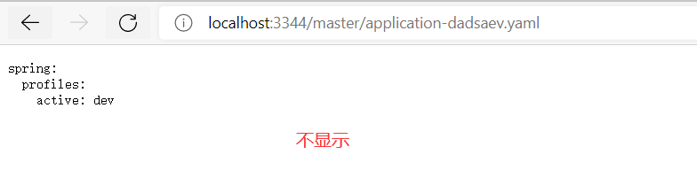

# ① 学习前言(带着问题去学习)

**微服务架构4个核心问题**

​	1.服务很多，客户端该怎么访问?
​	2.这么多服务?服务之间如何通信?
​	3.这么多服务? 如何治理?
​	4.服务挂了怎么办? 

> SpringCloud是生态，是一种解决办法

**争对上述的问题，有三套主流的解决方案：**

- Spring Cloud NetFlix
- Apache Dubbo Zookeeper
- Spring cloud Alibaba


**学习过程中要解决的面试题**

- 什么是微服务？

- 微服务之间是如何独立通讯的？

- SpringCloud 和 Dubbo有那些区别？

- SpringBoot 和 SpringCloud，请谈谈你对他们的理解

- 什么是服务熔断？什么是服务降级？

- 微服务的优缺点分别是什么？说下你在项目开发中遇到的坑

- 你所知道的微服务技术栈有哪些？列举一二

- Eureka和Zookeeper都可以提供服务注册与发现的功能，请说说两者的区别

# ② 微服务概述

## 2.1 什么是微服务

- 微服务架构是一种架构模式，或者说是一种架构风格，它体长将单一的应用程序划分成一组小的服务，每个服务运行在其独立的自己的进程内，服务之间互相协调，互相配置，为用户提供最终价值，服务之间采用轻量级的通信机制(HTTP)互相沟通，每个服务都围绕着具体的业务进行构建，并且能够被独立的部署到生产环境中，另外，应尽量避免统一的，集中式的服务管理机制，对具体的一个服务而言，应该根据业务上下文，选择合适的语言，工具(Maven)对其进行构建，可以有一个非常轻量级的集中式管理来协调这些服务，可以使用不同的语言来编写服务，也可以使用不同的数据存储

-  微服务化的核心就是将传统的一站式应用，根据业务拆分成一个一个的服务，彻底地去耦合，每一个微服务提供单个业务功能的服务，一个服务做一件事情，从技术角度看就是一种小而独立的处理过程，类似进程的概念，能够自行单独启动或销毁，拥有自己独立的数据库

> 可以查看： https://martinfowler.com/articles/microservices.html 了解微服务
>
> 翻译文： https://www.cnblogs.com/liuning8023/p/4493156.html 

## 2.2 微服务的优缺点

**微服务的优点**

- 单一职责原则
- 每个服务足够内聚，足够小，代码容易理解，这样能聚焦一个指定业务功能或业务需求
- 开发简单，开发效率提高，一个服务可能就是专一的只干一件事
- 微服务能够被小团队单独开发，这个小团队是2~5人的开发人员组成
- 微服务是松耦合的，是有功能意义的服务，无论是在开发阶段或部署阶段都是独立的。
- 微服务能使用不同的语言开发。
- 易于和第三方集成，微服务允许容易且灵活的方式集成自动部署，通过持续集成工具，如jenkins, Hudson,
  bamboo
- 微服务易于被-一个开发人员理解，修改和维护，这样小团队能够更关注自己的工作成果。无需通过合作才能体
  现价值。
- 微服务允许你利用融合最新技术。
- **微服务只是业务逻辑的代码，不会和HTML，CSS或其他界面混合**
- **每个微服务都有自己的存储能力，可以有自己的数据库,也可以有统一数据库**

**微服务缺点**

- 开发人员要处理分布式系统的复杂性；
- 多服务运维难度，随着服务的增加，运维的压力也在增大；
- 系统部署依赖问题；
- 服务间通信成本问题；
- 数据一致性问题；
- 系统集成测试问题；
- 性能和监控问题

## 2.3 微服务涉及的技术栈

| 微服务技术条目                         | 落地技术                                                     |
| -------------------------------------- | ------------------------------------------------------------ |
| 服务开发                               | SpringBoot、Spring、SpringMVC等                              |
| 服务配置与管理                         | Netfix公司的Archaius、阿里的Diamond等                        |
| 服务注册与发现                         | Eureka、Consul、Zookeeper等                                  |
| 服务调用                               | Rest、PRC、gRPC                                              |
| 服务熔断器                             | Hystrix、Envoy等                                             |
| 负载均衡                               | Ribbon、Nginx等                                              |
| 服务接口调用(客户端调用服务的简化工具) | Fegin等                                                      |
| 消息队列                               | Kafka、RabbitMQ、ActiveMQ等                                  |
| 服务配置中心管理                       | SpringCloudConfig、Chef等                                    |
| 服务路由(API网关)                      | Zuul等                                                       |
| 服务监控                               | Zabbix、Nagios、Metrics、Specatator等                        |
| 全链路追踪                             | Zipkin、Brave、Dapper等                                      |
| 数据流操作开发包                       | SpringCloud Stream(封装与Redis，Rabbit，Kafka等发送接收消息) |
| 时间消息总栈                           | SpringCloud Bus                                              |
| 服务部署                               | Docker、OpenStack、Kubernetes等                              |

## 2.4  为什么选择SpringCloud作为微服务架构

**1、选型依据**	

- 整体解决方案和框架成熟度
- 社区热度
- 可维护性
- 学习去曲线

**2、当前各大IT公司用的微服务架构**

- 阿里：dubbo+HFS
- 京东：JFS
- 新浪：Motan
- 当当网：DubboX

**3、各种微服务框架对比**

| **功能点/服务框架** |                   **Netflix/SpringCloud**                    |                          **Motan**                          | **gRPC**                  | Thri t   | **Dubbo/DubboX**                    |
| ------------------- | :----------------------------------------------------------: | :---------------------------------------------------------: | ------------------------- | -------- | ----------------------------------- |
| 功能定位            |                       完整的微服务框架                       | RPC框架，但整合了ZK或Consul，实现集群环境的基本服务注册发现 | RPC框架                   | RPC框架  | 服务框架                            |
| 支持Rest            |             是，Ribbon支持多种可拔插的序列号选择             |                             否                              | 否                        | 否       | 否                                  |
| 支持RPC             |                              否                              |                        是(Hession2)                         | 是                        | 是       | 是                                  |
| 支持多语言          |                         是(Rest形式)                         |                             否                              | 是                        | 是       | 否                                  |
| 负载均衡            | 是(服务端zuul+客户端Ribbon)，zuul-服务，动态路由，云端负载均衡Eureka（针对中间层服务器） |                         是(客户端)                          | 否                        | 否       | 是(客户端)                          |
| 配置服务            |     Netfix Archaius，Spring Cloud Config Server 集中配置     |                      是(Zookeeper提供)                      | 否                        | 否       | 否                                  |
| 服务调用链监控      |             是(zuul)，zuul提供边缘服务，API网关              |                             否                              | 否                        | 否       | 否                                  |
| 高可用/容错         |                是(服务端Hystrix+客户端Ribbon)                |                         是(客户端)                          | 否                        | 否       | 是(客户端)                          |
| 典型应用案例        |                           Netflix                            |                            Sina                             | Google                    | Facebook |                                     |
| 社区活跃程度        |                              高                              |                            一般                             | 高                        | 一般     | 2017年后重新开始维护，之前中断了5年 |
| 学习难度            |                             中等                             |                             低                              | 高                        | 高       | 低                                  |
| 文档丰富程度        |                              高                              |                            一般                             | 一般                      | 一般     | 高                                  |
| 其他                |      Spring Cloud Bus为我们的应用程序带来了更多管理端点      |                          支持降级                           | Netflix内部在开发集成gRPC | IDL定义  | 实践的公司比较多                    |

# ③ SpringCloud入门概述

## 3.1 SpringCloud是什么

- SpringCloud,基于SpringBoot提供了一套微服务解决方案， 包括服务注册与发现，配置中心，全链路监控，服务网关，负载均衡，熔断器等组件，除了基于NetFlix的开源组件做高度抽象封装之外,还有一些选型中立的开源组件。
- SpringCloud利用SpringBoot的开发便利性，巧妙地简化了分布式系统基础设施的开发, SpringCloud为开发人员提供了快速构建分布式系统的一些工具，**包括配置管理，服务发现，断路器，路由，微代理，事件总线，全局锁,决策竞选，分布式会话等等**,他们都可以用SpringBoot的开发风格做到一键启动和部署。
- SpringBoot并没有重复造轮子，它只是将目前各家公司开发的比较成熟，经得起实际考研的服务框架组合起来,通过SpringBoot风格进行再封装，屏蔽掉了复杂的配置和实现原理，**最终给开发者留出了一套简单易懂,易部署和易维护的分布式系统开发工具包**
- SpringCloud是分布式微服务架构下的一站式解决方案，是各个微服务架构落地技术的集合体，俗称微服务全家桶。		

## 3.2 SpringCloud和SpringBoot的关系

- SpringBoot专注于快速方便的开发单个个体微服务；
- SpringCloud是关注全局的微服务协调整理治理框架，它将SpringBoot开发的一个个单体微服务，整合并管理起来，为各个微服务之间提供：配置管理、服务发现、断路器、路由、微代理、事件总线、全局锁、决策选、分布式会话等等集成服务；
- SpringBoot可以离开SpringCloud独立使用，开发项目，但SpringCloud离不开SpringBoot，属于依赖关系；
- **SpringBoot专注于快速、方便的开发单个个体微服务，SpringCloud关注全局的服务治理框架**

## 3.3 Dubbo和SpringCloud技术选型

### 3.3.1 分布式+服务治理Dubbo

 目前成熟的互联网架构，应用服务化拆分 + 消息中间件 


### 3.3.2 Dubbo和SpringCloud对比

可以看一下社区活跃度：

https://github.com/dubbo

https://github.com/spring-cloud

|              | Dubbo         | SpringCloud                  |
| ------------ | ------------- | ---------------------------- |
| 服务注册中心 | Zookeeper     | Spring Cloud Netfilx Eureka  |
| 服务调用方式 | RPC           | REST API                     |
| 服务监控     | Dubbo-monitor | Spring Boot Admin            |
| 断路器       | 不完善        | Spring Cloud Netfilx Hystrix |
| 服务网关     | 无            | Spring Cloud Netfilx Zuul    |
| 分布式配置   | 无            | Spring Cloud Config          |
| 服务跟踪     | 无            | Spring Cloud Sleuth          |
| 消息总栈     | 无            | Spring Cloud Bus             |
| 数据流       | 无            | Spring Cloud Stream          |
| 批量任务     | 无            | Spring Cloud Task            |

 **最大区别：Spring Cloud 抛弃了Dubbo的RPC通信，采用的是基于HTTP的REST方式** 

>  严格来说，这两种方式各有优劣。虽然从一定程度上来说，Spring Cloud牺牲了服务调用的性能，但也避免了上面提到的原生RPC带来的问题。而且REST相比RPC更为灵活，服务提供方和调用方的依赖只依靠一纸契约，不存在代码级别的强依赖，这个优点在当下强调快速演化的微服务环境下，显得更加合适 

**品牌机与组装机的区别**
很明显，Spring Cloud的功能比DUBBO更加强大，涵盖面更广,而且作为Spring的拳头项目，它也能够与Spring
Framework、Spring Boot、Spring Data、Spring Batch等其他Spring项目完美融合，这些对于微服务而言是至
关重要的。使用Dubbo构建的微服务架构就像组装电脑，各环节我们的选择自由度很高，但是最终结果很有可能
因为一条内存质量不行就点不亮了，总是让人不怎么放心,但是如果你是一名高手，那这些都不是问题;而Spring
Cloud就像品牌机，在Spring Source的整合下，做了大量的兼容性测试，保证了机器拥有更高的稳定性,但是如
果要在使用非原装组件外的东西，就需要对其基础有足够的了解。
**社区支持与更新力度**
最为重要的是，DUBBO停止了5年左右的更新，虽然2017.7重启了。对于技术发展的新需求,需要由开发者自行
拓展升级(比如当当网弄出了DubboX) ，这对于很多想要采用微服务架构的中小软件组织，显然是不太合适的,
中小公司没有这么强大的技术能力去修改Dubbo源码+周边的一整套解决方案，并不是每一个公司都有阿里的大牛
+真实的线上生产环境测试过。

**总结**

 **二者解决的问题域不一样：Dubbo的定位是一款RPC框架，而SpringCloud的目标是微服务架构下的一站式解决方案** 

### 3.3.3  SpringCloud能干嘛

- Distributed/versioned configuration 分布式/版本控制配置
- Service registration and discovery 服务注册与发现
- Routing 路由
- Service-to-service calls 服务到服务的调用
- Load balancing 负载均衡配置
- Circuit Breakers 断路器
- Distributed messaging 分布式消息管理

# ④ SpringCloud Rest学习环境搭建

> 需求：我们会使用Dept部门模块来模拟一个微服务通用案例 **Consumer**消费者(**Client**)通过REST调用**Provider**提供者(**Server**)提供的服务 

**模块划分**

 一个父工程带着多个Moudule子模块 

- springcloud父工程下带着3个子模块
  - springcloud-api模块： 封装的整体entity/接口/公共配置 
  - springcloud-provider-dept-8001模块：服务提供者模块
  - springcloud-consumer-dept-80模块：服务消费者模块

## 4.1 创建父工程

- 新建父工程项目springcloud，切记**Packageing是pom模式**

>  主要是定义POM文件，将后续各个子模块公用的jar包等统一提取出来，类似一个抽象父类 

- 导入依赖

```xml
<?xml version="1.0" encoding="UTF-8"?>
<project xmlns="http://maven.apache.org/POM/4.0.0"
         xmlns:xsi="http://www.w3.org/2001/XMLSchema-instance"
         xsi:schemaLocation="http://maven.apache.org/POM/4.0.0 http://maven.apache.org/xsd/maven-4.0.0.xsd">
    <modelVersion>4.0.0</modelVersion>

    <groupId>cn.cvzhanshi</groupId>
    <artifactId>springcloud</artifactId>
    <version>1.0-SNAPSHOT</version>
    <modules>
        <module>springcloud-api</module>
        <module>springcloud-provider-dept-8001</module>
        <module>springcloud-consumer-dept-80</module>
    </modules>

    <!--打包方式  pom-->
    <packaging>pom</packaging>

    <properties>
        <project.build.sourceEncoding>UTF-8</project.build.sourceEncoding>
        <maven.compiler.source>1.8</maven.compiler.source>
        <maven.compiler.target>1.8</maven.compiler.target>
        <junit.version>4.12</junit.version>
        <log4j.version>1.2.17</log4j.version>
        <lombok.version>1.18.12</lombok.version>
    </properties>

    <dependencyManagement>
        <dependencies>
            <!--springCloud的依赖-->
            <!-- https://mvnrepository.com/artifact/org.springframework.cloud/spring-cloud-dependencies -->
            <dependency>
                <groupId>org.springframework.cloud</groupId>
                <artifactId>spring-cloud-dependencies</artifactId>
                <version>2020.0.3</version>
                <type>pom</type>
                <scope>import</scope>
            </dependency>

            <!--SpringBoot-->
            <dependency>
                <groupId>org.springframework.boot</groupId>
                <artifactId>spring-boot-dependencies</artifactId>
                <version>2.4.4</version>
                <type>pom</type>
                <scope>import</scope>
            </dependency>
            <!--数据库-->
            <dependency>
                <groupId>mysql</groupId>
                <artifactId>mysql-connector-java</artifactId>
                <version>5.1.47</version>
            </dependency>
            <!-- https://mvnrepository.com/artifact/com.alibaba/druid -->
            <dependency>
                <groupId>com.alibaba</groupId>
                <artifactId>druid</artifactId>
                <version>1.2.6</version>
            </dependency>
            <!--SpringBoot 启动器-->
            <!-- https://mvnrepository.com/artifact/org.mybatis.spring.boot/mybatis-spring-boot-starter -->
            <dependency>
                <groupId>org.mybatis.spring.boot</groupId>
                <artifactId>mybatis-spring-boot-starter</artifactId>
                <version>2.1.3</version>
            </dependency>

            <!--日志测试~-->
            <dependency>
                <groupId>ch.qos.logback</groupId>
                <artifactId>logback-core</artifactId>
                <version>1.2.3</version>
            </dependency>
            <dependency>
                <groupId>junit</groupId>
                <artifactId>junit</artifactId>
                <version>${junit.version}</version>
            </dependency>
            <dependency>
                <groupId>log4j</groupId>
                <artifactId>log4j</artifactId>
                <version>${log4j.version}</version>
            </dependency>
            <dependency>
                <groupId>org.projectlombok</groupId>
                <artifactId>lombok</artifactId>
                <version>${lombok.version}</version>
            </dependency>
        </dependencies>
    </dependencyManagement>
</project>
```

## 4.2 创建api模块

- 导入依赖

```xml
<dependencies>
    <dependency>
        <groupId>org.projectlombok</groupId>
        <artifactId>lombok</artifactId>
    </dependency>
</dependencies>
```

- 编写实体类Dept

```java
@Data
@NoArgsConstructor
@Accessors(chain = true)  //链式写法 dept.setdname().setdbsource
public class Dept implements Serializable {  //分布式中的实体类需要实现序列化,方便网络传输
    private Long deptno;
    private String dname;
    //这个数据存在哪个数据库的字段~微服务   一个服务对应一个数据库  相同的信息可能存在不同的数据库
    private String db_source;

    public Dept(String dname) {
        this.dname = dname;
    }
}
```

## 4.3 创建服务提供者模块

- 导入依赖

```xml
<dependencies>
    <!--        我们需要拿到实体类，所以需要配置api modle-->
    <dependency>
        <groupId>cn.cvzhanshi</groupId>
        <artifactId>springcloud-api</artifactId>
        <version>1.0-SNAPSHOT</version>
    </dependency>
    <dependency>
        <groupId>junit</groupId>
        <artifactId>junit</artifactId>
    </dependency>
    <dependency>
        <groupId>mysql</groupId>
        <artifactId>mysql-connector-java</artifactId>
    </dependency>
    <dependency>
        <groupId>com.alibaba</groupId>
        <artifactId>druid</artifactId>
    </dependency>
    <!--SpringBoot 启动器-->
    <dependency>
        <groupId>org.mybatis.spring.boot</groupId>
        <artifactId>mybatis-spring-boot-starter</artifactId>
    </dependency>
    <dependency>
        <groupId>ch.qos.logback</groupId>
        <artifactId>logback-core</artifactId>
    </dependency>
    <!--test-->
    <dependency>
        <groupId>org.springframework.boot</groupId>
        <artifactId>spring-boot-test</artifactId>
    </dependency>
    <dependency>
        <groupId>org.springframework.boot</groupId>
        <artifactId>spring-boot-starter-web</artifactId>
    </dependency>
    <!--        jetty-->
    <dependency>
        <groupId>org.springframework.boot</groupId>
        <artifactId>spring-boot-starter-jetty</artifactId>
    </dependency>
    <!--        热部署工具-->
    <dependency>
        <groupId>org.springframework.boot</groupId>
        <artifactId>spring-boot-devtools</artifactId>
    </dependency>
</dependencies>
```

- 配置springboot的配置文件

```yaml
server:
  port: 8001


mybatis:
  type-aliases-package: cn.cvzhanshi.springcloud.entity
  mapper-locations: classpath:mybatis/mapper/*.xml
  config-location: classpath:mybatis/mybatis-config.xml


spring:
  application:
    name: springcloud-provider-dept
  datasource:
    type: com.alibaba.druid.pool.DruidDataSource
    url: jdbc:mysql://localhost:3306/db01?serverTimezone=UTC&useUnicode=true&characterEncoding=utf-8
    password: lian0911
    username: root
    driver-class-name: com.mysql.jdbc.Driver
```

- 配置mybatis-config.xml

```xml
<?xml version="1.0" encoding="UTF-8" ?>
<!DOCTYPE configuration
                PUBLIC "-//mybatis.org//DTD Config 3.0//EN"
                "http://mybatis.org/dtd/mybatis-3-config.dtd">
<configuration>
    <settings>
        <setting name="cacheEnabled" value="true"/>
    </settings>
</configuration>
```

- 编写DeptDao(DeptMapper)

```java
/**
 * @author cVzhanshi
 * @create 2021-06-26 16:26
 */
@Mapper
@Repository
public interface DeptDao {
    public boolean addDept(Dept dept);

    public Dept queryById(Long id);

    public List<Dept> getAll();
}
```

- 编写DeptMapper.xml

```xml
<?xml version="1.0" encoding="UTF-8" ?>
<!DOCTYPE mapper
        PUBLIC "-//mybatis.org//DTD Config 3.0//EN"
        "http://mybatis.org/dtd/mybatis-3-mapper.dtd">
<mapper namespace="cn.cvzhanshi.springcloud.dao.DeptDao">
    <select id="queryById" resultType="Dept" parameterType="Long">
        select * from dept where deptno=#{id};
    </select>
    <select id="getAll"  resultType="Dept" parameterType="Long">
        select * from dept;
    </select>
    <insert id="addDept" parameterType="Dept">
        insert into dept (dname,db_source)
        values (#{dname},DATABASE());
    </insert>
</mapper>
```

- 编写Service层DeptService和DeptServiceImpl

DeptService

```java
public interface DeptService {
    public boolean addDept(Dept dept);

    public Dept queryById(Long id);

    public List<Dept> getAll();
}
```

DeptServiceImpl

```java
/**
 * @author cVzhanshi
 * @create 2021-06-26 16:49
 */
@Service
public class DeptServiceImpl implements DeptService {
    @Autowired
    private DeptDao deptDao;

    @Override
    public boolean addDept(Dept dept) {
        return deptDao.addDept(dept);
    }

    @Override
    public Dept queryById(Long id) {
        return deptDao.queryById(id);
    }

    @Override
    public List<Dept> getAll() {
        return deptDao.getAll();
    }
}
```

- 编写Controller层DeptController

> 因为没有前台页面所以要用@RestController

```java
@RestController
public class DeptController {
    @Autowired
    private DeptService deptService;

    @PostMapping("/dept/add")
    public boolean addDept(@RequestBody Dept dept){
        return deptService.addDept(dept);
    }

    @GetMapping("/dept/get/{id}")
    public Dept getById(@PathVariable("id") Long id){
        return deptService.queryById(id);
    }

    @GetMapping("/dept/list")
    public List<Dept> getById(){
        return deptService.getAll();
    }

}
```

- 编写SpringBoot主启动类

```java
@SpringBootApplication
public class DeptProvider_8001 {
    public static void main(String[] args) {
        SpringApplication.run(DeptProvider_8001.class,args);
    }
}
```

- 测试


##  4.4创建服务消费者模块

- 导入依赖

```xml
<dependencies>
    <!--        实体类+WEB-->
    <dependency>
        <groupId>cn.cvzhanshi</groupId>
        <artifactId>springcloud-api</artifactId>
        <version>1.0-SNAPSHOT</version>
    </dependency>
    <dependency>
        <groupId>org.springframework.boot</groupId>
        <artifactId>spring-boot-starter-web</artifactId>
    </dependency>
    <!--        热部署工具-->
    <dependency>
        <groupId>org.springframework.boot</groupId>
        <artifactId>spring-boot-devtools</artifactId>
    </dependency>
</dependencies>
```

- 修改springboot的配置文件

```yaml
server:
  port: 80
```

- **将RestTemplate手动交给spring管理**

> 消费者要调用提供者的服务只能通过url调用，springcloud给我提供了RestTemplate，直接上手使用，但是还没要帮我提交给spring管理，所以要我们手动提交给spring，这一步很重要

```java
/**
 * @author cVzhanshi
 * @create 2021-06-26 17:13
 */
@Configuration
public class ConfigBean {
    @Bean
    public RestTemplate getRestTemplate(){
        return new RestTemplate();
    }
}
```

- 编写Controller层DeptConsumerController

```java
/**
 * @author cVzhanshi
 * @create 2021-06-26 17:12
 */
@RestController
public class DeptConsumerController {
    //理解:消费者，不应该有Service层
    //RestTemplate  ...  供我们直接调用就行！ 需要我们手动注册到spring中
    //（url,实体：map,Class<T> responseType)

    @Autowired
    private RestTemplate restTemplate;
    /**
     * 服务提供方地址前缀
     */
    private static final String REST_URL_PREFIX = "http://localhost:8001";
    /**
     * 消费方添加部门信息
     * @param dept
     * @return
     */
    @RequestMapping("/consumer/dept/add")
    public boolean add(Dept dept) {
        // postForObject(服务提供方地址(接口),参数实体,返回类型.class)
        return restTemplate.postForObject(REST_URL_PREFIX + "/dept/add", dept, Boolean.class);
    }
    /**
     * 消费方根据id查询部门信息
     * @param id
     * @return
     */
    @RequestMapping("/consumer/dept/get/{id}")
    public Dept get(@PathVariable("id") Long id) {
        // getForObject(服务提供方地址(接口),返回类型.class)
        return restTemplate.getForObject(REST_URL_PREFIX + "/dept/get/" + id, Dept.class);
    }
    /**
     * 消费方查询部门信息列表
     * @return
     */
    @RequestMapping("/consumer/dept/list")
    public List<Dept> list() {
        System.out.println("here");
        return restTemplate.getForObject(REST_URL_PREFIX + "/dept/list", List.class);
    }

}
```

- 编写主启动类

```java
/**
 * @author cVzhanshi
 * @create 2021-06-26 17:23
 */
@SpringBootApplication
public class DeptConsumer_80 {
    public static void main(String[] args) {
        SpringApplication.run(DeptConsumer_80.class,args);
    }
}
```

- 测试


# ⑤ Eureka服务注册中心

> 由于Spring Cloud的不断更新，可能会出现版本冲突等因素，导致项目跑不起来，所以做出一下约定
>
> 1、SpringCloud： Hoxton.SR9
> 2、SpringBoot：2.3.5.RELEASE
>
> 以下版本全为：2.2.6.RELEASE
> 3、服务者：pring-cloud-starter-netflix-eureka-client  
> 4、Eureka：spring-cloud-starter-netflix-eureka-server
> 5、消费者+Ribbon：spring-cloud-starter-netflix-eureka-client
>                                  spring-cloud-starter-netflix-ribbon 
> 6、Feign:	 spring-cloud-starter-openfeign 
> 7、Hystrix：spring-cloud-starter-netflix-hystrix
> 	    spring-cloud-starter-netflix-hystrix-dashboard
> 8、zuul：spring-cloud-starter-netflix-zuul 

## 5.1 Eureka简介

- Netflix在涉及Eureka时，遵循的就是API原则.
- Eureka是Netflix的有个子模块，也是核心模块之一。Eureka是基于REST的服务，用于定位服务，以实现云端中间件层服务发现和故障转移，服务注册与发现对于微服务来说是非常重要的，有了服务注册与发现，只需要使用服务的标识符，就可以访问到服务，而不需要修改服务调用的配置文件了，功能类似于Dubbo的注册中心，比如Zookeeper

## 5.2 原理理解

- Eureka基本的架构
  - Springcloud 封装了Netflix公司开发的Eureka模块来实现服务注册与发现 (对比Zookeeper).
  - Eureka采用了C-S的架构设计，EurekaServer作为服务注册功能的服务器，他是服务注册中心.
  - 而系统中的其他微服务，使用Eureka的客户端连接到EurekaServer并维持心跳连接。这样系统的维护人员就可以通过EurekaServer来监控系统中各个微服务是否正常运行，Springcloud 的一些其他模块 (比如Zuul) 就可以通过EurekaServer来发现系统中的其他微服务，并执行相关的逻辑.
    

**图解**


-  和Dubbo架构对比


- Eureka 包含两个组件：Eureka Server 和 Eureka Client.
- Eureka Server 提供服务注册，各个节点启动后，回在EurekaServer中进行注册，这样Eureka Server中的服务注册表中将会储存所有课用服务节点的信息，服务节点的信息可以在界面中直观的看到.
- Eureka Client 是一个Java客户端，用于简化EurekaServer的交互，客户端同时也具备一个内置的，使用轮询负载算法的负载均衡器。在应用启动后，将会向EurekaServer发送心跳 (默认周期为30秒) 。如果Eureka Server在多个心跳周期内没有接收到某个节点的心跳，EurekaServer将会从服务注册表中把这个服务节点移除掉 (默认周期为90s).

- **三大角色**
  - Eureka Server：提供服务的注册与发现
  - Service Provider：服务生产方，将自身服务注册到Eureka中，从而使服务消费方能狗找到
  - Service Consumer：服务消费方，从Eureka中获取注册服务列表，从而找到消费服务

## 5.3 Eureka Server模块的构建

- 创建普通maven模块 springcloud-eureka-7001 

- 导入依赖

```xml
<dependencies>
    <!-- https://mvnrepository.com/artifact/org.springframework.cloud/spring-cloud-starter-netflix-eureka-server -->
    <dependency>
        <groupId>org.springframework.cloud</groupId>
        <artifactId>spring-cloud-starter-netflix-eureka-server</artifactId>
        <version>2.2.6.RELEASE</version>
    </dependency>

    <!--        热部署工具-->
    <dependency>
        <groupId>org.springframework.boot</groupId>
        <artifactId>spring-boot-devtools</artifactId>
    </dependency>
</dependencies>
```

- 编写配置文件

```yaml
server:
  port: 7001

eureka:
  instance:
    hostname: localhost  #Eureka服务端的实例名称
  client:
    register-with-eureka: false # 表示是否向eureka注册中心注册自己
    fetch-registry: false # fetch-registry: false则表示自己为注册中心
    service-url: # 监控页面
      defaultZone: http://${eureka.instance.hostname}:${server.port}/eureka/
```

- 编写主启动类

```java
/**
 * @author cVzhanshi
 * @create 2021-06-26 21:22
 */
@SpringBootApplication
@EnableEurekaServer//Eureka服务端的启动类，可以接受别人注册进来
public class EurekaServer_7001 {
    public static void main(String[] args) {
        SpringApplication.run(EurekaServer_7001.class,args);
    }
}
```

> 其中：@EnableEurekaServer  --->Eureka服务端的启动类，可以接受别人注册进来

- 启动测试

> 访问：localhost:7001


## 5.4 Eureka-client模块的构建

### 5.4.1 模块的构建

- 在springcloud-provider-dept-8001模块基础上导入依赖

```xml
<!--Eureka-->
<!-- https://mvnrepository.com/artifact/org.springframework.cloud/spring-cloud-starter-netflix-eureka-client -->
<dependency>
    <groupId>org.springframework.cloud</groupId>
    <artifactId>spring-cloud-starter-netflix-eureka-client</artifactId>
    <version>2.2.6.RELEASE</version>
</dependency>
```

- 在配置文件中增加Eureka配置

```yaml
#Eureka的配置，服务注册到哪里
eureka:
  client:
    service-url:
      defaultZone: http://localhost:7001/eureka/
```

- 主启动类添加注解 @EnableEurekaClient  开启Eureka客户端注解，在服务启动后自动向注册中心注册服务

- 测试，先启动7001模块，后启动8001模块


### 5.4.2 扩展操作

-  修改Eureka上的默认描述信息 

```yaml
#Eureka的配置，服务注册到哪里
eureka:
  client:
    service-url:
      defaultZone: http://localhost:7001/eureka/
  instance:
    instance-id: springcloud-provider-dept8001
```


- 配置关于服务加载的监控信息
  - 导入依赖

  ```xml
  <!--actuator完善监控信息-->
  <dependency>
      <groupId>org.springframework.boot</groupId>
      <artifactId>spring-boot-starter-actuator</artifactId>
  </dependency>
  ```

  -  application.yml中添加配置 

  ```yaml
  # info配置
  info:
    # 项目的名称
    app.name: cvzhanshi-springcloud
    # 公司的名称
    company.name: blog.cvzhanshi.com
  ```

  


### 5.4.3 EureKa自我保护机制(好死不如赖活着)

 先总结**某时刻某一个微服务不可用，eureka不会立即清理，依旧会对该微服务的信息进行保存** 

> 当注册的服务突然停止运行，Eureka页面会出现红色的提示


- 默认情况下，当eureka server在一定时间内没有收到实例的心跳，便会把该实例从注册表中删除（默认是90秒），但是，如果短时间内丢失大量的实例心跳，便会触发eureka server的自我保护机制，比如在开发测试时，需要频繁地重启微服务实例，但是我们很少会把eureka server一起重启（因为在开发过程中不会修改eureka注册中心），当一分钟内收到的心跳数大量减少时，会触发该保护机制。可以在eureka管理界面看到Renews threshold和Renews(last min)，当后者（最后一分钟收到的心跳数）小于前者（心跳阈值）的时候，触发保护机制，会出现图示的红色警告.从警告中可以看到，eureka认为虽然收不到实例的心跳，但它认为实例还是健康的，eureka会保护这些实例，不会把它们从注册表中删掉。

- 该保护机制的目的是避免网络连接故障，在发生网络故障时，微服务和注册中心之间无法正常通信，但服务本身是健康的，不应该注销该服务，如果eureka因网络故障而把微服务误删了，那即使网络恢复了，该微服务也不会重新注册到eureka server了，因为只有在微服务启动的时候才会发起注册请求，后面只会发送心跳和服务列表请求，这样的话，该实例虽然是运行着，但永远不会被其它服务所感知。所以，eureka server在短时间内丢失过多的客户端心跳时，会进入自我保护模式，该模式下，eureka会保护注册表中的信息，不在注销任何微服务，当网络故障恢复后，eureka会自动退出保护模式。自我保护模式可以让集群更加健壮。

- 但是我们在开发测试阶段，需要频繁地重启发布，如果触发了保护机制，则旧的服务实例没有被删除，这时请求有可能跑到旧的实例中，而该实例已经关闭了，这就导致请求错误，影响开发测试。所以，在开发测试阶段，我们可以把自我保护模式关闭，只需在eureka server配置文件中加上如下配置即可：eureka.server.enable-self-preservation=false【**不推荐关闭自我保护机制**】

### 5.4.4 注册进来的微服务，获取一些消息

-  **DeptController.java**新增方法

```java
/**
 * DiscoveryClient 可以用来获取一些配置的信息，得到具体的微服务！
 */
@Autowired
private DiscoveryClient client;

/**
 * 获取一些注册进来的微服务的信息~，
 *
 * @return
 */
@GetMapping("/dept/discovery")
public Object discovery() {
    // 获取微服务列表的清单
    List<String> services = client.getServices();
    System.out.println("discovery=>services:" + services);
    // 得到一个具体的微服务信息,通过具体的微服务id，applicaioinName；
    List<ServiceInstance> instances = client.getInstances("SPRINGCLOUD-PROVIDER-DEPT");
    for (ServiceInstance instance : instances) {
        System.out.println(
            instance.getHost() + "\t" + // 主机名称
            instance.getPort() + "\t" + // 端口号
            instance.getUri() + "\t" + // uri
            instance.getServiceId() // 服务id
        );
    }
    return this.client;
}
```

-  主启动类中加入@EnableDiscoveryClient 注解 

```java
@SpringBootApplication
@EnableEurekaClient //开启Eureka客户端注解，在服务启动后自动向注册中心注册服务
@EnableDiscoveryClient//开启服务发现客户端的注解，可以用来获取一些配置的信息，得到具体的微服务
public class DeptProvider_8001 {
    public static void main(String[] args) {
        SpringApplication.run(DeptProvider_8001.class,args);
    }
}
```

- 测试


## 5.5 Eureka集群环境配置

**环境需求**：


- 新建两个和springcloud-eureka-7001一样的Eureka服务端，修改端口号分别为7002、7003
- 为更方便看清楚是不同的服务端， 配置一些自定义本机名字 

```
C:\Windows\System32\drivers\etc\hosts文件下添加如下代码
127.0.0.1		eureka7001.com
127.0.0.1		eureka7002.com
127.0.0.1		eureka7003.com
```

- 修改三个服务端的配置文件

application.yaml/7001

```yaml
server:
  port: 7001

eureka:
  instance:
    hostname: eureka7001.com  #Eureka服务端的实例名称
  client:
    register-with-eureka: false # 表示是否向eureka注册中心注册自己
    fetch-registry: false # fetch-registry: false则表示自己为注册中心
    service-url: # 监控页面
      #重写Eureka的默认端口以及访问路径 --->http://localhost:7001/eureka/
      # 单机： defaultZone: http://${eureka.instance.hostname}:${server.port}/eureka/
      # 集群（关联）：7001关联7002、7003
      defaultZone: http://eureka7002.com:7002/eureka/,http://eureka7003.com:7003/eureka/
```

application.yaml/7002

```yaml
server:
  port: 7002

eureka:
  instance:
    hostname: eureka7002.com  #Eureka服务端的实例名称
  client:
    register-with-eureka: false # 表示是否向eureka注册中心注册自己
    fetch-registry: false # fetch-registry: false则表示自己为注册中心
    service-url: # 监控页面
      defaultZone: http://eureka7001.com:7001/eureka/,http://eureka7003.com:7003/eureka/
```

application.yaml/7003

```yaml
server:
  port: 7003

eureka:
  instance:
    hostname: eureka7003.com  #Eureka服务端的实例名称
  client:
    register-with-eureka: false # 表示是否向eureka注册中心注册自己
    fetch-registry: false # fetch-registry: false则表示自己为注册中心
    service-url: # 监控页面
      defaultZone: http://eureka7002.com:7002/eureka/,http://eureka7001.com:7001/eureka/
```

- 修改客户端springcloud-provider-dept-8001的注册地址，让他向三个服务端注册服务

```yaml
#Eureka的配置，服务注册到哪里
eureka:
  client:
    service-url:
      defaultZone: http://eureka7001.com:7001/eureka/,http://eureka7002.com:7002/eureka/,http://eureka7003.com:7003/eureka/
  instance:
    instance-id: springcloud-provider-dept8001
```

- 测试，分别启动7001、7002、7003、8001


## 5.6 对比和Zookeeper区别

RDBMS (MySQL\Oracle\sqlServer) ===> ACID

NoSQL (Redis\MongoDB) ===> CAP

-----

 **ACID** 

- A (Atomicity) 原子性
- C (Consistency) 一致性
- I (Isolation) 隔离性
- D (Durability) 持久性

**CAP**

-----

- C (Consistency) 强一致性
- A (Availability) 可用性
- P (Partition tolerance) 分区容错性

 CAP的三进二：CA、AP、CP 

-----

 **CAP理论的核心** 

- 一个分布式系统不可能同时很好的满足一致性，可用性和分区容错性这三个需求
- 根据CAP原理，将NoSQL数据库分成了满足CA原则，满足CP原则和满足AP原则三大类
  - CA：单点集群，满足一致性，可用性的系统，通常可扩展性较差
  - CP：满足一致性，分区容错的系统，通常性能不是特别高
  - AP：满足可用性，分区容错的系统，通常可能对一致性要求低一些

-----

 **作为分布式服务注册中心，Eureka比Zookeeper好在哪里** 

>  著名的CAP理论指出，一个分布式系统不可能同时满足C (一致性) 、A (可用性) 、P (容错性)，由于分区容错性P再分布式系统中是必须要保证的，因此我们只能再A和C之间进行权衡 

- Zookeeper 保证的是 CP —> 满足一致性，分区容错的系统，通常性能不是特别高
- Eureka 保证的是 AP —> 满足可用性，分区容错的系统，通常可能对一致性要求低一些

-----

 **Zookeeper保证的是CP** 

> 当向注册中心查询服务列表时，我们可以容忍注册中心返回的是几分钟以前的注册信息，但不能接收服务直接down掉不可用。也就是说，**服务注册功能对可用性的要求要高于一致性**。但zookeeper会出现这样一种情况，当master节点因为网络故障与其他节点失去联系时，剩余节点会重新进行leader选举。问题在于，选举leader的时间太长，30-120s，且选举期间整个zookeeper集群是不可用的，这就导致在选举期间注册服务瘫痪。在云部署的环境下，因为网络问题使得zookeeper集群失去master节点是较大概率发生的事件，虽然服务最终能够恢复，但是，漫长的选举时间导致注册长期不可用，是不可容忍的.

-----

 **Eureka保证的是AP** 

>  Eureka看明白了这一点，因此在设计时就优先保证可用性。Eureka各个节点都是平等的，几个节点挂掉不会影响正常节点的工作，剩余的节点依然可以提供注册和查询服务。而Eureka的客户端在向某个Eureka注册时，如果发现连接失败，则会自动切换至其他节点，只要有一台Eureka还在，就能保住注册服务的可用性，只不过查到的信息可能不是最新的，除此之外，Eureka还有之中自我保护机制，如果在15分钟内超过85%的节点都没有正常的心跳，那么Eureka就认为客户端与注册中心出现了网络故障，此时会出现以下几种情况：
>
> - Eureka不在从注册列表中移除因为长时间没收到心跳而应该过期的服务
> - Eureka仍然能够接受新服务的注册和查询请求，但是不会被同步到其他节点上 (即保证当前节点依然可用)
> - 当网络稳定时，当前实例新的注册信息会被同步到其他节点中

总结： **因此，Eureka可以很好的应对因网络故障导致部分节点失去联系的情况，而不会像zookeeper那样使整个注册服务瘫痪** 

# ⑥ Ribbon：负载均衡(基于客户端)

## 6.1 Ribbon的简介

- Spring Cloud Ribbon 是基于Netflix Ribbon 实现的一套客户端负载均衡的工具。
- 简单的说，Ribbon 是 Netflix 发布的开源项目，**主要功能是提供客户端的软件负载均衡算法**，将 Netflix 的中间层服务连接在一起。Ribbon 的客户端组件提供一系列完整的配置项，如：连接超时、重试等。**简单的说，就是在配置文件中列出 LoadBalancer (简称LB：负载均衡) 后面所有的及其Ribbon 会自动的帮助你基于某种规则 (如简单轮询，随机连接等等) 去连接这些机器**。我们也容易使用 Ribbon 实现自定义的负载均衡算法

-----

 **Ribbon能干嘛**

图解：


- LB，即负载均衡 (LoadBalancer) ，在微服务或分布式集群中经常用的一种应用。
- 负载均衡简单的说就是将用户的请求平摊的分配到多个服务上，从而达到系统的HA (高用)。
- 常见的负载均衡软件有 Nginx、Lvs 等等。
- Dubbo、SpringCloud 中均给我们提供了负载均衡，SpringCloud 的负载均衡算法可以自定义。
- 负载均衡简单分类：
  - 集中式LB
    - 即在服务的提供方和消费方之间使用独立的LB设施，如Nginx(反向代理服务器)，由该设施负责把访问请求通过某种策略转发至服务的提供方！
  - 进程式 LB
    - 将LB逻辑集成到消费方，消费方从服务注册中心获知有哪些地址可用，然后自己再从这些地址中选出一个合适的服务器。
    - **Ribbon 就属于进程内LB**，它只是一个类库，集成于消费方进程，消费方通过它来获取到服务提供方的地址

## 6.2 客户端集成Ribbon

> 在springcloud-consumer-dept-80模块的基础上

- 添加Ribbon和Eureka的依赖

```xml
<!--        Ribbon-->
<!-- https://mvnrepository.com/artifact/org.springframework.cloud/spring-cloud-starter-netflix-ribbon -->
<dependency>
    <groupId>org.springframework.cloud</groupId>
    <artifactId>spring-cloud-starter-netflix-ribbon</artifactId>
    <version>2.2.6.RELEASE</version>
</dependency>

<!-- https://mvnrepository.com/artifact/org.springframework.cloud/spring-cloud-starter-netflix-eureka-client -->
<dependency>
    <groupId>org.springframework.cloud</groupId>
    <artifactId>spring-cloud-starter-netflix-eureka-client</artifactId>
    <version>2.2.6.RELEASE</version>
</dependency>
```

- 在配置文件中配置Eureka

```yaml
# Eureka配置
eureka:
  client:
    register-with-eureka: false # 不向 Eureka注册自己
    service-url: # 从三个注册中心中随机取一个去访问
      defaultZone: http://eureka7001.com:7001/eureka/,http://eureka7002.com:7002/eureka/,http://eureka7003.com:7003/eureka/
```

-  主启动类加上@EnableEurekaClient注解，开启Eureka 

```java
//Ribbon 和 Eureka 整合以后，客户端可以直接调用，不用关心IP地址和端口号
@SpringBootApplication
@EnableEurekaClient //开启Eureka 客户端
public class DeptConsumer_80 {
    public static void main(String[] args) {
        SpringApplication.run(DeptConsumer_80.class, args);
    }
}
```

-  自定义Spring配置类：ConfigBean.java 配置负载均衡实现RestTemplate 

```java
@Configuration
public class ConfigBean {//@Configuration -- spring  applicationContext.xml

    @LoadBalanced //配置负载均衡实现RestTemplate
    @Bean
    public RestTemplate getRestTemplate() {
        return new RestTemplate();
    }
}
```

-  修改conroller：DeptConsumerController.java 

> 集成了Ribbon和Eureka之后是通过服务名来访问的，而不是url

```java
    /**
     * 服务提供方地址前缀
     */
    //Ribbon:我们这里的地址，应该是一个变量，通过服务名来访问
	//private static final String REST_URL_PREFIX = "http://localhost:8001";
    private static final String REST_URL_PREFIX = "http://SPRINGCLOUD-PROVIDER-DEPT";
```

## 6.3 使用Ribbon实现负载均衡

**原理图**：


**创建环境**

-  新建两个服务提供者Moudle：springcloud-provider-dept-8003、springcloud-provider-dept-8002 

- 配置和 springcloud-provider-dept-8001一样，除了端口号和使用的数据库不同
- 启动所有服务(三个服务注册中心、三个服务提供则、一个服务消费者)

- 访问 http://eureka7001.com:7001查看结果

> 可以看到三个服务名相同但是服务id不同的服务注册成功


- 测试服务消费者，访问 http://localhost/consumer/dept/list 


> 由结果可知，不同的请求，根据Ribbon的负载均衡，把请求分配到不同的服务提供者中
>
>  **每次访问http://localhost/consumer/dept/list随机访问集群中某个服务提供者，这种情况叫做轮询**

## 6.4 自动义负载均衡算法

查看AbstractLoadBalancerRule的实现类可知


**先试试切换自带的负载均衡算法(随机)**

- 把RandomRule注册到IOC容器中

>  在springcloud-provider-dept-80模块下的ConfigBean中进行配置，切换使用不同的规则 

```JAVA
@Configuration
public class ConfigBean {
    //配置负载均衡实现RestTempLate
    // IRule
    // RoundRobinRule 轮询
    // RandomRule 随机
    // AvailabilityFilteringRule :会先过滤掉，跳闸，访问故障的服务~,对剩下的进行轮诲
    // RetryRule :会先按照轮询获取服务~，如果服务获取失败，则会在指定的时间内进行，重试
    @LoadBalanced //配置负载均衡实现RestTemplate
    @Bean
    public RestTemplate getRestTemplate(){
        return new RestTemplate();
    }

    @Bean
    public IRule myRule(){
        return new RandomRule();//使用随机策略
        //return new RoundRobinRule();//使用轮询策略
        //return new AvailabilityFilteringRule();//使用轮询策略
        //return new RetryRule();//使用轮询策略
    }
}
```

- 测试发现Ribbon的选择服务策略已经变成随机的了

**自定义负载均衡算法(选择服务策略)**

-  自定义的Ribbon类( 参考Ribbon中默认的规则代码自己稍微改动 ) MyRandomRule.java 

```java
public class MyRandomRule extends AbstractLoadBalancerRule {

    /**
     * 每个服务访问5次则换下一个服务(总共3个服务)
     * <p>
     * total=0,默认=0,如果=5,指向下一个服务节点
     * index=0,默认=0,如果total=5,index+1
     */
    private int total = 0;//被调用的次数
    private int currentIndex = 0;//当前是谁在提供服务

    public Server choose(ILoadBalancer lb, Object key) {
        if (lb == null) {
            return null;
        }
        Server server = null;

        while (server == null) {
            if (Thread.interrupted()) {
                return null;
            }
            List<Server> upList = lb.getReachableServers();//获得当前活着的服务
            List<Server> allList = lb.getAllServers();//获取所有的服务

            int serverCount = allList.size();
            if (serverCount == 0) {
                /*
                 * No servers. End regardless of pass, because subsequent passes
                 * only get more restrictive.
                 */
                return null;
            }

            //int index = chooseRandomInt(serverCount);//生成区间随机数
            //server = upList.get(index);//从或活着的服务中,随机获取一个

            //=====================自定义代码=========================

            if (total < 5) {
                server = upList.get(currentIndex);
                total++;
            } else {
                total = 0;
                currentIndex++;
                if (currentIndex >= upList.size()) {
                    currentIndex = 0;
                }
                server = upList.get(currentIndex);//从活着的服务中,获取指定的服务来进行操作
            }
            
            //======================================================
            
            if (server == null) {
                /*
                 * The only time this should happen is if the server list were
                 * somehow trimmed. This is a transient condition. Retry after
                 * yielding.
                 */
                Thread.yield();
                continue;
            }
            if (server.isAlive()) {
                return (server);
            }
            // Shouldn't actually happen.. but must be transient or a bug.
            server = null;
            Thread.yield();
        }
        return server;
    }

    protected int chooseRandomInt(int serverCount) {
        return ThreadLocalRandom.current().nextInt(serverCount);
    }

    @Override
    public Server choose(Object key) {
        return choose(getLoadBalancer(), key);
    }

    @Override
    public void initWithNiwsConfig(IClientConfig clientConfig) {
        // TODO Auto-generated method stub
    }
}
```

- 编写配置类，把自定义的规则类配置进去

```java
/**
 * @author cVzhanshi
 * @create 2021-06-27 15:01
 */
@Configuration
public class MyRule {
    @Bean
    public IRule myRule(){
        return new MyRandomRule();
    }
}
```

**说明:** 这个类必须是`@Configuration`，但请注意，它不在主应用程序上下文的`@ComponentScan`中，否则将由所有`@RibbonClients`共享。如果您使用`@ComponentScan`（或`@SpringBootApplication`），则需要采取措施避免包含（例如将其放在一个单独的，不重叠的包中，或者指定要在`@ComponentScan`） 即 **该包不要和主启动类所在的包同级，要跟启动类所在包同级** 


- 在主启动类中添加注解

```java
@EnableEurekaClient
@SpringBootApplication
//在微服务启动的时候就能加载自定义的Ribbon类(自定义的规则会覆盖原有默认的规则)
@RibbonClient(name = "SPRINGCLOUD-PROVIDER-DEPT",configuration = MyRule.class)//开启负载均衡,并指定自定义的规则
public class DeptConsumer_80 {
    public static void main(String[] args) {
        SpringApplication.run(DeptConsumer_80.class,args);
    }
}
```

- 运行测试

# ⑦ Feign: 负载均衡(采用接口式调用服务)

## 7.1  Feign 简介

- Feign是Netflix公司开源的轻量级Rest客户端，SpringCloud对Feign进行了封装，**Feign默认集成了Ribbon实现了客户端负载均衡调用**。**使用Feign只需要定义一个接口，并使用注解的方式配置它(在接口上添加注解即可)**。

- Feign是声明式Web Service客户端，它让微服务之间的调用变得更简单，类似controller调用service。SpringCloud集成了Ribbon和Eureka，可以使用Feigin提供负载均衡的http客户端 

- 微服务间的调用有两种方式：
  - 通过微服务名称，**获得服务的调用地址**---Ribbon
  - 通过接口 + 注解，**获得服务的调用**---Feign

 **Feign能干什么？** 

- Feign旨在使编写Java Http客户端变得更容易
- 前面在使用Ribbon + RestTemplate时，利用RestTemplate对Http请求的封装处理，形成了一套模板化的调用方法。但是在实际开发中，由于对服务依赖的调用可能不止一处，往往一个接口会被多处调用，所以通常都会针对每个微服务自行封装一个客户端类来包装这些依赖服务的调用。所以，Feign在此基础上做了进一步的封装，由他来帮助我们定义和实现依赖服务接口的定义，在Feign的实现下，我们只需要创建一个接口并使用注解的方式来配置它 (**类似以前Dao接口上标注Mapper注解，现在是一个微服务接口上面标注一个Feign注解**)，即可完成对服务提供方的接口绑定，简化了使用Spring Cloud Ribbon 时，自动封装服务调用客户端的开发量。

## 7.2 Feign的使用

- 创建一个和springcloud-consumer-dept-80一样的服务消费者springcloud-consumer-dept-80-feign，当然也可以直接在springcloud-consumer-dept-80项目上修改。
-  拷贝springcloud-consumer-dept-80模块下的pom.xml，resource，以及java代码到springcloud-consumer-feign模块，并添加feign依赖 (Ribbon相关代码不需要)

```xml
<!--Feign-->
<dependency>
    <groupId>org.springframework.cloud</groupId>
    <artifactId>spring-cloud-starter-openfeign</artifactId>
    <version>2.2.6.RELEASE</version>
</dependency>
```

- 在springcloud-api模块加一层service创建接口DeptClientService

```java
/**
 * @author cVzhanshi
 * @create 2021-06-27 15:51
 */
@Service
@FeignClient(value = "SPRINGCLOUD-PROVIDER-DEPT")
public interface DeptClientService {
    @GetMapping("/dept/get/{id}")
    public Dept queryById(@PathVariable("id") Long id);

    @GetMapping("/dept/list")
    public List<Dept> queryAll();

    @GetMapping("/dept/add")
    public boolean addDept(@RequestBody Dept dept);
}
```

- 修改springcloud-consumer-dept-80-feign中的Controller

 **DeptConsumerController.java** 

```java
/**
 * @author cVzhanshi
 * @create 2021-06-26 17:12
 */
@RestController
public class DeptConsumerController {
    @Autowired
    private DeptClientService deptClientService;

    @RequestMapping("/consumer/dept/add")
    public boolean add(Dept dept) {
        return deptClientService.addDept(dept);
    }

    @RequestMapping("/consumer/dept/get/{id}")
    public Dept get(@PathVariable("id") Long id) {
        return deptClientService.queryById(id);
    }

    @RequestMapping("/consumer/dept/list")
    public List<Dept> list() {
        return deptClientService.queryAll();
    }
}
```

- 在主启动类上添加Feign的注解

```java
@EnableEurekaClient
//feign客户端注解,并指定要扫描的包以及配置接口DeptClientService
@EnableFeignClients(basePackages = {"cn.cvzhanshi.springcloud.service"})
@SpringBootApplication
public class FeignDeptConsumer_80 {
    public static void main(String[] args) {
        SpringApplication.run(FeignDeptConsumer_80.class,args);
    }
}
```

- 运行测试，和Ribbon+RestTemplate的效果是一样的

> 总结： Feign是声明式的web service客户端，它让微服务之间的调用变得更简单 

## 7.3 Feign工作原理

> Feign 通过接口的方法调用 Rest 服务（之前是 Ribbon+RestTemplate ）， 请求发送给 Eureka 服务器 , 通过 Feign 直接找到服务接口 ，因为集成了 Ribbon 技术， Feign 自带负载均衡配置功能。

- 启动类添加 @EnableFeignClients 注解， Spring 会扫描标记了 @FeignClient 注解的接口，并生成此接口的代理对象

- @FeignClient(" 服务名称 ") 即指定了 product 服务名称， Feign 会从 Eureka 注册中心获取 product 服务列表，并通过负载均衡算法进行服务调用。

- 在接口方法中使用注解 @RequestMapping(value = "/product/list",method = RequestMethod.GET) ，指定调用的 url ， Feign 会根据 url 进行远程调用。

  **feign注意事项** 

SpringCloud 对 Feign 进行了增强兼容了 SpringMVC 的注解 ，我们在使用 SpringMVC 的注解时需要注意：

- @FeignClient接口方法有基本类型参数在参数必须加@PathVariable("XXX") 或 @RequestParam("XXX")

- @FeignClient接口方法返回值为复杂对象时，此类型必须有无参构造方法

 **Feign 本质上也是实现了 Ribbon，只不过后者是在调用方式上，为了满足一些开发者习惯的接口调用习惯** 

# ⑧ Hystrix：服务熔断

>  分布式系统面临的问题 
>
>  复杂分布式体系结构中的应用程序有数十个依赖关系，每个依赖关系在某些时候将不可避免失败 

## 8.1 服务雪崩

> 多个微服务之间调用的时候，假设微服务A调用微服务B和微服务C，微服务B和微服务C又调用其他的微服务，这就是所谓的“扇出”，如果扇出的链路上**某个微服务的调用响应时间过长，或者不可用**，对微服务A的调用就会占用越来越多的系统资源，进而引起系统崩溃，所谓的“雪崩效应” 


对于高流量的应用来说，单一的后端依赖可能会导致所有服务器上的所有资源都在几十秒甚至几秒内饱和。比失败更糟糕的是，这些应用程序还可能导致服务之间的延迟增加，备份队列，线程和其他系统资源紧张，导致整个系统发生更多的级联故障，**这些都表示需要对故障和延迟进行隔离和管理，以达到单个依赖关系的失败而不影响整个应用程序或系统运行**。

 我们需要，**弃车保帅**

## 8.2 什么是Hystrix

**Hystrix**是一个应用于处理分布式系统的延迟和容错的开源库，在分布式系统里，许多依赖不可避免的会调用失败，比如超时，异常等。

**Hystrix** 能够保证在一个依赖出问题的情况下，不会导致整个体系服务失败，避免级联故障，以提高分布式系统的弹性 。

“**断路器**”本身是一种开关装置，当某个服务单元发生故障之后，通过断路器的故障监控 (类似熔断保险丝) ，**向调用方返回一个服务预期的，可处理的备选响应 (FallBack) ，而不是长时间的等待或者抛出调用方法无法处理的异常，这样就可以保证了服务调用方的线程不会被长时间，不必要的占用**，从而避免了故障在分布式系统中的蔓延，乃至雪崩。


## 8.3 Hystrix能干嘛

- 服务降级
- 服务熔断
- 服务限流
- 接近实时的监控

 **当一切正常时，请求流可以如下所示** 


 当许多后端系统中有一个潜在阻塞服务时，它可以阻止整个用户请求： 


随着大容量通信量的增加，单个后端依赖项的潜在性会导致所有服务器上的所有资源在几秒钟内饱和。

应用程序中通过网络或客户端库可能导致网络请求的每个点都是潜在故障的来源。比失败更糟糕的是，这些应用程序还可能导致服务之间的延迟增加，从而备份队列、线程和其他系统资源，从而导致更多跨系统的级联故障。


当使用**Hystrix**包装每个基础依赖项时，上面的图表中所示的体系结构会发生类似于以下关系图的变化。**每个依赖项是相互隔离的**，限制在延迟发生时它可以填充的资源中，并包含在回退逻辑中，该逻辑决定在依赖项中发生任何类型的故障时要做出什么样的响应： 


## 8.4 服务熔断(在服务端操作)

**什么是服务熔断?**
熔断机制是对应雪崩效应的一种微服务链路保护机制。

**当扇出链路的某个微服务不可用或者响应时间太长时，会进行服务的降级，进而熔断该节点微服务的调用，快速返回错误的响应信息**。检测到该节点微服务调用响应正常后恢复调用链路。在SpringCloud框架里熔断机制通过Hystrix实现。Hystrix会监控微服务间调用的状况，当**失败的调用到一定阀值缺省是5秒内20次调用失败**，就会启动熔断机制。熔断机制的注解是：@HystrixCommand。

服务熔断解决如下问题：

- 当所依赖的对象不稳定时，能够起到快速失败的目的；
- 快速失败后，能够根据一定的算法动态试探所依赖对象是否恢复。

**案例演示**

- 新建springcloud-provider-dept-hystrix-8001模块并拷贝springcloud-provider-dept–8001内的**pom.xml、resource**和Java代码进行初始化并调整 

-  **导入hystrix依赖** 

```xml
<dependency>
    <groupId>org.springframework.cloud</groupId>
    <artifactId>spring-cloud-starter-netflix-hystrix</artifactId>
    <version>2.2.6.RELEASE</version>
</dependency>
```

- 修改配置文件

```yaml
#Eureka的配置，服务注册到哪里
eureka:
  client:
    service-url:
      defaultZone: http://eureka7001.com:7001/eureka/,http://eureka7002.com:7002/eureka/,http://eureka7003.com:7003/eureka/
  instance:
    instance-id: springcloud-provider-hystrix-dept8001
        prefer-ip-address: true #改为true后默认显示的是ip地址而不再是localhost  方便团队不同人使用
```


- 修改controller

```java
/**
 * @author cVzhanshi
 * @create 2021-06-26 16:51
 */

@RestController
public class DeptController {

    @Autowired
    private DeptService deptService;

    /**
     * 根据id查询部门信息
     * 如果根据id查询出现异常,则走hystrixGet这段备选代码
     * @param id
     * @return
     */
    @HystrixCommand(fallbackMethod = "hystrixGet")
    @RequestMapping("/dept/get/{id}")//根据id查询
    public Dept get(@PathVariable("id") Long id){
        Dept dept = deptService.queryById(id);
        if (dept==null){
            throw new RuntimeException("这个id=>"+id+",不存在该用户，或信息无法找到~");
        }
        return dept;
    }

    /**
     * 根据id查询备选方案(熔断)
     * @param id
     * @return
     */
    public Dept hystrixGet(@PathVariable("id") Long id){
        return new Dept().setDeptno(id)
                .setDname("这个id=>"+id+",没有对应的信息,null---@Hystrix~")
                .setDb_source("在MySQL中没有这个数据库");
    }
}
```

-  **为主启动类添加对熔断的支持注解@EnableCircuitBreaker** 

```java
@SpringBootApplication
@EnableCircuitBreaker // 添加对熔断的支持注解
@EnableEurekaClient //开启Eureka客户端注解，在服务启动后自动向注册中心注册服务
@EnableDiscoveryClient//开启服务发现客户端的注解，可以用来获取一些配置的信息，得到具体的微服务
public class DeptProviderHystrix_8001 {
    public static void main(String[] args) {
        SpringApplication.run(DeptProviderHystrix_8001.class,args);
    }
}
```

- 测试

当使用熔断后，当访问一个不存在的id时 ：


 不使用熔断的springcloud-provider-dept–8001模块访问相同地址会出现下面状况：


## 8.5 服务降级(在客户端操作)

**什么是服务降级**

> - 服务降级是指 当服务器压力剧增的情况下，根据实际业务情况及流量，对一些服务和页面有策略的不处理，或换种简单的方式处理，从而释放服务器资源以保证核心业务正常运作或高效运作。说白了，**就是尽可能的把系统资源让给优先级高的服务**。
> - 资源有限，而请求是无限的。如果在并发高峰期，不做服务降级处理，一方面肯定会影响整体服务的性能，严重的话可能会导致宕机某些重要的服务不可用。所以，一般在高峰期，为了保证核心功能服务的可用性，都要对某些服务降级处理。比如当双11活动时，把交易无关的服务统统降级，如查看蚂蚁深林，查看历史订单等等 

**使用场景**

当整个微服务架构整体的负载超出了预设的上限阈值或即将到来的流量预计将会超过预设的阈值时，为了保证重要或基本的服务能正常运行，可以将一些不重要或不紧急的服务或任务进行服务的延迟使用或暂停使用。

**图解**


**当某一时间内服务A的访问量暴增，而B和C的访问量较少，为了缓解A服务的压力，这时候需要B和C暂时关闭一些服务功能，去承担A的部分服务，从而为A分担压力，叫做服务降级**。 

**服务降级需要考虑的问题**

- 那些服务是核心服务，哪些服务是非核心服务
- 那些服务可以支持降级，那些服务不能支持降级，降级策略是什么
- 除服务降级之外是否存在更复杂的业务放通场景，策略是什么？

**自动降级分类**

- 超时降级：主要配置好超时时间和超时重试次数和机制，并使用异步机制探测回复情况
- 失败次数降级：主要是一些不稳定的api，当失败调用次数达到一定阀值自动降级，同样要使用异步机制探测回复情况
- 故障降级：比如要调用的远程服务挂掉了（网络故障、DNS故障、http服务返回错误的状态码、rpc服务抛出异常），则可以直接降级。降级后的处理方案有：默认值（比如库存服务挂了，返回默认现货）、兜底数据（比如广告挂了，返回提前准备好的一些静态页面）、缓存（之前暂存的一些缓存数据）
- 限流降级：秒杀或者抢购一些限购商品时，此时可能会因为访问量太大而导致系统崩溃，此时会使用限流来进行限制访问量，当达到限流阀值，后续请求会被降级；降级后的处理方案可以是：排队页面（将用户导流到排队页面等一会重试）、无货（直接告知用户没货了）、错误页（如活动太火爆了，稍后重试）

**测试(使用步骤)**

-  在springcloud-api模块下的service包中新建降级配置类DeptClientServiceFallBackFactory.java

> 因为要做整个服务的降级，所以要对整个服务请求(服务类)进行处理

```java
/**
 * @author cVzhanshi
 * @create 2021-06-28 15:52
 */
@Component
public class DeptClientServiceFallBackFactory implements FallbackFactory {
    @Override
    public DeptClientService create(Throwable throwable) {
        return new DeptClientService() {
            @Override
            public Dept queryById(Long id) {
                return new Dept()
                        .setDeptno(id)
                        .setDname("id=>" + id + "没有对应的信息，客户端提供了降级的信息，这个服务现在已经被关闭")
                        .setDb_source("没有数据~");
            }

            @Override
            public List<Dept> queryAll() {
                return null;
            }

            @Override
            public boolean addDept(Dept dept) {
                return false;
            }
        };
    }
}
```

- 在DeptClientService中指定降级配置类DeptClientServiceFallBackFactory 

```java
@Service
@FeignClient(value = "SPRINGCLOUD-PROVIDER-DEPT",fallbackFactory = DeptClientServiceFallBackFactory.class)
public interface DeptClientService {
    @GetMapping("/dept/get/{id}")
    public Dept queryById(@PathVariable("id") Long id);

    @GetMapping("/dept/list")
    public List<Dept> queryAll();

    @GetMapping("/dept/add")
    public boolean addDept(@RequestBody Dept dept);
}
```

- 在**springcloud-consumer-dept-feign**(客户端)模块中开启降级 

```yaml
server:
  port: 80

# Eureka配置
eureka:
  client:
    register-with-eureka: false # 不向 Eureka注册自己
    service-url: # 从三个注册中心中随机取一个去访问
      defaultZone: http://eureka7001.com:7001/eureka/,http://eureka7002.com:7002/eureka/,http://eureka7003.com:7003/eureka/
# 开启降级feign.hystrix
feign:
  hystrix:
    enabled: true

```

- 测试

> 启动服务注册中心7001、7002、7003，启动服务提供者springcloud-provider-dept-8001，启动服务消费者springcloud-consumer-dept-80-feign，先正常使用服务，然后关闭服务，消费者继续访问

关闭服务后：


## 8.6 服务熔断和降级的区别

- **服务熔断—>服务端**：某个服务超时或异常，引起熔断~，类似于保险丝(自我熔断)
- **服务降级—>客户端**：从整体网站请求负载考虑，当某个服务熔断或者关闭之后，服务将不再被调用，此时在客户端，我们可以准备一个 FallBackFactory ，返回一个默认的值(缺省值)。会导致整体的服务下降，但是好歹能用，比直接挂掉强。
- 触发原因不太一样，服务熔断一般是某个服务（下游服务）故障引起，而服务降级一般是从整体负荷考虑；管理目标的层次不太一样，熔断其实是一个框架级的处理，每个微服务都需要（无层级之分），而降级一般需要对业务有层级之分（比如降级一般是从最外围服务开始）
-  实现方式不太一样，服务降级具有代码侵入性(由控制器完成/或自动降级)，熔断一般称为**自我熔断** 

**熔断，降级，限流**：

限流：限制并发的请求访问量，超过阈值则拒绝；

降级：服务分优先级，牺牲非核心服务（不可用），保证核心服务稳定；从整体负荷考虑；

熔断：依赖的下游服务故障触发熔断，避免引发本系统崩溃；系统自动执行和恢复

## 8.7 Dashboard 流监控

-  新建springcloud-consumer-hystrix-dashboard模块，导入依赖

```xml
<dependencies>

    <!--Hystrix依赖-->
    <!-- https://mvnrepository.com/artifact/org.springframework.cloud/spring-cloud-starter-netflix-hystrix -->
    <dependency>
        <groupId>org.springframework.cloud</groupId>
        <artifactId>spring-cloud-starter-netflix-hystrix</artifactId>
        <version>2.2.6.RELEASE</version>
    </dependency>
    <!--dashboard依赖-->
    <dependency>
        <groupId>org.springframework.cloud</groupId>
        <artifactId>spring-cloud-starter-netflix-hystrix-dashboard</artifactId>
        <version>2.2.6.RELEASE</version>
    </dependency>
    <!--        Ribbon-->
    <!-- https://mvnrepository.com/artifact/org.springframework.cloud/spring-cloud-starter-netflix-ribbon -->
    <dependency>
        <groupId>org.springframework.cloud</groupId>
        <artifactId>spring-cloud-starter-netflix-ribbon</artifactId>
        <version>2.2.6.RELEASE</version>
    </dependency>

    <!-- https://mvnrepository.com/artifact/org.springframework.cloud/spring-cloud-starter-netflix-eureka-client -->
    <dependency>
        <groupId>org.springframework.cloud</groupId>
        <artifactId>spring-cloud-starter-netflix-eureka-client</artifactId>
        <version>2.2.6.RELEASE</version>
    </dependency>

    <!--        实体类+WEB-->
    <dependency>
        <groupId>cn.cvzhanshi</groupId>
        <artifactId>springcloud-api</artifactId>
        <version>1.0-SNAPSHOT</version>
    </dependency>
    <dependency>
        <groupId>org.springframework.boot</groupId>
        <artifactId>spring-boot-starter-web</artifactId>
    </dependency>
    <!--        热部署工具-->
    <dependency>
        <groupId>org.springframework.boot</groupId>
        <artifactId>spring-boot-devtools</artifactId>
    </dependency>
</dependencies>
```

- 添加主启动类

```java
/**
 * @author cVzhanshi
 * @create 2021-06-28 16:24
 */
@SpringBootApplication
// 开启Dashboard
@EnableHystrixDashboard
public class DeptConsumerDashboard_9001 {
    public static void main(String[] args) {
        SpringApplication.run(DeptConsumerDashboard_9001.class,args);
    }
}
```

- 添加配置文件

```yaml
server:
  port: 9001


hystrix:
  dashboard:
    proxy-stream-allow-list: localhost
```

-  给springcloud-provider-dept-hystrix-8001模块下的主启动类添加如下代码,添加监控

```java
/**
 * @author cVzhanshi
 * @create 2021-06-26 16:54
 */
@SpringBootApplication
@EnableCircuitBreaker // 添加对熔断的支持注解
@EnableEurekaClient //开启Eureka客户端注解，在服务启动后自动向注册中心注册服务
@EnableDiscoveryClient//开启服务发现客户端的注解，可以用来获取一些配置的信息，得到具体的微服务
public class DeptProviderHystrix_8001 {
    public static void main(String[] args) {
        SpringApplication.run(DeptProviderHystrix_8001.class,args);
    }

    //增加一个 Servlet
    @Bean
    public ServletRegistrationBean hystrixMetricsStreamServlet(){
        ServletRegistrationBean registrationBean = new ServletRegistrationBean(new HystrixMetricsStreamServlet());
        //访问该页面就是监控页面
        registrationBean.addUrlMappings("/actuator/hystrix.stream");
        return registrationBean;
    }
}
```

- 测试

> 打开 hystrix-8001 ，9001，7001模块

访问：http://localhost:9001/hystrix


进入监控页面



-----


-----

图例解说

- 一圈
  实心圆:公有两种含义,他通过颜色的变化代表了实例的健康程度
  它的健康程度从绿色<黄色<橙色<红色递减
  该实心圆除了颜色的变化之外，它的大小也会根据实例的请求流量发生变化，流量越大,该实心圆就
  越大，所以通过该实心圆的展示，就可以在大量的实例中快速发现**故障实例和高压力实例**。
- 一线
  曲线:用来记录2分钟内流量的相对变化,可以通过它来观察到流量的上升和下降趋势!
- 整图说明


# ⑨ Zuul：路由网关

- Zull包含了对请求的**路由**(用来跳转的)和**过滤**两个最主要功能

- 其中**路由功能负责将外部请求转发到具体的微服务实例上，是实现外部访问统一入口的基础，而过滤器功能则负责对请求的处理过程进行干预，是实现请求校验，服务聚合等功能的基础**。Zuul和Eureka进行整合，将Zuul自身注册为Eureka服务治理下的应用，同时从Eureka中获得其他服务的消息，也即以后的访问微服务都是通过Zuul跳转后获得
  

**注意**：Zuul 服务最终还是会注册进 Eureka

**提供**：代理 + 路由 + 过滤 三大功能

 官方文档：https://github.com/Netflix/zuul/ 

-----

**测试(使用步骤)**

- 创建springcloud-zuul-9527模块，导入依赖

```xml
<dependencies>
    <dependency>
        <groupId>org.springframework.cloud</groupId>
        <artifactId>spring-cloud-starter-netflix-zuul</artifactId>
        <version>2.2.6.RELEASE</version>
    </dependency>
    <!--Hystrix依赖-->
    <!-- https://mvnrepository.com/artifact/org.springframework.cloud/spring-cloud-starter-netflix-hystrix -->
    <dependency>
        <groupId>org.springframework.cloud</groupId>
        <artifactId>spring-cloud-starter-netflix-hystrix</artifactId>
        <version>2.2.6.RELEASE</version>
    </dependency>
    <!--dashboard依赖-->
    <dependency>
        <groupId>org.springframework.cloud</groupId>
        <artifactId>spring-cloud-starter-netflix-hystrix-dashboard</artifactId>
        <version>2.2.6.RELEASE</version>
    </dependency>
    <!--        Ribbon-->
    <!-- https://mvnrepository.com/artifact/org.springframework.cloud/spring-cloud-starter-netflix-ribbon -->
    <dependency>
        <groupId>org.springframework.cloud</groupId>
        <artifactId>spring-cloud-starter-netflix-ribbon</artifactId>
        <version>2.2.6.RELEASE</version>
    </dependency>

    <!-- https://mvnrepository.com/artifact/org.springframework.cloud/spring-cloud-starter-netflix-eureka-client -->
    <dependency>
        <groupId>org.springframework.cloud</groupId>
        <artifactId>spring-cloud-starter-netflix-eureka-client</artifactId>
        <version>2.2.6.RELEASE</version>
    </dependency>

    <!--        实体类+WEB-->
    <dependency>
        <groupId>cn.cvzhanshi</groupId>
        <artifactId>springcloud-api</artifactId>
        <version>1.0-SNAPSHOT</version>
    </dependency>
    <dependency>
        <groupId>org.springframework.boot</groupId>
        <artifactId>spring-boot-starter-web</artifactId>
    </dependency>
    <!--        热部署工具-->
    <dependency>
        <groupId>org.springframework.boot</groupId>
        <artifactId>spring-boot-devtools</artifactId>
    </dependency>
</dependencies>
```

- 编写配置文件

```yaml
server:
  port: 9527
spring:
  application:
    name: springcloud-zuul


#Eureka的配置，服务注册到哪里
eureka:
  client:
    service-url:
      defaultZone: http://eureka7001.com:7001/eureka/,http://eureka7002.com:7002/eureka/,http://eureka7003.com:7003/eureka/
  instance:
    instance-id: zuul9527.com
    prefer-ip-address: true #改为true后默认显示的是ip地址而不再是localhost  方便团队不同人使用

# info配置
info:
  # 项目的名称
  app.name: cvzhanshi-springcloud
  # 公司的名称
  company.name: blog.cvzhanshi.com

# zull 路由网关配置
zuul:
  # 路由相关配置
  # 原来访问路由 eg:http://cvzhanshi.com:9527/springcloud-provider-dept/dept/get/1
  # zull路由配置后访问路由 eg:http://www.cspstudy.com:9527/cvzhanshi/mydept/dept/get/1
  routes:
    mydept.serviceId: springcloud-provider-dept # eureka注册中心的服务提供方路由名称
    mydept.path: /mydept/** # 将eureka注册中心的服务提供方路由名称 改为自定义路由名称
  ignored-services: "*" # 不能再使用这个路径访问了，*： 忽略,隐藏全部的服务名称~
  prefix: /cvzhanshi # 设置公共的前缀
```

- 编写主启动类

```java
/**
 * @author cVzhanshi
 * @create 2021-06-28 17:15
 */
@SpringBootApplication
@EnableZuulProxy//
public class ZuulApplication_9527 {
    public static void main(String[] args) {
        SpringApplication.run(ZuulApplication_9527.class,args);
    }
}
```

- 测试

访问：http://cvzhanshi.com:9527/cvzhanshi/springcloud-provider-dept/dept/get/1无效(因为已经过滤了)


访问封装好的url  ： http://cvzhanshi.com:9527/cvzhanshi/mydept/dept/get/1


**微服务名称被替换并隐藏，换成了我们自定义的微服务名称mydept，同时加上了前缀cvzhanshi，这样就做到了对路由访问的加密处理** 

# ⑩ Spring Cloud Config 分布式配置

## 10.1 概述

**分布式系统面临的–配置文件问题**

微服务意味着要将单体应用中的业务拆分成一个个子服务，每个服务的粒度相对较小，因此系统中会出现大量的服务，由于每个服务都需要必要的配置信息才能运行，所以一套集中式的，动态的配置管理设施是必不可少的。spring cloud提供了configServer来解决这个问题，我们每一个微服务自己带着一个application.yml，那上百个的配置文件修改起来，令人头疼

 **SpringCloud config分布式配置中心** 


-----

- spring cloud config 为微服务架构中的微服务提供集中化的外部支持，配置服务器为各个不同微服务应用的所有环节提供了一个**中心化的外部配置** 

-   spring cloud config 分为**服务端**和**客户端**两部分 
-  服务端也称为 **分布式配置中心**，它是一个独立的微服务应用，用来连接配置服务器并为客户端提供获取配置信息，加密，解密信息等访问接口 
-  客户端则是**通过指定的配置中心来管理应用资源，以及与业务相关的配置内容，并在启动的时候从配置中心获取和加载配置信息**。配置服务器默认采用git来存储配置信息，这样就有助于对环境配置进行版本管理。并且可用通过git客户端工具来方便的管理和访问配置内容

 **spring cloud config 分布式配置中心的作用**

- 集中式管理配置文件
- 不同环境，不同配置，动态化的配置更新，分环境部署，比如 /dev /test /prod /beta /release
- 运行期间动态调整配置，不再需要在每个服务部署的机器上编写配置文件，服务会向配置中心统一拉取配置自己的信息
- 当配置发生变动时，服务不需要重启，即可感知到配置的变化，并应用新的配置
- 将配置信息以REST接口的形式暴露

## 10.2 服务端

- 新建模块 springcloud-config-server-3344，导入依赖

```xml
<dependencies>
    <dependency>
        <groupId>org.springframework.cloud</groupId>
        <artifactId>spring-cloud-config-server</artifactId>
        <version>2.2.6.RELEASE</version>
    </dependency>

    <dependency>
        <groupId>org.springframework.boot</groupId>
        <artifactId>spring-boot-starter-web</artifactId>
    </dependency>
    <!--actuator完善监控信息-->
    <dependency>
        <groupId>org.springframework.boot</groupId>
        <artifactId>spring-boot-starter-actuator</artifactId>
    </dependency>
</dependencies>
```

- 编写配置文件

```yaml
server:
  port: 3344

spring:
  application:
    name: springcloud-config-server
  # 连接码云远程仓库
  cloud:
    config:
      server:
        git:
          # 注意是https的而不是ssh
          uri: https://gitee.com/cvzhanshi-ursula/springcloud-config.git
          # 通过 config-server可以连接到git，访问其中的资源以及配置~
```

- 主启动类

```java
/**
 * @author cVzhanshi
 * @create 2021-06-29 11:11
 */
@SpringBootApplication
@EnableConfigServer// 开启spring cloud config server服务
public class Config_Server_3344 {
    public static void main(String[] args) {
        SpringApplication.run(Config_Server_3344.class,args);
    }
}
```

**前提**

- 在码云上新建仓库 springcloud-config
- 拉取到本地，编写application.yaml配置文件

```yaml
spring:
  profiles:
    active: dev
    
---
spring:
  profiles: dev
  application:
    name: springcloud-config-dev
    
---
spring:
  profiles: test
  application:
    name: springcloud-config-test
```

-  将本地git仓库springcloud-config文件夹下新建的application.yml提交到码云仓库


 **HTTP服务具有以下格式的资源** 

```yaml
/{application}/{profile}[/{label}]
/{application}-{profile}.yml
/{label}/{application}-{profile}.yml
/{application}-{profile}.properties
/{label}/{application}-{profile}.properties
```

**测试**

- 访问 http://localhost:3344/application-dev.yaml


- 访问 http://localhost:3344/application/test/master


- 访问 http://localhost:3344/master/application-dev.yaml 


-  访问不存在的配置



## 10.3 客户端

- 在本地库编写一个配置文件config-client.yaml，并且上传到码云仓库

```yaml
spring:
  profiles:
    active: dev

---
server:
  port: 8201
#spring配置
spring:
  profiles: dev
  application:
    name: springcloud-config-client
#Eureka的配置，服务注册到哪里
eureka:
  client:
    service-url:
      defaultZone: http://eureka7001.com:7001/eureka/,http://eureka7002.com:7002/eureka/,http://eureka7003.com:7003/eureka/


---
server:
  port: 8202
#spring配置
spring:
  profiles: test
  application:
    name: springcloud-config-client
#Eureka的配置，服务注册到哪里
eureka:
  client:
    service-url:
      defaultZone: http://eureka7001.com:7001/eureka/,http://eureka7002.com:7002/eureka/,http://eureka7003.com:7003/eureka/
```

- 新建 springcloud-config-client-3355模块，导入依赖

```xml
<!-- https://mvnrepository.com/artifact/org.springframework.cloud/spring-cloud-starter-config -->
<dependency>
    <groupId>org.springframework.cloud</groupId>
    <artifactId>spring-cloud-starter-config</artifactId>
    <version>2.2.6.RELEASE</version>
</dependency>

<dependency>
    <groupId>org.springframework.boot</groupId>
    <artifactId>spring-boot-starter-web</artifactId>
</dependency>
<!--actuator完善监控信息-->
<dependency>
    <groupId>org.springframework.boot</groupId>
    <artifactId>spring-boot-starter-actuator</artifactId>
</dependency>
```

-  resources下创建application.yml和bootstrap.yml配置文件 

> 其中bootstrap.yml是系统级别的配置文件，application.yml是用户级别的配置文件，系统级别更高级
>
> 因为要访问远程库的配置文件，所以一些重要的配置编写在系统级别的配置文件中

**bootstrap.yaml**

```yaml
# 系统级别的配置
spring:
  cloud:
    config:
      name: config-client # 需要从git上读取的资源名称，不要后缀
      profile: dev
      label: master
      uri: http://localhost:3344
```

**application.yaml**

```yaml
# 用户级别的配置
spring:
  application:
    name: springcloud-config-client
```

-  创建controller包下的**ConfigClientController.java** 用于测试 

```java
/**
 * @author cVzhanshi
 * @create 2021-06-29 17:27
 */
@RestController
public class ConfigClientController {
    @Value("${spring.application.name}")
    private String applicationName; //获取微服务名称

    @Value("${eureka.client.service-url.defaultZone}")
    private String eurekaServer; //获取Eureka服务

    @Value("${server.port}")
    private String port; //获取服务端的端口号


    @RequestMapping("/config")
    public String getConfig(){
        return "applicationName:"+applicationName +
                "eurekaServer:"+eurekaServer +
                "port:"+port;
    }
}
```

- 编写主启动类

```java
/**
 * @author cVzhanshi
 * @create 2021-06-29 17:28
 */
@SpringBootApplication
public class ConfigClient {
    public static void main(String[] args) {
        SpringApplication.run(ConfigClient.class,args);
    }
}
```

- 测试

> 先启动3344后启动客户端，然后访问 http://localhost:8201/config/ 


切换一下环境dev->test

```yaml
# 系统级别的配置
spring:
  cloud:
    config:
      name: config-client # 需要从git上读取的资源名称，不要后缀
      profile: test
      label: master
      uri: http://localhost:3344
```

重新测试

继续访问 [localhost:8201/config](http://localhost:8201/config) 发现没用了

访问 [localhost:8202/config](http://localhost:8201/config) 


## 10.4 小实战

> 需求：把之前的7001、8001配置文件修改成远程库读取配置文件，实现配置与编码解耦

- 本地新建config-dept.yaml和config-eureka.yaml并提交到码云仓库

**config-dept.yaml**

> 其中为了测试dev和test唯一的不同是连接的数据库不同

```yaml
spring:
  profiles:
    active: dev

---
server:
  port: 8001

mybatis:
  type-aliases-package: cn.cvzhanshi.springcloud.entity
  mapper-locations: classpath:mybatis/mapper/*.xml
  config-location: classpath:mybatis/mybatis-config.xml


spring:
  profiles: dev
  application:
    name: springcloud-config-dept
  datasource:
    type: com.alibaba.druid.pool.DruidDataSource
    url: jdbc:mysql://localhost:3306/db01?serverTimezone=UTC&useUnicode=true&characterEncoding=utf-8
    password: lian0911
    username: root
    driver-class-name: com.mysql.jdbc.Driver
#Eureka的配置，服务注册到哪里
eureka:
  client:
    service-url:
      defaultZone: http://eureka7001.com:7001/eureka/,http://eureka7002.com:7002/eureka/,http://eureka7003.com:7003/eureka/
  instance:
    instance-id: springcloud-provider-dept8001

# info配置
info:
  # 项目的名称
  app.name: cvzhanshi-springcloud
  # 公司的名称
  company.name: blog.cvzhanshi.com

---
server:
  port: 8001

mybatis:
  type-aliases-package: cn.cvzhanshi.springcloud.entity
  mapper-locations: classpath:mybatis/mapper/*.xml
  config-location: classpath:mybatis/mybatis-config.xml


spring:
  profiles: test
  application:
    name: springcloud-config-dept
  datasource:
    type: com.alibaba.druid.pool.DruidDataSource
    url: jdbc:mysql://localhost:3306/db02?serverTimezone=UTC&useUnicode=true&characterEncoding=utf-8
    password: lian0911
    username: root
    driver-class-name: com.mysql.jdbc.Driver
#Eureka的配置，服务注册到哪里
eureka:
  client:
    service-url:
      defaultZone: http://eureka7001.com:7001/eureka/,http://eureka7002.com:7002/eureka/,http://eureka7003.com:7003/eureka/
  instance:
    instance-id: springcloud-provider-dept8001

# info配置
info:
  # 项目的名称
  app.name: cvzhanshi-springcloud
  # 公司的名称
  company.name: blog.cvzhanshi.com
```

**config-eureka.yaml**

```yaml
spring:
  profiles:
    active: dev

---
server:
  port: 7001
#spring配置
spring:
  profiles: dev
  application:
    name: springcloud-config-eureka
eureka:
  instance:
    hostname: eureka7001.com  #Eureka服务端的实例名称
  client:
    register-with-eureka: false # 表示是否向eureka注册中心注册自己
    fetch-registry: false # fetch-registry: false则表示自己为注册中心
    service-url: # 监控页面
      #重写Eureka的默认端口以及访问路径 --->http://localhost:7001/eureka/
      # 单机： defaultZone: http://${eureka.instance.hostname}:${server.port}/eureka/
      # 集群（关联）：7001关联7002、7003
      defaultZone: http://eureka7002.com:7002/eureka/,http://eureka7003.com:7003/eureka/
---

server:
  port: 7001
#spring配置
spring:
  profiles: test
  application:
    name: springcloud-config-eureka
eureka:
  instance:
    hostname: eureka7001.com  #Eureka服务端的实例名称
  client:
    register-with-eureka: false # 表示是否向eureka注册中心注册自己
    fetch-registry: false # fetch-registry: false则表示自己为注册中心
    service-url: # 监控页面
      #重写Eureka的默认端口以及访问路径 --->http://localhost:7001/eureka/
      # 单机： defaultZone: http://${eureka.instance.hostname}:${server.port}/eureka/
      # 集群（关联）：7001关联7002、7003
      defaultZone: http://eureka7002.com:7002/eureka/,http://eureka7003.com:7003/eureka/
```

- 新建springcloud-config-eureka-7001模块，内容和之前的springcloud-eureka-7001一样

- 修改springcloud-config-eureka-7001的配置文件，换成远程库读取

  - 添加bootstrap.yaml系统配置文件

  ```yaml
  # 系统级别的配置
  spring:
    cloud:
      config:
        name: config-eureka # 需要从git上读取的资源名称，不要后缀
        profile: dev
        label: master
        uri: http://localhost:3344
  ```

  - 修改application.yaml

  ```yaml
  spring:
    application:
      name: springcloud-config-eureka
  ```

- 新建springcloud-config-provider-dept-8001模块，内容和之前的springcloud-provider-dept-8001一样

- 修改springcloud-config-provider-dept-8001的配置文件，换成远程库读取

  - 添加bootstrap.yaml系统配置文件

  ```yaml
  # 系统级别的配置
  spring:
    cloud:
      config:
        name: config-dept # 需要从git上读取的资源名称，不要后缀
        profile: dev
        label: master
        uri: http://localhost:3344
  ```

  - 修改application.yaml

  ```yaml
  spring:
    application:
      name: springcloud-config-provider-dept
  ```

- 测试

  - 启动cofig3344服务端、客户端7001和8001
  - 访问 http://localhost:3344/master/config-eureka-dev.yaml ,

  
  > 说明config服务端没问题

  - 访问  http://localhost:7001/  

  
  > 说明远程配置读取成功

  - 访问http://localhost:8001/dept/get/2

  

   说明8001也从远程库读取配置文件成功

  - 修改客户端8001的配置文件，变成读取test版的配置文件

  ```java
  # 系统级别的配置
  spring:
    cloud:
      config:
        name: config-dept # 需要从git上读取的资源名称，不要后缀
        profile: test
        label: master
        uri: http://localhost:3344
  ```

  - 重新启动访问http://localhost:8001/dept/get/2

  

**测试成功**

# 总结

