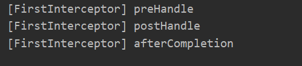
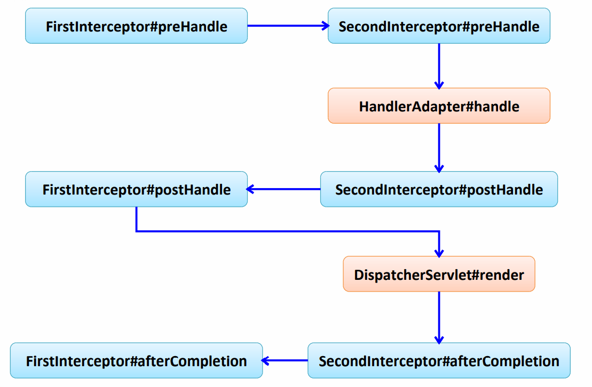

# SpringMVC概述及Helloworld

## 概述

- Spring 为展现层提供的基于 MVC 设计理念的优秀的 Web 框架，是目前最主流的 MVC 框架之一 
- Spring3.0 后全面超越 Struts2，成为最优秀的 MVC 框架
- Spring MVC 通过一套 MVC 注解，让 POJO 成为处理请 求的控制器，而无须实现任何接口
- 支持 REST 风格的 URL 请求
- 采用了松散耦合可插拔组件结构，比其他 MVC 框架更具 扩展性和灵活性 

## HelloWorld

- 建动态web工程，导入jar包


> 注：jar包一定要放在web/WEB-INF中，Tomcat才能够识别并使用

-   在 web.xml 中配置 DispatcherServlet 

~~~xml
<!-- 配置 DispatcherServlet -->
    <servlet>
        <servlet-name>dispatcherServlet</servlet-name>
        <servlet-class>org.springframework.web.servlet.DispatcherServlet</servlet-class>
        <!-- 配置 DispatcherServlet 的一个初始化参数: 配置 SpringMVC 配置文件的位置和名称 -->
        <!--
            实际上也可以不通过 contextConfigLocation 来配置 SpringMVC 的配置文件, 而使用默认的.
            默认的配置文件为: /WEB-INF/<servlet-name>-servlet.xml
        -->
<!--        <init-param>-->
<!--            <param-name>contextConfigLocation</param-name>-->
<!--            <param-value>classpath:WEB-INF/springmvc.xml</param-value>-->
<!--        </init-param>-->
        <load-on-startup>1</load-on-startup>
    </servlet>

    <servlet-mapping>
        <servlet-name>dispatcherServlet</servlet-name>
        <url-pattern>/</url-pattern>
    </servlet-mapping>
~~~

> 其中`<init-param>`用来配置 SpringMVC 配置文件的位置和名称，不配置也行，默认的配置文件为: /WEB-INF/`<servlet-name>`-servlet.xml

- 加入 Spring MVC 的配置文件 


 （1）配置自动扫描的包 

~~~xml
<!-- 配置自动扫描的包 -->
    <context:component-scan base-package="com.atguigu.springmvc.handlers"></context:component-scan>
~~~

（2） 配置视图解析器：视图名称解析器：将视图逻辑 名解析为: /WEB-INF/pages/views/`<view-name>`.jsp

~~~xml
<!-- 配置视图解析器: 如何把 handler 方法返回值解析为实际的物理视图 -->
    <bean class="org.springframework.web.servlet.view.InternalResourceViewResolver">
        <property name="prefix" value="/WEB-INF/views/"></property>
        <property name="suffix" value=".jsp"></property>
    </bean>
~~~

-  创建请求处理器类 

~~~java
@Controller
public class HelloWorld {

	/**
	 * 1. 使用 @RequestMapping 注解来映射请求的 URL
	 * 2. 返回值会通过视图解析器解析为实际的物理视图, 对于 InternalResourceViewResolver 视图解析器, 会做如下的解析:
	 * 通过 prefix + returnVal + 后缀 这样的方式得到实际的物理视图, 然会做转发操作
	 * 
	 * /WEB-INF/views/success.jsp
	 * 
	 * @return
	 */
	@RequestMapping("/helloworld")
	public String hello(){
		System.out.println("hello world");
		return "success";
	}
	
}
~~~

- 在配置的指定路径下创建物理视图success.jsp


**第一个程序遇到的问题**：在第一次运行行，一直报404错误，检测了好几遍代码，发现没问题，后面查看了一下tomcat的日志，终于发现了问题：


是由于jar导入不成功造成的，后面去项目结构中fix了一下jar包就解决问题了

#  @RequestMapping

> （1）Spring MVC 使用 @RequestMapping 注解为控制器指定可以处理哪些 URL 请求 
>
> （2）DispatcherServlet 截获请求后，就通过控制器上 @RequestMapping 提供的映射信息确定请求所对应的处理方法 

## 使用@RequestMapping映射请求

**@RequestMapping 除了修饰方法, 还可来修饰类**

类定义处：提供初步的请求映射信息。相对于 WEB 应用的根目录

方法处: 提供进一步的细分映射信息。 相对于类定义处的 URL。若类定义处未标注 @RequestMapping，则方法处标记的 URL相对于WEB 应用的根目录

代码测试:

~~~java
@RequestMapping("/springmvc")
@Controller
public class SpringMVCTest {
    private static final String SUCCESS = "success";
    @RequestMapping("/testRequestMapping")
    public String testRequestMapping() {
        System.out.println("testRequestMapping");
        return SUCCESS;
    }
}

~~~

~~~jsp
<a href="springmvc/testRequestMapping">Test RequestMapping</a>
~~~


##  映射请求参数、请求方法或请求头 

>  （1）@RequestMapping 除了可以使用请求 URL 映射请求外， 还可以使用请求方法、请求参数及请求头映射请求 
>
>  （2）@RequestMapping 的 value、method、params 及 heads  分别表示请求 URL、请求方法、请求参数及请求头的映射条 件，他们之间是与的关系，联合使用多个条件可让请求映射 更加精确化 

 params 和 headers支持简单的表达式 ：

- param1: 表示请求必须包含名为 param1 的请求参数 
- !param1: 表示请求不能包含名为 param1 的请求参数 
- param1 != value1: 表示请求包含名为 param1 的请求参数，但其值 不能为 value1
- {“param1=value1”, “param2”}: 请求必须包含名为 param1 和param2  的两个请求参数，且 param1 参数的值必须为 value

代码测试:

~~~java
/**
	 * 了解: 可以使用 params 和 headers 来更加精确的映射请求. params 和 headers 支持简单的表达式.
	 * 
	 * @return
	 */
	@RequestMapping(value = "testParamsAndHeaders", params = { "username", "age!=10"},headers = {"Accept-language=zh-CN,zh;q=0.9,en;q=0.8,en-GB;q=0.7,en-US;q=0.6"})
    public String testParamsAndHeaders() {
        System.out.println("testParamsAndHeaders");
        return SUCCESS;
    }

	/**
	 * 常用: 使用 method 属性来指定请求方式
	 */
	@RequestMapping(value = "/testMethod", method = RequestMethod.POST)
	public String testMethod() {
		System.out.println("testMethod");
		return SUCCESS;
	}
~~~


##  Ant 风格资源地址

 Ant 风格资源地址支持 3 种匹配符： 

- ?：匹配文件名中的一个字符
  -   /user/*/createUser------>匹配 /user/aaa/createUser、/user/bbb/createUser 等 URL  
- *：匹配文件名中的任意字符 
  -   /user/**/createUser: 匹配 /user/createUser、/user/aaa/bbb/createUser 等 URL 
- `**：**` 匹配多层路径 
  -  /user/createUser??: 匹配 /user/createUseraa、/user/createUserbb 等 URL

代码测试

~~~java
@RequestMapping("/testAntPath/*/abc")
	public String testAntPath() {
		System.out.println("testAntPath");
		return SUCCESS;
	}
	
~~~

~~~jsp
<a href="springmvc/testAntPath/mnxyz/abc">Test AntPath</a>
~~~

##  @PathVariable 映射URL绑定的占位符 

>  通过 @PathVariable 可以将 URL 中占位符参数绑定到控 制器处理方法的入参中：URL 中的 {xxx} 占位符可以通过 @PathVariable("xxx") 绑定到操作方法的入参中 

代码测试

~~~java
@RequestMapping(value = "/testRest/{id}", method = RequestMethod.GET)
	public String testRest(@PathVariable Integer id) {
		System.out.println("testRest GET: " + id);
		return SUCCESS;
	}
~~~


##  HiddenHttpMethodFilter过滤器

###  REST 

>  REST：即 Representational State Transfer。（资源）表现层状态转化。是目前 最流行的一种互联网软件架构。它结构清晰、符合标准、易于理解、扩展方便， 所以正得到越来越多网站的采用 
>
> 具体说：HTTP 协议里面，四个表示操作方式的动 词：GET、POST、PUT、DELETE。它们分别对应四种基本操作：GET 用来获 取资源，POST 用来新建资源，PUT 用来更新资源，DELETE 用来删除资源 

 示例：

- /order/1 HTTP GET ：得到 id = 1 的 order  
- /order/1 HTTP DELETE：删除 id = 1的 order  
- /order/1 HTTP PUT：更新id = 1的 order  
- /order HTTP POST：新增 order 

>  浏览器 form 表单只支持 GET  与 POST 请求，而DELETE、PUT 等 method 并不支 持，Spring3.0 添加了一个过滤器，可以将这些请求转换 为标准的 http 方法，使得支持 GET、POST、PUT 与 DELETE 请求 ------------------------------------->HiddenHttpMethodFilter

### HiddenHttpMethodFilter的使用

- web.xml中配置过滤器

~~~xml
<!--
	配置 org.springframework.web.filter.HiddenHttpMethodFilter: 可以把 POST 请求转为 DELETE 或 POST 请求
	-->
    <filter>
        <filter-name>HiddenHttpMethodFilter</filter-name>
        <filter-class>org.springframework.web.filter.HiddenHttpMethodFilter</filter-class>
    </filter>

    <filter-mapping>
        <filter-name>HiddenHttpMethodFilter</filter-name>
        <url-pattern>/*</url-pattern>
    </filter-mapping>
~~~

- 编写index.jsp

~~~jsp
<form action="springmvc/testRest/1" method="post">
  <input type="hidden" name="_method" value="PUT"/>
  <input type="submit" value="TestRest PUT"/>
</form>
<br><br>

<form action="springmvc/testRest/1" method="post">
  <input type="hidden" name="_method" value="DELETE"/>
  <input type="submit" value="TestRest DELETE"/>
</form>
<br><br>

<form action="springmvc/testRest" method="post">
  <input type="submit" value="TestRest POST"/>
</form>
<br><br>

<a href="springmvc/testRest/1">Test Rest Get</a>
<br><br>
~~~

- 编写控制器

~~~java
@RequestMapping(value = "/testRest/{id}", method = RequestMethod.PUT)
    public String testRestPut(@PathVariable Integer id) {
        System.out.println("testRest Put: " + id);
        return SUCCESS;
    }

    @RequestMapping(value = "/testRest/{id}", method = RequestMethod.DELETE)
    public String testRestDelete(@PathVariable Integer id) {
        System.out.println("testRest Delete: " + id);
        return SUCCESS;
    }

    @RequestMapping(value = "/testRest", method = RequestMethod.POST)
    public String testRestPost() {
        System.out.println("testRest POST");
        return SUCCESS;
    }

    @RequestMapping(value = "/testRest/{id}", method = RequestMethod.GET)
    public String testRestGet(@PathVariable Integer id) {
        System.out.println("testRest GET: " + id);
        return SUCCESS;
    }
~~~


> 总结：
>
> Rest 风格的 URL. 以 CRUD 为例: 新增: /order POST 修改: /order/1 PUT update?id=1 获取:/order/1 GET get?id=1 删除: /order/1 DELETE delete?id=1
>
> 如何发送 PUT 请求和 DELETE 请求？
>
> - 需要配置 HiddenHttpMethodFilter
> - 需要发送 POST 请求
> - 需要在发送 POST 请求时携带一个 name="_method" 的隐藏域, 值为 DELETE 或 PUT
>
> 在 SpringMVC 的目标方法中如何得到 id ？
>
> - 使用 @PathVariable 注解

**运行中的错误：**通过DELETE和PUT请求时无法转发至success.jsp

**解决办法：**

​		  （1）将tomcat版本降到8一下

​		  （2）在控制器中将转发改成重定向

~~~java
@RequestMapping(value = "/testRest/{id}", method = RequestMethod.DELETE)
    public String testRestDelete(@PathVariable Integer id) {
        System.out.println("testRest Delete: " + id);
        return SUCCESS;
        return "redirect:/index.jsp";
    }
~~~

##  @RequestParam 绑定请求参数值 

>  在处理方法入参处使用 @RequestParam 可以把请求参 数传递给请求方法 

- value 值即请求参数的参数名 
- required 该参数是否必须. 默认为 true
- defaultValue 请求参数的默认值

代码测试:

~~~java
 /**
     * @RequestParam 来映射请求参数. value 值即请求参数的参数名 required 该参数是否必须. 默认为 true
     *               defaultValue 请求参数的默认值
     */
    @RequestMapping(value = "/testRequestParam")
    public String testRequestParam(@RequestParam(value = "username") String username,@RequestParam (value = "age",required = false, defaultValue = "0")Integer age){
        System.out.println("testRequestParam, username: " + username + ", age: " + age);
        return SUCCESS;
    }
~~~


## @RequestHeader 绑定请求报头的属性值 

>  请求头包含了若干个属性，服务器可据此获知客户端的信 息，通过 @RequestHeader 即可将请求头中的属性值绑定到处理方法的形参中 

~~~java
 @RequestMapping("/testRequestHeader")
    public String testRequestHeader(
            @RequestHeader(value = "Accept-Language") String al) {
        System.out.println("testRequestHeader, Accept-Language: " + al);
        return SUCCESS;
    }
~~~

##  @CookieValue 绑定请求中的 Cookie 值 

>  @CookieValue 可让处理方法入参绑定某个 Cookie 值 

~~~java
@RequestMapping("/testCookieValue")
    public String testCookieValue(@CookieValue("JSESSIONID") String sessionId) {
        System.out.println("testCookieValue: sessionId: " + sessionId);
        return SUCCESS;
    }
~~~

##  entity对象绑定请求参数值 

>  Spring MVC 会按请求参数名和 POJO 属性名进行自动匹 配，自动为该对象填充属性值。支持级联属性。 如：dept.deptId、dept.address.tel 等 

代码演示:

~~~java
@RequestMapping("/testPojo")
    public String testPojo(User user) {
        System.out.println("testPojo: " + user);
        return SUCCESS;
    }


/*User*/
public class User {
	
	private Integer id;
	
	private String username;
	private String password;

	private String email;
	private int age;
	
	private Address address;
}
/*Address*/

public class Address {

	private String province;
	private String city;
}
~~~

~~~jsp
<form action="springmvc/testPojo" method="post">
  username: <input type="text" name="username"/>
  <br>
  password: <input type="password" name="password"/>
  <br>
  email: <input type="text" name="email"/>
  <br>
  age: <input type="text" name="age"/>
  <br>
  city: <input type="text" name="address.city"/>
  <br>
  province: <input type="text" name="address.province"/>
  <br>
  <input type="submit" value="Submit"/>
</form>
<br><br>
~~~


##  Servlet API 作为入参 

> 可以使用 Serlvet 原生的 API 作为目标方法的参数 
> 具体支持以下类型
>
> - HttpServletRequest 
> - HttpServletResponse 
> - HttpSession
> - java.security.Principal 
> - Locale InputStream 
> - OutputStream 
> - Reader 
> - Writer

代码演示:

~~~java
@RequestMapping("/testServletAPI")
    public void testServletAPI(HttpServletRequest request,
                               HttpServletResponse response, Writer out) throws IOException {
        System.out.println("testServletAPI, " + request + ", " + response);
        out.write("hello springmvc");
//		return SUCCESS;
    }
~~~

#  处理模型数据 

##  ModelAndView 

>  控制器处理方法的返回值如果为 ModelAndView, 则其既 包含视图信息，也包含模型数据信息 

 添加模型数据 :

- MoelAndView addObject(String attributeName, Object  attributeValue) 
- ModelAndView addAllObject(Map modelMap) 

 设置视图 :

- void setView(View view )
-  void setViewName(String viewName) 

代码测试

~~~java
 @RequestMapping("/testModelAndView")
    public ModelAndView testModelAndView(){
        String viewName = SUCCESS;
        ModelAndView modelAndView = new ModelAndView(viewName);

        modelAndView.addObject("time", new Date());
        return modelAndView;
    }
~~~

执行结果：


> 总结：目标方法的返回值可以是 ModelAndView 类型。其中可以包含视图和模型信息
>
> SpringMVC 会把 ModelAndView 的 model 中数据放入到 request 域对象中.

##  Map 及 Model 

>  Spring MVC 在内部使用了一个 org.springframework.ui.Model 接口存 储模型数据 

 具体步骤 ：

-  Spring MVC 在调用方法前会创建一个隐 含的模型对象作为模型数据的存储容器 
-  如果方法的入参为 Map 或 Model 类 型，Spring MVC 会将隐含模型的引用传 递给这些入参。在方法体内，开发者可以 通过这个入参对象访问到模型中的所有数 据，也可以向模型中添加新的属性数据 

代码演示:

~~~java
/**
     * 目标方法可以添加 Map 类型(实际上也可以是 Model 类型或 ModelMap 类型)的参数.
     * @param map
     * @return
     */
    @RequestMapping("/testMap")
    public String testMap(Map<String, Object> map){
        System.out.println(map.getClass().getName());
        map.put("names", Arrays.asList("Tom", "Jerry", "Mike"));
        return SUCCESS;
    }
~~~

运行效果：


##  @SessionAttributes 

> - 若希望在多个请求之间共用某个模型属性数据，则可以在 控制器类上标注一个 @SessionAttributes, Spring MVC  将在模型中对应的属性暂存到 HttpSession 中 
> -  @SessionAttributes 除了可以通过属性名指定需要放到会 话中的属性外，还可以通过模型属性的对象类型指定哪些 模型属性需要放到会话中 
>   -  @SessionAttributes(types=User.class) 会将隐含模型中所有类型 为 User.class 的属性添加到会话中。 
>   - @SessionAttributes(value={“user1”, “user2”}) 
>   - @SessionAttributes(types={User.class, Dept.class}) 
>   - @SessionAttributes(value={“user1”, “user2”},  types={Dept.class} )

代码示例:

~~~JAVA
RequestMapping("/springmvc")
@SessionAttributes(value={"user"}, types={String.class})
@Controller
public class SpringMVCTest {
    private static final String SUCCESS = "success";
    /**
     * @SessionAttributes
     * 除了可以通过属性名指定需要放到会话中的属性外(实际上使用的是 value 属性值),
     * 还可以通过模型属性的对象类型指定哪些模型属性需要放到会话中(实际上使用的是 types 属性值)
     *
     * 注意: 该注解只能放在类的上面. 而不能修饰放方法.
     */
    @RequestMapping("/testSessionAttributes")
    public String testSessionAttributes(Map<String, Object> map){
        User user = new User("Tom", "123456", "tom@atguigu.com", 15);
        map.put("user", user);
        map.put("school", "atguigu");
        return SUCCESS;
    }
}
~~~

运行效果：


##  @ModelAttribute

-  在方法定义上使用 @ModelAttribute 注解：Spring MVC  在调用目标处理方法前，会先逐个调用在方法级上标注了 @ModelAttribute 的方法 
-  在方法的入参前使用 @ModelAttribute 注解： 
  - 可以从隐含对象中获取隐含的模型数据中获取对象，再将请求参数 绑定到对象中，再传入入参 
  - 将方法入参对象添加到模型中

>  应用场景：当需要修改一个entity的部分属性，最后得到一个完整对象时使用。

图解：


代码演示:

~~~java
 @ModelAttribute
    public void getUser(@RequestParam(value="id",required=false) Integer id,
                        Map<String, Object> map){
        System.out.println("modelAttribute method");
        if(id != null){
            //模拟从数据库中获取对象
            User user = new User(1, "Tom", "123456", "tom@atguigu.com", 12);
            System.out.println("从数据库中获取一个对象: " + user);

            map.put("user", user);
        }
    }
    
    @RequestMapping("/testModelAttribute")
    public String testModelAttribute(User user){
        System.out.println("修改: " + user);
        return SUCCESS;
    }
~~~

不是用ModelAttribute时的运行结果:


使用ModelAttribute的运行结果


**运行流程(初理解):**

- 执行 @ModelAttribute 注解修饰的方法: 从数据库中取出对象, 把对象放入到了 Map 中. 键为: user
- SpringMVC 从 Map 中取出 User 对象, 并把表单的请求参数赋给该 User 对象的对应属性
- SpringMVC 把上述对象传入目标方法的参数

> 注意: 在 @ModelAttribute 修饰的方法中, 放入到 Map 时的键需要和目标方法入参类型的第一个字母小写的字符串一致


**源代码分析的流程**：

- 调用 @ModelAttribute 注解修饰的方法. 实际上把 @ModelAttribute 方法中 Map 中的数据放在了 implicitModel 中
- 解析请求处理器的目标参数, 实际上该目标参数来自于 WebDataBinder 对象的 target 属性
  - 创建 WebDataBinder 对象:
    - 确定 objectName 属性: 
      - 若传入的 attrName 属性值为 "", 则 objectName 为类名第一个字母小写 
      - 若目标方法的 entity 属性使用了 @ModelAttribute 来修饰, 则 attrName 值即为 @ModelAttribute 的 value 属性值
    - 确定 target 属性：
      - 在 implicitModel 中查找 attrName 对应的属性值. 若存在, ok
      - 若不存在: 则验证当前 Handler 是否使用了 @SessionAttributes 进行修饰, 若使用了, 则尝试从 Session 中获取 attrName 所对应的属性值. 若 session 中没有对应的属性值, 则抛出了异常
      - 若 Handler 没有使用 @SessionAttributes 进行修饰, 或 @SessionAttributes 中没有使用 value 值指定的 key和 attrName 相匹配, 则通过反射创建了 entity 对象
  - SpringMVC 把表单的请求参数赋给了 WebDataBinder 的 target 对应的属性
  - SpringMVC 会把 WebDataBinder 的 attrName 和 target 给到 implicitModel，近而传到 request 域对象中
  - 把 WebDataBinder 的 target 作为参数传递给目标方法的入参


**SpringMVC 确定目标方法 POJO 类型入参的过程**

- 确定一个 key
  - 若目标方法的 POJO 类型的参数没有使用 @ModelAttribute 作为修饰, 则 key 为 POJO 类名第一个字母的小写
  - 若使用了  @ModelAttribute 来修饰, 则 key 为 @ModelAttribute 注解的 value 属性值
- 在 implicitModel 中查找 key 对应的对象, 若存在, 则作为入参传入
  - 若在 @ModelAttribute 标记的方法中在 Map 中保存过, 且 key 和 第1点确定的 key 一致, 则会获取到
- 若 implicitModel 中不存在 key 对应的对象, 则检查当前的 Handler 是否使用 @SessionAttributes 注解修饰若使用了该注解, 且 @SessionAttributes 注解的 value 属性值中包含了 key, 则会从 HttpSession 中来获取 key 所对应的 value 值, 若存在则直接传入到目标方法的入参中. 若不存在则将抛出异常
- 若 Handler 没有标识 @SessionAttributes 注解或 @SessionAttributes 注解的 value 值中不包含 key, 则会通过反射来创建 POJO 类型的参数, 传入为目标方法的参数
- SpringMVC 会把 key 和 POJO 类型的对象保存到 implicitModel 中, 进而会保存到 request 中


**总结**

- 有 @ModelAttribute 标记的方法, 会在每个目标方法执行之前被 SpringMVC 调用! 
- @ModelAttribute 注解也可以来修饰目标方法 POJO 类型的入参, 其 value 属性值有如下的作用: 
  - SpringMVC 会使用 value 属性值在 implicitModel 中查找对应的对象, 若存在则会直接传入到目标方法的入参中. 
  -  SpringMVC 会以value 为 key, POJO 类型的对象为 value, 存入到 request 中


##  由@SessionAttributes引发的异常 

>  如果在处理类定义处标注了@SessionAttributes(“xxx”)，则 尝试从会话中获取该属性，并将其赋给该入参，然后再用 请求消息填充该入参对象。如果在会话中找不到对应的属 性，则抛出 HttpSessionRequiredException 异常 

解决方法:

- 不适用@SessionAttributes
- 使用@ModelAttribute注解在方法上

类似于：

~~~java
@Controller
@RequestMapping("/user")
@SessionAttributes(“user”)
public class UserController {
    //该方法会往隐含模型中添加一个名为user的模型属性
    @ModelAttribute("user")
    public User getUser(){
        User user = new User();
        return user;
    }
}

~~~

# 视图和视图解析器

图解SpringMVC解析视图(简图):


**说明**:

-  请求处理方法执行完成后，最终返回一个 ModelAndView 对象。对于那些返回 String，View 或 ModeMap 等类型的 处理方法，Spring MVC 也会在内部将它们装配成一个 ModelAndView 对象，它包含了逻辑名和模型对象的视图 
-  Spring MVC 借助视图解析器（ViewResolver）得到最终 的视图对象（View），最终的视图可以是 JSP ，也可能是 Excel、JFreeChart 等各种表现形式的视图 
-  对于最终究竟采取何种视图对象对模型数据进行渲染，处 理器并不关心，处理器工作重点聚焦在生产模型数据的工 作上，从而实现 MVC 的充分解耦 

##  视图 

- 视图的作用是渲染模型数据，将模型里的数据以某种形式呈现给客户
-  为了实现视图模型和具体实现技术的解耦，Spring 在 org.springframework.web.servlet 包中定义了一个高度抽象的 View 接口 

 

-  视图对象由视图解析器负责实例化。由于视图是无状态的，所以他们 不会有线程安全的问题 

-  常用的视图实现类 


### JSTLView

-  若项目中使用了 JSTL，则 SpringMVC 会自动把视图由 InternalResourceView 转为 JstlView 
-  若使用 JSTL 的 fmt 标签则需要在 SpringMVC 的配置文件中配置国际化资源文件 

~~~xml
 <!-- 配置国际化资源文件 -->
    <bean id="messageSource"
          class="org.springframework.context.support.ResourceBundleMessageSource">
        <property name="basename" value="i18n"></property>
    </bean>
~~~

~~~jsp
 <fmt:message key="i18n.username"></fmt:message>
    <br><br>

    <fmt:message key="i18n.password"></fmt:message>
~~~

##  视图解析器 

-  SpringMVC 为逻辑视图名的解析提供了不同的策略，可 以在 Spring WEB 上下文中配置一种或多种解析策略，并 指定他们之间的先后顺序。每一种映射策略对应一个具体 的视图解析器实现类 
-  视图解析器的作用比较单一：将逻辑视图解析为一个具体 的视图对象 
-  所有的视图解析器都必须实现 ViewResolver 接口 


-  常用的视图解析器实现类 


###  InternalResourceViewResolver

>  JSP 是最常见的视图技术，可以使用 InternalResourceViewResolver 作为视图解析器 


### mvc:view-controller标签

>  若希望直接响应通过 SpringMVC 渲染的页面，可以使用 mvc:view-controller 标签实现 
>
> 若只加mvc:view-controller，则会使之前的RequestMapping失效
>
> 解决办法:SpringMVC加上此配置
>
> ~~~xml
> <mvc:annotation-driven></mvc:annotation-driven>
> ~~~

## 自定义视图

**视图类**：

```java
/**
 * @author cVzhanshi
 * @create 2021-04-21 15:27
 */

@Component
public class HelloView implements View {
    @Override
    public String getContentType() {
        //返回视图类型
        return "text/html";
    }

    //渲染视图
    @Override
    public void render(Map<String, ?> map, HttpServletRequest httpServletRequest, HttpServletResponse httpServletResponse) throws Exception {
        httpServletResponse.getWriter().print("hello view time:" + new Date());
    }
}

```

> 说明：一定要加@Component注解，因为通过BeanNameViewResolver视图解析器解析视图，是通过名字在ioc容器中找到对应的视图，所以一定要加

**配置BeanNameViewResolver视图解析器**

~~~xml
<!-- 配置视图  BeanNameViewResolver 解析器: 使用视图的名字来解析视图 -->
    <!-- 通过 order 属性来定义视图解析器的优先级, order 值越小优先级越高 -->
    <bean class="org.springframework.web.servlet.view.BeanNameViewResolver">
        <property name="order" value="100"></property>
    </bean>
~~~

> 说明： 每个视图解析器都实现了 Ordered 接口并开放出一个 order 属性，可 以通过 order 属性指定解析器的优先顺序，order 越小优先级越高 ，InternalResourceViewResolver的默认order是最大整数

**handler**

~~~java
@RequestMapping("/testView")
    public String testView(){
        System.out.println("testView");
        return "helloView";
    }
~~~

**运行效果**


## 重定向

-  一般情况下，控制器方法返回字符串类型的值会被当成逻 辑视图名处理 

-  如果返回的字符串中带 forward: 或 redirect: 前缀 时，SpringMVC 会对他们进行特殊处理：将 forward: 和 redirect: 当成指示符，其后的字符串作为 URL 来处理 

  -  redirect:success.jsp：会完成一个到 success.jsp 的重定向的操作 
  -  forward:success.jsp：会完成一个到 success.jsp 的转发操作 

  底层代码:

  

# RESTful CRUD 

## RESTful CRUD显示所有员工

### 需求


### 具体实现

index.jsp

~~~jsp
<a href="emps">List All Employees</a>
~~~

handler.java

```java
 @RequestMapping("/emps")
    public String list(Map<String,Object> map){
        map.put("employees",employeeDao.getAll());
        return "list";
    }
```

list.jsp

```jsp
<%@ taglib prefix="c" uri="http://java.sun.com/jsp/jstl/core" %>
<%@ page contentType="text/html;charset=UTF-8" language="java" %>
<html>
<head>
    <title>Title</title>
</head>
<body>
    <c:if test="${empty requestScope.employees }">
        没有任何员工信息.
    </c:if>
    <c:if test="${not empty requestScope.employees }">
        <table border="1" cellpadding="10" cellspacing="0">
            <tr>
                <th>ID</th>
                <th>LastName</th>
                <th>Email</th>
                <th>Gender</th>
                <th>Department</th>
                <th>Edit</th>
                <th>Delete</th>
            </tr>

            <c:forEach items="${requestScope.employees }" var="emp">
                <tr>
                    <td>${emp.id }</td>
                    <td>${emp.lastName }</td>
                    <td>${emp.email }</td>
                    <td>${emp.gender == 0 ? 'Female' : 'Male' }</td>
                    <td>${emp.department.departmentName }</td>
                    <td><a href="#">Edit</a></td>
                    <td><a href="#">Delete</a></td>
                </tr>
            </c:forEach>
        </table>
    </c:if>
    <br>
    <a href="emp">Add New Employee</a>
</body>
</html>
```

## RESTful CRUD添加操作&Spring表单标签

### Spring表单标签

>  通过 SpringMVC 的表单标签可以实现将模型数据 中的属性和 HTML 表单元素相绑定，以实现表单 数据更便捷编辑和表单值的回显 

#### from标签

- 一般情况下，通过 GET 请求获取表单页面，而通过 POST 请求提交表单页面，因此获取表单页面和提交表单 页面的 URL 是相同的。只要满足该最佳条件的契 约， 标签就无需通过 action 属性指定表单 提交的 URL 
- 可以通过 modelAttribute 属性指定绑定的模型属性，若没有指定该属性，则默认从 request 域对象中读取 command 的表单 bean，如果该属性值也不存在，则会发生错误

####  表单标签 

>  SpringMVC 提供了多个表单组件标签，如 、 等，用以绑定表单字段的 属性值，它们的共有属性如下 ：
>
> - path：表单字段，对应 html 元素的 name 属性，支持级联属性 
> - htmlEscape：是否对表单值的 HTML 特殊字符进行转换，默认值 为 true 
> - cssClass：表单组件对应的 CSS 样式类名 
> - cssErrorClass：表单组件的数据存在错误时，采取的 CSS 样式 

- form:input、form:password、form:hidden、form:textarea ：对应 HTML 表单的 text、password、hidden、textarea 标签 
-  form:radiobutton：单选框组件标签，当表单 bean 对应的 属性值和 value 值相等时，单选框被选中
-  form:radiobuttons：单选框组标签，用于构造多个单选框
  -  items：可以是一个 List、String[] 或 Map
  - itemValue：指定 radio 的 value 值。可以是集合中 bean 的一个 属性值
  - itemLabel：指定 radio 的 label 值 
  - delimiter：多个单选框可以通过 delimiter 指定分隔符 
-  form:checkbox：复选框组件。用于构造单个复选框 
- form:checkboxs：用于构造多个复选框。使用方式同 form:radiobuttons 标签
- form:select：用于构造下拉框组件。使用方式同 form:radiobuttons 标签 
- form:option：下拉框选项组件标签。使用方式同 form:radiobuttons 标签 
- form:errors：显示表单组件或数据校验所对应的错误 
  - 显示表单所有的错误
  - 显示所有以 user 为前缀的属性对应 的错误 
  - 显示特定表单对象属性的错 

### 添加操作

#### 需求


#### 具体实现

list.jsp中的跳转

```jsp
 <a href="emp">Add New Employee</a>
```

handler.java

```java
@RequestMapping(value = "/emp",method = RequestMethod.GET)
    public String input(Map<String, Object> map){
        //显示部门信息
        map.put("departments", departmentDao.getDepartments());
        map.put("employee", new Employee());
        return "input";
    }
```

input.jsp

```jsp
<body>

<!--
		1. WHY 使用 form 标签呢 ?
		可以更快速的开发出表单页面, 而且可以更方便的进行表单值的回显
		2. 注意:
		可以通过 modelAttribute 属性指定绑定的模型属性,
		若没有指定该属性，则默认从 request 域对象中读取 command 的表单 bean
		如果该属性值也不存在，则会发生错误。
	-->
    <br><br>
    <form:form action="${pageContext.request.contextPath }/emp" method="post" modelAttribute="employee">
        <!-- path 属性对应 html 表单标签的 name 属性值 -->
        <c:if test="${employee.id == null }">
            <!-- path 属性对应 html 表单标签的 name 属性值 -->
            LastName: <form:input path="lastName"/>
            <br>
        </c:if>
        <c:if test="${employee.id != null }">
            <form:hidden path="id"/>
            <input type="hidden" name="_method" value="PUT"/>
            <%-- 对于 _method 不能使用 form:hidden 标签, 因为 modelAttribute 对应的 bean 中没有 _method 这个属性 --%>
            <%--
            <form:hidden path="_method" value="PUT"/>
            --%>
        </c:if>
        Email: <form:input path="Email"/>
        <br>
        <%
            Map<String, String> genders = new HashMap();
            genders.put("1", "Male");
            genders.put("0", "Female");
            request.setAttribute("genders", genders);
        %>
        Gender:
        <br>
        <form:radiobuttons path="gender" items="${genders }" delimiter="<br>"/>
        <br>
        Department: <form:select path="department.id" items="${departments }" itemLabel="departmentName" itemValue="id">
                    </form:select>
        <br>
        <input type="submit" value="Submit"/>
    </form:form>
</body>
```

提交返回列表页面

handler.java

```java
@RequestMapping(value = "/emp",method = RequestMethod.POST)
    public String save(Employee employee){
        employeeDao.save(employee);
        return "redirect:/emps";
    }
```

## RESTful CRUD删除操作&修改操作&静态资源处理

### 静态资源处理

-  优雅的 REST 风格的资源URL 不希望带 .html 或 .do 等后缀
-  若将 DispatcherServlet 请求映射配置为 /，则 Spring MVC 将捕获 WEB 容器的所有请求，包括静态资源的请求， SpringMVC 会将他 们当成一个普通请求处理，因找不到对应处理器将导致错误
-  可以在 SpringMVC 的配置文件中配置`<mvc:default-servlet-handler/>`的方式解决静态资源的问题： 
  -   将在 SpringMVC 上下文中定义一个 DefaultServletHttpRequestHandler，它会对进入 DispatcherServlet 的 请求进行筛查，如果发现是没有经过映射的请求，就将该请求交由 WEB  应用服务器默认的 Servlet 处理，如果不是静态资源的请求，才由 DispatcherServlet 继续处理 
  -  一般 WEB 应用服务器默认的 Servlet 的名称都是 default。若所使用的 WEB 服务器的默认 Servlet 名称不是 default，则需要通过 default-servlet-name属性显式指定 

### 删除操作&修改操作

#### 需求


#### 删除具体实现

请求

~~~jsp
<td><a class="delete" href="emp/${emp.id}">Delete</a></td>
~~~

把get请求转化为put请求进而转化为delete请求

~~~js
<script type="text/javascript">
        $(function () {
            //alert("jquery");
            $("a.delete").click(function(){
                var href = $(this).attr("href");
                $("form").attr("action", href).submit();
                return false;
            });
        });
    </script>
~~~

```jsp
 <form action="" method="POST">
        <input type="hidden" name="_method" value="DELETE"/>
    </form>
```

控制器处理，重定向到员工列表

handler.java

```java
@RequestMapping(value="/emp/{id}", method=RequestMethod.DELETE)
    public String delete(@PathVariable("id") Integer id){
        employeeDao.delete(id);
        return "redirect:/emps";
    }
```

#### 修改具体实现

请求先到输入页面

```jsp
<td><a href="emp/${emp.id}">Edit</a></td>
```

handler.java

```java
@RequestMapping(value="/emp/{id}", method=RequestMethod.GET)
    public String input (@PathVariable("id") Integer id,Map<String ,Object> map){
        //回显的信息
        map.put("employee",employeeDao.get(id));
        map.put("departments", departmentDao.getDepartments());
        return "input";
    }
```

input.jsp

> lastName不能修改就不显示出来，用jstl
>
> 提交的时候试着一个隐藏项，
>
>  <input type="hidden" name="_method" value="PUT"/>
>
> 让过滤器转化为PUT请求


```jsp
<body>
<!--
		1. WHY 使用 form 标签呢 ?
		可以更快速的开发出表单页面, 而且可以更方便的进行表单值的回显
		2. 注意:
		可以通过 modelAttribute 属性指定绑定的模型属性,
		若没有指定该属性，则默认从 request 域对象中读取 command 的表单 bean
		如果该属性值也不存在，则会发生错误。
	-->
    <br><br>
    <form:form action="${pageContext.request.contextPath }/emp" method="post" modelAttribute="employee">
        <!-- path 属性对应 html 表单标签的 name 属性值 -->
        <c:if test="${employee.id == null }">
            <!-- path 属性对应 html 表单标签的 name 属性值 -->
            LastName: <form:input path="lastName"/>
            <br>
        </c:if>
        <c:if test="${employee.id != null }">
            <form:hidden path="id"/>
            <input type="hidden" name="_method" value="PUT"/>
            <%-- 对于 _method 不能使用 form:hidden 标签, 因为 modelAttribute 对应的 bean 中没有 _method 这个属性 --%>
            <%--
            <form:hidden path="_method" value="PUT"/>
            --%>
        </c:if>
        Email: <form:input path="Email"/>
        <br>
        <%
            Map<String, String> genders = new HashMap();
            genders.put("1", "Male");
            genders.put("0", "Female");
            request.setAttribute("genders", genders);
        %>
        Gender:
        <br>
        <form:radiobuttons path="gender" items="${genders }" delimiter="<br>"/>
        <br>
        Department: <form:select path="department.id" items="${departments }" itemLabel="departmentName" itemValue="id">
                    </form:select>
        <br>
        <input type="submit" value="Submit"/>
    </form:form>
</body>
```

修改处理：

```java
//需要用@ModelAttribute取出一个对象，因为是部分修改
@ModelAttribute
    public void getEmployee(@RequestParam(value="id",required=false) Integer id, Map<String, Object> map){
        if(id != null){
            map.put("employee", employeeDao.get(id));
        }
    }

 @RequestMapping(value="/emp", method=RequestMethod.PUT)
    public String update(Employee employee){
        employeeDao.save(employee);
        return "redirect:/emps";
    }
```

#  数据转换&数据格式化&数据校验

## 数据转换

###  数据绑定流程 

1.  Spring MVC 主框架将 ServletRequest 对象及目标方法的入参实例传递给 WebDataBinderFactory 实例，以创建 DataBinder 实例对象 
2.  DataBinder 调用装配在 Spring MVC 上下文中的 ConversionService 组件进行数据类型转换、数据格式化工作。将 Servlet 中的请求信息填充到入参对象中 
3.  调用 Validator 组件对已经绑定了请求消息的入参对象 进行数据合法性校验，并最终生成数据绑定结果 BindingData 对象  
4. Spring MVC 抽取 BindingResult 中的入参对象和校验错误对象，将它们赋给处理方法的响应入参 

 **Spring MVC 通过反射机制对目标处理方法进行解析，将请 求消息绑定到处理方法的入参中。数据绑定的核心部件是 DataBinder，运行机制如下 :**


###  自定义类型转换器 

>  Spring MVC 上下文中内建了很多转换器，可完成大多数 Java 类型的转换工作


 **Spring 定义了 3 种类型的转换器接口，实现任意一个转换 器接口都可以作为自定义转换器注册到 ConversionServiceFactroyBean中** ：

- Converter<S,T>：将 S 类型对象转为 T 类型对象 
-  ConverterFactory：将相同系列多个 “同质” Converter 封装在一 起。如果希望将一种类型的对象转换为另一种类型及其子类的对 象（例如将 String 转换为 Number 及 Number 子类 （Integer、Long、Double 等）对象）可使用该转换器工厂类 
-  GenericConverter：会根据源类对象及目标类对象所在的宿主类 中的上下文信息进行类型转换 

注：一般都用第一个

具体实现：

自定义转换器:

> lastname-email-gender-department.id 例如: GG-gg@atguigu.com-0-105
> 将字符串转换成Emploee类型

```java
@Component
public class EmployeeConverter implements Converter<String, Employee> {

	@Override
	public Employee convert(String source) {
		if(source != null){
			String [] vals = source.split("-");
			//GG-gg@atguigu.com-0-105
			if(vals != null && vals.length == 4){
				String lastName = vals[0];
				String email = vals[1];
				Integer gender = Integer.parseInt(vals[2]);
				Department department = new Department();
				department.setId(Integer.parseInt(vals[3]));
				
				Employee employee = new Employee(null, lastName, email, gender, department);
				System.out.println(source + "--convert--" + employee);
				return employee;
			}
		}
		return null;
	}

}
```

SpringMVC配置文件配置FormattingConversionServiceFactoryBean

~~~xml
<!-- 在实际开发中通常都需配置 mvc:annotation-driven 标签 -->
<!--会将自定义的 ConversionService 注册到
Spring MVC 的上下文-->
<mvc:annotation-driven conversion-service="conversionService"></mvc:annotation-driven>

    <!-- 配置 ConversionService -->
    <bean id="conversionService"
          class="org.springframework.format.support.FormattingConversionServiceFactoryBean">
        <property name="converters">
            <set>
                <ref bean="employeeConverter"/>
            </set>
        </property>
    </bean>
~~~

```jsp
<form action="testConversionServiceConverer" method="POST">
        <!-- lastname-email-gender-department.id 例如: GG-gg@atguigu.com-0-105 -->
        Employee: <input type="text" name="employee"/>
        <input type="submit" value="Submit"/>
    </form>
```

handler.java

```java
@RequestMapping("/testConversionServiceConverer")
    public String testConverter(@RequestParam("employee") Employee employee){
        System.out.println("save: " + employee);
        employeeDao.save(employee);
        return "redirect:/emps";
    }
```

###  关于mvc:annotation-driven

>   mvc:annotation-driven会自动注 册RequestMappingHandlerMapping 、RequestMappingHandlerAdapter 与 ExceptionHandlerExceptionResolver 三个bean 
>
>  还将提供以下支持： 
>
> - 支持使用 ConversionService 实例对表单参数进行类型转换
> - 支持使用 @NumberFormat annotation、@DateTimeFormat 注解完成数据类型的格式化
> - 支持使用 @Valid 注解对 JavaBean 实例进行 JSR 303 验证
> - 支持使用 @RequestBody 和 @ResponseBody 注 


### @InitBinder

-  由 @InitBinder 标识的方法，可以对 WebDataBinder 对 象进行初始化。WebDataBinder 是 DataBinder 的子类，用 于完成由表单字段到 JavaBean 属性的绑定 
-  @InitBinder方法不能有返回值，它必须声明为void 
-  @InitBinder方法的参数通常是是 WebDataBinder 

用法:


## 数据格式化

-  对属性对象的输入/输出进行格式化，从其本质上讲依然 属于 “类型转换” 的范畴 
-  Spring 在格式化模块中定义了一个实现 ConversionService 接口的 FormattingConversionService 实现类，该实现类扩展 了 GenericConversionService，因此它既具有类型转换的 功能，又具有格式化的功能
-  FormattingConversionService 拥有一个 FormattingConversionServiceFactroyBean 工厂类， 后者用于在 Spring 上下文中构造前者

**FormattingConversionServiceFactroyBean**

- FormattingConversionServiceFactroyBean 内部已经注册了：
  -  NumberFormatAnnotationFormatterFactroy：支持对数字类型的属性 使用 @NumberFormat 注解
    -  style：类型为NumberFormat.Style。用于指定样式类 型，包括三种：Style.NUMBER（正常数字类型）、 Style.CURRENCY（货币类型）、 Style.PERCENT（ 百分数类型） 
    -  pattern：类型为 String，自定义样式， 如patter="#,###"
  -   JodaDateTimeFormatAnnotationFormatterFactroy：支持对日期类型 的属性使用 @DateTimeFormat 注解 
    -  pattern 属性：类型为字符串。指定解析/格式化字段数据的模式， 如：”yyyy-MM-dd hh:mm:ss
    -  iso 属性：类型为 DateTimeFormat.ISO。指定解析/格式化字段数据 的ISO模式，包括四种：ISO.NONE（不使用） -- 默 认、ISO.DATE(yyyy-MM-dd) 、ISO.TIME(hh:mm:ss.SSSZ)、 ISO.DATE_TIME(yyyy-MM-dd hh:mm:ss.SSSZ)
    -  style 属性：字符串类型。通过样式指定日期时间的格式，由两位字 符组成，第一位表示日期的格式，第二位表示时间的格式：S：短日 期/时间格式、M：中日期/时间格式、L：长日期/时间格式、F：完整 日期/时间格式、-：忽略日期或时间格式
-  装配了 FormattingConversionServiceFactroyBean 后，就可 以在 Spring MVC 入参绑定及模型数据输出时使用注解驱动 了。`<mvc:annotation-driven>`默认创建的 

**代码示例**

```java
@DateTimeFormat(pattern="yyyy-MM-dd")
private Date birth;

@NumberFormat(pattern="#,###,###.#")
private Float salary;
```

## 数据校验

###  JSR 303 

- JSR 303 是 Java 为 Bean 数据合法性校验提供的标准框架
-  JSR 303 通过在 Bean 属性上标注类似于 @NotNull、@Max  等标准的注解指定校验规则，并通过标准的验证接口对 Bean  进行验证


###  Spring MVC数据校验 

-  Spring 4.0以上拥有自己独立的数据校验框架，同时支持 JSR  303 标准的校验框架
-  Spring 在进行数据绑定时，可同时调用校验框架完成数据校 验工作。在 Spring MVC 中，可直接通过注解驱动的方式 进行数据校验
-  Spring 的 LocalValidatorFactroyBean 既实现了 Spring 的 Validator 接口，也实现了 JSR 303 的 Validator 接口。只要 在 Spring 容器中定义了一个 LocalValidatorFactoryBean，即可将其注入到需要数据校 验的 Bean 中
-  Spring 本身并没有提供 JSR303 的实现，所以必须将 JSR303 的实现者的 jar 包放到类路径下
-  `<mvc:annotation-driven>` 会默认装配好一个 LocalValidatorFactoryBean，通过在处理方法的入参上标 注 @valid 注解即可让 Spring MVC 在完成数据绑定后执行 数据校验的工作
-  在已经标注了 JSR303 注解的表单/命令对象前标注一个 @Valid，Spring MVC 框架在将请求参数绑定到该入参对象 后，就会调用校验框架根据注解声明的校验规则实施校验
-  Spring MVC 是通过对处理方法签名的规约来保存校验结果 的：前一个表单/命令对象的校验结果保存到随后的入参 中，这个保存校验结果的入参必须是 BindingResult 或 Errors 类型
  - 其中: 需校验的 Bean 对象和其绑定结果对象或错误对象时成对出现的，它们 之间不允许声明其他的入参，类似于（Employee employee, BindingResult result）两个对象中不能有其他对象。
  -  Errors 接口提供了获取错误信息的方法，如 getErrorCount() 或 getFieldErrors(String field)
  -  BindingResult 扩展了 Errors 接口

图示:


**使用总结**

> ①. 使用 JSR 303 验证标准
>
> ②. 加入 hibernate validator 验证框架的 jar 包
>
> ③. 在 SpringMVC 配置文件中添加 <mvc:annotation-driven />
>
> ④. 需要在 bean 的属性上添加对应的注解
>
> ⑤. 在目标方法 bean 类型的前面添加 @Valid 注解

####  在目标方法中获取校验结果 

>  在表单/命令对象类的属性中标注校验注解，在处理方法对 应的入参前添加 @Valid，Spring MVC 就会实施校验并将校 验结果保存在被校验入参对象之后的 BindingResult 或 Errors 入参中
>
>  常用方法： 
>
> – FieldError getFieldError(String field) 
>
> – List getFieldErrors() 
>
> – Object getFieldValue(String field) 
>
> – Int getErrorCount() 

####  在页面上显示错误

-  Spring MVC 除了会将表单/命令对象的校验结果保存到对 应的 BindingResult 或 Errors 对象中外，还会将所有校验 结果保存到 “隐含模型”
-  即使处理方法的签名中没有对应于表单/命令对象的结果 入参，校验结果也会保存在 “隐含对象” 中
-  隐含模型中的所有数据最终将通过 HttpServletRequest 的 属性列表暴露给 JSP 视图对象，因此在 JSP 中可以获取 错误信息
-  在 JSP 页面上可通过`<form:errors path=“userName”>`显示错误消息 

####  提示消息的国际化 

-  每个属性在数据绑定和数据校验发生错误时，都会生成一 个对应的 FieldError 对象
-  当一个属性校验失败后，校验框架会为该属性生成 4 个消 息代码，这些代码以校验注解类名为前缀，结合 modleAttribute、属性名及属性类型名生成多个对应的消 息代码：例如 User 类中的 password 属性标准了一个 @Pattern 注 解，当该属性值不满足 @Pattern 所定义的规则时, 就会产生以下 4  个错误代码：
  -  Pattern.user.password 
  -  Pattern.password 
  -   Pattern.java.lang.String
  -  Pattern
- **当使用 Spring MVC 标签显示错误消息时， Spring MVC 会查看 WEB 上下文是否装配了对应的国际化消息，如果没有，则显示默认 的错误消息，否则使用国际化消息**
-  若数据类型转换或数据格式转换时发生错误，或该有的参 数不存在，或调用处理方法时发生错误，都会在隐含模型 中创建错误消息。其错误代码前缀说明如下 :
  -  **required**：必要的参数不存在。如 @RequiredParam(“param1”)  标注了一个入参，但是该参数不存在
  - **typeMismatch**：在数据绑定时，发生数据类型不匹配的问题 
  - **methodInvocation**：Spring MVC 在调用处理方法时发生了错误 

i18n.properties配置文件

~~~properties
NotEmpty.employee.lastName=lastname不为空
Email.employee.email=Email格式不对
Past.employee.birth=Birth必须在过去的时间段中 

typeMismatch.employee.birth=Birth数据转换错误
~~~

#  处理 JSON：使用HttpMessageConverter

使用示例:

-  加入 jar 包


-  编写目标方法，使其返回 JSON 对应的对象或集合
-  在方法上添加 @ResponseBody 注解 

```java
	@ResponseBody
    @RequestMapping("/testJson")
    public Collection<Employee> testJson(){
        return employeeDao.getAll();
    }
```

```js
<a href="testJson" id="testJson">Test Json</a>
<script type="text/javascript" src="scripts/jquery-1.9.1.min.js"></script>
    <script type="text/javascript">
        $(function(){
            $("#testJson").click(function(){
                var url = this.href;
                var args = {};
                $.post(url, args, function(data){
                    for(var i = 0; i < data.length; i++){
                        var id = data[i].id;
                        var lastName = data[i].lastName;

                        alert(id + ": " + lastName);
                    }
                });
                return false;
            });
        })
    </script>
```


##  HttpMessageConverter`<T>`

>  HttpMessageConverter`<t>`是 Spring3.0 新添加的一个接 口，负责将请求信息转换为一个对象（类型为 T），将对象（ 类型为 T）输出为响应信息 

原理图解


 **HttpMessageConverter`<T>`实现类** 


>  DispatcherServlet 默认装配 RequestMappingHandlerAdapter ，而 RequestMappingHandlerAdapter 默认装配如下 HttpMessageConverter
>
> 前提： 加入 jackson jar 包后， RequestMappingHandlerAdapter 装配的 HttpMessageConverter 

代码示例:

```jsp
<br><br>
    <form action="testHttpMessageConverter" method="POST">
        File: <input type="file" name="file"/>
        Desc: <input type="text" name="desc"/>
        <input type="submit" value="Submit"/>
    </form>

    <br><br>

    <a href="testResponseEntity">Test ResponseEntity</a>
```

handler.java

```java
@RequestMapping("/testResponseEntity")
    public ResponseEntity<byte[]> testResponseEntity(HttpSession session) throws IOException {
        byte [] body = null;
        ServletContext servletContext = session.getServletContext();
        System.out.println(servletContext.getContextPath());
        InputStream in = servletContext.getResourceAsStream("/files/abc.txt");
        body = new byte[in.available()];
        in.read(body);

        HttpHeaders headers = new HttpHeaders();
        headers.add("Content-Disposition", "attachment;filename=abc.txt");

        HttpStatus statusCode = HttpStatus.OK;

        ResponseEntity<byte[]> response = new ResponseEntity<byte[]>(body, headers, statusCode);
        return response;
    }

    @ResponseBody
    @RequestMapping("/testHttpMessageConverter")
    public String testHttpMessageConverter(@RequestBody String body){
        System.out.println(body);
        return "helloworld! " + new Date();
    }
```

# 国际化

-  默认情况下，SpringMVC 根据 Accept-Language 参数 判断客户端的本地化类型
-  当接受到请求时，SpringMVC 会在上下文中查找一个本 地化解析器（LocalResolver），找到后使用它获取请求 所对应的本地化类型信息
-  SpringMVC 还允许装配一个动态更改本地化类型的拦截 器，这样通过指定一个请求参数就可以控制单个请求的本 地化类型


 **SessionLocaleResolver & LocaleChangeInterceptor 工作原理**


其中：

-  SessionLocaleResolver：根据 Session 中特定的属性确定本 地化类型
-  LocaleChangeInterceptor：从请求参数中获取本次请求对应 的本地化类型
-  AcceptHeaderLocaleResolver：根据 HTTP 请求头的 Accept-Language 参数确定本地化类型，如果没有显式定义 本地化解析器， SpringMVC 使用该解析器 

> 如果配置文件中加载了SessionLocalResolver解析器，SpringMVC 便会使用SessionLocalResolver解析器

**案例使用**

Sprinmvc配置文件配置SessionLocaleResolver和LocaleChangeInterceptor

~~~xml
<!-- 配置 SessionLocalResolver -->
<bean id="localeResolver"
      class="org.springframework.web.servlet.i18n.SessionLocaleResolver"></bean>

<mvc:interceptors>
    <!-- 配置 LocaleChanceInterceptor -->
    <bean class="org.springframework.web.servlet.i18n.LocaleChangeInterceptor"></bean>
</mvc:interceptors>
~~~

创建国际化配置文件


index.jsp

```jsp
<a href="i18n">I18N PAGE</a>
```

handler.java

```java
@RequestMapping("/i18n")
    public String testI18n(Locale locale){
        String val = messageSource.getMessage("i18n.user", null, locale);
        System.out.println(val);
        return "i18n";
    }

```

i18n.jsp/i18n2.jsp

```jsp
<fmt:message key="i18n.user"></fmt:message>
	
	<br><br>
	<a href="i18n2">I18N2 PAGE</a>
	
	<br><br>
	<a href="i18n?locale=zh_CH">中文</a>
	
	<br><br>
	<a href="i18n?locale=en_US">英文</a>
```

> 个人总结：当需要进行页面国际化的时候，发送的请求需要带有name=locale的参数来说明国际化的地区，
>
> 发送请求后，LocaleChangeInterceptor会根据参数解析出一个Locale对象，进而获取出LocaleResonlver对象，再之，SessionLocaleResolver会把Locale对象存入session域中，在渲染页面的时候会从session中取出Locale对象根据不同的地域用不同的语言渲染页面。

# 文件的上传

-  Spring MVC 为文件上传提供了直接的支持，这种支持是通 过即插即用的 MultipartResolver 实现的。Spring 用 Jakarta Commons FileUpload 技术实现了一个 MultipartResolver 实现类：CommonsMultipartResovler
-  Spring MVC 上下文中默认没有装配 MultipartResovler，因 此默认情况下不能处理文件的上传工作，如果想使用 Spring  的文件上传功能，需现在上下文中配置 MultipartResolver

**文件上传案例**

1、导入必要的jar包


2、在SrpingMVC上下文中配置 MultipartResolver

```xml
<bean id="multipartResolver" class="org.springframework.web.multipart.commons.CommonsMultipartResolver">

    <!-- 请求的编码格式, 和 jsp 页面一致 -->
    <property name="defaultEncoding" value="UTF-8"></property>
    <!-- 上传文件大小限制 -->
    <property name="maxUploadSize" value="1024000"></property>
</bean>
```

3、具体实现

jsp页面

```jsp
 <form action="testFileUpload" method="POST" enctype="multipart/form-data">
        File: <input type="file" name="file"/>
        Desc: <input type="text" name="desc"/>
        <input type="submit" value="Submit"/>
    </form>
```

handler控制器

```java
@RequestMapping("/testFileUpload")
public String testFileUpload(@RequestParam("desc") String desc,
                             @RequestParam("file") MultipartFile file) throws IOException{
    System.out.println("desc: " + desc);
    System.out.println("OriginalFilename: " + file.getOriginalFilename());
    System.out.println("InputStream: " + file.getInputStream());
    return "success";
}
```

4、运行结果


# 拦截器

>  Spring MVC也可以使用拦截器对请求进行拦截处理，用户 可以自定义拦截器来实现特定的功能，自定义的拦截器必 须实现HandlerInterceptor接口
>
> -  preHandle()：这个方法在业务处理器处理请求之前被调用，在该 方法中对用户请求 request 进行处理。如果程序员决定该拦截器对 请求进行拦截处理后还要调用其他的拦截器，或者是业务处理器去 进行处理，则返回true；如果程序员决定不需要再调用其他的组件 去处理请求，则返回false
> -  postHandle()：这个方法在业务处理器处理完请求后，但 是DispatcherServlet 向客户端返回响应前被调用，在该方法中对 用户请求request进行处理
> -  afterCompletion()：这个方法在 DispatcherServlet 完全处理完请 求后被调用，可以在该方法中进行一些资源清理的操作

## **自定义拦截器（“hello world”）**

FirstInterceptor.java

```java
/**
 * @author cVzhanshi
 * @create 2021-04-24 14:39
 */
public class FirstInterceptor implements HandlerInterceptor {
    /**
     * 该方法在目标方法之前被调用.
     * 若返回值为 true, 则继续调用后续的拦截器和目标方法.
     * 若返回值为 false, 则不会再调用后续的拦截器和目标方法.
     *
     * 可以考虑做权限. 日志, 事务等.
     */
    @Override
    public boolean preHandle(HttpServletRequest request,
                             HttpServletResponse response, Object handler) throws Exception {
        System.out.println("[FirstInterceptor] preHandle");
        return true;
    }

    /**
     * 调用目标方法之后, 但渲染视图之前.
     * 可以对请求域中的属性或视图做出修改.
     */
    @Override
    public void postHandle(HttpServletRequest request,
                           HttpServletResponse response, Object handler,
                           ModelAndView modelAndView) throws Exception {
        System.out.println("[FirstInterceptor] postHandle");
    }

    /**
     * 渲染视图之后被调用. 释放资源
     */
    @Override
    public void afterCompletion(HttpServletRequest request,
                                HttpServletResponse response, Object handler, Exception ex)
            throws Exception {
        System.out.println("[FirstInterceptor] afterCompletion");
    }
}

```

SpringMVC.xml

```xml
<!--    配置拦截器-->
    <mvc:interceptors>
        <!-- 配置自定义的拦截器 -->
        <bean class="com.atguigu.springmvc.interceptors.FirstInterceptor"></bean>

    </mvc:interceptors>
```

运行效果



拦截器中方法的执行顺序


## 拦截器配置文件中的属性

```xml
<!-- 配置 SessionLocalResolver -->
    <bean id="localeResolver"
          class="org.springframework.web.servlet.i18n.SessionLocaleResolver"></bean>


    <!--配置拦截器-->
    <mvc:interceptors>
        <!-- 配置自定义的拦截器 -->
        <!--拦截所有资源-->
        <bean class="com.atguigu.springmvc.interceptors.FirstInterceptor"></bean>

        <!-- 配置拦截器(不)作用的路径 -->
        <!--拦截指定资源-->
        <mvc:interceptor>
            <mvc:mapping path="/emps"/>
            <bean class="com.atguigu.springmvc.interceptors.SecondInterceptor"></bean>
        </mvc:interceptor>

        <!-- 配置 LocaleChanceInterceptor -->
        <bean class="org.springframework.web.servlet.i18n.LocaleChangeInterceptor"></bean>
    </mvc:interceptors>
```

## 多个拦截器方法的执行顺序

配置多个拦截器的执行效果：


所以当preHandle都返回true时：



所以当有的拦截器preHandle都返回false时：


# 异常处理

## 概述

>  Spring MVC 通过 HandlerExceptionResolver 处理程序 的异常，包括 Handler 映射、数据绑定以及目标方法执行 时发生的异常

 SpringMVC 提供的 HandlerExceptionResolver 的实现类 


-  DispatcherServlet 默认装配的 HandlerExceptionResolver ： 

  - 没有使用 `<mvc:annotation-driven/> `配置：

  

  - 使用了 `<mvc:annotation-driven/>` 配置：

  

##  @ExceptionHandler注解

​	代码示例

```jsp
    <a href="testExceptionHandlerExceptionResolver?i=10">Test ExceptionHandlerExceptionResolver</a>

```

```java
@ExceptionHandler({ArithmeticException.class})
	public ModelAndView handleArithmeticException(Exception ex){
		System.out.println("出异常了: " + ex);
		ModelAndView mv = new ModelAndView("error");
		mv.addObject("exception", ex);
		return mv;
	}

    @RequestMapping("/testExceptionHandlerExceptionResolver")
    public String testExceptionHandlerExceptionResolver(@RequestParam("i") int i){
        System.out.println("result: " + (10 / i));
        return "success";
    }
```

运行效果：


> 说明：当运行时出现了异常，会去找@ExceptionHandler注解的处理方法进行处理

**@ExceptionHandler的小细节**

- 在 @ExceptionHandler 方法的入参中可以加入 Exception 类型的参数, 该参数即对应发生的异常对象
-  @ExceptionHandler 方法的入参中不能传入 Map. 若希望把异常信息传导页面上, 需要使用 ModelAndView 作为返回值
- @ExceptionHandler 方法标记的异常有优先级的问题，若有多个不同优先级的异常处理方法，会选择最接近的处理方法处理
- @ControllerAdvice: 如果在当前 Handler 中找不到 @ExceptionHandler 方法来出来当前方法出现的异常,则将去 @ControllerAdvice 标记的类中查找 @ExceptionHandler 标记的方法来处理异常

```java
@ControllerAdvice
public class SpringMVCTestExceptionHandler {

    @ExceptionHandler({ArithmeticException.class})
    public ModelAndView handleArithmeticException(Exception ex){
        System.out.println("----> 出错了 " + ex);
        ModelAndView mv = new ModelAndView("error");
        mv.addObject("exception", ex);
        return mv;
    }

}
```

##  ResponseStatusExceptionResolver

>  在异常及异常父类中找到 @ResponseStatus 注解，然 后使用这个注解的属性进行处理

-  定义一个 @ResponseStatus 注解修饰的异常类


-  若在处理器方法中抛出了上述异常： 若ExceptionHandlerExceptionResolver 不解析述异常。由于 触发的异常 UnauthorizedException 带有@ResponseStatus 注解。因此会被ResponseStatusExceptionResolver 解析 到。最后响应HttpStatus.UNAUTHORIZED 代码给客户端

**@ResponseStatus注解的使用**

1、使用在异常类上

```java
//value是状态码
@ResponseStatus(value= HttpStatus.FORBIDDEN, reason="用户名和密码不匹配!")
public class UserNameNotMatchPasswordException extends RuntimeException{

    /**
     *
     */
    private static final long serialVersionUID = 1L;
}
```

运行效果:


> 说明：当我们抛出了带有@ResponseStatus的异常类，服务器会返回我们一个异常页面，状态码和说明都是注解上的value和reason等等属性

2、使用在处理方法上

```java
@ResponseStatus(reason="测试",value=HttpStatus.NOT_FOUND)
    @RequestMapping("/testResponseStatusExceptionResolver")
    public String testResponseStatusExceptionResolver(@RequestParam("i") int i){
        if(i == 13){
            throw new UserNameNotMatchPasswordException();
        }
        System.out.println("testResponseStatusExceptionResolver...");

        return "success";
    }
```

运行效果


> 说明：就算没有异常，也会返回错误页面

##  DefaultHandlerExceptionResolver

>  对一些特殊的异常进行处理，比 如NoSuchRequestHandlingMethodException、HttpReques tMethodNotSupportedException、HttpMediaTypeNotSuppo rtedException、HttpMediaTypeNotAcceptableException 等

##  SimpleMappingExceptionResolver

>  如果希望对所有异常进行统一处理，可以使用 SimpleMappingExceptionResolver，它将异常类名映射为 视图名，即发生异常时使用对应的视图报告异常

如何映射？通过配置文件映射

```xml
<!-- 配置使用 SimpleMappingExceptionResolver 来映射异常 -->
	<bean class="org.springframework.web.servlet.handler.SimpleMappingExceptionResolver">
		<property name="exceptionAttribute" value="ex"></property>
		<property name="exceptionMappings">
			<props>
				<prop key="java.lang.ArrayIndexOutOfBoundsException">error</prop>
			</props>
		</property>
	</bean>	
```

> 说明：SimpleMappingExceptionResolver会把异常信息传到页面的域上，页面上接收异常信息的默认名字是exception，如需修改用配置中的value属性修改

# SpringMVC的运行流程


#  在 Spring 的环境下使用 SpringMVC

>  Spring 的 IOC 容器不应该扫描 SpringMVC 中的 bean, 对应的 SpringMVC 的 IOC 容器不应该扫描 Spring 中的 bean

示例:

bean.xml(Spting)

```xml
<context:component-scan base-package="com.atguigu.springmvc">
		<context:exclude-filter type="annotation" 
			expression="org.springframework.stereotype.Controller"/>
		<context:exclude-filter type="annotation" 
			expression="org.springframework.web.bind.annotation.ControllerAdvice"/>
```

springmvc.xml

```xml
<context:component-scan base-package="com.atguigu.springmvc" use-default-filters="false">
		<context:include-filter type="annotation" 
			expression="org.springframework.stereotype.Controller"/>
		<context:include-filter type="annotation" 
			expression="org.springframework.web.bind.annotation.ControllerAdvice"/>
	</context:component-scan>
```

> 其中： Spring MVC WEB 层容器可作为 “业务层” Spring  容器的子容器：即 WEB 层容器可以引用业务层 容器的 Bean，而业务层容器却访问不到 WEB 层 容器的 Bean
>
> 即：SpringMVC 的 IOC 容器中的 bean 可以来引用 Spring IOC 容器中的 bean. 
> 		返回来呢 ? 反之则不行. Spring IOC 容器中的 bean 却不能来引用 SpringMVC IOC 容器中的 bean!


#  SpringMVC 对比 Struts2

- Spring MVC 的入口是 Servlet, 而 Struts2 是 Filter
- Spring MVC 会稍微比 Struts2 快些. Spring MVC 是基 于方法设计, 而 Sturts2 是基于类, 每次发一次请求都会实 例一个 Action.
- Spring MVC 使用更加简洁, 开发效率Spring MVC确实 比 struts2 高: 支持 JSR303, 处理 ajax 的请求更方便
- Struts2 的 OGNL 表达式使页面的开发效率相比 Spring MVC 更高些. 