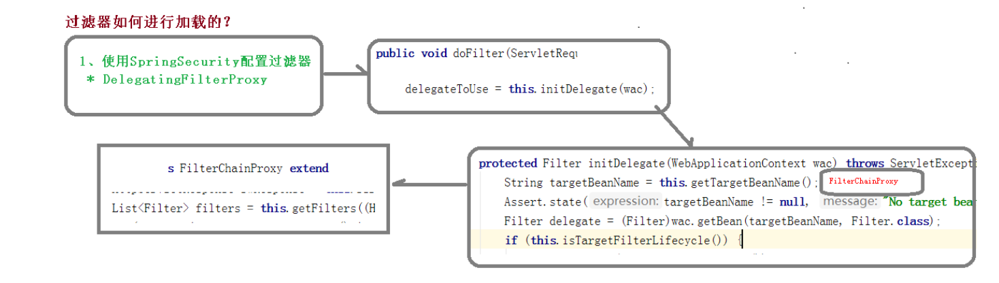
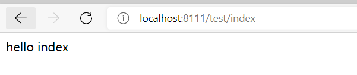
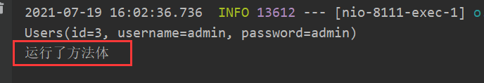
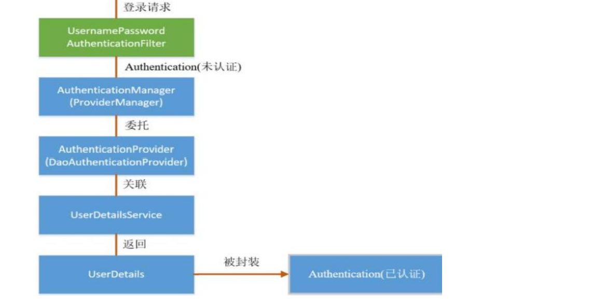
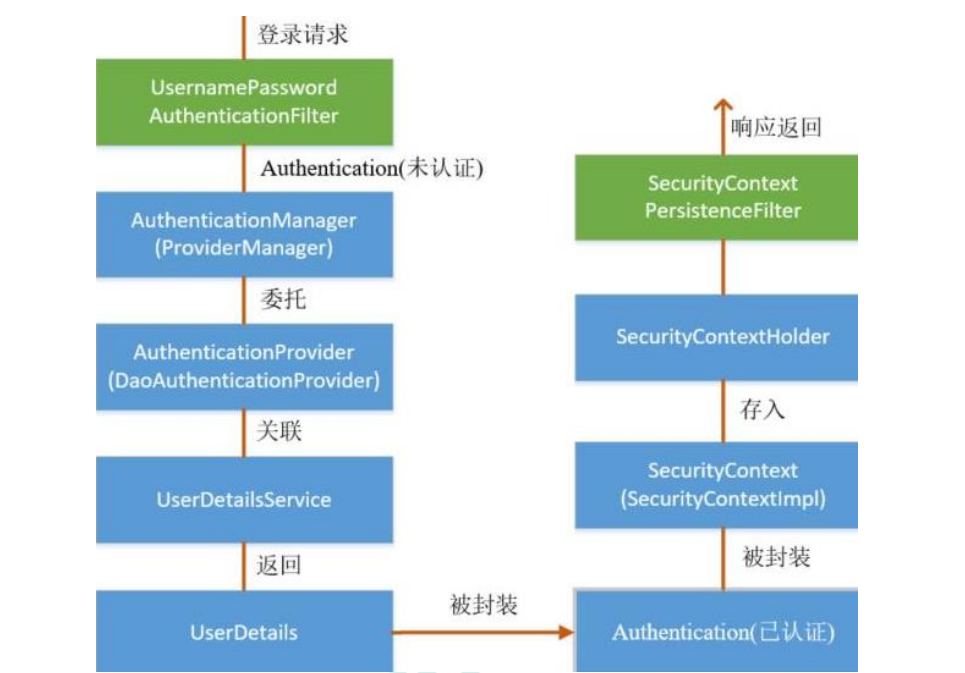

# ① SpringSecurity概述&Helloworld

## 1.1  SpringSecurity 概述

- Spring 是非常流行和成功的 Java 应用开发框架，Spring Security 正是 Spring 家族中的 成员。Spring Security 基于 Spring 框架，提供了一套 Web 应用安全性的完整解决方 案。
-  正如你可能知道的关于安全方面的两个主要区域是“认证”和“授权”（或者访问控 制），一般来说，Web 应用的安全性包括**用户认证（Authentication）**和**用户授权 （Authorization）**两个部分，这两点也是 Spring Security 重要核心功能。
  - **用户认证**指的是：验证某个用户是否为系统中的合法主体，也就是说用户能否访问 该系统。用户认证一般要求用户提供用户名和密码。系统通过校验用户名和密码来完成认 证过程。**通俗点说就是系统认为用户是否能登录** 
  - **用户授权**指的是验证某个用户是否有权限执行某个操作。在一个系统中，不同用户 所具有的权限是不同的。比如对一个文件来说，有的用户只能进行读取，而有的用户可以 进行修改。一般来说，系统会为不同的用户分配不同的角色，而每个角色则对应一系列的 权限。**通俗点讲就是系统判断用户是否有权限去做某些事情。** 

## 1.2 SpringSecurity的特点

**SpringSecurity的特点**

- 和 Spring 无缝整合
- 全面的权限控制
-  专门为 Web 开发而设计
  - 旧版本不能脱离 Web 环境使用
  - 新版本对整个框架进行了分层抽取，分成了核心模块和 Web 模块。单独 引入核心模块就可以脱离 Web 环境
- 重量级

-----

**与Shiro的对比**

-----

**Shiro特点**： 

- **轻量级**。Shiro 主张的理念是把复杂的事情变简单。针对对性能有更高要求 的互联网应用有更好表现
- **通用性**
  - 好处：不局限于 Web 环境，可以脱离 Web 环境使用
  - 在 Web 环境下一些特定的需求需要手动编写代码定制。  

>  相对于 Shiro，在 SSM 中整合 Spring Security 都是比较麻烦的操作，所以，Spring  Security 虽然功能比 Shiro 强大，但是使用反而没有 Shiro 多（Shiro 虽然功能没有 Spring Security 多，但是对于大部分项目而言，Shiro 也够用了）。 自从有了 Spring Boot 之后，Spring Boot 对于 Spring Security 提供了自动化配置方 案，可以使用更少的配置来使用 Spring Security。 
>
> 因此，一般来说常见的技术栈的组合有：
>
> - SSM + Shiro
> - SpringBoot + SpringSecurity

## 1.3 Hello World

- 创建一个SpringBoot项目

- 导入依赖

```xml
<dependencies>
    <dependency>
        <groupId>org.springframework.boot</groupId>
        <artifactId>spring-boot-starter-web</artifactId>
    </dependency>
    <dependency>
        <groupId>org.springframework.boot</groupId>
        <artifactId>spring-boot-starter-security</artifactId>
    </dependency>
    <dependency>
        <groupId>org.springframework.boot</groupId>
        <artifactId>spring-boot-starter-test</artifactId>
        <scope>test</scope>
    </dependency>
</dependencies>
```

- 编写主启动类

```java
/**
 * @author cVzhanshi
 * @create 2021-07-17 13:13
 */

@SpringBootApplication
public class SpringSecurityApplication {
    public static void main(String[] args) {
        SpringApplication.run(SpringSecurityApplication.class,args);
    }
}
```

- 建controller包编写Controller类

```java
/**
 * @author cVzhanshi
 * @create 2021-07-17 13:16
 */
@RestController
@RequestMapping("/test")
public class TestController {

    @RequestMapping("/hello")
    public String add(){
        return "hello security";
    }
}
```

- 运行测试

> 发现并没有跳转到指定的接口而是要求你登录，说明security集成成功


> security有默认的账号密码
>
> 账号：user
>
> 密码要求控制台找
>
> 

> 登录进去
>
> 

# ② SpringSecurity的基本原理

## 2.1 SpringSecurity的本质

 **SpringSecurity 本质是一个过滤器链**

 项目启动是可以获取到过滤器链，会自动装载这些过滤器：

```java
org.springframework.security.web.context.request.async.WebAsyncManagerIntegrationFil
ter
org.springframework.security.web.context.SecurityContextPersistenceFilter 
org.springframework.security.web.header.HeaderWriterFilter
org.springframework.security.web.csrf.CsrfFilter
org.springframework.security.web.authentication.logout.LogoutFilter 
org.springframework.security.web.authentication.UsernamePasswordAuthenticationFilter 
org.springframework.security.web.authentication.ui.DefaultLoginPageGeneratingFilter 
org.springframework.security.web.authentication.ui.DefaultLogoutPageGeneratingFilter
org.springframework.security.web.savedrequest.RequestCacheAwareFilter
org.springframework.security.web.servletapi.SecurityContextHolderAwareRequestFilter
org.springframework.security.web.authentication.AnonymousAuthenticationFilter 
org.springframework.security.web.session.SessionManagementFilter 
org.springframework.security.web.access.ExceptionTranslationFilter 
org.springframework.security.web.access.intercept.FilterSecurityInterceptor
```

## 2.2 解析三个重点过滤器

 **代码底层流程：重点看三个过滤器** 

-  **FilterSecurityInterceptor**：是一个方法级的权限过滤器, 基本位于过滤链的最底部


> - super.beforeInvocation(filterInvocation) 表示查看之前的 filter 是否通过。
> - filterInvocation.getChain().doFilter(filterInvocation.getRequest(), filterInvocation.getResponse());表示真正的调用后台的服务 

-  **ExceptionTranslationFilter**：是个异常过滤器，用来处理在认证授权过程中抛出的异常 


-  **UsernamePasswordAuthenticationFilter** ：对/login 的 POST 请求做拦截，校验表单中用户 名，密码 


## 2.3 过滤器加载过程

**过滤器加载过程(SpringBoot会帮我们自动装配，但是如果事SSM项目就需要我们自己装配)**

- 要使用SpringSecurity需要配置过滤器**DelegatingFilterProxy**



## 2.4 两个接口的解读

### 2.4.1 UserDetailsService接口解读

> - 当什么也没有配置的时候，账号和密码是由 Spring Security 定义生成的。而在实际项目中 账号和密码都是从数据库中查询出来的。 所以我们要通过自定义逻辑控制认证逻辑 
>
> - 如果需要自定义逻辑时，只需要实现 UserDetailsService 接口即可 

- 查看接口源码，可知返回值是UserDetails


- 查看UserDetails


- 所以我们只要使用他的实现类就行  **User**


- 使用

> 创建类继承UsernamePasswordAuthenticationFilter,重写三个方法
> 创建类实现UserDetailService,编写查询数据过程，返回User对象这个User对象是安全框架提供对象

### 2.4.2  PasswordEncoder接口解读

> 数据加密接口,用于返回User对象里面密码加密

- 接口源码解读

```java
public interface PasswordEncoder {
    // 表示把参数按照特定的解析规则进行解析
    String encode(CharSequence rawPassword);
    // 表示验证从存储中获取的编码密码与编码后提交的原始密码是否匹配。如果密码匹配，则返回 true；如果不匹配，则返回 false。第一个参数表示需要被解析的密码。第二个参数表示存储的密码。
    boolean matches(CharSequence rawPassword, String encodedPassword);
    // 表示如果解析的密码能够再次进行解析且达到更安全的结果则返回 true，否则返回false。默认返回 false。
    default boolean upgradeEncoding(String encodedPassword) {
        return false;
    }
}
```

- 接口实现类 BCryptPasswordEncoder

> - BCryptPasswordEncoder 是 Spring Security 官方推荐的密码解析器，平时多使用这个解析器
> -  BCryptPasswordEncoder 是对 bcrypt 强散列方法的具体实现。是基于 Hash 算法实现的单 向加密。可以通过 strength 控制加密强度，默认 10 

使用

```java
@Test
public void test01(){
    // 创建密码解析器
    BCryptPasswordEncoder bCryptPasswordEncoder = new BCryptPasswordEncoder();
    // 对密码进行加密
    String cvzhanshi = bCryptPasswordEncoder.encode("cvzhanshi");
    // 打印加密之后的数据
    System.out.println("加密之后数据：\t"+cvzhanshi);
    //判断原字符加密后和加密之前是否匹配
    boolean result = bCryptPasswordEncoder.matches("cvzhanshi", cvzhanshi);
    // 打印比较结果
    System.out.println("比较结果：\t"+result);
}
```


# ③ SpringSecurity Web 权限方案

## 3.1 设置登录系统的账号、密码 

### 3.1.1 在配置文件中配置登录账号和密码

```yaml
server:
  port: 8111
spring:
  security:
    user:
      name: cvzhanshi
      password: cvzhanshi
```

测试结果


### 3.1.2  编写配置类实现接口自定义账号和密码

- 配置类的编写

```java
/**
 * @author cVzhanshi
 * @create 2021-07-17 16:23
 */
@Configuration
public class SecurityConfig extends WebSecurityConfigurerAdapter {

    @Override
    protected void configure(AuthenticationManagerBuilder auth) throws Exception {
        auth.inMemoryAuthentication().passwordEncoder(new BCryptPasswordEncoder())
            .withUser("cvzhanshi")
            .password(new BCryptPasswordEncoder().encode("cvzhanshi")).roles("admin");
    }
}
```

**测试结果**


### 3.1.3 自定义实现类进行设置账号和密码

- 编写配置类

```java
/**
 * @author cVzhanshi
 * @create 2021-07-17 16:23
 */
@Configuration
public class SecurityConfigTest extends WebSecurityConfigurerAdapter {
    @Autowired
    private UserDetailsService userDetailsService;
    @Override
    protected void configure(AuthenticationManagerBuilder auth) throws Exception {
        auth.userDetailsService(userDetailsService).passwordEncoder(new BCryptPasswordEncoder());
    }
}
```

- 编写UserDetailsService实现类

```java
/**
 * @author cVzhanshi
 * @create 2021-07-17 17:22
 */
@Service("userDetailsService")
public class MyUserDetailsService implements UserDetailsService {
    @Override
    public UserDetails loadUserByUsername(String s) throws UsernameNotFoundException {
        List<GrantedAuthority> auths =
                AuthorityUtils. commaSeparatedStringToAuthorityList("admin");

        return new User("admin",new BCryptPasswordEncoder().encode("cvzhanshi"),auths);
    }
}
```

- 测试（要把第一个编写的配置文件注释掉）


## 3.2 查询数据库完成账户验证

- 导入相关依赖

> 这里为了方便数据库的操作，集成了MyBatis-puls

```xml
<dependencies>
    <dependency>
        <groupId>org.springframework.boot</groupId>
        <artifactId>spring-boot-starter-web</artifactId>
    </dependency>
    <dependency>
        <groupId>org.springframework.boot</groupId>
        <artifactId>spring-boot-starter-security</artifactId>
    </dependency>
    <dependency>
        <groupId>org.springframework.boot</groupId>
        <artifactId>spring-boot-starter-test</artifactId>
        <scope>test</scope>
    </dependency>
    <!--mybatis-plus-->
    <!-- https://mvnrepository.com/artifact/com.baomidou/mybatis-plus-boot-starter -->
    <dependency>
        <groupId>com.baomidou</groupId>
        <artifactId>mybatis-plus-boot-starter</artifactId>
        <version>3.4.2</version>
    </dependency>

    <!--mysql-->
    <dependency>
        <groupId>mysql</groupId>
        <artifactId>mysql-connector-java</artifactId>
    </dependency>
    <!--lombok 用来简化实体类-->
    <dependency>
        <groupId>org.projectlombok</groupId>
        <artifactId>lombok</artifactId>
    </dependency>

</dependencies>
```

- 创建数据库输数据表

```sql
CREATE DATABASE users;
CREATE TABLE users(
 id BIGINT PRIMARY KEY AUTO_INCREMENT,
 username VARCHAR(20) UNIQUE NOT NULL,
 password VARCHAR(10
);
```

- 创建实体类

```java
/**
 * @author cVzhanshi
 * @create 2021-07-18 15:13
 */
@Data
@AllArgsConstructor
@NoArgsConstructor
public class Users {
    Integer id;
    String username;
    String password;
}
```

- 整合MP，创建接口集成BaseMapper接口

```java
@Mapper
public interface UsersMapper extends BaseMapper<Users> {
}
```

> 说明，如果不加Mapper注解，需要在主启动类上添加@MapperScan注解

- 在Service中通过mp查询数据库获取账户信息

```java
/**
 * @author cVzhanshi
 * @create 2021-07-17 17:22
 */
@Service("userDetailsService")
public class MyUserDetailsService implements UserDetailsService {

    @Autowired
    private UsersMapper usersMapper;

    @Override
    public UserDetails loadUserByUsername(String s) throws UsernameNotFoundException {
        //条件构造器 查询数据库
        QueryWrapper<Users> queryWrapper = new QueryWrapper<>();
        queryWrapper.eq("username",s);
        Users user = usersMapper.selectOne(queryWrapper);
        System.out.println(user);
        if(user == null){
            throw new UsernameNotFoundException("用户名不存在！");
        }


        List<GrantedAuthority> auths =
            AuthorityUtils. commaSeparatedStringToAuthorityList("admin");

        return new User(user.getUsername(),new BCryptPasswordEncoder().encode(user.getPassword()),auths);
    }
}
```

- 添加数据库配置

```yaml
spring:
  datasource:
    username: root
    password: cvzhanshi
    driver-class-name: com.mysql.jdbc.Driver
    #?serverTimezone=UTC解决时区的报错
    url: jdbc:mysql://localhost:3306/springsecurity?serverTimezone=UTC&useUnicode=true&characterEncoding=utf-8

```

- 测试


-----


## 3.3 自定义用户登录页面

- 修改配置类SecurityConfigTest

```java
/**
 * @author cVzhanshi
 * @create 2021-07-17 16:23
 */
@Configuration
public class SecurityConfigTest extends WebSecurityConfigurerAdapter {
    @Autowired
    private UserDetailsService userDetailsService;
    @Override
    protected void configure(AuthenticationManagerBuilder auth) throws Exception {
        auth.userDetailsService(userDetailsService).passwordEncoder(new BCryptPasswordEncoder());
    }

    @Override
    protected void configure(HttpSecurity http) throws Exception {
        http.formLogin()//自定义登录页面
                .loginPage("/login.html")//登录页面设置
                .loginProcessingUrl("/user/login")//登录访问路径
                .defaultSuccessUrl("/test/index").permitAll()//登录成功之后跳转的路径
                .and().authorizeRequests()//进行请求的权限配置
                    .antMatchers("/","/user/login","/test/hello").permitAll()//设置哪些路径不需要认证就能访问
                .anyRequest().authenticated()//任何请求都必须经过身份验证
                .and().csrf().disable();//防止网站攻击,关闭csrf防护
    }
}
```

- 编写login.html

```html
<!DOCTYPE html>
<html lang="en">
<head>
    <meta charset="UTF-8">
    <title>LOGIN</title>
</head>
<body>
    <form action="/user/login" method="post">
        用户名 ： <input type="text" name="username" />
        <br>
        密 码：<input type="text" name="password"/>
        <br>
        <input type="submit" value="LOGIN"/>
    </form>
</body>
</html>
```

- 添加controller

```java
@GetMapping("/index")
public String index(){
    return "hello index";
}
```

> 说明：登录页面的input的name一定要是username和password，不然验证不了，原因前面讲三个了过滤器的时候讲过，security中默认是这样的。还有action中的路径一定要是配置类中所设置的路径

- 测试


访问需要权限的页面就会转到登录页面


登录成功页面


## 3.4 基于角色或权限进行访问控制

### 3.4.1  hasAuthority 方法

>  如果当前的主体具有指定的权限，则返回 true,否则返回 false
>
> **只支持一个权限**

- 修改配置类

```java
@Override
protected void configure(HttpSecurity http) throws Exception {
    http.formLogin()//自定义登录页面
        .loginPage("/login.html")//登录页面设置
        .loginProcessingUrl("/user/login")//登录访问路径
        .defaultSuccessUrl("/test/index").permitAll()//登录成功之后跳转的路径
        .and().authorizeRequests()//进行请求的权限配置
        .antMatchers("/","/user/login","/test/hello").permitAll()//设置哪些路径不需要认证就能访问
        //当前登录用户，只有具有admins权限才可以访问这个路径
        //1.hasAuthority()
        .antMatchers("/test/index").hasAuthority("admin")
        .anyRequest().authenticated()//任何请求都必须经过身份验证
        .and().csrf().disable();//防止网站攻击,关闭csrf防护
}
```

- 赋予登录用户amdin1(**与所需求的不一样**)权限


- 赋予登录用户admin权限


- **方法的底层源码**

```java
private static String hasAuthority(String authority) {
    return "hasAuthority('" + authority + "')";
}
```

### 3.4.2 hasAnyAuthority 方法

>  如果当前的主体有任何提供的角色（给定的作为一个逗号分隔的字符串列表）的话，返回 true 
>
> **可以支持多种权限**

- 修改配置类

```java
@Override
protected void configure(HttpSecurity http) throws Exception {
    http.formLogin()//自定义登录页面
        .loginPage("/login.html")//登录页面设置
        .loginProcessingUrl("/user/login")//登录访问路径
        .defaultSuccessUrl("/test/index").permitAll()//登录成功之后跳转的路径
        .and().authorizeRequests()//进行请求的权限配置
        .antMatchers("/","/user/login","/test/hello").permitAll()//设置哪些路径不需要认证就能访问
        //当前登录用户，只有具有admins权限才可以访问这个路径
        //1.hasAuthority()
        //.antMatchers("/test/index").hasAuthority("admin")
        //2.hasAnyAuthority()
        .antMatchers("/test/index").hasAnyAuthority("admin,role")
        .anyRequest().authenticated()//任何请求都必须经过身份验证
        .and().csrf().disable();//防止网站攻击,关闭csrf防护
}
```

- 赋予登录账户admin权限


- 赋予登录账户role权限


- 赋予不是对应的权限


- **方法底层源码**

```java
private static String hasAnyAuthority(String... authorities) {
    String anyAuthorities = StringUtils.arrayToDelimitedString(authorities, "','");
    return "hasAnyAuthority('" + anyAuthorities + "')";
}
```

### 3.4.3 hasRole 方法

>  如果用户具备给定角色就允许访问,否则出现 403。 
>
> 如果当前主体具有指定的角色，则返回 true。  

- **底层源码**

```java
private static String hasRole(String role) {
    Assert.notNull(role, "role cannot be null");
    Assert.isTrue(!role.startsWith("ROLE_"),
                  () -> "role should not start with 'ROLE_' since it is automatically inserted. Got '" + role + "'");
    return "hasRole('ROLE_" + role + "')";
}
```

> 可知，它会给我们的权限加个前缀”ROLE_",所以我们再给用户赋予权限的时候要添加前缀

- 修改配置类

```java
@Override
protected void configure(HttpSecurity http) throws Exception {
    http.formLogin()//自定义登录页面
        .loginPage("/login.html")//登录页面设置
        .loginProcessingUrl("/user/login")//登录访问路径
        .defaultSuccessUrl("/test/index").permitAll()//登录成功之后跳转的路径
        .and().authorizeRequests()//进行请求的权限配置
        .antMatchers("/","/user/login","/test/hello").permitAll()//设置哪些路径不需要认证就能访问
        //当前登录用户，只有具有admins权限才可以访问这个路径
        //1.hasAuthority()
        //.antMatchers("/test/index").hasAuthority("admin")
        //2.hasAnyAuthority()
        //.antMatchers("/test/index").hasAnyAuthority("admin,role")
        //3.hasRole()
        .antMatchers("/test/index").hasRole("admin")
        .anyRequest().authenticated()//任何请求都必须经过身份验证
        .and().csrf().disable();//防止网站攻击,关闭csrf防护
}
```

- 赋予登录用户admin权限


- 赋予登录用户ROLE_admin权限


### 3.4.4 hasAnyRole 方法

>  表示用户具备任何一个条件都可以访问。 支持多个权限赋予

- 修改配置类

```java
@Override
protected void configure(HttpSecurity http) throws Exception {
    http.formLogin()//自定义登录页面
        .loginPage("/login.html")//登录页面设置
        .loginProcessingUrl("/user/login")//登录访问路径
        .defaultSuccessUrl("/test/index").permitAll()//登录成功之后跳转的路径
        .and().authorizeRequests()//进行请求的权限配置
        .antMatchers("/","/user/login","/test/hello").permitAll()//设置哪些路径不需要认证就能访问
        //当前登录用户，只有具有admins权限才可以访问这个路径
        //1.hasAuthority()
        //.antMatchers("/test/index").hasAuthority("admin")
        //2.hasAnyAuthority()
        //.antMatchers("/test/index").hasAnyAuthority("admin,role")
        //3.hasRole()
        //.antMatchers("/test/index").hasRole("admin")
        //4.hasAnyRole()
        .antMatchers("/test/index").hasAnyRole("admin,role")
        .anyRequest().authenticated()//任何请求都必须经过身份验证
        .and().csrf().disable();//防止网站攻击,关闭csrf防护
}
```

- 赋予登录用户ROLE_admin权限


- 赋予登录用户ROLE_role权限



## 3.5 自定义403没有权限页面

- 修改配置类

```java
@Override
protected void configure(HttpSecurity http) throws Exception {
    //配置没有权限访问跳转自定义页面
    http.exceptionHandling().accessDeniedPage("/unauth.html");
   ...
}
```

- 编写自定义页面unauth.html

```html
<!DOCTYPE html>
<html lang="en">
<head>
    <meta charset="UTF-8">
    <title>UNAUTH</title>
</head>
<body>
    <h1>没有权限访问！403</h1>
</body>
</html>
```

- 测试


## 3.6 注解使用

### 3.6.1  @Secured 

> 判断是否具有角色，另外需要注意的是这里匹配的字符串需要添加前缀“ROLE_“ 

-  使用注解先要开启注解功能，在主启动类上添加注解

```java
@EnableGlobalMethodSecurity(securedEnabled=true)
```

- 编写控制器

```java
@GetMapping("/update")
@Secured({"ROLE_admin"})
public String update(){
    return "hello update";
}
```

- 赋予登录用户admin权限测试


- 赋予登录用户不对应的权限测试


### 3.6.2  @PreAuthorize 

>  注解适合进入方法之前的权限验证， @PreAuthorize 可以将登录用户的 roles/permissions 参数传到方法中

- 先在主启动类添加注解，开启注解功能

```java
@EnableGlobalMethodSecurity(securedEnabled=true,prePostEnabled = true)
```

- 修改控制器

```java
@GetMapping("/update")
//@Secured({"ROLE_admin"})
@PreAuthorize("hasAnyAuthority('admin')")
public String update(){
    return "hello update";
}
```

- 赋予登录用户不对应的权限


- 赋予登录用户对应的权限


### 3.6.3  @PostAuthorize

> 在方法执行后再进行权限验证，适合验证带有返回值的权限，如果不具备权限，能运行方法体，但是不会得到返回值

- 开启权限

```java
@EnableGlobalMethodSecurity(securedEnabled=true,prePostEnabled = true)
```

- 修改控制器

```java
@GetMapping("/update")
//@Secured({"ROLE_admin"})
//@PreAuthorize("hasAnyAuthority('admin')")
@PostAuthorize("hasAnyAuthority('admins')")
public String update(){
    System.out.println("运行了方法体");
    return "hello update";
}
```

- 赋予登录用户不对应的权限


但是运行了方法体



### 3.6.4  @PostFilter

> 权限验证之后对数据进行过滤 留下用户名是 指定值 的数据
>
> 表达式中的 filterObject 引用的是方法返回值 List 中的某一个元素 

- 修改控制器

```java
@RequestMapping("getAll")
@PreAuthorize("hasAnyAuthority('admin')")
@PostFilter("filterObject.username == 'admin1'")
public List<Users> getAllUser(){
    ArrayList<Users> list = new ArrayList<>();
    list.add(new Users(12,"admin1","6666"));
    list.add(new Users(22,"admin2","888"));
    System.out.println(list);
    return list;
}
```

- 测试


### 3.6.5  @PreFilter 

>  进入控制器之前对传入的数据进行过滤 

- 控制器设置

```java
@RequestMapping("getTestPreFilter")
@PreAuthorize("hasAnyAuthority('admin')")
@PreFilter(value = "filterObject.id%2==0")
public List<Users> getTestPreFilter(@RequestBody List<Users> list){
    list.forEach(t-> {
        System.out.println(t.getId()+"\t"+t.getUsername());
    });
    return list;
}
```

- 测试和@PostFilter，过滤了与条件不符的数据

## 3.7 用户注销

- 修改配置类

```java
@Override
protected void configure(HttpSecurity http) throws Exception {
    //登出功能的配置
    http.logout().logoutUrl("/logout").logoutSuccessUrl("/test/hello").permitAll();

    //配置没有权限访问跳转自定义页面
    http.exceptionHandling().accessDeniedPage("/unauth.html");
    http.formLogin()//自定义登录页面
        .loginPage("/login.html")//登录页面设置
        .loginProcessingUrl("/user/login")//登录访问路径
        .defaultSuccessUrl("/success.html").permitAll()//登录成功之后跳转的路径
        .and().authorizeRequests()//进行请求的权限配置
        .antMatchers("/","/user/login","/test/hello").permitAll()//设置哪些路径不需要认证就能访问
        //当前登录用户，只有具有admins权限才可以访问这个路径
        //1.hasAuthority()
        //.antMatchers("/test/index").hasAuthority("admin")
        //2.hasAnyAuthority()
        //.antMatchers("/test/index").hasAnyAuthority("admin,role")
        //3.hasRole()
        //.antMatchers("/test/index").hasRole("admin")
        //4.hasAnyRole()
        .antMatchers("/test/index").hasAnyRole("admin,role")
        .anyRequest().authenticated()//任何请求都必须经过身份验证
        .and().csrf().disable();//防止网站攻击,关闭csrf防护
}
```

- 编写success.html

```html
<!DOCTYPE html>
<html lang="en">
<head>
    <meta charset="UTF-8">
    <title>Title</title>
</head>
<body>
<h1>登录成功</h1><br>
<a href="/logout">退出</a>
</body>
</html>
```

- 测试

  - 登录成功

  
  - 直接在url访问index

  
  - 点击退出再次访问

  

## 3.8 基于数据的自动登录(记住我)

### 3.8.1 基本原理


**自动登录的流程**


**结合源码看流程**

> 查看UsernamePasswordAuthenticationFilter的父类AbstractAuthenticationProcessingFilter源码-->方法successfulAuthentication() --> loginSuccess()方法 --> 其实现类AbstractRememberMeServices 的loginSuccess()方法--> onLoginSuccess（）方法 --> 其实现类PersistentTokenBasedRememberMeServices的onLoginSuccess()方法源码如下：


**再次访问**

> RememberMeAuthenticationFilter--> doFilter()--> autoLogin()--> 实现类AbstractRememberMeServices的autoLogin()方法源码如下：


**数据的操作是通过JdbcTokenRepositoryImpl实现的**

### 3.8.2 具体实现

- 创建数据库表

```sql
CREATE TABLE `persistent_logins` (
 `username` VARCHAR(64) NOT NULL,
 `series` VARCHAR(64) NOT NULL,
 `token` VARCHAR(64) NOT NULL,
 `last_used` TIMESTAMP NOT NULL DEFAULT CURRENT_TIMESTAMP ON UPDATE 
CURRENT_TIMESTAMP,
 PRIMARY KEY (`series`)
) ENGINE=INNODB DEFAULT CHARSET=utf8;
```

- 修改配置类，注入数据源，配置操作数据库对象

```java
/**
 * @author cVzhanshi
 * @create 2021-07-17 16:23
 */
@Configuration
public class SecurityConfigTest extends WebSecurityConfigurerAdapter {
    @Autowired
    private UserDetailsService userDetailsService;

    @Autowired
    private DataSource dataSource;

    @Bean
    public PersistentTokenRepository getPersistentTokenRepository(){
        JdbcTokenRepositoryImpl jdbcTokenRepository = new JdbcTokenRepositoryImpl();
        jdbcTokenRepository.setDataSource(dataSource);
        //第一次运行自懂表，后面就不需要这句了
        //        jdbcTokenRepository.setCreateTableOnStartup(true);
        return jdbcTokenRepository;
    }


    @Override
    protected void configure(AuthenticationManagerBuilder auth) throws Exception {
        auth.userDetailsService(userDetailsService).passwordEncoder(new BCryptPasswordEncoder());
    }

    @Override
    protected void configure(HttpSecurity http) throws Exception {
        //登出功能的配置
        http.logout().logoutUrl("/logout").logoutSuccessUrl("/test/hello").permitAll();

        //配置没有权限访问跳转自定义页面
        http.exceptionHandling().accessDeniedPage("/unauth.html");
        http.formLogin()//自定义登录页面
            .loginPage("/login.html")//登录页面设置
            .loginProcessingUrl("/user/login")//登录访问路径
            .defaultSuccessUrl("/success.html").permitAll()//登录成功之后跳转的路径
            .and().authorizeRequests()//进行请求的权限配置
            .antMatchers("/","/user/login","/test/hello").permitAll()//设置哪些路径不需要认证就能访问
            //当前登录用户，只有具有admins权限才可以访问这个路径
            //1.hasAuthority()
            //.antMatchers("/test/index").hasAuthority("admin")
            //2.hasAnyAuthority()
            .antMatchers("/test/index").hasAnyAuthority("admin,role")
            //3.hasRole()
            //.antMatchers("/test/index").hasRole("admin")
            //4.hasAnyRole()
            //.antMatchers("/test/index").hasAnyRole("admin,role")
            .anyRequest().authenticated()//任何请求都必须经过身份验证

            .and().rememberMe().tokenRepository(getPersistentTokenRepository())//设置操作数据库对象
            .tokenValiditySeconds(60)//有效时间 秒为单位
            .userDetailsService(userDetailsService)//设置验证服务
            .and().csrf().disable();//防止网站攻击,关闭csrf防护
    }
}
```

- 在登录页面添加记住我的复选眶

```html
<input type="checkbox"name="remember-me"title="记住密码"/><br/>
```

> 其中name必须为remember-me，框架给我们封装好了

- 测试


- 登录的时候勾选记住我，然后关闭浏览器，继续访问index，发现不需要登录


其中cookie中添加了


- 数据库表中也会存入信息


- 清楚cookie和缓存，继续进入login页面，不勾选记住我，关闭浏览器，继续访问indx


### 3.9 CSRF理解

**跨站请求伪造（英语：Cross-site request forgery）**，也被称为 one-click attack 或者 session riding，通常缩写为 CSRF 或者 XSRF， 是一种挟制用户在当前已登录的Web应用程序上执行非本意的操作的攻击方法。跟跨网站脚本（XSS）相比，XSS 利用的是用户对指定网站的信任，CSRF 利用的是网站对用户网页浏览器的信任。
**跨站请求攻击**，简单地说，是攻击者通过一些技术手段欺骗用户的浏览器去访问一个自己曾经认证过的网站并运行一些操作（如发邮件，发消息，甚至财产操作如转账和购买商品）。由于浏览器曾经认证过，所以被访问的网站会认为是真正的用户操作而去运行。这利用了web中用户身份验证的一个漏洞：**简单的身份验证只能保证请求发自某个用户的浏览器，却不能保证请求本身是用户自愿发出的**。

从Spring Security4.0之后默认开启，它会针对**PATCH,POST,PUT,DELETE**方法进行保护

**实现原理**
认证成功后生成csrfToken保存到HttpSession或者Cookie中。每次请求都会带着这个Token 值，利用这个Token值和session中的token值做比较，一样则允许访问
**源码**
1.CsrfFilter

```java
@Override
protected void doFilterInternal(HttpServletRequest request,
                                HttpServletResponse response, FilterChain filterChain)
    throws ServletException, IOException {
    request.setAttribute(HttpServletResponse.class.getName(), response);
    //生成token存入session
    CsrfToken csrfToken = this.tokenRepository.loadToken(request);
    final boolean missingToken = csrfToken == null;
    if (missingToken) {
        csrfToken = this.tokenRepository.generateToken(request);
        this.tokenRepository.saveToken(csrfToken, request, response);
    }
    //
    request.setAttribute(CsrfToken.class.getName(), csrfToken);
    //拿到表单传过来的token值
    request.setAttribute(csrfToken.getParameterName(), csrfToken);
    //判断和session中的token中是否一样
    if (!this.requireCsrfProtectionMatcher.matches(request)) {
        filterChain.doFilter(request, response);
        return;
    }

    String actualToken = request.getHeader(csrfToken.getHeaderName());
    if (actualToken == null) {
        actualToken = request.getParameter(csrfToken.getParameterName());
    }
    if (!csrfToken.getToken().equals(actualToken)) {
        if (this.logger.isDebugEnabled()) {
            this.logger.debug("Invalid CSRF token found for "
                              + UrlUtils.buildFullRequestUrl(request));
        }
        if (missingToken) {
            this.accessDeniedHandler.handle(request, response,
                                            new MissingCsrfTokenException(actualToken));
        }
        else {
            this.accessDeniedHandler.handle(request, response,
                                            new InvalidCsrfTokenException(csrfToken, actualToken));
        }
        return;
    }

    filterChain.doFilter(request, response);
}
```

 **实现案例：**
在表单中增加隐藏项 

```html
<!DOCTYPE html>
<html lang="en">
<head>
    <meta charset="UTF-8">
    <title>Title</title>
</head>
<body>
    <form action="/user/login" method="post">
        <input type="hidden" name="${_csrf.parameterName}}" value="${_csrf.token}}">
        用户名：<input type="text" name="username">
        <br>
        密码：<input type="password" name="password">
        <br>
        <input type="checkbox" name="remember-me">自动登录  <!---->
        <br>
        <input type="submit" value="login">
    </form>
</body>
</html>
```

# ④ Spring Security 原理总结

## 4.1  SpringSecurity 的过滤器介绍

SpringSecurity 采用的是责任链的设计模式，它有一条很长的过滤器链。现在对这条过滤 器链的 15 个过滤器进行说明: 

- **WebAsyncManagerIntegrationFilter**：将 Security 上下文与 Spring Web 中用于 处理异步请求映射的 WebAsyncManager 进行集成。 
- **SecurityContextPersistenceFilter**：在每次请求处理之前将该请求相关的安全上 下文信息加载到 SecurityContextHolder 中，然后在该次请求处理完成之后，将 SecurityContextHolder 中关于这次请求的信息存储到一个“仓储”中，然后将 SecurityContextHolder 中的信息清除，例如在 Session 中维护一个用户的安全信 息就是这个过滤器处理的。 
- **HeaderWriterFilter**：用于将头信息加入响应中。 
- **CsrfFilter**：用于处理跨站请求伪造。 
- **LogoutFilter**：用于处理退出登录。 
- **UsernamePasswordAuthenticationFilter**：用于处理基于表单的登录请求，从表单中 获取用户名和密码。默认情况下处理来自 /login 的请求。从表单中获取用户名和密码 时，默认使用的表单 name 值为 username 和 password，这两个值可以通过设置这个 过滤器的 usernameParameter 和 passwordParameter 两个参数的值进行修改。
- **DefaultLoginPageGeneratingFilter**：如果没有配置登录页面，那系统初始化时就会 配置这个过滤器，并且用于在需要进行登录时生成一个登录表单页面。
- **BasicAuthenticationFilter**：检测和处理 http basic 认证。
- **RequestCacheAwareFilter**：用来处理请求的缓存。 
- **SecurityContextHolderAwareRequestFilter**：主要是包装请求对象 request。 
- **AnonymousAuthenticationFilter**：检测 SecurityContextHolder 中是否存在 Authentication 对象，如果不存在为其提供一个匿名 Authentication。 
- **SessionManagementFilter**：管理 session 的过滤器 
- **ExceptionTranslationFilter**：处理 AccessDeniedException 和 AuthenticationException 异常。 
- **FilterSecurityInterceptor**：可以看做过滤器链的出口。
- **RememberMeAuthenticationFilter**：当用户没有登录而直接访问资源时, 从 cookie  里找出用户的信息, 如果 Spring Security 能够识别出用户提供的 remember me cookie,  用户将不必填写用户名和密码, 而是直接登录进入系统，该过滤器默认不开启 

## 4.2  SpringSecurity 基本流程 

> Spring Security 采取过滤链实现认证与授权，只有当前过滤器通过，才能进入下一个 过滤器：


- 绿色部分是认证过滤器，需要我们自己配置，可以配置多个认证过滤器。认证过滤器可以 使用 Spring Security 提供的认证过滤器，也可以自定义过滤器（例如：短信验证）。认证过滤器要在 configure(HttpSecurity http)方法中配置，没有配置不生效
- 下面会重点介绍以下三个过滤器： 
  - **UsernamePasswordAuthenticationFilter** 过滤器：该过滤器会拦截前端提交的 POST 方式 的登录表单请求，并进行身份认证。 
  - **ExceptionTranslationFilter** 过滤器：该过滤器不需要我们配置，对于前端提交的请求会 直接放行，捕获后续抛出的异常并进行处理（例如：权限访问限制）。 
  - **FilterSecurityInterceptor** 过滤器：该过滤器是过滤器链的最后一个过滤器，根据资源 权限配置来判断当前请求是否有权限访问对应的资源。如果访问受限会抛出相关异常，并 由 ExceptionTranslationFilter 过滤器进行捕获和处理。 

## 4.3   SpringSecurity 认证流程 

>  认证流程是在 UsernamePasswordAuthenticationFilter 过滤器中处理的，具体流程如下 所示： 
>
> 

- 其中认证用到的过滤器是**UsernamePasswordAuthenticationFilter**，先查看父类**AbstractAuthenticationProcessingFilter**的源码中的**doFilter**方法

  

  

  

  

  

- 查看第一步的调用子类方法进行身份验证的方法源码

  **UsernamePasswordAuthenticationFilter**类中的**attemptAuthentication**方法

  

  

  

- 查看**UsernamePasswordAuthenticationToken**构建过程

  > UsernamePasswordAuthenticationToken 是 Authentication 接口的实现类，该类有两个构造器，一个用于封装前端请求传入的未认 证的用户信息，一个用于封装认证成功后的用户信息

  

-   **Authentication** 接口的实现类用于存储用户认证信息，查看该接口具体定义： 

   

- **ProviderManager源码查看**

  > UsernamePasswordAuthenticationFilter 过滤器的 attemptAuthentication() 方法的authenticate()过程将未认证的 Authentication 对象传入 ProviderManager 类的 authenticate() 方法进行身份认证。  
  >
  > -----
  >
  > ProviderManager 是 AuthenticationManager 接口的实现类，该接口是认证相关的核心接 口，也是认证的入口。在实际开发中，我们可能有多种不同的认证方式，例如：用户名+ 密码、邮箱+密码、手机号+验证码等，而这些认证方式的入口始终只有一个，那就是 AuthenticationManager。在该接口的常用实现类 ProviderManager 内部会维护一个 List列表，存放多种认证方式，实际上这是委托者模式 （Delegate）的应用。每种认证方式对应着一个 AuthenticationProvider， AuthenticationManager 根据认证方式的不同（根据传入的 Authentication 类型判断）委托 对应的 AuthenticationProvider 进行用户认证。 

  

  -----

  

  -----

  

  -----

  

  -----

  > 上述调用 CredentialsContainer 接口定义的 eraseCredentials() 方法去除敏感信息。查看 UsernamePasswordAuthenticationToken 实现的 eraseCredentials() 方法，该方 法实现在其父类中：
  >
  >   

- 认证成功/认证失败方法的源码查看

  - successfulAuthentication（）方法

    

  - unsuccessfulAuthentication（）方法

    

- 认证关系图


## 4.4 Spring Security 权限访问流程

> 权限访问流程，主要是对 ExceptionTranslationFilter 过滤器和 FilterSecurityInterceptor 过滤器进行介绍

### 4.4.1  ExceptionTranslationFilter 过滤器

>  该过滤器是用于处理异常的，不需要我们配置，对于前端提交的请求会直接放行，捕获后 续抛出的异常并进行处理（例如：权限访问限制）。


### 4.4.2  FilterSecurityInterceptor 过滤器  

> FilterSecurityInterceptor 是过滤器链的最后一个过滤器，该过滤器是过滤器链 的最后一个过滤器，根据资源权限配置来判断当前请求是否有权限访问对应的资源。如果 访问受限会抛出相关异常，最终所抛出的异常会由前一个过滤器。

源码分析：


-----


**注意**：**Spring Security 的过滤器链是配置在 SpringMVC 的核心组件 DispatcherServlet 运行之前**。也就是说，请求通过 Spring Security 的所有过滤器， 不意味着能够正常访问资源，该请求还需要通过 SpringMVC 的拦截器链。  

## 4.5  SpringSecurity 请求间共享认证信息

>  一般认证成功后的用户信息是通过 Session 在多个请求之间共享，那么 Spring  Security 中是如何实现将已认证的用户信息对象 Authentication 与 Session 绑定的进行 具体分析。 

如流程图所示：



- 在认证成功的时候会调用一个方法将已认证的用户信息对象Authentication 封装进SecurityContext 对象中，并存入SecurityContextHolder

  

-  查看SecurityContext 接口及其实现类SecurityContextImpl ，该类其实就是对Authentication的封装

  

-  查看SecurityContextHolder 类 ， 该类其实是对ThreadLocal的封装，存储 SecurityContext 对象 

  

  -----

  

  -----

  

  -----

  

- 查看 SecurityContextPersistenceFilter 过滤器

  > （1）在UsernamePasswordAuthenticationFilter 过滤器认证成功之 后，会在认证成功的处理方法中将已认证的用户信息对象 Authentication 封装进 SecurityContext，并存入 SecurityContextHolder。 之后，响应会通过 SecurityContextPersistenceFilter 过滤器，该过滤器的位置 在所有过滤器的最前面，请求到来先进它，响应返回最后一个通过它，所以在该过滤器中 处理已认证的用户信息对象 Authentication 与 Session 绑定。
  >
  > （2）认证成功的响应通过 SecurityContextPersistenceFilter 过滤器时，会从 SecurityContextHolder 中取出封装了已认证用户信息对象 Authentication 的 SecurityContext，放进 Session 中。当请求再次到来时，请求首先经过该过滤器，该过滤 器会判断当前请求的 Session 是否存有 SecurityContext 对象，如果有则将该对象取出再次 放入 SecurityContextHolder 中，之后该请求所在的线程获得认证用户信息，后续的资源访 问不需要进行身份认证；当响应再次返回时，该过滤器同样从 SecurityContextHolder 取出 SecurityContext 对象，放入 Session 中。  

  - 查看过滤器的doFilter方法

    