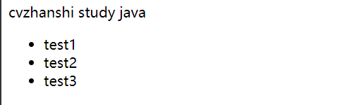

# ① Vue概述及第一个Vue程序(Hello World)

## 1.1 什么是MVVM

>  MVVM（Model-View-ViewModel）是一种软件设计模式，由微软WPF（用于替代WinForm，以前就是用这个技术开发桌面应用程序的）和Silverlight（类似于Java Applet，简单点说就是在浏览器上运行WPF）的架构师Ken Cooper和Ted Peters开发，是一种简化用户界面的事件驱动编程方式。由John Gossman（同样也是WPF和Sliverlight的架构师）与2005年在他的博客上发表。

MVVM源自于经典的MVC（Model-View-Controller）模式。MVVM的核心是ViewModel层，负责转换Model中的数据对象来让数据变得更容易管理和使用。其作用如下：

- 该层向上与视图层进行双向数据绑定
- 向下与Model层通过接口请求进行数据交互


 MVVM已经相当成熟了，主要运用但不仅仅在网络应用程序开发中。当下流行的MVVM框架有`Vue.js`，`Anfular JS` 

## 1.2 为什么要使用MVVM

 MVVM模式和MVC模式一样，主要目的是分离视图（View）和模型（Model），有几大好处

- **低耦合**：视图（View）可以独立于Model变化和修改，一个ViewModel可以绑定到不同的View上，当View变化的时候Model可以不变，当Model变化的时候View也可以不变。
- **可复用**：可以把一些视图逻辑放在一个ViewModel里面，让很多View重用这段视图逻辑。
- **独立开发**：开发人员可以专注于业务逻辑和数据的开发（ViewMode），设计人员可以专注于页面设计。
- **可测试**：界面素来是比较难以测试的，而现在测试可以针对ViewModel来写。

**MVVM组成部分**


**（1）View**

View是视图层， 也就是用户界面。前端主要由HTH L和csS来构建， 为了更方便地展现vi eu to del或者Hodel层的数据， 已经产生了各种各样的前后端模板语言， 比如FreeMarker，Thyme leaf等等， 各大MV VM框架如Vue.js.Angular JS， EJS等也都有自己用来构建用户界面的内置模板语言。

**（2）Model**

Model是指数据模型， 泛指后端进行的各种业务逻辑处理和数据操控， 主要围绕数据库系统展开。这里的难点主要在于需要和前端约定统一的接口规则

**（3）ViewModel**

ViewModel是由前端开发人员组织生成和维护的视图数据层。在这一层， 前端开发者对从后端获取的Model数据进行转换处理， 做二次封装， 以生成符合View层使用预期的视图数据模型。

> 需要注意的是View Model所封装出来的数据模型包括视图的状态和行为两部分， 而Model层的数据模型是只包含状态的
>
> - 比如页面的这一块展示什么，那一块展示什么这些都属于视图状态(展示)
> - 页面加载进来时发生什么，点击这一块发生什么，这一块滚动时发生什么这些都属于视图行为(交互)
>
> 视图状态和行为都封装在了View Model里。这样的封装使得View Model可以完整地去描述View层。由于实现了双向绑定， View Model的内容会实时展现在View层， 这是激动人心的， 因为前端开发者再也不必低效又麻烦地通过操纵DOM去更新视图。 
>
> MVVM框架已经把最脏最累的一块做好了， 我们开发者只需要处理和维护View Model， 更新数据视图就会自动得到相应更新，真正实现事件驱动编程。
>
> View层展现的不是Model层的数据， 而是ViewModel的数据， 由ViewModel负责与Model层交互， 这就**完全解耦了View层和Model层， 这个解耦是至关重要的， 它是前后端分离方案实施的重要一环**

## 1.3 Vue

> Vue(读音/vju/， 类似于view) 是一套用于构建用户界面的渐进式框架， 发布于2014年2月。与其它大型框架不同的是， Vue被设计为可以自底向上逐层应用。Vue的核心库只关注视图层， 不仅易于上手， 还便于与第三方库(如：vue-router，vue-resource，vue x) 或既有项目整合

**（1）MVVM模式的实现者**

- Model：模型层， 在这里表示JavaScript对象
- View：视图层， 在这里表示DOM(HTML操作的元素)
- ViewModel：连接视图和数据的中间件， Vue.js就是MVVM中的View Model层的实现者

在MVVM架构中， 是不允许数据和视图直接通信的， 只能通过ViewModel来通信， 而View Model就是定义了一个Observer观察者

- ViewModel能够观察到数据的变化， 并对视图对应的内容进行更新
- ViewModel能够监听到视图的变化， 并能够通知数据发生改变

至此， 我们可以大致了解， **Vue.js就是一个MV VM的实现者， 他的核心就是实现了DOM监听与数据绑定**
**（2）为什么使用Vue.js**

- 轻量级， 体积小是一个重要指标。Vue.js压缩后有只有20多kb(Angular压缩后56kb+，React压缩后44kb+)
- 移动优先。更适合移动端， 比如移动端的Touch事件
- 易上手，学习曲线平稳，文档齐全
- 吸取了Angular(模块化) 和React(虚拟DOＭ) 的长处， 并拥有自己独特的功能，如：计算属性
- 开源，社区活跃度高

## 1.4 第一个Vue程序(Hello World)

开发环境：IDEA（因为IDEA可以安装Vue的插件 ）

Vue.js：我们通常使用cdn导入

```html
<script src=“https://cdn.jsdelivr.net/npm/vue@2.5.21/dist/vue.js”></script>
<!--或-->
<script src="https://cdn.jsdelivr.net/npm/vue@2.5.21/dist/vue.min.js"></script>
```

- 创建一个空项目，创建一个文件夹，new一个HTML文件
- 编写代码

```html
<!DOCTYPE html>
<html lang="en">
<head>
    <meta charset="UTF-8">
    <title>cVzhanshi</title>
</head>
<body>

<!--view层，模板-->
<div id="app">
<!--    数据绑定-->
    {{message}}
</div>

<!--1.导入Vue.js-->
<script src="https://cdn.jsdelivr.net/npm/vue@2.5.21/dist/vue.min.js"></script>
<script type="text/javascript">
    // 创建一个Vue实例
    var vm = new Vue({
        el:"#app",
        /*Model：数据*/
        data:{
            message:"hello,vue  -----cvzhanshi!"
        }
    });
</script>
</body>
</html>
```

**说明**

-  el:"#app"   ----->  绑定元素的ID 
-  data:{message:"hello,vue ---cvzhanshi!"}    ---->    数据对象中有一个名为message的属性，并设置了初始值 hello,vue ---cvzhanshi
- {{message}}   ----->    实现数据绑定功能 

**运行效果**


**测试**

为了能够更直观的体验Vue带来的数据绑定功能， 我们需要在浏览器测试一番， 操作流程如下：
  1、在浏览器上运行第一个Vue应用程序， 进入开发者工具
  2、在控制台输入vm.message=‘HelloWorld’， 然后回车， 你会发现浏览器中显示的内容会直接变成HelloWorld，不需要刷新页面
  此时就可以在控制台直接输入vm.message来修改值， 中间是可以省略data的， 在这个操作中， 我并没有主动操作DOM， 就让页面的内容发生了变化， 这就是借助了Vue的数据绑定功能实现的； MV VM模式中要求**View Model层就是使用观察者模式来实现数据的监听与绑定， 以做到数据与视图的快速响应**

> 理解View Model：它可以类比成一个观察者，监测到了数据的变化，就立马更新页面与之绑定的值，无需更新页面，也无需操作DOM对象，相当于一个虚拟DOM对象

# ② Vue 基础语法

## 2.1 v-bind

**测试代码**

```html
<!DOCTYPE html>
<html lang="en" xmlns:v-bind="http://www.w3.org/1999/xhtml">
<head>
    <meta charset="UTF-8">
    <title>cVzhanshi</title>
</head>
<body>

<div id="app">
  <span v-bind:title="message">
    鼠标悬停几秒钟查看此处动态绑定的提示信息！
  </span>

    <!--1.导入Vue.js-->
    <script src="https://cdn.jsdelivr.net/npm/vue@2.5.21/dist/vue.min.js"></script>
    <script type="text/javascript">
        // 创建一个Vue实例
        var vm = new Vue({
            el:"#app",
            /*Model：数据*/
            data:{
                message:"hello,vue  -----cvzhanshi!"
            }
        });
    </script>
</div>
</body>
</html>
```


说明**：

-  看到的 `v-bind` attribute 被称为**指令**。指令带有前缀 `v-`，以表示它们是 Vue 提供的特殊 attribute 

-  它们会在渲染的 DOM 上应用特殊的响应式行为 

>  在这里，该指令的意思是：“将这个元素节点的 `title` attribute 和 Vue 实例的 `message` property 保持一致” 
>
>  如果你再次打开浏览器的 JavaScript 控制台，输入 `app.message = '新消息'`，就会再一次看到这个绑定了 `title` attribute 的 HTML 已经进行了更新 

## 2.2  v-if、v-else

**测试代码1**

```html
<!DOCTYPE html>
<html lang="en" xmlns:v-bind="http://www.w3.org/1999/xhtml">
<head>
    <meta charset="UTF-8">
    <title>cVzhanshi</title>
</head>
<body>
<!--view层，模板-->
<div id="app">
    <h1 v-if="type">Yes</h1>
    <h1 v-else>No</h1>

</div>

<!--1.导入Vue.js-->
<script src="https://cdn.jsdelivr.net/npm/vue@2.5.21/dist/vue.min.js"></script>
<script type="text/javascript">
    var vm = new Vue({
        el:"#app",
        /*Model：数据*/
        data:{
            type: true
        }
    });
</script>
</body>
</html>
```


**测试**

 1.在浏览器上运行，打开控制台
2.在控制台输入`vm.type=false`然后回车，你会发现浏览器中显示的内容会直接变成NO
  注：使用`v-*`属性绑定数据是不需要`双花括号`包裹的 


**测试代码2**

```html
<!DOCTYPE html>
<html lang="en" xmlns:v-bind="http://www.w3.org/1999/xhtml">
<head>
    <meta charset="UTF-8">
    <title>cVzhanshi</title>
</head>
<body>
<!--view层，模板-->
<div id="app">
    <h1 v-if="type==='A'">A</h1>
    <h1 v-else-if="type==='B'">B</h1>
    <h1 v-else-if="type==='D'">D</h1>
    <h1 v-else>C</h1>

</div>
<!--1.导入Vue.js-->
<script src="https://cdn.jsdelivr.net/npm/vue@2.5.21/dist/vue.min.js"></script>
<script type="text/javascript">
    var vm = new Vue({
        el:"#app",
        /*Model：数据*/
        data:{
            type: 'A'
        }
    });
</script>
</body>
</html>
```

**测试**

1.在浏览器上运行，打开控制台
2.在控制台输入`vm.type="D"`然后回车，你会发现浏览器中显示的内容会直接变成D


 **注：`===`三个等号在JS中表示绝对等于(就是数据与类型都要相等)** 

## 2.3 v-for

**测试代码**

```html
<!DOCTYPE html>
<html lang="en">
<head>
    <meta charset="UTF-8">
    <title>cVzhanshi</title>
</head>
<body>
<!--view层，模板-->
<div id="app">
    <li v-for="(item,index) in items">
        {{item.message}}---{{index}}
    </li>
</div>
<!--1.导入Vue.js-->
<script src="https://cdn.jsdelivr.net/npm/vue@2.5.21/dist/vue.min.js"></script>
<script type="text/javascript">
    var vm = new Vue({
        el:"#app",
        /*Model：数据*/
        data:{
            items:[
                {message:'cvzhanshi'},
                {message:'ursula'},
                {message:'cvzhanshi-ursula'}
            ]
        }
    });
</script>
</body>
</html>
```

**格式说明**

```html
<div id="app">
    <li v-for="(item,index) in items">
        {{item.message}}---{{index}}
    </li>
</div>
```

 注：`items`是数组，`item`是数组元素迭代的别名，index是迭代的序号

**测试**

- 打开控制台，在控制台输入`vm.items.push({message：'vue hello'})`，尝试追加一条数据，会发现页面也添加了数据


## 2.4 v-on

>  1、可以用 `v-on` 指令监听 DOM 事件，并在触发时运行一些 JavaScript 代码 

**示例代码1**

```html
<!DOCTYPE html>
<html lang="en" xmlns:v-on="http://www.w3.org/1999/xhtml">
<head>
    <meta charset="UTF-8">
    <title>cVzhanshi</title>
</head>
<body>
<!--view层，模板-->
<div id="example-1">
    <button v-on:click="counter += 1">Add 1</button>
    <p>The button above has been clicked {{ counter }} times.</p>
</div>
<!--1.导入Vue.js-->
<script src="https://cdn.jsdelivr.net/npm/vue@2.5.21/dist/vue.min.js"></script>
<script type="text/javascript">
    var example1 = new Vue({
        el: '#example-1',
        data: {
            counter: 0
        }
    });
</script>
</body>
```

​	点击按钮属性值就 + 1


>  2、然而许多事件处理逻辑会更为复杂，所以直接把 JavaScript 代码写在 `v-on` 指令中是不可行的。因此 `v-on` 还可以接收一个需要调用的方法名称 

**测试代码2**

```html
<!DOCTYPE html>
<html lang="en" xmlns:v-on="http://www.w3.org/1999/xhtml">
<head>
    <meta charset="UTF-8">
    <title>cVzhanshi</title>
</head>
<body>
<!--view层，模板-->
<div id="example-2">
    <!-- `greet` 是在下面定义的方法名 -->
    <button v-on:click="greet">Greet</button>
</div>
<!--1.导入Vue.js-->
<script src="https://cdn.jsdelivr.net/npm/vue@2.5.21/dist/vue.min.js"></script>
<script type="text/javascript">
    var example2 = new Vue({
            el: '#example-2',
            data: {
                name: 'Vue.js'
            },
            // 在 `methods` 对象中定义方法
            methods: {
                greet: function (event) {
                    // `this` 在方法里指向当前 Vue 实例
                    alert('Hello ' + this.name + '!')
                    // `event` 是原生 DOM 事件
                    if (event) {
                        alert(event.target.tagName)
                    }
                }
            }
        })
    ;
</script>
</body>
</html>
```


# ③ Vue 表单双绑&组件

## 3.1 表单数据双向绑定

>  数据双向绑定， 即当数据发生变化的时候， 视图也就发生变化， 当视图发生变化的时候，数据也会跟着同步变化。 

 注意 : 我们所说的数据双向绑定，一定是对于UI控件来说的非UI控件不会涉及到数据双向绑定。 

你可以用**v-model**指令在表单、及元素上创建双向数据绑定。它会根据控件类型自动选取正确的方法来更新元素。v-model负责监听用户的输入事件以更新数据，并对一些极端场景进行一些特殊处理。

  **注意：v-model会忽略所有表单元素的value、checked、selected特性的初始值而总是将Vue实例的数据作为数据来源。你应该通过JavaScript在组件的data选项中声明初始值**

`v-model` 在内部为不同的输入元素使用不同的 property 并抛出不同的事件：

- text 和 textarea 元素使用 `value` property 和 `input` 事件；
- checkbox 和 radio 使用 `checked` property 和 `change` 事件；
- select 字段将 `value` 作为 prop 并将 `change` 作为事件。

**单行文本**

```html
<!DOCTYPE html>
<html lang="en" xmlns:v-on="http://www.w3.org/1999/xhtml">
<head>
    <meta charset="UTF-8">
    <title>cVzhanshi</title>
</head>
<body>
<!--view层，模板-->
<div id="example-2">
    <input v-model="message" placeholder="edit me">
    <p>Message is: {{ message }}</p>
</div>
<!--1.导入Vue.js-->
<script src="https://cdn.jsdelivr.net/npm/vue@2.5.21/dist/vue.min.js"></script>
<script type="text/javascript">
    var example2 = new Vue({
            el: '#example-2',
            data: {
                message: ''
            }
        });
</script>
</body>
</html>
```


**多行文本**

```html
<!DOCTYPE html>
<html lang="en" xmlns:v-on="http://www.w3.org/1999/xhtml">
<head>
    <meta charset="UTF-8">
    <title>cVzhanshi</title>
</head>
<body>
<!--view层，模板-->
<div id="example-2">
    <span>Multiline message is:</span>
    <p style="white-space: pre-line;">{{ message }}</p>
    <br>
    <textarea v-model="message" placeholder="add multiple lines"></textarea>
</div>
<!--1.导入Vue.js-->
<script src="https://cdn.jsdelivr.net/npm/vue@2.5.21/dist/vue.min.js"></script>
<script type="text/javascript">
    var example2 = new Vue({
            el: '#example-2',
            data: {
                message: ''
            }
        });
</script>
</body>
</html>
```


> **注意 ：在文本区域插值 (`{{text}}`) 并不会生效，应用 `v-model` 来代替** 

**复选框**

- 单个复选框绑定到布尔值

```html
<!--view层，模板-->
<div id="example-2">
    <input type="checkbox" id="checkbox" v-model="checked">
    <label for="checkbox">{{ checked }}</label>
</div>
<!--1.导入Vue.js-->
<script src="https://cdn.jsdelivr.net/npm/vue@2.5.21/dist/vue.min.js"></script>
<script type="text/javascript">
    var example2 = new Vue({
            el: '#example-2',
            data: {
                checked: 'true'
            }
        });
</script>
```

-  多个复选框，绑定到同一个数组 

```html
<!--view层，模板-->
<div id="example-2">
    <input type="checkbox" id="jack" value="Jack" v-model="checkedNames">
    <label for="jack">Jack</label>
    <input type="checkbox" id="john" value="John" v-model="checkedNames">
    <label for="john">John</label>
    <input type="checkbox" id="mike" value="Mike" v-model="checkedNames">
    <label for="mike">Mike</label>
    <br>
    <span>Checked names: {{ checkedNames }}</span>
</div>
<!--1.导入Vue.js-->
<script src="https://cdn.jsdelivr.net/npm/vue@2.5.21/dist/vue.min.js"></script>
<script type="text/javascript">
    var example2 = new Vue({
            el: '#example-2',
            data: {
                checkedNames: []
            }
        });
</script>
```


**单选按钮**

```html
<!--view层，模板-->
<div id="example-2">
    <input type="radio" id="one" value="One" v-model="picked">
    <label for="one">One</label>
    <br>
    <input type="radio" id="two" value="Two" v-model="picked">
    <label for="two">Two</label>
    <br>
    <span>Picked: {{ picked }}</span>
</div>
<!--1.导入Vue.js-->
<script src="https://cdn.jsdelivr.net/npm/vue@2.5.21/dist/vue.min.js"></script>
<script type="text/javascript">
    var example2 = new Vue({
            el: '#example-2',
            data: {
                picked: ''
            }
        });
</script>
```


**选择框**

```html
<!--view层，模板-->
<div id="example-2">
    <select v-model="selected">
        <option disabled value="">请选择</option>
        <option>A</option>
        <option>B</option>
        <option>C</option>
    </select>
    <span>Selected: {{ selected }}</span>
</div>
<!--1.导入Vue.js-->
<script src="https://cdn.jsdelivr.net/npm/vue@2.5.21/dist/vue.min.js"></script>
<script type="text/javascript">
    var example2 = new Vue({
            el: '#example-2',
            data: {
                selected: ''
            }
        });
</script>
```


>  如果 `v-model` 表达式的初始值未能匹配任何选项，`` 元素将被渲染为“未选中”状态。在 iOS 中，这会使用户无法选择第一个选项。因为这样的情况下，iOS 不会触发 change 事件。因此，更推荐像上面这样提供一个值为空的禁用选项。 

## 3.2 组件

>  组件是可复用的`Vue`实例， 说白了就是一组可以重复使用的模板， 跟`JSTL`的自定义标签、`Thymeleal`的`th:fragment`等框架有着异曲同工之妙，通常一个应用会以一棵嵌套的组件树的形式来组织 


 例如，你可能会有页头、侧边栏、内容区等组件，每个组件又包含了其它的像导航链接、博文之类的组件 

- **自定义第一个组件**

```html
<!--view层，模板-->
<div id="app">
    <cvzhanshi></cvzhanshi>
</div>
<!--1.导入Vue.js-->
<script src="https://cdn.jsdelivr.net/npm/vue@2.5.21/dist/vue.min.js"></script>
<script type="text/javascript">
    Vue.component("cvzhanshi",{
       template: '<li>Hello cVzhanshi</li>'
    });
    var vm = new Vue({
            el: '#app',
            data: {
                selected: ''
            }
        });
</script>
```


> 说明：
>
> - `Vue.component()`：注册组件
> - `cvzhanshi`：自定义组件的名字
> - `template`：组件的模板

- #### **使用`props`属性传递参数**

```html
<!--view层，模板-->
<div id="app">
    <cvzhanshi v-for="item in items" v-bind:course="item"></cvzhanshi>
</div>
<!--1.导入Vue.js-->
<script src="https://cdn.jsdelivr.net/npm/vue@2.5.21/dist/vue.min.js"></script>
<script type="text/javascript">
    Vue.component("cvzhanshi",{
        props: ['course'],
       template: '<li>{{course}}</li>'
    });
    var vm = new Vue({
            el: '#app',
            data:{
                items:["java","Linux","前端"]
            }
        });
</script>
```

> 说明：
>
> - v-for="item in items"：遍历Vue实例中定义的名为items的数组，并创建同等数量的组件
> - v-bind:course="item"：将遍历的item项绑定到组件中props定义名为course属性上；= 号左边的course为props定义的属性名，右边的为item in items 中遍历的item项的值

# ④ Vue Axios异步通信

## 4.1 Axios简介

Axios是一个开源的可以用在浏览器端和Node JS的异步通信框架， 她的主要作用就是实现AJAX异步通信，其功能特点如下：

- 从浏览器中创建XMLHttpRequests
- 从node.js创建http请求
- 支持Promise API[JS中链式编程]
- 拦截请求和响应
- 转换请求数据和响应数据
- 取消请求
- 自动转换JSON数据
- 客户端支持防御XSRF(跨站请求伪造)

> 由于Vue.js是一个视图层框架并且作者(尤雨溪) 严格准守SoC(关注度分离原则)所以Vue.js并不包含AJAX的通信功能， 为了解决通信问题， 作者单独开发了一个名为vue-resource的插件， 不过在进入2.0版本以后停止了对该插件的维护并推荐了Axios框架。
>
>  由于jQuery操作Dom太频繁，所以少用

## 4.2 测试Axios

- 先准备伪数据

```json
{
  "name": "cv战士",
  "url": "https://blog.csdn.net/qq_45408390?spm=1001.2101.3001.5343",
  "page": 1,
  "isNonProfit": true,
  "address": {
    "street": "含光门",
    "city": "陕西西安",
    "country": "中国"
  },
  "links": [
    {
      "name": "bilibili",
      "url": "https://bilibili.com"
    },
    {
      "name": "cv战士",
      "url": "https://blog.csdn.net/qq_45408390?spm=1001.2101.3001.5343"
    },
    {
      "name": "百度",
      "url": "https://www.baidu.com/"
    }
  ]
}
```

- **测试代码**

```html
<!DOCTYPE html>
<html lang="en" xmlns:v-binf="http://www.w3.org/1999/xhtml" xmlns:v-bind="http://www.w3.org/1999/xhtml">
<head>
    <meta charset="UTF-8">
    <title>Title</title>
    <!--v-cloak 解决闪烁问题-->
    <style>
        [v-cloak]{
            display: none;
        }
    </style>
</head>
<body>
<div id="vue" v-cloak>
    <div>地名：{{info.name}}</div>
    <div>地址：{{info.address.country}}--{{info.address.city}}--{{info.address.street}}</div>
    <div>链接：<a v-bind:href="info.url">{{info.url}}</a> </div>
</div>

<!--引入js文件-->
<script src="https://cdn.jsdelivr.net/npm/vue@2.5.21/dist/vue.min.js"></script>
<script src="https://unpkg.com/axios/dist/axios.min.js"></script>
<script type="text/javascript">
    var vm = new Vue({
        el:"#vue",
        //data：属性：vm
        data(){
            return{
                info:{
                    name:null,
                    address:{
                        country:null,
                        city:null,
                        street:null
                    },
                    url:null
                }
            }
        },
        mounted(){//钩子函数
            axios
                .get('../data.json')
                .then(response=>(this.info=response.data));
        }
    });
</script>
</body>
</html>
```

说明：

1. 在这里使用了v-bind将a:href的属性值与Vue实例中的数据进行绑定
2. 使用axios框架的get方法请求AJAX并自动将数据封装进了Vue实例的数据对象中
3. 我们在data中的数据结构必须和`Ajax`响应回来的数据格式匹配

**Vue生命周期图**


# ⑤ Vue 计算属性、内容分发、自定义事件

## 5.1 计算属性

>  计算属性的重点突出在`属性`两个字上(属性是名词)，首先它是个`属性`其次这个属性有`计算`的能力(计算是动词)，这里的`计算`就是个函数：简单点说，它就是一个能够将计算结果缓存起来的属性(将行为转化成了静态的属性)，仅此而已；可以想象为缓存 

**测试代码**

```html
<!DOCTYPE html>
<html lang="en">
    <head>
        <meta charset="UTF-8">
        <title>Title</title>
    </head>
    <body>
        <!--view层，模板-->
        <div id="app">
            <p>currentTime1:{{currentTime1()}}</p>
            <p>currentTime2:{{currentTime2}}</p>
        </div>
        <!--1.导入Vue.js-->
        <script src="https://cdn.jsdelivr.net/npm/vue@2.5.21/dist/vue.min.js"></script>
        <script type="text/javascript">
            var vm = new Vue({
                el:"#app",
                data:{
                    message:"cvzhanshi"
                },
                methods:{
                    currentTime1:function(){
                        return Date.now();//返回一个时间戳
                    }
                },
                computed:{
                    currentTime2:function(){//计算属性：methods，computed方法名不能重名，重名之后，只会调用methods的方法
                        this.message;
                        return Date.now();//返回一个时间戳
                    }
                }
            });
        </script>
    </body>
</html>
```

>  注意：methods和computed里的东西不能重名,重名之后，只会调用methods的方法
>
> 说明：
>
> - methods：定义方法， 调用方法使用currentTime1()， 需要带括号
>
> - computed：定义计算属性， 调用属性使用currentTime2， 不需要带括号：this.message是为了能够让currentTime2观察到数据变化而变化
>
> - 如何在方法中的值发生了变化，则缓存就会刷新!可以在控制台使用vm.message=”cvzhanshi"， 改变下数据的值，再次测试观察效果!

**总结**

调用方法时，每次都需要讲行计算，既然有计算过程则必定产生系统开销，那如果这个结果是不经常变化的呢?此时就可以考虑将这个结果缓存起来，采用计算属性可以很方便的做到这点，**计算属性的主要特性就是为了将不经常变化的计算结果进行缓存，以节约我们的系统开销；** 

## 5.2 内容分发(插槽)

>  在`Vue.js`中我们使用``元素作为承载分发内容的出口，可以称其为插槽，可以应用在组合组件的场景中 

需求：需要把下面的内容，让标题和内容通过插槽插入内容

```html
<p>标题</p>
<ul>
    <li>abcd</li>
    <li>abcd</li>
    <li>abcd</li>
</ul>
```

- **定义一个代办事情的组件**

```js
 Vue.component('todo',{
        template:'<div>\
                <div>代办事项</div>\
                <ul>\
                    <li>cvzhanshi study Java</li>\
                </ul>\
            </div>'
    });
```

-  **将上面的代码留出一个插槽，即slot** 

```js
 Vue.component('todo',{
        template:'<div>\
                <slot"></slot>\
                <ul>\
                    <slot"></slot>\
                </ul>\
            </div>'
    });
```

-  **定义一个名为todo-title的待办标题组件 和 todo-items的待办内容组件** 

```
Vue.component('todo-title',{
        props:['title'],
        template:'<div>{{title}}</div>'
    });
   
//这里的index，就是数组的下标，使用for循环遍历的时候，可以循环出来！
    Vue.component("todo-items",{
        props:["item","index"],
        template:"<li>{{index+1}},{{item}}</li>"
    });

```

- **slot通过name和组件绑定**

```html
 Vue.component('todo',{
        template:'<div>\
                <slot name="todo-title"></slot>\
                <ul>\
                    <slot name="todo-items"></slot>\
                </ul>\
            </div>'
    });

```

-  实例化Vue并初始化数据 

```html
 var vm = new Vue({
        el:"#vue",
        data:{
            todoItems:['test1','test2','test3']
        }
    });
```

- 将数据通过插槽插入预留出来的位置

```html
<todo>
        <todo-title slot="todo-title" v-bind:title="title"></todo-title>
        <todo-items slot="todo-items" v-for="item in todoItems" :item="item" ></todo-items>
    </todo>
```

> 说明：
>
> ​	slot：是绑定组件用的
>
> ​	:title -->  是v-bind:title的缩写

- **完整代码**

```html
<!DOCTYPE html>
<html lang="en" xmlns:v-bind="http://www.w3.org/1999/xhtml">
    <head>
        <meta charset="UTF-8">
        <title>Title</title>
    </head>
    <body>
        <!--view层，模板-->
        <div id="vue">
            <todo>
                <todo-title slot="todo-title" v-bind:title="title"></todo-title>
                <!--<todo-items slot="todo-items" v-for="{item,index} in todoItems" v-bind:item="item"></todo-items>-->
                <!--如下为简写-->
                <todo-items slot="todo-items" v-for="item in todoItems" :item="item" ></todo-items>
            </todo>
        </div>
        <!--1.导入Vue.js-->
        <script src="https://cdn.jsdelivr.net/npm/vue@2.5.21/dist/vue.min.js"></script>
        <script type="text/javascript">
            Vue.component('todo',{
                template:'<div>\
<slot name="todo-title"></slot>\
<ul>\
<slot name="todo-items"></slot>\
            </ul>\
            </div>'
            });
            Vue.component('todo-title',{
                props:['title'],
                template:'<div>{{title}}</div>'
            });
            //这里的index，就是数组的下标，使用for循环遍历的时候，可以循环出来！
            Vue.component("todo-items",{
                props:["item"],
                template:"<li>{{item}}</li>"
            });
            var vm = new Vue({
                el:"#vue",
                data:{
                    title:"cvzhanshi study java",
                    todoItems:['test1','test2','test3']
                }
            });
        </script>
    </body>
</html>

```



## 5.3 自定义事件

> 通过上诉代码我们可以发现一个问题，如果删除操作要在组件中完成，那么组件如何删除Vue实例中的数据？
>
> 例：
>
> 删除按钮是在组件中的，点击删除按钮删除对应的数据。
>
> 阅读Vue教程可知，此时就涉及到参数传递与事件分发了， Vue为我们提供了自定义事件的功能很好的帮助我们解决了这个问题； 组件中使用this.$emit(‘自定义事件名’， 参数) ，而在视图层通过自定义事件绑定Vue中的删除操作的方法

**步骤：**

- 在Vue实例中定义一个删除操作的方法removeItems()

```js
methods: {
		removeItems: function (index) {
		this.todoItems.splice(index,1);
	}
}
```

> 说明splice(index,n)方法是操作index下标开始的n个元素

- 在视图层中自定义事件并绑定Vue实例中的方法

```html
<div id="vue">
    <todo>
        <todo-title slot="todo-title" v-bind:title="title"></todo-title>
        <todo-items slot="todo-items" v-for="(item,index) in todoItems"
                    :item="item" :index="index" v-on:remove="removeItems(index)"></todo-items>
    </todo>
</div>
```

> 自定义事件为remove，通过v-on绑定removeItems方法

- 在相应的组件中绑定自定义事件

```js
Vue.component("todo-items",{
    props:["item","index"],
    template:"<li>{{item}}---{{index}}<button @click='remove'>删除</button></li>",
    methods: {
        remove: function (index) {
            this.$emit('remove',index);
        }
    }
});
```

**完整代码如下**

```html
<!DOCTYPE html>
<html lang="en" xmlns:v-bind="http://www.w3.org/1999/xhtml">
<head>
    <meta charset="UTF-8">
    <title>Title</title>
</head>
<body>
<!--view层，模板-->
<div id="vue">
    <todo>
        <todo-title slot="todo-title" v-bind:title="title"></todo-title>
        <todo-items slot="todo-items" v-for="(item,index) in todoItems"
                    :item="item" :index="index" v-on:remove="removeItems(index)"></todo-items>
    </todo>
</div>
<!--1.导入Vue.js-->
<script src="https://cdn.jsdelivr.net/npm/vue@2.5.21/dist/vue.min.js"></script>
<script type="text/javascript">
    Vue.component('todo',{
        template:'<div>\
                <slot name="todo-title"></slot>\
                <ul>\
                    <slot name="todo-items"></slot>\
                </ul>\
            </div>'
    });
    Vue.component('todo-title',{
        props:['title'],
        template:'<div>{{title}}</div>'
    });
    //这里的index，就是数组的下标，使用for循环遍历的时候，可以循环出来！
    Vue.component("todo-items",{
        props:["item","index"],
        template:"<li>{{item}}---{{index}}<button @click='remove'>删除</button></li>",
        methods: {
            remove: function (index) {
                this.$emit('remove',index);
            }
        }
    });
    var vm = new Vue({
        el:"#vue",
        data:{
            title:"cvzhanshi study java",
            todoItems:['test1','test2','test3']
        },
        methods: {
            removeItems: function (index) {
                this.todoItems.splice(index,1);
            }
        }
    });
</script>
</body>
</html>
```

**逻辑理解**


## 5.4 Vue入门小结

核心：数据驱动，组件化

优点：借鉴了AngularJS的模块化开发和React的虚拟Dom，虚拟Dom就是把Demo操作放到内存中执行；

常用的属性：

- v-if
- v-else-if
- v-else
- v-for
- v-on绑定事件，简写@
- v-model数据双向绑定
- v-bind给组件绑定参数，简写：

组件化：

- 组合组件slot插槽
- 组件内部绑定事件需要使用到this.$emit("事件名",参数);
- 计算属性的特色，缓存计算数据

遵循SoC关注度分离原则，Vue是纯粹的视图框架，并不包含，比如Ajax之类的通信功能，为了解决通信问题，我们需要使用Axios框架做异步通信；

# ⑥ 第一个Vue-cli项目

## 6.1 Vue-cli简介

> vue-cli官方提供的一个脚手架，用于快速生成一个vue的项目模板
>
>  预先定义好的目录结构及基础代码，就好比咱们在创建Maven项目时可以选择创建一个骨架项目，这个估计项目就是脚手架，我们的开发更加的快速 

**项目的功能**

- 统一的目录结构
- 本地调试
- 热部署
- 单元测试
- 集成打包上线

## 6.2 环境配置

- **Node.js** 

> 下载地址： http://nodejs.cn/download/  安装的时候一直下一步直到结束
>
> 确认是否安装成功：
>
> - 在cmd中运行node -v命令，查看是否能够输出版本号
> - 在cmd中运行npm -v命令，查看是否能够输出版本号
>
> 


- **安装node.js淘宝镜像加速器（cnpm）**

```shell
# -g 就是全局安装
npm install cnpm -g

# 或使用如下语句解决npm速度慢的问题，但是每次install都需要（妈发）
npm install --registry=https://registry.npm.taobao.org
```

- **安装vue-cli**

```shell
cnpm instal1 vue-cli-g
#测试是否安装成功#查看可以基于哪些模板创建vue应用程序，通常我们选择webpack
vue list
```


 ## 6.3 第一个vue-cli应用程序

- 找到一个项目路径(空文件夹)

-  创建一个基于webpack模板的vue应用程序 

```cmd
#1、首先需要进入到对应的目录 cd E:\study\Java\workspace\workspace_vue
#2、这里的myvue是顶日名称，可以根据自己的需求起名
vue init webpack myvue
```

- 创建过程需要的操作

  一路选no


> **Project name**：项目名称，默认回车即可
> **Project description**：项目描述，默认回车即可
> **Author**：项目作者，默认回车即可
> **Install vue-router**：是否安装vue-router，选择n不安装（后期需要再手动添加）
> **Use ESLint to lint your code**:是否使用ESLint做代码检查，选择n不安装（后期需要再手动添加)
> **Set up unit tests**:单元测试相关，选择n不安装（后期需要再手动添加）
> **Setupe2etests with Nightwatch**：单元测试相关，选择n不安装（后期需要再手动添加）
> **Should we run npm install for you after the,project has been created**:创建完成后直接初始化，选择n，我们手动执行；运行结果

当出现问题时，它会给出提示我们按照提示来就行


- 初始化并运行

```shell
cd myvue
npm install
npm run dev
```


> 访问localhost:8080即可

 

# ⑦ webpack的使用

## 7.1 安装Webpack

>  WebPack是一款模块加载器兼打包工具， 它能把各种资源， 如JS、JSX、ES 6、SASS、LESS、图片等都作为模块来处理和使用 

**安装**：

```shell
npm install webpack -g
npm install webpack-cli -g
```

测试安装成功：

```shell
webpack -v
webpack-cli -v
```


**配置**：

- entry：入口文件， 指定Web Pack用哪个文件作为项目的入口
- output：输出， 指定WebPack把处理完成的文件放置到指定路径
- module：模块， 用于处理各种类型的文件
- plugins：插件， 如：热更新、代码重用等
- resolve：设置路径指向
- watch：监听， 用于设置文件改动后直接打包

```js
module.exports = {
	entry:"",
	output:{
		path:"",
		filename:""
	},
	module:{
		loaders:[
			{test:/\.js$/,;\loade:""}
		]
	},
	plugins:{},
	resolve:{},
	watch:true
}
```

 直接运行`webpack`命令打包 

## 7.2 使用webpack

- 创建项目

> 在workspace中创建文件夹webpack-study，然后用IDEA打开

- 创建一个名为modules的目录，用于放置JS模块等资源文件
- 在modules下创建模块文件hello.js

```js
//暴露一个方法：sayHi
exports.sayHi = function(){
    document.write("<div>Hello Webpack</div>");
}
```

- 在modules下创建一个名为main.js的入口文件main.js，用于打包时设置entry属性

```js
//require 导入一个模块，就可以调用这个模块中的方法了
var hello = require("./hello");
hello.sayHi();
```

- 在项目目录下创建webpack.config.js配置文件，使用webpack命令打包

```js
module.exports = {
    entry:"./modules/main.js",
    output:{
        filename:"./js/bundle.js"
    }
}
```

打包：

> 说明：打包如果失败，就用管理员权限运行webpack


-  在项目目录下创建HTML页面，如index.html，导入webpack打包后的JS文件

```html
<!doctype html>
<html lang="en">
    <head>
        <meta charset="UTF-8">
        <title>狂神说Java</title>
    </head>
    <body>
        <script src="dist/js/bundle.js"></script>
    </body>
</html>
```

- 直接打开index.html


**注**：

```shell
# 参数--watch 用于监听变化,如果要打包的东西有变化，就重新打包
webpack --watch
```

# ⑧ Vue vue-router路由

## 8.1 安装

-  **基于第一个`vue-cli`进行测试学习； 先查看node modules中是否存在vue-router, vue-router是一个插件包， 所以我们还是需要用n pm/cn pm来进行安装的 ** 

```shell
npm install vue-router --save-dev
```


-  如果在一个模块化工程中使用它，必须要通过Vue.use()明确地安装路由功能 

```js
import Vue from 'vue'
import VueRouter from 'vue-router'

Vue.use(VueRouter);
```

## 8.2 测试路由

- 删除第一个vue-cli项目中的没用的东西
-  `components` 目录下存放我们自己编写的组件
- 定义几个自己的组件 Content.vue 、Main.vue、cVzhanshi.vue

**Content.vue**

```vue
<template>
	<div>
		<h1>内容页</h1>
	</div>
</template>

<script>
	export default {
		name:"Content"
	}
</script>
```

**Main.vue**

```vue
<template>
<div>
    <h1>首页</h1>
    </div>
</template>

<script>
    export default {
        name:"Main"
    }
</script>
```

**cVzhanshi.vue**

```vue
<template>
<div>
    <h1>cVzhanshi</h1>
</div>
</template>

<script>
    export default {
        name:"cVzhanshi"
    }
</script>
```

-  安装路由，在src目录下，新建一个文件夹：`router`，专门存放路由，配置路由index.js

```js
import Vue from'vue'
//导入路由插件
import Router from 'vue-router'
//导入上面定义的组件
import Content from '../components/Content'
import Main from '../components/Main'
import cVzhanshi from "../components/cVzhanshi";
//安装路由
Vue.use(Router) ;
//配置路由
export default new Router({
  routes:[
    {
      //路由路径
      path:'/content',
      //路由名称
      name:'content',
      //跳转到组件
      component:Content
    },{
      //路由路径
      path:'/main',
      //路由名称
      name:'main',
      //跳转到组件
      component:Main
    }
    ,{
      //路由路径
      path:'/cvzhanshi',
      //路由名称
      name:'main',
      //跳转到组件
      component:cVzhanshi
    }
  ]
});
```

-  在`main.js`中配置路由 

```js
import Vue from 'vue'
import App from './App'

import router from './router'//自动扫描里面的路由配置
Vue.config.productionTip = false

/* eslint-disable no-new */
new Vue({
  el: '#app',
  router,
  components: { App },
  template: '<App/>'
})
```

-  在`App.vue`中使用路由 

```vue
<template>
  <div id="app">
    <!--
          router-link：默认会被渲染成一个<a>标签，to属性为指定链接
          router-view：用于渲染路由匹配到的组件
        -->
    <h1>cVzhanshi</h1>
    <router-link to="/main">首页</router-link>
    <router-link to="/content">内容</router-link>
    <router-link to="/cvzhanshi">cVzhanshi</router-link>
    <router-view></router-view>
  </div>
</template>

<script>
export default {
  name: 'App',
}
</script>
```

- 运行npm run dev,然后浏览器访问localhost:8080


# ⑨ 实战小demo

## 9.1 创建工程

-  创建一个名为hello-vue的工程

```shell
vue init webpack hello-vue
```

- 安装依赖， vue-router、element-ui、sass-loader和node-sass四个插件 

```shell
#进入工程目录
cd hello-vue
#安装vue-routern 
npm install vue-router --save-dev
#安装element-ui
npm i element-ui -S
#安装依赖
npm install
# 安装SASS加载器
cnpm install sass-loader node-sass --save-dev
#启功测试
npm run dev
```

- npm命令说明

> - npm install moduleName：安装模块到项目目录下
>
> - npm install -g moduleName：-g的意思是将模块安装到全局，具体安装到磁盘哪个位置要看npm 
>
>   config prefix的位置
>
> - npm install -save moduleName：–save的意思是将模块安装到项目目录下， 并在package文件的dependencies节点写入依赖，-S为该命令的缩写
> - npm install -save-dev moduleName:–save-dev的意思是将模块安装到项目目录下，并在package文件的devDependencies节点写入依赖，-D为该命令的缩写

- idea打开创建好的项目

## 9.2 创建登录页面

- 先把删除没用的文件
- 项目结构如下


> 说明：
>
> - assets：用于存放资源文件
> - components：用于存放Vue功能组件
> - views：用于存放Vue视图组件
> - router：用于存放vue-router配置

- 在views目录下创建首页视图Main.vue组件

```vue
<template>
<div>首页</div>
</template>
<script>
    export default {
        name:"Main"
    }
</script>
<style scoped>
</style>
```

- 在views目录下创建登录页面视图Login.vue组件

```vue
<template>
  <div>
    <el-form ref="loginForm" :model="form" :rules="rules" label-width="80px" class="login-box">
      <h3 class="login-title">欢迎登录</h3>
      <el-form-item label="账号" prop="username">
        <el-input type="text" placeholder="请输入账号" v-model="form.username"/>
      </el-form-item>
      <el-form-item label="密码" prop="password">
        <el-input type="password" placeholder="请输入密码" v-model="form.password"/>
      </el-form-item>
      <el-form-item>
        <el-button type="primary" v-on:click="onsubmit('loginForm')">登录</el-button>
      </el-form-item>
    </el-form>

    <el-dialog title="温馨提示" :visible.sync="dialogVisiable" width="30%" :before-close="handleClose">
      <span>请输入账号和密码</span>
      <span slot="footer" class="dialog-footer">
          <el-button type="primary" @click="dialogVisible = false">确定</el-button>
        </span>
    </el-dialog>
  </div>
</template>

<script>
    export default {
        name: "Login",
      data(){
          return{
            form:{
              username:'',
              password:''
            },
            //表单验证，需要在 el-form-item 元素中增加prop属性
            rules:{
              username:[
                {required:true,message:"账号不可为空",trigger:"blur"}
              ],
              password:[
                {required:true,message:"密码不可为空",tigger:"blur"}
              ]
            },

            //对话框显示和隐藏
            dialogVisible:false
          }
      },
      methods:{
          onSubmit(formName){
            //为表单绑定验证功能
            this.$refs[formName].validate((valid)=>{
              if(valid){
                //使用vue-router路由到指定界面，该方式称为编程式导航
                this.$router.push('/main');
              }else{
                this.dialogVisible=true;
                return false;
              }
            });
          }
      }
    }
</script>

<style lang="scss" scoped>
  .login-box{
    border:1px solid #DCDFE6;
    width: 350px;
    margin:180px auto;
    padding: 35px 35px 15px 35px;
    border-radius: 5px;
    -webkit-border-radius: 5px;
    -moz-border-radius: 5px;
    box-shadow: 0 0 25px #909399;
  }
  .login-title{
    text-align:center;
    margin: 0 auto 40px auto;
    color: #303133;
  }
</style>
```

-  在router目录下创建一个名为`index.js`的vue-router路由配置文件 

```js
//导入vue
import Vue from 'vue';
import VueRouter from 'vue-router';
//导入组件
import Main from "../views/Main";
import Login from "../views/Login";
//使用
Vue.use(VueRouter);
//导出
export default new VueRouter({
  routes: [
    {
      //登录页
      path: '/main',
      component: Main
    },
    //首页
    {
      path: '/login',
      component: Login
    },
  ]

})
```

- 编写 APP.vue 

```vue
<template>
  <div id="app">
    <router-view></router-view>
  </div>
</template>

<script>


    export default {
        name: 'App',

    }
</script>

<style>
  #app {
    font-family: 'Avenir', Helvetica, Arial, sans-serif;
    -webkit-font-smoothing: antialiased;
    -moz-osx-font-smoothing: grayscale;
    text-align: center;
    color: #2c3e50;
    margin-top: 60px;
  }
</style>
```

-  在`main.js`中配置路由 

```js
import Vue from 'vue'
import App from './App'
import router from "./router"

import ElementUI from 'element-ui'
import 'element-ui/lib/theme-chalk/index.css'

Vue.config.productionTip = false

Vue.use(router)
Vue.use(ElementUI)

/* eslint-disable no-new */
new Vue({
  el: '#app',
  router,
  render:h=>h(App)
})
```

- 测试npm run dev

> 说明： 如果出现错误: 可能是因为sass-loader的版本过高导致的编译错误 ，可以去package.json文件中把sass-loder的版本降低，也有可能是node-sass版本过高，看报错内容修改相应的版本

## 9.3 路由嵌套

> 嵌套路由又称子路由，在实际应用中，通常由多层嵌套的组件组合而成 

-  创建用户信息组件，在 views/user 目录下创建一个名为 Profile.vue 的视图组件 

```vue
<template>
  <h1>个人信息</h1>
</template>
<script>
  export default {
    name: "UserProfile"
  }
</script>
<style scoped>
</style>
```

-  在用户列表组件在 views/user 目录下创建一个名为 List.vue 的视图组件 

```vue
<template>
  <h1>用户列表</h1>
</template>
<script>
  export default {
    name: "UserList"
  }
</script>
<style scoped>
</style>
```

-  修改首页视图，我们修改 Main.vue 视图组件，此处使用了 ElementUI 布局容器组件 

```vue
<template>
    <div>
      <el-container>
        <el-aside width="200px">
          <el-menu :default-openeds="['1']">
            <el-submenu index="1">
              <template slot="title"><i class="el-icon-caret-right"></i>用户管理</template>
              <el-menu-item-group>
                <el-menu-item index="1-1">
                <!--插入的地方-->
                  <router-link to="/user/profile">个人信息</router-link>
                </el-menu-item>
                <el-menu-item index="1-2">
                <!--插入的地方-->
                  <router-link to="/user/list">用户列表</router-link>
                </el-menu-item>
              </el-menu-item-group>
            </el-submenu>
            <el-submenu index="2">
              <template slot="title"><i class="el-icon-caret-right"></i>内容管理</template>
              <el-menu-item-group>
                <el-menu-item index="2-1">分类管理</el-menu-item>
                <el-menu-item index="2-2">内容列表</el-menu-item>
              </el-menu-item-group>
            </el-submenu>
          </el-menu>
        </el-aside>

        <el-container>
          <el-header style="text-align: right; font-size: 12px">
            <el-dropdown>
              <i class="el-icon-setting" style="margin-right: 15px"></i>
              <el-dropdown-menu slot="dropdown">
                <el-dropdown-item>个人信息</el-dropdown-item>
                <el-dropdown-item>退出登录</el-dropdown-item>
              </el-dropdown-menu>
            </el-dropdown>
          </el-header>
          <el-main>
          <!--在这里展示视图-->
            <router-view />
          </el-main>
        </el-container>
      </el-container>
    </div>
</template>
<script>
    export default {
        name: "Main"
    }
</script>
<style scoped lang="scss">
  .el-header {
    background-color: #B3C0D1;
    color: #333;
    line-height: 60px;
  }
  .el-aside {
    color: #333;
  }
</style>
```

- 添加了组件，去router修改配置文件

```js
//导入vue
import Vue from 'vue';
import VueRouter from 'vue-router';
//导入组件
import Main from "../views/Main";
import Login from "../views/Login";
//导入子模块
import UserList from "../views/user/List";
import UserProfile from "../views/user/Profile";

//使用
Vue.use(VueRouter);
//导出
export default new VueRouter({
  routes: [
    {
      //登录页
      path: '/main',
      component: Main,
      //  写入子模块
      children: [
        {
          path: '/user/profile',
          component: UserProfile,
        }, {
          path: '/user/list',
          component: UserList,
        },
      ]
    },
    //首页
    {
      path: '/login',
      component: Login

    },
  ]
})
```

- 运行测试


##  9.4 参数传递和重定向

### 9.4.1 参数传递

**方法一**

-  修改路由配置, 主要是router下的index.js中的 path 属性中增加了 :id 这样的占位符

```js
{
	path: '/user/profile/:id', 
	name:'UserProfile', 
	component: UserProfile
}
```

- 视图层传递参数

```vue
<!--name是组件的名字 params是传的参数 如果要传参数的话就需要用v:bind:来绑定-->
<router-link :to="{name:'UserProfile',params:{id:1}}">个人信息</router-link>
```

> 说明： 此时我们在Main.vue中的route-link位置处 to 改为了 :to，是为了将这一属性当成对象使用，注意 router-link 中的 name 属性名称 一定要和 路由中的 name 属性名称 匹配，因为这样 Vue 才能找到对应的路由路径 

- 接收参数

```vue
<template>
  <!--  所有的元素必须在根节点下-->
  <div>
    <h1>个人信息</h1>
    {{$route.params.id}}
  </div>
</template>
```

> 说明：所有的元素必须在根节点下面，否则会报错

- 测试


**方法二** 使用props 减少耦合 

-  修改路由配置 , 主要在router下的index.js中的路由属性中增加了 props: true 属性 

```js
{
	path: '/user/profile/:id', 
	name:'UserProfile', 
	component: UserProfile, 
	props: true
}
```

-  传递参数和之前一样
-  在Profile.vue接收参数为目标组件增加 props 属性 

```vue
<template>
  <div>
    个人信息
    {{ id }}
  </div>
</template>
<script>
    export default {
      props: ['id'],
      name: "UserProfile"
    }
</script>
<style scoped>
</style>
```

- 测试

### 9.4.2 重定向

>   Vue 中的重定向是作用在路径不同但组件相同的情况 

- 在router/index.js配置重定向路径

```js
{
  path: '/main',
  name: 'Main',
  component: Main
},
{
  path: '/goHome',
  redirect: '/main'
}
```

- 视图增加

```vue
<el-menu-item index="1-3">
    <!--插入的地方-->
    <router-link to="/goHome">返回首页</router-link>
</el-menu-item>
```

## 9.5 路由模式、404和路由钩子

### 9.5.1 路由模式

路由模式有两种

- hash：路径带 # 符号，如 http://localhost/#/login
- history：路径不带 # 符号，如 http://localhost/login

**修改路由配置**

```js
export default new VueRouter({
  mode:'history',
  routes: []
  )}
```

> 在路由的配置中修改

### 9.5.2 404页面

- 创建一个NotFound.vue视图

```vue
<template>
  <div>
    <h1>404,你的页面走丢了</h1>
  </div>
</template>
<script>
    export default {
        name: "NotFound"
    }
</script>
<style scoped>
</style>

```

-  修改路由配置index.js 

```js
import NotFound from '../views/NotFound'
{
   path: '*',
   component: NotFound
}
```

- 测试


### 9.5.3 路由钩子

除了之前的钩子函数还存在两个钩子函数

beforeRouteEnter：在进入路由前执行
beforeRouteLeave：在离开路由前执行

- 在 Profile.vue 使用

```vue
<script>
    export default {
        name: "UserProfile",
        beforeRouteEnter: (to, from, next) => {
            console.log("准备进入个人信息页");
            next();
        },
        beforeRouteLeave: (to, from, next) => {
            console.log("准备离开个人信息页");
            next();
        }
    }
</script>
```

> 参数说明：
>
> to：路由将要跳转的路径信息
>
> from：路径跳转前的路径信息
> next：路由的控制参数
> next() 跳入下一个页面
> next(’/path’) 改变路由的跳转方向，使其跳到另一个路由
> next(false) 返回原来的页面
> next((vm)=>{}) 仅在 beforeRouteEnter 中可用，vm 是组件实例

- 在钩子函数中进行异步请求

  - 安装Axios

  ```shell
  cnpm install --save vue-axios
  ```

  -  main.js引用 Axios 

  ```js
  import axios from 'axios'
  import VueAxios from 'vue-axios'
  Vue.use(VueAxios, axios)
  ```

  -  准备数据 

  ```json
  {
    "name": "cv战士",
    "url": "https://blog.csdn.net/qq_45408390?spm=1001.2101.3001.5343",
    "page": 1,
    "isNonProfit": true,
    "address": {
      "street": "含光门",
      "city": "陕西西安",
      "country": "中国"
    },
    "links": [
      {
        "name": "bilibili",
        "url": "https://bilibili.com"
      },
      {
        "name": "cv战士",
        "url": "https://blog.csdn.net/qq_45408390?spm=1001.2101.3001.5343"
      },
      {
        "name": "百度",
        "url": "https://www.baidu.com/"
      }
    ]
  }
  ```

  > 说明： 只有我们的 static 目录下的文件是可以被访问到的，所以我们就把静态文件放入该目录下 
  -  在 beforeRouteEnter 中进行异步请求 

  ```vue
  <script>
      export default {
          name: "UserProfile",
          beforeRouteEnter: (to, from, next) => {
              console.log("准备进入个人信息页");
              next(vm => {
                  //进入路由之前执行getData方法
                  vm.getData()
              });
          },
          beforeRouteLeave: (to, from, next) => {
              console.log("准备离开个人信息页");
              next();
          },
          //axios
          methods: {
              getData: function () {
                  this.axios({
                      method: 'get',
                      url: 'http://localhost:8080/static/mock/data.json'
                  }).then(function (response) {
                      console.log(response)
                  })
              }
          }
      }
  </script>
  ```

  - 测试

  

A