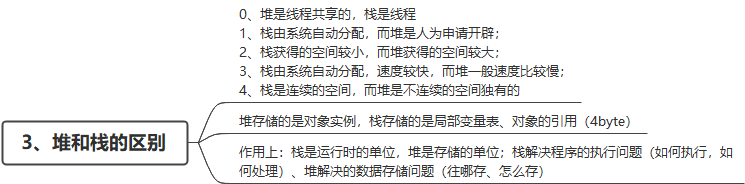

# 3.5 卓望数码一面

## 1、IOC

> 概念：Spring 通过一个配置文件描述 Bean 及 Bean 之间的依赖关系，利用 Java 语言的反射功能实例化Bean 并建立 Bean 之间的依			赖关系。 Spring 的 IoC 容器在完成这些底层工作的基础上，还提供了 Bean 实例缓存、生命周期管理、 Bean 实例代理、事件			发布、资源装载等高级服务

**理解**

- IoC（Inverse of Control:控制反转）是⼀种设计思想，就是将原本在程序中⼿动创建对象的控制权，交由Spring框架来管理
- IoC 容器是Spring ⽤来实现 IoC 的载体， IoC 容器实际上就是个Map（key，value）,Map 中存放的是各种对象
- 将对象之间的相互依赖关系交给 IoC 容器来管理，并由 IoC 容器完成对象的注⼊，这样可以很⼤程度上简化应⽤的开发，把应⽤从复杂的依赖关系中解放出来。 IoC 容器就像是⼀个⼯⼚⼀样，当我们需要创建⼀个对象的时候，只需要配置好配置⽂件/注解即可，完全不⽤考虑对象是如何被创建出来的。

**什么是依赖注入**

在依赖注入中，您不必创建对象，但必须描述如何创建它们。您不是直接在代码中将组件和服务连接在一起，而是描述配置文件中哪些组件需要哪些服务。由 IoC容器将它们装配在一起

## 2、mysql索引的类型

**索引类型**

- 全文索引（FULLTEXT）
- HASH索引
- BTREE索引
- RTREE索引

**索引种类**

- 普通索引：仅加速查询
- 唯一索引：加速查询 + 列值唯一（可以有null）
- 主键索引：加速查询 + 列值唯一（不可以有null）+ 表中只有一个
- 复合索引：多列值组成一个索引，专门用于组合搜索，其效率大于索引合并
- 全文索引：对文本的内容进行分词，进行搜索

## 3、java8有哪些新特性

- Lambda表达式
- 函数式接口
- 方法引用
- Stream API
- 构造器引用以及数组引用
- Optional类的使用

## 4、char类型占多少字节

| 基本数据类型 | 占用字节 |
| ------------ | -------- |
| byte         | 1        |
| short        | 2        |
| int          | 4        |
| long         | 8        |
| char         | 2        |
| float        | 4        |
| double       | 8        |
| boolean      | 不确定   |

# 3.10 东方财富一面

## 1、innodb是如何存储的数据的

**InnoDb采用页保存数据，页大小一般是16KB**

虽然数据保存在磁盘中，但其处理是在内存中进行的。为了减少磁盘随机读取次数，InnoDB 采用页而不是行的粒度来保存数据，即数据

被分成若干页，以页为单位保存在磁盘中。InnoDB 的页大小，一般是 16KB

**页与页之间是双向链表，每个页中的数据按主键排序组成单向链表**

每个页还有一个页目录，方便按照主键查询。最大的最小的槽指向2个特殊的伪记录。

这个页目录就是一个简单的索引，应该说是聚簇索引的一部分。是通过对记录进行一级分组来降低搜索的时间复杂度

## 2、可以建几个索引

mysql 可支持16个索引，最大索引长度256字节

## 3、建立索引AC、ABC用到A 用哪个索引

MySQL5.0之前，一个表一次只能使用一个索引，无法同时使用多个索引分别进行条件扫描。但是从5.1开始，引入了 index merge 优化技术，对同一个表可以使用多个索引分别进行条件扫描
**题目情况按索引创建顺序使用，谁先创建使用谁**

## 4、小表驱动大表

**永远小表驱动大表**，类似嵌套循环Nested Loop

```java
for(int i = 5...){
	for(int j = 1000...){
        
    }
}
===========================
for(int i = 1000...){
	for(int j = 5...){
        
    }
} 
```

两种方式都能达到效果，只不过推荐上面的方式，在MySQL中，如果是需要两张表驱动的话，那么第一种方式只需要连接5次，而第二种方式需要连接1000次

# 3.14 奇安信面试准备

## 1、Java的跨平台咋做的

 对于Java的平台无关性的支持是分布在整个Java体系结构中的。

 其中扮演着重要角色的有Java语言规范、Class文件、Java虚拟机等。

**Java语言规范**

  通过规定Java语言中基本数据类型的取值范围和行为

**Class文件**

  所有Java文件要编译成统一的Class文件

**Java虚拟机**

  通过Java虚拟机将Class文件转成对应平台的二进制文件， Java的平台无关性是建立在Java虚拟机的平台有关性基础之上的，是因为Java虚拟机屏蔽了底层操作系统和硬件的差异。

## 2、Java的线程和操作系统线程有啥关系

**JVM在设计声明**：虚拟机中的线程状态，不反应任何操作系统线程状态

**Java线程和操作系统线程，实际上同根同源，但又相差甚远**

-----

操作系统中的线程除去new和terminated状态，一个线程真实存在的状态，只有：

- ready：表示线程已经被创建，正在等待系统调度分配CPU使用权。
- running：表示线程获得了CPU使用权，正在进行运算
- waiting：表示线程等待（或者说挂起），让出CPU资源给其他线程使用

对于Java中的线程状态：

无论是`Timed Waiting` ，`Waiting`还是`Blocked`，对应的都是操作系统线程的**`waiting`（等待**）状态。
而`Runnable`状态，则对应了操作系统中的`ready`和`running`状态。

## 3、堆和栈的区别



## 4、端口号的作用、端口的范围，为啥是65535

端口号就是在同一操作系统内为区分不同套接字而设置的，因为无法将1个端口号分配给不同套接字

在TCP、UDP协议的开头，会分别有16位来存储源端口号和目标端口号，所以端口个数是2^16-1=65535个

## 5、文件的TopK问题

**我们可以建立一个大小为K小根堆，然后从第k个元素开始遍历，如果大于小根堆的堆顶，那么就交换两个元素，交换一次调整一次，直到所有数据遍历结束，堆中的元素就是海量数据中最大的k个**

## 6、前中后遍历二叉树的迭代

> 前序遍历

```java
// 前序
public List<Integer> preorderTraversal(TreeNode root) {
    if (root == null) {
        return null;
    }
    List<Integer> list = new ArrayList<Integer>();

    Stack<TreeNode> s = new Stack<TreeNode>();
    s.push(root);

    while (!s.isEmpty()) {

        TreeNode node = s.pop();
        list.add(node.val);

        if (node.right != null) {
            s.push(node.right);
        }

        if (node.left != null) {
            s.push(node.left);
        }
    }

    return list;
}
```

> 中序遍历

```java
public static List<Integer> inorderTraversal(TreeNode root) {
    if (root == null) {
        return null;
    }
    List<Integer> list = new ArrayList<Integer>();

    Stack<TreeNode> s = new Stack<TreeNode>();

    do {
        while (root != null) {
            s.push(root);
            root = root.left;
        }
        if (!s.isEmpty()) {
            TreeNode node = s.pop();
            list.add(node.val);
            root = node.right;
        }
    } while (!s.isEmpty() || root != null);

    return list;
}
```

> 后序遍历

```java
public static List<Integer> postorderTraversal(TreeNode root) {
    if (root == null) {
        return null;
    }
    List<Integer> list = new ArrayList<Integer>();

    Stack<TreeNode> s = new Stack<TreeNode>();

    s.push(root);

    while( !s.isEmpty() ) {
        TreeNode node = s.pop();
        if(node.left != null) {
            s.push(node.left);
        }

        if(node.right != null) {
            s.push(node.right);
        }

        list.add(0, node.val);
    }

    return list;
}
```

## 7、优先队列实现大顶堆

```java
PriorityQueue<Integer> maxheap = new PriorityQueue<Integer>(new Comparator<>(){ 
    @Override
    public int compare(Integer i1,Integer i2){
        return i2-i1;
    }
});


PriorityQueue<Integer> maxheap = new PriorityQueue<>((i1, i2) -> i2 - i1);
```

## 8、cookie和session

> cookie

- Cookie 是服务器通知客户端保存键值对的一种技术
- 客户端有了 Cookie 后，每次请求都发送给服务器
- 每个 Cookie的大小不超过4kb

> session

1、Session 就一个接口（HttpSession）。 

2、Session 就是会话。它是用来维护一个客户端和服务器之间关联的一种技术。

3、每个客户端都有自己的一个 Session 会话。

4、Session 会话中，我们经常用来保存用户登录之后的信息 

# 3.14 奇安信一面

## 1、@import问题

@Import可以导入bean或者@Configuration修饰的配置类。如果配置类在标准的springboot的包结构下，就是SpringbootApplication启动类在包的根目录下，配置类在子包下。就不需要使用@Import导入配置类，**如果配置类在第三方的jar下，我们想要引入这个配置类，就需要@Import对其引入到工程中才能生效**。**因为这个时候配置类不再springboot默认的扫描范围内**

----

@Import支持 三种方式

1.带有@Configuration的配置类(4.2 版本之前只可以导入配置类，4.2版本之后 也可以导入 普通类)
2.ImportSelector 的实现
3.ImportBeanDefinitionRegistrar 的实现

## 2、redis批量写不会出现线程安全问题

## 3、innodb没有主键的情况下如何存储的

如果表中没有主键或者一个合适的的唯一索引，InnoDB内部会以一个包含行ID值的合成列生成一个隐藏的聚簇索引。表中的行是按照InnoDB分配的ID排序的。行ID是一个6字节的字段，随着一个新行的插入单调增加

## 4、Linux监控文件是否修改命令

tail本身的功能是显示文件的后多少行
tail filename:显示filename后十行
tail -n filename 显示filename后n行
通过添加-f选项可以监控文件变化,文件有更新就会打印出来:tail -f filename

-----

重复的执行后面的命令,默认的时间间隔是2秒

watch -d -n 10 cat /etc/syslog.conf

每10秒打印一下/etc/syslog.conf文件,-d表示高亮变化的部分

# 3.16 奇安信二面

## 1、kill -9和 -15的区别

kill -9 PID 是操作系统从内核级别强制杀死一个进程.

kill -15 PID 可以理解为操作系统发送一个通知告诉应用主动关闭.

## 2、Arrays.sort的实现，用到什么排序

## 3、一个类按照一个属性排序

自然排序 实现	Comparable接口 重写compareTo方法

定制排序

## 4、spring boot项目启动很慢，该怎么办

我们会使用@SpringBootApplication注解来自动获取应用的配置信息，但这样也会带来一些副作用。使用这个注解后，会触发自动配置（auto-configuration）和组件扫描（component scanning），这跟使用@Configuration、@EnableAutoConfiguration和@ComponentScan三个注解的作用是一样的。这样做给开发带来方便的同时，会有以下的一些影响：

（a）会导致项目启动时间变长（原因：加载了我们不需要使用的组件,浪费了cpu资源和内存资源）。当启动一个大的应用程序，或将做大量的集成测试启动应用程序时，影响会特别明显。

（b）会加载一些不需要的多余的实例（beans）。

（c）会增加CPU消耗和内存的占用

> 可能的原因

**原因一**
项目中使用的无用配置太多。例如在一个最简单的web中，你还加入了其他各种maven配置，并且将他们配置到项目中（只是比较夸张的例子，这些配置加入都不用），然后项目本身也不懂，既然你配置了，那就加载呗。一个花0.1秒，10个就1秒，100个就10秒了…以此类推，这一点就是最容易想明白的地方了。

**原因二**
spring boot的自动配置。自动配置是spring boot的一个特色，但是也是它启动慢的一个弊病。没办法，通常好用功能全的东西，总会在一些地方上有缺陷。上面说到无用的配置多，这里要说的就是spring boot它自己装配的东西太多。你可以看到在spring boot的相关jar包里，都存放着spring.factories的文件，进去一看，大部分都是写了很多的类，它是实现spring boot自动装配的核心之一。但是你仔细观察会发现，其实有很多类，你可能完全不用。但有什么办法呢，不管你用不用，至少它都会给你检查一遍，这不也是花时间的地方吗？

**原因三**
项目精简程度不够。现在比较流行微服务的概念，我认为它的概念核心含义即为精简，单一，并且多数需要强调启动速度的地方也多是出自微服务的项目中。一个微服务项目中，最好是在10秒以内能够启动完毕。但是多数是做不到的，原因在于项目拆分的还不够细。你说一个接口启动快，还是10个快，或是更多，答案很明显。很多项目做到了大而全，所谓大而全就是功能很多，配置很齐全，各种可以扩展配置等，全面的不行不行的，但这意味着什么，你的配置多，有用没用先不管，至少需要编译和加载的类文件都会多出很多来，你说要这样的项目能启动快，怎么能启动快呢？

**解决方法**

- 检查maven中是否无用的依赖太多
- 比较复杂，使用spring-boot-maven插件debug启动，查看该项目中，使用了哪些配置，哪些配置没用，然后在启动类中直接注明只启动使用了的类，并且删掉@SpringBootApplication注解，手动填上@Configuration和@Import注解，并在@Import注解中加上那些配置的类。
- 更换一些配置更快的依赖。例如，你使用A数据库连接池，功能全，配置多，但速度较慢，但是其实B连接池也能满足项目需求，但是功能相对较少，所以配置也少，启动更快，你是不是需要考A和B应该选一个。
- 拆分出更精简的项目来独自运行，大而全意味着多而不精，精而简意味着少但是精通，它们速度，不言而喻

## 5、Integer的==问题

```java
public static void main(String[] args) {
    Integer a = 50;
    Integer b = Integer.valueOf(50);
    Integer c = new Integer(50);
    System.out.println(a == b);
    System.out.println(a == c);
    System.out.println(c == b);
}

// valueOf会去找缓存，不在缓存中的new
public static Integer valueOf(int i) {
    if (i >= IntegerCache.low && i <= IntegerCache.high)
        return IntegerCache.cache[i + (-IntegerCache.low)];
    return new Integer(i);
}
//  true
//  false
//  false
```

## 6、ConcurrentHashMap如何扩容

## 7、List的remove()方法陷阱

1、用for循环遍历List删除元素时，需要注意索引会左移的问题。

2、List删除元素时，为避免陷阱，建议使用迭代器iterator的remove方式。

3、List删除元素时，默认按索引删除，而不是对象删除

# 3.16 东方财富二面

1、MySQL建立索引要考虑什么？Oracle多少数据量不建议建立索引

# 设计模式有哪些，有什么应用场景

- 单例模式的典型应用场景是 Spring 中 Bean 实例
- 原型模式的典型使用场景是 Java 语言中的 Object.clone() 方法
- Spring [框架](https://so.csdn.net/so/search?q=框架&spm=1001.2101.3001.7020)中的 JdbcTemplate 使用的就是命令模式

# IO多路复用

(1)select==>时间复杂度O(n)

它仅仅知道了，有I/O事件发生了，却并不知道是哪那几个流（可能有一个，多个，甚至全部），我们只能无差别轮询所有流，找出能读出数据，或者写入数据的流，对他们进行操作。所以select具有O(n)的无差别轮询复杂度，同时处理的流越多，无差别轮询时间就越长。

(2)poll==>时间复杂度O(n)

poll本质上和select没有区别，它将用户传入的数组拷贝到内核空间，然后查询每个fd对应的设备状态， 但是它没有最大连接数的限制，原因是它是基于链表来存储的.

(3)epoll==>时间复杂度O(1)

epoll可以理解为event poll，不同于忙轮询和无差别轮询，epoll会把哪个流发生了怎样的I/O事件通知我们。所以我们说epoll实际上是事件驱动（每个事件关联上fd）的，此时我们对这些流的操作都是有意义的。（复杂度降低到了O(1)）

区别

1、支持一个进程所能打开的最大连接数

select：单个进程所能打开的最大连接数有FD_SETSIZE宏定义，其大小是32个整数的大小（在32位的机器上，大小就是3232，同理64位机器上FD_SETSIZE为3264），当然我们可以对进行修改，然后重新编译内核，但是性能可能会受到影响，这需要进一步的测试。

poll：poll本质上和select没有区别，但是它没有最大连接数的限制，原因是它是基于链表来存储的。

epoll：虽然连接数有上限，但是很大，1G内存的机器上可以打开10万左右的连接，2G内存的机器可以打开20万左右的连接。

2、FD剧增后带来的IO效率问题

select：因为每次调用时都会对连接进行线性遍历，所以随着FD的增加会造成遍历速度慢的“线性下降性能问题”。

poll：同上

epoll：因为epoll内核中实现是根据每个fd上的callback函数来实现的，只有活跃的socket才会主动调用callback，所以在活跃socket较少的情况下，使用epoll没有前面两者的线性下降的性能问题，但是所有socket都很活跃的情况下，可能会有性能问题。

3、 消息传递方式

select：内核需要将消息传递到用户空间，都需要内核拷贝动作

poll：同上

epoll：epoll通过内核和用户空间共享一块内存来实现的。

