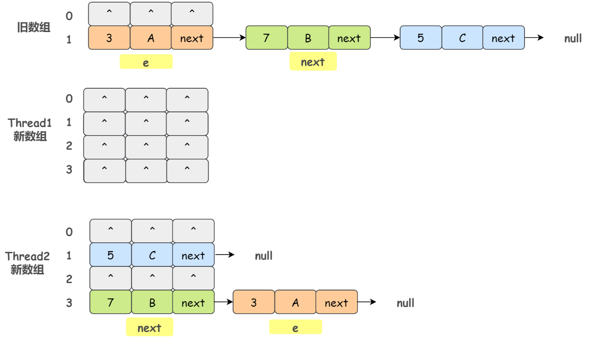
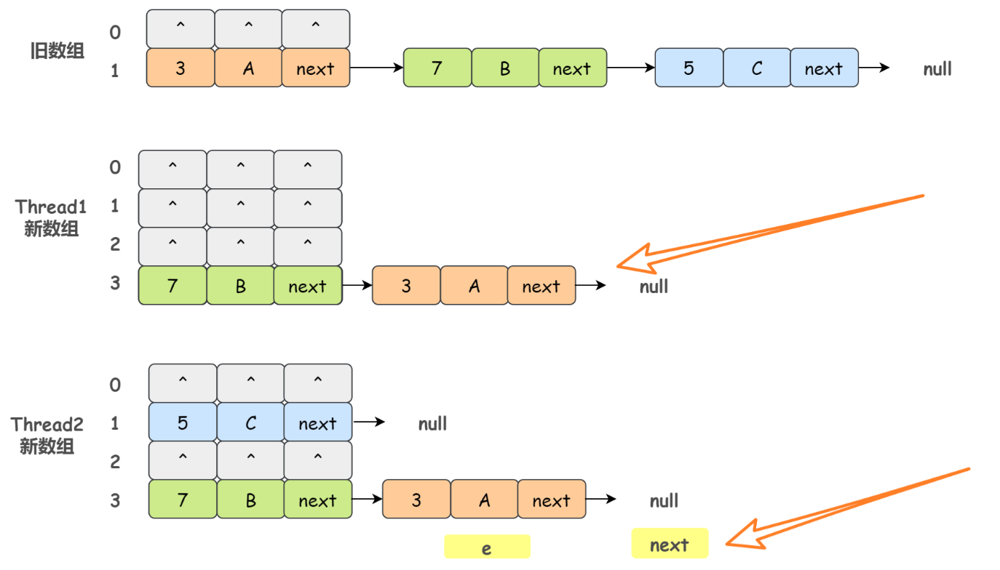

# 一、HashMap

## ① HashMap 的底层结构和原理

HashMap 就是以 Key-Value 的方式进行数据存储的一种数据结构嘛，在我们平常开发中非常常用，它在 JDK 1.7 和 JDK 1.8 中底层数据结构是有些不一样的。总体来说，JDK 1.7 中 HashMap 的底层数据结构是数组 + 链表，使用 Entry 类存储 Key 和 Value；JDK 1.8 中 HashMap 的底层数据结构是数组 + 链表/红黑树，使用 Node 类存储 Key 和 Value。当然，这里的 Entry 和 Node 并没有什么不同
- Node 类的源码

  ```java
  // HashMap 1.8 内部使用这个数组存储所有键值对
  transient Node<K,V>[] table;
  ```

  

  每一个节点都会保存自身的 hash、key 和 value、以及下个节点

- 简略的 HashMap 示意图

  

因为 HashMap 本身所有的位置都为 null 嘛，所以在插入元素的时候即 `put` 操作时，会根据 key 的 hash 去计算出一个 index 值，也就是这个元素将要插入的位置。举个例子：比如 `put("小牛肉"，20)`，我插入了一个 key 为 “小牛肉” value 为 20 的元素，这个时候我们会通过哈希函数计算出这个元素将要插入的位置，假设计算出来的结果是 2：


当然数组的长度是有限的，在有限的数组上使用哈希，那么哈希冲突是不可避免的，很有可能两个元素计算得出的 index 是相同的，那么如何解决哈希冲突呢？**拉链法**。也就是把 hash 后值相同的元素放在同一条链表上。如：


当然，当 Hash 冲突严重时，在数组上形成的链表会变的越来越长，由于链表不支持索引，要想在链表中找一个元素就需要遍历一遍链表，那显然效率是比较低的。为此，JDK 1.8 引入了红黑树，**当链表的长度大于 8 的时候就会转换为红黑树，不过，在转换之前，会先去查看 table 数组的长度是否大于 64，如果数组的长度小于 64，那么 HashMap 会优先选择对数组进行扩容 `resize`，而不是把链表转换成红黑树**。

- 转换的源码

  ```Java
  final void treeifyBin(Node<K,V>[] tab, int hash) {
      int n, index; Node<K,V> e;
      // 数组扩容
      if (tab == null || (n = tab.length) < MIN_TREEIFY_CAPACITY)
          resize();
      // 链表转换为红黑树
      else if ((e = tab[index = (n - 1) & hash]) != null) {
          TreeNode<K,V> hd = null, tl = null;
          do {
              TreeNode<K,V> p = replacementTreeNode(e, null);
              if (tl == null)
                  hd = p;
              else {
                  p.prev = tl;
                  tl.next = p;
              }
              tl = p;
          } while ((e = e.next) != null);
          if ((tab[index] = hd) != null)
              hd.treeify(tab);
      }
  }
  ```

- JDK 1.8 下 HashMap 的完整示意图

  

## ② HashMap在jdk8中相较于jdk7在底层实现方面的不同

- new HashMap():底层没创建一个长度为16的数组
- jdk 8底层的数组是：Node[],而非Entry[]
- 首次调用put()方法时，底层创建长度为16的数组
- jdk7底层结构只：数组+链表。jdk8中底层结构：数组+链表+红黑树。
  - 形成链表时，七上八下（jdk7:新的元素指向旧的元素。jdk8：旧的元素指向新的元素）
  - 当数组的某一个索引位置上的元素以链表形式存在的数据个数 > 8 且当前数组的长度 > 64时，此时此索引位置上的所数据改为使用红黑树存储。
- 后续如果由于删除或者其他原因调整了大小，当红黑树的节点小于或等于 6 个以后，又会恢复为链表形态
- 1.7中新增节点采用头插法，1.8中新增节点采用尾插法。这也是为什么1.8不容易出现环型链表的原因 
- 1.8rehash时保证原链表的顺序，而1.7中rehash时有可能改变链表的顺序（头插法导致） 

## ③HashMap底层典型属性的属性的说明

- DEFAULT_INITIAL_CAPACITY : HashMap的默认容量，16
- DEFAULT_LOAD_FACTOR：HashMap的默认加载因子：0.75
- threshold：扩容的临界值，=容量*填充因子：16 * 0.75 => 12
- TREEIFY_THRESHOLD：Bucket中链表长度大于该默认值，转化为红黑树:8
- MIN_TREEIFY_CAPACITY：桶中的Node被树化时最小的hash表容量:64

## ④ 新的节点在插入链表的流程

在 JDK 1.7 的时候，采用的是头插法。不过 JDK 1.8 改成了尾插法。

原因：因为 **JDK 1.7 中采用的头插法在多线程环境下可能会造成循环链表问题**。


不断的插入节点，数组大小会不断增加。数组容量是有限的，如果数据多次插入并到达一定的数量就会进行**数组扩容**，也就是`resize` 方法。什么时候会进行 `resize` 呢？与两个因素有关：

1）`Capacity`：HashMap 当前最大容量/长度

2）`LoadFactor`：负载因子，默认值0.75f

```java
static final float DEFAULT_LOAD_FACTOR = 0.75f;
static final int MIN_TREEIFY_CAPACITY = 64;
static final int DEFAULT_INITIAL_CAPACITY = 1 << 4; // aka 16
static final int MAXIMUM_CAPACITY = 1 << 30;
```

如果当前存入的数据数量大于 Capacity * LoadFactor 的时候，就会进行数组扩容 `resize`。就比如当前的 HashMap 的最大容量大小为 100，当你存进第 76 个的时候，判断发现需要进行 resize了，那就进行扩容。

扩容的步骤：

1）扩容：创建一个新的 Entry/Node 空数组，长度是原数组的 **2 倍**

2）ReHash：遍历原 Entry/Node 数组，把所有的 Entry/Node 节点重新 Hash 到新数组

为什么要 ReHash 呢？直接复制到新数组不行吗？

​	显然是不行的，因为数组的长度改变以后，Hash 的规则也随之改变。index 的计算公式是这样的：

​	index = HashCode(key) & (Length - 1)

​	比如说数组原来的长度（Length）是 4，Hash 出来的值是 2 ，然后数组长度翻倍了变成 16，显然 Hash 出来的值也就会变了。

图例：


> 为啥 JDK 1.7 使用头插法，JDK 1.8 之后改成尾插法了呢？

jdk1.7的源码


newTable 就是扩容后的新数组，`transfer` 方法是 `resize` 的核心，它的的功能就是 ReHash，然后将原数组中的数据迁移到新数据。

简化transfer方法:


**单线程情况下，正常的 resize 的过程**

假设我们原来的数组容量为 2，记录数为 3，分别为：[3,A]、[7,B]、[5,C]，并且这三个 Entry 节点都落到了第二个桶里面，新数组容量会被扩容到 4。


如果我们有**两个线程 Thread1 和 Thread2，假设线程 Thread1 执行到了 transfer 方法的 `Entry next = e.next` 这一句，然后时间片用完了被挂起了。随后线程 Thread2 顺利执行并完成 resize 方法**。于是我们有下面这个样子：



注意，Thread1 的 e 指向了 [3,A]，next 指向了 [7,B]，**而在线程 Thread2 进行 ReHash后，e 和 next 指向了线程 Thread2 重组后的链表**。我们可以看到链表的顺序被反转了。

这个时候线程 Thread1 被重新调度执行，先是执行 `newTalbe[i] = e`，i 就是 ReHash 后的 index 值：


然后执行 `e = next`，导致了 e 指向了 [7,B]，而下一次循环执行到 `next = e.next` 时导致了 next 指向了 [3,A]


然后，线程 Thread1 继续执行。把旧数组的 [7,B] 摘下来，放到 newTable[i] 的第一个，然后把 e 和 next 往下顺移：



OK，Thread1 再进入下一步循环，执行到 `e.next = newTable[i]`，导致 [3,A].next 指向了 [7,B]，循环链表出现


**由于 JDK 1.7 中 HashMap 使用头插会改变链表上元素的的顺序，在旧数组向新数组转移元素的过程中修改了链表中节点的引用关系，因此 JDK 1.8 改成了尾插法，在扩容时会保持链表元素原本的顺序，避免了链表成环的问题**。

## ⑤ HashMap和HashTable 的异同

- 二者的存储结构和解决冲突的方法都是相同的。
- HashTable在不指定容量的情况下的默认容量为11，而HashMap为16，Hashtable不要求底层数组的容量一定要为2的整数次幂，而HashMap则要求一定为2的整数次幂。
- HashTable 中 key和 value都不允许为 null，而HashMap中key和value都允许为 null（key只能有一个为null，而value则可以有多个为 null）。但是如果在 Hashtable中有类似 put( null, null)的操作，编译同样可以通过，因为 key和 value都是Object类型，但运行时会抛出 NullPointerException异常。
- Hashtable扩容时，将容量变为原来的2倍+1，而HashMap扩容时，将容量变为原来的2倍。
- Hashtable计算hash值，直接用key的hashCode()，而HashMap重新计算了key的hash值，Hashtable在计算hash值对应的位置索引时，用 %运算，而 HashMap在求位置索引时，则用 &运算。

## ⑥ 优化HashMap

初始化 HashMap 的时候，我们可以自定义**数组容量**及**加载因子**的大小。所以，优化 HashMap 从这两个属性入手，但是，如果你不能准确的判别你的业务所需的大小，请使用默认值，否则，一旦手动配置的不合适，效果将适得其反。

**threshold = (int)( capacity \* loadFactor );**

**阈值 = 容量 X 负载因子**

初始容量默认为16,负载因子(loadFactor)默认是0.75; map扩容后，要重新计算阈值；当元素个数 大于新的阈值时，map再自动扩容；以默认值为例，阈值=16*0.75=12，当元素个数大于12时就要扩容；那剩下的4个数组位置还没有放置对象就要扩容，造成空间浪费，所以要进行时间和空间的折中考虑；

- **loadFactor过大时**，map内的数组使用率高了，内部极有可能形成Entry链，影响查找速度；

- **loadFactor过小时**，map内的数组使用率较低，不过内部不会生成Entry链，或者生成的Entry链很短，由此提高了查找速度，不过会占用更多的内存；所以可以根据实际硬件环境和程序的运行状态来调节loadFactor；

所以，务必合理的初始化 HashMap

## ⑦ HashMap有关的问题

### 1、HashMap 的默认初始数组长度是多少？为什么是这么多？

默认数组长度是 16，其实只要是 2 的次幂都行，至于为啥是 16 呢，我觉得应该是个经验值问题，Java 作者是觉得 16 这个长度最为常用。

那为什么数组长度得是 2 的次幂呢？

首先，一般来说，我们常用的 Hash 函数是这样的：index = HashCode(key) % Length，但是因为位运算的效率比较高嘛，所以 HashMap 就相应的改成了这样：index = HashCode(key) & (Length - 1)。

那么**为了保证根据上述公式计算出来的 index 值是分布均匀的，我们就必须保证 Length 是 2 的次幂**。

解释一下：2 的次幂，也就是 2 的 n 次方，它的二进制表示就是 1 后面跟着 n 个 0，那么 2 的 n 次方 - 1 的二进制表示就是 n 个 1。而对于 & 操作来说，任何数与 1 做 & 操作的结果都是这个数本身。也就是说，index 的结果等同于 HashCode(key) 后 n 位的值，只要 HashCode 本身是分布均匀的，那么我们这个 Hash 算法的结果就是均匀的。

### 2、以 HashMap 为例，解释一下为什么重写 equals 方法的时候还需要重写 hashCode 方法呢？

既然讲到 `equals` 了，那就先顺便回顾下运算符 `==` 的吧，它存在两种使用情况：

- 对于基本数据类型来说， == 比较的是值是否相同；
- 对于引用数据类型来说， == 比较的是内存地址是否相同。

`equals()`也存在两种使用情况：

- 情况 1：没有重写 equals() 方法。则通过 equals() 比较该类的两个对象时，等价于通过 `==` 比较这两个对象（比较的是地址）。
- 情况 2：重写 equals() 方法。一般来说，我们都会重写 equals() 方法来判断两个对象的内容是否相等，比如 String 类就是这样做的。当然，你也可以不这样做。

另外，我们还需要明白，**如果我们不重写 hashCode()，那么任何对象的 hashCode() 值都不会相等**。

OK，回到问题，为什么重写 equals 方法的时候还需要重写 hashCode 方法呢？

以 HashMap 为例，HashMap 是通过 hashCode(key) 去计算寻找 index 的，如果多个 key 哈希得到的 index 一样就会形成链表，那么如何在这个具有相同 hashCode 的对象链表上找到某个对象呢？

那就是通过重写的 `equals` 比较两个对象的值。

总体来说，HashMap 中`get(key)` 一个元素的过程是这样的，先比较 key 的 hashcode() 是否相等，若相等再通过 equals() 比较其值，若 equals() 相等则认为他们是相等的。若 equals() 不相等则认为他们不相等。

如果只重写 equals 没有重写 hashCode()，就会导致相同的对象却拥有不同的 hashCode，也就是说在判断的第一步 HashMap 就会认为这两个对象是不相等的，那显然这是错误的。

###  3、HashMap 线程不安全的表现有哪些？

关于 JDK 1.7 中 HashMap 的线程不安全，上面已经说过了，就是会出现环形链表。虽然 JDK 1.8 采用尾插法避免了环形链表的问题，但是它仍然是线程不安全的，我们来看看 JDK 1.8 中 HashMap 的 `put` 方法：


假设线程 1 和线程 2 同时进行 put 操作，恰好这两条不同的数据的 hash 值是一样的，并且该位置数据为null，这样，线程 1 和线程 2 都会进入这段代码进行插入元素。假设线程 1 进入后还没有开始进行元素插入就被挂起，而线程 2 正常执行，并且正常插入数据，随后线程 1 得到 CPU 调度进行元素插入，这样，线程 2 插入的数据就被覆盖了。

总结一下 HashMap 在 JDK 1.7 和 JDK 1.8 中为什么不安全：

- JDK 1.7：由于采用头插法改变了链表上元素的的顺序，并发环境下扩容可能导致循环链表的问题
- JDK 1.8：由于 put 操作并没有上锁，并发环境下可能发生某个线程插入的数据被覆盖的问题

### 4、如何保证 HashMap 线程安全？

1）使用 java.util.Collections 类的 `synchronizedMap` 方法包装一下 HashMap，得到线程安全的 HashMap，其原理就是对所有的修改操作都加上 synchronized。方法如下：

```java
public static <K,V> Map<K,V> synchronizedMap(Map<K,V> m)
```

2）使用线程安全的 `HashTable` 类代替，该类在对数据操作的时候都会上锁，也就是加上 synchronized

3）使用线程安全的 `ConcurrentHashMap` 类代替，该类在 JDK 1.7 和 JDK 1.8 的底层原理有所不同，JDK 1.7 采用数组 + 链表存储数据，使用分段锁 Segment 保证线程安全；JDK 1.8 采用数组 + 链表/红黑树存储数据，使用 CAS + synchronized 保证线程安全。

### 5、 HashMap底层为什么是2倍扩容？

换一种说法：**HashMap 的 size 为什么必须是 2 的整数次⽅？**

```java
/**
   * Returns a power of two size for the given target capacity.
   * 每次都是将cap扩展到大于cap最近的2的n次幂
    */
   static final int tableSizeFor(int cap) {
       int n = cap - 1;
       n |= n >>> 1;
       n |= n >>> 2;
       n |= n >>> 4;
       n |= n >>> 8;
       n |= n >>> 16;
       return (n < 0) ? 1 : (n >= MAXIMUM_CAPACITY) ? MAXIMUM_CAPACITY : n + 1;
   }
```

- **第一是因为哈希函数的问题**
  通过**除留余数法**方式获取桶号，因为**Hash表的大小始终为2的n次幂**，因此可以将**取模转为位运算操作**，提高效率，容量n为2的幂次方，n-1的二进制会全为1，位运算时可以充分散列，避免不必要的哈希冲突，这也就是为什么要按照2倍方式扩容的一个原因
- **第二是因为是否移位的问题**
  是否移位，**由扩容后表示的最高位是否1为所决定**，并且移动的方向只有一个，**即向高位移动**。因此，可以根据对最高位进行检测的结果来决定是否移位，从而可以优化性能，不**用每一个元素都进行移位，因为为0说明刚好在移位完之后的位置，为1说明不是需要移动oldCop**，这也是其为什么要按照2倍方式扩容的第二个原因。
- HashMap计算添加元素的位置时，使用的位运算，这是特别高效的运算；另外，HashMap的初始容量是2的n次幂，扩容也是2倍的形式进行扩容，是因为容量是2的n次幂，可以使得添加的元素均匀分布在HashMap中的数组上，减少hash碰撞，避免形成链表的结构，使得查询效率降低
-  这样做总是能够保证 HashMap 的底层数组⻓度为 2 的 n 次⽅。当 length 为 2 的 n 次⽅时，h & (length - 1) 就相当于对 length 取模，⽽且速度⽐直接取模快得多，这是 HashMap 在速度上的⼀个优化。⽽且每次扩容时都是翻倍。 
- 如果 length 为 2 的次幂，则 length - 1 转化为⼆进制必定是 11111……的形式，在与 h 的⼆进制进⾏与操作 时效率会⾮常的快，⽽且空间不浪费。但是，如果 length 不是 2 的次幂，⽐如：length 为 15，则 length - 1 为 14，对应的⼆进制为 1110，在于 h 与操作，最后⼀位都为 0 ，⽽ 0001，0011，0101，1001，1011， 0111，1101 这⼏个位置永远都不能存放元素了，空间浪费相当⼤，更糟的是这种情况中，数组可以使⽤的位 置⽐数组⻓度⼩了很多，这意味着进⼀步增加了碰撞的⼏率，减慢了查询的效率，这样就会造成空间的浪费。

| Map集合类         | Key          | Value        |
| ----------------- | ------------ | ------------ |
| ConcurrentHashMap | 不允许为null | 不允许为null |
| Tree              | 不允许为null | 允许为null   |
| HashMap           | 允许为null   | 允许为null   |

# 二、ConcurrentHashMap

- **ConcurrentHashMap是线程安全的数组,是HashTable的替代品,同为线程安全,其性能要比HashTable更好**

- **HashMap不是线程安全：**
  在并发环境下，可能会形成环状链表（扩容时可能造成，具体原因自行百度google或查看源码分析），导致get操作时，cpu空转，所以，在并发环境中使用HashMap是非常危险的

- **HashTable是线程安全的**：
  HashTable和HashMap的实现原理几乎一样，
  **与HashMap的差别：**
  HashTable不允许key和value为null；
  HashTable是线程安全的。

  HashTable线程安全的策略实现代价却比较大，get/put所有相关操作都是synchronized的，这相当于给整个哈希表加了一把大锁，多线程访问时候，只要有一个线程访问或操作该对象，那其他线程只能阻塞，见下图：

  

## ① ConcurrentHashMap底层实现

> JDK1.7

底层数据结构：Segments数组+HashEntry数组+链表，采用**分段锁**保证安全性

**容器中有多把锁，每一把锁锁一段数据，这样在多线程访问时不同段的数据时，就不会存在锁竞争了，这 样便可以有效地提高并发效率。这就是ConcurrentHashMap所采用的”分段锁”思想，见下图：**


- 一个ConcurrentHashMap中有一个Segments数组，一个Segments中存储一个HashEntry数组，每个HashEntry是一个链表结构的元素。 

- segment继承自ReentrantLock锁。 首先将数据分为一段一段的存储，然后给每一段数据配一把锁，当一个线程占用锁访问其中一段数据时，其他段的数据也能被其他线程访问，实现了真正的并发访问。 
-  可以通过构造函数指定,数组扩容不会影响其他的segment,get无需加锁,volatile保证内存可见性

**get()操作**： 

 HashEntry中的value属性和next指针是用volatile修饰的，保证了可见性，所以每次获取的都是最新值，get过程不需要加锁。 

 1.将key传入get方法中，先根据key的hashcode的值找到对应的segment段。 

 2.再根据segment中的get方法再次hash，找到HashEntry数组中的位置。 

 3.最后在链表中根据hash值和equals方法进行查找。 

ConcurrentHashMap的get操作跟HashMap类似，只是ConcurrentHashMap第一次需要经过一次hash定位到Segment的位置，然后再hash定位到指定的HashEntry，遍历该HashEntry下的链表进行对比，成功就返回，不成功就返回null。 

**put()操作**： 

 1.将key传入put方法中，先根据key的hashcode的值找到对应的segment段 

 2.再根据segment中的put方法，加锁lock()。 

 3.再次hash确定存放的hashEntry数组中的位置 

 4.在链表中根据hash值和equals方法进行比较，如果相同就直接覆盖，如果不同就插入在链表中。

> JDK1.8

底层数据结构：Synchronized + CAS +Node +红黑树.Node的val和next都用volatile保证,保证可见性,查找,替换,赋值操作都使用CAS

> **为什么在有Synchronized 的情况下还要使用CAS**
>
> 因为CAS是乐观锁,在一些场景中(并发不激烈的情况下)它比Synchronized和ReentrentLock的效率要高,当CAS保障不了线程安全的情况下(扩容或者hash冲突的情况下)转成Synchronized 来保证线程安全,大大提高了低并发下的性能.

锁 : 锁是锁的链表的head的节点,不影响其他元素的读写,锁粒度更细,效率更高,扩容时,阻塞所有的读写操作(因为扩容的时候使用的是Synchronized锁,锁全表),并发扩容.

 读操作无锁 :

- Node的val和next使用volatile修饰,读写线程对该变量互相可见
- 数组用volatile修饰,保证扩容时被读线程感知

**get()操作**： 

 get操作全程无锁。get操作可以无锁是由于Node元素的val和指针next是用volatile修饰的。 

 在多线程环境下线程A修改节点的val或者新增节点的时候是对线程B可见的。 

 1.计算hash值，定位到Node数组中的位置 

 2.如果该位置为null，则直接返回null 

 3.如果该位置不为null，再判断该节点是红黑树节点还是链表节点 

  如果是红黑树节点，使用红黑树的查找方式来进行查找 

  如果是链表节点，遍历链表进行查找 

 **put()操作**： 

 1.先判断Node数组有没有初始化，如果没有初始化先初始化initTable(); 

 2.根据key的进行hash操作，找到Node数组中的位置，如果不存在hash冲突，即该位置是null，直接用CAS插入 

 3.如果存在hash冲突，就先对链表的头节点或者红黑树的头节点加synchronized锁 

 4.如果是链表，就遍历链表，如果key相同就执行覆盖操作，如果不同就将元素插入到链表的尾部， 并且在链表长度大于8， Node数组的长度超过64时，会将链表的转化为红黑树。 

  5.如果是红黑树，就按照红黑树的结构进行插入。  

## ② 总线嗅探机制

使用 volatile 修饰共享变量后，每个线程要操作变量时会从主内存中将变量拷贝到本地内存作为副本，当线程操作变量副本并写回主内存后，会通过 **CPU 总线嗅探机制**告知其他线程该变量副本已经失效，需要重新从主内存中读取。

volatile 保证了不同线程对共享变量操作的可见性，也就是说一个线程修改了 volatile 修饰的变量，当修改后的变量写回主内存时，其他线程能立即看到最新值。

-----

在现代计算机中，CPU 的速度是极高的，如果 CPU 需要存取数据时都直接与内存打交道，在存取过程中，CPU 将一直空闲，这是一种极大的浪费，所以，为了提高处理速度，CPU 不直接和内存进行通信，而是在 CPU 与内存之间加入很多寄存器，多级缓存，它们比内存的存取速度高得多，这样就解决了 CPU 运算速度和内存读取速度不一致问题。

由于 CPU 与内存之间加入了缓存，在进行数据操作时，先将数据从内存拷贝到缓存中，CPU 直接操作的是缓存中的数据。但在多处理器下，将可能导致各自的缓存数据不一致（这也是可见性问题的由来），为了保证各个处理器的缓存是一致的，就会实现缓存一致性协议，而**嗅探是实现缓存一致性的常见机制**。


> 注意，缓存的一致性问题，不是多处理器导致，而是多缓存导致的。

**嗅探机制工作原理**：每个处理器通过监听在总线上传播的数据来检查自己的缓存值是不是过期了，如果处理器发现自己缓存行对应的内存地址修改，就会将当前处理器的缓存行设置无效状态，当处理器对这个数据进行修改操作的时候，会重新从主内存中把数据读到处理器缓存中。

> 注意：基于 CPU 缓存一致性协议，JVM 实现了 volatile 的可见性，但由于总线嗅探机制，会不断的监听总线，如果大量使用 volatile 会引起总线风暴。所以，volatile 的使用要适合具体场景。

使用 volatile 和 synchronized 锁都可以保证共享变量的可见性。相比 synchronized 而言，volatile 可以看作是一个轻量级锁，所以使用 volatile 的成本更低，因为它不会引起线程上下文的切换和调度。但 volatile 无法像 synchronized 一样保证操作的原子性。

**volatile 的原子性问题**

所谓的原子性是指在一次操作或者多次操作中，要么所有的操作全部都得到了执行并且不会受到任何因素的干扰而中断，要么所有的操作都不执行。

在多线程环境下，volatile 关键字可以保证共享数据的可见性，但是并不能保证对数据操作的原子性。也就是说，多线程环境下，使用 volatile 修饰的变量是**线程不安全的**。

要解决这个问题，我们可以使用锁机制，或者使用原子类（如 AtomicInteger）。

这里特别说一下，对任意单个使用 volatile 修饰的变量的读 / 写是具有原子性，但类似于 `flag = !flag` 这种复合操作不具有原子性。简单地说就是，**单纯的赋值操作是原子性的**。

## ③ 有关ConcurrentHashMap的一些问题

### 1、JDK1.8中为什么使用synchronized替换可重入锁ReentrantLock？ 

Segment继承了ReentrantLock，所以Segment是一种可重入锁。 

 1.**Segment可重入锁锁住的是一个HashEntry数组，synchronized锁住的只是发生hash冲突的链表]的头节点或红黑树的节点，提高了并发性能**。 

 2.从JDK1.6开始，对 synchronized 锁的实现引入了大量的优化，并且 synchronized 有多种锁状态，会从偏向锁 -> 轻量级锁 -> 重量级锁一步步转换。 

只要并发的线程可以在一定次数的自旋内拿到锁（偏向锁不用自旋），那么synchronized就不会升级为重量级锁，等待的线程也不会被挂起，减少了线程挂起和唤醒的切换的过程开销。  

 而ReentrantLock不会自旋，会直接挂起，这样一来就很容易会多出线程上下文开销的代价。 

  3.减少内存开销 。假设使用可重入锁来获得同步支持，那么每个节点都需要通过继承 AQS 来获得同步支持。但并不是每个节点都需要获得同步支持的，只有链表]的头节点（红黑树的根节点）需要同步，这无疑带来了巨大内存浪费。 

### 2、ConcurrentHashMap和Hashtable的区别？ 

 1.**底层数据结构**： 

 JDK1.7的ConcurrentHashMap底层采用：Segments数组+HashEntry数组+链表

 JDK1.8的ConcurrentHashMap底层采用：Node数据+链表+红黑树 

 Hashtable底层数据结构采用：数组+链表 

2.**实现线程安全的方式**： 

 在JDK1.7中ConcurrentHashMap采用分段锁实现线程安全。 

 在JDK1.8中ConcurrentHashMap采用synchronized和CAS来实现线程安全。 

 Hashtable采用synchronized来实现线程安全。在方法上加synchronized同步锁。 

### 3、HashMap与ConcurrentHashMap的区别？ 

HashMap是非线程安全的，这意味着不应该在多线程中对这些Map进行修改操作，否则会产生数据不 一致的问题，甚至还会因为并发插入元素而导致链表成环，这样在查找时就会发生死循环，影响到整个应用程序。 

Collections工具类可以将一个Map转换成线程安全的实现，其实也就是通过一个包装类，然后把所有功能都委托给传入的Map，而包装类是基于synchronized关键字来保证线程安全的（Hashtable也是基于synchronized关键字），底层使用的是互斥锁，性能与吞吐量比较低。 

 ConcurrentHashMap的实现细节远没有这么简单，因此性能也要高上许多。 

 它没有使用一个全局锁来锁住自己，而是采用了减少锁粒度的方法，尽量减少因为竞争锁而导致的阻塞与冲突，而且ConcurrentHashMap的检索操作是不需要锁的。 

### 4、ConcurrentHashMap是怎么分段分组的？ 

**get操作：** 

Segment的get操作实现非常简单和高效，先经过一次再散列，然后使用这个散列值通过散列运算定位到 Segment，再通过散列算法定位到元素。get操作的高效之处在于整个**get过程都不需要加锁**，除非读到空的值才会加锁重读。原因就是将使用的共享变量定义成 volatile 类型。 

**put操作：**  

 当执行put操作时，会经历两个步骤： 

1. 判断是否需要扩容； 

2. 定位到添加元素的位置，将其放入 HashEntry 数组中。 

插入过程会进行第一次 key 的 hash 来定位 Segment 的位置，如果该 Segment 还没有初始化，即通过CAS 操作进行赋值，然后进行第二次 hash 操作，找到相应的 HashEntry 的位置，这里会利用继承过来的锁的特性，在将数据插入指定的 HashEntry 位置时（尾插通过继承 ReentrantLock 的 tryLock() 方法尝试去获锁，如果获取成功就直接插入相应的位置，如果已经有线程获取该 Segment的锁，那当前线程会以自旋的方式去继续的调用 tryLock() 方法去获取锁，超过指定次数就挂起，等待唤醒。

# 三、ThreadLocal

## ThreadLocal是什么 

 **ThreadLocal 类提供线程局部变量，它通常是私有类中希望将状态与线程关联的静态字段。**

- 从名字我们就可以看到ThreadLocal叫做线程变量，意思是ThreadLocal中填充的变量属于**当前**线程，该变量对其他线程而言是隔离的。ThreadLocal为变量在每个线程中都创建了一个副本，那么每个线程可以访问自己内部的副本变量。
- ThreadLoal 变量，线程局部变量，同一个 ThreadLocal 所包含的对象，在不同的 Thread 中有不同的副本。这里有几点需要注意：
  - 因为每个 Thread 内有自己的实例副本，且该副本只能由当前 Thread 使用。这是也是 ThreadLocal 命名的由来。
  - 既然每个 Thread 有自己的实例副本，且其它 Thread 不可访问，那就不存在多线程间共享的问题。

- ThreadLocal的作用主要是做**数据隔离**，填充的数据只属于当前线程，变量的数据对别的线程而言是相对隔离的，在多线程环境下，如何防止自己的变量被其它线程篡改。
- ThreadLocal 适用于每个线程需要自己独立的实例且该实例需要在多个方法中被使用，也即变量在线程间隔离而在方法或类间共享的场景
- 熟悉 Spring 的同学可能知道 Bean 的作用域（Scope），而 ThreadLocal 的**作用域就是线程**

图解：


## ThreadLocal怎么用

线程进来之后初始化一个可以泛型的ThreadLocal对象，之后这个线程只要在remove之前去get，都能拿到之前set的值，注意这里我说的是remove之前。

他是能做到线程间数据隔离的，所以别的线程使用get（）方法是没办法拿到其他线程的值的。

测试代码一：

```java
public static void main(String[] args) {
    ThreadLocal<String> threadLocal = new ThreadLocal<>();

    new Thread(() -> {
        threadLocal.set("Thread1 -> cvzhanshi");
        System.out.println(Thread.currentThread().getName() + " get " + threadLocal.get());
    },"Thread1").start();

    new Thread(() -> {
        System.out.println(Thread.currentThread().getName() + " get " + threadLocal.get());
    },"Thread2").start();

    new Thread(() -> {
        System.out.println(Thread.currentThread().getName() + " get " + threadLocal.get());
    },"Thread3").start();
}
```


示例代码二：

```java
public static void main(String[] args) {

    // 创建一个ThreadLocal对象
    ThreadLocal<String> threadLocal = new ThreadLocal<>();

    new Thread(() -> {
        threadLocal.set("Thread1 -> cvzhanshi");
        System.out.println(Thread.currentThread().getName() + " get " + threadLocal.get());
    },"Thread1").start();

    new Thread(() -> {
        threadLocal.set("Thread2 -> cvzhanshi");
        System.out.println(Thread.currentThread().getName() + " get " + threadLocal.get());
    },"Thread2").start();


    new Thread(() -> {
        threadLocal.set("Thread3 -> cvzhanshi");
        System.out.println(Thread.currentThread().getName() + " get " + threadLocal.get());
    },"Thread3").start();
}
```

 

由于ThreadLocal里设置的值，只有当前线程自己看得见，这意味着你不可能通过其他线程为它初始化值。为了弥补这一点，ThreadLocal提供了一个withInitial()方法统一初始化所有线程的ThreadLocal的值：

```java
// ThreadLocal的初始值设置为cvzhanshi，这对全体线程都是可见的 
ThreadLocal<String> threadLocal = ThreadLocal.withInitial(() -> "cvzhanshi");
```

示例代码三：

```java
public static void main(String[] args) {

    // 创建一个ThreadLocal对象
    ThreadLocal<String> threadLocal = ThreadLocal.withInitial(() -> "cvzhanshi");

    new Thread(() -> {
        threadLocal.set("Thread1 -> cvzhanshi");
        System.out.println(Thread.currentThread().getName() + " get " + threadLocal.get());
    },"Thread1").start();

    new Thread(() -> {
        // threadLocal.set("Thread2 -> cvzhanshi");
        System.out.println(Thread.currentThread().getName() + " get " + threadLocal.get());
    },"Thread2").start();


    new Thread(() -> {
        // threadLocal.set("Thread3 -> cvzhanshi");
        System.out.println(Thread.currentThread().getName() + " get " + threadLocal.get());
    },"Thread3").start();
}
```


## ThreadLocal的实现原理

> ThreadLocal的get方法

```java
public T get() {
    //获得当前线程
    Thread t = Thread.currentThread();
    //每个线程 都有一个自己的ThreadLocalMap，
    //ThreadLocalMap里就保存着所有的ThreadLocal变量
    ThreadLocalMap map = getMap(t);
    if (map != null) {
        //ThreadLocalMap的key就是当前ThreadLocal对象实例，
        //多个ThreadLocal变量都是放在这个map中的
        ThreadLocalMap.Entry e = map.getEntry(this);
        if (e != null) {
            @SuppressWarnings("unchecked")
            //从map里取出来的值就是我们需要的这个ThreadLocal变量
            T result = (T)e.value;
            return result;
        }
    }
    // 如果map没有初始化，那么在这里初始化一下
    return setInitialValue();
}

private T setInitialValue() {
    // 给默认值 且初始化map
    T value = initialValue();
    Thread t = Thread.currentThread();
    ThreadLocalMap map = getMap(t);
    if (map != null)
        map.set(this, value);
    else
        createMap(t, value);
    return value;
}
```

可以看到，所谓的ThreadLocal变量就是保存在每个线程的map中的。这个map就是Thread对象中的threadLocals字段。如下：

```java
ThreadLocal.ThreadLocalMap threadLocals = null;
```

ThreadLocal.ThreadLocalMap是一个比较特殊的Map，它的每个Entry的key都是一个弱引用：

```java
static class Entry extends WeakReference<ThreadLocal<?>> {
    /** The value associated with this ThreadLocal. */
    Object value;
	//key就是一个弱引用
    Entry(ThreadLocal<?> k, Object v) {
        super(k);
        value = v;
    }
}
```

这样设计的好处是，如果这个变量不再被其他对象使用时，可以自动回收这个ThreadLocal对象，避免可能的内存泄露（注意，Entry中的value，依然是强引用）

## ThreadLocal的使用场景

> Spring框架源码使用场景

Spring采用Threadlocal的方式，来保证单个线程中的数据库操作使用的是同一个数据库连接，同时，采用这种方式可以使业务层使用事务时不需要感知并管理connection对象，通过传播级别，巧妙地管理多个事务配置之间的切换，挂起和恢复。

Spring框架里面就是用的ThreadLocal来实现这种隔离，主要是在**TransactionSynchronizationManager**这个类里面，代码如下所示:

```java
private static final Log logger = LogFactory.getLog(TransactionSynchronizationManager.class);

private static final ThreadLocal<Map<Object, Object>> resources =
    new NamedThreadLocal<>("Transactional resources");

private static final ThreadLocal<Set<TransactionSynchronization>> synchronizations =
    new NamedThreadLocal<>("Transaction synchronizations");

private static final ThreadLocal<String> currentTransactionName =
    new NamedThreadLocal<>("Current transaction name");
```

> 开发中的使用场景

- **项目中的时间不对问题**
- **问题原因**：当时我们使用SimpleDataFormat的parse()方法，内部有一个Calendar对象，调用SimpleDataFormat的parse()方法会先调用Calendar.clear（），然后调用Calendar.add()，如果一个线程先调用了add()然后另一个线程又调用了clear()，这时候parse()方法解析的时间就不对了。
  
- **解决方法**：当时我们使用了线程池加上ThreadLocal包装`SimpleDataFormat`，再调用initialValue让每个线程有一个`SimpleDataFormat`的副本，从而解决了线程安全的问题，也提高了性能
- **在进行对象跨层传递的时候，使用ThreadLocal可以避免多次传递，打破层次间的约束**
- **线程间数据隔离**
- **进行事务操作，用于存储线程事务信息**
- **数据库连接，Session会话管理**
- **全局存储用户信息**

## ThreadLocal的内存泄露问题

ThreadLocal在没有外部强引用时，发生GC时会被回收，如果创建ThreadLocal的线程一直持续运行，那么这个Entry对象中的value就有可能一直得不到回收，发生内存泄露。

就比如线程池里面的线程，线程都是复用的，那么之前的线程实例处理完之后，出于复用的目的线程依然存活，所以，ThreadLocal设定的value值被持有，导致内存泄露。

虽然ThreadLocalMap中的key是弱引用，当不存在外部强引用的时候，就会自动被回收，但是Entry中的value依然是强引用。这个value的引用链条如下：


可以看到，只有当Thread被回收时，这个value才有被回收的机会，否则，只要线程不退出，value总是会存在一个强引用。但是，要求每个Thread都会退出，是一个极其苛刻的要求，对于线程池来说，大部分线程会一直存在在系统的整个生命周期内，那样的话，就会造成value对象出现泄漏的可能。

以getEntry()为例：

```java
private Entry getEntry(ThreadLocal<?> key) {
    int i = key.threadLocalHashCode & (table.length - 1);
    Entry e = table[i];
    if (e != null && e.get() == key)
        //如果找到key，直接返回
        return e;
    else
        //如果找不到，就会尝试清理，如果你总是访问存在的key，那么这个清理永远不会进来
        return getEntryAfterMiss(key, i, e);
}
```

getEntryAfterMiss()的实现：

```java
private Entry getEntryAfterMiss(ThreadLocal<?> key, int i, Entry e) {
    Entry[] tab = table;
    int len = tab.length;

    while (e != null) {
        // 整个e是entry ，也就是一个弱引用
        ThreadLocal<?> k = e.get();
        //如果找到了，就返回
        if (k == key)
            return e;
        if (k == null)
            //如果key为null，说明弱引用已经被回收了
            //那么就要在这里回收里面的value了
            expungeStaleEntry(i);
        else
            //如果key不是要找的那个，那说明有hash冲突，这里是处理冲突，找下一个entry
            i = nextIndex(i, len);
        e = tab[i];
    }
    return null;
}
```

真正用来回收value的是expungeStaleEntry()方法，在remove()和set()方法中，都会直接或者间接调用到这个方法进行value的清理：

从这里可以看到，ThreadLocal为了避免内存泄露，也算是花了一番大心思。不仅使用了弱引用维护key，还会在每个操作上检查key是否被回收，进而再回收value。但是从中也可以看到，ThreadLocal并不能100%保证不发生内存泄漏。

比如，你的get()方法总是访问固定几个一直存在的ThreadLocal，那么清理动作就不会执行，如果你没有机会调用set()和remove()，那么这个内存泄漏依然会发生。因此，要养成一个好习惯：**当你不需要这个ThreadLocal变量时，主动调用remove()，这样对整个系统是有好处的**。

## ThreadLocalMap中的Hash冲突处理

ThreadLocalMap作为一个HashMap和java.util.HashMap的实现是不同的。对于java.util.HashMap使用的是链表法来处理冲突：


但是，对于ThreadLocalMap，它使用的是简单的线性探测法，如果发生了元素冲突，那么就使用下一个槽位存放：


查看set()方法：

```java
private void set(ThreadLocal<?> key, Object value) {
    
    Entry[] tab = table;
    int len = tab.length;
    // 根据hash找到数组的位置
    int i = key.threadLocalHashCode & (len-1);
	// 如意如意这个位置没有被占用，说明没有冲突，那就不用循环了，直接使用这个位置
    // 如果发生冲突，那么就要一直往下找，找到一个可以用的位置
    for (Entry e = tab[i];
         e != null;
         e = tab[i = nextIndex(i, len)]) {
        // 到了循环里，说明已经发生了冲突
        ThreadLocal<?> k = e.get();
	
    	// 如果是重复值，那么就直接覆盖    
        if (k == key) {
            e.value = value;
            return;
        }
		// 如果key为null，说明原来的key被回收了，那么就要启动清理了
        if (k == null) {
            replaceStaleEntry(key, value, i);
            return;
        }
    }
	
    // 一旦找到合适的位置，就把这个Entry放进去
    tab[i] = new Entry(key, value);
    int sz = ++size;
    if (!cleanSomeSlots(i, sz) && sz >= threshold)
        rehash();
}
```

## 可以被继承的ThreadLocal

在实际开发过程中，我们可能会遇到这么一种场景。主线程开了一个子线程，但是我们希望在子线程中可以访问主线程中的ThreadLocal对象，也就是说有些数据需要进行父子线程间的传递。比如像这样：

```java
public static void main(String[] args) {
    ThreadLocal threadLocal = new ThreadLocal();
    IntStream.range(0,10).forEach(i -> {
        //每个线程的序列号，希望在子线程中能够拿到
        threadLocal.set(i);
        //这里来了一个子线程，我们希望可以访问上面的threadLocal
        new Thread(() -> {
            System.out.println(Thread.currentThread().getName() + ":" + threadLocal.get());
        }).start();
        try {
            Thread.sleep(1000);
        } catch (InterruptedException e) {
            e.printStackTrace();
        }
    });
}
```

运行结果，子线程拿不到父线程的值


因为在子线程中，是没有threadLocal的。如果我们希望子线可以看到父线程的ThreadLocal，那么就可以使用InheritableThreadLocal。顾名思义，这就是一个支持线程间父子继承的ThreadLocal，将上述代码中的threadLocal使用InheritableThreadLocal：

```java
InheritableThreadLocal threadLocal = new InheritableThreadLocal();
```

再运行查看结果，子线程能拿到父线程的值：


可以看到，每个线程都可以访问到从父进程传递过来的一个数据。虽然InheritableThreadLocal看起来挺方便的，但是依然要注意以下几点：

- 变量的传递是发生在线程创建的时候，如果不是新建线程，而是用了线程池里的线程，就不灵了
- 变量的赋值就是从主线程的map复制到子线程，它们的value是同一个对象，如果这个对象本身不是线程安全的，那么就会有线程安全问题

-----

Thread源码中，我们看看Thread.init初始化创建的时候的步骤

```java
public class Thread implements Runnable {
  ……
   if (inheritThreadLocals && parent.inheritableThreadLocals != null)
      this.inheritableThreadLocals=ThreadLocal.createInheritedMap(parent.inheritableThreadLocals);
  ……
}
```

如果线程的`inheritThreadLocals`变量不为空，而且父线程的`inheritThreadLocals`也存在，那么我就把父线程的`inheritThreadLocals`给当前线程的`inheritThreadLocals`。

