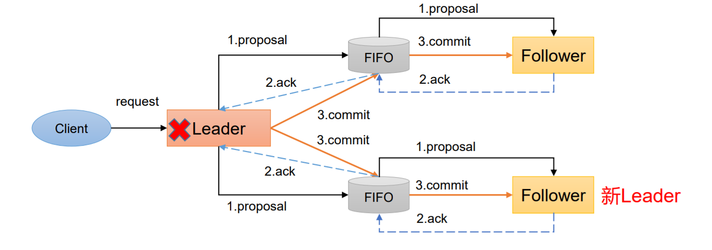
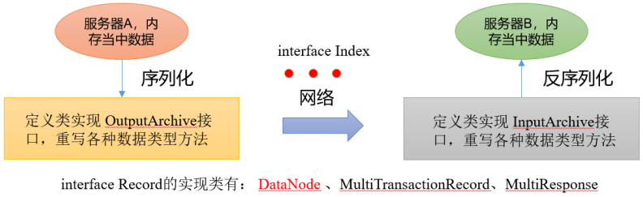
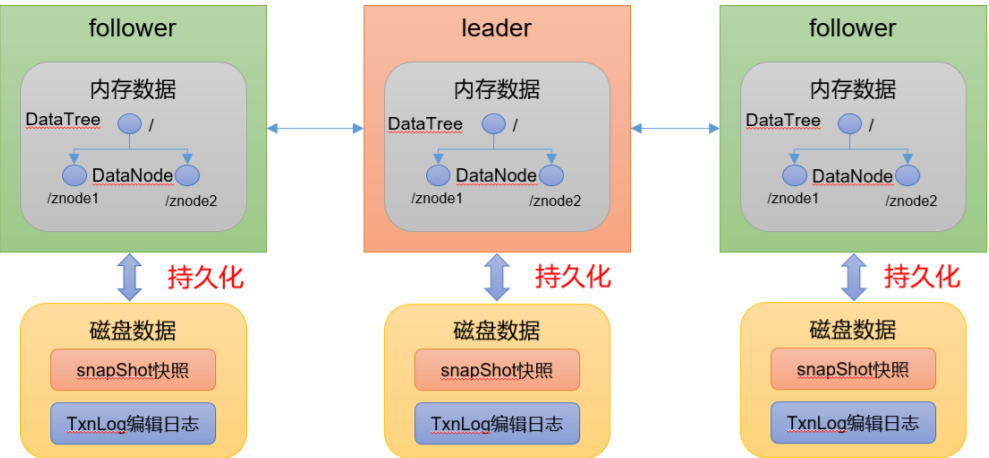
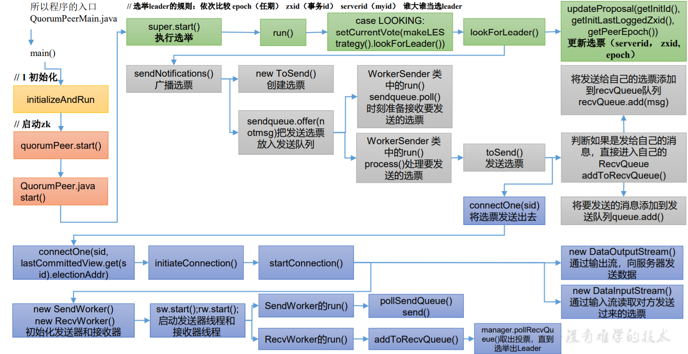

# 第 1 章 Zookeeper入门及安装

## 1.1 Zookeeper入门

> Zookeeper概述

- Zookeeper 是一个开源的分布式的，为分布式框架提供协调服务的 Apache 项目

**Zookeeper工作机制**

- Zookeeper从设计模式角度来理解：是一个基 于观察者模式设计的分布式服务管理框架，它负 责 存储和管理大家都关心的数据，然 后接受观察者的 注 册，一旦这些数据的状态发生变化，Zookeeper 就 将负责通知已经在Zookeeper上注册的那些观察 者做出相应的反应。
- Zookeeper=文件系统+通知机制

> Zookeeper特点


- Zookeeper：一个领导者（Leader），多个跟随者（Follower）组成的集群。 
- 集群中只要有半数以上节点存活，Zookeeper集群就能正常服务。所 以Zookeeper适合安装奇数台服务器。 
- 全局数据一致：每个Server保存一份相同的数据副本，Client无论连接到哪个Server，数据都是一致的。 
- 更新请求顺序执行，来自同一个Client的更新请求按其发送顺序依次执行。 
- 数据更新原子性，一次数据更新要么成功，要么失败。 
- 实时性，在一定时间范围内，Client能读到最新数据。

> 数据结构

ZooKeeper 数据模型的结构与 Unix 文件系统很类似，整体上可以看作是一棵树，每个 节点称做一个 ZNode。每一个 ZNode 默认能够存储 1MB 的数据，每个 ZNode 都可以通过 其路径唯一标识。


> 应用场景

提供的服务包括：**统一命名服务、统一配置管理、统一集群管理、服务器节点动态上下线、软负载均衡**等。

- 统一命名服务

  - 在分布式环境下，经常需要对应用/服 务进行统一命名，便于识别。例如：IP不容易记住，而域名容易记住。

- 统一配置管理

  - 分布式环境下，配置文件同步非常常见。
    - 一般要求一个集群中，所有节点的配置信息是 一致的，比如 Kafka 集群。
    - 对配置文件修改后，希望能够快速同步到各个 节点上。
  - 配置管理可交由ZooKeeper实现。
    - 可将配置信息写入ZooKeeper上的一个Znode。
    - 各个客户端服务器监听这个Znode。
    - 一 旦Znode中的数据被修改，ZooKeeper将通知各个客户端服务器。

  

- 统一集群管理

  - 分布式环境中，实时掌握每个节点的状态是必要的。
    - 可根据节点实时状态做出一些调整。
  - ZooKeeper可以实现实时监控节点状态变化
    - 可将节点信息写入ZooKeeper上的一个ZNode。
    - 监听这个ZNode可获取它的实时状态变化。

  

  

- 服务器动态上下线

  

- 软负载均衡

  

## 1.2 Zookeeper安装

### 1.2.1 下载地址

下载地址：https://zookeeper.apache.org/


说明建议下载稳定版本，不用下载最新版本


### 1.2.2 本地模式安装

> 安装前准备

- 安装 JDK

- 拷贝 apache-zookeeper-3.5.7-bin.tar.gz 安装包到 Linux 系统下

- 解压到指定目录

  ```bash
  tar -zxvf apache-zookeeper-3.5.7-bin.tar.gz -C /opt/module/
  ```

- 修改名称

  ```bash
  mv apache-zookeeper-3.5.7-bin/ zookeeper-3.5.7
  ```

> 配置修改

- 将/opt/module/zookeeper-3.5.7/conf 这个路径下的 zoo_sample.cfg 备份一份名字修改为为 zoo.cfg

- 打开 zoo.cfg 文件，修改 dataDir 路径

  ```bash
  vim zoo.cfg
  # 修改内容如下
  dataDir=/opt/module/zookeeper-3.5.7/zkData
  ```

- 在/opt/module/zookeeper-3.5.7/这个目录上创建 zkData 文件夹

  ```bash
  mkdir zkData
  ```

> 操作 Zookeeper

- 启动zookeeper

  ```bash
  [root@cVzhanshi zookeeper-3.5.7]# bin/zkServer.sh start
  ```

- 查看进程是否启动

  ```bash
  [root@cVzhanshi zookeeper-3.5.7]# jps -l
  4001 org.apache.zookeeper.server.quorum.QuorumPeerMain
  4068 sun.tools.jps.Jps
  ```

- 查看状态

  ```bash
  [root@cVzhanshi zookeeper-3.5.7]# bin/zkServer.sh status
  ZooKeeper JMX enabled by default
  Using config: /opt/module/zookeeper-3.5.7/bin/../conf/zoo.cfg
  Client port found: 2181. Client address: localhost.
  Mode: standalone
  ```

- 启动客户端

  ```bash
  [root@cVzhanshi zookeeper-3.5.7]# bin/zkCli.sh
  ```

- 退出客户端

  ```bash
  [zk: localhost:2181(CONNECTED) 0] ls /
  [zookeeper]
  [zk: localhost:2181(CONNECTED) 1] quit
  ```

- 停止Zookeeper

  ```bash
  [root@cVzhanshi zookeeper-3.5.7]#  bin/zkServer.sh stop
  ```

### 1.2.3 配置参数解读

- **tickTime = 2000**：通信心跳时间，Zookeeper服务器与客户端心跳时间，单位毫秒

  

- **initLimit = 10**：LF初始通信时限

  

- **syncLimit = 5**：LF同步通信时限

  

  Leader和Follower之间通信时间如果超过syncLimit * tickTime，Leader认为Follwer死 掉，从服务器列表中删除Follwer。

- **dataDir**：保存Zookeeper中的数据。注意：默认的tmp目录，容易被Linux系统定期删除，所以一般不用默认的tmp目录。
- **clientPort = 2181**：客户端连接端口，通常不做修改。

# 第 2 章 Zookeeper集群操作

## 2.1 集群的操作

### 2.1.1 集群的安装

> 搭建集群前的准备

集群规划，在三台服务器上都部署上zookeeper

在另外两台服务器同样部署zookeeper

> 配置服务器编号

- 在三台服务器上的/opt/module/zookeeper-3.5.7/zkData 目录下创建一个 myid 的文件，在文件中添加与 server 对应的编号（注意：上下不要有空行，左右不要有空格）

  ```bash
  2
  ```

  **注意：添加 myid 文件，一定要在 Linux 里面创建，在 notepad++里面很可能乱码**

> 配置zoo.cfg文件

- 增加如下配置

  ```bash
  #######################cluster##########################
  server.1=centos7.9_1:2888:3888
  server.2=centos7.9_2:2888:3888
  server.3=centos7.9_3:2888:3888
  ```

- 配置参数解读

  ```bash
  server.A=B:C:D
  ```

  - A 是一个数字，表示这个是第几号服务器； 

    集群模式下配置一个文件 myid，这个文件在 dataDir 目录下，这个文件里面有一个数据就是A的值，**Zookeeper 启动时读取此文件，拿到里面的数据与 zoo.cfg 里面的配置信息比较从而判断到底是哪个 server**。 

  - B 是这个服务器的地址； 
  - C 是这个服务器 Follower 与集群中的 Leader 服务器交换信息的端口； 
  - D 是万一集群中的 Leader 服务器挂了，需要一个端口来重新进行选举，选出一个新的 Leader，而这个端口就是用来执行选举时服务器相互通信的端口。

> 启动集群

- 先启动一台，查看状态

  ```bash
  [root@cVzhanshi zookeeper-3.5.7]# bin/zkServer.sh status
  ZooKeeper JMX enabled by default
  Using config: /opt/module/zookeeper-3.5.7/bin/../conf/zoo.cfg
  Client port found: 2181. Client address: localhost.
  Error contacting service. It is probably not running.
  ```

  发现有个error，原因：集群有3个节点，但是我们只启动了一个节点，存活数没有超过半数

- 再启动一台，查看两个节点的状态

  ```bash
  # 第一台
  [root@cVzhanshi zookeeper-3.5.7]# bin/zkServer.sh status
  ZooKeeper JMX enabled by default
  Using config: /opt/module/zookeeper-3.5.7/bin/../conf/zoo.cfg
  Client port found: 2181. Client address: localhost.
  
  Mode: leader
  # 第二台
  [root@cVzhanshi zookeeper-3.5.7]# bin/zkServer.sh status
  ZooKeeper JMX enabled by default
  Using config: /opt/module/zookeeper-3.5.7/bin/../conf/zoo.cfg
  Client port found: 2181. Client address: localhost.
  Mode: follower
  ```

  发现存活两个节点，存活数超过半数，集群生效。自动选举出leader和follower

- 启动最后一台，查看状态

  ```bash
  [root@cVzhanshi zookeeper-3.5.7]# bin/zkServer.sh start
  ZooKeeper JMX enabled by default
  Using config: /opt/module/zookeeper-3.5.7/bin/../conf/zoo.cfg
  Starting zookeeper ... STARTED
  [root@cVzhanshi zookeeper-3.5.7]# bin/zkServer.sh status
  ZooKeeper JMX enabled by default
  Using config: /opt/module/zookeeper-3.5.7/bin/../conf/zoo.cfg
  Client port found: 2181. Client address: localhost.
  Mode: follower
  ```

### 2.1.2 选举机制

> 集群第一次启动选举机制


1. 服务器1启动，发起一次选举。服务器1投自己一票。此时服务器1票数一票，不够半数以上（3票），选举无法完成，服务器1状态保持为 LOOKING
2. 服务器2启动，再发起一次选举。服务器1和2分别投自己一票并交换选票信息：**此时服务器1发现服务器2的myid比自己目前投票推举的（服务器1）大，更改选票为推举服务器2**。此时服务器1票数0票，服务器2票数2票，没有半数以上结果，选举无法完成，服务器1，2状态保持LOOKING
3. 服务器3启动，发起一次选举。此时服务器1和2都会更改选票为服务器3。此次投票结果：服务器1为0票，服务器2为0票，服务器3为3票。此时服 务器3的票数已经超过半数，服务器3当选Leader。服务器1，2更改状态为FOLLOWING，服务器3更改状态为LEADING
4. 服务器4启动，发起一次选举。此时服务器1，2，3已经不是LOOKING状态，不会更改选票信息。交换选票信息结果：服务器3为3票，服务器4为 1票。此时服务器4服从多数，更改选票信息为服务器3，并更改状态为FOLLOWING
5. 服务器5启动，同4一样当小弟

**三个概念**

- **SID**：服务器ID。用来唯一标识一台 ZooKeeper集群中的机器，每台机器不能重 复，和myid一致
- **ZXID**：事务ID。ZXID是一个事务ID，用来标识一次服务器状态的变更。在某一时刻，集群中的每台机器的ZXID值不一定完全一 致，这和ZooKeeper服务器对于客户端“更新请求”的处理逻辑有关
- **Epoch**：每个Leader任期的代号。没有 Leader时同一轮投票过程中的逻辑时钟值是相同的。每投完一次票这个数据就会增加

> 非第一次启动的选举机制

- 当ZooKeeper集群中的一台服务器出现以下两种情况之一时，就会开始进入Leader选举：

  - 服务器初始化启动。
  - 服务器运行期间无法和Leader保持连接。

- 而当一台机器进入Leader选举流程时，当前集群也可能会处于以下两种状态：

  - 集群中本来就已经存在一个Leader。

    对于第一种已经存在Leader的情况，机器试图去选举Leader时，会被告知当前服务器的Leader信息，对于该机器来说，仅仅需要和Leader机器建立连 接，并进行状态同步即可。

  - **集群中确实不存在Leader**。

    假设ZooKeeper由5台服务器组成，SID分别为1、2、3、4、5，ZXID分别为8、8、8、7、7，并且此时SID为3的服务器是Leader。某一时刻， 3和5服务器出现故障，因此开始进行Leader选举。

    SID为1、2、4的机器投票情况

    | （EPOCH，ZXID，SID ）  （EPOCH，ZXID，SID ） | （EPOCH，ZXID，SID ） | （EPOCH，ZXID，SID ） |
    | -------------------------------------------- | --------------------- | --------------------- |
    | （1，8，1）                                  | （1，8，2）           | （1，7，4）           |

    **选举Leader规则: ①EPOCH大的直接胜出 ②EPOCH相同，事务id大的胜出 ③事务id相同，服务器id大的胜出**

### 2.1.3 ZK集群启动停止脚本

> 脚本内容

在家目录下新建bin文件夹下新建脚本文件zk.sh,内容如下：

```bash
[root@centos101 bin]# pwd
/home/cvzhanshi/bin
[root@centos101 bin]# ll
总用量 4
-rwxrwxrwx. 1 root root 568 11月 22 20:19 zk.sh
```

-----

```bash
#!/bin/bash
case $1 in
"start"){
for i in centos7.9_1 centos7.9_2 centos7.9_3
do
	echo ---------- zookeeper $i 启动 ------------
	ssh $i "/opt/module/zookeeper-3.5.7/bin/zkServer.sh start"
	done
};;
"stop"){
	for i in centos7.9_1 centos7.9_2 centos7.9_3
	do
	 echo ---------- zookeeper $i 停止 ------------
	ssh $i "/opt/module/zookeeper-3.5.7/bin/zkServer.sh stop"
	done
};;
"status"){
	for i in centos7.9_1 centos7.9_2 centos7.9_3
	do
	 echo ---------- zookeeper $i 状态 ------------
	ssh $i "/opt/module/zookeeper-3.5.7/bin/zkServer.sh status"
	done
};;
esac
```

> 设置权限

```bash
chmod 777 zk.sh
```

> 测试

- 说明：要先设置免密登录

  - 先要编辑hosts文件，把需要免密登录的节点配置好

    ```bash
    [root@centos101 ~]# cat /etc/hosts
    127.0.0.1   localhost localhost.localdomain localhost4 localhost4.localdomain4
    ::1         localhost localhost.localdomain localhost6 localhost6.localdomain6
    192.168.159.111 centos7.9_1
    192.168.159.112 centos7.9_2
    192.168.159.113 centos7.9_3
    ```

  - 配置密钥

    ```bash
    # 生成密钥对（三下回车）
    ssh-keygen -t rsa
    # 发送公钥到其他主机，也要给自己发送
    ssh-copy-id centos7.9_1
    ssh-copy-id centos7.9_2
    ssh-copy-id centos7.9_3
    # 免密登录设置完成
    ```

- 启动

  ```bash
  [root@centos101 cvzhanshi]# bin/zk.sh start
  ---------- zookeeper centos7.9_1 启动 ------------
  /usr/bin/java
  ZooKeeper JMX enabled by default
  Using config: /opt/module/zookeeper-3.5.7/bin/../conf/zoo.cfg
  Starting zookeeper ... STARTED
  ---------- zookeeper centos7.9_2 启动 ------------
  /usr/bin/java
  ZooKeeper JMX enabled by default
  Using config: /opt/module/zookeeper-3.5.7/bin/../conf/zoo.cfg
  Starting zookeeper ... STARTED
  ---------- zookeeper centos7.9_3 启动 ------------
  /usr/bin/java
  ZooKeeper JMX enabled by default
  Using config: /opt/module/zookeeper-3.5.7/bin/../conf/zoo.cfg
  Starting zookeeper ... STARTED
  
  ```

- 查看状态

  ```bash
  [root@centos101 cvzhanshi]# bin/zk.sh status
  ---------- zookeeper centos7.9_1 状态 ------------
  /usr/bin/java
  ZooKeeper JMX enabled by default
  Using config: /opt/module/zookeeper-3.5.7/bin/../conf/zoo.cfg
  Client port found: 2181. Client address: localhost.
  Mode: follower
  ---------- zookeeper centos7.9_2 状态 ------------
  /usr/bin/java
  ZooKeeper JMX enabled by default
  Using config: /opt/module/zookeeper-3.5.7/bin/../conf/zoo.cfg
  Client port found: 2181. Client address: localhost.
  Mode: leader
  ---------- zookeeper centos7.9_3 状态 ------------
  /usr/bin/java
  ZooKeeper JMX enabled by default
  Using config: /opt/module/zookeeper-3.5.7/bin/../conf/zoo.cfg
  Client port found: 2181. Client address: localhost.
  Mode: follower
  ```

- 停止服务

  ```bash
  [root@centos101 cvzhanshi]# bin/zk.sh stop
  ---------- zookeeper centos7.9_1 停止 ------------
  /usr/bin/java
  ZooKeeper JMX enabled by default
  Using config: /opt/module/zookeeper-3.5.7/bin/../conf/zoo.cfg
  Stopping zookeeper ... STOPPED
  ---------- zookeeper centos7.9_2 停止 ------------
  /usr/bin/java
  ZooKeeper JMX enabled by default
  Using config: /opt/module/zookeeper-3.5.7/bin/../conf/zoo.cfg
  Stopping zookeeper ... STOPPED
  ---------- zookeeper centos7.9_3 停止 ------------
  /usr/bin/java
  ZooKeeper JMX enabled by default
  Using config: /opt/module/zookeeper-3.5.7/bin/../conf/zoo.cfg
  Stopping zookeeper ... STOPPED
  ```


## 2.2 客户端命令行操作

### 2.2.1 命令行语法

| 命令基本语法 | 功能描述                                                     |
| ------------ | ------------------------------------------------------------ |
| help         | 显示所有操作命令                                             |
| ls path      | 使用 ls 命令来查看当前 znode 的子节点 [可监听] <br />-w 监听子节点变化 <br />-s 附加次级信息 |
| create       | 普通创建 <br />-s 含有序列 <br />-e 临时（重启或者超时消失） |
| get path     | 获得节点的值 [可监听] <br />-w 监听节点内容变化 <br />-s 附加次级信息 |
| set          | 设置节点的具体值                                             |
| stat         | 查看节点状态                                                 |
| delete       | 删除节点                                                     |
| deleteall    | 递归删除节点                                                 |

- 启动指定主机的客户端

  ```bash
  [root@centos101 bin]# ./zkCli.sh -server centos7.9_2:2181
  ```

- 显示所有操作命令

  ```bash
  [zk: centos7.9_2:2181(CONNECTED) 0] help
  ZooKeeper -server host:port cmd args
  	addauth scheme auth
  	close 
  	config [-c] [-w] [-s]
  	connect host:port
  	create [-s] [-e] [-c] [-t ttl] path [data] [acl]
  	delete [-v version] path
  	deleteall path
  	delquota [-n|-b] path
  	get [-s] [-w] path
  	getAcl [-s] path
  	history 
  	listquota path
  	ls [-s] [-w] [-R] path
  	ls2 path [watch]
  	printwatches on|off
  	quit 
  	reconfig [-s] [-v version] [[-file path] | [-members serverID=host:port1:port2;port3[,...]*]] | [-add serverId=host:port1:port2;port3[,...]]* [-remove serverId[,...]*]
  	redo cmdno
  	removewatches path [-c|-d|-a] [-l]
  	rmr path
  	set [-s] [-v version] path data
  	setAcl [-s] [-v version] [-R] path acl
  	setquota -n|-b val path
  	stat [-w] path
  	sync path
  Command not found: Command not found help
  ```

### 2.2.2 znode节点数据信息

- 查看当前znode中所包含的内容

  ```bash
  [zk: centos7.9_2:2181(CONNECTED) 1] ls /
  [zookeeper]
  ```

- 查看当前节点详细数据

  ```bash
  [zk: centos7.9_2:2181(CONNECTED) 2] ls -s /
  [zookeeper]cZxid = 0x0
  ctime = Thu Jan 01 08:00:00 CST 1970
  mZxid = 0x0
  mtime = Thu Jan 01 08:00:00 CST 1970
  pZxid = 0x0
  cversion = -1
  dataVersion = 0
  aclVersion = 0
  ephemeralOwner = 0x0
  dataLength = 0
  numChildren = 1
  ```

  - czxid：创建节点的事务 zxid

    每次修改 ZooKeeper 状态都会产生一个 ZooKeeper 事务 ID。事务ID是ZooKeeper中所有修改总的次序。每次修改都有唯一的 zxid，如果 zxid1 小于 zxid2，那么 zxid1 在 zxid2 之 前发生。

  - ctime：znode 被创建的毫秒数（从 1970 年开始）

  - mzxid：znode 最后更新的事务 zxid

  - mtime：znode 最后修改的毫秒数（从 1970 年开始）

  - pZxid：znode 最后更新的子节点 zxid

  - cversion：znode 子节点变化号，znode 子节点修改次数

  - dataversion：znode 数据变化号

  - aclVersion：znode 访问控制列表的变化号

  - ephemeralOwner：如果是临时节点，这个是 znode 拥有者的 session id。如果不是 临时节点则是 0

  - dataLength：znode 的数据长度

  - numChildren：znode 子节点数量

### 2.2.3 节点类型

> 节点类型概述

- 持久（Persistent）：客户端和服务器端断开连接后，创建的节点不删除
- 短暂（Ephemeral）：客户端和服务器端断开连接后，创建的节点自己删除


1. 持久化目录节点 客户端与Zookeeper断开连接后，该节点依旧存在
2. 持久化顺序编号目录节点 客户端与Zookeeper断开连接后，该节点依旧存 在，只是Zookeeper给该节点名称进行顺序编号
3. 临时目录节点 客户端与Zookeeper断开连接后，该节点被删除
4. 临时顺序编号目录节点 客户端与 Zookeeper 断开连接后 ， 该节点被删除，只是 Zookeeper给该节点名称进行顺序编号

**说明**：创建znode时设置顺序标识，znode名称 后会附加一个值，顺序号是一个单调递增的计数 器，由父节点维护

**注意**：在分布式系统中，顺序号可以被用于 为所有的事件进行全局排序，这样客户端可以通 过顺序号推断事件的顺序

> 客户端操作

- 分别创建2个普通节点（永久节点 + 不带序号）**注意：创建节点时，要赋值**

  ```bash
  [zk: centos7.9_2:2181(CONNECTED) 8] create /sanguo "diaochan"
  Created /sanguo
  [zk: centos7.9_2:2181(CONNECTED) 9] create /sanguo/shuguo "liubei"
  Created /sanguo/shuguo
  ```

- 获取节点的值

  ```bash
  [zk: centos7.9_2:2181(CONNECTED) 10] get -s /sanguo
  diaochan
  cZxid = 0x500000002
  ctime = Tue Nov 23 11:18:28 CST 2021
  mZxid = 0x500000002
  mtime = Tue Nov 23 11:18:28 CST 2021
  pZxid = 0x500000003 # 子节点的事务id
  cversion = 1
  dataVersion = 0
  aclVersion = 0
  ephemeralOwner = 0x0
  dataLength = 8  # 值的长度为8
  numChildren = 1 # 有一个子节点
  
  [zk: centos7.9_2:2181(CONNECTED) 11] get -s /sanguo/shuguo
  liubei
  cZxid = 0x500000003
  ctime = Tue Nov 23 11:18:41 CST 2021
  mZxid = 0x500000003
  mtime = Tue Nov 23 11:18:41 CST 2021
  pZxid = 0x500000003
  cversion = 0
  dataVersion = 0
  aclVersion = 0
  ephemeralOwner = 0x0
  dataLength = 6
  ```

- 创建带序号的节点（永久节点 + 带序号）

  - 先创建一个普通的根节点/sanguo/weiguo

    ```bash
    [zk: centos7.9_2:2181(CONNECTED) 12] create /sanguo/weiguo "caocao"
    Created /sanguo/weiguo
    ```

  - 创建带序号的节点

    ```bash
    [zk: centos7.9_2:2181(CONNECTED) 13] create -s /sanguo/weiguo/zhangliao "zhangliao"
    Created /sanguo/weiguo/zhangliao0000000000
    # 带序号可以创建重复的节点，因为有序号区别，不带序号的不行
    [zk: centos7.9_2:2181(CONNECTED) 14] create -s /sanguo/weiguo/zhangliao "zhangliao"
    Created /sanguo/weiguo/zhangliao0000000001
    [zk: centos7.9_2:2181(CONNECTED) 15] create -s /sanguo/weiguo/xuchu "xuchu"
    Created /sanguo/weiguo/xuchu0000000002
    ```

    如果原来没有序号节点，序号从 0 开始依次递增。如果原节点下已有 2 个节点，则再排 序时从 2 开始，以此类推

- 创建短暂节点（短暂节点 + 不带序号 or 带序号）

  - 创建短暂的不带序号的节点

    ```bash
    [zk: centos7.9_2:2181(CONNECTED) 16] create -e /sanguo/wuguo "zhouyu"
    Created /sanguo/wuguo
    ```

  - 创建短暂的带序号的节点

    ```bash
    [zk: centos7.9_2:2181(CONNECTED) 17] create -e -s /sanguo/wuguo "zhouyu"
    Created /sanguo/wuguo0000000003
    ```

  - 在当前客户端是能查看到的

    ```bash
    [zk: centos7.9_2:2181(CONNECTED) 18] ls /sanguo
    [shuguo, weiguo, wuguo, wuguo0000000003]
    ```

  - 退出当前客户端然后再重启客户端查看

    ```bash
    [zk: centos7.9_2:2181(CONNECTED) 0] ls /sanguo
    [shuguo, weiguo]
    ```

    短暂节点已经自动删除

- 修改节点的数据值

  ```bash
  [zk: centos7.9_2:2181(CONNECTED) 5] set /sanguo/weiguo "cvzhanshi"
  [zk: centos7.9_2:2181(CONNECTED) 7] get -s /sanguo/weiguo
  cvzhanshi
  cZxid = 0x500000004
  ctime = Tue Nov 23 11:21:02 CST 2021
  mZxid = 0x50000000c
  mtime = Tue Nov 23 11:27:59 CST 2021
  pZxid = 0x500000007
  cversion = 3
  dataVersion = 1
  aclVersion = 0
  ephemeralOwner = 0x0
  dataLength = 9
  numChildren = 3
  ```

### 2.2.4 监听器原理

1. 首先要有一个main()线程
2. 在main线程中创建Zookeeper客户端，这时就会创建两个线程，一个负责网络连接通信（connet），一个负责监听（listener）。 
3. 通过connect线程将注册的监听事件发送给Zookeeper。 
4. 在Zookeeper的注册监听器列表中将注册的监听事件添加到列表中。
5. Zookeeper监听到有数据或路径变化，就会将这个消息发送给listener线程。
6. listener线程内部调用了process()方法


> 常用的监听

- 监听节点数据的变化

  get path [watch]

- 监听子节点增减的变化

  ls path [watch]

> 节点的值变化监听

- 在centos2主机上注册监听/sanguo 节点数据变化

  ```bash
  [zk: localhost:2181(CONNECTED) 26] get -w /sanguo 
  ```

- 在 centos3主机上修改/sanguo 节点的数据

  ```bash
  [zk: localhost:2181(CONNECTED) 1] set /sanguo "xisi"
  ```

- 观察 centos2主机收到数据变化的监听

  ```bash
  WATCHER::
  WatchedEvent state:SyncConnected type:NodeDataChanged path:/sanguo
  ```

  **注意：在centos3再多次修改/sanguo的值，centos2上不会再收到监听。因为注册 一次，只能监听一次。想再次监听，需要再次注册。**

> 节点的子节点变化监听（路径变化）

- 在centos2主机上注册监听/sanguo 节点的子节点变化

  ```bash
  [zk: localhost:2181(CONNECTED) 1] ls -w /sanguo
  [shuguo, weiguo]
  ```

- 在 centos3主机/sanguo 节点上创建子节点

  ```bash
  [zk: localhost:2181(CONNECTED) 2] create /sanguo/jin "simayi"
  Created /sanguo/jin
  ```

- 观察centos2主机收到子节点变化的监听

  ```bash
  WATCHER::
  WatchedEvent state:SyncConnected type:NodeChildrenChanged path:/sanguo
  ```

  注意：节点的路径变化，也是注册一次，生效一次。想多次生效，就需要多次注册。

### 2.2.5 节点删除与查看

- 删除节点

  ```bash
  [zk: localhost:2181(CONNECTED) 4] delete /sanguo/jin
  ```

- 递归删除节点（删除节点下面还有子节点）

  ```bash
  [zk: localhost:2181(CONNECTED) 15] deleteall /sanguo/shuguo
  ```

- 查看节点的状态（不看值）

  ```bash
  [zk: localhost:2181(CONNECTED) 17] stat /sanguo
  cZxid = 0x100000003
  ctime = Wed Aug 29 00:03:23 CST 2018
  mZxid = 0x100000011
  mtime = Wed Aug 29 00:21:23 CST 2018
  pZxid = 0x100000014
  cversion = 9
  dataVersion = 1
  aclVersion = 0
  ephemeralOwner = 0x0
  dataLength = 4
  numChildren = 1
  ```

## 2.3 客户端API操作

> IDEA环境搭建

- 创建一个maven工程

- 导入依赖

  ```xml
  <dependencies>
      <dependency>
          <groupId>junit</groupId>
          <artifactId>junit</artifactId>
          <version>RELEASE</version>
      </dependency>
      <dependency>
          <groupId>org.apache.logging.log4j</groupId>
          <artifactId>log4j-core</artifactId>
          <version>2.8.2</version>
      </dependency>
      <dependency>
          <groupId>org.apache.zookeeper</groupId>
          <artifactId>zookeeper</artifactId>
          <version>3.5.7</version>
      </dependency>
  </dependencies>
  ```

- 拷贝log4j.properties文件到项目根目录

  需要在项目的 src/main/resources 目录下，新建一个文件，命名为“log4j.properties”，在 文件中填入

  ```properties
  log4j.rootLogger=INFO, stdout
  log4j.appender.stdout=org.apache.log4j.ConsoleAppender
  log4j.appender.stdout.layout=org.apache.log4j.PatternLayout
  log4j.appender.stdout.layout.ConversionPattern=%d %p [%c] - %m%n
  log4j.appender.logfile=org.apache.log4j.FileAppender
  log4j.appender.logfile.File=target/spring.log
  log4j.appender.logfile.layout=org.apache.log4j.PatternLayout
  log4j.appender.logfile.layout.ConversionPattern=%d %p [%c] - %m%n 
  ```

- 创建包名cv.cvzhanshi.zookeeper

- 创建类名称为zkClient

> 创建 ZooKeeper 客户端&创建子节点

```java
/**
 * @author cVzhanshi
 * @create 2021-11-23 11:48
 */
public class zkClient {

    // 注意：逗号前后不能有空格
    private String connectString = "centos7.9_1:2181,centos7.9_2:2181,centos7.9_3:2181";
    private int sessionTimeout = 2000;
    private ZooKeeper zkClient;

    @Before
    public void init() throws IOException {
        zkClient = new ZooKeeper(connectString, sessionTimeout, new Watcher() {
            @Override
            public void process(WatchedEvent watchedEvent) {

            }
        });
    }

    @Test
    public void create() throws KeeperException, InterruptedException {
        String node = zkClient.create("/cvzhanshi", "bulijojo".getBytes(), ZooDefs.Ids.OPEN_ACL_UNSAFE, CreateMode.PERSISTENT);
    }

}
```

测试：在zookeeper集群上查看创建节点情况

```bash
[zk: localhost:2181(CONNECTED) 0] ls /
[cvzhanshi, zookeeper]
[zk: localhost:2181(CONNECTED) 1] get -s /cvzhanshi
bulijojo
cZxid = 0x600000006
ctime = Tue Nov 23 14:03:38 CST 2021
mZxid = 0x600000006
mtime = Tue Nov 23 14:03:38 CST 2021
pZxid = 0x600000006
cversion = 0
dataVersion = 0
aclVersion = 0
ephemeralOwner = 0x0
dataLength = 8
numChildren = 0
```

> 获取子节点并监听节点变化

```java
/**
 * @author cVzhanshi
 * @create 2021-11-23 11:48
 */
public class zkClient {

    // 注意：逗号前后不能有空格
    private String connectString = "centos7.9_1:2181,centos7.9_2:2181,centos7.9_3:2181";
    private int sessionTimeout = 2000;
    private ZooKeeper zkClient;

    @Before
    public void init() throws IOException {
        zkClient = new ZooKeeper(connectString, sessionTimeout, new Watcher() {
            @Override
            public void process(WatchedEvent watchedEvent) {
                List<String> children = null;
                try {
                    System.out.println("==================================");
                    children = zkClient.getChildren("/", true);
                    for (String child : children) {
                        System.out.println(child);
                    }
                    System.out.println("==================================");
                } catch (KeeperException e) {
                    e.printStackTrace();
                } catch (InterruptedException e) {
                    e.printStackTrace();
                }

            }
        });
    }


    @Test
    public void getChildren() throws KeeperException, InterruptedException {
        List<String> children = zkClient.getChildren("/", true);
        for (String child : children) {
            System.out.println(child);
        }
        Thread.sleep(Long.MAX_VALUE);
    }

}
```

在centos7.9_2上面进行节点的增加和删除，控制台会返回监听结果


> 判断Znode是否存在

```java
/**
 * @author cVzhanshi
 * @create 2021-11-23 11:48
 */
public class zkClient {

    // 注意：逗号前后不能有空格
    private String connectString = "centos7.9_1:2181,centos7.9_2:2181,centos7.9_3:2181";
    private int sessionTimeout = 2000;
    private ZooKeeper zkClient;

    @Before
    public void init() throws IOException {
        zkClient = new ZooKeeper(connectString, sessionTimeout, new Watcher() {
            @Override
            public void process(WatchedEvent watchedEvent) {
            }
        });
    }

    @Test
    public void exist() throws KeeperException, InterruptedException {
        Stat stat = zkClient.exists("/cvzhanshi", false);
        System.out.println(stat == null ? "not exist" : "exist");
    }

}

```


 ## 2.4 客户端向服务端写数据流程

> 写流程之写入请求直接发送给Leader节点


超过半数同意就应答

> 写流程之写入请求发送给follower节点


# 第 3 章 服务器动态上下线监听案例

>  需求分析

某分布式系统中，主节点可以有多台，可以动态上下线，任意一台客户端都能实时感知 到主节点服务器的上下线


> 具体实现

- 先在集群上创建/servers 节点

  ```bash
  [zk: localhost:2181(CONNECTED) 10] create /servers "servers"
  Created /servers
  ```

- 服务器端向 Zookeeper 注册代码

  ```java
  /**
   * @author cVzhanshi
   * @create 2021-11-23 16:58
   */
  public class DistributeServer {
  
      // 注意：逗号前后不能有空格
      private String connectString = "centos7.9_1:2181,centos7.9_2:2181,centos7.9_3:2181";
      private int sessionTimeout = 2000;
      private ZooKeeper zk;
      private String parentNode = "/servers";
  
      public static void main(String[] args) throws Exception {
          // 1 获取 zk 连接
          DistributeServer server = new DistributeServer();
          server.getConnect();
          // 2 利用 zk 连接注册服务器信息
          server.registerServer(args[0]);
          // 3 启动业务功能
          server.business(args[0]);
      }
      // 业务功能
      public void business(String hostname) throws Exception{
          System.out.println(hostname + " is working ...");
          Thread.sleep(Long.MAX_VALUE);
      }
  
      // 注册服务器
      public void registerServer(String hostname) throws Exception{
          String create = zk.create(parentNode + "/" + hostname,
                  hostname.getBytes(), ZooDefs.Ids.OPEN_ACL_UNSAFE,
                  CreateMode.EPHEMERAL_SEQUENTIAL);
          System.out.println(hostname +" is online "+ create);
      }
      // 创建到 zk 的客户端连接
      public void getConnect() throws IOException {
          zk = new ZooKeeper(connectString, sessionTimeout, new Watcher() {
              @Override
              public void process(WatchedEvent event) {
              }
          });
      }
  }
  ```

- 客户端实现代码

  ```java
  /**
   * @author cVzhanshi
   * @create 2021-11-23 17:03
   */
  public class DistributeClient {
      // 注意：逗号前后不能有空格
      private String connectString = "centos7.9_1:2181,centos7.9_2:2181,centos7.9_3:2181";
      private int sessionTimeout = 2000;
      private ZooKeeper zk;
      private String parentNode = "/servers";
      public static void main(String[] args) throws Exception {
          // 1 获取 zk 连接
          DistributeClient client = new DistributeClient();
          client.getConnect();
          // 2 获取 servers 的子节点信息，从中获取服务器信息列表
          client.getServerList();
          // 3 业务进程启动
          client.business();
      }
  
      // 创建到 zk 的客户端连接
      public void getConnect() throws IOException {
          zk = new ZooKeeper(connectString, sessionTimeout, new Watcher() {
              @Override
              public void process(WatchedEvent event) {
                  // 因为注册一次 监听一次，所有放入这里面可以一直监听
                  try {
                      getServerList();
                  } catch (Exception e) {
                      e.printStackTrace();
                  }
              }
          });
      }
  
      // 业务功能
      public void business() throws Exception{
          System.out.println("client is working ...");
          Thread.sleep(Long.MAX_VALUE);
      }
  
      // 获取服务器列表信息
      public void getServerList() throws Exception {
          // 1 获取服务器子节点信息，并且对父节点进行监听
          List<String> children = zk.getChildren(parentNode, true);
  
          // 2 存储服务器信息列表
          ArrayList<String> servers = new ArrayList<>();
  
          // 3 遍历所有节点，获取节点中的主机名称信息
          for (String child : children) {
              byte[] data = zk.getData(parentNode + "/" + child, false, null);
              servers.add(new String(data));
          }
          // 4 打印服务器列表信息
          System.out.println(servers);
      }
  }
  ```

> 测试

**在 Linux 命令行上操作增加减少服务器**

- 启动 DistributeClient 客户端

- 在 centos101 上 zk 的客户端/servers 目录上创建临时带序号节点

  ```bash
  [zk: localhost:2181(CONNECTED) 0] create -e -s /servers/hadoop101 "hadoop101"
  Created /servers/hadoop1010000000007
  [zk: localhost:2181(CONNECTED) 1] create -e -s /servers/hadoop102 "hadoop102"
  Created /servers/hadoop1020000000008
  ```

- 观察 Idea 控制台变化

  ```java
  []
  []
  client is working ...
  [hadoop101]
  [hadoop101, hadoop102]
  ```

- 执行删除操作

  ```bash
  [zk: localhost:2181(CONNECTED) 4] delete /servers/hadoop1010000000007
  ```

- 观察 Idea 控制台变化

  ```java
  []
  []
  client is working ...
  [hadoop101]
  [hadoop101, hadoop102]
  [hadoop102]
  ```

**在 Idea 上操作增加减少服务器**

- 启动 DistributeClient 客户端（如果已经启动过，不需要重启）

- 通过Edit Configurations传入参数

  

- 启动 DistributeServer 服务

- 观察 DistributeServer 控制台

  ```java
  hadoop103 is online /servers/hadoop1030000000009
  hadoop103 is working .
  ```

- 观察 DistributeClient 控制台

  ```java
  []
  []
  client is working ...
  [hadoop101]
  [hadoop101, hadoop102]
  [hadoop102]
  [hadoop102, hadoop103]
  ```

# 第 4 章 ZooKeeper 分布式锁案例

> 分布式锁概述

比如说"进程 1"在使用该资源的时候，会先去获得锁，"进程 1"获得锁以后会对该资源保持独占，这样其他进程就无法访问该资源，"进程 1"用完该资源以后就将锁释放掉，让其 他进程来获得锁，那么通过这个锁机制，我们就能保证了分布式系统中多个进程能够有序的 访问该临界资源。那么我们把这个分布式环境下的这个锁叫作分布式锁。

> 分布式锁案例分析


1. 接收到请求后，在/locks节点下创建一个临时顺序节点
2. 判断自己是不是当前节点下最小的节点：是，获取到锁；不是，对前一个节点进行监听
3. 获取到锁，处理完业务后，delete节点释放锁，然后 下面的节点将收到通知，重复第二步判断

## 4.1 原生 Zookeeper 实现分布式锁案例

分布式锁实现

```java
/**
 * @author cVzhanshi
 * @create 2021-11-24 10:21
 */
public class DistributeLock {
    private final String connectString = "centos7.9_1:2181,centos7.9_2:2181,centos7.9_3:2181";
    private final int sessionTimeout = 2000;
    private final ZooKeeper zk;

    private String waitPath;
    private String currentMode;

    private CountDownLatch connectLatch = new CountDownLatch(1);
    private CountDownLatch waitLatch = new CountDownLatch(1);

    public DistributeLock() throws IOException, InterruptedException, KeeperException {
        // 获取连接
        zk = new ZooKeeper(connectString, sessionTimeout, new Watcher() {
            @Override
            public void process(WatchedEvent event) {
                // connectLatch  如果连接上zk  可以释放
                if(Event.KeeperState.SyncConnected == event.getState()){
                    //如果收到了服务端的响应事件，连接成功
                    connectLatch.countDown();
                }
                if(event.getType() == Event.EventType.NodeDeleted && event.getPath().equals(waitPath)){
                    // waitLatch  需要释放
                    waitLatch.countDown();
                }
            }
        });
        // 等待zk正常连接后，往下走程序
        connectLatch.await();
        //CONNECTED
        System.out.println(zk.getState());

        // 判断根节点/locks是否存在
        Stat stat = zk.exists("/locks", false);
        if(stat == null){
            // 不存在 创建根节点
            zk.create("/locks","locks".getBytes(), ZooDefs.Ids.OPEN_ACL_UNSAFE,CreateMode.PERSISTENT);
        }
    }

    // 对zk加锁
    public void zkLock(){
        // 创建对应的临时带序号节点
        try {
            // /locks/seq-0000000002
            currentMode = zk.create("/locks/" + "seq-", null, ZooDefs.Ids.OPEN_ACL_UNSAFE, CreateMode.EPHEMERAL_SEQUENTIAL);

            //System.out.println(currentMode);
            // 判断创建的节点是否是最小的序号节点，如果是获取到锁，如果不是，监听他序号前一个节点
            List<String> children = zk.getChildren("/locks", false);

            // 如果children 只有一个值，那就直接获取锁； 如果有多个节点，需要判断，谁最小
            if(children.size() == 1){
                return;
            }else{
                Collections.sort(children);
                // 获取节点名称 seq-00000000
                String thisNode = currentMode.substring("/locks/".length());
                // 通过seq-00000000获取该节点在children集合的位置
                int index = children.indexOf(thisNode);
                if(index == -1){
                    System.out.println("数据异常");
                }else if(index == 0) {
                    // 就一个节点
                    return;
                }else{
                    // 需要监听  他前一个节点变化
                    waitPath = "/locks/" + children.get(index - 1);
                    zk.getData(waitPath,true,new Stat());

                    // 等待监听
                    waitLatch.await();
                    return;
                }
            }

        } catch (KeeperException e) {
            e.printStackTrace();
        } catch (InterruptedException e) {
            e.printStackTrace();
        }


    }

    // 解锁
    public void unZkLock(){
        // 删除节点
        try {
            zk.delete(this.currentMode,-1);
        } catch (InterruptedException e) {
            e.printStackTrace();
        } catch (KeeperException e) {
            e.printStackTrace();
        }
    }
}
```

测试代码：

```java
/**
 * @author cVzhanshi
 * @create 2021-11-24 11:04
 */
public class DistributeLockTest {
    public static void main(String[] args) throws InterruptedException, IOException, KeeperException {
        final DistributeLock lock1 = new DistributeLock();
        final DistributeLock lock2 = new DistributeLock();

        new Thread(() -> {
            try {
                lock1.zkLock();
                System.out.println("线程1 启动 获取到了锁");
                Thread.sleep(5000);
                lock1.unZkLock();
                System.out.println("线程1 释放锁");
            } catch (InterruptedException e) {
                e.printStackTrace();
            }
        }).start();

        new Thread(() -> {
            try {
                lock2.zkLock();
                System.out.println("线程2 启动 获取到了锁");
                Thread.sleep(5000);
                lock2.unZkLock();
                System.out.println("线程2 释放锁");
            } catch (InterruptedException e) {
                e.printStackTrace();
            }
        }).start();
    }
}
```


## 4.2  Curator 框架实现分布式锁案例

> 原生的 Java API 开发存在的问题

- 会话连接是异步的，需要自己去处理。比如使用 CountDownLatch 
- Watch 需要重复注册，不然就不能生效
- 开发的复杂性还是比较高的
- 不支持多节点删除和创建。需要自己去递归

**Curator 是一个专门解决分布式锁的框架，解决了原生 JavaAPI 开发分布式遇到的问题**

- 官方文档：https://curator.apache.org/index.html

> Curator 案例实操

- 添加依赖

  ```xml
  <dependency>
      <groupId>org.apache.curator</groupId>
      <artifactId>curator-framework</artifactId>
      <version>4.3.0</version>
  </dependency>
  <dependency>
      <groupId>org.apache.curator</groupId>
      <artifactId>curator-recipes</artifactId>
      <version>4.3.0</version>
  </dependency>
  <dependency>
      <groupId>org.apache.curator</groupId>
      <artifactId>curator-client</artifactId>
      <version>4.3.0</version>
  </dependency>
  ```

- 代码实现

  ```java
  /**
   * @author cVzhanshi
   * @create 2021-11-24 11:42
   */
  public class CuratorLockTest {
      private static final String connectString = "centos7.9_1:2181,centos7.9_2:2181,centos7.9_3:2181";
      private static final int sessionTimeout = 2000;
  
      public static void main(String[] args) {
          // 创建分布式锁1
          InterProcessMutex lock1 = new InterProcessMutex(getCuratorFramework(), "/locks");
  
          // 创建分布式锁2
          InterProcessMutex lock2 = new InterProcessMutex(getCuratorFramework(), "/locks");
  
          new Thread(new Runnable() {
              @Override
              public void run() {
                  try {
                      lock1.acquire();
                      System.out.println("线程1 获取到锁");
  
                      lock1.acquire();
                      System.out.println("线程1 再次获取到锁");
  
                      Thread.sleep(5 * 1000);
  
                      lock1.release();
                      System.out.println("线程1 释放锁");
  
                      lock1.release();
                      System.out.println("线程1  再次释放锁");
  
                  } catch (Exception e) {
                      e.printStackTrace();
                  }
              }
          }).start();
  
          new Thread(new Runnable() {
              @Override
              public void run() {
                  try {
                      lock2.acquire();
                      System.out.println("线程2 获取到锁");
  
                      lock2.acquire();
                      System.out.println("线程2 再次获取到锁");
  
                      Thread.sleep(5 * 1000);
  
                      lock2.release();
                      System.out.println("线程2 释放锁");
  
                      lock2.release();
                      System.out.println("线程2  再次释放锁");
  
                  } catch (Exception e) {
                      e.printStackTrace();
                  }
              }
          }).start();
      }
  
      private static CuratorFramework getCuratorFramework() {
  
          ExponentialBackoffRetry policy = new ExponentialBackoffRetry(3000, 3);
  
          CuratorFramework client = CuratorFrameworkFactory.builder().connectString(connectString)
                  .connectionTimeoutMs(2000)
                  .sessionTimeoutMs(sessionTimeout)
                  .retryPolicy(policy).build();
  
          // 启动客户端
          client.start();
  
          System.out.println("zookeeper 启动成功");
          return client;
      }
  }
  ```

  

# 第 5 章 面试题

## 5.1 选举机制

半数机制，超过半数的投票通过，即通过。 

- 第一次启动选举规则： 投票过半数时，服务器 id 大的胜出 

- 第二次启动选举规则： 
  - EPOCH 大的直接胜出 
  - EPOCH 相同，事务 id 大的胜出 
  - 事务 id 相同，服务器 id 大的胜出

## 5.2 生产集群安装多少zk合适

**安装奇数台**

生产经验： 

- 10 台服务器：3 台 zk
-  20 台服务器：5 台 zk
-  100 台服务器：11 台 zk
- 200 台服务器：11 台 zk 

**服务器台数多：好处，提高可靠性；坏处：提高通信延时**

> 常用命令：ls、get、create、delete

# 第 6 章 源码分析

## 6.1 算法基础

### 6.1.1 拜占庭将军问题

**问题：Zookeeper 是如何保证数据一致性的？**

​        拜占庭将军问题是一个协议问题，拜占庭帝国军队的将军们必须全体一致的决定是否攻击某一支敌军。问题是这些将军在地理上是分隔开来的，并且将军中存在叛徒。叛徒可以任意行动以达到以下目标：**欺骗某些将军采取进攻行动；促成一个不是所有将军都同意的决定，如当将军们不希望进攻时促成进攻行动；或者迷惑某些将军，使他们无法做出决定**。如果叛徒达到了这些目的之一，则任何攻击行动的结果都是注定要失败的，只有完全达成一致的努力才能获得胜利


### 6.1.2 Paxos 算法

**Paxos算法**：一种基于消息传递且具有高度容错特性的**一致性算法**。 

**Paxos算法解决的问题**：就是如何快速正确的在一个分布式系统中对某个数据值达成一致，并且保证不论发生任何异常， 都不会破坏整个系统的一致性。

> Paxos算法描述

- 在一个Paxos系统中，首先将所有节点划分为Proposer（提议者），Acceptor（接受者），和 Learner（学习者）。（注意：每个节点都可以身兼数职）。

  

- 一个完整的Paxos算法流程分为三个阶段：

  - Prepare准备阶段
    - Proposer向多个Acceptor发出Propose请求Promise（承诺）
    - Acceptor针对收到的Propose请求进行Promise（承诺）
  - Accept接受阶段
    - Proposer收到多数Acceptor承诺的Promise后，向Acceptor发出Propose请求
    - Acceptor针对收到的Propose请求进行Accept处理
  - Learn学习阶段：Proposer将形成的决议发送给所有Learners

> Paxos算法流程


1. Prepare: Proposer生成全局唯一且递增的Proposal ID，向所有Acceptor发送Propose请求，这里无需携带提案内容，只携带Proposal ID即可。
2. Promise: Acceptor收到Propose请求后，做出“两个承诺，一个应答”。
   1. 不再接受Proposal ID小于等于（注意：这里是<= ）当前请求的Propose请求。
   2. 不再接受Proposal ID小于（注意：这里是< ）当前请求的Accept请求。
   3. 不违背以前做出的承诺下，回复已经Accept过的提案中Proposal ID最大的那个提案的Value和Proposal ID，没有则 返回空值。
3. Propose: Proposer收到多数Acceptor的Promise应答后，从应答中选择Proposal ID最大的提案的Value，作为本次要发起的 提案。如果所有应答的提案Value均为空值，则可以自己随意决定提案Value。然后携带当前Proposal ID，向所有Acceptor发送 Propose请求
4. Accept: Acceptor收到Propose请求后，在不违背自己之前做出的承诺下，接受并持久化当前Proposal ID和提案Value
5. Learn: Proposer收到多数Acceptor的Accept后，决议形成，将形成的决议发送给所有Learner。

> Paxos算法流程——情况一

**有A1, A2, A3, A4, A5 5位议员，就税率问题进行决议。**	


- A1发起1号Proposal的Propose，等待Promise承诺；
- A2-A5回应Promise；
- A1在收到两份回复时就会发起税率10%的Proposal；
- A2-A5回应Accept；
- 通过Proposal，税率10%

> Paxos算法流程——情况二

**现在我们假设在A1提出提案的同时, A5决定将税率定为20%**


- A1，A5同时发起Propose（序号分别为1，2）
- A2承诺A1，A4承诺A5，A3行为成为关键
- 情况1：A3先收到A1消息，承诺A1。
- A1发起Proposal（1，10%），A2，A3接受。
- 之后A3又收到A5消息，回复A1：（1，10%），并承诺A5。
- A5发起Proposal（2，20%），A3，A4接受。之后A1，A5同时广播决议

Paxos 算法缺陷：在网络复杂的情况下，一个应用 Paxos 算法的分布式系统，可能很久 无法收敛，甚至陷入活锁的情况。

> Paxos算法流程——情况三

**现在我们假设在A1提出提案的同时, A5决定将税率定为20%**


- A1，A5同时发起Propose（序号分别为1，2）
- A2承诺A1，A4承诺A5，A3行为成为关键
- 情况2：A3先收到A1消息，承诺A1。之后立刻收到A5消息，承诺A5。
- A1发起Proposal（1，10%），无足够响应，A1重新Propose （序号3），A3再次承诺A1。
- A5发起Proposal（2，20%），无足够相应。 A5重新Propose （序号4），A3再次承诺A5。
- ......

造成这种情况的原因是系统中有一个以上的 Proposer，多个 Proposers 相互争夺 Acceptor， 造成迟迟无法达成一致的情况。**针对这种情况，一种改进的 Paxos 算法被提出：从系统中选 出一个节点作为 Leader，只有 Leader 能够发起提案**。这样，一次 Paxos 流程中只有一个 Proposer，不会出现活锁的情况，此时只会出现例子中第一种情况。

### 6.1.3 ZAB协议

**ZAB算法简介**

ZAB借鉴了Paxos算法，是特别为Zookeeper设计的支持崩溃恢复的原子广播协议。基于该协议，Zookeeper 设计为只有一台客户端（Leader）负责处理外部的写事务请求，然后Leader客户端将数据同步到其他 Follower 节点。即 Zookeeper 只有一个 Leader 可以发起提案

**Zab协议内容**

Zab 协议包括两种基本的模式：**消息广播**、**崩溃恢复**

> 消息广播


1. 客户端发起一个写操作请求。
2. Leader服务器将客户端的请求转化为事务Proposal 提案，同时为每个Proposal 分配一个全局的ID，即zxid。 
3. Leader服务器为每个Follower服务器分配一个单独的队列，然后将需要广播的 Proposal依次放到队列中去，并且根据FIFO策略进行消息发送。
4. Follower接收到Proposal后，会首先将其以事务日志的方式写入本地磁盘中，写入成功后向Leader反馈一个Ack响应消息。
5. Leader接收到超过半数以上Follower的Ack响应消息后，即认为消息发送成功，可以发送commit消息。
6. Leader向所有Follower广播commit消息，同时自身也会完成事务提交。Follower 接收到commit消息后，会将上一条事务提交。
7. Zookeeper采用Zab协议的核心，就是只要有一台服务器提交了Proposal，就要确保所有的服务器最终都能正确提交Proposal。

ZAB协议针对事务请求的处理过程 类似于一个两阶段提交过程 

（1）广播事务阶段 

（2）广播提交操作

这两阶段提交模型如下，有可能因 为Leader宕机带来数据不一致，比如 

（ 1 ） Leader 发 起 一 个 事 务 Proposal1 后 就 宕 机 ， Follower 都 没 有 Proposal1 

（2）Leader收到半数ACK宕机， 没来得及向Follower发送Commit 

怎么解决呢？ZAB引入了**崩溃恢复模式**。

> 崩溃恢复——异常假设

一旦Leader服务器出现崩溃或者由于网络原因导致Leader服务器失去了与过半 Follower的联系，那么就会进入崩溃恢复模式。


- **假设两种服务器异常情况**：
  - 假设一个事务在Leader提出之后，Leader挂了。
  - 一个事务在Leader上提交了，并且过半的Follower都响应Ack了，但是Leader在Commit消息发出之前挂了。
- **Zab协议崩溃恢复要求满足以下两个要求**：
  - 确保已经被Leader提交的提案Proposal，必须最终被所有的Follower服务器提交。 （已经产生的提案，Follower必须执行）
  - 确保丢弃已经被Leader提出的，但是没有被提交的Proposal。（丢弃胎死腹中的提案）

**崩溃恢复主要包括两部分：Leader选举和数据恢复**

> 崩溃恢复——Leader选举



Leader选举：根据上述要求，Zab协议需要保证选举出来的Leader需要满足以下条件： 

（1）新选举出来的Leader不能包含未提交的Proposal。**即新Leader必须都是已经提交了Proposal的Follower服务器节点**。

（2）**新选举的Leader节点中含有最大的zxid**。这样做的好处是可以避免Leader服务器检查Proposal的提交和丢弃工作。

> 崩溃恢复——数据恢复


Zab如何数据同步：

（1）完成Leader选举后，在正式开始工作之前（接收事务请求，然后提出新的Proposal），**Leader服务器会首先确认事务日 志中的所有的Proposal 是否已经被集群中过半的服务器Commit。**

（2）Leader服务器需要确保所有的Follower服务器能够接收到每一条事务的Proposal，并且能将所有已经提交的事务Proposal 应用到内存数据中。**等到Follower将所有尚未同步的事务Proposal都从Leader服务器上同步过，并且应用到内存数据中以后， Leader才会把该Follower加入到真正可用的Follower列表中。**

> 拓展：Zab数据同步过程中，如何处理需要丢弃的Proposal？

​		在Zab的事务编号zxid设计中，zxid是一个64位的数字。其中低32位可以看成一个简单的单增计数器，针对客户端每一个 事务请求，Leader在产生新的Proposal事务时，都会对该计数器加1。而高32位则代表了Leader周期的epoch编号。 

​		epoch编号可以理解为当前集群所处的年代，或者周期。每次Leader变更之后都会在 epoch的基础上加1，这样旧的Leader 崩溃恢复之后，其他Follower也不会听它的了，因为 Follower只服从epoch最高的Leader命令。 

​		每当选举产生一个新的 Leader，就会从这个Leader服务器上取出本地事务日志充最大编号Proposal的zxid，并从zxid中解 析得到对应的epoch编号，然后再对其加1，之后该编号就作为新的epoch 值，并将低32位数字归零，由0开始重新生成zxid。 

​		Zab协议通过epoch编号来区分Leader变化周期，能够有效避免不同的Leader错误的使用了相同的zxid编号提出了不一样的 Proposal的异常情况。 

​		基于以上策略，当一个包含了上一个Leader周期中尚未提交过的事务Proposal的服务器启动时，当这台机器加入集群中， 以Follower角色连上Leader服务器后，Leader 服务器会根据自己服务器上最后提交的 Proposal来和Follower服务器的Proposal 进行比对，比对的结果肯定是Leader要求Follower进行一个回退操作，回退到一个确实已经被集群中过半机器Commit的最新 Proposal。

### 6.1.4 CAP理论

CAP理论告诉我们，一个分布式系统不可能同时满足以下三种 CAP理论 

- 一致性（C:Consistency） 
- 可用性（A:Available） 
- 分区容错性（P:Partition Tolerance） 

这三个基本需求，最多只能同时满足其中的两项，因为P是必须的，因此往往选择就在CP或者AP中。

- 一致性（C:Consistency） 在分布式环境中，一致性是指数据在**多个副本之间是否能够保持数据一致的特性**。在一致性的需求下，当一个系统在数 据一致的状态下执行更新操作后，应该保证系统的数据仍然处于一致的状态。
- 可用性（A:Available） 可用性是指**系统提供的服务必须一直处于可用的状态**，**对于用户的每一个操作请求总是能够在有限的时间内返回结果**。
- 分区容错性（P:Partition Tolerance） **分布式系统在遇到任何网络分区故障的时候，仍然需要能够保证对外提供满足一致性和可用性的服务**，除非是整个网络 环境都发生了故障

**ZooKeeper保证的是CP**

- **ZooKeeper不能保证每次服务请求的可用性**。（注：在极端环境下，ZooKeeper可能会丢弃一些请求，消费者程序需要 重新请求才能获得结果）。所以说，ZooKeeper不能保证服务可用性。
- **进行Leader选举时集群都是不可用**。

## 6.2 源码详解

### 6.2.1 辅助源码

#### 6.2.1.1 持久化源码

- Leader 和 Follower 中的数据会在内存和磁盘中各保存一份。所以需要将内存中的数据 持久化到磁盘中。
- 在 org.apache.zookeeper.server.persistence 包下的相关类都是序列化相关的代码


查看安装zookeeper是新设置的数据存储路径（/opt/module/zookeeper-3.5.7/zkData/version-2）


> 快照源码

```java
package org.apache.zookeeper.server.persistence;

public interface SnapShot {
    // 反序列化方法
    long deserialize(DataTree dt, Map<Long, Integer> sessions)
        throws IOException;

    // 序列化方法
    void serialize(DataTree dt, Map<Long, Integer> sessions,
                   File name)
        throws IOException;

    /**
     * find the most recent snapshot file
     * 查找最近的快照文件
     */
    File findMostRecentSnapshot() throws IOException;

    // 释放资源
    void close() throws IOException;
}
```

> 操作日志源码

```java
public interface TxnLog {
    // 设置服务状态
    void setServerStats(ServerStats serverStats);

    // 滚动日志
    void rollLog() throws IOException;
    // 追加
    boolean append(TxnHeader hdr, Record r) throws IOException;
    // 读取数据
    TxnIterator read(long zxid) throws IOException;

    // 获取最后一个 zxid
    long getLastLoggedZxid() throws IOException;

    // 删除日志
    boolean truncate(long zxid) throws IOException;

    // 获取 DbId
    long getDbId() throws IOException;

    // 提交
    void commit() throws IOException;
    // 日志同步时间
    long getTxnLogSyncElapsedTime();

    // 关闭日志
    void close() throws IOException;
    // 读取日志的接口
    public interface TxnIterator {
        // 获取头信息
        TxnHeader getHeader();

        // 获取传输的内容
        Record getTxn();

        // 下一条记录
        boolean next() throws IOException;

        // 关闭资源
        void close() throws IOException;

        // 获取存储的大小
        long getStorageSize() throws IOException;
    }
}
```

> 处理持久化的核心类


#### 6.2.1.2 序列化源码

zookeeper-jute 代码是关于 Zookeeper 序列化相关源码



> 序列化和反序列化源码

```java
@InterfaceAudience.Public
public interface Record {
    public void serialize(OutputArchive archive, String tag)
        throws IOException;
    public void deserialize(InputArchive archive, String tag)
        throws IOException;
}
```

> 迭代

```java
public interface Index {
    public boolean done();
    public void incr();
}
```

> 序列化支持的数据类型

```java
public interface OutputArchive {
    public void writeByte(byte b, String tag) throws IOException;
    public void writeBool(boolean b, String tag) throws IOException;
    public void writeInt(int i, String tag) throws IOException;
    public void writeLong(long l, String tag) throws IOException;
    public void writeFloat(float f, String tag) throws IOException;
    public void writeDouble(double d, String tag) throws IOException;
    public void writeString(String s, String tag) throws IOException;
    public void writeBuffer(byte buf[], String tag)
        throws IOException;
    public void writeRecord(Record r, String tag) throws IOException;
    public void startRecord(Record r, String tag) throws IOException;
    public void endRecord(Record r, String tag) throws IOException;
    public void startVector(List<?> v, String tag) throws IOException;
    public void endVector(List<?> v, String tag) throws IOException;
    public void startMap(TreeMap<?,?> v, String tag) throws IOException;
    public void endMap(TreeMap<?,?> v, String tag) throws IOException;

}
```

> 反序列化支持的数据类型

```java
public interface InputArchive {
    public byte readByte(String tag) throws IOException;
    public boolean readBool(String tag) throws IOException;
    public int readInt(String tag) throws IOException;
    public long readLong(String tag) throws IOException;
    public float readFloat(String tag) throws IOException;
    public double readDouble(String tag) throws IOException;
    public String readString(String tag) throws IOException;
    public byte[] readBuffer(String tag) throws IOException;
    public void readRecord(Record r, String tag) throws IOException;
    public void startRecord(String tag) throws IOException;
    public void endRecord(String tag) throws IOException;
    public Index startVector(String tag) throws IOException;
    public void endVector(String tag) throws IOException;
    public Index startMap(String tag) throws IOException;
    public void endMap(String tag) throws IOException;
}
```

### 6.2.2 ZK 服务端初始化源码解析


#### 6.2.2.1 ZK 服务端启动脚本分析

Zookeeper 服务的启动命令是 zkServer.sh start

**查看zKServer.sh源码中重要的代码解析**


-----


-----


```sh
. "$ZOOBINDIR"/zkEnv.sh  # 相当于获取 zkEnv.sh 中的环境变量（ZOOCFG="zoo.cfg"）

ZOOMAIN="-Dcom.sun.management.jmxremote - Dcom.sun.management.jmxremote.local.only=$JMXLOCALONLY org.apache.zookeeper.server.quorum.QuorumPeerMain"  # zookeeper主启动类QuorumPeerMain

ZOOMAIN= ...org.apache.zookeeper.server.quorum.QuorumPeerMain"

case $1 in
start)
...
nohup "$JAVA" $ZOO_DATADIR_AUTOCREATE "-
Dzookeeper.log.dir=${ZOO_LOG_DIR}" \
 "-Dzookeeper.log.file=${ZOO_LOG_FILE}" "-
Dzookeeper.root.logger=${ZOO_LOG4J_PROP}" \
 -XX:+HeapDumpOnOutOfMemoryError -XX:OnOutOfMemoryError='kill -9 %p' \
 -cp "$CLASSPATH" $JVMFLAGS $ZOOMAIN "$ZOOCFG" >
"$_ZOO_DAEMON_OUT" 2>&1 < /dev/null &
... # zkServer.sh start 底层的实际执行内容
```

**zkServer.sh start 底层的实际执行内容**

```sh
nohup "$JAVA"
+ 一堆提交参数
+ $ZOOMAIN（org.apache.zookeeper.server.quorum.QuorumPeerMain）
+ "$ZOOCFG" # （zkEnv.sh 文件中 ZOOCFG="zoo.cfg"）
```

可知程序的入口是 **QuorumPeerMain.java** 类

#### 6.2.2.2 ZK 服务端启动入口&解析参数 zoo.cfg 和 myid

图解


> 服务端启动入口QuorumPeerMain.java

- main方法

  ```java
  public class QuorumPeerMain {
      ...
      public static void main(String[] args) {
          // 创建了一个 zk 节点
          QuorumPeerMain main = new QuorumPeerMain();
          try {
              // 初始化节点并运行，args 相当于提交参数中的 zoo.cfg
              main.initializeAndRun(args);
          }
      }
      ...
  }
  ```

- main.initializeAndRun(args)

  ```java
  protected void initializeAndRun(String[] args)
      throws ConfigException, IOException, AdminServerException
  {
      // 管理 zk 的配置信息
      QuorumPeerConfig config = new QuorumPeerConfig();
      if (args.length == 1) {
          // 1 解析参数，zoo.cfg 和 myid
          config.parse(args[0]);
      }
      // 2 启动定时任务，对过期的快照，执行删除（默认该功能关闭）
      // Start and schedule the the purge task
      DatadirCleanupManager purgeMgr = new DatadirCleanupManager(config
                                                                 .getDataDir(), config.getDataLogDir(), config
                                                                 .getSnapRetainCount(), config.getPurgeInterval());
      purgeMgr.start();
      if (args.length == 1 && config.isDistributed()) {
          // 3 启动集群 （通信初始化）
          runFromConfig(config);
      } else {
          LOG.warn("Either no config or no quorum defined in config, running "
                   + " in standalone mode");
          // there is only server in the quorum -- run as standalone
          ZooKeeperServerMain.main(args);
      }
  }
  ```

> 解析参数 zoo.cfg 和 myid

main.initializeAndRun(args)方法中调用了config.parse(args[0])来解析参数 zoo.cfg和myid

- parse方法

  ```java
  public void parse(String path) throws ConfigException {
      LOG.info("Reading configuration from: " + path);
  
      try {
          // 校验文件路径及是否存在
          File configFile = (new VerifyingFileFactory.Builder(LOG)
                             .warnForRelativePath()
                             .failForNonExistingPath()
                             .build()).create(path);
  
          Properties cfg = new Properties();
          FileInputStream in = new FileInputStream(configFile);
          try {
              // 加载配置文件
              cfg.load(in);
              configFileStr = path;
          } finally {
              in.close();
          }
  		// 解析配置文件
          parseProperties(cfg);
      } catch (IOException e) {
        ...
      }   
  }
  ```

- parseProperties(cfg)解析配置文件

  

  ```java
  public void parseProperties(Properties zkProp){
      for (Entry<Object, Object> entry : zkProp.entrySet()) {
          String key = entry.getKey().toString().trim();
          String value = entry.getValue().toString().trim();
          if (key.equals("dataDir")) {
              dataDir = vff.create(value);
          } else if (key.equals("dataLogDir")) {
              dataLogDir = vff.create(value);
          } else if (key.equals("clientPort")) {
              clientPort = Integer.parseInt(value);
          } else if (key.equals("localSessionsEnabled")) {
              localSessionsEnabled = Boolean.parseBoolean(value);
          } else if (key.equals("localSessionsUpgradingEnabled")) {
              localSessionsUpgradingEnabled = Boolean.parseBoolean(value);
          }
          ...
      }
      ....
      if (dynamicConfigFileStr == null) {
          // 解析myid的方法
          setupQuorumPeerConfig(zkProp, true);
          if (isDistributed() && isReconfigEnabled()) {
              // we don't backup static config for standalone mode.
              // we also don't backup if reconfig feature is disabled.
              backupOldConfig();
          }
      }
  }
  ```

- setupQuorumPeerConfig方法

  ```java
  void setupQuorumPeerConfig(Properties prop, boolean configBackwardCompatibilityMode)
      throws IOException, ConfigException {
      quorumVerifier = parseDynamicConfig(prop, electionAlg, true, configBackwardCompatibilityMode);
      // 设置myid
      setupMyId();
      setupClientPort();
      setupPeerType();
      checkValidity();
  }
  ```

- setupMyId方法

  ```java
  private void setupMyId() throws IOException {
      // 读取dataDir路径下的myid文件 也是我们搭建集群是创建的myid文件
      File myIdFile = new File(dataDir, "myid");
      // standalone server doesn't need myid file.
      // 单机运行zookeeper是不需要myid
      if (!myIdFile.isFile()) {
          return;
      }
      BufferedReader br = new BufferedReader(new FileReader(myIdFile));
      String myIdString;
      try {
          // 读取文件的一行
          myIdString = br.readLine();
      } finally {
          br.close();
      }
      try {
          // 将解析 myid 文件中的 id 赋值给 serverId
          serverId = Long.parseLong(myIdString);
          MDC.put("myid", myIdString);
      } catch (NumberFormatException e) {
          throw new IllegalArgumentException("serverid " + myIdString
                                             + " is not a number");
      }
  }
  ```

#### 6.2.2.3 过期快照删除

流程图解


可以启动定时任务，对过期的快照，执行删除。默认该功能时关闭的

- initializeAndRun方法中

  ```java
  // 2 启动定时任务，对过期的快照，执行删除（默认是关闭）
  // config.getSnapRetainCount() = 3 最少保留的快照个数
  // config.getPurgeInterval() = 0 默认 0 表示关闭
  // Start and schedule the the purge task
  DatadirCleanupManager purgeMgr = new DatadirCleanupManager(config
                                                             .getDataDir(), config.getDataLogDir(), config
                                                             .getSnapRetainCount(), config.getPurgeInterval());
  purgeMgr.start();
  
  
  protected int snapRetainCount = 3;
  protected int purgeInterval = 0;
  ```

- start()方法

  ```java
  public void start() {
      if (PurgeTaskStatus.STARTED == purgeTaskStatus) {
          LOG.warn("Purge task is already running.");
          return;
      }
      // 默认情况 purgeInterval=0，该任务关闭，直接返回
      // Don't schedule the purge task with zero or negative purge interval.
      if (purgeInterval <= 0) {
          LOG.info("Purge task is not scheduled.");
          return;
      }
      // 创建一个定时器
      timer = new Timer("PurgeTask", true);
      // 创建一个清理快照任务
      // PurgeTask extends TimerTask implements Runnable 是一个线程
      TimerTask task = new PurgeTask(dataLogDir, snapDir, snapRetainCount);
      // 如果 purgeInterval 设置的值是 1，表示 1 小时检查一次，判断是否有过期快照，有则删除
          timer.scheduleAtFixedRate(task, 0, TimeUnit.HOURS.toMillis(purgeInterval));
      purgeTaskStatus = PurgeTaskStatus.STARTED;
  }
  
  ```

- PurgeTask线程中的run方法进行清理快照

  ```java
  @Override
  public void run() {
      LOG.info("Purge task started.");
      try {
          // 清理过期的数据
          PurgeTxnLog.purge(logsDir, snapsDir, snapRetainCount);
      } catch (Exception e) {
          LOG.error("Error occurred while purging.", e);
      }
      LOG.info("Purge task completed.");
  }
  
  public static void purge(File dataDir, File snapDir, int num) throws IOException {
      if (num < 3) {
          throw new IllegalArgumentException(COUNT_ERR_MSG);
      }
  
      FileTxnSnapLog txnLog = new FileTxnSnapLog(dataDir, snapDir);
  
      List<File> snaps = txnLog.findNRecentSnapshots(num);
      int numSnaps = snaps.size();
      if (numSnaps > 0) {
          purgeOlderSnapshots(txnLog, snaps.get(numSnaps - 1));
      }
  }
  ```

#### 6.2.2.4 初始化通信组件&启动ZK

流程图解


> 初始化通信组件

- initializeAndRun方法中调用的runFromConfig(config)

  ```java
  // 3 启动集群 （通信初始化）
  runFromConfig(config);
  
  
  ```

- 通信协议默认 NIO（可以支持 Netty）

  ```java
  public void runFromConfig(QuorumPeerConfig config)
      throws IOException, AdminServerException
  {
      … …
          LOG.info("Starting quorum peer");
      try {
          ServerCnxnFactory cnxnFactory = null;
          ServerCnxnFactory secureCnxnFactory = null;
          // 通信组件初始化，默认是 NIO 通信
          if (config.getClientPortAddress() != null) {
              cnxnFactory = ServerCnxnFactory.createFactory();
              cnxnFactory.configure(config.getClientPortAddress(),
                                    config.getMaxClientCnxns(), false);
          }
          if (config.getSecureClientPortAddress() != null) {
              secureCnxnFactory = ServerCnxnFactory.createFactory();
              secureCnxnFactory.configure(config.getSecureClientPortAddress(),
                                          config.getMaxClientCnxns(), true);
          }
          // 把解析的参数赋值给该 zookeeper 节点
          quorumPeer = getQuorumPeer();
         ...
          quorumPeer.setTickTime(config.getTickTime());
          quorumPeer.setMinSessionTimeout(config.getMinSessionTimeout());
          quorumPeer.setMaxSessionTimeout(config.getMaxSessionTimeout());
          quorumPeer.setInitLimit(config.getInitLimit());
          quorumPeer.setSyncLimit(config.getSyncLimit());
          quorumPeer.setConfigFileName(config.getConfigFilename());
          // 管理 zk 数据的存储
          quorumPeer.setZKDatabase(new ZKDatabase(quorumPeer.getTxnFactory()));
          quorumPeer.setQuorumVerifier(config.getQuorumVerifier(), false);
          if (config.getLastSeenQuorumVerifier()!=null) {
              quorumPeer.setLastSeenQuorumVerifier(config.getLastSeenQuorumVerifier(), false);
          }
          quorumPeer.initConfigInZKDatabase();
          // 管理 zk 的通信
          quorumPeer.setCnxnFactory(cnxnFactory);
          quorumPeer.setSecureCnxnFactory(secureCnxnFactory);
          quorumPeer.setSslQuorum(config.isSslQuorum());
          quorumPeer.setUsePortUnification(config.shouldUsePortUnification());
          quorumPeer.setLearnerType(config.getPeerType());
          quorumPeer.setSyncEnabled(config.getSyncEnabled());
          quorumPeer.setQuorumListenOnAllIPs(config.getQuorumListenOnAllIPs());
          if (config.sslQuorumReloadCertFiles) {
              quorumPeer.getX509Util().enableCertFileReloading();
          }
          … …
              quorumPeer.setQuorumCnxnThreadsSize(config.quorumCnxnThreadsSize);
          quorumPeer.initialize();
  
          // 启动 zk
          quorumPeer.start();
          quorumPeer.join();
      } catch (InterruptedException e) {
          // warn, but generally this is ok
          LOG.warn("Quorum Peer interrupted", e);
      }
  }
  ```

- ServerCnxnFactory.createFactory()方法

  ```java
  static public ServerCnxnFactory createFactory() throws IOException {
      String serverCnxnFactoryName =
          System.getProperty(ZOOKEEPER_SERVER_CNXN_FACTORY);
      if (serverCnxnFactoryName == null) {
          serverCnxnFactoryName = NIOServerCnxnFactory.class.getName();
      }
      try {
          ServerCnxnFactory serverCnxnFactory = (ServerCnxnFactory)
              Class.forName(serverCnxnFactoryName)
              .getDeclaredConstructor().newInstance();
          LOG.info("Using {} as server connection factory", serverCnxnFactoryName);
          return serverCnxnFactory;
      } catch (Exception e) {
          IOException ioe = new IOException("Couldn't instantiate "
                                            + serverCnxnFactoryName);
          ioe.initCause(e);
          throw ioe;
      }
  }
  
  public static final String ZOOKEEPER_SERVER_CNXN_FACTORY = "zookeeper.serverCnxnFactory";
  
  
  /**
   * 默认是NIO
   **/
  zookeeperAdmin.md 文件中
  * *serverCnxnFactory* :
  (Java system property: **zookeeper.serverCnxnFactory**)
  Specifies ServerCnxnFactory implementation.
   This should be set to `NettyServerCnxnFactory` in order to use TLS based server
  communication.
  Default is `NIOServerCnxnFactory`.
  ```

- 初始化 NIO 服务端 Socket（并未启动）

  ```java
  public void runFromConfig(QuorumPeerConfig config)
      ...
      if (config.getClientPortAddress() != null) {
          cnxnFactory = ServerCnxnFactory.createFactory();
          cnxnFactory.configure(config.getClientPortAddress(),
                                config.getMaxClientCnxns(),
                                false);
      }
  }
  
  
  @Override
  public void configure(InetSocketAddress addr, int maxcc, boolean secure) throws IOException {
      ...
      // 初始化 NIO 服务端 socket，绑定 2181 端口，可以接收客户端请求
      this.ss = ServerSocketChannel.open();
      ss.socket().setReuseAddress(true);
      LOG.info("binding to port " + addr);
      // 绑定 2181 端口
      ss.socket().bind(addr);
      ss.configureBlocking(false);
      acceptThread = new AcceptThread(ss, addr, selectorThreads);
  }
  ```

### 6.2.3 ZK 服务端加载数据源码解析



1. zk 中的数据模型，是一棵树，DataTree，每个节点，叫做 DataNode 
2. zk 集群中的 DataTree 时刻保持状态同步 
3. Zookeeper 集群中每个 zk 节点中，数据在内存和磁盘中都有一份完整的数据。 
   1. 内存数据：DataTree
   2. 磁盘数据：快照文件 + 编辑日志

-----


-----

> 冷启动恢复数据

```
initializeAndRun() -->  runFromConfig(config) --> quorumPeer.start() --> loadDataBase() --> zkDb.loadDataBase() -->
snapLog.restore() --> 
```

```java
private void loadDataBase() {
    try {
        // 加载磁盘数据到内存，恢复 DataTree
        // zk 的操作分两种：事务操作和非事务操作
        // 事务操作：zk.cteate()；都会被分配一个全局唯一的 zxid，zxid 组成：64 位：（前 32 位：epoch 每个 leader 任期的代号；后 32 位：txid 为事务 id）
            // 非事务操作：zk.getData()
            // 数据恢复过程：
            // （1）从快照文件中恢复大部分数据，并得到一个 lastProcessZXid
            // （2）再从编辑日志中执行 replay，执行到最后一条日志并更新 lastProcessZXid
            // （3）最终得到，datatree 和 lastProcessZXid，表示数据恢复完成
            zkDb.loadDataBase();
        ...
}
        }
    // =============================================================================
    public long loadDataBase() throws IOException {
        long zxid = snapLog.restore(dataTree, sessionsWithTimeouts,
                                    commitProposalPlaybackListener);
        initialized = true;
        return zxid;
    }
    // =============================================================================
    public long restore(DataTree dt, Map<Long, Integer> sessions,
                        PlayBackListener listener) throws IOException {
        // 恢复快照文件数据到 DataTree
        long deserializeResult = snapLog.deserialize(dt, sessions);
        FileTxnLog txnLog = new FileTxnLog(dataDir);
        RestoreFinalizer finalizer = () -> {
            // 恢复编辑日志数据到 DataTree
            long highestZxid = fastForwardFromEdits(dt, sessions, listener);
            return highestZxid;
        };
       ...
        return finalizer.run();
    }
```

> 恢复快照数据到 DataTree

```
restore() --> snapLog.deserialize(dt, sessions); --> deserialize(dt, sessions, ia) --> 
SerializeUtils.deserializeSnapshot(dt,ia,sessions) --> dt.deserialize(ia, "tree") -->
```

```java
public long deserialize(DataTree dt, Map<Long, Integer> sessions)
    throws IOException {
    ...
        // 依次遍历每一个快照的数据
    for (int i = 0, snapListSize = snapList.size(); i < snapListSize; i++) {
        snap = snapList.get(i);
        LOG.info("Reading snapshot " + snap);
        // 反序列化环境准备
        try (InputStream snapIS = new BufferedInputStream(new FileInputStream(snap));
             CheckedInputStream crcIn = new CheckedInputStream(snapIS, new Adler32())) {
            InputArchive ia = BinaryInputArchive.getArchive(crcIn);
            // 反序列化，恢复数据到 DataTree
            deserialize(dt, sessions, ia);
            long checkSum = crcIn.getChecksum().getValue();
            long val = ia.readLong("val");
            if (val != checkSum) {
                throw new IOException("CRC corruption in snapshot :  " + snap);
            }
            foundValid = true;
            break;
        } catch (IOException e) {
            LOG.warn("problem reading snap file " + snap, e);
        }
    }
   ...
}

public void deserialize(DataTree dt, Map<Long, Integer> sessions,
   ....
    // 恢复快照数据到 DataTree
    SerializeUtils.deserializeSnapshot(dt,ia,sessions);
}

public static void deserializeSnapshot(DataTree dt,InputArchive ia,
 Map<Long, Integer> sessions) throws IOException {
...
// 恢复快照数据到 DataTree
 dt.deserialize(ia, "tree");
}

                        
public void deserialize(InputArchive ia, String tag) throws IOException {
    aclCache.deserialize(ia);
    nodes.clear();
    pTrie.clear();
    String path = ia.readString("path");
    // 从快照中恢复每一个 datanode 节点数据到 DataTree
    while (!"/".equals(path)) {
        // 每次循环创建一个节点对象
        DataNode node = new DataNode();
        ia.readRecord(node, "node");
        // 将 DataNode 恢复到 DataTree
        nodes.put(path, node);
        synchronized (node) {
            aclCache.addUsage(node.acl);
        }
        int lastSlash = path.lastIndexOf('/');
        if (lastSlash == -1) {
            root = node;
        } else {
            // 处理父节点
            String parentPath = path.substring(0, lastSlash);
            DataNode parent = nodes.get(parentPath);
            if (parent == null) {
                throw new IOException("Invalid Datatree, unable to find " +
                                      "parent " + parentPath + " of path " + path);
            }
            // 处理子节点
            parent.addChild(path.substring(lastSlash + 1));
            
            // 处理临时节点和永久节点
            long eowner = node.stat.getEphemeralOwner();
            EphemeralType ephemeralType = EphemeralType.get(eowner);
            if (ephemeralType == EphemeralType.CONTAINER) {
                containers.add(path);
            } else if (ephemeralType == EphemeralType.TTL) {
                ttls.add(path);
            } else if (eowner != 0) {
                HashSet<String> list = ephemerals.get(eowner);
                if (list == null) {
                    list = new HashSet<String>();
                    ephemerals.put(eowner, list);
                }
                list.add(path);
            }
        }
        path = ia.readString("path");
    }
    nodes.put("/", root);
    // we are done with deserializing the
    // the datatree
    // update the quotas - create path trie
    // and also update the stat nodes
    setupQuota();

    aclCache.purgeUnused();
}
```

> 恢复编辑日志到DataTree

回到 FileTxnSnapLog.java 类中的 restore 方法

```java
public long restore(DataTree dt, Map<Long, Integer> sessions,
                    PlayBackListener listener) throws IOException {
    ...
        RestoreFinalizer finalizer = () -> {
        // 恢复编辑日志数据到 DataTree
        long highestZxid = fastForwardFromEdits(dt, sessions, listener);
        return highestZxid;
    };
}

//======================================================================================
 public long fastForwardFromEdits(DataTree dt, Map<Long, Integer> sessions,
                                     PlayBackListener listener) throws IOException {
     // 在此之前，已经从快照文件中恢复了大部分数据，接下来只需从快照的 zxid + 1位置开始恢复
        TxnIterator itr = txnLog.read(dt.lastProcessedZxid+1);
     // 快照中最大的 zxid，在执行编辑日志时，这个值会不断更新，直到所有操作执行完
        long highestZxid = dt.lastProcessedZxid;
        TxnHeader hdr;
        try {
            // 从 lastProcessedZxid 事务编号器开始，不断的从编辑日志中恢复剩下的还没有恢复的数据
            while (true) {
                // iterator points to
                // the first valid txn when initialized
                hdr = itr.getHeader();
                if (hdr == null) {
                    //empty logs
                    return dt.lastProcessedZxid;
                }
                if (hdr.getZxid() < highestZxid && highestZxid != 0) {
                    LOG.error("{}(highestZxid) > {}(next log) for type {}",
                            highestZxid, hdr.getZxid(), hdr.getType());
                } else {
                    highestZxid = hdr.getZxid();
                }
                try {
                    // 根据编辑日志恢复数据到 DataTree，每执行一次，对应的事务 id，highestZxid + 1
                    processTransaction(hdr,dt,sessions, itr.getTxn());
                } catch(KeeperException.NoNodeException e) {
                   throw new IOException("Failed to process transaction type: " +
                         hdr.getType() + " error: " + e.getMessage(), e);
                }
                listener.onTxnLoaded(hdr, itr.getTxn());
                if (!itr.next())
                    break;
            }
        } finally {
            if (itr != null) {
                itr.close();
            }
        }
        return highestZxid;
 }
// =============================================================================================
public void processTransaction(TxnHeader hdr,DataTree dt,
            Map<Long, Integer> sessions, Record txn)
        throws KeeperException.NoNodeException {
// 创建节点、删除节点和其他的各种事务操作等
            rc = dt.processTxn(hdr, txn);
}
```

### 6.2.4 ZK 选举源码解析

**选举的流程图**


#### 6.2.4.1 选举准备工作源码解析

**选举准备工作源码执行流程图**


QuorumPeer.java

```java
@Override
public synchronized void start() {
    ...
    // 选举准备
    startLeaderElection();
    super.start();
}

synchronized public void startLeaderElection() {
    try {
        if (getPeerState() == ServerState.LOOKING) {
            getPeerState() == ServerState.LOOKING) {
             // 创建选票
             // （1）选票组件：epoch（leader 的任期代号）、zxid（某个 leader 当选期间执行的事务编号）、myid（serverid）
             // （2）开始选票时，都是先投自己
            currentVote = new Vote(myid, getLastLoggedZxid(), getCurrentEpoch());
        }
    }
    ...
    // 创建选举算法实例
    this.electionAlg = createElectionAlgorithm(electionType);
}
    
protected Election createElectionAlgorithm(int electionAlgorithm){
    Election le=null;

    //TODO: use a factory rather than a switch
    switch (electionAlgorithm) {
            //...
        case 3:
            // 1 创建 QuorumCnxnManager，负责选举过程中的所有网络通信
            QuorumCnxManager qcm = createCnxnManager();
            QuorumCnxManager oldQcm = qcmRef.getAndSet(qcm);
            if (oldQcm != null) {
                LOG.warn("Clobbering already-set QuorumCnxManager (restarting leader election?)");
                oldQcm.halt();
            }
            QuorumCnxManager.Listener listener = qcm.listener;
            if(listener != null){
                // 2 启动监听线程
                listener.start();
                // 3 准备开始选举
                FastLeaderElection fle = new FastLeaderElection(this, qcm);
                fle.start();
                le = fle;
            } else {
                LOG.error("Null listener when initializing cnx manager");
            }
            break;
        default:
            assert false;
    }
    return le;
}

// 网络通信组件初始化
public QuorumCnxManager(QuorumPeer self,
                        final long mySid,
                        Map<Long,QuorumPeer.QuorumServer> view,
                        QuorumAuthServer authServer,
                        QuorumAuthLearner authLearner,
                        int socketTimeout,
                        boolean listenOnAllIPs,
                        int quorumCnxnThreadsSize,
                        boolean quorumSaslAuthEnabled) {
    // 创建各种队列
    this.recvQueue = new ArrayBlockingQueue<Message>(RECV_CAPACITY);
    this.queueSendMap = new ConcurrentHashMap<Long, ArrayBlockingQueue<ByteBuffer>>();
    this.senderWorkerMap = new ConcurrentHashMap<Long, SendWorker>();
    this.lastMessageSent = new ConcurrentHashMap<Long, ByteBuffer>();

    //...
}
    
// 监听线程初始化
// 点击 QuorumCnxManager.Listener，找到对应的 run 方法
/**
         * Sleeps on accept().
         */
@Override
public void run() {
    // 绑定服务器地址
    ss.bind(addr);
    // 死循环
    while (!shutdown) {
        try {
            // 阻塞，等待处理请求
            client = ss.accept();
        }
    }
}

// 准备选举
    public FastLeaderElection(QuorumPeer self, QuorumCnxManager manager){
        this.stop = false;
        this.manager = manager;
        starter(self, manager);
    }
    private void starter(QuorumPeer self, QuorumCnxManager manager) {
        this.self = self;
        proposedLeader = -1;
        proposedZxid = -1;
        // 初始化队列和信息
        sendqueue = new LinkedBlockingQueue<ToSend>();
        recvqueue = new LinkedBlockingQueue<Notification>();
        this.messenger = new Messenger(manager);
    }
```

#### 6.2.4.2 选举执行工作源码解析

选举执行工作原理执行流程图



QuorumPeer.java

```java
public synchronized void start() {
    ...
    // 执行选举
    super.start();
}
```

- 执行 super.start();就相当于执行 **QuorumPeer.java类中的 run()方法**

  当 Zookeeper 启动后，首先都是 Looking 状态，通过选举，让其中一台服务器成为 Leader， 其他的服务器成为 Follower

  ```java
  @Override
  public void run() {
      //...
  	 while (running) {
           switch (getPeerState()) {
               case LOOKING:
                   LOG.info("LOOKING");
                   //...
                   // 进行选举，选举结束，返回最终成为 Leader 胜选的那张选票
                   setCurrentVote(makeLEStrategy().lookForLeader());
                   break;
                   //...
               case FOLLOWING:
                   //...
                   setFollower(makeFollower(logFactory));
                   follower.followLeader();
                   //...
               case LEADING:
                   //...
                   setLeader(makeLeader(logFactory));
                   leader.lead();
                   //...
           }
       }
  }
  ```

- lookForLeader()的实现类 FastLeaderElection.java

  ```java
  public Vote lookForLeader() throws InterruptedException {
      //...
      try {
          // 正常启动中，所有其他服务器，都会给我发送一个投票
          // 保存每一个服务器的最新合法有效的投票
          HashMap<Long, Vote> recvset = new HashMap<Long, Vote>();
          // 存储合法选举之外的投票结果
          HashMap<Long, Vote> outofelection = new HashMap<Long, Vote>();
          // 一次选举的最大等待时间，默认值是 0.2s
          int notTimeout = finalizeWait;
          // 每发起一轮选举，logicalclock++
          // 在没有合法的 epoch 数据之前，都使用逻辑时钟代替
          // 选举 leader 的规则：依次比较 epoch（任期） zxid（事务 id） serverid（myid） 谁大谁当选 leader
              synchronized(this){
              // 更新逻辑时钟，每进行一次选举，都需要更新逻辑时钟
              // logicalclock = epoch
              logicalclock.incrementAndGet();
              // 更新选票（serverid， zxid, epoch），
              updateProposal(getInitId(), getInitLastLoggedZxid(), getPeerEpoch());
          }
          LOG.info("New election. My id = " + self.getId() +
                   ", proposed zxid=0x" + Long.toHexString(proposedZxid));
          // 广播选票，把自己的选票发给其他服务器
          sendNotifications();
          /*
           * Loop in which we exchange notifications until we find a leader
           */
          // 一轮一轮的选举直到选举成功
          while ((self.getPeerState() == ServerState.LOOKING) &&
                 (!stop)){
              … …
          }
          return null;
      } finally {
          … …
      }
  }
  ```

- sendNotifications，广播选票，把自己的选票发给其他服务器

  ```java
  private void sendNotifications() {
      // 遍历投票参与者，给每台服务器发送选票
      for (long sid : self.getCurrentAndNextConfigVoters()) {
          QuorumVerifier qv = self.getQuorumVerifier();
          // 创建发送选票
          ToSend notmsg = new ToSend(ToSend.mType.notification,
                                     proposedLeader,
                                     proposedZxid,
                                     logicalclock.get(),
                                     QuorumPeer.ServerState.LOOKING,
                                     sid,
                                     proposedEpoch, qv.toString().getBytes());
        // ...
          // 把发送选票放入发送队列
          sendqueue.offer(notmsg);
      }
  }
  ```

- 在 FastLeaderElection.java 类中查找 WorkerSender 线程，其中的run()方法

  ```java
  public void run() {
      while (!stop) {
          try {
              // 队列阻塞，时刻准备接收要发送的选票
              ToSend m = sendqueue.poll(3000, TimeUnit.MILLISECONDS);
              if(m == null) continue;
              // 处理要发送的选票
              process(m);
          } catch (InterruptedException e) {
              break;
          }
      }
      LOG.info("WorkerSender is down");
  }
  
  void process(ToSend m) {
      ByteBuffer requestBuffer = buildMsg(m.state.ordinal(),
                                          m.leader,
                                          m.zxid,
                                          m.electionEpoch,
                                          m.peerEpoch,
                                          m.configData);
      // 发送选票
      manager.toSend(m.sid, requestBuffer);
  }
  
  public void toSend(Long sid, ByteBuffer b) {
      /*
       * If sending message to myself, then simply enqueue it (loopback).
       */
      // 判断如果是发给自己的消息，直接进入自己的 RecvQueue
      if (this.mySid == sid) {
          b.position(0);
          addToRecvQueue(new Message(b.duplicate(), sid));
          /*
           * Otherwise send to the corresponding thread to send.
           */
      } else {
          /*
           * Start a new connection if doesn't have one already.
           */
          // 如果是发给其他服务器，创建对应的发送队列或者获取已经存在的发送队列 ，并把要发送的消息放入该队列
          ArrayBlockingQueue<ByteBuffer> bq = new ArrayBlockingQueue<ByteBuffer>(SEND_CAPACITY);
          ArrayBlockingQueue<ByteBuffer> oldq = queueSendMap.putIfAbsent(sid, bq);
          if (oldq != null) {
              addToSendQueue(oldq, b);
          } else {
              addToSendQueue(bq, b);
          }
          // 将选票发送出去
          connectOne(sid);
      }
  }
  
  // 如果数据是发送给自己的，添加到自己的接收队列
  public void addToRecvQueue(Message msg) {
      // ...
      // 将发送给自己的选票添加到 recvQueue 队列
      recvQueue.add(msg);
      // ...  
  }
  
  // 数据添加到发送队列
  private void addToSendQueue(ArrayBlockingQueue<ByteBuffer> queue,ByteBuffer buffer) {
      // 将要发送的消息添加到发送队列
      queue.add(buffer);
  
  }
  ```

- 与要发送的服务器节点建立通信连接

  ```java
  /**
   * connectOne(long sid) -> connectOne(sid, lastProposedView.get(sid).electionAddr)
   * -> initiateConnection(final Socket sock, final Long sid) -> startConnection(sock, sid) ->
   * 
   */
  synchronized void connectOne(long sid){
      if (senderWorkerMap.get(sid) != null) {
          LOG.debug("There is a connection already for server " + sid);
          return;
      }
      synchronized (self.QV_LOCK) {
          boolean knownId = false;
          // Resolve hostname for the remote server before attempting to
          // connect in case the underlying ip address has changed.
          self.recreateSocketAddresses(sid);
          Map<Long, QuorumPeer.QuorumServer> lastCommittedView = self.getView();
          QuorumVerifier lastSeenQV = self.getLastSeenQuorumVerifier();
          Map<Long, QuorumPeer.QuorumServer> lastProposedView = lastSeenQV.getAllMembers();
          if (lastCommittedView.containsKey(sid)) {
              knownId = true;
              if (connectOne(sid, lastCommittedView.get(sid).electionAddr))
                  return;
          }
          if (lastSeenQV != null && lastProposedView.containsKey(sid)
              && (!knownId || (lastProposedView.get(sid).electionAddr !=
                               lastCommittedView.get(sid).electionAddr))) {
              knownId = true;
              if (connectOne(sid, lastProposedView.get(sid).electionAddr))
                  return;
          }
          if (!knownId) {
              LOG.warn("Invalid server id: " + sid);
              return;
          }
      }
  }
  
  
  private boolean startConnection(Socket sock, Long sid)
      throws IOException {
      DataOutputStream dout = null;
      DataInputStream din = null;
      try {
          // Use BufferedOutputStream to reduce the number of IP packets. This is
          // important for x-DC scenarios.
          // 通过输出流，向服务器发送数据
          BufferedOutputStream buf = new BufferedOutputStream(sock.getOutputStream());
          dout = new DataOutputStream(buf);
  
          // Sending id and challenge
          // represents protocol version (in other words - message type)
          dout.writeLong(PROTOCOL_VERSION);
          dout.writeLong(self.getId());
          String addr = formatInetAddr(self.getElectionAddress());
          byte[] addr_bytes = addr.getBytes();
          dout.writeInt(addr_bytes.length);
          dout.write(addr_bytes);
          dout.flush();
  
          // 通过输入流读取对方发送过来的选票
          din = new DataInputStream(
              new BufferedInputStream(sock.getInputStream()));
      } catch (IOException e) {
          LOG.warn("Ignoring exception reading or writing challenge: ", e);
          closeSocket(sock);
          return false;
      }
  
      // authenticate learner
      QuorumPeer.QuorumServer qps = self.getVotingView().get(sid);
      if (qps != null) {
          // TODO - investigate why reconfig makes qps null.
          authLearner.authenticate(sock, qps.hostname);
      }
  
      // If lost the challenge, then drop the new connection
      // 如果对方的 id 比我的大，我是没有资格给对方发送连接请求的，直接关闭自己的客户端
      if (sid > self.getId()) {
          LOG.info("Have smaller server identifier, so dropping the " +
                   "connection: (" + sid + ", " + self.getId() + ")");
          closeSocket(sock);
          // Otherwise proceed with the connection
      } else {
          // 初始化，发送器 和 接收器
          SendWorker sw = new SendWorker(sock, sid);
          RecvWorker rw = new RecvWorker(sock, din, sid, sw);
          sw.setRecv(rw);
  
          SendWorker vsw = senderWorkerMap.get(sid);
  
          if(vsw != null)
              vsw.finish();
  
          senderWorkerMap.put(sid, sw);
          queueSendMap.putIfAbsent(sid, new ArrayBlockingQueue<ByteBuffer>(
              SEND_CAPACITY));
  
          // 启动发送器线程和接收器线程
          sw.start();
          rw.start();
  
          return true;
  
      }
      return false;
  }
  ```

- 查看SendWorker，并查找该类下的 run 方法

  ```java
  @Override
  public void run() {
      //...
      try {
          // 只要连接没有断开
          while (running && !shutdown && sock != null) {
  
              ByteBuffer b = null;
              try {
                  ArrayBlockingQueue<ByteBuffer> bq = queueSendMap
                      .get(sid);
                  if (bq != null) {
                      // 不断从发送队列 SendQueue 中，获取发送消息，并执行发送
                      b = pollSendQueue(bq, 1000, TimeUnit.MILLISECONDS);
                  } else {
                      LOG.error("No queue of incoming messages for " +
                                "server " + sid);
                      break;
                  }
  
                  if(b != null){
                      // 更新对于 sid 这台服务器的最近一条消息
                      lastMessageSent.put(sid, b);
                      // 执行发送
                      send(b);
                  }
              } catch (InterruptedException e) {
                  LOG.warn("Interrupted while waiting for message on queue",
                           e);
              }
          }
      } 
      // ...
  }
  
  synchronized void send(ByteBuffer b) throws IOException {
      byte[] msgBytes = new byte[b.capacity()];
      try {
          b.position(0);
          b.get(msgBytes);
      } catch (BufferUnderflowException be) {
          LOG.error("BufferUnderflowException ", be);
          return;
      }
      // 输出流向外发送
      dout.writeInt(b.capacity());
      dout.write(b.array());
      dout.flush();
  }
  ```

- 查看RecvWorker，并查找该类下的 run 方法

  ```java
  @Override
  public void run() {
      threadCnt.incrementAndGet();
      try {
          // 只要连接没有断开
          while (running && !shutdown && sock != null) {
              int length = din.readInt();
              if (length <= 0 || length > PACKETMAXSIZE) {
                  throw new IOException(
                      "Received packet with invalid packet: "
                      + length);
              }
              byte[] msgArray = new byte[length];
              // 输入流接收消息
              din.readFully(msgArray, 0, length);
              ByteBuffer message = ByteBuffer.wrap(msgArray);
              // 接收对方发送过来的选票
              addToRecvQueue(new Message(message.duplicate(), sid));
          }
      }//...
  }
  
  public void addToRecvQueue(Message msg) {
      synchronized(recvQLock) {
          // ...
          try {
              // 将接收到的消息，放入接收消息队列
              recvQueue.add(msg);
          } catch (IllegalStateException ie) {
              // This should never happen
              LOG.error("Unable to insert element in the recvQueue " + ie);
          }
      }
  }
  ```

- 在 FastLeaderElection.java 类中查找 WorkerReceiver 线程，其中的run()方法

  ```java
  public void run() {
  
      Message response;
      while (!stop) {
  		// 从 RecvQueue 中取出选举投票消息（其他服务器发送过来的）
          response = manager.pollRecvQueue(3000, TimeUnit.MILLISECONDS);
      }
  }
  ```

### 6.2.5 Follower 和 Leader 状态同步源码

> 同步流程概述

- 当选举结束后，每个节点都需要根据自己的角色更新自己的状态。选举出的 Leader 更 新自己状态为 Leader，其他节点更新自己状态为 Follower
  - Leader 更新状态入口：leader.lead()
  - Follower 更新状态入口：follower.followerLeader()
- 注意：
  - follower 必须要让 leader 知道自己的状态：epoch、zxid、sid 
    - 必须要找出谁是 leader
    - 发起请求连接 leader
    - 发送自己的信息给 leader
    - leader 接收到信息，必须要返回对应的信息给 follower
  - 当leader得知follower的状态了，就确定需要做何种方式的数据同步DIFF、TRUNC、 SNAP
  - 执行数据同步
  - 当 leader 接收到超过半数 follower 的 ack 之后，进入正常工作状态，集群启动完成了
- 最终总结同步的方式
  - DIFF咱两一样，不需要做什么
  - TRUNC follower 的 zxid 比 leader 的 zxid 大，所以 Follower 要回滚
  - COMMIT leader 的 zxid 比 follower 的 zxid 大，发送 Proposal 给 foloower 提交执行
  - 如果 follower 并没有任何数据，直接使用 SNAP 的方式来执行数据同步（直接把数据全部序列到 follower）

> 同步流程图解


-----


> 源码详解

- QuorumPeer.java中的run()方法中

  ```java
  case FOLLOWING:
      follower.followLeader();
  break;
  case LEADING:
      leader.lead();
  break;		
  ```

- **Leader.lead()等待接收 follower 的状态同步申请，在 Leader.java 中查看 lead()方法**

  ```java
  void lead() throws IOException, InterruptedException {
      //...
      try {
          self.tick.set(0);
          // 恢复数据到内存，启动时，其实已经加载过了
          zk.loadData();
          leaderStateSummary = new StateSummary(self.getCurrentEpoch(),
                                                zk.getLastProcessedZxid());
          // Start thread that waits for connection requests from
          // new followers.
          // 等待其他 follower 节点向 leader 节点发送同步状态
          cnxAcceptor = new LearnerCnxAcceptor();
          cnxAcceptor.start();
          long epoch = getEpochToPropose(self.getId(), self.getAcceptedEpoch());
          … …
      } finally {
          zk.unregisterJMX(this);
      }
  }
  ```
  
- cnxAcceptor.start()启动线程，查看LearnerCnxAcceptor中的run()方法

  ```java
  @Override
  public void run() {
      try {
          while (!stop) {
              Socket s = null;
              boolean error = false;
              try {
                  // 等待接收 follower 的状态同步申请
                  s = ss.accept();
  
                  // start with the initLimit, once the ack is processed
                  // in LearnerHandler switch to the syncLimit
                  s.setSoTimeout(self.tickTime * self.initLimit);
                  s.setTcpNoDelay(nodelay);
  
                  BufferedInputStream is = new BufferedInputStream(s.getInputStream());
                  // 一旦接收到 follower 的请求，就创建 LearnerHandler 对象，处理请求
                  LearnerHandler fh = new LearnerHandler(s, is, Leader.this);
                  // 启动线程
                  fh.start();
              } catch (SocketException e) {
                  //...
              } finally {
                 //...
              }
          }
      } // ...
  }
  ```

- 其中 ss 的初始化是在创建 Leader 对象时，创建的 socket

  ```java
  Leader(QuorumPeer self,LeaderZooKeeperServer zk) throws IOException {
      //...
      if (self.getQuorumListenOnAllIPs()) {
          ss = new ServerSocket(self.getQuorumAddress().getPort());
      } else {
          ss = new ServerSocket();
      }
      //...
  }
  ```

- **Follower.followLeader()查找并连接 Leader**

  ```java
  void followLeader() throws InterruptedException {
      // ...
      // 查找 leader
      QuorumServer leaderServer = findLeader();            
      try {
          // 连接 leader
          connectToLeader(leaderServer.addr, leaderServer.hostname);
          // 向 leader 注册
          long newEpochZxid = registerWithLeader(Leader.FOLLOWERINFO);
          //...       
          QuorumPacket qp = new QuorumPacket();
          while (this.isRunning()) {
              // 读取 packet 信息
              readPacket(qp);
              // 处理 packet 消息
              processPacket(qp);
          }
  		//...  
      }
  }
  
  protected QuorumServer findLeader() {
      QuorumServer leaderServer = null;
      // 获得选举投票的时候记录的，最后推荐的 leader 的 sid
      Vote current = self.getCurrentVote();
      // 如果这个 sid 在启动的所有服务器范围中
      for (QuorumServer s : self.getView().values()) {
          if (s.id == current.getId()) {
              // 尝试连接 leader 的正确 IP 地址
              s.recreateSocketAddresses();
              leaderServer = s;
              break;
          }
      }
      if (leaderServer == null) {
          LOG.warn("Couldn't find the leader with id = "
                   + current.getId());
      }
      return leaderServer;
  }
  
   protected void connectToLeader(InetSocketAddress addr, String hostname)
              throws IOException, InterruptedException, X509Exception {
        // 连接
        sockConnect(sock, addr, Math.min(self.tickTime * self.syncLimit, remainingInitLimitTime));
   }
  ```

- **Leader.lead()创建 LearnerHandler且cnxAcceptor.start()启动线程，查看LearnerHandler的run()方法**

  ```java
  public void run() {
      try {
          leader.addLearnerHandler(this);
          // 心跳处理
          tickOfNextAckDeadline = leader.self.tick.get()
              + leader.self.initLimit + leader.self.syncLimit;
          ia = BinaryInputArchive.getArchive(bufferedInput);
          bufferedOutput = new BufferedOutputStream(sock.getOutputStream());
          oa = BinaryOutputArchive.getArchive(bufferedOutput);
          // 从网络中接收消息，并反序列化为 packet
          QuorumPacket qp = new QuorumPacket();
          ia.readRecord(qp, "packet");
          // 选举结束后，observer 和 follower 都应该给 leader 发送一个标志信息：FOLLOWERINFO 或者 OBSERVERINFO
          if(qp.getType() != Leader.FOLLOWERINFO && qp.getType() !=
             Leader.OBSERVERINFO){
              LOG.error("First packet " + qp.toString()
                        + " is not FOLLOWERINFO or OBSERVERINFO!");
              return;
          }
          byte learnerInfoData[] = qp.getData();
          //....
          // 读取 Follower 发送过来的 lastAcceptedEpoch
          // 选举过程中，所使用的 epoch，其实还是上一任 leader 的 epoch
          long lastAcceptedEpoch = ZxidUtils.getEpochFromZxid(qp.getZxid());
          long peerLastZxid;
          StateSummary ss = null;
          // 读取 follower 发送过来的 zxid
          long zxid = qp.getZxid();
          // Leader 根据从 Follower 获取 sid 和旧的 epoch，构建新的 epoch
          long newEpoch = leader.getEpochToPropose(this.getSid(), lastAcceptedEpoch);
          long newLeaderZxid = ZxidUtils.makeZxid(newEpoch, 0);
          if (this.getVersion() < 0x10000) {
              // we are going to have to extrapolate the epoch information
              long epoch = ZxidUtils.getEpochFromZxid(zxid);
              ss = new StateSummary(epoch, zxid);
              // fake the message
              leader.waitForEpochAck(this.getSid(), ss);
          } else {
              byte ver[] = new byte[4];
              ByteBuffer.wrap(ver).putInt(0x10000);
              // Leader 向 Follower 发送信息（包含:zxid 和 newEpoch）
              QuorumPacket newEpochPacket = new QuorumPacket(Leader.LEADERINFO,
                                                             newLeaderZxid, ver, null);
              oa.writeRecord(newEpochPacket, "packet");
              bufferedOutput.flush();
              QuorumPacket ackEpochPacket = new QuorumPacket();
              // 接收follower应答的ackepoch
              ia.readRecord(ackEpochPacket, "packet");
              if (ackEpochPacket.getType() != Leader.ACKEPOCH) {
                  LOG.error(ackEpochPacket.toString()
                            + " is not ACKEPOCH");
                  return;
              }
              ByteBuffer bbepoch = ByteBuffer.wrap(ackEpochPacket.getData());
              // 保存了对方 follower 或者 observer 的状态：epoch 和 zxid
              ss = new StateSummary(bbepoch.getInt(), ackEpochPacket.getZxid());
              // 判断是否收到follower的应答
              leader.waitForEpochAck(this.getSid(), ss);
          }
          peerLastZxid = ss.getLastZxid();
  
          // 判断Leader和Follower是否要同步
          boolean needSnap = syncFollower(peerLastZxid, leader.zk.getZKDatabase(),
                                          leader);
  
          /* if we are not truncating or sending a diff just send a snapshot */
          if (needSnap) {
              boolean exemptFromThrottle = getLearnerType() != LearnerType.OBSERVER;
              LearnerSnapshot snapshot =
  
                  leader.getLearnerSnapshotThrottler().beginSnapshot(exemptFromThrottle);
              try {
                  long zxidToSend =
                      leader.zk.getZKDatabase().getDataTreeLastProcessedZxid();
                  oa.writeRecord(new QuorumPacket(Leader.SNAP, zxidToSend, null,
                                                  null), "packet");
                  bufferedOutput.flush();
                  LOG.info("Sending snapshot last zxid of peer is 0x{}, zxid of leader is
                           0x{}, "
                           + "send zxid of db as 0x{}, {} concurrent snapshots, "
                           + "snapshot was {} from throttle",
                           Long.toHexString(peerLastZxid),
                           Long.toHexString(leaderLastZxid),
                           Long.toHexString(zxidToSend),
                           snapshot.getConcurrentSnapshotNumber(),
                           snapshot.isEssential() ? "exempt" : "not exempt");
                  // Dump data to peer
                  leader.zk.getZKDatabase().serializeSnapshot(oa);
                  oa.writeString("BenWasHere", "signature");
                  bufferedOutput.flush();
              } finally {
                  snapshot.close();
              }
          }
          // ...
      } catch (IOException e) {
          ... ...
      } finally {
          ... ...
      }
  }
  ```

-  Follower.follower()创建 registerWithLeader

  ```java
  protected long registerWithLeader(int pktType) throws IOException{
      /*
   * Send follower info, including last zxid and sid
   */
      long lastLoggedZxid = self.getLastLoggedZxid();
      QuorumPacket qp = new QuorumPacket();
      qp.setType(pktType);
      qp.setZxid(ZxidUtils.makeZxid(self.getAcceptedEpoch(), 0));
  
      /*
   * Add sid to payload
   */
      LearnerInfo li = new LearnerInfo(self.getId(), 0x10000,
                                       self.getQuorumVerifier().getVersion());
      ByteArrayOutputStream bsid = new ByteArrayOutputStream();
      BinaryOutputArchive boa = BinaryOutputArchive.getArchive(bsid);
      boa.writeRecord(li, "LearnerInfo");
      qp.setData(bsid.toByteArray());
  
      // 发送 FollowerInfo 给 Leader
      writePacket(qp, true);
      // 读取 Leader 返回的结果：LeaderInfo
      readPacket(qp);
  
      final long newEpoch = ZxidUtils.getEpochFromZxid(qp.getZxid());
      // 如果接收到 LeaderInfo
      if (qp.getType() == Leader.LEADERINFO) {
          // we are connected to a 1.0 server so accept the new epoch and read the next packet
          leaderProtocolVersion = ByteBuffer.wrap(qp.getData()).getInt();
          byte epochBytes[] = new byte[4];
          final ByteBuffer wrappedEpochBytes = ByteBuffer.wrap(epochBytes);
          // 接收 leader 的 epoch
          if (newEpoch > self.getAcceptedEpoch()) {
              // 把自己原来的 epoch 保存在 wrappedEpochBytes 里
              wrappedEpochBytes.putInt((int)self.getCurrentEpoch());
              // 把 leader 发送过来的 epoch 保存起来
              self.setAcceptedEpoch(newEpoch);
          } else if (newEpoch == self.getAcceptedEpoch()) {
              // since we have already acked an epoch equal to the leaders, we cannot ack
              // again, but we still need to send our lastZxid to the leader so that we can
              // sync with it if it does assume leadership of the epoch.
              // the -1 indicates that this reply should not count as an ack for the new epoch
              wrappedEpochBytes.putInt(-1);
          } else {
              throw new IOException("Leaders epoch, " + newEpoch + " is less than accepted epoch, " + self.getAcceptedEpoch());
          }
          // 发送 ackepoch 给 leader（包含了自己的：epoch 和 zxid）
          QuorumPacket ackNewEpoch = new QuorumPacket(Leader.ACKEPOCH,
                                                      lastLoggedZxid, epochBytes, null);
          writePacket(ackNewEpoch, true);
          return ZxidUtils.makeZxid(newEpoch, 0);
      } else {
          if (newEpoch > self.getAcceptedEpoch()) {
              self.setAcceptedEpoch(newEpoch);
          }
          if (qp.getType() != Leader.NEWLEADER) {
              LOG.error("First packet should have been NEWLEADER");
              throw new IOException("First packet should have been NEWLEADER");
          }
          return qp.getZxid();
      }
  }
  ```

### 6.2.6 服务端Leader启动


### 6.2.7 服务端Follower启动


### 6.2.8 客户端启动


