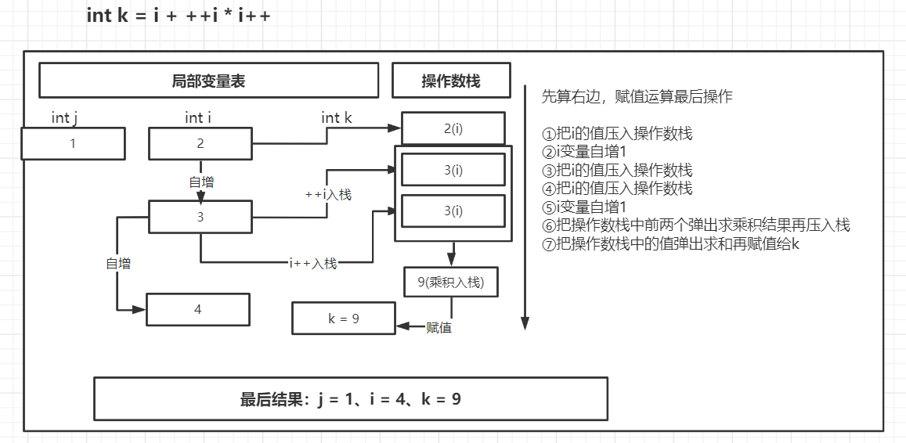
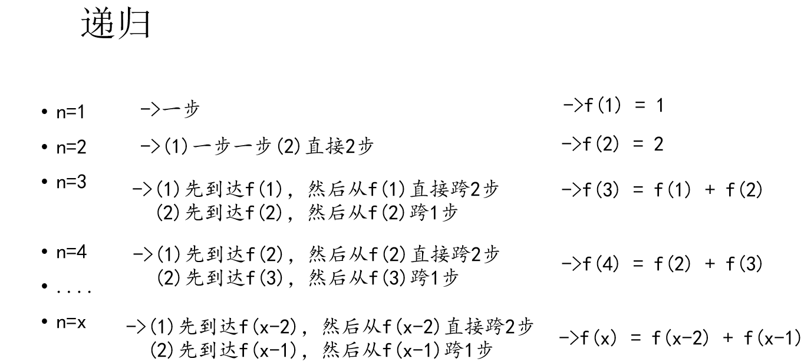
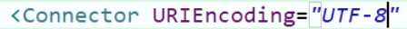

# 一、JavaSE面试题

## ① 自增变量

**如下代码的运行结果**：

```java
public static void main(String[] args) {
    int i = 1;
    i = i++;
    int j = i++;
    int k = i + ++i * i++;
    System.out.println("i=" + i);
    System.out.println("j=" + j);
    System.out.println("k=" + k);
}
```

> 步骤分析：**i = i++**;

先算右边，赋值运算最后操作

①把i的值压入操作数栈

②i变量自增1

③把操作数栈中的值赋值给i 


> 步骤分析：**int j = i++**；


> 步骤分析：**int k = i + ++i * i++**



> 总结

- 赋值=，最后计算
- =右边的从左到右加载值依次压入操作数栈
- 实际先算哪个，看运算符优先级
- 自增、自减操作都是直接修改变量的值，不经过操作数栈
- 最后的赋值之前，临时结果也是存储在操作数栈中

## ② 单例模式

### 1、饿汉式单例模式

> 直接实例化饿汉式（简洁直观）

```java
/**
 * @author cVzhanshi
 * @create 2022-01-04 11:05
 */
public class Hungry1 {
    //可能会浪费空间
    private byte[] data1 = new byte[1024*1024];
    private byte[] data2 = new byte[1024*1024];
    private byte[] data3 = new byte[1024*1024];
    
    public static final Hungry1 INSTANCE = new Hungry1();

    private Hungry1(){

    }

    public static Hungry1 getInstance(){
        return INSTANCE;
    }
}
```

说明：可能回浪费空间

> 枚举式（最简洁）

```java
/**
 * @author cVzhanshi
 * @create 2022-01-04 11:08
 */
public enum Hungry2 {
    INSTANCE;
}
```

> 静态代码块饿汉式（适合复杂实例化）

```java
/**
 * @author cVzhanshi
 * @create 2022-01-04 11:11
 */
public class Hungry3 {
    public static final Hungry3 INSTANCE;
    private String info;

    static{
        try {
            Properties pro = new Properties();

            pro.load(Hungry3.class.getClassLoader().getResourceAsStream("single.properties"));

            INSTANCE = new Hungry3(pro.getProperty("info"));
        } catch (IOException e) {
            throw new RuntimeException(e);
        }
    }

    private Hungry3(String info){
        this.info = info;
    }

    public String getInfo() {
        return info;
    }

    public void setInfo(String info) {
        this.info = info;
    }

    @Override
    public String toString() {
        return "Hungry3 [info=" + info + "]";
    }

}
```

适合复杂实例化，如需要读取配置文件的信息等等

### 2、懒汉式单例模式

> 线程不安全，适合于单线程

```java
/**
 * @author cVzhanshi
 * @create 2021-09-26 10:22
 */
public class LazyMan {

    // 私有化构造器
    private LazyMan(){
        System.out.println(Thread.currentThread().getName() + "ok");
    }

    private static LazyMan lazyMan;

    public static LazyMan getInstance(){
        if(lazyMan == null){
            lazyMan = new LazyMan();
        }
        return lazyMan;
    }
}
```

> **加锁变成DCL懒汉式单例模式**

```java
/**
 * @author cVzhanshi
 * @create 2021-09-26 10:22
 */
public class LazyMan {

    // 私有化构造器
    private LazyMan(){
        System.out.println(Thread.currentThread().getName() + "ok");
    }

    private static LazyMan lazyMan;

    // 双重检测锁模式的懒汉式单例 --> DCL懒汉式
    public static LazyMan getInstance(){
        if(lazyMan == null){
            synchronized (LazyMan.class){
                if(lazyMan == null){
                    lazyMan = new LazyMan();
                }
            }
        }
        return lazyMan;
    }
}
```

运行结果实现了单例，但是也不是绝对安全的，因为lazyMan = new LazyMan();不是一个原子性操作

> 最终版的DCL单例模式

```java
/**
 * @author cVzhanshi
 * @create 2021-09-26 10:22
 */
public class LazyMan {

    // 私有化构造器
    private LazyMan(){
        System.out.println(Thread.currentThread().getName() + "ok");
    }

    // + volatile 防止指令重排
    private volatile static LazyMan lazyMan;

    // 双重检测锁模式的懒汉式单例 --> DCL懒汉式
    public static LazyMan getInstance(){
        if(lazyMan == null){
            synchronized (LazyMan.class){
                if(lazyMan == null){
                    lazyMan = new LazyMan(); // 不是一个原子性操作
                    
                }
            }
        }
        return lazyMan;
    }


}
```

分析：lazyMan = new LazyMan() 不是一个原子性操作
lazyMan = new LazyMan();的执行步骤
1、分配内存空间
2、执行构造方法，初始化对象
3、把这个对象指向这个空间
可能由于指令重排 把执行顺序变成 1-3-2
造成的结果：**线程A还没有初始化对象，线程B获取对象是lazyMan!=null就返回对象，此时lazyMan还没有完成构造**

## ③ 类初始化、实例初始化和Override

求以下代码的运行结果：


### 1、类初始化

①一个类要创建实例需要先加载并初始化该类

- main方法所在的类需要先加载和初始化（就算main方法中没有内容）

②**一个子类要初始化需要先初始化父类**

③一个类初始化就是执行`<clinit>`()方法

- `<clinit>`()方法由静态类变量显示赋值代码和静态代码块组成
- **静态类变量显示赋值代码和静态代码块代码从上到下顺序执行**
- `<clinit>`()方法**只执行一次**

-----

所以，如果上述代码**main方法中没有内容的话**，执行结果为：**(5)(1)(10)(6)**

### 2、实例初始化

①实例初始化就是执行`<init>`()方法

- `<init>`()方法可能重载有多个，有几个构造器就有几个`<init>`方法
- `<init>`()方法由**非静态实例变量显示赋值代码和非静态代码块、对应构造器代码**组成
- **非静态实例变量显示赋值代码和非静态代码块代码从上到下顺序执行，而对应构造器的代码最后执行**
- 每次创建实例对象，调用对应构造器，执行的就是对应的`<init>`方法
- `<init>`方法的首行是super()或super(实参列表)，即对应父类的`<init>`方法

-----

所以当Son初始化时，执行顺序是：(5)(1)(10)(6)(9)(3)(2)(9)(8)(7)

代码执行流程

```java
// =================================子类初始化===========================================
/*
 * 子类的初始化<clinit>：
 * （1）j = method();
 * （2）子类的静态代码块
 * 
 * 先初始化父类：(5)(1)
 * 初始化子类：（10）(6)
 * 
 * 子类的实例化方法<init>：
 * （1）super()（最前，先初始化父类）      （9）（3）（2）
 * （2）i = test();    （9）
 * （3）子类的非静态代码块    （8）
 * （4）子类的无参构造（最后） （7）
 * 
 * 因为创建了两个Son对象，因此实例化方法<init>执行两次
 * 
 * （9）（3）（2）（9）（8）（7）
 */
// =================================父类初始化===========================================
 /*
 * 父类的初始化<clinit>：
 * （1）j = method();
 * （2）父类的静态代码块
 * 
 *  父类的实例化方法：
 * （1）super()（最前）
 * （2）i = test();
 * （3）父类的非静态代码块
 * （4）父类的无参构造（最后）
 * 
 * 非静态方法前面其实有一个默认的对象this
 * this在构造器（或<init>）它表示的是正在创建的对象，因为这里是在创建Son对象，所以
 * test()执行的是子类重写的代码（面向对象多态）
 * 
 * 这里i=test()执行的是子类重写的test()方法
 */
```

### 3、Override

**①哪些方法不可以被重写**

- final方法
- 静态方法
- private等子类中不可见方法

**②对象的多态性**

- 子类如果重写了父类的方法，通过子类对象调用的一定是子类重写过的代码
- 非静态方法默认的调用对象是this
- this对象在构造器或者说`<init>`方法中就是正在创建的对象

**③Override和Overload的区别**

- 重载：编译时多态、同⼀个类中同名的⽅法具有不同的参数列表、不能根据返回类型进⾏区分【因为：函数 调⽤时不能指定类型信息，编译器不知道你要调哪个函数】
- 重写（⼜名覆盖）：运⾏时多态、⼦类与⽗类之间、⼦类重写⽗类的⽅法具有相同的返回类型、更好的访问权限。

**④Override重写的要求**

- 必须保证父子类之间`方法的名称`相同，`参数列表`也相同
- 子类方法的`返回值`必须**小于等于**父类方法的**返回值**范围
- 子类方法抛出的异常要**小于等于**父类方法抛出的**异常**
- 子类方法的`权限`必须**大于等于**父类方法的**权限修饰符**

## ④ 方法参数传递机制

①形参是基本数据类型

- **传递数据值**

②实参是引用数据类型

- **传递地址值**
- 特殊的类型：**String、包装类等对象不可变性**

示例：

```java
public class Exam4 {
	public static void main(String[] args) {
		int i = 1;
		String str = "hello";
		Integer num = 200;
		int[] arr = {1,2,3,4,5};
		MyData my = new MyData();
		
		change(i,str,num,arr,my);
		
		System.out.println("i = " + i);
		System.out.println("str = " + str);
		System.out.println("num = " + num);
		System.out.println("arr = " + Arrays.toString(arr));
		System.out.println("my.a = " + my.a);
	}
	public static void change(int j, String s, Integer n, int[] a,MyData m){
		j += 1;
		s += "world";
		n += 1;
		a[0] += 1;
		m.a += 1;
	}
}
class MyData{
	int a = 10;
}
```

运行结果：


传值原理：


## ⑤ 递归与迭代

编程题：有n步台阶，一次只能上1步或2步，共有多少种走法？

> 递归



```java
public  int a(int n){
    if(n<1){
        throw new IllegalArgumentException(n + "不能小于1");
    }
    if(n == 1 || n ==2)
        return n;
    return a(n-1)  + a(n-2) ;
}
```

> 迭代


```java
public int loop(int n){
    if(n<1){
        throw new IllegalArgumentException(n + "不能小于1");
    }
    if(n==1 || n==2){
        return n;
    }

    int one = 2;//初始化为走到第二级台阶的走法
    int two = 1;//初始化为走到第一级台阶的走法
    int sum = 0;

    for(int i=3; i<=n; i++){
        //最后跨2步 + 最后跨1步的走法
        sum = two + one;
        two = one;
        one = sum;
    }
    return sum;
}
```

> 小结

- 方法调用自身称为递归，利用变量的原值推出新值称为迭代。
- 递归
  - 优点：大问题转化为小问题，可以减少代码量，同时代码精简，可读性好；
  - 缺点：递归调用浪费了空间，而且递归太深容易造成堆栈的溢出。

- 迭代
  - 优点：代码运行效率好，因为时间只因循环次数增加而增加，而且没有额外的空间开销；
  - 缺点：代码不如递归简洁，可读性好

## ⑥ 成员变量与局部变量

示例代码：

```java
public class Exam5 {
	static int s;//成员变量，类变量
	int i;//成员变量，实例变量
	int j;//成员变量，实例变量
	{
		int i = 1;//非静态代码块中的局部变量 i
		i++;
		j++;
		s++;
	}
	public void test(int j){//形参，局部变量,j
		j++;
		i++;
		s++;
	}
	public static void main(String[] args) {//形参，局部变量，args
		Exam5 obj1 = new Exam5();//局部变量，obj1
		Exam5 obj2 = new Exam5();//局部变量，obj1
		obj1.test(10);
		obj1.test(20);
		obj2.test(30);
		System.out.println(obj1.i + "," + obj1.j + "," + obj1.s);
		System.out.println(obj2.i + "," + obj2.j + "," + obj2.s);
	}
}
```

运行结果：


> 局部变量与成员变量的区别

① 声明的位置

- 局部变量：方法体{}中，形参，代码块{}中
- 成员变量：类中方法外
  - 类变量：有static修饰
  - 实例变量：没有static修饰

② 修饰符

- 局部变量：final

- 成员变量：public、protected、private、final、static、volatile、transient

③ 值存储的位置

- 局部变量：栈

- 实例变量：堆

- 类变量：方法区

④ 作用域

- 局部变量：从声明处开始，到所属的}结束
- 实例变量：在当前类中“this.”(有时this.可以缺省)，在其他类中“对象名.”访问
- 类变量：在当前类中“类名.”(有时类名.可以省略)，在其他类中“类名.”或“对象名.”访问

⑤ 生命周期

- 局部变量：每一个线程，每一次调用执行都是新的生命周期
- 实例变量：随着对象的创建而初始化，随着对象的被回收而消亡，每一个对象的实例变量是独立的
- 类变量：随着类的初始化而初始化，随着类的卸载而消亡，该类的所有对象的类变量是共享的

> 当局部变量与xx变量重名时，如何区分

①局部变量与实例变量重名

- 在实例变量前面加“this.”

②局部变量与类变量重名

- 在类变量前面加“类名.”

# 二、SSM面试题

## ① Spring Bean的作用域之间的区别

Spring Bean的作用域是在scope属性里设置的：

- `singleton`：在SpringIOC容器中仅存在一个Bean实例，Bean以单实例的方式存在
- `prototype`：每次调用getBean()时都会返回一个新的实例
- `request`：每次HTTP请求会创建新的bean，该作用域仅适用于WebApplicationContext环境
- `session`：同一个HTTP session共享bean，该作用域仅适用于WebApplicationContext环境。

## ② Spring支持的常用的数据库事务传播属性和事务隔离级别

> propagation 事务传播行为


> ioslation：事务隔离级别 

对于同时运行的多个事务, 当这些事务访问数据库中相同的数据时, 如果没有采取必要的隔离机制, 就会导致各种并发问题:

- **脏读**: 对于两个事务 T1, T2, T1 读取了已经被 T2 更新但还**没有被提交**的字段。之后, 若 T2 回滚, T1读取的内容就是临时且无效的。
- **不可重复读**: 对于两个事务T1, T2, T1 读取了一个字段, 然后 T2 **更新**了该字段。之后, T1再次读取同一个字段, 值就不同了。
- **幻读**: 对于两个事务T1, T2, T1 从一个表中读取了一个字段, 然后 T2 在该表中**插入**了一些新的行。之后, 如果 T1 再次读取同一个表, 就会多出几行。

|                  | 脏读 | 不可重复读 | 幻读 |
| ---------------- | ---- | ---------- | ---- |
| read uncommitted | √    | √          | √    |
| read committed   | ×    | √          | √    |
| repeatable read  | ×    | ×          | √    |
| serializable     | ×    |            | ×    |

- Oracle 支持的 2 种事务隔离级别：**READ COMMITED**, SERIALIZABLE。 Oracle 默认的事务隔离级别为: **READ COMMITED** 。


- Mysql 支持 4 种事务隔离级别。Mysql 默认的事务隔离级别为: **REPEATABLE READ。**

## ③ SpringMVC解决中如何解决POST请求中文乱码问题

springmvc提供了过滤器CharacterEncodingFilter：这个类有两个变量String类型的encoding、boolean类型forceEncoding默认false，核心方法doFilterInternal，方法中有request.setCharacterEncoding设置请求字符集，设force那个为true的话，可以设置response.setCharacterEncoding。
那么在web.xml里需要配置这一属性：

```xml
<!--post方式字符集-->
<filter>
    <filter-name>CharacterEncodingFilter</filter-name>
    <filter-class>org.springframework.web.filter.CharacterEncodingFilter</filter-class>
    <!--初始化参数-->
    <init-param>
         <param-name>encoding</param-name>
         <param-value>UTF-8</param-value>
     </init-param>
     <!--响应乱码，可设可不设-->
     <init-param>
         <param-name>force-encoding</param-name>
         <param-value>UTF-8</param-value>
     </init-param>
</filter>
<filter-mapping>
     <filter-name>CharacterEncodingFilter</filter-name>
     <url-pattern>/*</url-pattern>
</filter-mapping>
```

get方式，修改Tomcat的server.xml中的配置

在第一个Connector加上 URIEncoding=“UTF-8”



## ④ SpringMVC的工作流程

springmvc在处理模型数据有两种方式：方式一.返回值是ModelAndView、方式二.在参数中传入Map，Model或者ModelMap；最后都会转换为一个 ModelAndView对象（所以是以request作用域来响应用户）


> 小结

请求过来后，先到DispatcherServlet中央处理器，之后它会调用HandlerMapping处理器映射器里的方法，返HandlerExecultionChain对象，这个对象包含了所有的拦截器和处理器。

之后通过HandlerAdapter处理器适配器找到对应的Handler(Controller)处理器去调用请求，相当于调用controller之后，会返回ModelAndView对象，这个对象返回到中央处理器。

中央处理器通过我们在springmvc配置文件中配的InternalResourceViewResolver视图解析器，得到视图InternalResourceView。
得到视图之后，调用里边的方法进行渲染视图，将我们的模型数据，在页面给用户呈现出来，响应给用户。

## ⑤ MyBatis中当实体类中的属性名和表中的字段名不一样，怎么办？

1. 写sql语句时起别名
2. 在MyBatis的全局配置文件中开启驼峰命名规则（前提只是将数据库中下划线映射）
3. 在Mapper映射文件中使用ResultMap自定义映射

# 三、Java高级面试题

## ① Linux常用服务类相关命令

CentOS 6

- 常用基本命令-进程类
- 注册在系统中的标准化程序
  - service 服务名 start
  - service 服务名 stop
  - service 服务名 restart
  - service 服务名 reload
  - service 服务名 status
- 通过chkconfig 命令设置自启动程序
  - chkcongfig --list  #可以查看所有对应服务自启动状态开关
  - chkcongfig --level 3 服务名 off #on自启动、off不自启动

> 行级别runlevel（centos6），`常用级别3和5`
> 0 停机、1 单用户root状态、2 多用户状态、`3 有网多用户状态`、4. 保留、`5 图形模式`、6、重启

CentOS 7

- 注册在系统中的标准化程序
  - systemctl start 服务名
  - systemctl restart 服务名
  - systemctl stop 服务名 #示例:停防火墙 systemctl stop firewalld
  - systemctl reload 服务名
  - systemctl status 服务名
- 查看服务的命令
  - systemctl list-unit-files #示例:systemctl list-unit-files |grep firewalld
  - systemctl --type service
- 设置自启动/不自启动
  - systemctl enable 服务名
  - systemctl disable 服务名

## ② git分支相关命令

Git：分布式版本控制工具

创建分支、切换分支

- 一步完成：git checkout -b <分支名> #直接就完成了创建，并切换过去了

合并分支

- 先切换到主干 git checkout master
- git merge <分支名>

删除分支

- 先切换到主干 git checkout master
- git branch -D <分支名>

> git工作流


**工作流**：

master分支，分出多个develop分支，并行开发互不影响；master紧急出现bug了，可以有master分出一个临时分支，处理完后再合并到master中合并上线；之后将临时分支合并到develop分支，保证版本一致，避免bug重复出现。
开发人员开发完成了，先合并到dev分支，创建测试分支进行测试，没问题了在合并到master上线，之后再和dev合并保证一致

## ③ redis持久化

> RDB：在指定的时间间隔内将内存中的数据集快照写入磁盘， 也就是行话讲的Snapshot快照，它恢复时是将快照文件直接读到内存里

Redis会单独创建（fork）一个子进程来进行持久化，**会先将数据写入到 一个临时文件中，待持久化过程都结束了，再用这个临时文件替换上次持久化好的文件**。 整个过程中，主进程是不进行任何IO操作的，这就确保了极高的性能 如果需要进行大规模数据的恢复，且对于数据恢复的完整性不是非常敏感，**那RDB方式要比AOF方式更加的高效**。**RDB的缺点是最后一次持久化后的数据可能丢失**。

**优势**

- 适合大规模的数据恢复
- 对数据完整性和一致性要求不高更适合使用
- 节省磁盘空间
- 恢复速度快


**劣势**

- Fork的时候，内存中的数据被克隆了一份，大致2倍的膨胀性需要考虑
- 虽然Redis在fork时使用了**写时拷贝技术**,但是如果数据庞大时还是比较消耗性能。
- 在备份周期在一定间隔时间做一次备份，所以如果Redis意外down掉的话，就会丢失最后一次快照后的所有修改。

> AOF：以**日志**的形式来记录每个写操作（增量保存），将Redis执行过的所有写指令记录下来(**读操作不记录**)， **只许追加文件但不可以改写文件**，redis启动之初会读取该文件重新构建数据，换言之，redis 重启的话就根据日志文件的内容将写指令从前到后执行一次以完成数据的恢复工作


**优势**


- 备份机制更稳健，丢失数据概率更低。
- 可读的日志文本，通过操作AOF

**劣势**

- 比起RDB占用更多的磁盘空间。
- 恢复备份速度要慢。
- 每次读写都同步的话，有一定的性能压力。
- 存在个别Bug，造成恢复不能。

## ④ MySQL什么时候建索引

> 哪些情况需要创建索引

- 主键自动建立唯一索引

- 频繁作为查询条件的字段应该创建索引

- 查询中与其它表关联的字段，外键关系建立索引

  

- 单键/组合索引的选择问题，who？（**在高并发下倾向创建组合索引**）

- 查询中排序的字段，排序字段若通过索引去访问将大大提高排序速度

- 查询中统计或者分组字段

>哪些情况不要创建索引

- 表记录太少
- 过滤性不好的字段不适合建立索引
- 频繁更新的字段**不适合**创建索引，因为每次更新不单单是更新了记录，还会更新索引，加重IO负担
- where条件里用不到的字段**不创建索引**

## ⑤ JVM垃圾回收机制 - GC发生在JVM哪部分，有几种GC，它们的算法是什么？

GC大部分发生在堆中还有一小部分发生在方法区上

GC的种类有两种  Minior GC 和Full GC

Minior GC使用的是复制算法，复制算法的流程是 复制->清空->互换

Full GC使用的是标记清除算法和标记压缩算法混合使用

-----

GC发生在heap堆中。
GC是分代收集算法：频繁收集年轻代``Minor GC、次数较少老年代``Full GC、永久区不GC
GC的四大算法：

- 引用回收算法（对象有引用，就不回收，已淘汰，无法处理循环引用）
- 复制算法（发生在YG、效率高，无碎片，占空间）
- 标记清除（发生在OG、省空间，产生碎片）
- 标记压缩（OG、成本高）
- 标记清除压缩（OG、③④混合）

# 四、项目面试题

## ① redis在项目中的使用场景

- **String**
  绑定ip地址，可以记录ip地址的操作。

- **Hash**
  存储用户信息【id，name，age】
  Hset(key,field,value)
  Hset(userKey,id,101)
  当我修改用户信息某一项属性的时候，可以直接取出单一的值。
  不建议使用String类型是因为，在反序列化时，会全部序列化出来，会增加IO次数，降低性能。

- **List**
  实现最新消息的排行，
  还可以利用List的push命令，将任务存在list集合中，同时使用另一个命令，将任务从集合中取出[pop]。
  Redis — List 数据类型来模拟消息队列。【电商中的秒杀就可以采用这种方式来完成一个秒杀活动】

- **Set**
  特殊之处：可以自动排重（非重复）。比如说微博中将每个人的好友存在集合(Set)中，
  这样求两个人的共通好友的操作。我们只需要求交集即可。

- **Zset (SortedSet)**
  以某一个条件为权重，进行排序。 京东：商品详情的时候，都会有一个综合排名，还可以按照价格进行排名。

## ② ES和solr的区别？

它们都是基于Lucene搜索服务器基础上开发，**高性能的企业级**搜索服务。【它们都是基于**分词技术**构建的**倒排索引**方式进行查询】
区别：

- 当实时建立索引的时候，solr会产生io阻塞，而es则不会，es查询性能高于solr。
- 在不断动态添加数据的时候，solr的检索效率会下降，es则不会。
- Solr利用zk进行分布式管理，es自身带有分布式系统管理功能。**Solr的本质是web项目**，需要部署到web服务器上，启动服务器时需配置solr。
- Solr支持更多的格式数据[xml、json、csv]，而es仅支持json文件格式。
- Solr是传统搜索应用的有力解决方案，但是es更适合新兴实时搜索应用。【solr适合已有数据搜索时，效率更好；需要动态增添数据时，es效率更高】
- solr的观望提供功能更多，es更注重核心搜索功能，高级功能需要三方集成。

## ③ 单点登录

单点登录：一处登录，多处使用

前提：单点登录多使用在分布式系统中


## ④ 购物车


