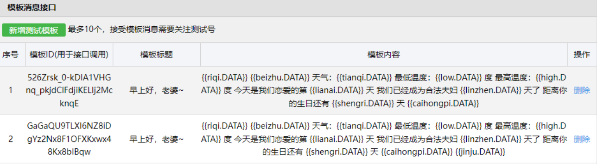
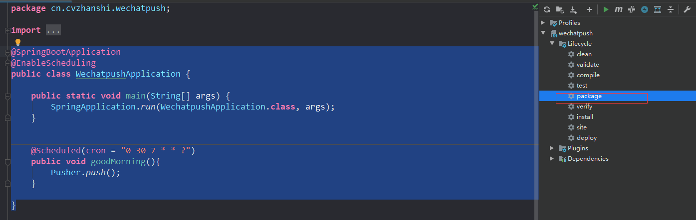

## ① 概述

> 功能点

- 每天早上可以给指定的微信用户推送消息，经过公众号

- 可以使用第三方接口丰富推送的消息内容

  - 百度天气api：添加天气信息推送
  - 天行数据api：添加美句、彩虹屁等语句推送
  - 通过后台计算纪念日推送
  - ......

- 效果图

  

> 技术栈点

- spring boot实现后台
- 微信测试账号的申请
- 微信模版推送的配置
- 对接百度天气api
- 对接彩虹屁api
- 对接优美句子api

> 源码开放

[Gitee](https://gitee.com/cvzhanshi-ursula/wechatpush)

[GitHub](https://github.com/cvzhanshi-ursula/wechatpush)

## ② 注册微信测试账号，编辑推送模板

- 使用微信扫码登录此网站https://mp.weixin.qq.com/debug/cgi-bin/sandbox?t=sandbox/login就能得到一个微信公众号测试号

- 推送消息需要用到的信息

  

- 用户扫码关注得到用户的id

  

- 编辑消息模板

  

- 此步骤的模板id、用户微信号id、以及自己的appID、appsecret是后续推送所需要用到的

## ③ 使用spring boot 做后台开发，并且与第三方对接

> 使用第三方接口——[控制台 | 百度地图开放平台 (baidu.com)](https://lbsyun.baidu.com/apiconsole/center#/home)

- 在百度地图开放平台注册账号，并且到控制台中的应用创建一个应用（**其中应用AK是推送需要使用到的**）

  

- 设置ip白名单为0.0.0.0/0

> 使用第三方接口——[天行数据TianAPI - 开发者API数据平台](https://www.tianapi.com/)

- 进去注册账号选择需要的句子接口使用就行

- 每个接口都有实例代码，直接使用就行

  

- 此案例使用了[彩虹屁](https://www.tianapi.com/apiview/181)以及[英语一句话](https://www.tianapi.com/apiview/62)两种

> spring boot后台开发

- 创建spring boot项目，[创建教程](https://editor.csdn.net/md/?articleId=117793648)

- 导入需要的依赖

  ```xml
  <properties>
      <java.version>1.8</java.version>
      <project.build.sourceEncoding>UTF-8</project.build.sourceEncoding>
      <project.reporting.outputEncoding>UTF-8</project.reporting.outputEncoding>
      <spring-boot.version>2.3.7.RELEASE</spring-boot.version>
  </properties>
  
  <dependencies>
      <!-- https://mvnrepository.com/artifact/org.projectlombok/lombok -->
      <dependency>
          <groupId>org.projectlombok</groupId>
          <artifactId>lombok</artifactId>
          <version>1.18.20</version>
          <scope>provided</scope>
      </dependency>
  
      <!-- https://mvnrepository.com/artifact/com.alibaba/fastjson -->
      <dependency>
          <groupId>com.alibaba</groupId>
          <artifactId>fastjson</artifactId>
          <version>2.0.7</version>
      </dependency>
  
      <dependency>
          <groupId>org.springframework.boot</groupId>
          <artifactId>spring-boot-starter-web</artifactId>
      </dependency>
  
      <dependency>
          <groupId>org.springframework.boot</groupId>
          <artifactId>spring-boot-starter-test</artifactId>
          <scope>test</scope>
          <exclusions>
              <exclusion>
                  <groupId>org.junit.vintage</groupId>
                  <artifactId>junit-vintage-engine</artifactId>
              </exclusion>
          </exclusions>
      </dependency>
      <!-- https://mvnrepository.com/artifact/com.github.binarywang/weixin-java-mp -->
      <dependency>
          <groupId>com.github.binarywang</groupId>
          <artifactId>weixin-java-mp</artifactId>
          <version>3.3.0</version>
      </dependency>
  </dependencies>
  ```

- 编写对接百度天气api 的工具类

  天气的实体类

  ```java
  /**
   * @author cVzhanshi
   * @create 2022-08-04 2215
   */
  @Data
  @AllArgsConstructor
  @NoArgsConstructor
  public class Weather {
      String wd_night;
      String date;
      String high;
      String week;
      String text_night;
      String wd_day;
      String low;
      String wc_night;
      String text_day;
      String wc_day;
      // 当前天气
      String text_now;
      // 当前温度
      String temp;
      // 风级大小
      String wind_class;
      // 风向
      String wind_dir;
  }
  
  ```

  ```java
  /**
   * @author cVzhanshi
   * @create 2022-08-04 22:02
   */
  public class WeatherUtils {
      public static void main(String[] args) {
          System.out.println(getWeather());
      }
      public static Weather getWeather(){
          RestTemplate restTemplate = new RestTemplate();
          Map<String,String> map = new HashMap<String,String>();
          map.put("district_id","320583"); // 地方行政代码
          map.put("data_type","all");//这个是数据类型
          map.put("ak","自己的应用AK");
          String res = restTemplate.getForObject(
                  "https://api.map.baidu.com/weather/v1/?district_id={district_id}&data_type={data_type}&ak={ak}",
                  String.class,
                  map);
          JSONObject json = JSONObject.parseObject(res);
          JSONArray forecasts = json.getJSONObject("result").getJSONArray("forecasts");
          List<Weather> weathers = forecasts.toJavaList(Weather.class);
          JSONObject now = json.getJSONObject("result").getJSONObject("now");
          Weather weather = weathers.get(0);
          weather.setText_now(now.getString("text"));
          weather.setTemp(now.getString("temp"));
          weather.setWind_class(now.getString("wind_class"));
          weather.setWind_dir(now.getString("wind_dir"));
          return weather;
      }
  }
  ```

- 编写对接天行数据（彩虹屁）api的工具类

  ```java
  /**
   * @author cVzhanshi
   * @create 2022-08-04 22:58
   */
  public class CaiHongPiUtils {
      public static String getCaiHongPi() {
          String httpUrl = "http://api.tianapi.com/caihongpi/index?key=接口的key";
          BufferedReader reader = null;
          String result = null;
          StringBuffer sbf = new StringBuffer();
  
          try {
              URL url = new URL(httpUrl);
              HttpURLConnection connection = (HttpURLConnection) url
                      .openConnection();
              connection.setRequestMethod("GET");
              InputStream is = connection.getInputStream();
              reader = new BufferedReader(new InputStreamReader(is, "UTF-8"));
              String strRead = null;
              while ((strRead = reader.readLine()) != null) {
                  sbf.append(strRead);
                  sbf.append("\r\n");
              }
              reader.close();
              result = sbf.toString();
          } catch (Exception e) {
              e.printStackTrace();
          }
          JSONObject jsonObject = JSONObject.parseObject(result);
          JSONArray newslist = jsonObject.getJSONArray("newslist");
          String content = newslist.getJSONObject(0).getString("content");
          return content;
      }
  
      public static Map<String,String> getEnsentence() {
          String httpUrl = "http://api.tianapi.com/ensentence/index?key=接口的key";
          BufferedReader reader = null;
          String result = null;
          StringBuffer sbf = new StringBuffer();
          try {
              URL url = new URL(httpUrl);
              HttpURLConnection connection = (HttpURLConnection) url
                      .openConnection();
              connection.setRequestMethod("GET");
              InputStream is = connection.getInputStream();
              reader = new BufferedReader(new InputStreamReader(is, "UTF-8"));
              String strRead = null;
              while ((strRead = reader.readLine()) != null) {
                  sbf.append(strRead);
                  sbf.append("\r\n");
              }
              reader.close();
              result = sbf.toString();
          } catch (Exception e) {
              e.printStackTrace();
          }
          JSONObject jsonObject = JSONObject.parseObject(result);
          JSONArray newslist = jsonObject.getJSONArray("newslist");
          String en = newslist.getJSONObject(0).getString("en");
          String zh = newslist.getJSONObject(0).getString("zh");
          Map<String, String> map = new HashMap<>();
          map.put("zh",zh);
          map.put("en",en);
          return map;
      }
  }
  ```

- 编写计算纪念日的工具类

  ```java
  
  public class JiNianRiUtils {
  
      public static int getLianAi(){
          return calculationLianAi("2022-12-11");
      }
      public static int getBirthday_Jo(){
          try {
              return calculationBirthday("2009-03-09");
          } catch (ParseException e) {
              e.printStackTrace();
          }
          return 0;
      }
      public static int getBirthday_Hui(){
          try {
              return calculationBirthday("2020-01-11");
          } catch (ParseException e) {
              e.printStackTrace();
          }
          return 0;
      }
  
  	// 计算生日天数
      public static int calculationBirthday(String clidate) throws ParseException {
          SimpleDateFormat myFormatter = new SimpleDateFormat("yyyy-MM-dd");
          Calendar cToday = Calendar.getInstance(); // 存今天
          Calendar cBirth = Calendar.getInstance(); // 存生日
          cBirth.setTime(myFormatter.parse(clidate)); // 设置生日
          cBirth.set(Calendar.YEAR, cToday.get(Calendar.YEAR)); // 修改为本年
          int days;
          if (cBirth.get(Calendar.DAY_OF_YEAR) < cToday.get(Calendar.DAY_OF_YEAR)) {
              // 生日已经过了，要算明年的了
              days = cToday.getActualMaximum(Calendar.DAY_OF_YEAR) - cToday.get(Calendar.DAY_OF_YEAR);
              days += cBirth.get(Calendar.DAY_OF_YEAR);
          } else {
              // 生日还没过
              days = cBirth.get(Calendar.DAY_OF_YEAR) - cToday.get(Calendar.DAY_OF_YEAR);
          }
          // 输出结果
          if (days == 0) {
              return 0;
          } else {
              return days;
          }
      }
  	
      // 计算天数
      public static int calculationLianAi(String date) {
          DateFormat simpleDateFormat = new SimpleDateFormat("yyyy-MM-dd");
          int day = 0;
          try {
              long time = System.currentTimeMillis() - simpleDateFormat.parse(date).getTime();
              day = (int) (time / 86400000L);
          } catch (ParseException e) {
              e.printStackTrace();
          }
          return day;
      }
  }
  ```

- 编写推送类

  ```java
  /**
   * @author cVzhanshi
   * @create 2022-08-04 21:09
   */
  public class Pusher {
  
      public static void main(String[] args) {
          push();
      }
      private static String appId = "xx";
      private static String secret = "xx";
  
  
  
      public static void push(){
          //1，配置
          WxMpInMemoryConfigStorage wxStorage = new WxMpInMemoryConfigStorage();
          wxStorage.setAppId(appId);
          wxStorage.setSecret(secret);
          WxMpService wxMpService = new WxMpServiceImpl();
          wxMpService.setWxMpConfigStorage(wxStorage);
          //2,推送消息
          WxMpTemplateMessage templateMessage = WxMpTemplateMessage.builder()
                  .toUser("用户微信id") 
                  .templateId("消息模板id")
                  .build();
          //3,如果是正式版发送模版消息，这里需要配置你的信息
          Weather weather = WeatherUtils.getWeather();
          Map<String, String> map = CaiHongPiUtils.getEnsentence();
          templateMessage.addData(new WxMpTemplateData("riqi",weather.getDate() + "  "+ weather.getWeek(),"#00BFFF"));
          templateMessage.addData(new WxMpTemplateData("tianqi",weather.getText_now(),"#00FFFF"));
          templateMessage.addData(new WxMpTemplateData("low",weather.getLow() + "","#173177"));
          templateMessage.addData(new WxMpTemplateData("temp",weather.getTemp() + "","#EE212D"));
          templateMessage.addData(new WxMpTemplateData("high",weather.getHigh()+ "","#FF6347" ));
          templateMessage.addData(new WxMpTemplateData("windclass",weather.getWind_class()+ "","#42B857" ));
          templateMessage.addData(new WxMpTemplateData("winddir",weather.getWind_dir()+ "","#B95EA3" ));
          templateMessage.addData(new WxMpTemplateData("caihongpi",CaiHongPiUtils.getCaiHongPi(),"#FF69B4"));
          templateMessage.addData(new WxMpTemplateData("lianai",JiNianRiUtils.getLianAi()+"","#FF1493"));
          templateMessage.addData(new WxMpTemplateData("shengri1",JiNianRiUtils.getBirthday_Jo()+"","#FFA500"));
          templateMessage.addData(new WxMpTemplateData("shengri2",JiNianRiUtils.getBirthday_Hui()+"","#FFA500"));
          templateMessage.addData(new WxMpTemplateData("en",map.get("en") +"","#C71585"));
          templateMessage.addData(new WxMpTemplateData("zh",map.get("zh") +"","#C71585"));
          String beizhu = "❤";
          if(JiNianRiUtils.getLianAi() % 365 == 0){
              beizhu = "今天是恋爱" + (JiNianRiUtils.getLianAi() / 365) + "周年纪念日！";
          }
          if(JiNianRiUtils.getBirthday_Jo()  == 0){
              beizhu = "今天是生日，生日快乐呀！";
          }
          if(JiNianRiUtils.getBirthday_Hui()  == 0){
              beizhu = "今天是生日，生日快乐呀！";
          }
          templateMessage.addData(new WxMpTemplateData("beizhu",beizhu,"#FF0000"));
  
          try {
              System.out.println(templateMessage.toJson());
              System.out.println(wxMpService.getTemplateMsgService().sendTemplateMsg(templateMessage));
          } catch (Exception e) {
              System.out.println("推送失败：" + e.getMessage());
              e.printStackTrace();
          }
      }
  }
  ```

- 编写定时任务

  ```java
  @SpringBootApplication
  @EnableScheduling // 开启定时任务
  public class WechatpushApplication {
  
      public static void main(String[] args) {
          SpringApplication.run(WechatpushApplication.class, args);
      }
  
  	// 定时
      @Scheduled(cron = "0 30 7 * * ?")
      public void goodMorning(){
          Pusher.push();
      }
  }
  ```

## ④ 部署

- 把项目打包成jar包

  

- 把jar包上传到服务器并且运行起来

  ```bash
  # 运行命令
  nohup java -jar test.jar >temp.txt &
  ```

==完成~==

