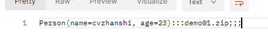
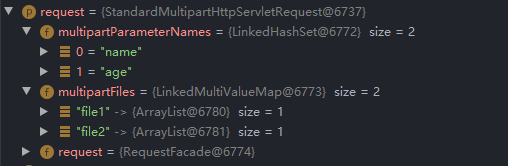
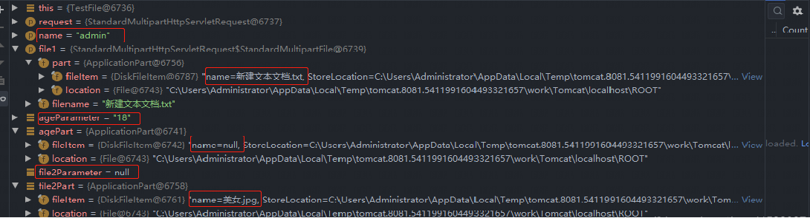
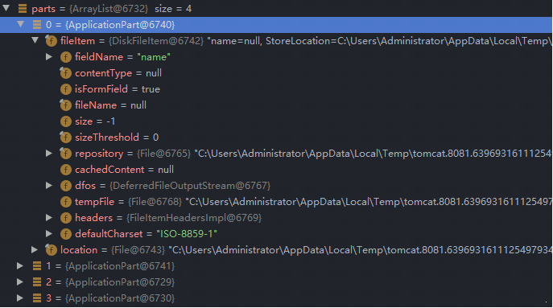
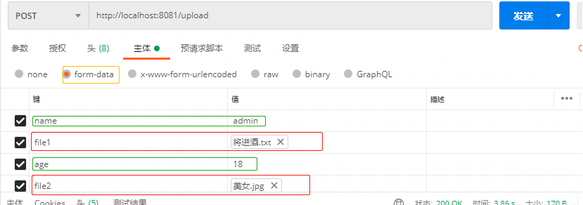
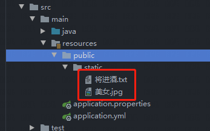
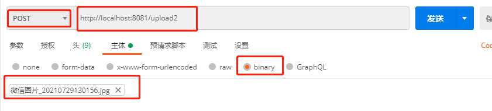
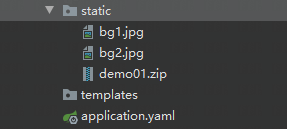

# 前言Ⅰ：@RequestParam和@RequestPart的区别

**@RequestPart**

- `@RequestPart`这个注解用在`multipart/form-data`表单提交请求的方法上。
- 支持的请求方法的方式`MultipartFile`，属于Spring的`MultipartResolver`类。这个请求是通过`http协议`传输的

**@RequestParam**

- `@RequestParam`支持`application/json`，也同样支持`multipart/form-data`请求

**代码演示**

- 测试一：使用@RequestPart接收json数据

  **结论**：**`@RequestPart`可以将`jsonData`的`json数据`转换为`Person对象`**

  ```java
  /**
       * 测试 RequestParam 和 RequestPart区别2
       * @param person
       * @param file1
       * @return
       * @throws IOException
       * @throws ServletException
       */
  @RequestMapping(value = "/upload3",method = RequestMethod.POST)
  @ResponseBody
  public String readFile1(@RequestPart("person") Person person , @RequestPart("file1") MultipartFile file1)  {
      StringBuilder sb = new StringBuilder();
      sb.append(file1.getOriginalFilename()).append(";;;");
      return person.toString() + ":::" + sb.toString();
  }
  ```

  | 参数名 | 参数值                        | 参数类型         |
  | ------ | ----------------------------- | ---------------- |
  | file1  | 一个文件                      | file             |
  | person | {"name":"cvzhanshi","age":23} | application/json |

  测试结果：能够用对象去接收json

  

- 测试二：使用@RequestParam接收json数据

  **结论**：**`@RequestParam`对于`jsonData`的`json数据`只能用`String字符串`来接收**

  ```java
  /**
       * 测试 RequestParam 和 RequestPart区别2
       * @param person
       * @param file1
       * @return
       * @throws IOException
       * @throws ServletException
       */
  @RequestMapping(value = "/upload3",method = RequestMethod.POST)
  @ResponseBody
  public String readFile1(@RequestParam("person") Person person , @RequestPart("file1") MultipartFile file1)  {
      StringBuilder sb = new StringBuilder();
      sb.append(file1.getOriginalFilename()).append(";;;");
      return person.toString() + ":::" + sb.toString();
  }
  ```

​	  测试结果：报错      2022-10-08 10:19:48.434  WARN 3440 --- [nio-8888-exec-1] .w.s.m.s.DefaultHandlerExceptionResolver : Resolved [org.springframework.web.method.annotation.MethodArgumentConversionNotSupportedException: **Failed to convert value of type 'java.lang.String' to required type 'cn.cvzhanshi.test.entity.Person';** nested exception is java.lang.IllegalStateException: **Cannot convert value of type 'java.lang.String' to required type 'cn.cvzhanshi.test.entity.Person':** no matching editors or conversion strategy found]

报错说明：只能接收解析String类型的

**区别(总结)**

- 当请求为`multipart/form-data`时，**`@RequestParam`只能接收`String类型`的`name-value`值，`@RequestPart`可以接收复杂的请求域（像`json、xml`）**
- `@RequestParam` 依赖`Converter or PropertyEditor`进行数据解析， `@RequestPart`参考`'Content-Type' header`，依赖`HttpMessageConverters`进行数据解析
- **当请求头中指定Content-Type:multipart/form-data时，传递的json参数，@RequestPart注解可以用对象来接收，@RequestParam只能用字符串接收**
- @RequestParam适用于name-valueString类型的请求域，@RequestPart适用于复杂的请求域（像JSON，XML）；他们最大的不同是，当请求方法的请求参数类型不再是String类型的时候

# 前言Ⅱ：getParameter() 和 getPart() 区别

**代码测试**

```java
/**
     * 测试 RequestParam 和 RequestPart区别1
     * @param request
     * @param name
     * @param file1
     * @return
     * @throws IOException
     * @throws ServletException
     */
@RequestMapping(value = "/upload1",method = RequestMethod.POST)
@ResponseBody
public String readFile(HttpServletRequest request,@RequestParam("name") String name ,@RequestPart("file1") MultipartFile file1) throws IOException, ServletException {

    String ageParameter = request.getParameter("age");
    Part agePart = request.getPart("age");

    String file2Parameter = request.getParameter("file2");
    Part file2Part = request.getPart("file2");

    Enumeration<String> parameterNames = request.getParameterNames();
    Collection<Part> parts = request.getParts();
    return "";
}
```

**传递参数**

| key   | value            | type |
| ----- | ---------------- | ---- |
| name  | cvzhanshi        | text |
| age   | 18               | text |
| file1 | 新建文本文档.txt | file |
| file2 | 美女.jpg         | file |

**DeBug分析**：

- **request**：可以看到request有两个 Parameter 和 两个 Part 参数

  

- **Parameter和Part**：request.getParameter获得的值以及request.getPart获得的值

  

  结果发现：使用 request.getParameter() 获取文件类型参数为空，使用 request.getPart() 获取非文件类型为空

- **ParameterNames和Parts**：getParameterNames()和getParts()获取参数名

  

  

  结果：**使用 request.getParameterNames() 只能获取非文件类型的参数名, 使用 request.getParts() 可以获取全部参数名**

**结论**

- Part 能获取所有的请求参数的参数名，而 Parameter 只能获取非文件类型的参数名
- Part 不能获得非文件类型参数的参数值，Part获得二进制的输入流
- Parameter 只能获得非文件类型参数值
- 使用 Part 获取文件很方便，可以获取文件大小文件类型

# Ⅰ：文件上传

## ① form-data 类型上传

form-data 类型即常用的表单提交，可以通过两种方式接收前端传过来的文件

- 通过上述讲的Part 接收字节流，即@RequestPart注解以及request.getParts()
- 通过MultipartFile类来接收前端传过来的文件

说明：两种方法差不多

> **前端接口提交**



> **上传文件的后端代码（接口）**

```java
/**
     * form-data 类型(前端表单上传)
     * @param request
     * @param name
     * @param file3
     * @param photo
     * @return
     * @throws IOException
     * @throws ServletException
     */
@RequestMapping(value = "/upload", method = RequestMethod.POST)
@ResponseBody
public String readFile(HttpServletRequest request,
                       @RequestParam("name") String name,
                       @RequestPart("file1") MultipartFile file3,
                       @RequestPart("photo") MultipartFile photo
                      ) throws IOException, ServletException {


    System.out.println(name);
    /*
            第一种 ： 使用 MultipartFile 封装好的 transferTo() 方法保存文件
            photo.transferTo(new File(path + photo.getOriginalFilename()));
         */
    /*
            第二种 ：  使用 MultipartFile 字节流保存文件
            fileUtil(file3, String.valueOf(path));
         */


    /*第三种 ：用 Part 接收文件字节流
            Part file2 = request.getPart("file2");
            file2.write(path + file2.getSubmittedFileName());
            request.getParts() 获取的是全部参数（name,age,file1,file2），包括文件参数和非文件参数
		 */
    for (Part part : request.getParts()) {
        // 获取文件类型
        part.getContentType();
        // 获取文件大小
        part.getSize();
        // 获取文件名
        part.getSubmittedFileName();
        // 获取参数名 （name,age,file1,file2）
        part.getName();
        if(part.getContentType()!=null){
            part.write(path + part.getSubmittedFileName());
        }else{
            // 可以获取文本参数值,文本参数 part.getContentType()为 null
            System.out.println(request.getParameter(part.getName()));
        }
    }
    return "success";
}


/**
     * 字节流上传文件工具方法
     * @param file
     * @param path
     * @return
     */
public String fileUtil(MultipartFile file, String path) {
    if (!file.isEmpty()) {
        try {
            // 转化成字节流
            byte[] bytes = file.getBytes();
            bufferedOutputStream = new BufferedOutputStream(new FileOutputStream(
                new File(path + file.getOriginalFilename())));
            // 写出
            bufferedOutputStream.write(bytes);
            // 关闭资源
            bufferedOutputStream.close();
            return file.getOriginalFilename() + " 上传成功";
        } catch (Exception e) {
            return file.getOriginalFilename() + " failed to upload ---> " + e;
        }
    } else {
        return file.getOriginalFilename() + "You failed to upload file was empty.";
    }
}
```

> **测试**



## ② binary 类型上传

binary 这一类型，指的就是一些二进制文件类型，如application/pdf，指定了特定二进制文件的MIME类型。就像对于text文件类型若没有特定的子类型

（subtype），就使用 text/plain。类似的，二进制文件没有特定或已知的 subtype，即使用 application/octet-stream，这是应用程序文件的默认值。

对于application/octet-stream，只能提交二进制，而且只能提交一个二进制，如果提交文件的话，只能提交一个文件，后台接收参数只能有一个，而且只能是流

（或者字节数组）

> **前端接口提交**



> **上传文件的后端代码（接口）**

```java
/**
     * binary 类型上传
     * @param request
     * @return
     * @throws IOException
     */
@RequestMapping(value = "/upload2",method = RequestMethod.POST)
public String upload2(HttpServletRequest request) throws IOException {
    ServletInputStream inputStream = null;
    FileOutputStream fileOutputStream = null;
    try {
        // 获取上传的文件流
        inputStream = request.getInputStream();
        // 定义输出流 上传到哪里
        fileOutputStream = new FileOutputStream(new File(path + "a.pdf"));

        int len;
        byte[] bytes = new byte[1024];
        while((len = inputStream.read(bytes))!=-1){
            fileOutputStream.write(bytes,0,len);
        }
    } catch (IOException e) {
        e.printStackTrace();
        return "上传失败";
    } finally {
        // 关闭资源
        if(fileOutputStream!=null){
            fileOutputStream.close();
        }
        if(inputStream!=null){
            inputStream.close();
        }
    }
    return "上传成功";
}
```

> 测试



说明：part 使用起来比较方便，接受的就是字节流，读取文件类型，文件名，文件大小也比较方便

## ③ 配置说明

如果不自定义配置的话，他会默认上传大小1M\

SpringBoot项目的话通过配置文件配置

```yaml
server:
  port: 8888
spring:
  servlet:
    multipart:
      max-file-size: 10MB   # 最大上传大小
      max-request-size: 100MB   # 单文件最大上传大小 
```

# Ⅱ：文件下载

## ① 补充说明

> ### Content-Disposition

- 在常规的 HTTP 应答中，**`Content-Disposition`** 响应头指示回复的内容该以何种形式展示，是以**内联**的形式（即网页或者页面的一部分），还是以**附件**的形式下载并保存到本地
- 在 multipart/form-data 类型的应答消息体中，**`Content-Disposition`** 消息头可以被用在 multipart 消息体的子部分中，用来给出其对应字段的相关信息。各个子部分由在`Content-Type` 中定义的**分隔符**分隔。用在消息体自身则无实际意义。

**语法**：

- **作为消息主体中的消息头**：在 HTTP 场景中，第一个参数或者是 `inline`（默认值，表示回复中的消息体会以页面的一部分或者整个页面的形式展示），或者是 `attachment`（意味着消息体应该被下载到本地；大多数浏览器会呈现一个“保存为”的对话框，将 `filename` 的值预填为下载后的文件名，假如它存在的话）。

  ```
  Content-Disposition: inline
  Content-Disposition: attachment
  Content-Disposition: attachment; filename="filename.jpg"
  ```

- **作为 multipart body 中的消息头**：在 HTTP 场景中。第一个参数总是固定不变的 `form-data`；附加的参数不区分大小写，并且拥有参数值，参数名与参数值用等号 (`'='`) 连接，参数值用双引号括起来。参数之间用分号 (`';'`) 分隔。

  ```
  Content-Disposition: form-data
  Content-Disposition: form-data; name="fieldName"
  Content-Disposition: form-data; name="fieldName"; filename="filename.jpg"
  ```

> ### **response.setContentType()的String参数及对应类型**

| 文件扩展名                          | Content-Type(Mime-Type)                 | 文件扩展名 | Content-Type(Mime-Type)             |
| :---------------------------------- | :-------------------------------------- | :--------- | :---------------------------------- |
| .*（ 二进制流，不知道下载文件类型） | application/octet-stream                | .tif       | image/tiff                          |
| .001                                | application/x-001                       | .301       | application/x-301                   |
| .323                                | text/h323                               | .906       | application/x-906                   |
| .907                                | drawing/907                             | .a11       | application/x-a11                   |
| .acp                                | audio/x-mei-aac                         | .ai        | application/postscript              |
| .aif                                | audio/aiff                              | .aifc      | audio/aiff                          |
| .aiff                               | audio/aiff                              | .anv       | application/x-anv                   |
| .asa                                | text/asa                                | .asf       | video/x-ms-asf                      |
| .asp                                | text/asp                                | .asx       | video/x-ms-asf                      |
| .au                                 | audio/basic                             | .avi       | video/avi                           |
| .awf                                | application/vnd.adobe.workflow          | .biz       | text/xml                            |
| .bmp                                | application/x-bmp                       | .bot       | application/x-bot                   |
| .c4t                                | application/x-c4t                       | .c90       | application/x-c90                   |
| .cal                                | application/x-cals                      | .cat       | application/vnd.ms-pki.seccat       |
| .cdf                                | application/x-netcdf                    | .cdr       | application/x-cdr                   |
| .cel                                | application/x-cel                       | .cer       | application/x-x509-ca-cert          |
| .cg4                                | application/x-g4                        | .cgm       | application/x-cgm                   |
| .cit                                | application/x-cit                       | .class     | java/*                              |
| .cml                                | text/xml                                | .cmp       | application/x-cmp                   |
| .cmx                                | application/x-cmx                       | .cot       | application/x-cot                   |
| .crl                                | application/pkix-crl                    | .crt       | application/x-x509-ca-cert          |
| .csi                                | application/x-csi                       | .css       | text/css                            |
| .cut                                | application/x-cut                       | .dbf       | application/x-dbf                   |
| .dbm                                | application/x-dbm                       | .dbx       | application/x-dbx                   |
| .dcd                                | text/xml                                | .dcx       | application/x-dcx                   |
| .der                                | application/x-x509-ca-cert              | .dgn       | application/x-dgn                   |
| .dib                                | application/x-dib                       | .dll       | application/x-msdownload            |
| .doc                                | application/msword                      | .dot       | application/msword                  |
| .drw                                | application/x-drw                       | .dtd       | text/xml                            |
| .dwf                                | Model/vnd.dwf                           | .dwf       | application/x-dwf                   |
| .dwg                                | application/x-dwg                       | .dxb       | application/x-dxb                   |
| .dxf                                | application/x-dxf                       | .edn       | application/vnd.adobe.edn           |
| .emf                                | application/x-emf                       | .eml       | message/rfc822                      |
| .ent                                | text/xml                                | .epi       | application/x-epi                   |
| .eps                                | application/x-ps                        | .eps       | application/postscript              |
| .etd                                | application/x-ebx                       | .exe       | application/x-msdownload            |
| .fax                                | image/fax                               | .fdf       | application/vnd.fdf                 |
| .fif                                | application/fractals                    | .fo        | text/xml                            |
| .frm                                | application/x-frm                       | .g4        | application/x-g4                    |
| .gbr                                | application/x-gbr                       | .          | application/x-                      |
| .gif                                | image/gif                               | .gl2       | application/x-gl2                   |
| .gp4                                | application/x-gp4                       | .hgl       | application/x-hgl                   |
| .hmr                                | application/x-hmr                       | .hpg       | application/x-hpgl                  |
| .hpl                                | application/x-hpl                       | .hqx       | application/mac-binhex40            |
| .hrf                                | application/x-hrf                       | .hta       | application/hta                     |
| .htc                                | text/x-component                        | .htm       | text/html                           |
| .html                               | text/html                               | .htt       | text/webviewhtml                    |
| .htx                                | text/html                               | .icb       | application/x-icb                   |
| .ico                                | image/x-icon                            | .ico       | application/x-ico                   |
| .iff                                | application/x-iff                       | .ig4       | application/x-g4                    |
| .igs                                | application/x-igs                       | .iii       | application/x-iphone                |
| .img                                | application/x-img                       | .ins       | application/x-internet-signup       |
| .isp                                | application/x-internet-signup           | .IVF       | video/x-ivf                         |
| .java                               | java/*                                  | .jfif      | image/jpeg                          |
| .jpe                                | image/jpeg                              | .jpe       | application/x-jpe                   |
| .jpeg                               | image/jpeg                              | .jpg       | image/jpeg                          |
| .jpg                                | application/x-jpg                       | .js        | application/x-javascript            |
| .jsp                                | text/html                               | .la1       | audio/x-liquid-file                 |
| .lar                                | application/x-laplayer-reg              | .latex     | application/x-latex                 |
| .lavs                               | audio/x-liquid-secure                   | .lbm       | application/x-lbm                   |
| .lmsff                              | audio/x-la-lms                          | .ls        | application/x-javascript            |
| .ltr                                | application/x-ltr                       | .m1v       | video/x-mpeg                        |
| .m2v                                | video/x-mpeg                            | .m3u       | audio/mpegurl                       |
| .m4e                                | video/mpeg4                             | .mac       | application/x-mac                   |
| .man                                | application/x-troff-man                 | .math      | text/xml                            |
| .mdb                                | application/msaccess                    | .mdb       | application/x-mdb                   |
| .mfp                                | application/x-shockwave-flash           | .mht       | message/rfc822                      |
| .mhtml                              | message/rfc822                          | .mi        | application/x-mi                    |
| .mid                                | audio/mid                               | .midi      | audio/mid                           |
| .mil                                | application/x-mil                       | .mml       | text/xml                            |
| .mnd                                | audio/x-musicnet-download               | .mns       | audio/x-musicnet-stream             |
| .mocha                              | application/x-javascript                | .movie     | video/x-sgi-movie                   |
| .mp1                                | audio/mp1                               | .mp2       | audio/mp2                           |
| .mp2v                               | video/mpeg                              | .mp3       | audio/mp3                           |
| .mp4                                | video/mpeg4                             | .mpa       | video/x-mpg                         |
| .mpd                                | application/vnd.ms-project              | .mpe       | video/x-mpeg                        |
| .mpeg                               | video/mpg                               | .mpg       | video/mpg                           |
| .mpga                               | audio/rn-mpeg                           | .mpp       | application/vnd.ms-project          |
| .mps                                | video/x-mpeg                            | .mpt       | application/vnd.ms-project          |
| .mpv                                | video/mpg                               | .mpv2      | video/mpeg                          |
| .mpw                                | application/vnd.ms-project              | .mpx       | application/vnd.ms-project          |
| .mtx                                | text/xml                                | .mxp       | application/x-mmxp                  |
| .net                                | image/pnetvue                           | .nrf       | application/x-nrf                   |
| .nws                                | message/rfc822                          | .odc       | text/x-ms-odc                       |
| .out                                | application/x-out                       | .p10       | application/pkcs10                  |
| .p12                                | application/x-pkcs12                    | .p7b       | application/x-pkcs7-certificates    |
| .p7c                                | application/pkcs7-mime                  | .p7m       | application/pkcs7-mime              |
| .p7r                                | application/x-pkcs7-certreqresp         | .p7s       | application/pkcs7-signature         |
| .pc5                                | application/x-pc5                       | .pci       | application/x-pci                   |
| .pcl                                | application/x-pcl                       | .pcx       | application/x-pcx                   |
| .pdf                                | application/pdf                         | .pdf       | application/pdf                     |
| .pdx                                | application/vnd.adobe.pdx               | .pfx       | application/x-pkcs12                |
| .pgl                                | application/x-pgl                       | .pic       | application/x-pic                   |
| .pko                                | application/vnd.ms-pki.pko              | .pl        | application/x-perl                  |
| .plg                                | text/html                               | .pls       | audio/scpls                         |
| .plt                                | application/x-plt                       | .png       | image/png                           |
| .png                                | application/x-png                       | .pot       | application/vnd.ms-powerpoint       |
| .ppa                                | application/vnd.ms-powerpoint           | .ppm       | application/x-ppm                   |
| .pps                                | application/vnd.ms-powerpoint           | .ppt       | application/vnd.ms-powerpoint       |
| .ppt                                | application/x-ppt                       | .pr        | application/x-pr                    |
| .prf                                | application/pics-rules                  | .prn       | application/x-prn                   |
| .prt                                | application/x-prt                       | .ps        | application/x-ps                    |
| .ps                                 | application/postscript                  | .ptn       | application/x-ptn                   |
| .pwz                                | application/vnd.ms-powerpoint           | .r3t       | text/vnd.rn-realtext3d              |
| .ra                                 | audio/vnd.rn-realaudio                  | .ram       | audio/x-pn-realaudio                |
| .ras                                | application/x-ras                       | .rat       | application/rat-file                |
| .rdf                                | text/xml                                | .rec       | application/vnd.rn-recording        |
| .red                                | application/x-red                       | .rgb       | application/x-rgb                   |
| .rjs                                | application/vnd.rn-realsystem-rjs       | .rjt       | application/vnd.rn-realsystem-rjt   |
| .rlc                                | application/x-rlc                       | .rle       | application/x-rle                   |
| .rm                                 | application/vnd.rn-realmedia            | .rmf       | application/vnd.adobe.rmf           |
| .rmi                                | audio/mid                               | .rmj       | application/vnd.rn-realsystem-rmj   |
| .rmm                                | audio/x-pn-realaudio                    | .rmp       | application/vnd.rn-rn_music_package |
| .rms                                | application/vnd.rn-realmedia-secure     | .rmvb      | application/vnd.rn-realmedia-vbr    |
| .rmx                                | application/vnd.rn-realsystem-rmx       | .rnx       | application/vnd.rn-realplayer       |
| .rp                                 | image/vnd.rn-realpix                    | .rpm       | audio/x-pn-realaudio-plugin         |
| .rsml                               | application/vnd.rn-rsml                 | .rt        | text/vnd.rn-realtext                |
| .rtf                                | application/msword                      | .rtf       | application/x-rtf                   |
| .rv                                 | video/vnd.rn-realvideo                  | .sam       | application/x-sam                   |
| .sat                                | application/x-sat                       | .sdp       | application/sdp                     |
| .sdw                                | application/x-sdw                       | .sit       | application/x-stuffit               |
| .slb                                | application/x-slb                       | .sld       | application/x-sld                   |
| .slk                                | drawing/x-slk                           | .smi       | application/smil                    |
| .smil                               | application/smil                        | .smk       | application/x-smk                   |
| .snd                                | audio/basic                             | .sol       | text/plain                          |
| .sor                                | text/plain                              | .spc       | application/x-pkcs7-certificates    |
| .spl                                | application/futuresplash                | .spp       | text/xml                            |
| .ssm                                | application/streamingmedia              | .sst       | application/vnd.ms-pki.certstore    |
| .stl                                | application/vnd.ms-pki.stl              | .stm       | text/html                           |
| .sty                                | application/x-sty                       | .svg       | text/xml                            |
| .swf                                | application/x-shockwave-flash           | .tdf       | application/x-tdf                   |
| .tg4                                | application/x-tg4                       | .tga       | application/x-tga                   |
| .tif                                | image/tiff                              | .tif       | application/x-tif                   |
| .tiff                               | image/tiff                              | .tld       | text/xml                            |
| .top                                | drawing/x-top                           | .torrent   | application/x-bittorrent            |
| .tsd                                | text/xml                                | .txt       | text/plain                          |
| .uin                                | application/x-icq                       | .uls       | text/iuls                           |
| .vcf                                | text/x-vcard                            | .vda       | application/x-vda                   |
| .vdx                                | application/vnd.visio                   | .vml       | text/xml                            |
| .vpg                                | application/x-vpeg005                   | .vsd       | application/vnd.visio               |
| .vsd                                | application/x-vsd                       | .vss       | application/vnd.visio               |
| .vst                                | application/vnd.visio                   | .vst       | application/x-vst                   |
| .vsw                                | application/vnd.visio                   | .vsx       | application/vnd.visio               |
| .vtx                                | application/vnd.visio                   | .vxml      | text/xml                            |
| .wav                                | audio/wav                               | .wax       | audio/x-ms-wax                      |
| .wb1                                | application/x-wb1                       | .wb2       | application/x-wb2                   |
| .wb3                                | application/x-wb3                       | .wbmp      | image/vnd.wap.wbmp                  |
| .wiz                                | application/msword                      | .wk3       | application/x-wk3                   |
| .wk4                                | application/x-wk4                       | .wkq       | application/x-wkq                   |
| .wks                                | application/x-wks                       | .wm        | video/x-ms-wm                       |
| .wma                                | audio/x-ms-wma                          | .wmd       | application/x-ms-wmd                |
| .wmf                                | application/x-wmf                       | .wml       | text/vnd.wap.wml                    |
| .wmv                                | video/x-ms-wmv                          | .wmx       | video/x-ms-wmx                      |
| .wmz                                | application/x-ms-wmz                    | .wp6       | application/x-wp6                   |
| .wpd                                | application/x-wpd                       | .wpg       | application/x-wpg                   |
| .wpl                                | application/vnd.ms-wpl                  | .wq1       | application/x-wq1                   |
| .wr1                                | application/x-wr1                       | .wri       | application/x-wri                   |
| .wrk                                | application/x-wrk                       | .ws        | application/x-ws                    |
| .ws2                                | application/x-ws                        | .wsc       | text/scriptlet                      |
| .wsdl                               | text/xml                                | .wvx       | video/x-ms-wvx                      |
| .xdp                                | application/vnd.adobe.xdp               | .xdr       | text/xml                            |
| .xfd                                | application/vnd.adobe.xfd               | .xfdf      | application/vnd.adobe.xfdf          |
| .xhtml                              | text/html                               | .xls       | application/vnd.ms-excel            |
| .xls                                | application/x-xls                       | .xlw       | application/x-xlw                   |
| .xml                                | text/xml                                | .xpl       | audio/scpls                         |
| .xq                                 | text/xml                                | .xql       | text/xml                            |
| .xquery                             | text/xml                                | .xsd       | text/xml                            |
| .xsl                                | text/xml                                | .xslt      | text/xml                            |
| .xwd                                | application/x-xwd                       | .x_b       | application/x-x_b                   |
| .sis                                | application/vnd.symbian.install         | .sisx      | application/vnd.symbian.install     |
| .x_t                                | application/x-x_t                       | .ipa       | application/vnd.iphone              |
| .apk                                | application/vnd.android.package-archive | .xap       | application/x-silverlight-app       |

## ② 下载本地资源

> 下载代码

```java
/**
     * 下载本地资源
     * @param fileName  下载的文件名
     * @param response  响应头
     * @param isOnLine  是否默认下载  true浏览器中打开
     * @throws IOException
     */
@GetMapping("/download")
public void download(String fileName, HttpServletResponse response, boolean isOnLine) throws IOException {
    // 路径可以指定当前项目相对路径
    File file = new File(path + fileName);
    if (file.exists()) {
        // 把文件转化成流
        FileInputStream fileInputStream = new FileInputStream(file);
        ServletOutputStream outputStream = response.getOutputStream();
        // 是否立即下载
        if(!isOnLine){
            response.setContentType("application/octet-stream");
            // 如果文件名为中文需要设置编码
            response.setHeader("Content-Disposition", "attachment;fileName=" + URLEncoder.encode("背景.jpg", "utf8"));
        }
        byte[] bytes = new byte[1024];
        int len;
        // 把文件流写入响应头
        while ((len = fileInputStream.read(bytes)) != -1) {
            outputStream.write(bytes, 0, len);
        }
    }
}
```

测试链接：http://localhost:8888/download?fileName=背景.jpg

​				或者http://localhost:8888/download?isOnLine=true&fileName=背景.jpg

## ③ 下载网络资源

> 代码演示

说明：**首先要获取到正确的url才能获取到想要的资源**

```java
/**
     * 下载网络资源
     * @param response
     * @throws IOException
     */
@RequestMapping("/downLoadMusic")
public void downloadNetworkFile(HttpServletResponse response) throws IOException {
    // 创建url对象
    URL url = new URL("https://m701.music.126.net/20221009103058/70acd1fa2256e82ae0a90f833aec1072/jdyyaac/obj/w5rDlsOJwrLDjj7CmsOj/18195365565/53a1/ad15/9e1c/1b3457995065a152f56f61c38eda1914.m4a");
    // 建立连接
    URLConnection urlConnection = url.openConnection();
    // 获取到输入流
    InputStream inputStream = urlConnection.getInputStream();
    // 获取到响应头的输出流
    ServletOutputStream outputStream = response.getOutputStream();
    // 设置响应头
    response.setContentType("application/octet-stream");
    response.setHeader("Content-Disposition","attachment;fileName=" + URLEncoder.encode("爱似水仙.m4a", "utf8"));
    int len;
    // 通过字节流下载下来
    byte[] bytes = new byte[1024];
    while ((len = inputStream.read(bytes)) != -1){
        outputStream.write(bytes,0, len);
    }
    // 关闭资源
    inputStream.close();
    outputStream.close();
}
```

测试链接：http://localhost:8888/downLoadMusic

> [参考文章1](https://blog.csdn.net/qq_41538097/article/details/117635355?ops_request_misc=%257B%2522request%255Fid%2522%253A%2522166452785016800184130220%2522%252C%2522scm%2522%253A%252220140713.130102334..%2522%257D&request_id=166452785016800184130220&biz_id=0&utm_medium=distribute.pc_search_result.none-task-blog-2~all~sobaiduend~default-2-117635355-null-null.142^v51^control,201^v3^add_ask&utm_term=java%E6%96%87%E4%BB%B6%E7%9A%84%E4%B8%8A%E4%BC%A0%E5%92%8C%E4%B8%8B%E8%BD%BD&spm=1018.2226.3001.4187)
>
> [参考文章2](https://blog.csdn.net/qq_41538097/article/details/117637372)