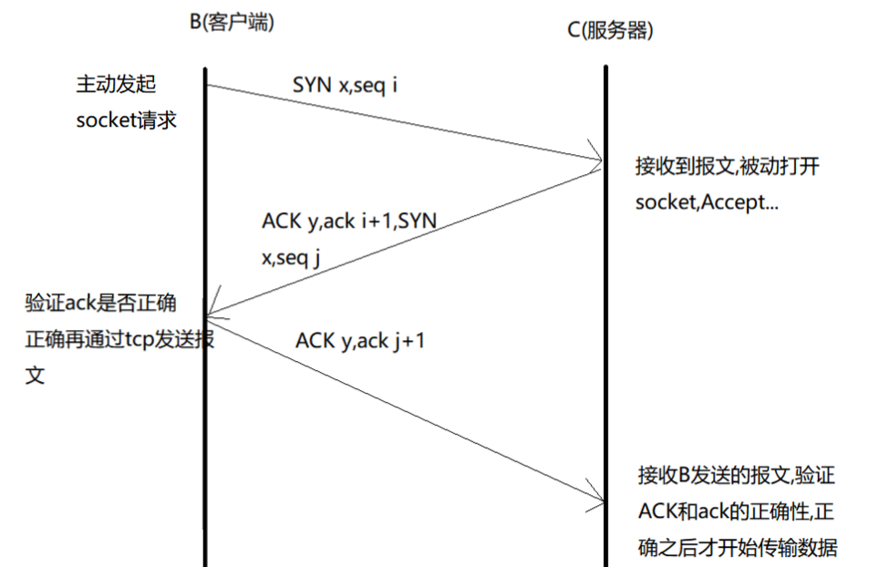
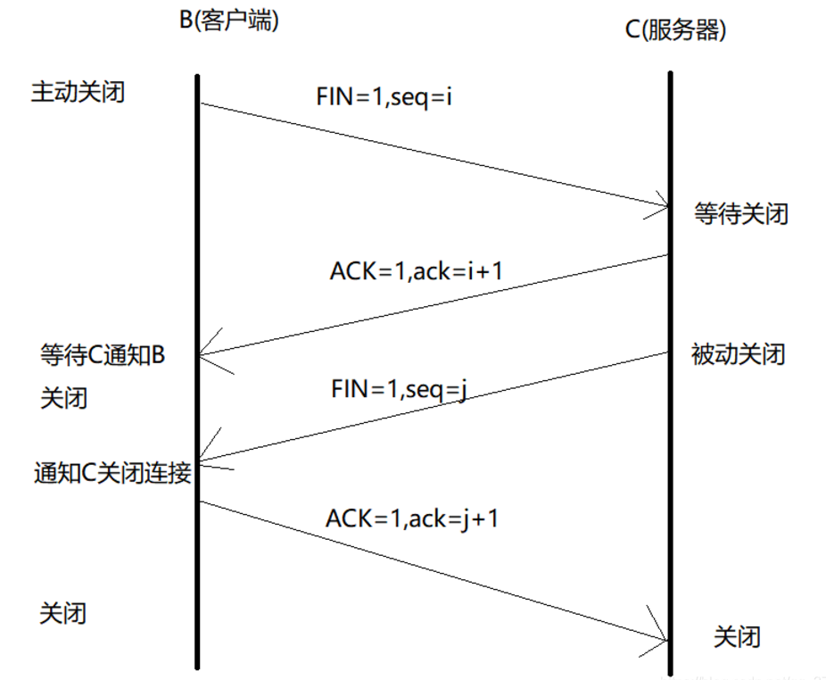

## HTTP协议三次握手跟四次挥手

HTTP是通过tcp协议来完成的,位码即tcp标志位：

SYN(synchronous建立联机)

ACK(acknowledgement 确认) 

PSH(push传送) 

FIN(finish结束) 

RST(reset重置) 

URG(urgent紧急)

Sequence number(顺序号码) 

Acknowledge number(确认号码)

### 一、建立连接-三次握手

1、第一次握手：B通过tcp协议发送一个带有SYN（建立联机）和seq（序列号）的报文到C，表示B要准备连接服务器C了。这里的SYN就是表示的B，是它的唯一标识，可能同时有很多的B来连接服务器，就是通过SYN来识别到底是哪一个客户端。seq就是一个随机的序列号。

2、第二次握手：C接收到B发送的报文之后，知道你这个客户端要来请求我，确认连接信息之后，C就给B发送一个报文，报文内容包含SYN、seq、ACK、ack。SYN就是第一次握手B发送过来的，seq序列号此时要重新生成跟第一次握手的seq区别开，ACK就是表示C，一个确认标识，标识C知道你要来连接了，ack=第一次握手的seq+1。

3、第三次握手：B接受到C的回复报文之后，确认ack的正确性，正确则向C发送tcp报文,报文包含ACK,ack number = 第二次握手C向B发送的seq+1,C接受到之后确认ack的正确性,正确就开始传输数据。

**为什么连接的时候要进行3次握手呢?**

 很简单的问题,如果有的连接在B发送给C第一次报文之后,断网了或者是浏览器关闭了,或者是其他的一些原因导致客户端丢失了,这种情况为了避免造成资源的浪费,减轻服务器的压力,对于这种请求就没有必要进行连接.

### 二、终止连接-四次挥手

1、第一次挥手：客户端发送tcp报文给服务器,表明我要终止连接了,tcp报文包含FIN(finish结束)标识,seq同样的seq是随机生成的

2、第二次挥手：C收到B发送的终止连接标识之后,会先返回给B一个ACK(确认)和ack number(确认号码)=第一次握手的seq+1,告诉B我已经收到你的终止请求,请确认是不是要终止连接.

3、第三次挥手：这个时候也是C向B发送报文,可能C在收到B的终止信号的时候正在进行一些数据传输,所以要先发送一个确认信号给B告知我接收到了,放数据传输完成结束之后,C再给B发送tcp报文,包含FIN和seq(随机生成)

4、第四次挥手：B接收到C发送的FIN和seq之后,会进行信息验证,验证ack number是否正确,正确就想C发送确认报文,包含ACK和ack=第三次握手的seq+1.服务器接受到之后验证成功之后才真正的算是结束连接了。

**为什么结束连接的时候也要进行多次握手呢?**

在刚刚解释第三次握手的时候有提到,当客户端想断开连接的时候之所以不能马上就断开连接是因为可能我这个时候还存在数据没有传输完成,这个时候最好是等数据传输完成了之后再断开连接。

### SYN攻击

还有一个就是黑客攻击的问题,简单聊一下,在黑客攻击的手法中SYN攻击就是最常见也是最容易的一种,SYN攻击说白了就是利用tcp协议的缺陷,通过发送大量半连接的请求,耗费大量的CPU和资源。SYN除了能攻击主机服务器之外，包括防火墙、路由器等能够打开tcp服务的系统都能被攻击。大家想一下就知道这个攻击的流程了，因为http连接是要经过3次握手的,黑客可以通过一些手段伪造大量的ip地址,并且发送大量的http请求,服务器接受到连接请求(SYN)之后,会返回确认ACK,

这个时候问题就来了,因为ip地址都是虚拟的,不是真实存在的,客户端是接受不到的,所以服务器就会一直重发直到超时.所以大量的伪造的SYN包将长时间占用未连接队列,让人家真实的请求一直等着进不来,这就会造成系统运行缓慢,严重的可能引起系统堵塞甚至于体统瘫痪.

当然也有应对的办法:

1、通过防火墙、路由器等过滤网关防护。

2、通过TCP/IP协议栈

然而，这些防护办法是不可能完全阻止SYN攻击，能做的也只是减少SYN攻击。
