编写软件过程中，程序员面临着来自**耦合性，内聚性以及可维护性，可扩展性，重用性，灵活性**等多方面的挑战，设计模式是为了让程序(软件)，具有更好：

- 代码重用性 (即：相同功能的代码，不用多次编写)
- 可读性 (即：编程规范性, 便于其他程序员的阅读和理解)
- 可扩展性 (即：当需要增加新的功能时，非常的方便，称为可维护)
- 可靠性 (即：当我们增加新的功能后，对原来的功能没有影响)
- 使程序呈现**高内聚，低耦合**的特性

# 一、七大原则

设计模式原则，其实就是程序员在编程时，应当遵守的原则，也是各种设计模式的基础

## 1.1 单一职责原则

### 概述

**一个类应该只负责一项职责**。如果一个类负责两个职责，那么修改其中一个职责的功能时，可能会影响另一个职责。

### 示例

方案一：

```java
/**
 * 示例单一原则
 * @author cVzhanshi
 * @create 2023-01-29 20:23
 */
public class single {
    public static void main(String[] args) {
        Vehicle vehicle = new Vehicle();
        vehicle.run("摩托车");
        vehicle.run("轮船");
        vehicle.run("飞机");
    }
}


class Vehicle{
    public void run (String vehicle){
        System.out.println(vehicle + "在公路上走...");
    }
}

// 运行结果
// 摩托车在公路上走...
// 轮船在公路上走...
// 飞机在公路上走...
```

分析：

1. 在示例一的 run 方法中，违反了单一职责原则
2. 解决的方案非常的简单，根据交通工具运行方法不同，分解成不同类即可

方案二：

```java
class RoadVehicle {
    public void run(String vehicle) {
        System.out.println(vehicle + "公路运行");
    }
}
class AirVehicle {
    public void run(String vehicle) {
        System.out.println(vehicle + "天空运行");
    }
}

class WaterVehicle {
    public void run(String vehicle) {
        System.out.println(vehicle + "水中运行");
    }
}
```

分析：

1. 遵守单一职责原则
2. 改动很大，即将类分解，同时修改客户端
3. 改进：直接修改 Vehicle 类，改动的代码会比较少

方案三：

```java
class Vehicle2 {
    public void run(String vehicle) {
        //处理
        System.out.println(vehicle + " 在公路上运行....");
    }
    public void runAir(String vehicle) {
        System.out.println(vehicle + " 在天空上运行....");
    }
    public void runWater(String vehicle) {
        System.out.println(vehicle + " 在水中行....");
    }
}
```

分析：

1. 这种修改方法没有对原来的类做大的修改，只是增加方法
2. 这里虽然没有在类这个级别上遵守单一职责原则，但是在方法级别上，仍然是遵守单一职责

### 单一职责原则注意事项和细节

- 降低类的复杂度，一个类只负责一项职责。
- 提高类的可读性，可维护性
- 降低变更引起的风险
- 通常情况下，我们应当遵守单一职责原则，只有逻辑足够简单，才可以在代码级违反单一职责原则；只有类中方法数量足够少，可以在方法级别保持单一职责原则（如上述的方案三，如果方案三还有其他的方法，那么就违反了单一职责原则）

## 1.2 接口隔离原则

### 概述

**客户端不应该依赖它不需要的接口，即一个类对另一个类的依赖应该建立在最小的接口上**

### 示例

说明：

- 接口A中有五个方法
- 类D依赖类B使用到了接口中的1，2，3方法
- 类E依赖类C使用到了接口中的1，4，5方法

```java
/**接口隔离原则示例
 * @author cVzhanshi
 * @create 2023-01-30 15:44
 */
public class demo01 {
    public static void main(String[] args) {
        B b = new B();
        D d = new D();
        d.depend1(b);
        d.depend2(b);
        d.depend3(b);

        C c = new C();
        E e = new E();
        e.depend1(c);
        e.depend4(c);
        e.depend5(c);

    }
}

class D{
    public void depend1(A a){
        a.function1();
    }
    public void depend2(A a){
        a.function2();
    }
    public void depend3(A a){
        a.function3();
    }
}

class E{
    public void depend1(A a){
        a.function1();
    }
    public void depend4(A a){
        a.function4();
    }
    public void depend5(A a){
        a.function5();
    }
}


class C implements A{
    @Override
    public void function1() {
        System.out.println("C 实现了 function1");
    }

    @Override
    public void function2() {
        System.out.println("C 实现了 function2");
    }

    @Override
    public void function3() {
        System.out.println("C 实现了 function3");
    }

    @Override
    public void function4() {
        System.out.println("C 实现了 function4");
    }

    @Override
    public void function5() {
        System.out.println("C 实现了 function5");
    }
}


class B implements A{

    @Override
    public void function1() {
        System.out.println("B 实现了 function1");
    }

    @Override
    public void function2() {
        System.out.println("B 实现了 function2");
    }

    @Override
    public void function3() {
        System.out.println("B 实现了 function3");
    }

    @Override
    public void function4() {
        System.out.println("B 实现了 function4");
    }

    @Override
    public void function5() {
        System.out.println("B 实现了 function5");
    }
}

interface A{
    void function1();
    void function2();
    void function3();
    void function4();
    void function5();
}
```

分析：

- 如果接口A对于类D和类E来说不是最小接口，那么类 B 和类 C 必须去实现他们不需要的方法。所以违反了接口隔离原则

- 改进：将接口A拆分为独立的几个接口，类 D 和类E 分别与他们需要的接口建立依赖关系。采用接口隔离原则

- 拆分详情：

  - 接口A存在方法1，因为类D，E都使用了
  - 接口B存在方法2，3，因为类D单独使用了
  - 接口C存在方法4，5，因为类E单独使用了

  这样的话类D、E依赖的类就不需要实现他们不需要的方法了

示例代码

```java
/**
 * 接口隔离原则示例
 * @author cVzhanshi
 * @create 2023-01-30 15:57
 */
public class demo02 {
    public static void main(String[] args) {
        D d = new D();
        E e = new E();
        F f = new F();
        G g = new G();
        
        d.depend1(f);
        d.depend2(f);
        d.depend3(f);
        
        e.depend1(g);
        e.depend4(g);
        e.depend5(g);
    }
}

class D{
    public void depend1(F f){
        f.function1();
    }

    public void depend2(F f){
        f.function2();
    }

    public void depend3(F f){
        f.function3();
    }
}

class E{
    public void depend1(G g){
        g.function1();
    }

    public void depend4(G g){
        g.function4();
    }

    public void depend5(G g){
        g.function5();
    }
}

// 依赖类
class F implements A, B{

    @Override
    public void function1() {
        System.out.println("F 实现了 function1");
    }

    @Override
    public void function2() {
        System.out.println("F 实现了 function2");
    }

    @Override
    public void function3() {
        System.out.println("F 实现了 function3");
    }
}

// 依赖类
class G implements A, C{

    @Override
    public void function1() {
        System.out.println("G 实现了 function1");
    }

    @Override
    public void function4() {
        System.out.println("G 实现了 function4");
    }

    @Override
    public void function5() {
        System.out.println("G 实现了 function5");
    }
}

interface A{
    void function1();
}

interface B{
    void function2();
    void function3();
}

interface C{
    void function4();
    void function5();
}
```

## 1.3 依赖倒转原则

### 概述

- 高层模块不应该依赖低层模块，二者都应该依赖其抽象
- **抽象不应该依赖细节，细节应该依赖抽象**
- 依赖倒转(倒置)的中心思想是**面向接口编程**
- 依赖倒转原则是基于这样的设计理念：相对于细节的多变性，抽象的东西要稳定的多。以抽象为基础搭建的架构比以细节为基础的架构要稳定的多。在 java 中，抽象指的是接口或抽象类，细节就是具体的实现类
- 使用**接口或抽象类的目的是制定好规范**，而不涉及任何具体的操作，把**展现细节的任务交给实现类**去完成

### 示例

示例一：

```java
/**
 * 依赖倒转原则示例
 * @author cVzhanshi
 * @create 2023-01-30 20:24
 */
public class demo01 {
    public static void main(String[] args) {
        Person person = new Person();
        person.receive(new Email());
    }
}

class Email{
    public String getInfo(){
        return "电子邮箱信息：hello";
    }
}


class Person{
    public void receive(Email email){
        System.out.println(email.getInfo());
    }
}
```

分析：

1. 如果我们要获取微信，短信等等的信息，则需要新增类，同时 Perons 也要增加相应的接收方法
2. **改进**：引入一个抽象的接口 IReceiver, 表示接收者, **这样 Person 类与接口 IReceiver 发生依赖**。Email, WeiXin 等等属于接收的范围，他们各自实现 IReceiver 接口就可以了，这样**客户端不需要改变**。这样我们就符合依赖倒转原则

示例二：

```java
/**
 * @author cVzhanshi
 * @create 2023-01-30 20:31
 */
public class demo02 {
    public static void main(String[] args) {
        Person person = new Person();
        person.receive(new WeChat());
        person.receive(new Email());
    }
}

interface IReceive{
    String getInfo();
}

class Email implements IReceive{
    @Override
    public String getInfo() {
        return "电子邮箱信息：hello";
    }
}

class WeChat implements IReceive{
    @Override
    public String getInfo() {
        return "微信信息：weChat";
    }
}

class Person{
    public void receive(IReceive receive){
        System.out.println(receive.getInfo());
    }
}
```

### 依赖关系传递的三种方式

> 接口传递

```java
/**
 * @author cVzhanshi
 * @create 2023-01-30 20:31
 */
public class demo02 {
    public static void main(String[] args) {
        Person person = new Person();
        person.receive(new WeChat());
        person.receive(new Email());
    }
}

interface IReceive{
    String getInfo();
}

class Email implements IReceive{
    @Override
    public String getInfo() {
        return "电子邮箱信息：hello";
    }
}

class WeChat implements IReceive{
    @Override
    public String getInfo() {
        return "微信信息：weChat";
    }
}

class Person{
    public void receive(IReceive receive){
        System.out.println(receive.getInfo());
    }
}
```

> 构造方法传递

```java
/**
 * @author cVzhanshi
 * @create 2023-01-30 20:31
 */
public class demo02 {
    public static void main(String[] args) {
        EmailClass emailClass = new EmailClass();
        Person person = new Person(emailClass);
        person.getInfo();

    }
}

interface IReceive{
    void getInfo();
}

interface Email{
    public void getMessage();
}

class EmailClass implements Email{

    @Override
    public void getMessage() {
        System.out.println("EmailClass messages");
    }
}

class Person implements IReceive{
    private Email email;

    public Person(Email email) {
        this.email = email;
    }

    @Override
    public void getInfo() {
        email.getMessage();
    }
}
```

> 通过setter方法传递

```java
/**
 * @author cVzhanshi
 * @create 2023-01-30 20:31
 */
public class demo02 {
    public static void main(String[] args) {
        EmailClass emailClass = new EmailClass();
        Person person = new Person();
        person.setEmail(emailClass);
        person.getInfo();

    }
}

interface IReceive{
    void getInfo();
}

interface Email{
    public void getMessage();
}

class EmailClass implements Email{

    @Override
    public void getMessage() {
        System.out.println("EmailClass messages");
    }
}

class Person implements IReceive{
    private Email email;

    public void setEmail(Email email) {
        this.email = email;
    }

    @Override
    public void getInfo() {
        email.getMessage();
    }
}
```

### 依赖倒转原则的注意事项和细节

- 低层模块尽量都要有抽象类或接口，或者两者都有，程序稳定性更好
- **变量的声明类型尽量是抽象类或接口**, 这样我们的变量引用和实际对象间，就存在一个缓冲层，利于程序扩展和优化
- 继承时遵循**里氏替换**原则

## 1.4 里氏替换原则

### 概述

继承在给程序设计带来便利的同时，也带来了弊端。比如使用继承会给程序带来**侵入性**，**程序的可移植性降低，增加对象间的耦合性**，如果一个类被其他的类所继承， 则当这个类需要修改时，必须考虑到所有的子类，并且父类修改后，所有涉及到子 类的功能都有可能产生故障。

**里氏替换原则**

- 所有引用基类的地方必须能透明地使用其子类的对象

- 在使用继承时，遵循里氏替换原则，在子类中尽量不要重写父类的方法
- 继承实际上让两个类耦合性增强了，在适当的情况下，**可以通过聚合，组合，依赖来解决问题**。

就是说，**使用继承不要去破坏原有的东西，不要给程序带来侵入性。**

### 示例

示例一：

```java
public class demo01 {
    public static void main(String[] args) {
        A a = new A();
        System.out.println("11-3=" + a.func1(11, 3));  // 11-3=8
        System.out.println("1-8=" + a.func1(1, 8));    // 1-8=-7
        System.out.println("-----------------------");
        B b = new B();
        System.out.println("11-3=" + b.func1(11, 3));   // 11-3=14    
        System.out.println("1-8=" + b.func1(1, 8));     // 1-8=9
        System.out.println("11+3+9=" + b.func2(11, 3)); // 11+3+9=23
    }
}

class A {
    public int func1(int num1, int num2) {
        return num1 - num2;
    }
}


class B extends A {
    public int func1(int a, int b) {
        return a + b;
    }

    public int func2(int a, int b) {
        return func1(a, b) + 9;
    }
}
```

说明：因为类B不知情的情况下重写了类A的方法，把类A 的减法变成加法。导致了main函数类B想使用减法是出错。这就是继承带来的侵入性。

**改造：**原来的父类和子类都继承一个更通俗的基类，原有的继承关系去掉， 采用依赖，聚合，组合等关系代替.

```java
public class demo02 {
    public static void main(String[] args) {
        A a = new A();
        System.out.println("11-3=" + a.func1(11, 3));  // 11-3=8
        System.out.println("1-8=" + a.func1(1, 8));    // 1-8=-7
        System.out.println("-----------------------");
        B b = new B();
        System.out.println("11-3=" + b.func3(11, 3));   // 11-3=8
        System.out.println("1-8=" + b.func3(1, 8));     // 1-8=-7
        System.out.println("11+3+9=" + b.func2(11, 3)); // 11+3+9=23
    }
}

class Base {

}
class A extends Base {
    public int func1(int num1, int num2) {
        return num1 - num2;
    }
}


class B extends Base {
    private A a = new A();
    public int func1(int a, int b) {
        return a + b;
    }

    public int func2(int a, int b) {
        return func1(a, b) + 9;
    }

    public int func3(int a, int b) {
        return this.a.func1(a, b);
    }
}
```

## 1.5 开闭原则

### 概述

- 模块和函数应该**对扩展开放(对提供方)，对修改关闭(对使用方)**。用抽象构建框架，用实现扩展细节。
-  当软件需要变化时，尽量**通过扩展软件实体的行为来实现变化，而不是通过修改已有的代码来实现变化**。

### 示例

代码示例一：

```java
public class demo01 {
    public static void main(String[] args) {
        GraphicEditor graphicEditor = new GraphicEditor();
        graphicEditor.drawShape(new Rectangle());
        graphicEditor.drawShape(new Circle());
    }
}

// 使用方  这是一个用于绘图的类
class GraphicEditor {
    public void drawShape(Shape s) {
        if (s.m_type == 1)
            drawRectangle(s);
        else if (s.m_type == 2)
            drawCircle(s);
    }

    public void drawRectangle(Shape r) {
        System.out.println("矩形");
    }

    public void drawCircle(Shape r) {
        System.out.println("圆形");
    }
}

class Shape {
    int m_type;
}

class Rectangle extends Shape {
    Rectangle() {
        super.m_type = 1;
    }
}

class Circle extends Shape {
    Circle() {
        super.m_type = 2;
    }
}
```

说明：

- 优点是比较好理解，简单易操作。 
- 缺点是违反了设计模式的ocp原则，即对扩展开放(提供方)，对修改关闭(使用方)。 即当我们给类增加新功能的时候，尽量不修改代码，或者尽可能少修改代码.
- 比如我们这时要新增加一个图形种类三角形，我们需要做如下修改，修改的地方较多
  - GraphicEditor类中的方法都需要修改
  - 增加一个三角形的类继承shape


**修改**：思路：把创建Shape类做成抽象类，并提供一个抽象的draw方法，让子类去实现即可， 这样我们有新的图形种类时，只需要让新的图形类继承Shape，并实现draw方法即可， 使用方的代码就不需要修 -> 满足了开闭原则

```java
/**
 * @author cVzhanshi
 * @create 2023-03-14 10:12
 */
public class demo02 {
    public static void main(String[] args) {
        Editor editor = new Editor();

        editor.drawShape(new A());
        editor.drawShape(new B());
    }
}

class Editor{
    public void drawShape(Shape s){
        s.draw();
    }
}
abstract class Shape{
    public abstract void draw();
}

class A extends Shape {
    @Override
    public void draw() {
        System.out.println("画A");
    }
}

class B extends Shape {
    @Override
    public void draw() {
        System.out.println("画B");
    }
}
```

## 1.6 迪米特法则

### 概述

- 一个对象应该对其他对象保持最少的了解
- 类与类关系越密切，耦合度越大
- 迪米特法则(Demeter Principle)又叫最少知道原则，即一个类对自己依赖的类知道的越少越好。也就是说，对于被依赖的类不管多么复杂，都尽量将逻辑封装在类的内部。对外除了提供的public 方法，不对外泄露任何信息。
- 迪米特法则还有个更简单的定义：**只与直接的朋友通信**

**直接的朋友**：每个对象都会与其他对象有耦合关系，只要两个对象之间有耦合关系， 我们就说这两个对象之间是朋友关系。耦合的方式很多，依赖，关联，组合，聚合等。其中，我们称出现**成员变量，方法参数，方法返回值中的类为直接的朋友**，而出现在局部变量中的类不是直接的朋友。也就是说，**陌生的类最好不要以局部变量的形式出现在类的内部**。

### 示例

错误示例，违背了迪米特法则

```java
class Test {
    public void test() {
        System.out.println("测试");
    }
}


class Apple {
    public void test() {
        // 陌生的类最好不要以局部变量的形式出现在类的内部
        Test test = new Test();
        test.test();
    }
}
```

改正

```java
class Test {
    public void test() {
        System.out.println("测试");
    }
}


class Apple {
    public void test(Test test) {
        test.test();
    }
}
```

**迪米特法则注意事项和细节**

- 迪米特法则的核心是降低类之间的耦合。
- 但是注意：由于每个类都减少了不必要的依赖，因此迪米特法则只是要求降低类间(对象间)耦合关系， 并不是要求完全没有依赖关系。

## 1.7 合成复用原则

**尽量使用合成或者聚合 的方式，而不是使用聚合**

## 1.8 设计原则核心思想

- **找出应用中可能需要变化之处，把它们独立出来，不要和那些不需要变化的代码混在一起**。
- **针对接口编程**，而不是针对实现编程。 
- **为了交互对象之间的松耦合设计而努力**。

# 二、UML类图

> 用于描述系统中的类(对象)本身的组成和类(对象)之间的各种静态关系
>
> 类之间的关系：依赖、泛化（继承）、实现、关联、聚合与组合

- **类**：类图分三层，第一层是类名，如果是抽象类就用斜体表示；第二层代表属性或字段；第三层是类的操作即方法，方法前面会用符号表示权限修饰符，‘+’表示public，‘-’表示private，‘#’表示protected。

  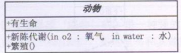

- **接口**：接口和类图的区别是顶端有`<<interface>>`显示，第二行表示的是接口的方法；接口还有第二种表示方法（**棒棒糖表示法**），圆圈边上表示接口名称，接口的方法再实现类里面。

  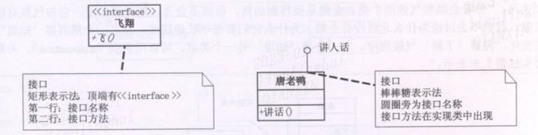

- **继承关系**：**空心三角形 + 实线**

  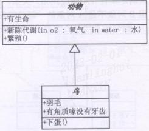

- **实现关系**：**空心三角形 + 虚线**

  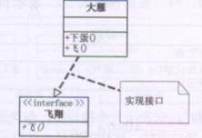

- **关联关系**：**实线 + 箭头**

  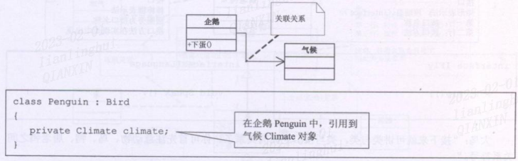

- **聚合关系**：空心的菱形 + 实现箭头；聚合表示一种弱的”拥有“关系，体现的是A对象可以包含B对象，但B对象不是A对象一部分

  **空心菱形 + 实线箭头表示**

  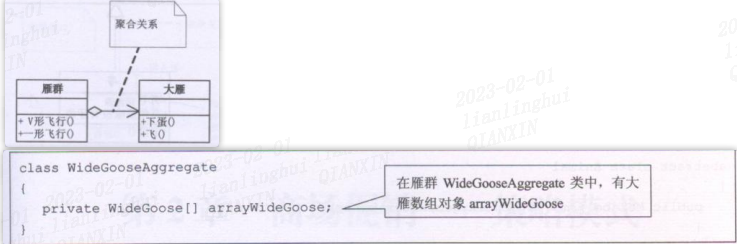

- **组合(合成)关系**：组成是一种强的“拥有”关系，体现了严格的部分和整体的关系，**部分和整体的生命周期一样**。组合关系（关联关系和聚合关系也可以有基数）还具备基数的，表示对应关系。

  **实心的菱形 + 实线箭头** 

  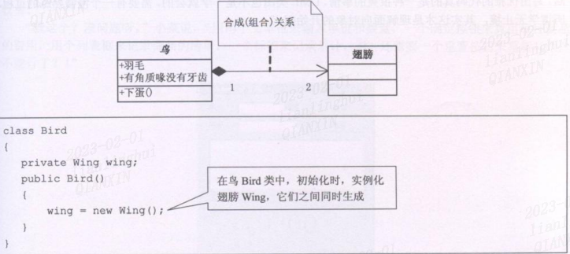

- **依赖关系**：**虚线 + 箭头**

  如：类中用到了对方、成员属性、方法的返回类型、方法接收的参数类型、方法中使用到

  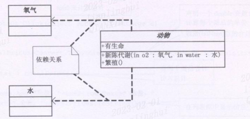

  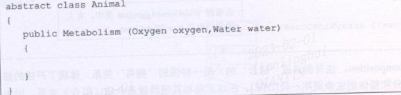
  

# 三、设计模式简介

- 设计模式是程序员在面对同类软件工程设计问题所总结出来的有用的经验， 模式不是代码，而是某类问题的通用解决方案，设计模式（Design pattern） 代表了最佳的实践。
- 设计模式的本质提高软件的维护性，通用性和扩展性，并降低软件的复杂度。

> 设计模式分为三种类型，共23种

- 创建型模式：**单例模式**、抽象工厂模式、原型模式、建造者模式、**工厂模式**。
- 结构型模式：适配器模式、桥接模式、**装饰模式**、组合模式、外观模式、享元模式、代理模式。
- 行为型模式：模版方法模式、命令模式、访问者模式、迭代器模式、**观察者模式**、中介者模式、备忘录模式、解释器模式（Interpreter模式）、状态模 式、策略模式、职责链模式(责任链模式)。

# 四、单例模式

**所谓类的单例设计模式，就是采取一定的方法保证在整个的软件系统中，对某个类只能存在一个对象实例，并且该类只提供一个取得其对象实例的方法(静态方法)。**

## 4.1 饿汉式

- 构造器私有化 (防止 new )
- 类的内部创建对象 
- 向外暴露一个静态的公共方法。getInstance
- 代码实现

### 静态变量

```java
class Singleton_01 {
    // 私有化构造器
    private Singleton_01() {

    }
    // 类内部构建对象
    private final static Singleton_01 instance = new Singleton_01();

    // 向外暴露一个对外的静态方法获取到示例
    public static Singleton_01 getInstance() {
        return instance;
    }
}
```

- 优点：在类装载的时候就完成实例化。避免了线程同步问题
- 缺点：在类装载的时候就完成实例化，没有达到Lazy Loading的效果。如果从始至终从未使用过这个实例，则会造成内存的浪费

这种单例模式**不可用，可能**造成**内存浪费**

### 静态代码块

```
class Singleton_02 {

    private static Singleton_02 instance;

    static {
        instance = new Singleton_02();
    }

    private Singleton_02() {

    }

    // 向外暴露一个对外的静态方法获取到示例
    public static Singleton_02 getInstance() {
        return instance;
    }
}
```

这种单例模式优缺点和静态变量的一样。也是在类加载的时候进行实例化，可能会造成内存浪费的问题，也没有达到懒加载的效果。

## 4.2 懒汉式

### 线程不安全

```java
// 线程不安全，只能单线程
class Singleton02_01 {

    private static Singleton02_01 instance;
    private Singleton02_01() {

    }

    // 向外暴露一个对外的静态方法获取到示例
    public static Singleton02_01 getInstance() {
        if (instance == null) {
            instance = new Singleton02_01();
        }
        return instance;
    }
}
```

- 起到了Lazy Loading的效果，但是只能在单线程下使用。
- 如果有多个线程进入到if中，就会产生多个示例。
- 不推荐使用

### 同步方法线程安全

```java
// 同步方法线程安全
class Singleton02_02 {

    private static Singleton02_02 instance;
    private Singleton02_02() {

    }

    // 向外暴露一个对外的静态方法获取到示例
    public static synchronized Singleton02_02 getInstance() {
        if (instance == null) {
            instance = new Singleton02_02();
        }
        return instance;
    }
}
```

- 解决了线程安全的问题
- 效率低，每个线程在想获得类的实例时候，执行getInstance()方法都要进行同步。而其实这个方法只执行一次实例化代码就够了，后面的想获得该类实例， 直接return就行了。方法进行同步效率太低。

### 同步代码块线程安全

```java
// 同步代码块线程安全
class Singleton02_03 {

    private static Singleton02_03 instance;
    private Singleton02_03() {

    }

    // 向外暴露一个对外的静态方法获取到示例
    public static Singleton02_03 getInstance() {
        if (instance == null) {
            synchronized (Singleton02.class) {
                instance = new Singleton02_03();
            }
        }
        return instance;
    }
}
```

- 此方法的单例看上去虽然是对同步方法线程安全的改进，但是改完之后多线程下就有可能破坏单例。
- 如果两个线程同时进入到if内被阻塞住，那么最后会有两个或者多个实例。

### 双重检测

```java
// 双重检测
class Singleton02_04 {

    private static Singleton02_04 instance;
    private Singleton02_04() {

    }

    // 向外暴露一个对外的静态方法获取到示例
    public static Singleton02_04 getInstance() {
        if (instance == null) {
            synchronized (Singleton02.class) {
                if (instance == null) {
                    instance = new Singleton02_04();
                }
            }
        }
        return instance;
    }
}
```

- 解决了效率低、线程安全等问题
- 也达到了懒加载的效果
- **推荐使用**

==其实双重检测也不是绝对安全的==，因为instance = new Singleton02_04()不是一个原子性操作。

分析：instance = new Singleton02_04()不是一个原子性操作
instance = new Singleton02_04()的执行步骤
1、分配内存空间
2、执行构造方法，初始化对象
3、把这个对象指向这个空间
可能由于指令重排 把执行顺序变成 1-3-2
造成的结果：**线程A还没有初始化对象，线程B获取对象是instance !=null就返回对象，此时instance 还没有完成构造**

==最终的DCL单例模式==

```java
// 双重检测
class Singleton02_04 {

    // + volatile 防止指令重排
    private volatile static Singleton02_04 instance;
    
    private Singleton02_04() {

    }

    // 向外暴露一个对外的静态方法获取到示例
    public static Singleton02_04 getInstance() {
        if (instance == null) {
            synchronized (Singleton02.class) {
                if (instance == null) {
                    instance = new Singleton02_04();
                }
            }
        }
        return instance;
    }
}
```

**看后面的4.5能发现DCL也不是绝对安全的**

## 4.3 静态内部类

```java
/**
 * 静态内部类
 * @author cVzhanshi
 * @create 2023-03-27 10:24
 */
public class Singleton03 {
    // 私有化构造器
    private Singleton03() {
    }

    private static class SingletonInstance {
        private static final Singleton03 INSTANCE = new Singleton03();
    }

    // 向外暴露一个对外的静态方法获取到示例
    public static Singleton03 getInstance() {
        return SingletonInstance.INSTANCE;
    }
}
```

- 这种方式采用了类装载的机制来保证初始化实例时只有一个线程。
- 静态内部类方式在Singleton类被装载时并不会立即实例化，而是在需要实例化时，调用getInstance方法，才会装载SingletonInstance类，从而完成Singleton的实例化。
- 类的静态属性只会在第一次加载类的时候初始化，所以在这里，JVM帮助我们保证了线程的安全性，在类进行初始化时，别的线程是无法进入的。
- 避免了线程不安全，利用静**态内部类特点实现延迟加载，效率高**
- **推荐使用**

## 4.4 枚举

```java
enum Singleton04_01 {
    INSTANCE;
    public void isOk() {
        System.out.println("ok");
    }
}
```

- 能避免多线程同步问题，而且还能防止反序列化（反射）重新创建新的对象。
- **推荐使用。**

## 4.5 反射让单例不安全

> 单例不安全（因为反射）

- 情况1：第一个对象通过类去得到，第二个对象通过反射通过构造器造对象，破坏单例

  - 代码示例：

  ```java
  public class LazyMan {
  
      // 私有化构造器
      private LazyMan(){
          System.out.println(Thread.currentThread().getName() + "ok");
      }
  
      // + volatile 防止指令重排
      private volatile static LazyMan lazyMan;
  
      // 双重检测锁模式的懒汉式单例 --> DCL懒汉式
      public static LazyMan getInstance(){
          if(lazyMan == null){
              synchronized (LazyMan.class){
                  if(lazyMan == null){
                      lazyMan = new LazyMan(); // 不是一个原子性操作
                  }
              }
          }
          return lazyMan;
      }
  
      public static void main(String[] args) throws NoSuchMethodException, IllegalAccessException, InvocationTargetException, InstantiationException {
          // 单线程下绝对正确且安全，但是在多线程下不安全
          LazyMan lazyMan = LazyMan.getInstance();
          Constructor<LazyMan> declaredConstructor = LazyMan.class.getDeclaredConstructor(null);
          declaredConstructor.setAccessible(true);
          LazyMan lazyMan1 = declaredConstructor.newInstance();
          System.out.println(lazyMan);
          System.out.println(lazyMan1);
      }
  }
  ```

  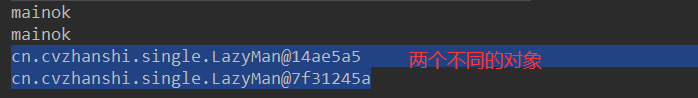

  - 解决办法：可以在构造器中添加判断

  ```java
  ...
  private LazyMan(){
      if(lazyMan != null){
          throw new RuntimeException("不要试图通过反射破坏单例");
      }
      System.out.println(Thread.currentThread().getName() + "ok");
  }
  ...//省略的代码和上面一样
  ```

  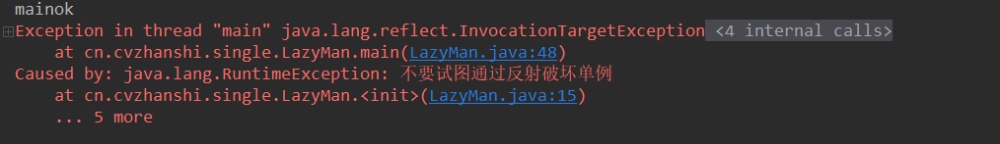

- 情况二：两个对象都通过反射得到

  ```java
  /**
   * @author cVzhanshi
   * @create 2021-09-26 10:22
   */
  public class LazyMan {
  
      // 私有化构造器
      private LazyMan(){
          if(lazyMan != null){
              throw new RuntimeException("不要试图通过反射破坏单例");
          }
          System.out.println(Thread.currentThread().getName() + "ok");
      }
  
      // + volatile 防止指令重排
      private volatile static LazyMan lazyMan;
  
      // 双重检测锁模式的懒汉式单例 --> DCL懒汉式
      public static LazyMan getInstance(){
          if(lazyMan == null){
              synchronized (LazyMan.class){
                  if(lazyMan == null){
                      lazyMan = new LazyMan(); // 不是一个原子性操作
                  }
              }
          }
          return lazyMan;
      }
  
      public static void main(String[] args) throws NoSuchMethodException, IllegalAccessException, InvocationTargetException, InstantiationException {
          // 单线程下绝对正确且安全，但是在多线程下不安全
          Constructor<LazyMan> declaredConstructor = LazyMan.class.getDeclaredConstructor(null);
          declaredConstructor.setAccessible(true);
          LazyMan lazyMan = declaredConstructor.newInstance();
          LazyMan lazyMan1 = declaredConstructor.newInstance();
          System.out.println(lazyMan);
          System.out.println(lazyMan1);
      }
  }
  
  ```

  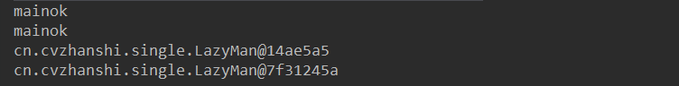

  原因：**对象都通过反射得到，导致原类中的LazyMan没有被构造且一直为null**，所以都能通过构造器里面的判断

  解决方案：设置一个红绿灯（一个标志，非当前对象）来判断

  ```java
  /**
   * @author cVzhanshi
   * @create 2021-09-26 10:22
   */
  public class LazyMan {
  
      private static boolean cvzhanshi = false;
  
      // 私有化构造器
      private LazyMan(){
         synchronized (LazyMan.class){
             if(cvzhanshi == false){
                 cvzhanshi = true;
             }else{
                 throw new RuntimeException("不要试图通过反射破坏单例");
             }
         }
         System.out.println(Thread.currentThread().getName() + "ok");
      }
  
      // + volatile 防止指令重排
      private volatile static LazyMan lazyMan;
  
      // 双重检测锁模式的懒汉式单例 --> DCL懒汉式
      public static LazyMan getInstance(){
          if(lazyMan == null){
              synchronized (LazyMan.class){
                  if(lazyMan == null){
                      lazyMan = new LazyMan(); // 不是一个原子性操作
                      /**
                       * lazyMan = new LazyMan();的执行步骤
                       * 1、分配内存空间
                       * 2、执行构造方法，初始化对象
                       * 3、把这个对象指向这个空间
                       * 可能由于指令重排 把执行顺序变成 1-3-2
                       * 造成的结果：线程A还没有初始化对象，线程B获取对象是lazyMan!=null就返回对象，此时lazyMan还没有完成构造
                       */
                  }
              }
          }
          return lazyMan;
      }
  
      public static void main(String[] args) throws NoSuchMethodException, IllegalAccessException, InvocationTargetException, InstantiationException {
          // 单线程下绝对正确且安全，但是在多线程下不安全
          Constructor<LazyMan> declaredConstructor = LazyMan.class.getDeclaredConstructor(null);
          declaredConstructor.setAccessible(true);
          LazyMan lazyMan = declaredConstructor.newInstance();
          LazyMan lazyMan1 = declaredConstructor.newInstance();
          System.out.println(lazyMan);
          System.out.println(lazyMan1);
      }
  }
  ```

  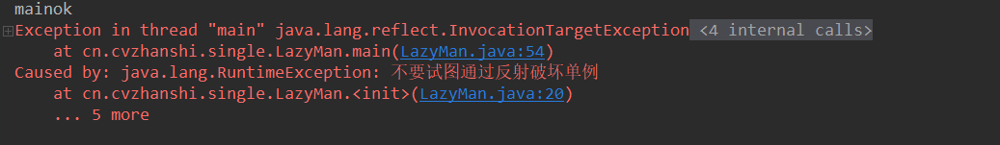

- 情况三：在二的基础上那个“红绿灯”被破解了，也通过反射进行修改，进而破坏单例

  ```java
  ...
  public static void main(String[] args) throws NoSuchMethodException, IllegalAccessException, InvocationTargetException, InstantiationException, NoSuchFieldException {
      // 单线程下绝对正确且安全，但是在多线程下不安全
      Constructor<LazyMan> declaredConstructor = LazyMan.class.getDeclaredConstructor(null);
      // 获取cvzhanshi属性
      Field cvzhanshi = LazyMan.class.getDeclaredField("cvzhanshi");
      cvzhanshi.setAccessible(false);
  
      declaredConstructor.setAccessible(true);
      LazyMan lazyMan = declaredConstructor.newInstance();
      cvzhanshi.set(lazyMan,false);
      LazyMan lazyMan1 = declaredConstructor.newInstance();
      System.out.println(lazyMan);
      System.out.println(lazyMan1);
  }
  ...//省略的代码和上面一样
  ```

  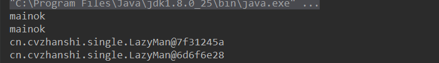

  查看newInstance方法，发现**不能使用反射而破坏枚举的单例模式**

  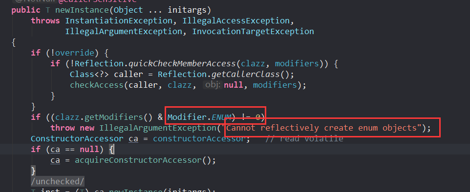

> 尝试通过反射，破坏枚举类的单例模式

1. 正常取枚举类中的对象，确实是单例模式

   ```java
   /**
    * @author cVzhanshi
    * @create 2021-09-26 15:10
    */
   public enum EnumSingle {
       INSTANCE;
   
       public EnumSingle getInstance(){
           return INSTANCE;
       }
   }
   
   class Test{
       public static void main(String[] args) {
           EnumSingle instance1 = EnumSingle.INSTANCE;
           EnumSingle instance2 = EnumSingle.INSTANCE;
           System.out.println(instance1);
           System.out.println(instance2);
       }
   }
   ```

   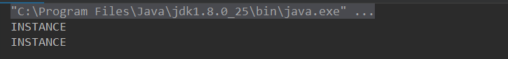

2. 通过查看枚举类编译的class文件，可以看到一个无参构造器

   ```java
   package cn.cvzhanshi.single;
   
   public enum EnumSingle {
       INSTANCE;
   
       private EnumSingle() {
       }
   
       public EnumSingle getInstance() {
           return INSTANCE;
       }
   }
   ```

3. 通过反射调用构造器构造对象，破坏单例

   ```java
   /**
    * @author cVzhanshi
    * @create 2021-09-26 15:10
    */
   public enum EnumSingle {
       INSTANCE;
   
       public EnumSingle getInstance(){
           return INSTANCE;
       }
   }
   
   class Test{
       public static void main(String[] args) throws NoSuchMethodException, IllegalAccessException, InvocationTargetException, InstantiationException {
           EnumSingle instance1 = EnumSingle.INSTANCE;
           Constructor<EnumSingle> declaredConstructor = EnumSingle.class.getDeclaredConstructor(null);
           declaredConstructor.setAccessible(true);
           EnumSingle instance2 = declaredConstructor.newInstance();
           System.out.println(instance1);
           System.out.println(instance2);
       }
   }
   ```

   结果不尽人意，报错没有空参构造器

   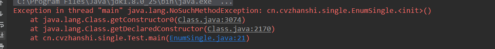

   对class文件进行反编译查看代码，发现也有空参构造器

   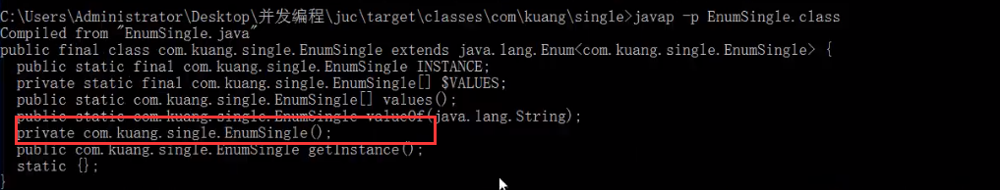

   我们使用更专业的反编译工具jad.exe，查看源代码可知他是有参构造器

   结论：**idea骗了我们**

   ```java
   public final class EnumSingle extends Enum
   {
   
       public static EnumSingle[] values()
       {
           return (EnumSingle[])$VALUES.clone();
       }
   
       public static EnumSingle valueOf(String name)
       {
           return (EnumSingle)Enum.valueOf(com/ogj/single/EnumSingle, name);
       }
   
       private EnumSingle(String s, int i)
       {
           super(s, i);
       }
   
       public EnumSingle getInstance()
       {
           return INSTANCE;
       }
   
       public static final EnumSingle INSTANCE;
       private static final EnumSingle $VALUES[];
   
       static 
       {
           INSTANCE = new EnumSingle("INSTANCE", 0);
           $VALUES = (new EnumSingle[] {
               INSTANCE
           });
       }
   }
   ```

4. 得知原因后继续通过反射通过构造器构造对象，破坏单例

   ```java
   ....
   class Test{
       public static void main(String[] args) throws NoSuchMethodException, IllegalAccessException, InvocationTargetException, InstantiationException {
           EnumSingle instance1 = EnumSingle.INSTANCE;
           Constructor<EnumSingle> declaredConstructor = EnumSingle.class.getDeclaredConstructor(String.class,int.class);
           declaredConstructor.setAccessible(true);
           EnumSingle instance2 = declaredConstructor.newInstance();
           System.out.println(instance1);
           System.out.println(instance2);
       }
   }
   ...//省略的代码和上面一样
   ```

   通过结果，我们得知枚举确实不能通过反射去改变单例模式

   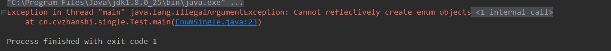

## 4.6 jdk代码中的体现

JDK中的RunTime中使用了单例模式。

```java
public class Runtime {
    private static Runtime currentRuntime = new Runtime();

    /**
     * Returns the runtime object associated with the current Java application.
     * Most of the methods of class <code>Runtime</code> are instance
     * methods and must be invoked with respect to the current runtime object.
     *
     * @return  the <code>Runtime</code> object associated with the current
     *          Java application.
     */
    public static Runtime getRuntime() {
        return currentRuntime;
    }

    /** Don't let anyone else instantiate this class */
    private Runtime() {}
}
```

看的出使用了饿汉式的单例模式

## 4.7 注意事项和细节说明

- 单例模式保证了系统内存中该类只存在一个对象，**节省了系统资源，对于一些需要频繁创建销毁的对象，使用单例模式可以提高系统性能**
- 当想实例化一个单例类的时候，**必须要记住使用相应的获取对象的方法，而不是使 用new**
-  单例模式使用的场景：**需要频繁的进行创建和销毁的对象、创建对象时耗时过多或 耗费资源过多**(即：重量级对象)，但又**经常用到的对象、工具类对象、频繁访问数据库或文件的对象(**比如数据源、session工厂等)

# 五、工厂模式

> 需求示例

看一个披萨的项目：要便于披萨种类的扩展，要便于维护 

- 披萨的种类很多(比如 GreekPizz、CheesePizz 等) 

- 披萨的制作过程有 prepare，bake, cut, box。

- 完成披萨店订购功能。

**使用传统的方法（不使用设计模式）**

披萨类及其子类：

```java
/**
 * @author cVzhanshi
 * @create 2023-04-17 16:45
 */
@Slf4j
public abstract class Pizza {
    public abstract void prepare();

    public void bake() {
        log.info("bake()");
    }

    public void cut() {
        log.info("cut()");
    }

    public void box() {
        log.info("box()");
    }
}


@Slf4j
public class GreekPizza extends Pizza {
    @Override
    public void prepare() {
        log.info("prepare() ---> GreekPizza");
    }
}
...
```

订单类

```java
@Slf4j
public class OrderPizza {
    public void generateOrder(String type) {
        Pizza pizza;
        if (type.equals("greek")) {
            pizza = new GreekPizza();
        } else if (type.equals("cheese")) {
            pizza = new CheesePizza();
        } else {
            log.info("选择错误");
            return;
        }
        pizza.prepare();
        pizza.bake();
        pizza.cut();
        pizza.box();
    }
}
```

分析：

- 代码比较好理解
- 违反了开闭原则，即对扩展开放，对修改关闭。如果新增一种披萨，需要新增一个类，然后在订单业务中添加if分支。而订单业务也许会部署在多个商店中，订单业务相对于说是使用者，使用者应该对应的关闭，即不允许修改，要修改只能在扩展修改。

-----

## 5.1 简单工厂模式

- 简单工厂模式（静态工厂模式）是属于创建型模式，是工厂模式的一种。**简单工厂模式是由一 个工厂对象决定创建出哪一种产品类的实例**。简单工厂模式是工厂模式家族 中最简单实用的模式。

- 简单工厂模式：定义了一个创建对象的类，由这个类来封装实例化对象的行为(代码)

- 在软件开发中，当我们会用到大量的创建某种、某类或者某批对象时，就会 使用到工厂模式

**简单工厂模式实现上述例子**

**思路**：把创建Pizza对象封装到一个类中，这样我们有新的Pizza种类时，只需要修改该类就可，其它有创建到Pizza对象的代码就不需要修改了。

工厂类：

```java
/**
 * @author cVzhanshi
 * @create 2023-04-17 17:14
 */
public class SimplePizzaFactory {

    public static Pizza createPizza(String type) {
        Pizza pizza = null;
        if (type.equals("greek")) {
            pizza = new GreekPizza();
        } else if (type.equals("cheese")) {
            pizza = new CheesePizza();
        }
        return pizza;
    }

}
```

订单类修改：

```java
@Slf4j
public class OrderPizza {
    public void generateOrder(String type) {
        Pizza pizza = SimplePizzaFactory.createPizza(type);
        if (pizza != null) {
            pizza.prepare();
            pizza.bake();
            pizza.cut();
            pizza.box();
        }
    }
}
```

## 5.2 工厂方法模式

针对上诉案例增加新需求：

披萨项目新的需求：客户在点披萨时，可以点不同口味的披萨，比如 北京的奶酪pizza、 北京的胡椒pizza 或者是伦敦的奶酪pizza、伦敦的胡椒pizza。

对于新需求，使用简单工厂模式也能实现，但是考虑到项目的 规模，以及软件的可维护性、可扩展性并不是特别好。

思路：使用工厂方法模式

> 工厂方法模式介绍

定义了一个创建对象的抽象方法，由子类决定要实例化的类。工厂方法模式将对象的实例化推迟到子类。

代码示例：

- 首先抽象创建披萨类创造步骤为方法

  ```java
  /**
   * @author cVzhanshi
   * @create 2023-04-17 16:48
   */
  @Slf4j
  public abstract class OrderPizza {
      public abstract Pizza createPizza(String type);
      public void generateOrder(String type) {
          Pizza pizza = createPizza(type);
          if (pizza != null) {
              pizza.prepare();
              pizza.bake();
              pizza.cut();
              pizza.box();
          }
      }
  }
  ```

- 根据不同口味创建不同的实现类

  ```java
  @Slf4j
  public class BJOrderPizza extends OrderPizza{
      @Override
      public Pizza createPizza(String type) {
          Pizza pizza = null;
          if (type.equals("greek")) {
              pizza = new BJGreekPizza();
          } else if (type.equals("cheese")) {
              pizza = new BJCheesePizza();
          }
          return pizza;
      }
  }
  
  @Slf4j
  public class LDOrderPizza extends OrderPizza{
      @Override
      public Pizza createPizza(String type) {
          Pizza pizza = null;
          if (type.equals("greek")) {
              pizza = new LDGreekPizza();
          } else if (type.equals("cheese")) {
              pizza = new LDCheesePizza();
          }
          return pizza;
      }
  }
  ```

## 5.3 抽象工厂模式

- **抽象工厂模式**：定义了一个interface用于创建相关或有依赖关系的对象簇，而无需指明具体的类

- 抽象工厂模式可以将简单工厂模式和工厂方法模式进行整合

- 将工厂抽象成两层，AbsFactory(抽象工厂) 和具体实现的工厂子类。程序员可以根据创建对象类型使用对应的工厂子类。这样将单个的简单工厂类变成了工厂簇， 更利于代码的维护和扩展。

代码示例：

- 一个抽象工厂模式的抽象层(接口)

  ```java
  /**
   * @author cVzhanshi
   * @create 2023-04-18 14:53
   */
  public interface AbsFactory {
      Pizza createPizza(String orderType);
  }
  ```

- 抽象子类

  ```java
  /**
   * @author cVzhanshi
   * @create 2023-04-18 14:55
   */
  public class LDFactory implements AbsFactory {
      @Override
      public Pizza createPizza(String orderType) {
          Pizza pizza = new BJCheesePizza();
          if (orderType.equals("cheese")) {
              pizza = new LDCheesePizza();
          } else if (orderType.equals("greek")) {
              pizza = new LDGreekPizza();
          }
          return pizza;
      }
  }
  
  
  /**
   * @author cVzhanshi
   * @create 2023-04-18 14:55
   */
  public class BJFactory  implements AbsFactory {
      @Override
      public Pizza createPizza(String orderType) {
          Pizza pizza = new BJCheesePizza();
          if (orderType.equals("cheese")) {
              pizza = new BJCheesePizza();
          } else if (orderType.equals("greek")) {
              pizza = new BJGreekPizza();
          }
          return pizza;
      }
  }
  ```

- 订单类，可以忽视底层使用的哪个工厂类

  ```
  /**
   * @author cVzhanshi
   * @create 2023-04-18 15:06
   */
  public class OrderPizza {
      private AbsFactory absFactory;
  
      public OrderPizza(AbsFactory absFactory, String ordertype) {
          this.absFactory = absFactory;
          Pizza pizza;
          pizza = absFactory.createPizza(ordertype);
          if (pizza != null) {
              pizza.prepare();
              pizza.bake();
              pizza.cut();
              pizza.box();
          }
      }
  }
  ```

## 5.4 jdk代码中的体现

Calendar.getInstance();就是很好的一个体现，如代码：

```java
public static Calendar getInstance(Locale aLocale)
{
    return createCalendar(TimeZone.getDefault(), aLocale);
}


public static Calendar getInstance(TimeZone zone,
                                   Locale aLocale)
{
    return createCalendar(zone, aLocale);
}

private static Calendar createCalendar(TimeZone zone,
                                       Locale aLocale)
{
    CalendarProvider provider =
        LocaleProviderAdapter.getAdapter(CalendarProvider.class, aLocale)
        .getCalendarProvider();
    if (provider != null) {
        try {
            return provider.getInstance(zone, aLocale);
        } catch (IllegalArgumentException iae) {
            // fall back to the default instantiation
        }
    }

    Calendar cal = null;

    if (aLocale.hasExtensions()) {
        String caltype = aLocale.getUnicodeLocaleType("ca");
        if (caltype != null) {
            switch (caltype) {
                case "buddhist":
                    cal = new BuddhistCalendar(zone, aLocale);
                    break;
                case "japanese":
                    cal = new JapaneseImperialCalendar(zone, aLocale);
                    break;
                case "gregory":
                    cal = new GregorianCalendar(zone, aLocale);
                    break;
            }
        }
    }
    if (cal == null) {
        if (aLocale.getLanguage() == "th" && aLocale.getCountry() == "TH") {
            cal = new BuddhistCalendar(zone, aLocale);
        } else if (aLocale.getVariant() == "JP" && aLocale.getLanguage() == "ja"
                   && aLocale.getCountry() == "JP") {
            cal = new JapaneseImperialCalendar(zone, aLocale);
        } else {
            cal = new GregorianCalendar(zone, aLocale);
        }
    }
    return cal;
}
```

## 5.5 小结

- **工厂模式的意义是将实例化对象的代码提取出来，放到一个类中统一管理和维护，达到和主项目的依赖关系的解耦。从而提高项目的扩展和维护性**。
- 创建对象实例时，不要直接 new 类, 而是把这个new 类的动作放在一个工厂的方法 中，并返回。有的书上说，变量不要直接持有具体类的引用。
- 不要让类继承具体类，而是继承抽象类或者是实现interface(接口)。
- 不要覆盖基类中已经实现的方法。

# 六、原型模式

> 需求示例--->克隆羊

现在有一只羊tom，姓名为: tom, 年龄为：1，颜色为：白色，请编写程序创建和tom 羊属性完全相同的10只羊。

不使用设计模式（传统方式）实现：

```java
/**
 * @author cVzhanshi
 * @create 2023-04-18 16:12
 */
@Data
@NoArgsConstructor
@AllArgsConstructor
public class Sheep {
    String name;

    Integer age;

    String color;
}

// ======================================================

/**
 * @author cVzhanshi
 * @create 2023-04-18 16:14
 */
@Slf4j
public class Client {
    public static void main(String[] args) {
        Sheep sheep = new Sheep("tom", 1, "白色");

        Sheep sheep1 = new Sheep(sheep.getName(), sheep.getAge(), sheep.getColor());
        Sheep sheep2 = new Sheep(sheep.getName(), sheep.getAge(), sheep.getColor());
        Sheep sheep3 = new Sheep(sheep.getName(), sheep.getAge(), sheep.getColor());

        log.info(sheep.toString());
        log.info(sheep1.toString());
        log.info(sheep2.toString());
        log.info(sheep3.toString());
    }
}
```

分析：

- 优点是比较好理解，简单易操作。
- 在创建新的对象时，总是需要重新获取原始对象的属性，如果创建的对象比较复杂时，效率较低 
- 总是需要重新初始化对象，而不是动态地获得对象运行时的状态, 不够灵活。

优化思路：

Java中Object类是所有类的根类，Object类提供了一个clone()方法，该方法可以将一个Java对象复制一份，但是需要实现clone的Java类必须要实现一个接口Cloneable， 该接口表示该类能够复制且具有复制的能力 => **原型模式**

## 6.1 原型模式基本介绍

- 原型模式(Prototype模式)是指：用原型实例指定创建对象的种类，并且通过拷贝这些原型，创建新的对象

- 原型模式是一种创建型设计模式，允许一个对象再创建另外一个可定制的对象，无需知道如何创建的细节

- 工作原理是：通过将一个原型对象传给那个要发动创建的对象，这个要发动创建的对象通过请求原型对象拷贝它们自己来实施创建，即对象.clone()

代码演示：

```java
/**
 * @author cVzhanshi
 * @create 2023-04-18 16:12
 */
@Data
@NoArgsConstructor
@AllArgsConstructor
public class Sheep implements Cloneable {
    String name;

    Integer age;

    String color;

    @Override
    public Sheep clone() {
        try {
            Sheep clone = (Sheep) super.clone();
            return clone;
        } catch (CloneNotSupportedException e) {
            throw new AssertionError();
        }
    }
}

/**
 * @author cVzhanshi
 * @create 2023-04-18 16:14
 */
@Slf4j
public class Client {
    public static void main(String[] args) {
        Sheep sheep = new Sheep("tom", 1, "白色");

        Sheep sheep1 = sheep.clone();
        Sheep sheep2 = sheep.clone();

        log.info(sheep.toString()); // tom
        log.info(sheep1.toString()); // tom
        log.info(sheep2.toString()); // tom

        log.info("{}", sheep);
        log.info("{}", sheep1);
        log.info("{}", sheep2);
        log.info("{}", sheep2 == sheep1);   // fasle
        log.info("{}", sheep1.equals(sheep));  // true  因为实体类用了@Data注解，其实是帮帮助我们重写了equals方法的

        sheep.setName("cvzhanshi");
        log.info(sheep.toString());  // cvzhanshi
        log.info(sheep1.toString()); // tom 
        log.info(sheep2.toString()); // tom
    }
}
```

## 6.2 jdk代码中的使用

其中spring源码创建bean的代码中就与使用

```xml
<bean id="id01" class="com.atguigu.spring.bean.Monster" scope="prototype"/>
```

其中的scope就可以选择prototype

获取bean的代码

```java
ApplicationContext context = new ClassPathXmlApplicationContext("bean.xml");
context.getBean("id");


==> getBean（）;
@Override
public Object getBean(String name) throws BeansException {
    assertBeanFactoryActive();
    return getBeanFactory().getBean(name);
}    

==>getBeanFactory().getBean(name);
protected <T> T doGetBean(
    String name, @Nullable Class<T> requiredType, @Nullable Object[] args, boolean typeCheckOnly)
    throws BeansException {
    //    ...
    if (mbd.isSingleton()) { // 单例
       
    }

    else if (mbd.isPrototype()) {  // 原型
        // It's a prototype -> create a new instance.  创建新的实例
        Object prototypeInstance = null;
        try {
            beforePrototypeCreation(beanName);
            prototypeInstance = createBean(beanName, mbd, args);
        }
        finally {
            afterPrototypeCreation(beanName);
        }
        beanInstance = getObjectForBeanInstance(prototypeInstance, name, beanName, mbd);
    }

    else { // 其他
        
    }
    //    ...
}

```

## 6.3 浅拷贝和深拷贝

> 浅拷贝

- 对于数据类型是基本数据类型的成员变量，浅拷贝会直接进行值传递，也就是将该**属性值复制一份**给新的对象。

- 对于数据类型是引用数据类型的成员变量，比如说成员变量是某个数组、某个类的对象等，那么浅拷贝会进行**引用传递**，也就是只是将该成员变量的引用值（内存地址）复制一份给新的对象。因为实际上两个对象的该成员变量都指向同一个 实例。**在这种情况下，在一个对象中修改该成员变量会影响到另一个对象的该成员变量值。**

上述示例使用的就是浅拷贝，浅拷贝默认使用的是clone()方法来实现的

> 深拷贝

- 复制对象的所有基本数据类型的成员变量值
- 为所有引用数据类型的成员变量申请存储空间，并复制每个引用数据类型成员变量所引用的对象，直到该对象可达的所有对象。也就是说，对象进行深拷贝要对整个对象进行拷贝

深拷贝实现方式1：重写clone方法来实现深拷贝

深拷贝实现方式2：**通过对象序列化实现深拷贝**

**代码演示**

- 重写clone方法来实现深拷贝，把对象里面的引用对象也重写clone

  ```java
  @Data
  @NoArgsConstructor
  @AllArgsConstructor
  public class DeepProtoType implements Serializable, Cloneable {
  
      public String name; //String 属性
      public DeepCloneableTarget deepCloneableTarget;  // 引用类型 也需要重写
  
  
      @Override
      public DeepProtoType clone() {
          try {
              DeepProtoType clone = (DeepProtoType) super.clone();
              // 把重写的值赋值给对象
              clone.deepCloneableTarget = deepCloneableTarget.clone();
              return clone;
          } catch (CloneNotSupportedException e) {
              throw new AssertionError();
          }
      }
  }
  
  
  @Data
  @AllArgsConstructor
  @NoArgsConstructor
  public class DeepCloneableTarget implements Serializable, Cloneable  {
  
      private String cloneName;
  
      private String cloneClass;
  
  
      @Override
      public DeepCloneableTarget clone() {
          try {
              return (DeepCloneableTarget) super.clone();
          } catch (CloneNotSupportedException e) {
              throw new AssertionError();
          }
      }
  }
  ```

- 通过对象序列化实现深拷贝

  ```java
  @Data
  @NoArgsConstructor
  @AllArgsConstructor
  public class DeepProtoType implements Serializable {
  
      public String name; //String 属性
      public DeepCloneableTarget deepCloneableTarget;  // 引用类型
  
      public DeepProtoType deepClone() {
          ObjectOutputStream oos = null;
          ByteArrayOutputStream bos = null;
          ByteArrayInputStream bis = null;
          ObjectInputStream ois = null;
          try {
              // 序列化
              bos = new ByteArrayOutputStream();
              oos = new ObjectOutputStream(bos);
              oos.writeObject(this);
  
              bis = new ByteArrayInputStream(bos.toByteArray());
              ois = new ObjectInputStream(bis);
              DeepProtoType deepProtoType = (DeepProtoType) ois.readObject();
  
              return deepProtoType;
          } catch (Exception e) {
              e.printStackTrace();
              return null;
          } finally {
              try {
                  ois.close();
                  bis.close();
                  oos.close();
                  bos.close();
              } catch (IOException e) {
                  throw new RuntimeException(e);
              }
          }
      }
  }
  ```

- 测试

  ```java
  @Slf4j
  public class Client {
      public static void main(String[] args) {
  
          DeepProtoType deepProtoType = new DeepProtoType("宋江", new DeepCloneableTarget("大牛", "小牛"));
  
          //方式1 完成深拷贝
  
  		DeepProtoType deepProtoType2 = deepProtoType.deepClone();
  
  		log.info("p.name=" + deepProtoType.getName() + "p.deepCloneableTarget=" + deepProtoType.deepCloneableTarget.hashCode());
  		log.info("p2.name=" + deepProtoType2.getName() + "p2.deepCloneableTarget=" + deepProtoType2.deepCloneableTarget.hashCode());
  
          deepProtoType.getDeepCloneableTarget().setCloneName("fsdf");
          log.info("p.name=" + deepProtoType.getDeepCloneableTarget() + "p.deepCloneableTarget=" + deepProtoType.deepCloneableTarget.hashCode());
          log.info("p2.name=" + deepProtoType2.getDeepCloneableTarget() + "p2.deepCloneableTarget=" + deepProtoType2.deepCloneableTarget.hashCode());
      }
  }
  ```

  测试可知深拷贝后的对象中的引用对象也是一片新的地址，修改原来的对象不影响拷贝的对象。

## 6.4 原型模式的注意事项和细节

- 创建新的对象比较复杂时，可以利用原型模式简化对象的创建过程，同时也能够提高效率
- 不用重新初始化对象，而是动态地获得对象运行时的状态
- 如果原始对象发生变化(增加或者减少属性)，其它克隆对象的也会发生相应的变化， 无需修改代码
- 在实现深克隆的时候可能需要比较复杂的代码

缺点：需要为每一个类配备一个克隆方法，这对全新的类来说不是很难，但对已有的类进行改造时，需要修改其源代码，违背了ocp原则

# 七、建造者模式

> 需求示例

需要建一栋房子，步骤：打地基 -> 砌墙 -> 封顶  （不管是别墅还是小破楼都是这一流程）
现在需要创建不同的房子：别墅、小破楼等等
**传统的解决方案**

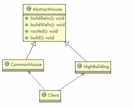

代码示例：

**抽象实现过程**

```java
/**
 * @author cVzhanshi
 * @create 2023-06-20 16:58
 */
public abstract class AbstractHouse {

    // 建房子步骤一
    public abstract void buildOne();

    // 建房子步骤二
    public abstract void buildTwo();

    // 建房子步骤三
    public abstract void buildThree();
    
    // 建房子
    public void build() {
        buildOne();
        buildTwo();
        buildThree();
    }
}
```

**具体实现过程子类**

```java
/**
 * @author cVzhanshi
 * @create 2023-06-20 17:00
 */

// 小房子
@Slf4j
public class SmallHouse extends AbstractHouse {
    @Override
    public void buildOne() {
        log.info("建小房子第一步：buildOne");
    }

    @Override
    public void buildTwo() {
        log.info("建小房子第二步：buildTwo");
    }

    @Override
    public void buildThree() {
        log.info("建小房子第三步：buildThree");
    }
}

// 大房子
@Slf4j
public class BigHouse extends AbstractHouse{
    @Override
    public void buildOne() {
        log.info("建大房子第一步：buildOne");
    }

    @Override
    public void buildTwo() {
        log.info("建大房子第二步：buildTwo");
    }

    @Override
    public void buildThree() {
        log.info("建大房子第三步：buildThree");
    }
}

```

客户端建房子

```Java
@Slf4j
public class Client {
    public static void main(String[] args) {
        // 建大房子
        BigHouse bigHouse = new BigHouse();
        bigHouse.build();
        log.info("=-=-=-=-=-=-=-=--=-=-=-=-=-=-=-=");
        // 建小房子
        SmallHouse smallHouse = new SmallHouse();
        smallHouse.build();
    }
}

// 输出
17:15:44.332 [main] INFO cn.cvzhanshi.design.builder.BigHouse - 建大房子第一步：buildOne
17:15:44.336 [main] INFO cn.cvzhanshi.design.builder.BigHouse - 建大房子第二步：buildTwo
17:15:44.336 [main] INFO cn.cvzhanshi.design.builder.BigHouse - 建大房子第三步：buildThree
17:15:44.336 [main] INFO cn.cvzhanshi.design.builder.Client - =-=-=-=-=-=-=-=--=-=-=-=-=-=-=-=
17:15:44.338 [main] INFO cn.cvzhanshi.design.builder.SmallHouse - 建小房子第一步：buildOne
17:15:44.338 [main] INFO cn.cvzhanshi.design.builder.SmallHouse - 建小房子第二步：buildTwo
17:15:44.338 [main] INFO cn.cvzhanshi.design.builder.SmallHouse - 建小房子第三步：buildThree
```

达到了new不同类实现不同的房子

**分析：**

- 优点：比较好理解，清晰明了；
- 缺点：设计的程序结构，过于简单，没有设计缓存层对象，程序的扩展和维护不好。把产品和创建产品的过程封装在了一起，耦合性增强了。
- 解决方案：将产品和产品的创建过程解耦  => 建造者模式

## 7.1 建造者模式基本介绍

- ==它可以把复杂对象的建造过程抽象出来，使这个抽象过程的不同实现方法可以构造出不同属性的对象==

- 建造者模式是一步一步创建一个复杂的对象，它允许用户只通过指定复杂对象的类型和内容就可以构建它们，用户不需要知道内部的具体构建细节。

> 四个角色

- **Product**（产品角色）：一个具体的产品对象。
- **Builder**（抽象建造者）：创建一个Product对象的各个属性的指定**接口或抽象类**。
- **ConcreteBuilder**（具体建造者）：实现接口或者继承抽象类，构建产品的各个属性。
- **Director**（指挥者）：构建一个使用Builder接口的对象。它主要是用于创建一个复杂的对象。它主要有两个作用，一是：隔离了客户与对象的生产过程，二是：负责控制产品对象的生产过程。

对应的原理类图：

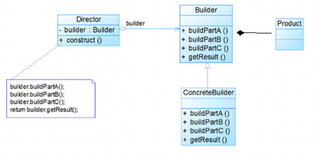

## 7.2 建造者模式实现需求示例

思路分析类图

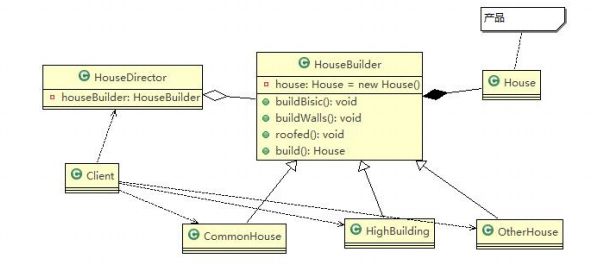

根据类图编写代码

**产品类**

```java
@Data
@NoArgsConstructor
@AllArgsConstructor
public class House {
    private String one;
    
    private String two;
    
    private String three;
}
```

**抽象的建造者**

```java
/**
 * @author cVzhanshi
 * @create 2023-06-20 18:20
 */
public abstract class HouseBuilder {
    protected House house = new House();

    // 建房子步骤一
    public abstract void buildOne();

    // 建房子步骤二
    public abstract void buildTwo();

    // 建房子步骤三
    public abstract void buildThree();
    
    public House buildHouse() {
        return house;
    }
}
```

**具体实现的建造者**

```java
@Slf4j
public class LowHouseBuilder extends HouseBuilder {
    @Override
    public void buildOne() {
        log.info("小破楼：One");
    }

    @Override
    public void buildTwo() {
        log.info("小破楼：Two");
    }

    @Override
    public void buildThree() {
        log.info("小破楼：Three");
    }
}

@Slf4j
public class HighHouseBuilder extends HouseBuilder{
    @Override
    public void buildOne() {
        log.info("建高楼咯：One");
    }

    @Override
    public void buildTwo() {
        log.info("建高楼咯：Two");
    }

    @Override
    public void buildThree() {
        log.info("建高楼咯：Three");
    }
}
```

**指挥者**

```java
@Data
@AllArgsConstructor
public class HouseDirector {
    private HouseBuilder houseBuilder;
    
    
    public House constructHouse() {
        houseBuilder.buildOne();
        houseBuilder.buildTwo();
        houseBuilder.buildThree();
        return houseBuilder.buildHouse();
    }
    
}
```

客户端使用

```java
@Slf4j
public class Client {
    public static void main(String[] args) {
        // 盖小破楼
        HouseBuilder lowHouseBuilder = new LowHouseBuilder();
        // 准备创建房子的指挥者
        HouseDirector houseDirector = new HouseDirector(lowHouseBuilder);

        // 完成盖房子，返回产品
        House house = houseDirector.constructHouse();

        log.info("-=-=-=-=-=-=-=-=-=-=-=-=-=-=-=-=-=-");

        // 盖高楼
        HouseBuilder highHouseBuilder = new HighHouseBuilder();
        // 准备创建房子的指挥者
        HouseDirector houseDirector2 = new HouseDirector(highHouseBuilder);

        // 完成盖房子，返回产品
        House house2 = houseDirector2.constructHouse();


    }
}


// 输出
18:37:39.160 [main] INFO cn.cvzhanshi.design.builder.LowHouseBuilder - 小破楼：One
18:37:39.164 [main] INFO cn.cvzhanshi.design.builder.LowHouseBuilder - 小破楼：Two
18:37:39.164 [main] INFO cn.cvzhanshi.design.builder.LowHouseBuilder - 小破楼：Three
18:37:39.164 [main] INFO cn.cvzhanshi.design.builder.Client - -=-=-=-=-=-=-=-=-=-=-=-=-=-=-=-=-=-
18:37:39.164 [main] INFO cn.cvzhanshi.design.builder.HighHouseBuilder - 建高楼咯：One
18:37:39.164 [main] INFO cn.cvzhanshi.design.builder.HighHouseBuilder - 建高楼咯：Two
18:37:39.164 [main] INFO cn.cvzhanshi.design.builder.HighHouseBuilder - 建高楼咯：Three
```

## 7.3 建造者模式在JDK源码中的使用

> StringBuilder中的建造者模式

**Appendable**

```java
public interface Appendable {

    Appendable append(CharSequence csq) throws IOException;

    Appendable append(CharSequence csq, int start, int end) throws IOException;

    Appendable append(char c) throws IOException;
}

```

**AbstractStringBuilder**已经把**Appendable**的抽象方法都实现了

```java
abstract class AbstractStringBuilder implements Appendable, CharSequence {
	@Override
    public AbstractStringBuilder append(CharSequence s) {
        if (s == null)
            return appendNull();
        if (s instanceof String)
            return this.append((String)s);
        if (s instanceof AbstractStringBuilder)
            return this.append((AbstractStringBuilder)s);

        return this.append(s, 0, s.length());
    }
    
    @Override
    public AbstractStringBuilder append(CharSequence s, int start, int end) {
        if (s == null)
            s = "null";
        if ((start < 0) || (start > end) || (end > s.length()))
            throw new IndexOutOfBoundsException(
                "start " + start + ", end " + end + ", s.length() "
                + s.length());
        int len = end - start;
        ensureCapacityInternal(count + len);
        for (int i = start, j = count; i < end; i++, j++)
            value[j] = s.charAt(i);
        count += len;
        return this;
    }
    
    @Override
    public AbstractStringBuilder append(char c) {
        ensureCapacityInternal(count + 1);
        value[count++] = c;
        return this;
    }
}
```

**StringBuilder**中的Override并不是重写，它调用的还是父类**AbstractStringBuilder**的方法，所以他是个指挥者

```java
public final class StringBuilder
    extends AbstractStringBuilder
    implements java.io.Serializable, CharSequence
{
    @Override
    public StringBuilder append(String str) {
        super.append(str);
        return this;
    } 
}	
```

**源码中建造者模式的角色分析**

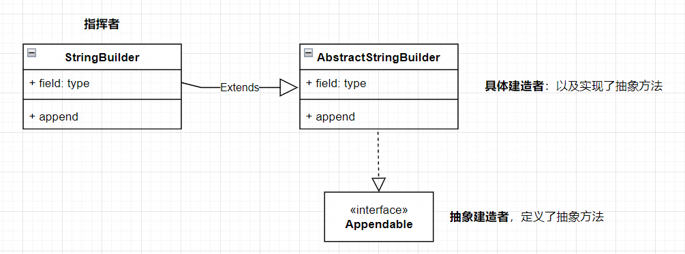

## 7.4 建造者模式的注意事项和细节

- **客户端（使用程序）不需要知道产品内部组成的细节**，将产品本身与产品的创建过程解耦，可以让相同的创建过程可以创建出不同的产品。
- **每一个具体建造者都相对独立，与其他的具体建造者都无关**，因此可以很方便地替换具体建造者或增加新的具体建造者，用户使用不同的具体建造者即可得不同的产品对象。
- **可以更加精细地控制产品的创建过程**。将复杂产品的创建步骤分解在不同的方法中，使得创建过程更加清晰，也更方便使用程序来控制创建过程。
- **增加新的具体建造者无须修改原有类库的代码**，指挥者类针对抽象建造者类编程，系统扩展方便，符合“开闭原则”。
- **建造者模式所创建的产品一般具有较多的共同点，其组成部分相似，如果产品之间的差异性很大，则不适合使用建造者模式**，因此其使用范围受到一定的限制。
- 如果产品的内部变化复杂，可能会导致需要定义很多具体建造者类来实现这种变化，导致系统变得很庞大，因此在这种情况下，要考虑是否选择建造者模式。

> 抽象工厂模式 VS 建造者模式

- **抽象工厂模式**实现对一个产品家族的创建；产品家族具有不同分类维度的产品组合，**抽象工厂模式不需要关心构建过程，只关心产品由什么工厂生产。**
- **建造者模式**则是需要按照指定的产品生产过程来构建产品，它**主要目的是通过组装零配件而产生一个新产品**。

# 八、适配器模式

## 8.1 适配器模式基本介绍

> 生活中的适配器例子

- 比如生活中的插座，在不同国家插座有着不同的规格，如果我们从一个国家去另外一个国家需要使用插座时就需要一个中间转换器把两种不同规则的插座适配一下。
- 生活中电脑充电器，手机充电器，手机电脑可能支持20v充电，但是生活用电时220v，所以产家加载充电器上做了适配器，把插座过来的220v适配成手机能适应的20v

> 基本介绍

- 适配器模式(Adapter Pattern)将某个类的接口转换成客户端期望的另一个接口表示，主的目的是兼容性，让原本因接口不匹配不能一起工作的两个类可以协同工作。其别名为包装器(Wrapper)。
- 适配器模式属于结构型模式。
- 主要分为三类：**类适配器模式、对象适配器模式、接口适配器模式**。

> 工作原理

- 适配器模式：将一个类的接口转换成另一种接口。让原本接口不兼容的类可以兼容。
- 从用户的角度看不到被适配者，是解耦的。
- 用户调用适配器转化出来的目标接口方法，适配器再调用被适配者的相关接口方法。
- 用户收到反馈结果，感觉只是和目标接口交互。用户感受不到适配的过程。

## 8.2 类适配器模式

生活示例：充电器。充电器本身相当于Adapter，220V交流电相当于src(即被适配者)，我们的目dst(即目标)是20V直流电。

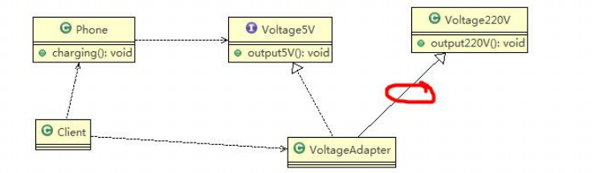

代码示例

**被适配的类(220V)**

```java
/**
 * @author cVzhanshi
 * @create 2023-06-25 16:33
 */

@Slf4j
public class Voltage220V {
    public int output220V() {
        int src = 220;
        log.info("电压 = {}V", src);
        return src;
    }
}
```

**适配接口**

```java
/**
 * @author cVzhanshi
 * @create 2023-06-25 16:35
 */
public interface IVoltage5V {
    int output5V();
}
```

适配类

```java
/**
 * @author cVzhanshi
 * @create 2023-06-25 16:36
 */
public class VoltageAdapter extends Voltage220V implements IVoltage5V{
    @Override
    public int output5V() {
        // 获得220v电压
        int src = output220V();
        // 转化成手机能用的5v
        int dst = src / 44;
        return dst;
    }
}
```

**手机类以及客户端**

```java
/**
 * @author cVzhanshi
 * @create 2023-06-25 16:38
 */
@Slf4j
public class Phone {
    // 充电
    public void init (IVoltage5V iVoltage5V) {
        if (iVoltage5V.output5V() == 5) {
            log.info("电压为5v，可以充电");
        } else {
            log.info("电压大于5v，不能充电");
        }
    }
}

/**
 * @author cVzhanshi
 * @create 2023-06-25 16:40
 */
public class Client {
    public static void main(String[] args) {
        Phone phone = new Phone();
        phone.init(new VoltageAdapter());
    }
}
```

这样就是通过适配器解决了电压不适配的问题

> 类适配器模式注意事项和细节

- Java是单继承机制，所以类适配器需要继承被适配类这一点算是一个缺点，因为这要求dst必须是接口，有一定局限性。
- src类的方法在Adapter中都会暴露出来，也增加了使用的成本。
- 由于其继承了src类，所以它可以根据需求重写src类的方法，使得Adapter的灵活性增强了。

## 8.3 对象适配器模式

- 与类适配器唯一不同的是，**对象适配器模式是持有src类，而不是继承src类。**
- **使用了关联或者聚合的关系代替了继承**。

那么类图就变成了

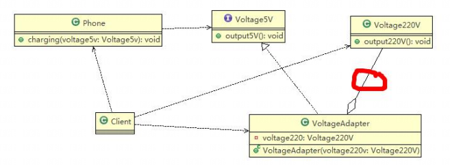

代码主要是适配器代码的区别：

**适配器**

```java
/**
 * @author cVzhanshi
 * @create 2023-06-25 16:36
 */
public class VoltageAdapter extends Voltage220V implements IVoltage5V{
	private Voltage220V voltage220V；
	
	public VoltageAdapter (Voltage220V voltage220V) {
		this.voltage220V = voltage220V;
	}
	
    @Override
    public int output5V() {
        // 获得220v电压
        int src = voltage220V.output220V();
        // 转化成手机能用的5v
        int dst = src / 44;
        return dst;
    }
}
```

> 对象适配器的注意事项和细节

- 组合代替了继承，解决了类适配器需要继承src的局限性，也不需要要求dst必须是接口。

- 使用成本低，更灵活。

## 8.4 接口适配器模式

- 接口适配器模式也可以称为**缺省适配器模式**。
- 核心思路：当**不需要全部实现接口提供的方法**时，可先**设计一个抽象类实现接口**，并**为该接口中每个方法提供一个默认实现(空方法)**， 那么该**抽象类的子类可有选择地覆盖父类的某些方法**来实现需求
- 适用于一个接口不想使用其所有的方法的情况。

代码演示

**接口**：

```java
public interface IVoltage {
    void output5V();
    
    void output10V();
    
    void output15V();
    
    void output20V();
}
```

**适配器**：

```java
/**
 * @author cVzhanshi
 * @create 2023-06-25 17:08
 */
public abstract class Adapter implements IVoltage{
    @Override
    public void output5V() {
        
    }

    @Override
    public void output10V() {

    }

    @Override
    public void output15V() {

    }

    @Override
    public void output20V() {

    }
}
```

然后使用者再根据需求重写某些方法就可以

## 8.5 适配器模式在SpringMVC中的运用

**在DispatcherServlet类中**

```java
protected void doDispatch(HttpServletRequest request, HttpServletResponse response) throws Exception {
    HttpServletRequest processedRequest = request;
    HandlerExecutionChain mappedHandler = null;
    boolean multipartRequestParsed = false;

    WebAsyncManager asyncManager = WebAsyncUtils.getAsyncManager(request);
   // ...

    ModelAndView mv = null;
    Exception dispatchException = null;


    processedRequest = checkMultipart(request);
    multipartRequestParsed = (processedRequest != request);

    // Determine handler for the current request.
    // 确定当前请求的处理程序，根据request来获取Handler
    mappedHandler = getHandler(processedRequest);
    if (mappedHandler == null) {
        noHandlerFound(processedRequest, response);
        return;
    }

    // Determine handler adapter for the current request.
    // 确定当前请求的处理程序适配器 根据handler来获取适配器
    HandlerAdapter ha = getHandlerAdapter(mappedHandler.getHandler());

   // ...

    // Actually invoke the handler.
    // 实际上调用处理程序
    mv = ha.handle(processedRequest, response, mappedHandler.getHandler());


   // ...

    processDispatchResult(processedRequest, response, mappedHandler, mv, dispatchException);


}
```

# 九、桥接模式

>需求示例

当我们对不同手机类型的不同品牌实现操作编程，如图：

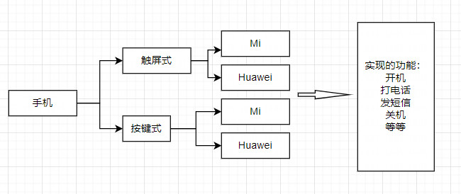

那么它对应的类图就是

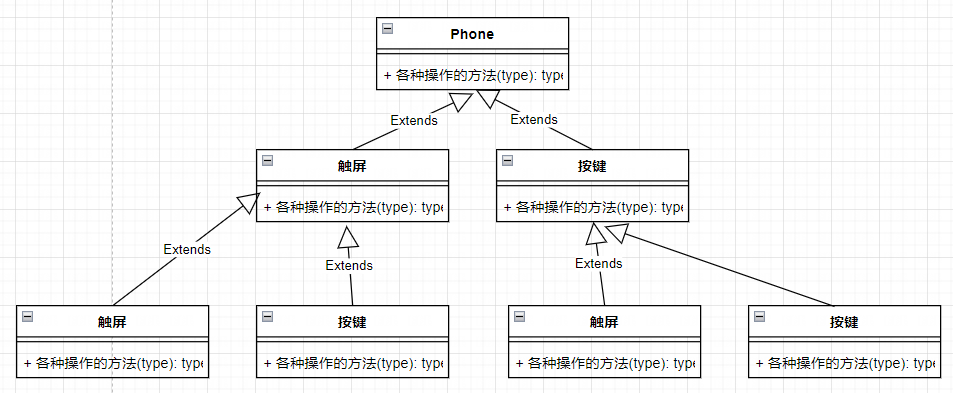

<font color="red">传统方式解决需求分析：</font>

- **扩展性问题**，如果需要在增加手机的样式（翻盖），那么我们需要增加每个品牌的种类，如果我们增加一个手机品牌，也需要在每个手机样式下增加。
- 违反了单一职责原则：当我们增加手机样式时，要同时增加所有品牌的手机，这样增加了代码维护成本。
- 解决方案：使用**桥接模式**

## 9.1 桥接模式基本介绍

- 桥接模式(Bridge模式)是指：将实现与抽象放在两个不同的类层次中，使两个层次可以独立改变。 
- 是一种结构型设计模式 
- Bridge模式基于**类的最小设计原则**，通过使用封装、聚合及继承等行为让不同的类承担不同的职责。它的主要特点是把抽象(Abstraction)与行为实现 (Implementation)分离开来，从而可以保持各部分的独立性以及应对他们的功能扩展。

> 桥接模式原理图

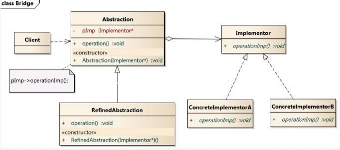

**分析**：

- Cilent类：桥接模式的调用者
- 抽象类（Abstraction）：维护了Implementor / 即它的实现类ConcreteImplementorA/B，二者是聚合关系，其中**Abstraction充当桥梁（桥接类）**
- RefinedAbstraction：是Abstraction抽象类的子类
- Implementor：行为实现类的接口
- ConcreteImplementorA：行为的具体实现类

## 9.2 桥接模式解决需求

**使用桥接模式对应的类图**

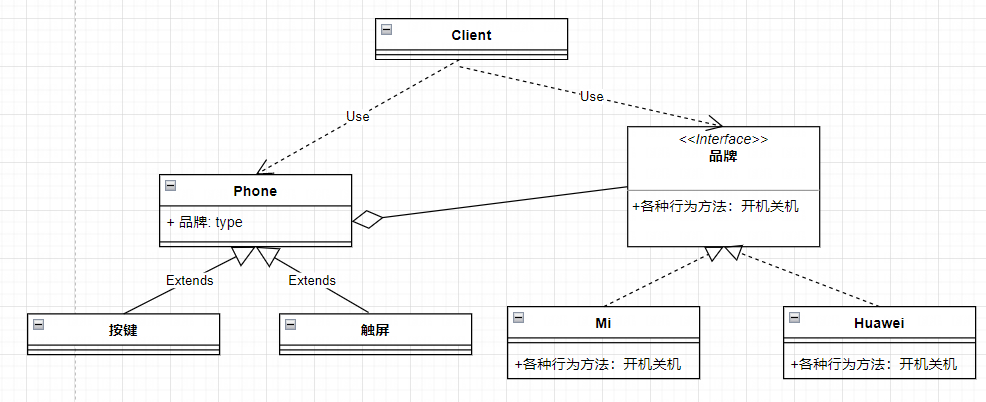

**代码实现**

品牌接口

```java
/**
 * @author cVzhanshi
 * @create 2023-06-27 17:30
 */
public interface Brand {
    void open();

    void call();

    void close();
}
```

品牌接口实现类

```java
@Slf4j
public class Huawei implements Brand{
    @Override
    public void open() {
        log.info("Huawei开机啦");
    }

    @Override
    public void call() {
        log.info("Huawei打电话啦");
    }

    @Override
    public void close() {
        log.info("Huawei关机啦");
    }
}


@Slf4j
public class Mi implements Brand{
    @Override
    public void open() {
        log.info("Mi开机啦");
    }

    @Override
    public void call() {
        log.info("Mi打电话啦");
    }

    @Override
    public void close() {
        log.info("Mi关机啦");
    }
}
```

手机抽象类

```java
/**
 * @author cVzhanshi
 * @create 2023-06-27 17:32
 */
public abstract class Phone {

    // 品牌
    private Brand brand;

    public Phone(Brand brand) {
        this.brand = brand;
    }

    protected void open(){
        this.brand.open();
    }

    protected void call(){
        this.brand.call();
    }

    protected void close(){
        this.brand.close();
    }
}
```

抽象类的样式子类

```java
/**
 * @author cVzhanshi
 * @create 2023-06-27 17:34
 */

@Slf4j
public class AnJian extends Phone{
    public AnJian(Brand brand) {
        super(brand);
    }

    @Override
    protected void open() {
        super.open();
        log.info("按键手机");
    }

    @Override
    protected void call() {
        super.call();
        log.info("按键手机");
    }

    @Override
    protected void close() {
        super.close();
        log.info("按键手机");
    }
}


@Slf4j
public class ChuPin extends Phone{
    public ChuPin(Brand brand) {
        super(brand);
    }

    @Override
    protected void open() {
        super.open();
        log.info("触屏手机");
    }

    @Override
    protected void call() {
        super.call();
        log.info("触屏手机");
    }

    @Override
    protected void close() {
        super.close();
        log.info("触屏手机");
    }
}
```

客户端调用桥接模式

```java
/**
 * @author cVzhanshi
 * @create 2023-06-27 17:37
 */

@Slf4j
public class Client {
    public static void main(String[] args) {
        Phone phone1 = new AnJian(new Mi());
        phone1.open();
        phone1.call();
        phone1.close();
        log.info("=================================");
        Phone phone2 = new AnJian(new Huawei());
        phone2.open();
        phone2.call();
        phone2.close();
        log.info("=================================");
        Phone phone3 = new ChuPin(new Huawei());
        phone3.open();
        phone3.call();
        phone3.close();
    }
}

// 输出结果
17:40:39.229 [main] INFO cn.cvzhanshi.design.bridge.Mi - Mi开机啦
17:40:39.233 [main] INFO cn.cvzhanshi.design.bridge.AnJian - 按键手机
17:40:39.234 [main] INFO cn.cvzhanshi.design.bridge.Mi - Mi打电话啦
17:40:39.234 [main] INFO cn.cvzhanshi.design.bridge.AnJian - 按键手机
17:40:39.234 [main] INFO cn.cvzhanshi.design.bridge.Mi - Mi关机啦
17:40:39.234 [main] INFO cn.cvzhanshi.design.bridge.AnJian - 按键手机
17:40:39.234 [main] INFO cn.cvzhanshi.design.bridge.Client - =================================
17:40:39.235 [main] INFO cn.cvzhanshi.design.bridge.Huawei - Huawei开机啦
17:40:39.235 [main] INFO cn.cvzhanshi.design.bridge.AnJian - 按键手机
17:40:39.235 [main] INFO cn.cvzhanshi.design.bridge.Huawei - Huawei打电话啦
17:40:39.235 [main] INFO cn.cvzhanshi.design.bridge.AnJian - 按键手机
17:40:39.235 [main] INFO cn.cvzhanshi.design.bridge.Huawei - Huawei关机啦
17:40:39.235 [main] INFO cn.cvzhanshi.design.bridge.AnJian - 按键手机
17:40:39.235 [main] INFO cn.cvzhanshi.design.bridge.Client - =================================
17:40:39.235 [main] INFO cn.cvzhanshi.design.bridge.Huawei - Huawei开机啦
17:40:39.235 [main] INFO cn.cvzhanshi.design.bridge.ChuPin - 触屏手机
17:40:39.235 [main] INFO cn.cvzhanshi.design.bridge.Huawei - Huawei打电话啦
17:40:39.235 [main] INFO cn.cvzhanshi.design.bridge.ChuPin - 触屏手机
17:40:39.236 [main] INFO cn.cvzhanshi.design.bridge.Huawei - Huawei关机啦
17:40:39.236 [main] INFO cn.cvzhanshi.design.bridge.ChuPin - 触屏手机
```

**分析**：如果使用桥接模式完成需求，那么如果要加一个样式，或者加一个品牌只需要添加一个类就行，不需要修改其他的类。


## 9.3 桥接模式的注意事项和细节

- **实现了抽象和实现部分的分离**，从而极大的提供了系统的灵活性，让抽象部分和实现部分独立开来，这有助于系统进行分层设计，从而产生更好的结构化系统。
- 对于系统的高层部分，只需要知道抽象部分和实现部分的接口就可以了，其它的部 分由具体业务来完成。
- 桥接模式替代多层继承方案，可以减少子类的个数，降低系统的管理和维护成本。
- 桥接模式的引入增加了系统的理解和设计难度，由于聚合关联关系建立在抽象层，要求开发者针对抽象进行设计和编程。
- 桥接模式要求**正确识别出系统中两个独立变化的维度**，因此其使用范围有一定的局限性，即需要有这样的应用场景。

> 应用场景

- JDBC驱动程序
- 银行转账系统 
  - 转账分类: 网上转账，柜台转账，AMT转账 
  - 转账用户类型：普通用户，银卡用户，金卡用户
- 消息管理 
  - 消息类型：即时消息，延时消息 
  - 消息分类：手机短信，邮件消息，QQ消息...

　# 十、装饰者模式

## 10.1 装饰者模式基本介绍

> 引出装饰者模式的示例

咖啡吧订单问题：

- 咖啡种类/单品咖啡：Espresso(意大利浓咖啡)、ShortBlack、LongBlack(美式 咖啡)、Decaf(无因咖啡) 
- 调料：Milk、Soy(豆浆)、Chocolate
- 要求在扩展新的咖啡种类时，具有良好的扩展性、改动方便、维护方便
- 使用OO的来计算不同种类咖啡的费用: 客户可以点单品咖啡，也可以单品咖啡+调料组合

**那么使用传统方法(最笨的)**

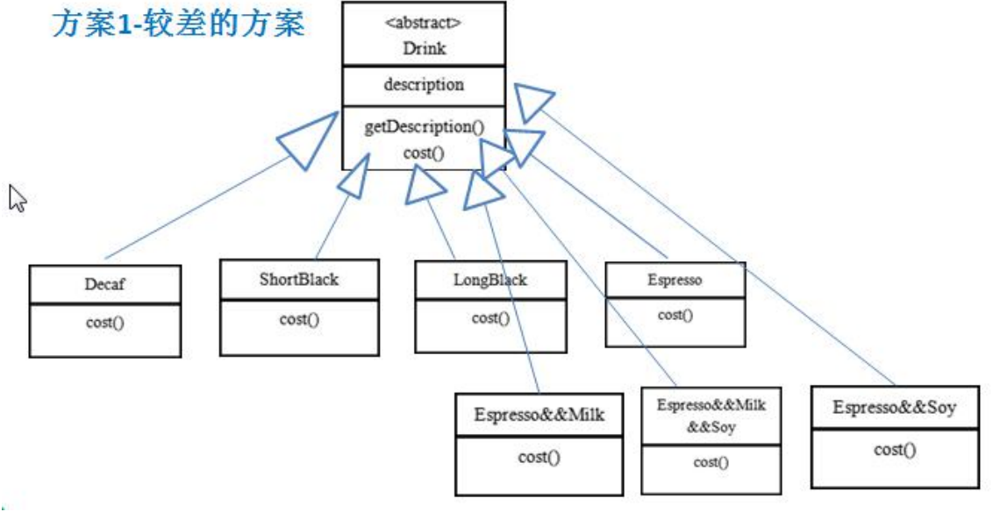

**问题分析**

- Drink 是一个抽象类，表示饮料
- des就是对咖啡的描述, 比如咖啡的名字
- cost() 方法就是计算费用，Drink 类中做成一个抽象方法
- Decaf 就是单品咖啡， 继承Drink, 并实现cost
- Espress && Milk 就是单品咖啡+调料， 这个组合很多
- 问题：这样设计，会有很多类，**当我们增加一个单品咖啡，或者一个新的调料， 类的数量就会倍增，就会出现类爆炸**

**优化方法一**

前面分析到方案1因为咖啡单品+调料 组合会造成类的倍增，因此可以做改进，将调料内置到Drink类，**这样就不会造成类数量过多**。从而提高项目的维护性。

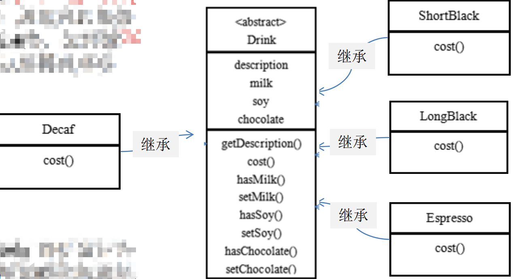

**问题分析**：

- 有效的缓解了类爆炸的问题
- 但是在扩展的时候（新增或修改配料的时候）代码维护量过大，不仅要新增类，还需要修改drink

优化方法二：**装饰者模式**

> **装饰者模式定义**

- 装饰者模式：**动态的将新功能附加到对象上**。**在对象功能扩展方面，它比继承更有弹性，装饰者模式也体现了开闭原则(ocp)** 

> **装饰者模式原理**

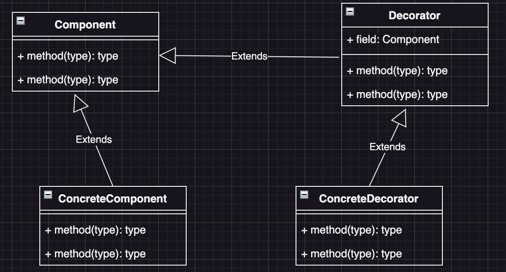

1. 装饰者模式就像打包一个快递

- 主体：比如：陶瓷、衣服 (Component) // 被装饰者
- 包装：比如：报纸填充、塑料泡沫、纸板、木板(Decorator) 

2. Component 主体：比如类似前面的Drink

3. ConcreteComponent和Decorator 
   1. ConcreteComponent：具体的主体， 比如前面的各个单品咖啡 
   2. Decorator: 装饰者，比如各调料

4. 在如图的Component与ConcreteComponent之间，如果 ConcreteComponent类很多,还可以设计一个缓冲层，将共有的部分提取出来， 抽象层一个类

## 10.2 装饰者模式解决需求

> **使用装饰者模式设计的方案**

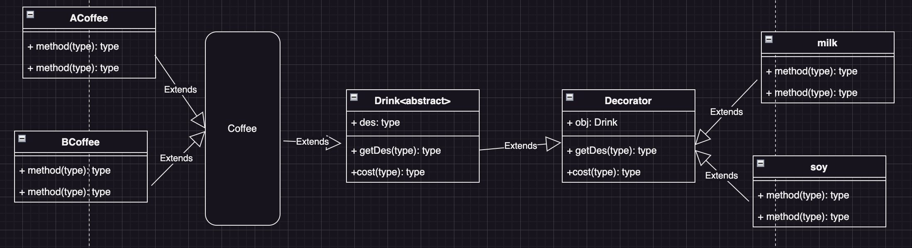

**说明**：

- Drink 类就是前面说的抽象类， Component
- ACoffee 就单品咖啡
- Decorator 是一个装饰类，含有一个被装饰的对象(Drink obj)
- Decorator 的cost 方法进行一个费用的叠加计算，递归的计算价格

> **代码示例**

Drink类

```java
/**
 * Drink类就是抽象的被装饰者，给具体的装饰者和被修饰者继承
 * @author cVzhanshi
 * @create 2023-09-05 15:16
 */
@Data
public abstract class Drink {
    // 描述
    private String des;

    // 价格
    private float price = 0.0f;

    // 计算费用的抽象方法
    // 子类来实现
    public abstract float cost();
}
```

Coffee类（缓冲层）

```java
/**
 * 缓冲层
 * @author cVzhanshi
 * @create 2023-09-05 15:32
 */
public class Coffee extends Drink {
    @Override
    public float cost() {
        return super.getPrice();
    }
}
```

具体的被装饰者——各种咖啡

```java
/**
 * @author cVzhanshi
 * @create 2023-09-05 15:33
 */
public class BCoffee extends Coffee {
    public BCoffee() {
        setDes("BCoffee");
        setPrice(3.0f);
    }
}

/**
 * @author cVzhanshi
 * @create 2023-09-05 15:33
 */
public class ACoffee extends Coffee {
    public ACoffee() {
        setDes("ACoffee");
        setPrice(5.0f);
    }
}
```

Decorator装饰类

```java
/**
 * Decorator 是一个装饰类，含有一个被装饰的对象(Drink obj)
 * @author cVzhanshi
 * @create 2023-09-05 15:59
 */
public class Decorator extends Drink{

    private Drink coffee;

    public Decorator(Drink coffee) {
        this.coffee = coffee;
    }

    @Override
    public float cost() {
        // 调料的价格 + coffee的总价格
        return coffee.cost() + super.getPrice();
    }

    @Override
    public String getDes() {
        return super.getDes() + " || " + coffee.getDes();
    }
}
```

具体的装饰类

```java
/**
 * @author cVzhanshi
 * @create 2023-09-05 16:09
 */
public class Milk extends Decorator {
    public Milk(Drink coffee) {
        super(coffee);
        setPrice(1.0f);
        setDes(" 牛奶 ");
    }
}

/**
 * @author cVzhanshi
 * @create 2023-09-05 16:10
 */
public class Soy extends Decorator {
    public Soy(Drink coffee) {
        super(coffee);
        setDes(" 糖 ");
        setPrice(9.0f);
    }
}
```

制作咖啡（允许效果）

```java
/**
 * @author cVzhanshi
 * @create 2023-09-05 16:11
 */
public class CoffeeBar {
    public static void main(String[] args) {
        // 装饰者模式下订一份A咖啡 + 一份糖 + 两份牛奶

        // 1、点一份a咖啡
        Drink aCoffee = new ACoffee();

        System.out.println("费用1 = " + aCoffee.cost());
        System.out.println("描述 = " + aCoffee.getDes());

        // 2、a咖啡加入一份糖
        aCoffee = new Soy(aCoffee);

        System.out.println("aCoffee 加入一份糖 费用 = " + aCoffee.cost());
        System.out.println("aCoffee 加入一份糖 描述 = " + aCoffee.getDes());

        //2、再加入两份份牛奶
        aCoffee = new Milk(aCoffee);
        System.out.println("aCoffee 加入一份糖 一份牛奶 费用 = " + aCoffee.cost());
        System.out.println("aCoffee 加入一份糖 一份牛奶 描述 = " + aCoffee.getDes());
        aCoffee = new Milk(aCoffee);
        System.out.println("aCoffee 加入一份糖 两份牛奶 费用 = " + aCoffee.cost());
        System.out.println("aCoffee 加入一份糖 两份牛奶 描述 = " + aCoffee.getDes());
    }
}

//   允许效果
//        费用1 = 5.0
//        描述 = ACoffee
//        aCoffee 加入一份糖 费用 = 14.0
//        aCoffee 加入一份糖 描述 =  糖  || ACoffee
//        aCoffee 加入一份糖 一份牛奶 费用 = 15.0
//        aCoffee 加入一份糖 一份牛奶 描述 =  牛奶  ||  糖  || ACoffee
//        aCoffee 加入一份糖 两份牛奶 费用 = 16.0
//        aCoffee 加入一份糖 两份牛奶 描述 =  牛奶  ||  牛奶  ||  糖  || ACoffee
```

## 10.3 装饰者模式在JDK中的应用

通过阅读源码可知jdk中的io结构就是一个很典型的装饰者模式

结构如下：

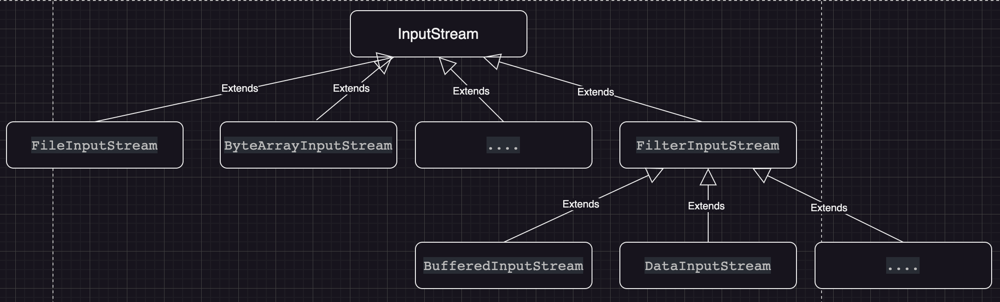

1. InputStream 是抽象类，类似我们前面讲的 Drink

```java
public abstract class InputStream implements Closeable {
  // ....
}
```

2. FilelnputStrearm 是 InputStream 子类，是具体的被装饰者类似我们前面的ACoffee、BCofee

3. FilterInputStream 是InputStream 子类：类似我们前面的 Decorator 修饰者 

```java
public class FilterInputStream extends InputStream {
  /**
  FilterinputStream 类有 protected volatile InputStream in；即含被装饰者 
   * The input stream to be filtered.
   */
  protected volatile InputStream in;
  // ...
  }
```

4. DatalnputStream 是 FilterinputStrcam 子类，具体的修饰者，类似前面的 Milk，Soy 等 

# 十一、组合模式


