# 第一章：计算机组成与体系结构

## ①数据的表示

 ### R进制-->十进制

> R进制转十进制使用按权展开法，其具体操作方式为:将R进制数的每一位数值用R^k形式表示，即幂的底数是R ,指数为k，k与该位和小数点之间的距离有关。当该位位于小数点左边，k值是该位和小数点之间数码的个数，而当该位位于小数点右边，k值是负值,其绝对值是该位和小数点

### 十进制-->R进制

> 十进制转R进制使用短除法

例如降94转化为二进制数

### 二进制、八进制、十六进制

> 由于2^3=8、2^4=16，所以一位八进制数可以转化为3位二进制数，一位十六进制的数可以转化位4位二进制数：如图所示：

- 图示可上下互相转化

**说明：十六进制大于10的数用A（10）、B（11）、C（12）、D（13）、E（14）、F（15）来表示**

### 原码、反码、补码、移码

- 原码： 一个数的原码就是用一个n位的二进制数 
- 反码： 反码就是在原码的基础上，符号位不变其他位按位取反(就是0变1，1变0) 
- 补码： 在反码的基础上按照正常的加法运算加1 
- 移码： 不管正负数，只要将其补码的符号位取反即可 

示例：

> 由图可知：
>
> - 用原码、反码计算1+（-1）会得出错误答案     **结论**：用移码进行计算
>
> - 原码与补码的转化   都是除符号位取反再加1

## ②数值表示范围

## ③浮点运算

存储结果

| 阶符             | 阶码 | 尾符             | 尾码 |
| ---------------- | ---- | ---------------- | ---- |
| 正数为0，负数为1 |      | 正数为0，负数为1 |      |

## ④计算机结构

- **运算器**
  - **算术逻辑单元ALU**：专门负责做算术运算，逻辑运算
  - **累加寄存器AC**：给ALU提供一个工作区
  - **数据缓冲寄存器DR**：提供缓冲区域
  - **状态条件寄存器**：各种条件的判断，溢出、为0等等。**它有时候可以算运算器有时候也可以算控制器**
- **控制器**
  - **程序计数器PC**：存放cpu将要执行的或访问的下一条指令
  - **指令寄存器IR**：暂存指令的
  - **地址寄存器DR**：记录cpu当前访问的地址 
  - **指令译码器ID**：计算机翻译指令
  - **时序部件**：

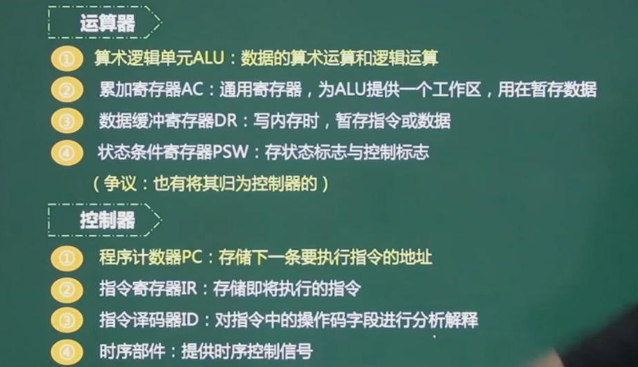

## ⑤计算机体系结构分类--Flynn

## ⑥指令的基本概念

> 一条指令就是机器语言的一个语句，它是一组有意义的二进制代码，指令的基本格式是
>
> 操作码字段	地址码字段

## ⑦寻址方式

## ⑧指令系统类型CISC与RISC

## ⑨流水线

### 概念

### 流水线计算

### 超标量流水线

> 不止一条流水线，有几条流水线就有几个度，
>
> 所有计算时间是：总时间/度数

### 流水线的吞吐率计算

> 流水线的吞吐率：单位时间内流水线所完成的任务数量或输出的结果数量

## ⑩层次化存储结构

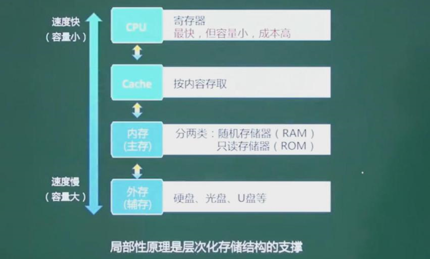

## 十一、Cache

### 概念

### 映像

- **直接相联映像**

- **全相联映像**

- **组相联映像**

## 十二、主存-编址与计算

> 1Byte(字节) = 8 位（bit）

> 解例题：
>
> 计算总容量：
>
> 高地址 - 低地址 + 1    =>   43FFH - 4000H + 1  =  400H  
>
> 转化为二进制              =>   0100 0000 0000   =>  2^10 
>
> 乘每个存储单元的容量 =>  2^10 * 16bit
>
> 每片容量 ：总容量/总片数  => 2^10 * 16bit /4   =  256 * 16bit

## 十三、总线

## 十四、串联系统和并联系统

> 其中R 是可靠度

同理混合型的可以先看并联，然后把并联当成一个整体串联

## 十五、检验码

- 奇偶校验

- 循环校验码CRC

- 海明校验码

# 第二章：操作系统

## ①进程管理

### 进程的概念

### 进程的状态

### 进程的同步与互斥

### PV操作

> 解析：当进行P操作时，信号量（临界资源）减一，如果信号量（临界资源）为负数，即已经没有了，就进入阻塞进程队列，等待进行V操作释放信号量（临界资源）。进行V操作时，信号量（临界资源）加一，如果信号量（临界资源）还小于0，证明阻塞进程队列还有进程，就唤醒其中一个，然后循环下去，知道S>0时执行下面的操作

> 解析：第一个使用打印机时执行P操作，打印机数量减一，用完之后，执行V操作，打印机数量+1,唤醒后面的人使用打印机

> 解析：生产一个产品，执行P(S1),生产完成，存放在缓存区中，唤醒消费者消费，执行V(S2),消费者进行消费，执行P(S2)操作，从缓存区那产品（数量减一），缓冲区没产品，就执行V(s1)操作，进行生产产品

> 解析：先解读简单的（收银员），收银员一开始是进行第一个购书者结账，所以执行的是P(S1),收费完成后要进行第二个购书者结账，但是由于第二结账者在阻塞进程中所以要执行V(S2)进行唤醒操作    所以第二个空选C
>
> 付款时先唤醒第一个购书者V(S1)，那么第二个购书者紧要进行等待进入阻塞队列，即执行P(S2)操作，所以第一个空选A

> 解析：有几个入的箭头就要等待几个进行执行完成即执行几个P操作，出去的时候要唤醒自己

### 死锁问题

> 解析：碰到上述例题，只需要给每个进程分配需要的资源数减一 的资源，然后系统还有一个资源没分配，就不会发生死锁，
>
> 如解上图例题：3+3+3+3+3+1 = 16

### 银行家算法

## ②存储管理

### 页式存储组织

### 段式存储组织

### 段页式存储组织

### 页面置换算法

### 磁盘管理

### 磁盘调度算法

### 读取磁盘数据时间计算

> 解析：先算读取一个文件的时间，找磁道的时间  10*10 因为要移动10个磁道
>
> ​		旋转延迟时间  100+2
>
> 读取一个总时间  100+2+10*10
>
> 100个：（100+2+10*10）*100

## ③作业管理

### 作业状态与作业管理

### 作业调度算法

> 其中  响应比 = 作业等待时间/作业执行时间

## ④文件管理

### 索引文件结构

### 树型目录结构

> 考察点：相对路径，绝对路径
>
> 按照D1   F2的相对路径为：W2/F2
>
> ​                        绝对路径为：/D1/W2/F2

## ⑤设备管理

### 数据传输控制方式

> 其中DMA不会影响CPU

### 虚设备与SPOOLING技术

# 第三章：数据库系统

## ①三级模式-两层映射

## ②数据库设计过程

## ③E-R模型

- 1：1联系

- 1：n联系

- n-m联系

- 总结

> 解析例题：首先，A,B,C单独的关系模式一定要有     3
>
> ​					  D(A,B,C),合起来的也要有    1 
>
> 所以最少四个

## ④关系代数

> 差的话，S1-S2  是以S1为基础减去  共有的记录

## ⑤规范化理论-范式

### 键

### 求候选键

### 求候选键实例

> 解析：
>
> 例题1：1、先看没有入度的点A1 - >A2 -> A4,A3能够遍历全部的点所以A1是候选键
>
> 
>
> 例题2：
>
> 先看没有入度的点：C->J,I
>
> ​								  A->E,G,H
>
> ​								  B->E,G,H,F
>
> ​								  D->E
>
> 由此可知：候选键是A,B,D,C
>
>  
>
> 例题3：
>
> ①A  -> B,C
>
> ②B  ->A,C
>
> ③A,B -> C
>
> 所以选B，其中A表示只有情况1，而B则有三种情况

### 主属性与非主属性

> 其中（CITY,ST），（ST,ZIP）都是候选码，所有三个属性都是非主属性

### 范式

- 第一范式  ---属性不可分

- 第二范式   ---没有不完全依赖

> 解决方案：把这个表拆分成多个表
>
> （学号，课程号，成绩）
>
> （课程号，学分）

- 第三范式   --没有传递依赖

> 解决方案：
>
> （学号，姓名，系号）
>
> （系号，系名，系位置）

- BC范式

> 解析：其中候选码组合可以为：（S,J）,(S,T)  每个属性都是候选码组合中的，所以是BC范式

- 总结

## ⑥规范化理论-模式分解

> 解析：第一个分解，在R1中可以保存依赖A->BC ,BC_>E,E->A;在R2中保存了C->D
>
> ​			所以关系都保存了
>
> ​		第二个分解并没有保存全部的依赖

### 无损分解

### 判断无损分解（表格法）

> 只要有其中的一行对应所有的属性都有√，就是无损分解

### **判断无损分解（公式法）**

说明：此方法只适用于分解成两个

> 解析：R1交R2->A   ,R1-R2 -> B,R2-R1->C,所以存在 A -> B或A->C,有原有的依赖，所以是无损分解
>
> 第二个分解：R1交R2->B   ,R1-R2 -> A,R2-R1->C,所以存在 B -> A或B->C,没有保存原有的依赖，所以不是无损分解

# 第四章：计算机网络与信息安全

## ①OSI/RM七层模型

> - 传输层发送的是报文
> - 网络层发送的是包
> - 数据链路层发送的是帧
> - 物理层以二进制传输

> 主要设备
>
> - 中继器：为了让物理层传输不失真
> - 集线器：分流的
> - 交换机：存在广播风暴问题
> - 路由器：能解决交换机的广播风暴问题
> - 三层交换机：同样有路由的功能
>
> 协议：
>
> - 传输控制协议（TCP）、用户数据报协议（UDP）
>   - TCP面向连接的服务（安全、可靠），UDP无连接（不安全）
> - ARP （地址解析协议ip->mac地址）、RARP（mac地址->ip地址）、ICMP（因特网控制协议）、IGMP（网关控制协议）
> - 数据链路层的协议：PPTP、L2TP、SLIP、PPP

## ②TCP/IP协议族

## ③IP地址

> - A类地址：网络号8位（0~127），主机号24位（有2^24-2个主机号）
> - B类地址：网咯号16位（128~191），主机号16位（有2^16-2个主机号）
> - C类地址：网络号24位（192~），主机号8位（有2^8  - 2个主机号）

## ④子网划分

## ⑤网络规划与设计

## ⑥计算机网络分类

## ⑦网络接入技术

## ⑧HTML

## 信息安全

### ①对称加密技术

> 常见的对称加密算法：DES、3DES、RC-5、IDEA，用的是同一套密钥

### ②非对称加密技术

> 发送者使用接收者的公钥加密
>
> 常见的算法：RSA、ECC

### ③数字签名

> 发送者用自己的私钥签名

### ④信息摘要

### ⑤PKI公钥体系

### ⑥网络安全-各个网络层次的安全保障

### ⑦网络安全-主动攻击与被动攻击

### ⑧网络安全-DoS(拒绝服务)与DDoS

### ⑨网络安全-防火墙

> web服务器（既要服务外网也要服务内网的放屏蔽子网内）

### ⑩安全防范体系

- **病毒与木马**

>病毒：直接破坏计算机功能或数据
>
>木马：主要位窃取、监听数据

# 第五章：系统开发基础

## ①软件开发模型

- 瀑布模型

> 其中的问题：
>
> - 在需求分析一旦确定了需求，后续就不应该有大的变动，不然会影响后续的步骤
> - 只有编码后面有软件测试，一般绝大多数的测试错误是在需求分析的时候，而不是程序员编码的问题

- V模型

> 问题：
>
> - 同样的问题，只有在编码后面才有测试

- 喷泉模型

> 特点：
>
> - 面向对象的开发模型
> - 每个阶段没有明确的界限

- 螺旋模型

> 使用与开发高风险的项目，但是成本高

- 统一过程

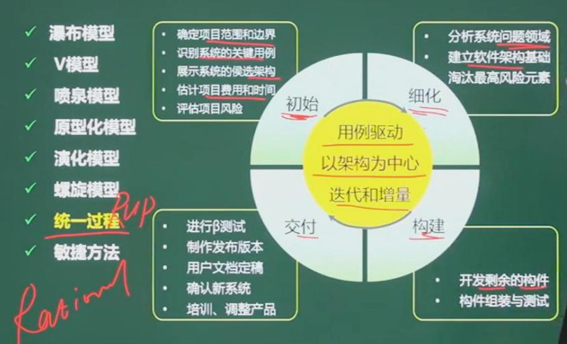

- 敏捷方法

- **敏捷开发方法**

## ②软件开发方法

 

## ③需求分析（做什么）

> 判定表包括四项：基本条件项、条件项、基本动作项、动作项

## ④软件设计（怎么做）

## ⑤软件测试

> 解例题：
>
> 等价类划分：由题意得0~59、60~69、70~79、80~89、90~100是五个有效等价类，小于0，大于100是两个无效等价类，从每个等价类中取出一个数据案例用作示例
>
> 边界值分析：0，60，70，80，90，100都是边界值，那么去每个边界值的等于、稍小于、稍大于值作为测试例子；如-1，0，1、59，60，61....

### McCabe复杂度（环路复杂度）

> 也可以是封闭区间数（不算重叠）+1 = 环路复杂度

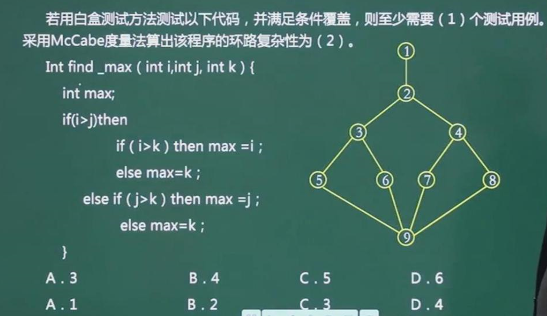

## ⑥软件维护

## ⑦软件工程

### 软件文档管理指南-按阅读时对象分类

### 软件质量保证

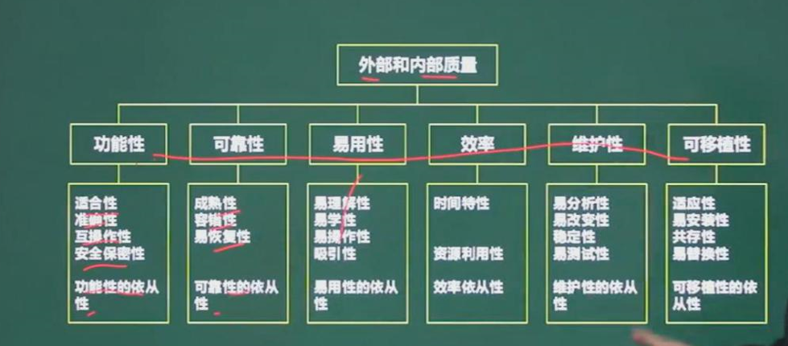

### 软件过程改进 - CMMI

## ⑧项目管理

## ⑨时间管理

### 关键路径法

### 前导图法（单代号网络图）

> 其中求关键路径就是求最长工期的那条路

## ⑩活动排序-箭线图法（双代号网络图）

### 十一、项目管理

# 第六章：面向对象技术

## ①面向对象的基本概念

## ②UML

## ③类图

## ④面向对象设计 - 设计模式的分类

### 创建型模式

### 结构型模式

### 行为型模式

## ⑤创建型模式

## ⑥结构性模式

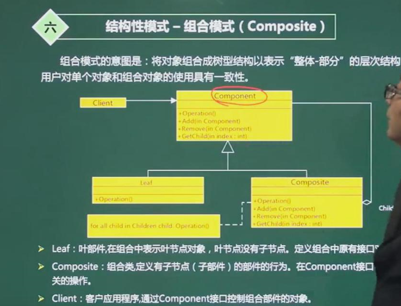

## ⑦行为性模式

# 第7章：数据结构与算法基础

## ①数组

> 解析例题：因为是按行优先存储，所以运用公式 （2*5+3），因为每个元素占两个字节，所以存储地址为：a + (2×5+3) ×2

## ②稀疏矩阵

> 说明：能存储的元素个数为：((n×n)-n)/2，转化成一维数组是求下标，用带入发

## ③线性表

### 链式存储与线式存储的对比

### 队列和栈

> 解析：循环队列：判断队空：head = tail
>
> ​								判断队满 ：（tail+1）%总长度 = head
>
> 解析习题：有五种，不一定要一起进栈后才能出来
>
> ​				abc、acb、bac、bca、cba

## ④广义表

## ⑤树与二叉树

> 其中：
>
> 树的度：结点的度的最大值
>
> 分支节点：度不为0的结点
>
> 内部节点：除了根结点、叶子结点里面的

### 二叉树遍历

### 反向构造二叉树

### 树转二叉树

### 查找二叉树

### 最优二叉树（哈夫曼树）

> 解析例题：
>
> 1、先找最小的两个数5，3分别作为结点，其父结点为她两的和8
>
> 2、去掉原来序列的5，3，加上8
>
> 3、找出最小的数与新加的做比较，7<8,7与8作为结点，把其父结点15加入序列中，删除7，和新加入的8
>
> 4、找出最小的数与新加的做比较。8，11<15,把8，11放在右边做结点，其父结点为19加入序列中，删除8，11
>
> 5、同理14<19在左边与15合成29的父结点，加入序列中
>
> 循环得出答案。。。。

### 线索二叉树

### 平衡二叉树

> 任意结点的左右子树深度相差不超过1

## ⑥图

### 基本概念

### 邻接矩阵

### 邻接表

### 图的遍历

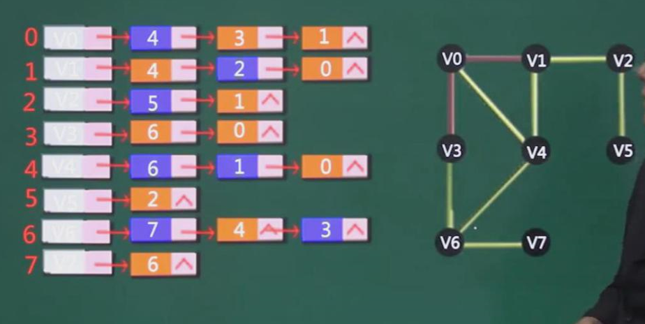

### 拓扑排序

### 最小生成树

## ⑦算法基础

### 算法的特性

### 算法的复杂度

### 顺序查找

### 二分查找

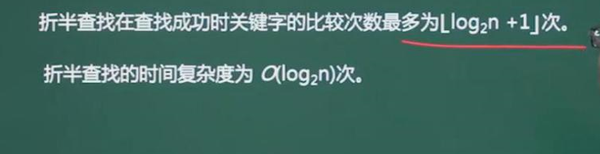

### 散列表

## ⑧排序

### 直接插入排序

### 希尔排序

### 直接选择排序

### 堆排序

### 冒泡排序

### 快速排序

### 归并排序

### 基数排序

### 各大排序对比

# 第八章：程序设计语言与语言处理程序基础

## ①编译过程

## ②文法定义

## ③语法推导树

### ④有限自动机

### ⑤正规式

## ⑥数据类型与程序控制结构

## ⑦程序语言基础

### 表达式

## ⑧函数调用-传值与传址

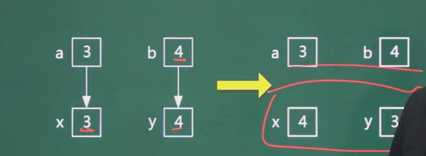

## ⑨程序语言基础-各类程序语言特点

# 第九章：多媒体基础知识

## ①音频相关概念

## ②图像相关概念

## ③图形与图像相关概念

## ④媒体的种类

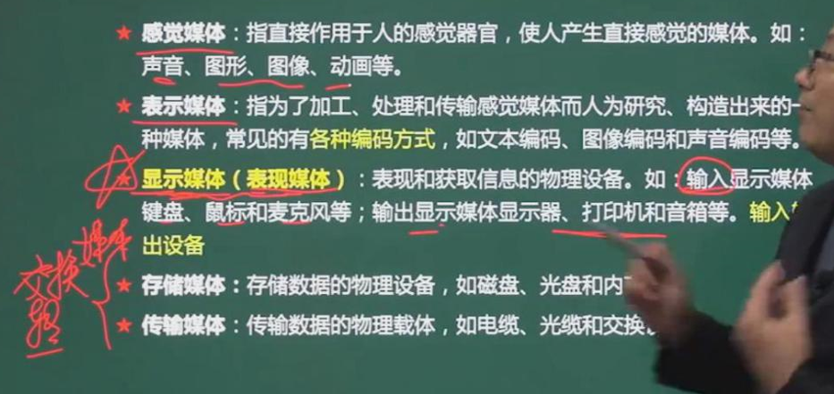

## ⑤数据压缩基础

## ⑥有损压缩与无损压缩

## ⑦常见多媒体标准

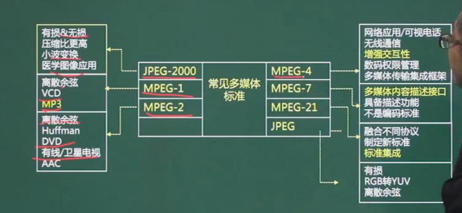

# 第十章：知识产权与标准化

## ①保护范围和对象

## ②保护期限

## ③知识产权人确定

## ④侵权判定

## ⑤标准化基础知识-标准的分类

## ⑥标准化基础知识-标准的编号

------

> 下午题

-------

# 第十一章：数据流图

## ①数据流图基本概念

## ②数据字典

## ③数据流图平衡原则

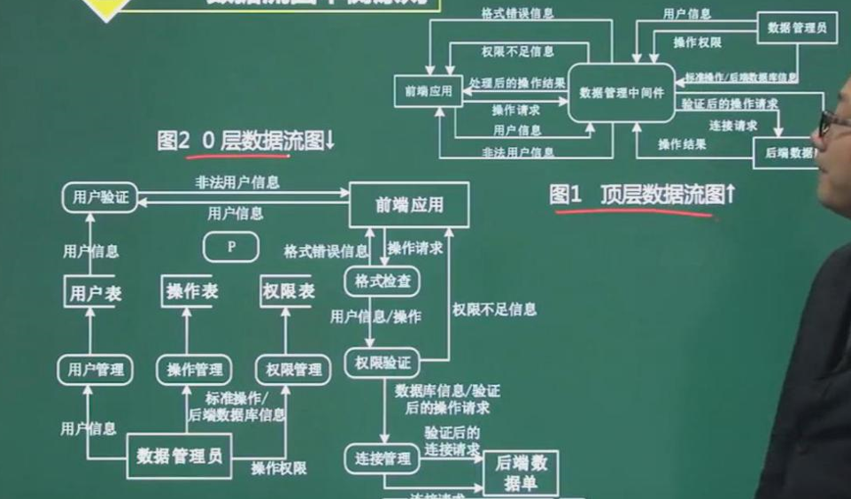

## ④答题技巧

## ⑤真题讲解

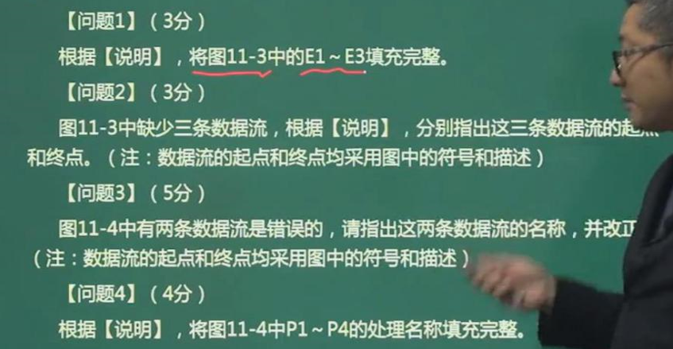

# 第十二章：数据库设计

## ①数据库设计过程

## ②ER模型-实体间联系类型

## ③E-R图向关系模型的转换

## ④ 真题

# 第十三章：UML建模

## ①用例图

## ②包含、扩展、泛化

## ③类图与对象图

## ④顺序图

## ⑤活动图

## ⑥状态图

## ⑦通信图

## ⑧构件图

## ⑨部署图

## ⑩真题

# 第十四章：数据结构与算法

## ①分治法

### 递归技术

### 二分查找

## ②回溯法

## ③贪心法

## ④动态规划

## ⑤常见算法特征总结

## ⑥时间复杂度

# 做题笔记

- 处理过程中保 存现场的目的是**返回去继续执行原程序** 

-  流水线的吞吐率是指单位时间流水线处理的任务数，如果各段流水的操作时间不同，则 流水线的吞吐率是**最长流水段操作时间**的倒数 
-  网络管理员通过命令行方式对路由器进行管理，要确保 ID、口令和会话内容的保密性， 应采取的访问方式是 **SSH** 

> 

-  在网络安全管理中，加强内防内控可采取的策略有
  -  **终端访问授权，防止合法终端越权访问**
  - **加强终端的安全检查和策略管理**
  - **加强员工.上网行为管理与违规审计**

- 关于**计算机软件著作权**的叙述：

> - 《计算机软件保护条例》2001年12月20日以中华人民共和国国务院令第339号公布。
> - 不要把软件开发者理解成写代码的那个人。《计 算机软件保护条例涕九条明确规定:软件著作权属于软件开发者，本条例另有规定的除外。如无相反证明，在软件上署名的自然人、法人或者其他组织为开发者。
> - 软件著作权属于软件开发者，软件著作权自软件开发完成之日产生
> - 利用单位的物质技术条作进行创作.并由单位承担责任的有合同约定，除署名权的其它著作权属于单位

- **数据字典**

> 

- **COCOMO I1的层次结构**中有3种不同规模估算选择:**对象点、功能点和代码行**
- **编译方式生成 **逻辑上与源程序等价的**目标程序**，解释方式不生成
- 互斥信号其初始值为1,资源信号量其初值为资源的个数，同步信号量其初值为0
- 若系统在将**目录**文件修改的结果写回磁盘时发生崩溃，则对系统的影响相对较大
- 若用循环单链表表示队列，则入队列和出队列操作都不需要遍历链表
- 在程序执行过程中，Cache与主存的地址映射是由**硬件自动**完成的 
- 海明码利用奇偶性进行检错和纠错
- 计算机运行过程中，CPU需要与外设进行数据交换。采用**中断方式和DMA方式**控制技术时， CPU与外设可并行工作
- 索引对应外模式；视图对应概念模式；基本表对应内模式 
- 计算机系统中常用的输入/输出控制方式有无条件传送、中断、程序查询和 DMA 方式等。当采用**DMA**方式时，不需要 CPU 执行程序指令来传送数据
- 软件工程的基本要素包括**方法、工具和过程**
- 机房安全属于物理安全，入侵检测属于网络安全，漏洞补丁管理属于系统安全，而数据库安全则是应用安全  
- 计算机系统中的CPU内部对**通用寄存器**的存取操作是**速度最快**的，其次是Cache,内存的存取速度再次，选项中访问速度**最慢**的就是作为外存的**硬盘**。  
- 风险的优先级通常是根据**风险暴露**设定
- 嵌入式系统初始化过程可以分为3个主要环节，按照自底向上、从硬件到软件的次序依次为：**片级初始化、板级初始化和系统级初始化** 
  - 片级初始化把嵌入式微处理器从上电时的默认状态逐步设置成系统所要求的工作状态
  - 板级初始化完成嵌入式微处理器以外的其他硬件设备的初始化 
  - 系统初始化过程以软件初始化为主，主要进行操作系统的初始化
- 软件评审的内容包括设计质量评审、程序质量评审和与运行环境接口的评审。**评审的主要目标是为了发现软件中的错误**
-  优先队列通常采用**堆**数据结构实现，向优先队列中插入—个元素的时间复杂度为 Θ(lgn )
- 前驱图：箭头开始是v操作，结束是p操作
- 所有出现在→左边，且不出现在→右边的属性，都是主键
-  DMA 控制方式是在**主存与外设**之间直接建立数据通路进行数据的交换处理
-  在**循环冗余**校验方法中,采用模 2 运算来构造校验位
- 利用PV操作可以**实现资源的互斥使用**

# 重要例题

> 
>
> 解析：在网络图中的某些活动可以并行地进行，所以完成工程的最少时间是从开始顶点到结束顶点的最长路径长度，从开始顶点到结束顶点的最长(工作时间之和最大)路径为关键路径，关键路径上的活动为关键活动。
>
> 本题关键路径为: A-B-D-G-I-K-L， 共22天。
>
> EH的松弛时间是22- ( 2+3+2+4+6) =5天。
>
> IJ的松弛时间是22- (2+5+2+6+3+1) =3天。

------

> 
>
> 

-----

> 
>
> 

-----

> 
>
> 

-----

> 
>
> 

-----

>

-----

> 
>
> 

-----

>

-----

> 
>
> 解析： 一级索引需要使用一个磁盘块来保存直接索引的块号 ，一个磁盘块可以保存的块号的个数为1024/3=341. 所以，采用一级索引时，文件最大长度为 341×1KB = 341KB。
>
>  采用二级索引时的文件最大长度为 341KB*341 = 116281字节

-------

>  **所有出现在→左边，且不出现在→右边的属性，都是主键** 
>
> 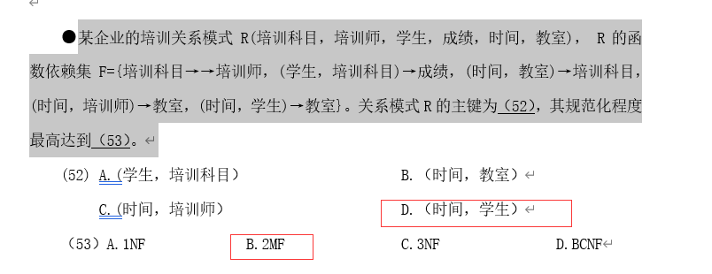
>
> 

-----

> 
>
> 解析：采样频率大于等于工作频率的二倍，才能在以后恢复出实际波形，防止信息的丢失  

-----

> 
>
> 解析：
>
> 

------

> 

# 冲刺视频讲义及笔记

## 软件开发模型

- 瀑布模型

> 所强调的的是需求必须是稳定的

- 原型化模型

> 对需求的明确性最低的模型，适用于需求不稳定的时候

- 螺旋模型

> 综合了多种模型，瀑布、原型等等，还考虑到了风险因素

- 敏捷方法

> 轻量级的方法，小步快跑

## McCabe复杂度计算

V(G) = m - n +2   => 边- 点 + 2

> 扩展：封闭图形数 + 1

## 软件维护

## UML

> 部署图（结构图）：软硬件之间的映射
>
> 行为图：
>
> ​	用例图：系统与外部参与者的交互
>
> ​	顺序图：强调时间顺序
>
> ​	通信图：（协作图）
>
> ​	状态图：状态转换
>
> ​	活动图：类似程序流程图，并性行为

## 类图

## 设计模式