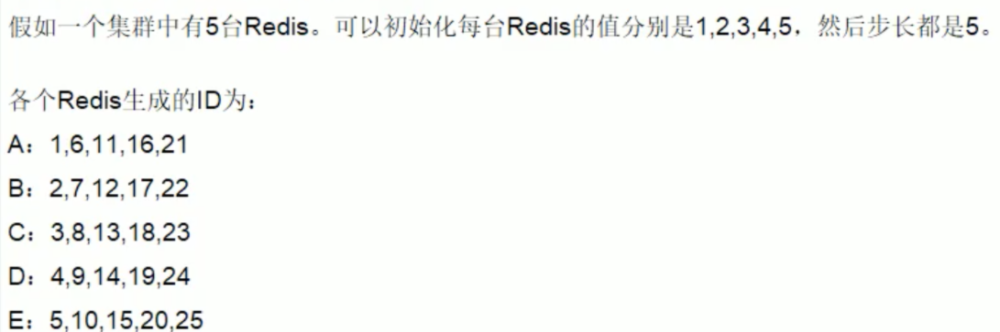
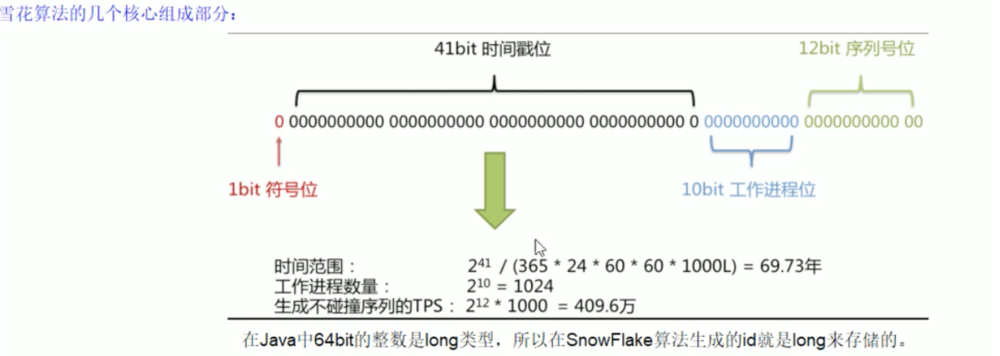
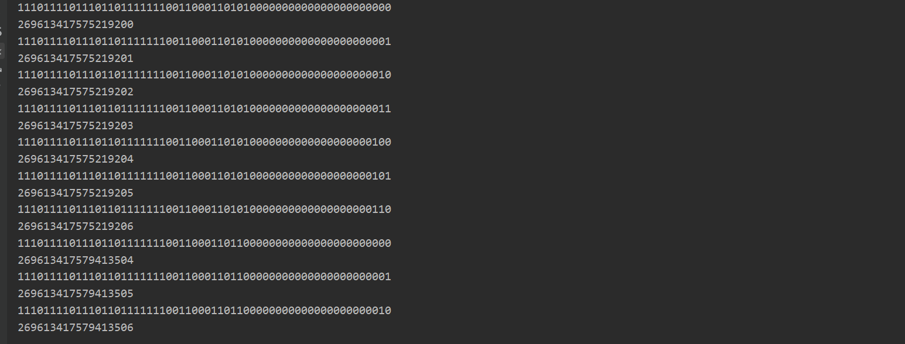
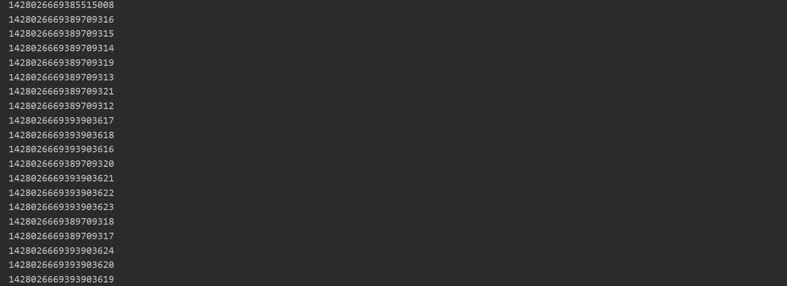

# 雪花算法

> 使用场景：集群高并发情况下分布式唯一全局Id的生成

## 雪花算法的需求分析

> **为什么需要分布式全局唯一ID以及分布式ID的业务需求**

- 在复杂分布式系统中，往往需要对大量的数据和消息进行唯一标识
- 如在美团点评的金融、支付、餐饮、酒店;猫眼电影等产品的系统中数据日渐增长，对数据分库分表后需要有一个唯一ID来标识一 条数据或消息，特别一点的如订单、骑手、优惠券也都需要有唯一ID做标识。
  此时一个能够生成全局唯一-ID的 系统是非常必要的。

> **ID生成规则部分硬性要求**

- **全局唯一**：不能出现重复的ID号，既然是唯一标识，这是最基本的要求
- **趋势递增**：在MySQL的InnoDB引擎中使用的是聚集索引，由于多数RDBMS使用Btree的数据结构来存储索引数据，在主键的选择.上面我们应该尽量使用有序的主键保证写入性能
- **单调递增**：保证下一个ID一定大于上一个ID，例如事务版本号、IM增量消息、排序等特殊需求
- **信息安全**：如果ID是连续的，恶意用户的扒取工作就非常容易做了，直接按照顺序下载指定URL即可;如果是订单号就更危险了，竞对可以直接知道我们一天的单量。所以在一些应用场景下，需要ID无规则不规则，让竞争对手不好猜。
- **含时间戳**：这样就能够在开发中快速了解这个分布式id的生成时间

> **ID号生成系统的可用性要求**

- **高可用**：发一个获取分布式ID的请求，服务器就要保证99.999%的情况下给我创建一个唯一分布式ID
- **低延迟**：发一个获取分布式ID的请求，服务器就要快，极速
- **高QPS**：假如并发一口气10万个创建分布式ID请求同时杀过来，服务器要顶的住且一下子成功创建10万个分布式ID

## 对上述需求的一般通用方案

> **UUID**

**UUID**(Universally Unique ldentifier)的标准型式包含32个16进制数字，以连字号分为五段，形式为8-4-4-4-12的36个字符， 示例：550e8400-e29b-41d4-a716-446655440000

- 如果只考虑**唯一性**是OK的，**性能非常高，本地生成，没有网络消耗**

- 但是UUID的生成是无序的。

  > - 无序，无法预测他的生成顺序，不能生成递增有序的数字。
  > - 首先分布式id-一般般都会作为主键，但是安装mysq|官方推荐主键要尽量越短越好，UUID每-一个 都很长，所以不是很推荐。
  > - 索引，B+树索引的分裂
  >   既然分布式id是主键，然后主键是包含索引的，然后mysq|的索引是通过b+树来实现的，每一 次新的UUID数据的插入，为了查询的优化，都会对索引底层的b+树进行修改，因为UUID数据是无序的，所以每一次UUID数据的插入都会对主键的b+树进行很大的修改，这一点很不好。 插入完全无序，不但会导致一些中间节点产生分裂，也会白白创造出很多不饱和的节点，这样大大降低了数据库插入的性能

> **数据库自增主键** —— 单机

- 在分布式里面，数据库的自增ID机制的主要原理是:数据库自增ID和mysq|数据库的replace into实现的
- 这里的replace into跟insert功能类似，
  不同点在于: replace into首先尝试插入数据列表中，如果发现表中已经有此行数据(根据主键或唯一索引判断)则先删除，再插入。否则直接插入新数据。
  **REPLACE INTO的含义是插入一条记录，如果表中唯一索引的值遇到冲突，则替换老数据。**


> **数据库自增主键** —— 集群分布式

- 那数据库自增ID机制适合作分布式ID吗?

  答案是**不太适合**。要看数据量中小型还是可以的

- 系统水平扩展比较困难，比如定义好了步长和机器台数之后，如果要添加机器该怎么做?假设现在只有一台机器发号是1,2,3.4,5 (步长是1)，这个时候需要扩容机器一台。 可以这样做:把第二台机器的初始值设置得比第- - 台超过很多，貌似还好，现在想象一下如果我们线上有100台机器，这个时候要扩容该怎么做?简直是噩梦。所以系统水平扩展方案复杂难以实现。
- 数据库压力还是很大，每次获取ID都得读写一次数据库， 非常影响性能，不符合分布式ID里面的延迟低和要高QPS的规则(在高并发下，如果都去数据库里面获取id,那是非常影响性能的)

> **基于Redis生成全局id策略**

- **因为Redis是单线程的天生保证原子性，可以使用原子操作INCR和INCRBY来实现**
- 注意:在Redis集群情况下，同样和MySQL一样需要设置不同的增长步长，同时key一定要设置有效期
- 可以使用Redis集群来获取更高的吞吐量



## 雪花算法(snowflake)

### 概述

twitter的snowflake解决了这种需求，最初Twitter把存储系统从MySQL迁移到Cassandra(由Facebook开发一套 开源分布式NoSQL数据库系统)因为Cassandra没有顺序ID生成机制，所以开发了这样一套全局唯一ID生成服务 。

Twitter的分布式雪花算法SnowFlake，经测试snowflake 每秒能够产生26万个自增可排序的ID

- twitter的SnowFlake生成ID能够按照时间有序生成
- SnowFlake 算法生成id的结果是一 个64bit大小的整数，为一个Long型(转换成字符串后长度最多19)。
- 分布式系统内不会产生ID碰撞(由datacenter和workerld作区分)并且效率较高。

-----

分布式系统中，有- .些需要使用全局唯- -ID的场景， 生成ID的基本要求

- 在分布式的环境下必须全局且唯一 。
- 一般都需要单调递增,因为一般唯一ID都会存到数据库,而Innodb的特性就是将内容存储在主键索引树上的叶子节点,而且是从左往右,递增的,所以考虑到数据库性能, 一般生成的id也最好是单调递增。为了防止ID冲突可以使用36位的UUID.但是UUID有一些缺点，首先他相对比较长，另外UUID般是无序的
- 可能还会需要无规则,因为如果使用唯一ID作 为订单号这种,为了不然别人知道一- 天的订单量是多少,就需要这个规则。

### 结构



- **1bit**
  不用，因为二进制中最高位是符号位，1表示负数，0表示正数。
  生成的id一般都是用整数，所以最高位固定为0。
- **41bit-时间戳，用来记录时间戳，亳秒级**。
  41位可以表示2^{41}-1个数字，
  如果只用来表示正整数(计算机中正数包含0)，可以表示的数值范围是: 0至2^{41}-1， 减1是因为可表示的数值范围是从0开始算的，而不是1.也就是说41位可以表示2^{41}-1个毫秒的值，转化成单位年则是(2^[(41}-1)/ (1000* 60 * 60 * 24 *365)= 69年

- **10bit-工作机器id,用来记录工作机器id**.
  可以部署在2^{10}= 1024个节点，包括5位datacenterld和15位workerld
  5位(bit) 可以表示的最大正整数是2^{5}-1=31，即可以用0、1. 2、3、..这32个数字来表示不同的datecenterld或workerld

- 12bit-序列号，序列号，用来记录同毫秒内产生的不同id.

  12位(bit) 可以表示的最大正整数是2^{12}-1 = 4095，即可以用0、1、2、3、...4094这4095个数字,
  来表示同一-机器同一时间截(毫秒)内产生的4095个ID序号。

> SnowFlake可以保证：
> 	所有生成的id按时间趋势递增
> 	整个分布式系统内不会产生重复id (因为有datacenterld和workerld来做区分)

### 源码

twitter的雪花算法：https://github.com/twitter-archive/snowflake

GitHub上java版的雪花算法：
https://github.com/beyondfengyu/SnowFlake/blob/master/SnowFlake.java
https://github.com/souyunku/SnowFlake/blob/master/SnowFlake.java

```java
public class SnowflakeIdWorker {
    // ==============================Fields==================
    /** 开始时间截 (2019-08-06) */
    private final long twepoch = 1565020800000L;

    /** 机器id所占的位数 */
    private final long workerIdBits = 5L;

    /** 数据标识id所占的位数 */
    private final long datacenterIdBits = 5L;

    /** 支持的最大机器id，结果是31 (这个移位算法可以很快的计算出几位二进制数所能表示的最大十进制数) */
    private final long maxWorkerId = -1L ^ (-1L << workerIdBits);

    /** 支持的最大数据标识id，结果是31 */
    private final long maxDatacenterId = -1L ^ (-1L << datacenterIdBits);

    /** 序列在id中占的位数 */
    private final long sequenceBits = 12L;

    /** 机器ID向左移12位 */
    private final long workerIdShift = sequenceBits;

    /** 数据标识id向左移17位(12+5) */
    private final long datacenterIdShift = sequenceBits + workerIdBits;

    /** 时间截向左移22位(5+5+12) */
    private final long timestampLeftShift = sequenceBits + workerIdBits + datacenterIdBits;

    /** 生成序列的掩码，这里为4095 (0b111111111111=0xfff=4095) */
    private final long sequenceMask = -1L ^ (-1L << sequenceBits);

    /** 工作机器ID(0~31) */
    private long workerId;

    /** 数据中心ID(0~31) */
    private long datacenterId;

    /** 毫秒内序列(0~4095) */
    private long sequence = 0L;

    /** 上次生成ID的时间截 */
    private long lastTimestamp = -1L;

    //==============================Constructors====================
    /**
     * 构造函数
     * @param workerId 工作ID (0~31)
     * @param datacenterId 数据中心ID (0~31)
     */
    public SnowflakeIdWorker(long workerId, long datacenterId) {
        if (workerId > maxWorkerId || workerId < 0) {
            throw new IllegalArgumentException(String.format("worker Id can't be greater than %d or less than 0", maxWorkerId));
        }
        if (datacenterId > maxDatacenterId || datacenterId < 0) {
            throw new IllegalArgumentException(String.format("datacenter Id can't be greater than %d or less than 0", maxDatacenterId));
        }
        this.workerId = workerId;
        this.datacenterId = datacenterId;
    }

    // ==============================Methods=================================
    /**
     * 获得下一个ID (该方法是线程安全的)
     * @return SnowflakeId
     */
    public synchronized long nextId() {
        long timestamp = timeGen();

        //如果当前时间小于上一次ID生成的时间戳，说明系统时钟回退过这个时候应当抛出异常
        if (timestamp < lastTimestamp) {
            throw new RuntimeException(
                String.format("Clock moved backwards.  Refusing to generate id for %d milliseconds", lastTimestamp - timestamp));
        }

        //如果是同一时间生成的，则进行毫秒内序列
        if (lastTimestamp == timestamp) {
            sequence = (sequence + 1) & sequenceMask;
            //毫秒内序列溢出
            if (sequence == 0) {
                //阻塞到下一个毫秒,获得新的时间戳
                timestamp = tilNextMillis(lastTimestamp);
            }
        }
        //时间戳改变，毫秒内序列重置
        else {
            sequence = 0L;
        }

        //上次生成ID的时间截
        lastTimestamp = timestamp;

        //移位并通过或运算拼到一起组成64位的ID
        return ((timestamp - twepoch) << timestampLeftShift) //
            | (datacenterId << datacenterIdShift) //
            | (workerId << workerIdShift) //
            | sequence;
    }

    /**
     * 阻塞到下一个毫秒，直到获得新的时间戳
     * @param lastTimestamp 上次生成ID的时间截
     * @return 当前时间戳
     */
    protected long tilNextMillis(long lastTimestamp) {
        long timestamp = timeGen();
        while (timestamp <= lastTimestamp) {
            timestamp = timeGen();
        }
        return timestamp;
    }

    /**
     * 返回以毫秒为单位的当前时间
     * @return 当前时间(毫秒)
     */
    protected long timeGen() {
        return System.currentTimeMillis();
    }

    //==============================Test=============================================
    /** 测试 */
    public static void main(String[] args) {
        SnowflakeIdWorker idWorker = new SnowflakeIdWorker(0, 0);
        for (int i = 0; i < 10; i++) {
            long id = idWorker.nextId();
            System.out.println(Long.toBinaryString(id));
            System.out.println(id);
        }
    }
}
```

测试结果：

### Spring Boot整合雪花算法

- 新建spring boot项目

- 除了spring boot需要的依赖，另外导入测试雪花算法需要的依赖

```xml
 <!--hutool 引入糊涂工具包（图片验证码实现），测试雪花算法-->
<dependency>
    <groupId>cn.hutool</groupId>
    <artifactId>hutool-captcha</artifactId>
    <version>5.7.5</version>
</dependency>

<!--或-->
<!--糊涂工具包全家桶 -->
<dependency>
    <groupId>cn.hutool</groupId>
    <artifactId>hutool-all</artifactId>
    <version>5.7.5</version>
</dependency>
```

- 编写工具类IdGeneratorSnowflake

```java
/**
 * @author cVzhanshi
 * @create 2021-08-19 0:06
 */
@Slf4j
@Component
public class IdGeneratorSnowflake {

    private long workerId = 0;  //第几号机房
    private long datacenterId = 1;  //第几号机器
    private Snowflake snowflake = IdUtil.createSnowflake(workerId, datacenterId);

    @PostConstruct  //构造后开始执行，加载初始化工作
    public void init(){
        try{
            //获取本机的ip地址编码
            workerId = NetUtil.ipv4ToLong(NetUtil.getLocalhostStr());
            log.info("当前机器的workerId: " + workerId);
        }catch (Exception e){
            e.printStackTrace();
            log.warn("当前机器的workerId获取失败 ----> " + e);
            workerId = NetUtil.getLocalhostStr().hashCode();
        }
    }

    public synchronized long snowflakeId(){
        return snowflake.nextId();
    }

    public synchronized long snowflakeId(long workerId, long datacenterId){
        Snowflake snowflake = IdUtil.createSnowflake(workerId, datacenterId);
        return snowflake.nextId();
    }

    //测试
    public static void main(String[] args) {
        System.out.println(new IdGeneratorSnowflake().snowflakeId());   //1428025721380536320S
    }
}
```

- service

```java
/**
 * @author cVzhanshi
 * @create 2021-08-19 0:07
 */
@Service
public class OrderService {

    @Autowired
    private IdGeneratorSnowflake idGenerator;

    public String getIDBySnowFlake() {
        //新建线程池（5个线程）
        ExecutorService threadPool = Executors.newFixedThreadPool(5);

        for (int i = 1; i <= 20; i++) {
            threadPool.submit(() -> {
                System.out.println(idGenerator.snowflakeId());
            });
        }

        threadPool.shutdown();

        return "hello snowflake";
    }
}
```

- controller

```java
/**
 * @author cVzhanshi
 * @create 2021-08-19 0:08
 */
@RestController
public class OrderController {

    @Autowired
    private OrderService orderService;

    @RequestMapping("/snowflake")
    public String index(){
        return orderService.getIDBySnowFlake();
    }
}
```

- 启动测试


-----



### 雪花算法的优缺点

> 优点

- 亳秒数在高位，自增序列在低位，整个ID都是趋势递增的。
- 不依赖数据库等第三方系统，以服务的方式部署，稳定性更高，生成ID的性能也是非常高的。
- 可以根据自身业务特性分配bit位，非常灵活。

> 缺点

- 依赖机器时钟，如果机器时钟回拨，会导致重复ID生成
- 在单机上是递增的，但是由于设计到分布式环境，每台机器上的时钟不可能完全同步，有时候会出现不是全局递增的情况(此缺点可以认为无所谓，- .般分布式ID只要求趋势递增，并不会严格要求递增，90%的需求都只要求趋势递增)

> ##### 解决时钟回拨问题

- 百度开源的分布式唯一ID生成器UidGenerator
- Leaf-- 美团点评分布式ID生成系统