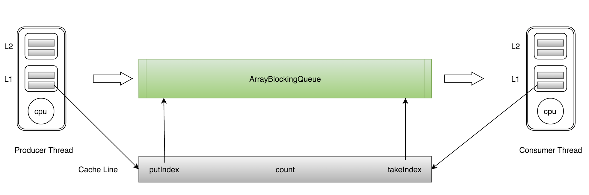
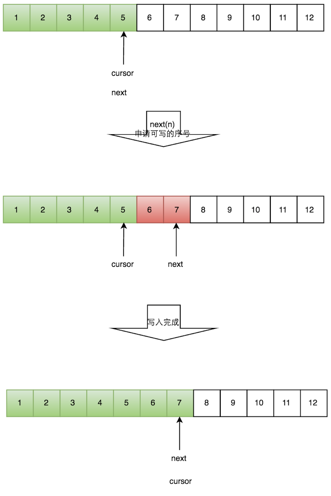
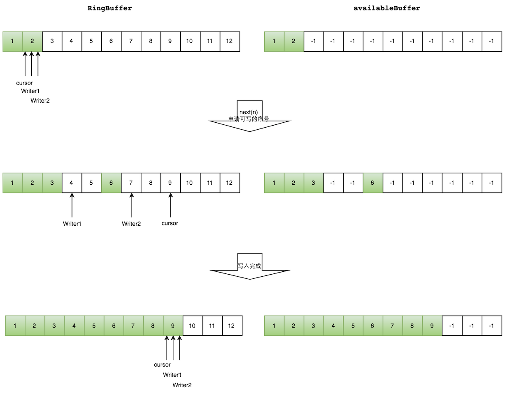

## 高性能队列——Disruptor

### ① 概述

Disruptor是英国外汇交易公司LMAX开发的一个高性能队列，研发的初衷是解决内部的内存队列的延迟问题，而不是分布式队列。基于Disruptor开发的系统单线程能支撑每秒600万订单，2010年在QCon演讲后，获得了业界关注。

> 传统队列存在的问题

|         队列          | 有界性 |  锁  | 结构 | 队列类型 |
| :-------------------: | :----: | :--: | :--: | :------: |
|  ArrayBlockingQueue   |  有界  | 加锁 | 数组 |   阻塞   |
|  LinkedBlockingQueue  |  可选  | 加锁 | 链表 |   阻塞   |
| ConcurrentLinkedQueue |  无界  | 无锁 | 链表 |  非阻塞  |
|  LinkedTransferQueue  |  无界  | 无锁 | 链表 |   阻塞   |
| PriorityBlockingQueue |  无界  | 加锁 |  堆  |   阻塞   |
|      DelayQueue       |  无界  | 加锁 |  堆  |   阻塞   |

队列的底层数据结构一般分成三种：**数组、链表和堆**。其中，**堆这里是为了实现带有优先级特性的队列**，暂且不考虑。
在稳定性和性能要求特别高的系统中，**为了防止生产者速度过快，导致内存溢出，只能选择有界队列**；同时，**为了减少Java的垃圾回收对系统性能的影响，会尽量选择array/heap格式的数据结构**。这样筛选下来，符合条件的队列就只有ArrayBlockingQueue。但是ArrayBlockingQueue是通过**加锁**的方式保证线程安全，而且ArrayBlockingQueue还存在**伪共享**问题，这两个问题严重影响了性能。

-----

**缓存行**

Cache是由很多个cache line组成的。每个cache line通常是64字节，并且它有效地引用主内存中的一块儿地址。一个Java的long类型变量是8字节，因此在一个缓

存行中可以存8个long类型的变量。

CPU每次从主存中拉取数据时，会把相邻的数据也存入同一个cache line。

在访问一个long数组的时候，如果数组中的一个值被加载到缓存中，它会自动加载另外7个。因此你能非常快的遍历这个数组。

**伪共享**

ArrayBlockingQueue有三个成员变量： - takeIndex：需要被取走的元素下标 - putIndex：可被元素插入的位置的下标 - count：队列中元素的数量

这三个变量很容易放到一个缓存行中，但是之间修改没有太多的关联。所以每次修改，都会使之前缓存的数据失效，从而不能完全达到共享的效果。



如上图所示，当生产者线程put一个元素到ArrayBlockingQueue时，putIndex会修改，从而导致消费者线程的缓存中的缓存行无效，需要从主存中重新读取。

这种无法充分使用缓存行特性的现象，称为伪共享。

对于伪共享，一般的解决方案是，增大数组元素的间隔使得由不同线程存取的元素位于不同的缓存行上，以空间换时间。

### ② 高性能的原因

Disruptor通过以下设计来解决队列速度慢的问题：

- 环形数组结构

  为了避免垃圾回收，采用数组而非链表。同时，数组对处理器的缓存机制更加友好。数组元素不会被回收，避免频繁的GC。

- 元素位置定位

  数组长度2^n，通过位运算，加快定位的速度。下标采取递增的形式。不用担心index溢出的问题。index是long类型，即使100万QPS的处理速度，也需要30万年才能用完。

- 无锁设计

  每个生产者或者消费者线程，会先申请可以操作的元素在数组中的位置，申请到之后，直接在该位置写入或者读取数据。采用CAS无锁方式，保证线程的安全性

> 环形数组

- 因为是数组，所以要比链表快，而且根据我们对上面缓存行的解释知道，数组中的一个元素加载，相邻的数组元素也是会被预加载的，因此在这样的结构中，cpu无需时不时去主存加载数组中的下一个元素。而且，你可以为数组预先分配内存，使得数组对象一直存在（除非程序终止）。这就意味着不需要花大量的时间用于垃圾回收。此外，不像链表那样，需要为每一个添加到其上面的对象创造节点对象—对应的，当删除节点时，需要执行相应的内存清理操作。环形数组中的元素采用覆盖方式，避免了jvm的GC。
- 其次结构作为环形，数组的大小为2的n次方，这样元素定位可以通过位运算效率会更高，这个跟一致性哈希中的环形策略有点像。在disruptor中，这个**环形结构就是RingBuffer**，既然是数组，那么就有大小，而且这个大小必须是2的n次方。
- 其**实质只是一个普通的数组，只是当放置数据填充满队列（即到达2^n-1位置）之后，再填充数据，就会从0开始，覆盖之前的数据，于是就相当于一个环**。

> 生产和消费模式

在Disruptor中生产者分为单生产者和多生产者，而消费者并没有区分。单生产者情况下，就是普通的生产者向RingBuffer中放置数据，消费者获取最大可消费

位置，并进行消费。而多生产者时候，又多出了一个跟RingBuffer同样大小的Buffer，称为AvailableBuffer。在多生产者中，每个生产者首先通过CAS竞争获取可

以写的空间，然后再进行慢慢往里放数据，如果正好这个时候消费者要消费数据，那么每个消费者都需要获取最大可消费的下标，这个下标是在AvailableBuffer进

行获取得到的最长连续的序列下标。

**单生产者**

生产者单线程写数据的流程比较简单：

1. 申请写入m个元素；
2. 若是有m个元素可以入，则返回最大的序列号。这儿主要判断是否会覆盖未读的元素；
3. 若是返回的正确，则生产者开始写入元素。



**多生产者**

Disruptor在多个生产者的情况下，引入了一个与Ring Buffer大小相同的buffer：available Buffer。当某个位置写入成功的时候，便把availble Buffer相应的位置置位，标记为写入成功。读取的时候，会遍历available Buffer，来判断元素是否已经就绪。

多个生产者写入的时候：

1. 申请写入m个元素；
2. 若是有m个元素可以写入，则返回最大的序列号。每个生产者会被分配一段独享的空间；
3. 生产者写入元素，写入元素的同时设置available Buffer里面相应的位置，以标记自己哪些位置是已经写入成功的。

如下图所示，Writer1和Writer2两个线程写入数组，都申请可写的数组空间。Writer1被分配了下标3到下表5的空间，Writer2被分配了下标6到下标9的空间。

Writer1写入下标3位置的元素，同时把available Buffer相应位置置位，标记已经写入成功，往后移一位，开始写下标4位置的元素。Writer2同样的方式。最终都写入完成。



**牛逼的下标指针**

```java
class LhsPadding
{
    protected long p1, p2, p3, p4, p5, p6, p7;
}

class Value extends LhsPadding
{
    protected volatile long value;
}

class RhsPadding extends Value
{
    protected long p9, p10, p11, p12, p13, p14, p15;
}

public class Sequence extends RhsPadding
{...}
```

RingBuffer的指针（Sequence）属于一个volatile变量，同时也是我们能够不用锁操作就能实现Disruptor的原因之一，而且通过缓存行补充，避免伪共享问题。 该所谓指针是通过一直自增的方式来获取下一个可写或者可读数据，该数据是Long类型，不用担心会爆掉。

### ③ demo

- 定义一个简单的消息体

  ```java
  /**
   * 消息体
   */
  @Data
  public class MessageModel {
      private String message;
  }
  ```

- 创建构造消息的工厂需要继承EventFactory  用于初始化RingBuffer

  ```java
  /**
   * 构造EventFactory 用于初始化RingBuffer
   */
  public class HelloEventFactory implements EventFactory<MessageModel> {
      // 初始化RingBuffer
      @Override
      public MessageModel newInstance() {
          return new MessageModel();
      }
  }
  ```

- 创建消费者

  ```java
  /**
   * 构造EventHandler-消费者
   */
  @Slf4j
  public class HelloEventHandler implements EventHandler<MessageModel> {
      @Override
      public void onEvent(MessageModel event, long sequence, boolean endOfBatch) {
          try {
              //这里停止1000ms是为了确定消费消息是异步的
              Thread.sleep(1000);
              log.info("消费者处理消息开始");
              if (event != null) {
                  log.info("消费者消费的信息是：{}",event);
              }
          } catch (Exception e) {
              log.info("消费者处理消息失败");
          }
          log.info("消费者处理消息结束");
      }
  }
  ```

- 配置Disruptor

  ```java
  /**
   * 配置Disruptor
   */
  @Configuration
  public class MQManager {
  
  
      @Bean("messageModel")
      public RingBuffer<MessageModel> messageModelRingBuffer() {
          // 定义用于事件处理的线程池， Disruptor通过java.util.concurrent.ExecutorService提供的线程来触发consumer的事件处理
          ExecutorService executor = Executors.newFixedThreadPool(2);
  
          // 指定事件工厂
          HelloEventFactory factory = new HelloEventFactory();
  
          // 指定RingBuffer字节大小，必须为2的N次方（通过位运算，加快定位的速度），否则将影响效率
          // 当放置数据填充满队列（即到达2^n-1位置）之后，再填充数据，就会从0开始，覆盖之前的数据
          int bufferSize = 4;
  
          // 单生产者模式，获取额外的性能
          // 创建disruptor方式一：使用自定义的线程池创建（已弃用）
          Disruptor<MessageModel> disruptor = new Disruptor<>(factory, bufferSize, executor,
                  ProducerType.SINGLE, new BlockingWaitStrategy());
  
          // 创建disruptor方式二：传入线程工厂
          // 生产者的线程工厂
  //        ThreadFactory threadFactory = Executors.defaultThreadFactory();
  //        Disruptor<MessageModel> disruptor = new Disruptor<>(factory, bufferSize, threadFactory,
  //                ProducerType.SINGLE, new BlockingWaitStrategy());
          // 设置事件业务处理器---消费者
          disruptor.handleEventsWith(new HelloEventHandler());
  
          // 启动disruptor线程
          disruptor.start();
  
          // 获取ringbuffer环，用于接取生产者生产的事件
          RingBuffer<MessageModel> ringBuffer = disruptor.getRingBuffer();
  
          return ringBuffer;
      }
  }
  ```

- 创建生产者生产消息

  ```java
  public interface DisruptorMqService {
  
      /**
       * 消息
       * @param message
       */
      void sayHelloMq(String message) throws InterruptedException;
  }
  
  
  
  
  @Slf4j
  @Service
  public class DisruptorMqServiceImpl implements DisruptorMqService {
  
      @Autowired
      private RingBuffer<MessageModel> messageModelRingBuffer;
  
      @Override
      public void sayHelloMq(String message) throws InterruptedException {
          for (int l = 0; true; l++) {
              log.info("record the message: {}", message);
              //获取下一个Event槽的下标
              long sequence = messageModelRingBuffer.next();
              log.info("sequence = {}", sequence);
              try {
                  //给Event填充数据
                  MessageModel event = messageModelRingBuffer.get(sequence);
                  event.setMessage(message + l);
                  log.info("往消息队列中添加消息：{}", event);
              } catch (Exception e) {
                  log.error("failed to add event to messageModelRingBuffer for : e = {},{}", e, e.getMessage());
              } finally {
                  //发布Event，激活观察者去消费，将sequence传递给改消费者
                  //注意最后的publish方法必须放在finally中以确保必须得到调用；如果某个请求的sequence未被提交将会堵塞后续的发布操作或者其他的producer
                  messageModelRingBuffer.publish(sequence);
              }
              Thread.sleep(5000);
          }
  
      }
  }
  ```

- 测试

  ```java
  @Autowired
  private DisruptorMqService disruptorMqService;
  
  /**
       * 项目内部使用Disruptor做消息队列
       *
       * @throws Exception
       */
  @Test
  public void sayHelloMqTest() throws Exception {
      disruptorMqService.sayHelloMq("消息到了，Hello world!");
      log.info("消息队列已发送完毕");
      // 这里停止2000ms是为了确定是处理消息是异步的
      Thread.sleep(2000);
  }
  ```

  

## 